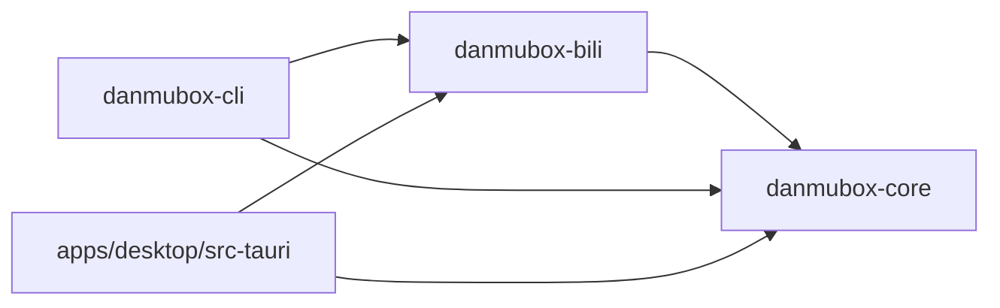

# AGENT.md — danmubox AI 编码 agent 作业规范

> 定位：面向参与本仓库的 AI 编码 agent 的强制作业规范。
> 读者：任何被指派在 danmubox 仓库中读写文件、执行命令的 agent。
> 更新时机：目录结构、构建命令、代码风格、提交格式、文档同步规则、DoD 任一变化时。

## 1. 适用范围

- 本文件对仓库内所有 agent 生效，优先级高于任何任务描述中的临时说法。
- 规范内容与 `README.md`、`docs/` 冲突时，以本文件与 `docs/` 中的契约文档为准，并立即修正 `README.md`。
- 常量、领域模型、端口（trait）、IPC 命令与事件、本地文件契约、偏好键为**规范性**内容，
  唯一权威来源是 [`docs/contract.md`](docs/contract.md)；只能原样引用，不得改名或改语义。
  其它文档中出现的「基线契约 §x」均指该文件。
- 需求本身以 [`REQUIREMENTS.md`](REQUIREMENTS.md) 为准（用户手写，随时可能修改）；契约负责把需求翻译成工程约定。

## 2. 仓库结构与依赖方向

```text
danmubox/
  Cargo.toml                # Rust workspace
  rust-toolchain.toml
  crates/
    danmubox-core/          # 领域模型 + 端口(trait) + 事件总线 + 会话编排 + 本地文件
    danmubox-bili/          # B 站适配器：实现 core 的端口
    danmubox-cli/           # 调试与校验入口
  apps/
    desktop/                # Tauri 2 应用：src-tauri/ + ui/（React + TS + Vite）
  docs/
    contract.md
    decisions/
  REQUIREMENTS.md
  README.md
  AGENT.md
  CHANGELOG.md
```

依赖方向（单向，不可违反）：



| 规则 | 说明 |
|---|---|
| `bili → core` | `danmubox-bili` 实现 core 定义的端口；方向单向 |
| `cli` / `desktop → core + bili` | 上层消费面同时依赖领域层与适配层 |
| `core` 无 UI 依赖 | 不得依赖 `tauri`、不得依赖任何前端运行时 |
| `core` 不得依赖 `bili` | 不得依赖任何具体上游实现，也不得依赖上层 crate |
| **上游隔离** | `core` 中不得出现 B 站 URL、字段下标、签名算法、protobuf 定义、二维码流程 |
| `bili` 唯一出口 | 上述 B 站细节一律只出现在 `danmubox-bili`；逆向或协议变更只改 bili |
| 上层互不依赖 | `cli` 与 `apps/desktop` 之间不互相依赖；共享逻辑下沉到 `core` |
| 平台代码隔离 | `#[cfg(target_os = ...)]` 分支尽量收在 `core` 的薄适配层内 |

## 3. 构建 / 测试 / lint 命令（规划值）

仓库目前只有文档，`Cargo.toml` 与前端工程尚未创建，以下命令均为**规划值**，
落地时以实际 scaffold 结果为准，并同步更新本节与 `README.md`。**不得**把规划值描述为已验证可用。

| 用途 | 规划命令 |
|---|---|
| 全量编译检查 | `cargo check --workspace` |
| 全量测试 | `cargo test --workspace` |
| core 单 crate 测试 | `cargo test -p danmubox-core` |
| bili 单 crate 测试 | `cargo test -p danmubox-bili` |
| 格式检查 | `cargo fmt --all -- --check` |
| 格式修复 | `cargo fmt --all` |
| Lint | `cargo clippy --workspace --all-targets -- -D warnings` |
| 前端依赖安装 | `npm --prefix apps/desktop install` |
| 前端类型检查 | `npm --prefix apps/desktop run typecheck` |
| 前端构建 | `npm --prefix apps/desktop run build` |
| 桌面端开发 | `npm --prefix apps/desktop run dev` |
| 跑 CLI | `cargo run -p danmubox-cli -- <子命令>` |

环境变量：`DANMUBOX_LOG`（默认 `info`）。

## 4. Rust 风格

| 项 | 要求 |
|---|---|
| 格式化 | 一律 `rustfmt`，不接受手工排版；提交前跑 `cargo fmt --all` |
| Lint | `cargo clippy --workspace --all-targets -- -D warnings` 必须零告警 |
| 错误 | 库层用 `thiserror` 定义结构化错误，`anyhow` 仅限 bin / 测试 |
| 异步 | `tokio`；禁止在 async 上下文里做阻塞 IO 或 `std::thread::sleep` |
| 命名 | crate / 模块 snake_case，类型 CamelCase，常量 SCREAMING_SNAKE_CASE |
| 注释 | 解释「为什么」，不复述代码；对外 API 必须有 doc comment |
| 数值 | 时间统一 UTC 毫秒 `i64`；不引入本地时区换算 |
| 依赖 | 新增依赖必须说明理由并评估体积；能用标准库或已有依赖就不新增 |
| 公开面 | `pub` 项尽量收窄；跨 crate 只在 `core` 暴露必要的领域 API 与端口，B 站实现细节留在 `bili` |
| 协议解析 | protobuf 用 `prost`，且只允许出现在 `danmubox-bili`；`core` 不引用任何上游 schema |

## 5. 提交信息格式

采用 Conventional Commits，scope 用 crate 或目录短名：

```text
<type>(<scope>): <简短描述>

<可选正文：动机、影响面、迁移说明>
```

| 字段 | 取值 |
|---|---|
| `type` | `feat` / `fix` / `docs` / `refactor` / `test` / `chore` / `perf` |
| `scope` | `core` / `bili` / `cli` / `desktop` / `ui` / `docs` / `workspace` |
| 描述 | 中文或英文皆可，动词开头，不加句号，不超过 72 字符 |

示例：`feat(bili): 增加 op=5 子包递归拆分`、`docs(protocol): 补充 HTTP 心跳说明`。
正文中引用文档时写相对路径，例如 `docs/protocol.md`。

## 6. 文档与代码同步规则

| 场景 | 必须同步的文档 |
|---|---|
| 新增 / 重命名 crate | `README.md` §6、`AGENT.md` §2、`docs/architecture.md`、`docs/contract.md` §3 |
| 改协议常量（包头 / op / protover / WS 与 HTTP 心跳 / 退避 / 解压上限 / 节流） | `docs/protocol.md`、`docs/contract.md` §6、`README.md`、必要时新增 ADR |
| 新增 / 改端口或端口方法 | `docs/contract.md` §3、`docs/architecture.md`；若暴露为 IPC，同时改 `docs/ipc.md` |
| 新增 / 改 IPC 命令或事件 | `docs/ipc.md`、`docs/contract.md` §7 |
| 改领域模型字段或 `kind` 取值 | `docs/contract.md` §5、`docs/protocol.md`、`docs/ipc.md`、`docs/ui.md` |
| 改偏好键 / 默认值 | `docs/contract.md` §8、`docs/ui.md`、`docs/ipc.md` |
| 改 `config.toml` 字段或权限 | `docs/contract.md` §4.1、`docs/auth.md`、`docs/operations.md` |
| 改数据目录 / 日志级别 / 缓冲上限等常量 | `docs/contract.md` §4、`README.md` §9、`docs/operations.md` |
| 改前端栈或状态管理 | `docs/ui.md`、`docs/ipc.md`、`docs/decisions/` 中对应 ADR |
| 任何对外可见行为变化 | `CHANGELOG.md` 的 Unreleased 段 |

规则：**先改文档、再改代码，或同一次提交内一起改**。文档与代码不一致视同构建失败。

## 7. 操作清单

### 7.1 新增 crate

1. 确认它确实不能并入现有 crate；能并入就不新建。
2. 在 `crates/` 下创建目录，crate 名以 `danmubox-` 为前缀。
3. 在 workspace `Cargo.toml` 的 members 中登记，统一继承 `edition` / `version` / 依赖版本策略。
4. 声明依赖方向：只允许依赖 `danmubox-core`；需要 B 站能力时依赖 `danmubox-bili`，
   禁止让 `core` 反向依赖它，也禁止上层 crate 之间横向依赖。
5. 在 `README.md` §6 目录结构、`AGENT.md` §2、`docs/architecture.md` 依赖图中补上。
6. 若引入新的共享常量，同步 `docs/contract.md` 对应章节与相关文档，必要时新增 ADR 并更新 ADR 索引。

### 7.2 新增 IPC 命令

1. 先在 `danmubox-core` 中定义领域能力与端口，`danmubox-bili` 实现；IPC 层只做参数校验与转发。
2. 在 `src-tauri` 中注册命令，函数名用 snake_case，与命令名一致。
3. 参数与返回值用契约 §5 的领域模型结构，JSON 侧 `snake_case`；前端 store 内部再转 camelCase。
4. **必经一步**：在 `docs/contract.md` §7 命令表与 `docs/ipc.md` 补命令签名（参数、返回、可能的错误）。
   命令只在这两处登记，AGENT 不另立清单；`profiles_list` / `profiles_switch` / `rooms_reconnect` 等既有命令同样只在此维护。
5. 检查事件方向是否需要配对事件，需要时同步契约 §7 与 `docs/ipc.md` 的事件清单。
6. 不得把 B 站 URL、字段下标或签名细节带进命令参数或返回值；上游差异由 `bili` 归一化。

### 7.3 新增端口或端口方法

1. 在 `danmubox-core` 定义 trait 与领域类型，签名只使用 core 的类型，不得出现任何 B 站字段。
2. 在 `danmubox-bili` 实现该 trait；URL、字段名、下标、签名、二维码流程、protobuf 全部留在 bili。
3. 在 `docs/contract.md` §3 端口表补一行，并在 `docs/architecture.md` 的依赖图与职责表同步。
4. 若该方法需暴露给 UI，登记 IPC 命令到 `docs/contract.md` §7 与 `docs/ipc.md`（见 §7.2）。
5. 若引入新的共享常量（超时、心跳、节流、上限），同步 `docs/contract.md` §4 与对应文档，必要时新增 ADR。
6. 端口不得假设消费方是 UI：新能力一律经端口暴露，保持消费方无关性。

## 8. 禁止事项

| # | 禁止 |
|---|---|
| 1 | 把 `SESSDATA`、`bili_jct`、`DedeUserID` 写入日志、前端明文、仓库文件或崩溃上报 |
| 2 | 改动协议常量（包头 / op / protover / 心跳间隔 / 退避序列 / 解压上限）而不更新文档 |
| 3 | 把 B 站细节写进 `core`：URL、字段下标、签名算法、protobuf 定义、二维码流程 |
| 4 | 跨层依赖：`core` 依赖 `tauri`、依赖 `bili` 或任何上层 crate；上层 crate 之间互相依赖 |
| 5 | 在 `core` 中引入 UI 类型、窗口句柄、前端框架相关代码 |
| 6 | 把凭据写进 `prefs.json`，或把界面偏好写进 `config.toml` |
| 7 | 为未实测的 B 站行为编造具体数值；只能以「待实测校准」表格承载并写明核对方法 |
| 8 | 提交未完成的空壳实现 / 空实现 / 假 fallback / 被注释掉的死代码 |
| 9 | 在未知认证回应 `code` 上臆造含义；非 0 一律按认证失败处理 |
| 10 | 私自扩大范围：加遥测、加保活、加视频解码、加应用商店配置 |
| 11 | 执行 git 历史改写、删除非本人产出的代码或文档 |
| 12 | 重新引入本地数据库、弹幕落盘、回看或导出（见 `docs/decisions/0005-no-local-database.md`） |
| 13 | 启动任何本地监听服务（HTTP / SSE / 进程外接口） |

## 9. DoD 验收清单

任务完成前逐项自检，全部满足才可交付：

- [ ] 改动范围与任务描述一致，没有顺带重构无关文件。
- [ ] `cargo fmt --all -- --check` 通过。
- [ ] `cargo clippy --workspace --all-targets -- -D warnings` 零告警。
- [ ] `cargo test --workspace` 通过；新增行为有对应验证。
- [ ] 前端改动通过类型检查，且在 Tauri 应用内目视确认实际界面。
- [ ] 端口边界未被破坏：`core` 仍可独立编译，不依赖 `bili` / `tauri` / 任何上层 crate，且 core 中无 B 站 URL、字段下标、签名或 protobuf。
- [ ] `config.toml` 以 0600 权限写入且只含凭据；界面偏好只落 `prefs.json`；凭据未进日志 / 前端 / 仓库。
- [ ] 弹幕缓冲遵守会话语义：只保留当前房内会话、上限 `history.buffer_rows`、离开房间即销毁。
- [ ] 规范性常量、领域模型、端口、IPC 与偏好键与 `docs/contract.md` 一致。
- [ ] 受影响的 `docs/` 文档已同步更新，相对路径可点击。
- [ ] `CHANGELOG.md` 的 Unreleased 段已记录对外可见变化。
- [ ] 未新增任何非 Markdown 的文档外文件；无遗留临时脚本。
- [ ] 提交信息符合 §5 格式。

## 10. 快速索引

| 需要什么 | 去哪看 |
|---|---|
| 需求基线 | `REQUIREMENTS.md` |
| 规范性契约（唯一事实源） | `docs/contract.md` |
| 项目边界与状态 | `README.md` |
| 分层与并发模型 | `docs/architecture.md` |
| 协议细节 | `docs/protocol.md` |
| 登录与凭据 | `docs/auth.md` |
| IPC 契约 | `docs/ipc.md` |
| 界面规范 | `docs/ui.md` |
| 为什么这样选 | `docs/decisions/` |
| 排期与验收 | `docs/roadmap.md` |
