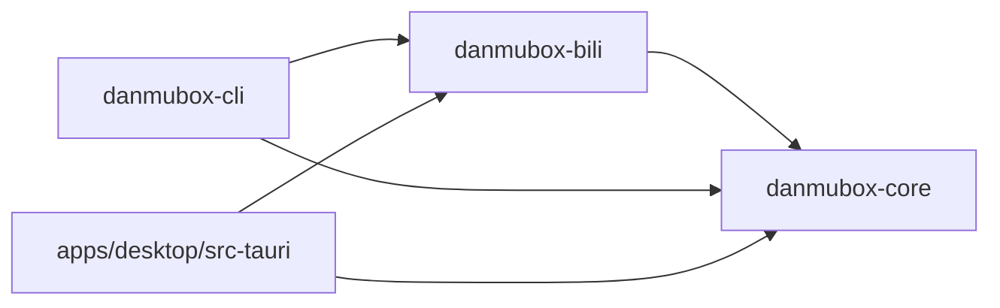

# AGENT.md — danmubox AI 编码 agent 作业规范

## 1. 适用范围

- 本文件对仓库内所有 agent 生效，优先级高于任何任务描述中的临时说法。
- 规范内容与 `README.md`、`docs/` 冲突时，以本文件与 `docs/` 中的契约文档为准，并立即修正 `README.md`。
- 常量、领域模型、端口（trait）、IPC 命令与事件、本地文件契约、偏好键为**规范性**内容，
  唯一权威来源是 [`docs/contract.md`](docs/contract.md)；只能原样引用，不得改名或改语义。
  其它文档中出现的「基线契约 §x」均指该文件。
- 需求本身以 [`REQUIREMENTS.md`](REQUIREMENTS.md) 为准（用户手写，随时可能修改）；契约负责把需求翻译成工程约定。

## 2. 仓库结构与依赖方向

```text
danmubox/
  Cargo.toml                # Rust workspace
  rust-toolchain.toml
  crates/
    danmubox-core/          # 领域模型 + 端口(trait) + 事件总线 + 会话编排 + 本地文件
    danmubox-bili/          # ac站适配器：实现 core 的端口
    danmubox-cli/           # 调试与校验入口
  apps/
    desktop/                # Tauri 2 应用：src-tauri/ + ui/（React + TS + Vite）
      src-tauri/gen/android/ # Tauri 生成的 Android 工程：**要入库**（见下）
  scripts/
    android-env.sh          # 仓库内 Android 工具链：bootstrap / source / clean（`docs/operations.md` §5）
  docs/
    architecture.md         # 分层、端口/适配器、并发、本地文件、可观测性
    auth.md                 # 登录、凭据、WBI 签名、扫码状态机
    contract.md             # 规范性契约（唯一事实源）
    ipc.md                  # Tauri 命令与事件
    operations.md           # 运维、排障、三端构建分发
    protocol.md             # ac站协议规格（附录 A 唯一校准表）
    roadmap.md              # 下期 backlog 与风险
    testing.md              # 测试策略与冒烟
    ui.md                   # 前端规格
  REQUIREMENTS.md
  README.md
  AGENT.md
  CHANGELOG.md
```

- `apps/desktop/src-tauri/gen/android/` 是 **Tauri 生成的工程，但按「长期维护的源码」入库**（40 个文件；根 `.gitignore` 只忽略每次构建都会重生的 `gen/schemas/`）。本仓库在其中改过三处（`BuildTask.kt` 的 CLI 解析、`app/build.gradle.kts` 的 `signingConfigs`、`MainActivity.kt` 的系统栏 inset 下发），**重跑 `tauri android init` 会覆盖它们**——细节与原因见 `docs/operations.md` §5.3。`keystore.jks` / `keystore.properties` 由 `gen/android/.gitignore` 忽略，**永不入库**。
- `scripts/android-env.sh` 把 Android 工具链装进仓库内的 `.android-env/`（已忽略，可整包删除）；宿主侧不装任何东西，理由见 `CHANGELOG.md` 归档区（原 `docs/decisions/0009-in-repo-android-toolchain.md`）。

依赖方向（单向，不可违反）：



| 规则 | 说明 |
|---|---|
| `bili → core` | `danmubox-bili` 实现 core 定义的端口；方向单向 |
| `cli` / `desktop → core + bili` | 上层消费面同时依赖领域层与适配层 |
| `core` 无 UI 依赖 | 不得依赖 `tauri`、不得依赖任何前端运行时 |
| `core` 不得依赖 `bili` | 不得依赖任何具体上游实现，也不得依赖上层 crate |
| **上游隔离** | `core` 中不得出现 ac站 URL、字段下标、签名算法、protobuf 定义、二维码流程 |
| `bili` 唯一出口 | 上述 ac站细节一律只出现在 `danmubox-bili`；逆向或协议变更只改 bili |
| 上层互不依赖 | `cli` 与 `apps/desktop` 之间不互相依赖；共享逻辑下沉到 `core` |
| 平台代码隔离 | `#[cfg(target_os = ...)]` 分支尽量收在 `core` 的薄适配层内 |

## 3. 构建 / 测试 / lint 命令

Rust 侧四个 crate（`core` / `bili` / `cli` / `desktop`）与前端均已落地，下表命令**均已验证可用**。

| 用途 | 命令 |
|---|---|
| 全量编译检查 | `cargo check --workspace` |
| 全量测试 | `cargo test --workspace` |
| core 单 crate 测试 | `cargo test -p danmubox-core` |
| bili 单 crate 测试 | `cargo test -p danmubox-bili` |
| 格式检查 | `cargo fmt --all -- --check`（**提交门**；全仓已于 2026-09-17 一次性格式化，见 §9） |
| 格式修复 | `cargo fmt --all` |
| Lint（Rust） | `cargo clippy --workspace --all-targets -- -D warnings` |
| Lint（前端） | `npm --prefix apps/desktop/ui run lint`（= `oxlint --deny-warnings`，**告警即失败**；规则集与逐条放行理由在 `apps/desktop/ui/.oxlintrc.json`） |
| 解析房间（CLI） | `cargo run -p danmubox-cli -- resolve <房间号/短号/URL>` |
| 看弹幕（CLI） | `cargo run -p danmubox-cli -- watch <房间> --seconds 60` |
| 登录态（CLI） | `cargo run -p danmubox-cli -- session` |
| 扫码登录/新增账号（CLI） | `cargo run -p danmubox-cli -- login [账号名]`（不带 = 新增账号；带 = 给该账号重新登录） |
| 账号列表 / 切号 / 增删（CLI） | `cargo run -p danmubox-cli -- accounts [--use <名字>] [--create] [--remove <名字>]` |
| 登出（CLI） | `cargo run -p danmubox-cli -- logout [账号名]`（缺省 = 当前账号；账号条目保留） |
| 发弹幕（CLI） | `cargo run -p danmubox-cli -- send <房间> "内容"`（需登录；`--emote <唯一键>` 发表情弹幕） |
| 只读核对（CLI） | `cargo run -p danmubox-cli -- wallet` / `follow` / `emotes <房间>` / `emotes-owned` / `admin-lists <房间>` |
| 指定另一份配置 | 任何 CLI 子命令加 `--config <路径>`（全局参数） |
| 前端依赖安装 | `npm --prefix apps/desktop/ui install` |
| 前端类型检查 + 构建 | `npm --prefix apps/desktop/ui run build`（= `tsc -b && vite build`） |
| 前端单测（显示层纯逻辑） | `cd apps/desktop/ui && node --test src/filtering.test.ts`（Node ≥ 22.18 的类型擦除直接跑 TS，仓库未装 vitest；**新增显示层纯逻辑用例按这个形态落**，写法见 `docs/testing.md` §9） |
| 前端 dev server | `npm --prefix apps/desktop/ui run dev`（仅热重载开发需要；独立产物已内嵌前端，不需要它） |
| 桌面端运行 | `cargo run -p danmubox-desktop` |
| Android 环境（导入） | `. scripts/android-env.sh`（**必须 source**，直接执行无效；导出全部指向仓库内 `.android-env/` 的变量） |
| Android 工具链安装 / 清除 | `scripts/android-env.sh bootstrap`（从零安装，可重复执行）、`scripts/android-env.sh clean`（停 gradle daemon 与 adb server 后删除整个 `.android-env`；**签名材料不在其中**） |
| Android 出包 | `cd apps/desktop && CI=true ./ui/node_modules/.bin/tauri android build --apk --ci`（分 ABI 再加 `--split-per-abi`） |

Android 产物：`apps/desktop/src-tauri/gen/android/app/build/outputs/apk/universal/release/app-universal-release.apk`（通用）与同目录 `apk/<arm64|arm|x86|x86_64>/release/app-<abi>-release.apk`（分 ABI）；**未签名包**（缺 `keystore.properties` 的构建）装不进设备。前置条件、签名与清除口径见 [`docs/operations.md`](docs/operations.md) §5.3–§5.7、§5.12。

**Android 构建前必须先 `. scripts/android-env.sh`（「不污染宿主」口径的一部分，2026-09-16 实测踩过）**：它会把 `RUSTUP_HOME` / `CARGO_HOME` 一起指向仓库内的 `.android-env/`；**漏掉这一步直接跑 `tauri android build`**，`rustup` 会转去宿主 `~/.rustup` 找 `rust-std`，实测后果是**构建卡住 4 分多钟**、并在 `$HOME` 落下一份约 **7MB 的 `.partial`**（当次已清理，事后复核宿主 `~/.rustup` 里**没有**被塞入 android std 目录：`toolchains/*/lib/rustlib/` 下 android 目录数为 0）。

环境变量：`DANMUBOX_LOG`（默认 `info`；`debug` 会输出每条业务载荷的原文，是字段校准的采集入口）。

**多 worktree 并行时的 target 目录口径（用户 2026-09-16 定，硬要求）**：每个 worktree 一律用**自己**的
`CARGO_TARGET_DIR=$PWD/target`，**不得共享**（也不要用 `--target-dir` 指到别处凑一个共享目录）。实测共享会让不同
worktree 的构建产物互相覆盖 —— 表现是**假绿 / 假红**（某个分支的 crate 被另一个分支的同名产物顶掉，测试过了但过的不是本分支的代码），
这种失败极难自查。前端同理：每个 worktree 自己 `npm install` / `npm run build`，不共用 `node_modules` 与 `dist`。

**合并前先看索引（2026-09-21 实测踩过两次）**：`git merge` 会把索引里**已暂存、但与本次合并无关**的路径一并写进合并提交。若工作区里有别人（或用户）已 `git add` 的文件，合并前必须先把它们让开（`git reset -- <路径>`），合完再按需还原 —— 否则那些文件会被悄悄提交进你的合并提交里，若还推了远端就等于把不该入库的内容（例如带他人昵称的截图）发进了公开仓库，只能靠重写历史 + 强推来收场。

新增或改变命令时，必须同时更新本节与 `README.md` §8；**不得**把未验证的命令写成已验证。

## 4. Rust 风格

| 项 | 要求 |
|---|---|
| 格式化 | 一律 `rustfmt`，不接受手工排版；提交前跑 `cargo fmt --all` |
| Lint | `cargo clippy --workspace --all-targets -- -D warnings` 必须零告警 |
| 错误 | 库层用 `thiserror` 定义结构化错误，`anyhow` 仅限 bin / 测试 |
| 异步 | `tokio`；禁止在 async 上下文里做阻塞 IO 或 `std::thread::sleep` |
| 命名 | crate / 模块 snake_case，类型 CamelCase，常量 SCREAMING_SNAKE_CASE |
| 注释 | 解释「为什么」，不复述代码；对外 API 必须有 doc comment |
| 数值 | 时间统一 UTC 毫秒 `i64`；不引入本地时区换算 |
| 依赖 | 新增依赖必须说明理由并评估体积；能用标准库或已有依赖就不新增 |
| 公开面 | `pub` 项尽量收窄；跨 crate 只在 `core` 暴露必要的领域 API 与端口，ac站实现细节留在 `bili` |
| 协议解析 | protobuf 用 `prost`，且只允许出现在 `danmubox-bili`；`core` 不引用任何上游 schema |

## 5. 提交信息格式

采用 Conventional Commits，scope 用 crate 或目录短名：

```text
<type>(<scope>): <简短描述>

<可选正文：动机、影响面、迁移说明>
```

| 字段 | 取值 |
|---|---|
| `type` | `feat` / `fix` / `docs` / `refactor` / `test` / `chore` / `perf` |
| `scope` | `core` / `bili` / `cli` / `desktop` / `ui` / `docs` / `workspace` |
| 描述 | 中文或英文皆可，动词开头，不加句号，不超过 72 字符 |

示例：`feat(bili): 增加 op=5 子包递归拆分`、`docs(protocol): 补充 HTTP 心跳说明`。
正文中引用文档时写相对路径，例如 `docs/protocol.md`。

## 6. 文档与代码同步规则

| 场景 | 必须同步的文档 |
|---|---|
| 新增 / 重命名 crate | `README.md` §6、`AGENT.md` §2、`docs/architecture.md`、`docs/contract.md` §3 |
| 改协议常量（包头 / op / protover / WS 与 HTTP 心跳 / 退避 / 解压上限 / 节流） | `docs/protocol.md`、`docs/contract.md` §6、`README.md`；新决策按 §6.5.4 记入当次提交的 `CHANGELOG.md` |
| 新增 / 改端口或端口方法 | `docs/contract.md` §3、`docs/architecture.md`；若暴露为 IPC，同时改 `docs/ipc.md` |
| 新增 / 改 IPC 命令或事件 | `docs/ipc.md`、`docs/contract.md` §7 |
| 改领域模型字段或 `kind` 取值 | `docs/contract.md` §5、`docs/protocol.md`、`docs/ipc.md`、`docs/ui.md` |
| 改偏好键 / 默认值 | `docs/contract.md` §8、`docs/ui.md`、`docs/ipc.md` |
| 改 `config.toml` 字段或权限 | `docs/contract.md` §4.1、`docs/auth.md`、`docs/operations.md` |
| 改数据目录 / 日志级别 / 缓冲上限等常量 | `docs/contract.md` §4、`README.md` §9、`docs/operations.md` |
| 改 Android 构建步骤 / 签名 / 工具链脚本 | `docs/operations.md` §5（含 `scripts/android-env.sh` 的用法与产物路径）、`README.md` §8、`AGENT.md` §2/§3 |
| 改前端栈或状态管理 | `docs/ui.md`、`docs/ipc.md`；既有选型依据见 `CHANGELOG.md` 归档区（原 ADR 0008），新决策按 §6.5.4 |
| 任何对外可见行为变化 | `CHANGELOG.md` 的 Unreleased 段 |

规则：**先改文档、再改代码，或同一次提交内一起改**。文档与代码不一致视同构建失败。

上游直播平台的称呼：**正文与注释里一律写作 `ac站`**（公开仓降低可搜索性），新写的文档 / 注释照此办理。只有五类可以保留原名：
URL 与主机名、代码标识符与字符串字面量（含 `bilibili.live.gift.v1` 这类上游 protobuf 包名）、界面实际渲染的文案、
第三方项目与库名（如 `bilibili-API-collect` / `bilibili-api` —— 改名字等于伪造引文）、`smoke/fixtures/**` 里来自上游的夹具值。
**这五类之外没有别的例外**：不要为了让搜索干净而去改夹具、冒烟断言或第三方库名（2026-09-18 与用户逐条确认：界面与终端里那几处提示文案、
以及 `issue` 里未提交的第三方库名，一律保持原样）。

## 6.5 文档体系

### 6.5.1 文档登记表

| 文档 | 作用 | 读者 | 更新时机 |
|---|---|---|---|
| `README.md` | ac站直播间弹幕客户端（自用不发布），面向三端的聊天框式弹幕工具。 | 项目作者本人，以及被指派参与本仓库编码的 AI agent。 | 项目边界、技术栈、目录结构、文档清单或对外声明发生变化时。 |
| `AGENT.md` | 面向参与本仓库的 AI 编码 agent 的强制作业规范。 | 任何被指派在 danmubox 仓库中读写文件、执行命令的 agent。 | 目录结构、构建命令、代码风格、提交格式、文档同步规则、DoD 任一变化时。 |
| `REQUIREMENTS.md` | 本项目的**唯一需求来源**，由项目作者手写维护；工程约定由 [`docs/contract.md`](docs/contract.md) 从本文翻译而来，逐条对应见其 §9 需求溯源。 | 项目作者；以及任何需要确认「这个功能到底做不做」的实现者与 AI 编码 agent。 | 增删或修改需求时。需求变更后必须同步 [`docs/contract.md`](docs/contract.md) 的 §9 需求溯源。 |
| `CHANGELOG.md` | 项目的对外可见变更流水，按版本倒序排列。 | 项目作者本人，以及被指派参与本仓库的 AI agent。 | 任何对外可见的行为、契约、文档基线或发布策略发生变化时；随改动同一次提交写入 `Unreleased`。 |
| `docs/contract.md` | 本项目全部共享约定（命名、共享常量、领域模型、端口边界、IPC 与本地文件契约、写作要求）的唯一权威来源。 | 所有实现者与 AI 编码 agent；动手写代码前必须先把本文读完。 | 任何共享常量、模型、接口或数据结构变更，必须先改本文，再改代码与派生文档。 |
| `docs/protocol.md` | `danmubox-bili` 协议层（proto / ws）的实现依据，规定与 ac站直播弹幕长连接交互的二进制帧格式、认证与双心跳、业务命令归一化、发送侧被吞判定、重连状态机与风控边界。 | 协议层与适配器实现者；排查「连不上 / 收不到弹幕 / 字段为空 / 频繁重连 / 发弹幕被吞」的维护者；需要理解消息来源与语义的 AI agent 使用者。 | 头部布局、`op` / `protover` 语义、认证包或心跳包体、HTTP 心跳地址、`cmd` 与 `kind` 映射、发送判定规则、重连与节流参数发生任何变化时；附录 A 任一「待实测校准」项完成核对并回填结论后。 |
| `docs/auth.md` | danmubox 与 ac站之间的身份、凭据、签名与失效处理规范，是 `core` 的 `AuthProvider` 端口、`danmubox-bili` 的鉴权实现及所有上层消费面的唯一权威说明。 | 实现 `danmubox-bili` 鉴权/协议适配的 Rust 工程师、接 `account_*` 与 `session_status` IPC 的前端作者、审阅凭据落盘方式与安全红线的评审者。 | ac站登录接口或扫码状态码变更、WBI 签名算法或置换表变更、Cookie 字段集合变更、`config.toml` 字段或权限约定变更、安全红线调整时。 |
| `docs/architecture.md` | danmubox 的分层、crate 依赖方向、端口/适配器边界、并发模型、本地文件与可观测性总览，回答「代码放哪一层、数据怎么流动、进程怎么起停」。 | 实现与评审 `danmubox-core` / `danmubox-bili` 的开发者、排查连接与性能问题的维护者、需要判断改动落点的 AI 编码 agent。 | 新增或删除 crate、调整 core 的模块边界、改变并发与背压策略、增删端口、改动本地文件形态、改动启动/关闭序列或脱敏规则时，必须同步修改本文；契约 §3 / §4 / §6 变更时本文必须跟随。 |
| `docs/ipc.md` | 前端与 Rust 引擎之间唯一的命令/事件契约——命令签名、载荷类型、事件集合、Zustand store 形状与乐观发送规则。 | 写 React/TS 前端的开发者、在 `apps/desktop/src-tauri` 增加命令的 Rust 开发者、需要判断「一处改动要同步几个文件」的 AI 编码 agent。 | 新增/删除/改名的命令或事件、改动任何载荷字段、改动 store 形状或乐观发送规则时，必须同步修改本文。 |
| `docs/ui.md` | 定义弹幕客户端前端的导航结构、房间页布局、连接状态与手动刷新、消息与身份徽标渲染、礼物类消息的两枚显示开关与独立礼物栏、输入区与表情面板、举报入口、虚拟列表与滚动、过滤与样式。 | 前端实现者（React + TS）、负责 IPC 与数据层对接的 Rust 侧、验收者。 | 新增/修改 IPC 命令或事件（`ipc.md`）、新增 `kind`、调整过滤求值顺序、调整偏好键用法、调整布局断点或待实测校准项时。 |
| `docs/testing.md` | 定义 danmubox 的测试策略——测试金字塔各层范围、协议 fixture、会话缓冲语义、发送结果判定、本地文件、端口层契约、回放、前端与三端手工冒烟，以及明确不测的边界。 | 编写与修改代码的 AI 编码 agent、执行验收的项目所有者、以及排查回归的人。 | 新增协议 `cmd`、会话缓冲或发送结果语义变化、偏好键或 IPC 命令变化、冒烟清单步骤变化时必须同步修改本文。 |
| `docs/operations.md` | danmubox 的日常启动停止、数据文件位置、凭据文件维护、故障排查、三端构建分发与卸载清理。 | 日常使用与排障的仓库所有者本人；需要读取应用数据目录或在本机出包的维护者。 | 新增/更名环境变量、数据目录或文件名变化、新增 IPC 命令、新增卸载残留位置、新增目标平台或打包步骤时必须同步本文。 |
| `docs/roadmap.md` | 把阶段划分与下期 backlog 收在一处；阶段 1–4 的交付物、验收标准与退出记录见 [`CHANGELOG.md`](CHANGELOG.md)，本文不重复。 | 项目所有者、参与实现的 AI 编码 agent。 | 阶段状态变化、下期 backlog 或风险表变化时。 |

唯一事实源是 [`docs/contract.md`](docs/contract.md)（命名、常量、领域模型、端口、IPC 命令与事件、本地文件契约、偏好键、协议要点）；面向人的索引见 [`README.md`](README.md) §7。上表是「作用 / 读者 / 更新时机」的唯一登记处：各文档正文不再自述这三行，也不再写「与其他文档的关系 / 相关文档 / 文档索引」小节，分工一律查上表。

### 6.5.2 写作要求（强制）

1. 正文中文，标识符/技术名词保留英文。
2. 定位 / 读者 / 更新时机三行只在 §6.5.1 的表里登记一份，文档正文不自述（原「文件开头三行引言块」写法作废）。
3. 表格优先于长段落；接口、字段、常量必须用表格或代码块。
4. **禁止**出现 `TODO`、`待补充`、`占位`、`XXX` 之类空壳；对 ac站未实测的事实不得凭空编造具体数值。
5. 约束文档只写约束开发行为的内容：规范性陈述、取值与契约、判据与流程、指针（章节引用与 `path:line`）、一行需求溯源。文档体系自身的说明（定位、写法要求、文档关系、索引、本轮改了什么）集中在本节；决策过程按 §6.5.4 归档。
6. 唯一的「待实测校准」表在 [`docs/protocol.md`](docs/protocol.md) 附录 A，其它文档不自建。

### 6.5.3 文档清单

| 文件 | 状态 |
|---|---|
| `REQUIREMENTS.md` | 需求基线（用户手写） |
| `README.md` / `AGENT.md` / `CHANGELOG.md` | 本期 |
| `docs/contract.md` | 规范性契约（唯一事实源） |
| `docs/protocol.md` / `auth.md` / `architecture.md` / `ipc.md` / `ui.md` | 本期 |
| `docs/operations.md` / `testing.md` | 本期 |
| `docs/roadmap.md` | 下期 backlog（等上游样本 / 待拍板 / 更远期）与风险；阶段史见 `CHANGELOG.md` |
| `docs/requests.md` | **已收掉（2026-09-19），全文见 `CHANGELOG.md` 归档区** |
| `docs/foldable.md` | **已收掉（2026-09-19），全文见 `CHANGELOG.md` 归档区** |
| `docs/decisions/*`（9 篇 ADR + README） | **已收掉（2026-09-19），全文见 `CHANGELOG.md` 归档区** |
| `docs/.archive/` | **不进 git**；仅存放已撤销方案与历史讨论，不参与实现，引用它一律视为无效 |

`docs/foldable.md`、`docs/requests.md`、`docs/decisions/`（共 12 个文件）已于 2026-09-19 收掉，全文进 `CHANGELOG.md` 归档区，§6.5.1 不再登记。

已从仓库移除（不归档、不重建）：`docs/data-model.md`（无数据库）、`docs/api.md`（无 HTTP API）、`docs/overview.md`（正文并入 `contract.md` 与 `ipc.md` / `architecture.md` / `ui.md` / `operations.md`）、`docs/distribution.md`（并入 `docs/operations.md`）。

### 6.5.35 需求入口（2026-09-19 起）

需求**只写 `REQUIREMENTS.md`**。仓库根 `issue` 已于 2026-09-19 停用并清空（原 20 条 + 9 批追加全部并入 `REQUIREMENTS.md`，历史留档见 `CHANGELOG.md` 归档区）；新需求不再追加到 `issue`。

### 6.5.4 决策记录

- 新决策**不另开 ADR**：写在**当次提交的 `CHANGELOG.md` 条目**里，至少含三项 —— 为什么选它、否决了什么（及否决理由）、代价。
- 决策过程（用户原话与日期、试错经过、改前 / 改后度量、被否决方案的论证）逐字并入 `CHANGELOG.md` 的归档区，不进任何约束文档正文。
- 既有 `docs/decisions/0001`–`0009` 保留为历史记录（**原件已于 2026-09-19 收掉，全文与 ADR 模板见 `CHANGELOG.md` 归档区**），不再新增编号；`docs/decisions/README.md` 的「更新时机」与 ADR 模板中的三行按本条解释。
- §6 表与 §7 清单中出现的「新增 ADR」一律按本条执行，本条效力高于那些指向。

## 7. 操作清单

### 7.1 新增 crate

1. 确认它确实不能并入现有 crate；能并入就不新建。
2. 在 `crates/` 下创建目录，crate 名以 `danmubox-` 为前缀。
3. 在 workspace `Cargo.toml` 的 members 中登记，统一继承 `edition` / `version` / 依赖版本策略。
4. 声明依赖方向：只允许依赖 `danmubox-core`；需要 ac站能力时依赖 `danmubox-bili`，
   禁止让 `core` 反向依赖它，也禁止上层 crate 之间横向依赖。
5. 在 `README.md` §6 目录结构、`AGENT.md` §2、`docs/architecture.md` 依赖图中补上。
6. 若引入新的共享常量，同步 `docs/contract.md` 对应章节与相关文档，必要时新增 ADR 并更新 ADR 索引。

### 7.2 新增 IPC 命令

1. 先在 `danmubox-core` 中定义领域能力与端口，`danmubox-bili` 实现；IPC 层只做参数校验与转发。
2. 在 `src-tauri` 中注册命令，函数名用 snake_case，与命令名一致。
3. 参数与返回值用契约 §5 的领域模型结构，JSON 侧 `snake_case`；前端 store 内部再转 camelCase。
4. **必经一步**：在 `docs/contract.md` §7 命令表与 `docs/ipc.md` 补命令签名（参数、返回、可能的错误）。
   命令只在这两处登记，AGENT 不另立清单；`accounts_list` / `account_switch` / `rooms_reconnect` 等既有命令同样只在此维护。
5. 检查事件方向是否需要配对事件，需要时同步契约 §7 与 `docs/ipc.md` 的事件清单。
6. 不得把 ac站 URL、字段下标或签名细节带进命令参数或返回值；上游差异由 `bili` 归一化。

### 7.3 新增端口或端口方法

1. 在 `danmubox-core` 定义 trait 与领域类型，签名只使用 core 的类型，不得出现任何 ac站字段。
2. 在 `danmubox-bili` 实现该 trait；URL、字段名、下标、签名、二维码流程、protobuf 全部留在 bili。
3. 在 `docs/contract.md` §3 端口表补一行，并在 `docs/architecture.md` 的依赖图与职责表同步。
4. 若该方法需暴露给 UI，登记 IPC 命令到 `docs/contract.md` §7 与 `docs/ipc.md`（见 §7.2）。
5. 若引入新的共享常量（超时、心跳、节流、上限），同步 `docs/contract.md` §4 与对应文档，必要时新增 ADR。
6. 端口不得假设消费方是 UI：新能力一律经端口暴露，保持消费方无关性。

## 8. 禁止事项

| # | 禁止 |
|---|---|
| 1 | 把 `SESSDATA`、`bili_jct`、`DedeUserID` 写入日志、前端明文、仓库文件或崩溃上报 |
| 2 | 改动协议常量（包头 / op / protover / 心跳间隔 / 退避序列 / 解压上限）而不更新文档 |
| 3 | 把 ac站细节写进 `core`：URL、字段下标、签名算法、protobuf 定义、二维码流程 |
| 4 | 跨层依赖：`core` 依赖 `tauri`、依赖 `bili` 或任何上层 crate；上层 crate 之间互相依赖 |
| 5 | 在 `core` 中引入 UI 类型、窗口句柄、前端框架相关代码 |
| 6 | 把凭据写进 `prefs.json`，或把界面偏好写进 `config.toml` |
| 7 | 为未实测的 ac站行为编造具体数值；只能以「待实测校准」表格承载并写明核对方法 |
| 8 | 提交未完成的空壳实现 / 空实现 / 假 fallback / 被注释掉的死代码 |
| 9 | 在未知认证回应 `code` 上臆造含义；非 0 一律按认证失败处理 |
| 10 | 私自扩大范围：加遥测、加推送、加视频解码、加应用商店配置 |
| 11 | 执行 git 历史改写、删除非本人产出的代码或文档 |
| 12 | 重新引入本地数据库、弹幕落盘、回看或导出（见 `CHANGELOG.md` 归档区，原 `docs/decisions/0005-no-local-database.md`） |
| 13 | 启动任何本地监听服务（HTTP / SSE / 进程外接口） |
| 14 | 把测试用的房间号、账号标识或任何凭据写进**受版本控制的文件与提交信息**；实测记录只允许写「某个在播房间」这类脱敏描述。唯一例外是公开测试房间 `1`（见 `docs/contract.md` §4） |
| 15 | **越出测试边界做写操作**。任何会改变上游状态、或对他人可见的**写操作**（发弹幕、房管的禁言 / 拉黑 / 屏蔽词、任何 `POST` 形式的修改），只允许发生在：**公开测试房间 `1`（5440）**，或**用户在当次对话中明确指定的房间**——**一经指定不得更换**。失败即停并报告；**不许**换房间、换账号、换参数重试。只读查询可以更宽，但仍以用户授权为前提。写操作前应先确认目标房间与账号（用上游的权威只读接口核对权限），并把「用哪个账号、对哪个房间」写进报告开头 |
| 16 | 发送任何有价值内容做测试：礼物、醒目留言、大航海一律不发，只发纯文本弹幕 |

## 9. DoD 验收清单

任务完成前逐项自检，全部满足才可交付：

- [ ] **测试只在用户明确要求时跑**（用户 2026-09-13：「我说要测再测吧，每次测太浪费时间了」；同日更早的口径：「没改动的部分不重测」）。因此本清单里那些**跑全量**的条目（全量冒烟、两引擎四档）**默认不跑**：改动落地后只跑**秒级**的三道 —— `npx tsc -b`、`node smoke/run-headless.mjs --precheck`、必要时 `npm run build` —— 并在交付里**明写「哪一项没跑」**，连同**因此未验证的断言清单**；不许让报告读起来像验过了（虚报禁令见 §8 第 7 条）。用户说要测时，仍按下面两条把 Chromium 与 WebKit 两遍跑满。
- [ ] **子 agent 一律不跑冒烟（用户 2026-09-16 两次强调，第二次明确「以后都这样」）**：全量无头冒烟由**主流程**在集成收尾时**统一跑一次**，子 agent 只跑上一条那三道不启浏览器的秒级闸 + 自己改动相关的机制级验证（单测 / 探针 / `--precheck`），交付里**必须写明「冒烟未跑，留给主流程」**。理由：子 agent 并行时各自起浏览器会互相打架、结果不可比，且冒烟的价值在于「集成后的那棵树」而不是各票的分支。冒烟**不再要求串行**：各起独立无头浏览器、并行跑、不抢锁（旧的「同一台机上必须串行」作废，见 `docs/ui.md` §15）。
- [ ] **被当作证据的产物必须能自证「属于本次运行」**：截图用独立 `SMOKE_SHOT_DIR=/tmp/<票名>-shots`，冒烟日志落 `.android-env/verify/<票名>-<engine>.log`，Rust 侧用 `cargo test -- --list | grep <新用例名>` 证明新增用例真的在跑；交付里给出这些路径与命令。**不得**拿一个「大概是这次的」旧文件当证据（同一台机上产物互相覆盖是这个仓库反复踩过的坑）。
- [ ] **多 worktree 并行时，每个 worktree 用本地 `CARGO_TARGET_DIR=$PWD/target`**（见 §3 的口径）：共享 target 目录会让不同 worktree 的产物互相覆盖，表现为假绿 / 假红。改 Rust 的票在自己 worktree 里跑 `cargo test` 时，先确认 `CARGO_TARGET_DIR` 指向本 worktree。
- [ ] 改动范围与任务描述一致，没有顺带重构无关文件。
- [ ] `cargo fmt --all -- --check` 通过（**提交门**，2026-09-17 起）。全仓格式化已于 2026-09-17 一次性落地：**修前**实测 **127 处 / 18 文件**差异（`crates/danmubox-bili/src/ws.rs` 21 处、`cmd.rs` 16 处、`diagnose.rs` 13 处、桌面端 `src-tauri/src/lib.rs` 13 处等），宿主 rustc 1.88.0 / rustfmt 1.8.0 与项目内 rustc 1.98.1 / rustfmt 1.9.0 **两套工具链修完都是零差异**；`ci.yml` 的 `check` job 已摘掉 `continue-on-error`，红了就是有文件没格式化 —— 先跑 `cargo fmt --all` 再提交。
- [ ] `npm --prefix apps/desktop/ui run lint`（= `oxlint --deny-warnings`）零告警（与上一条同口径：告警即失败，放行只走 `.oxlintrc.json` 里的规则级豁免或**带理由**的行内 `oxlint-disable-next-line`）。
- [ ] `cargo clippy --workspace --all-targets -- -D warnings` 零告警。
- [ ] `cargo test --workspace` 通过；新增行为有对应验证。
- [ ] 前端改动通过类型检查，且在 Tauri 应用内目视确认实际界面。**若改动按视口 / 设备分叉**（窄屏、横屏、DPI、移动端），必须确认**该形态在真机上可达**（窗口最小尺寸、断点、设备宽度），并把验证覆盖到**可达面的边界值**——窗口最小宽度是 360 就用 360 验，而不是只验 390。只在无头视口某个宽度里成立的形态，必须在报告里明说「当前入口够不到」。（2026-09-12 教训：窗口 `minWidth` 写死 720 而窄屏断点是 520，冒烟在 390 视口里绿了三次，用户却永远拖不到——断言全绿 ≠ 用户看得见，视口是产品的可达面。）
- [ ] 前端改动的无头冒烟**必须跑在宿主引擎上**（macOS 桌面端 = WKWebView）。**这条由主流程执行**（子 agent 不跑冒烟，见上）：`cd apps/desktop/ui && npm run build && node smoke/run-headless.mjs --engine webkit` 与默认的 Chromium 两遍都要过（同一份场景、同一套断言），报告里给出**两边的结论**；只跑其中一个必须在报告开头写明「宿主引擎未验证」。Chromium 的绿只证明「在 Chromium 里成立」。（2026-09-12 教训：弹幕行重做在无头 Chromium 里 500+ 断言全绿，装到真机上主页直接崩掉——只剩一个头像的角落。渲染引擎和视口一样，是产品的**可达面**：验不到用户实际用的那个引擎，「全绿」对用户没有意义。这一次的根因其实与引擎无关、是夹具看不出来，但**发现它的唯一路径**就是让宿主引擎进验证链。）
- [ ] **改过冒烟场景（`apps/desktop/ui/smoke/` 下任何进冒烟链路的文件）后，跑一次预检闸**：一行 `node smoke/run-headless.mjs --precheck`（在 `apps/desktop/ui` 下跑，需要先 `npm run build`；**不起浏览器**）。它把三道闸串在起浏览器之前：① 组装器 `room-page.mjs` 与 `scenario/parts/**` **每一份**片段各 `node --check` 一次；② `buildSmokeHtml('dark')` / `buildSmokeHtml('light')` 各真的求值一次；③ 把拼出来的**内联脚本**再编译一次（管「片段单独合法、拼起来不合法」那一类）。任一道不过就带**源文件行号**立刻退出，不会白起一次浏览器、也不会白等一次超时。**历史教训（2026-09-13，提交 `d6580da`）**：当时场景整段活在一个模板字符串里，未转义的反引号**不是语法错**（模板提前收尾、后面那截成了合法表达式，`node --check` 照样通过），模板串里的反斜杠还会被吃掉（写 `/rgba?\(/`，页面里实际是 `/rgba?((/`）—— 2026-09-17 已把场景拆成 `smoke/scenario/parts/**` 的**页内脚本原文**（由 `room-page.mjs` 原样拼接，结构与「原块 → 文件」映射见 `docs/testing.md` §9.1），这层转义坑随之消失；**不要**再把片段塞回模板字符串。
- [ ] **桌面端二进制只许用仓库规定的方式产出**：`cd apps/desktop && ./ui/node_modules/.bin/tauri build --no-bundle`（`README.md` §6/§8、`docs/operations.md`）。**不要**用裸 `cargo build --release -p danmubox-desktop`：那样产出的二进制**前端加载不出来**——webview 从不导航、窗口全白、日志里既没有「页面加载」也没有任何 IPC；而且它**与源码无关**，极难自查。（2026-09-13 实测 A/B：`tauri build` 产出的那份正常；裸 cargo 构建的、**带**临时日志的与**不带**临时日志的（`git stash` 掉后再构建）**都失败**；换回 `tauri build` 后**同一份源码 + 同一份 dist 立刻正常**。）
- [ ] **改 Rust 的票，必须真启动一次应用并确认存活 ≥ 10 秒、无 panic**：`cargo test` 自带 runtime，测不出「主线程没有 runtime 上下文」这类崩；前端冒烟跑的是浏览器、不是 Tauri 进程 —— 这两层都挡不住「启动即崩」。（2026-09-13 教训：`97af765` 修的正是这一类；此后凡动 Rust 一律按这条验，报告里写明「启动存活 N 秒、无 panic」。）
- [ ] 端口边界未被破坏：`core` 仍可独立编译，不依赖 `bili` / `tauri` / 任何上层 crate，且 core 中无 ac站 URL、字段下标、签名或 protobuf。
- [ ] `config.toml` 以 0600 权限写入且只含凭据；界面偏好只落 `prefs.json`；凭据未进日志 / 前端 / 仓库。
- [ ] 消息缓冲遵守会话语义：只保留当前房内会话、**按 `kind` 分档**（上限 = `history.buffer_rows_*` 六枚，礼物档内部再按金额分级）、离开房间即销毁。
- [ ] 规范性常量、领域模型、端口、IPC 与偏好键与 `docs/contract.md` 一致。
- [ ] 受影响的 `docs/` 文档已同步更新，相对路径可点击。
- [ ] `CHANGELOG.md` 的 Unreleased 段已记录对外可见变化。
- [ ] 新增/改动的冒烟断言块满足 `docs/testing.md` §9.3 三条准入条件：**自包 `try/catch` + `xxxBlockRan`**（不许让一个块终止整场；`catch` 也必须走到 `snap()`，否则整场不产出快照）、**自己保证准入前提**（页面/主题/房间状态）、读数可追溯到本次运行。
- [ ] 未新增任何非 Markdown 的文档外文件；无遗留临时脚本。
- [ ] 提交信息符合 §5 格式。

## 10. 快速索引

| 需要什么 | 去哪看 |
|---|---|
| 需求基线（做什么 / 不做什么） | `REQUIREMENTS.md` |
| 规范性契约（唯一事实源） | `docs/contract.md` |
| 项目边界与状态 | `README.md` |
| 文档索引 | `README.md` §7 |
| 分层、模块与并发 | `docs/architecture.md` |
| 协议细节与唯一校准表 | `docs/protocol.md` |
| 登录与凭据 | `docs/auth.md` |
| IPC 契约 | `docs/ipc.md` |
| 界面规范 | `docs/ui.md` |
| 测试与冒烟 | `docs/testing.md` |
| 运维、排障与构建分发 | `docs/operations.md` |
| 下期 backlog 与风险 | `docs/roadmap.md` |
| 为什么这样选 | `CHANGELOG.md` 归档区（既有 0001–0009）；新决策见 §6.5.4 |
| 这条需求做没做、凭什么 | `CHANGELOG.md` 归档区（原 `docs/requests.md` 台账） |
