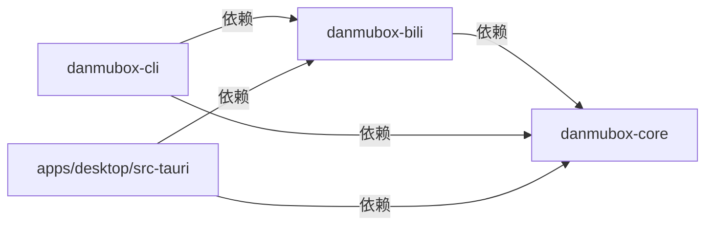
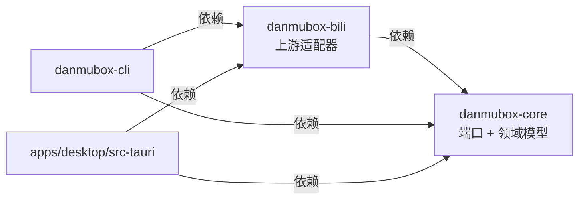
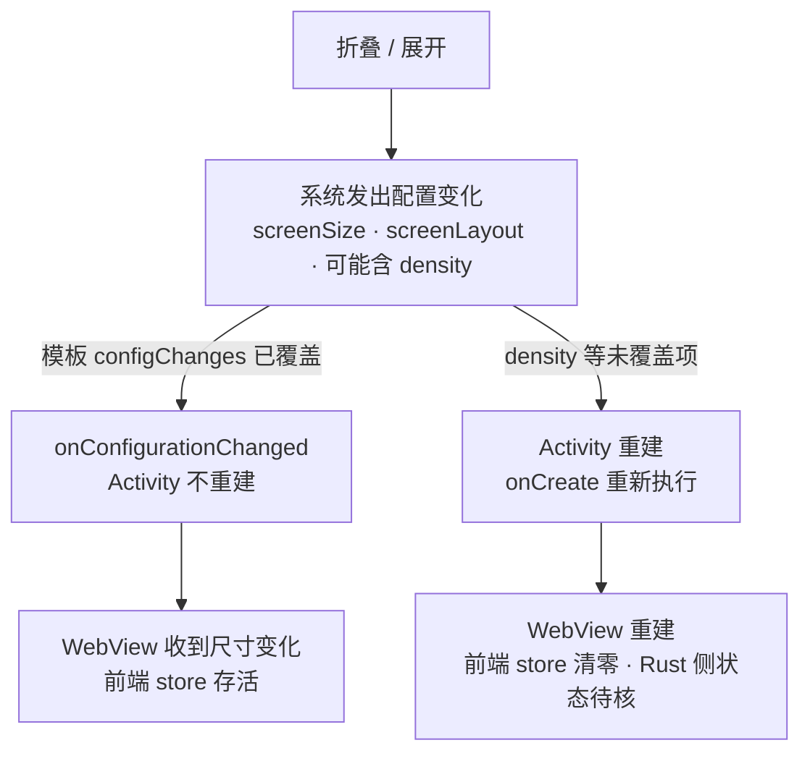

# Changelog

本文件记录 danmubox（弹幕框）的所有显著变更。

格式遵循 [Keep a Changelog](https://keepachangelog.com/zh-CN/1.1.0/)，版本号遵循 [SemVer](https://semver.org/lang/zh-CN/)。
日期统一为 `YYYY-MM-DD`。

> 定位：项目的对外可见变更流水，按版本倒序排列。
> 读者：项目作者本人，以及被指派参与本仓库的 AI agent。
> 更新时机：任何对外可见的行为、契约、文档基线或发布策略发生变化时；随改动同一次提交写入 `Unreleased`。

## 版本策略（自用不发布）

| 项 | 约定 |
|---|---|
| 发布形式 | 自用构建，不发布到 App Store / 应用市场 / 任何包仓库 |
| 版本号 | 仍按 SemVer 递增，用于标记自己的构建与排查问题 |
| `0.x.y` 期间 | IPC、端口、领域模型与本地文件契约均可破坏性变更，破坏性变更在 `Changed` 段明确标注 |
| `1.0.0` 触发条件 | 三端主流程稳定，端口与 IPC 契约冻结 |
| Pre-release | 需要区分试构建时用 `-alpha.N` / `-beta.N` 后缀 |
| Git tag | 版本号前加 `v`，例如 `v0.1.0`；不打 tag 的构建视为开发快照 |
| 变更记录粒度 | 用户可观察的行为与契约变化；纯内部重命名不单独成条 |
| 与文档的关系 | 契约文档（`docs/`）的基线变化必须在此留下条目 |

## [Unreleased]

（本波治理票的新条目见下；后续对外可见变化继续在本段登记。）

### Added

- **「我的直播间」：账号行「我的直播间」按钮展开管理区，两级分区选择，开播人脸认证二维码提示框，开播后长按复制推流参数**（2026-09-19 起；2026-09-24 按用户最新要求重构；需求 `REQUIREMENTS.md` §2.14，用户原话随该节）：
  账号管理对话框里，**每个账号行的删除按钮右侧**有一枚「我的直播间」按钮（`db-anchor-toggle`），点击**展开**该账号的直播间管理区（含直播间标题、两级联动分区选择、开播 / 下播）。**标题与分区默认取上次开播（下播 / 准备中）保留的数据**，用户不改即可直接沿用开播、不必重填。开播被上游**身份校验**挡住（`60043` / `60024`）时**弹出二维码提示框**引导官方 App 扫码认证（`FaceAuth` 走 `open_url` 打开认证页、`QrConfirm` 离线编码二维码）；开播成功后直接在管理区下方渲染推流地址 / 推流码，**长按该值即复制（不显示复制键）**，下播即消失。
  实现：新端口 `AnchorRoom`（`own` / `set_title` / `go_live(area_v2)` / `end_live` / `area_list`，`crates/danmubox-core/src/ports.rs`）—— 与只读的 `LiveSource` 分工明确：那个**看别人的**房间（游客也可用），这个**管自己的**房间；四个新命令 `anchor_room` / `anchor_title_set` / `anchor_area_list` / `anchor_live_set`（IPC 由 39 条增至 **43 条**，`generate_handler!` 与 `docs/ipc.md` §3 逐条对齐）；`QrConfirm` 那张二维码由**命令层**用 `qrcode` crate 把 `AnchorGate.qr` **就地离线编码**成 `qr_svg` 一并带出（与扫码登录完全同一条口径，不联网生成、不交给第三方服务；`qr_svg` 只出现在命令层载荷里，**不进** `core` 的 `AnchorGate`）；上游侧**全部**落在 `crates/danmubox-bili/src/anchor.rs`（分区列表 `room/v1/Area/getList`、改标题 `Room/update`、三段式 `startLive`、app 签名与公开 appkey/appsec 等端点与签名，**只有这个模块**允许出现这些 URL 与签名）。**事件清单不变**：不新增事件名 —— 状态按需现取，开播 / 下播 / 改标题成功之后由界面重拉。
  安全与纪律：**推流码是账号级凭据** —— 只随 `anchor_live_set` 的这一次返回值进界面内存，**不进日志、不落盘、不进 `prefs.json` / `config.toml`**（Rust 侧打日志 `redact` 脱敏）；写操作**只作用于当前账号自己的直播间**（目标房间由 `own()` 现取，上层不传房间号），**失败即停、不重试**；展开**非当前账号**那一行时**不发请求**、只渲染错误行（后端读的永远是**当前账号**自己的直播间，对着别的账号行发请求会拿回另一个人的房间）；上游非 0 code（含人脸认证那类）**原样带回、不赋语义**，仅 `60043` / `60024` 转 `AnchorGate` 引导（不自动重试）。
  规格：`docs/contract.md` §3 / §5 / §7 / §9、`docs/ipc.md` §1 / §2 / §3 / §3.1、`docs/ui.md` §2.2.2 / §2.5、`docs/architecture.md` §1 / §2.1 / §2.2 / §3、`docs/protocol.md` §18 与附录 A66、`docs/testing.md` §10.1 C-16 / §14、`REQUIREMENTS.md` §2.14。
  **实测状态（照实记，不许升级）**：`room_id_by_uid` 与 `get_info` 的字段形态有 2026-09-19 公开测试房间 `1` 的**只读**实测（`data.area_id` 为 int 且有值、`area_v2_id` 实测为 `null`、`live_status` 为 int）；**2026-09-19 真实登录态下又实测了一轮**（目标 = 该账号**自己的**直播间，由 `own()` 现取）：`click/now` 与 `getHomePageLiveVersion`（**带 app 签名**）均 `code=0` ✓、`Room/update` 改标题**成功**（读原值写回，标题逐字未变）✓、`startLive` 的**请求形状被上游接受**（返回业务码 `60043`「需要人脸认证」，**不是**参数 / 签名错误）✓ —— 本仓按纪律原样带回 code 与 msg、失败即停未重试；**仍未实测**：`startLive` 的成功分支（`data.rtmp` / `data.protocols[]`）、`stopLive`（未曾进入直播态）、`60024` 与 `data.qr`、「该账号没有开通直播间」的响应形态、分区列表 `room/v1/Area/getList` 的实际字段形态（端点 / 字段 / 签名口径来自两份社区实现 `ChaceQC/bilibili_live_stream_code` 与 `Zeppelinpp/bilibili-streamer`），逐条登记见 `docs/protocol.md` 附录 A66。**无头冒烟已跑**（2026-09-24）：新增场景块 `apps/desktop/ui/smoke/scenario/parts/37-anchor-room.mjs`（34 条 `anchor*` 读数）与 IPC 替身的 `anchor_*` 四条分支（含 `60043` / `60024` 两型引导、`area_v2` 覆盖、读失败、没开通直播间）；Chromium 与 WebKit 两个引擎 × 深浅两档 × 宽窄两档 **全绿**（此前 CHANGELOG 记的「冒烟未跑」就此作废）。冒烟当场抓到并修掉一个真 bug：开播被身份校验挡住后，紧随其后的状态重读会把 `anchorError` 清掉，**上游原话从错误行消失** —— 现改为重读之后把被挡住的那句原话补回（`store.setAnchorLive`）。同轮另两条失败 `switchScopeChatPaneFolds` / `switchScopeBothPanesFold`（低价礼物折叠，`35-cheap-gift.mjs`）经父提交 `e8336c3` 上的基线复跑确认**与本票无关、为既有红**。
- **「我的直播间」补齐「开播人脸认证」的需求**（2026-09-22 补需求；2026-09-24 按本修订实现）：
  用户原话「参照 https://github.com/Zeppelinpp/bilibili-streamer 在当前文件中补齐开播人脸认证的相关需求（先不实现，只补齐需求）」。改前 §2.14 末条定的是「上游非 0 code 原样带回、不赋语义，人脸认证那类码**不做二维码弹窗**」；而 `startLive` 在 2026-09-19 的真实登录态实测里正是被 `60043` 挡住（`msg` =「本次开播需要身份验证，请在关播时点击开播唤起人脸认证」）—— 那条口径的实际效果就是「用户拿到一句上游原话，却不知道下一步该干什么」。现改为：开播被**身份校验**挡住时给一条**引导** —— `60043` 给一枚「去完成人脸认证」的入口（打开上游认证页，走 `contract.md` §7 `open_url`）；`60024` 在上游给了 `data.qr` 时就地**离线**把二维码画出来（与扫码登录同一条口径，不联网生成）。三条硬口径：① 上游原始 `code` / `msg` 与引导**一起呈现**，不因出了引导就吞掉原值；② 认证完成后**由用户自己再点一次开播**；③ **只认 `60043` / `60024` 这两个码**，其余非 0 code 仍原样带回、不赋语义。
  口径与落点：端口 `AnchorRoom::go_live()` 在成功时返回 `StreamEndpoints`、被挡住时返回新的领域模型 `AnchorGate`（`docs/contract.md` §5：原始 `code` / `message` + `kind` ∈ `FaceAuth` / `QrConfirm` + `url` / `qr`）；认证页的拼装与 `data.qr` 的读取**只落在 `crates/danmubox-bili/src/anchor.rs`**，`core` 只承载那两个字符串、不拼装不解析（`AGENT.md` §8 第 3 条）。界面侧在错误行基础上**弹出二维码提示框** `db-anchor-gate-modal`（`ui.md` §2.2.2）。
  否决的方案：① **自动轮询认证状态、通过后自动重拉开播** —— 违反写操作「失败即停」，且本仓既没有「认证已完成」这条推送面、也没有可查认证状态的只读端点，做出来就是臆造；② **给未知的非 0 code 也配一套引导** —— 违反 `AGENT.md` §8 第 7 条（不得为未实测的 ac站行为编造数值 / 语义）。代价：多一个领域模型与一条端到端的呈现路径，且**认证页地址与 `data.qr` 的实际形态都仍未实测**（登记为 `docs/protocol.md` 附录 A66 未实测清单第 ⑤ 项），要等完成一次真实人脸认证才能闭环。
  规格：`REQUIREMENTS.md` §2.14、`docs/contract.md` §3 / §5 / §7 / §9、`docs/ipc.md` §3 / §3.1、`docs/protocol.md` §18 / §18.5 与附录 A66、`docs/ui.md` §2.2.2、`docs/testing.md` §10.1 C-16 / §14。
  **实现落地**：2026-09-24 按本修订实现（见上条），后端 `anchor.rs` 与前端 `AccountManager.tsx` 按 §2.2.2 新口径落地；未实测条目见上条与附录 A66。

### Changed

- **issue202609241553：「我的直播间」按六条要求收紧入口形态与交互**（2026-09-24，需求落 `REQUIREMENTS.md` §2.14 二次修订）：在既有「我的直播间」之上改 6 点，落点 `docs/contract.md` §3 / §5 / §7 / §2.14、`docs/ipc.md` §3、`docs/ui.md` §2.2.2、`docs/protocol.md` §10.7 / §18.1 / 附录 A66-1、`docs/testing.md` C-16。要点：① **按钮右端隔离**（第 1 条）：「我的直播间」从账号管理按钮组（重新登录 / 退出登录 / 删除）里**挪出**，单独成组贴账号行最右端（`db-anchor-entry`，`margin-left:auto`），用间距 + 竖分隔读开两类不同级功能；`db-anchor-entry` 与 `.accountActions` 同款 `stopPropagation`——**点它不切号**（点它是「看 / 管这个账号的直播间」，切号会清掉刚展开的管理区与按账号映射）。② **没开通 / 未登录不显示按钮**（第 2 条）：某账号 `anchor_room` 返回 `null` 或未登录的行根本不渲染该按钮；打开账号对话框时对**已登录**账号并发预取 `anchor_room` 落到 `anchorRooms` / `anchorRoomErrors`，按钮显隐由这份映射决定，读失败也不渲染但原因留痕。③ **不必切号即可跨账号管理**（第 3 条）：任一账号行都能直接管理**那个账号**的直播间——四个 `anchor_*` 命令各加 `account?: string` 参数，由 `BiliAnchor::new_for(account)` 走那份凭据（`crates/danmubox-bili/src/anchor.rs` 新增 `new_for`），目标房间仍由 `own()` 现取、上层不传房间号；写操作纪律改为「只作用于 `account` 指定账号自己的直播间（缺省当前）」。④ **分区可改且改动即存**（第 4 条）：大区 + 小区两级都能改，且改分区是**独立写入口** `anchor_area_set`（`ports.rs` 的 `AnchorRoom::set_area` + 命令 `anchor_area_set`，不必等到开播），选中即发一次写；`area_list` 的解析路径按参照项目 `Zeppelinpp/bilibili-streamer` 修正为 `data[]` **直接数组** + `show_pinyin=1`（早期写成 `data.list[]` 会把分区读空、界面降级只读，是「分区没有修改选项」的根因）。⑤ **布局调整**（第 5 条）：直播间状态移到**标题输入框左边**；开播 / 下播按钮**独占一行**（`db-anchor-live-row`）。⑥ **ROOM_CHANGE 自动更新**（第 6 条）：弹幕 WS 推来的 `ROOM_CHANGE`（只读 `data.room_id` 与 `data.title`，字段形态取自参照实现 `HakaseZ/BiliLiveWatcher`、登记于 A66-1）经 `danmubox://room` 回到前端，命中 `anchorRoom.room_id` 时就地更新标题输入框（限制：未连接自己直播间收不到；`danmubox-cli` 的事件循环也补了这一支，打一行「直播间标题变更」方便命令行核对）。冒烟 `37-anchor-room.mjs` 按新语义补了五组读数（按钮显隐 / 预取 / 跨账号 / 分区即存 / ROOM_CHANGE 更新）。

- **issue 202609220854：互动去重与时间戳、互动消失补位、低价礼物桶改刷屏形态、大航海一笔一条、分类型缓存真正生效**（2026-09-23）：五条缺陷，需求落 `REQUIREMENTS.md` §2.1 / §2.7 / §2.9，契约同步见 `docs/contract.md` §4.3 / §8 / §9、`docs/protocol.md` §10.4 / §10.6 / §12.3 / 附录 A7、`docs/ui.md` §4.8 / §5.3。按条要点：① **互动**：`INTERACT_WORD` / `INTERACT_WORD_V2` / `ENTRY_EFFECT` 三条归一到 `interact` 后，新增 `cmd::InteractMerge`（键 `room_id + uid`、窗口 5s）把**同一人同一次进场**的两条载荷压成一条（`protocol.md` §10.4 那条「不重复计数」的断言从此有代码保障）；同时把 `interact` 的 `ts` 统一为**本地收包时刻**（两条路径不再一条取本地、一条取上游时钟，上游那两个时间戳槽位只进 `tracing::debug!` 留档）—— 这既修了「时间戳不正常」，也修了「互动行到点不消失 → 下方不补位」（判据 `ts + 8000 <= now` 必然成立，行真的被移除、下方弹幕随虚拟列表上移填空，见 `ui.md` §4.8）。② **大航海一笔一条**：`GuardKey` 去掉不可靠的起始时间 `start_time`（缺失 / 非整数会让两条各自回落本地时刻、键对不上，正是「一笔出两行」的根因），改为 `room_id + uid + guard_level` 靠到达时刻窗口认同一笔；合并器提到**房间运行时**之上（不随 `read_loop` 重建，跨连接认得出同一笔）；`announced` 用独立的 30s TTL，放行 / 收尾放出的购买事件都写进它，避免迟到播报再投第二行（`cmd.rs` 的 `GuardMerge` / `ws.rs` 的 `BiliLive`）。**金额口径不变**：购买行 `amount = 0`、播报取实付，因此用户实际看到的是「两行、其中一行金额格空白」，不是「金额算两次」。③ **低价礼物桶改刷屏形态**：沿用 `ui.gift_collapse_cheap`，弹幕区与礼物栏两处的合并行都带 `senders`（前 3 位赠送者、按首次出现去重），`MessageRow` 据此画 30% 错位堆叠头像 + 身份位印「低价礼物 ×N」、不再逐个显示用户名（`filtering.collapseCheapGiftRows` / `MessageRow` / `ui.md` §5.3）。④ **分类型缓存真正生效**：删掉前端不分 `kind` 的统一上限 `CLIENT_MESSAGE_CAP = 2000`（`session-messages.ts`），改为按 `kind` 分档裁剪 `KIND_CAPS`（六档取值与后端 `BufferCaps` 逐项一致），礼物没到礼物档上限就**不**会被弹幕挤掉。新增 / 修正单测：`cmd.rs` 的 `InteractMerge` 与 `GuardMerge` 回归用例（含「`start_time` 缺失 / 非整数仍只投一条」「跨连接放行后迟到播报被压掉」）、`filtering.test.ts` 的桶 `senders` 用例、`session-messages.test.ts` 的分档裁剪用例。

- **刷屏弹幕聚合改为「够 3 条且至少两位不同观众」才折，折出来的行不再显示用户名**（2026-09-21，issue 202609211940 第 3 条）：原先只要有**两位**观众在同一窗口里发了同一条就折，折出来的行照旧画「昵称 + 身份牌」，并在行内 `×N` 之后紧跟一格名单。现在 **折叠门槛**是 `AGGREGATE_MIN_COUNT = 3` 条、**成立门槛**是参与观众按 uid 去重后 ≥ `AGGREGATE_MIN_SENDERS = 2` 位不同 uid（私有常量），**两个门槛都过**才折成一行（`message` = run 第一条、`count` = run 长度、`senders` = 去重后前 `AGGREGATE_AVATARS_SHOWN = 3` 位）；窗口仍是非滑动 **5 秒**（锚点 = run 第一条）、上限仍是 **999**；判定改为**先收 run 再判**，不折的 run 里每一行**原样逐条输出**（行数不变，不留下中间态）。展示随之改：头像列改画 `senders` 那 ≤3 张头像（沿 X 每张错开 **30% 头像宽**、后一张压在前一张上、**最左那张在最上层**，空 `face` 不占位但列宽照留），身份位**不再出现任何用户名与身份牌**、改印「刷屏 ×N」，**行内 `×N` 不再画**（`db-msg-count` 从此只属于礼物连击与低价礼物桶），名单格 `db-msg-senders`、常量 `AGGREGATE_SENDERS_SHOWN` 与 `sendersText()` 一并删除。新钩子 `db-msg-spam` / `db-msg-avatar-stack` / `db-gift-spam` / `db-gift-avatar-stack`。**为什么**：用户裁决了这五点口径 —— 折两条省不出多少行，却把「谁说的」整块赔进去；而两条重复最常见的情形其实是**同一个人**连发（那连「不同观众」都不成立），所以「够 3 条」与「不止一个人」各管一头。**否决了什么及理由**：① 保留「两位就折」——信息上赔本；② 折出来的行仍挂第一条的昵称——那是把一句多人的话说成一个人的，是错的；③ 让行内 `×N` 与身份位并存——两处都在说数量，且名字已经不对；④ 给折叠行另立一套行形态——渲染分叉、行高跳动，实测不必要。**代价**：认人只剩头像列那几张图，因此「空 `face` 不占位、错位按实画张数算」这条边界必须画对（已进冒烟读数）。同时新增偏好键 `ui.danmaku_aggregate`（bool，**默认 `true`**）：关掉即逐条原样显示（`aggregateRows` 原样返回入参）。默认取 `true` 与 `ui.gift_collapse_cheap` 那两枚相反 —— 它们默认 `false` 因为会改变现有效果，这枚只是把**本来就有**的聚合变成可关的开关。**偏好键总数 23 → 24**。规格：`docs/contract.md` §4（三条公开常量 + 一条判据常量）/ §8 / §9、`docs/ui.md` §2.2 / §2.5 / §4 / §8.4 / §8.5、`REQUIREMENTS.md` §2.1、`README.md`。新增前端测试 `apps/desktop/ui/src/aggregate.test.ts`（9 条 `node --test` 用例）；冒烟 `apps/desktop/ui/smoke/scenario/parts/25-aggregate-jump.mjs` 的 `aggregate*` 读数按新语义重写（同文本三位观众 → 一行「刷屏 ×3」+ 3 张堆叠头像；不同文本 → 两行；窗口外 → 三行；有一位没头像 → 只画两张；关掉开关 → 逐条三行、点回来又折）。**冒烟未跑**（由主流程统一跑）。
- **三端应用图标进共享 `bundle.icon`，源图入库**（2026-09-21，issue 202609211940 第 1 条）：`tauri icon` 的源图入库为 `apps/desktop/src-tauri/icons/icon-source.png`（1254×1254，与仓库根那张 untracked 的 `icon.png` 逐字节相同）；`tauri.conf.json` 的 `bundle.icon` 定为三枚 `["icons/icon.png", "icons/icon.ico", "icons/icon.icns"]`，**三端共用这一份**：macOS 读 `.icns` 生成 `.app` / `.dmg`，Windows 打包期 MSI（WiX）要求列表里能找到 `.ico`（NSIS 那条不读 `bundle.icon`，只看可选的 `nsis.installerIcon`，本仓库没设 ⇒ 用 NSIS 默认图标），Android 读 `gen/android/app/src/main/res/mipmap-{mdpi,hdpi,xhdpi,xxhdpi,xxxhdpi}/`（本次 `ic_launcher` / `ic_launcher_round` / `ic_launcher_foreground` 逐档同尺寸替换，自适应图标那套 `mipmap-anydpi-v26/` 与 `values/ic_launcher_background.xml` 已删除，回到改动前的资源形态）。前端 favicon 由 `ui/public/favicon.svg` 改为 `favicon-32x32.png` + `apple-touch-icon.png`（`ui/index.html` 两行 `<link>`）。**为什么**：三端各自的图标此前是零散的、没有单一来源；把源图与生成物一起入库，任何一端重出包都读同一份。**否决了什么及理由**：按端各配一份 `bundle.icon`（Windows 那条 job 原先用 `--config '{"bundle":{"icon":["icons/icon.ico"]}}'` 覆盖）—— 它源于「共享列表为空」这个中间状态，列表填好之后这个覆盖只是让三端读法不一致，已从 `.github/workflows/ci.yml` 删掉，Windows 那条命令现在就是 `tauri build --bundles nsis,msi`。**代价**：**Windows job 改后尚未真跑**（删覆盖这一下只在本机核对过命令形态，没有真跑 `windows-latest`）；仓库根那张个人素材 `icon.png` 保持不动、仍 untracked，不再被任何构建读取。规格：`docs/operations.md` §5.3。
- **macOS 产物改为 ad-hoc 整包签名，`codesign --verify` 从 rc=1 变 rc=0**（2026-09-21，issue 202609211940 第 5 条，本机实测）：根因是改动前产物只有**可执行文件的链接器 ad-hoc 签名**（`CodeDirectory flags=0x20002(adhoc,linker-signed)`、`Info.plist=not bound`、`Sealed Resources=none`、`Identifier=danmubox_desktop-<hash>`），bundle 没有封条 ⇒ `codesign --verify --deep --strict` **rc=1**（「code has no resources but signature indicates they must be present」），系统把这一档显示成「已损坏，无法打开」。修法只有一条声明：`tauri.conf.json` 的 `bundle.macOS.signingIdentity = "-"` —— 实测构建日志出现两处 `Signing with identity "-"`（先 Mach-O、再 `.app`），产物 `Identifier=dev.kksk.danmubox`、`CodeDirectory flags=0x10002(adhoc,runtime)`、`Info.plist entries=14`、`Sealed Resources version=2 rules=13 files=1`，`codesign --verify --deep --strict` **rc=0**，`spctl -a -vv -t exec` → `rejected` **rc=3**（ad-hoc 的预期结果：无 Developer ID、无公证）。dmg 往返：`--bundles dmg` 出 `danmubox_0.2.0_aarch64.dmg`（8.3MB），`hdiutil verify` rc=0。**为什么**：不签名的 bundle 在本机就会被拒开，这是「装得上、打不开」的直接成因。**否决了什么及理由**：① 把 `.app` 打 zip 再分发——绕开的是 dmg 的封条校验、没解决 bundle 自身无签名，「已损坏」照旧；② 买 Apple Developer 账号走 Developer ID + 公证——自用不发布，账号与公证链是纯负担；③ 在 CI 里加一段显式 `codesign` 步骤——声明式一处就够，显式步骤会与 tauri 的打包时序耦合。**代价**：ad-hoc 不是「免放行」——从浏览器下载的 CI 产物会被 `com.apple.quarantine` 拦，跨机器**首次**打开必须放行一次（系统设置 → 隐私与安全性 →「仍要打开」，或 `xattr -dr com.apple.quarantine /Applications/danmubox.app`）；不买账号 = 不做公证，这一步是结构性边界、不会消失。CI 侧：`--bundles dmg` 结束后会把 `bundle/macos/*.app` 中间产物删掉，因此 `artifacts` job 新增的自校验步骤**挂载 dmg、验里面的 `.app`**（打印 `codesign -dv --verbose=4`；`codesign --verify --deep --strict` 失败即 job 失败；`spctl … || true` 只记录；最后 `hdiutil detach`），上传口径未变（`danmubox-macos-dmg` / `target/release/bundle/dmg/*.dmg`，**没有**改 zip）。**CI 改后未真跑**（本机逐字跑过那段 `run:` 脚本，rc=0）。规格：`docs/operations.md` §5.3 / §5.5 / §5.13。
- **凭据文件损坏不再导致应用退出；文档不再引导手工编辑该文件**（2026-09-19）：`config.toml` 解析失败时**删掉重建为空文件并以游客态继续启动**（不备份；读取 / 权限 / IO 失败照旧报错终止），用户裁决见 `docs/contract.md` §4.1；`docs/contract.md` / `docs/auth.md` §8.4 / `docs/operations.md` §1.4 同步删去「手工编辑凭据」的手把手步骤（被删原文逐字归档于本文件归档区末尾）；同口径的一次全局扫描另修掉 10 处单句残留（不进归档区）：`README.md` 2 处、`docs/auth.md` §2 与 §8.5、`docs/operations.md` §2.2 2 处、`docs/ipc.md` §1、`docs/ui.md` §8.5、`docs/protocol.md` §16，以及 `crates/danmubox-bili/src/auth.rs` 的模块注释。
- **文档规范化重写：约束文档只留约束，决策过程整体归档**（2026-09-19）：11 份约束文档按「只写约束开发行为的内容」重写 ——
  自指说明（定位 / 读者 / 更新时机、写作要求、文档清单与索引、与其他文档的关系）集中到 `AGENT.md` §6.5；
  决策过程叙述、修前症状与改前/改后度量**逐字搬入本文件末尾的 `[Archive]` 区**；上游未实测事实归 `protocol.md` 附录 A
  （`docs/auth.md` 的 17 条并入为 A49–A65）；未决与待办归 `docs/roadmap.md`。同时**以代码为准**修掉重写期间发现的全部
  「文档 ≠ 代码」不符（逐条清单见归档区各来源分节）。`docs/decisions/*`、`docs/requests.md`、`docs/foldable.md` 三份
  随本轮收掉，全文归档于归档区第二部分。
- **文档与代码对齐：修掉 7 处语义冲突，并把 `docs/foldable.md` 登记进契约 §11**（2026-09-19，只改文档与注释、无行为变化）：
  ① `danmubox://session` 的载荷口径按实现统一为**只有房内身份 `RoomSession`**——登录态不经事件总线，由 `session_status` 命令现取
  （`contract.md` / `auth.md` ×3 / `ui.md` / 两处前端注释原先写成「双载荷」）；② 连接态一律走 `danmubox://status`
  （修 `architecture.md` ×2 / `operations.md` / `ui.md` 里误写成 `danmubox://room` 的四处）；③ Android 权限口径由「只声明 `INTERNET`」
  改为实际四枚：`INTERNET` / `FOREGROUND_SERVICE` / `FOREGROUND_SERVICE_DATA_SYNC` / `POST_NOTIFICATIONS`（权威清单是 `AndroidManifest.xml`）；
  ④ 会话缓冲一律按 `kind` 六档，清掉 `README.md` 与 ADR 0006 里的旧单值 5000（ADR 只留理由、取值改指针）；⑤ `SendOutcome` 的用户文案
  以 `ui.md` §6.5 为唯一来源，删掉 `auth.md` §11.3 里另写的三档措辞；⑥ WS 心跳首包改为「认证成功即发，60 秒是硬上界」（原先写成「60 秒内发出」易被读成等待时长）；
  ⑦ `testing.md` 的前端事件清单补上 `danmubox://room_stats`；契约 §11 文档清单补登记 `docs/foldable.md`。
- **上游平台在文档与注释里的称呼统一为 `ac站`**（2026-09-18，公开仓降低可搜索性）：文档正文与代码注释里
  的品牌字样统一改写为 `ac站`（32 文件 / 121 处，含 `README.md` / `AGENT.md` / `docs/**` / `REQUIREMENTS.md`
  与各 crate 的注释）；URL 与主机名、代码标识符与字符串字面量、界面渲染文案、`smoke/fixtures/**` 里的上游
  夹具值一律保留原名（口径见 `AGENT.md` §6）；GitHub 仓库描述与 topics 同步去掉原名。
- **变更记录收口、版本基线提到 `0.2.0`、发版口径写进运维文档**（`260917` 治理波）：`[Unreleased]` 里逐轮
  堆出的 **55 个重复 `###` 小节**收进下方的 `## [0.2.0] - 2026-09-17`（同一个版本内每个小节只出现一次，
  条目与各轮的验收口径引用块**逐字未动**）；版本号从 `0.1.0` 提到 `0.2.0`
  （`apps/desktop/src-tauri/tauri.conf.json` 的 `version` 与 workspace `Cargo.toml` 的
  `[workspace.package] version` —— 四个 crate 都是 `version.workspace = true` —— `Cargo.lock` 随之重生成），
  三端产物名因此由 `danmubox_0.1.0_*` 变成 `danmubox_0.2.0_*`（**以实际构建为准**）；
  「产物由 CI 出」与「发一版的操作步骤」写进 `docs/operations.md` §5.13。**未打 tag、未发版**（发版动作归主流程）。

- **`artifacts-windows` 缓存 release `target`**（2026-09-18，两轮真跑取数后保留）：命中时 Windows job 全程 **281s**、只缓存 registry 时基线 **645s**，净省 **364s**（`出 Windows 产物` 601s → 225s，cargo 9m26s → 3m12s）；代价是该缓存条目 561 MB、缓存步恢复 30s，仓库缓存总占用到 8.46 GiB / 10 GiB。读数与判据见 `docs/operations.md` §5.13。
- **Android 产物从 `macos-14` 挪到 `ubuntu-latest`**（2026-09-18）：`tauri android build` 本身不需要 macOS，原先并进 macOS 那条 job 只是早期顺手 —— 代价是私有仓口径下这一步按 **×10** 计费（15–21 分钟 ⇒ 150–210 计费分钟），且把稀缺的 macOS runner 占满 20 分钟。因此把 `artifacts` **拆成两条**：`artifacts`（`macos-14`，只出 `.dmg`）与 `artifacts-android`（`ubuntu-latest`，出**已签名的** release APK）。与 `scripts/android-env.sh` 的两处宿主差异都收在新 job 内：cmdline-tools 取 **linux** 包（版本号 `16111833` 与 macOS 那份相同）、NDK 的 prebuilt 目录**按宿主实际探测**（`linux-x86_64` / `darwin-x86_64`），不再写死。规格：[`docs/operations.md`](docs/operations.md) §5.13。

### Removed

- **一键诊断整套删除（净 −2001 行）**（2026-09-21，issue 202609211940 第 4 条）：删掉 `crates/danmubox-core/src/diagnose.rs`、`crates/danmubox-bili/src/diagnose.rs`、`apps/desktop/src-tauri/src/diagnose.rs` 与 Android 原生写文件插件 `DiagnosePlugin.kt`；删掉符号 `core::paths::downloads_dir()`、`bili::redact` 的 `redact_for_export` / `EXPORT_KEYS` / `mask_numbers`（`redact()` 与 `SECRET_KEYS` 保留，脱敏仍是单一出口）、`ws.rs` / `http.rs` 里 `danmu_info(..., diag)` 的 `diag` 参数与全部采集埋点、外壳的 `DiagnoseStart` / `DiagnoseExport` / `diagnose_start` / `diagnose_export` / `AppState.engine` / `secret_numbers()`，以及 `log_bridge` 里**只为诊断存在**的那条写入路径（`RAW_TARGET` / `MessageVisitor.fields`）；前端删掉 `ipc.ts` 的 `diagnoseStart` / `diagnoseExport`、`types.ts` 的 `DiagnoseStart` / `DiagnoseExport`、`RoomView.tsx` 的四个诊断状态与该面板、`app.module.css` 的 `.diagnose*` 整段。**保留** `core::bus` 的 `Counters` / `CounterSnapshot`（`MessageSink` / `session` / `proto` / `cmd` / `ws` / CLI 仍用，CLI 打印计数走 `snapshot()`；它不再被诊断读取）。**IPC 条数 39 → 37**（`async fn` 29 → 28、同步 `fn` 10 → 9，「同步命令」名单里不再有 `diagnose_start`；`diagnose_export` 原本是唯一「另接 `app: tauri::AppHandle`」的 async 命令，这条例外随之消失，`chat_send` 仍接）。**为什么**：这套采集采出来的数据意义不大 —— 「连上了却收不到弹幕」这条链路要的事实（票据 `code`、`op=7` / `op=8`、入站帧间隔、退避与候选节点）在日志里本来就有，而它自带的存储、脱敏加严档与三端写文件路径是一整片需要长期维护的面。**否决了什么及理由**：① 只把入口从菜单里藏起来、代码留着——不解决问题，还留着三端权限与写文件路径的维护面；② 只删 Android 那条 MediaStore 写文件路径——另一半（core 采集环 + 报告渲染 + 两条 IPC）照旧；③ 保留 `downloads_dir()` 备用——没有调用方就是死代码。**代价**：Android 侧失去了唯一一个「把业务日志交出来」的入口，现在只剩 `adb logcat`（`docs/testing.md` §10.5 已如实改写）；「一次诊断恰好一个文件」这条口径随之作废，本地文件回到只有 `config.toml` 与 `prefs.json` 两个、**没有任何写数据目录之外的产物**。规格：`docs/contract.md` §4（删常量行与 §4.4）/ §7 / §9、`docs/ipc.md` §2 / §3 / §3.1、`docs/ui.md` §2.2 / §3.2 / §3.5、`docs/architecture.md` §2.1 / §2.2 / §5 / §9.3 / §9.4、`docs/operations.md` §1.3 / §2 / §3 / §4 / §5、`docs/testing.md` §2 / §10.4 / §10.5、`docs/protocol.md` 附录 A48、`docs/roadmap.md` §2.1、`README.md`、`REQUIREMENTS.md` §2.12 / §2.13。`AGENT.md` §9 里那条「`diagnose.rs` 13 处」是历史记录，**保留不动**。

### Fixed

- **「我的直播间」修复与交互即时化（issue202609242158，2026-09-24）**，后端落点 `crates/danmubox-bili/src/anchor.rs`、前端落点 `apps/desktop/ui/src/store.ts` / `components/AccountManager.tsx` / `components/Composer.tsx` / `app.module.css` / `App.tsx` / `RoomView.tsx`：
  **后端（第 2 / 3.1 / 3.2 条）**：
  ① **切换分区报「分区已下线」**（第 2 条）：先核实改分区的**字段名口径** —— `Zeppelinpp/bilibili-streamer`（`src-tauri/src/services/bili_api.rs::update_area`）、`ChaceQC/bilibili_live_stream_code`（`backend/bilibili_api.py::update_area`）与 `bilibili-API-collect`（`docs/live/manage.md`「更新直播间信息」）**一致为 `area_id`**（子分区 id），`area_v2` 只属于 `startLive`；故**字段名保持 `area_id` 不动**（改发 `area_v2` 会被上游当未知字段忽略、分区静默不生效）。真正的修在**取值来源**：`Area/getList` 的子分区 `id` 在权威文档里类型是 **`str`**、参照实现 `refresh_partitions` 亦为「先 `as_u64()` 再字符串 `parse()`」两段式，而本仓 `map_areas` 只认 JSON 数字 ⇒ 上游返字符串时子分区被整段丢掉、界面回落到**父分区 id**、上游按子分区表校验即回 `60009 分区已下线`。现按两段式收（`int_like`）+ 回归用例 `area_list_parses_string_child_ids`；请求体抽成纯函数 `update_params` + 用例 `update_params_pin_field_names_for_title_and_area` 钉住字段名。**上游子分区 id 的实际类型仍未真机回填**（`docs/protocol.md` 附录 A66-1 第 ③ 项）。
  ② **改标题后预览跳回原标题 /「有时改不上去」**（第 3.1 条）：`Room/update` 回 `code==0` 即写成功（权威），而 `get_info` 有服务端缓存，紧接着重读可能仍是旧标题 —— 现把重读结果与本次请求合并（`with_requested_title`：`title` 以本次请求值 trim 后为准、其余字段以重读为准），`anchor_title_set` 因此返回合并后的 `OwnRoom`（不再是 `void`，见 `docs/ipc.md` §3），界面不再跳回原标题；同时 `upstream_err` 把上游回复里的顶层 `message` / `msg` 与 `data.msg` / `data.message` 一并透出（同值只留一次），让「改不上去」有 response 可查。**不为未知 code 赋语义**。
  ③ **开播状态同步慢**（第 3.2 条）：核对 `go_live` 路径后**后端未改代码** —— 开播成功只返回 `StreamEndpoints`，IPC 命令签名与返回结构不动，`live_status` 新鲜度由前端乐观状态负责。
  **前端（第 1 / 3.1 / 3.2 / 4–8 条）**：
  ① **按钮改回与账号管理同排、同一组**（第 1 条）：`db-anchor-toggle` 与重新登录 / 退出登录 / 删除同在 `.accountActions`，整组 `margin-left: auto` 贴行右端；**去竖线分隔**，靠组内间距读开；`stopPropagation` 由该容器统一承担（点它不切号）。
  ② **标题写入即时**（第 3.1 条）：`saveAnchorTitle` 落**后端返回值**并清草稿（后端已按请求值合并），不再回跳；并发乱序由发起序号护栏拦（读 / 写分开判，见下方「评审修正」，晚到的旧回包不覆盖先落地的新值）；另有 **15 秒写穿窗口**（`anchorTitleSaved` / `mergeSavedTitle`），保存成功后一次 `anchor_room` 重读若仍读到上游缓存里的旧标题，只对 `title` 一个字段回退到刚保存值，其余字段照常以远端为准。
  ③ **开播 / 下播即时**（第 3.2 条）：成功后 `applyAnchorLive` **乐观落 `live_status`**（开播 → 1、下播 → 0），不等重读的缓存追上，展开期静默轮询随后以上游为准校正。
  ④ **红绿状态**（第 4 条）：`db-anchor-status` 按派生 `onAir`（`live_status` 1 / 2）挂 `anchorStatusLive` / `anchorStatusOffline` 语义色，复用房间头同一套 `--live-on` / `--live-off` 令牌。
  ⑤ **选择框等高**（第 5 条）：标题输入框与两个分区 `select` 共用显式盒模型（`box-sizing` + 固定 `height` + 统一 `padding` / `line-height` / 字号），`select` 关 macOS WebKit 原生外观、自绘下箭头 —— 三端同一条规则。
  ⑥ **FaceAuth 去红字**（第 6 条）：只在 `QrConfirm` 时把上游原话（含 code）挂错误行，`FaceAuth` 不再落红字（已有「去完成人脸认证」入口，那句「客户端老了」是无效提示）；两种情况都弹 modal。
  ⑦ **展开期静默刷新**（第 7 条）：`startAnchorPolling` / `runAnchorPoll` / `stopAnchorPolling` —— 「我的直播间」展开期 30 秒链条式静默重拉 `anchor_room`，复用可见性门（不可见整拍跳过）+ 失败退避（30 → 60 → 120 → 240 秒封顶）、成功复位，收起 / 关对话框 / 换号即停。
  ⑧ **全系统静默刷新审计**（第 8 条）：除第 7 条外，新增房管面板展开期 60 秒（`startAdminPolling`；`loadAdmin` 返回 `boolean` 供退避）、「我的表情」面板打开按 10 分钟节流重拉（`loadOwnedEmotes(ifStale)` / `OWNED_EMOTES_STALE_MS`）、发送弹幕 / 表情成功后刷电池余额（改在 `Composer.tsx` 调 `onRefreshBalance()`，不为它另起定时器）；列表页 30 秒那一拍既有、不动。审计判定**不必修**的几处：房内弹幕 / 连接态 / 房内身份 / 房间元信息由 WS 推送事件（`danmubox://message` / `status` / `room` / `session`）实时更新；关注列表随列表页同一拍刷新；扫码登录已有 2 秒轮询；`anchor_area_list` 是静态公开数据、只在展开时拉一次。
  **关键决策（`AGENT.md` §6.5.4）**：① **改分区字段名不动** —— 为什么：三处来源逐字一致是 `area_id`，`area_v2` 只属 `startLive`；否决：改发 `area_v2`（上游当未知字段忽略、分区静默不生效）；代价：真因落到「子分区 id 可能是数字字符串」，需靠 `int_like` 兼容并留一条真机回填项。② **静默刷新只落在「展开期」** —— 为什么：有面板在眼前才需要新鲜，收起即停、不制造后台常驻定时器；否决：全局常驻轮询、保留手动刷新按钮；代价：未展开期间数据仍可能过期，靠打开时那次拉取兜底。③ **按钮改回同排同组** —— 为什么：用户判定它与其他账号操作本就是同一处，隔离成两组反而别扭；否决：issue202609241553 的「独立成组 + 竖分隔」（本轮按用户最新要求撤销）；代价：`.anchorEntry` 与独立分隔样式一并删除，`db-anchor-entry` 测试钩子不再存在。
  规格：后端见 `docs/protocol.md` §18.1 与附录 A66-1；前端见 `docs/ui.md` §2.2.1 / §2.2.2 / §4.9 / §6.3 / §6.4、`docs/ipc.md` §3 / §3.1 / §8.1、`docs/contract.md` §7、`docs/testing.md` C-16、`REQUIREMENTS.md` §2.14。
  **未验证（照实记）**：**本轮未跑无头冒烟**（用户明确要求本 fix 不跑）；按钮同排、红绿状态、FaceAuth 无红字、展开期静默轮询等新行为**暂无无头断言覆盖**，`smoke/scenario/parts/37-anchor-room.mjs` 本轮未改（经静态核对，现有断言在新布局下仍成立）。三端真机（macOS / Windows / Android）核验未做。
  **评审修正（PR #30 CodeRabbit，2026-09-25）**：① 落地护栏**读 / 写分开判**（`anchorReadAppliedSeq` / `anchorWriteAppliedSeq`）—— 为什么：写响应是权威（上游 `code==0` 即已落库），共号时一拍「写之后发起、却先落地」的轮询读会按号把写响应整份吞掉（写成功但草稿不清、写穿窗口不开），第 3.1 条换形式复发；否决：维持共用 `anchorRoomAppliedSeq`（正是被评审点名的缺陷）；代价：两条序号各自维护。写响应只在**更晚发起的写已落地之后**才让位（落地号在落地时才推进：更晚的写仅在途或失败不影响早写响应落地 —— 复审追问后补明）。② **改分区写落地时标题字段同样过写穿窗口**（`mergeSavedTitle`；窗口仍只由标题写开启）—— 否决：改分区原样落远端重读值（会拿 `get_info` 缓存里的旧标题盖掉刚保存的标题）。③ **轮询启停带世代号**（`anchorPollGen` / `adminPollGen`：stop / 重新 start 自增，在途旧拍按号自查）—— 为什么：否则「收起 A、马上展开 B」时 A 的在途拍会把 B 刚排上的定时器清掉，B 的轮询静默死掉；否决：只留全局 stop（评审点名的缺陷）；代价：`start*` 返回的停止函数闭包一个世代号。④ `docs/testing.md` C-16 第 ⑥ 项的错误行原话要求限定为 `QrConfirm`（与第 ⑩ 项「FaceAuth 无红字」对齐）。修后重跑：`oxlint` 0 告警、`tsc -b && vite build`、`smoke/run-headless.mjs --precheck`（未起浏览器）；冒烟仍未跑。

- **冒烟场景 `switchScopeChatPaneFolds` / `switchScopeBothPanesFold` 恒红（2026-09-24）**：这两条是**场景落后于实现**，不是界面 bug —— 2026-09-22 第 3 条把低价礼物桶改成与刷屏聚合**同一套形态**后，桶行的 ×N 从正文那格 `db-msg-count` 移到**身份位** `db-msg-spam`（写「低价礼物 ×N」），聚合行正文里那格 ×N **不再画**（`MessageRow`：`aggregated` 时不渲染 `db-msg-count`，同一个数不在一行里出现两次）；而 `smoke/scenario/parts/35-cheap-gift.mjs` 仍在查 `db-msg-count`，于是恒红（`switchScopeGiftPaneFolds` 只查行数与金额，所以它一直是绿的）。现按实现改正：弹幕区判 `db-msg-spam` 含「低价礼物 ×2」、并新增 `switchScopeBucketNoInlineCount` 钉住「桶行正文里没有 ×N」；礼物栏同款补一条 `db-gift-spam`（两处同一个形状，`docs/ui.md` §5.3）。**冒烟已跑**：Chromium 与 WebKit 两个引擎 × 深浅两档 × 宽窄两档**全绿**（各 4236 项快照 / 56 张截图，零失败）。

## [0.2.0] - 2026-09-17

本版汇总自 `0.1.0`（2026-09-11，仅文档基线、不含源码）以来的**全部交付**：阶段 1–4、三端出包（macOS `.dmg` / Windows NSIS 安装器 + MSI + 免安装 exe / Android 已签名 release APK）、GitHub Actions CI（`check` / `artifacts` / `artifacts-windows`），以及 `2609162141` / `2609162056` / `2609171849` 三批需求（含 P125–P131）与更早几批已并入的改动。

条目是历轮逐轮累积的原文，**未删减**；每轮末尾那段 `> **本轮…的验证口径**` 引用块是当时的验收记录，逐字保留（`0.1.0` 时代的产物名 / 字节数也照原样留在记录里，不随本次提版本号改写）。

**读法**：本版把历轮的同名小节按类别归并（同一个 `###` 只出现一次），条目原文与轮次顺序一概未动；原文里少量「上面 / 本段上一条」这类相对指代，凡归并后会指错位置的已改成写明目标条目，其余保持原样。引用块一字未动 —— 里面的「上面这些改动」按**那一轮的全部改动**读。

### Added

- **弹幕聚合：不同观众短时间内发的同一条弹幕折成一行**（issue 2609171849 第 7 条，用户 2026-09-17；
  分支 `feat/2609171849-aggregate`）。判据是「**不同的人** + 同一个键 + 短窗口」：归一化正文
  （去首尾空白、连续空白并成一个空格、大小写不敏感；表情弹幕按 `emote.emoticon_unique`）相同、
  相邻、与**锚点**（这一行的第一条）相差 ≤ **5 秒**、**至少两位不同观众**参与 —— 同一个人的重复不算，
  因此它**不是** 2026-09-13 删掉的「合并相似消息」（那条的判据是同一个 uid 的重复，见本文件 Removed 段
  与 `docs/requests.md` P49），也**不是**礼物连击折叠（那条判据是同一个 `combo_id`）。
  展示沿用既有行形态、不另立视觉：正文行内 `×N`（`count` = 折了几条）+ 紧跟一格「都是谁」
  （`data-testid="db-msg-senders"`，按首次出现顺序列前 3 位，多于此写「等 N 人」）；代表行的
  头像 / 昵称 / 时间戳仍是第一条那条消息的（React key 不变，后续观众加入不重建节点、行不跳位）。
  实现：新增 `apps/desktop/ui/src/aggregate.ts`（纯函数 + 三个常量），只在 `MessageList` 的**弹幕区**
  那一份行上跑（礼物栏不经过）；`DisplayRow` 增可选字段 `senders`（`filtering.ts`）。
  规格：`docs/contract.md` §4（三条常量与下注）/ §9 溯源行、`docs/ui.md` §8.4（改写成「两条折叠规则」
  并各配一张表）、§4.1 / §4.7 / §5.3 / §7.1 / §2.5、`README.md` §3（功能面）。**冒烟未跑**（由主流程统一跑）：
  新增断言块 `aggregate*`（同文本两位观众 → 一行且 `×2`、名单含两位；不同文本 → 两行；
  窗口外同文本 → 两行）已写进 `apps/desktop/ui/smoke/room-page.mjs`。
- **CI 出 Windows 产物**（2026-09-17；分支 `chore/ci-windows-artifact`，提交 `5c54c2e` / `ec8c3f7`；run `35213437486` **三个 job 全绿**）。
  `.github/workflows/ci.yml` 新增 `artifacts-windows` job（跑在 **`windows-latest`**，触发口径与 `artifacts` 相同：仅 `workflow_dispatch` 与 `v*` tag），
  出并上传**三个**文件到产物 `danmubox-windows`：免安装 `danmubox-desktop.exe`（**16,434,176 字节**，PE32+ x86-64 GUI）、
  NSIS 安装器 `danmubox_0.1.0_x64-setup.exe`（**3,896,645 字节**，PE32 GUI / Nullsoft Installer）、
  MSI `danmubox_0.1.0_x64_en-US.msi`（**5,816,320 字节**，OLE 复合文档）。名字 / 字节数 / 类型是把产物从 run 里 `gh run download` 下来后
  用 `stat` + `file` 读的；`tauri build` 结束时也报了 `Finished 2 bundles`（NSIS 与 MSI 都真的产出了）。
  「出 Windows 产物」一步耗时 **18m19s**（11:01:21Z→11:19:40Z）：Rust release 编译 **17m42s**（冷缓存 —— 该 job 与 `artifacts` 同口径，只缓存 registry 不缓存 `target`），
  之后 NSIS `nsis-3.11` 与 WiX `wix314` 都是**打包时现场下载**，再跑 `makensis` 与 `candle`+`light`。
  **两条踩过的坑**（首次真跑 run `35211873761` 的失败与根因 —— `artifacts-windows` 挂在**编译期**，不是打包器）：
  ① `tauri-build` 生成 Windows 资源（winres）时找不到 `.ico` 直接中断编译，原文
  `` `icons/icon.ico` not found; required for generating a Windows Resource file during tauri-build ``（外套 `error: failed to run custom build command for danmubox-desktop`，
  `build-script-build` exit code 1）—— 故新增 `apps/desktop/src-tauri/icons/icon.ico`（6312 字节，用 `tauri icon` 从既有的 `icons/icon.png` 生成，含 16/24/32/48/64/256 六个尺寸）；
  ② MSI（WiX）要求 `bundle.icon` 列表里能找到 `.ico` —— tauri-cli 把 bundler 的 `windows.iconPath` 置成空 PathBuf（`crates/tauri-cli/src/interface/rust.rs`），
  只能回落到该列表，空列表会报 `Couldn't find a .ico icon`（这一条**按上游源码核对，没有真的撞上过** —— 加的那枚 `.ico` 同时修掉了 ①）—— 故构建命令追加 `--config '{"bundle":{"icon":["icons/icon.ico"]}}'`。
  这个覆盖**只作用于 Windows 那一条命令**：共享的 `tauri.conf.json` 里 `bundle.icon = []` 一字未动（macOS 出 dmg 依赖它，见 `docs/operations.md` §5.3）。
  同一批纠正一处**文档错**：§5.3 的 Windows 段原写 `tauri build`「默认同时产出 msi 与 nsis」，但 `bundle.active = false` 时不给 `--bundles`
  **根本不进打包阶段**（tauri-cli 的判据是 `config.bundle.active || options.bundles.is_some()`，按上游 2.11.4 源码核对），
  已按实测命令改写，并写明「本机是 macOS，出不了 Windows 包，Windows 产物只有 CI 这条出口」。
  **未验证**（本机是 macOS，装不了也跑不了 Windows 包）：产物**没有在任何真 Windows 上装过 / 启动过 / 卸载过**；
  安装器是否需要联网装 WebView2、SmartScreen 拦截行为、`%APPDATA%\danmubox\` 的权限等价性，以及打 tag 那条触发路径 ——
  即 `docs/testing.md` §10.3 的 W-1~W-4 **全部未验**；产物未做代码签名。
  文档落点：`docs/operations.md` §5.3（Windows 段按实测重写）、§5.4（Windows 前置缺口标注「出包已由 CI 绕开」）、§5.13（三个 job / 产物表 / 本机口径 / 验证表）、
  `docs/roadmap.md` §1 与 §2.2、`README.md` §3、`docs/requests.md` E16（证据列补这次真跑）。

- **Android 端开工：可出包、可安装、可启动**（用户 2026-09-15；分支 `feat/android-mobile`，提交 `0e1bde6` / `40152e0` / `a71c5a3` / `62ea667`）。交付物三块：
  ① **仓库内工具链**（见下一条）；② **`apps/desktop/src-tauri/gen/android/**` 入库**（40 个文件，属长期维护的源码；根 `.gitignore` 从「忽略整个 `gen/`」改成只忽略 `gen/schemas/`）；③ **自用 release 签名**——`gen/android/keystore.jks` + `keystore.properties`（两者都被 `gen/android/.gitignore` 忽略，**不在 `.android-env/` 内**，`clean` 删不到；缺 `keystore.properties` 时退回未签名构建，产物名带 `-unsigned`）。
  出包命令：`. scripts/android-env.sh` + `cd apps/desktop && CI=true ./ui/node_modules/.bin/tauri android build --apk --ci`（分 ABI 再加 `--split-per-abi`）；产物 `gen/android/app/build/outputs/apk/universal/release/app-universal-release.apk`（实测 52 MB，四个 ABI）与 `apk/<arm64|arm|x86|x86_64>/release/app-<abi>-release.apk`。
  **已实测**（本地 AVD，android-35 google_apis arm64-v8a）：`adb install` 成功、`am start -W` COLD `TotalTime` 1013ms / `Displayed +1s13ms`、`adb logcat` 零 crash/panic、进公开测试房间 `1` 连上、HTTPS 出网正常（拿到真实直播标题）；`aapt2 dump badging` 与包配置一致（`dev.kksk.danmubox` / versionCode 1000 / versionName 0.1.0 / minSdk 24 / targetSdk & compileSdk 36 / 只有 `INTERNET` 权限）；带签名包 `apksigner verify` 为 `Verifies`（v2）。**未实测**：真机、扫码登录、发弹幕、房管、**收弹幕**（进房后 3.5 分钟内未观测到弹幕，不得据此宣称弹幕链路已通）、四个分 ABI 包的安装。细节见 `docs/operations.md` §5.3、`docs/testing.md` §10.4 / §10.5。
  本轮发现的 edge-to-edge 遮挡问题**已同批修复**，见下方 `Fixed` 段。细节见 `docs/operations.md` §5.3、`docs/testing.md` §10.4 / §10.5。
- **Android 系统返回手势先走应用内**（用户 2026-09-15；分支 `feat/android-mobile`）。侧边滑动返回 / 三键返回**先在应用内消化，兜底才退出应用**。协议只有一句话：页面暴露 `window.__danmuboxHandleBack()`，**认领**（返回 `true`）原生什么都不做、**不认领**（`false`）原生才退出 —— 原生侧 `MainActivity` 用 `evaluateJavascript(script, ValueCallback)` 一次往返拿到布尔值（不用自定义协议：原生必须在同一个调用栈里拿到答复才好决定 `finish()` 与否，异步消息到达时已经必须先二选一；理由写在 `MainActivity.askPageBeforeLeaving` 的注释里），**不新增 IPC / 契约面**。
  页面侧顺序固定**三级**，每一级都与界面自身语义同源（不引入页面栈、不新增状态）：① 有打开的面板（账号对话框 / 表情 / 短语 / 筛选 / 房管 / 独立礼物栏）→ 关掉它、**不换页**（走 `onPanel(null)` / `toggleAdminPanel` / `toggleGiftDock` / 对话框 `onClose` 这些**既有**动作）；② 在房间页 → 回房间列表（与房间头那枚圆形返回键同一条 `closeRoom`）；③ 已是根页面 → 让原生退出。实现是 `ui/src/back.ts` 一张两级登记表（面板 2 / 房间页 1）+ `main.tsx` 渲染前挂桥，处理器常驻注册、按 ref 里的当下状态决定认不认领（注册/注销要等 effect，会落后一帧）。
  同批两个必要的原生改动：`WryActivity` 自带的 webview 历史返回 callback（它在 `setWebView` 里异步注册、与我们的抢同一个 dispatcher）由 `handleBackNavigation = false` 关掉，三段语义（页面 → webview 历史 → 退出）收进一条；`onBackPressed()` 里**不**调 `super`（`ComponentActivity` 的实现就是 `onBackPressedDispatcher.onBackPressed()`，会立刻再挑中同一条 callback 递归），未认领一律 `finish()`。
  同批修的坑：手势导航下从边缘起手的返回**会先把 DOWN 发给页面**（实测 `down(0,457)` → `cancel(31,457)`），页面原有的「点面板外就关面板」因此会在返回到达前先把面板关掉 —— 一次侧滑变成「关面板 + 又退一级」两件事。现在原生把 Android 的 **systemGestures inset** 也下发成 `--gesture-left` / `--gesture-right`（实测两侧各 29.7 CSS px），边缘那一条里的触摸**不当点击**用（三键导航下为 0，行为与从前完全一致）。
  **已实测**（本地 AVD `danmubox_verify`，android-35 google_apis arm64-v8a，手势导航）：左右边缘侧滑都回房间列表且进程不退（`pidof` 前后都是 4198）；面板开着时侧滑只关面板、仍停在房间页（左右两边各一次）；根页面 `adb shell input keyevent 4` 后 `pidof` 为空、`dumpsys activity activities` 里 danmubox 的 `ActivityRecord` 8 → 0、焦点回 launcher；`adb logcat` 全程无 `FATAL` / panic。截图与 DOM 断言在 `.android-env/verify/back-0*.png`。**未做**：predictive back 的**动画**（手势过程中页面跟随缩放 / 退出）；举报弹层、`⋯` 菜单的日志面板与右键菜单不算第 1 级。规格：`docs/ui.md` §2.6、`docs/testing.md` §10.4 A-8 / §10.5。
- **仓库内 Android 工具链与无痕清除脚本** `scripts/android-env.sh`（提交 `0e1bde6`）：`bootstrap` 从零把 JDK（Temurin 17.0.20.1，另备 21.0.12.1，`ANDROID_JDK=21` 切换）、Android SDK（`build-tools;35.0.0`、`cmdline-tools;latest 23.0.0`、`emulator;37.1.11`、`ndk;27.0.12077973`、`platform-tools;37.0.1`、`platforms;android-35`、`platforms;android-36`、`system-images;android-35;google_apis;arm64-v8a`）、项目内 rustup / cargo（rustc & cargo 1.98.1 + 四个 android target）、`GRADLE_USER_HOME` / `ANDROID_USER_HOME` / `ANDROID_AVD_HOME` 全装进仓库内 `.android-env/`（约 14 GB，已 gitignore）；`. scripts/android-env.sh` 导出环境（重复 source 不叠加）；`clean` 停 gradle daemon 与 adb server 后整包删除。**宿主侧零安装**（`~/.gradle`、`~/Library/Android`、`~/.rustup` 都不会被创建；唯一宿主足迹是宿主自身那份 `cargo` 跑过本 workspace 时的几 KB 索引元数据）。取舍与四条被否决的备选见 `docs/decisions/0009-in-repo-android-toolchain.md`，用法见 `docs/operations.md` §5.4、§5.12。
- **折叠屏（Galaxy Z Fold8）适配可行性研究** `docs/foldable.md`（用户 2026-09-15 追加，明确「只研究不实现」）：结论「**需改造**」—— 会话语义与核心逻辑全在 Rust、与屏幕无关，掉不掉会话只取决于 Android 的 Activity/WebView 是否被重建（模板 manifest 的 `configChanges` 大概率已避免，**这一条只能真机拍板**），引擎侧不用动；主要工作量在前端加一档新断点、双栏（房间列表 + 聊天）与铰链避让。目标机型按用户确认取 Galaxy Z Fold8（非 Ultra），像素几何有仓库内**官方皮肤包**佐证（`docs/Galaxy_Z_Fold8/`，5.4 MB 未跟踪资产，不入库）。**本轮不产生任何实现改动**，落点为研究文档与 `docs/roadmap.md` §2.3。
- **ADR 0009** `docs/decisions/0009-in-repo-android-toolchain.md`：把 Android 工具链整包装进仓库内（而非 Android Studio + 全局 SDK）的取舍，含四条被否决的备选（官方路径 / 宿主包管理器 / 只走 CI / 容器）与各自的重新启用条件。
- **`open_url` 增加 Android 实现**（提交 `40152e0`）：Android 没有可用的系统命令（既没有 `open` 也没有 `xdg-open`），因此**只在 Android 目标**上挂官方 `tauri-plugin-opener`（`2`，实测 `2.5.5`；以 `[target.'cfg(target_os = "android")'.dependencies]` 声明，桌面构建的依赖图与产物一字不变）；由 **Rust 侧**调用、**不进 capability**（`capabilities/default.json` 不需要 `opener:*` 权限）；iOS 等其余平台仍是显式 `Unsupported`。`docs/ipc.md` 里「不引 `tauri-plugin-opener`」的旧说法已同步改写。
- **移动端数据目录改由外壳钉死**（提交 `40152e0`）：移动端在**读取任何路径之前**把 `DANMUBOX_HOME` 注入为 Tauri `app_data_dir()`（Android 上 = `/data/user/0/dev.kksk.danmubox`，**不是**其下的 `files/` 子目录），因此 `config.toml` / `prefs.json` 落在应用私有 dataDir；`danmubox-core` 保持平台无关。改前 core 会落到 `$HOME/.local/share/danmubox`，而设备上连 `/.local` 都不存在。同一提交还给 `run()` 加了 `#[cfg_attr(mobile, tauri::mobile_entry_point)]`，并把 `ConfigStore::load` / `AppState::new` 挪进 `.setup()` 用 `app.manage()` 注册。**已实测**：点主题按钮后设备上出现 `/data/user/0/dev.kksk.danmubox/prefs.json`（`-rw-------`，`{ "ui.theme": "light" }`）。口径见 `docs/contract.md` §4、`README.md` §9、`docs/operations.md` §1.3。

- **整体换成 WhatsApp 设计语言**（用户 2026-09-12：全应用一次换完、深浅两套、跟随系统；只取设计语言——
  色板 / 圆角 / 间距 / 字体层级 / 顶栏与输入栏形态，**不照搬气泡结构**：弹幕是多人流水，不是一对一对讲）。
  令牌层（`app.module.css` 的 `:root` = 深色基座、`:root[data-theme="light"]` = 同一批语义槽换值）补齐两套槽位，
  每个色值旁标了来源（【A】公开品牌色 / 【B】按已知实现未核 / 【B+】为对比度推算）；浅色此前只有 8 个槽，
  accent / 语义色 / 徽标 / 阴影全是深色值。新增两个令牌：`--accent-text`（浅色下唯一可做**文字**的绿
  `#07705a` —— `#00a884` 压白面只有 3.0:1，填充够、文字不够）。`index.css` 的按钮 / 输入框改胶囊圆角
  （多行输入给对话框档），原生控件加 `accent-color`。圆角用法：控件胶囊、卡片 `--r-3`、对话框 / 菜单 `--r-4`；
  阴影按平面化压薄；礼物条目 / 预览条 / 回复条的虚线分隔改实线发丝线。
  规格：`docs/ui.md` §9.2（两套令牌槽位与来源标注）、§9.1（圆角 / 间距 / 形态）。
- **主题开关**：筛选面板「显示」块新增 `主题`（跟随系统 / 浅色 / 深色 三选一），写回偏好 `ui.theme`——
  在此之前全仓库只有 `App.tsx` 读这个键，界面上没有任何入口。同时补上两处接线：系统外观变化时**实时跟随**
  （`matchMedia` 订阅，仅在 `system` 档挂监听）与 `index.html` 首帧前的内联预设（`prefs` 要等 IPC 回来，
  否则浅色系统上会先画一帧深色再翻白）。
  规格：`docs/ui.md` §8.3（主题三档与跟随系统）、§8.5（「显示」块入口）；偏好键写法见 `docs/contract.md` §8。
- 冒烟新增主题维度：`SMOKE_THEMES`（默认 `dark,light`）× 2 视口 × 2 引擎 = **8 次运行 / 80 张截图**（原 20 张），
  截图名带主题后缀（`danmubox-ui-dark-*` / `danmubox-ui-narrow-light-*`）。场景新增断言：主题三档可选、
  切档后 `<html data-theme>` 真的变且画布底色跟着变、深浅两档下正文与次级文字对背景的对比度 ≥ 4.5:1、

  规格：`docs/ui.md` §15（冒烟维度与截图命名）、§9.2（深浅两套令牌）。
- 文档索引：`docs/requests.md`（需求与 issue 台账）补进 `README.md` §7、`AGENT.md` §10、`docs/roadmap.md` §1。
- **弹幕字数上限：输入侧就限制并提示**（用户 2026-09-13 #12：「弹幕字数有上限，在输入框限制&提示一下，
  免得发出去才发现超长了」）。**上限不写死**，取上游：`getInfoByUser` 的 `data.property.danmu.length`
  （2026-09-13 实测当前账号 × 8 个房间 = **40**；官方前端对该字段缺失时的缺省是 20），经 `RoomSession.
  danmaku_length` 随 `room_session` / `danmubox://session` 下发（`docs/contract.md` §5、`docs/ipc.md`）。
  输入侧三条规则都对照官方产物（`app.<hash>.js` 的 `inputLengthLimit = danmakuLengthLimit +
  tempAtUserName.length`）：有效上限 = 上限 + 当前 `@昵称 ` 前缀长度；按 `String.length` 截断
  （官方页面实测 60 个汉字 → 截到 40）；显示 `已用/上限` 计数并在超限时提示「最多输入 N 个字哦~」。
  标定口径写在 `docs/protocol.md` 附录 A44 与校准行（**只声明「对照官方产物 + 只读取数」，不声称做过
  逐字符发送标定**）；界面口径 `docs/ui.md` §6.1。

> **本轮验证口径**：用户 2026-09-13 明令「我说要测再测」，因此上面这些 UI 改动**没有跑冒烟**
> （Chromium 与宿主引擎 WebKit 两遍都没跑）。已跑的是秒级三道与静态门禁：`tsc -b`、`npm run build`、
> `node smoke/run-headless.mjs --precheck`，以及 `cargo clippy --workspace --all-targets -- -D warnings`
> （零告警）。冒烟场景文件已按新契约对齐（新增的下箭头、字数上限、tab 隔离、房管入口、整行切号等断言
> 都在里面），待用户要测时执行。
> 审计修复那一条另有一层证据：改动作者用**临时脚本**直接驱动 store、以桩 `api` 制造乱序回包（26 项断言，
> 同一套期望在改动前逐项失败、改动后全过，脚本跑完已删）；这不是冒烟，也不是 `cargo test`。
> `REQUIREMENTS.md` 基线同批更新（用户授权）：§2.5 登录只剩「游客 / 扫码」两种方式、§2.8 删去
> 「关键词过滤与命中高亮」，`docs/contract.md` §9 溯源行同步。
> 再往后（`2609132259` 那 8 条）沿用同一口径：**冒烟仍未跑**，已跑 `tsc -b` / `npm run build` /
> `--precheck` / `cargo clippy --workspace --all-targets -- -D warnings`（零告警）；该票新加的 5 条 Rust
> 单测只过编译、**未执行**；房管面板那 8 条的 UI 断言已写进冒烟场景，等用户要测时执行。

- **关注列表带出直播间标题**（用户 2026-09-12 反馈：关注项只有头像 / 昵称 / 状态，看不到直播标题）。
  先取证再改：登录态实测 `GET /xlive/web-ucenter/v1/xfetter/GetWebList` 的原始载荷，条目里**本来就有**
  `title`（与本场直播标题一致；同条目的 `roomname` 是房间默认名），因此**直接转发，不为每个房间另调接口**。
  `FollowedRoom` 新增 `title`（契约 §5），经 `follow_list` 一路到界面：关注项在主播名之后显示标题，
  **空串不渲染**（不留空框、不用占位符）；房间卡片的标题行补 `title="直播间标题（上游）"` 标注，
  免得上游标题被当成 bug。冒烟新增断言 `step1_followTitleShown` / `step1_followEmptyTitleHidden`。

- **冒烟接上宿主的渲染引擎（WebKit），两个引擎跑同一份场景**（`apps/desktop/ui/smoke/run-headless.mjs`）。
  `npm i -D playwright` + `npx playwright install webkit`，冒烟新增 `--engine webkit`（默认仍是 Chromium，
  环境变量 `SMOKE_ENGINE` 等价）。新增这条 devDependency 的唯一理由：**应用跑在 macOS 的 WKWebView 里，
  而在此之前验证链里只有 Chromium —— 「500 多项断言全绿」说明不了用户那一侧**（2026-09-12 的返工就是这么来的）。
  两个引擎跑的是同一份场景代码、同一套断言、同一组视口，只是把「开视口 / 导航 / 求值 / 截图」四件事换成各自的实现。
  口径写进 `docs/ui.md` §15 与 `AGENT.md` §9。

- **表情带出「我能不能用」**（契约 §5 `Emote.locked`）：界面从此能把**无权限的表情置灰**
  （而不是只能隐藏或照常显示）。做法是先查清上游行为：用两个身份不同的账号（同一房间里
  一个有舰长身份、一个没有）对同一房间各拉一次表情接口——两边拿到**完全相同**的 3 包 / 68 个
  表情，唯一差别是「舰长专属」那批（`identity=3`）的**表情级 `perm`** 从 `0` 变成 `1`
  （包级 `pkg_perm` 全为 `1`，没用）。即：上游**会**返回无权使用的表情并带标记，判据就是
  `perm == 0`，实现把它派生为 `Emote.locked`（字段缺失按可用处理：置灰是提示，不是权限闸门）。
  协议依据 `docs/protocol.md` 附录 A26 补充之三。
- **弹幕带出回复相关的原始枚举**（契约 §5 新增 `reply_type_enum` / `show_reply` / `reply_uname_color`）：
  实时取 `extra`、历史取顶层 `reply`，三者都只做**原样带出**。这是为回答「纯 @ 与回复能否在界面上区分」
  做的铺垫，调查结论如下（详见 `docs/protocol.md` §11.6 与附录 A40）：
  ① 收包 `extra` 的键集合已全量枚举，**没有任何指回被回复弹幕的 id**（发送侧的 `replay_dmid`
  在收包侧不存在）；② 为取「纯 @」的收包取值，按授权在公开测试房间 5440 发了一条「@ 自己」的
  纯文本弹幕——**被平台风控吞掉**（`blocked_platform`，上游 `msg="f"`），按纪律未换参数 / 换房间重试。
  因此**「纯 @」与「回复」在收包侧不可区分**（`reply_type_enum` 实测只观测到 `0`/`1`，
  `show_reply` 在完全无关系的消息里同样是 `true`）；**能准确区分的是我们自己发出的那条**
  （发送时 `reply.dmid` 非空 = 回复某条弹幕）。界面据此不做区分、统一渲染「@昵称」。
- **账号管理重做：一行身份 + 账号管理对话框**（issue #14；IPC 见 `docs/contract.md` §7 的 `accounts_list` /
  `account_*`，交互见 `docs/ui.md` §2.2.1）。房间列表页的账号区从「下拉 + 删除该账号 + 起名 + 新建并扫码 +
  扫码 + 登出」一堆内联控件，改成**一行当前身份**（头像 + 昵称 + `uid`，未登录显示「游客态」）加一个
  「账号」按钮：**切换不再做成下拉**——只有一个账号时下拉里就一项，会被读成「切换功能坏了」（用户原话
  「切换身份的功能好像没法选」）。对话框里一行一个账号，露出**昵称 + uid + 账号名**与三种状态
  （`已登录 · 当前` / `已登录` / `未登录`），操作是切换 / 重新登录 / 退出登录 / 删除：
  - **「＋ 添加账号」是默认入口，永远不覆盖任何凭据**：点了直接出二维码（`account_qr_start()` 不带
    `target`），**不需要用户先起名字**，扫完由后端按昵称自动命名并落盘；列表随即多一行且标为当前。
  - **覆盖路径单独且有确认**：给已有账号「重新登录」（`account_qr_start(target)`）先出二次确认条，
    写明「会用新凭据**覆盖**该账号（账号名）现有的凭据，原凭据无法恢复」；二维码面板上另有一行同样
    口径的警示。此前「扫码登录」的语义就是覆盖当前凭据，用户拿它登新号时把原账号的凭据顶掉了——
    「添加」与「重新登录」现在是两个动作，长得也不一样。
  - 三种登录方式都在对话框里可达：扫码（默认）、**手填 Cookie**（折叠的高级入口，密码型输入框，值只进
    一次 `account_login_cookie` 调用、不回显、不落状态）、游客（退出登录即清凭据，条目保留可重登）。
  - 删除/退出登录都二次确认且说明后果；**只剩一个账号时禁止删除**；删当前账号由后端自动切走，界面随后
    重拉 `session_status` / `accounts_list` / `rooms_list` / `follow_list`，并把「当前」标记刷新——
    换号后不会留着上一个人的关注列表。
  - 用 `accounts_list` 取代「自己数 `config.toml` 里的名字」：每个账号的登录状态与身份由后端给出，
    界面不再猜（旧 IPC 名整批删除，名单见 `Changed` 段里那条「**账号管理重写：IPC 由 `profiles_*` 改为 `account_*`**」）。
  - 无头冒烟新增 30 余条 `account*` 断言（单账号也有添加入口、无下拉、添加不带 `target`、二维码渲染出
    `img`、轮询到 `confirmed` 后多一行且标为当前、重新登录未确认前不发命令、删除当前后自动切走、
    退出登录回游客态）与三张截图（`danmubox-ui-account-area.png` / `-account.png` / `-account-qr.png`）。

- **弹幕里的「回复了谁」可见**（issue #13b 的界面侧，契约 §5 `Message.reply_to_uid` / `reply_to_uname`）：
  昵称之后、正文之前显示「回复 @昵称」弱化小标（`db-msg-reply`，定宽截断 `14em`、完整名字在
  `title`），非回复（`reply_to_uid == 0` 或昵称为空串）不渲染这一格；它不占正文列，因此不影响
  正文折行与时间戳 / 昵称的纵向对齐。引擎已把回复关系带出来（见下面「弹幕的回复关系不再丢失」），
  此前界面拿到了也没地方用，用户只能凭正文猜某条是不是回复。
  规格：`docs/ui.md` §4.1 —— ⚠ 身份牌后那枚「回复 @昵称」小标已于 2026-09-13 删除（用户：与正文里的 `@` 重复），回复关系改为正文内 `@昵称` 就地高亮；`reply_to_uid` / `reply_to_uname` 字段仍在（见 `docs/contract.md` §5）。
- **主站「我的表情」接进表情面板**（issue #8）：`emotes_owned` 拉回来的包成为选择器的
  「我的表情」分组（排在「通用」之后），与 `emotes_list` 的按房间包同属**接口侧**——
  同一个 `emoticon_unique` 只保留接口给的那条 —— 当时用来补漏的「从弹幕学到的那些」已随该机制
  在 2026-09-13 整条删除（见本段 `Removed`），面板此后只显示上游下发的表情。加载时机是
  「进房间且会话就绪后拉一次」（与房间无关，成功一次即不再请求），面板打开时若**上次失败**
  再试一次并给出可重试提示；失败只写在面板里，**不阻塞输入框**。发送预览同样吃这份合并结果：
  没有它，草稿里的 `[表情名]` 会静默地显示成纯文字，用户以为表情没渲染。
  实测（本机登录态）：该账号主站表情 20 个，`upower_[Kirikosama_吃瓜]` 在列；点它发送时
  `chat_send` 带的是 `emote.emoticon_unique = "upower_[Kirikosama_吃瓜]"`，适配器据此把上游
  `msg` 填成同一个唯一键（`crates/danmubox-bili/src/send.rs`）。
- **房管界面**（issue #3，端口与 IPC 见 §Added 的「房管能力」）：行右键菜单对某个人给出
  「禁言…」「拉黑」「解除禁言」，权限前置取自 `room_session` 的 `RoomSession.is_admin`——
  **不是房管就置灰并写明原因**，不退化成「点了再看上游权限错误码」；另加一个**房管面板**
  （房间头 `⋯` 菜单开合），三块列表：禁言名单 / 黑名单 / 屏蔽词，各带增删。**无权限也允许打开**
  面板看上游原样回应，三块各自的错误按 `code` + `message` 原样展示。
  所有写操作（禁言 / 解除 / 拉黑 / 移出 / 增删屏蔽词）一律**二次确认**，文案说清对象与时长
  （禁言时长五档：本场直播 / 永久 / 1 / 6 / 24 小时，对应 `admin_mute` 的 `hour`）。
- **粉丝牌用上游真彩色**（契约 §5 `medal_color_start` / `_end` / `_border` / `_text`）：牌面
  45° 渐变、描边与文字色优先取真彩色；**空串不是颜色**，任一为空时回退到按牌名派生的色相
  （本地兜底，同一主播固定），描边与文字色各自回退到 CSS 默认。

- **舰长标只看「本房间」的舰长身份**（issue #12）：`Message.guard_level` 改为取弹幕的
  `info[7]`（发送者**在本房间**的大航海等级）。此前拿粉丝牌上的 `guard_level` 兜底，
  于是「戴着他房间舰长牌」的人也被画上了本房间的舰长标；`user.guard` 实测恒为 `null`，
  不能当来源。粉丝牌**自身**的舰长标记另开 `Message.medal_guard_level`（官方只用它
  给牌面做样式区分）。协议依据 `docs/protocol.md` 附录 A39。
- **弹幕的回复关系不再丢失**（issue #13）：`Message` 新增 `reply_to_uid` / `reply_to_uname`
  （`reply_mid == 0` 即不是回复）。实时侧取 `info[0][15].extra` 这个 JSON 字符串里的
  `reply_mid` / `reply_uname`（与举报标识 `id_str` 同源）；进场回填的历史条目取顶层
  `reply` 对象。`docs/protocol.md` §11.6 原先写的「收包侧在 `DANMU_MSG` 的 `reply` 对象」
  据此更正。协议依据附录 A40。
- **本人在房间的身份可查**（契约 §7 `room_session`、§3 `LiveSource::room_identity`）：
  进房时取一次本人粉丝牌 / 大航海 / 是否房管（官方进房接口 `getInfoByUser`），
  既可以直接读，也经既有 `danmubox://session` 事件推送——房管菜单的可见性由此有了
  确定答案，不再退化成「先放行、点一次再看上游报错」。无活跃会话时返回该房间的
  全零身份而**不报错**（与 `history_query` 同风格），界面按无权限渲染。
  顺带 `emotes_list` 不再传零身份，表情包按真实身份加载。协议依据 `docs/protocol.md` 附录 A38。
- **粉丝牌配色**（契约 §5 `Message.medal_color_start` / `_end` / `_border` / `_text`）：
  实时弹幕与进场回填都带出上游 `user.medal.v2_medal_color_*`——官方前端的
  `getMedalHtml` 用的就是这一组，取值是带 alpha 的 CSS 十六进制串（实测
  `#3FB4F699` / `#FFFFFF`）。同层另有十进制的 `color*` 旧字段，**不是**这一组。
  缺失为空串（空串不是颜色，界面自备兜底色）。协议依据 `docs/protocol.md` 附录 A37。
- **多账号入口**（需求 §2.2）：IPC 新增 `profiles_create` / `profiles_remove`——新建一个 profile
  并设为当前（凭据先留空，随后扫码 / 手填），以及删除一个 profile。不许删掉最后一个；
  删的若是当前项，当前指向自动切到剩下的条目。名字只允许 `[A-Za-z0-9_-]`、长度 ≤ 32，
  非法或重复一律 `BAD_REQUEST` 且**不覆盖**已有凭据。此前「切换身份」的入口一直不可用，
  根因是没有新增账号的路径，而不是切换本身。
- **消息带发言者头像**（契约 §5 `Message.face`）：实时弹幕取 `info[0][15].user.base.face`，
  进场回填的历史条目取 `user.base.face`，缺失为空串。
- **主站「我的表情」**（`EmoteProvider::owned`，IPC `emotes_owned`）：取
  `GET api.bilibili.com/x/emote/user/panel/web?business=reply`，把主站拥有的表情包
  （`upower_` 家族）补进表情选择器——这一族不在直播表情接口里，只能从这里取。
  包在 `data.packages[]`、表情在包的 **`emote[]`**（不是直播那套 `emoticons`）；
  唯一键按 `upower_` + 表情 `text` 拼装；包分类新增 `owned`。未登录时上游退化为免费表情包。
  协议依据 `docs/protocol.md` 附录 A35 结案。
- **房管能力**（端口 `RoomAdmin`，IPC `admin_silent_list` / `admin_mute` / `admin_unmute` /
  `admin_blacklist_list` / `admin_blacklist_add` / `admin_blacklist_del` / `admin_keywords_list` /
  `admin_keywords_add` / `admin_keywords_del`）：禁言名单、禁言 / 解除、黑名单增删查、屏蔽词增删查。
  **只读三个列表接口已用真实登录态实测**（禁言 `POST …/v1/banned/GetSilentUserList`、
  屏蔽词 `POST …/v1/banned/GetShieldKeywordList`、黑名单
  `GET …/xlive/app-ucenter/v2/xbanned/banned/GetBlackList`——注意黑名单在 `app-ucenter`
  且按主播 uid 寻址）；写操作的参数与响应**未实测**，按官方前端实现核对，见附录 A36。
  随后又在一个本账号有房管的房间复核：禁言名单每页固定 10 条、该房间实测 481 条 / 49 页
  （翻页上限因此放宽，避免静默截断），黑名单条目字段是 `uid` / `name`（**不是**禁言那套
  `tuid` / `tname`），实现据此修正。
- **关注列表新增开播时刻与在线人数**（契约 §5）：`live_start_at`（上游 `liveTime`，Unix 秒）
  与 `online`；注意上游另有一个 `live_time` 是「已开播秒数」，两者语义不同，实现只取前者。
- **CLI 新增 `emotes-owned` 与 `admin-lists` 两个核对入口**；`follow` 子命令打印新字段。

- **房间观众数（在线人数 + 累计看过）**：引擎把 `ONLINE_RANK_COUNT` 的 `online_count` 与
  `WATCHED_CHANGE` 的 `num` 冒泡成 `Event::RoomStats`（契约 §5 新增模型、§7 新增事件
  `danmubox://room_stats`），房间头两个都显示。人气值不再展示（用户反馈：那个参数官方客户端也没实现）；
  `POPULARITY_CHANGE` 与 `op=3` 仍计入计数、只落 `debug` 日志。协议依据 `docs/protocol.md` §10.7 / A22 补充。
  实测：某在播房间 50 秒内收到在线 `41→42`、累计看过 `421`，`unknown_cmd` 为 0
  （此前 `ONLINE_RANK_COUNT` 未归类，会污染这个计数器）。
- **两个消息显示开关**（契约 §8）：
  `ui.interact_auto_hide`（默认 `true`）——互动/进场消息显示 8 秒后淡出并从列表移除，关掉则常驻；
  `ui.system_notice`（默认 `false`）——系统通知（开播 / 下播 / 标题变更 / 公告）默认不渲染。
- **关注列表在会话就绪后自动拉取**（需求 §2.6）：启动、扫码登录完成、切换账号后各自动调用一次
  `follow_list`，不再需要用户手动点「刷新」；失败仍走既有错误提示并保留「刷新」按钮。

- 确立需求基线 [`REQUIREMENTS.md`](REQUIREMENTS.md)（用户手写），并产出规范性契约 [`docs/contract.md`](docs/contract.md)
  （唯一事实源）：命名、共享常量、领域模型、端口边界、IPC 与本地文件契约、偏好键、写作要求。
- 产出并按新基线重写派生文档集：`docs/protocol.md`、`docs/auth.md`、`docs/architecture.md`、
  `docs/ipc.md`、`docs/ui.md`、`docs/testing.md`、`docs/distribution.md`、`docs/operations.md`、
  `docs/roadmap.md`，以及 ADR 集 `docs/decisions/`（0001–0008，含索引与模板）。
- 明确本期范围：macOS / Windows / Android 三端；iOS 与 Fold8 / 折叠屏适配列为后期 enhancement。
- 新增能力面：表情包库（按身份加载）、举报弹幕、关注列表（直播中置顶）、电池余额、
  礼物栏双模式（`ui.gift_panel_mode`）、身份徽标（主播 / 房管 / 总督 / 提督 / 舰长）、
  房间内「刷新」触发的手动重连。
- 新增连接要求：`protover=3`（brotli）协商，解码兼容 `0` / `1` / `2` / `3`；
  每 60 秒一次的 HTTP 心跳；单包解压上限 16 MiB；重连退避 5 / 10 / 20 / 40 / 60 秒封顶。
- **阶段 1 交付（首个可运行代码）**：Rust workspace + 三个 crate——`danmubox-core`（领域模型、7 个端口、
  事件总线、会话环形缓冲、偏好文件）、`danmubox-bili`（帧解析与 brotli/zlib 解包、WBI 签名、
  `getRoomPlayInfo` / `getDanmuInfo` / 上游 HTTP 心跳、WS 认证与双心跳、命令归一化、protobuf `INTERACT_WORD_V2`）、
  `danmubox-cli`（`resolve` / `watch` 两个子命令）。
- 字段实测校准落地：`DANMU_MSG` 的颜色 `info[0][3]`、毫秒时间戳 `info[0][4]`、粉丝牌
  `info[0][15].user.medal`、举报标识 `info[0][15].extra.id_str`；`INTERACT_WORD_V2` 的载荷位于
  `data.pb`；`ENTRY_EFFECT` 昵称位于 `data.uinfo.base.name`。结论已回填 `docs/protocol.md`。
- **阶段 2 交付（登录层）**：`danmubox-core` 新增 `ConfigStore`（明文 `config.toml`，权限 `0600`，
  临时文件 + rename 原子替换，多 profile + `active_profile`）与平台数据目录解析；
  `danmubox-bili` 新增 `BiliAuth`（实现 `AuthProvider`：扫码生成与轮询、凭据回写、登出、账号切换），
  `danmubox-bili` 的 HTTP 客户端改为按当前 profile 实时取 Cookie；
  `danmubox-cli` 新增 `session` / `login`（终端渲染二维码）/ `logout` / `profiles` 子命令。
- 凭据值遮蔽：`Profile` 与 `AppConfig` 的 `Debug` 均为手写实现，只输出字段名与 profile 名。
- **进场回填最近弹幕**：进入房间时先用 `LiveSource::recent` 铺一批上游能给的最近弹幕
  （`data.room`，上限 10 条，**不可翻页**），与官方客户端行为一致；带 `is_history` 标记。
  回填先于连接，顺序天然为历史在前（按 `ts` 升序）；不经过 `MessageSink`，不计入流量统计。
  取不到时与从前一样从空列表开始（2 秒上限），不报错、不重试、不延迟连接。
  协议依据 `docs/protocol.md` 附录 A30；`data.admin` 为何不采用见同处 A30 补充。
- **发送失败的原因直达界面**：`SendOutcome::Failed` 原先无载荷，上游的 `code` 与原话只进日志，
  界面永远是「发送失败」。新增 `SendReport { outcome, upstream_code, upstream_message }`
  （契约 §5），`chat_send` 返回 `detail` 字段带上游原话与 code，界面拼接显示，
  例如「发送失败 · 发送失败，请先移除该用户黑名单（code 10023）」。
- CLI 新增 `wallet` / `follow` / `emotes` 三个子命令，作为电池余额、关注列表、表情包库三个
  适配器的验证入口。
- **阶段 3 进行中（发弹幕路径）**：`danmubox-bili` 新增 `BiliSender`（实现 `DanmakuSender`）——
  本地节流（同房间 2s、相同内容 5s，命中时不发请求且不延长窗口）、WBI 签名后的表单 POST、
  以及 `SendOutcome` 归一化（`"f"` / `"k"` 被吞判定与被吞原文回显解析）；
  未实测的错误码一律归为 `failed` 并保留原始 code，不猜测语义。
  `danmubox-cli` 新增 `send` 子命令。请求形态登记为待实测项 A25。

- **CLI 新增 `--config <路径>`**：指向一个空文件即可跑游客态采集，用于 A21 这类需要两种登录态对照的校准，
  不必动真实凭据。

- **界面内扫码登录**（此前只有 CLI 能扫）。后端在本地把上游给的 URL 编成 SVG（复用 CLI 已有的
  `qrcode` 依赖），界面显示 + 2 秒轮询；不引任何第三方在线二维码服务。已登录时也能扫——
  即「重新登录」，覆盖当前 profile 的凭据，正是凭据失效时的正路。
  上游链路用**临时配置文件**验证过（打印出真实二维码），全程未碰真实凭据。

- **独立可运行的 release 产物**（交付形态）：`tauri build --no-bundle` 产出
  `target/release/danmubox-desktop`（约 13 MB），前端已内嵌——日志里页面加载的是
  `tauri://localhost`，因此不必再起 Vite dev server。构建步骤记入 `docs/operations.md` §1.3。
- **礼物连击聚合与金额排行**（需求 §2.7）：`SEND_GIFT_V2` 带来的 `batch_combo_id` 进 `Message.combo_id`，
  同一串连击在界面上折叠成一行（当时不受「合并相似消息」开关影响；该开关已于 2026-09-13 删除，
  连击折叠保留 —— 见本段 `Removed`），折叠行的金额是整串总额；
  独立礼物栏顶部显示本场礼物总额与前 5 名排行。
- **礼物：接上 V2 礼物管线**（需求 §2.7）。有些直播间只发 `SEND_GIFT_V2`，此前完全不认识，
  等于「看不到礼物」。载荷是 base64 protobuf，字段名与 tag 抄自**官方前端产物里生成好的 proto
  代码**（包名 `bilibili.live.gift.v1`），映射见 `docs/protocol.md` §10.2。
  另确认 `UNIVERSAL_EVENT_GIFT(_V2)` = **连线礼物**（PK 连线时投喂，社区文档有载）。
- **多房间标签页**（需求 §2.8）：已添加房间多于一个时顶部显示标签页，点一下切换，标签带连接状态圆点。
  房间本来就能同时连接，这里只是补上切换入口。
- **快捷短语**（需求 §2.2）：输入区「短语」按钮展开面板——短语存偏好键 `composer.phrases`
  （契约 §8 的偏好键因此由 15 个变为 16 个），面板内可增删；内置颜文字已于 2026-09-12 按用户 #19 删除（见 `### Removed`）。
- **@某人与回复弹幕**（需求 §2.2）：行内动作 `@TA` 把昵称插进输入框并记住 uid，`回复` 显示引用条；
  发送时按官方载荷带上 `reply_mid` / `reply_uname` / `reply_type`，回复时另带 `replay_dmid`
  （**官方字段名就是这个拼写**，见 `protocol.md` §11.6）。
- **点昵称打开用户主页**（需求 §2.3）：新增 `open_url` 命令，桌面三端各用一条系统命令，
  刻意不引入 opener 插件；只接受 `http(s)` 链接。
- **关注列表按分组展示**（需求 §2.6）：组标题为「组名（条数）」，组名为空归入「未分组」，组内保持「直播中置顶」的相对顺序。
- **最近发送记录**（需求 §2.2）：会话内保留最近 8 条（去重、最新在前），草稿为空时显示，点一条填回输入框；发送失败的条目不记录。
  （**已删除**：2026-09-12 随「弹幕行 DOM 重做」那批把该面板与整条链路拆掉，工具行只剩三个面板入口。）
- **人气值展示**：`op=3` 心跳回应与 `POPULARITY_CHANGE` 两路都进界面（引擎此前只写日志）。
  新增事件 `danmubox://popularity`，房间头部显示「人气 1063.1万」。实测某在播房间同时收到两路来源。
- **举报理由改为上游清单**：新增 `report_reasons`（`dMReport/ForReason`，实测 7 条 `{id, reason}`），
  界面从自由输入改为下拉。官方客户端同时上报 `reason` 文案与按文案反查出的 `reason_id`，
  手输的理由没有对应 id——这也是它此前必然报错的原因之一。

- **发言用户头像**（消费契约 §5 新增的 `Message.face`）：`face` 非空时在徽标左侧画圆形缩略图，
  空串**不渲染**（上游没给就没有这一列），加载失败退化成昵称首字符圆形占位。
- **时间戳显示开关**（`ui.show_timestamp`，默认 `false`）：打开后每行行首渲染 `HH:mm:ss`，
  列宽固定 `8ch` + `tabular-nums` + 右对齐，**逐行纵向对齐**（issue #8 的「弹幕前面的时间要对齐」）。
- **表情尺寸分级与字号联动**：正文里的表情 `1.65em`、大表情（`bulge_display`）`3.3em` + 4px 圆角；
  表情面板里通用 `1.5em`、**非通用（本房间 / 粉丝牌 / 大航海）`2.2em`**——那几族本来是大图，
  缩成通用那么大看不清。全部用 em，字号一改表情跟着变（`docs/ui.md` §4.1、§6.3）。
- **表情面板加搜索框**（`Emote.text` 子串匹配，无结果显示「没有匹配的表情」），补齐 `docs/ui.md` §6.3 早先写了但没做的一项。
- **关注列表展示未开播房间、按最后开播时间排序、分页**（需求 §2.11）：排序为
  「直播中置顶 → `live_start_at` 降序 → `online` 降序 → `room_id` 升序」，每页 30 条、>1 页给页码。
  `live_start_at` / `online` 是上游 `GetWebList` 实测存在的字段（`liveTime` 与 `live_time` 的关系见
  `docs/protocol.md` A28），已合入契约 §5；字段缺失时排序退化为「直播中置顶 + 房间号」。
- **房间列表页的账号区**（issue #1「已登录用户没法切换」）：账号下拉 + 扫码 + 登出之外，新增
  「新增账号」（输入名字 → `profiles_create` → 该 profile 成为当前 → **自动发起扫码**，因为扫码本来就是
  写进当前 profile，所以顺序是先建后扫）与「删除该账号」（`profiles_remove`；当前在用的不可删、
  只剩一个时不可删）。切换 / 扫码 / 新建 / 删除后的会话与关注列表统一走同一条善后逻辑（`docs/ui.md` §2.2）。

- **礼物与醒目留言有了头像，醒目留言有了卡片**（issue `2609152029` 第 1–2 条）。归一化侧补齐 `Message.face`：
  `SEND_GIFT_V2` 的顶层 `face`（`crates/danmubox-bili/src/pb.rs` 早就解出、此前没搬到 `Message`）、
  `SUPER_CHAT_MESSAGE(_JP)` 的 `data.uinfo.base.face`、互动 / 进场的 `user_info` / `base.face`
  （JSON 与 protobuf 两条路径，顺手补掉同类缺口）。前端无需改判据：弹幕行的头像列对所有非 `system` 行本来就画，
  喂上 `face` 即显示；独立礼物栏（见下）也补了头像。
  **礼物 V1（`SEND_GIFT`）与大航海（`GUARD_BUY` / `USER_TOAST_MSG`）没有可用的头像字段**，一律留空、不画占位假图 ——
  这同时是第 3 条的结论：大航海不是「漏读」，是上游载荷里没有（`docs/protocol.md` §10.2 / §10.6）。
  醒目留言从「一行彩色文字」变成卡片：`.scCard` + `--sc-1…5` 五档（这五枚令牌此前全仓无人消费）+ 金额独占一行加粗。
  **档位边界是本地取值**（按 30 / 50 / 100 / 500 / 1000 / 2000 元切成五档，分界 100 / 500 / 1000 / 2000），
  **未与网页端逐档比对**，核对方法留在 `docs/protocol.md` 附录 A.2；规格见 `docs/ui.md` §4.1 / §9.2。
- **独立礼物栏改成「每个礼物 / SC / 大航海一条」**（第 5 条）。原来的「金额排行一行 + 内容详情一行」两段式取消，
  一行内呈现：头像 + 昵称 + 内容 + `×N` + 带单位金额（`filtering.amountText`：礼物 / 大航海按金瓜子、SC 按元）；
  折叠态的汇总**按 kind 分组**（三组各带自己的单位）。**不做跨单位求和**：SC 是元、礼物与大航海是金瓜子，
  SC 载荷里的 `rate` 语义未经真实样本核验，本轮不引入任何换算（`docs/contract.md` §5 的既定口径不变）。

- **弹幕区与礼物栏共享一块上下分区：可拖分割条 + 长按拖拽换位**（`issue` 2609160959 #8，表述经用户 2026-09-16 确认）。
  独立礼物栏从「输入区下方」搬进**房间头与输入区之间**的共享分区，新增组件 `apps/desktop/ui/src/components/SplitPanes.tsx`：
  两栏按份额分配高度（`flex-basis: 0` + 两枚 `flex-grow` 之和恒为 1），中间一条**常驻可拖分割条**（热区 ≥ 8px、焦点态 ↑↓ 微调 0.02），
  拖动中只写 DOM、松手才回写偏好；长按任一栏 **0.5s** 进入换位拖拽态（半透明 + 跟随指针），拖过分割条松手即上下互换
  （短按 / 按住前移动 / ESC 三条路都取消）；换位只翻 `flex-direction`（不搬节点，弹幕列表的滚动位置与虚拟列表状态原样保留），
  比例跟面板走、不因换位而变。`ui.gift_panel` 关掉时分区退化为弹幕区全高、分割条与长按换位一并停用。
  **输入区下方那段独立礼物栏已移入分区，不再重复渲染**。规格 `docs/ui.md` §5.4 / §2.3，冒烟 `splitter*` / `swap*` 断言族。
  **已实测**：本票自己的两档引擎冒烟（`.android-env/verify/splitter-chromium.log` / `splitter-webkit.log`）+ 秒级三道闸。
  **未实测**：合并进 `dev` 后的**两引擎全量冒烟由主流程在集成收尾统一跑**，本轮未复跑。
- **两枚新偏好键 `ui.gift_pane_on_top` / `ui.gift_pane_ratio`**（同上；`0.x` 期新增，不破坏存量文件）：
  上下顺序与高度份额都持久化，重开应用保持。契约先行：`docs/contract.md` §8（`bool` 默认 `false`；`0.10–0.90` 默认 `0.35`，
  非法值回落口径）+ §9 溯源行 → `crates/danmubox-core/src/prefs.rs` 的 SPECS、`docs/ipc.md` 的 `PrefsSnapshot`、前端 `types.ts` 四层。
  **已实测**：`prefs.rs` 的单测（默认值 / 非法值 / 落盘往返 / 越界回落）随 `cargo test --workspace` 全绿（见文末口径）。
- **弹幕区双击进 / 出沉浸模式**（#9）。在 `db-chat-wrap` 上双击收起**房间头、房间标签条、输入区**（含输入区上方三个面板），
  只留弹幕区与礼物 / SC 栏；再双击恢复。判据是指针事件（鼠标双击与触屏点两下同一条路）：两次「按下 → 抬起」都在 400ms 内、
  落点相距 ≤ 24px，且不落在自带双击语义的可交互元素上；**不** `preventDefault`、**不**改 `user-select`（仍可照常选词）。
  状态是 store 的**会话内瞬态**（`immersive`，**不进** `prefs.json`；切房间 / 关房间即回到非沉浸态）；房间标签条渲染在 `App.tsx`
  （房间页的兄弟节点），由 `<html data-immersive>` + `app.module.css` 一条规则收起；系统返回手势在沉浸态里**先退沉浸**、不关房间页；
  行右键菜单与「回到最新」悬浮钮在沉浸态里照旧可用。规格 `docs/ui.md` §2.3.1，冒烟 `immersive*` 断言族。
  **已实测**：秒级三道闸（`node --check` / `--precheck` / `npm run build`）。**未实测**：两引擎全量冒烟（主流程跑）。
- **Android 后台保活：前台服务 + 常驻通知**（#10）。`MainActivity.onStop` 且**页面还有活跃连接**时起一枚 `dataSync` 类型的前台服务
  （`KeepAliveService` + 一枚点它回应用的常驻通知），`onStart` 即停；没连接、用户主动退出（`isFinishing`）、把任务从最近任务划掉
  （`onTaskRemoved`）都不保活。服务本身**不做事**（不轮询、不上报、不持唤醒锁、不碰网络）——它只把进程顶到前台档，连接仍然只跑在 Rust 侧。
  「有没有活跃连接」走与返回手势同一套 JS 桥（`window.__danmuboxHasActiveConnection`），前端 `ui/src/keepalive.ts` 只读地复用 store 里已有的连接状态、
  不新增任何状态。Android 15 起 `dataSync` 每 24 小时只有 6 小时额度：实现 `Service.onTimeout()` 自停，额度耗尽后再起被拒时接住
  `ForegroundServiceStartNotAllowedException` 只记一条 logcat、不崩。文档：`docs/operations.md` §2.8、`README.md` §2.2、`docs/testing.md` §10.4（A-9 / A-10）。
  **已实测（模拟器 AVD android-35，原始输出 `.android-env/verify/ka-*`）**：退到后台 200 秒后进程在、`isForeground=true foregroundId=1 types=0x00000001`、
  常驻通知在、到 443 的 ESTABLISHED 还有 2 条；点通知回前台后服务与通知都消失、pid 不变；不该起的两档（没房间 / 根页面按返回退出）实测为空；
  A/B 旧包同一档连接归零。**未实测**：真机收益（省电策略、厂商 ROM 的后台管理、Cached Apps Freezer 的时机），见 `docs/testing.md` §10.5。

- **GitHub Actions CI（刻意最小：两个 job，都跑 `macos-14`）**（提交 `16762b9`；用户 2026-09-16「同时在github上弄一个简单的ci」）。
  `check` = `cargo fmt`（**存量不通过，用 `continue-on-error` 只当观察哨**：HEAD 上 81 处 / 14 文件差异，且没有一处属于本批改动，`AGENT.md` §9 早记着这件事）→ `cargo clippy --workspace --all-targets -- -D warnings` → `cargo test --workspace` → 前端 `npm ci` + `npm run build`（= `tsc -b && vite build`）。
  `artifacts` = macOS `.dmg`（`tauri build --bundles dmg`）与**已签名的** Android release APK（`tauri android build --apk --ci`），**只在 `workflow_dispatch` 与 `v*` tag 上跑**（每次 push 都出包太贵），两个产物各用 `actions/upload-artifact@v4` 上传（`if-no-files-found: error`）。
  触发：push 到 `main`、任何 `pull_request`、`workflow_dispatch`；`permissions: contents: read`、`concurrency` 取消同 ref 的旧运行、cargo registry 与 npm 有缓存、artifacts job 不缓存 `target` 与 Gradle（近 GB 级，恢复比重新下载慢）。
  **两个平台细节写进这里**：① 选 `macos-14` 而不是 Linux，是为了让 CI 的命令与本机验证过的**逐字一致**（Linux 上还得补 WebKitGTK 那一套系统依赖）；产出的 dmg / APK 因此天然是 arm64。
  ② **冒烟不进 CI**：两引擎无头冒烟要真浏览器 + macOS 宿主 `smoke/wkwebview-host.swift`，且**同一台机上必须串行**（并发会先杀掉 WebKit 的 WebContent 进程，报成 `Target crashed`）——仍由本地 / 主流程跑。
  **顺带把「干净克隆必须能构建」这条前提补上**（这是加 CI 才暴露的存量缺口）：`TauriActivity.kt` 与 `proguard-tauri.pro` 只在 `tauri android init` 时从 crate 模板拷进来，而 `app/.gitignore` 又把 `generated/` 整个忽略 → 干净检出上 Gradle 必报 `Unresolved reference: TauriActivity`。
  已把这两份**纳入版本管理**（实测与真构建产物**逐字节相同**；同版本 tauri 下内容稳定），并给 `buildSrc/.kotlin` 增量缓存加了忽略。**已实测**：在一个干净 worktree 上真跑 CI 的那条命令 ——
  `CI=true tauri android build --apk --ci` **rc=0、381 秒**、四个 ABI（`aarch64` / `armv7` / `i686` / `x86_64`）的 `libdanmubox_desktop.so` 全部编出、全程无 `Unresolved reference`（该 worktree 无本地 keystore，故产物是 `-unsigned`，属预期）。
  **签名口径**：CI 用 `keytool` **现场生成一次性 keystore**（口令由 `run_id` / `run_attempt` 派生，run 结束即消失；`gen/android/{keystore.jks,keystore.properties}` 是本机自用私钥，已 gitignore、绝不入库也绝不进 CI）→ **CI 产物与本地产物签名不同，装过本地包的设备要先卸载**。
  **未验证**：工作流**尚未在 GitHub 上真跑过**（推送后的首轮结果随后回填；`docs/operations.md` §5.13 也按此口径写明）。文档：`docs/operations.md` §5.13（新增）、§5.3（macOS 出包与 Android 干净克隆两条按实测改写）、§1.6（过期说法改写）、§5.7（CI 签名交叉引用）。

- **一键诊断：点一下采集连接诊断，导出恰好一个文件**（用户 2026-09-21；提交 `4d501a6` / `6ab5509`）。
  房间头 `⋯` 菜单新增入口，采集 **180 秒**（可提前结束），导出位置：桌面 `~/Downloads/danmubox-diagnose-<UTC 时间戳>.txt`、**Android 经 `MediaStore` 写公共 `Download` 目录**（API 29+ 免权限，`IS_PENDING` 两步可见性；24–28 明确报不支持而不是静默写到别处）。
  **用户给的三条硬约束都落在实现里**：① **一次诊断只出一个文件**（采集中目录为空、无临时物，导出后内存里的采集内容立即清空）；② 放在**醒目、好找**的位置（下载目录，不存在则主目录），界面里给出可复制的完整路径；③ **可直接外发**——走比日志更严一档的脱敏（凭据 / uid / 昵称 / **房间号**一律 `***`）。
  内容覆盖「连上了却收不到弹幕」这条链路的每一环：`getDanmuInfo` 的 `code` 与耗时、`op=7` 发出时刻、`op=8` 是否到达与延迟、**首个入站帧延迟**、`idle_ms`、每次连接尝试的结束原因 / 退避 / 候选节点下标、连续认证失败次数、未识别 `cmd` 计数与**名单**、连接时长、平台与应用 / 内核版本。IPC 36 → 38 条（`diagnose_start` / `diagnose_export`），契约新增 §4.4；`docs/operations.md` §2.9 写了「怎么让用户导出」。
  **这同时补上了日志审计登记的两条遗留之一**：Android 侧此前没有可打开的业务日志入口（`docs/testing.md` §10.5 已闭环）。
  **实测**：Android 模拟器上真点击走完全流程，`/sdcard/Download` **恰好一个** 3151 B 文件、凭据自查 grep 0 命中、报告头部的时间戳（含秒）/ 应用版本 / 计数 / 时长原样可读。**两端都实测通过**：Android（模拟器真点击 → 公共 `Download` 恰好一个文件）与 macOS（**用交付用的那个 DMG** 挂载后真点击走完同一流程 → `~/Downloads` 恰好一个文件），两份的头部都为 `平台：<平台> / aarch64`、时间戳含秒与应用版本原样、凭据与标识已抹。**仍未实测**：真机（非模拟器）上的 `MediaStore` 行为。
  **开发中发现并修掉的一处缺陷**：导出时把整段报告又过了一遍通用 `redact()`，导致**过度脱敏**（应用版本变成 `0.***.0`、时间戳秒位、计数、时长都被抹掉）——排查要看的数字正好被抹，报告等于半废。改为**只抹「像标识」的位置**（键值对形态如 `room_id=1`/`?id=1`，以及 ≥2 位且两侧不贴 `.`/`:`、左侧不是 `+` 的独立数字），两条回归用例**同时钉住两头**：该抹的（凭据 / uid / 房间号，含短号）一个不漏，不该抹的（时间戳含秒 / 版本 / 计数 / 时长 / 序号）一个不动。
- **辅助功能新增两枚开关：折叠低价礼物 / 剔除低价礼物统计**（用户 2026-09-21 第 3、4 条；提交 `01d1d71`）。
  新偏好键 **`ui.gift_collapse_cheap`**（bool，默认 **false**）与 **`ui.gift_exclude_cheap_stats`**（bool，默认 **false**）——**默认都关 = 默认行为与改前逐字一致**（辅助开关不该改掉多数人的现有效果，理由写进契约 §8 的口径表）。
  门槛是**单个价值 ≤ 0.1 元**（= 100 金瓜子，按现有的元口径换算）；「折叠」只作用**礼物栏**（同类合并成一条，桶取第一条的身份与位置），「剔除」只改**折叠汇总 / 统计**（`礼物 4 · 0.3 元` → `礼物 2 · 0.11 元`，头部计数 4 → 2），两者互相独立、与弹幕流分支无关；SC 与大航海不受任何影响。边界值逐条钉住：`0.09` / `0.10` 算低价、`0.11` 不算、**金额 0（上游没给价）不算**——否则整组统计会凭空消失。契约 §8/§9 → `prefs.rs`（SPECS）→ `ipc.md`（`PrefsSnapshot`，键数 16 → 18）→ `types.ts` 四处对齐，并有 `spec_table_matches_contract_keys` **直接读契约 §8 逐键比对**当护栏。

- **开播 / 下播时状态自动更新：打开的房间实时更新 + 列表定期查询**（`issue` 2609162141 #1；提交 `64bf3df`）。
  此前有两处缺口（都已实测确认）：① `LIVE`（开播）/ `PREPARING`（下播）**本来就在我们认的命令表里**，但只被归一化成一条「开播 / 下播」的**文字消息**就结束了 —— 全仓没有任何地方把它写成房间的 `live_status`；而且 `danmubox://room` 这个事件**根本没有发布点**（前端那条分支在真实链路里永远不会被触发）；② 房间列表的 `live_status` **只在添加房间那一刻取过一次**，之后不刷新；前端也**完全没有轮询**（唯一的 `setInterval` 是扫码轮询与诊断倒计时）。
  **实时那条**：`LIVE` → `live_status = 1`、`PREPARING` → `0`（`PREPARING` 推 0 而不是 2「轮播」，理由是无实测依据、推错也只是短暂不一致，下一拍列表会用上游只读值纠回）；新增 `Event::LiveStatus` 与端口 `LiveSource::live_status()`（实现是一次只读 `getRoomPlayInfo`，不走 `getH5InfoByRoom` 那一跳）；外壳在事件到达时**先落登记表、再推整条 `Room`** —— 不先落表的话，下一次 `rooms_list` 重拉会把旧状态盖回界面。
  **定期那条**：新增 IPC `rooms_refresh_status`（逐房间并发只读、只改 `live_status`；单个失败只记日志跳过，**全部失败**才报 `UPSTREAM_ERROR` 让前端退避；没有已登记房间时一个请求都不发）；前端进列表页立即一拍、之后每 **30 秒**一拍（周期进契约 §4），**页面不可见就整拍跳过**，失败按 **30→60→120→240 秒**封顶退避、成功复位，落地复用 `rooms_list` 的同一份快照序号护栏与保序逻辑。
  **刻意没做**：不顺带刷新该房间的 `room_stats`（在线 / 看过）—— 上游那两条在下播后的行为没有实测依据，「凭空清零」等于编造上游行为；界面既有口径是「上游没给过则为 null、保留上一次值」。
  文档：契约 §4（周期常量）/ §6 / §7（新命令）、`docs/ipc.md`、`docs/ui.md`、`docs/protocol.md` §10.7、`docs/architecture.md`。

### Changed

- **Android 相关文档整批按实测校准**（本轮文档提交；改的都是 `*.md`，不动代码）：`docs/operations.md` §5.3（命令改成实测形式 `. scripts/android-env.sh` + `CI=true … tauri android build --apk --ci`，产物路径补「未签名时名字带 `-unsigned`」与「`<abi>` 目录名是 `arm64|arm|x86|x86_64` 而不是 `armeabi-v7a`」，并记下本仓库对上游模板的两处改：`BuildTask.kt` 的 CLI 解析、`app/build.gradle.kts` 自建 `signingConfigs`）、§5.4（Android 前置条件从「Android Studio + 全局 SDK/NDK + 四个 rustup target」改成**仓库内工具链**，标注不再需要 Android Studio 与全局 `ANDROID_HOME`）、§5.7（签名材料在哪、丢了会怎样、未签名包装不上）、**§5.12 新增**「Android 工具链的无痕清除与重建」、§1.3 与 §4.3 的数据目录与残留口径；`README.md` §3（阶段进度与新的「移动端产物」行）/ §4 / §6（补 `scripts/`）/ §7（补 `docs/foldable.md` 与 ADR 0009）/ §8（补 Android 五条命令）/ §9（Android 数据目录由外壳注入）；`docs/roadmap.md` §1 / §2.2（Android 端收口）/ §2.3（Fold8 改为「可行性研究已完成，未实现」并链到 `docs/foldable.md`）；`docs/testing.md` §10.4 / **新增 §10.5**；`docs/ipc.md`（`open_url` 的平台实现）；`docs/contract.md` §4 与 §7（只加实现口径，未改任何常量值）；`AGENT.md` §2 / §3 / §6 / §9；`docs/requests.md` §1 与 §4。
- **`docs/testing.md` §10.4 的 A-6 改正**：原文写「相机权限被正确申请」，与本应用**不符**——本项目**不使用相机**：扫码是把二维码**显示给别的设备扫**，前端没有任何 `getUserMedia`，AndroidManifest 里也只有 `INTERNET`（`aapt2 dump badging` 实测）。A-6 改为正确的登录验证步骤（本机显示二维码 + 另一台设备扫 + 确认后登录态变化），并新增 A-7 反向确认没有相机权限；同批新增 §10.5 把「模拟器能验到哪一步 / 哪些必须真机」写清。
- **`cargo fmt --all -- --check` 如实记为存量不通过**（不是本轮引入）：实测 HEAD 上 **59 处 / 14 文件** 差异，宿主 rustc 1.88.0 / rustfmt 1.8.0 与项目内 rustc 1.98.1 / rustfmt 1.9.0 **两套工具链结果完全相同**。`AGENT.md` §9 的 DoD 条目加了备注（说明它当前无法当作提交门，只要求自己改的文件不新增差异）、`README.md` §8 的命令表与 `AGENT.md` §3 的表也各加了一行注。全仓一次性格式化属另一票范围（会动 14 个非本次改动的文件），本轮**没有**跑。
- **删掉重复的「系统通知」开关**（用户 2026-09-14 `2609140651` #1：「筛选里的系统和系统通知两项是不是重复了」——**核实结论：完全重复**，两个门盖的消息集合逐字相同，都是且仅是 `kind === "system"`，即开播 / 下播 / 标题或分区变更 / 被切断 / 系统公告）。用户裁决保留「消息类型 → 系统」芯片、删掉 `ui.system_notice`：键从 `prefs.rs` SPECS、`contract.md` §8（**15 → 14 键**）、`ipc.md` 的 `PrefsSnapshot`、前端全链路删除，`filtering.ts` 的第 2 个门去掉（类型白名单自己就够）。为保住当时「系统通知默认关闭」的初衷，`filter.kinds` 的**默认值**改为不含 `system` 的五种（校验集合仍是六种，用户随时能勾回来），并在 `load` 里加了**存量迁移**：旧文件若写过 `ui.system_notice`，按它的值把 `system` 从 kinds 里去掉 / 补上（旧键本身当未知键忽略，下次落盘即清）。
  规格：`docs/contract.md` §8 / §9、`docs/ipc.md`、`docs/ui.md` §4.8 / §8.1 / §8.5、`docs/operations.md` §1.5。
- **房管面板排布重做：tab 去计数、关闭改 X 图标、两排贴顶**（用户 2026-09-14 `2609140651` #3 / #4 / #5）。
  三枚 tab 不再显示数量；「关闭」从文字按钮换成贴着 tab 行右侧的**一枚 X 图标钮**（复用 `.ctlRound` /
  `.ctlIcon`，可访问名仍是「关闭」）；面板本体改成「头部一行 + **两排都贴顶**」——第 1 排 = 输入框
  （`flex: 1`，本排唯一可缩项）+ 该 tab 的主操作 + **批量图标钮**，批量模式下第 1 排**正下方**多一排
  = 全选 / 已选 N 项 / 批量动作（原来挂在列表上方的全选头与末尾的批量条合并进这一排）；列表与错误条
  在两排之下。两排都 `nowrap`，360px 下不横向溢出。规格：`docs/ui.md` §4.9 / §9.1。
- **弹幕时间戳挪到身份行右端**（用户 2026-09-14：「时间戳显示时放在最右边」）。不再占行首一列，改渲染在
  身份行的末尾（`margin-left: auto` + `width: var(--time-col)` 8ch + `tabular-nums` ⇒ 逐行右边缘相同，
  依旧是纵向对齐的一列）；没有身份行的行（`kind === "system"` / 空昵称无徽标）在正文块上方走一行
  「只有时间」的等价排法，不丢时间。**副作用：正文因此多拿到 8ch + 一道 `--sp-2`**（窄屏 360 实测
  237.1 → 305.8px）。`db-msg-time` 与 `ui.show_timestamp` 语义不变。规格：`docs/ui.md` §4.1 / §8.5 / §9.2。
- **字号滑杆只作用于弹幕区，面板区字号不再跟着变**（用户 2026-09-14 `2609140651`：「字号仅控制弹幕区，
  不改变面板区的字号」）。三个弹出面板（表情 / 短语 / 筛选）此前各自把 `ui.font_scale` 乘了一次，
  于是滑杆一拉、面板字号与那套 em 定高（`--panel-h`）跟着变；现在面板一律吃 body 的基准字号
  （`--fs-root`），面板字号与 `--panel-h` 都是常数。弹幕区（`.scroller`）照旧跟随滑杆；
  「将发送」预览是弹幕行的预览，也跟着弹幕区缩放（它不是面板）。规格：`docs/ui.md` §8.2 / §6.1 / §6.3 / §9.2。
- **账号管理对话框去掉「关闭」按钮**（用户 2026-09-14 `2609140651` #2：「这个按钮用不上」）。关闭路径本来就
  够用，两条都走同一个 `onClose`（取消扫码 + 收起对话框）：`Esc` 与点背景；头部的留白元素
  （`.headerSpacer`）随之成为孤儿，一并删除。规格：`docs/ui.md` §2.2.1 / §9.1。
- **删掉偏好键之后的旧值会在下次落盘时自愈，加载不再逐键刷警告**（P75）。`prefs.json` 是应用自己写的
  文件：删键（`filter.keywords*`、`ui.merge_similar`）之后残留的旧值此前**每次启动都打一条 WARN**，
  而用户无从处置。现在加载路径把「未知键 / 非法值」聚合成**一条 debug**；补丁路径（`prefs_set`）对未知键
  仍然 `BAD_REQUEST` —— 那里的未知键属于代码写错，必须炸出来。`save` 本来就只写白名单内的键，因此
  **下一次任何偏好变更落盘时文件即自愈**（这点写进 `save` 的文档与 `contract.md` §4.2）。
  测试 `unknown_keys_in_file_are_ignored` 扩写为「载入忽略 → 落盘清掉」（已跑：prefs 8 项全过）。
- **房管面板分三个 tab，单点动作进右键、批量走动作条，进房即预载**（用户 2026-09-13 `2609132259` #1 / #4 / #5）。
  面板改成 WAI-ARIA tabs（禁言 / 黑名单 / 屏蔽词，照搬表情分组那套：`role=tablist/tab/tabpanel`、roving
  tabindex、`←→` 与 Home/End、`aria-selected`/`aria-controls`），一次只渲染当前 tab 的「错误条 + 列表 +
  表单」，tab 文案带计数。单点动作从行内按钮**移到右键菜单**（复用行菜单那个 `ContextMenu`），另加「批量」
  开关：勾选框 + 全选 + 底部动作条（批量解除禁言 / 批量移出黑名单 / 批量删除屏蔽词），**一次确认覆盖整批**、
  按目标顺序逐个执行、失败即停并写明「已执行 N 项，第 N+1 项失败」（`AdminAction` 增 `{kind:"batch"}`，
  `runAdmin` 改 `adminCalls` 返回有序调用串，单点与批量走同一条通道）。「你是本直播间房管」与「刷新」都删除
  （`isAdmin`/`onRefresh` 两个 prop 一并清掉），改成**进房即预载**（`isAdmin` 到齐就拉三块）+ 打开面板时
  静默重拉；也因为不再有手动重试入口，三块的错误条按 tab 保留。规格：`docs/ui.md` §4.9 / §2.3 / §4.5 / §5.3 /
  §6.1 / §9.1。
- **面板互斥：房管面板 / 表情 / 短语 / 筛选 / 独立礼物栏同时最多开一个**（用户 `2609132259` #4：「我同时可以
  打开房管面板和下面三个面板，这有点太影响布局了」）。做法是把 `panel` 状态从 `Composer` 提到 `RoomView`
  （Composer 改收受控 `panel` / `onPanel`），三个入口收口一处：开任一个即收起另外四个。两条老路一字未动
  ——再点一次工具按钮收起、点面板与输入区之外收起（`panelSurvivesTabSwitch` / `panelStaysOnInsidePress` /
  `panelClosesOnChatPress` 钉的就是它们）。规格：`docs/ui.md` §2.3 / §6.1。
- **「回到最新」整颗按钮删掉，换成返回键旋转 90° 的圆形图标钮**（用户 `2609132259` #2：「指这整个按钮删掉，
  用一个返回按钮旋转90度来代替」）。它与房间头返回键、`⋯` **同一控件族**（`.ctlRound` 40×40 + `.ctlIcon`
  24px、同一套 hover / focus-visible），文字节点删除，可访问名改由 `aria-label`/`title` 给；强调色胶囊底与
  `.bottomAnchorIcon` 一并删除。出现条件与点击行为（贴底 + 恢复跟随）不变。**副作用**：图标盒由 1.5em 改
  24px，不再随 `ui.font_scale` 缩放（与页头两枚一致）。规格：`docs/ui.md` §7.4 / §5.2。
- **主题切换改成日 / 月按钮（三态循环）**（用户 `2609132259` #7：「模仿安卓或ios的日月按钮，但是分亮、暗、
  自动三态，是按钮非滑块」）。页头那颗 `<select>` 换成单个圆形图标按钮（复用 `.ctlRound`/`.ctlIcon`），
  点一下循环 **亮 → 暗 → 自动**，图标自绘日 / 月 / 日月三枚（同 `viewBox`、`stroke-width` 1.75、round、
  墨迹居中 (12,12)、主轴 16 单位）；无文字，`title` 与 `aria-label` = 「主题：<当前>（点一下切到<下一>）」；
  `data-testid="db-pref-theme"` 保留在按钮上，落到 `<html data-theme>` 的 effect 未动。规格：`docs/ui.md` §8.3。
- **账号入口改成「点那一行」，账号对话框排版对齐**（用户 `2609132259` #8 / #3）。房间列表页的账号区去掉
  独立的「账号」按钮，`role="button"` + `tabIndex=0` + `aria-label` + Enter/Space 让整行（头像所在的圆角
  长方形）直接打开账号管理对话框，游客态同一入口（作用是去登录）。对话框里：「＋ 添加账号」水平居中；
  二维码卡片删掉 `width: fit-content` 与多余 `margin-top`，宽度撑满内容宽、块间距统一走对话框的 gap
  （改前是 242px 贴左卡片 + 20px 间距）。规格：`docs/ui.md` §2.1 / §2.2 / §2.2.1 / §2.5。
- **主题开关从房间页搬到主界面「弹幕框」右侧**（用户 2026-09-13 #10：「切换跟随系统暗色还是亮色的功能放在
  主界面『弹幕框』右边，全局切换」）。「弹幕框」就是房间列表页那颗 `<h1>`，页头因此改成一行：标题左、
  主题控件右（`.listHeader`，标题可缩、控件 `flex: none`，360px 不换行不横向滚动）；`RoomList` 新增
  `theme` / `onTheme` 两个 prop，`App.tsx` 用 `prefs["ui.theme"]` 与 `updatePrefs` 接线。控件仍是原生
  `<select>`，**testid `db-pref-theme` 与三档取值 / 顺序都不变**；落到 `<html data-theme>` 的全局 effect
  一行未动（主题本来就是全局的，只是入口藏在「进房间 + 展开筛选面板」后面）。旧入口（筛选面板「显示」块）
  同批删除。规格：`docs/ui.md` §2.2 / §8.3。
- **「回到最新」改用下箭头图标**（用户 2026-09-13 #1：「回到最新图标改为下箭头（返回键旋转90度）按钮」）。
  与房间头返回键**同源几何**（同一 `viewBox="0 0 24 24"`、`stroke-width 1.75`、round 线帽与接合、
  墨迹居中 (12,12)、主轴 16 单位）：把返回键的 path 绕 (12,12) 转 -90° **直写**，不挂 CSS `rotate()`
  （`rotate(90deg)` 会把左箭头转成**向上**）。按钮可访问名（文本「回到最新」）与点击行为、出现条件均未变。
  规格：`docs/ui.md` §7.4（引用 §3.1 的矢量规范）。
- **切 tab / 切号都做界面隔离**（用户 2026-09-13 #2 / #4：「不同 tab 中的界面要做隔离，切换了 tab 界面也要
  重新打开，而不是开着界面切换」/「切换用户也要做隔离」）。根因是 `App.tsx` 渲染 `RoomView` 时没有 `key`，
  React 复用实例 → 上一个房间的面板、菜单、举报条、房管面板与确认条、@ 目标全部残留（最严重的是房管面板
  还开着）。改法：`RoomView` 按 `room.room_id` 重置这些本地状态、`MessageList` 随 `key` 重建（滚动与跟随
  回初始）；切号走 store 新增的 `resetIdentityState`，清上一个身份的界面切片与全部房间定时器后再按新会话重拉。
  **输入草稿是例外**：按 `${identityKey}:${roomId}` 在 `Composer` 的模块级 Map 里各留一份（不落盘、
  不进 store），切号后 identityKey 变化即不恢复。规格：`docs/ui.md` §2.3 / §2.4 / §2.2.1、`docs/ipc.md` §8。
- **账号切换改成点整行**（用户 2026-09-13 #5：「用户直接点击切换，不要那个专门的切换按钮」）。非当前账号的
  整行可点（`role="button"` + `tabIndex=0` + `aria-label="切到「昵称」"`，Enter / Space 等价）；
  行内动作（重新登录 / 退出登录 / 删除）`stopPropagation`，键鼠都不会顺手切号；`db-account-switch` 删除。
  规格：`docs/ui.md` §2.2.1。
- **房管入口只在有房管身份时出现**（用户 2026-09-13 #3：「有房管身份才能有房管界面的选项，这个可以参照官方
  web 的实现方式」）。`is_admin !== true` 时 `⋯` 菜单里**不渲染**「房管面板」（不是置灰）；身份被撤销时
  自动收起面板与待确认条。判据沿用官方那一条（`getInfoByUser` 的 `data.badge.is_room_admin ||
  admin_level > 0`，`docs/protocol.md` A38）。`docs/ui.md` §4.9 的旧口径「无权限也允许打开面板」作废。
- **短语 / 筛选面板去掉顶部标题与关闭按钮，展开高度看齐表情面板**（用户 2026-09-13 #8：「短语和筛选顶部的
  提示和关闭也删掉，展开高度看齐表情界面」）。`db-panel-close` 自此**整个界面不再提供**；收起仍只有两条路
  ——再点一次工具按钮、点面板与输入区之外（`panelSurvivesTabSwitch` 一族钉的就是它们）。高度改为三面板共用的
  定高 `--panel-h = --emote-grid-h + 2 × --panel-pad-y`，`.phrases` / `.filterPanel` 取 `height`
  （表情面板由内容自然得到同一高度），窄屏覆盖同步。规格：`docs/ui.md` §6.2 / §8.5 / §9.1。
- **筛选与快捷短语面板重排**（用户 2026-09-13 #11：「筛选与布局&快捷短语界面重新做一下布局，要清晰整洁，
  同时兼顾竖屏和宽屏 2 种视觉效果」）。沿用现有令牌与 WhatsApp 设计语言自行重排（不照搬官方结构）：
  筛选面板只剩「消息类型」「显示」两块（关键词已删），类型选项改胶囊芯片，字号与礼物栏各占一行、滑杆填满，
  `.filterGrid` 的列宽由 `minmax(220px, 1fr)` 改 `minmax(16em, 1fr)`（放得下并排、放不下上下排）；
  短语面板同批重排并取得同一定高。**未新增断点**（全仓库仍只有 `max-width: 520px`）。
  规格：`docs/ui.md` §8.5 / §6.2 / §9.1。

- **发送与回播解耦：发出的那条从第一帧就是「别人看到的我」，回播只换字段、不重建节点；被 ban 的那条
  留着划线并写原因**（用户 2026-09-13 的三条原话：「我在客户端发了一个弹幕出去，如果成功发到服务端了，
  从另一个客户端看到是什么样子，现在发出去就应该是什么样子」/「那个时候根本看不出来有回播」/
  「那行消失我希望能得到保留，划线并标注一下被 ban 的原因，便于我对照修改」）。三件事一起改：
  ① **插入时把身份填全**。改前本地行缺两样，于是「修正」是肉眼可见的：头像要等回播才从「昵称首字占位」
  变成真图、牌面配色要等回播才从兜特色相变成真彩色。现在头像取当前生效账号的 `Account.face`
  （`SessionState` 不带它，契约 §5），牌面真彩色取**本人上一条上游行**（`room_session` 不带它，A38；
  弹幕带它，A37），`medal_guard_level` 由「我在本房间的大航海等级」派生（A39：官方拿它区分牌面样式）。
  ② **回播命中改为原位换字段、保留本地 `local_id`**。改前是「一次 `set` 里摘掉本地那条、接上上游这条」，
  React key 从负数变正数 ⇒ 节点销毁重建。现在 `store.onMessage` 在**原位**替换
  `{ ...message, local_id }`：`ts` / 头像 / 牌面真彩色 / `upstream_id` 一律以上游为准（「和我用别的客户端
  看到的一样」），而 key 不变 ⇒ DOM 节点不重建、样式逐项不变（「看不出有回播」）。`upstream_id` 因此
  在那条上就位，举报随之可用。
  ③ **失败路径从「就地标失败」改为「标成被拒」**。`outcome != ok` 时那条**留在列表里**：正文划线
  （`.rejectedText`）、行尾写上上游给的原因（新字段 `Message.send_reason`，与浮片共用同一句
  `sendOutcomeText`）、草稿**保留**（改前非 `ok` 会把草稿清掉，用户就没得对照了）。`SendState` 因此由
  `unconfirmed | failed` 收敛为 `unconfirmed | rejected`；**IPC 出错与 8s 超时归 `unconfirmed`**
  （结果未知、那条可能已经上屏，所以不划线）。
  **新增一张侧表 `echoedLocals`**（`store.ts`，别删）：本地行对上回播后**不再消失**、`local_id` 仍是负数，
  于是会**一直**满足对账判据 —— 同正文连发两条时，第二条的回播会被第一条再次吸走、第二条白等 8 秒被判
  「未确认」。改前这层语义靠「命中即被上游那条替换、号转正」天然成立，现在记在列表**之外**
  （行上一个字段都不写），退房时随缓冲一起清空。
  顺带按代码更正三处文档旧口径（都是文档写了、代码没实现的）：浮片文案**没有**「发送失败：」前缀、
  草稿是「除 `ok` 外一律保留」（不是「除 `ok` / `blocked_*`」）、浮片消失时长就是 `SEND_TOAST_MS`
  （2600ms，不是「5s，`failed` / `muted` 常驻且可手动关闭」）。
  规格：`docs/ui.md` §4.4（三条判据 + 对账表 + 侧表为何必须有）/ §6.5 / §6.5.1、`docs/ipc.md` §5 / §7、
  `docs/contract.md` §5 的「界面自造的行」注。
  冒烟：新增 `sendOptimisticHasFace`（第一帧就带头像）、`sendOptimisticEchoSameNode`（回播前后是**同一个
  DOM 节点**）、`sendOptimisticEchoLookUnchanged`（计算样式逐项与回播前相同）、
  `sendOptimisticEchoAdoptsFace`（字段确实换成了上游那条的）、`sendFailRowReason` /
  `sendFailRowReasonMatchesToast` / `sendFailRowStruckThrough` / `sendFailRowNotFaded` /
  `sendFailKeepsDraft`；`sendFailRowMarked` 改判 `data-state === "rejected"`。
  实测：**两引擎四档全量冒烟 exit 0**（Chromium 与 WebKit 各 1988 项快照 / 47 与 48 张截图，
  两个视口 × 两个主题**全部断言成立**；比改前 1952 项多出的 36 项 = 新增 9 条断言 × 4 份快照，
  数目对得上），`npx tsc -b` 与 `node smoke/run-headless.mjs --precheck` 通过。

- **乐观渲染不再有「发送中」这一档视觉**（用户 2026-09-13 更正：「我不需要发送中这个状态啊，
  发出去就是和已发送一样的状态，这个要求前面讲过啊，上游返回的数据只做校验」）。
  改前（`c573af2` 那一版）：点击后插进来的那条被标成「发送中」—— 整行 `opacity: .6`（CSS 类 `.pending`）
  + 行尾一枚 `--fg-subtle` 的「发送中」标记，`SendState` 也是三档 `sending / unconfirmed / failed`。
  改后：**乐观行与已确认行渲染逐项相同** —— 插入时**不带** `send_state`（缺省即普通行），
  `.pending` 那档弱化与「发送中」文案一起删除；`SendState` 只剩失败族两档
  （`unconfirmed` / `failed`），只有**上游明确拒绝**或**8s 没等到回推**才写上它。
  对账判据从 `send_state` 换成 **`local_id < 0`**（乐观行插入时已无状态字段，只有这条负数前缀
  能一直认出它）：`store.matchPending`、`store.markPendingFailed`、`toDisplayRows` 的「不参与合并」
  三处同步。**保留不删的**：8 秒超时兜底（`SEND_CONFIRM_TIMEOUT_MS`）—— 它标的是**失败族**的
  「未确认」（`--warn`），被 ban 且上游不回执时用户仍然看得到；失败那行的浮动提示（§6.5.1）照旧。
  冒烟：删掉钉旧行为的 `sendOptimisticMarkedSending`（以及 `sendPendingRowShown` 这个截图触发位），
  换成「乐观行与已确认行**逐项相同**」的实测比对（`sendOptimisticRendersLikeConfirmed`：同屏显式推一条
  本人的上游弹幕当对照行，逐项比 `opacity` / 行、昵称、正文字色 / 字号，并确认两边都没有标记）、
  「转正后同样逐项相同」（`sendOptimisticEchoRendersLikeConfirmed`）、
  「失败标记**只在**回执明确拒绝之后出现」（`__holdSend` 扣住回执 → `sendFailRowNoMarkBeforeOutcome` /
  `sendFailRowNoFadeBeforeOutcome` → `__releaseSend` → `sendFailRowMarked`）、
  以及超时那轮的「点击后无标记」（`sendTimeoutStartsUnmarked`）。
  截图 `…-pending.png` 换成 `…-optimistic.png`（同一屏里刚发的那条与已确认的对照行并排，四档各一张）。
  规格：`docs/ui.md` §4.4（发送：本地乐观渲染 + 回执校验）。

- **发送弹幕改成「本地乐观渲染 + 回执校验」**（用户 2026-09-13：「为啥要等上游，上游只校验发送成功与否，
  无论成功与否我都是发了，发送应该即刻响应，上游校验如果发送失败再修正弹幕状态」）。
  改前：点发送 → 等 `chat_send`（实测往返 460.6ms）→ **再等上游把自己那条从弹幕流回播回来**（1.36s）
  → 界面出现自己那条 ≈ 1.82s，期间列表里什么都不画（旧口径「`ok` 不回显，避免与回推重复」）。
  改后：点发送**立刻**在列表末尾插一条**待确认**行，回推只用来校验与修正 ——
  ① 本地行 `local_id` 取**负数**（`-1, -2, …`：真实 `local_id` 由后端单调分配、恒为正，永不碰撞），
  另带 UI 专用字段 `send_state`（`sending` / `unconfirmed` / `failed`；后端不认识、`history_query` 不返回）；
  ② 上游把自己那条回推回来时**对账**：同一 `uid` + 逐字相同的正文（两侧都带 `emote` 时再比
  `emoticon_unique`）+ `SEND_MATCH_WINDOW_MS`（60s）时间窗，命中就把本地行**换成**上游那条 ——
  一次 `set` 里摘旧接新，净条数不变，所以「同一正文只出现一条」是构造性的、不是事后去重；
  收包侧拿不到客户端关联 id（实测：收包 `extra` 里没有发送时用的 `replay_dmid`），只能靠这三件事对上；
  ③ `chat_send` 返回非 `ok`（含 `blocked_*`）或传输层出错 → 本地行就地标成「发送失败」
  （不降不透明度、`--danger` 标记），**失败浮动提示照旧保留**（`db-toast`，用户此前明确要求）；
  ④ 8s 还没等到回推（`SEND_CONFIRM_TIMEOUT_MS` ≈ 实测回推延迟的 6 倍）→ 标成「未确认」（`--warn`），
  不再永远停在「发送中」；⑤ 离开房间 / 关标签 / 移除房间时把超时定时器一并清掉（拨
  `ui.interact_auto_hide` 的那个入口**不**清它，否则某条会永远停在「发送中」）。
  待确认行**不参与**相似消息合并与礼物连击折叠（否则「我这条发出去没有」会被折进上一行的 ×N）；
  自动跟随、历史回填、右键菜单、`@` 高亮、时间戳开关沿用原规则。
  规格：`docs/ui.md` §4.4（行状态与对账规则；同节那张被吞标记表里「红 / 黄删除线 + 角标」两档按现状
  **更正为从未实现**，本次统一走「标成发送失败」，具体原因在浮片文案里）、`docs/contract.md` §5 / §7
  （`chat_send` 只用于校验与修正 + 「界面自造的行」不在契约内）。
  冒烟：新增 12 条布尔断言（`sendOptimistic*` / `sendFailRow*` / `sendTimeout*`）与待确认态截图
  `danmubox-ui[-narrow]-<theme>-pending.png`（四档各一张）；另把两条既有断言的目标行改成**显式推一条
  别人的弹幕**（`emitOtherRow`）—— 乐观渲染之后「最后一行」不再保证是别人（自己刚发的那条就在末尾、
  uid == 我，房管与 `@`/回复项按设计置灰）。
  **实测（两引擎四档，exit 0 / 1932 项快照 / 48 张）**：点击 → 本地那条出现 **11 / 12 / 12 / 13 ms**
  （改前同一路径实测 1820ms）；回推到达后同一正文**只有一条**、状态标记消失；失败那一轮
  行标记与浮动提示**同时**在场；8s 到点那条变成「未确认」。
  ⚠ **本条里的「发送中」视觉与 `sending` 取值已被同日的更正覆盖**（见上面两条 Changed：
  先是「不再有发送中这一档」，再是「发送与回播解耦」）—— 保留原文只为记录当时发生了什么，
  现状以**最上面那条**为准。

- **`@` 高亮改成正文里读得清的粉**（用户 2026-09-13 第二次更正：「@的颜色之前不是粉色吗，白色看不清啊」）。
  改前 `.mention` 取的是身份牌上的文字色 `--badge-fg`（= 白）：那是**彩底上的文字色**，只对彩色渐变负责，
  搬到正文里两头都不成立 —— 深色下白字与正文（`--fg #e9edef`）只差 **2.24:1**（等于没强调），
  浅色下白压米色只有 **1.20:1**（干脆看不见）。现在单开一枚令牌 `--mention`，按「文字压在画布 / 表面上」取值：
  深色 `#fb7299`（ac站品牌粉，对 `--bg` **7.06:1** / 对 `--bg-elevated` **6.63:1**）、
  浅色 `#c2185b`（对米色 **4.90:1** / 白面 **5.87:1**；品牌粉在浅色下只有 **2.20:1**，达不到正文档的 4.5:1，
  所以浅色这一档必须压深，但仍是粉、不是白）。**仍然只动字色**：不加底色、不加内边距、不加圆角
  （P42 那条口径不变）。它在正文里之所以一眼可辨，靠的是**彩度**（正文本身是中性色）而不是亮度，
  因此不必为避免「与正文同色」而往极端压。
  冒烟：原 `mentionColorMatchesBadge`（钉的正是「照抄身份牌白字」这个被否掉的口径）**删除**，
  换成 `mentionColorVisible` —— 色值 = `--mention`、对 `--bg` 与 `--bg-elevated` 都 ≥ 4.5:1、
  与正文色不同且 HSL 饱和度 > 0.4（「醒目」不许靠加底色或加粗蒙混）；深浅两套主题各判一遍
  （runner 的主题维度），量到的数字进 `mentionColor` / `mentionBodyColor` / `mentionContrastOnCanvas` /
  `mentionContrastOnSurface` / `mentionSaturation`。`mentionNoBackground` 与
  `mentionHighlightedWithoutUpstreamColor` 照旧保留（后者改比对 `--mention`）。
  文档同步：`docs/ui.md` §4.1（@ 高亮行）、§4.3、§9.2（令牌表）、§15（断言清单）。
- **WBI 签名密钥加进程内缓存：连发弹幕不再每条重打一次 `nav`**（用户 2026-09-13「发送弹幕的响应是不是有些慢」的取证结论）。
  实测（应用自身日志，同一次真实发送）「点击 → 界面知道已发出」= 460.6ms，其中 `GET nav` 取密钥那一腿 **133.5ms（29%）**，
  而它**每次发送都重打一次**：`BiliSender::send`（`send.rs:163`）、`BiliReporter::report`（`report.rs:146`）、
  `BiliHttp::danmu_info`（`http.rs:239`）三处都直取 `nav`，全程没有任何缓存——`docs/auth.md` §4.3 早就写明要按日缓存，实现里一直缺着。
  现在 `BiliHttp::wbi_keys` 走进程级 `WBI_KEY_CACHE`（`LazyLock<tokio::sync::Mutex<Option<CachedWbiKeys>>>`）：
  TTL **30 分钟**，并要求 `fetched_day`（UTC+8 自然日）相同——密钥按自然日轮换，30 分钟远短于轮换周期，命中不可能跨越轮换点；
  日期这道兜底是因为系统休眠期间 `Instant` 不前进，「睡一觉跨天」的旧 key 不能算新鲜。**并发单飞**：锁跨一次网络请求，
  同时到达的多个发送排队后只看到新鲜槽位，不会各打一次。**失败降级**：取不到时错误原样上抛、槽位不动，下一次调用重新请求——
  缓存只用来省一次访问，绝不让发送因为缓存而失败。缓存放实例字段没用（桌面端 `chat_send` 每次发送都新建 `BiliHttp`），
  所以必须是进程级静态槽位；密钥与账号无关（游客态 `nav` 也下发同一份），一个槽位即可。
  数字（本机、同一条真实路径，连取 5 次）：改前 **229.2 / 38.7 / 50.7 / 36.1 / 41.3 ms**（每次都付 nav 腿）；
  改后 **248.7 / 0.0 / 0.0 / 0.0 / 0.0 ms**（只有第一次付）。按上面日志口径推算，「已发出」从 **~460ms 降到 ~330ms**
  （不含上游回播那 1.36s——那一段没有我们的代码可打点）。
  回归护栏（`http.rs` 测试，改前必红）：`consecutive_wbi_key_reads_hit_nav_once`（连取两次只允许 1 次 `nav`，
  关掉缓存实测数到 2）、`concurrent_wbi_key_reads_hit_nav_once`（4 并发 → 1 次，关掉缓存实测 4）、
  `failed_nav_fetch_is_not_cached_and_next_call_retries`（失败不写缓存、上游恢复后自动重取）、
  `cached_keys_go_stale_on_ttl_and_day_rollover`（TTL / 跨自然日边界）。文档同步：`docs/auth.md` §4.3、§4.4、`docs/protocol.md` §11.1。

- **状态点改灰 + 两处同源、`@` 只留字色、两枚图标统一矢量规范**（用户 2026-09-13 的第 3 批更正）：
  1. **断连那一档从橙改灰**（用户：「我觉得灰色也不错，橙色的需求改成灰色」）。`--live-idle` 不再取 `--warn`，
     改取次级文字那枚中性灰 `--fg-dim`（深色 `#8696a0` / 浅色 `#54656f`，不新造颜色），深浅两套都清晰
     （非文字图形要素对画布 / 表面 ≥ 3:1：实测深 6.1:1 / 5.7:1、浅 5.1:1 / 6.1:1）。红（已连接未开播）/
     绿（已连接开播）两档不变。冒烟改用 **HSL 饱和度**判灰（< 0.2，不硬编码色值）。
  2. **房间头那颗圆点与房间标签页那颗圆点改成同一个东西**（用户：「下面的标题栏左边还是之前的样子」，
     随后更正为「标题旁的断连确实没变化（只有红绿）」）。改前两处**各有一套配色**：标签页走 `.dot*`
     （连接态四色），房间头走 `.live-*`（直播状态三色），而且房间头那路在 store 里还没有该房间状态时
     回落到列表载荷的 `connected` —— 真实断连下它就一直停在红 / 绿。现在只有**一条判据**
     `RoomView.tsx` 的 `liveKindOf`（连接态 × `live_status`，两路「连没连上」的信号取「与」：任一说没连上
     就点灰），两处共用同一组 `--live-*` 令牌与同一条 `.liveDot` 规则。连接态不再有自己的一颗点：
     `connecting` / `disconnected` / `error` 三档统一归灰，连接细节仍走 `⋯` 菜单与房间列表卡片的
     「已连接（缓冲 N）」。`.dot*` 一族与没人引用的 `DOT_CLASS` 随之删除（标签页那颗点的尺寸不变，仍是 8px）。
  3. **`@` 高亮只保留字体颜色**（用户：「高亮我要求的是使用字体颜色，不是背景，你理解错了」）：
     `.mention` 只留字体色 —— 这一版落的是 `--badge-fg`，随后由 `d8fc3a8` 改成对比度合格的 `--mention`
     （见上文那条；**现状**：`apps/desktop/ui/src/app.module.css` 的 `.mention { color: var(--mention) }`，无底色 / 内边距 / 圆角）。
  4. **返回与 `⋯` 改用同一套矢量规范**（用户：「可能他们本就不一致，只调 size 没用？」）。上一版只把两枚的
     墨迹粗细都调成 1.5px，形状与光学尺寸仍各走各的（箭头墨迹 9 × 16.5、中心偏左 0.75，`⋯` 跨度只有 11.5）。
     现在：同一个 `viewBox="0 0 24 24"` 与 24 × 24 盒（缩放系数 1）、同一条 `stroke-width: 1.75`、同一套 round
     线帽 / 接合、两枚的墨迹都居中于 (12,12)、主轴尺寸都是 16 单位（箭头的**高** = `⋯` 的**宽**）、
     `⋯` 的圆点直径 = 2 × 描边宽（= 3.5）。控件尺寸（`--ctl-round` = 40 × 40 正圆）一点没动。
  5. 其余一切未动（布局 / 尺寸 / 其它断言一律没碰）。
  规格：`docs/ui.md` §3.1（状态点两处同源）、§3.3（连接态三档归灰）、§4.1（`@` 只留字色）、§9.2（`--live-*` / `--mention` 令牌）、§15（断言清单）。
- **用户验收后的八条精调（2026-09-13 第 2 批）** —— 只动这八处，其余布局一律没碰：
  1. **正文里的 @ 就地高亮，身份牌后那枚「回复 @某人」的牌子删除**（用户：「这两者重复了，去除身份牌后的这个，然后主动识别一下弹幕文本中的这个 @，参照当前身份牌的字体颜色强化一下它的视觉效果」）。改前取证：那枚牌子是一格`db-msg-reply`（文案「回复 @被回复的人」、弱化色 + 14% 灰底、4px 圆角，排在身份牌右侧，实测 114.6 × 21px）；改后正文里 `@昵称` 的一段套 `.mention`（`data-testid="db-msg-mention"`），字符色取身份牌字符色 `--badge-fg`、底取身份牌那道强调色渐变。上游 `reply_uname_color` 因此不再被界面消费（字段留在契约 §5）。
  2. **表情面板从两行改到三行，高度按大表情那一档固定、通用组同高**（用户：「表情 2 行感觉稍微矮了，改到 3 行……大表情展示的时候能看到完整的 3 行，这个高度固定下来，通用表情也用这个高度」）。`--emote-grid-h = 3 × --emote-row-h-big + 2 × --sp-1`，实测网格 152.1px、面板 168.1px（宽）/ 176.1px（窄），两组逐位相同；`.pickerBig` 那一套「按组算高度」随之删除。面板其它尺寸一点没动。
  3. **电池图标改成竖着的电池**（用户：「官方的电池图标是个竖着的电池标，横着的这个改掉，看着像电量标」）：机身由 16 × 10 的横矩形改成 10 × 16 的竖矩形 + 顶部极柱，图标盒仍是 1.1em（13.2px）。
  4. **返回与 `⋯` 的图标粗细取折中**（用户：「2 者整体粗细不一致，2 者折中一下」）：改前 2.00px（描边）与 1.00px（文字字形的墨迹，字体决定），改后两边都是 1.5px，且 `⋯` 改画矢量三点（不再随字体 / 引擎变化）。控件尺寸不变。
  5. **直播状态点再小一档**（用户：「并且要改小一点」）：`--live-dot` 10px → 8px，看得到的那颗点变小、外壳（热区 / 悬停面）仍是 12px 不缩。三态语义（橙 = 断连 / 红 = 已连接·未开播 / 绿 = 已连接·开播）逐状态复现并在两个主题下与令牌逐位比对（三种颜色的映射本来就是这一套，本次只把三态各走一遍、把映射钉成断言）。
  6. **身份牌圆角调大**（用户：「圆角大一些，现在看着有点方」）：0.25em → 0.45em（≈ 牌高的 1/3，仍 < 半高，所以还是矩形不是胶囊）；尺寸与配色不变。
  7. **行内通用表情不再是「一小条」**（用户：「通用表情在弹幕里渲染的有点小，看起来是当成文本渲染了？」）：通用表情是 200 × 60 的横条，见方盒 + `contain` 之后只有 6.9px 高；改走 `.contentEmoteWide` 的宽盒（高 `--emote` = 23.1px、宽 = 10/3 × 高 = 77px），可见高度 23.1px（> 1em），宽高仍由 CSS 给死 + `contain`。
  8. 其余一切未动（免责 / 布局 / 其它断言一律没碰）。
  规格：`docs/ui.md` §3.1（状态点直径）、§4.1（正文内 `@` 高亮、行内通用表情）、§4.2（身份牌圆角）、§6.3（表情面板三行）、§6.4（电池）、§9.2（令牌）。

- **房间头回到一排：标题紧跟状态点右侧，放不下就循环滚动**（用户 2026-09-13：「标题还是挪到开播状态标右侧，
  如果放不下就循环滚动显示」；并指出上一版把「标题另起一排」理解错了）。标题不再独占一排、也不再省略号截断：
  `.title` 是 `flex: 1 1 0` + `min-width: 0` + `overflow: hidden`（flex 基准取 **0**，因此既不会把「在线 / 看过 / ⋯」
  挤到第二排，也不会把容器撑出横向滚动），轨道里两份相同拷贝 + `translateX(0 → -50%)` 无限循环（每份自带右间隙，
  循环处没有断口）；动画只改 transform，布局宽度不变（冒烟 `titleMarqueeNoLayoutJump`）。**放不下才滚**：
  由「一份文字的宽度 > 可视宽度」量出来（`ResizeObserver` 盯容器与文字，窗口 / 字号 / 换标题都重判），
  短标题一动不动（`titleShortNoMarquee`）；`prefers-reduced-motion: reduce` 下停滚。速度约 40px/s，最少 6s 一圈。
  规格：`docs/ui.md` §3.1（房间头标题与循环滚动）。
- **直播状态点改三态：红 = 下播 / 绿 = 开播 / 橙 = 未连接**（用户 2026-09-13 的口径；上一版是「绿 = 直播中、
  其余橙」）。判据 = 「本房间的连接态（`danmubox://status`，与房间标签页圆点同源）× 上游 `live_status`」：
  连接态不是 `connected` → 橙；`live_status == 1` → 绿；其余（`0` 下播、`2` 轮播）→ 红。色值走
  `--live-on` / `--live-off`（= `--danger`）/ `--live-idle`（= `--warn`），浅色下各自换值。
  规格：`docs/ui.md` §3.1 与 §3.3（判据 = 本房间连接态 × 上游 `live_status`）、§9.2（`--live-on` / `--live-off` / `--live-idle`）。
- **状态点缩小一档**（用户 2026-09-13：「开播状态标稍微缩小一点」）：看得见的那颗点从 **12px → 10px**
  （新令牌 `--live-dot`，画在 `::after` 上），**元素盒仍是 `--sp-3` 12px**，热区 / 悬停面不跟着缩
  （用 padding 撑大热区会让 background 铺满 padding 区、圆角一夹就变成一颗更大的圆，所以用伪元素分开）。
  开播档的同色柔光也跟着点走（视觉占位 18 → 16px）。
  规格：`docs/ui.md` §3.1、§9.2（`--live-dot` = 8px；元素盒仍是 `--sp-3` 12px，热区不缩）。
- **电池移出顶栏、改成非圆形、挪到发送按钮左侧**（用户 2026-09-13：「电池不要圆形，仅 3 点选项需要」+
  「电池数量挪到底部发送按钮左侧，顶上的位置给看过的人和当前在线两个值」）。顶栏的圆形控件只剩返回与 `⋯`；
  电池是一枚圆角矩形（`--r-2`）的「图标 + 数值」，与发送按钮同在一个不可换行的发送簇（`.sendCluster`）里
  （窄屏工具行换行时不会被拆到两排）；点数值手动刷新（§6.4 一直这么写，这次把入口补上）。顶栏腾出的位置
  留给「当前在线」（`ONLINE_RANK_COUNT`）与「累计看过」（`WATCHED_CHANGE`）两个数值。
  规格：`docs/ui.md` §3.1（顶栏只留返回与 `⋯`）、§6.4（电池在发送簇左侧、点数值手动刷新）。
- **低价礼物两枚开关改成「对两个区域都生效」，且剔除 / 折叠 / 隐藏 / 自动消失一律不丢内容、关掉即复原**
  （issue 2609171849 第 5 条）。三处改动：
  ① **`ui.gift_collapse_cheap`（折叠低价礼物）对两个区域都生效**：以前只折礼物栏，**弹幕区照旧一条一行**；
  现在弹幕区与礼物栏**各折一次**（同一个 `filtering.collapseCheapGiftRows`、同一枚 `isCheapGift` 判据、
  同一种桶形状：取桶里第一条的身份与位置、`×N` 与金额是整桶合计），弹幕区那一份不画金额格（既有口径）。
  两处各持自己的行集合，互不影响。
  ② **`ui.interact_auto_hide`（互动消息自动消失）不再删消息**：旧实现到点用 `messages.filter(...)` 把那条
  从列表里摘掉 —— 那是真的丢内容（开关拨回 `false` 只能让**之后**来的行常驻，早先消失的再也回不来）。
  现在「到点」只是**显示层不再画这一行**（`filtering.interactAutoHidden`，判据 `ts + INTERACT_AUTO_HIDE_MS`），
  消息一直留在会话缓冲里；store 那批定时器只负责把新增的 `interactTick` 挪一格叫醒派生重算。
  关掉开关，先前消失的那些行**同一帧原样回来**。
  ③ **把「不丢内容 / 可逆」写成硬口径**：剔除（`ui.gift_exclude_cheap_stats`）/ 折叠 / 隐藏
  （`ui.gift_panel`、`ui.gift_in_danmaku`）/ 自动消失**都只是显示层的派生**，原始消息只受会话缓冲上限约束；
  关掉任一枚开关，两个区域各自恢复到原样（顺序、数量、金额与统计串逐项相同）。剔除统计的**统计面只有
  礼物栏折叠头那一处**（弹幕区没有统计面）——这枚键出现在哪就管到哪，不为了对称编造第二处统计。
  规格：`docs/contract.md` §8（两枚键的含义 + 新增「两个区域」「不丢内容」两行口径）、`docs/ui.md` §5.3
  （「低价礼物桶」段整段重写：两个区域的定义、两处各折一次、可逆与不丢内容）与 §4.8（自动消失的机制）、
  `docs/ipc.md` §3.1 / §5（`PrefsSnapshot` 注释、store 形状里的 `interactTick`）、`docs/testing.md` §9
  （新增前端单测的跑法与写法要求）/ F-08.2 改写 + 新增 F-08.3 / §10.1 新增 C-15。
  机制级验证：`apps/desktop/ui/src/filtering.test.ts`（6 条，`node --test src/filtering.test.ts`）+
  冒烟 `switchScope*` 一组（两个区域各量一次折叠、关掉逐条复原、剔除只动统计、自动消失可逆）。
  **未验证**：本轮子 agent **没跑无头冒烟**（两引擎的 `switchScope*` 读数由集成收尾统一跑）。

- **后台 7×24 / 安卓后台丢弹幕 / 切网断连：排查结论入库**（`issue` 2609171849 #2 / #6，2026-09-17；**只写文档 + 一条测试，未改任何行为**）：
  `docs/operations.md` **新增 §2.10**（§2.8 的排查表补一行指过去），结论三条：
  ① **三端都不能承诺 7×24** —— Android 那枚 `dataSync` 前台服务只保「进程」、不保「网络」（Doze 要自己加电池优化白名单、Android 15+ 每 24 小时 6 小时额度、真机与厂商 ROM 未验证）；macOS / Windows 是「窗口开着就一直跑」，但上游本身会常态轮换断开（`protocol.md` A24 实测 2 小时 4 分断 4 次、每次都自动恢复）。
  ② **安卓后台丢弹幕丢的是一整段断连窗口，且客户端没有任何补拉机制**（根因）：进场回填只在会话开始时调一次（`session.rs:263-272`），重连只是重建连接（`:283-306`），而上游只给最近 10 条、不可翻页（A30）→ 窗口内的弹幕**永久丢**；回到前台也没有「立刻重连」这一档（判死 90 秒 + 一次 5–60 秒退避），所以「最新一段看不到」还要再持续几十秒到两分钟。
  ③ **切网会断、恢复不快**：客户端没有网络变化感知、也没有 TCP keepalive，判死只能靠 90 秒入站静默；另外连续 3 次「认证超时」会**停止自动重连**、等人工刷新（`ws.rs:793-815`，既有单测 `auth_timeout_is_a_failure_and_backs_off` 钉住）。
  另在 §2.10.5 登记两条**未修**的缺陷（含建议修法）：界面那条单调序号判定 × 会话重建会让一个房间「看着已连接却再也不进来弹幕」；「健康会话」判据漏了「认证成功过」，使拨号全超时时退避升级不生效。
  同处记下三处口径矛盾待主流程裁决：`docs/contract.md` §2 的「不做」表、`AGENT.md` §8 第 10 条、`docs/operations.md` §5.1 仍写「不做后台保活」，而 Android 前台服务是用户要求、已实现并实测的一档。
  同批**附带一条机制级单测**（`crates/danmubox-bili/src/ws.rs` 的 `reconnect_keeps_the_session_numbering_monotonic`）：钉住「同一次会话内的重连不重置 `local_id`」——
  界面按 `local_id` 判单调（`store.ts:798-799`），编号一旦回退，重连之后的每一条弹幕都会被界面悄悄丢掉。该用例在「每次重连新起一个 `MessageSink`」的模拟缺陷下会失败（实测 `[1,1,1]`），当前实现为 `[1,2,3]`。
  闸门读数：`cargo test -p danmubox-bili` **192 passed / 0 failed**（含该用例）、`cargo clippy -p danmubox-bili --all-targets -- -D warnings` **零告警**；`rustfmt` 差异数与本文件改动前**同为 23 处**（无新增，存量不通过见 `AGENT.md` §9）、格式修复按仓库规矩**不跑** `cargo fmt`。
- **会话缓冲按消息类型分档 + 礼物按金额分级保留**（`issue` 2609171849 第 3 条：「礼物、弹幕、互动（进场消息）、
  系统通知分开做缓存、互动和系统通知存少一点，礼物分级缓存，价值越高权重越高」）。缓冲从「单一环形队列
  （`history.buffer_rows`，默认 5000 条）」改成**按 `kind` 分道**：弹幕 5000 / 礼物 2000 / SC 500 / 大航海 200 /
  **互动（进场）300** / **系统通知 200**，各由一枚 `history.buffer_rows_*` 覆盖、**各道只丢自己的最旧**。
  此前四类共用一条队列，一个热闹房间的进场消息能把弹幕整段顶出去 —— 这是分档要解决的那件事。
  礼物那一档内部再按 `amount`（金瓜子，契约 §5）切三档，条数按 **低 10% / 中 40% / 高 50%** 分配：
  低档 ≤ 0.1 元（门槛复用既有的「低价礼物」口径）、中档 ≤ 10 元、高档 > 10 元；`amount <= 0`（上游没给价）
  **不算低价**，进中档。三档各自 FIFO，因此价高的留得更多、也留得更久（高档礼物本来就到得少）。
  档位是本地保留策略的取舍，**不对上游礼物价位作任何断言**。
  **语义边界一字未动**：仍仅内存、离开房间即销毁、无数据库无落盘（契约 §4.3）；`history_query` 与界面看到的
  仍是同一批消息、同一个到达顺序（各道归并回 `local_id` 升序），分档只决定「超出时先丢谁」。
  **旧键 `history.buffer_rows` 已删除**：`prefs_set` 按未知键报 `BAD_REQUEST`；存量 `prefs.json` 里若还写着它，
  `load` 时按它的值物化进 `history.buffer_rows_danmaku`（超出新键取值域则忽略，文件里已显式写新键的以文件为准）。
  规格：`docs/contract.md` §4 常量表 / §4.3（分档表 + 礼物三档）/ §8（六枚键）/ §9 溯源行、`docs/ipc.md` 的
  `PrefsSnapshot` 与内存边界表、`docs/ui.md` §2.4、`docs/architecture.md` §4.2 / §4.3、`docs/protocol.md` §12.3、
  `docs/testing.md` §4（B-03 / B-04）、`docs/decisions/0005`、`docs/foldable.md`、`README.md` §9、`AGENT.md` §9；
  代码：`crates/danmubox-core/src/session.rs`（`BufferCaps` / 分道 / `gift_tier` 与单测）、`prefs.rs`（六枚键 +
  存量迁移与单测）、`apps/desktop/src-tauri/src/lib.rs`、`crates/danmubox-cli/src/main.rs`、前端 `types.ts`
  与冒烟替身的键清单。
  顺带修好一条**坏掉的闸门**：`crates/danmubox-core/Cargo.toml` 的 `tokio` 只开了 `sync`/`macros`/`rt`，而本 crate
  自己的测试用 `tokio::time::sleep` / `timeout` —— `cargo test -p danmubox-core` 一直编不过
  （`could not find time in tokio`），只有 `cargo test --workspace` 靠工作区级特性合并才跑得起来。
  补 `[dev-dependencies] tokio = { features = ["time"] }` 后，单 crate 的测试闸门可用。

- **房间头重做成两排**（用户 2026-09-12 反馈 1，照 ac站官方手机端直播间顶栏）：排一只有控件与状态点
  （◀返回 · ●直播状态 ··· 在线 / 看过 / 🔋电池 · `⋯`），排二是**独占一行**的直播间标题。返回 / 电池 / `⋯`
  三枚控件**同形状同大小**（`--ctl-round` = `--tap-min`，`--r-full` 在正方盒上就是正圆）。
  顶栏底色改成**半透明**的一层（`--header-bg` 混本主题表面色 + `--header-lift` 高光 + 轻微模糊），
  深浅两套自动成立。**连接状态文字与 verified 徽标整条删掉**：不再有「已连接（缓冲 N）」，也没有占位；
  连接状态的可观察面是房间标签页上的圆点与 `⋯` 菜单。
  规格：`docs/ui.md` §3.1；该两排排法已于 2026-09-13 改成「一排 + 标题循环滚动」，见上文那条。
- **房间头那枚圆点改表示直播状态**（用户 2026-09-12：「靠绿色和橙色小点区分就行」）：
  绿 = 直播中、橙 = 未开播（轮播归橙），判据 `room.live_status`，色值走新令牌 `--live-on` / `--live-off`；
  文案只进 `title` / `aria-label`。连接状态那一族圆点（`.dot*`）保留给房间标签页。
  规格：`docs/ui.md` §3.1；该两态口径已于 2026-09-13 改成「三态 + 断连灰」，见上文那两条。
- **表情面板降到两行表情格**（用户 2026-09-12 反馈 2）：删掉面板顶上的「表情」标题与「关闭」按钮
  （关面板改为「再点一次表情」或「点输入区外面」），网格区高度改成 **2 × 当前那一组的格子高 + 一道行距**
  （`--emote-grid-h`；非通用组走 `.pickerBig` 的放大档算式），左侧 tab 轨道与网格**同高并可自己上下滚**
  （`scrollbar-gutter: stable` 保证滚动条不挤窄网格）。宽屏实测：网格 100.1 → 68.3px（通用组）、
  面板整块 257 → 84.3px；放大档那一组 100.1px / 116.1px（仍是恰好两行）。
  新增 `@property --emote-size-sm`：小格的图片盒也必须注册成 `<length>`，否则网格与格子会各自按自己的字号解析。
  规格：`docs/ui.md` §6.3；网格高度 2026-09-13 改成三行大表情，见上文那条。
- **主页不再渲染弹幕页的标签条**（用户 2026-09-12 反馈 3）：标签条与主页已有的「已连接房间」卡片列表
  做的是同一件事。标签条只在房间页里渲染（`db-room-tabs`），主页不留空容器。
  规格：`docs/ui.md` §2.2（房间列表页）、§2.3（标签条只在房间页）。
- **删掉「自己发的弹幕」行级标记**（用户 2026-09-12：「我自己的弹幕不需要高亮，我没提过这种需求」）：
  `MessageRow` 的 `myUid`、`.rowOwn` 与 `--own-wash` 令牌、以及冒烟的 `rowOwn*` 三条断言全部删除。
  这是换肤那批里被写进实现的「替代做法」，不是用户需求。
  规格：`docs/ui.md` §4.1（行级样式只用主题令牌，没有「自己」这一档）。
- **发送失败的提示改成浮动提示**（用户 2026-09-12：「也不要在最下出提示，弹窗提示然后渐隐消失即可」）：
  最下方那条 `db-send-hint` 只留给一直成立的「未登录」说明；失败改写 `.toast`（`db-toast`）——
  排在弹幕列表与输入区之间（与列表矩形**不相交**）、`pointer-events: none`（不挡滚动与点击）、
  出现 → 停留 → 淡出全在 CSS 动画里，`SEND_TOAST_MS`（2600ms）同时决定动画时长与摘除时机，
  连续失败复用同一个元素并重新计时。
  规格：`docs/ui.md` §6.5.1（浮动提示的位置、命中区域与淡出）。
- **恢复 macOS 原生覆盖式滚动条**（用户 2026-09-12 的决定性复现）：`index.css` 删掉
  `::-webkit-scrollbar` 一族样式 —— 给滚动条写样式会把覆盖式滚动条换成**占宽度**的经典滚动条，
  于是「高度缩到出现滚动条后元素右侧回缩」与「窗口右边缘拖不动」同时出现。
  兜底：`.listPage` 加 `scrollbar-gutter: stable both-edges`（左右对称且有没有滚动条都不跳）、
  `.scroller` 加 `scrollbar-gutter: stable`。

- **表情面板：点选即发送、去掉搜索框、网格区固定两行大表情**（用户 2026-09-12 的三条原话）。
  - 「发送表情包的时候有一个二次确认的过程，其实没有必要，点选某个表情直接发送出去就行」：点一格**立刻**发
    `chat_send`（带该表情的 `emoticon_unique`），不再把名字插进草稿、不再需要再点「发送」；草稿与 @ 目标原样留着，
    已选「回复」时这条表情就发成回复，面板不关（连发几个不必反复开面板）。`pickedEmote` 这套「按草稿反推点了哪一个」
    的状态与 `submit()` 里的表情分支随之删除（干净切换，没有留下第二套发送路径）。置灰的那批同样点一下就发。
  - 「上方的搜索也没必要」：面板头只剩标题与关闭，面板里不再有任何 `input`（`emoteQuery` 状态、按名字过滤那层、
    `.panelSearch` 规则与「没有匹配的表情」空态一并删除）。冒烟 `panelNoSearch`。
  - 「既然表情包做了滚动，展开只展示 2 行（大表情的 2 行，以此高度为标准）就行」：`.picker` 上算好
    `--emote-size-big`（注册成 `@property` 的 `<length>`，2.2 × `--fs-7`）、`--emote-row-h-big`、`--emote-grid-h`，
    网格取 `height: var(--emote-grid-h)` + 超出滚动；格子高度也显式给死，等式两边量的才是同一件事。
    注册 `<length>` 是硬要求：不注册时同一个 `calc()` 到了格子里会按格子自己的字号再乘一次（差 1.3 倍）。
    冒烟 `panelEmoteGridTwoBigRows` / `panelEmoteGridScrollable` / `narrow_panelEmoteGridOverflows`（360 下 568 → 100.1）。
  规格：`docs/ui.md` §6.3（点选即发；搜索框此后未再引入）。
- **弹幕行夹具换成真实载荷**：新增 `apps/desktop/ui/smoke/fixtures/danmaku-rows.json`（两条**完整原始 `DANMU_MSG`**：
  用户报的那条正文弹幕 + 一条真实表情包弹幕），冒烟侧按 `cmd.rs::danmaku` 的取值路径派生 `Message`。
  脱敏三条：昵称 / 牌名 / 主播名 → **等长掩码**（宽度与原名字一致，排版数字因此仍然量得准）、uid / 哈希 → `<redacted>`、
  CDN 地址只脱敏哈希段；`emoticon_unique` 的房间号段 → `room_<redacted>_<id>`（**房间号不入库**）。

- **表情面板重做：竖向 tab 轨道 + 表情完整落在格子里**（用户 2026-09-12 #20：「给表情的全是按钮，根本框不住表情图标，
  我说过可以直接仿照官方实现」）。两件事同源：**验证用的是手写夹具，不是真实数据**——旧夹具里 72 个通用表情全是
  64×64 的正方形（`data:` 色块），而真站的通用表情是 **200×60 的横条**，尺寸特征完全不同，于是「图比格子宽」
  这件事在夹具里根本不存在。
  - **先固化真实载荷再改**：`apps/desktop/ui/smoke/fixtures/emotes.json`（新文件，只读 GET 抓取后提交；账号侧标识
    已脱敏 —— 主站「我的表情」的 UP 名字与 `vmid` 换成占位、另一个公开房间的房间号不入库，**结构未改**）。
    内容是三个真实响应：`GetEmoticons`（公开测试房间 5440：通用表情 38 个，实测 200×60 一族，最宽 231×60）、
    `GetEmoticons`（另一个公开在播房间：粉丝牌 17 个 162×162、本房间 10 个 162×162 —— 公开测试房间不下发这两个包）、
    主站 `/x/emote/user/panel/web?business=reply`（20 个 162×162）。冒烟替身与断言一律从它派生，
    **假图只换像素内容、固有尺寸与真实图逐张一致**（这样离线可跑又保留尺寸特征）；弹幕行里的表情样本同样换成真实载荷里的那两条。
  - **改前先复现**（WebKit，360×844，通用组）：格子（`db-emote-item`）**43.1 × 40.0**，图（`img`，原图 200×60）**80.5 × 24.1**
    —— 右边越出格子 **18.7px**（左右合计 37.4px）；该组最宽的一条（231×60）图宽 **92.9px**、越出 **24.9px**。
    根因：`.pickerItem img` 只写了 `height: var(--emote-size)`，宽度按原图比例反推（200∶60 的 `1.5em` 高 → **5em** 宽），
    3em 的格子当然框不住。**改后同一处：图 47.2 × 24.1，完整落在 65.2 × 40.0 的格子里，溢出 0。**
    列宽下限同时从 `3em` 提到 `4.5em`：`contain` 之后横条表情的可见高度 = 列宽 ÷ 3.33，3em 时只剩 7px 高 ——
    字面上「没溢出」但已经认不出是哪个了。
    这与「512×512 头像撑爆主页」是同一个错误：共用组件的尺寸不许依赖原图尺寸。
  - **真 tab 轨道**：分组从「一排会换行的按钮」改成面板左侧的**竖向轨道**（`role="tablist"` +
    `aria-orientation="vertical"`，每格 `role="tab"` + `aria-selected` + `aria-controls` 指向网格，
    网格是 `role="tabpanel"` + `aria-labelledby`）；选中态**三处同时变**（左侧 2px 强调色条 + 底色抬起 + 字重加粗），
    挂在 `[aria-selected="true"]` 上；**键盘可达**：roving tabindex（只有选中项可 Tab 到），`↑`/`↓` 循环换组、
    `Home`/`End` 跳首尾、焦点跟着选中项走。轨道与网格各自滚，面板头与轨道都不动。
  - **表情图宽高由 CSS 显式给出**：`width: 100%` + `height: var(--emote-size)` + `object-fit: contain`
    （不再依赖原图尺寸与长宽比）；退化成文字的那一格行高同样跟 `--emote-size`（原来是 `var(--row-line)`，
    在面板里解析成固定的 21px，字号滑杆改不动它），因此与前后的格子等高。
  - 冒烟断言：`panelEmoteFitsCell`（每一格的图完整落在格内）/ `panelEmoteImgExplicitBox`（宽高非 `auto` 且 `object-fit: contain`）/
    `panelEmoteOverflowPx`（溢出量记账，改前 24.9 → 改后 0）/ `panelEmoteMetrics`（格子与图两把尺子的数字）/
    `panelNoHorizontalOverflow`（360 下面板 / 轨道 / 网格三块都不横向溢出）；tab 侧
    `panelEmoteRailStacked`（竖向堆叠而不是换行的行）/ `panelEmoteRailLeftOfGrid` / `panelEmoteTabIsRealTab`（语义与 id 关系）/
    `panelEmoteTabSelectedStyleDistinct`（选中态的计算样式确实不同）/ `panelEmoteTabArrowKeys` / `panelEmoteTabArrowUpReturns`。
    置灰那组断言改按真实载荷量（locked 的是**粉丝牌**那 17 条，对照组是本房间那 10 条）：
    `panelLockedEmoteListed` / `panelLockedEmoteDimmed` / `panelLockedEmoteSameSize` / `panelLockedEmoteSelectable` /
    `panelUnlockedEmoteNotDimmed`；删掉 `panelMissingLockedTreatedAsUsable`（真实载荷里没有缺 `perm` 的样本，
    那条映射由 `crates/danmubox-bili/src/emote.rs` 的单测覆盖，界面只消费 `locked` 布尔值）。
  - 口径按新版重写：`docs/ui.md` §6.3（含改前 / 改后的度量表）。

- **弹幕行 DOM 重做 + 界面按用户实测意见逐条整改**（用户 2026-09-12，实际使用后提的 9 条）。
  核心是每条弹幕的 DOM 结构：身份与正文从「两个被 `align-items: baseline` 摆平的 flex 项」改成**同一个网格的两列**，
  头像从「钉在行容器上」改成**钉在首行盒上**。口径与理由写进 `docs/ui.md` §4.1 / §4.2 / §6.2 / §6.3 / §9.1。
  - **弹幕自定义颜色整体不再消费**（用户 2026-09-12 先报「用户名是白色、看不见」，后报「正文偏黄」）。根因：`Message.color`
    被套在**昵称**上，而普通弹幕的颜色是 `16777215`（白）——浅色主题下白字人名等于隐形；正文一并统一之后，界面
    **一处都不读** `Message.color`（`filtering.ts` 的 `cssColor` 随之删除），正文与昵称都用主题 token（`--fg` / `--fg-dim`），
    被 @ 的名字仍按上游 `reply_uname_color` 上色（空串不上色）。断言：`rowNameNotPaintedByDanmakuColor` /
    `rowBodyNotPaintedByDanmakuColor` / `rowDefaultWhiteTreatedAsUnset` / `rowAllBodiesSameColor` / `namesAllSameColor` /
    `rowLightBodyNotPaintedByDanmakuColor`。此前 `docs/ui.md` §4.1 / §4.3 写的「颜色只落正文」与实际不符，同批改成一致。
  - **头像与身份不再错开**（用户原话：「发表情时显得错开」）。根因有两个：行上同时存在两套对齐模型
    （`align-items: baseline` + 头像 `align-self: flex-start`），以及基线取自「各自第一个行盒」——
    正文里一旦出现**块级大表情**，那个行盒就不存在，基线退化成「正文盒底边」，身份簇被拽到图片底边
    （改前实测：大表情那一行的昵称比头像低 **32px**，行内小表情也有 1.8px 漂移）。现在头像列、身份簇、正文
    **三者都从首行盒顶起算**：身份与正文是同一条绝对行高（`--row-line`）下的两列，头像列高 = 行盒高、在列里居中。
    新增断言：`rowIdentityOnFirstLineBox`（含大表情那一行）。
  - **头像 / 徽标 / 表情图三个尺度同源**（用户原话：「三个尺度各自为政」）。改前实测：头像 18.9px、徽标 14.9px、
    表情 23.1px，互不成比例——徽标那个 14.9px 就是因为 `--avatar: 1.35em` 写在徽标上时按**徽标自己的字号**
    （0.79em）解析。现在一条基准 `--row-line`（正文行盒高），头像与徽标 = 0.9×行盒、表情 = 1.1×行盒；
    基准用 `@property --row-line { syntax: "<length>" }` 注册成 `<length>`，在 `.row` 上算成 px 再往下继承。
    新增断言：`rowScaleCoherent`（0.9 / 0.9 / 1.1 的比例关系）。
  - **删掉「上次发送：已发出」提示**（用户：没意义且不协调）。发送结果那一行改成**只在需要用户做点什么时**
    才渲染（未登录 / 失败 / 被吞 / 限流 / 禁言），成功不再占一行、不再白留空白行。断言：`sendHintAbsentOnSuccess`。
  - **删掉行尾的「⋯」**（用户：与右键菜单重复），行菜单只剩右键；省下的 `--row-menu-slot`（2em）全给正文。
    房间头那个 `⋯` 是另一个元素，保留（`headerMenuTriggerKept`）。**触屏的代价写在报告里**：长按在 Chromium
    内核上会派发 `contextmenu`，Safari/WKWebView 不可靠，将来上 iOS 需要另补长按手势。
  - **表情面板改成分组 tab**（用户：不再用分区滚动）。一屏只画一组，tab 上带条数；搜索仍在**所有组**里搜，
    因此 tab 只列当前有命中的组，选中组被过滤空时自动回落（派生值，不进 state）。
    **无权限的表情置灰显示、不是隐藏**（契约 §5 新增 `Emote.locked`，判据是上游表情级 `perm`）：
    `grayscale(1)` + `opacity: .45`，尺寸不缩（灰的是颜色不是尺寸，仍能认出是哪一个）、**不禁用**——
    点了照样插进草稿，真正的闸门在上游发送侧；**字段缺失 = 可用**，不许整面板变灰。
    断言：`panelEmoteTabs` / `panelEmoteOneGroupAtATime` / `panelEmoteTabSwitchWorks` /
    `panelLockedEmoteListed` / `panelLockedEmoteDimmed` / `panelLockedEmoteSameSize` /
    `panelLockedEmoteSelectable` / `panelMissingLockedTreatedAsUsable`。
  - **删掉「最近发言」面板及其整条链路**（`Composer` 的 `recentSends` 状态、工具行入口、`store` 里的会话内记录与
    「发出去才记」的那段逻辑、`.recent` 样式、窄屏断点里的引用）——不留死代码，工具行只剩三个面板入口。
    断言：`toolsOnlyThreePanels`。
  - **竖屏下「加一条短语」不再挤占输入框**（用户：输入框被挤占）。短语面板内部改成「面板头 → **加一条（固定行）**
    → 芯片区（自己滚）」：芯片再多也只让芯片区滚动，加一条那一行永远在场；输入框占满除「添加」按钮外的整行。
    断言：`phraseAddRowShown` / `phraseAddRowStaysPut` / `phraseAddRowInsidePanel` / `phraseAddRowWideEnough` /
    `phraseChatInputStillVisible`（后者要求聊天输入框仍完整落在视口里、被面板顶到下面而不是被盖住）。
  - **竖屏是默认形态**：窗口默认 390×844（`tauri.conf.json`，已在前一提交落地），这次把**排版的窄屏优先**做实——
    新增/改动的规则先在窄屏成立、宽屏是同一套排布在更宽容器里的结果；冒烟窄屏视口从 390 改成**窗口最小宽度 360**
    （可达面的边界值：390 只是常见值，排版在 360 撑不住的话，把窗口拖到最小的人就会看到它碎掉）。
  - 冒烟同步：表情面板那几条断言按 tab 化改写（`layoutEmoteSizes` 现在要切到「本房间」那一组再量）、
    `我的表情` 那一格要先切 tab、加一条短语的断言从「芯片流里找输入框」改成「固定行」口径。

- **界面收成一体系，并支持竖屏（手机比例）**（需求 §2；用户 2026-09-12：「要能缩到竖屏」「全局风格要一致」「每条弹幕的格式要优雅」）。
  两件动因：后面要上安卓（窄窗口下桌面排布会被挤扁），以及样式散在各处硬写（颜色 / 间距 / 圆角 / 字号各写各的，换个主题色得满仓库找）。
  口径写进 `docs/ui.md` §9（新增「宽窄屏形态 + 设计令牌」一节）。
  - **设计令牌**：调色板（背景 / 表面 / 下沉面 / 分隔线 / 正文 / 次级文字 / 强调 / 成功 / 警告 / 错误 / 徽标底色 / 遮罩）、
    间距阶（4 / 8 / 12 / 16 / 24）、圆角阶（4 / 8 / 12 / 16 / 胶囊）、字号阶（**em**，随 `ui.font_scale` 缩放）、
    阴影与遮罩，全部集中在 `app.module.css` 的 `:root`；`index.css` 只留全局重置，不再定义任何值。
    换主题色或改一档间距只改一处。字号滑杆此前只作用于弹幕区，现在弹幕 / 面板 / 对话框全部随它缩放。
  - **窄屏（≤ 520px，主参考 390×844）**：同一套 DOM + 断点，不是两套结构。弹出面板（表情 / 短语 / 最近 / 筛选）
    与房管面板在两个视口都是**文档流里的一块**——展开只把弹幕列表顶上去，**不遮挡最新一条**（issue #8 的老口径），
    窄屏只是把限高换成视口份额（45vh ≈ 380px），内容超出由面板内部滚动承担，同时列表仍剩三分之一以上；
    面板头有常驻「关闭」入口，可点元素热区 ≥ 40px。账号对话框是模态流程，窄屏用**自底 sheet**。
    房间头与输入区工具行放不下就换行，**任何宽度下都没有横向滚动**；行尾「⋯」在窄屏常显（原先靠悬停，手机上等于没有入口）。
  - **弹幕行排版**：徽标组 + 昵称 + 回复标记收进同一个**身份簇**（身份属于人名，不再与昵称各占一栏），
    行内间距只允许两种——簇内 4px「贴」、簇与正文 8px「分」；表情图与文字放进同一个行盒（不再各站一个基线，
    `bulge` 大表情除外，它单独一行）；多行正文**悬挂缩进**（折行后与首行文字左对齐，不回到头像下面）；
    头像统一**垂直居中于首行**（长弹幕折行时不再掉到行的中间）。
  - 被 @ 的名字按上游 `reply_uname_color` 上色（空串不上色，与粉丝牌真彩色同一口径）。
  - 冒烟扩到**两个视口**（1440×900 与 390×844）各跑一遍同一份场景，新增排版与窄屏断言；**没有例外名单**——
    「面板只挤列表」「不遮最新一条」在两个视口都是断言（窄屏的面板同样是文档流里的一块）。
  - 修：礼物折叠条右侧的「展开 / 收起」原先用了一个并不存在的样式键，渲染成 `class="undefined"`。

- **账号管理重写：IPC 由 `profiles_*` 改为 `account_*`，并且「每个账号的登录状态与身份」成为接口的一等公民**
  （需求 §2.5）。旧实现把「profile」这个**存储概念**直接漏进界面，于是有两处说不通：单账号时账号下拉看起来是坏的；
  新增账号必须先起名再扫码——名字本来是给存储起的，用户凭什么在扫码前就知道该叫什么。这次改成：
  - `accounts_list` 返回 `Account[]`（`name` / `nickname` / `uid` / `face` / `logged_in` / `active`）。**界面从此看得见
    「谁登录了、uid 多少、头像是谁」**：有凭据的账号逐个向 `nav` 求证（凭据失效才算未登录，网络错误**不改**登录态），
    求证**并发发起**（实测：4 个账号一次 106–144ms，比单个账号的冷启动请求还快；串行会随账号数线性增长），
    且单个账号求证失败只影响它自己那一行。
  - `account_qr_start(target?)`：不带 `target` = **新增账号**，带 = 给该账号**重新登录**；**先扫码后起名**，
    确认后按扫码得到的昵称生成账号名（昵称里的中文会被清掉，全清空则落 `uid<uid>`，重名加 `-2` 后缀），
    落盘并设为当前账号。`account_qr_poll(key)` 在确认那一次直接返回落盘后的 `Account`。
  - `account_login_cookie(cookie, name?)`：手填 Cookie（需求 §2.5 的三种方式之一）有了程序入口——校验
    `SESSDATA` / `bili_jct` / `DedeUserID` 三要素（缺一即 `BAD_REQUEST` 并点名缺谁），归一化成与扫码同形的凭据，
    **落盘前先向 `nav` 求证**，免得界面出现一个「显示已登录、其实连不上」的账号（S2-AC5 的同一类坑）。
  - `account_switch(name)` / `account_logout(name?)` / `account_remove(name)`：登出只清**账号级**凭据、
    **保留账号条目**（`logged_in = false`——退回游客态但槽位还在，可再登录回来，`buvid3` / `buvid4` 也保留）；
    删除保留两条护栏（不许删最后一个、删当前项自动切走）。
  - 旧的 `profiles_list` / `profiles_switch` / `profiles_create` / `profiles_remove` / `session_logout` /
    `session_qr_start` / `session_qr_poll` **一律删除，不留别名**；扫码统一走 `account_qr_*`。
  - CLI 同步改名并重排语义：`accounts`（列表带登录状态与身份、`--use` / `--remove` / `--create` 扫码新增 /
    `--cookie -` 从 stdin 手填）、`login [账号名]`（缺省 = 新增账号，给名字 = 重新登录）、`logout [账号名]`；
    旧的 `profiles` 子命令与其 `--create <名字>`（先起名后扫码）一并删除。

- **大航海槽只认 `guard_level`**（issue #12 的界面侧）：`medal_guard_level` 是牌子**所属房间**的
  身份，界面不拿它兜底画舰长标；引擎已把取数改成发送者在本房间的 `guard_level`（见下条）。
  冒烟用两条断言把这条口径钉住：戴着他房间的舰长牌（`medal_guard_level = 3`、`guard_level = 0`）
  不亮舰长标，本房间舰长（`guard_level = 3`）亮。`medal_guard_level` 留给牌面样式，但界面
  **暂不做**视觉区分——官方对它的具体画法没有实测依据，现有牌面（真彩色 + 等级格）已够辨识。

- **关注列表接口核对完毕**（A28 结案）：实现用的 `roomid`/`uname`/`face`/`live_status` 全部命中官方文档；
  另确认参数 `hit_ab`（默认 true）会把 `online`/`short_id`/封面等置零，但这几项本实现不用，保持默认。
  **同时发现直播关注接口不提供「关注分组」**（新增 A34）：两个直播关注端点与官方页面产物里都没有该字段，
  疑在主站关注接口——分组功能的来源需要另行确认。

- **修正文档对游客态的假设**（已实测）：游客态**不会**掩码字段——`uid`、昵称、粉丝牌、举报标识
  与登录态同样完整，礼物照常下发。差异只在连接能力（认证包 `uid=0`、`key` 为空）。
  A3 与 A21 两行据此改写。

- 界面不再展示人气值（`op=3` / `POPULARITY_CHANGE`），改为展示在线人数与累计看过；
  `Event::Popularity` 与 `Dispatch::Popularity` 随之删除，由 `Event::RoomStats { online, watched }` 取代。

- 需求来源变更：基线由选型讨论原文改为 [`REQUIREMENTS.md`](REQUIREMENTS.md)；选型讨论原文已归档到 `docs/.archive/`（不进 git），
  其中的数据库设计、HTTP API、SSE 与 MCP 章节本期均未采纳。
- 撤销本地数据库与落库：不建库、不落盘，无去重键、无迁移、无索引、无保留策略；
  弹幕改为**单次房内会话的内存环形缓冲**（上限 5000 条），离开房间即销毁，重进是新会话。
- 撤销本地 HTTP API、SSE 与 MCP 实现，不再引入本地监听端口与进程级访问令牌。
- 撤销弹幕回看与导出（CSV / JSON / Markdown）。
- 凭据存储由系统密钥环改为**明文 `config.toml`**（权限 0600，可直接手工编辑，
  「手填 Cookie」即编辑该文件）；界面偏好独立存 `prefs.json`，两类数据不混放。
- 领域模型调整：`kind` 保持六种取值；举报所需的 `upstream_id` 进入消息模型；
  主播徽标由 `Room.anchor_uid` 派生，不再单独存字段。
- `INTERACT_WORD_V2` 载荷按 protobuf 处理（`danmubox-bili` 侧用 `prost` 解码）；
  `DANMU_MSG_MIRROR` 默认丢弃并计数。
- bundle id 由 `dev.zack.danmubox` 改为 `dev.kksk.danmubox`。
- 契约 §4.3 的前提纠正：原文断言「ac站本身不提供弹幕历史回放接口」不成立——上游提供
  「最近 10+10 条」但**不可翻页**；结论（跨会话历史不落盘）不变。

- **房间页按「一条纵向生长轴」重排**（issue #8，参照官方 web 直播栏）。之前的排法是：过滤条常驻一行、
  礼物栏在主区右侧抢走 240px 宽度、头部塞着刷新/断开/日志三个按钮、面板挤在输入框上面往上顶——
  结果是弹幕列表既被横向切走一块，又要和一堆控件抢纵向空间。现在自上而下固定为
  头部 → **弹幕列表（唯一的 flex-1 生长/滚动区）** → 弹出面板（向上展开）→ 输入区 → 礼物栏（可折叠），
  其余区域展开只会把列表挤短，**最新弹幕不被遮挡**：跟随模式下用 `ResizeObserver` 监听滚动容器，
  高度一变就重新贴底（`docs/ui.md` §2.3、§7.2）。
- **礼物栏从右侧竖栏改为输入区下方的全宽折叠条**：不再抢弹幕宽度，默认折叠（标题行给「礼物 / SC（N）」
  与本场瓜子合计），展开后独立滚动并给礼物排行。`ui.gift_panel_mode = separate` 时才存在（`docs/ui.md` §5）。
- **筛选收进弹出的「筛选」面板**，不再常驻占一行；面板分「消息类型 / 关键词 / 显示」三块，
  字号、时间戳、互动自动消失、系统通知、合并相似、礼物栏模式都在「显示」里（`docs/ui.md` §8.5；
  「合并相似」开关 2026-09-13 删除、同日加入「主题」一档 —— 见本段 `Removed` / `Added`）。
- **行内动作全部收进右键菜单**：复制内容 / 复制昵称 / ＠TA / 回复 / 屏蔽此用户 / 打开主页 / 举报。
  行里不再挂一排悬停按钮（它们随行宽抖动、也抢了正文宽度），行尾改成一个悬停出现的 `⋯` 作为
  可发现入口，点开的与右键弹出的是同一个菜单（`docs/ui.md` §4.5）。
- **头部瘦身**：只留返回 / 状态点 / 标题 / 连接状态文本 / 在线 / 看过 / 电池，刷新、断开、日志收进 `⋯` 菜单；
  电池只在头部显示一处，不再在输入区重复占位（`docs/ui.md` §3.1、§6.4）。
- **粉丝牌与身份徽标照官方聊天栏量得的形状重做**：45° 渐变胶囊、`1px` 同色系描边、固定宽度等级格、
  白字；尺寸改用 em 随 `ui.font_scale` 一起缩放（官方胶囊 15px 高 / 圆角 8px，见 `docs/ui.md` §4.2）。
  牌面颜色是**本地设计**（按牌名派生稳定色相）——官方的 `v2_medal_color_*` 没进契约，已在 §13 记为待校准项。

- **主界面房间列表与关注列表重排：不露房间号，关注项按宽度分两档**（用户 2026-09-12 的 issue #14–#18）。
  五条一起落地，因为它们改的是同一块 DOM：
  - **#14/#15 关注项排布**：从「一条 flex、放不下就 `flex-wrap` 换行」改成**一套 DOM + 两种 grid 模板**。
    宽屏（> 520px）一排：左 = 头像 · 主播名 · 直播标题，右 = 直播状态 · 最后开播时间；
    窄屏（≤ 520px，含窗口最小宽度 360）两排：第一排 头像 · 主播名 / 直播状态，第二排 直播标题 / 最后开播时间
    （头像跨两排、标题与主播名同起点）。四个槽位由 `grid-template-areas` 给定，**缺标题的条目不会让后面的格子错位**。
    断点沿用既有的 520px（用户能拖到的 360–520 全落在窄屏档，可达面边界值有冒烟覆盖）。
  - **#16 排序**：新增「**最近观看降序**」——打开房间时记一次时刻（新偏好键 `ui.recent_watched`，契约 §8；
    键 = 房间号、值 = UTC 毫秒），排序链变成「直播中置顶 → 最近观看降序 → 最后开播时间降序 → 人气 → 房间号」。
    没看过的房间不在键里，因此整档排在看过的之后（缺省 `{}` 时行为与旧版一致）。**所有关注项照旧全量展示**。
  - **#17 连接的房间列表**：卡片不再显示房间号与短号，改报「**主播名 · 直播间名**」（任一侧缺失就只显示另一侧）。
  - **#18 房间标签条**：标签上的名字从直播间标题改成**主播名**（取不到才退回标题），不再出现房间号。
  - **前置字段**：`Room` 新增 `anchor_uname`（契约 §5，上游 `getH5InfoByRoom` 的 `anchor_info.base_info.uname`，
    只读解析）→ core 模型 → bili 解析 → `RoomView`（`docs/ipc.md`）→ UI 类型。上游没给时为空串，
    界面回落到标题、再回落到「房间 <号>」。
    （**这段原始实现取错了接口**——`getRoomPlayInfo` 的响应里没有 `anchor_info`，昵称恒为空串；
    修法与取证见本版 `### Fixed` 段里那条**根因是「解析挂在了错误的接口上」**的条目。）
  - 关注项的**关注分组名（`group_name`）不再渲染**：用户给定的行内布局只有四个槽位，分组名没有位置；
    字段仍随 `FollowedRoom` 带出，留待以后做分组视图。
  - 冒烟新增：`followLivePinnedFirst` / `followWatchedDesc` / `followWatchedBeforeUnwatched` /
    `followUnwatchedKeepsLiveStartOrder`（排序）、`followItemHasAllParts` / `followSingleRow` /
    `followNameLeftOfTitle` / `followTitleBeforeStatus` / `followTimeAtRightEdge`（宽屏一排）与
    `followRow1NameWithStatus` / `followRow2TitleWithTime` / `followTitleOnSecondRow` /
    `followRowRightsAligned` / `followStatusInRightHalf` / `followTitleAlignedWithName`（窄屏两排）、
    `followItemHidesRoomNumber` / `roomCardHidesRoomNumber` / `tabHidesRoomNumbers`（两处渲染里房间号不存在）、
    `roomCardShowsAnchorAndTitle` / `tabShowsAnchorNames` / `tabsRendered`；
    新增截图 `danmubox-ui-follow.png` / `danmubox-ui-narrow-follow.png`（关注列表排布，两档各一张）。

- **需求基线（[`REQUIREMENTS.md`](REQUIREMENTS.md)）重写为精准规格**（2026-09-13）：逐条保留要求本体（一条不少），
  按现有实现补全粒度（过滤四轴、观众数两值、主题三档、房管写操作、列表不展示房间号、时间戳开关等），
  口语化条目改为「要什么」；「已废弃项」移出基线，历史并入本文件。
- **需求基线期的三条定案**（原记在 `REQUIREMENTS.md` §6，随基线重写移入）：① 展示项只做深色模式 / 字号 /
  透明度三项（透明度其后被移除，见本段 `Removed`；重做待办见 [`docs/roadmap.md`](docs/roadmap.md) backlog）；
  ② 输入草稿与「最近发送记录」只保留在会话内（后者面板 2026-09-12 已删除，草稿仍在会话内）；
  ③ 多账号 = **单个 `config.toml` 内多 profiles**。
  同一批还定了包标识 `dev.zack.danmubox` → `dev.kksk.danmubox`。

- **`docs/roadmap.md` 瘦身为 backlog**：阶段 1–4 的交付物 / 验收标准 / 前置依赖 / 校准清单（原 §3–§7）与阶段 5 的验收清单移出该文件，逐阶段结论移入本 CHANGELOG；roadmap 只保留当前状态、下期 backlog（等上游样本 / 待拍板 / 更远期）与风险表（10 行压到 6 行），指向 `distribution.md` 的链接改指 `operations.md`。
- **`docs/testing.md` 收束**：删掉「与其他文档的关系」整表，改为指向 `README.md` §7 的一行；指向 `distribution.md` / `overview.md` 的链接改指 `operations.md`；§3.3 的「未实测取值进 roadmap 阶段校准表」改为进 `protocol.md` 附录 A。
- **阶段划分与依赖**：阶段 1 游客与协议解码 → 阶段 2 登录层 → 阶段 3 交互层 → 阶段 4 关注与钱包 → 阶段 5 三端编译；阶段 3 与阶段 4 在阶段 2 退出后并行推进，阶段 5 需两者同时就绪。
- **阶段 1–4 已退出（截至 2026-09-12）**：四个阶段的验收项逐条实测通过并退出；仍缺上游样本的实测校准项不算已退出阶段的欠账，一律保持「未验证」标注。
- **阶段 1 已退出（2026-09-11 验收）**：交付 `danmubox-bili` 协议编解码（16 字节大端头、载荷版本 0/1/2/3 含 brotli、子包递归拆分、单包解压上限 16 MiB）与连接层（游客认证包 `uid=0`、WS 心跳、上游 HTTP 心跳每 60s、退避 5/10/20/40/60s）、房间解析、`danmubox-core` 端口与事件总线、会话环形缓冲（默认 5000 条）、`danmubox-cli`；S1-AC1~AC11 全通过（S1-AC3 的断网触发补测于 2026-09-12）。
- **阶段 1 实测数字**：长连 2 小时 4 分收 1390 条消息（danmaku 261），4 次**上游发起**的断连全部自动恢复、HTTP 心跳失败 0 次；人为断网后三个房间各走完一整轮退避，序列 5000→10000→20000→40000→60000 正确封顶，15 次重连后全部恢复；S1-AC4~AC10 由离线单测覆盖，S1-AC11 依赖方向检查通过（`core` 不含 ac站知识）。
- **阶段 2 已退出**：交付明文 `config.toml` 读写（0600 / 临时文件 + rename 原子替换 / 多账号 `[profiles.<name>]` + `active_profile`）、启动顺序、扫码登录、游客与登出、`buvid3` 与 WBI 签名、`getDanmuInfo`、`prefs.json`（默认值合并 / 原子替换 / 损坏回落保留 `.bak`）；S2-AC1~AC8 全通过，含凭据红线检索。
- **阶段 3 已退出**：交付 `chat_send` 与 `SendOutcome` 七态（含被吞判定与回显提取）、发送节流（同房间 2s、相同内容 5s）、`emotes_list` 按身份加载、`chat_report`、身份徽标派生、`ui.gift_panel_mode` 双模式、过滤与样式偏好、`rooms_reconnect`；S3-AC1~AC11 全通过，原 §5.4 校准表逐条有结论。
- **阶段 4 已退出**：交付 `follow_list`（`live_status == 1` 置顶、`group_name`）、从关注列表进场、`wallet_balance`；S4-AC1~AC6 全通过，原 §6.4 校准表逐条有结论。
- **阶段 5 当前状态**：**仅 macOS 完成**（本机产物可运行）；**Windows / Android 未完成**——缺工具链（Gradle、Android SDK/NDK、`ANDROID_HOME`、Rust Android target；Windows 需 Windows 机器或 CI，macOS 无法交叉编译），登记在 [`docs/roadmap.md`](docs/roadmap.md) backlog。
- **阶段 5 验收标准（S5-AC1~AC7，尚未跑完）**：三端各自运行产物、Android 真机前台 30 分钟、三端完整执行手工冒烟清单、退出后无残留进程、产物体积与常驻内存落在登记目标内；退出条件 = 三端跑通「启动 → 登录 → 连接 → 看弹幕 → 发弹幕 → 刷新 → 退出」闭环，且产物路径与构建步骤登记到 `docs/operations.md`。

- **礼物显示方式：一枚枚举键 → 两枚布尔键**（第 4 条，`0.x` 期破坏性变更）。`ui.gift_panel_mode`
  （`merged` / `separate`）删除，改为 `ui.gift_in_danmaku`（弹幕流里包含礼物 / SC / 大航海）与 `ui.gift_panel`
  （显示独立礼物栏），**两枚默认都是 `true`**（弹幕里也有、旁边也有一栏，即「2 种都开」）。
  存量 `prefs.json` 启动时按值迁移并落盘：`separate` → `false` / `true`，`merged` → `true` / `false`；
  文件里已显式写出某一枚新键时以文件为准。契约：`docs/contract.md` §8（键表）/ §9（溯源）；
  筛选面板「显示」块的两枚开关与四种组合见 `docs/ui.md` §5 / §8.5。

- **筛选面板两块改成两列勾选清单**（#3 / #4）。「消息类型」的六个 kind 从按钮样芯片改成**等宽两列勾选清单**
  （按行铺：左列 1/3/5、右列 2/4/6，DOM 序即阅读序）；「时间戳 / 互动消息自动消失 / 弹幕包含礼物 / 独立礼物栏」四枚开关并成同款两列清单，
  块名由「显示」改为「辅助功能」，字号滑杆仍在（横跨两列、占满整行）。**`filter.kinds` 的语义一字未动**（全选 = 不过滤、至少留一项），
  `docs/contract.md` 本批**零改动**。规格 `docs/ui.md` §8.5；冒烟字段族随形态改名（`*KindChips` → `*KindItems`、`*Display*` → `*Aux*`，
  定位钩子改用 `db-filter-kinds` / `db-filter-aux`），本票引擎日志 `filtergrid-*.log`。**未实测**：两引擎全量冒烟（主流程跑）。
  同批登记一条**判定结论**（#2「互动消息自动消失默认勾选」）：`ui.interact_auto_hide` 的代码默认值**本来就是 `true`**，
  界面上没勾上是**本机 `prefs.json` 写了显式覆盖**（该文件只存显式改过的键）——因此**不改语义、不动契约**。
- **房间标签条支持拖动排序与横向滚动**（`issue` 批次 `2609152029` 交付后追加的第 6 条；上批因此未做，**不是实现丢失**，归属本批）。
  横向滚动：`flex: 0 0 auto` 关掉收缩 + 每枚标签最小宽度 `--tab-min-w`（96px）+ `overflow-x: auto`（`scrollbar-gutter: stable`、
  `overscroll-behavior-x: contain`）；指针拖动排序（鼠标与触摸同一套）：5px 阈值进拖拽态、被拖项半透明 + 插入位指示条，松开重排 `store.rooms`
  （新增 `moveRoom`），`activeRoomId` 不变；触摸下横滑 = 滚标签条（`touch-action: pan-x`），按住 400ms 才拿起。顺序是**会话态**、
  不新增偏好键（`rooms_list` 落地只改集合，`mergeRoomOrder` 保序）。规格 `docs/ui.md` §2.3；冒烟新增 21 条断言（四档引擎日志 `tabstrip-*.log`）。
  **未实测**：两引擎全量冒烟（主流程跑）。
- **连接健壮性：按 `docs/protocol.md` 补齐三条护栏，并修掉两处实现偏差**（`issue` 2609160959 #7 方向①/② + 第 5 条日志审查的产出）。
  ① **认证超时**：发出 `op=7` 后 10 秒内没有 `op=8` → 计一次认证失败、走退避（§7.3）；② **僵死判定**：维护「最后一次入站帧时刻」，
  90 秒内没有任何入站帧 → 主动断开重连（`warn` 里带 `idle_ms` 与阈值，判定依据可追溯，§8.1）；③ **认证失败上限**：连续 3 次 → 取消定时器、
  停在原地等人工（§13.1 的 `Failed`，按 §13.3 步骤 6 报 `ConnState::Error` + `detail`），手动重连（`rooms_reconnect`）取消本次连接后重新调 `stream()`，
  计数与退避归零并**跳过退避**。顺带修：**首包心跳不再等 60 秒**（认证回应一到就发；§8.1 的「60 秒内」是上界，等满会让一部分候选节点一直不下发弹幕）、
  **节点轮换**（同一节点连续失败 2 次换 `host_list` 下一项，越界取模即「轮完一轮回到首项」，§15.3）。护栏参数收进 `Limits`（生产值逐条对应文档，
  单测注入毫秒级阈值）；**新增 6 条单测**覆盖上述五条行为（含「有入站帧不误判僵死」与「手动重连重置计数」）。`ConnState` 不新增取值，
  前端与 IPC 契约不变。**未实测**：`docs/protocol.md` 附录 A **A46** 记的仍是未验证事项 —— 服务端对重复 `Cookie` 头的容忍度、
  以及「重复头 / 握手口径」是否就是「连上了却收不到弹幕」的成因，**需要受影响的账号 + 可复现房间**才能判死。
- **日志与错误文案里的用户标识统一脱敏**（`AGENT.md` §8 第 1 条）。`DANMUBOX_LOG=debug` 下 `relation/followings?vmid=<自身 DedeUserID>`、
  `get_status_info_by_uids?uids[]=<关注的人…>`、黑名单的 `anchor_id=<主播 uid>` 此前会**原样进日志**（实测旧样本：2 行 `vmid` + 90 个 `uids[]`）。
  规则收敛到 `crates/danmubox-bili/src/redact.rs`，出口只有两个：`http.rs` 的 `log_request`（GET/POST 的 URL 日志）与 `upstream`
  （上游错误文案——`reqwest::Error` 的 Display 自带完整 URL），回显上游 `message` 的 admin/send/report 也走同一个函数。占位符固定 `***`
  （uid 只有 10 位，短哈希可被暴力反推），键名匹配要求**词边界**，`roomid=` / `room_id=` 等排障主键不受影响；结构化日志里直接打印的 uid 字段
  （ws 认证包 / cmd 归一化 / core 去重）改为不打印，只保留 `logged_in` 之类的布尔事实。规格 `docs/operations.md` §3。
  **已实测**：脱敏前后的真实 debug 日志对照（`.android-env/verify/redact-*.log`）+ 新增 5 条 `redact::tests` 单测。
- **四条常驻工程规矩固化进仓库文档**（用户 2026-09-16 对话，两次强调「以后都这样」）：① **子 agent 不跑冒烟** —— 全量无头冒烟由主流程在集成收尾
  统一跑一次，子 agent 只跑不启浏览器的秒级闸（`tsc -b` / `npm run build` / `node --check` / `--precheck`）并在交付里明写「冒烟未跑」；
  ② **冒烟不再串行** —— 每个 agent 各起独立无头浏览器并行跑、不抢锁（旧的「同一台机上必须串行」**作废**）；
  ③ **产物来源标记** —— 被当作证据的产物必须能自证属于本次运行（截图独立 `SMOKE_SHOT_DIR=/tmp/<票名>-shots`、日志落
  `.android-env/verify/<票名>-<engine>.log`、Rust 侧 `cargo test -- --list | grep <新用例名>`）；
  ④ **每个 worktree 用本地 `CARGO_TARGET_DIR=$PWD/target`**，不得共享（实测共享会让不同 worktree 的构建产物互相覆盖 → 假绿 / 假红）。
  落点：`AGENT.md` §3（target 口径）与 §9 DoD、`docs/ui.md` §15 运行纪律、`docs/testing.md` §9.2 / §10.1；台账 `docs/requests.md` §2 新增 E14 / E15
  并改掉 E6 的串行口径。
- **纠正 `docs/testing.md` §10.5 的一处假绿说法**（2026-09-16 日志审计的产出）。原文写「Android 侧 `adb logcat` **全程零 crash / panic**」，
  与实测矛盾：**至少三份退出日志各命中一次** `--------- beginning of crash` + `F libc: FORTIFY: pthread_mutex_lock called on a destroyed mutex`
  （`.android-env/verify/back-logcat.txt:899-905`、`logcat-v2.txt:1500-1506`、`v2-repro-backexit.log:341-347`），都发生在**用户点返回退出应用**
  的那次优雅退出（其后紧跟 `Zygote: Process … exited cleanly (0)`）；force-stop 那一档（`v2-repro-forcestop.log`）没有命中。
  现已按事实改写该行，并把「崩在哪、为什么不影响功能、怎么复现」写清。同一批顺带更正 `docs/testing.md` §13 里「后台保活 属非目标功能、不实现故不测」
  这一行 —— 保活本批已实现并实测到模拟器那一档（见上），§13 只保留「系统级悬浮弹幕层 / 通知推送」为非目标。
- **`docs/testing.md` §9.2 / §10.1、`docs/ui.md` §15 与 `AGENT.md` §9 按上面四条常驻规矩改齐**（并列的新增小节只写规矩本身，
  不重复各票的实现细节）。

- **礼物与大航海的金额展示单位改成「元」**（`issue` 2609161236 #2：用户先写「按电池算，瓜子这个单位官方已经废弃」，随后改口「元」并给出口径
  「1 元 = 10 电池，1 人气票 1 电池」；提交 `56e45bf`）。展示侧唯一公式 **`元 = 金瓜子 / 1000`**（`filtering.ts` 新增 `COINS_PER_YUAN = 1000`，
  `amountText` 用它换算）；**SC 的 `amount` 上游本来就是元，不做任何换算**；`amount <= 0` 一律不画金额格（既有口径未动）；整数元不带小数、
  非整数保留必要小数（上限 3 位 —— 金瓜子 ÷ 1000 的全部可能值都落在 3 位内）。
  **单位取证**（本条是唯一会差 10 / 100 倍的地方）：上游 `price` / `total_coin` 是**金瓜子**，不是电池也不是元 —— ① 公开社区协议文档的礼物字段表
  逐字写着「`price | num | 该值/1000的单位为元`」，紧邻的 `coin_type`「一般为 gold，即电池」说明 `gold` 只是**币种名**（原仓已归档，读的是三个独立镜像副本，
  该行逐字一致）；② SC 样本 `price=30` 配 `rate=1000`；③ 舰长 `price=138000` ↔ 官方标价 138 元；④ 钱包 `gold=15000` ↔ 15 元 ↔ 150 电池，
  与用户口径「1 元 = 10 电池 = 1000 金瓜子」互为交叉验证。**未实测**：没有任何一条**真实礼物载荷**与官方页面价目逐条对照过（`docs/protocol.md` 附录 A 的
  A8 / A12 至今零样本，且 `AGENT.md` §8 第 16 条禁止为测试送礼）——已按待校准写进附录 A，并把换算收在单一常量上便于日后一处改。
  **用户 2026-09-16 的两条裁决一并记下**：① **余额那枚控件继续显示「电池」**（「余额便于计算可用电池」），**流水的「元」便于统计真实金额** ——
  两者并存是**刻意的**，不是漏改（`wallet.rs` 的 `电池 = gold / 100` 一字未动）；② **独立礼物栏的折叠汇总保持「按 kind 分组」现状**，不合并成单条合计
  （单位统一后跨组求和已无单位障碍，但用户明确保留现状）。文档同步：`docs/contract.md` §5 / §9、`docs/ipc.md`、`docs/ui.md`。

- **礼物栏的行与弹幕区同一套呈现，SC（醒目留言）不再显示不全**（用户 2026-09-21 第 2 条；提交 `a22f8b3`）。
  根因量到了：旧礼物栏的正文格是 `white-space: nowrap` + `overflow: hidden` + `text-overflow: ellipsis`，窄屏下 `clientWidth 212 / scrollWidth 466` —— **被裁掉 254px（全文的 55%）**，所以 SC 的长留言根本看不全；同时行高只有 18px（1 行）而弹幕区是 42px（2 行），也没有头像列与身份行，栏底颜色还不同（`--bg-elevated`）。
  改法：礼物栏**改用弹幕区同一套实现** —— 行 = `MessageRow`、列表 = `MessageList`（`scope="gift"`：testid 分族、空态文案由调用方传入、金额只在这一栏画），因此**虚拟列表、贴底判据、「回到最新」、跟随 / 暂停**全部同源；两处各持自己的滚动位置与列表状态，互不影响。
  **实测**：同一条 SC 在两处的几何逐项相等（行盒 336×102、头像列 26.3 × 26.3、正文块 288 × 42、字号 14 / 行高 21），**底色像素级一致**（两栏各取 12×12 截图逐字节比较，179 B 完全相同），`scrollWidth == clientWidth` 且 `scrollHeight == clientHeight`（不截断、整段在 DOM 里），把礼物栏滚到顶会出现「回到最新」而弹幕区仍贴底。**替换掉**旧断言 `giftDockItemSingleLine` —— 它钉的正是用户要求删掉的「单行窄条截断」形态，留着等于要求改回去。
- **筛选面板两块标题更醒目**（用户 2026-09-21 第 5 条；提交 `01d1d71`）。`.filterSection h3` 由 `--fs-2` / 600 / `--fg-dim` 改为 `--fs-6` / 700 / `--fg`，并加 1px 底分隔线与 `letter-spacing .02em`；实测标题 13.846px / 700、清单项 12.04px / 400，**面板定高未变**（169.109px = `--panel-h`），宽窄屏横向溢出都是 0。文案与信息结构一字未动。

### Fixed

- **界面三处：弹幕行的选中底色改全宽、SC 卡片只盖内容部、上下分区之间画出分界线**（issue `2609171849` 第 4 条的三点；
  规格：`docs/ui.md` §4.10（新增）/ §4.1（SC 行）/ §5.4（分界线）/ §9.2（两枚新令牌）/ §2.3（钩子表））。
  - **选中一条弹幕时，那层绿底从界面最左铺到最右**（用户原话：「现在这个卡在头像上有点不好看」）。
    **根因不是底色画窄了，而是压根没有行级选中态**：用户看到的那层绿底是浏览器自己的 `::selection`
    高亮 —— 它贴着**字形**画，头像那一列是空的，所以绿底被头像卡住、两侧也到不了界面边缘（「卡在头像上」）。
    改法是把底色从字形搬到整行：`.row` 向两侧各探一道 `--sp-3`（`padding-inline` + 等量负 `margin-inline`，
    正好吃掉 `.scroller` 的左右内边距，**内容一个像素都不动**——动的只是行盒的左右边界，悬停洗色因此同样铺满整条），
    行内 `::selection` 置透明（否则整行一层绿、字上再叠一层更深的绿），整行底色由新令牌 `--select-wash`
    给出、`data-selected` 驱动（`MessageRow`：**一份** document 级 `selectionchange` 监听 + 每行一次
    `useSyncExternalStore` 订阅，判据是 `Range.intersectsNode(row)` —— 跨多行拖选时被碰到的每一行都亮，
    松开即收回）。**选中的语义一条没少**：文字照样可选、可复制，`db-msg-body` 的 `user-select` 仍是 `text`
    （`immersiveKeepsTextSelection` 钉的就是这两件事），非弹幕行的选区高亮不受影响。
  - **SC 卡片只盖内容部**（用户原话：「仅显示在内容部分，也就是用户名、身份牌下面的区域，也是为了好看一点」）。
    卡片从**行**上（`.row.scCard`：把头像列与身份行一起圈住）搬到正文块里包住「正文行 + 金额行」的那个节点
    （钩子 `db-msg-sc-card` / `db-gift-sc-card`；与身份行之间那道缝是 `margin-top: --sp-1`），
    头像列与身份行因此都在框外。行的 `data-sc-tier` 与档位令牌不变，`.row.scCard:hover` 那条随卡片搬迁一并删除。
  - **上下分区画出分界线**（用户原话：「分割独立礼物栏的那个横折叠区域，弄点横线或者虚线之类的
    （类似于折叠屏分屏的那个提示），而且现在 2 区间没有任何边界，有点不便于区分区域」）。改前那条线是挂在
    `::before` 上的 1px `--border` 发丝线：**深色对底色 1.56:1、浅色 1.02:1**（几乎看不见）—— 用户的
    「没有任何边界」就是它。现在线画在分割条**自己的顶边**上、改画**虚线** + 新令牌 `--fold-line`
    （= `--fg-subtle`）：**4.4:1 / 3.88:1**（非文字图形要素的 3:1 达标线）；`::before` 那条整条删掉，
    不是叠着画。悬停 / 键盘聚焦 / 拖动中改画**实线强调色**（「这里能拖」的提示照旧；1 → 2px 不改热区外层高度，
    两栏的高度分配不被这条提示推动）。
  - **实测**（本票自建探针：同一份断言表达式，Playwright **WebKit**（宿主引擎）与 **Chromium** 各跑一遍、
    深浅两主题都成立）：行盒左边缘 − 滚动容器左边缘 = **0**、行盒右边缘 − 容器 `clientWidth` 右边缘 = **0**、
    行盒比头像列左边缘还靠左 **12px**（改前这个差值是 0）、正文左边缘仍 = 用户名左边缘；
    选中底色 = `--select-wash` 的计算值、G 通道占优（绿）、清掉选区后底色收回；
    卡片顶边在身份行底边下方 **4px**、左边在头像列右边缘右侧、正文与金额行都在框内、行上不再有卡片类名；
    分界线是 `dashed 1px` + `--fold-line` 的计算色、落在两栏之间。
    冒烟断言（整块包在 `rowSelectBlockRan` / `scCardBlockRan` / `foldLineBlockRan` 里）：
    `rowBoxFullBleed` / `rowBoxCoversAvatarColumn` / `rowFullBleedKeepsIndent` / `rowSelectedMarked` /
    `rowSelectedUsesSelectWash` / `rowSelectedWashGreen` / `rowSelectionGlyphTransparent` /
    `rowSelectionTextKept` / `rowSelectionCleared`、`scCardBelowIdentity` / `scCardOutsideAvatarCol` /
    `scCardHoldsBodyAndAmount` / `scCardInsideRow` / `scCardRowUntouched`、`foldLineIsDashed` /
    `foldLineUsesToken` / `foldLineContrastOnCanvas` / `foldLineOldBorderContrast`（反面对照）/
    `foldLineSeparatesPanes` / `foldLinePseudoGone`。
  - **闸门**：`npx tsc -b`、`npm run build`、`node --check smoke/room-page.mjs`、
    `node smoke/run-headless.mjs --precheck` 四条全过。**无头冒烟按用户口径未跑**（子 agent 不跑，
    留给主流程在集成收尾时统一跑那一次）—— 这一票新增/改动的断言因此**登记为待主流程执行**。
    真机观感（macOS / Android 上的实际观感与触摸选中）**未验证**。

- **Android：顶栏与输入区不再被系统栏遮挡（edge-to-edge 的 inset）**（提交 `32dcefc`；Android 独有的用户可见变化）。Tauri 的 Android 外壳本就是 edge-to-edge，`targetSdk 36` 起系统强制这一形态，而界面此前完全不知道这件事。**改前实测**（AVD pixel_6 / 1080×2400 @420dpi / Android 15）：状态栏占 `y=0..128`、底部手势栏占 `y=2337..2400`，房间页顶栏整条落在状态栏带里（标题文本 `y=68..116`、右上主题按钮 `y=74..114`，与系统电池图标直接重叠），输入区白底一路画到 `y=2399`、压在手势栏下。**关键事实：WebView 里拿不到系统栏高度**——`env(safe-area-inset-*)` 只报刘海（同一次实测 `top=129` / `bottom=0` 设备像素，而状态栏是 128、手势栏是 63），按它排版底部一定让不开、无刘海机型上顶部也一并失效；所以改从原生取 `WindowInsets`（含 ime）换算成 CSS 变量 `--safe-top` / `--safe-bottom` 下发（落点 `apps/desktop/src-tauri/gen/android/app/src/main/java/dev/kksk/danmubox/MainActivity.kt`，即本仓库对上游模板的**第三处**改，见 `docs/operations.md` §5.3），页面在 `body` 上让开。**改后实测**（同一 AVD）：顶栏文本 `y=196..244`、主题按钮 `y=202..242`（状态栏图标仍在 47..80，互不相交）、房间页顶栏让到 128、输入区白底止于 2338（= 手势栏上沿 2337），`am start -W` COLD `TotalTime` 515ms、logcat 无 FATAL / AndroidRuntime。**桌面端是空操作**：令牌默认值走 `env()`，桌面窗口解析成 0，已在 Chromium 与 WebKit 两处实测 `body` 内边距恒为 0px。没有走「给 WebView 设 padding」，原因是那样系统栏后面会露出 Android 主题色的 `windowBackground`，与界面里可强制的 `ui.theme` 不同步。
- **上游用非 JSON 页面应答时，错误信息不再只剩一句「解码失败」**（用户 `2609132259` #6：房管面板里报
  `upstream error: 响应解析失败: error decoding response body（UPSTREAM_ERROR）`，「我啥也没干」）。
  **根因（实测）**：这句文案全仓只有两处产生点（`crates/danmubox-bili/src/http.rs` 的 `get_with_cookies` 与
  `post_form`），二者都不看 HTTP 状态与 `content-type`，把响应直接交给 `.json::<Value>()`；上游一旦用非
  JSON 页面应答——**实测 412 风控验证页（`text/html`）**，同域还有纯文本 404 / 405——reqwest 只吐固定的
  `error decoding response body`，端点 / 状态 / 响应体全部丢失。也正因为全仓的 `.json::<T>()` 里 `T` 一律是
  `Value`，**字段漂移 / 缺字段 / null 不可能报这个错**（那些只会静默回落），这一点现在写进附录 A45 备查。
  **修法**：解码失败时带上**脱敏后**的端点路径（不含查询串）、HTTP 状态、`content-type`、响应体前 128 字节
  （丢掉控制字符，并把 `SESSDATA`/`bili_jct`/`DedeUserID`/`csrf`/`qrcode_key` 的值抹成 `***`）；GET 仅在
  「非 JSON 且状态非 4xx」时重试一次（本函数只发 GET，重试无副作用），POST 一律不重试。新增 5 条单测覆盖
  412 / 502 / 空体 / 凭据回显 / 截断脱敏（**未运行**，仅过 clippy 编译）。规格：`docs/protocol.md` 附录 A45。
  ⚠ 用户那一次没能钉到具体端点（房管面板打开会并发三条只读列表，三条都可能），但「同端点同类突发下会回
  412 验证页」与「改前代码对该形状必然产出这句文案」两条都已实测。
- **切房 / 换人期间的晚到回包不再串台**（审计 P65–P74：同一病根 —— `await` 期间用户切了房间或换了人，
  回包照旧写进全局单份切片）。修法统一成一条：**落地前复核「这份结果属于的那一代 / 那个目标」还是不是
  当下的**。`openRoom` 的历史回填与 `seeding` 收尾复核 `activeRoomId`（建连不跳过 —— 多标签下各房间
  各自连着）；`rooms_list` 重拉加**快照序号**，晚到的旧快照直接丢弃；换人链路（切号 / 登出当前账号 /
  删当前账号 / 扫码确认）加**身份世代号**，取号在命令**之前**（按点击顺序，不按回包顺序）；
  `emotes` / 房管三块 / `room_session` 落地复核 `activeRoomId` 或身份世代；`lastSend` 只登记**发出它的
  那个房间**（命令返回与 `danmubox://send` 两处都复核，切房即清）。另外两条口径修正：`disconnect` 按
  「离开房间」办（删该房间身份与房管三块，`ipc.md` §8 一直是这么写的）；`openRoom` **不再删本房间的
  身份快照**（切房并没有结束会话，删了只会让房管入口白闪一下；陈旧身份由「结束会话的路径各自删」+
  「会话重建时引擎重取并经事件覆盖」兜住）。`resetIdentityState` 一并清 `balance`（账号级数字）。
  P74（身份变化后重拉表情库）复核结论：可达路径已被 `resetIdentityState` 覆盖，未改代码。
  规格：`docs/ipc.md` §5 与 §8（新增 §8.1「乱序落地的复核」表）、`docs/ui.md` §3.4 / §6.4 / §6.5.1、
  `docs/testing.md` F-01。
- **刚发出去的弹幕不再多出一块「没戴的粉丝牌」**（用户 2026-09-13：「还是有区别，刚发出去会有一个
  1级本直播间粉丝牌，但是不应该有才对」）。根因是**把「持有」当成了「佩戴」**：`getInfoByUser` 的
  `data.medal.up_medal` 只说我在这个房间**持有**这块牌（level / medal_name / medal_color），
  佩戴与否在同层的 `is_weared` —— 实测（只读取数）某账号在某房间 `up_medal.level = 1` 而
  `is_weared = false`，官方前端因此**不画**它，我们却照 `up_medal.level` 画了一块**别人都看不到的牌**
  （插入那一帧就有，回播到了再消失）。
  同一条口径也漏在**弹幕侧**：官方只在 `user.medal.is_light` 为真时才画牌（2026-09-13 读官方前端产物
  取证：`if (F?.is_lighted) { 追加粉丝牌 }`，`is_lighted` 由 `medal.is_light` 派生），
  **没点亮的牌官方不画**、上游连配色都给灰（实测 `#919298*`），而我们按 `medal_level > 0` 一律画。
  处置：新增 `Message.medal_lit`（← `user.medal.is_light`）与 `RoomSession.my_medal_worn`
  （← `data.medal.is_weared`），`filtering.badgesFor`（所有行）与 `store.insertPending`（本地行）
  两处都按它们过滤 —— **没点亮 / 没佩戴就不画**，与官方同一个判据；牌面真彩色的取材也顺带只认
  **点亮**的行（未点亮那套是灰的，拿它会把真彩牌画成灰的）。
  取舍写进字段注：字段缺失时弹幕侧按「亮」（缺一个键不该导致少画一块牌）、身份侧按「没戴」
  （宁可少画一块，也不画出别人看不到的牌）。
  规格：`docs/contract.md` §5（两个新字段）、`docs/protocol.md` A43（含官方分支与实测载荷全文）、
  `docs/ui.md` §4.2 / §4.3 / §4.4、`docs/ipc.md` §3.1 / §5 / §7。
  冒烟：新增 `medalHiddenWhenNotLit` / `medalShownWhenLit`（同一正文、同一牌名，只差 `medal_lit`
  一个布尔的正反对照）与 `sendLocalHidesUnwornMedal` / `sendLocalShowsWornMedal`（乐观行同理）；
  Rust 侧新增 `room_identity_separates_held_medal_from_worn_one`（形状照抄实测响应）。
  实测：`cargo test --workspace` **209 通过 / 0 失败**（含新增的 `room_identity_separates_held_medal_from_worn_one`）、
  `npx tsc -b` 通过、`node smoke/run-headless.mjs --precheck` 通过、桌面二进制重建成功。
  **两引擎全量冒烟按用户指示未跑**（2026-09-13：「我说要测再测吧，每次测太浪费时间了」）——
  为此新增的 4 条 UI 断言（`medalHiddenWhenNotLit` / `medalShownWhenLit` /
  `sendLocalHidesUnwornMedal` / `sendLocalShowsWornMedal`）**尚未实跑**，登记为待验证；
  该声明的解析侧已由上面那条 Rust 断言钉住。

- **同一房间不再同时跑两份连接**（用户 2026-09-13：「界面上出现 ×2，哪里来的」）。界面上的 `×2` 不是合并逻辑的错（它按 `uid + 正文 + ts` 盖住**真重复**，`filtering.ts` 的 `toDisplayRows` 不动），而是**同一条弹幕真的进了两次列表**：
  1. **会话结束没有停掉在途连接（根因）**。`RoomRuntime::spawn_on` 的驱动把连接 `spawn` 成**独立任务**，而 `close()` / `Drop` 只 `abort` 驱动、`cancel()` 的也只是会话令牌——驱动被 abort 之后，没人再去执行 `connection.cancel()`，那条连接就成了**孤儿**：照样读包、照样往总线上投弹幕。此后重进同一房间，就有两条 WS 同时投递。`/tmp/standalone.log` 实测同一房间 **4.5 秒内被建了两次会话**（`session.rs` 两次「进场回填历史弹幕」+ 两次 WS 握手），且第二次握手之后**旧会话仍在收包**（同一条 `DANMU_MSG` 在 `04:44:14.944184` 与 `04:44:15.077618` 各解一次，相差 133ms；04:44:18、04:46:31 同形）。改法：连接令牌改 `Cancel::child(&session)`（`danmubox-core` 的 `Cancel` 新增父子关系）——会话取消 → 在途连接跟着取消，不再依赖「驱动被 abort 前刚好走到那一行」。
  2. **同一条弹幕从上游两条路各来一份**。`gethistory` 的回填与 WS 实时都会带同一条（同一帧里压缩子包与明文子包各一份也是同形）。第二份现在在**进总线之前**就被丢掉（`MessageSink::publish_with`，按 `uid + ts + 正文 + 表情` 认同一性，256 条环形窗口，只对 `danmaku` 生效）——界面消费的是事件流（`danmubox://message`）与 `history_query` 快照**两条**路，只挡缓冲挡不住事件；而界面列表里出现两份，就会被画成一行 ×2。
  3. 前端 `store.onMessage` 再加一道**同一条不入列**的闸（`alreadyListed`，同键同判据，只认 `danmaku`）：覆盖「断开连接 → 刷新连接」重建会话时，新会话的回填与界面上**残留的旧会话行**重合这一类（后端那次去重是新会话、新 `MessageSink`，看不到旧会话投过的行）。
  回归断言（改前必失败，A/B 逐条验过）：`danmubox-core::session::tests::closing_a_session_stops_its_connection_for_good`（改前 `active` 左 1 / 右 0）、`danmubox-core::session::tests::a_backfilled_danmaku_is_not_repeated_by_the_live_path`（改前缓冲行数左 2 / 右 1）、`danmubox-core::bus::tests::child_cancel_follows_its_parent`。
  口径写入 `docs/ui.md` §4.7（入场回填那行表格新增「同一条只出现一次」）与 §8.4（合并规则第 6 条：合并的前提是上游真有 N 条）。

- **断连之后再点「刷新连接」（房间头 `⋯` 菜单）能把连接拉回来了**（用户 2026-09-13：「现在断连后再刷新无法直接重连了？」）。两个独立原因，都已修：
  1. **`rooms_reconnect` 在会话已经结束时直接报 `ROOM_NOT_FOUND`**。菜单里的「断开连接」（`rooms_disconnect`）会把整个 `RoomRuntime` 摘掉，
     之后再点「刷新连接」就命中 `ok_or_else`，界面只弹一条「房间 X 尚未连接」——连接回不来，用户只能返回列表再进来；
     而 `docs/ui.md` §3.3 明写 `disconnected` 档（含「已主动断开」）是「点击立即重连」。改法：会话还在就 `reconnect()`（**缓冲不变**，仍属同一次会话），
     会话已经结束就**当场重建一次会话**（全新会话、缓冲从空开始，等价于重新进房）。新建会话那条路与 `rooms_connect` 共用同一个 `spawn_runtime`
     （「存在性检查与插入必须在同一把锁内」这条不变式跟着搬过去，没有第二份实现）。前端 `store.refresh` 顺带重拉一次 `rooms_list`：
     重连可能刚刚建起一条新会话，`connected` 以重拉结果为准，否则房间头的「断开连接」会拿着旧状态一直置灰。
  2. **退避只增不减**。`BiliLive::stream` 原本只在「被取消收场」（`Ok(true)` 那一支）时才把退避重置回 5 秒，掉线走的是 `Err` 分支——
     于是同一天里每次掉线都把退避翻倍。`/tmp/standalone.log` 实测 `5s→10s→20s→40s→60s` 单调爬升、**从不回落**
     （22:05:05 那批四个房间的 WARN 全是 `backoff_ms=60000`：断连之后要干等一分钟才重连，用户看到的就是「断了就回不来了」）。
     改法：算「这次中断之后该等多久」只看**会话活了多久**（`wait_after_break`，阈值 `HEALTHY_SESSION = 30s`）——健康会话掉线一律回到 5 秒起点，连续失败照旧递增、60 秒封顶。
  回归断言（改前必失败）：`danmubox-desktop::tests::refresh_after_disconnect_reconnects_instead_of_failing`（断开 → 刷新必须重新建会话 + 真的再连一次 + 状态回到 `connected`）、
  `danmubox-core::session::tests::dropped_connection_recovers_and_refresh_restarts_it`（掉线自愈 + 「刷新」确实再发起连接）、
  `danmubox-bili::ws::tests::healthy_session_drops_the_backoff_back_to_the_start`。契约与界面口径同步写入 `docs/contract.md` §4.3、`docs/ipc.md` §3（`rooms_reconnect` 一行）、`docs/ui.md` §2.4 与 §3.2。

- **弹幕里的文字表情（`[dog]` 这类）不再整族丢掉**（用户 2026-09-13：「表情包【dog】渲染不出来」）。
  根因在后端解析：上游对这一族走**另一条路**——`info[0][13]` 是空槽位 `"{}"`，图只在
  `info[0][15].extra` 里那个 **`emots`** map（键就是正文里的 token），而 `cmd.rs` 只看槽位 13，
  于是 `Message.emote` 恒为 `null`，界面按「非表情弹幕」把正文原样画出来，用户看到的就是 `[dog]` 四个字符。
  全量取证（2026-09-12 一天 49294 条真实 `DANMU_MSG`）：带 `emots` 的 **1196 条，槽位 13 全是空槽位**；
  槽位 13 是对象的 4043 条里 `emots` **全为空**——两类零重叠，所以这不是「偶发丢一条」而是一整族都没画。
  处置与 `history.rs`（A32）同一口径：**只在正文整条恰好是一个 token 时**填 `Message.emote`（该字段是
  「整条画图」语义，设了会吞掉用户的话），`[dog]` 那 341 条因此开始画图（Chromium 实测盒 23.1×23.1px、
  图真实加载）；token 夹在正文里的 855 条保持原文（行内替换本实现未做，已在 `docs/ui.md` §5 记为已知缺口）。
  夹具新增两条真实原始记录（`smoke/fixtures/danmaku-rows.json` 的 `emots` / `emots-inline`，已脱敏），
  口径写入 `docs/protocol.md` §10.1.x 与附录 A42、`docs/contract.md` §5。

- **弹幕行改成「身份在上、正文在下」的上下两行**（用户 2026-09-13：「长文本弹幕自动换行还是没有实现好」
  + 「弹幕样式也没有按照我给的参考图来实现」）。根因不是折行没生效，而是**正文没有它该有的宽度**：
  旧版是「身份簇 ｜ 正文」左右两列，窄屏 360 下身份簇列吃掉 165.1px（正文只有 165.1px / 占视口 45.9%），
  长文本必然折得又窄又碎（Chromium 改前实测：真实夹具那条 21 字弹幕在窄屏 360 下正文只有 **165.1px**、
  占视口 45.9%，同一段折成 **4 行**）。现在正文块是**上下两行**（`.text` 去掉网格、`.identity` 改块级、
  `.content` 变块级），正文拿到**整行宽度**，折行只在它内部发生（**每一行左边界都与首行一致** = 悬挂缩进）。
  改后 Chromium 实测：窄屏 **305.8px**（占视口 80.0%）、宽屏 **1385.8px**（96.2%），
  同一段正文窄屏 **4 → 2 行**、宽屏 2 → 2 行（宽屏本来就放得下，行数不变）；
  长样本（`折行样本`）窄屏 18 → 16 行、宽屏 4 行，**每一行左边界都与首行一致**（悬挂缩进）。
  ⚠ 正文块必须是 `display: flow-root`（**不是** `block`）：块级大表情 `.contentEmoteBulge` 带着
  `calc((行盒 - 表情) / 2)` = -1.05px 的负 `margin-block`，普通块会与它**边距折叠**、整个正文块被
  上提 1.05px 骑到身份行上（冒烟实测 bodyTop 比身份行底边高 1.1px）。旧版是网格项，网格项的边距
  不折叠，所以看不出这毛病；改块级当天就踩到了。冒烟加了 `rowIdentityOnFirstLineBox` 的
  「正文顶边 ≥ 身份行底边」这一条守着（0.5px 容差）。
  行内顺序按参考图改成「**用户名 → 身份牌**」（牌在名字右侧），身份牌改成**长方形**（`border-radius: 0.55em → 0.25em`），
  行间留白 `--sp-1 → --sp-2`（参考图里行距明显）；不放分隔线、不加气泡；时间戳开关与右键菜单不动。
  删除随两列排法存在的 `--identity-max-w`（宽屏 14em / 窄屏 10em）与 `.identity + .content` 的 `--sp-2` 外边距。
  冒烟新增第 ① 条 `fixtureTextBodyKeepsHalfViewport`（正文 ≥ 视口一半，窄屏也成立）、第 ③ 条 `fixtureTextNoOverflow`、
  第 ④ 条 `fixtureAsciiNoOverflow` / `fixtureAsciiInsideRow` / `fixtureAsciiWrapsWhenNarrow`（无空格长 ASCII 串
  就地断开，样本取夹具里的真实 CDN 地址，不手写）与 `fixtureBodyAlignedWithName` / `fixtureBodyOnSecondRow` /
  `layoutBadgeAfterName` / `layoutHangIndentAligned`（**每一行**左边界一致）。
  规格：`docs/ui.md` §4.1（上下两行与悬挂缩进）、§4.2（身份簇）、§9.1（窄屏优先，主参考 360）。
- **头像放大到「比身份簇稍高」，并与身份牌解耦**（用户 2026-09-13：「注意头像需要比身份簇稍微高一些，太小了看不清」）。
  头像 `--avatar` 由 0.9 × 行盒改成 **1.25 × 行盒**（18.9 → 26.25px），而身份行（用户名 + 牌那一行）的行盒仍是
  1 × 行盒（21px），头像因此比身份簇高 **25%**；对齐口径从「垂直居中于首行盒」改成**顶部与身份行对齐**（参考图）。
  ⚠ 身份牌 `--badge-h` 从「= `var(--avatar)`」改成独立的 **0.9 × 行盒**：否则一放大头像，牌会跟着变大（用户明确不要）。
  行内 em 派生链（`@property --row-line` → `--avatar` / `--badge-h` / `--emote`）与 `:root` 那个给共用 `Avatar` 组件的
  `--avatar: 1.35em` 默认值都没动（行外头像不受影响）。冒烟按 `rowScaleCoherent`（1.25 / 0.9 / 1.1 × 行盒）、
  `rowAvatarTallerThanIdentity`（≥ 身份行的 1.15 倍）、`rowBadgeNotFollowingAvatar`、`layoutAvatarTopAlignedWithIdentity`
  与 `rowScaleFollowsFontSlider`（0.85 / 1 / 1.6 三档字号下比值不变）断言。虚拟列表的 `estimateSize` 26 → 58
  （两行 + `--sp-2` 内边距；实测值仍由虚拟列表量准）。
  规格：`docs/ui.md` §4.2（`--avatar` = 1.25 × 行盒、`--badge-h` = 0.9 × 行盒、顶部对齐）。
（用户 2026-09-12 报的第 3 次同款错误：头像 512×512 顶爆主页、
- **展开表情面板后切换 tab 不再把面板关掉**（用户 2026-09-13 报的真 bug：「表情包现在还是有 bug，
  展开表情包面板后切换 tab，面板就自动关闭了」）。本批新增的「点输入区外面收起面板」监听（`pointerdown` 捕获阶段）
  把**面板内部**的按下也算成了外面：面板与输入区是**兄弟**节点，只判 `composerRef` 时真鼠标点 tab
  （先 `pointerdown` 再 `click`）会让面板当场卸载、tab 自然切不动。现在判据收窄成「面板与输入区**之外**」：
  输入区、展开中的面板、面板自己弹出的右键菜单三块都不关，点弹幕列表等外面照旧关。冒烟复现补了一次真实的
  `pointerdown`（`.click()` 只发 click 事件、绕过那条监听，这正是它当初漏测的原因），断言
  `panelSurvivesTabSwitch`（面板还在 + 选中的组确实换了）/ `panelStaysOnInsidePress` / `panelClosesOnChatPress`。
  规格：`docs/ui.md` §6.3（面板与输入区同属「内部」，点外面才收）。
- **「关注了但没开播」的人现在真的会出现在主界面**（用户 2026-09-13：「关注但未开播的用户也一直没有加载到主界面」）。
  先只读取证，两个账号交叉验证：直播侧 `GET /xlive/web-ucenter/v1/xfetter/GetWebList` **只返回在播房间**——
  账号 A 关注 90 人、当时在播 0 人 → `count=0` / `list=[]` / `rooms=[]`，而 `not_living_num=90`；账号 B 关注 5 人 →
  `not_living_num=5`、列表同样空。换 `page_size`（10/30/50/100）、翻到第 2/3 页、加 `type` / `sortRule` /
  `needNotLiving` / `includeNotLiving`、加带 `w_rid` 的 WBI 签名，都拿不到未开播条目（`hit_ab=false` 时连
  `not_living_num` 也归零）。⇒ **未开播的人不是本实现丢的，是这个端点根本不给**（此前台账把它记成「已做」，
  是因为冒烟里的「离线甲 / 离线乙」是**手造**的，真实故障照不出来）。现在 `BiliFollow::followed()` 两步取全量：
  ① 主站关注关系 `GET https://api.bilibili.com/x/relation/followings?vmid=<自己>&ps=50&pn=<页>`（`data.total`
  + `data.list[].mid`，实测 total 90 = 直播侧 `not_living_num` 90）；② `GET /room/v1/Room/get_status_info_by_uids`
  （`data` 是**以 uid 为键的对象**，字段与本端点同构）批量取直播间，**含未开播**。在播条目仍优先用
  `GetWebList` 的那一份（它带 `liveTime`）。实机（CLI，真实登录态）改前 **0** 条 → 改后 **70** 条
  （90 个关注里 70 个有直播间；另 20 个没有直播间，不产生列表项），其中 65 条未开播 + 5 条轮播、0 条在播；
  另一个账号 0 → 4 条（全部未开播）。补取这两步失败时**只丢未开播那一份并打 `warn`**，不影响在播的。
  冒烟夹具换成真实响应派生（`smoke/fixtures/follow-list.json` 等 4 份，脱敏），新增断言
  `followOfflineVisibleOnPage1` / `followOfflineAllListed`（真实取样下未开播项必须**第 1 页可见**且**翻页到底一条不少**）。
  取证见 `docs/protocol.md` A28 修正；契约 §5、`docs/ui.md` §2.2、`docs/requests.md` P11/P16 同步。
  ⚠ 未开播条目的「最后开播时间」上游两个端点都不给（`live_time` 在未开播时为 0），排序里这一档仍按 `online` / 房间号兜底。
- **弹幕行里的表情图不再按原图尺寸渲染**（用户 2026-09-12 报的第 3 次同款错误：头像 512×512 顶爆主页、
  表情撑出面板格子、这次在弹幕行）。`.contentEmote` / `.contentEmoteBulge` 只写了 `height`，宽度就按原图比例反推——
  真站的通用表情是 **200×60 的横条**，`1.1 × 行盒`（23.1px）高会算出 **77px** 宽。现在宽高都给死（见方）+
  `object-fit: contain`，冒烟断言 `rowInlineEmoteBoxSquare`：同一个尺寸档里 200×60 与 162×162 必须渲染成同一个盒。
  规格：`docs/ui.md` §4.1（宽高由 CSS 给死 + `object-fit: contain`，不按原图比例反推）。
- **正文不再被身份簇挤到右边**（用户 2026-09-12：「文字全挤在右边，没有办法往左边用户名、身份牌等下方自动换行」）。
  根因是身份簇与正文的分栏：第 1 列取 `max-content` 且没有上限，窄屏下身份簇（粉丝牌 + 昵称）吃掉 **182.7px（56%）**、
  正文列只剩 **112.4px**。现在身份簇带一条宽度上限（`.identity { max-width: var(--identity-max-w) }`：宽屏 14em、窄屏 10em），
  昵称是簇内唯一允许收缩的一格（就地省略），簇的盒子取自身内容宽（`justify-self: start`，否则列上限会把正文推到行中间）；
  改后同一行（WebKit，360×844）身份簇列 **140.0px**、正文列 **112.4 → 155.1px**、正文起点 x 从 225.6 降到 182.9，仍折行（4 个行盒、悬挂缩进对齐）且横向溢出 0。⚠ 上限必须写成**长度**：`minmax(0, 50%)` 会被网格的 maximize-tracks 撑满 50%，把每行的正文起点推到行中间（实测 225.6 → 734.4px）。
  **宽屏排版不变**（1440 下身份簇 182.7px、正文起点仍是 225.6px）。用户原句里「换到用户名下方」与既有的悬挂缩进口径（§4.1）
  是两种排版，这次只按「不许挤」修，**换不换成内联流并没有做** —— 若要真做成「折行回到用户名下面」，那是另一个决定。（2026-09-13 定案：改成「身份在上、正文在下」的上下两行，见上一条 `Fixed`。）
  规格：`docs/ui.md` §4.1；该两列排法已于 2026-09-13 换成上下两行，见上文那条。

- **房间卡片与标签条拿到真正的主播名**（用户 2026-09-12：「未命名直播间」——连接的房间、房间标签上都只有占位词）。
  根因是**解析挂在了错误的接口上**：`Room.anchor_uname` 读的是 `getRoomPlayInfo` 的
  `anchor_info.base_info.uname`，而这个接口的 `data` 里**根本没有 `anchor_info`、也没有 `title`**
  （只读实测四种组合：在播房间 / 轮播房间 × 带 Cookie / 游客，都一样）。所以昵称恒为空串 → 界面回落标题 →
  标题也是空串 → 显示占位词。原「单元测试」用的是**手写 JSON**，里面恰好有 `anchor_info`，于是测试全绿而界面是坏的。
  落法：先只读抓真实载荷并**提交成仓库夹具**（`apps/desktop/ui/smoke/fixtures/room-play-info.json` 与
  `room-h5-info.json`，公开测试房间 1 = room_id 5440，原始响应未改结构），再按真实结构改解析——
  昵称与标题改从 `getH5InfoByRoom` 取（`data.anchor_info.base_info.uname` / `data.room_info.title`，游客态可读、无需签名），
  这一跳失败**不阻断**登记房间（两个字段留空，界面回落）。
  - 界面口径（`roomDisplayName()` / `roomTabName()`，`docs/ui.md` §2.2）：主播名 → 直播间标题 → 「房间 <号>」。
    删掉 `UNNAMED_ROOM`（「未命名直播间」）——那是假名字，既不说明是哪个房间又会被当成真昵称。
  - 夹具从真实载荷派生：`http.rs` 的单元测试改为读这两份夹具（并新增一条「`getRoomPlayInfo` 里没有
    `anchor_info`/`title`」的病因断言），冒烟 mock 的房间字段也不再手写「测试主播 · 测试房间」。
    新增回归断言：真实夹具下房间卡与标签**不得**出现占位词（`roomCardHidesPlaceholder` /
    `tabFallbackShowsRoomNumber`），且第二个房间刻意是「上游名与标题都缺」的形态，让回落这条路在冒烟里真实可见。
  - 协议侧记一篇取证：`docs/protocol.md` 附录 A41；契约 §5 / §6 与 `docs/ipc.md` 同步。

- **列表页头像不再按原图尺寸撑爆页面**（用户 2026-09-12：「主页的内容都没了啊，只能看到一个头像的角落」）。
  根因：弹幕行重做把 `--avatar`（以及 `--row-line` / `--badge-h` / `--emote`）从 `:root` 挪进了 `.row`，
  而 `--avatar` 是**没有注册、也没有 fallback** 的普通自定义属性 —— `.row` 之外（关注列表 / 账号区 /
  账号对话框都用同一个 `Avatar` 组件）`var(--avatar)` 是未定义的，`width: var(--avatar)` 于是「计算期无效」，
  落到 `unset` → `auto`，`` 按**原图尺寸**渲染。上游 CDN 的头像是原图直出（实测样本 512 见方），
  于是一个头像就把 390×844 的窗口占满、其余内容全被顶出视口。
  修法：`:root` 给 `--avatar` 一个**行外**默认值（`1.35em`，随所在字号走），`.row` 仍然覆盖成行盒的 0.9 倍 ——
  行内三尺度同源的口径不变，行外的共用组件不再落空（`app.module.css` 令牌段与 `.avatar` 两处注释写清了这条边界）。
  **顺带记两条教训**：① 共用组件的尺寸令牌必须能解析出值，不能只活在某个组件的作用域里；
  ② 冒烟夹具原来把所有关注项的头像写成空串、账号头像用 32×32 小图，`auto` 尺寸在小图上看着无害 ——
  夹具现在用**原图尺寸 512×512** 的头像样本，并断言列表页头像的渲染尺寸由 CSS 决定（`listAvatarsSized`）。
  两个引擎（Chromium 与 WebKit）在修前都会失败、修后都通过：这不是引擎差异，是夹具看不出差异。

- **@ 目标与文本框不再脱钩**（issue #13a）：`@某人` 之后把文本里的 `@昵称` 删掉再发送，过去
  仍会带上 `reply_mid` / `reply_uname`——文本里看不见的 at 就这样发出去了。现在 @ 目标
  **从草稿文本派生**（不另存一份目标状态）：文本里没有这个 token 就不带目标，两者不可能不一致；
  条件成立时输入区上方显示「将 @昵称 · 删掉文本里的 @昵称 即取消」，显示的与发出去的永远一致。
  「回复」是显式的引用条（可见、可取消），不依赖文本，照旧带 `replay_dmid`；两者同时存在时回复优先。
- **弹幕列表在内容不足视口时不再贴顶，改为贴底**（直播弹幕自下往上读，官方聊天栏同样贴底）。
  实现用「滚动容器 flex 列 + 内层虚拟高度块 `margin-top: auto`」——不用 `justify-content: flex-end`，
  后者会把超长内容的顶部顶出可滚动区间、滚不回去。实测：滚动容器底边与末行底边之差由
  `506px` 变为 `8px`（= 容器 `padding-bottom`）；跟随滚动与「回到最新」的锚定未受影响。
- **头像列永远占位，昵称 / 时间戳 / 正文三列纵向对齐**（用户 #8「时间要对齐（宽度一致）」）：
  `face` 为空的行过去不渲染头像，导致整行左移，与有头像的行差一个列宽。现在头像列始终占位
  （空容器，宽 `1.35em`），实测三行昵称左边缘由 `44.9 / 36.5 / 26.0` 变为 `44.9 / 44.9 / 44.9`。
  占位元素不带 `db-msg-avatar`，因此「没头像」与「头像加载失败（首字符占位）」仍可区分。
- **展开/收起面板不再把「跟随最新」悄悄关掉**（`MessageList` 的滚动/跟随逻辑）。过去 `onScroll`
  只看「距底多远」：一旦不在 8px 内就把状态判成「用户想暂停」。可**容器变矮/变高同样会让距底变远**
  （面板展开收起、礼物栏开合、行高实测修正），那不是用户的意图——于是展开一轮面板就会把跟随关掉，
  列表停在半路、最新一条被推出视口，界面上只剩「回到最新」按钮在提示（窄屏实测：开房管面板后
  列表停在离底 `398px`，最新一条落在面板下方 `318px`）。现在判定分两步：**「是否在底部」仍只看
  8px 阈值**，**「这个不在底部是不是用户干的」看滚动方向**（`scrollTop` 比上一次小 = 用户往上滚），
  只有后者为真才降为暂停；同时把内层虚拟高度块也纳入 `ResizeObserver`（先估后测的修正同样会改内容高度）。
  修复后同一处实测离底 `0px`。冒烟补了四条断言：面板展开→收起一轮后仍跟随（几何 + 状态按钮两路）、
  用户往上滚确实暂停、以及房管面板（最高的一档）展开后仍贴底。窄屏冒烟视口同时改为 **360×844**
  （窗口最小宽度 = 可达面边界值）。
- **贴底时最新一条不再紧贴输入区 / 面板的边框**（用户两次把这个视觉读成「被压住」，一次看截图、一次看界面）。
  根因不在滚动位置，而在**虚拟高度块被 flex 压扁**：滚动容器是 flex 列，高度块默认 `flex-shrink: 1`，
  于是它被缩到视口那么高（实测 `463px`），虚拟行**溢出**它（末行底边比块底边低 `1777px`），
  连带把容器的下内边距挤出可滚区域——滚到底时末行落在容器底边上，只剩 `0.2px`。
  修法是在 `MessageList` 给高度块加 `flex-shrink: 0`：块恢复真实高度（`2240px`），末行底边与块底边对齐
  （差 `0.5px`），容器下内边距留在末行下方。现在「末行底边 ↔ 面板 / 输入区顶边」的间距 = 容器下内边距的
  **计算值**（实测 `8.2` / `8.4` vs 内边距 `8`），冒烟按「等于该内边距」断言（不写死 8px），
  「内容不足视口时贴底」那条口径（`8px`）未变。另：不用 `scrollTop = scrollHeight` 实现贴底——
  虚拟列表先估后测，赋值可能把 `scrollTop` 往回夹、被读成「用户往上滚」，跟随会断（实测停在离底 `826` / `1086px`）。

- **历史回填前面那一屏「我自己的发言」的根因**：`gethistory` 的 `data.admin`
  （至多 10 条「只看房管」切片）被拼在 `data.room`（房间最近 10 条）**之前**。
  请求者本人是房管时，那一份几乎全是**请求者自己**最近的发言，而且时间整体更早——
  实测某房间 10 条里 9 条是本人，两条数组另有 4 条完全重合（同一 `id_str`）。
  于是界面上就是「最近 10 条历史之前先铺一屏我的发言」＋重复条目，看起来像「本地发送记录混进了历史」。
  处置：`map_history` **只取 `data.room`** 并按 `ts` 升序回填（契约 §4.3、`protocol.md` A30 补充）。
  非房管房间实测 `data.admin` 为空数组，不受影响。
- **改任意偏好都会撤销「互动消息自动消失」的定时器**（无头冒烟发现）：`updatePrefs` 原先无条件
  `clearInteractTimers()`，于是拨一下「系统通知」就让列表里的互动消息永久留下。现在只有
  `ui.interact_auto_hide` 本身变化才动定时器。同一次冒烟覆盖：头部同显在线/看过且无人气值、
  系统消息默认不渲染而开关打开后出现、互动行默认 8 秒后被摘除而关掉则常驻、历史行与实时行
  opacity 相等且无分界文案（脚本见 `apps/desktop/ui/smoke/room-page.mjs`）。
- **历史与实时不再割裂**：去掉历史行的弱化样式（0.55 不透明度）与「以上为进场前的最新弹幕」分界提示，
  两者现在同一套配色 / 字号 / 间距 / 时间戳（`docs/ui.md` §4.7）。

- **删掉凭空造出的「房管」表情分类**。项目所有者确认：**房管没有表情分类**。
  这与两条证据一致——官方前端的表情权限判定 `emoticonDanmakuPermCheck` 只有「粉丝团」与
  「1/2/3 总督/提督/舰长」两个分支，无房管；扫 5 个公开房间也只见通用与房间专属表情。
  房管身份**只体现为弹幕徽标**（`info[2][2]` → `Message.is_admin`，见 A5）。
  处置：删除 `EmotePackage::Admin`、分类器里的房管分支、「房管」分组标签，
  并更正 `REQUIREMENTS.md` §2.2 里同样写错的「（通用 / 粉丝牌 / 大航海 / 房管）」一句。
  万一上游真发来名字含「房管」的包，按房间专属归类，不为其单开一类。

- **大航海表情包被误归到「粉丝牌」**：`identity` 的语义没接对——我的分类器把 `identity ∈ 1..=4`
  一律当粉丝牌，而官方客户端的解锁文案映射写得很清楚：`identity === 4` 是「加入主播的粉丝团」，
  `identity` 1/2/3 是「开通主播的总督/提督/舰长」。现在只有大航海门槛的包会归入「大航海」。
  这条判据来自**官方自身的前端代码**，不需要样本。
  同时记录一个结构性发现：实测的「UP主大表情」包**同时含两类门槛**的表情，
  因此包级分类只是近似，「按身份分组」严格说应按表情级 `identity` 分组（A26 已注明）。

- **大航海播报此前几乎是空的**：`guard()` 只填了 uid 与昵称，`GUARD_BUY` / `USER_TOAST_MSG` 的
  等级、数量、价格、名称全被丢掉——而「徽标」与「礼物栏」都依赖这些字段。现按社区文档的字段表
  补全（`guard_level` / `num` / `price` / `gift_name` / `role_name` / `payflow_id`），
  角色名缺失时按文档的等级映射补（1 总督 / 2 提督 / 3 舰长）。V1 礼物 `SEND_GIFT` 同样按文档补齐。
  注意：这两个命令**仍无真实样本**（10 分钟巨型房间采集零条），字段来自权威文档而非实测，A8/A12/A13 已如实标注。

- **醒目留言（SC）的字段按实测修正**：此前 `superchat()` 是按文档猜的，只填了正文与 uid/uname。
  拿到真实样本后补齐并可核对：金额取 `price`（**单位是元**，样本 `30` 正是 SC 最低档）、
  `ts`（秒级）、`id`（SC 标识）、粉丝牌取 `medal_info`、房管标记取 `user_info.manager`。
  同一载荷的 `rate = 1000` 顺带给出了「1 元 = 1000 金瓜子」这个换算，坐实了礼物与 SC 的单位差异。

- **历史回填的弹幕不渲染表情**（用户实测）：历史条目的表情在顶层 `emoticon` 对象里，与实时弹幕的 `info[0][13]` **布局不同**，此前只处理了后者，回填进来的表情就只显示成表情名。现按接口文档的字段形状映射（`emoticon.url` 非空即为表情弹幕）并同样升级为 https。
- **发出去的表情变成了文字**（用户实测）：原先只把表情名当普通文本发送，上游不会渲染成表情。
  照官方实现改为：`msg = emoticon_unique`、`dm_type = 1`、附 `emoticonOptions`（字段名与取值来源见
  `docs/protocol.md` §11.4）。界面侧记住「点的是哪一个表情」，草稿被编辑后自动退回普通文本。
  附带修正一处错误假设：上游**不是**按内容识别表情（该假设已被实测否定）。
- **表情图片全都不显示，显示成一个问号**（面板与弹幕两处，同一个根因）：上游图片 CDN 有**防盗链**——来源不是 ac站时返回 403（本地页面的 `Referer` 同样被拒，不带 Referer 才放行）。浏览器拿到这个「不像图片的响应」后以 ORB（Opaque Response Blocking）拦掉，最终只剩一个问号，且**控制台与日志都没有任何线索**。修法：页面声明 `<meta name="referrer" content="no-referrer">`。实测：修复前面板 69 张图 0 张加载、全部 `ERR_BLOCKED_BY_ORB`；修复后 39/39 加载、全部 200。另把上游混用的 `http://` 地址统一升为 https（`danmubox-bili::asset::secure_url`）——实测两套地址返回同一张图，升级无损、顺带消除混合内容风险，**但它不是本次的根因**。
- **弹幕里的表情只显示名字**：`DANMU_MSG` 的表情信息在 `info[0][13]`（是对象时才有；非表情弹幕该槽位是字符串 `"{}"`），此前完全没解析。现带入 `Message.emote_url` 并画图。
- **上游 HTTP 心跳的传输层失败**：20 分钟真实长连中出现偶发 `error sending request`
  （同机 `curl` 连续 200，差异在连接复用——心跳间隔 60s 大于上游空闲连接存活时间，
  被回收的连接留在池里复用即失败）。处理：HTTP 客户端池内空闲上限降为 30s、
  传输层失败立即重试一次、失败计入 `heartbeat_failures` 计数并在 CLI 汇总可见。
  规范同步见 `docs/protocol.md` §8.2。
- 认证回应与认证包同帧头（`protover=1`）却只在非心跳分支处理 op=8，导致 `Connected`
  状态永不广播；已修正并补测试。
- `INTERACT_WORD_V2` 的 protobuf 载荷路径由 `data` 改为 **`data.pb`**：原先取错字段会
  base64 解出空字节，而空字节是合法的「全默认值 protobuf」，于是静默产出 `uid=0` 的假消息；
  现在载荷缺失/为空一律丢弃并计入 `malformed`。
- 计数类命令（`WATCHED_CHANGE` 等）此前每条都生成 `system` 消息塞进会话缓冲，违反
  `docs/protocol.md` §10.7 的「不写入会话缓冲」；现改为只更新计数。

- **登录态连不上弹幕服务器**：认证包恒发 `uid=0`，而 `key` 是用登录凭据换来的，
  上游握手后立刻 reset（实测 3/3，连正在直播的房间也一样，`packets: 0`）。改为登录态发真实 uid。
- **WS 拨号无超时且只用 `host_list` 首个节点**：一个不可达节点会让连接无限挂起。
  改为逐节点尝试 + 单节点 10s 超时。
- **打开房间即卡死**：`App.tsx` 每次渲染新建内联闭包传给 `RoomView`，命中其 `useEffect` 依赖，自激循环。
  改为在 `RoomView` 内直接取稳定的 store action。
- **桌面端白屏**：`tauri.conf.json` 的 `devUrl` 使窗口始终从 `http://localhost:5173` 加载，
  未起 Vite dev server 时就是空白窗口且无任何报错；判读方法记入 `docs/operations.md` §1.1。
- **电池余额、关注列表、表情包库三个适配器的端点与字段错误**（均以真实登录态实测校准，回填 A26 / A28 / A29）：
  电池余额端点真正是 `GET /xlive/revenue/v1/wallet/myWallet`（原四个候选路径实测全部 404），
  且上游不给「电池」，口径为 `电池 = data.gold / 100`；
  关注列表端点为 `GET /xlive/web-ucenter/v1/xfetter/GetWebList`，响应无 `has_more`；
  表情包库的 `platform` 必须是 `pc`（`web` 被上游拒为 500），显示文本在 `emoji` 字段（原实现读的 `text` 字段不存在）。
- **桌面端日志被 ANSI 颜色码污染**：进程由 PTY 拉起时 tracing 会着色，颜色码落进日志文件，
  让 `grep` 与解析失效；现已固定 `with_ansi(false)`。
- 代码里的文档引用错误：`filtering.ts` 的过滤与合并规则分别指向 `ui.md` §4.2 / §4.5，
  实际为 §8.1 / §8.4。

- **短语的增删改**（用户 2026-09-12「短语的增删界面逻辑修正一下」，看现有实现找出的两处不顺眼）：
  ① 删除按钮删的永远是「列表里最后一条」，无法对应到具体哪一条；改成在**短语上右键**弹出
  「编辑 / 删除」，编辑就是就地变成输入框。② 短语的 `title` 写着「右键删除」却根本没有右键处理，
  撞名时还会静默清空输入框；现在重复与空值都给出提示，新增改用独立的输入框 +「添加」按钮。
- **面板与短语的插入不再固定追加到末尾**：表情 / 短语 / 最近发言一律插到光标处，并把光标移到插入内容之后。
- **面板展开导致最新弹幕被挤出视口**（issue #8 末条）：跟随模式下容器高度变化后重新贴底，
  用无头冒烟做几何断言（新一行底边 ≤ 面板顶边，且滚动容器仍在底部）。
- 房间列表页的「关注」不再假装有分组：直播关注接口不给分组（`docs/protocol.md` A34），
  原先按 `group_name` 折叠出的一堆「未分组」只是噪音；现在按时间排成一列，`group_name` 有值才作为一项信息展示。

- **冒烟运行器补第三道闸**（`apps/desktop/ui/smoke/run-headless.mjs`）：把构造出的 HTML 里那段内联 mock 脚本抽出来
  再 `node --check` 一次。此前两道闸（场景文件语法 + 构造求值）漏过一类错 —— 模板字符串里的反斜杠转义要到求值时
  才落地，写一个换行转义会把字符串字面量掰断，两道闸全绿、浏览器里只表现为「场景未跑完（超时）」白等五分钟。
  新闸已用「故意注入一个转义换行」验证能拦住并报出场景文件行号。

> 本批次的验证口径（诚实记录）：`cargo test --workspace` **219 通过 / 0 失败**；
> `cargo clippy --workspace --all-targets -- -D warnings` 零告警；桌面产物
> （`tauri build --no-bundle`）实际启动存活 30 秒、无 panic，且启动日志里出现了旧键迁移那行。
> 前端：`tsc -b` / `npm run build` / `node --check` / `--precheck` 全过；无头冒烟**两个引擎都跑满**
> （Chromium 与 `--engine webkit`，各 4 个视口 × 主题），本批新增的 48 条断言两遍逐条为真。
> 两引擎的退出码都是 1，失败项全部是**与本批无关的存量项**（`themeCycleStepsOk`、`panelHeightsMatch`、
> `tabIsolationPanelOpenInB`、`adminTabKeyboardFollows`，浅色档另有 `themeIconSpecOk`）——已用「把我的改动
> 全部 stash 掉重建 dist 再跑」做过 A/B，失败集逐字相同，**本批没有新增失败项**。
> 新增的三个 frontend 夹具 `smoke/fixtures/gift-sc-guard-rows.json` 是**按协议文档字段表构造**的
> （不是真实抓包派生：`AGENT.md` §8 第 16 条禁止为测试发送礼物 / SC / 大航海），出处与约束记在 `docs/testing.md` §9.1。

- **`getDanmuInfo` 出门带两条 `Cookie` 头**（`issue` 2609160959 #7 的方向②/③）。`get_with_cookie` 已按 Cookie 来源设过一条 `Cookie`，
  `danmu_info` 又 `.header(COOKIE, "buvid3=…")` 追加一条 —— `RequestBuilder::header` 是 **append** 语义，请求因此带两条 `Cookie` 头出门。
  ac站按身份三要素（`uid` / `buvid` / 换 token 的凭据）**同源**认身份，认证包里的 `buvid` 必须与换 token 那次请求一致。改成先拼好一条再一次性设头
  （`merge_cookie`）：账号字段在前、`buvid3` 追加在末尾；账号 Cookie 自带 `buvid3` 时以入参（即进认证包的那个值）为准，不留两枚同名键。
  `get_request` 从此是唯一设 `Cookie` 的地方，`post_form` 也照此只设一次。**已实测**：桩服务器记录原始请求头，**新增 3 条用例**断言
  「只有一条 `Cookie` 头」「同名键不重复」与 `merge_cookie` 的表驱动用例；把 `danmu_info` 改回 append 形态它们立刻变红。
- **集成收尾修掉三处合并失误（其中一处让 `tsc -b` / `vite build` 直接红）**。`feat/2609160959-immersive` × `feat/2609160959-splitter` 合并时
  手工解冲突留下三处残渣，与任一方的功能无关：① `RoomView.tsx` 房间头 ⋯ 菜单上方那条 JSX 注释的收尾写成了 `*/` 而不是 `*/}` —— `{` 因此永不闭合，
  解析器从那一刻起落在表达式 / 对象字面量里，这就是 `tsc` 报 1068 行「Property assignment expected」却指向 `{!immersive && headerMenu && (` 的**真正原因**
  （**报错点不在失配处，而在它的下游**）；② `app.module.css` 与 ③ `docs/ui.md` 各残留一行孤立的 `>>>>>>> feat/2609160959-splitter`（CSS 那行直接让
  postcss 解析失败）。修法是逐段对照两侧分支后补回 `}` 并删掉孤立标记 —— **SplitPanes 的分区与沉浸模式两方功能一件未删**（弹幕槽仍是 `.chatWrap` 包 `MessageList`、
  礼物槽仍是折叠头 + 列表、两枚偏好键都在；输入区下方那段独立礼物栏**没有**回来）。**已实测**：`tsc -b` 0 错、`npm run build` 通过、
  `node --check` + `--precheck` 通过、`styles.*` 用到的 176 个类在 `app.module.css` 里全有定义（未丢规则）。

- **中文输入法组字时按回车选词不再把弹幕直接发出去**（`issue` 2609161236 #3；提交 `d02274e`）。判据 =
  `composingRef.current || event.nativeEvent.isComposing || event.nativeEvent.keyCode === 229 || imeCommitTailRef.current`，三处输入
  （弹幕框 / 新增短语 / 短语就地改名）同口径。**两个必须写下来的实现事实**：① React 19 的合成 `KeyboardEvent` **不拷贝** `isComposing`
  （`react-dom` 只按自己的 `KeyEvent` 接口逐项拷贝），读 `event.isComposing` 拿到的是 `undefined`，必须走 `event.nativeEvent`；
  ② WebKit（macOS 上 Tauri 用的 `WKWebView`）那一次回车是**先 `compositionend`、后 `keydown`**，那次 `keydown` 的 `isComposing` 已回到 `false`、
  `keyCode` 回到 `13`，前两项都拦不住 —— 由 `onCompositionEnd` 置位、`setTimeout(…, 0)` 在**本轮任务结束时**清掉的「提交尾巴」窗口兜住
  （不用一次性标志：那会让「鼠标选完候选、再按回车发送」失灵；也不写死 50ms 这类没有实测依据的窗口）。
  **已实测**：A/B 两档 —— 旧实现 4 条断言红、新实现 6/6 绿，正向对照「隔一轮任务后的普通回车照发且草稿清空」两边都真；真实 IME 事件序用
  CDP `Input.imeSetComposition` 在 Chromium 上验过（组字中回车**不发**、上屏本身不发、用户自己那次回车发）。
  **未实测**：WebKit 没有 IME 注入通道，只验了合成事件路径；**提交那一次回车没有 `preventDefault`**，在 WebKit 的时序下**理论上**会给正文多一个换行
  （Chromium 实测没有；真机上若观察到，补一句 `if (!event.nativeEvent.isComposing) event.preventDefault();` 即可）。

- **房间标签条不再画滚动条**（`issue` 2609161352 #1，用户原话「顶部 tab 滚动的时候不要有滑块，会挡住，能隐藏掉吗」；提交 `a0a0a14`）。
  `.tabs` 加 `scrollbar-width: none` 与独立的 `.tabs::-webkit-scrollbar { display: none }`，并**删掉 `scrollbar-gutter: stable`** ——
  一旦滚动条不再绘制，它恒为 no-op（同一条产物带/不带它做 A/B：WebKit 与 Chromium 的 gap / clientHeight / offsetHeight / clientWidth / offsetWidth 完全一致）。
  **这条例外必须写明**：`index.css` 顶部原有一条硬规矩「故意不给 `::-webkit-scrollbar` 写样式」（写了会把 macOS 覆盖式滚动条换成常驻经典条，曾导致内容右移与窗口右缘拖不动）；
  本次在该处**原地补了窄例外**并给三条依据：① `display: none` 宽高皆 0、一个像素不画，「占位」与「常驻」两个前提都不成立；② 例外按选择器生效、不是文档级开关（本仓 `.adminRail` 已有先例）；
  ③ 只横向滚、纵向不滚，生不出站在窗口右缘的竖条；边界是**只许 `display: none`**，想写宽度/颜色要先在原地补论证。
  **已实测**（真产物 CSS + 真 DOM，360×844、dsf 2，before/after 由同一构建管线派生，两个变体：引擎默认 / 注入 14px 经典占位式滚动条）：
  WebKit + 注入档改前「标签底边到容器内底边」为 **14px**（滚动条吃掉一条）→ 改后 **0**；四档改后均 0，横向仍可滚（`scrollLeft` 赋值 0→826→1652、滚轮 `deltaX` 0→140），`pageerror` 0。
  **未实测**：两引擎全量冒烟在本批收尾时统一跑（新增三条断言因此只做过语法闸/构造闸 + 真浏览器里的等价几何复算）；真机 macOS WKWebView / Android WebView 的观感；
  以及覆盖式滑块本身在无头里**根本不被绘制**（专门写了纯白容器探针：滚动中非白像素 0）——所以「用户看到的那条滑块消失」这件事在本机只能由「计算值 `scrollbar-width: none` + 占位为 0」间接证明。
  规格：`docs/ui.md` §2.3 / §11；冒烟新增 `tabStripScrollbarThicknessPx` / `tabStripNoScrollbarSpace` / `tabStripScrollsWithHiddenScrollbar`。

- **三个弹出面板（表情 / 短语 / 筛选）现在真的等高**（测试发现的真 bug，修在 `apps/desktop/ui/src/app.module.css` 的 `--panel-h`）。
  定高公式漏了**三块共用的那 1px 上边框**：`.picker`（表情）是**内容驱动**高度、边框在盒外，`.phrases` / `.filterPanel` 是 `height: var(--panel-h)` 的**定高**（`border-box` 把边框算在盒内）——
  于是内容驱动的那块**正好高 1px**（实测宽屏 表情 **169.1** / 筛选 **168.1** / 短语 **168.1**），与用户 item 8「展开高度看齐表情界面」的口径不符。
  公式改为 `calc(var(--emote-grid-h) + var(--panel-pad-y) * 2 + 1px)`（注释写明这 1px 的来由），`docs/ui.md` §6.1 / §6.3 / §9.1 / §9.2 同步。**已实测**：冒烟 `panelHeightsMatch`（容差 `< 1`，口径未放松）在两引擎 × 两视口 × 两主题四组合全绿，三块逐块 **169.1 / 169.1 / 169.1**。

> **本轮（`dev/2609161236` = 批次 `2609160959` + `2609161236` + `2609161352` + CI）的验证口径**，如实记录：
> **Rust** —— `cargo clean -p danmubox-core -p danmubox-bili -p danmubox-desktop` 之后 `cargo test --workspace`：**234 passed / 0 failed**（179 + 49 + 6）；
> `cargo clippy --workspace --all-targets -- -D warnings` **零告警**。**未跑** `cargo fmt`（存量不通过，见 `AGENT.md` §9）。
> **前端四道闸**全绿：`npx tsc -b` / `npm run build` / `node --check smoke/room-page.mjs` / `node smoke/run-headless.mjs --precheck`。
> **两引擎无头冒烟第一次真跑**（Chromium + WebKit × 宽 1440×900 / 窄 360×844 × 深 / 浅 = 8 个视口）：**8 个视口全部 `done: true`**。
> 起点是**两引擎在 wide 视口就死于一个未捕获抛错**（场景跑不完 → 300s 超时）+ **10 条断言红**；收敛过程 = **12 处按实测只重量法、一条强度都没放松**，其中 **1 条是真 bug**（三块弹出面板差整整 1px，修的是 `--panel-h` 公式，见上一条 Fixed）。
> **残留 1 条已知红**：`immersiveExitKeepsReadingPosition`（退出沉浸后阅读位置漂 **88.1px ≈ 一行**，只在非跟随态出现，两引擎 × 四组合数值逐位一致）—— 断言**保留不放松**，机制与去向登记在 `docs/testing.md` §10.6，另开一票修。
> **产物**（自用）：macOS `danmubox_0.1.0_aarch64.dmg`（含独立可执行，前端已内嵌）与 Android `danmubox_0.1.0_universal-release.apk`（四 ABI，**已签名**）；构建方式与签名口径见 `docs/operations.md` §5.3 / §5.7 / §5.13。
> **未验证**：三端手工冒烟清单（`docs/testing.md` §10）、真机 macOS / Android 观感、Android 键盘避让的内核那一半（WebView < M139 造不出复现）、`docs/protocol.md` A46（受影响账号 + 可复现房间）、送礼 / SC / 大航海的真实载荷逐条对照。
> **CI**：`.github/workflows/ci.yml` 随本批落地，`check` job 已在本 PR 上真跑（首轮结果回填在 `docs/requests.md` E16）。

- **手机上两条拖动交互（房间标签条拖动排序、共享分区的拖分割条与长按换位）真的能拖了**（用户 2026-09-21 第 1 条「拖动这个交互是不是不太对劲」；提交 `c482052`）。
  **不是手感问题，是真故障：这两条触摸拖动在此前的构建上一次都没成功过。** 根因：浏览器在 **`touchstart` 那一刻就把 `touch-action` 快照**交给自己的手势识别器，之后再用 JS 改 CSS（`.tabsDragging` 里的 `touch-action: none`）或在 `pointermove` 上 `preventDefault()` 都拦不住**已经起跑**的滚动 —— 自绘拖动当场收到 `pointercancel` 作废。
  一共三条独立缺陷：① **事件竞争**（主因，两条交互都中）；② `swallowClick` 的「举旗 + 600ms 兜底」窗口**吞掉后续点击**（复现：长按拖完紧接着按礼物折叠头 → 旧版没反应）；③ 标签条**慢点**（按住 >400ms 原地松手）一律吞 click，导致既不排序也不切房间。另外分割条触摸热区只有 **8px**（命中带 ±4px ≈ 1.2mm，手指接触面 7–9mm），按不中就落进某一栏去触发换位/滚动 → 触摸端放大到 **24px**（可见发丝线仍 1px，只改热区）。
  **写法由对照实验定死**：同页 5 个手势变体跑同一串 CDP 真触摸，只有「**在挂载时注册一条非 passive 的 `touchmove`、且只在拿起来之后 `preventDefault`**」这一种同时满足两件事 —— armed 拖动的 `pointercancel` 从 1 次降到 **0 次**，而横划滚动标签条的位移与基线**逐像素相同**（105px）；另一种「按下时才注册」的写法会把 flick 滚动一起弄死（滚动量 0）。
  **实测（桌面 Chrome 153 + 安卓模拟器 android-35，均为 CDP 真触摸）**：排序成功 false → **true**、慢点切房 false → **true**、长按换位 null → **true**、拖后补发的 click 被吞 false → **true**；**桌面鼠标路径零回归**（顺序 / 比例落盘 / 热区都不变）。视觉证据（adb 截图 + 视觉模型复核）：被拖标签半透明 + 插入指示条在位、落点栏描边、热区 24px 而可见线仍 1px。

> **本轮（批次 `2609162056`：5 条需求 + 一键诊断 + 构建环境规矩）的验证口径**，如实记录：
> **Rust** —— `cargo test --workspace` **253 passed / 0 failed**（187 + 58 + 8）；`cargo clippy --workspace --all-targets -- -D warnings` **零告警**（合并后先复现两处阻断 —— `ws.rs` 的 `read_loop` 参数 8/7 与一个死函数 —— 已按仓库既有取舍修掉，见提交 `106e678`）。**前端四道闸**全绿（`tsc -b` / `npm run build` / `node --check` / `--precheck`）。
> **冒烟：本轮按用户要求没有跑**（`node smoke/run-headless.mjs` 本体与 `--engine webkit` 都没跑）。后果如实记账：本批各票新写入 `smoke/room-page.mjs` 的断言（礼物栏与弹幕区一致、两枚新开关、拖动手势归属、诊断钩子）**只过了 `--precheck`**（语法 + 两主题场景构造），**未在浏览器里执行**；`docs/testing.md` §10.6 登记的那条已知偏差（`immersiveExitKeepsReadingPosition`，[issue #4](https://github.com/HakaseZ/danmubox/issues/4)）仍是上一轮 8 个视口实测的状态，本轮未复跑、也未放松。
> **产物**：macOS `.dmg` 与 Android 已签名 release APK 按本批重新构建（方式与签名口径见 `docs/operations.md` §5.3/§5.7/§5.13）。
> **未验证**：macOS 的「一键诊断」点击路径（屏幕锁着，合成点击被吃掉）、真机 Android 的 MediaStore 行为、真机上的拖动观感、三端手工冒烟清单（`docs/testing.md` §10）、以及 `docs/protocol.md` A47（服务端是否要求回 ack）。

- **CI 的 `artifacts` job 首次真跑即失败**（提交 `ad8709b`）：`android-actions/setup-android@v3` 会去装上游**早已下架**的 `tools` 包 —— 实测输出 `Warning: Failed to find package 'tools'` → `sdkmanager` 非零退出 → 整个 job 失败。改成与 `scripts/android-env.sh` **同款口径**：自取同一版本的 `cmdline-tools`（同 mac_arm64 包与 URL）→ 解压成 `cmdline-tools/latest` → 用它装 `platform-tools` / `platforms/android-36` / `build-tools/35.0.0` / `ndk/27.0.12077973`，装完自检三样都在（缺任一样后面 Gradle 配置阶段必挂）；cmdline-tools 版本固定后不再需要 `;` → `/` 的兜底重试。**这条正好落在 `docs/operations.md` §5.13 那张「本机验证到什么程度」的表里标着「未在 runner 上验证」的格子上** —— 首次真跑把它照出来了。
  **修后真跑（2026-09-17 回填）**：以该修复提交本身（`ad8709b`）`workflow_dispatch` 跑 `dev/2609161236` —— **两个 job 全绿**：「产物（macOS dmg + Android APK）」**21 分 10 秒**成功、「检查（fmt / clippy / test / 前端构建）」49 秒成功（run `35108747297`）。即：`artifacts` job 从「首跑即失败」到「在 runner 上出包成功」已闭环，`docs/operations.md` §5.13 里标「未在 runner 上验证」的那一格可以据此改写。

- **退出沉浸模式时阅读位置漂 88.1px（≈一行）**（[issue #4](https://github.com/HakaseZ/danmubox/issues/4)；提交 `a6416f5`）。
  **根因（实测分解）**：退出沉浸的那一帧，React 把房间头与标签条插回弹幕区**上方**，于是**滚动容器自己的顶边**下移 **88.1px**（= 标签条 31.1 + 房间头 57）—— 而**容器里的内容一动没动**（同一行的 `contentTop`、`scrollTop` 逐位相同）。断言量的是**屏幕坐标**，于是把「容器的位移」记成了「阅读位置跑了」。
  这也解释了此前那版「暂停态锚定行」修法为什么在全量场景里零效果：它差分的是「锚点行**在容器内**的偏移」，而该值恒为 1px → 1px ⇒ 补偿恒为 0（后来用同结构探针复现了这个结论）。顺带否证了另一个猜测：「锚点上方各行重算偏移」不成立。
  **修法**：冻结视口（非跟随）时记下**滚动容器自己的顶边**，`ResizeObserver` 回调里按容器位移**一次性**补 `scrollTop`（容器**内**的偏移仍归虚拟列表自己的尺寸锚定管）；跟随态仍走贴底。
  **实测**：`immersiveExitKeepsReadingPositionPx` 由基线 **88.1 × 4 组合（两引擎）** 降到 **0.1 / 0.1 / 0.1 / 0.1（Chromium）与 0.1 / 0 / 0.1 / 0（WebKit）**；**容差与断言一行未动**（只改注释与文档口径）。`docs/ui.md` §7.3 新增一行（进退沉浸：容器顶边会挪，按容器自己的位移补；容器内那部分归虚拟列表；两条不许合成一条），§2.3.1 与 §7.2 同步；`docs/testing.md` §10.6 把该条改记为**已修**（含两种试过但不可用的写法）。
  **同票记录的覆盖缺口**（既有、本票未动）：§7.3 表里「宽度变化 / 字体档位」与「过滤变更 / 礼物折叠」两行**没有任何锚定断言**（后者描述的行为在 `src` 里也没实现）。

> **本轮（批次 `2609162141`：P124 开播/下播状态自动更新 + [issue #4](https://github.com/HakaseZ/danmubox/issues/4) 沉浸阅读位置 + CI `artifacts` 首跑修复）的验证口径**，如实记录：
> **两条缺陷都是先由用户在用的时候发现、再被无头冒烟钉住的**：P124 的两处缺口（`LIVE` / `PREPARING` 从未被写成房间的 `live_status`、`danmubox://room` **根本没有发布点**、列表不刷新、前端不轮询）在集成前的探针里逐条实测；issue #4 的 **88.1px** 偏差在两引擎基线上数值逐位一致。
> **Rust 与前端闸门（集成后重跑）**：`cargo clippy --workspace --all-targets -- -D warnings` **零告警**；`cargo test --workspace` **257 passed / 0 failed**（`danmubox-bili` 191 + `danmubox-core` 58 + `danmubox-desktop` 8）；前端 `npm run build`（= `tsc -b && vite build`，由产物构建那一趟真跑）、`node --check`、`run-headless.mjs --precheck` 全过。**未跑** `cargo fmt`（存量不通过，见 `AGENT.md` §9）。
> **本轮首次真跑**（集成后的树、仓库自带 `run-headless.mjs`）：起点 = **两引擎都在 wide 视口就死在一个未捕获的 `TypeError`**（`roomStatus*` 那段的准入前提：它在**房间页**点了只渲染在**列表页**的 `db-account`，且该段没有 `try/catch` ⇒ 整场场景不产出快照 → runner 报「视口未跑完（超时）」）**+ 12 条断言红**（`cheapGift*` 11 条 + `swapDoesNotEatNextTap`）。
> **收敛 = 12 条全部按实测定性、一条强度都没放松、无一条是应用回归**：11 条是**量法失效**（新房间标签的 `data-room-id` 取出来是**字符串**、入参是**数字** ⇒ 用数字找标签永远找不到、标签根本没点下去、整段全量在旧房间上；改前探针实测 `=== 5555` → `false`、`=== "5555"` → `true`，归一化后同一段能量出 `rows=3` 且汇总与断言字面量逐字相同）；`swapDoesNotEatNextTap` 是**钩子换位后的量法失效**（`db-gift-body` 已被改造成**行内**正文格，礼物列表为空时开合两态都取不到它 ⇒ 断言恒假；改前实测那一下 click 的 `defaultPrevented=false` 且折叠真的翻转 ⇒ **应用行为是对的**，改量本栏自己的折叠状态：`db-gift-area` 在场 + `db-gift-dock` 的 `aria-expanded`，两条信号同时翻转才算过）；第 12 条是**期望值字面量的算术错**（原期望把 0.11 元也算成低价，与 `docs/contract.md` §8 line 487「`amount <= 0` 不算低价」+「低价 = 单个价值 ≤ 0.1 元」矛盾 ⇒ 按契约改正为「礼物 2 · 0.11 元」，判据落在**条数 = 2**、强度不降）。`roomStatus*` 那段由 triage 票**代补准入前提（先回列表页）+ `try/catch` + `roomStatusBlockRan` 兜底**（断言一行未动）。教训已写成 `docs/testing.md` §9.3 三条准入条件 + `AGENT.md` §9 DoD 勾选项。
> **最终验收（两引擎 × 四个视口组合，仓库自带 runner，集成树）：两边都 `EXIT=0`、8 个视口全部断言成立、失败清单为空** —— Chromium 与 WebKit 各 `695 / 899 + 723 / 935 + 695 / 899 + 723 / 935 = 3668 项快照`、各 48 张截图。其中 `roomStatus*` 全绿（房间头 / 标签页两处圆点随**同一条事件**实时变色、进房即停轮询、列表页自动刷新）＝ **P124 的权威验收**；`immersiveExitKeepsReadingPositionPx` 由 88.1px 降到 0.1px 级 ＝ issue #4 的修复在全量场景里成立。日志与 96 张截图在 `.android-env/verify/final-{chromium,webkit}/`。
> **环境如实记录**：Chromium 那 4 个视口本次**回落到用户自己的 Google Chrome**（冒烟自带的那只 Chrome for Testing 在 `Page.captureScreenshot` 出帧自检上超时；它在 2026-09-16 是过的，属瞬时环境问题，非配置回归），回落那次仍在 runner 的 300s/视口上限内跑完（110–270s/视口）—— 此前几轮的「视口未跑完」是机器被占满所致。
> **产物**（自用，本批**重新打包**，构建方式见 `docs/operations.md` §5.3 / §5.4 / §5.7）：macOS `danmubox_0.1.0_aarch64.dmg` **5,069,549 字节**（`hdiutil verify` → checksum VALID；独立可执行 14,047,856 字节、前端已内嵌；**真启动 20 秒存活、`panic`/`ERROR` 零命中**，启动日志里可见 `api.live.bilibili.com/room/v1/Room/get_status_info_by_uids` 轮询 ＝ P124 那条链路在打包产物里是活的）；Android `danmubox_0.1.0_universal-release.apk` **54,854,528 字节**（四 ABI `arm64-v8a/armeabi-v7a/x86/x86_64`，`apksigner verify` → **Verifies**、v2 签名、签名者 `CN=danmubox`，包名 `dev.kksk.danmubox` / 0.1.0 (1000) / targetSdk 36）。两份都在 `.android-env/dist/`，**覆盖了 09-16 那两份不含本批改动的旧产物**。
> **未验证**：三端手工冒烟清单（`docs/testing.md` §10）、真机 macOS / Android 观感、`docs/protocol.md` A46–A47 等既有未验证项。

- **大航海（舰长 / 提督 / 总督）的开通金额被统计了两遍，其中一遍是原价**（`issue` 2609171849 #1；分支 `fix/2609171849-guard-amount`）。
  **根因两处**：① `crates/danmubox-bili/src/cmd.rs` 的 `dispatch` 把**同一笔开通**的两条载荷 ——
  `GUARD_BUY`（购买事件）与 `USER_TOAST_MSG`（播报）—— 各自归一出**一条** `guard` 消息，而
  `docs/protocol.md` §10.6 / §12.3 早就写明「按时间窗合并为一条播报」：**那条合并从未实现**
  （全仓没有任何按笔去重），于是界面 `RoomView.tsx` 的礼物栏汇总把同一笔的两个金额都加进统计；
  ② 金额取的是 `data.price`，而两条载荷的 `price` **语义不同**。
  **实测口径**（2026-09-17 核对抓包样本：某个在播房间的两次长窗口采集、去重后 1680 笔舰长 / 提督开通）：
  `GUARD_BUY.price` 舰长**恒为 `198000`**（= 198 元，1640 笔无一例外）、提督 `1998000`；
  `USER_TOAST_MSG.price` 舰长 `138000`（连续包月，1174 笔）/ `168000`（单月，398 笔）/ `198000`（无折扣，68 笔），
  提督 `1998000`（14 笔）/ 折后 `1598000`（2 笔）。两条**逐条一一配对**、播报恒在后（间隔 p50 43ms / p99 1.99s / 最大 2.16s，699 对）。
  所以改前界面汇总出的是 `198 + 138 = 336 元`，而不是实付的 `138 元`。
  **修法**：`guard()` 只把**播报**的 `price` 写进 `Message.amount`（购买事件的标价不入金额，仅在 `debug` 留读数）；
  新增 `cmd::GuardMerge`（窗口 5s、键 = `uid` + `guard_level` + 起始时间）把同一笔的两条合成**一条**播报 ——
  `ws.rs` 读循环按需 arm 一个到期分支（没有待放项时不加唤醒），连接收尾时统一放行未投的购买事件；
  只有购买事件、窗口内等不到播报时按 `amount = 0` 放行（契约 §5「无法确证时 `0`，不得推算」，不拿标价冒充实付）。
  **闸门读数（本票 worktree，未跑冒烟 —— 留给主流程）**：`cargo test -p danmubox-bili` **196 passed / 0 failed**、
  `cargo clippy -p danmubox-bili --all-targets -- -D warnings` **零告警**、`npx tsc -b` 与 `npm run build` 通过、
  `node --check smoke/room-page.mjs` 与 `node smoke/run-headless.mjs --precheck` 通过。
  文档：`docs/protocol.md` §10.6 / §12.3 / A12 / A13 / A33、`docs/contract.md` §5、`docs/ui.md` §5.3、
  冒烟夹具 `gift-sc-guard-rows.json` 的 guard 条目。

> **本轮（批次 `2609171849`：7 条需求 = P125–P131）的验证口径**，如实记录：
> **Rust**：`cargo test --workspace` **271 passed / 0 failed**（`danmubox-bili` 197 + `danmubox-core` 66 + `danmubox-desktop` 8；批次前 257 ⇒ **+14**）；`cargo clippy --workspace --all-targets -- -D warnings` **零告警**。
> **前端**：`npx tsc -b` / `npm run build` / `node --check smoke/room-page.mjs` / `run-headless.mjs --precheck` 全过；新增前端单测 `node --test src/filtering.test.ts` **6 tests / 6 pass / 0 fail**。
> **两引擎无头冒烟（集成树、仓库自带 runner）**：**两引擎各四个视口组合全部断言成立、都 `EXIT=0`** —— Chromium 与 WebKit 各 `wide/dark 759 条布尔断言 / 979 项快照 + narrow/dark 787 / 1015 + wide/light 759 / 979 + narrow/light 787 / 1015 = 3,092 条布尔 / 3,988 项快照`（批次前 2,836 / 3,668 ⇒ **+256 条断言**）。日志与 48 张截图在 `.android-env/verify/`。其中本批新增/改动的几组全绿：`switchScope*`（两个区域的折叠与逐项可逆）、`aggregate*`（跨观众短时同文本聚合）、`rowSelect*` / `foldLine*` / `scCard*`（三处界面）、`cheapGift*`（含按契约 §8 line 487 改正的那条期望值）、`roomStatus*`。
> **集成阶段抓到 3 个「单票各自绿、合起来才红」的问题**（都已修；写法教训进 [`testing.md`](docs/testing.md) §9.3）：
> ① T5 的新单测引用了 T3 已删除的偏好键 `history.buffer_rows` ⇒ `tsc` TS2353（按契约 §4/§8 默认值补齐六枚分档键）；
> ② T3 把 `spawn_runtime` / `refresh_room` 的缓冲形参从 `usize` 换成 `BufferCaps`，却漏了桌面 crate 的**测试模块**三处 ⇒ `cargo clippy --all-targets` E0308 ×3（当时只跑 `cargo check --workspace`，**没带 `--all-targets`**）；
> ③ T5 的冒烟取数用**纯子串**匹配，而夹具里「投喂 铅笔」是「投喂 铅笔屑」的前缀 ⇒ 命中 2 条而断言要 1 条。③ 经改前实测确认是**取数缺陷、不是实现缺陷**（同一块的 `GiftRowsRestored` / `AmountsRestored` / `SummaryRestored` / `BothPanesFold` 全为真），最终判据取「子串命中，且命中处后面不紧跟汉字」（`charCodeAt` 判区间，不写正则 —— 该文件活在模板串里）。
> **本批新立的仓库约定**：**前端单测**（`node --test src/*.test.ts`；零新依赖，用 Node 自带的测试运行器与类型剥离），已写进 [`../AGENT.md`](../AGENT.md) §3 与 [`../README.md`](../README.md) —— 此前本仓只有「Rust 单测 + 无头冒烟」两层，这是第三层。
> **未验证**：真机（尤其国产 ROM 的后台行为、切网是否真会连出三次认证超时）、macOS 最小化时的 App Nap 影响、Windows 端**安装与运行**（[`testing.md`](docs/testing.md) §10.3 的 W-1~W-4）、`WARNING` 提示的真实载荷、`AGGREGATE_MAX_COUNT = 999` 的渲染侧开销，以及既有的 [`protocol.md`](docs/protocol.md) A46–A47 等待样本项。

### Removed

- **「关键词命中」整条机制删除**（用户 2026-09-13：「关键词命中功能删掉，用不上」）。删掉的是三个偏好键
  `filter.keywords` / `filter.keywords_mode` / `filter.keywords_alert`（`crates/danmubox-core/src/prefs.rs` 的
  SPECS + `docs/contract.md` §8 **17 → 14 键** + `docs/ipc.md` 的 `PrefsSnapshot` + 前端 `types.ts`）、
  `filtering.ts` 的 `passesFilter` 命中分支与整个 `alertsOn`、`MessageRow` 的高亮消费、CSS `.highlight`、
  筛选面板的「关键词」整段。**与房管屏蔽词不是一回事**：`admin_keywords_*`（平台 / 房间词库那套）一字未动。
  规格：`docs/ui.md` §8.1（过滤求值顺序 1→5 改 1→4）/ §8.5、`docs/operations.md`、`docs/protocol.md`、
  `docs/testing.md` C-9。
- **「手填 Cookie」登录整条链路删除**（用户 2026-09-13：「手填 cookie 这个功能直接去掉，现在的登录方式很合理」）。
  删除范围：账号管理对话框的折叠块与两处文案、Tauri 命令 `account_login_cookie`、core 端口
  `AuthProvider::login_cookie`、bili 的 `login_cookie` / `profile_from_cookie_string` / `cookie_pairs`
  及其单测、CLI `accounts --cookie/--name`（含 stdin 分支）。**扫码登录共用的 `profile_from_cookies` 保留**。
  `docs/ipc.md` 命令数 37 → 36（async 28 → 27）。凭据文件仍可手工编辑，但那条路**没有程序入口**，
  也失去了落盘前的三字段护栏（`docs/auth.md` §8.4 已改写为「没有程序入口」）。
- **提示文案清理：只留「错误 / 加载 / 空态 / 操作后果」**（用户 2026-09-13：「有一些提示可以不用写…
  全局检查一下还有没有类似的，能删就删」，并逐组批准了删除清单）。删掉的是教学类段落：账号对话框的三段说明、
  输入区「未登录：仅能接收弹幕，发送需要先扫码登录」整块（`db-send-hint`）、输入框 placeholder 里的键位说明、
  主界面「游客态：可接收弹幕，发送需先登录」（缩为「游客态」）、房管确认条的「时长在确认条上选」；
  把内部口径改成产品口径：「没有关注的人，或接口未实测通过（见 docs/protocol.md 的 A28）」→「还没有关注的主播」、
  去掉 title 里的上游字段名 `liveTime` 与「协议 §10.7 的 ONLINE_RANK_COUNT / WATCHED_CHANGE」、
  去掉已不存在的「关键词」；悬停 title 精简为字段名。**保留**错误提示、加载态、空态、`QR_HINT`、
  placeholder、功能性命中说明与「会用新凭据覆盖该账号」这类操作后果警告。

- **「合并相似消息」整条机制删除**（用户 2026-09-13：「这个合并功能直接去掉吧，不是我想的那种功能，
  而且不太有必要」）。触发这个决定的是界面上看到的 `×2`：同一房间被反复「进场」时，每次回填的最近 10 条
  历史带的是**上游原始时间戳**，同一条弹幕第二次进来 `ts` 完全一致 → 落进「同 uid + 逐字相同正文 +
  `ts` 差 ≤ 窗口」的判据 → 显示成 `×2`。**合并逻辑本身没写错，是这个功能不被需要**（另有一票在查
  「为什么反复进场」，与本条无关）。
  删除范围：`filtering.ts` 的 `toDisplayRows` 里那条 `mergeEnabled && …` 分支；偏好键
  `ui.merge_similar` / `ui.merge_window_ms` 从 `crates/danmubox-core/src/prefs.rs` 的 SPECS、
  `docs/contract.md` §8（`PrefsSnapshot` 现 **17 键**）、`docs/ipc.md`、前端 `types.ts` 与筛选面板
  「合并相似」开关**整条删掉**；冒烟夹具里那两个键一并移除。**礼物连击折叠保留**（同 `combo_id` 相邻折叠、
  `amount` 累加，`docs/ui.md` §8.4 由「合并相似消息」改写为只描述它），`×N` 因此只在礼物行出现 ——
  礼物连击仍折叠、弹幕不再被人为合并。
  规格：`docs/ui.md` §8.4 / §4.1 计数格 / §8.5 显示面板 / §7 虚拟列表措辞、`docs/contract.md` §8 与 §9 溯源行、
  `docs/requests.md` P49（尚未合入 main，按台账规矩记「进行中」）。

- **「从收到的弹幕里学表情、补进表情面板」整条机制删除**（用户 2026-09-13：「那确实就是学来的根本发不了嘛，
  直接把这个去掉，不需要学来表情包」）。删掉的是 `filtering.ts` 的 `collectSeenEmotes` 与它的整条管线：
  `App.tsx` 的 `seenEmotes` 计算与透传、`RoomView.tsx` / `Composer.tsx` 的 prop、`Composer.tsx` 里把它
  并进面板与发送预览的那一层合并（`allEmotes` 整个删掉，只剩接口那一份 `panelEmotes`）。**渲染一行没动。**
  **为什么撤（实测事实）**：① 学来的那一族是**跨房间的 `room_<房间号>_<id>`**，发出去必被上游拒
  （`code=10203`「表情发送失败~」），连「房间属本账号自己」也救不了 —— 面板里多出来的那一格**本来就发不出去**，
  留着只会让人点了之后收一条失败提示；② **弹幕里的表情渲染不经过它**：行内画的是后端给的 `Message.emote`
  （`EmoteRef`，`docs/ui.md` §4.1），与这份「学到的集合」是两条路，所以这次是**纯删除**。
  面板内容从此**只显示上游下发的表情**（`emotes_list` + `emotes_owned`，`docs/ui.md` §6.3）。
  冒烟：删掉只为它存在的断言 `panelLearnedEmoteListed`（「本房间」那一组里必须能按表情名找到夹具那条
  表情包弹幕的表情），并把 `panelUnlockedEmoteNotDimmed` 的条数从 **11 改回真实的上游条数 10**
  （改前是 10 条接口表情 + 1 条从夹具弹幕学来的）。
  顺带把两处已证伪的注脚改成事实：`docs/contract.md` §5 的 `EmoteRef` 注脚（存整份是为了**渲染**取盒子，
  不是「为了再发出去」）与 `crates/danmubox-bili/src/emote.rs`、`crates/danmubox-core/src/model.rs` 的同款说明。

- **短语面板删掉内置颜文字**（用户 2026-09-12 #19「短语删除颜文字部分」）。面板现在只有用户自己加的短语
  （存 `composer.phrases`），`Composer.tsx` 的 `KAOMOJI` 常量与那行芯片一并删除，面板标题与工具行 `title` 里
  不再提颜文字；偏好键数量不变（颜文字本来就不占键）。`docs/ui.md` §6.2 同步删掉「内置快捷短语」与「颜文字」两行。

- **透明度功能（`ui.opacity`）**：用户反馈那一版实现方式不是预期，先删干净——
  偏好键、设置面板滑杆、列表容器的 `opacity` 样式、契约 §8 与派生文档条目一并移除；
  以后重做前先想清楚它作用在什么上（重做意向登记在 `docs/roadmap.md` §2.3「更远期」）。
  写进 `prefs.json` 的残留键会被忽略。

- 删除数据库中台与本地 HTTP API 两份专项文档（对应章节本期未采纳），
  其适用契约并入 `docs/contract.md` 与架构文档；全部指向它们的链接已改指契约文档。
- 删除本地 HTTP 服务的决策记录（不再提供 API 实现）。
- 否决 Tauri + Python/Node sidecar 折中方案：会推高包体并引入额外的跨进程生命周期管理。
- 排除纯静态 PWA 方案：ac站 REST 接口受 CORS 限制，登录、签名与发弹幕都需要本地引擎。

- **从未落地的「被吞标记」配色规格**（原 `docs/ui.md` §4.4 的一张 18 行表：平台吞 → 红色删除线 + 角标、直播间吞 → 黄色）：
  该视觉**从未实现**、配色方案不再作为规格保留；非 `ok` 的处置（「行标发送失败 + 浮动提示」）与判定来源
  （上游 `msg`/`message` == `"f"` / `"k"`、`SendOutcome`）见 `Changed` 段里那条「**发送弹幕改成「本地乐观渲染 + 回执校验」**」与 `docs/protocol.md` §11.2、`docs/contract.md` §5。
- **基线期即排除的需求**（原登记在 `docs/contract.md` §9 的溯源表，现统一收在这里）：本地数据库、
  跨会话历史、弹幕回看与导出、AI 原生接口、AI 日报、免打扰时段、**提示音**（关键词告警只做「命中高亮」，
  全仓无任何播放声音的实现）、快捷键、多房间未读静音、断线补齐、开播提示、按 uid 只看某人、谢谢礼物模板。
  这些一律不进规格：`docs/contract.md` §2「本期明确排除」保留工程侧的对应条目，需求侧的取舍见
  [`REQUIREMENTS.md`](REQUIREMENTS.md) §4 非目标。

- **输入区上方的「将发送」预览整块删除**（`issue` 2609161236 #1，用户原话「这个将发送xxx的，直接去掉，没有这个需求」；提交 `05124cd`）。
  删掉的是 `Composer.tsx` 的 `preview` useMemo（草稿扫描 + 长名优先匹配）、`previewFont`（`ui.font_scale` 在输入区的唯一跟随者）与整块预览 JSX
  （`data-testid="db-send-preview"`，含 `styles.preview` / `previewLabel`「将发送」/ `previewEmote`），CSS 三条规则与 `docs/ui.md` 对应节同步删除。
  **「点选表情即发」的链路一行未动**；`panelEmotes` / `grouped` 等仍被面板与筛选使用者保留，未做连带清理。
  **已实测**：源码与出厂 `dist` 里 `db-send-preview`、`previewEmote`、「将发送」各 **0 次**（正向对照「发送」8 次）；四道闸全绿
  （`tsc -b` / `npm run build` / `node --check` / `--precheck`）。**未实测**：两引擎全量冒烟（按常驻规矩由主流程统一跑）——运行期 DOM 里预览节点
  是否彻底不存在，本票只有静态证据。

### Calibration

- **房管写操作首次用真实房管权限实测**（用户明确授权，只在一个有权限的房间内、且只以自己为目标）：
  **屏蔽词加/删已跑通** —— `AddShieldKeyword` → 读列表确认在 → `DelShieldKeyword` → 读列表确认没了，
  四步都 `code=0`，房间状态回到初始。顺带修掉一个真缺陷：`keyword_list` 的**条目是对象**
  （`{is_anchor, keyword, name, uid}`，词在 `keyword`、`name`/`uid` 是添加者）而不是字符串，
  原先按字符串解会把**非空**列表静默解析成空列表（界面上就是「明明配了屏蔽词却一片空白」）。
  **自禁言未通过**：`AddSilentUser`（自己、`hour=0`）被上游回 `100004 参数错误`，
  按纪律未换参数重试，故「禁言 / 解除」仍属未调通；`AddBlack` / `DelBlack` 一个请求都没发
  （用户明确排除）。协议依据 `docs/protocol.md` 附录 A36。

- **A36 写操作决定不验证（去查这件事的人不必再提）**：房管写操作（禁言 / 黑名单 / 屏蔽词增删）只有路径验证（空表单 `-111` CSRF）。曾有人提议用「只以自己为目标、`hour=0`」的方式实测，用户明确答复**不验**——任何验法都会动真实状态，用户选择接受未标注。判断标准由此固定：写操作在真机首次使用前一律按「按官方实现核对，未实测」对待，实现只做参数拼装与原样透传。

- **房管功能（issue #3）的接口位置全部找到**（从官方前端产物抠出，标注为「按官方实现核对」）：
  禁言 `AddSilentUser` / `DelSilentUser` / `GetSilentUserList`（社区文档只覆盖前两者）、
  直播间整体禁言档位 `RoomSilent` / `GetRoomSilent`、
  拉黑三件套 `v2/xbanned/banned/AddBlack` / `DelBlack` / `GetBlackList`、
  屏蔽词 `GetShieldKeywordList`（增删只见到 `BlockWords` 标识）。
  除禁言外参数细节未实测，实施时逐个用真实请求核对。

- **A35 结案：`upower_` 那一族的来源找到了**。它是主站「我的表情」面板——
  `GET https://api.bilibili.com/x/emote/user/panel/web?business=reply`（Cookie 认证），
  返回**用户名下拥有**的表情包（充电 / UP 主专属那类）。实测包「Kirikosama」20 个表情，
  表情 `text` 即完整名字 `[Kirikosama_吃瓜]`，图片 url 尾段与实测收到的那条完全一致
  → 唯一键 = `upower_` + `text`（主站表情对象没有 `emoticon_unique`，需自行拼装）。
  此前只能「从收到的弹幕里学」，现在可以整包列出。（`business=live` 返回 `-400`，只支持 reply/dynamic。）
- **房管接口的位置也定了**：禁言三件套在社区文档 `docs/live/silent_user_manage.md`
  （`AddSilentUser` / `GetSilentUserList` / `del_room_block_user`），均需 `csrf` = Cookie 的 `bili_jct`。

- **`unknown_cmd` 计数器被已知命令污染**：`ONLINE_RANK_V3`（protobuf 高能榜）在一次 40 秒观察里出现 43 条，
  却落进「未处理命令」计数——那个计数器是用来发现真的没归类过的命令的。连同
  `PLAYURL_RELOAD` / `PLAYURL_RELOAD_MASTER`（载荷只有 `room_id`/`playurl`/`reload_option`）一起归入
  「已知且无关」，判据是**载荷**而非命令名（`docs/protocol.md` 附录 A22）。
- 顺带更正文档里一处过时结论：`ONLINE_RANK_COUNT` / `SEND_GIFT_V2` 早已归位，却被记成「尚未归类」。

- **查官方前端产物两条结论（非流量实测，已按要求标注）**：
  1. 官方解析弹幕时用的表情槽位与字段名与本实现**逐一对应**
     （`emoticonOptions{bulgeDisplay,emoticonUnique,inPlayerArea,isDynamic,height,width,url}` ↔ `EmoteRef`），
     另有 `emoticons[content]` 兜底映射（实测未见）。`emoticon_id` = `emoticon_unique` 按 `_` 切分取末段。
  2. **官方没有任何"房管表情包"的身份分支**：唯一的权限判定 `emoticonDanmakuPermCheck` 只处理
     `identity === 4`（粉丝团）与 `1/2/3`（总督/提督/舰长）；全部「房管」命中都在禁言/拉黑/任命语境里。
     → 房管包只能靠**包级字段**区分，A26 仍需一个真有该包的房间。
- 否定结果一并记录，免得重复走：官方测试房间（`room_id` 5440）近 200 秒只有 2 条 `WATCHED_CHANGE`，
  其标题里的「PK 赏金周赛」是活动横幅而非房间本身在 PK；累计的桌面端日志里也**没有任何礼物命令**。
- **找到 PK 房间的办法**：直播首页推荐房间列表带 `pk_id` 字段，`0` = 没在 PK，非 0 = PK 中
  （拿它当筛子，给连线礼物那项指了条明路）。另：分区分页接口裸请求吃 `code=-352` 风控，
  扩样本必须走带 WBI 的客户端——已记入路线图，免得下次又硬扫。

- **A18（`color` / `mode` 合法域）部分结案**。用「`code=-400 请求错误` = 参数层就拒了 / 后置 code = 过了参数层」
  这个分界当探针，在公开测试房间 5440 实测：`color=0` **被参数层拒绝**（三次复现），
  而 `color=1` / `16777215` / `16777216` 与 `mode=0` / `4` / `6` **全部通过**参数层。
  即低边界 0 非法、上游对 `mode` 与高位 `color` 不做范围检查 → 客户端不必钳制，但不得送出 `color=0`。
  阻塞期间黑名单解开后补完：`color=16777216` 越界值 **`Ok` 投递成功**（上游不做范围校验）；
  `color=1` 收到时是 **`16777215`（白）**——上游对颜色做**可读性规范化**而非简单钳制。
  由此定下实现约束：客户端不必自行钳制 `color`/`mode`，但**不得送出 `color=0`**（唯一被参数层拒的取值）。
  另记：`code=0` + `msg="f"`（被平台吞）与颜色无关，白字也会被吞，属反垃圾噪声。
  CLI 的 `send` 顺带补了 `--mode`（此前写死 `None`，A18 想试模式值都试不了）。

- **阶段 1 校准表（原 roadmap §3.4，10 项）**：`DANMU_MSG` 下标、游客掩码范围、`INTERACT_WORD(_V2)` / `ENTRY_EFFECT` 字段差异、`USER_TOAST_MSG` 的 `guard_level` 口径、SC 金额与 id 字段、`SEND_GIFT` 字段、`op=3` 人气值结构、认证非 0 `code` 集合、子包嵌套层级、WS / HTTP 心跳保活——结论一律回填 `docs/protocol.md` 附录 A。
- **阶段 1 未结项**：礼物 / SC / 大航海字段、房管与舰长正向样本、未归类命令归类仍未复现，保持在 `protocol.md` 附录 A 的「未验证」标注，不计为已退出阶段的欠账。
- **阶段 3 校准表（原 roadmap §5.4，5 项）**：被吞判定 `"f"` / `"k"`、`data.mode_info.extra` 回显路径、限流 / 粉丝牌不足 / 禁言错误码、表情包库接口、举报接口参数与响应——复核结论写死在 `danmubox-bili` 与 `docs/protocol.md`。
- **阶段 4 校准表（原 roadmap §6.4，4 项）**：关注列表端点与字段名、`group_name` 来源、`live_status` 口径（0/1/2）、电池余额取值字段——结论回填 `docs/protocol.md` 附录 A。
- **阶段 5 无校准项**：其验收只有产物与三端冒烟，校准项全部属于阶段 1 / 3 / 4。

- **附录 A 新增 A46**（`docs/protocol.md`）：服务端对**重复 `Cookie` 头**的容忍度、以及它是否就是「连上了却收不到弹幕」的成因 —— **未实测**，
  A46 写了核对方法（用受影响的账号抓 `getDanmuInfo` 的原始请求头，再对照同账号在网页端的表现）。判死还需要**受影响的账号 + 可复现房间**（只读即可）。
- **日志审计的两条遗留登记为待办（均未修、未开票）**：① Android **优雅退出**时的 `FORTIFY: pthread_mutex_lock called on a destroyed mutex`
  （见上「Changed」里那条纠正；现象稳定复现、不影响退出结果与已有数据，成因未查）；② Android 侧**没有可开启的业务日志入口** —— 应用自身的业务日志
  在设备上零覆盖，排障只能靠 logcat，建议后续加一个可开关的调试日志入口。

> 本批（`dev/2609160959` 集成收尾）的验证口径，如实记录：Rust 侧跑的是**干净**的一遍 ——
> `cargo clean -p danmubox-core -p danmubox-bili -p danmubox-desktop` 后 `cargo test --workspace`，
> **0 failed**（`danmubox-bili` 179 passed / `danmubox-core` 49 passed / `danmubox-desktop` 6 passed / `danmubox-cli` 0 / 四个 crate 的 doc-tests 各 0，合计 **234 passed**）；
> `cargo clippy --workspace --all-targets -- -D warnings` **零告警**；本批三票 fix 的新用例都自证在跑
> （`http::tests::danmu_info_sends_single_merged_cookie_header`、`redact::tests::*` 5 条、
> `ws::tests::auth_timeout_is_a_failure_and_backs_off` / `node_rotation_switches_after_two_consecutive_failures` /
> `stale_connection_is_dropped_and_never_counts_as_auth_failure` / `first_heartbeat_goes_out_right_after_verify`）。**未跑**：`cargo fmt`（存量不通过，见 `AGENT.md` §9 备注）。
> 前端四道闸**全绿**：`npx tsc -b`、`npm run build`、`node --check smoke/room-page.mjs`、`node smoke/run-headless.mjs --precheck`。
> **未跑**：两引擎全量无头冒烟 —— 按用户 2026-09-16 定的规矩「子 agent 不跑冒烟」，它由主流程在集成收尾统一跑（本地 `dev/2609160959` 上尚未跑）。
> **也不含** `issue` 2609160959 #6（安卓键盘避让）：那一票仍在另一个 worktree 里开发、**未合入本批**，因此 `dev → main` 的 PR 暂缓开，
> 等它合进来一次带全。三端手工冒烟（`docs/testing.md` §10）本批未跑。

- **把「只读官方网页端产物 + 一次游客态实测」的结论回填进协议文档**（`docs/protocol.md` 附录 A47 那次取证；**只改文档，不改任何代码**）。逐条来源：
  - `op=24` SocketAck（客户端 → 服务端，`{msg_id, cmd, p_msg_type}`，触发 `msg_id && p_is_ack`）与 HTTP
    `POST /xlive/open-interface/v1/dm/message_ack`（`{terminal: 0, sequence: <帧头 seq>}`，触发 `seq > 1`）——
    来源：**官方产物** `room-player.<hash>.prod.min.js` 的 `WS_OP_*` 常量表与 `processSingleMessageReply` / `onReceivedMessage`。
    **我方两条都未实现**，本轮**未命中触发条件**。
  - 认证包官方的三个附加字段 `support_ack: true` / `queue_uuid` / `scene`（**官方发送、我方未发送**；`scene` 的**具体取值未确定**）——
    来源：同上产物的 `userAuthentication()`。
  - 心跳：官方首个 `op=2` 在收到 `op=8 code=0` 的**同一次回调内立即发出**（**不是等 60 秒**，60 秒只是上界）、
    周期 `heartBeatInterval` 默认 **30**；心跳体 `[object Object]` 与官方**逐字节一致**（官方传的是对象 `{}`，
    `TextEncoder` 先把入参 `ToString`）——来源：同上产物。本实现已于 2026-09-16 改为认证成功即发首包，与之对齐。
  - `op=8` 非 0 code：官方命名 **`-101 = WS_AUTH_TOKEN_ERROR`**（官方行为 = 停重试 + 重取 token）；
    **我方未区分 `-101`**，一律按认证失败计数 + 退避（现状如实记录，未实测到该 code）。
  - 官方入站 cmd 分派器（页面 bundle `app.<hash>.js` 的 `receiveMessage`）与我们映射表的差集：官方认 / 我方未认约 190 条
    （原样收入，**只作事实记录、不是待实现需求**），以及反向差异（`GUARD_BUY` / `USER_TOAST_MSG` / `SUPER_CHAT_MESSAGE_JP`
    在官方页面产物里 **0 命中**）。规格：`docs/protocol.md` §10.0.1。
  - 我方实测（**2026-09-16 游客态 3 分钟、公开测试房间 5440、470 包 / 185 条消息 / `mirrored_dropped` 19**）：
    原始载荷里 `msg_id` 与 `p_is_ack` **各 0 命中**（`danmubox::raw` 打印了全部 185 条原文）⇒ 未观测到「服务端要求回 `op=24`」；
    帧头 `seq` **日志无出口** ⇒ HTTP `message_ack` 的触发条件**本轮无法判定**。
    `unknown_cmd: 37` 全部是 `COLLABORATION_LIVE_WATCHED`(17) / `COLLABORATION_LIVE_ONLINE`(17) /
    `COLLABORATION_LIVE_POPULARITY`(3)——顺手更正一处易误读：同窗口 `ENTRY_EFFECT` 也恰好 37 条，但它**已经归一化**（`kind=interact`），
    与 `unknown_cmd` 的 37 只是数值巧合（§10.0.2）。
  - **未实测**：主播登录态下的服务端行为（本票不登录）、`scene` 的具体取值、以及 ack 是否为「连上却收不到消息」的成因
    （需要受影响账号上的真实对照）。**需主流程另开票**的项：`op=24` / `message_ack` 的实现（先补帧头 `seq` 的 `debug` 日志再采一轮）、
    `COLLABORATION_LIVE_*` 等未映射命令的归一化、`-101` 的专用分支。
  - 规格：`docs/protocol.md` §5 / §7.1 / §8.1 / §10.0.1 / §10.0.2 / §11.7 / §13.3 / 附录 A46–A47；
    `docs/contract.md` §6 只**增补差异注**（既有字段、常量与规范性描述一字未改）。

## [0.1.0] - 2026-09-11

初始版本。本版本**仅包含文档基线**，不含任何源码、构建配置或可运行产物：
`crates/` 与 `apps/` 尚未创建，仓库内不存在 `.rs` / `.ts` / `.tsx` / `.toml` / `.json` 文件。

### Added

- 项目立项：ac站直播间弹幕客户端，自用不发布。
- 文档基线与规范性契约（内容同 `[0.2.0]` 段所列各项）。

### Notes

- 本版本不可构建、不可运行；所有构建命令与产物路径均为规划值。
- 文档集已按需求基线 [`REQUIREMENTS.md`](REQUIREMENTS.md) 校正；被撤销的方案与变更见 `[0.2.0]` 段。
- 对 ac站未实测的协议字段统一以「待实测校准」表格承载，标注核对方法，不编造数值。

## [Archive] 文档规范化前的决策记录（2026-09-19）

本段是 2026-09-19「文档规范化重写」的**归档区**，分两部分：

1. **移出的说明与叙述**：W0–W1 期间从各约束文档移出的自指说明、决策过程叙述、修前症状、改前/改后度量，以及重写期间**发现并已按代码修正的不一致清单**，按来源文档分节、逐字搬运。
2. **随本轮收掉的原件全文**：`docs/decisions/*`（9 篇 ADR + 索引）、`docs/requests.md`（需求与 issue 台账）、`docs/foldable.md`（折叠屏可行性研究）—— 三份的内容整体归档于此，原件自本轮起不再存在于仓库。

约束文档正文只保留约束开发行为的内容（规范陈述 / 取值与契约 / 判据与流程 / 指针）；文档体系自身的说明集中在 `AGENT.md` §6.5。本段不参与实现，仅作历史与审计之用。

> **本段为逐字归档，其中的相对链接一律不保证可解析**：链接文字是文件在**原位置**时的写法（例如 `docs/x.md` 里的 `../contract.md`），搬进本段后不再按原目录解析。需要那些内容，看本段内对应分节或第二部分的原件全文；本段的任何链接都**不参与**链接检查。

## 来源：requirements

### REQUIREMENTS.md 本轮删除的叙述原文（暂存）

> 本文件是暂存区：`REQUIREMENTS.md` 本轮（2026-09-19，W0）删掉/搬走的**叙述性文字逐字原文**、
> 来源章节、一行分类。**不要**直接并进 CHANGELOG；等本批统一收口时再按「原文搬运」归档。
> 三份产物不重叠：改好的文档 = `REQUIREMENTS.md`；「代码 vs 文档」不一致清单 + 覆盖率对照表 =
> `.android-env/tmp/requirements-audit.md`。

#### 1 顶部引言块（三行）

来源：`REQUIREMENTS.md` 开头（旧文第 3–5 行，紧接一级标题之后）

```
> 定位：本项目的**唯一需求来源**，由项目作者手写维护；工程约定由 [`docs/contract.md`](docs/contract.md) 从本文翻译而来，逐条对应见其 §9 需求溯源。
> 读者：项目作者；以及任何需要确认「这个功能到底做不做」的实现者与 AI 编码 agent。
> 更新时机：增删或修改需求时。需求变更后必须同步 [`docs/contract.md`](docs/contract.md) 的 §9 需求溯源。
```

分类：**文档自指说明**（定位 / 读者 / 更新时机）→ 去处 `AGENT.md` 的「文档体系」集中段（另一票在写）

#### 2 写法段

来源：`REQUIREMENTS.md` 旧文「写法：…」整段（在项目信息表之后、`## 1. 目标` 之前）

```
写法：每条只说「要什么」，不写实现；括号内为来源。标「见 CHANGELOG」的是用户反馈已落地的既有需求；ac站侧未实测的事实在 [`docs/protocol.md`](docs/protocol.md) 附录 A 一份校准表里，本文不重复。
```

分类：**文档自指说明**（写法要求 + 与其它文档的关系）→ 去处 `AGENT.md` 的「文档体系」集中段

#### 3 日期型来源标注（逐条）

来源：`REQUIREMENTS.md` 旧文各条目末尾括号

| 原文（逐字） | 来源章节 | 分类 |
|---|---|---|
| `（人气值不再展示；用户 2026-09-12 反馈，见 CHANGELOG）` | 旧 §2.1「房间观众数展示两个值」 | 决策过程叙述（日期与来源）→ `CHANGELOG` 归档区 |
| `（用户 2026-09-12 反馈，见 CHANGELOG）` | 旧 §2.1「互动 / 进场消息默认显示一会儿就自动消失」 | 同上 |
| `（用户 2026-09-12 反馈，见 CHANGELOG）` | 旧 §2.1「系统通知默认不显示」 | 同上 |
| `（用户 2026-09-12 反馈，见 CHANGELOG）` | 旧 §2.3「房管写操作需二次确认」 | 同上 |
| `（用户反馈已落地，见 CHANGELOG）` | 旧 §2.1「每条消息展示发送者头像与昵称」（同段） | 同上 |
| `（用户反馈已落地，见 CHANGELOG）` | 旧 §2.6「登录后能看到所有关注」 | 同上 |
| `（用户反馈已落地，见 CHANGELOG）` | 旧 §2.6「房间列表与关注列表不展示房间号」（同段） | 同上 |
| `（用户反馈已落地，见 CHANGELOG）` | 旧 §2.8「弹幕正文统一按主题前景色渲染」（同段） | 同上 |
| `（用户反馈已落地，见 CHANGELOG）` | 旧 §2.8「时间戳列默认关闭」 | 同上 |
| `（用户 2026-09-12 反馈）` | 旧 §2.6「关注列表在会话就绪后自动加载」 | 同上 |

> 统一标记沿用「（用户反馈已落地，见 CHANGELOG）」/「（部分落地，见 CHANGELOG）」，
> 解释性尾巴（日期、谁反馈的、「既有需求」之类）一律删掉；功能未落地的不加标记。

#### 4 已删除功能的原文与去处

| 原文（逐字） | 来源章节 | 分类 / 去处 |
|---|---|---|
| `（原实现在 2026-09-12 已删除，重新设计前不再出现）` | 旧 §2.8「本版不提供透明度调节」 | 已删除功能 → 新 §2.13「已删除（不做什么）」；待办口径仍在 `roadmap.md` §2.3（= §2「下期 backlog」→ 2.3「更远期」） |
| `（用户反馈已落地，见 CHANGELOG）`（跟在内置颜文字之后） | 旧 §2.2「自定义短语…内置颜文字已删除」 | 已删除功能 → 新 §2.13 |
| `（手填 Cookie 已于 2026-09-13 删除，见 CHANGELOG）` | 旧 §2.5「两种方式：游客、扫码」 | 已删除功能 → 新 §2.13 |
| `（关键词过滤与命中高亮已于 2026-09-13 删除，见 CHANGELOG）` | 旧 §2.8「过滤：按消息 kind、uid、粉丝牌最低等级筛选」 | 已删除功能 → 新 §2.13 |
| `输入草稿与最近发送记录` 里的 `与最近发送记录` 六字 | 旧 §2.2「输入草稿与最近发送记录：会话内保留」 | 已删除功能（代码与台账两侧核对见 audit §A2）→ 新 §2.13；需求保留「输入草稿」并改为「按身份 × 房间各留一份」 |
| `礼物金额统计与排行` 里的 `与排行` 三字 | 旧 §2.7「连击聚合展示；礼物金额统计与排行」 | 与代码不符（audit §A1）→ 新 §2.7 改写为「礼物金额统计：礼物栏折叠头按 kind 分组汇总」 |

#### 5 与代码不符、按代码改写的原文

| 原文（逐字） | 来源章节 | 分类 / 处置 |
|---|---|---|
| `\| 后台保活 / 推送 \| 前台运行 \|` | 旧 §4「非目标」表该行 | **对齐代码**：代码已实现 Android 保活（`KeepAliveService` / `foregroundServiceType="dataSync"`，台账 P112、`contract.md` §2「Android 例外」）→ 拆成「推送：不做」+「后台保活：桌面端前台运行，Android 例外（用户反馈已落地，见 CHANGELOG）」 |
| `开关打开才显示` | 旧 §2.1「系统通知（开播 / 下播 / 标题变更 / 公告）默认不显示，开关打开才显示」 | **对齐代码**：那个开关（`ui.system_notice`）已被删除，门只剩 `filter.kinds` 的 `system` 项 → 改为「勾上「系统」才显示」 |

#### 6 位置调整（去重，不改语义）

| 原文（逐字） | 来源章节 | 分类 / 去处 |
|---|---|---|
| `- 房管对他人消息的写操作：禁言（含时长）/ 解除禁言、拉黑 / 移出黑名单、增删屏蔽词，均需二次确认，非房管时入口置灰` | 旧 §2.3「身份与徽标」 | 归位（去重）：移入新 §2.10「房管」 |
| `\| 被吞弹幕判定 \| [哔哩哔哩直播 被吞弹幕标记](…)：被吞的弹幕划线，平台吞的变红、主播吞的变黄 \|` 中链接之后的 `：被吞的弹幕划线，平台吞的变红、主播吞的变黄` | 旧 §5「参考与外部输入」 | 引文解释性描述（删）；链接本身保留 |
| `\| 协议实现参考 \|` 行的说明维持原样（含链接的行只削解释性尾巴） | 旧 §5 | 无改动（登记以备核对） |

---

## 来源：contract

### `docs/contract.md` 本轮删除的叙述原文（暂存，待归档）

来源：`docs/contract.md`（改动前 643 行 / 66 KB）→ 改动后 526 行。以下为**逐字**搬运的删除内容，按「来源章节 → 分类 → 去处」组织。本轮**没有**直接写 `CHANGELOG.md`。

分类记号：**[自指]** = 文档自指说明（去处 `AGENT.md` 集中段）；**[叙述]** = 决策过程叙述（去处 `CHANGELOG.md` 末尾归档区）；**[上游]** = 上游实测/差异记录（去处 `docs/protocol.md` 附录 A）；**[缺陷]** = 顺带发现的失效指针（仅登记）。

---

#### 0. 开头引言块 —— 来源：文件第 1–11 行（标题下，`## 1.` 之前） **[自指]**

原样：

```
> 定位：本项目全部共享约定（命名、共享常量、领域模型、端口边界、IPC 与本地文件契约、写作要求）的唯一权威来源。
> 读者：所有实现者与 AI 编码 agent；动手写代码前必须先把本文读完。
> 更新时机：任何共享常量、模型、接口或数据结构变更，必须先改本文，再改代码与派生文档。

> 本文件是唯一事实源。文中标注「规范性」的内容只能原样引用，不得改名、不得改语义；
> 其它文档中出现的「基线契约 §x」均指本文件。
> **需求基线是 [`REQUIREMENTS.md`](../REQUIREMENTS.md)**（用户手写，随时可能修改）；本文负责把 REQUIREMENTS.md 翻译成工程约定。
> 选型背景与技术决策见 `docs/decisions/`；历史讨论已归档到 `docs/.archive/`（不进 git，不参与实现）。

---
```

（「唯一事实源」这一条作为共享事实转由 `AGENT.md` 的「文档体系」集中段承载。）

#### 0b. §3 树里的文档清单行 **[自指]**

原样（删去的 6 行）：

```
  docs/
    contract.md             # 本文件
    decisions/              # ADR
  REQUIREMENTS.md           # 需求基线（用户手写）
  README.md
  AGENT.md
  CHANGELOG.md
```

#### 1. §3 「后期想法」框 —— 来源：§3 末尾 **[叙述]**

原样：

```
> **后期想法（本期不实现）**：接入 MCP，让 Agent 直接消费弹幕数据。为此刻意保持架构兼容——core 的端口与事件总线**不得假设消费方是 UI**，新能力一律经端口暴露，不得直接写进 Tauri 命令层。本期不定义任何 MCP 工具、协议或端点。
```

（其中「端口与事件总线不得假设消费方是 UI」「本期不定义任何 MCP 工具、协议或端点」两条**保留**在正文，作为架构约束。）

#### 2. §4 弹幕聚合注 —— 来源：§4 常量表之后 **[叙述]**

原样：

```
> **弹幕聚合（issue 2609171849 第 7 条，2026-09-17）**：**不同观众**在短时间窗口里发的**同一条**弹幕
> 在**界面上**折成一行，展示 `×N` 与「都是谁」。三条参数按上表，规则与展示见 [`ui.md`](ui.md) §8.4。
> - **为什么是 5 秒**：契约本表的「发弹幕节流：相同内容 5 秒内去重」是同一个尺度上的节流窗口 ——
>   单个人在那里已被压成 5 秒一条，窗口取同一档，聚合里出现的多条就只可能来自**不同的观众**，
>   正是需求要的形态。**非滑动**（锚点 = 这一行的第一条）：滑动窗口下流量不断时这一行会一直长下去、
>   永远闭不了口。
> - **至少要两位不同观众**才成立：同一个人的重复不算聚合（那正是 2026-09-13 删掉的
>   「合并相似消息」的判据口径，见 `CHANGELOG.md` 的 Removed 段与 `requests.md` P49）。
> - **不改上游数据、不落盘、不加 IPC**：这是显示层的一条折叠规则，与「同一条被送了两遍」的
>   `MessageSink` 去重（§4.3）互不相干；会话缓冲里仍是逐条原样。
```

（「至少两位不同观众才成立」「非滑动」「不改上游数据、不落盘、不加 IPC」**保留**为正文约束。）

#### 3. §4 列表页开播状态刷新注 —— 来源：§4 常量表之后 **[叙述]**

原样：

```
> **列表页开播状态刷新周期 = 30 秒**（2026-09-16，用户报告「在开播下播时，状态不会自动更新」）：
> 用户停在房间列表页时，**状态点到点自己变**，不需要手动刷新，也不需要重连。
> 取 30 秒的依据（两个方向都算过）：
> - **「开播后用不了多久就能看到」**：30 秒是感知上「及时」与「不打扰上游」之间最省的那一档；60 秒更省，
>   但「刚开播要等一分钟才在列表上亮起来」把体感拉回原点；15 秒把上游请求量翻倍，而收益落在噪声里。
> - **「不拿上游当心跳」**：每拍的请求量是**有上界**的 —— 每个已登记房间 1 次只读 `getRoomPlayInfo`
>   （游客同样成立，见 §6），关注列表 3–5 次（仅登录时，翻页数随关注数增长）。典型用量（1–5 个房间）约
>   2–6 次/分钟，与连接自身的心跳同级（WS 心跳 30 秒一条 `op=2`，§6）。三条闸门把它压住：
>   **①只在列表页可见时进行**（`document.visibilityState` 不是 `visible` 就整拍跳过、一个请求都不发；
>   进房间页即停）；**②上一拍没回来不发下一拍**（不重叠）；**③失败退避**
>   `30 → 60 → 120 → 240` 秒封顶，成功即复位（断网时不会每 30 秒打一次）。
>   进列表页时**立即拍一拍**（用户刚看这一页时的那一眼必须是当下的状态），之后按上面的周期走。
> 与后台保活**无关**：轮询只由「列表页可见」驱动，不承担任何保活职责。
```

（三条闸门、立即拍一拍、与保活无关**保留**为正文约束。）

#### 4. §4.2 行内片段 **[叙述]**

原样（删掉的原因从句）：

```
原因是 TOML 往返会丢注释与排版，程序每次改偏好都重写凭据文件是事故面。
```

（同段落在 §4.1 里**保留**了同一句，§4.2 那处是重复；去重后只留 §4.1。）

#### 5. §4.3 行内叙述片段 **[叙述]**

逐字删除的片段（按出现顺序）：

```
单一上限时代所有消息共用一条队列，一个热闹房间的**进场消息**能把弹幕整段顶出去；分档之后各档互不挤占。
```
```
互动与系统那两档**刻意小得多**：前者是「一次性、看过即弃」的消息（`ui.interact_auto_hide` 默认就是
显示一会儿自动淡出），后者是开播 / 下播 / 标题变更 / 公告这类低频事件——两者都不需要弹幕那样的回滚深度，
而弹幕需要（长房间里它是用户真正会往上翻的那一份）。
```
```
因此同样的条数在高档覆盖的时间轴远长于低档（高档礼物本来就到得少）。
```
```
上游同一响应里还有一个 `data.admin`（至多 10 条「只看房管」切片），**不采用**：它是同一窗口的房管子集，
与 `data.room` 大量重合且时间整体更早，拼在前缀里会表现为「我自己的发言铺在历史之前」（2026-09-12 实测，见 A30）。
```
（该条改为：`**不采用**（crates/danmubox-bili/src/history.rs:90-105）`，依据仍在代码注释里。）
```
因此跨会话历史只能本地落盘，而本次会话的缓冲仍是内存——这是一个已接受的产品取舍。
```
```
这条键在断连之后不能变成死键，否则用户只能返回列表再进来。
```

#### 6. §4.4 行内片段 **[叙述]**

原样（改成了显式路径）：

```
权威清单是 `gen/android/**/AndroidManifest.xml`
```
→ 现为 `apps/desktop/src-tauri/gen/android/app/src/main/AndroidManifest.xml`（同一份文件，只是写全）。

#### 7. §5 行内叙述片段 **[叙述]**

逐字删除（按出现顺序）：

```
（V1 礼物与大航海即如此，见 §10.2 / §10.6）
```
→ 现为（`见 protocol.md §10.2 / §10.6`，补全文档名，因为 §10/§11 已从本文件移除）。
```
（`protocol.md` A39：拿它画标就是把别的房间的身份按到本房间头上）
```
→ 现为（`protocol.md` A39）。
```
（换算式的出处：社区协议文档对礼物 `price` 的口径就是「该值 / 1000 的单位为元」，
与 SC 载荷里实测到的 `rate = 1000` 吻合，大航海同为 CNY × 1000）
```
```
用户 2026-09-16 口径；
```
```
（2026-09-17 实测，字段级依据见 `protocol.md` §10.6）
```
→ 现为（字段级依据见 `protocol.md` §10.6）。
```
（乐观渲染，2026-09-13）
```
```
—— 它与「别的客户端看到的我」**渲染逐项相同**，上游返回只做校验
```
```
（2026-09-12 实测结论）
```
```
`extra` 的 45 个键枚举下来，
```
```
（官方前端同样不展示被回复的那条）
```
```
（2026-09-12 用户反馈 #12）
```
```
，正是用户报的现象
```
```
（这条注脚曾经写的是「界面据此把学到的表情再发出去」，2026-09-13 实测证伪并删除该机制。）
```
```
（用户 2026-09-12 反馈：那个参数官方也没实现）
```
```
实测（2026-09-13）
```
```
（上游 `getH5InfoByRoom` 的 `data.anchor_info.base_info.uname`，2026-09-12 只读解析；
```
```
（用户 #17 房间列表 / #18 标签条：主界面不再露房间号）
```
```
（2026-09-13 修正）
```
```
（实测：关注 90 人、在播 0 人时它给 `count=0` + `list=[]` + `not_living_num=90`）
```
```
（没有房间可进；实测 90 个关注里 20 个没有直播间）
```
```
，2026-09-12 实测；
```
```
—— 靠这个关系确认了 `liveTime` 的语义，见 2026-09-12 实测
```
```
（`room/v1/Room/get_info` 甚至给 `0000-00-00 00:00:00`）
```
```
（2026-09-13 实测）
```
```
（用户 2026-09-12 #16；
```
```
用户追加要求：
```
```
（实测 `#FB7299`）
```
```
（用户 2026-09-13：「被吞写明理由，如 发送失败 · 全局屏蔽词 / 发送失败 · 房间屏蔽词」）
```
```
（可操作的原因：一个是平台的词库、
一个是主播 / 房管在本直播间配的那张表，即房管面板第三块）
```

#### 8. §6 三段「差异注 / 旁证」 —— 来源：§6 各条之下 **[上游]**

原样（现压成各一条指针）：

```
  > **差异注（2026-09-16，不改上行取值）**：官方产物里还有一个 `24` = SocketAck（客户端→服务端，body `{msg_id, cmd, p_msg_type}`，
  > 触发 `msg_id && p_is_ack`）；**本仓未实现**。另有 HTTP 侧同类回执 `POST /xlive/open-interface/v1/dm/message_ack`，**本仓也未实现**。
  > 两条机制与身份无关、**我方 2026-09-16 游客态采集里均未命中触发条件**（`msg_id` / `p_is_ack` 各 0 命中，帧头 `seq` 未采样）——见 `protocol.md` §5 / §11.7 / 附录 A47。
```
```
  > **差异注（2026-09-16，不改上行列出的字段）**：官方 web 客户端的认证包**比我们多三个字段**——
  > `support_ack: true`、`queue_uuid`、`scene`（官方 `scene: t.extra.scene || ""`，**具体取值未确定**）。
  > **本仓不发送这三个字段**——这是**现状记录**，不是规范要求；取证与限定见 `protocol.md` §7.1。
```
```
（参考实现中 Go 侧发空 body 亦稳定；以 Python 侧与官方 web 客户端行为为准。）
  > **旁证（2026-09-16）**：官方产物发的心跳体与本行**逐字节一致**（官方传对象 `{}`，`TextEncoder.encode({})` 先把入参 `ToString` 成 `"[object Object]"`）。
  > **首包时机**：官方在收到 `op=8 code=0` 的同一次回调内**立即**发首包（不是等 60 秒；§4 的 60 秒是上界），随后每 30 秒一次——见 `protocol.md` §8.1。
```
```
  轮播是主播另设的状态，无实测表明 `PREPARING` 会切到轮播；推错也会被上面那一拍的只读刷新纠回
```

#### 9. §7 行内叙述片段 **[叙述] / [缺陷]**

```
（不重连会出现「界面显示新账号、连接还是旧账号」）
```
```
（§8.6 的脱敏对象，带 `logged_in`）
```
**[缺陷]** 本文件**没有** §8.6 这一节 → 指针失效，现改为「（脱敏对象，带 `logged_in`）」。

#### 10. §8 行内叙述片段 **[叙述]**

```
（用户 2026-09-12 反馈：要可开关）
```
```
（用户 2026-09-14 裁决，见 §9 溯源行）
```
```
（用户 #16）；
```
```
六枚 `history.buffer_rows_*` 是 §4.3 那套**分档缓存**的唯一入口（issue 2609171849 第 3 条）：取值域与
各档语义见 §4.3，六枚各自独立、各档上限只在**建立会话时**读一次。原先的单一键 `history.buffer_rows`
（只表达「缓冲一共留多少条」，盖不住六档）已删除 —— 不再接受写入（`prefs_set` 按未知键报 `BAD_REQUEST`）；
存量 `prefs.json` 里若还写着它，`load` 时按它的值物化进 **`history.buffer_rows_danmaku`**
（用户当初表达的是「缓冲区留多少条」，而弹幕是那个缓冲里的主流量；取值超出新键取值域时按坏值忽略）。
旧键本身当未知键忽略、下次落盘即从文件里消失；**文件里已显式写出 `history.buffer_rows_danmaku` 的以文件为准**
（迁移只补新形态没说的那部分），与下面两条迁移同一口径。
```
→ 现压成 §8 末尾的三条迁移条目（一条一行）。
```
（旧键 `ui.gift_panel_mode` 的 `merged` / `separate` 是一个二选一的门，表达不了「都显示」或「都不显示」）
```
```
（issue #8，用户 2026-09-16）
```
```
（用户 2026-09-16 的新批）；
```
```
用户 2026-09-14 裁决删除该键、只留白名单一条门。
存量 `prefs.json` 里若还写着 `ui.system_notice`，`load` 时按它的值把结果物化进 `filter.kinds`（`false` → 从白名单里去掉 `system`；`true` → 保证含 `system`），旧键本身由此失效。
```
```
存量 `prefs.json` 里若还写着 `ui.gift_panel_mode`（旧键已删除，取值为 `merged` / `separate`），`load` 时按它的值把结果物化进上表两枚新键：
`separate` → `ui.gift_in_danmaku=false` + `ui.gift_panel=true`；`merged` → `ui.gift_in_danmaku=true` + `ui.gift_panel=false`。
旧键本身当未知键忽略、下次落盘即从文件里消失；**文件里已显式写出新键的那一枚以文件为准**——迁移只补新形态没说的那部分，不覆盖用户已表达的取值。
```
（两条迁移的**规则本身保留**，只是从两段散文并成 §8 末尾同一处；删掉的是与之重复的叙述。）

#### 11. §9 尾部指针 **[自指]**

```
> 已移除需求的历史清单见 [`../CHANGELOG.md`](../CHANGELOG.md) 的 Removed 段。
```

#### 12. §10 全文 —— 来源：原第 619–627 行 **[自指]**

原样：

```
#### 10. 写作要求（强制）

1. 正文中文，标识符/技术名词保留英文。
2. 文件开头三行引言块：定位 / 读者 / 更新时机。
3. 表格优先于长段落；接口、字段、常量必须用表格或代码块。
4. **禁止**出现 `TODO`、`待补充`、`占位`、`XXX` 之类空壳；对 ac站未实测的事实不得凭空编造具体数值。

> 唯一「待实测校准」表在 [`protocol.md`](protocol.md) 附录 A；本文不再自建。
> 作业规范（只写 Markdown、不跑 git / 构建 / lint、只改自己负责的文件、引用用相对路径、收敛优先）见 [`../AGENT.md`](../AGENT.md)。
```

（**「唯一『待实测校准』表在 `protocol.md` 附录 A」这条共享事实保留**，写入 `AGENT.md` 集中段；不跑 git/构建/lint 等作业规范原本就来自 `AGENT.md`。）

#### 13. §11 全文 —— 来源：原第 629–643 行 **[自指]**

原样：

```
#### 11. 文档清单

| 文件 | 状态 |
|---|---|
| `REQUIREMENTS.md` | 需求基线（用户手写） |
| `README.md` / `AGENT.md` / `CHANGELOG.md` | 本期 |
| `docs/contract.md` | 本文件（规范性契约） |
| `docs/protocol.md` / `auth.md` / `architecture.md` / `ipc.md` / `ui.md` | 本期 |
| `docs/operations.md` / `testing.md` | 本期 |
| `docs/foldable.md` | 折叠屏可行性研究（**研究结论**，非验收标准、非排期承诺） |
| `docs/roadmap.md` | 下期 backlog（等上游样本 / 待拍板 / 更远期）与风险；阶段史见 `CHANGELOG.md` |
| `docs/decisions/*` | 本期 |
| `docs/.archive/` | **不进 git**；仅存放已撤销方案与历史讨论，不参与实现，引用它一律视为无效 |

已从仓库移除（不归档、不重建）：`docs/data-model.md`（无数据库）、`docs/api.md`（无 HTTP API）、`docs/overview.md`（正文并入本文件与 `ipc.md` / `architecture.md` / `ui.md` / `operations.md`）、`docs/distribution.md`（并入 `docs/operations.md`）。
```

#### 14. 本轮**未**删除、但改了形态的块（备案，非归档物）

| 位置 | 改动 | 理由 |
|---|---|---|
| §4 常量表 | 加「代码位置」列 | 补指针（体例要求：行为性断言附代码锚点） |
| §4 WS 心跳行 | 「收到 op=3 回应后重置为 30 秒」→ 删去该分句 | **对齐代码**：实现是固定 30 秒周期（`ws.rs:84`、`ws.rs:779-810`） |
| §4 列表页失败退避行 | `30 → 60 → 120 → 240` → `60 → 120 → 240`（正常周期仍 30 秒） | **对齐代码**：`store.ts:572-582` 首次失败即 `30_000 × 2` |
| §5 `upstream_id` 行 | 「（来源待实测，见 `protocol.md` 附录）」→ 补齐来源 | **对齐代码**：`report.rs:13` / `protocol.md` §10.1 已定 `info[0][15].extra.id_str` |
| §5 `face` 行 | 裸「§10.2 / §10.6」→ `protocol.md §10.2 / §10.6` | 消除歧义：本文件 §10 已不存在 |
| §3 端口表 `AuthProvider` 行 | `create_profile` / `remove_profile` → 实际 trait 方法 | **对齐代码**：`ports.rs:87-121` 无同名方法 |
| §3 端口表 `RoomCatalog` 行 | 「关注列表、直播状态、房间元信息」→ 「关注列表（`followed()`）」 | **对齐代码**：`ports.rs:288-291` 只有 `followed()` |
| §4.3 输入草稿 | 删「最近发送记录」，改为「按身份 × 房间各留一份」 | **对齐代码**：只有 `Composer.tsx:39` 的 `composerDrafts` |
| §6 `INTERACT_WORD_V2` 行 | `data` → `data.pb` | **对齐代码**：`cmd.rs:576-580`、`pb.rs:1-3` |
| §7 `chat_send` / `diagnose_export` 行 | 补类型定义位置 | 补指针 |
| §7 `rooms_refresh_status` / `open_url` 行 | 补实现位置 | 补指针 |
| §7「§8.6 的脱敏对象」 | 去掉失效章号 | **[缺陷]** 本文件没有 §8.6 |
| §8 键表 | 加「取值域」列（0.8–2.0 / 0.10–0.90 / 0–60 / 100–100000 等） | 补指针：取值域原本只写在 `prefs.rs` 的 `SPECS` 里 |
| §8 迁移段落 | 三条已删键由散文压成条目，并注明「不在键表、`prefs_set` 写它一律 `BAD_REQUEST`」 | 体例；并回应「残留已删键」的口径 |
| §8 `filter.kinds` 段 | 「需求 §2.4 的原意」→ `REQUIREMENTS.md §2.1`；删「前端另有 `ui.system_notice` 开关」叙述 | 对齐新编号 + 去残留键叙述 |
| §9 表格 | 按 REQUIREMENTS.md 新编号 §2.1–§2.13（+§3/§4/§5）重排，去掉解释性从句 | 体例 + 编号口径（ReqBaseline 2026-09-19） |
| 全文 | 「本文 / 本文件 / 本节 / 上表 / 下注」等自指清零 | 体例（无自指） |

#### 15. 本轮第二批删除（Main 情报 2/3 + 新编号口径） **[叙述] / [自指]**

来源：§4.3、§8、§9。原样：

```
- 输入草稿与「最近发送记录」同样只存在**会话内内存**中：不落盘、不写 `prefs.json`（REQUIREMENTS.md §2.2）。
```
→ 现为：输入草稿按「身份 × 房间」各留一份（`Composer.tsx:39`、`:167`），并明写「**没有**『最近发送记录』这类东西」。
分类：**[叙述]**（分键口径的正确表述来自 REQUIREMENTS.md §2.2 与代码；「最近发送记录」整条链路不存在，见 `contract-vs-code.md` A8）。
```
`filter.kinds` 默认不含 `system`，因此系统类消息（开播 / 下播 / 标题变更 / 公告）**默认不显示**——这是需求 §2.4 的原意，落在白名单的默认值上。原先前端另有一个 `ui.system_notice` 开关，与白名单里的「系统」项盖住的消息集合逐字相同，用户 2026-09-14 裁决删除该键、只留白名单一条门。
```
→ 现为：默认不显示 = REQUIREMENTS.md §2.1 的原意；「消息类型 → 系统」是唯一门，界面侧不存在单独的「系统通知」开关。
分类：**[叙述]**（用户裁决与日期）+ **[自指]**（旧编号 §2.4 → 新 §2.1）。
```
> 已移除需求的历史清单见 [`../CHANGELOG.md`](../CHANGELOG.md) 的 Removed 段。
```
（§9 尾部指针，属文档体系说明 → `AGENT.md`。）

§9 原表的逐行叙述性从句（改动前的左列文字，如「**消息按 `kind` 分档缓存 + 礼物按金额分级保留**（issue 2609171849 第 3 条）」「跨观众短时同文本弹幕聚合（issue 2609171849 第 7 条，用户 2026-09-17）」「进场回填最近弹幕（用户 2026-09-12 追加，非 REQUIREMENTS.md 原文）」）已改为按 REQUIREMENTS.md 新编号 §2.1–§2.13 的**小节级**映射；这些追加项的来源标注并入 §9 末尾那一句。

##### 编号口径（ReqBaseline 2026-09-19）

REQUIREMENTS.md 的 §2.1–§2.9 编号未变，新增 §2.10 房管 / §2.11 界面与布局 / §2.12 连接、保活与诊断 / §2.13 已删除（不做什么）。原落在「已删除」类的条目（透明度、关键词过滤与告警、手填 Cookie、颜文字、「将发送」预览、最近发送记录）现都在 §2.13。

---

## 来源：agent

### 暂存归档：AGENT.md 文档体系轮（W0）

来源：`AGENT.md`（本轮唯一改动文件）与其收集到的 §10 / §11（`docs/contract.md`）。
分类：① 删除的文档自指三行（原文搬运）；② 新规矩推翻的旧规矩（含被改写的指针）；③ 搬运时的措辞改写（改前 → 改后）。
本文件不写 CHANGELOG，仅暂存。

---

#### ① 删除的文档自指三行（原文搬运）

来源章节：`AGENT.md` 第 3–5 行（标题下、`## 1. 适用范围` 前）。

```
> 定位：面向参与本仓库的 AI 编码 agent 的强制作业规范。
> 读者：任何被指派在 danmubox 仓库中读写文件、执行命令的 agent。
> 更新时机：目录结构、构建命令、代码风格、提交格式、文档同步规则、DoD 任一变化时。
```

去向：原文措辞逐字进 `AGENT.md` §6.5.1 登记表 `AGENT.md` 一行。
分类：文档自指说明（搬走，不删信息）。

---

#### ② 新规矩推翻的旧规矩

新规矩：`AGENT.md` §6.5.4「决策记录」——新决策不另开 ADR，决策写在当次提交的 `CHANGELOG.md` 条目里（为什么 + 否决了什么 + 代价）；决策过程逐字并入 `CHANGELOG.md` 归档区，不进约束文档正文。

被推翻 / 失效的旧规矩（逐条给原文与出处）：

1. `docs/contract.md` §10 写作要求第 2 条：`2. 文件开头三行引言块：定位 / 读者 / 更新时机。`
   → 失效。三行集中登记在 `AGENT.md` §6.5.1；本轮 `AGENT.md` 自己的三行已删（见 ①），后续各文档正文一律不自述。
2. `AGENT.md` §6「文档与代码同步规则」表（改协议常量一行）：`…、`README.md`、必要时新增 ADR`
   → 改为：`…、`README.md`；新决策按 §6.5.4 记入当次提交的 `CHANGELOG.md``。
3. `AGENT.md` §7.1 新增 crate 第 6 步：`若引入新的共享常量，同步 `docs/contract.md` 对应章节与相关文档，必要时新增 ADR 并更新 ADR 索引。`
   → 本轮未改该行（不在「文档体系」改动面内），由 §6.5.4 末条的效力声明覆盖：`§6 表与 §7 清单中出现的「新增 ADR」一律按本条执行`。
4. `AGENT.md` §7.3 新增端口或端口方法 第 5 步：`若引入新的共享常量（超时、心跳、节流、上限），同步 `docs/contract.md` §4 与对应文档，必要时新增 ADR。`
   → 同上，未改该行，由 §6.5.4 末条覆盖。
5. `docs/decisions/README.md` 更新时机三行：`新增决策时追加编号文件并更新本索引；已有决策被推翻时新增一篇 superseded 记录并在两篇中互相标注，禁止直接改写历史记录。`
   → 面向未来的部分失效（既有 0001–0009 保留为历史记录，不再新增编号），已在 §6.5.1 该行括注「新增条目已停在 0009，见 §6.5.4」。
6. `docs/contract.md` §10 末两行（随 §10 一起从契约搬入 `AGENT.md` §6.5.2）：
   `> 唯一「待实测校准」表在 [`protocol.md`](protocol.md) 附录 A；本文不再自建。`
   `> 作业规范（只写 Markdown、不跑 git / 构建 / lint、只改自己负责的文件、引用用相对路径、收敛优先）见 [`../AGENT.md`](../AGENT.md)。`
   → 第一条改写为 `AGENT.md` §6.5.2 第 6 条（路径从 `docs/` 视角的 `protocol.md` 改为仓库根视角的 `docs/protocol.md`）；第二条是「作业规范见 AGENT.md」而落点正是 AGENT.md 自身，搬运后自指，丢弃。

---

#### ③ 搬运时的措辞改写（改前 → 改后）

| 来源 | 改前原文 | 改后 | 原因 |
|---|---|---|---|
| `docs/contract.md` §10 第 2 条 | `文件开头三行引言块：定位 / 读者 / 更新时机。` | `定位 / 读者 / 更新时机三行只在 §6.5.1 的表里登记一份，文档正文不自述（原「文件开头三行引言块」写法作废）。` | 原写法与本轮形态（三行集中一处）直接冲突，且 `AGENT.md` 自己的三行已删；不改则同文件自相矛盾 |
| `docs/contract.md` §11 文档清单 | `| `docs/contract.md` | 本文件（规范性契约） |` | `| `docs/contract.md` | 规范性契约（唯一事实源） |` | 「本文件」在契约里指 contract.md，搬到 AGENT.md 后会误读为 AGENT.md |
| `docs/contract.md` §11 移除名单 | ``docs/overview.md`（正文并入本文件与 `ipc.md` / `architecture.md` / `ui.md` / `operations.md`）` | ``docs/overview.md`（正文并入 `contract.md` 与 `ipc.md` / `architecture.md` / `ui.md` / `operations.md`）` | 同上，去自指 |
| `docs/contract.md` §11 文档清单 | 无 `docs/requests.md` 行 | 新增行：`| `docs/requests.md` | 需求与 issue 归档台账（状态与出处的权威来源） |` | 原清单漏登记该文件（`README.md` §7 已登记）；见交付报告「不一致清单」第 1 条 |
| `AGENT.md` §6 表 | `…、`README.md`、必要时新增 ADR` | `…、`README.md`；新决策按 §6.5.4 记入当次提交的 `CHANGELOG.md`` | 指向已停用的机制 |
| `docs/roadmap.md` 第 3 行 | `…退出记录见 [`../CHANGELOG.md`](../CHANGELOG.md)，本文不重复。` | `…退出记录见 [`CHANGELOG.md`](CHANGELOG.md)，本文不重复。` | 该行搬到仓库根的 `AGENT.md`，`../CHANGELOG.md` 会指到仓库外 |
| `docs/decisions/README.md` 第 5 行 | `…禁止直接改写历史记录。` | `…禁止直接改写历史记录（**新增条目已停在 0009，见 §6.5.4**）。` | 该「更新时机」面向新增决策的部分已被 §6.5.4 取代，原文不动、加括注指过去 |
| `docs/requests.md` 第 3–4 行 | 行首为「**用途**：…**读者**：…」「**维护方式**：① … ⑦ …」（无「定位 / 读者 / 更新时机」三行） | 表中按「作用 / 读者 / 更新时机」拆行，取「用途」句与「读者」句原文，「更新时机」取「维护方式」前两条要点并括注来源 | 该文件没有三行引言块，位置不够对应，只能按实际形态登记；去留按 §6.5.3 交给 W2 |

#### ④ 其它自指说明（未动，登记备查）

- `docs/operations.md` 第 667–669 行在 `### 5. 构建与分发` 标题下另有一套「定位 / 读者 / 更新时机」三行（不是文件开头那套：文件开头那套在第 3–5 行，已收进 §6.5.1 表）。同一份文档出现两套自指说明，W2 收敛时一并处理，本轮只登记不改。
- `docs/decisions/README.md` 第 62–64 行是 ADR 模板里的示例三行；ADR 停用后该模板一并作废（见 ② 第 5 条）。
- `AGENT.md` §10「快速索引」与 §6.5.1 登记表职责重叠（都是「需要什么 → 去哪看」），且其「为什么这样选 → `docs/decisions/`」一行在 ADR 停用后只指向历史。本轮未动，W2 建议合并。

#### ⑤ 来源行号清单（§6.5.1 表逐行可回查，行号为改动前 HEAD 的工作区状态）

| 表内行 | 来源文件与行号 |
|---|---|
| `README.md` | `README.md:3-5` |
| `AGENT.md` | `AGENT.md:3-5`（本轮删除，原文见本文件 ①） |
| `REQUIREMENTS.md` | `REQUIREMENTS.md:3-5` |
| `CHANGELOG.md` | `CHANGELOG.md:8-10` |
| `docs/contract.md` | `docs/contract.md:3-5` |
| `docs/protocol.md` | `docs/protocol.md:3-5` |
| `docs/auth.md` | `docs/auth.md:3-5` |
| `docs/architecture.md` | `docs/architecture.md:3-5` |
| `docs/ipc.md` | `docs/ipc.md:3-5` |
| `docs/ui.md` | `docs/ui.md:3-5` |
| `docs/testing.md` | `docs/testing.md:3-5` |
| `docs/operations.md` | `docs/operations.md:3-5` |
| `docs/roadmap.md` | `docs/roadmap.md:3-5`（作用列链接按仓库根视角改写，见 ③） |
| `docs/foldable.md` | `docs/foldable.md:3-5` |
| `docs/requests.md` | `docs/requests.md:3-4`（无三行引言块；「用途」→作用、内联「读者」→读者、「维护方式」→更新时机，见 ③） |
| `docs/decisions/README.md` | `docs/decisions/README.md:3-5`（更新时机列加括注，见 ③） |
| `docs/decisions/0001-tauri-over-flutter.md` | `docs/decisions/0001-tauri-over-flutter.md:3-5` |
| `docs/decisions/0002-rust-core-shared-surfaces.md` | 同文件 `:3-5` |
| `docs/decisions/0003-protover3.md` | 同文件 `:3-5` |
| `docs/decisions/0004-upstream-isolation.md` | 同文件 `:3-5` |
| `docs/decisions/0005-no-local-database.md` | 同文件 `:3-5` |
| `docs/decisions/0006-room-supervisor-tasks.md` | 同文件 `:3-5` |
| `docs/decisions/0007-credential-file.md` | 同文件 `:3-5` |
| `docs/decisions/0008-frontend-stack.md` | 同文件 `:3-5` |
| `docs/decisions/0009-in-repo-android-toolchain.md` | 同文件 `:3-5` |

核对方式：把表内单元格去掉加粗与行内链接语法后，逐格在来源文件里做子串匹配（25 行全中；上表 4 处改写例外见 ③）。

---

## 来源：protocol

### `docs/protocol.md` 规范化重写 —— 搬出正文的原文暂存

> 交付物 ②。每块 = 来源章节 + 一行分类 + **逐字原文**（行号指改动前的 `docs/protocol.md`）。
> 正文里只留结论与取值；决策过程、旁证、样本叙述、与代码不符的旧口径一律收在这里。

#### §0 标题块（定位 / 读者 / 更新时机 + 相关文档）

- 来源：改动前 `docs/protocol.md` 第 3–7 行
- 分类：文档自指 —— 三行登记已归 `AGENT.md` §6.5.1，文档正文不再自述

```text
> 定位：`danmubox-bili` 协议层（proto / ws）的实现依据，规定与 ac站直播弹幕长连接交互的二进制帧格式、认证与双心跳、业务命令归一化、发送侧被吞判定、重连状态机与风控边界。
> 读者：协议层与适配器实现者；排查「连不上 / 收不到弹幕 / 字段为空 / 频繁重连 / 发弹幕被吞」的维护者；需要理解消息来源与语义的 AI agent 使用者。
> 更新时机：头部布局、`op` / `protover` 语义、认证包或心跳包体、HTTP 心跳地址、`cmd` 与 `kind` 映射、发送判定规则、重连与节流参数发生任何变化时；附录 A 任一「待实测校准」项完成核对并回填结论后。

相关文档：[`contract.md`](contract.md)（唯一事实源：共享常量、领域模型、端口、IPC、偏好键）、[`auth.md`](auth.md)（登录、`buvid3`、WBI 签名、`getDanmuInfo`、扫码）、[`architecture.md`](architecture.md)（每房间 supervisor 与事件总线）、[`ipc.md`](ipc.md)（Tauri 命令与事件）、[`ui.md`](ui.md)（渲染、过滤、合并与虚拟列表）、[`testing.md`](testing.md)（帧 fixture 与回放测试）、[`REQUIREMENTS.md`](../REQUIREMENTS.md)（需求基线）。
```

#### §5 `op` 表的 `op=2` / `op=3` 行

- 来源：改动前 `docs/protocol.md` 第 109–110 行
- 分类：旧口径（与代码不符）：心跳「收到 `op=3` 后重置 30 秒」、「作为连接存活信号重置周期」

```text
| `2` | 心跳 | 客户端 → 服务端 | 字面量字符串 `[object Object]` | 认证成功即发首包（**官方口径是「同一次回调内立即发」，60 秒只是上界**），收到 `op=3` 后重置为每 30 秒一次，见 §8.1 |
| `3` | 心跳回应 / 人气值 | 服务端 → 客户端 | 4 字节大端无符号整数（人气值）；兼容历史上带 16 字节前缀的形态（body ≥ 20 字节时取偏移 16 起的 4 字节） | 解析为整数，计数 + `debug` 日志，并作为「连接存活」信号重置 WS 心跳周期 |
```

#### §5 `op=8` / `op=24` 行

- 来源：改动前 `docs/protocol.md` 第 113–114 行
- 分类：旁证叙述：官方产物取证过程与本轮未命中记录

```text
| `8` | 认证回应 | 服务端 → 客户端 | JSON 对象，含 `code` 字段 | `code=0` 视为成功；非 0 一律按认证失败处理（见 §13.3）。已知非 0 取值只有官方自己命名的 **`-101 = WS_AUTH_TOKEN_ERROR`**（§13.3） |
| `24` | SocketAck（消息回执） | 客户端 → 服务端 | JSON `{msg_id, cmd, p_msg_type}` | **我方未实现**（唯一一种我们缺的出站包）；官方在收到带 `msg_id && p_is_ack` 的入站包时回发。来源：官方产物 `room-player.<hash>.prod.min.js` 的 `WS_OP_*` 常量表（`WS_OP_SOCKET_ACK: 24`）与 `processSingleMessageReply`。**未实测**：2026-09-16 游客态 3 分钟采集（470 包 / 185 条消息）里原始载荷 `msg_id` / `p_is_ack` 各 **0 命中**，本轮未出现触发条件（核对步骤见附录 A47）。另一条同类机制是 HTTP `message_ack`（§11.7） |
```

#### §5 表尾「本表取值的官方旁证」blockquote

- 来源：改动前 `docs/protocol.md` 第 118–122 行
- 分类：旁证：官方产物常量表逐项对照（2026-09-16 只读核对）

```text
> **本表取值的官方旁证（2026-09-16 只读核对）**：官方产物模块内的 op 常量表逐项为
> `2 / 3 / 5 / 7 / 8 / 24`，帧头常量 `WS_PACKAGE_HEADER_TOTAL_LENGTH: 16`、默认 `version / operation / sequence: 1`、
> `WS_BODY_PROTOCOL_VERSION_NORMAL: 0` / `_BROTLI: 3`、`WS_AUTH_OK: 0`、`WS_AUTH_TOKEN_ERROR: -101`
> —— 与我们 §3 / §5 / §6 的取值一致，**除 `24` 这条我们缺的**（`protover` 的 `2` = zlib 我们只用作解码兼容，
> 官方这一侧只写 0 / 3）。取证方式：游客态只读取 `room-player.<hash>.prod.min.js` 并按关键字切上下文（不落盘）。
```

#### §7.1 「官方产物比上表多发的字段」全块（前言 + 表 + 条件字段段）

- 来源：改动前 `docs/protocol.md` 第 167–183 行
- 分类：取证叙述 + 未实测取值形态。**`playerInitOptions` 与 `GetSceneAndBiz` 两个官方 bundle 标识符只在本块出现**（`scene` 取值为何未定、页面那两个数为何不能等同弹幕 WS 的 `scene`）；结论表已改写进 §7.1（我方一律不发送这五个字段）。

```text
**官方产物比上表多发的字段（官方发送、我方未发送）**——官方弹幕 WS 客户端的 `userAuthentication()` 构造的 body
（2026-09-16 只读取自 `room-player.<hash>.prod.min.js`，未用真实样本复现）：

| 字段 | 官方取值 | 我方 | 说明与限定 |
|---|---|---|---|
| `support_ack` | `true`（字面量布尔） | **不发送** | 与官方另一条回执机制配套（WS `op=24`，§5；HTTP `message_ack`，§11.7） |
| `queue_uuid` | `t.queue_uuid`（字符串，由外层透传） | **不发送** | **取值形态未确定**：产物里只看到透传，没有默认值常量，也没看到它在哪里被赋值 |
| `scene` | `t.extra.scene \|\| ""` | **不发送** | **具体取值未确定**：播放器把 `scene` 注入弹幕引擎的那一处不在可定位的模块边界内（`playerInitOptions` 里没有 `scene`）。旁证：页面另有 `scene: 120, biz: 4`（`GetSceneAndBiz`），但那是**播放器上报通道**，**不能**直接等同于弹幕 WS 的 `scene` |

官方另有**条件字段** `aid`（`t.aid` 存在时并入）与 `from`（`t.from > 0` 时并入，取值 `parseInt(t.from, 10) || 7`）——
两者我方也不发送，且与本仓主线无关（本仓只连直播间弹幕，不传视频稿件 `aid`）。
官方构造体**不做任何身份分支**：`uid` 就是当前登录用户自己的 uid（游客态为 `0`），产物里没有 `isAnchor` / `isOwner` / `is_uper` 之类的判断（同一份产物里 `isAnchor` 只出现在页面 UI 权限判断处）。

##### 7.2 游客与登录形态

| 形态 | `uid` | `key` | 能力差异 |
|---|---|---|---|
```

#### §7.2 游客行的能力差异栏

- 来源：改动前 `docs/protocol.md` 第 184–184 行
- 分类：实测样本次要细节（日期与样本数）；结论以附录 A3 / A21 承载

```text
| 游客 | `0` | `""` | 可收大部分弹幕 / 礼物 / SC；**载荷字段与登录态无差别**（2026-09-12 实测，A3 / A21：`uid` 非 0、昵称不掩码、粉丝牌与举报标识齐全），差异只在认证包形态与不可发送 |
```

#### §8.1 首包时机 / 周期两行

- 来源：改动前 `docs/protocol.md` 第 211–212 行
- 分类：旧口径 + 更正叙述：「收到 `op=3` 回应后重置为 30 秒」与 2026-09-16 的实测修正经过

```text
| 首包时机 | 认证成功（`op=8` 且 `code=0`）后**立即**发出——**不是等 60 秒**；60 秒只是硬上界。等到 60 秒才发首包，会让一部分候选节点一直把我们挂在「心跳未建立」上——症状是能认证、能回心跳，但**不下发弹幕**（2026-09-16 实测修正） |
| 周期 | 常规 30 秒；**收到 `op=3` 回应后重置为 30 秒**计时 |
```

#### §8.1 「与官方产物的逐项对照」blockquote

- 来源：改动前 `docs/protocol.md` 第 227–241 行
- 分类：旁证：官方产物侧的首包时机、周期、心跳体取字面量的推导过程

```text
> **与官方产物的逐项对照（2026-09-16，来源：游客态只读 `room-player.<hash>.prod.min.js`，非真实流量）**
>
> - **首包时机 = 立即，不是等 60 秒**：官方在 `op=8` 的处理里，对 `code === WS_AUTH_OK(0)` 这一支**直接调用
>   `this.heartBeat()`**，而 `heartBeat()` 的第一件事就是 `ws.send(convertToArrayBuffer({}, WS_OP_HEARTBEAT))`
>   —— 即**收到认证回应 `code=0` 的同一次回调内发出**，中间没有 `setTimeout`（定时器只用于**下一次**心跳）。
>   同一条分支对**空 body** 也起心跳（`else this.heartBeat()`）。⇒ 上表「立即」是官方口径，60 秒只是上界。
> - **周期 = 30 秒**：`HEART_BEAT_INTERVAL = setTimeout(…, 1e3 * heartBeatInterval)`，同一模块的默认项是
>   `heartBeatInterval: 30`（同处还有 `connectTimeout: 5e3`、`retryInterval: 5`、`retry: true`）。
> - **心跳体与官方逐字节一致**：官方传给编码器的是**对象** `{}`，而 `TextEncoder.encode({})` 会先把入参
>   `ToString` 成 `"[object Object]"` ⇒ 官方发出去的就是 15 字节 ASCII `[object Object]`，
>   与本实现 `HEARTBEAT_BODY`（`ws.rs`）**逐字节相同**（不是空 body、也不是 `{}`）——两侧取的是同一个字面量。
>   标注：**取值出处是官方产物**（非真实抓包）；我方发的就是这个字面量（上表已记）。
> - **本实现已对齐**：首包改为「认证成功即发」（2026-09-16），与上面的官方口径一致；周期仍是 30 秒。
>
> **未实测**：产物给不出真实网络往返耗时，毫秒级间隔只能在真机抓包上标定。
```

#### §8.2 「实测注意事项」小节

- 来源：改动前 `docs/protocol.md` 第 266–270 行
- 分类：实测叙述：20 分钟长连观测到传输层失败、与 `curl` 对照、连接复用推断（结论保留为「实现约束」表）

```text
###### 实测注意事项（2026-09-11）

20 分钟真实长连中观测到该端点出现**传输层**失败（`error sending request`），而同机 `curl` 连续 5 次均 200 且响应体为
`{"code":0,…,"data":{"next_interval":60}}`。差异在于连接复用：心跳间隔 60 秒大于上游空闲连接的存活时间，
被回收的连接留在池子里复用即失败。已验证的结论与对应实现约束：
```

#### §9.1 步骤 5

- 来源：改动前 `docs/protocol.md` 第 290–290 行
- 分类：与代码不符：声称「数组逐元素展开」（代码无此分支）

```text
5. 解析出的 JSON 若是单体对象，直接作为一条命令；若是数组，逐元素展开为多条命令。
```

#### §10.0 「实测记录（2026-09-11）」blockquote

- 来源：改动前 `docs/protocol.md` 第 354–355 行
- 分类：样本叙述：35 秒采集的房间热度、29 条载荷与命令清单

```text
> **实测记录（2026-09-11）**：以游客态连接一个在线约 20 万的在播房间（房间号不写入仓库，见 `AGENT.md` §8）抓取 35 秒，实际出现 29 条业务载荷，全部落在上表：`DANMU_MSG`、`INTERACT_WORD_V2`、`ENTRY_EFFECT`、`WATCHED_CHANGE`、`LIKE_INFO_V3_UPDATE`、`LIKE_INFO_V3_CLICK`、`ROOM_REAL_TIME_MESSAGE_UPDATE`、`POPULARITY_CHANGE`、`ONLINE_RANK_COUNT`、`ONLINE_RANK_V3`、`RANK_CHANGED_V2`、`PK_INFO`、`WIDGET_BANNER`、`UNIVERSAL_EVENT_GIFT`、`UNIVERSAL_EVENT_GIFT_V2`、`SEND_GIFT_V2`、`HOT_ROOM_NOTIFY`、`STOP_LIVE_ROOM_LIST`。
> 其中 `RANK_CHANGED_V2` / `PK_INFO` / `WIDGET_BANNER` / `UNIVERSAL_EVENT_GIFT(_V2)` **尚无载荷样本**，不得凭命名猜测语义（见附录 A22）。
```

#### §10.0.1 官方 cmd 分派器差集（全节）

- 来源：改动前 `docs/protocol.md` 第 357–425 行
- 分类：旁证 + 清单：官方页面 bundle 的分派器与我们映射表的双向差集（结论保留在正文）

```text
###### 10.0.1 官方 cmd 分派器与我们映射表的差集（**事实记录，不是待实现需求**）

官方入站命令的处置表在**页面 bundle** 里（`app.<hash>.js` 的 `receiveMessage` 大 switch，由
`Ed(t){ t.on("receiveMessage", Cd) }` 注册；另有一份较小的 `ar(t)`，以及 SSR 里按房间订阅的
`module_control_infos.cmd_list`）。与我们 §10.0 映射表的两个方向差异（2026-09-16 只读核对，**未逐条用真实流量确认**）：

**(a) 官方认、我方未认** —— 这些命令到我们这里**一律计入 `unknown_cmd` 并丢弃**（§10.8）。清单**原样收入**（抽取方式是产物里 `"X" === t.cmd` 比较链的全量枚举；其中极少数 token 可能是同一段代码里的非 cmd 字面量）：

```text
AI_GIFT_CUSTOM_TASK  ANCHOR_LOT_AWARD  ANCHOR_LOT_CHECKSTATUS  ANCHOR_LOT_END
ANCHOR_LOT_START  ANCHOR_LOTTERY_ACTIVITY  AREA_RANK_CHANGED  BIG_R_WELCOME
BOX_ACTIVITY_START  BVC__CANVAS_DATA  BVC_KUAWAN____TS  CHANGE_ROOM_INFO
CHASE_FRAME_SWITCH  CHG_RANK_REFRESH  CNY_REDPACKET  COLLABORATION_LIVE_INFO
COLLABORATION_LIVE_ONLINE  COLLABORATION_LIVE_POPULARITY  COLLABORATION_LIVE_WATCHED
COLLECTION_PRAISE_STATUS  COLLECTION_PRAISE_UPDATE_PROCESS  COMBO_SEND  COMMON_ANIMATION
COMMON_NOTICE_DANMAKU  DANMU_ACTIVITY_CONFIG  DANMU_AGGREGATION  DANMU_EXTRA  DM_INTERACTION
EFFECT_DANMU_MSG  ENTRY_EFFECT_MUST_RECEIVE  FANS_CLUB_POKE_GIFT_NOTICE  FULL_SCREEN_MASK_OPEN
FULL_SCREEN_SPECIAL_EFFECT  GIFT_COMBO  GIFT_MENU_SWITCH_MSG  GIFT_PANEL_PLAN  GIFT_POPUP
GIFT_STAR_PROCESS  GUARD_ACHIEVEMENT_ROOM  GUARD_BENEFIT_RECEIVE  GUARD_FAME_GLORY_EVENT
GUARD_HONOR_THOUSAND  GUARD_NOTICE_PUSH  HALF_SCREEN_TRIGGER  HOUR_RANK_AWARDS
INTERACT_JOIN  INTERACT_LEAVE  INTERACT_OPERATION  LIKE_GUIDE_USER  LIKE_SO_HOT
LITTLE_MESSAGE_BOX  LITTLE_TIPS  LIVE_INTERACT_GAME_STATE_CHANGE  LIVE_INTERNAL_ROOM_LOGIN
LIVE_MULTI_VIDEO_LINK  LIVE_OPEN_PLATFORM_CLOUD_GAME  LIVE_OPEN_PLATFORM_GAME  LIVE_PANEL_ICON_INFO
LIVE_PLAYER_LOG_RECYCLE  LIVE_ROOM_TOAST_MESSAGE  LIVE_SEI_CHANNEL  LOG_IN_NOTICE
LOL_PLAYER_GRADE  LPL_REALTIME_STATUS_CHANGED  MESSAGEBOX_USER_GAIN_MEDAL
MESSAGEBOX_USER_MEDAL_CHANGE  MESSAGEBOX_USER_MEDAL_COMPENSATION  MILESTONE_UPDATE_EVENT
MULTI_VOICE_APPLICATION  MULTI_VOICE_OWNER_LEAVE  MULTI_VOICE_PK_STATUS_V2  MULTI_VOICE_SEND_EMOJI
MULTI_VOICE_STATUS_SYNC  OFFICIAL_ROOM_EVENT  ON_COMMON_CARD_UPDATE  ONLINE_RANK_TOP3
OTHER_SLICE_PUBLISH_RESULT  OTHER_SLICE_SETTING_CHANGED  PAY_LIVE_VALIDATE
PK_AGAIN PK_AUDIENCE PK_BATTLE_CRIT PK_BATTLE_END PK_BATTLE_FINAL_PROCESS PK_BATTLE_GIFT
PK_BATTLE_MULTIPLE_AWARD PK_BATTLE_MULTIPLE_BEGIN PK_BATTLE_MULTIPLE_DRAW_RES PK_BATTLE_MULTIPLE_RES
PK_BATTLE_PRE_NEW PK_BATTLE_PRO_TYPE PK_BATTLE_PROCESS_NEW PK_BATTLE_PUNISH_END PK_BATTLE_RANK_CHANGE
PK_BATTLE_SETTLE_NEW PK_BATTLE_SPECIAL_GIFT PK_BATTLE_START_NEW PK_BATTLE_VIDEO_PUNISH_BEGIN
PK_BATTLE_VIDEO_PUNISH_END PK_BATTLE_VOTES_ADD PK_END PK_INFO PK_MATCH PK_MIC_END PK_PRE
PK_PROCESS PK_SETTLE PK_START
PLAY_TOGETHER  PLAYTOGETHER_ORDER_VOICE_DISPATCH  PLAYTOGETHER_SERVICE_CARD_CHANGE
POPULAR_RANK_CHANGED  POPULAR_RANK_GUIDE_CARD  POPULARITY_RANK_TAB_CHG
POPULARITY_RED_POCKET_V2_NEW  POPULARITY_RED_POCKET_V2_START  POPULARITY_RED_POCKET_V2_WINNER_LIST
POPULARITY_STATUS_CHANGE  PROGRAM_CHANGE  RANK_CHANGED  RANK_CHANGED_V2  RANK_REM
RECALL_DANMU_MSG  RED_POCKET_START  REDIRECT_EMPTY_PAGE  REENTER_LIVE_ROOM  REENTER_LIVE_ROOM_V2
REVENUE_RANK_CHANGED  ROOM_ADMIN_REVOKE  ROOM_ANON_KEY  ROOM_BANNER  ROOM_BLOCK_INTO  ROOM_KICKOUT
ROOM_LIMIT  ROOM_LIVE_FORBID  ROOM_LOCK  ROOM_RANK  ROOM_REFRESH  ROOM_SILENT_OFF  ROOM_SILENT_ON
ROOM_SKIN_MSG  ROOM_SWITCH_INFO_CONFIG_CHANGE  SEND_TOP  SHOPPING_CART_SHOW  SPECIAL_GIFT
STARLIVE_PK_MSG  SUPER_CHAT_AUDIT  SUPER_CHAT_ENTRANCE  SUPER_CHAT_MESSAGE_DELETE
SUPER_VIP_CONNECT_DIG_V2  TEAM_LIVE_START  TEAM_MEMBER_CHANGE  TEAM_MEMBER_SELECT_CHANGE
THERMAL_STORM_DANMU_BEGIN  THERMAL_STORM_DANMU_OVER  THERMAL_STORM_DANMU_UPDATE
TRANSFER_FLOW_INFO  UNIVERSAL_ASR_TEXT  UNIVERSAL_EVENT_GIFT  UNIVERSAL_INTERACT_INVITATION
UNIVERSAL_INTERACT_JOIN  UNIVERSAL_INTERACT_LEAVE  UNIVERSAL_INTERACT_OPERATION
USER_PANEL_RED_ALARM  USER_TOAST_MSG_V2  USER_VIRTUAL_MVP
VIDEO_CONNECTION_JOIN_END  VIDEO_CONNECTION_JOIN_START  VIDEO_CONNECTION_MSG
VOICE_CHAT_UPDATE  VOICE_JOIN_STATUS  VTR_GIFT_LOTTERY  WARNING  WATCH_ROOM_TOAST_MESSAGE
WEALTH_NOTIFY  WEB_REPORT_CONTROL  WEBROOMBRIDGELISTENERTYPE  WEBROOMBRIDGEPOSTMESSAGE
WIDGET_BANNER  WIDGET_GIFT_STAR_PROCESS  WIDGET_WISH_INFO_V2  WIDGET_WISH_LIST
WIN_ACTIVITY  WIN_ACTIVITY_USER
```

> **这份清单只是事实记录**：它既不代表这些命令都会出现在我们的链路上，也**不是**一份待实现需求清单。
> 若要动 `cmd.rs`，先用附录 B 的采集流程确认哪些命令**真的到过**，再按 §10.0 的 `kind` 集合决定归类
> （`kind` 恒为六种，不得新增）。报告点名的**高价值候选**（最可能在真实弹幕流里出现）：
> `COMBO_SEND`、`GIFT_COMBO`、`SEND_TOP`、`SPECIAL_GIFT`、`SUPER_CHAT_ENTRANCE`、`SUPER_CHAT_MESSAGE_DELETE`、
> `RECALL_DANMU_MSG`、`WATCH_ROOM_TOAST_MESSAGE`、`COMMON_NOTICE_DANMAKU`、`ONLINE_RANK_TOP3`、
> `RANK_CHANGED(_V2)`、`ENTRY_EFFECT_MUST_RECEIVE`、`USER_TOAST_MSG_V2`、`LIKE_SO_HOT`、`VOICE_JOIN_STATUS`。

**(b) 我方认、官方页面产物里不认**（反向差异，同一次核对）：`GUARD_BUY`、`USER_TOAST_MSG`、`SUPER_CHAT_MESSAGE_JP`
这三个**精确串**在官方页面 bundle 里 **0 命中**——官方走的是 `USER_TOAST_MSG_V2` 与 `GUARD_*` 家族。
**不因此改动本仓映射**：① 官方**页面**分发器不是完整清单（`DANMU_MSG_MIRROR` / `HOT_ROOM_NOTIFY` /
`PLAYURL_RELOAD(_MASTER)` / `STOP_LIVE_ROOM_LIST` 这些我们已处置的命令也不在它里面，由播放器层或其它模块处理）；
② §10.3 / §10.6 的归类另有实测依据（A33 实测到 `SUPER_CHAT_MESSAGE` 真实出现）。这条差异只作**旁证**登记。

```

#### §10.0.2 未映射命令的实测窗口（全节）

- 来源：改动前 `docs/protocol.md` 第 426–441 行
- 分类：样本叙述：3 分钟采集的 `unknown_cmd` 分布与「37 vs 37」巧合

```text
###### 10.0.2 实测：本轮窗口里被计入 `unknown_cmd` 的命令

2026-09-16 游客态 3 分钟采集（公开测试房间 5440；470 包 / 185 条消息）里 `unknown_cmd: 37`，来源**全部是同一族**命令：

| `cmd` | 次数 | 现状 |
|---|---|---|
| `COLLABORATION_LIVE_WATCHED` | 17 | 未映射 → `debug` 日志（「未处理的命令，丢弃并计数」）+ 丢弃 + 计入 `unknown_cmd`（§10.8） |
| `COLLABORATION_LIVE_ONLINE` | 17 | 同上 |
| `COLLABORATION_LIVE_POPULARITY` | 3 | 同上 |

**影响（只记事实，不定方案）**：这三条是「联动直播」的状态播报，本实现看不到它们的内容（不入会话缓冲、也不冒泡给界面）。
**它们都在 10.0.1(a) 的清单里**——若将来要归一化，先按附录 B 确认真实出现频率再定 `kind`。

> **一条容易看错的对应关系**：同一窗口里 `ENTRY_EFFECT` 恰好出现 **37** 次、`unknown_cmd` 也恰好是 **37**，
> 两者**不是**同一批数据。`ENTRY_EFFECT` 这一轮**已经归一化**（37 条逐条走「已归一化命令 cmd="ENTRY_EFFECT"
> kind="interact"」，落 §10.4 的 `interact`）；37 那个计数来自上表的 `COLLABORATION_LIVE_*` 三条（17 + 17 + 3）。
```

#### §10.1 取值路径确认 blockquote

- 来源：改动前 `docs/protocol.md` 第 476–477 行
- 分类：取证叙述：2026-09-11 的逐项比对声明

```text
> 上表的取值路径均于 **2026-09-11** 在一个真实在播房间（游客态；房间号不写入仓库）用 `DANMUBOX_LOG=debug` 抓取的载荷逐项比对确认，不再是推测。
> `is_admin` 与 `guard_level` 的非零分支仍缺正向样本，实现必须按零值容错，不得据推测判真。
```

#### §10.1.x 表情小节（全节）

- 来源：改动前 `docs/protocol.md` 第 484–501 行
- 分类：旁证 + 统计叙述：官方前端 chunk 的读取、49294 条样本的分布（两条事实保留在正文）

```text
###### 10.1.x 表情：两条按官方前端产物核对的事实（2026-09-12）

> 这两条**不是实测流量**得出的，而是从官方直播间前端产物（`blfe-live-room` 的 chunk）里读出来的，
> 标注为「按官方实现核对，未用真实样本复现」。

1. **表情信息的槽位与字段名与官方一致**。官方在解析弹幕时用的正是同一个槽位，并把它归一化成
   `emoticonOptions: { bulgeDisplay, emoticonUnique, inPlayerArea, isDynamic, height, width, url }`——
   与本实现 `EmoteRef` 的字段一一对应（`info[0][13]`）。官方另有一路兜底：载荷里若带 `emoticons` 映射，
   则按弹幕正文 `emoticons[content]` 取表情。**这一路已补实测（2026-09-13）**：上游把这份映射放在
   `info[0][15].extra`（JSON 字符串）的 **`emots`** 键上（键就是正文里那个 token），
   而且带 `emots` 的弹幕 `info[0][13]` **恒为空槽位** `"{}"` —— 两类互不重叠（49294 条真实
   `DANMU_MSG`：带 `emots` 1196 条、槽位 13 全空；槽位 13 是对象的 4043 条、`emots` 全空）。
   实现取这一路时**只在「正文恰好等于 token」时设 `Message.emote`**（与 `history.rs` 同一口径，
   避免整条画图吞掉正文）；混排的 855 条保持原文，见附录 A42 与 `docs/ui.md` §15.3。
2. **`emoticon_id` 的算法**：官方对 `emoticon_unique` 按 `_` 切分取**最后一段**作为 `emoticon_id`
   （`(""+unique).split("_").pop()`）。本实现不需要它（发送时 `msg` 传的是 `emoticon_unique` 本身），
   记录在此以免将来重复推导。

```

#### §10.1 `emote_url` 行（整行原文）

- 来源：改动前 `docs/protocol.md` 第 462–462 行
- 分类：夹带的界面规范：CDN 防盗链 → 403 → ORB → 问号、`<meta name="referrer">` 要求（归 `ui.md` §4.1）

```text
| `emote_url` | `info[0][13].url`（**是对象时才有**）；**正文整条就是一个文字表情 token 时**取 `info[0][15].extra.emots[正文].url`（见 §10.1.x 与附录 A42） | 表情弹幕的图片地址；非表情弹幕该槽位是字符串 `"{}"`。上游混用 `http://` 与 `https://`，统一升为 https（`asset.rs`）；**图片 CDN 还有防盗链**：来源不是 ac站时一律 403（本地页面的 `Referer` 同样被拒），浏览器随即以 ORB 拦掉这个「不像图片的响应」，最终只显示一个问号——因此页面必须声明 `<meta name="referrer" content="no-referrer">`（实测不带 Referer 放行） | 已实测（某个在播房间（房间号不写入仓库），样例 `official_345`） |
```

#### §10.2 「金额单位」与「教训」两条 blockquote

- 来源：改动前 `docs/protocol.md` 第 556–575 行
- 分类：证据论证与沿革：三条判据、证据强度自陈、反推 schema 的踩坑经过（换算结论保留在正文）

```text
> **金额单位（2026-09-16 复核；展示换算的唯一口径）**：礼物侧这几个数值字段（V1 的 `price`、
> V2 的 `price` / `discount_price` / `total_coin`）**数值口径都是金瓜子**，判据三条：
> ① 社区协议文档（bilibili-API-collect `docs/live/gift.md`，本仓无副本）对礼物 `price` 的原话是
> **「该值 / 1000 的单位为元」**；② SC 载荷里的 **`rate = 1000`**（A9，实测样本）与之一致；
> ③ 大航海 `price` 同为 **CNY × 1000**（A12）——舰长 `138000` ↔ 官方标价 **138 元**，两边对得上。
> **`coin_type = gold` 只是币种名**（社区文档那句「一般为 gold，即电池」说的是币种，不是「这个数就是电池数」）：
> 金瓜子与电池另有比值 —— **1 电池 = 100 金瓜子 = 0.1 元**（1 元 = 10 电池、1 人气票 = 1 电池，
> 用户 2026-09-16 口径；与 A29 实测的 `电池 = gold / 100` 逐项吻合）。
> **因此展示换算只有一条：`元 = 金瓜子 / 1000`**（`contract.md` §5「金额单位」；SC 的 `price` 上游就是元，
> 不参与这条换算）。把 `price` 当电池数会差 **10 倍**，直接当元显示会差 **1000 倍**。
>
> **这条口径的证据强度要说清楚**：价格字段在本仓**从来没拿到真实礼物样本**（A8 / A12 都记着「仍未实测」，
> ac站授权也不允许为测试送礼），所以上面三条是**社区文档口径 + 两条已实测旁证**（SC 的 `rate`、钱包的
> 电池比值），**不是**「某条真实礼物的 `price` 与官方页面价目逐条对照过」。仍未闭环的那一格见附录 A.2。

> **易错点**：礼物子消息的 tag 3 是 `num`，顶层 tag 3 是 `face`——两张表**各自独立编号**，
> 别把顶层那套套到子消息上（反之亦然）。

> **教训（2026-09-12）**：这份 schema 起初是"按取值反推"的，把 `num` 猜成了 tag 11、
> 连击标识命名成 `combo_id`。对照官方生成代码后发现两处都错——**能拿到官方产物就别猜**。
```

#### §10.3 「换算（2026-09-16 归并）」段

- 来源：改动前 `docs/protocol.md` 第 593–596 行
- 分类：沿革叙述：口径归并过程（换算比与展示指针保留在正文）

```text
**换算（2026-09-16 归并）**：同一载荷还带 `data.rate = 1000`，即 **1 元 = 1000 金瓜子**——这正是礼物侧
`price` / `total_coin` 的换算比（§10.2「金额单位」）。SC 的 `price` 上游**就是元**，礼物与大航海是金瓜子；
**界面对两者的展示单位因此统一成元**（`contract.md` §5）：SC 直接显示，礼物 / 大航海 `÷1000` ——
`amount <= 0`（上游没给价）一律不画金额格。
```

#### §10.6 开头的抓包叙述

- 来源：改动前 `docs/protocol.md` 第 680–682 行
- 分类：样本叙述：2026-09-17 两次长窗口采集、1680 笔配对

```text
**同一笔购买上游会发两条载荷**。2026-09-17 用真实抓包核对（某个在播房间的两次长窗口采集，
去重后共 1680 笔舰长 / 提督开通）：两条命令**逐条一一配对**（`uid` / `guard_level` /
起始时间三项相同），同窗口还有等量的 `USER_TOAST_MSG_V2`；两条的 `price` **语义不同**：
```

#### §10.6 「金额只取播报那一份」段

- 来源：改动前 `docs/protocol.md` 第 689–691 行
- 分类：叙述 + issue 例子：界面汇总出 `198 + 138 = 336 元`（结论保留在正文）

```text
因此**金额只取播报那一份**（`USER_TOAST_MSG.price`）。`GUARD_BUY.price` 是标价，
拿它当金额就会把同一笔的原价与实付各统计一次（issue 2609171849 #1：界面汇总出
`198 + 138 = 336 元`，而不是实付的 `138 元`）。购买事件在窗口内没等到播报时，
```

#### §10.6 噪声过滤两条

- 来源：改动前 `docs/protocol.md` 第 709–712 行
- 分类：样本说明：`num` 恒为 1、`op_type: 2` 文案、证据来源为本机历史日志

```text
- `num` 在全部样本里恒为 `1`；`op_type: 2` 的播报文案是「续费了提督」——续费与首购仍不区分
  （统一落 `guard`，文案也不据此改：该枚举尚未逐值校准）。
- 证据来源是一份本机历史抓包日志（2026-04-04 窗口、某个在播房间），**不是**本附录 B.1 的
  采集流程；A33 那条「本仓 10 分钟采集里零条」的结论只对那一次采集成立。
```

#### §10.7 `LIVE` / `PREPARING` 侧路 blockquote

- 来源：改动前 `docs/protocol.md` 第 735–741 行
- 分类：叙述：用户 2026-09-16 报「状态不会自动更新」的成因复盘（侧路口径保留在正文）

```text
> **`LIVE` / `PREPARING` 另有一条侧路（2026-09-16 补）**：这两条命令到达时，除照上表那一栏入缓冲外，
> 还会把**本房间的开播状态**一并置上并冒泡给界面 —— `LIVE` → `live_status = 1`、`PREPARING` → `0`
> （归一化在 `crates/danmubox-bili/src/cmd.rs` 的 `Dispatch::LiveStatus`，经事件总线推到
> `danmubox://room`，见 `contract.md` §6/§7）。用户 2026-09-16 报的「开播 / 下播时状态不会自动更新」
> 缺的正是这一步：事件到了只入缓冲，没人把它写回房间状态。
> `2`（轮播）**不**由这两条命令推出——轮播是主播另设的状态，无实测表明 `PREPARING` 会切到轮播；
> 推错也只是短暂不一致，列表页那一拍（`contract.md` §4）会用上游的只读值纠回来。
```

#### §10.8 三行（`cmd` 缺失 / 载荷为数组 / `data` 形态不符）

- 来源：改动前 `docs/protocol.md` 第 748–750 行
- 分类：与代码不符：`malformed_dropped` 与「对象包装为单元素数组」两条判据在代码中不存在

```text
| 载荷缺少 `cmd` 字段 | 同上，计入 `malformed_dropped` 计数 |
| 载荷为数组 | 逐元素展开后按各元素自身 `cmd` 处理 |
| `data` 字段形态与预期不符（可为对象或数组） | 统一按「对象包装为单元素数组」处理 |
```

#### §11.4 「实测教训」blockquote

- 来源：改动前 `docs/protocol.md` 第 835–836 行
- 分类：沿革叙述：曾假设「上游按内容识别表情」并被实测否定

```text
> **实测教训（2026-09-12，用户实测）**：只把表情名当普通文本发出去，上游不会渲染成表情——
> 曾据此假设「上游按内容识别表情」，被实测否定。识别依据是 `msg` 传唯一键 + `dm_type = 1`。
```

#### §11.6 「此前写作…措辞不准」括注

- 来源：改动前 `docs/protocol.md` 第 873–873 行
- 分类：措辞更正史：收包侧回复信息不在 `info` 的 `reply` 槽位

```text
**收包侧的对应信息不在 `info` 的槽位上**（此前写作「在 `DANMU_MSG` 的 `reply` 对象」，措辞不准，2026-09-12 更正）：
```

#### §11.7 来源句

- 来源：改动前 `docs/protocol.md` 第 892–893 行
- 分类：取证叙述：官方产物来源与「未用真实流量复现」限定

```text
它是我们缺的两条 ack 机制之一（另一条是 WS `op=24`，见 §5）。**来源：官方产物** `room-player.<hash>.prod.min.js`
（2026-09-16 游客态只读核对，未用真实流量复现）：
```

#### §13.3 `op=8` 非 0 `code` 的官方 blockquote

- 来源：改动前 `docs/protocol.md` 第 988–995 行
- 分类：旁证：官方对 `-101` 的单列处理与官方产物取证（本实现口径保留在正文）

```text
> **`op=8` 非 0 `code` 的已知取值（官方产物命名，2026-09-16 只读核对，来源 `room-player.<hash>.prod.min.js`）**：
> 官方同一模块的常量表里有 `WS_AUTH_OK: 0` 与 **`WS_AUTH_TOKEN_ERROR: -101`**，且把 `-101` **单列**处理——
> 置 `retry = !1`（**停止重试**）+ 回调包装层 `log("token expired, reconnect.") → destroy() → init()`，即**重新取 token**；
> 其余非 0 code 交给 `onClose()`（当断开重连）。
>
> **我们的现状（未区分 `-101`，如实记录）**：任何非 0 `code` 都走上面的步骤 3–6——`warn` + 连续失败计数 + 退避，
> **没有** `-101` 的专用分支，也不因它停止自动重连、不显式重取 token。是否按官方口径细分由主流程另开票。
> **未实测**：本轮 `op=8` 全部是 `code=0`（2026-09-16 游客态 3 分钟采集 470 包，状态 `Connected verified`），非 0 code 一次都没出现。
```

#### §13.3 「实测补充（2026-09-12）」blockquote

- 来源：改动前 `docs/protocol.md` 第 997–1000 行
- 分类：叙述：凭据失效的实测表现与「修掉一个真缺陷」的经过（会话层求真、不降级两条口径保留在正文）

```text
> **实测补充（2026-09-12）**：凭据失效时上游的表现是**握手后立刻 reset**（`Connection reset without closing handshake`），**不是** `op=8` 带非 0 code——因此单靠认证回应判不出失效，必须在**会话层**先向 `nav` 求证（见下）。
>
> 由此修掉一个真缺陷：`is_complete()` 只检查字段非空、不检查有效性，失效凭据因此被当成「已登录」，表现为**界面显示已登录却永远连不上**（正是本节想避免的状态）。现在 `current_session()` 会先向 `nav` 求证：`nav` 说未登录 → 会话置为未登录；网络错误不改变登录态（一次抖动不该把用户踢成游客）。
>
```

#### §17.1 帧日志脱敏行

- 来源：改动前 `docs/protocol.md` 第 1091–1091 行
- 分类：与代码不符：声称「`key` 掩码」，代码是根本不打印

```text
| 帧日志脱敏 | `key` 掩码；Cookie 永不出现；样本片段先剥离敏感键 |
```

#### 附录 A 顶部「端点发现方法」blockquote

- 来源：改动前 `docs/protocol.md` 第 1123–1125 行
- 分类：旁证叙述：A26 / A28 / A29 的端点来源与「四个候选猜测全是 404」（方法本身保留在正文）

```text
> **端点发现方法（2026-09-11 起）**：上游端点若猜测无果，逐个试路径是下策——直接读直播页自己的前端产物：
> 在已登录的浏览器里打开 `https://live.bilibili.com/<room>`，取 `performance.getEntriesByType("resource")`
> 中全部 `.js`，正则检索 `xlive/…` 路径。A26 / A28 / A29 的真实端点都是这样得到的（A29 的四个候选猜测全是 404）。
```

#### 附录 A/附录 B 之间的 A.2 前言 blockquote

- 来源：改动前 `docs/protocol.md` 第 1224–1226 行
- 分类：文档自指：`ui.md` §13 原样搬迁说明与覆盖项说明（A 条目本身保留）

```text
> 本表是 `docs/ui.md` §13 的原样搬迁：原先每个文档各自维护一张「待实测校准」表，本轮收敛为**只有本附录一处**。
> 已由本附录其它条目覆盖的项（被吞判定见 A16、错误码语义见 A17、表情分组见 A26、电池单位见 A29、
> 游客掩码见 A21、关注列表最后开播时间与粉丝牌真彩色已闭环见 A28/A37）保留在表内并沿用其结论，不再另立编号。
```

#### 附录 A：A46 行的两份原文（1215 与 1217）

- 来源：改动前 `docs/protocol.md` 第 1215 行与第 1217 行
- 分类：重复行；**两行不是逐字相同** —— 1215 比 1217 多出末尾一句「**同一症状（连上却收不到弹幕）的另两个候选成因见 A47**」。已保留 1215、删除 1217。

```text
| A46 | **`getDanmuInfo` 的 `Cookie` 头数量与「身份同源」**（重复 `Cookie` 头是否影响弹幕下发） | 同一次请求带**两条** `Cookie` 头（账号 Cookie 一条 + `buvid3=…` 一条）时，上游按哪一条解释、会不会因此判成「身份不同源」而降低信任；合并成一条后「认证包 `uid` / Cookie 的 `buvid` / 换 token 的凭据」是否才算同源 | ① 本地先核对**线上形态**（不抓包）：桩服务器记录原始请求头，数 `Cookie` 行；② 再用真实登录态对同一房间两轮对照——「两条 `Cookie` 头」（改前形态，需临时改回）与「一条合并头」（改后形态）各连打若干次，记录 `getDanmuInfo` 的 `code`、随后 WS `op=7` 认证包的 `op=8` 结果，以及认证成功后**同一时间段**收到的 `DANMU_MSG` 条数 | **待实测校准**：本地形态已闭环（2026-09-16，只读单测 + 桩）——改前 `getDanmuInfo` **确实**发两条 `Cookie` 行（`SESSDATA=…; bili_jct=…; DedeUserID=…; buvid3=…` 与 `buvid3=…`，后者由 `RequestBuilder::header` 的 append 语义叠上去），改后**只有一条**且 `buvid3` 与账号字段同条。**合并规则**（`merge_cookie`）：账号字段在前、`buvid3` 追加在末尾（Cookie 顺序对服务端无语义，账号在前只为肉眼可辨）；账号 Cookie 自带 `buvid3` 时**以入参为准**（入参即进认证包 `buvid` 的那个值，同一条头里留两枚同名键只会让服务端无从取舍）。**仍未实测**：上游对重复 `Cookie` 头的容忍度、以及它是否就是「WS 连上了却收不到弹幕」的成因——本轮只证明客户端发的形态改了，没有任何服务端证据 | `http.rs`（`merge_cookie` / `without_cookie_pair` / `get_request` / `get_with_buvid3` / `danmu_info`）、`ws.rs`（`buvid3` 与认证包同源）。**同一症状（连上却收不到弹幕）的另两个候选成因见 A47** |
```

```text
| A46 | **`getDanmuInfo` 的 `Cookie` 头数量与「身份同源」**（重复 `Cookie` 头是否影响弹幕下发） | 同一次请求带**两条** `Cookie` 头（账号 Cookie 一条 + `buvid3=…` 一条）时，上游按哪一条解释、会不会因此判成「身份不同源」而降低信任；合并成一条后「认证包 `uid` / Cookie 的 `buvid` / 换 token 的凭据」是否才算同源 | ① 本地先核对**线上形态**（不抓包）：桩服务器记录原始请求头，数 `Cookie` 行；② 再用真实登录态对同一房间两轮对照——「两条 `Cookie` 头」（改前形态，需临时改回）与「一条合并头」（改后形态）各连打若干次，记录 `getDanmuInfo` 的 `code`、随后 WS `op=7` 认证包的 `op=8` 结果，以及认证成功后**同一时间段**收到的 `DANMU_MSG` 条数 | **待实测校准**：本地形态已闭环（2026-09-16，只读单测 + 桩）——改前 `getDanmuInfo` **确实**发两条 `Cookie` 行（`SESSDATA=…; bili_jct=…; DedeUserID=…; buvid3=…` 与 `buvid3=…`，后者由 `RequestBuilder::header` 的 append 语义叠上去），改后**只有一条**且 `buvid3` 与账号字段同条。**合并规则**（`merge_cookie`）：账号字段在前、`buvid3` 追加在末尾（Cookie 顺序对服务端无语义，账号在前只为肉眼可辨）；账号 Cookie 自带 `buvid3` 时**以入参为准**（入参即进认证包 `buvid` 的那个值，同一条头里留两枚同名键只会让服务端无从取舍）。**仍未实测**：上游对重复 `Cookie` 头的容忍度、以及它是否就是「WS 连上了却收不到弹幕」的成因——本轮只证明客户端发的形态改了，没有任何服务端证据 | `http.rs`（`merge_cookie` / `without_cookie_pair` / `get_request` / `get_with_buvid3` / `danmu_info`）、`ws.rs`（`buvid3` 与认证包同源） |
```

---

## 来源：auth

### `docs/auth.md` 删除内容暂存（本轮产物②）

来源：`docs/auth.md`（改动前 659 行）。格式：**逐字原文** + 来源章节 + 一行分类。
本文件不是规范，不被任何文档引用；沿革与决策过程按 `AGENT.md` §6.5.4 的归属走 `CHANGELOG.md` 归档区。

---

#### 1. 文件头三行（改动前第 3–5 行）

来源章节：文件头（`# 登录与鉴权` 之后）。
分类：**文档自指说明**（定位 / 读者 / 更新时机）——唯一登记处是 `AGENT.md` §6.5.1 的文档登记表，正文不再自述。

> 定位：danmubox 与 ac站之间的身份、凭据、签名与失效处理规范，是 `core` 的 `AuthProvider` 端口、`danmubox-bili` 的鉴权实现及所有上层消费面的唯一权威说明。
> 读者：实现 `danmubox-bili` 鉴权/协议适配的 Rust 工程师、接 `account_*` 与 `session_status` IPC 的前端作者、审阅凭据落盘方式与安全红线的评审者。
> 更新时机：ac站登录接口或扫码状态码变更、WBI 签名算法或置换表变更、Cookie 字段集合变更、`config.toml` 字段或权限约定变更、安全红线调整时。

---

#### 2. §1 首段的范围 + 文档关系句（改动前第 11 行）

来源章节：§1 范围与模块边界。
分类：**文档自指 / 与其他文档的关系**（改写为无自指的范围外落点清单）。

> 本文件只管鉴权面：WS 包结构与认证包二进制格式、心跳与重连见 `protocol.md`；房间解析与消息归一化见 `protocol.md`；IPC 命令签名与事件载荷见 `ipc.md`；界面渲染见 `ui.md`。

---

#### 3. §1.1 表格后的 MCP 规划段（改动前第 23 行）

来源章节：§1.1 职责划分（表格之后）。
分类：**决策过程 / 路线叙述**（「后期想法、本期不实现」属排期与沿革，归 `CHANGELOG.md` / `roadmap.md`；架构约束本身在 `contract.md` §2、§3）。

> **后期想法（本期不实现）**：接入 MCP，让 Agent 直接消费弹幕数据。架构上保持兼容——`core` 的端口与事件总线不得假设消费方是 UI。

---

#### 4. §6.3「成功判定的设计取舍」段（改动前）

来源章节：§6.3 `data.code` 语义表之后。
分类：**决策过程叙述**（为什么这样选、代价是什么）。正文改为只留判据（`data.code == 0` 且 `Set-Cookie` 带回 `SESSDATA` + `bili_jct` + `DedeUserID`）。

> **成功判定的设计取舍**：`data.code == 0` 是推进到 `confirmed` 的触发条件，但真正算成功还要 `Set-Cookie` 里带回 `SESSDATA` + `bili_jct`——两者缺一即报 `UPSTREAM_ERROR`，**不写半套凭据、也不把未确认说成成功**。代价是上游若换掉成功码，登录会停在 `pending`（未知码一律按未确认，§6.3），因此 `data.code` 属于待实测校准项（§13），换码时按 §6.3 的表重新核对。

---

#### 5. §6.3 看门狗段的叙述部分（改动前）

来源章节：§6.3 看门狗。
分类：**决策过程叙述**（为什么不做本地看门狗的理由）。正文保留判据与边界：`86038` 是唯一显式失效信号、本地不做看门狗、轮询时长由调用方决定。

> **看门狗**：`qrcode_key` 有服务端生命周期，且长度未知（见 §13）。`86038` 是上游给出的显式失效信号；**本地不另做看门狗**——`account_qr_poll` 只反映上游状态，轮询多久、什么时候放弃由调用方决定（前端按自己的超时停轮询，CLI 用 `--timeout`）。这样「什么时候算过期」只有一个权威来源，不会出现本地判死而上游仍可扫的分裂。

---

#### 6. §8.4 的用户原话与移除沿革（改动前）

来源章节：§8.4 手工编辑凭据文件（没有程序入口），首段括号内。
分类：**决策过程叙述**（用户原话 + 日期 + 「上一批删了什么」）。正文只留规范性结论：界面与 CLI 不提供导入 Cookie 的入口，登录方式只保留扫码与游客。

> 界面与 CLI **不提供**导入 Cookie 的入口（用户 2026-09-13：登录方式只保留扫码与游客；
> 此前的 `account_login_cookie` 命令与 CLI 的 `--cookie -` 已从全链路移除）。

---

#### 7. §8.5 的被否方案指针（改动前末句）

来源章节：§8.5 与 `prefs.json` 分家的理由。
分类：**决策过程 / ADR 指针**（`docs/decisions/*` 在 W2 收掉，论证归 `CHANGELOG.md` 归档区）。正文只留分家口径与 `contract.md` §4.1 / §4.2 指针。

> 完整论证与被否方案见 `decisions/0007-credential-file.md`。

---

#### 8. §11.3 的两处存疑叙述（改动前）

来源章节：§11.3 被吞判定与 `SendOutcome`。
分类：**决策过程 / 存疑叙述**（判定依据的出处与「以后要复核」）。正文改为：判定顺序（先业务标记、再 `code`）、代码实际产生的取值、以及指向 `protocol.md` 附录 A16 / A17 的校准指针。

> 判定依据来自一个可复现的社区实现（契约 §5），**阶段 1 必须用真实发送复核后写死**。

> `blocked_platform` / `blocked_room` 的映射沿用社区实现并**存疑**：`"f"` 的唯一真实样本出现在「发送者已把该主播拉黑」的房间（A16），不得据此把它当成稳定的平台风控判据、扩展到其他字段。

> `rate_limited` / `medal_required` / `muted` / `failed` 对应的上游错误码仍未列全（契约 §5 与 A17）；已定的一条是 `code=10023`（发送者已拉黑该主播，上游原话「请先移除该用户黑名单」）→ `failed`，原话经 `SendReport.upstream_message` 带到界面。实现 MUST 归一化到上表取值并保留原始 `code` / `message` 供排障。

---

#### 9. §13 待实测校准表（改动前整节）

来源章节：§13 待实测校准（13 行表格 + 引言 + 核对方法）。
分类：**上游未实测事实**——不自建校准表，整理成清单移交 Main 汇总进 `protocol.md` 附录 A。
逐字原文与移交清单见 `.android-env/tmp/auth-calibration-for-main.md`；正文改为一行指针（§13 现为指针 + 涉及项索引）。

---

#### 10. §14 相关文档（改动前整节）

来源章节：§14 相关文档。
分类：**文档自指 / 文档索引**（`AGENT.md` §6.5.2 明确禁止「与其他文档的关系 / 相关文档 / 文档索引」小节；分工查 §6.5.1 登记表）。逐字保留供查沿革：

> ## 14. 相关文档
>
> - `contract.md`：唯一事实源；`config.toml`（§4.1）、`prefs.json`（§4.2）、`SendOutcome`（§5）、协议要点（§6）、IPC 命令（§7）、安全红线的总纲。
> - `protocol.md`：WS 帧格式、认证包 / 心跳包精确格式、命令目录、重连状态机、发送与风控（含 `upstream_id` 与举报相关字段的实测记录）。
> - `ipc.md`：`session_status` / `accounts_list` / `account_qr_start` / `account_qr_poll` / `account_switch` / `account_logout` / `account_remove` / `chat_send` / `chat_report` / `emotes_list` / `follow_list` / `wallet_balance` 的签名与 `danmubox://session` 载荷。
> - `architecture.md`：`AuthProvider` 端口的实现位置、`core` / `bili` 的依赖方向与并发模型。
> - `ui.md`：登录界面、扫码状态展示、关注列表与礼物栏的身份徽标渲染。
> - `operations.md`：凭据相关故障的排查决策树与日志脱敏规则。
> - `testing.md`：ac站侧事实的录制、回放与待实测校准流程。
> - `roadmap.md`：下期条目与非核心功能的归属。
> - `../REQUIREMENTS.md`：需求基线（用户手写）。
> - `../README.md`：项目边界与非官方声明。

---

#### 11. 其他被精简但未整段删除的叙述

| 原位置 | 处理 | 分类 |
|---|---|---|
| §3.1 「实测结果（2026-09-11）」行 | 保留判据，删日期 | 度量叙述 |
| §3.3 「与 `SESSDATA` 同时出现时二者可被关联…」（`docs/operations.md` §3 指针） | 保留判据，指针改指 `redact.rs:48-50` | 文档指针归一 |
| §4.2 「实测样例（2026-09-11）」 | **保留并回填**（见本文件 §12；`7cd0…` 标注为会轮换的示例值） | 上游事实，不许蒸发 |
| §4.4 第 3 步的表达式 `mixin_key = (''.join(raw[i] for i in MIXIN_KEY_TAB))[:32]` | **保留判据**：「按置换表常量重排 → 取前 32 位」，表达式本身改为代码符号锚点（`wbi.rs:8-12`、`MIXIN_KEY_ENC_TAB`） | 算法判据保留、实现细节不复制 |
| §4.3 第 1 行的字段名 `fetched_at_day` | **保留**：与代码字段名 `fetched_day` 并列写出（`http.rs:139-148`） | 规范内容，不许蒸发 |
| §4.3 第 6 条「（契约 §7 的判定口径…）」 | 保留调用点，删括注 | 文档指针归一 |
| §4.5 「该表已于 2026-09-11 通过真实请求实测确认（核验方法见 §4.7）」 | 保留「已实测确认」，删日期 | 度量叙述 |
| §4.7 结尾「2026-09-11 实测结果正是如此（正确 → `0`，错误 → `-352`），故 §4.5 的表成立」 | 删（结论已在 §4.5 声明，判据留在 §4.7） | 度量叙述 |
| §5.2 表格「实测样例（2026-09-11，`id=1` 与两个其他房间）」 | 保留实测值，删日期与房间列举 | 度量叙述 |
| §6.2 生成行「（二维码内容为 `account.bilibili.com` 域名下的链接）」 | **保留并回填**（见本文件 §12） | 上游事实，不许蒸发 |
| §8.6 「（2026-09-12 实测确认：本机两个账号都返回了非空头像地址）」 | 删（判据「以 `nav` 求证为准」保留） | 度量叙述 |
| §9 三小节的「待实测校准」表 | 移交 Main（见 `.android-env/tmp/auth-calibration-for-main.md`） | 上游未实测事实 |
| §9.1 「（A26 结案）」「A26 补充之三」等括注 | 保留结论，括注改为 `protocol.md` 附录 A 指针 | 文档指针归一 |
| §10.1 「（实测）」「（实测，未带凭据时）」 | 保留，「上表取值」等自指改为显式取值 | 文档自指 |
| §11.2 表格中「（契约 §4，规范性）」 | 保留 `contract.md` §4 指针，补 `path:line` | 文档指针归一 |

---

#### 12. 「不许蒸发的上游事实与规范内容」逐字原文及落点（应 Main 闸门扫描补记）

闸门扫描点名的 8 个串，逐条给**改动前逐字原文**与**现在的落点**。结论：5 项回填进 `docs/auth.md`（上游事实与规范内容不许只存在于代码里），1 项改为代码符号锚点，1 项判据保留、表达式不复制，1 项确认为示例形态已删（仅本文件留证）。

| # | 串 | 改动前逐字原文 | 落点 |
|---|---|---|---|
| 1 | `account.bilibili.com` | §6.2「生成」行说明栏内：「（二维码内容为 `account.bilibili.com` 域名下的链接）」 | **回填** `docs/auth.md` §6.2「生成」行：「`data.url` 实测为 `account.bilibili.com` 域名下的链接」 |
| 2 | `https://i0.hdslb.com/bfs/wbi/7cd084941338484aae1ad9425b84077c.png` | §4.2「实测样例（2026-09-11）」行：「`img_url` → `https://i0.hdslb.com/bfs/wbi/7cd084941338484aae1ad9425b84077c.png`，`img_key = 7cd084941338484aae1ad9425b84077c`」 | **回填** §4.2 新增「实测样例」行，并标注「key 随自然日轮换，此值仅作形态样例（32 位十六进制）」 |
| 3 | `MIXIN_KEY_TAB` | §4.4 第 3 步与 §4.5 实现约束中的表名；§4.5：「实现约束：该表 MUST NOT 被散落在多处，MUST 只在 `danmubox-bili` 的 WBI 模块中定义一次；表内容变更属于协议变更，必须同步改本文与 `../CHANGELOG.md`。」 | **改为规范写法**：§4.4 第 3 步写「按**置换表常量**重排（表定义与代码符号见 `crates/danmubox-bili/src/wbi.rs:8-12`，实现符号 `MIXIN_KEY_ENC_TAB`）」；§4.5 的「只定义一次 + 变更须同步」约束原样保留，锚点 `wbi.rs:7-12` |
| 4 | `{ img_key, sub_key, fetched_at, fetched_at_day }` | §4.3 第 1 条：「缓存结构为 `{ img_key, sub_key, fetched_at, fetched_at_day }`（`danmubox-bili` 的 `WBI_KEY_CACHE`），`fetched_at_day` 为 UTC+8 的日期。」 | **回填** §4.3 第 1 条：代码字段名 `fetched_day` 与旧称 `fetched_at_day` 并列写出（`http.rs:136-165`） |
| 5 | `fetched_at_day == 今天` | §4.3 第 2 条：「命中条件：`fetched_at_day == 今天` **且** `now - fetched_at < 30 分钟`；否则重新调 `nav`。」 | **回填** §4.3 第 2 条：判据写成 `fetched_day == 今天`（等价判据 `fetched_at_day == 今天`）且 `now - fetched_at < 30 分钟` |
| 6 | `mixin_key = (''.join(raw[i] for i in MIXIN_KEY_TAB))[:32]` | §4.4 第 3 步整句：「按置换表重排：`mixin_key = (''.join(raw[i] for i in MIXIN_KEY_TAB))[:32]`——先按 `MIXIN_KEY_TAB` 取字符，再截断到 32 位。」 | **判据保留、表达式不复制**：§4.4 第 3 步写「先按表索引 `raw` 的字符，再**取前 32 位**」，实现细节指向 `wbi.rs:8-12` |
| 7 | `Cookie: buvid3=...; buvid4=...` | §3.2 表格首行：「上游 REST 请求头 ｜ `Cookie: buvid3=<值>; buvid4=<值>` ｜ 作用于 `live.bilibili.com` 等接口，供风控识别设备」 | **示例形态，已删**：代码只发**一条**合并 Cookie（账号 Cookie 在前 + `buvid3` 末尾），`buvid4` 从不发送——见 `.android-env/tmp/auth-vs-code.md` N1。§3.2 现写实际形态并带锚点 |
| 8 | `MIXIN_KEY_TAB`（表体） | §4.5 的 8×8 下标表与「该表已于 2026-09-11 通过真实请求实测确认（核验方法见 §4.7），非推测值」 | **原样保留**在 §4.5（64 个下标逐位未改），代码锚点 `wbi.rs:8-12` |

另：`§5.2` 表头原文「实测样例（2026-09-11，`id=1` 与两个其他房间）」现写「实测样例（`id=1` 与两个其他房间）」（实测值全保留，仅去日期）；§3.1「实测结果（2026-09-11）」现写「实测结果」（判据保留，去日期）。

---

## 来源：architecture

### `docs/architecture.md` 暂存：搬出自指说明 / 决策叙述 / 指针节

依据：`AGENT.md` §6.5（文档体系）。

#### A-1 文档自指三行（来源：文件头）

分类：文档自指说明（「作用 / 读者 / 更新时机」的唯一登记处是 `AGENT.md` §6.5.1）。

```
> 定位：danmubox 的分层、crate 依赖方向、端口/适配器边界、并发模型、本地文件与可观测性总览，回答「代码放哪一层、数据怎么流动、进程怎么起停」。
> 读者：实现与评审 `danmubox-core` / `danmubox-bili` 的开发者、排查连接与性能问题的维护者、需要判断改动落点的 AI 编码 agent。
> 更新时机：新增或删除 crate、调整 core 的模块边界、改变并发与背压策略、增删端口、改动本地文件形态、改动启动/关闭序列或脱敏规则时，必须同步修改本文；契约 §3 / §4 / §6 变更时本文必须跟随。
```

#### A-2 MCP 远期想法（来源：§1 引用块）

分类：远期想法叙述（其中的规范性约束保留在正文；想法本体在 `roadmap.md` §2.3 与 `REQUIREMENTS.md` §4）。

```
> **后期想法（本期不实现）**：接入 MCP；为此刻意保持架构兼容——core 的端口与事件总线**不得假设消费方是 UI**，新能力一律经端口暴露，不得直接写进 Tauri 命令层，本期不定义任何 MCP 工具、协议或端点。
```

#### A-3 取消树不变量的由来（来源：§4.6 引用块）

分类：决策过程叙述（回归测试锚点与决策记录指针保留在正文）。

```
> 这条不变量的由来（用户报的「界面上出现 ×2」）见 [`../CHANGELOG.md`](../CHANGELOG.md) 与 [`decisions/0006-room-supervisor-tasks.md`](decisions/0006-room-supervisor-tasks.md)：此前子令牌不是从会话派生的，`close()` 只能 abort driver，在途连接无人取消而成为**孤儿连接**，重进同一房间即有两条 WS 同时投递。回归测试：`closing_a_session_stops_its_connection_for_good`（`session.rs:1244`）与 `a_backfilled_danmaku_is_not_repeated_by_the_live_path`（`session.rs:1291`）。
```

#### A-4 会话换代故障现象（来源：§4.7 末段）

分类：修前症状叙述（正文只留判据）。

```
—— 否则新消息全被「只收更新的号」那条判成陈旧丢掉（房间看着已连接、弹幕再也不上屏）。
```

#### A-5 逆向隔离的收益叙述（来源：§3 末段）

分类：决策收益叙述（溯源保留为正文一行的 REQUIREMENTS §3）。

```
**为什么逆向或协议变更只改 `danmubox-bili`**：跨层数据类型是契约 §5 的领域模型，不含任何上游标识；上游改字段下标、签名、包结构或接口路径时，改动收敛为「重写 `bili` 内对应模块 + 调整该端口的映射」，`core` 的会话编排、会话缓冲、事件总线与全部 Tauri 命令签名均不变（REQUIREMENTS.md §3 的直接需求）。
```

#### A-6 §10 待实测校准（来源：§10 全节）

分类：自指指针节（校准表在 `protocol.md` 附录 A；未决与待办指向 `roadmap.md`）。

```
#### 10. 待实测校准

> 唯一「待实测校准」表在 [`protocol.md`](protocol.md) 附录 A；本文不再自建。
```

#### A-7 相关文档（来源：文末）

分类：文档索引（登记在 `AGENT.md` §6.5.1）。

```
相关文档：[`contract.md`](contract.md)（常量、领域模型、端口名、偏好键与本地文件的唯一事实源）、[`protocol.md`](protocol.md)（协议细节与 `cmd → kind` 归一化表）、[`auth.md`](auth.md)（登录、凭据与扫码状态机）、[`ipc.md`](ipc.md)（Tauri IPC 命令与事件契约）、[`ui.md`](ui.md)（渲染、过滤与虚拟列表）、[`testing.md`](testing.md)（测试策略与冒烟清单）、[`operations.md`](operations.md)（启动停止、数据文件、排障与三端分发）、[`decisions/0002-rust-core-shared-surfaces.md`](decisions/0002-rust-core-shared-surfaces.md)、[`decisions/0004-upstream-isolation.md`](decisions/0004-upstream-isolation.md)、[`decisions/0005-no-local-database.md`](decisions/0005-no-local-database.md)、[`decisions/0006-room-supervisor-tasks.md`](decisions/0006-room-supervisor-tasks.md)。
```

#### A-8 进程拓扑里的一次性作业说明（来源：§6 CLI 行）

分类：用途叙述（子命令清单以契约 §7 与 `crates/danmubox-cli/src/main.rs:34` 为准）。

```
阶段 1 用于脱离 UI 验证协议与适配器的一次性作业（解析房间、前台收包打印、发一条弹幕、查关注），退出即释放
```

---

### B. 代码 vs 文档 不一致清单（改前 vs 改后；依据代码）

以下逐条已按代码改正到 `docs/architecture.md`。行号均为**改后**代码的实际行号。

| # | 文档原文（改前） | 代码事实（`path:line`） | 影响面 |
|---|---|---|---|
| 1 | 全文 `path:line` 锚点整体漂移：`session.rs`（`RoomRuntime` 315、`close()` 522、`Drop` 537、`spawn_on` 358、身份 379 / collector 395 / driver 419、`Cancel::child` 448、取消分支 460–464、`notify_one` 500、`query` 284、回归测试 1244 / 1291）；`bus.rs`（容量常量 68、`publish_with` 214、`publish_history` 199、`publish_message` 189、`SEEN_DANMAKU_WINDOW` 158、指纹 162）；`cmd.rs`（`dispatch` 72、`unknown_cmd` 136）；`apps/desktop/src-tauri/src/lib.rs`（建会话读 caps 335、事件桥 821、日志通道 965、`danmubox://log` 1014）；`store.ts`（`LOG_CAP` 31、`onMessage` 775、`refresh` 1029） | `session.rs:320` / `:527` / `:542` / `:363` / `:384` / `:400` / `:424` / `:453` / `:465-469` / `:506` / `:287` / `:1268` / `:1315`；`bus.rs:85` / `:231` / `:216` / `:206` / `:175` / `:179`；`cmd.rs:98` / `:185`；`lib.rs:336` / `:882` / `:1227` / `:1294-1298`；`store.ts:40` / `:807` / `:1034` | 所有按行号跳转的排障路径失效（已逐条改正） |
| 2 | core「全部九个文件」、bili「全部十六个文件」 | core 实测 **10** 个（多 `crates/danmubox-core/src/diagnose.rs`，`crates/danmubox-core/src/lib.rs:9`）；bili 实测 **18** 个（多 `diagnose.rs`、`redact.rs`，`crates/danmubox-bili/src/lib.rs:9` / `:20`） | 两节模块表与模块图缺条目；「一键诊断」在架构上没有落点 |
| 3 | §8「HTTP 心跳失败 → 视为连接不可用，进入退避重连」 | 失败只 `Counters::bump(heartbeat_failures)` + `warn`，**不**断连（`crates/danmubox-bili/src/ws.rs:467-470`）；断连由入站静默 90s 与读循环错误触发（`ws.rs:83`） | 故障归因错误：以为 HTTP 心跳失败会重连 |
| 4 | §8「WS 心跳写失败 → 立即判定连接不可用并进入重连」 | 心跳任务自己 `return` 停掉（不重试），连接由读循环收场（`ws.rs:803-806`） | 同上 |
| 5 | §4.1「心跳定时器（WS 30s + HTTP 60s）：每个房内会话各 1 组」 | 作用域是**每次连接尝试**：`Cancel::new()` + 两个 heartbeat spawn，随该次尝试收场（`ws.rs:444`–`481`）；一个房内会话可有多组 | 并发任务计数、泄漏排查 |
| 6 | §4.3「命令面 → driver：`Arc<Notify>`（`session.rs:324`）」「`Arc<Mutex<MessageBuffer>>`（`session.rs:317`）」 | 字段实际在 `session.rs:329`（`restart`）与 `:322`（`buffer`）；`cancel` 在 `:327` | 定位字段 |
| 7 | §4.4「`reason` 区分 `reconnect` / `backoff` / `closed`」 | `StatusEvent` 只有 `room_id` / `state` / `detail`，**没有** `reason` 字段（`crates/danmubox-core/src/bus.rs:19-24`） | 消费方按 `reason` 取值会取空 |
| 8 | §4.4「错误：房间不存在 → `ROOM_NOT_FOUND`」 | `ROOM_NOT_FOUND` 只在**房间未登记**时返回（`lib.rs:375`）；会话已不在时**当场重建会话**（`lib.rs:430-432`） | 界面「刷新连接」的可用性判据 |
| 9 | §7.2「步骤 1：进入优雅关闭，拒绝新命令」 | 无优雅期、无命令闸门：`.run()` 返回即退出（`lib.rs:1226`）；`close()` 只在 `rooms_disconnect` / `rooms_remove` 调用（`lib.rs:388` / `:318`）；退出靠 `Drop`（`session.rs:542`） | 关闭语义被高估 |
| 10 | §5「core 只读写两个本地文件」 | 追加第三个落盘产物：一键诊断报告写入下载目录（`paths.rs:32`；`apps/desktop/src-tauri/src/diagnose.rs:60`），core 侧只在内存采集（`crates/danmubox-core/src/diagnose.rs`） | 数据落点清单；「不落盘」不变量的适用边界（报告是用户主动导出，不是会话状态） |
| 11 | §5「写入方式：写临时文件 → `fsync` → `rename`」 | 无 `fsync`；是「同目录临时文件 + `rename`」，config 另设 0600（`config.rs:382-394` / `:398-420`；`prefs.rs:467-483`） | 崩溃一致性预期被高估 |
| 12 | §5 数据目录只有 macOS / Windows / 其他三套 | 多一条 Android 路径：外壳在启动最早期把 `DANMUBOX_HOME` 钉到应用私有目录（`lib.rs:1268` → `:1209`） | Android 数据目录解析 |
| 13 | §6 进程拓扑只有桌面壳与 CLI | 缺 Android 前台服务 `KeepAliveService`：`MainActivity` 起 / 停（`gen/android/.../MainActivity.kt:131` / `:103`）、`START_NOT_STICKY`（`KeepAliveService.kt:49`）、`foregroundServiceType="dataSync"`（`AndroidManifest.xml:57`） | 后台保活的进程形态没有落点 |
| 14 | §9.3 只有规则表，未写实现出口 | 脱敏唯一出口是 `crates/danmubox-bili/src/redact.rs`（`redact()`，占位符 `***`，`redact.rs:20`）；`danmubox::raw` 不进诊断报告（`lib.rs:1185`） | 新增日志 / 错误文案的脱敏纪律 |
| 15 | §9 无一键诊断条目 | `core::diagnose` 采集（`diagnose.rs:29` / `:32` / `:36` / `:38` / `:40`）+ `bili::diagnose::render_report`（`diagnose.rs:21`）+ 外壳落盘（`apps/desktop/src-tauri/src/diagnose.rs:13-24`） | 可观测性三出口缺一（已补 §9.4） |
| 16 | §3 端口表未声明账号增删的方法面 | `AuthProvider` **没有** `create_profile` / `remove_profile`（契约 A5）：新增 = `begin_qr(None)` + `poll_qr`（`ports.rs:103` / `:108`），删除 = `remove_account`（`ports.rs:120`） | 端口表与实际方法名必须一一对应（已在端口表下写唯一口径） |

非规范语义改动：无。取值、字段名、命令名、事件名、错误码一律未改（第 7 条是把**不存在的字段**删掉，第 8 条是把命令的返回语义按代码写准）。

上游未实测事实：`docs/architecture.md` **没有**自建校准条目（校准表在 `protocol.md` 附录 A），本次交付不含此类条目。

### C. 不在本文件名下的悬空指针（交 Main 收口）

1. `docs/operations.md:678` → `foldable.md`（该文档 W2 收掉）。
2. `docs/ui.md:1185`、`:1194` → `requests.md` P49（同）。
3. `README.md:49` / `:117` / `:118` → `foldable.md`、`requests.md`。
4. `AGENT.md:185` / `:186` / `:219` / `:220` / `:332` → `foldable.md`、`requests.md`；且 `AGENT.md:224` 说这两份随 W2 收掉，与 §6.5.3 清单表自相矛盾。
5. `docs/decisions/0008-frontend-stack.md:24` → `../requests.md` P49（随 ADR 收编时改指 CHANGELOG 归档条目）。
6. `docs/requests.md:20` / `:206`、`docs/foldable.md:313` 引用 `roadmap` §8.3 / §2.3 —— §8.3 是死链（roadmap 无 §8），但这两份文档本身待收。
7. `CHANGELOG.md:474` 等条目引用 `operations.md` §5.3 / §5.4 / §5.7 —— 若 OpsSpec 在本轮重排 operations.md 小节，需核对是否仍对齐。

---

## 来源：ipc

### `docs/ipc.md` 收敛归档（W1）

本文三部分：A 不一致清单（代码 vs 文档）、B 已核对一致项、C 从文档搬出内容的逐字原文（含来源行号与分类）、D 非本文档的悬空指针（交 Main 收口）。

依据：当前代码（`apps/desktop/src-tauri/src/lib.rs`、`apps/desktop/ui/src/*`、`crates/**`）；文档侧取值取改前的 `docs/ipc.md`。

---

#### A. 不一致清单（改前文档 vs 代码）

##### A1 命令条数：文档 §3 写 38，代码是 39

- 代码：`tauri::generate_handler!` 39 项（`apps/desktop/src-tauri/src/lib.rs:1302-1341`）；`#[tauri::command]` 函数 39 个（`lib.rs:206`–`lib.rs:1052`）；39 = 29 `async fn` + 10 同步 `fn`。
- 文档另一处 §2 已写「39 条命令：29 条 `async fn`，10 条同步」，与代码一致；只有 §3 标题行写「38 条」。
- 影响面：§3 的表格本身有 39 行、命令名集合与 `generate_handler!` 完全相同（无缺行、无多余项、无错名），只是计数文字错 1。**已改**为 39 条，并在表后新增逐条「实现锚点（定义行 / 同步性）」表，39 条两两可核。

##### A2 `history_query` 返回的排序键：文档写 `ts` 升序，代码是 `local_id` 升序

- 代码：命中集按 `local_id` 升序排序（`crates/danmubox-core/src/session.rs:294`）；过滤后取**最后** `limit` 条（`session.rs:295-297`）；`limit == 0` = **不截断**（`session.rs:11`、`session.rs:295`）。
- 文档侧：`history_query` 行写「`Message[]`（snake_case，按 `ts` 升序）」，且未写 `limit == 0` 的语义（但 §5 store 动作表按 `limit: 0` 调用它）。
- 影响面：会话内 `ts` 与 `local_id` 通常同序，但进场回填条目（`is_history=true`）的 `ts` 早于实时推送，两者可能不同序；按 `ts` 假设拼接会错位。**已改**为「按 `local_id` 升序」并补 `limit == 0 = 不截断`。

##### A3 `history_query` 的 `limit` 缺省值两处不同（审计 C1；**只登记，未改代码**）

| 路径 | 缺省值 | 位置 |
|---|---|---|
| IPC（`HistoryQueryDto.limit` 的 serde `default`） | **500** | `apps/desktop/src-tauri/src/lib.rs:146`、`lib.rs:160-162`（`to_query` 原样透传，`lib.rs:164-179`） |
| core（`HistoryQuery::default()`） | **200** | `crates/danmubox-core/src/session.rs:22-33` |

- 影响面：走 IPC 的调用缺省拿到 500；core 内部直接用 `HistoryQuery::default()` 的调用（测试、未来其它消费面）拿到 200。两条路径显式传值时不受影响（前端 `openRoom` 传 `limit: 0`，`apps/desktop/ui/src/store.ts:694-696`）。文档 §3 只描述 IPC 面，写「缺省 500」与该面一致，因此本次**未改文档数值**，仅在此登记。
- 未决归属：是否需要统一（把 core 的 `Default` 也改成 500，或让 IPC 缺省跟随 core）属代码决策，交 `roadmap.md` / Main 收口。

##### A4 `account_qr_start` 的 `target`：文档说「后端不认这个字段」，代码认

- 代码：`account_qr_start` 把 `target` 交给 `begin_qr`（`apps/desktop/src-tauri/src/lib.rs:809-821`）；实现校验该账号存在（不存在 → `NotFound`）并把 `key → target` 记进内存表，确认时用它**覆盖该账号**的凭据（`crates/danmubox-bili/src/auth.rs:298-331`）。
- 文档侧：`account_qr_start` 行写「`target` 由界面侧补记、后端不认这个字段」。
- 影响面：按文档字面实现，会以为「覆盖哪个账号」由界面自己记、后端不参与，与真实的覆盖语义（后端按 `target` 决定覆盖对象）相反。真相只是 `target` **不出现在 `QrStart` 返回里**（`QrStart { key, url, svg }`，`lib.rs:796-803`）。**已改**为「后端校验并记住 `target`，`QrStart` 不回带它」。

##### A5 `follow_list` 排序：文档少了排序键与实现位置（语义不一致的补充）

- 代码：`BiliFollow::followed()` 返回前调用 `danmubox_core::sort_followed`（`crates/danmubox-bili/src/follow.rs:377-379`），实现为「`live_status == 1` 置顶，其余按 `room_id` 升序」（`crates/danmubox-core/src/model.rs:383-389`）。
- 文档侧：只写「交给界面前按 `live_status == 1` 置顶」。
- 影响面：读者不知道后端已做稳定次级排序（房间号升序），可能以为未开播那部分顺序随上游。**已补**排序键与 `model.rs:383-389` 锚点（取值与语义未变）。

##### A6 跨文档：`contract.md` §7 末句与前端实现不符（`contract.md` 不是我的改动面）

- 文档侧：`docs/contract.md` §7 末句「IPC 载荷即 §5 的 snake_case 结构，**前端 store 内部转 camelCase**」。
- 代码侧：前端**不做 camelCase 转写**——`docs/ipc.md` §2 / §5 与 `apps/desktop/ui/src/types.ts:11`（`Message` 全 snake_case 字段）、`apps/desktop/ui/src/store.ts:735`（初始 `messages: []`，写入即后端对象）一致地保持 snake_case。
- 影响面：照 `contract.md` 末句会以为存在一层转写层，进而在 store 里找 camelCase 键（找不到）。**已登记，未改 `contract.md`**，交 Main 决定改哪一侧（`ipc.md` 侧口径与代码一致，无需改）。

##### A7 命令参数里的注入项：文档说「所有命令都接收 `State<'_, AppState>`」

- 文档侧：§3 引言写「所有命令都接收 `State<'_, AppState>`（下表省略）」。
- 代码侧：`open_url(app: tauri::AppHandle, url: String)`（`lib.rs:501`）**不接** `State`；`frontend_log(level: String, message: String)`（`lib.rs:1052`）两者都不接；另有 `chat_send(app, state, …)`（`lib.rs:460-467`）与 `diagnose_export(app, state)`（`lib.rs:1013-1017`）在 `State` 之外还接 `app: tauri::AppHandle`。
- 影响面：照文档加新命令时会给不需要注入的命令硬塞 `State`（`open_url` / `frontend_log` 说明注入不是普适约定）。**已改**为逐条说明例外与额外注入项。

---

#### B. 已核对一致（改前文档 → 代码，无需改动）

| 文档断言 | 代码依据 |
|---|---|
| 事件 7 条，事件名逐字一致 | `lib.rs:888`（message）、`lib.rs:891` + `lib.rs:925-933`（status，含 `RoomClosed` 形态）、`lib.rs:894`（room_stats）、`lib.rs:897` + `lib.rs:913`（room）、`lib.rs:923`（session）、`lib.rs:488`（send）、`lib.rs:1297`（log） |
| 总线事件只有 `spawn_event_forwarder` 一个转发点 | `lib.rs:884-928`（`danmubox://send` / `danmubox://log` 是命令侧与日志桥各自 emit，不经转发器） |
| `danmubox://session` 只推 `RoomSession` | `crates/danmubox-core/src/bus.rs:71`（`Event::Session(RoomSession)`）、`lib.rs:922-924`；前端按判别字段分派，`apps/desktop/ui/src/ipc.ts:216-232` |
| `Event::Room` 无生产者 | `EventBus::publish_room`（`bus.rs:281-283`）无调用方；实际发布点是 `Event::LiveStatus` 分支（`lib.rs:903-921`，emit 在 `lib.rs:913`） |
| 错误码八个，与 `core::Error::code()` 一一对应 | `crates/danmubox-core/src/error.rs:8-39`；reject 形状 `ApiError { code, message }`（`lib.rs:31-44`） |
| 39 条命令的同步 / 异步划分（10 同步） | `lib.rs:207` `app_info`、`:224` `rooms_list`、`:403` `rooms_reconnect`、`:446` `history_query`、`:501` `open_url`、`:553` `prefs_get`、`:558` `prefs_set`、`:573` `room_session`、`:992` `diagnose_start`、`:1052` `frontend_log`（其余 29 条为 `async fn`） |
| 控制台桥常量（截断 2000 字符、去重键取 200 字符、1000ms 去重窗、去重表 200 条清空） | `lib.rs:1061-1106`（`CONSOLE_BRIDGE`）；注入点 `lib.rs:1257-1262`（`PageLoadEvent::Finished`） |
| `frontend_log` 的 `level` 映射与 `target` | `lib.rs:1051-1058`（`target = "danmubox::ui"`，其它值 `debug`） |
| `chat_send` 的 `color` 缺省 16777215、节流命中不发请求 | `crates/danmubox-bili/src/send.rs:226`；节流在 core 侧（`contract.md` §4） |
| `wallet_balance` = 金瓜子 / 100 | `crates/danmubox-bili/src/wallet.rs:40-49` |
| `emotes_owned` 不要求登录 / `emotes_list` 要求登录 | `crates/danmubox-bili/src/emote.rs:398-409`（注释与实现）/ `emote.rs:365-370`（`ok_or(Error::NotLoggedIn)`） |
| `diagnose_start` 窗口 180 秒且不碰 IO | `apps/desktop/src-tauri/src/lib.rs:992-1004`、`crates/danmubox-core/src/diagnose.rs:29`（`WINDOW_MS = 180_000`） |
| 前端上限：`messages` 2000 / `logs` 200 | `apps/desktop/ui/src/session-messages.ts:14`、`apps/desktop/ui/src/store.ts:40` |
| 乐观发送常量：对账窗 60000ms、超时 8000ms | `apps/desktop/ui/src/types.ts:631`、`apps/desktop/ui/src/types.ts:622` |
| 列表轮询：30 秒起、封顶 240 秒 | `apps/desktop/ui/src/store.ts:528-531` |

---

#### C. 搬出内容的逐字原文

来源 = 改前的 `docs/ipc.md`（594 行）。每块的「分类」= 去处。

##### C1 分类：文档自指说明 → `AGENT.md` §6.5.1（来源 `docs/ipc.md:3-6`）

> 定位：前端与 Rust 引擎之间唯一的命令/事件契约——命令签名、载荷类型、事件集合、Zustand store 形状与乐观发送规则。
> 读者：写 React/TS 前端的开发者、在 `apps/desktop/src-tauri` 增加命令的 Rust 开发者、需要判断「一处改动要同步几个文件」的 AI 编码 agent。
> 更新时机：新增/删除/改名的命令或事件、改动任何载荷字段、改动 store 形状或乐观发送规则时，必须同步修改本文。
> 与其他文档的分工：命令名清单与常量在 `contract.md`（§7 / §5 / §8）；端口与并发、取消树、退避在 `architecture.md`；协议与 `cmd → kind` 在 `protocol.md`；界面规格与冒烟断言在 `ui.md`。本文不复制它们的正文。

##### C2 分类：文档自指说明 → `AGENT.md` §6.5.1（来源 `docs/ipc.md:594`）

相关文档：`architecture.md`（分层、端口/适配器与并发模型）、`ui.md`（渲染与交互、虚拟列表、样式 token）、`auth.md`（扫码状态机与凭据）、`protocol.md`（协议与 `cmd → kind`、唯一校准表）、`contract.md`（文档基线契约）、`roadmap.md`（未开工项）、`testing.md`（测试与冒烟）、`decisions/0008-frontend-stack.md`（前端栈与状态管理）、`../AGENT.md`（作业规范与操作清单）、`../README.md`。

##### C3 分类：决策过程（用户原话与日期） → `CHANGELOG.md` 归档区（来源 `docs/ipc.md:18`）

> 「手填 Cookie」不再有对应命令（用户 2026-09-13：登录方式只保留扫码与游客，界面 / CLI 的 Cookie 入口已从全链路移除）。要改凭据只能直接编辑 `config.toml`（`contract.md` §4.1、`auth.md` §8.4）。

##### C4 分类：未决与待办 → `roadmap.md`（本期不实现；来源 `docs/ipc.md:20`）

> 后期想法（本期不实现）：接入 MCP，让 Agent 直接消费弹幕数据。因此 IPC 只是 core 的一个消费面，core 的端口与事件总线不得假设消费方是 UI；新增能力先落 core 端口，再决定是否暴露成命令。

（后半句「IPC 是 core 的一个消费面……」是规范性陈述，已留在文档 §1；「MCP 接入」这一未开工项本身需在 `roadmap.md` 登记。）

##### C5 分类：契约值重复（`contract.md` §5 / §8 已是唯一事实源） → 指针化（来源 `docs/ipc.md:99-327`，§3.1 全块）

（见下方 `C5-verbatim`）

##### C6 分类：决策过程（必要性论证与实测度量） → `CHANGELOG.md` 归档区（来源 `docs/ipc.md:381`）

去重的必要性：Rust 侧日志会回推成 `danmubox://log`，界面日志面板随之重渲染；若某条告警每次渲染都复现（如 React 的重复 key），不回推去重就会形成「渲染 → 告警 → 日志 → 重渲染」的反馈环。

（同段在 `lib.rs:1078-1082` 的注释里另有实测度量「一次会话能刷出 30 万行日志」，同属决策过程材料。）

##### C7 分类：叙述性注释（论证与推导） → `CHANGELOG.md` 归档区；规则本身留在 §5（来源 `docs/ipc.md:437-443`）

（见下方 `C7-verbatim`）

##### C8 分类：决策过程（用户原话与日期） → `CHANGELOG.md` 归档区（来源 `docs/ipc.md:520`，该行为 §7「被拒」规则行）

| 被拒（`blocked_platform` / `blocked_room` / `rate_limited` / `medal_required` / `muted` / `failed`） | 一律 `outcome != "ok"` → 本地行置 `"rejected"`，`send_reason` = `sendOutcomeText(outcome, detail)`（**与浮片同一句**）：正文划线，行尾显示该句。行**不删**，草稿**保留**（用户 2026-09-13：「那行消失我希望能得到保留，划线并标注一下被 ban 的原因，便于我对照修改」） |

（规则（不删行 / 草稿保留 / 划线 + 原因）已留在文档 §7；用户原话与日期搬出。）

##### C9 分类：决策过程（审计挂号） → `CHANGELOG.md` 归档区（来源 `docs/ipc.md:546`，该行为 §8.1 表头）

| 落地的东西 | 复核什么 | 不复核会怎样（审计 P65–P73） |
|---|---|---|

（该表其余单元格描述的是**复核判据**，属判据与流程，已留在文档 §8.1；仅表头里的审计编号搬出。）


##### C5-verbatim（`docs/ipc.md:99-327` 逐字）

```markdown
##### 3.1 载荷类型

```ts
type MessageKind = "danmaku" | "gift" | "superchat" | "interact" | "guard" | "system";

// 命令与事件携带的原始形态：contract.md §5 的 Message，snake_case
type Message = {
  local_id: number;      // 会话内自增序号，仅用于 UI key 与本地引用；进程重启后重置
  room_id: number;       // 真实房间号
  kind: MessageKind;
  ts: number;            // UTC 毫秒
  uid: number;           // 游客/未知为 0
  uname: string;
  face: string;          // 发言者头像 URL；各命令的来源见 contract §5；取不到为空串（前端自行降级）
  content: string;
  color: number;         // 十进制 RGB；界面不吃它做配色
  medal_level: number;   // 发送者粉丝牌等级，0 无
  medal_name: string;
  medal_lit: boolean;          // 这块牌**亮着**吗（上游 user.medal.is_light）；界面只在为真时画牌（contract §5、protocol A43）
  medal_color_start: string;   // 粉丝牌配色：带 alpha 的 CSS 十六进制串；空串不是颜色
  medal_color_end: string;
  medal_color_border: string;
  medal_color_text: string;
  guard_level: number;         // 发送者在本房间的大航海：0 无 / 1 总督 / 2 提督 / 3 舰长
  medal_guard_level: number;   // 粉丝牌自身所属房间的舰长标记；只用于牌面样式，不画舰长标
  is_admin: boolean;           // 发送者是否房管
  is_history: boolean;         // 是否来自进场回填；实时推送恒为 false
  amount: number;              // 金额：礼物与大航海是金瓜子、SC 是元；界面一律按元展示（金瓜子 ÷1000，contract §5）
  combo_id: string;            // 礼物连击标识（上游 batch_combo_id），非连击为空串
  emote: EmoteRef | null;      // 表情弹幕的整份表情信息；非表情为 null
  reply_to_uid: number;        // 被回复者 uid；0 = 不是回复
  reply_to_uname: string;      // 被回复者昵称；非回复为空串
  reply_type_enum: number;     // 上游回复枚举（0 无关系 / 1 有关系）；不区分「@」与「回复某条」
  show_reply: boolean;         // 上游 show_reply，实测恒为 true，不作为判别式
  reply_uname_color: string;   // 被 @ 者名字的颜色；无关系为空串
  upstream_id: string;         // 上游弹幕标识，举报必需
};

type EmoteRef = {
  emoticon_unique: string;  // 上游唯一键
  url: string;
  width: number;
  height: number;
  is_dynamic: boolean;
  in_player_area: boolean;
  bulge_display: boolean;
};

// chat_send 的 emote 参数：发**表情弹幕**时携带的整份表情信息
// （官方发送载荷 msg=emoticon_unique、dm_type=1、emoticonOptions=…，见 protocol.md §11.4）
type EmoteToken = {
  emoticon_unique: string;
  emoji: string;
  url: string;
  width: number;
  height: number;
  is_dynamic: boolean;
  in_player_area: boolean;
  bulge_display: boolean;
};

// chat_send 的 reply 参数：@ 某人与回复某条（protocol.md §11.6）
type ReplyTarget = {
  mid: number;       // 被 @ 者 uid
  uname: string;
  dmid: string;      // 被回复弹幕的 Message.upstream_id；仅 @ 时为空串
};

// history_query 的 query 参数
type HistoryQueryDto = {
  limit?: number;        // 缺省 500
  after?: number;
  before?: number;
  kinds?: MessageKind[];
  uid?: number;
  q?: string;
};

// contract.md §5 的封闭集合
type SendOutcome =
  | "ok"                // 已发出且进入公开弹幕流
  | "blocked_platform"  // 被平台风控吞掉
  | "blocked_room"      // 被直播间吞掉
  | "rate_limited"      // 上游频率限制
  | "medal_required"    // 粉丝牌等级不足
  | "muted"             // 已被禁言
  | "failed";           // 兜底，具体原因在 detail 里

// chat_send 的返回，也是 danmubox://send 的载荷
type ChatSendResult = {
  room_id: number;
  content: string;
  outcome: SendOutcome;
  detail?: string | null;   // 上游 msg 原话 + code 拼成的一行；outcome="ok" 时不出现
};

type SessionState = {         // session_status / account_* 的返回
  logged_in: boolean;
  uid: number;                // 未登录为 0
  nickname: string;           // 未登录为空串
  active_profile: string;     // config.toml 中当前生效的 profile 名
};

// accounts_list 的返回：每个账号一份具名凭据（config.toml 的 [profiles.<name>]）
type Account = { name: string; nickname: string; uid: number; face: string; logged_in: boolean; active: boolean };

// account_qr_start 的返回：二维码由后端离线渲染成 SVG，前端包成 data URI 显示
type QrStart = { key: string; url: string; svg: string };

type QrState = "pending" | "scanned" | "confirmed" | "expired";

type QrPoll = {
  state: QrState;                // 归一化状态（状态码语义表由 auth.md 拥有）
  account: Account | null;       // state="confirmed" 时非空
};

type RoomView = {
  room_id: number;
  short_id: number;
  anchor_uid: number;
  anchor_uname: string;          // 主播昵称；空串 = 上游未给，界面回落 title →「房间 <号>」
  title: string;
  live_status: number;           // 0 未开播 / 1 直播中 / 2 轮播
  connected: boolean;
  buffered: number;              // 当前会话缓冲条数，无会话为 0
};

// danmubox://room 的载荷：RoomView 去掉连接态与缓冲条数
type Room = Omit<RoomView, "connected" | "buffered">;

// 我在该房间的身份（表情包可用范围与徽标判定依据），会话级、不落盘
type RoomSession = {
  room_id: number;
  my_medal_level: number;
  my_medal_name: string;
  my_medal_worn: boolean;      // 我**是否佩戴着**这块牌（上游 data.medal.is_weared）；持有 ≠ 佩戴（contract §5、protocol A43）
  my_guard_level: number;
  is_admin: boolean;
  danmaku_length: number;      // 本房间的弹幕字数上限（上游 data.property.danmu.length；实测 40、缺省 20，protocol A44）。
                              // 0 = 尚未取到身份 —— 界面按缺省 20 处理，不当成「一个字都不许发」
};

type EmotePackage = "common" | "owned" | "room" | "medal" | "guard";

type Emote = {
  key: string;
  package_kind: EmotePackage;    // owned = 主站「我的表情」（contract.md §5）
  emoticon_unique: string;       // 发表情弹幕时上游要的就是它
  text: string;
  url: string;
  width: number;
  height: number;
  is_dynamic: boolean;
  in_player_area: boolean;
  bulge_display: boolean;
  room_id: number;               // 房间专属时非 0，主站表情为 0
  locked: boolean;               // true = 当前身份用不了，界面置灰
};

type FollowedRoom = {
  room_id: number;
  uname: string;
  face: string;
  title: string;                 // 直播间标题；空串 = 上游未给
  live_status: number;
  group_name: string;
  live_start_at: number;         // 本场开播时刻（Unix 秒）；0 = 未知
  online: number;                // 人气 / 在线数；缺失 = 0
};

// 房管只读列表条目（禁言名单与黑名单同形）
type SilentUser = { uid: number; uname: string; face: string };
type BlacklistedUser = SilentUser;

type RoomStats = {
  room_id: number;
  online: number | null;   // 在线人数，未给过为 null
  watched: number | null;  // 累计看过，未给过为 null
};

type ReportReason = { id: number; reason: string };

type PrefsSnapshot = {            // contract.md §8 的 23 键全量，键名即契约字面
  "ui.font_scale": number; "ui.theme": "system" | "dark" | "light";
  "ui.auto_scroll": boolean; "ui.pause_on_hover": boolean;
  "ui.gift_in_danmaku": boolean;      // 弹幕流里是否包含礼物 / SC / 大航海（默认 true）
  "ui.gift_panel": boolean;           // 是否显示独立礼物栏（默认 true）
  "ui.gift_pane_on_top": boolean;     // 礼物栏是否在共享分区的上半（默认 false = 礼物在下）
  "ui.gift_pane_ratio": number;       // 礼物栏占共享分区高度的份额（默认 0.35，范围 0.10–0.90）
  "ui.gift_collapse_cheap": boolean;  // 把 ≤0.1 元的礼物在**弹幕区与礼物栏两处**各合并成一条（默认 false；纯派生，关掉即复原）
  "ui.gift_exclude_cheap_stats": boolean; // 把 ≤0.1 元的礼物从统计里剔除（默认 false；统计面只有礼物栏折叠头，两处的行都不动）
  "ui.interact_auto_hide": boolean;   // 互动/进场消息显示一会儿后自动消失（默认 true；只是不再画，消息留在缓冲里，关掉即原样回来）
  "ui.show_timestamp": boolean;       // 弹幕前显示时间戳（默认 false）
  "composer.phrases": string[];
  "filter.uids": number[];
  "filter.kinds": MessageKind[];      // 默认不含 "system"（系统类消息默认不显示）
  "filter.medal_level_min": number;
  "history.buffer_rows_danmaku": number;    // 会话缓冲各档上限（契约 §4.3 / §8）
  "history.buffer_rows_gift": number;       //   礼物档内部再按金额切低 10% / 中 40% / 高 50%
  "history.buffer_rows_superchat": number;
  "history.buffer_rows_guard": number;
  "history.buffer_rows_interact": number;   // 互动/进场档：刻意小于弹幕档
  "history.buffer_rows_system": number;     // 系统通知档：刻意小于弹幕档
  "ui.recent_watched": Record<string, number>;  // 房间号 → 最近一次打开的时刻（UTC 毫秒）
};

type AppInfo = {
  version: string;      // CARGO_PKG_VERSION
  data_dir: string;
  config_path: string;  // config.toml 的完整路径
  logged_in: boolean;
};

// 一键诊断（contract.md §4.4）。时间都是 UTC 毫秒。
type DiagnoseStart = {
  started_ms: number;   // 采集窗口起点
  ends_ms: number;      // 窗口截止时刻（界面按它倒计时）
};

type DiagnoseExport = {
  path: string;         // 给用户看的位置：桌面端绝对路径；Android 为 /sdcard/Download/…
  name: string;         // 文件名（danmubox-diagnose-YYYYMMDD-HHMMSS.txt）
  bytes: number;        // 报告字节数
  attempts: number;     // 报告里带了几条连接尝试
  logs: number;         // 报告里带了几行窗口内日志
  started_ms: number | null;  // 本次采集窗口的起止（直接导出时为 null）
  ends_ms: number | null;
};
```
```

##### C7-verbatim（`docs/ipc.md:437-443` 逐字）

```ts
// 本地行 = 完整 Message + 负数 local_id（-1、-2、…，见 store.ts 的 insertPending）
// 真实 local_id 由后端按会话单调分配、恒为正，两者永不碰撞；**回播命中时也不换号**
// （换成上游的号 = 换 React key = 重建节点，就不是「看不出回播」了）。
// send_state **缺省 = 普通行**：既包括回播把字段换进来的那条，也包括刚插入、还在等回执的本地行
// ——后者必须与「别的客户端看到的我」**渲染逐项相同**，不许表达「发送中」。
// 两档：unconfirmed（8s 没等到回播 / IPC 出错，行尾「未确认」）、
// rejected（上游明确拒绝：正文划线，行尾写 send_reason —— 与浮片同一句）。
```

---

#### 存疑 / 悬空指针（不属 `docs/ipc.md` 的改动面，交 Main 收口）

- `docs/ipc.md` 改后仍引用、但我无法核对的外文档小节（归属见 `AGENT.md` §6.5.1）：`ui.md` §2.2 / §2.3 / §4.4 / §4.9 / §6.5.1、`architecture.md` §9.2、`auth.md` §8.4、`protocol.md` §10.7 / §11.4 / §11.6 / §13.1 / §13.3 与附录 A16 / A17 / A29 / A43 / A44、`contract.md` §4.3 / §4.4 / §5 / §7 / §8 / §9。逐条通读由各文档 owner 负责。
- `contract.md` §7 末句「前端 store 内部转 camelCase」与前端实现相反（见 A6）——`contract.md` 不在我的改动面。
- `docs/ipc.md` 改前唯一指向 `decisions/0008-frontend-stack.md` 的链接在「相关文档」整段里，该段已整块搬出（C2），文档内不再有 `decisions/*` 链接。
- 未开工项「接入 MCP」需在 `docs/roadmap.md` §2 下期 backlog 登记（未开工、无验收标准，我未改 `roadmap.md`）。

---

## 来源：ui

### `docs/ui.md` 规范化重写的暂存与不一致清单（W1 / UiSpec）

> 本文件是**暂存与台账**，不是文档、不参与约束。三份产物不重叠：改好的文档 = `docs/ui.md`；
> 本文 **A 段** = 从 `docs/ui.md` 移出的叙述原文（逐字 + 来源章节 + 一行分类）；
> 本文 **B 段** = 「代码 vs 文档」不一致清单（两侧取值 + `path:line` + 影响面）；
> 本文 **C 段** = 需 Main 收口的悬空指针 / 上游未实测条目。

---

#### A. 暂存：从 `docs/ui.md` 移出的原文（逐字）

##### A0. 顶部「定位 / 读者 / 更新时机」三行（原文 3–5 行）

- 分类：自指（文档体系说明）—— 唯一登记处已是 `AGENT.md` §6.5.1，正文不再自述。
- 原文：

  > > 定位：定义弹幕客户端前端的导航结构、房间页布局、连接状态与手动刷新、消息与身份徽标渲染、礼物类消息的两枚显示开关与独立礼物栏、输入区与表情面板、举报入口、虚拟列表与滚动、过滤与样式。
  > > 读者：前端实现者（React + TS）、负责 IPC 与数据层对接的 Rust 侧、验收者。
  > > 更新时机：新增/修改 IPC 命令或事件（`ipc.md`）、新增 `kind`、调整过滤求值顺序、调整偏好键用法、调整布局断点或待实测校准项时。

##### A1. 「本文只描述 UI 层…」与 ADR 链接（原文 7 行）

- 分类：自指（文档关系）+ 指向即将收掉的 `docs/decisions/*`。
- 处置：字段/命令/事件/协议/凭据的权威指针**保留在正文**（改写成一句话），技术栈 ADR 链接删除（决策过程 → `CHANGELOG.md` 归档区）。
- 原文：

  > 本文只描述 UI 层。字段与取值以 [`contract.md`](contract.md) 为准；IPC 命令与事件形状见 [`ipc.md`](ipc.md)；上游协议与发送/举报的实测事实见 [`protocol.md`](protocol.md)；登录与凭据流程见 [`auth.md`](auth.md)；技术栈见 [`decisions/0008-frontend-stack.md`](decisions/0008-frontend-stack.md)。UI **不得**新增 `kind`、字段或偏好键。

##### A2. 安全红线里的用户原话与日期（原文 9 行片段）

- 分类：用户原话 / 批次溯源。判据「界面没有凭据输入口、凭据值不经 IPC 上行」保留在正文。
- 原文片段：`（用户 2026-09-13 移除了「手填 Cookie」，见 §2.2.1）`

##### A3. §15「自检：房间页无头冒烟」整节（原文 1403–1456 行，逐字）

- 分类：验证面（跑法 / 验证矩阵 / 运行纪律 / 断言契约表 / 失败判读 / 宿主引擎旁证链路）—— 按新口径属 `testing.md`，由 Main 统一安排迁移。
- 正文只留一行指针；`ui.md` 自身对 §15 的引用一律改指 `testing.md` §9。
- 原文（含原文行号）：

  [1403] ## 15. 自检：房间页无头冒烟
  [1404] 
  [1405] 布局这类「排得对不对」的规则靠人工目视不可靠，因此有一份可重复跑的无头冒烟：真实的 `dist` 产物 + 注入的 `__TAURI_INTERNALS__` 替身（假 IPC、假样本），跑完整房间页并断言几何与副作用。
  [1406] 
  [1407] ```bash
  [1408] cd apps/desktop/ui
  [1409] npm run build
  [1410] node smoke/run-headless.mjs                    # Chromium（默认）：Chrome for Testing 走 CDP
  [1411] node smoke/run-headless.mjs --engine webkit    # WebKit（宿主引擎）：Playwright，同一份场景 / 同一套断言
  [1412] ```
  [1413] 
  [1414] **验证矩阵 = 2 引擎 × 2 视口 × 2 主题**：
  [1415] 
  [1416] - **引擎**：Chromium 与 WebKit。应用跑在 macOS 的 WKWebView 里，**Chromium 的绿只证明「在 Chromium 里成立」**，宿主引擎不得缺席（`@property` 注册自定义属性、网格 `minmax()`、`em` 求值时机两边确有差异）；跑 WebKit 需一次性 `npm i -D playwright && npx playwright install webkit`。
  [1417] - **视口**：1440×900（宽屏）与 **360×844**（窄屏；360 是窗口能达到的最小宽度，即可达面边界值）。用 `Emulation.setDeviceMetricsOverride` 改设备指标，跑的是**同一份场景代码**——窄屏不是另写一套脚本。
  [1418] - **主题**：`SMOKE_THEMES`（默认 `dark,light`）写进 mock 的 `ui.theme` 并传进 `buildSmokeHtml(theme)`，**同一份场景、同一套断言**深浅各跑一遍。`SMOKE_THEMES=dark` 只供单档调试，验收矩阵要求两档都跑。
  [1419] 
  [1420] **运行纪律（硬要求）**：
  [1421] 
  [1422] 1. **各起独立浏览器、并行跑**（2026-09-16 用户改口径，旧的「同一台机上必须串行」**作废**）：每个 agent 起**自己**的无头浏览器、并行跑，不抢锁、不排队。早先要求串行是因为并发压内存时系统会先杀 WebKit 的 WebContent 进程（`page.evaluate: Target crashed`）并**伪装成「某段场景必崩」**；这条风险现在由下面两条兜住 —— 崩溃可重试但上限 **1 次**：日志写明第几次尝试，重试必须**重跑整个场景**，两次都崩才报失败，且失败信息要说明「这是环境问题，不是断言不成立」。
  [1423] 2. **子 agent 不跑冒烟**（用户 2026-09-16 两次强调，第二次明确「以后都这样」）：全量无头冒烟由**主流程**在集成收尾时**统一跑一次**；子 agent 只跑不启浏览器的秒级闸（`npx tsc -b` / `npm run build` / `node --check` / `--precheck`）与自己改动相关的机制级验证，并在交付里**明写「冒烟未跑」**（`AGENT.md` §9）。
  [1424] 3. **产物来源标记**：被当作证据的产物必须能自证「属于本次运行」——截图用独立 `SMOKE_SHOT_DIR=/tmp/<票名>-shots`，日志落 `.android-env/verify/<票名>-<engine>.log`，交付里给出这两个路径。**并行之后这一条尤其要守**：同一个产物目录被两次运行共用时，`danmubox-ui[-narrow]-<theme>-<场景>.png` 会互相覆盖，验收矩阵里只剩一套图，而且分不清是谁的。
  [1425] 4. **运行器自保**：每步（CDP 调用 / 连调试端口 / 导航 / 起浏览器）都有超时；退出（正常、断言失败、`SIGINT` / `SIGTERM` / `SIGHUP`）必收自己起的进程组，启动前清掉上次的孤儿（只杀自己标记的 `ppid==1` 遗留物）。浏览器候选依次自检：`CHROME_BIN` → omp 自带的 Chrome for Testing → 系统 Chrome，起一台先拍一张 `about:blank` 验它真会产帧。截图是证据不是断言，产不出帧时告警并跳过。
  [1426] 5. **改冒烟场景后跑一次预检**：`node smoke/run-headless.mjs --precheck`（在 `apps/desktop/ui` 下跑，要先 `npm run build`）—— 它把三道闸串在一起、全在起浏览器之前：① 组装器 `room-page.mjs` 与**每一份**场景片段各 `node --check` 一次（片段是页内函数体的原文，查语法时包一层 async 函数）；② 每个主题各构造一次 HTML；③ 把拼出来的**内联脚本**（mock + 全部场景块）再编译一次 —— 第三道管的是「拼起来才不合法」的错（片段被从中间切开、字符串没闭合），失败时带**源文件行号**（`组装结果第 N 行 = 某片段第 M 行`）直接退出。2026-09-15 漏过一次同款（当时是模板串吃掉转义），起浏览器后以「场景未跑完（超时）」炸出来，白等 5 分钟。**只跑 `node --check smoke/room-page.mjs` 不算过** —— 组装器本身很短，场景在 `scenario/parts/**` 里。
  [1427] 6. **夹具要能失败**：夹具从**真实载荷**派生（`smoke/fixtures/*.json`），**禁止手写 JSON**（`AGENT.md` §8 第 7 条）——手造样本曾把真故障藏住（P11）。样本尺寸必须与真图一致：头像用原图 **512×512**，表情用真实固有尺寸。
  [1428] 7. **Rust 改动另有一条**（`AGENT.md` §9）：必须真启动一次应用、确认存活 **≥ 10 秒**无 panic —— `cargo test` 与前端冒烟都挡不住「启动即崩」。改 Rust 的票在自己 worktree 里跑 `cargo test` 时，`CARGO_TARGET_DIR` 必须是**本 worktree 的** `target/`（见 `AGENT.md` §3；共享 target 会互相覆盖产物，表现为假绿 / 假红）。
  [1429] 
  [1430] **判据：视口与渲染引擎都是产品的可达面**，不是测试的自由参数。新增「只在某些视口 / 引擎成立」的行为，必须先确认用户能到达它（窗口最小尺寸、断点、入口）；够不到就在报告里明说「该形态仅在某些视口成立、当前入口够不到」，不许当成已验证。两个反例（2026-09-12）：窄屏形态在无头视口里全绿，而窗口 `minWidth: 720` 让用户永远够不到它（现钉 360px，§9.1）；弹幕行把 `--avatar` 挪进 `.row` 后，行外共用的 `Avatar` 组件按原图 512 渲染，而样本把头像写成空串 / 32×32 小图，于是两个引擎都是绿的。**先怀疑引擎，但要用证据落地**——第二个反例的根因与引擎无关。
  [1431] 
  [1432] 页内断言契约：
  [1433] 
  [1434] | 项 | 规则 |
  [1435] |---|---|
  [1436] | 断言口径 | 只依赖**对外可观察**的行为：DOM 文本、`getBoundingClientRect` 几何、`Range.getClientRects()` 行盒、`getComputedStyle` 定位 / 滚动、IPC 调用记录。定位一律走 `data-testid`（§2.3 的稳定钩子），**不依赖 CSS 类名** |
  [1437] | 快照即契约 | 快照字段名（`step*` 与 `layout*` / `row*` / `panel*` / `fixture*` / `follow*` / `send*` / `live*` / `emote*` / `admin*` / `narrow*` / `wide*` 等前缀）是断言契约，改名等于改断言。视口专属断言按 `narrow_*` / `wide_*` 命名：同一份场景两个视口都跑，**断言集合相同、没有例外名单**（面板在窄屏同样是文档流里的一块，所以 `layoutOnlyChatShrank` 与 `layoutNewestNotCovered` 在两边都必须为真） |
  [1438] | 夹具 | 弹幕行夹具 `smoke/fixtures/danmaku-rows.json` 是**完整原始 `DANMU_MSG` 载荷**（正文弹幕 / 表情包弹幕 / 无空格长 ASCII 串），脱敏只做三件事：昵称 / 牌名 / 主播名 → **等长掩码**（CJK 与全角 → `＊`、ASCII → `x`）、`uid` / 哈希 → `<redacted>`、CDN 只脱敏哈希段；`emoticon_unique` 的房间号段 → `room_<redacted>_<id>`（**房间号不入库**）。冒烟侧 `messageFromDanmakuPayload()` 照搬 `crates/danmubox-bili/src/cmd.rs::danmaku` 的取值路径派生成 `Message`，只把图换成本地替身（**固有尺寸与真图一致**）；`local_id` 借 `__mk` 分配（store 只接受比末尾更大的 `local_id`，契约 §5）。礼物 / SC / 大航海的夹具 `smoke/fixtures/gift-sc-guard-rows.json` 则是**按协议文档字段表构造**的（`protocol.md` §10.2 / §10.3 / §10.6）—— `AGENT.md` §8 第 16 条禁止为测试发送礼物 / 醒目留言 / 大航海，这类事件拿不到授权样本，而「礼物栏一条一行 + 金额带单位」「两枚开关的四种组合」「SC 卡片」这些新行为不能零断言；它只借字段名与语义，数值全是布局用的假值，脱敏与「构造 / 派生」的分档见 [`testing.md`](testing.md) §9.1。关注列表夹具由真实响应派生：`follow-getweblist-raw.json`（直播侧只给在播）/ `follow-followings-raw.json`（主站关注关系）/ `follow-status-raw.json`（批量房间接口，含未开播）→ `follow-list.json`（70 条），mock 里另加 3 条自造条目（在播 / 有标题 / 无标题各一）；脱敏口径与断言见 §2.2 与 `protocol.md` A28 |
  [1439] | 几何记账 | 行盒 / 身份行 / 正文行 / 折行行盒 / 表情图渲染盒与原图尺寸 / 横向溢出量逐项入快照（`fixtureTextRow` / `fixtureEmoteRow` / `fixtureAsciiRow` / `rowScale` / `layoutPanelScrollStablePx` 等）。判据是「量出来的」，不靠人眼：贴底间隙、三行昵称左边缘一致、徽标在昵称右侧且间距 = `--sp-1`、正文在身份行下方且左边缘与昵称一致、折行后每个行盒左边缘相等、头像顶边 = 身份行顶边、头像 1.25 / 身份牌 0.9 / 表情 1.1 × 行盒、正文可用宽度 ≥ 视口一半、表情图见方 + `contain` 且不随原图尺寸变。每条的具体断言名见对应节的「冒烟按 … 断言」 |
  [1440] | 覆盖 | 逐条断言名写在对应节里，本表不再另列清单。横切面已覆盖：关注列表（自动加载 / 排序分页 / 两档排布 / 标签名）、账号区与对话框、面板只挤列表且不遮最新一条、右键菜单、时间戳、礼物类消息的两枚开关（四种组合）与独立礼物栏（一条一行 / 金额带单位 / 按 kind 分组的汇总 / 有源头像 / **与弹幕区同一套呈现**：`giftParity*` 一组逐项比行盒 / 头像列 / 身份行 / 正文块与两栏底色、SC 长留言不截断、`giftFollow*` / `giftPaused*` / `giftJumpButton*` 一组验跟随与「回到最新」同源）、**弹幕区与礼物栏的上下分区**（拖分割条改比例并落盘、拖到极限时两栏最小高度成立、比例在重挂后保持、长按 0.5s 换位与三种取消路、关掉礼物栏后分区退化，`splitter*` / `swap*`）、醒目留言卡片（档位令牌 + 金额行加粗 + **卡片只盖内容部**：`scCard*` 一组，含 `scCardBelowIdentity` / `scCardOutsideAvatarCol` / `scCardHoldsBodyAndAmount` / `scCardRowUntouched`）、**选中态整行底色全宽**（`rowSelect*` 一组：行盒左右边界对齐滚动容器、底色从最左到最右且盖住头像列、选中语义不变、松开即收回）、**上下分区的分界线**（`foldLine*` 一组：虚线 + 令牌色 + 对画布 ≥ 3:1）、互动自动消失与系统类消息白名单、筛选面板的两块两列勾选清单（消息类型 / 辅助功能同形态、四枚辅助开关逐枚可切、干净环境下复选框画的即契约默认值）、历史与实时同款、贴底与头像列占位、粉丝牌真彩色与兜底色、本房间舰长标、主站「我的表情」、@ 目标与文本同源、房管权限前置与二次确认、行排版整体感、昵称不吃弹幕颜色（深浅两套各量一遍）、表情面板 tab / 尺寸 / 置灰、短语固定行、乐观发送与失败标记、窄屏无横向滚动与热区 ≥ 40px |
  [1441] | 产物 | 快照 JSON + 截图，命名 `danmubox-ui[-narrow]-<theme>-<场景>.png`（**主题后缀必须有**，否则深浅两遍互相覆盖，验收矩阵里只剩一套图）。场景：`-follow` / `-rooms` / `-short-content` / `-room` / `-admin` / `-admin-confirm` / `-account-area` / `-account` / `-account-qr` / `-toast` / `-optimistic` / `-final`。默认写 `$TMPDIR`，可用 `SMOKE_SHOT_DIR` 指定 |
  [1442] | 官方口径 | 「官方是怎么做的」这类判据（画不画一个徽标、走哪条渲染分支、哪种视觉细节）**去读官方前端产物**，或从浏览器直接对照官方页面 —— **不许凭印象模仿**。先例：A26 补充（表情权限判定）、A37（粉丝牌配色）、A39（舰长标取哪个字段）、A43（没点亮的粉丝牌不画）。判据落进规格时要写明它出自哪份产物 / 哪条分支，便于复核 |
  [1443] | 维护约定 | 场景 = `smoke/scenario/parts/**` 里的**页内脚本原文**（`00-mock` / `10-harness` / `20…36` 各主题块 / `90-epilogue`），由 `smoke/room-page.mjs` 按文件名升序拼接；**加一条断言**就改对应主题块（新起一块才要在组装器的 `BLOCKS` 里登记一行，多登记少登记都会在构造页面时当场抛错），写法与准入看 [`testing.md`](testing.md) §9.1 / §9.3。片段是原文拼接，反引号 / 反斜杠 / `${` 都按原样进页面 —— **不要**再把它塞回模板字符串 |
  [1444] | 失败判读 | 退出码非 0 时打印不成立的布尔字段名（带 `wide:` / `narrow:` 前缀）；`EXPECTED_FALSE` 里列的是「本来就该是 false」的字段（如系统类消息默认不在 `filter.kinds` 白名单里、因此 `system` 行默认不渲染） |
  [1445] 
  [1446] **宿主引擎的旁证链路（系统 WKWebView 本尊）**：Playwright 的 WebKit 只是 WebKit 的一个构建，因此另有一条零构建差异的链路，跑同一个冒烟页、同一份快照：
  [1447] 
  [1448] ```bash
  [1449] cd apps/desktop/ui
  [1450] npm run build && node smoke/room-page.mjs            # 生成冒烟页（默认 /tmp/danmubox-ui-smoke.html）
  [1451] swift smoke/wkwebview-host.swift /tmp/danmubox-ui-smoke.html "$TMPDIR/wk-host" 1440 900 wide
  [1452] swift smoke/wkwebview-host.swift /tmp/danmubox-ui-smoke.html "$TMPDIR/wk-host" 360 844 narrow
  [1453] node smoke/run-headless.mjs --from-snapshot "$TMPDIR/wk-host/snapshot.json"
  [1454] ```
  [1455] 
  [1456] 它是**旁证、不是主闸门**：没有显示会话时 rAF 不持续产帧（实测 2.2s 只触发 1 次），所以「跟随最新 / 虚拟列表窗口」这类按帧推进的断言会假失败——工具会把这条局限打在 stderr 上，别读成产品问题；**几何 / 尺寸 / 溢出 / 颜色**那一类成立，这正是它的价值（`--avatar` 那起事故就是靠它钉死的）。每次只跑一个视口；完整断言一律以 `run-headless.mjs --engine webkit` 为准。

##### A4. §4.1 kind 表的「竖条 / 单字图标位 / 对齐 / 字号档」四列（原文 411–419 行，逐字）
- 分类：文档有、代码无（本轮按「以代码为准」把该表改为行色 + 其它视觉，见 B 段 I3）。
- 原文：

  [411] | kind | 颜色（本地设计 token） | 图标位 | 对齐 | 字号档 | 备注 |
  [412] |---|---|---|---|---|---|
  [413] | `danmaku` | 全部用本地设计 token：正文 `--fg`、昵称 `--fg-dim`、时间戳 `--fg-muted`；**不消费** `Message.color`（§4.3） | `弹` | 左对齐 | 正文档 / 昵称低一档 / 时间最低档 | 竖条贴行首；正文色与其它 kind 一致 |
  [414] | `gift` | 竖条 `--gold #C08A2E`；正文是上游给的「`<动作词> <礼物名>`」；行尾 `×N` | `礼` | 左对齐 | 正文档 / 昵称低一档 | 行里**不画金额**（上游把金额放在 `amount` 而不是正文里，行内再塞一格会与 `×N` 挤在一起）；金额在**独立礼物栏**里按「`<金额> 元`」呈现（金瓜子 ÷ 1000，见 §5.3 与契约 §5「金额单位」） |
  [415] | `superchat` | **卡片**（本批第 2 条落地）：背景与边框都取自 SC 档位 token `--sc-1 … --sc-5`（`.scTierN` 把命中的那一枚写进 `--sc-tier`），金额行低一档加粗。**卡片只盖内容部**（issue 2609171849 #4 第 2 点：用户要的是「仅显示在内容部分，也就是用户名、身份牌下面的区域，也是为了好看一点」）：框从身份行的**下一行**开始（`margin-top: --sp-1` 那道缝），包住正文行 + 金额行，**头像列与身份行都在框外**——改前卡片挂在整行上（冒烟的 `scCardRowUntouched` 会把改前判红） | `SC` | 左对齐，卡片占内容部整宽 | 金额低一档加粗 / 正文档 / 昵称低一档 | 高度随内容行数增长。**档位边界是本地取值**：`amount`（元）< 100 → `--sc-1`、< 500 → `--sc-2`、< 1000 → `--sc-3`、< 2000 → `--sc-4`、≥ 2000 → `--sc-5`（分界取官方 SC 可购档位 30 / 50 / 100 / 500 / 1000 / 2000 元的中段），`amount = 0`（上游没给价）落最低档。**未与网页端卡片逐档比对**，那一条仍挂在 `protocol.md` 附录 A 的待校准表里（A.2「SC 卡片配色档位边界」）；这一段的色值因此是【B+】本地取值，不是官方取色 |
  [416] | `interact` | 竖条 `--neutral #6B7280`；正文 `--fg-muted` | `入` | 左对齐 | 最低档 | 弱化显示；默认显示一会儿后自动消失，见 §4.8 |
  [417] | `guard` | 竖条按 `guard_level`：1 总督 `--guard-1 #C0392B` / 2 提督 `--guard-2 #8E44AD` / 3 舰长 `--guard-3 #2980B9`；`0` 用中性色 | `舰` | 左对齐 | 正文档加粗 / 昵称低一档 | 文案见 `protocol.md` 附录 A；金额同样只在独立礼物栏里呈现 |
  [418] | `system` | 无竖条；文本 `--fg-subtle` | `系`（居中时可省略） | 整行居中 | 最低档 | 由 `core` 归一化后的系统事件；**默认不渲染**（`filter.kinds` 白名单默认不含它，见 §8.1 / §4.8） |
  [419] 

##### A5. §8.2 「四个命名预设」表（原文 1132–1139 行，逐字）
- 分类：文档有、代码无（`FilterBar.tsx:70-79` 是连续滑杆 0.8–2.0 / step 0.02；契约 §8 为 `number` 0.8–2.0 / 默认 1.0，无预设）。见 B 段 I4。
- 原文：

  [1132] `ui.font_scale` 的四个命名预设（键的类型 / 范围 / 默认值见契约 §8，不引入额外键名）：
  [1133] 
  [1134] | 档位（预设） | `ui.font_scale` |
  [1135] |---|---|
  [1136] | 紧凑 | 0.86 |
  [1137] | 标准（默认） | 1.00 |
  [1138] | 舒适 | 1.14 |
  [1139] | 大 | 1.29 |

##### A6. §8.3 「默认不透明度」表（原文 1145–1152 行，逐字）
- 分类：文档有、代码无（代码只有行色与 8 秒淡出，没有 0.6 / 0.7 两档，也没有「整行居中」）。见 B 段 I5。
- 原文：

  [1145] | 对象 | 默认不透明度 | 说明 |
  [1146] |---|---|---|
  [1147] | `danmaku` / `gift` / `superchat` / `guard` | 1.0 | 正文不透明 |
  [1148] | `interact` | 0.6 | 弱化；另受 §4.8 的自动消失控制 |
  [1149] | `system` | 0.7 | 弱化、居中；默认不渲染（§4.8） |
  [1150] 
  [1151] > 本版**不提供**透明度调节（原 `ui.opacity` 已移除）：沿革见 [`CHANGELOG.md`](../CHANGELOG.md) 的 Removed 段，重做待办见 [`roadmap.md`](roadmap.md) 的 backlog。
  [1152] > 上表是每种 `kind` 的固定视觉档位，不是可调项。

---

##### A7. 各分段的暂存条目（由分段清洗者产出，逐字原文 + 来源行号 + 分类）

###### 分段 A（原文 1–105（§1、§2.1、§2.2））

**逐字原文（分类 / 来源行号 / 原文）：**

  - 分类：文档自指（定位句）
  - 来源：原文第 7 行（顶部首段（无编号））
  - 原文：
    > 本文只描述 UI 层。
    （同句其余文字保留；`decisions/0008-frontend-stack.md` 按新口径改指 `CHANGELOG.md`，`contract.md` / `ipc.md` / `protocol.md` / `auth.md` 指针保留）

  - 分类：ADR 指针（按新口径改指 `CHANGELOG.md`）
  - 来源：原文第 7 行（顶部首段（无编号））
  - 原文：
    > [`decisions/0008-frontend-stack.md`](decisions/0008-frontend-stack.md)

  - 分类：用户原话 / 决策过程（日期溯源）
  - 来源：原文第 9 行（顶部安全红线段（无编号））
  - 原文：
    > （用户 2026-09-13 移除了「手填 Cookie」，见 §2.2.1）

  - 分类：被否决方案的动机
  - 来源：原文第 23 行（§1 技术栈前提）
  - 原文：
    > ，避免两套渲染路径产生行为差异

  - 分类：用户原话溯源（日期 + 用户编号）
  - 来源：原文第 58 行（§2.2 房间列表页）
  - 原文：
    > （用户 2026-09-13 #10）

  - 分类：用户原话溯源（日期 + 用户编号）
  - 来源：原文第 58 行（§2.2 房间列表页）
  - 原文：
    > （用户 2026-09-13 #7；控件口径见 §8.3）
    （其中 `（控件口径见 §8.3）` 保留在 A 段）

  - 分类：用户原话溯源（日期 + 用户编号）
  - 来源：原文第 59 行（§2.2 房间列表页）
  - 原文：
    > （用户 2026-09-13 #8）

  - 分类：用户原话溯源（用户编号）
  - 来源：原文第 61 行（§2.2 房间列表页）
  - 原文：
    > （用户 #17）

  - 分类：决策过程叙述（日期 + 「修正」口吻）
  - 来源：原文第 62 行（§2.2 房间列表页）
  - 原文：
    > （**含未开播**；2026-09-13 修正：未开播那一份由主站关注关系 + 批量房间接口取得，直播侧 `GetWebList` 只给在播，见 `docs/protocol.md` A28 修正）
    （协议事实与「`GetWebList` 只给在播」保留在 A 段并改指 `protocol.md` A28；删去 `2026-09-13 修正：`、末尾 ` 修正` 与 `docs/` 前缀）

  - 分类：用户原话溯源（用户编号）
  - 来源：原文第 62 行（§2.2 房间列表页）
  - 原文：
    > ，用户 #14/#15/#16

  - 分类：动机叙述
  - 来源：原文第 73 行（§2.2 房间列表页）
  - 原文：
    > ，至少告诉用户「这是我加的哪个房间」

  - 分类：只读实测叙述（日期）
  - 来源：原文第 75 行（§2.2 房间列表页）
  - 原文：
    > **没有**这两个键——2026-09-12 只读实测，

  - 分类：用户原话溯源（用户编号）
  - 来源：原文第 78 行（§2.2 房间列表页）
  - 原文：
    > ；用户 #14/#15）

  - 分类：用户原话
  - 来源：原文第 85 行（§2.2 房间列表页）
  - 原文：
    > （用户：「不要房间号」）

  - 分类：只读实测叙述（日期）
  - 来源：原文第 87 行（§2.2 房间列表页）
  - 原文：
    > （2026-09-12 实测）

  - 分类：待办（留待以后）+ 自指口吻（「用户给定的」）
  - 来源：原文第 88 行（§2.2 房间列表页）
  - 原文：
    > **当前不渲染**：用户给定的行内布局只有上面四个槽位，分组名没有位置。字段仍随 `FollowedRoom` 带出（来自直播关注接口之外的另一套上游，`protocol.md` A34），留待以后做分组视图；当前也不自行分组排序。
    （A 段保留「当前不渲染 / 不自行分组排序」与字段来源 `protocol.md` A34；删去「用户给定的」「上面」与「留待以后做分组视图」，后者改指 `roadmap.md` §2.3）

  - 分类：自指口吻（「用户不必」无人称化）
  - 来源：原文第 94 行（§2.2 房间列表页）
  - 原文：
    > 用户不必手动点刷新

  - 分类：用户原话 + 日期溯源
  - 来源：原文第 95 行（§2.2 房间列表页）
  - 原文：
    > （用户 2026-09-16：「列表应该定期查询状态」；周期与三条闸门见 `contract.md` §4）

  - 分类：用户原话溯源（用户编号）
  - 来源：原文第 104 行（§2.2 房间列表页）
  - 原文：
    > （用户 #14/#15）

###### 分段 B（原文 106–238（§2.2.1、§2.3、§2.3.1、§2.4、§2.5））

**逐字原文（分类 / 来源行号 / 原文）：**

  - 分类：用户原话 / 批次溯源
  - 来源：原文第 108–109 行（§2.2.1 账号管理对话框）
  - 原文：
    > 点账号区那一行打开（**整行即入口**，用户 2026-09-13 #8：行上不再有独立的「账号」按钮；
    > 游客态也点得开，作用就是去登录）
  - 说明：A 段保留改写后的「（**整行即入口**：行上没有独立的「账号」按钮；游客态也点得开，作用就是去登录）」。

  - 分类：用户原话 / 批次溯源
  - 来源：原文第 109 行（§2.2.1 账号管理对话框）
  - 原文：
    > （用户 `2609140651` #2：「这个按钮用不上」）
  - 说明：A 段保留「**头部没有「关闭」按钮**——关就是 `Esc` 或点背景，两条路都走同一个 `onClose`（取消扫码 + 收起对话框）」。

  - 分类：决策过程 / 动机
  - 来源：原文第 110 行（§2.2.1 账号管理对话框）
  - 原文：
    > （用户可能刚在别处登过号，列表必须说当下的事实）
  - 说明：A 段保留「打开时先重拉一次 `accounts_list`（列表必须说当下的事实）」。

  - 分类：叙述 / 动机
  - 来源：原文第 118 行（§2.2.1 账号管理对话框）
  - 原文：
    > **昵称与 uid 必须露出来**——「要覆盖/删除的是谁」不能靠用户自己理解账号名。
  - 说明：A 段保留「**昵称与 uid 必须露出来**」。

  - 分类：用户原话
  - 来源：原文第 119 行（§2.2.1 账号管理对话框）
  - 原文：
    > （用户 2026-09-13：直接点那一行）
  - 说明：A 段保留「**没有「切换」按钮**」；「点那一行即切换」的口径由 A 段第 130 行那一条承载（点**非当前账号**那一行 → `account_switch(name)`）。

  - 分类：决策过程 / 动机
  - 来源：原文第 120 行（§2.2.1 账号管理对话框）
  - 原文：
    > **这条路永不覆盖任何已有凭据**——它是「我不想丢原来那个号」时的入口
  - 说明：A 段保留「**这条路永不覆盖任何已有凭据**」。

  - 分类：用户原话
  - 来源：原文第 124 行（§2.2.1 账号管理对话框）
  - 原文：
    > **对话框内的排版口径**（用户 2026-09-13 #3：「添加账号按钮居中，展开的二维码卡片宽度和间距与上方元素保持一致」）：
  - 说明：A 段保留标题「**对话框内的排版口径**」，三条判据（居中 / 同宽 / `--sp-3`）在 A 段同一处。

  - 分类：度量对比 / 改前
  - 来源：原文第 127 行（§2.2.1 账号管理对话框）
  - 原文：
    > `--sp-3`（12px，来自 `.accountDialog` 的 `gap`），**不**另加外边距（改前 `width: fit-content` + `margin-top: --sp-2`：卡片只有 242px、贴左，离上方 20px）。
  - 说明：A 段保留「`--sp-3`（12px，来自 `.accountDialog` 的 `gap`），**不**另加外边距」。

  - 分类：用户原话
  - 来源：原文第 138 行（§2.3 房间页与多标签）
  - 原文：
    > 房间页只有**一条纵向生长轴**（用户 2026-09-12：参照官方 web 直播栏重排）。各区域职责固定：
  - 说明：A 段保留「房间页只有**一条纵向生长轴**。各区域职责固定：」。「参照官方 web 直播栏重排」属需求侧溯源，Main 收口时按 `REQUIREMENTS.md` 对应条目挂指针。

  - 分类：批次溯源
  - 来源：原文第 151 行（§2.3 房间页与多标签）
  - 原文：
    > ，用户 2026-09-13 第 4 条；
  - 说明：A 段保留改写成「（房管面板 / 表情 / 短语 / 筛选 / 独立礼物栏；礼物栏由 `ui.gift_panel` 决定存不存在，**默认就在场**，所以这条互斥在默认形态下是实打实的五个）」。

  - 分类：自指
  - 来源：原文第 151 行（§2.3 房间页与多标签）
  - 原文：
    > 两条老路照旧。
  - 说明：A 段改写为「两条途径都成立。」（去「老路照旧」这处指代，语义不变）。

  - 分类：叙述 / 动机 + 批次溯源
  - 来源：原文第 164 行（§2.3 房间页与多标签）
  - 原文：
    > **只在房间页里渲染**：列表页已经有「已连接房间」卡片列表（§2.2），主页再挂一条标签条是重复（用户 2026-09-12）。
  - 说明：A 段保留「**只在房间页里渲染**（列表页已有「已连接房间」卡片列表，§2.2）。」。

  - 分类：批次溯源
  - 来源：原文第 164 行（§2.3 房间页与多标签）
  - 原文：
    > **不显示房间号**（用户 #18）
  - 说明：A 段保留「**不显示房间号**」。

  - 分类：用户原话
  - 来源：原文第 165 行（§2.3 房间页与多标签）
  - 原文：
    > （用户 2026-09-16 第 1 条：「顶部 tab 滚动的时候不要有滑块，会挡住，能隐藏掉吗」）
  - 说明：A 段保留「**这条滚动条不画**：…」的判据与两条 CSS 口径，删掉的是引述来源。

  - 分类：度量对比
  - 来源：原文第 165 行（§2.3 房间页与多标签）
  - 原文：
    > `scrollbar-gutter: stable` 一并删掉（滚动条永不绘制 → 槽恒为 0，实测两引擎有它没它都一样）。
  - 说明：A 段保留「`scrollbar-gutter: stable` 不再使用（滚动条永不绘制 → 槽恒为 0）」。

  - 分类：度量 / 过程
  - 来源：原文第 166 行（§2.3 房间页与多标签）
  - 原文：
    > （实测 4px 不进、6px 进）
  - 说明：A 段保留阈值与结论「鼠标横向拖过 **5px** 阈值才进入拖拽态，低于阈值松手仍是**点击**（切房间）」。

  - 分类：决策过程 / 度量 + 旧行为
  - 来源：原文第 166 行（§2.3 房间页与多标签）
  - 原文：
    > ，照旧切房间（旧实现一律吞，表现为「点了标签、什么都没发生」，2026-09-21 实测）。
  - 说明：A 段保留「，仍按点击切房间。」（「只有真的挪过才吞」的判据照旧在 A 段）。

  - 分类：度量 / 过程
  - 来源：原文第 166 行（§2.3 房间页与多标签）
  - 原文：
    > （实测：拿起来后第一次 pointermove就收到 `pointercancel`，排序 0 次成功）
  - 说明：A 段保留机制判据「…都拦不住已经起跑的手势」。

  - 分类：度量对比
  - 来源：原文第 166 行（§2.3 房间页与多标签）
  - 原文：
    > ，没拿起来时一次都不拦 —— 同一次实测里，加它之前与加它之后横划的滚动量逐像素相同（105px），而排序从「0 次」变成「顺序真的改了、pointercancel 0 次」。
  - 说明：A 段保留「…没拿起来时一次都不拦。」

  - 分类：叙述 / 措辞
  - 来源：原文第 167 行（§2.3 房间页与多标签）
  - 原文：
    > ，用户拖过的顺序当场弹回上游那一份
  - 说明：A 段改写为「，拖过的顺序当场弹回上游那一份」（去「用户」字样）。

  - 分类：用户原话
  - 来源：原文第 168 行（§2.3 房间页与多标签）
  - 原文：
    > 用户 2026-09-13 的口径：「面板、菜单、滚动等一律重置」，
  - 说明：A 段保留「**不是**把整页重挂（重挂会连草稿一起丢）」；重置清单本身在 A 段同一行。

  - 分类：批次溯源
  - 来源：原文第 176 行（§2.3.1 沉浸模式）
  - 原文：
    > ### 2.3.1 沉浸模式（issue #1）
  - 说明：A 段标题改写为「### 2.3.1 沉浸模式（需求 §2.11）」。

  - 分类：自指
  - 来源：原文第 181 行（§2.3.1 沉浸模式）
  - 原文：
    > 切标签 / 关房间一律回到非沉浸态（口径同上一张表的「多标签共存」那一行）。
  - 说明：A 段改写为「（口径同 §2.3「多标签共存」）」。

  - 分类：自指
  - 来源：原文第 174 行（§2.3 房间页与多标签）
  - 原文：
    > 冒烟脚本按它定位，不再依赖 CSS 类名。
  - 说明：A 段改写为「冒烟脚本按它定位，不依赖 CSS 类名。」（去「不再」这处历史指代）。

  - 分类：自指
  - 来源：原文第 209 行（§2.4 会话缓冲生命周期）
  - 原文：
    > 本设计不做跨会话历史
  - 说明：A 段改写为「不做跨会话历史」（去「本设计」字样）。

  - 分类：度量对比 / 修前
  - 来源：原文第 214 行（§2.4 会话缓冲生命周期）
  - 原文：
    > 会话重建后新会话的弹幕照旧上屏（修前那一路会一条都进不来）、同一条从回填与实时两条路来只画一行、会话还在时刷新不动列表、本地待确认行活过换代、快照没覆盖到的行不被抹掉。
  - 说明：A 段保留五条用例（机制级验证口径），只删去「（修前那一路会一条都进不来）」。

  - 分类：叙述 / 措辞
  - 来源：原文第 213 行（§2.4 会话缓冲生命周期）
  - 原文：
    > 按「重新进房」处理会白白清掉用户正看着的弹幕。
  - 说明：A 段改写为「会白白清掉正在看的弹幕」（去「用户」字样）。

###### 分段 C（原文 239–378（§2.6、§3.1–§3.5））

**逐字原文（分类 / 来源行号 / 原文）：**
  - 分类：批次溯源（issue 指针）
  - 来源：原文第 252 行（§2.6）
  - 原文：
    > （issue #1，§2.3.1）：

  - 分类：决策过程（动机）
  - 来源：原文第 253 行（§2.6）
  - 原文：
    > 一次返回如果直接回列表会**连房间一起丢** —— 它不是用户按一次返回的意图。

  - 分类：被否决方案
  - 来源：原文第 260–261 行（§2.6）
  - 原文：
    > - **为什么是返回值**：原生必须在同一个调用栈里拿到答复才好决定要不要 `finish()`。若改成自定义协议
    >   （页面往原生发一条消息），消息到达时原生已经必须先二选一：先退出则页面想拦也晚了，先挂起则返回手势要等一个来回。

  - 分类：决策过程（沿革）
  - 来源：原文第 263 行（§2.6）
  - 原文：
    > 这是 Wry 外壳原本的行为，由 

  - 分类：用户原话 + 版本沿革
  - 来源：原文第 276 行（§3.1 房间头）
  - 原文：
    > （用户 2026-09-13 的更正：上一版把标题另起了一排，理解错了）：

  - 分类：用户原话（布局来源）
  - 来源：原文第 289 行（§3.1 房间头）
  - 原文：
    > （用户 2026-09-12 / 2026-09-13：电池挪走后这两个占顶栏）

  - 分类：用户原话
  - 来源：原文第 290 行（§3.1 房间头）
  - 原文：
    > （用户 2026-09-13：「电池数量挪到底部发送按钮左侧」）

  - 分类：用户原话
  - 来源：原文第 293 行（§3.1 房间头）
  - 原文：
    > （用户 2026-09-13：「如果放不下就循环滚动显示」）

  - 分类：用户原话
  - 来源：原文第 304 行（§3.1 房间头）
  - 原文：
    > （用户 2026-09-12：「弹幕页不要已连接 verified」）：

  - 分类：自指（指代上文）
  - 来源：原文第 308 行（§3.1 房间头）
  - 原文：
    > 上面那枚

  - 分类：批次溯源（反馈落点）
  - 来源：原文第 319 行（§3.2）
  - 原文：
    > 这是「断连后无法直接重连」那条反馈的落点

  - 分类：决策过程（措辞改写，原句含泛指的「用户」）
  - 来源：原文第 319 行（§3.2）
  - 原文：
    > 否则用户只能返回列表再进来。

  - 分类：用户原话
  - 来源：原文第 342 行（§3.3）
  - 原文：
    > （用户 2026-09-12：房间头不再写状态文字）。

###### 分段 D（原文 379–747（§4.1–§4.10））

**逐字原文（分类 / 来源行号 / 原文）：**

  （被移除的原文）

  - 分类：用户原话
  - 来源：原文第 385 行（§4.1 六种 `kind` 的视觉规范）
  - 原文：
    > （用户 2026-09-12：重做每条弹幕的 DOM；用户 2026-09-13：正文块改成**上下两行**；用户 2026-09-14：时间戳从行首那一列挪到**身份行右端**）

  - 分类：被否决方案
  - 来源：原文第 386 行（§4.1 六种 `kind` 的视觉规范）
  - 原文：
    > （用户 2026-09-12：「行尾 `⋯` 与右键菜单重复」，已删；房间头那个 `⋯` 是另一个元素，保留）

  - 分类：用户原话
  - 来源：原文第 388 行（§4.1 六种 `kind` 的视觉规范）
  - 原文：
    > （用户 2026-09-12：「头像、文本、身份、表情包互相之间很割裂」）

  - 分类：度量对比
  - 来源：原文第 392 行（§4.1 六种 `kind` 的视觉规范）
  - 原文：
    > （2026-09-13 改块级当天冒烟实测 bodyTop 比身份行底边高 1.1px；旧版是网格项，网格项的边距不折叠，所以看不出这毛病）

  - 分类：用户原话
  - 来源：原文第 392 行（§4.1 六种 `kind` 的视觉规范）
  - 原文：
    > 用户 2026-09-13：「长文本弹幕自动换行还是没有实现好」——根因就是旧的**左右两列**排法：窄屏 360 下身份簇吃掉正文块的 56%（旧版 140px / 500px 上限口径下仍有 4 成），正文列只剩 112–165px，长文本自然折得又窄又碎

  - 分类：批次溯源
  - 来源：原文第 393 行（§4.1 六种 `kind` 的视觉规范）
  - 原文：
    > 时间戳自 2026-09-14 起在**身份行内**

  - 分类：度量对比
  - 来源：原文第 393 行（§4.1 六种 `kind` 的视觉规范）
  - 原文：
    > 旧的 `--identity-max-w`（14em / 窄屏 10em）与 `grid-template-columns` 是**给两列分宽度**才存在的，随布局一起删掉（改前 / 改后的逐项度量见 [`CHANGELOG.md`](../CHANGELOG.md)）

  - 分类：用户原话
  - 来源：原文第 394 行（§4.1 六种 `kind` 的视觉规范）
  - 原文：
    > —— 用户 2026-09-13：「头像需要比身份簇稍微高一些，太小了看不清」

  - 分类：用户原话
  - 来源：原文第 397 行（§4.1 六种 `kind` 的视觉规范）
  - 原文：
    > （用户 2026-09-13 第 7 条：「通用表情在弹幕里渲染得有点小，看起来是当成文本渲染了」——见方盒 + `contain` 之后那条横条只剩 **6.9px** 高，比一行字还矮）

  - 分类：用户原话
  - 来源：原文第 399 行（§4.1 六种 `kind` 的视觉规范）
  - 原文：
    > 行盒高 `--row-line` 是唯一基准：**头像 = 1.25 × 行盒**（用户 2026-09-13 要求头像比身份簇稍高）、身份牌 = 0.9 × 行盒（`--badge-h` **不跟头像走**，2026-09-13 的坑：复用 `var(--avatar)` 会让牌随头像一起放大）

  - 分类：度量对比
  - 来源：原文第 399 行（§4.1 六种 `kind` 的视觉规范）
  - 原文：
    > ，旧版三个尺度各自为政就是这么来的（用户 #3）

  - 分类：用户原话
  - 来源：原文第 403 行（§4.1 六种 `kind` 的视觉规范）
  - 原文：
    > （`margin-left: auto` 推到最右，用户 2026-09-14：「时间戳显示时放在最右边」）

  - 分类：用户原话
  - 来源：原文第 403 行（§4.1 六种 `kind` 的视觉规范）
  - 原文：
    > （用户 2026-09-12：时间要对齐）

  - 分类：批次自述
  - 来源：原文第 404 行（§4.1 六种 `kind` 的视觉规范）
  - 原文：
    > （本批补上进 `Message`）

  - 分类：用户原话
  - 来源：原文第 406 行（§4.1 六种 `kind` 的视觉规范）
  - 原文：
    > （用户 2026-09-12 实测「用户名是白色、看不见」）

  - 分类：用户原话
  - 来源：原文第 407 行（§4.1 六种 `kind` 的视觉规范）
  - 原文：
    > **就地强调**（用户 2026-09-13 第 1 条 + 当天两次更正：「高亮我要求的是使用字体颜色，不是背景，你理解错了」→「@的颜色之前不是粉色吗，白色看不清啊」）：

  - 分类：被否决方案
  - 来源：原文第 407 行（§4.1 六种 `kind` 的视觉规范）
  - 原文：
    > ；**没有底色、没有内边距、没有圆角**（上一版那层「与 `.badgeAdmin` 同一套的 45° 强调色渐变底」已按用户更正删除）

  - 分类：批次自述
  - 来源：原文第 415 行（§4.1 六种 `kind` 的视觉规范）
  - 原文：
    > | `superchat` | **卡片**（本批第 2 条落地）：

  - 分类：批次溯源
  - 来源：原文第 415 行（§4.1 六种 `kind` 的视觉规范）
  - 原文：
    > **卡片只盖内容部**（issue 2609171849 #4 第 2 点：用户要的是「仅显示在内容部分，也就是用户名、身份牌下面的区域，也是为了好看一点」）：

  - 分类：度量对比
  - 来源：原文第 415 行（§4.1 六种 `kind` 的视觉规范）
  - 原文：
    > **头像列与身份行都在框外**（`scCardRowUntouched` 断言）。**头像列与身份行都在框外**——改前卡片挂在整行上（冒烟的 `scCardRowUntouched` 会把改前判红）

  - 分类：批次溯源
  - 来源：原文第 424 行（§4.1 六种 `kind` 的视觉规范）
  - 原文：
    > （2026-09-13 取证，`docs/protocol.md` §10.1.x / 附录 A42）

  - 分类：决策过程
  - 来源：原文第 426 行（§4.1 六种 `kind` 的视觉规范）
  - 原文：
    > 这与「512×512 头像顶爆主页」「表情撑出面板格子」是同一个错误，**第三次**出现在弹幕行里。

  - 分类：度量对比
  - 来源：原文第 426 行（§4.1 六种 `kind` 的视觉规范）
  - 原文：
    > 算出来。——改前实测：200×60 的那条渲染成 **23.1px 高 / 77px 宽**。

  - 分类：用户原话
  - 来源：原文第 428 行（§4.1 六种 `kind` 的视觉规范）
  - 原文：
    > （用户 2026-09-12：字号要同步调整表情尺寸）

  - 分类：用户原话
  - 来源：原文第 432 行（§4.1 六种 `kind` 的视觉规范）
  - 原文：
    > 。宽盒见 §4.1（用户 2026-09-13 第 7 条：通用表情原来只有 6.9px 高，看着像文字） |

  - 分类：用户原话
  - 来源：原文第 434 行（§4.1 六种 `kind` 的视觉规范）
  - 原文：
    > （用户 2026-09-12） |

  - 分类：用户原话
  - 来源：原文第 459 行（§4.2 身份徽标与头像）
  - 原文：
    > （用户 2026-09-13 的参考图口径：用户名在前，蓝底白字的房间牌跟在后面）

  - 分类：批次溯源
  - 来源：原文第 460 行（§4.2 身份徽标与头像）
  - 原文：
    > ；「回复标记」那一格已删除；「回复标记」那一格已按用户 2026-09-13 第 1 条**删除**，见 §4.1 的 @ 高亮

  - 分类：用户原话
  - 来源：原文第 461 行（§4.2 身份徽标与头像）
  - 原文：
    > （契约 §5 已把两者分层）（用户 2026-09-12 反馈 #12，契约 §5 已把两者分层）

  - 分类：度量对比
  - 来源：原文第 463 行（§4.2 身份徽标与头像）
  - 原文：
    > （2026-09-12 取官方直播间前端产物）

  - 分类：用户原话
  - 来源：原文第 467 行（§4.2 身份徽标与头像）
  - 原文：
    > （参考图口径，用户 2026-09-13）：尺寸用 em

  - 分类：用户原话
  - 来源：原文第 467 行（§4.2 身份徽标与头像）
  - 原文：
    > ：用户 2026-09-13「身份标识的圆角大一些，现在看着有点方」，

  - 分类：批次溯源
  - 来源：原文第 472 行（§4.2 身份徽标与头像）
  - 原文：
    > —— 官方前端产物取证，`protocol.md` A43）—— 2026-09-13 读官方产物取证，`protocol.md` A43）

  - 分类：自指
  - 来源：原文第 484 行（§4.2 身份徽标与头像）
  - 原文：
    > **暂时不用**

  - 分类：待办
  - 来源：原文第 484 行（§4.2 身份徽标与头像）
  - 原文：
    > ，而现有牌面（真彩色 + 等级格）已够辨识；等官方产物核实后再定，`docs/

  - 分类：批次溯源
  - 来源：原文第 486 行（§4.2 身份徽标与头像）
  - 原文：
    > **头像**（需求 §2.6，`Message.face`）

  - 分类：用户原话
  - 来源：原文第 491 行（§4.2 身份徽标与头像）
  - 原文：
    > （用户 2026-09-12：时间与列要对齐）

  - 分类：批次溯源
  - 来源：原文第 493 行（§4.2 身份徽标与头像）
  - 原文：
    > （2026-09-16 第 2 条之后礼物栏的行就是弹幕行）

  - 分类：度量对比
  - 来源：原文第 493 行（§4.2 身份徽标与头像）
  - 原文：
    > （此前礼物栏是**另一档** 1.8em，因为那一栏的字号是 `--fs-2`）

  - 分类：用户原话
  - 来源：原文第 495 行（§4.2 身份徽标与头像）
  - 原文：
    > （用户 2026-09-13：「注意头像需要比身份簇稍微高一些，太小了看不清」，并要按参考图对齐）

  - 分类：用户原话
  - 来源：原文第 515 行（§4.3 字段使用）
  - 原文：
    > 依据是用户 2026-09-12 的两次实测反馈——先报「他人用户名是白色、看不见」（浅色主题下白字等于隐形），后报「正文偏黄」；

  - 分类：用户原话
  - 来源：原文第 519–520 行（§4.4 发送：本地乐观渲染 + 回执校验）
  - 原文：
    > 用户 2026-09-13 的决定（原话：「为啥要等上游，上游只校验发送成功与否，无论成功与否我都是发了，发送应该即刻响应，上游校验如果发送失败再修正弹幕状态」）：

  - 分类：自指
  - 来源：原文第 523 行（§4.4 发送：本地乐观渲染 + 回执校验）
  - 原文：
    > 同日三条追加口径，合起来就是这一节的判据：

  - 分类：用户原话
  - 来源：原文第 525–526 行（§4.4 发送：本地乐观渲染 + 回执校验）
  - 原文：
    > （原话：「我在客户端发了一个弹幕出去，如果成功发到服务端了，从另一个客户端看到是什么样子，现在发出去就应该是什么样子」）

  - 分类：用户原话
  - 来源：原文第 532 行（§4.4 发送：本地乐观渲染 + 回执校验）
  - 原文：
    > （用户 2026-09-13 报的正是这个；`protocol.md` A43）

  - 分类：用户原话
  - 来源：原文第 533 行（§4.4 发送：本地乐观渲染 + 回执校验）
  - 原文：
    > （原话：「那个时候根本看不出来有回播」）

  - 分类：用户原话
  - 来源：原文第 536–537 行（§4.4 发送：本地乐观渲染 + 回执校验）
  - 原文：
    > （原话：「那行消失我希望能得到保留，划线并标注一下被 ban 的原因，便于我对照修改」）

  - 分类：用户原话
  - 来源：原文第 539–540 行（§4.4 发送：本地乐观渲染 + 回执校验）
  - 原文：
    > 同一天用户还更正过一条（原话：「我不需要发送中这个状态啊，发出去就是和已发送一样的状态，这个要求前面讲过啊，上游返回的数据只做校验」）：

  - 分类：度量对比
  - 来源：原文第 566 行（§4.4 发送：本地乐观渲染 + 回执校验）
  - 原文：
    > （2026-09-13 实测：收包 `extra` 的键

  - 分类：批次自述
  - 来源：原文第 569–570 行（§4.4 发送：本地乐观渲染 + 回执校验）
  - 原文：
    > **为什么需要 `echoedLocals` 这张侧表**（本轮新增，别删）：本地行对上之后**不消失**（口径 2 要求保留同一行身份），`local_id` 仍是负数，于是它会**一直**满足前三条

  - 分类：决策过程
  - 来源：原文第 571–572 行（§4.4 发送：本地乐观渲染 + 回执校验）
  - 原文：
    > 。改前这层语义是天然成立的（命中之后那条被上游那条替换、`local_id` 转正，自己就出局了），现在把它放到列表**之外**：行上一个字段都不写，退场只记在这张侧表里。

  - 分类：被否决方案
  - 来源：原文第 586 行（§4.4 发送：本地乐观渲染 + 回执校验）
  - 原文：
    > 。更早那版设计过的「红 / 黄删除线 + 角标」（平台吞红、直播间吞黄两档）从未实现，沿革见 [`CHANGELOG.md`](../CHANGELOG.md)。

  - 分类：被否决方案
  - 来源：原文第 590–591 行（§4.4 发送：本地乐观渲染 + 回执校验）
  - 原文：
    > **面板只显示上游下发的表情** —— 早先那条「从收到的弹幕里学表情」的机制已整条删除（沿革与实测理由见 [`CHANGELOG.md`](../CHANGELOG.md) 的 Removed 段）；

  - 分类：用户原话
  - 来源：原文第 600 行（§4.5 行右键菜单）
  - 原文：
    > 行内不再挂一排动作按钮（用户 2026-09-12：「很多可以放到右键的逻辑尽量放到右键菜单里」）。

  - 分类：用户原话
  - 来源：原文第 601 行（§4.5 行右键菜单）
  - 原文：
    > 行内不再放入口按钮，用户 2026-09-12：与右键菜单重复；

  - 分类：批次溯源
  - 来源：原文第 617 行（§4.5 行右键菜单）
  - 原文：
    > （用户 #3 明确要求）

  - 分类：用户原话
  - 来源：原文第 647 行（§4.7 进场回填的历史弹幕）
  - 原文：
    > （用户 2026-09-12 反馈：历史与实时不该割裂）

  - 分类：用户原话
  - 来源：原文第 648 行（§4.7 进场回填的历史弹幕）
  - 原文：
    > （用户 2026-09-12 反馈：「历史前面混进了我自己的发言」的根因是上游 `data.admin` 房管切片被拼在最前面，见 `protocol.md` A30）；本地发送记录**不进**消息列表（早先的「最近发言」面板已整条删除，沿革见 [`CHANGELOG.md`](../CHANGELOG.md) 的 Removed 段）

  - 分类：批次溯源
  - 来源：原文第 662 行（§4.8 互动消息自动消失与系统类消息）
  - 原文：
    > （issue 2609171849 第 5 条改）

  - 分类：度量对比
  - 来源：原文第 663 行（§4.8 互动消息自动消失与系统类消息）
  - 原文：
    > **改前是 `messages.filter(...)` 把消息从列表里摘掉** —— 那是真的丢内容：`ui.interact_auto_hide` 拨回 `false` 只能让**之后**来的行常驻，早先消失的永远回不来。

  - 分类：决策过程
  - 来源：原文第 664 行（§4.8 互动消息自动消失与系统类消息）
  - 原文：
    > ——用户要的是「别默认刷屏」，拆成两个开关只会多一层配置。

  - 分类：批次溯源
  - 来源：原文第 664 行（§4.8 互动消息自动消失与系统类消息）
  - 原文：
    > 这也是**唯一**一条门：原先「显示」块里另有一个 `ui.system_notice` 开关，与「消息类型 → 系统」盖住的消息集合逐字相同，用户 2026-09-14 裁决删掉该键、只留白名单（issue 2609140651 #1；存量 `prefs.json` 的迁移见契约 §8）。

  - 分类：批次溯源
  - 来源：原文第 669 行（§4.9 房管：禁言 / 黑名单 / 屏蔽词）
  - 原文：
    > （issue #3）

  - 分类：用户原话
  - 来源：原文第 671 行（§4.9 房管：禁言 / 黑名单 / 屏蔽词）
  - 原文：
    > （用户 2026-09-13 第 3 条「有房管身份才能有房管界面的选项」，判据与官方 web 一致：`protocol.md` A38 的 `getInfoByUser` → `data.badge.is_room_admin || admin_level > 0`）

  - 分类：用户原话
  - 来源：原文第 678 行（§4.9 房管：禁言 / 黑名单 / 屏蔽词）
  - 原文：
    > （用户 2026-09-13 第 4 条：「我同时可以打开房管面板和下面三个面板，这有点太影响布局了」）

  - 分类：用户原话
  - 来源：原文第 680 行（§4.9 房管：禁言 / 黑名单 / 屏蔽词）
  - 原文：
    > （用户 2026-09-14 #4：「tab 右侧仅留关闭，用 X 号不用文字」）

  - 分类：用户原话
  - 来源：原文第 680 行（§4.9 房管：禁言 / 黑名单 / 屏蔽词）
  - 原文：
    > （用户 2609132259 第 5 条「你是本直播间房管和刷新都不需要，打开界面时静默刷新」）

  - 分类：决策过程
  - 来源：原文第 680 行（§4.9 房管：禁言 / 黑名单 / 屏蔽词）
  - 原文：
    > 身份提示删除的依据是入口本身只对房管出现（上一节），面板里再写一遍是废话；刷新按钮删除后打开面板本来就是静默重取一次，读取失败因此**只能靠面板里的错误条**反馈（不能静默）。

  - 分类：用户原话
  - 来源：原文第 682 行（§4.9 房管：禁言 / 黑名单 / 屏蔽词）
  - 原文：
    > （用户 2026-09-14 #5：「批量按钮挪到下面的层级，与输入框和添加按钮全部置顶……不要竖着排版」）

  - 分类：批次溯源
  - 来源：原文第 692 行（§4.9 房管：禁言 / 黑名单 / 屏蔽词）
  - 原文：
    > **第 2 排由「名单上方的全选头」与「表单下方的动作条」合并而来**（issue #5）：全选

  - 分类：度量对比
  - 来源：原文第 694 行（§4.9 房管：禁言 / 黑名单 / 屏蔽词）
  - 原文：
    > ，位置与改前一致

  - 分类：用户原话
  - 来源：原文第 702 行（§4.9 房管：禁言 / 黑名单 / 屏蔽词）
  - 原文：
    > - **三个 tab**（用户 2609132259 第 1 条「禁言、黑名单、屏蔽词可以分三个 tab」）：

  - 分类：用户原话
  - 来源：原文第 702 行（§4.9 房管：禁言 / 黑名单 / 屏蔽词）
  - 原文：
    > （用户 2026-09-14 #3：「各 tab 不需要展示统计数量」）

  - 分类：用户原话
  - 来源：原文第 704 行（§4.9 房管：禁言 / 黑名单 / 屏蔽词）
  - 原文：
    > **批量**（用户 2609132259 第 4 条「设置一个批量处理键，然后单点处理绑定在右键」；2026-09-14 #5 挪位并换成图标）：

  - 分类：批次溯源
  - 来源：原文第 727 行（§4.10 选中态：整行一层底色）
  - 原文：
    > （issue 2609171849 #4 第 1 点）

  - 分类：用户原话
  - 来源：原文第 729 行（§4.10 选中态：整行一层底色）
  - 原文：
    > 用户原话：「选中某条弹幕时，那个绿色底色能不能从界面最左一直到最右，现在这个卡在头像上有点不好看」。

  - 分类：度量对比
  - 来源：原文第 731–732 行（§4.10 选中态：整行一层底色）
  - 原文：
    > **问题在哪**：改前弹幕行没有任何「选中」的样式，用户看到的那层绿底是**浏览器自己的选区高亮**（`::selection`）——

  - 分类：度量对比
  - 来源：原文第 744 行（§4.10 选中态：整行一层底色）
  - 原文：
    > （改前这个差值是 0，底色正卡在头像上）

###### 分段 E（原文 748–893（§5、§5.2–§5.4））

**逐字原文（分类 / 来源行号 / 原文）：**
  - 分类：自指 / 批次溯源 + 用户原话
  - 来源：原文第 750–752 行（§5 礼物类消息的两枚显示开关）
  - 原文：
    > **这一节是本批（issue 2609152029 第 4 条）重写的**：原先那枚字符串键 `ui.gift_panel_mode`（`merged` / `separate`）
    > 已从契约 §8 删除，换成两枚**互相独立**的布尔键 —— 礼物 / SC / 大航海三类消息从此**「去不去弹幕流」与
    > 「有没有独立礼物栏」是两件事**（旧键把两者绑成一个二选一，用户要的是可以同时要）。
  - 分类：决策过程（沿革：旧字符串键 `merged`）
  - 来源：原文第 764 行（§5 四组合表）
  - 原文：
    > （旧的 `merged` 就是这个形态）
  - 分类：决策过程（沿革：旧字符串键 `separate`）
  - 来源：原文第 765 行（§5 四组合表）
  - 原文：
    > （旧的 `separate` 近似这个形态，区别是旧键同时把它从弹幕流里拿掉了）
  - 分类：用户原话（改写对象）
  - 来源：原文第 766 行（§5 四组合表）
  - 原文：
    > 用户明确关掉两处的结果，界面不为它兜底 |
  - 分类：批次溯源 + 用户原话
  - 来源：原文第 773 行（§5.2 独立礼物栏线框）
  - 原文：
    > （issue #8，用户 2026-09-16 确认的外置口径，见 §5.4）
  - 分类：用户原话
  - 来源：原文第 774–775 行（§5.2 独立礼物栏线框）
  - 原文：
    > （用户 2026-09-16 第 2 条：「礼物区域的显示和弹幕区直接保持一致
    > （一样的布局、一样的背景颜色、一样的自动滚动）」）
  - 分类：决策过程（沿革：位置从输入区下方改到共享分区）
  - 来源：原文第 777 行（§5.2 独立礼物栏线框）
  - 原文：
    > 它不再在输入区下方，「输入区下方」那个位置整段取消。
  - 分类：用户原话 + 批次溯源
  - 来源：原文第 814 行（§5.3 位置行）
  - 原文：
    > （用户 2026-09-12：不再占侧栏、不抢弹幕宽度；用户 2026-09-16 第 8 条改成与弹幕区上下分区）
  - 分类：用户原话
  - 来源：原文第 815 行（§5.3 与弹幕区同一套呈现行）
  - 原文：
    > （用户 2026-09-16 第 2 条：「礼物区域的显示和弹幕区直接保持一致」
  - 分类：批次溯源
  - 来源：原文第 816 行（§5.3 一条一行）
  - 原文：
    > （2026-09-15 第 5 条）
  - 分类：决策过程（改前两段式结构 / 旧礼物栏单行布局）
  - 来源：原文第 816 行（§5.3 一条一行）
  - 原文：
    > 。改前那套「金额排行一条 + 内容详情一条」的两段式结构**整段删除**；2026-09-16 第 2 条又把行本身换成弹幕行的同一份实现（此前它是礼物栏自己的一套单行布局：`nowrap` + 省略号，长 SC 因此
  - 分类：用户裁决 / 待办
  - 来源：原文第 819 行（§5.3 折叠态汇总）
  - 原文：
    > 三组单位**现在都是元**（见上一行），分组因此只剩下展示结构上的意义 —— **是否合并成一条合计由用户裁决，本批未改**。
  - 分类：批次溯源
  - 来源：原文第 821 行（§5.3 滚动）
  - 原文：
    > （2026-09-16 第 2 条）
  - 分类：用户原话 + 决策过程
  - 来源：原文第 822 行（§5.3 长正文不截断）
  - 原文：
    > （用户 2026-09-16 第 2 条报的「sc 在礼物区域显示不全」就是旧礼物栏那条 `nowrap` + `ellipsis` 造成的）
  - 分类：批次自述 + 批次溯源
  - 来源：原文第 831–835 行（§5.3 低价礼物桶段首）
  - 原文：
    > **低价礼物桶（`ui.gift_collapse_cheap`）与统计剔除（`ui.gift_exclude_cheap_stats`）** —— 本段是本批
    > （issue 2609162056 第 3、4 条，用户 2026-09-16）新增的，两枚键的默认值、类型与溯源见
    > [`contract.md`](contract.md) §8；**「对两个区域都生效」与「不丢内容 / 可逆」这两条硬口径是
    > issue 2609171849 第 5 条补的**，见下面两张表。三枚开关（含自动消失，§4.8）
    > **都只是显示层的派生**：原始消息始终留在会话缓冲里，关掉开关即复原。
  - 分类：批次溯源
  - 来源：原文第 856 行（§5.3 冒烟按）
  - 原文：
    > （issue 2609171849 第 5 条）
  - 分类：批次溯源
  - 来源：原文第 858 行（§5.4 标题）
  - 原文：
    > （issue #8）
  - 分类：自指 + 批次溯源
  - 来源：原文第 860 行（§5.4 段首）
  - 原文：
    > **这一节是本批（issue #8，用户 2026-09-16）新增的。** 
  - 分类：度量对比（改前）
  - 来源：原文第 878 行（§5.4 默认形态）
  - 原文：
    > 与改前一致：
  - 分类：用户原话 + 度量对比 + 批次溯源
  - 来源：原文第 879 行（§5.4 分界线）
  - 原文：
    > （issue 2609171849 #4 第 3 点） | 用户原话：「分割独立礼物栏的那个横折叠区域，弄点横线或者虚线之类的（类似于折叠屏分屏的那个提示），而且现在 2 区间没有任何边界，有点不便于区分区域」。改前这条线是从 `::before` 画的 1px `--border` 发丝线：**深色下对底色只有 1.56:1、浅色下 1.02:1**（冒烟读数 `foldLineOldBorderContrast`）——用户说的「没有任何边界」就是它。
  - 分类：度量对比（实测）/ 试错经过
  - 来源：原文第 880 行（§5.4 拖动分割条）
  - 原文：
    >  —— 模拟器实测（1080×2400@420dpi、Android WebView、视口 412 CSS px，1 CSS px = 1 dp）：8px 时命中带只有**中线上下 4px ≈ 1.2mm**（逐 2px 扫命中测试：dy ∈ [-4, +2] 才打到分割条），手指接触面直径 7–9mm，基本按不中，按不中就等于…
  - 分类：度量对比（旧 vs 新实测）/ 试错经过
  - 来源：原文第 885 行（§5.4 长按换位）
  - 原文：
    > 浏览器在 **touchstart 那一刻**就把 `touch-action` 快照给手势识别器了，拿起来之后再改 CSS 或在 `pointermove` 上 `preventDefault()` 都拦不住已经起跑的手势 —— 2026-09-21 实测（Android WebView Chrome/124 与桌面 Chrome 153，CDP 注入真实触摸）：旧实现里按住 560ms 进入换位态后**第一次 `pointermove` 就收到 `pointercancel`**，换位一次都没成过；加上那条监听后 `pointercancel` **0 次**、换位真的落了盘（`ui.gift_pane_on_top` 翻转），而没拿起来时的列表滚动量与不加监听时**逐像素相同**。
  - 分类：决策过程（旧实现 600ms 兜底定时器）/ 度量对比
  - 来源：原文第 887 行（§5.4 换位拖拽期间）
  - 原文：
    > —— 旧实现用一个 600ms 的兜底定时器去猜那一下 click 来没来，那个窗口里**任何**点击都会被吃掉（2026-09-21 同一条探针实测：长按弹幕栏拖一小段再松手，紧接着真的按一下礼物折叠头 —— 旧实现 `toggledByNextTap = false`（点击被整个吞掉），新实现 `true`；而「没有按下那一步」的合成 click 两个版本都照样被吞，说明差别就在「下一次按下会不会放旗」）
  - 分类：决策过程（沿革）
  - 来源：原文第 889 行（§5.4 尺寸与钩子）
  - 原文：
    > （它从「礼物栏的根」变成「礼物栏的折叠头」：折叠态下量到的几何与改前一致）
  - 分类：批次溯源
  - 来源：原文第 890 行（§5.4 冒烟）
  - 原文：
    > issue 2609171849 #4 第 3 点，
  - 分类：度量对比（改前）
  - 来源：原文第 890 行（§5.4 冒烟）
  - 原文：
    > （**反面对照**：改前那条 `--border` 发丝线的读数，两套主题都 < 1.6:1）
  - 分类：度量对比（改前）
  - 来源：原文第 890 行（§5.4 冒烟）
  - 原文：
    > （改前那条 `::before` 整条删掉）
  - 分类：批次自述（本轮）
  - 来源：原文第 890 行（§5.4 冒烟）
  - 原文：
    > （本轮首次真跑踩过）
  - 分类：批次溯源 + 工具落点
  - 来源：原文第 890 行（§5.4 冒烟）
  - 原文：
    > —— 本票的真机故障（拿起来后第一次 `pointermove` 被 `pointercancel` 收走）在合成事件下**照不出来**，所以「触摸排序 / 换位在真机上真的能成」这一条由模拟器实测（CDP 注入真实触摸序列、Android WebView Chrome/124）背书，数值见本票报告与 `.android-env/verify/dragfix-*` |

###### 分段 F（原文 894–1112（§6.1–§6.5.1、§7.1–§7.4））

**逐字原文（分类 / 来源行号 / 原文）：**

  - 分类：批次溯源 / 用户原话
  - 来源：原文第 900 行（§6.1 布局与草稿）
  - 原文：
    > （用户 item 8：「短语和筛选顶部的提示和关闭也删掉，展开高度看齐表情界面」）

  - 分类：用户原话（身份 ID）
  - 来源：原文第 900 行（§6.1 布局与草稿）
  - 原文：
    > ——用户 2609140651；

  - 分类：用户原话 / 动机
  - 来源：原文第 917 行（§6.2 短语与 @）
  - 原文：
    > （用户 2026-09-12：竖屏下加短语时输入框被挤占）

  - 分类：用户原话（已删除项）
  - 来源：原文第 920 行（§6.2 短语与 @）
  - 原文：
    > | 来源 | 只有用户自己加的短语（存 `composer.phrases`）：面板里**没有**内置短语 / 颜文字（用户 2026-09-12：短语删除颜文字部分），打开面板时列表为空就是空 |
  - 说明：同行的规范结论（只有自己建的短语 / 没有内置短语与颜文字）已保留在 A 段

  - 分类：用户原话（bug 现象）
  - 来源：原文第 924 行（§6.2 短语与 @）
  - 原文：
    > **@ 目标与文本同源（用户 2026-09-12：「@某人 后文本框内会有 @xxx 但是删掉这个后发的弹幕还是会 @」）**：

  - 分类：用户原话
  - 来源：原文第 936 行（§6.3 表情面板（`emotes_list` + `emotes_owned`））
  - 原文：
    > （用户 2026-09-12：「上方的搜索也没必要」，
  - 说明：同格规范「面板里没有搜索框 / 冒烟 `panelNoSearch` 断言 `input` 数为 0」已保留

  - 分类：用户原话 / 改前状态
  - 来源：原文第 938 行（§6.3 表情面板（`emotes_list` + `emotes_owned`））
  - 原文：
    > **一屏只画一组**（用户 2026-09-12：「表情面板改成 tab」）：分组不再纵向堆在同一个滚动区里，点 tab 切组

  - 分类：用户原话
  - 来源：原文第 940 行（§6.3 表情面板（`emotes_list` + `emotes_owned`））
  - 原文：
    > （用户 2026-09-13 第 2 条：「表情 2 行感觉稍微矮了，改到 3 行……按大表情的高度固定，也就是说大表情展示的时候能看到完整的 3 行，这个高度固定下来，通用表情也用这个高度」）

  - 分类：用户原话（转述）
  - 来源：原文第 942 行（§6.3 表情面板（`emotes_list` + `emotes_owned`））
  - 原文：
    > **为什么通用组也按大格算**：高度是「大表情那一档」的口径 —— 大表情必须**完整看到 3 行**（用户明确要求），

  - 分类：用户原话
  - 来源：原文第 944 行（§6.3 表情面板（`emotes_list` + `emotes_owned`））
  - 原文：
    > **tab 是轨道，不是一排按钮**（用户 2026-09-12：「给表情的全是按钮，根本框不住表情图标，可以直接仿照官方实现」）：

  - 分类：用户原话
  - 来源：原文第 952 行（§6.3 表情面板（`emotes_list` + `emotes_owned`））
  - 原文：
    > （用户 2026-09-12：「左边也加入上下滚动」）

  - 分类：用户原话 + 批次自述
  - 来源：原文第 953 行（§6.3 表情面板（`emotes_list` + `emotes_owned`））
  - 原文：
    > （用户 2026-09-12 删掉；用户 item 8 之后**短语与筛选面板同样没有**——三个面板都不带标题与关闭，`db-panel-close` 这个钩子在本轮之后**整个界面都不再提供**）
  - 说明：规范化保留：「三个面板都不带标题与关闭」与「`db-panel-close` 整个界面都不提供」

  - 分类：用户原话（bug 报告）
  - 来源：原文第 953 行（§6.3 表情面板（`emotes_list` + `emotes_owned`））
  - 原文：
    > （用户 2026-09-13 报的真 bug：「展开表情包面板后切换 tab，面板就自动关闭了」——
  - 说明：保留为判据服务的机制说明（面板与输入区是兄弟节点…）

  - 分类：决策过程（试错经过）
  - 来源：原文第 953 行（§6.3 表情面板（`emotes_list` + `emotes_owned`））
  - 原文：
    > ，这正是它当初漏测的原因）

  - 分类：批次溯源 / 沿革指针
  - 来源：原文第 963 行（§6.3 表情面板（`emotes_list` + `emotes_owned`））
  - 原文：
    > （沿革见 [`CHANGELOG.md`](../CHANGELOG.md) 的 Removed 段）

  - 分类：度量 / 实测叙述
  - 来源：原文第 963 行（§6.3 表情面板（`emotes_list` + `emotes_owned`））
  - 原文：
    > （引擎 2026-09-12 实测：两个身份不同的账号对同一房间各拉一次，3 包 / 68 个完全相同、连顺序都一样，只有舰长专属那批的 `perm` 随身份 0↔1）
  - 说明：结论「上游不按权限过滤」已保留

  - 分类：用户原话
  - 来源：原文第 963 行（§6.3 表情面板（`emotes_list` + `emotes_owned`））
  - 原文：
    > （用户 2026-09-12：「置灰显示，不是隐藏」）
  - 说明：判据「置灰列出来，不是消失」已保留

  - 分类：度量对比 / 沿革指针
  - 来源：原文第 973 行（§6.3 表情面板（`emotes_list` + `emotes_owned`））
  - 原文：
    > （改前 / 改后的逐项度量见 [`CHANGELOG.md`](../CHANGELOG.md)）

  - 分类：用户原话（身份 ID）
  - 来源：原文第 975 行（§6.3 表情面板（`emotes_list` + `emotes_owned`））
  - 原文：
    > ；用户 2609140651 之后面板字号是常数，用户 2026-09-12 那条「字号同步调整表情尺寸」只对**弹幕行内**的表情成立）
  - 说明：规范部分（面板字号为常数、字号只影响弹幕行内表情）已保留

  - 分类：用户原话
  - 来源：原文第 976 行（§6.3 表情面板（`emotes_list` + `emotes_owned`））
  - 原文：
    > （用户 2026-09-12：「发送表情包的时候有一个二次确认的过程，其实没有必要，点选某个表情直接发送出去就行」）

  - 分类：用户原话 / 改前状态
  - 来源：原文第 985 行（§6.4 电池余额（`wallet_balance`））
  - 原文：
    > （用户 2026-09-13：「电池数量挪到底部发送按钮左侧」；顶栏那个位置改给「当前在线 / 看过」两个数值）
  - 说明：位置口径保留：电池在工具行发送按钮左侧；顶栏那个位置是「当前在线 / 看过」两值

  - 分类：用户原话 / 动机
  - 来源：原文第 985 行（§6.4 电池余额（`wallet_balance`））
  - 原文：
    > **不是圆形**——用户 2026-09-13：「电池不要圆形，仅 3 点选项需要」，顶栏的返回与 `⋯` 才是 `--r-full` 正圆

  - 分类：用户原话 / 动机
  - 来源：原文第 986 行（§6.4 电池余额（`wallet_balance`））
  - 原文：
    > **竖着的电池**（用户 2026-09-13 第 3 条：官方的电池标是竖的，横过来那个像一根电量条、容易被读成「电量」）：

  - 分类：用户原话
  - 来源：原文第 1012 行（§6.5 发送结果与失败文案）
  - 原文：
    > 0. **成功的发送不额外提示**：弹幕已经出现在列表里（用户 2026-09-12：「上次发送：已发出」没意义且不协调，已删）。

  - 分类：用户原话
  - 来源：原文第 1016 行（§6.5.1 失败提示 = 浮动提示（`db-toast`））
  - 原文：
    > 用户 2026-09-12：「**发送失败也不要在最下出提示，弹窗提示然后渐隐消失（这个过程不要挡住滚动的弹幕）即可**」。
  - 说明：其判据由 §6.5.1 的「位置」「不挡操作」两行承载

  - 分类：用户原话 / 批次溯源
  - 来源：原文第 1025 行（§6.5.1 失败提示 = 浮动提示（`db-toast`））
  - 原文：
    > （旧 `db-send-hint` 已按用户 2026-09-13 第 7 条「能删的提示就删」删除）

  - 分类：自指
  - 来源：原文第 1032 行（§6.5.1 失败提示 = 浮动提示（`db-toast`））
  - 原文：
    > （2600ms，见上表「出现 → 渐隐」）

  - 分类：自指（指向本文件）
  - 来源：原文第 1084 行（§7.2 自动滚动与暂停）
  - 原文：
    > （`docs/ui.md` §2.3 的「不遮挡最新弹幕」）

  - 分类：度量对比 / 试错经过
  - 来源：原文第 1095 行（§7.3 滚动锚定）
  - 原文：
    >  —— 礼物栏展开时列表刚挂载，那次贴底落在还没量准的内容高度上（261），量准后修正到真实底部（437），锚点行相对记账时刻差 176px，补回去又把它推回 261（冒烟 `giftFollowPinnedToBottom` / `giftNewestRowVisible` 转红）
  - 说明：禁止性判据「两条不许合成一条」已保留

  - 分类：用户原话
  - 来源：原文第 1104 行（§7.4 「回到最新」按钮）
  - 原文：
    > （用户 2026-09-13 #2：「回到最新图标改为下箭头，指这整个按钮删掉，用一个返回按钮旋转 90° 来代替」）

  - 分类：改前状态
  - 来源：原文第 1104 行（§7.4 「回到最新」按钮）
  - 原文：
    > 改前的强调色胶囊 + 文字（以及它自己的图标盒 `.bottomAnchorIcon`）整体删除，只剩定位令牌

  - 分类：改前状态
  - 来源：原文第 1106 行（§7.4 「回到最新」按钮）
  - 原文：
    > ——**不再**随字号档 `ui.font_scale` 缩放，与房间头那两枚一致（改前的 1.5em 盒会跟着字号滑杆变）

###### 分段 G（原文 1113–1286（§8.1–§8.5、§9.1））

**逐字原文（分类 / 来源行号 / 原文）：**
  - 分类：批次溯源 / 决策过程（旧需求编号与已删开关的沿革）
  - 来源：原文第 1125 行（§8.1 过滤）
  - 原文：
    > 需求 §2.4「默认不显示」；原先另有的 `ui.system_notice` 开关已删，见 §4.8
  - 分类：用户原话（编号 2609140651）
  - 来源：原文第 1141 行（§8.2 字号）
  - 原文：
    > （用户 2609140651：字号仅控制弹幕区，不改变面板区的字号）
  - 分类：用户原话
  - 来源：原文第 1141 行（§8.2 字号）
  - 原文：
    > （用户 2026-09-12：字号要同步调整表情尺寸）
  - 分类：自指 + 沿革 + 待办
  - 来源：原文第 1151–1152 行（§8.3 消息弱化与主题）
  - 原文：
    > > 本版**不提供**透明度调节（原 `ui.opacity` 已移除）：沿革见 [`CHANGELOG.md`](../CHANGELOG.md) 的 Removed 段，重做待办见 [`roadmap.md`](roadmap.md) 的 backlog。
    > > 上表是每种 `kind` 的固定视觉档位，不是可调项。
  - 分类：用户原话（#10）+ 决策过程（改前落点）
  - 来源：原文第 1154 行（§8.3 消息弱化与主题）
  - 原文：
    > （用户 2026-09-13 #10：主题是全局的，主界面就该能切；此前在房间页筛选面板的「显示」块里，只有进房间并展开面板才够得着）
  - 分类：用户原话（#7）
  - 来源：原文第 1154 行（§8.3 消息弱化与主题）
  - 原文：
    > （用户 2026-09-13 #7：「主题切换模仿安卓或 ios 的日月按钮，但是分亮、暗、自动三态，是按钮非滑块」）
  - 分类：用户原话
  - 来源：原文第 1165 行（§8.3 消息弱化与主题）
  - 原文：
    > （用户 2026-09-12：全应用一次换完、深浅两套跟随系统；只取设计语言——色板 / 圆角 / 间距 / 字体层级 / 顶栏与输入栏形态）
  - 分类：自指（写法要求）
  - 来源：原文第 1165 行（§8.3 消息弱化与主题）
  - 原文：
    > 以下是**明确不照搬**的部分，写清原因，避免以后有人「顺手」加回来：
  - 分类：决策过程（实测 bug）
  - 来源：原文第 1174 行（§8.3 表「按人给用户名上色」行）
  - 原文：
    > （白字人名在浅色下会隐形，实测过的 bug）
  - 分类：自指（叙述口吻）
  - 来源：原文第 1178 行（§8.4 两条折叠规则）
  - 原文：
    > 行数变少的规则有**两条**，判据、对象、沿革都不同，**别把两者并到一处**：
  - 分类：批次溯源 + 决策过程（沿革行）
  - 来源：原文第 1185 行（§8.4 表「沿革」行）
  - 原文：
    > | 沿革 | 一直在，不是可关的设置 | 2026-09-17 新增（issue 2609171849 第 7 条）；**不是** 2026-09-13 删掉的「合并相似消息」（那条的判据是**同一个 uid** 的重复，见 [`CHANGELOG.md`](../CHANGELOG.md) 的 Removed 段与 [`requests.md`](requests.md) P49） |
  - 分类：批次溯源 / 被否决方案
  - 来源：原文第 1194 行（§8.4 表「其余 `kind`」行）
  - 原文：
    > （早先的「相似消息合并」已删除 —— 沿革见 [`CHANGELOG.md`](../CHANGELOG.md) 的 Removed 段，台账见 [`requests.md`](requests.md) P49。**跨观众**的弹幕聚合是**另一条**规则，见下）
  - 分类：批次溯源
  - 来源：原文第 1198 行（§8.4 第二条）
  - 原文：
    > （跨观众同文本，issue 2609171849 第 7 条）
  - 分类：决策过程（需求叙述口吻）
  - 来源：原文第 1205 行（§8.4 表「跨观众」行）
  - 原文：
    >  —— 这条需求说的是「不同的观众刷同一个弹幕」
  - 分类：用户原话
  - 来源：原文第 1217 行（§8.5 筛选与显示面板）
  - 原文：
    > （用户 2026-09-12：「筛选功能全部列到展开菜单中」）
  - 分类：决策过程（改前形态）
  - 来源：原文第 1217 行（§8.5 筛选与显示面板）
  - 原文：
    > 房间页不再有常驻的一整行控制条
  - 分类：用户原话 + 批次溯源
  - 来源：原文第 1224 行（§8.5 筛选与显示面板）
  - 原文：
    > （用户 2609160959 第 3、4 条 —— 第 3 条：「消息类型变成左右两排勾选的形式，不要使用现在的按钮形式」，改前是一排按钮样的芯片；第 4 条把辅助开关并进同一形态；末两枚低价礼物开关是同形态的第 6 / 7 项，issue 2609162056 第 3、4 条）
  - 分类：批次溯源
  - 来源：原文第 1232 行（§8.5 表「两块标题」行）
  - 原文：
    > （用户 2609162056 第 5 条）
  - 分类：度量对比（改前取值）
  - 来源：原文第 1232 行（§8.5 表「两块标题」行）
  - 原文：
    > （≈ 1 倍正文；改前是 `--fs-2`，比它自己的清单项还小、层级是反的）、字重 700（改前 600）、字色 `--fg`（改前 `--fg-dim` 次级灰）、底部一条 `--border` 发丝分隔线（改前没有）。
  - 分类：度量对比（实测读数）+ 决策过程
  - 来源：原文第 1232 行（§8.5 表「两块标题」行）
  - 原文：
    > 实测量值（无头 Chromium，宽 1024）：标题 13.85px / 700 / `--fg` / 1px 分隔线，清单项 12.04px / 400。只动视觉层级，
  - 分类：度量对比
  - 来源：原文第 1235 行（§8.5 表「面板高度」行）
  - 原文：
    > 标题那一行比改前高几像素，
  - 分类：用户原话（第 7 条）
  - 来源：原文第 1244 行（§8.5 引用块）
  - 原文：
    > （用户 2026-09-13 第 7 条：能删的提示就删）
  - 分类：用户原话 / 沿革
  - 来源：原文第 1248 行（§8.5）
  - 原文：
    > （用户 2026-09-13 移除「手填 Cookie」）
  - 分类：用户原话
  - 来源：原文第 1254 行（§9 宽窄屏形态引言）
  - 原文：
    > 用户 2026-09-12：界面要能**缩到竖屏（手机比例）**，后面要上安卓；同时全局风格要成体系、不然样式散在各处硬写。
  - 分类：自指
  - 来源：原文第 1255 行（§9 宽窄屏形态引言）
  - 原文：
    > 这一节是排布与令牌的唯一口径，样式实现全在 `apps/desktop/ui/src/app.module.css`。
  - 分类：用户原话（事实保留、去掉归属）
  - 来源：原文第 1260 行（§9.1）
  - 原文：
    > （用户 2026-09-12：窗口默认尺寸 390×844，见 `apps/desktop/src-tauri/tauri.conf.json`）
  - 分类：用户原话（更正）
  - 来源：原文第 1268 行（§9.1 区域对照表「房间头」行）
  - 原文：
    > （用户 2026-09-13 的更正）
  - 分类：决策过程（改前形态）
  - 来源：原文第 1268 行（§9.1 区域对照表「房间头」行）
  - 原文：
    > 标题不再另起一排，电池不在顶栏
  - 分类：批次溯源
  - 来源：原文第 1269 行（§9.1 区域对照表「共享分区」行）
  - 原文：
    > （issue #8）
  - 分类：决策过程（实测，已作废的旧值）
  - 来源：原文第 1280–1281 行（§9.1）
  - 原文：
    > （用户 2026-09-12 实测：原先 `minWidth: 720`
    > 把窄屏形态整块挡在门外，界面上怎么拖都到不了）
  - 分类：自指（引用本文件 §15，已改指 `testing.md` §9）
  - 来源：原文第 1262 行（§9.1）
  - 原文：
    > （可达面的边界值，§15）
  - 分类：自指（引用本文件 §15，已改指 `testing.md` §9）
  - 来源：原文第 1285 行（§9.1）
  - 原文：
    > 没有例外名单（§15）

###### 分段 H（原文 1287–1401（§9.2、§9.3、§11、§14））

**逐字原文（分类 / 来源行号 / 原文）：**

  - 分类：批次溯源
  - 来源：原文第 1296 行（§9.2 设计令牌表）
  - 原文：
    > **选中一条弹幕时整行那层底色 `--select-wash`**（issue 2609171849 #4 第 1 点，与悬停同族、同色，只是重一档；行底色因此全宽，见 §4.10），**两栏分界的虚线色 `--fold-line`**（= `--fg-subtle`，issue 2609171849 #4 第 3 点，见 §5.4）

  - 分类：用户原话
  - 来源：原文第 1296 行（§9.2 设计令牌表）
  - 原文：
    > （用户 2026-09-13「@的颜色之前不是粉色吗，白色看不清啊」）

  - 分类：批次自述
  - 来源：原文第 1297 行（§9.2 设计令牌表）
  - 原文：
    > （本批起被消费，改前全仓没人用它）

  - 分类：度量对比
  - 来源：原文第 1298 行（§9.2 设计令牌表）
  - 原文：
    > （改前标签页上「未连接」那颗点用的就是它）

  - 分类：决策过程
  - 来源：原文第 1300 行（§9.2 设计令牌表）
  - 原文：
    > （2026-09-13：复用时牌会跟着头像一起放大）

  - 分类：决策过程
  - 来源：原文第 1300 行（§9.2 设计令牌表）
  - 原文：
    > （2026-09-12 的返工，见 §15）

  - 分类：决策过程
  - 来源：原文第 1302 行（§9.2 设计令牌表）
  - 原文：
    > （§15 的那个事故）

  - 分类：用户原话
  - 来源：原文第 1304 行（§9.2 设计令牌表）
  - 原文：
    > 用户 2026-09-12 的两个现象都由它引起：

  - 分类：批次溯源
  - 来源：原文第 1306 行（§9.2 设计令牌表）
  - 原文：
    > （2026-09-16，需求 2609161352 第 1 条）

  - 分类：用户原话
  - 来源：原文第 1306 行（§9.2 设计令牌表）
  - 原文：
    > 理由是用户要的就是「滑块别压着标签」，

  - 分类：自指
  - 来源：原文第 1306 行（§9.2 设计令牌表）
  - 原文：
    > 上面那条硬规矩

  - 分类：自指
  - 来源：原文第 1306 行（§9.2 设计令牌表）
  - 原文：
    > 2026-09-12 那两个现象的前提

  - 分类：度量对比
  - 来源：原文第 1328 行（§9.2 设计令牌表）
  - 原文：
    > 改前是橙（`#e9a038` / `#c2410c`，饱和度 80% / 88%），用户 2026-09-13 拍板改灰；

  - 分类：度量对比
  - 来源：原文第 1332 行（§9.2 设计令牌表）
  - 原文：
    > 。改前那条 `--border` 发丝线是 **1.56:1 / 1.02:1** —— 用户说的「2 区间没有任何边界」就是它

  - 分类：决策过程
  - 来源：原文第 1338 行（§9.2 设计令牌表）
  - 原文：
    > （用户 2026-09-12 定案，2026-09-13 按两行布局更新数字）

  - 分类：度量对比
  - 来源：原文第 1338 行（§9.2 设计令牌表）
  - 原文：
    > ；改前是单行 29px

  - 分类：决策过程
  - 来源：原文第 1338 行（§9.2 设计令牌表）
  - 原文：
    > 这是为了让行与行在触屏上分得开、也贴合参考图里明显的行间距

  - 分类：用户原话
  - 来源：原文第 1357 行（§9.3 视口、系统栏与软键盘）
  - 原文：
    > 用户 2026-09-16 报的就是它的终点：手指在弹幕列表上滑，列表滚到底之后**滚动接力**到文档，整个界面（含房间顶栏）被顶上去，底边露出一条画布色。两张报障截图的行带分析：输入区底边距键盘上沿 351 / 501 设备 px，房间头完全滑出屏幕（顶栏那一条变成了弹幕行）。

  - 分类：待办
  - 来源：原文第 1360 行（§9.3 视口、系统栏与软键盘）
  - 原文：
    > 本轮没有能在设备上跑 M139 的镜像（仓库内 Android 工具链自带的是 android-35 镜像，WebView 113；临时装的 android-34/36 镜像分别是 113 / 133，都 < M139），所以这一段是**官方文档 + 机制推导**，设备级复现只是把「文档/根滚动容器在每一档状态下都不可滚」钉住（下面的断言与 A/B 数字）。**若后续在真机（Android 16/17 的 WebView ≥ 139）上仍能复现**，那就不是 CSS 这一层的事了：内核既然自己缩视觉视口，就该在 `MainActivity` 里按官方那套 **zeroing**（把已经下发给页面的 `systemBars() or ime()` 在传给 WebView 之前置成 `Insets.NONE`）把内核那一半关掉 —— 那属于外壳的改动，本轮不在受理范围内。

  - 分类：用户原话
  - 来源：原文第 1362 行（§9.3 视口、系统栏与软键盘）
  - 原文：
    > （用户 2026-09-16 报障的正面口径）

  - 分类：自指
  - 来源：原文第 1363 行（§9.3 视口、系统栏与软键盘）
  - 原文：
    > ，也就是上面两张表

  - 分类：自指
  - 来源：原文第 1391 行（§11 与 §14 之间）
  - 原文：
    > ；本文不再自建

  - 分类：自指
  - 来源：原文第 1397 行（§14 一致性约束）
  - 原文：
    > 1. 本文出现的

  - 分类：自指
  - 来源：原文第 1399 行（§14 一致性约束）
  - 原文：
    > 必须同步更新本文与 `CHANGELOG.md`；若需新增偏好键，先改契约 §8 再改本文与 `ipc.md`。

  - 分类：笔误订正
  - 来源：原文第 1363 行（§9.3 视口、系统栏与软键盘）
  - 原文：
    > 内边距换掉之后文档还不可不可滚

---

#### B. 「代码 vs 文档」不一致清单（口径：**以代码为准**，逐条给两侧取值 + `path:line` + 影响面 + 本轮处置）

##### I1 `liveKindOf` 的落点
- 文档：§3.1 写「`RoomView.tsx` 的 `liveKindOf`」。
- 代码：函数定义在 `apps/desktop/ui/src/liveKind.ts:15`（2026-09-17 从 `RoomView.tsx` 拆出，理由是该文件只应导出组件）；`RoomView.tsx:17` 只是 import、`:188` 调用。
- 影响面：按文件找函数会找不到定义（拆出后 `RoomView.tsx` 里没有 `liveKindOf`）。
- 处置：已改为 `liveKind.ts:15` + 两处调用点。

##### I2 列表页失败退避的首档
- 文档：§2.2「失败退避 30 → 60 → 120 → 240 秒封顶」。
- 代码：`store.ts:528-531`（`LIST_STATUS_REFRESH_MS = 30_000`、封顶 `* 8`）、`:578-582`（失败先 `failures += 1` 再 `min(30_000 * 2 ** failures, 240_000)`）→ 失败路径实际是 **60 → 120 → 240 → 240**；30 秒只出现在成功周期。
- 影响面：按文档实现会比重试口径多打一次上游（比代码晚）。
- 处置：正文改为「30 秒只属正常周期；失败后按 60 → 120 → 240 秒逐次加倍并封顶」并附代码锚点。（`docs/contract.md` §4 已由契约侧同口径改掉。）

##### I3 §4.1 kind 表的「竖条 / 单字图标位 / 对齐 / 字号档」（文档有、代码无）
- 文档（原文 411–419，逐字见 A4）：`gift` 竖条 `--gold #C08A2E`、`interact` 竖条 `--neutral #6B7280`、`guard` 竖条按 `guard_level` 取 `--guard-1…3`、`system` 文本 `--fg-subtle` 且「整行居中」、每行有 `弹 / 礼 / SC / 入 / 舰 / 系` 图标位。
- 代码：弹幕行**没有**竖条节点、也没有单字图标节点（`MessageRow.tsx:288-300` 只给行根挂 `styles.row` + `variant`；`app.module.css:1320-1381` 的 `.kindGift` / `.kindSuperchat` / `.kindGuard` / `.kindInteract` / `.kindSystem` 只改 `color`，`system` 另加 `font-style: italic`）。`--gold`、`--neutral` 全仓**零消费**（`app.module.css:70-72` 的注释自陈「`--gold` 眼下没有消费方」）；`--guard-1…3` 只被徽标渐变消费（`app.module.css:1244/1252/1260`）。也没有任何居中规则。
- 影响面：照文档实现会画出代码里不存在的视觉（竖条 / 图标 / 居中），并让 `--gold`、`--neutral` 变成「有消费方」的假象。
- 处置：该表已改为**行色 + 其它视觉 + 备注**三列（行色给 `path:line`），并加一句「行内不画图标与竖条」的事实陈述；被删的原文逐字见 A4。

##### I4 §8.2 `ui.font_scale` 的「四个命名预设」（文档有、代码无）
- 文档（原文 1132–1139，逐字见 A5）：紧凑 0.86 / 标准 1.00 / 舒适 1.14 / 大 1.29。
- 代码：`FilterBar.tsx:70-79` 是连续滑杆（`type="range"`、`min={0.8}`、`max={2}`、`step={0.02}`、写回 `prefs["ui.font_scale"]`）；契约 §8 该键为 `number` / 默认 `1.0` / 范围 `0.8–2.0`，没有预设枚举。
- 影响面：实现者会去找不存在的档位或加上吸附逻辑（文档还写着「取非预设值时不吸附」，与「没有预设」自相矛盾）。
- 处置：正文改为连续滑杆口径（范围 / 步长 / 默认值 + `FilterBar.tsx` 锚点）。

##### I5 §8.3 「默认不透明度」表（文档有、代码无）
- 文档（原文 1145–1152，逐字见 A6）：`interact` 0.6、`system` 0.7「弱化、居中」。
- 代码：`interact` 行只有 `--fg-dim` 行色（`.kindInteract`，`app.module.css:1376`）+ `ui.interact_auto_hide` 打开时的 8 秒淡出（`.autoHide` → `@keyframes interactFade`：0–70% `opacity: 1`、100% `opacity: 0`，`app.module.css:1127-1141`）；`system` 行是 `--fg-dim` + 斜体（`.kindSystem:1372`），**没有** 0.7 也没有居中。
- 影响面：按文档调不透明度会改动观感且与冒烟无关；「居中」会把系统行排版改坏。
- 处置：该表改为「视觉 / 说明」两列（行色 + 淡出机制 + 不居中），保留「不提供透明度调节」的结论与 `roadmap.md` §2.3 指针。

##### I6 §7.1 `overscan` 的窄屏档（文档有、代码无）
- 文档：「`overscan` 12（窄屏 8）」。
- 代码：`MessageList.tsx:151` 是固定 `overscan: 12`，全文没有按视口分支。
- 影响面：以为有窄屏档会去加一条不存在的分支。
- 处置：正文改为「12（固定值，无窄屏分支；`MessageList.tsx:151`）」。

##### I7 §9.1 三个弹出面板「三块逐块相等」
- 文档：「宽屏实测 **169.1px**，三块逐块相等」。
- 代码注释：`app.module.css:1600`「实测宽屏：表情 169.1 / 筛选 168.1 / 短语 168.1 —— 冒烟的 `panelHeightsMatch` 就是这条」。
- 影响面：把「相等」当硬口径会误判（实际差 1px，来源是 `.picker` 的边框在盒外）。
- 处置：正文改为三个实测值 + 冒烟断言名 + 代码锚点。

##### I8 §9.2 令牌表漏登记 4 枚（已补）
- 文档：`--live-dot`（§3.1 / §9.1 用）、`--tab-min-w`（§2.3 用）、`--title-gap`（§9.1 用）、`--splitter-hit`（§5.4 用）在正文里被引用，但 §9.2 的类别表没登记。
- 代码：`app.module.css:162`（8px）/ `:167`（96px）/ `:168`（2.5em）/ `:190`（8px）。
- 处置：类别表那行补上这四枚；另在 §9.2 增一张**「§3 / §9 引用到的令牌 → `app.module.css` 行号 → 取值」逐项对照表**（74 行）。

##### I9 §8.1 的系统通知需求指针过期
- 文档（原文 1125）：「需求 §2.4『默认不显示』」。
- 新基线：`REQUIREMENTS.md` §2.4 是「举报」；「系统通知默认关闭」在 **§2.1**。
- 处置：指针改为 §2.1（并补「勾上『系统』才显示」）。

##### I10 已登记但零消费的令牌
- `--gold`（`:71`）、`--neutral`（`:72`）、`--block-platform`（`:81`）、`--block-room`（`:82`）在 `:root` 里有定义，但仓内**零消费**；文档 §9.2 把它们列在「徽标底色族」下、§4.1 又把前三枚派了视觉角色（见 I3）。
- 处置：令牌名与取值原样保留（不许改名改值）；只把 §4.1 的假角色删掉。**登记给收口方**：是否留这三枚死令牌由 Main 定。

---

#### C. 需 Main 收口的悬空指针与未实测条目

##### C1 引用 `docs/ui.md` §15 的外部位置（本文件已把 §15 正文整段移出、只留一行指针）
- `apps/desktop/ui/smoke/run-headless.mjs:24`、`:511`
- `apps/desktop/ui/smoke/fixtures.mjs:5`
- `docs/testing.md:235`（§9.1 的「跑法见 `ui.md` §15」）
- `docs/protocol.md:497`（引 `ui.md` §15.3）
- `CHANGELOG.md:137`（历史条目，**不建议改**，Main 已明确那条不动）
→ 统一改指 `docs/testing.md` §9（§15 原文逐字已在本文 A3）。

##### C2 上游未实测条目（建议汇入 `protocol.md` 附录 A）
- §4.1 官方聊天栏徽标量值（`border-radius: 8px` / `height: 15px` / `padding: 2px 6px 2px 2px` / 12px 白字）在正文里无附录 A 条目号。
- §4.1 表情载荷统计（11085 条样本、162×162、行内替换实测盒 23.1×23.1px）无条目号。
- §4.1 SC「官方可购档位 30 / 50 / 100 / 500 / 1000 / 2000 元」是本地取值（正文已指向附录 A 的 A.2「SC 卡片配色档位边界」）。
- §6.4 `wallet_balance` 的单位与换算（正文已指向附录 A，未给条目号）。
- §2.4「ac站无历史回放接口」「进场消息洪水曾把弹幕顶掉」两句是上游事实、无附录 A 条目号。
- §9.3 的 WebView M139 行为（`ime()` 起 M139 直接缩视觉视口）**只在官方文档 + 模拟器（113/133）实测**，未在 M139 设备上复现；对应的 zeroing 处置建议未排期 → 落 `roadmap.md` §2。
- §4.1/§5.3「V1 礼物与大航海没有头像字段」（正文已指向 `protocol.md` A8/A12/A13/A14 与 §10.2 / §10.6，条目号由收口方统一）。

##### C3 其它悬空 / 待拍板指针
- §5.3「是否合并成一条合计」写成 `roadmap.md` **§2.2（待拍板）** 指针，但该节目前**没有**这条目 —— 要么补进 roadmap，要么去掉指针（本文件未擅自改 `roadmap.md`）。
- `docs/contract.md` 侧的同口径项（§4 退避、§4.3「最近发送记录」等）由契约票负责，不在本文件范围。
- 本文件内的 `crates/danmubox-bili/src/ws.rs` 路径已由分段清洗者修正（原文写作 `danmubox-bili/src/ws.rs`，仓库无该路径）。
- §9.2 对照表里 `--sp-0` 标为「未定义」：它只是 §9.2 正文「将来新增一档紧凑间距」的举例，代码中不存在 —— 若收口方希望正文不出现未定义令牌，可改写该例。

---

#### D. 冒烟断言名清单与计数（验收用）

口径：原文与新文件里**反引号包裹的 camelCase 标识符**（``([a-z][a-zA-Z0-9]*[A-Z][a-zA-Z0-9]*)``）。这个集合含少量非断言代码标识符（如 `activeRoomId`、`showGiftAmount`），但断言名全部在其中。

- 原文集合：**243** 个。
- 新文件集合：**237** 个。
- 只在原文出现（丢失候选）：**9** 个 —— 其中 **9** 个只出现在 §15（随 §15 整段移入 `testing.md`，属预期）：`fixtureAsciiRow`、`fixtureEmoteRow`、`fixtureTextRow`、`getBoundingClientRect`、`getComputedStyle`、`layoutPanelScrollStablePx`、`scCardBelowIdentity`、`scCardHoldsBodyAndAmount`、`scCardOutsideAvatarCol`
- 其余丢失候选：**0** 个：（详见 B 段 I3–I5 的处置）
- 新文件新增：**3** 个：`panelHeightsMatch`、`showGiftAmount`、`toggledByNextTap`（本轮补的代码锚点 / 冒烟断言名）

新文件中的全部候选（= 保留下来的断言面清单）：

```text
activeRoomId
adjustNothing
adjustPan
adjustResize
adjustUnspecified
aggregateBlockRan
batteryIconShape
batteryInComposer
batteryLeftOfSend
batteryNotRound
batteryText
chatScFullTextPresent
chatScNotTruncated
clearRoomTimers
clientWidth
closeRoom
collapseCheapGiftRows
cssColor
defaultPrevented
docComposerVisibleWithKeyboardInset
docHeightsMatchViewport
docNeverScrollable
echoedLocals
estimateSize
filterPanelAutoHideCheckedByDefault
filterPanelAuxComplete
filterPanelAuxLabels
filterPanelAuxToggles
filterPanelAuxTwoColumns
filterPanelKindLabels
filterPanelKindsTwoColumns
filterPanelNoButtons
filterPanelNoHorizontalOverflow
filterPanelPlainCheckboxList
filterPanelRangeSpansRow
filterPanelSameFormBothLists
filterPanelTimestampUncheckedByDefault
filterPanelTitleCopyUnchanged
filterPanelTitlesProminent
filterPanelTwoBlocks
filterPanelTwoColumnLists
fixtureBodyAlignedWithName
fixtureEmoteImgExplicitBox
fixtureEmoteImgInsideColumn
fixtureTextBodyFillsBlock
fixtureTextBodyKeepsHalfViewport
foldLineBlockRan
foldLineContrastOnCanvas
foldLineContrastPx
foldLineIsDashed
foldLineOldBorderContrast
foldLinePseudoGone
foldLineSeparatesPanes
foldLineUsesToken
foldLineWidthPx
getH5InfoByRoom
getInfoByUser
getItemKey
getRoomPlayInfo
getScrollElement
giftAmountOnlyInPane
giftDockAvatarColAlwaysReserved
giftDockAvatarSameBoxAsChat
giftDockAvatarsOnlyWhereSourced
giftDockNoRawCoinDisplay
giftFollowPinnedToBottom
giftNewestRowVisible
giftScFullTextPresent
giftScNotTruncated
giftScrollIndependentOfChat
giftStatRows
handleBack
hasBadges
iconBackInkThicknessPx
iconCapsShared
iconControlsSameSize
iconDotsTwiceStroke
iconInkCentered
iconMoreInkThicknessPx
iconSameBox
iconSameDominantExtent
immersiveChatGrewByRemovedBlocks
immersiveExitKeepsReadingPosition
immersiveKeepsTextSelection
innerText
interactTick
isAdmin
isComposing
isPrimary
lastSend
layoutAvatarNotRowCentered
layoutAvatarTopAlignedWithIdentity
layoutHangIndentAligned
layoutHangIndentLineLefts
layoutNewestNotCovered
layoutOnlyChatShrank
layoutPanelScrollStable
listPageMarginsSymmetric
listPageRightEdgeStable
liveDotFollowsStatus
liveDotTwoSitesSameColor
liveDotTwoSitesSameState
liveKindOf
measureElement
medalLevel
medalName
mentionBodyTextIntact
mentionColorVisible
mentionHighlighted
mentionNoBackground
mentionWorksWithoutReply
minHeight
minWidth
moveRoom
namesAllSameColor
offsetTop
onClose
onExpand
onMessage
onScroll
onTheme
ownedEmoteNoSecondStep
ownedEmoteSentOnClick
panelClosesOnChatPress
panelEmoteFitsCell
panelEmoteGridSameHeightForBothGroups
panelEmoteGridThreeBigRows
panelEmoteHeightIsGridPlusPadding
panelEmoteImgExplicitBox
panelEmoteOverflowPx
panelEmoteRailKeepsGridWidth
panelEmoteRailLeftOfGrid
panelEmoteRailScrollable
panelEmoteRailStacked
panelEmoteTabArrowKeys
panelEmoteTabArrowUpReturns
panelEmoteTabIsRealTab
panelEmoteTabSelectedStyleDistinct
panelHeightsMatch
panelLockedEmoteDimmed
panelLockedEmoteListed
panelLockedEmoteSameSize
panelLockedEmoteSelectable
panelNoHorizontalOverflow
panelNoSearch
panelStaysOnInsidePress
panelSurvivesTabSwitch
panelUnlockedEmoteNotDimmed
pendingSeq
phraseAddRowInsidePanel
phraseAddRowStaysPut
phraseAddRowWideEnough
phraseChatInputStillVisible
pinToBottom
preventDefault
replyChipGone
rowAllBodiesSameColor
rowAvatarTallerThanIdentity
rowBackgroundBackToNone
rowBadgeNotFollowingAvatar
rowBodyNotPaintedByDanmakuColor
rowBoxBleedsLeftOfAvatarPx
rowBoxCoversAvatarColumn
rowBoxFullBleed
rowBoxFullBleedLeftPx
rowBoxFullBleedRightPx
rowFullBleedKeepsIndent
rowInlineEmoteFitsRow
rowInlineEmoteTallerThanText
rowInlineEmoteWideBox
rowLightBodyNotPaintedByDanmakuColor
rowNameNotPaintedByDanmakuColor
rowScale
rowScaleCoherent
rowScaleFollowsFontSlider
rowSelectBlockRan
rowSelectedMarked
rowSelectedOnlyThisRow
rowSelectedUsesSelectWash
rowSelectedWashGreen
rowSelectionCleared
rowSelectionGlyphTransparent
rowSelectionKeepsTextSelectable
rowSelectionTextKept
scCardRowUntouched
scrollToFn
scrollTop
sendFailKeepsDraft
sendFailNoBottomHint
sendFailRowMarked
sendFailRowNoFadeBeforeOutcome
sendFailRowNoMarkBeforeOutcome
sendFailRowNotFaded
sendFailRowReasonMatchesToast
sendFailRowSingle
sendFailRowStruckThrough
sendFailToastAboveComposer
sendFailToastClearsList
sendFailToastGone
sendFailToastPassive
sendOptimisticAppearsImmediately
sendOptimisticEchoAbsorbedLocal
sendOptimisticEchoAdoptsFace
sendOptimisticEchoLookUnchanged
sendOptimisticEchoRendersLikeConfirmed
sendOptimisticEchoSameNode
sendOptimisticEchoSingleRow
sendOptimisticHasFace
sendOptimisticRendersLikeConfirmed
sendOptimisticSingleRow
sendOutcomeText
sendSeq
sendTimeoutMarkedUnconfirmed
sendTimeoutStartsUnmarked
shouldAdjustScrollPositionOnItemSizeChange
showGiftAmount
splitGiftRows
stopPropagation
swapDoesNotEatNextTap
swapTouchMoveFreeWhenIdle
swapTouchMoveOwnedWhenArmed
syncSessionMessages
tabIndex
tabStripNoScrollbarSpace
tabStripScrollbarThicknessPx
tabStripScrollsWithHiddenScrollbar
themeContrastBodyOk
themeContrastDimOk
toDisplayRows
toastFade
toggleAdminPanel
toggleGiftDock
toggledByNextTap
translateY
useSyncExternalStore
useVirtualizer
viewBox
```

---

#### E. 各分段清洗者的原始备注（未删改，供收口方核对）

##### 分段 A

### C. 备注（不一致 / 未实测 / 存疑）
- 顶部三行块（原文 3–5 行：`> 定位 / 读者 / 更新时机`）属文档体例与自指，按任务书第 1 条**原样留在 A 段**，待 Main 统一处理（搬进归档 / 另立体例时同步改）。
- 顶部首段（原文第 7 行）已按父级补充口径就地清洗：删去自指句「本文只描述 UI 层。」（逐字见 B），并把 `decisions/0008-frontend-stack.md` 改指 `CHANGELOG.md`（ADR 理由 → 对应变更的 CHANGELOG 条目）；同句 `contract.md` / `ipc.md` / `protocol.md` / `auth.md` 指针保留。该行其余文字（含 `UI **不得**新增 kind、字段或偏好键`）一字未动。
- **任务书第 1 条「原样抄写 1–12 行」与验收「A 段不含 `用户 2026-` / `本文`」的冲突点**：原文第 9 行安全红线句内的 `（用户 2026-09-13 移除了「手填 Cookie」，见 §2.2.1）` 已按验收规则从 A 段摘出、逐字存入 B 段，该行其余文字一字未动。若 Main 希望顶部整块由自己从零处理，可从 B 段取回这两处原文。
- 代码锚点核对（本区间引用的锚点均已核对，未见不一致）：`roomDisplayName()` / `roomTabName()` → `apps/desktop/ui/src/filtering.ts:189` / `:204`（文档第 64 行）；夹具 `apps/desktop/ui/smoke/fixtures/room-{play,h5}-info.json` 存在（`room-play-info.json` / `room-h5-info.json`），解析入口 `map_room_play_info` → `crates/danmubox-bili/src/http.rs:853`（文档第 76 行）；令牌 `--fs-8` / `--avatar` / `--hover-wash` 均在 `apps/desktop/ui/src/app.module.css` 的 `:root` 内定义（文档第 58 / 86 行）。
- 上游未实测条目（本区间）：文档原第 74–76 行自述「只读实测」的两端点差异（`getRoomPlayInfo` 响应里没有 `anchor_info` / `title`）已改为指向 `protocol.md` A41（`docs/protocol.md` 附录 A 中该条目即此事）；建议 ui.md 不再保留校准细节，一律走附录 A。第 62 行未开播来源已指向 `protocol.md` A28、第 88 行分组来源已指向 `protocol.md` A34。
- 悬空指针：本区间**无**指向 `docs/requests.md` / `docs/foldable.md` / `decisions/*` 的链接（原文第 7 行那处已改指 `CHANGELOG.md`，见上）。第 88 行 `roadmap.md` §2.3 是全段唯一新增外部指针；roadmap §2.3「更远期」**未单列**「关注分组视图」条目，该指针为小节级 —— 若 Main 认为落点不准，可改指 `REQUIREMENTS.md` §2.6（关注分组已在该节立条）。
- 存疑（保留但可能被 Main 视作叙述）：原文第 23 行的动机「避免两套渲染路径产生行为差异」按「留判据、去动机」搬进 B；A 段保留规范句「不用「行数少时切换为直接渲染」的分支：始终虚拟化。」，若 Main 判定动机句亦属口径可原文恢复。原文第 58 行「主题是**全局**的，因此控件放在主界面页头，而不是房间页的筛选面板里」整句保留（含否定口径「不在筛选面板」），仅去掉两处用户溯源；「而不是…」属被否决方案，若要收紧可再搬。原文第 44 行「当前实现是**单列**」的「当前实现」为唯一口径陈述、非自指，保留。
- 未覆盖项：本区间（1–105 行）**没有**任何 `db-*` testid；数值 `520` / `360` / `30` / `30 秒` / `240` / `FOLLOW_PAGE_SIZE = 30` 逐项与原文一致，`--*` 令牌无一改动。
- 附注：写盘期间本内核变量被并发改写（`A` 一度变成另一段正文的字符串），本文件已用一次性重算的干净状态重写，并与 `docs/ui.md` 第 1–105 行逐行对齐校验通过。

##### 分段 B

### C. 备注（不一致 / 未实测 / 存疑）
- 代码锚点修正：原文第 213 行的 `danmubox-bili/src/ws.rs` 已改成 `crates/danmubox-bili/src/ws.rs`（仓库根无 `danmubox-bili/`，实际文件在 `crates/danmubox-bili/src/ws.rs`，与 `contract.md` / `operations.md` 的写法一致）｜影响面：仅路径可点性；文件内容未核对。
- 未核对代码：本 part 的取值（`--tab-min-w`、`.accountDialog` 的 `gap`、`immersive` 状态本体、`store.mergeRoomOrder`、`syncSessionMessages`、`history.buffer_rows_*`）未逐条核对实现；只核对了这五个路径存在：`apps/desktop/ui/src/session-messages.test.ts`、`apps/desktop/ui/src/session-messages.ts`、`apps/desktop/ui/src/components/AccountManager.tsx`、`apps/desktop/ui/src/components/RoomView.tsx`、`apps/desktop/ui/src/app.module.css`。
- 上游未实测条目：原文第 209 行「ac站无历史回放接口」（上游能力断言）与第 208 行「进场消息的洪水因此不再把弹幕顶掉」（依赖上游进场消息速率）都没有 `protocol.md` 附录 A 指针 → 建议汇入附录 A。
- 悬空指针：本区间未发现指向 `requests.md` / `foldable.md` / `decisions/*` / 旧契约 §10 / §11 / 旧 `§15` 的引用；`ipc.md` §5 这一处指针存在。
- 存疑：原文第 165 行删掉的只是「实测两引擎有它没它都一样」这处度量，「滚动条永不绘制 → 槽恒为 0」这句保留在 A 段（因果推理，非实测陈述）；若 Main 认为它也属未实测断言，需一并处理。
- 存疑：§2.5 组件职责表逐行保留，未发现该删的叙述性括注 —— 表内括注都是 `§x` 指针、字段名与取值。
- 存疑：原文第 237 行「规则住这里是为了能被 `node --test` 钉住（`session-messages.test.ts`）」含动机句式，但括注是测试文件指针（对机制级验证口径有用），按「宁可少删」保留在 A 段。
- 改写登记（保语义的措辞调整，原文见 B 段对应条目）：「行上不再有独立的…」→「行上没有独立的…」；「两条老路照旧」→「两条途径都成立」；「照旧切房间」→「仍按点击切房间」；「口径同上一张表…」→「口径同 §2.3「多标签共存」」；「本设计不做…」→「不做…」；「不再依赖 CSS 类名」→「不依赖 CSS 类名」；「用户拖过的顺序…」→「拖过的顺序…」；「用户正看着的弹幕」→「正在看的弹幕」；「`scrollbar-gutter: stable` 一并删掉」→「…不再使用」。
- 保留的数值（供 Main 抽查）：`--tab-min-w` = 96px 及其拆解（状态点 8 + 间距 4 + 左右内边距 16 + 边框 2 = 30px「壳」，余下 66px 在 `--fs-2` 下约 4–5 个汉字）、宽屏 646px 量级 = `max-width: 680px` 减 `--sp-4`、`--sp-3` 12px、24px / 400ms / 5px / 88.1px、5000 / 2000 / 500 / 200 / 300 / 200、10% / 40% / 50%、Chromium 113–133。

##### 分段 C

### C. 备注（不一致 / 未实测 / 存疑）
- 代码 vs 文档不一致：文档写「`RoomView.tsx` 的 `liveKindOf`」（原文第 286 行）｜代码定义在 `apps/desktop/ui/src/liveKind.ts:15`，`RoomView.tsx:188` 与 `App.tsx:268` 只是调用方｜影响面：归处描述过时，判据与三态取值本身一致；建议锚点改为 `liveKind.ts:15`。
- 代码 vs 文档不一致（机制描述）：原文第 285 行称 `⋯` 的圆点「就是一个零长度描边段的圆头」｜代码是三个 `<circle cy="12" r="1.75" fill="currentColor">`（`cx` = 5.75 / 12 / 18.25，`apps/desktop/ui/src/components/RoomView.tsx:911-913`）｜影响面：数值不变（圆点直径 3.5 = 2 × 1.75；`viewBox="0 0 24 24"` 与 `strokeWidth="1.75"` 见 `RoomView.tsx:829-834`），只有「零长度描边段」这一机制说法与实现不符。
- 悬空指针：原文第 266 行的「不做 predictive back 动画」按口径指向 `roadmap.md` §2.3（更远期），但 `roadmap.md` §2.3 现无该条目 —— 需在 roadmap 补一行，或改指 `CHANGELOG.md` 归档区。
- 上游未实测 + 缺指针：原文第 287 行（`LIVE` / `PREPARING` → `live_status`）与第 289 行（`ONLINE_RANK_COUNT.data.online_count` / `WATCHED_CHANGE.data.num`）只给命令名，正文没有指向 `protocol.md` 载荷表的指针；建议汇入 `protocol.md` §10.x 载荷表条目（`ONLINE_RANK_COUNT` 字段清单另见附录 A22 补充）。
- 上游未实测 + 缺指针：原文第 372 行给出 Android 诊断文件位置 `/sdcard/Download/`；`roadmap.md` §2.1 记「真机、多外部存储卷、API 24–28 未验」，核对项为 `protocol.md` A48。建议在正文补 A48 指针。
- 覆盖范围：区间 239–378 内没有指向冒烟章节的引用（原 `ui.md` 冒烟章节本轮整体迁往 `testing.md`），也没有 `requests.md` / `foldable.md` / `decisions/*` 链接，故本轮无对应改指。
- A 段保留 4 处「用户」，均为**使用者（end user）**义，非溯源指代：§3.3「卡住时用户手动刷新」、§3.5「用户不必守着」「这句是给用户看的承诺」「用户要的是『排障可交』」。若要一律回避该词，可改为「使用者 / 不必守着」。
- 验收清单里的 `96` 不在本区间：`96` 指第 165 行的 `--tab-min-w` = **96px**（§2.3 标签条），属其它 part。

##### 分段 D

### C. 备注（不一致 / 未实测 / 存疑）


- 代码 vs 文档不一致：`smoke/fixtures/danmaku-rows.json`（原文 424 行）｜实际文件在 `apps/desktop/ui/smoke/fixtures/danmaku-rows.json`（仓库根没有 `smoke/`）｜影响面：夹具路径按 UI 应用根书写，跨文档引用时容易读错，未改口径（全仓多处同写法）。
- 代码 vs 文档不一致（已核对为**一致**）：`db-msg-identity` / `db-msg-senders` / `db-msg-avatar-col` / `db-msg-avatar` 在 `MessageRow.tsx` 里由 scope 前缀动态拼出（`t("identity")` 等，`apps/desktop/ui/src/components/MessageRow.tsx:305,320,249`），文档的 `data-testid` 字面量没有写错；`db-admin-*` 各枚在 `AdminPanel.tsx:230,263,266,276,287` 与 `RoomView.tsx`（`db-admin-confirm`）中存在。
- 代码 vs 文档不一致（已核对为**一致**）：`--row-line: 1.5em`、`--avatar = 1.25 × --row-line`、`--badge-h = 0.9 × --row-line`、`--emote = 1.1 × --row-line`（`apps/desktop/ui/src/app.module.css:985-988`）；`--time-col: 8ch`（同文件 153）；`--mention` 深 `#fb7299` / 浅 `#c2185b`（67 / 226）；`--select-wash` 深 22% / 浅 28%（96 / 241）；`INTERACT_AUTO_HIDE_MS = 8000`、`SEND_CONFIRM_TIMEOUT_MS = 8000`、`SEND_MATCH_WINDOW_MS = 60_000`（`apps/desktop/ui/src/types.ts:583,622,631`）。
- 代码 vs 文档不一致：`app.module.css:150` 另有一处 `--avatar: 1.35em`（面板层的另一档）；弹幕行的 `--avatar` 以 `calc(var(--row-line) * 1.25)` 为准（同文件 986）｜影响面：无（两处作用域不同），仅备注避免误读。
- 上游未实测条目：官方聊天栏徽标的量值（`border-radius: 8px` / `height: 15px` / `padding: 2px 6px 2px 2px` / 12px 白字、等级格 1 位 `4px` / 3 位 `15px`；原文 463–470 行）只写「量得的值」，**没有附录 A 条目号**——建议汇入 `protocol.md` 附录 A（对照官网前端产物的一次取色 / 量值记录）。
- 上游未实测条目：表情载荷统计（原文 422 / 424 行：11085 条 `DANMU_MSG`、35 个 `emoticon_unique` 与 `info[1]` 一一对应、尺寸全部 162×162、整条替换时实测盒 23.1×23.1px）没有指针——建议汇入附录 A42（该条已有同类统计，可直接并入）。
- 上游未实测条目：SC 档位边界「分界取官方 SC 可购档位 30 / 50 / 100 / 500 / 1000 / 2000 元的中段」（原文 415 行）里的「官方可购档位」本身不是本仓实测值——建议与 A.2 一起登记。
- 存疑（指针改指）：原文 486 行的 `需求 §2.6` 与要点不符（`REQUIREMENTS.md` §2.6 是「房间与关注」；头像条目在 §2.1「看弹幕」/§2.3「身份与徽标」）→ 已改指 `需求 §2.1`。原文 667 行的 `需求 §2.8` 核对无误（§2.8 展示与过滤含多房间标签页），其中「见 §2.3」是 `ui.md` 内部交叉引用，保留。
- 存疑（路径写法）：原文 424 行 `docs/protocol.md`、484 行 `docs/contract.md` 已统一成 `protocol.md` / `contract.md`（本文件其余地方同写法）；若仓库约定带 `docs/` 前缀需要回改。
- 存疑（保留在 A 的度量）：原文 392 行的 `1.05px` / `bodyTop 比身份行底边高 1.1px` 与 495 行的 `26.25px` / `21px` 属「判据 / 定值」，按「判据留下」留在 A；若判定为度量对比，可移入归档区。
- 存疑（外部引用）：原文 385 / 391 / 396 / 397 行引用的参考图 `打开ac站继续观看.png` 保留原样（未改指向）。
- 存疑（被搬走的标识符）：本 part 的 B 段搬走了 `--fs-2`、`.badgeAdmin`、`contain`、`data.admin`、`messages.filter(...)`、`CHANGELOG.md` 等出现（均为历史叙述）；其中 `--fs-2` 在 `ui.md` 他处仍出现（165 / 1232 行），`data.admin` 的语义由保留的 `protocol.md` A30 指针承接。
- 存疑（越界内容）：原文 588–596 行（表情选择器的内容 = 接口给的包、`emotes_owned`、加载时机）在本 part 区间内但内容偏 §6.3，只做了清洗（删掉沿革括注），未改口径。
- 存疑（任务书清单项）：`--emote-size-big` 在原文 379–747 行内**不出现**（实际在 `ui.md` §6.x，940 / 975 行），故本 part 未搬入；本区间的表情尺寸表只有 `1.5em` / `2.2em` / `2 × --emote` + 4px 圆角三行。`panelNoSearch` 同样不在本区间，未出现即无需保留。

##### 分段 E

### C. 备注（不一致 / 未实测 / 存疑）
- 代码 vs 文档不一致：**抽查无冲突**（未逐条核对）。抽查项与落点：`--avatar` = `calc(var(--row-line) * 1.25)`（`apps/desktop/ui/src/app.module.css:986`）对齐「`--avatar` = 1.25 × 行盒」；`--splitter-hit: 8px`（`app.module.css:190`）与触摸 24px（`app.module.css:867-870`，`@media (pointer: coarse)`）对齐 §5.4 热区两档；`--fold-line: var(--fg-subtle)`（`app.module.css:101`）、`border-top: 1px dashed var(--fold-line)`（`:854`）对齐「虚线 + `--fold-line`」；`--gift-min-h`（`app.module.css:796` 默认 `2em`、`:828` 生效，JS 实测折叠头写回）对齐「礼物栏 ≥ 折叠头（实测值写进 `--gift-min-h`）」；`filtering.ts` 导出 `toDisplayRows:266` / `splitGiftRows:325` / `amountText:364` / `isCheapGift:386` / `collapseCheapGiftRows:418` / `giftStatRows:461`，与正文函数名逐一相同；`SplitPanes.tsx` 存在，`db-panes` / `db-pane-danmaku` / `db-pane-gift` / `db-pane-splitter` / `data-swap-drag` / `data-swap-over` / `data-on-top` / `data-pane-head` / `aria-valuenow` 均在（`SplitPanes.tsx:163,469,471,472,485,493,504,506`）；`db-gift-dock` / `data-pane-head` 另见 `RoomView.tsx:959,966,967`。
- 上游未实测条目：正文说「V1 礼物与大航海的 `face` 是空串（上游没有这个字段）」（原文 774 / 806 / 827），现指针只到同文件的 §4.1；该事实的校准条目在 `docs/protocol.md` 附录 A（A8 `SEND_GIFT` 无头像来源、A12 / A13 `GUARD_BUY` / `USER_TOAST_MSG` 无头像字段、A14），建议改指附录 A 条目号（不自建校准表）。「大航海的 `amount` 是实付」已有 `protocol.md` §10.6 指针（对应 A13），保留即可。
- 存疑（悬空指针）：「是否合并成一条合计」已改写成 `docs/roadmap.md` §2.2（待拍板）指针；但该节现有条目中**没有**这一项 —— 指针可能悬空，请 Main 在 roadmap §2.2 补一行，或改指别处。
- 存疑（被移除的名称）：`toggledByNextTap`（原文 887）是探针读数名而非冒烟断言名，随「旧实现 600ms 兜底定时器」的度量叙述一并进 B 段。为不丢名字，A 段按原文语义写为「冒烟 `swapDoesNotEatNextTap`；探针读数 `toggledByNextTap`，`false` 即『点击被整个吞掉』」；若它属对外断言名清单，可直接回填原句。
- 存疑（原文残缺）：原文 880 行表格行句末**缺 ` |`** 且以「按不中就等于…」截断。本轮删去那段实测叙述后补上 ` |` 收尾；若那句截断是刻意留白，请复核。
- 存疑（全局替换）：`§15` → `` `testing.md` §9 `` 已按口径改写（本段只命中原文 890 一处；`ui.md` 其余 §15 引用不在本 part）。
- 存疑（沿革删除）：「不再占侧栏、不抢弹幕宽度」（原文 814）按沿革删除；其不变量「折叠 / 展开礼物栏不改变弹幕区的宽度」仍由 §5.3「不变式」行保留（原文 828）。
- 存疑（编号落点）：本 part 新增的需求指针取 `需求 §2.7`（礼物）与 `§2.11`（界面与布局里那条分界线需求），请 Main 复核落点。
- 存疑（拼接）：A 段末尾保留了原文 892 行的 `---` 与 893 空行，供拼接定位。

##### 分段 F

### C. 备注（不一致 / 未实测 / 存疑）

- 代码 vs 文档不一致：文档说 `overscan` = **12（窄屏 8）**（原文第 1051 行）｜代码是固定 `overscan: 12`，全仓库只有这一处赋值，没有窄屏降到 8 的分支（`apps/desktop/ui/src/components/MessageList.tsx:151`）｜影响面：窄屏（可达面 360px）没有降档档位，真机失帧时既无现成开关也无法按文档「下调」；要么补窄屏分支，要么把「窄屏 8」从文档去掉。
- 代码抽样核对一致（未逐条核对全部符号）：`SEND_TOAST_MS = 2600`（`apps/desktop/ui/src/types.ts:590`）、`sendOutcomeText` 的 ` · detail` 拼接（`types.ts:563-564`）、IME 三条判据 `composingRef` / `isComposing` / `keyCode === 229` / `imeCommitTailRef`（`apps/desktop/ui/src/components/Composer.tsx:346-352`）、`db-emote-tabs` / `db-emote-tab` / `db-emote-group` / `db-emote-item`（`Composer.tsx:590/607/620/632`）、`db-owned-error`（`Composer.tsx:566`）、`db-toast`（`Composer.tsx:793`）、`db-input-count`（`Composer.tsx:854`）、`db-send-cluster`（`Composer.tsx:863`）、`.batteryIcon`（`app.module.css:1539`）、`--panel-h`（`app.module.css:1601`）、`--emote-size-big`（`app.module.css:1585`）、`ui.pause_on_hover`（`types.ts:409`）。
- 上游未实测条目：原文第 963 行括号内的实测细节（两个身份不同的账号对同一房间各拉一次，3 包 / 68 个完全相同、连顺序都一样，只有舰长专属那批的 `perm` 随身份 0↔1）已按「测得的动机搬走、结论留下」口径移入 B 段，A 段只留结论「上游**不按权限过滤**，无权限在界面上是**置灰列出来**」。建议在 `protocol.md` 附录 A 补一条（权限过滤 / `perm` 随身份变化）作为唯一出处，A 段不再复述数值。
- 归属提示（非悬空指针）：`emotes_list` 与 `emotes_owned` 按 `emoticon_unique` 去重、同名时 `emotes_list` 优先 这条规则不在 894–1112 行内（原文第 589 行；代码 `apps/desktop/ui/src/components/Composer.tsx:352-362` 为 `[...emotes, ...ownedEmotes]` 先到先留），本 part 无可清洗的对应正文，请由覆盖第 589 行的 part / Main 保留。
- 悬空指针（不属本文件）：`docs/protocol.md` 第 497 行仍写 `docs/ui.md` §15.3；本轮 §15（房间页无头冒烟）正文本轮整体移入 `docs/testing.md`，该指针需改指。本 part 区间内没有 §15 引用，未处理。
- 存疑：原文第 972 行规则末尾「长列表虚拟化或分页加载」无动词、无「必须 / 唯一口径」标记，无法判定是规范还是待办；按保守口径留在 A 段。若它其实是待办，应改为 `roadmap.md` §2 backlog 的指针。
- 存疑：原文第 972 行括注「列宽下限按通用表情 200×60 的长宽比定：3em 时 `contain` 后图只剩 7px 高，认不出是哪个」是取值依据叙事（含 7px 度量）；取值 `minmax(4.5em, 1fr)` 本身即规范，该括注按「宁可少删」保留，若要求极简可移入 B。
- 存疑：§7.2 状态表的状态名「用户暂停」（`paused`）按不改名口径原样保留。它是状态名而非称呼；若正文统一要求不出现「用户」字样，需要另择一个与同表「悬停暂停」（`hovered`）并列不冲突的词。
- 就地改写的措辞（无规范信息丢失，未逐条搬 B）：`只在需要用户做点什么时`→`只在需要操作时`；`不再有「按名字子串过滤」那一层`→`没有「按名字子串过滤」那一层`；`用户新增 / 改名 / 删除`→`新增 / 改名 / 删除`；`**不截断**用户自己写的内容`→`**不截断**自建短语的内容`；`只有用户自己加的短语`→`只有自己建的短语`；`图标盒尺寸没动`→`图标盒`；`用户暂停/恢复时把新状态写回`→`暂停 / 恢复时把新状态写回`；`（`docs/ui.md` §2.3 的「不遮挡最新弹幕」）`→`（§2.3「不遮挡最新弹幕」）`。
- 保留口径核对：本区间内 `SendOutcome` 七个取值、全部 `data-testid`、冒烟断言名、CSS 令牌名与数值、字段 / 命令 / 事件名逐个保留；与被删片段同处的规范结论（三个面板都不带标题与关闭、`db-panel-close` 整个界面都不提供、面板里没有搜索框 / `panelNoSearch`、置灰不是隐藏、除 `ok` 外一律保留草稿、`SEND_TOAST_MS` 2600ms、`overscan` 12、距底 8px、`--ctl-round` 40 × 40、`scrollHeight - scrollTop - clientHeight < 8`）均留在 A 段。
- 补入的代码锚点（原文没有这两处锚点，代码已核对，未新增语义）：§6.3「加载时机」补 `data-testid="db-owned-error"`（`apps/desktop/ui/src/components/Composer.tsx:566`，原文该格只写「给原因 + 重试」）；§7.2 规则 1 补 `apps/desktop/ui/src/components/MessageList.tsx:217` 的 `el.scrollHeight - el.scrollTop - el.clientHeight < 8`（原文只写「距底 ≤ 8px / > 8px」）。
- 存疑（「用户」字样残留）：A 段仍有四处「用户」，均为领域义或状态名 —— 「请先移除该用户黑名单」（上游原话示例）、「常驻直到用户操作」（被否决档位的名称）、「误判成用户上滚」（手势主体）、「用户暂停 `paused`」（状态机状态名）；若统一要求正文不出现该字样，需要另行定名，本次按「不改名」口径保留。

##### 分段 G

### C. 备注（不一致 / 未实测 / 存疑）
- 代码 vs 文档不一致（可能）：§9.1 弹出面板行写「宽屏实测 **169.1px**，三块逐块相等」（A 段 1271 行），而 `apps/desktop/ui/src/app.module.css:1600` 的注释记的实测是「表情 169.1 / 筛选 168.1 / 短语 168.1」，差 1px 的来源是定高块（`.phrases` / `.filterPanel`，`border-box` 把 1px 上边框算在盒内）与内容驱动块（`.picker`，边框在盒外）的算法差，由冒烟 `panelHeightsMatch` 兜住。影响面：文档「三块逐块相等」与代码注释的读数对不上（不确定哪一侧是本意，未改 A 段）。
- 代码 vs 文档不一致：`ui.font_scale` 的四个命名预设（A 段 1134–1139 行：紧凑 0.86 / 标准 1.00 / 舒适 1.14 / 大 1.29）在代码里没有落点 —— `apps/desktop/ui/src/components/FilterBar.tsx:70-80` 是 `type="range"` 的连续滑杆（`min=0.8` / `max=2` / `step=0.02`），无预设数组；`docs/contract.md:428` 只给 `number` / 默认 `1.0` / 范围 0.8–2.0。影响面：档名与四个数值目前是 ui.md 单方口径（与 A 段「滑杆取非预设值时不吸附到预设」一致）。已按要求原样保留；若要成为契约，落点应在 `contract.md` §8 的 `ui.font_scale` 行或组件层。
- 代码 vs 文档核对一致（无需改）：`AGGREGATE_WINDOW_MS` = 5000（`apps/desktop/ui/src/aggregate.ts:22`，对应 A 段「**5 秒**」）、`AGGREGATE_MAX_COUNT` = 999（`:30`）、`AGGREGATE_SENDERS_SHOWN` = 3（`:38`）；礼物连击折叠落点 `filtering.toDisplayRows`（`apps/desktop/ui/src/filtering.ts:266`）与「相邻 + 同 `combo_id`」（`:284-285`）一致；`data-testid` `db-msg-count` / `db-msg-senders` 见 `components/MessageRow.tsx:242-249` 与冒烟 `smoke/scenario/parts/25-aggregate-jump.mjs`；`--tap-min` / `--live-dot` / `--title-gap` / `--ctl-round` / `--panel-max-h-narrow` / 断点 520px / `max-width: 680px` / 两列铺法 `repeat(2, minmax(0, 1fr))` 见 `app.module.css` 的 161 / 162 / 168 / 180 / 182 / 474 / 2104 / 2478 / 2568 行；窗口 390×844 / `minWidth` 360 / `minHeight` 480 见 `apps/desktop/src-tauri/tauri.conf.json:17-20`；`docs/auth.md` §8.4 存在且与 A 段的引用相符。
- 存疑：`filter.kinds` 的默认白名单在原文只写「六种 `kind` 多选白名单（默认不含 `system`）」（原文 1119 行），没有逐项列名。六种取值的枚举见 `apps/desktop/ui/src/types.ts:567` 的 `KIND_LABEL`（`danmaku` / `gift` / `superchat` / `guard` / `interact` / `system`）[INFERENCE]。A 段照原文保留、未补枚举；若要显式给出默认数组，建议写在 `contract.md` §8 的 `filter.kinds` 行。
- 存疑（被搬走的数值可能仍是规范值）：§8.5「两块标题」的实测量值（标题 13.85px / 700 / `--fg` / 1px 分隔线，清单项 12.04px / 400，原文 1232 行）已按「度量」搬入 B。若它被当作验收读数，应落在 `testing.md` §9 的 `filterPanelTitlesProminent` 断言里，而不是 ui.md 正文。
- 存疑（被搬走的数值可能仍是规范值）：原文 1232 行的改前取值（`--fs-2` / 600 / `--fg-dim` / 无分隔线）与 1235 行「比改前高几像素」已搬入 B；A 段只留现口径（`--fs-6` / 700 / `--fg` / `--border`）。
- 需求编号改指（拿不准，请 Main 复核）：原文 1125 行的「需求 §2.4」→ `需求 §2.8`（新 `REQUIREMENTS.md` 的 §2.4 是「举报」，「展示与过滤」是 §2.8）；原文 1269 行的「issue #8」→ `需求 §2.7`（共享分区的礼物栏口径在 §2.7）。
- 悬空指针（不属本 part，需 Main 收口）：`docs/testing.md` §9.1 反向写「跑法见 `ui.md` §15」，而 `ui.md` 的 §15 本轮整章移出 —— 该反向指针要由 Main 在 `testing.md` 侧一并改指。
- 未核对：本 part 只做文档搬运，未逐条比对 `app.module.css` 中 `.filterSection h3` 的字号 / 字重 / 字色 / 分隔线四项，也未核对 `.filterPanel` 的横向溢出与 `--panel-h` 在窄屏 360 下的实际读数。
- 口径澄清（供 Main 参考）：原文 §8.4 的「窗口 / 条数上限 / 名单长度」三条参数即 `aggregate.ts` 的三个常量（`:22` / `:30` / `:38`），A 段已补 `aggregate.ts` 指针；任务书提到的「`types.ts` 里的窗口常量」在本 part 区间没有出现 —— `types.ts` 里的同类常量是 `INTERACT_AUTO_HIDE_MS`（`types.ts:583`，§4.8 自动消失）与 `SEND_MATCH_WINDOW_MS`（`types.ts:631`，§4.4 待确认行），都不属 §8.4 的两条折叠规则。

##### 分段 H

### C. 备注（不一致 / 未实测 / 存疑）

- 代码 vs 文档不一致：**未发现**。已逐枚核对 §9.2 表内令牌在 `apps/desktop/ui/src/app.module.css` 的 `:root` / `:root[data-theme="light"]` 中都有定义且取值一致：`--sc-1` = `#2f6fd0`、`--mention` = `#fb7299` / `#c2185b`、`--time-col: 8ch`、`--ctl-round: var(--tap-min)`、`--avatar: 1.35em`（`:root` 行外默认）与 `calc(var(--row-line) * 1.25)`（`.row`）、`--panel-max-h: 260px`、`--panel-max-h-narrow: 45vh`、`--guard-2/3`、`--sc-5`；`@property --row-line { syntax: "<length>"; initial-value: 21px }` 亦在。`--sp-0` 只出现在 §9.2 的举例句里，`app.module.css` 无此令牌（举例，非缺陷）。
- 令牌表覆盖范围：`--safe-top` / `--safe-bottom` / `--gesture-left` / `--gesture-right`（§9.3 由 `MainActivity` 下发）以及 `--panel-h`（§6.1）、`--emote-size*` / `--emote-grid-h`（§6.3）、`--sc-tier`（§4.x）、`--live-dot`、`--splitter-hit`、`--tab-min-w`、`--gift-min-h`、`--identity-max-w` 都不在 §9.2 表内（表自称只收「结构尺寸」）。与现状一致，但全文没有一处全量令牌清单。
- 上游未实测条目：§9.3 关于「WebView M139 起 `ime()` 会直接缩视觉视口、页面因此在键盘下方变可滚」的断言来自官方文档 + 机制推导，仓库内没有能跑 M139 的镜像（原文自述，见 B 段第 1360 行）。当前它对上游行为的描述**没有校准指针**，建议汇入 `protocol.md` 附录 A 一条待实测项（不要在本文件自建校准表）。
- 待办：被删的 1360 行里那条 M139 处置（在 `MainActivity` 里按官方 zeroing 把 `systemBars() or ime()` 置成 `Insets.NONE`）是未决改动，建议指向 `roadmap.md` §2。
- 悬空指针（不属本文件）：`docs/protocol.md` 第 497 行引用 `docs/ui.md` §15.3 —— §15 本轮整体移入 `docs/testing.md` §9，该引用需一并改指。
- 存疑：原文第 1363 行「内边距换掉之后文档还不可不可滚」疑为笔误，A 段按「文档仍不可滚」书写。
- 存疑：§14 第 3 条的「本文」按文件名改写成 `ui.md`（与同句的 `CHANGELOG.md` / `ipc.md` 并列）；若汇总口径统一用「本文档」，可整句替换。
- 存疑：§9.2 的 `--live-idle` 行来源列仍写「现状（不改色值）」，与同表的【A】/【B】/【B+】是两套标注口径（`app.module.css` 侧同样如此），本轮原样保留。
- 存疑：§11 状态表原文本来就不带 `db-*` testid（全文 `db-*` 稳定钩子清单在 §2.3 等处，不在这一段），本段照原文保留 `session_status` / `account_qr_start` / `chat_report` 等命令名与字段名，未新增也未改写。

---

## 来源：testing

### `docs/testing.md` 交付暂存与不一致清单

三段：**A** 代码 vs 文档不一致清单 · **B** 从 `docs/testing.md` 搬出的叙述原文（逐字 + 来源章节 + 分类） · **C** 交接（与 `docs/ui.md` §15 的双向重复、悬空指针）。

改后的正文在 [`docs/testing.md`](../../docs/testing.md)。本轮只改这一个文件；`docs/ui.md`、`issue`、`docs/Galaxy_Z_Fold8/`、仓库根那张截图均未动。

---

#### A. 代码 vs 文档不一致清单（以代码为准，已逐条改正）

##### A1 §2 现有测试文件清单：事实错误（3 处）

- 改前原文：
  > 现状（与上段规划的差距）：上述三个测试目录与前端的 `*.test.ts` 均尚未创建，已有 Rust 测试全部是各 `src/*.rs` 内的 `#[cfg(test)] mod tests`（`crates/danmubox-core/src/` 六个文件、`crates/danmubox-bili/src/` 十五个文件、`apps/desktop/src-tauri/src/lib.rs`）；……
- 文件系统实测（本轮 `glob` / 逐目录 `read` 的结果，可直接与 `find`/`glob` 比对）：
  - 前端 `*.test.ts` **已存在两份**：`apps/desktop/ui/src/filtering.test.ts`、`apps/desktop/ui/src/session-messages.test.ts`（各自文件头写明跑法 `node --test`）。
  - 三个 `tests/` 目录确实**不存在**：`crates/danmubox-bili/tests/`、`crates/danmubox-core/tests/`、`apps/desktop/src-tauri/tests/`（`glob "tests; apps/desktop/src-tauri/tests; apps/desktop/ui/tests"` → `Path not found`）。
  - Rust 内联 `#[cfg(test)] mod tests` 的实际文件数：
    - `crates/danmubox-core/src/`：**7 / 10** —— `bus.rs`、`config.rs`、`diagnose.rs`、`model.rs`、`paths.rs`、`prefs.rs`、`session.rs`（无测试：`lib.rs`、`ports.rs`、`error.rs`）
    - `crates/danmubox-bili/src/`：**17 / 18** —— `admin.rs`、`asset.rs`、`auth.rs`、`cmd.rs`、`diagnose.rs`、`emote.rs`、`follow.rs`、`history.rs`、`http.rs`、`pb.rs`、`proto.rs`、`redact.rs`、`report.rs`、`send.rs`、`wallet.rs`、`wbi.rs`、`ws.rs`（无测试：`lib.rs`）
    - `apps/desktop/src-tauri/src/`：**2 / 3** —— `lib.rs`、`diagnose.rs`（无测试：`main.rs`）
    - 另：`crates/danmubox-cli/src/main.rs` 无测试。
  - 单测函数计数（`#[test]` + `#[tokio::test]`，脚本计数）：core 66、bili 199、tauri 9（合计 274）。
- 影响面：读者按旧文会认为仓库里没有任何前端测试，并会按错误文件数估算 Rust 覆盖。
- 处置：§2 换成「实际落位清单」表（位置 → 文件 → 份数），并列出无测试的文件。

##### A2 §10.1 C-12「断开房间连接 → 当前会话缓冲仍可查询」与代码相反

- 改前原文：
  > | C-12 | 断开房间连接 | 停止接收新弹幕；当前会话缓冲仍可查询 |
- 代码：`rooms_disconnect` 把该房间的 runtime 从 `runtimes` 里 `remove` 后 `close()` —— `apps/desktop/src-tauri/src/lib.rs:388-400`；同文件 `lib.rs:1482` 的注释直说「会话被摘掉、缓冲随之销毁」；`crates/danmubox-core/src/session.rs` 的会话生命周期（`runtime_buffer_lives_exactly_one_session` / `closing_a_session_stops_its_connection_for_good`）同口径；`docs/contract.md:385`（`rooms_disconnect` = 断开并关闭会话；缓冲随之销毁）。
- 影响面：手工冒烟验收人会把「断连后查不到历史」当成缺陷报上来。
- 处置：C-12 改为「本次会话结束、缓冲随之销毁 —— `history_query` 返回空；随后点『刷新连接』= 重建一次会话」。

##### A3 §7 C-04 端口清单漏 `RoomAdmin`

- 改前原文：
  > | C-04 | 端口方法覆盖 | 逐个端口 | `AuthProvider` / `LiveSource` / `DanmakuSender` / `DanmakuReporter` / `EmoteProvider` / `RoomCatalog` / `WalletProvider` 均有最小契约用例与失败路径 |
- 代码：`crates/danmubox-core/src/ports.rs` 实际有 **8** 个 trait —— 上述 7 个 + `RoomAdmin`（`:257`，`silent_list` / 禁言相关；房管能力的端口）。
- 影响面：端口覆盖清单少一项，房管链路的端口契约不会被要求覆盖。
- 处置：C-04 补 `RoomAdmin`，并给出八个 trait 的行号（`ports.rs:87`、`:124`、`:213`、`:229`、`:238`、`:257`、`:288`、`:294`）。

##### A4 §5 声称 `rate_limited` / `medal_required` / `muted` 的 `code`「来自实测样本」

- 改前原文：
  > 契约 §5 的判定规则如下；其中 `rate_limited` / `medal_required` / `muted` 对应的上游 `code` 来自实测样本，测试以 fixture 承载，不得硬编码臆测值。
- 代码：`crates/danmubox-bili/src/send.rs:1-6` 的模块文档明写「**具体错误码的语义尚未实测**（附录 A17），因此非 0 且未命中被吞标记的响应一律归为 `failed`，不猜测它属于 `rate_limited` / `medal_required` / `muted`」；`send.rs:36-53` 的 `outcome_from_response` 只产出 `ok` / `blocked_platform` / `blocked_room` / `failed`；全仓仅 `crates/danmubox-cli/src/main.rs:335-337` 消费那三个取值（文案分支），没有任何生产者。
- 文档侧互证：`docs/protocol.md` 附录 A17 仍是「部分解决」，A15（`op=8` 非 0 code）「非 0 取值集合仍缺样本」。
- 影响面：测试会按「实测」字样把臆测 code 写死；也会误以为归一化已覆盖七态。
- 处置：§5 改为「取值待实测（附录 A17）」+ 写出当前实现只产出的四个取值、枚举保留位置与节流常量锚点；O-04…O-06 的做法列标注「取值待实测」。

##### A5 §3.2 P-16「`code` 为非 0 值（取值来自实测样本）」

- 代码/文档：`docs/protocol.md` 附录 A15 记「非 0 取值集合仍缺样本」；`crates/danmubox-bili/src/ws.rs` 对 `op=8` 只记原值、不赋语义。
- 处置：P-16 改为「非 0 取值集合待实测，见 `protocol.md` 附录 A15」。

##### A6 §8 通篇按「已有录制 / 重放」写，实际链路未实现

- 代码/文件系统：`crates/danmubox-cli/src/main.rs` 里没有 `fixture` / `record` / `dump` / `offset_ms` 任何相关代码；`crates/**/fixtures/**` 为空，`fixtures/replay/` 不存在（§8.2 的命名示例 `fixtures/replay/room-20260911-01.txt` 目前只是约定）。
- 处置：§8 开头加一行「尚未实现」现状；§8.2 的 `encoding=brotli` 补代码锚点（认证包在 body 里声明 `protover=3`，`crates/danmubox-bili/src/ws.rs:409-413`）。

##### A7 §10.2 M-3 / §10.3 W-4 / §10.4 A-3 只覆盖到 C-13

- 事实：§10.1 的清单是 C-1…C-15（C-14 共享分区、C-15 低价礼物两枚开关）。
- 处置：三行改为「完成 C-1 ~ C-15」。

##### A8 §9「现状」只登记了一份前端单测

- 改前原文：「已经落地的第一份前端单测是 **`apps/desktop/ui/src/filtering.test.ts`**……」；实际还有 `src/session-messages.test.ts`（会话消息列表规则，文件头写明跑法）。
- 处置：§9 列两份 + 被测模块 + 覆盖 + 两条 `node --test` 命令。

##### A9（口径修正，非代码冲突）§2 的「工具（规划）」列

- `apps/desktop/ui/package.json` 的 devDependencies 里确实**没有** `vitest` / `@testing-library/*`（只有 `playwright` 等），「未引入」的陈述成立；但把工具列写成规划项会与已落地的 `node --test` 形态冲突，故改为现状工具 + 一句「`vitest` / RTL 未引入，见 §9」。

##### A10 夹具实际不在 crate 内，Rust 用例读的是冒烟那份

- 文档侧（§2 目录约定）计划「二进制 fixture 放同级 `tests/fixtures/`」；实际：`crates/**/fixtures/**` 为空、crate 内没有 `tests/`，Rust 用例用 `include_str!("../../../apps/desktop/ui/smoke/fixtures/...")` 直接读**冒烟夹具** —— `crates/danmubox-bili/src/http.rs:892-895`（`room-play-info.json` / `room-h5-info.json`）、`follow.rs:547-557`（三个 `follow-*-raw.json`）、`cmd.rs:1096` 引用的 `danmaku-rows.json`（`crates/danmubox-bili/src/cmd.rs:1096-1100` 是注释+构造，非读取）。
- 影响面：改 `smoke/fixtures/**` 会同时改 `cargo test` 的输入；反过来，把夹具搬到 `tests/fixtures/` 会断掉 `include_str!` 的路径。
- 处置：§3 增「现有夹具位置」一行，把三处 `include_str!` 的行号与「改夹具影响两侧」写清；§2 的目录约定保留为**规划**并标注尚未创建。

##### A11 核对记录（任务书第 5 条）：`prefs.rs` / `config.rs` 单测名与 bili fixture 用法

- `crates/danmubox-core/src/config.rs` 的 `mod tests`（`:433` 起，**14** 条）：
  `missing_file_means_guest_not_an_error`、`completeness_needs_the_three_key_fields`、`cookie_header_skips_empty_fields`、`profile_debug_never_leaks_values`、`roundtrip_persists_active_profile_and_profiles`、`credential_file_is_written_with_0600`、`switching_profile_rewrites_only_the_pointer`、`saving_an_account_creates_or_overwrites_it`、`account_name_comes_from_the_nickname_with_a_uid_fallback`、`removing_an_account_keeps_one_and_repairs_the_pointer`、`logout_clears_credentials_but_keeps_the_account_entry`、`logout_without_any_account_is_a_no_op`、`corrupt_file_is_reported_not_overwritten`、`buvid3_comes_from_the_active_profile`。
  与 §6.1 的对应：F-01↔`roundtrip_persists_active_profile_and_profiles`、F-02↔`credential_file_is_written_with_0600`、F-04↔`missing_file_means_guest_not_an_error` / `completeness_needs_the_three_key_fields`、F-05↔`logout_clears_credentials_but_keeps_the_account_entry`（`clear_credentials` 清的五项与 §6.1 F-05 列的五项一致，见 `config.rs:96-105`）、F-07↔`profile_debug_never_leaks_values`；**F-03（原子替换）无对应用例**，另有 F 表未列的 `corrupt_file_is_reported_not_overwritten`（配置文件损坏不得覆盖，`config.rs:199-210`）。
- `crates/danmubox-core/src/prefs.rs` 的 `mod tests`（`:586` 起，**16** 条）：
  `spec_table_matches_contract_keys`、`defaults_are_the_documented_ones`、`default_kinds_are_the_six_minus_system`、`partial_patch_merges_and_leaves_others_untouched`、`unknown_key_and_bad_value_are_rejected_atomically`、`split_pane_prefs_bounds_and_file_fallback`、`recent_watched_holds_room_stamps`、`roundtrip_persists_only_overrides`、`corrupt_file_falls_back_and_keeps_backup`、`unknown_keys_in_file_are_ignored`、`legacy_system_notice_migrates_into_filter_kinds`、`absent_legacy_key_leaves_filter_kinds_alone`、`legacy_gift_panel_mode_migrates_into_two_booleans`、`deleted_pref_key_is_not_writable`、`legacy_buffer_rows_migrates_into_the_danmaku_cap`、`buffer_caps_read_the_six_keys_independently`。
  与 §6.2 的对应：F-08↔`defaults_are_the_documented_ones`（+`spec_table_matches_contract_keys` 直接读 `docs/contract.md` 比对键表，`prefs.rs:598-645`）、F-09↔`partial_patch_merges_and_leaves_others_untouched` / `unknown_key_and_bad_value_are_rejected_atomically`、F-11↔`corrupt_file_falls_back_and_keeps_backup`；**F-10（原子替换）无对应用例**，另有 §6.2 未列的存量迁移与 `deleted_pref_key_is_not_writable`（`ui.system_notice` 等已删键不可再写）。
- bili fixture 用法（本轮实测，行号见 §3「现有夹具位置」）：`http.rs` 的 `mod tests` 用 `include_str!` 读 `room-play-info.json` / `room-h5-info.json`（`:892-895`），并有一条**反向断言**「昵称与标题不在 `getRoomPlayInfo` 里」（`:904-908`）；`follow.rs` 的 `fixture(name)`（`:547-557`）读三个 `follow-*-raw.json`；`cmd.rs` 只引用注释。**crate 内没有 `tests/fixtures/`，夹具与冒烟共用 `apps/desktop/ui/smoke/fixtures/`。**

---

#### B. 从 `docs/testing.md` 搬出的叙述原文

##### B1 文档自指三行（分类：文档自指 → `AGENT.md` §6.5.1 已是唯一登记处）

- 改前原文（文首）：
  > 定位：定义 danmubox 的测试策略——测试金字塔各层范围、协议 fixture、会话缓冲语义、发送结果判定、本地文件、端口层契约、回放、前端与三端手工冒烟，以及明确不测的边界。
  > 读者：编写与修改代码的 AI 编码 agent、执行验收的项目所有者、以及排查回归的人。
  > 更新时机：新增协议 `cmd`、会话缓冲或发送结果语义变化、偏好键或 IPC 命令变化、冒烟清单步骤变化时必须同步修改本文。
- 处置：整块删除；`AGENT.md:182` 的文档清单表已有同内容（作用 / 读者 / 更新时机三列）。

##### B2 §9.1 拆分沿革与改前度量（分类：决策过程叙述 / 改前度量）

- 改前原文：
  > **场景的目录结构（2026-09-17 拆分）**：此前整个场景是 `smoke/room-page.mjs` 里的**一个模板字符串**（文件 7293 行，是全仓最大的单个文件；页内 979 项读数 = 一次宽屏快照的项数）。现在拆成「按主题的多个片段 + 一个薄组装器」：
- 处置：删除；只保留「一个薄组装器 + 按主题切的多个片段」的事实描述。

##### B3 §9.1 拆分映射表的标题与括号说明（分类：决策过程叙述）

- 改前原文：
  > 原块 → 新文件（主题边界照现场的块切；左列是拆分前的块名；`out.*` 前缀与快照字段名一字未动）：
- 处置：标题改为「场景块 → 覆盖主题（右列的块名即快照字段前缀；`out.*` 前缀与快照字段名一字未动）」，右列（块名 / 主题）逐字保留，左列「原块」语义取消。

##### B4 §9.2 标题的日期出处（分类：决策过程叙述）

- 改前原文：`### 9.2 冒烟与证据的四条常驻规矩（用户 2026-09-16 定）`
- 处置：标题改为「冒烟与证据的常驻规矩」；四条内容与落点保留（落点由 `docs/ui.md` §15 运行纪律改指 `AGENT.md` §9 / §3，见 C1）。

##### B5 §9.3 「2026-09-21 实测教训」（分类：试错经过）

- 改前原文（表格①的「为什么」列）：
  > 2026-09-21 实测教训:批次 `2609162141` 的 `roomStatus*` 块第一行 `byTestId("db-account").click()` 在**房间页**必抛(`db-account` 只在列表页渲染),那段没有 `try/catch` ⇒ 整场场景当场死掉、两引擎全红,排查花了数轮
- 处置：压缩为中性理由「一个块的前提不成立（如 `byTestId("db-account")` 只在列表页渲染、房间页必抛）不该带走整场场景与其它块的读数」。

##### B6 §9.3 「两个实测坑（2026-09-17）」（分类：试错经过；其中第②条已随拆分失效）

- 改前原文：
  > **两个实测坑（2026-09-17，同一天各有票踩到）**：① 场景块**自己把状态摆正**再量（要列表页就先进列表页、要某个房间就先进那个房间、要滚到底就先滚），别依赖上一块的收尾 —— 上一块换写法时，你这段会**静默恒假**；② 当日另有三个票被「整场塞进模板串」咬到（注释里的**反引号**让模板串提前收尾）—— 这一条已随 2026-09-17 的拆分消失：场景块现在是 `smoke/scenario/parts/**` 里的**页内脚本原文**，由 `smoke/room-page.mjs` 原样拼接，反引号 / 反斜杠 / `${` 都照原样进页面（文件头的注释也终于能正常写反引号了）。
- 处置：①已是 §9.3 ②的正文；②的机制（part = 页内脚本原文、不得塞回模板串）保留在 §9.1 正文，叙述删除。

##### B7 §10.5 的实测叙述与改前/改后度量（分类：决策过程叙述 / 改前改后度量）

- 改前原文（摘录，逐字）：
  > 2026-09-15 的实测在一台**本地 AVD**上做的（`danmubox_verify`：pixel_6、1080×2400 @420dpi、`android-35` + `google_apis` + `arm64-v8a`，由 `scripts/android-env.sh` 装出的 emulator 与 system-image 创建）。下面把「模拟器已经能验到哪一步」与「哪些必须真机」分开写，避免把前者的绿当成整条链路的绿。
  >
  > | 无崩溃 | **有例外，此处按 2026-09-16 日志审计的实测改写**：……**旧文写的「全程零 crash」不成立**；成因未查（登记为待办，见本节末），从现象看它发生在退出路径上、不影响退出结果与已落盘数据 |
  > | 系统栏避让（A-2 的前半） | 提交 `32dcefc` 前后逐值实测：顶栏文本 `y=68..116` → `196..244`、主题按钮 `74..114` → `202..242`、房间页顶栏底 `0` → `128`、房间页标题 `52..88` → `180..216`、房间页输入区白底 `2399` → `2338`（= 手势栏上沿 2337），状态栏图标仍在 47..80、互不相交。……`am start -W` COLD `TotalTime` 515ms、logcat 无 FATAL |
  > | 系统返回手势（A-8） | ……进程全程不退（`pidof` 3660 → 3660 / 4198 → 4198）；……`dumpsys activity activities` 里 danmubox 的 `ActivityRecord` 8 → 0……（实测 `down(0,457)` → `cancel(31,457)`）…… |
  > | **后台保活（A-9 / A-10）** | ……`KeepAliveService` 是 `isForeground=true foregroundId=1 types=0x00000001`……到 443 的 ESTABLISHED 还有 2 条…… |
  >
  > **本轮日志审计登记的两条遗留（均未修、也还没开票，写在 `CHANGELOG.md` 的 `[0.2.0]` 里）**：……
- 处置：结论与边界保留（模拟器已验表 / 必须真机表），逐值度量与「按实测改写、旧文不成立」的元叙述删除；原始读数与命令的落点是 `docs/operations.md` §5.3 / §2.8 与 `.android-env/verify/`（本文件改成指针）。FORTIFY 遗留行保留（见 C3）。

##### B8 §10.6 已修项的过程叙述与「更正」blockquote（分类：决策过程叙述 / 试错经过）

- 改前原文（摘录，逐字）：
  > | ~~`immersiveExitKeepsReadingPosition`~~……**已修，issue #4** | 真因**不是**「量错行」，也**不是**「锚点上方各行重算偏移改了它在内容坐标系里的位置」（那两个猜测都被测量否定）：退出沉浸时**滚动容器自己的顶边下移了 88.1px**……旧口径按「容器**内**的偏移」做差分，在真机上恒等于 0…… | **已修**：……**两种试过、不可用的写法**：① ……② ……（实测 `scrollTop` 437 → 261、离底 176px、跳按钮挂住） |
  >
  > **更正（2026-09-21）**：本表此前还登记过两条 —— `swapDoesNotEatNextTap` 与低价礼物那一段 11 条（`cheapGift*`）。……逐条证据见 `docs/requests.md` E17；写法教训写进 §9.3。
  > **当前状态（2026-09-21，集成树）**：……
- 处置：表压缩成「断言 → 状态与去向（已修，含修复口径与 `ui.md` §7.3 第 5 行的落点）」；「不属本表的两类」按定义保留（判据），过程与逐条证据改指 `CHANGELOG.md` 归档区。

##### B9 §15「与其他文档的关系」整节（分类：文档自指 / 文档索引）

- 改前原文：
  > ## 15. 与其他文档的关系
  >
  > 文档索引见 [`../README.md`](../README.md) §7；本文只负责验证方案。
- 处置：整节删除（W0 已在 `AGENT.md` §6.5.3 收口文档清单；`contract.md` 原 §11 的删法同此）。§13 / §14 编号不动，§11 / §12 的空洞不补。

---

#### C. 交接（不属本文件的收口项）

##### C1 与 `docs/ui.md` §15 的双向重复（我未动 `ui.md`，等 Main 指令）

| 重复内容 | `docs/testing.md` | `docs/ui.md` §15 |
|---|---|---|
| 冒烟入口与跑法（`npm run build` + `run-headless.mjs` / `--engine webkit` / `--precheck`） | §9.1 开头 bash 块（本轮**新加**，因为 Main 判定「跑法属 `testing.md` 的验证面」） | 首段 + 开头 bash 块 |
| 场景 = part 页内脚本原文、按文件名升序拼接、不得塞回模板串 | §9.1 目录结构表 + 正文 | 「维护约定」行末段 |
| 夹具分「派生 / 构造」两类与各自脱敏口径（`danmaku-rows.json`、`gift-sc-guard-rows.json`、`follow-*`） | §9.1 夹具表 + 构造类三条约束 | 「夹具」行 |
| 子 agent 不跑冒烟 / 并行跑 / 产物来源标记 / 本地 `CARGO_TARGET_DIR` | §9.2 ①②③④ | 运行纪律 1 / 2 / 3 / 7 |
| 产物命名与落点（`SMOKE_SHOT_DIR`、`danmubox-ui[-narrow]-<theme>-<场景>.png`、`.android-env/verify/<票名>-<engine>.log`） | §9.2 ③ 执行口径表 | 「产物」行 + 运行纪律 3 |
| 冒烟退出码与失败判读 | §10.6（已知偏差登记 + 不许放松断言） | 「失败判读」行（`EXPECTED_FALSE` / `wide:` / `narrow:` 前缀） |
| 引擎 / 视口 / 主题矩阵与「可达面」判据 | 未收（§9.2 只留一句「引擎门槛见 `AGENT.md` §9」） | 「验证矩阵 = 2 引擎 × 2 视口 × 2 主题」+ 判据段 |

- 建议（供 Main 定）：按 Main 口径把「跑法 + 矩阵 + 运行纪律 + 产物 + 判读」整块落到 `testing.md` §9.2 / §9.3，`ui.md` §15 只留一句指针；否则两处必须保持逐字一致。**我只做了前半（`testing.md` 侧），`ui.md` 未动。**
- 反向指针（`ui.md` → `testing.md`）目前有两处，迁移后需同步改：`ui.md` §15「夹具」行（「分档见 `testing.md` §9.1」）与「维护约定」行（「写法与准入看 `testing.md` §9.1 / §9.3」）。`testing.md` 的 §9.1 / §9.3 编号本轮未动，指针不悬空。

##### C2 不属本文件、但本轮发现的悬空 / 待收口指针

1. `docs/CHANGELOG.md` 多处指向 `docs/testing.md` §10.3 / §10.4 / §10.5 / §9.2 / §9.3 / §4 / F-01 / §9 —— 这些编号本轮**全部保留**，指针不悬空。
2. `docs/testing.md` 关于 `ui.md` §15 的旧指针已在本轮清除（改指 `AGENT.md` §9 / §3 与本文件 §9.1 / §9.2 ③）。
3. `docs/roadmap.md` §2.2「Android 端剩余验收」指向 `testing.md` §10.5 —— 保留，§10.5 本轮只压缩叙述，节号与语义未变。
4. 已按 Main 口径改指的链接：`foldable.md` → `roadmap.md` §2.3（§13 行）；`docs/requests.md` E17 → `CHANGELOG.md` 归档区（§10.6）。本文件里没有指向 `docs/decisions/*` 的链接。
5. **FORTIFY 遗留已在 roadmap 立条**（Main 2026-09-19 决定：「未决→roadmap」，由 roadmap owner 补）——`testing.md` §10.5 遗留表原位保留「未修 + 证据 + 不得写成零 crash」，不重复 roadmap 的排期口径。
6. `docs/protocol.md` 附录 A17 / A15 仍是「部分解决」——`testing.md` §3.2 / §5 的「待实测」措辞与之对齐，样本到位后按 A 段流程回填（Main 已确认保持该措辞）。
7. `ui.md` §15 的迁移口径已定：**整块迁移、不做双向同步**（Main 2026-09-19）。UiSpec 拆完 §15 正文后，按本文件 C1 的 7 条重叠对照把内容并入 `testing.md` §9.x；届时需同步 `ui.md` 侧两处反向指针。

---

#### D. 闸门扫描（「删掉的事实必须仍能在某处找到」）回执

Main 报的 3 条，逐条结论与现状（本轮已按结论落地）：

| # | 事实 | 结论 | 现写法 / 位置 |
|---|---|---|---|
| 1 | `adb shell am start -W -n dev.kksk.danmubox/.MainActivity` | **(a) 被重写，现按可执行命令补回** | ① 冒烟清单 `docs/testing.md` A-1 操作列：「`adb install` 安装 APK 并启动：`adb shell am start -W -n dev.kksk.danmubox/.MainActivity`」，预期「返回 `Status: ok`，并打印 `TotalTime` 与 `Displayed` 两行」；② §10.5 安装与启动行：同一条完整命令 + 实测 COLD `TotalTime` **1013ms** / `Displayed +1s13ms`（原值回填，先前被压缩掉） |
| 2 | `ActivityManager: … has died` | **(b) 误删，已补回** | §10.5 崩溃行：命中 FORTIFY 后「紧跟 `Zygote: Process … exited cleanly (0)` 与 `ActivityManager: … has died`；`force-stop` 那一档不命中」（原文的 `Zygote` 与 `ActivityManager` 两句不可观察串一并在位） |
| 3 | `adb shell ls /sdcard/Download` | **(a) 被重写（原为 `ls -l`），现两种形态都在** | 冒烟清单 A-11 操作列：`adb shell ls /sdcard/Download`（`-l` 可看体积）+ `adb pull /sdcard/Download/danmubox-diagnose-*.txt`；§10.5 遗留表 → 验收指向 A-11 |

同批按 Main 口径收窄并回填的一处：

- §13「举报 / 表情 / 关注列表 / 电池余额的上游端点行为」——原因列由「未实测、依赖登录态」收窄为 **「未做自动化覆盖（举报只有手工跑通记录；与官方逐字一致与码集合枚举未实测，见 `protocol.md` 附录 A27）」**。依据：附录 A27 记「已实测（2026-09-12，用户实操）… 全程无失败日志，即 `code=0` 成功」，未闭环的只是结果码集合与 `ts`+`sign` 是否必需；同表 A28（关注列表）「已解决」、A29（电池余额）「已实测」、A26 补充之三（表情权限）「已实测」。
- 顺带把同表「真实网络抖动…」行的替代手段写明指针：现象记录进 `protocol.md` 附录 A 的待实测校准表。

---

## 来源：operations

### `docs/operations.md` 本轮产物 ②③：叙述暂存 + 代码 vs 文档不一致清单

口径：本文件收「不属于约束文档」的原文——文档自指说明、决策过程、试错经过、改前/改后度量、读数叙事、关系/索引。
每条给出 ① 来源（原文件行号或章节）② 分类 ③ 逐字原文。行号为改写前 `docs/operations.md`（1156 行）的行号。

正文侧对应的规范内容仍在 `docs/operations.md`；本文件不参与实现，只作留档。

- **产物②**（叙述暂存）= 下面的「一」～「十」各节。
- **产物③**（不一致清单）= 本节的 A / B / C 三段。

---

#### ０. 代码 vs 文档 不一致清单（本轮产物 ③）

口径：**以代码为准**。每条给「文档原文（改动前）+ 代码真相（`path:line`）+ 影响面 + 处置」。标记：**[已改]** = 本轮已把文档改成代码口径；**[已补]** = 文档缺信息，本轮补齐；**[仅登记]** = 代码侧或别人文档的问题，本轮不改。

#### A. 实质不符 / 缺信息（`docs/operations.md` 侧）

##### A1 Manifest 权限枚数 **[已改]**

- 文档原文（§5.3 Android 段的「四处改」表）：上游「权限只有 `INTERNET`，没有任何 `<service>`」→ 本仓库「加 `FOREGROUND_SERVICE` / `FOREGROUND_SERVICE_DATA_SYNC` / `POST_NOTIFICATIONS` 三枚权限与 `<service …/>`」。
- 代码真相：`apps/desktop/src-tauri/gen/android/app/src/main/AndroidManifest.xml` 全文件共**四枚**权限——`:2` `INTERNET`（模板原有）、`:12` `FOREGROUND_SERVICE`、`:13` `FOREGROUND_SERVICE_DATA_SYNC`、`:14` `POST_NOTIFICATIONS`，另有 `:56-59` 的 `<service android:name=".KeepAliveService" android:foregroundServiceType="dataSync" android:exported="false" />`。
- 影响面：照原文读会以为保活三枚**取代**了 `INTERNET`（`CHANGELOG.md:34-35` 已按「实际四枚」纠正过口径，但 operations.md 未同步）。本轮写成「权限**四枚**：`INTERNET` + 保活三枚」。

##### A2 `.android-env/sdk` 的包清单 **[已改]**

- 文档原文（§5.4 的 `.android-env/` 内容表）：`sdk/`（8.0 GB）含 `build-tools;35.0.0`、`cmdline-tools;latest 23.0.0`、`emulator;37.1.11`、`ndk;27.0.12077973`、`platform-tools;37.0.1`、`platforms;android-35`、**`platforms;android-36`**、`system-images;android-35;google_apis;arm64-v8a`。
- 代码真相：`scripts/android-env.sh:47` `DANMUBOX_SDK_PACKAGES="platform-tools platforms/android-35 build-tools/35.0.0 ndk/27.0.12077973 emulator"` —— **没有 `platforms/android-36`**（对该脚本 grep `36` 零命中）；`git log -S "android-36" -- scripts/android-env.sh` 亦零命中，即它从未进过 bootstrap 清单。本机 `.android-env/sdk/platforms/` 下确实存在 `android-36`（mtime 2026-09-15 20:07，晚于 `android-35` 的 19:28），是清单外另行装上的。`cmdline-tools` 的实际取法见 `scripts/android-env.sh:288`（`commandlinetools-mac_arm64-16111833_latest.zip`）。
- 影响面：`app/build.gradle.kts:28` `compileSdk = 36`，缺 `platforms/android-36` 构建必失败 —— 照原文理解「bootstrap 完就能离线出包」会落空；CI 里则是显式装 `platforms/android-36`（`.github/workflows/ci.yml` 的「装 Android SDK 组件」步）。本轮改为「清单里没有 android-36，缺它需另行 `sdkmanager` 装」。

##### A3 `gen/android` 文件数 **[已改]**

- 文档原文（§5.3 Android 段）：「`gen/android` 工程已入库（`apps/desktop/src-tauri/gen/android/**`，**43 个文件**…）」。
- 代码真相：`git ls-files apps/desktop/src-tauri/gen/android | wc -l` = **44**（含 `.gitignore`、`gradlew`、`gradle-wrapper.jar` 等）。
- 影响面：三处口径不一（本文档 43 / `AGENT.md` §2 写 **40**）——不影响构建，但会让「入库了多少东西」对不上。本轮按 `git ls-files` 写成 44（`AGENT.md` 那处见 C1）。

##### A4 `check` job 的触发口径 **[已改]**

- 文档原文（§5.13 job 表）：`check` 触发 = 「push 到 `main`、任何 `pull_request`、手动 `workflow_dispatch`」。
- 代码真相：`.github/workflows/ci.yml` 的 `on.push` 同时有 `branches: [main]` 与 `tags: ["v*"]`，而 `check` job **没有 `if`** —— 推 `v*` tag 时它同样会跑。
- 影响面：打 tag 时 `check` 也会跑（不是漏跑，是文档少写一档）。本轮补成「push 到 `main`、任何 `pull_request`、手动 `workflow_dispatch`；**推 `v*` tag 也会触发**」。

##### A5 `concurrency` 与 `permissions` 文档未写 **[已补]**

- 文档原文（§5.13）：没有任何 `concurrency` / `permissions` 的记载。
- 代码真相：`ci.yml` 工作流级有 `concurrency: {group: ${{ github.workflow }}-${{ github.ref }}, cancel-in-progress: true}`（注释：同一个 ref 上的新一轮推送取消上一轮未完成的运行）与 `permissions: contents: read`。
- 影响面：这是「同一 ref 重复触发时谁被取消」的行为口径，排障时（例如 tag 构建被后一次 push 取消）会被用到。本轮补进 §5.13。

##### A6 `scripts/android-env.sh` 的导出变量清单 **[已补]**

- 文档原文（§5.4）：导出 `JAVA_HOME`、`ANDROID_HOME`、`ANDROID_SDK_ROOT`、`NDK_HOME`、`ANDROID_NDK_HOME`、`GRADLE_USER_HOME`、`RUSTUP_HOME`、`CARGO_HOME`、`ANDROID_USER_HOME`、`ANDROID_AVD_HOME`、`npm_config_cache`、`TMPDIR` 共 12 个。
- 代码真相：`_dmb_export_env()`（`scripts/android-env.sh:194-235`）另外还导出 `DANMUBOX_JDK_VERSION`（`:196`，`ANDROID_JDK` 的归一键），脚本顶部还导出 `DANMUBOX_ROOT` / `DANMUBOX_ANDROID_ENV_ROOT`（`:74-75`）。
- 影响面：排查「PATH 里塞的是哪套工具链」「脚本怎么定位仓库根」时要靠它们（`DANMUBOX_ROOT` 是「从仓库外 source 绝对路径」的兜底）。本轮补进 §5.4 的变量表。

##### A7 桌面端日志出口的判据 **[已补]**

- 文档原文（§1.2）：「桌面端不写日志文件（`apps/desktop/src-tauri/src/lib.rs` 的 `fmt_layer` 固定写 stderr）」+ 桥接行为的散文描述。
- 代码真相：`apps/desktop/src-tauri/src/lib.rs:1236-1238` `.with_writer(std::io::stderr)`、`.with_ansi(false)`；`:1052-1057` `frontend_log` 写 `danmubox::ui` target；`:1061` 起 `CONSOLE_BRIDGE`，`:1067` 去重键取前 200 字符、`:1068` 直调 `window.__TAURI_INTERNALS__.invoke('frontend_log', …)`、`:1070` 截断 2000 字符、`:1085-1091` 1s 去重窗口。
- 影响面：无（口径本来就对），本轮补成表 + 锚点，便于核对。

##### A8 Windows 安装后的可执行名待核 **[仅登记]**

- 文档原文：§1.1 写「运行安装目录下的 `danmubox.exe`」，§5.3 的构建产物写 `<target-dir>/release/danmubox-desktop.exe`（`tauri.conf.json` 的 `productName` 是 `danmubox`）。
- 现状：两者一个指「安装后的名字」、一个指「target 里的产物名」，**本机（macOS）无法核实 NSIS/MSI 安装后的实际文件名**（Windows 装机本身也未验，见 §5.3）。
- 影响面：可能只是同一文件的两个名字，也可能真不一致。本轮**未改**语义，仅登记。

#### B. 本轮压缩新产生的悬空指针（属本文件的影响面）

##### B1 代码注释指向已删的 `§2.10.5 ②` **[仅登记，需代码侧或 Main 收口]**

- 位置：`crates/danmubox-bili/src/ws.rs:864-866` 注释——「（`docs/operations.md` §2.10.5 ②。回归单测：`unverified_attempt_past_the_healthy_threshold_does_not_reset_the_backoff`）」。
- 现状：按任务书，§2.10 的调查报告（含 §2.10.1–§2.10.7）本轮压成「症状 → 动作」条目，`§2.10.5` 不再存在。
- 实质内容未丢：那条「未认证的尝试不得重置退避」的口径仍在 `docs/architecture.md` §8「健康掉线回落」与 `docs/protocol.md` §13.2，且由 `ws.rs` 的两条单测钉住。
- 处置建议：把该注释的指针改为 `protocol.md` §13.2（或 `architecture.md` §8）。**本轮不动代码**（不在本票范围）。

#### C. 不属本文件、留给 Main 统一收口的指针

| # | 位置 | 问题 |
|---|---|---|
| C1 | `AGENT.md` §2（第 36 行附近） | 「`apps/desktop/src-tauri/gen/android/` … （**40 个文件**）」与「本仓库在其中改过**三处**（`BuildTask.kt`、`app/build.gradle.kts`、`MainActivity.kt`）」：实际受控文件 **44** 个、改动点为**四处**（第四处是 `AndroidManifest.xml` 的权限四枚 + `<service>` + `windowSoftInputMode="adjustNothing"` 与新增的 `KeepAliveService.kt`，见 §5.3 的表） |
| C2 | `gen/android/app/src/main/res/values/strings.xml:5` | 注释写「后台保活那枚常驻通知（见 KeepAliveService 与 docs/operations.md **§5.7**）」——§5.7 是 APK 安装与签名；通知与保活口径在 **§2.8**（同一文件的 `KeepAliveService.kt:25`、`AndroidManifest.xml:6` 都指 §2.8，只有这条指错） |
| C3 | `gen/android/app/src/main/java/dev/kksk/danmubox/DiagnosePlugin.kt:34` | 写「本应用**只声明 `INTERNET`**」——与现在的四枚权限不符（该处讲 API 29 以下为何不支持外部存储写入，`INTERNET` 之外的权限不影响结论，但字面已过期） |
| C4 | `CHANGELOG.md:106` | 历史条目写「`aapt2 dump badging` … **只有 `INTERNET` 权限**」——同 C3；属历史记录，改不改由 CHANGELOG owner 定 |
| C5 | `CHANGELOG.md:113` | 写 bootstrap 安装清单含「`platforms;android-35`、**`platforms;android-36`**」——与 `scripts/android-env.sh:47` 的 `DANMUBOX_SDK_PACKAGES` 不符（同 A2） |
| C6 | `docs/testing.md` §10.3 / §10.5 | 本轮从 `operations.md` 转出的「未验项」（Windows 装机 W-1~W-4、真机后台保活与厂商 ROM、Android 键盘组合）全部指向这两节；`TestSpec` 正在改 `testing.md`，请确认这两节仍在且编号未变 |
| C7 | `docs/roadmap.md` | 本轮把「未验项 / 待办」指向 `roadmap.md` §2（下期 backlog）。按 Main 口径 roadmap 只有 §1/§2/§3，本轮**未**引用已作废的 §8 / §8.1 / §8.3 |
| C8 | `README.md` §8 | 其「Android 环境（导入）」一行列举的导出变量与 §5.4 一致（本轮新增的三个变量属补充，不影响该行）；其 §6 的桌面端产物命令与 §1.6 一致 |
| C9 | `.github/workflows/ci.yml` | 该文件多处引用 `docs/operations.md` §5.3 / §5.7 / §5.13 与 §2.8 / §2.9；本轮**章节编号一律未变**，逐条核对无死链（§5.5 亦存在，对应 `ci.yml:15` 的「§5.5 的 macOS 口径」） |

---


#### 一、文档自指说明

##### 1. 文件开头的三行章程（原第 3–5 行）

分类：文档自指说明 —— 作用 / 读者 / 更新时机；唯一登记处已改为 `AGENT.md` §6.5.1。

> 定位：danmubox 的日常启动停止、数据文件位置、凭据文件维护、故障排查、三端构建分发与卸载清理。
> 读者：日常使用与排障的仓库所有者本人；需要读取应用数据目录或在本机出包的维护者。
> 更新时机：新增/更名环境变量、数据目录或文件名变化、新增 IPC 命令、新增卸载残留位置、新增目标平台或打包步骤时必须同步本文。

##### 2. §5 标题下的同一套三行（原第 667–669 行）

分类：同上；同一文件里重复了两套。

> 定位：danmubox 在 macOS / Windows / Android 三端的构建、签名、打包、安装与自用更新方式。
> 读者：在本机执行构建 / 重新打包 / 装机的开发者（通常是仓库所有者本人）。
> 更新时机：新增目标平台、更换包标识或版本策略、新增签名或安装步骤、产物路径变化时必须同步本节。

##### 3. 文末的校准表自指句（原第 1156 行）

分类：自指。「唯一校准表」这条规则已在 `AGENT.md` §6.5.2 第 6 条登记，正文不再自述。

> 唯一「待实测校准」表在 [`protocol.md`](protocol.md) 附录 A；本文不再自建。

##### 4. 文档关系指针（原第 671 行）

分类：文档关系自指；通用构建命令的落点归 `AGENT.md` §3 与 `README.md` §8。

> 通用构建 / 测试 / lint 命令见 [`../README.md`](../README.md) §8 与 [`../AGENT.md`](../AGENT.md) §3；本节只写三端打包、产物与安装。

##### 5. §6「相关文档」整节（原第 1138–1152 行）

分类：文档索引 / 关系表；文档索引归 `AGENT.md` §6.5.1 与 `README.md` §7。

> ## 6. 相关文档
>
> | 文档 | 关联点 |
> |---|---|
> | [`contract.md`](contract.md) | 本地文件、常量、`SendOutcome`、IPC 命令、偏好键的唯一事实源 |
> | [`auth.md`](auth.md) | 三种登录模式、扫码状态机、凭据字段与失效处理 |
> | [`protocol.md`](protocol.md) | WS 包结构、心跳、重连、消息取值路径；唯一「待实测校准」表 |
> | [`ipc.md`](ipc.md) | 前端命令与事件名、调试面板订阅 |
> | [`ui.md`](ui.md) | 房间内「刷新」按钮、连接状态展示、发送失败回滚 |
> | [`architecture.md`](architecture.md) | 进程拓扑、并发模型、可观测性 |
> | [`testing.md`](testing.md) | 三端手工冒烟清单，用于验证排障动作与出包检查是否生效 |
> | [`decisions/0001-tauri-over-flutter.md`](decisions/0001-tauri-over-flutter.md) | 桌面框架选型与包体取舍 |
> | [`../README.md`](../README.md) | 项目定位、三端目标、通用开发命令（§8） |
> | [`../AGENT.md`](../AGENT.md) | 构建 / 测试 / lint 命令与仓库作业规范 |
> | [`../CHANGELOG.md`](../CHANGELOG.md) | 版本变更记录 |

---

#### 二、出处与日期标注（正文改写后只留结论）

##### 6. §1.1（原第 21 行标题、第 25 行尾）

分类：出处标注。

> #### 桌面端运行方式（2026-09-11 实测）

> 要得到**不依赖 dev server 的独立产物**见 §1.6；三端打安装包见 §5。单独 `cargo build --release` **不会**产生可独立运行的产物——它加载不出前端（窗口全白，日志里既无 `webview 页面加载` 也无任何 IPC）；实测 A/B 记录与门槛见 `../AGENT.md` §9。

##### 7. §1.4（原第 154、182 行）

分类：用户原话与阶段史指针。

> 界面与 CLI **没有**粘贴 Cookie 的入口（用户 2026-09-13：登录方式只保留扫码与游客）。

> `danmubox-cli` 的账号相关子命令（能力交付的阶段史见 [`../CHANGELOG.md`](../CHANGELOG.md)）：

##### 8. §1.6（原第 224–230 行）

分类：读数与实测标注（结论「前端已内嵌，不需要 Vite」保留）。

> 产物是 `target/release/danmubox-desktop`（约 13 MB，实测），**前端已内嵌**：
> 日志里页面加载的 URL 是 `tauri://localhost` 而不是 `http://localhost:5173`，
> 因此不需要再起 Vite，双击即可运行。
>
> `tauri.conf.json` 当前 `bundle.active=false` 且 `icon` 为空，所以这一步不产出 `.app` / `.dmg` / APK；
> 要出安装包**不用**改这两项：macOS 的 `.dmg` 直接加 `--bundles dmg` 即可（`--bundles` 覆盖 `bundle.active`，
> `icon: []` 也不拦 macOS 出包 —— 2026-09-16 实测），三端步骤与产物见 §5.3，
> `icon` 为什么保持为空、Windows 那枚 `.ico` 为什么在命令行覆盖见 §5.3「图标与 `bundle.icon` 的口径」。

##### 9. §3 脱敏实现的两句理由（原第 597–598 行）

分类：决策理由；规则本身（占位符固定 `***`、只用一处规则）保留在正文。

> 占位符固定
> `***`，不用短哈希：uid 只有 10 位数，短哈希能被离线暴力反推，「看起来脱敏」挡不住人。

---

#### 三、§2.8 的实测块（结论保留，读数搬出）

分类：改前 / 改后度量与试错经过。正文保留：前台服务的职责、起停时机表、三条关闭路径、耗电与电池优化白名单的判定、通知权限口径、6 小时额度口径、厂商 ROM 未验、排查表。

##### 10. 实测证据清单与 A/B（原第 361–378 行）

> **实测（2026-09-16，本地 AVD `danmubox_verify`：android-35 / API 35 / arm64-v8a，包 `dev.kksk.danmubox`，targetSdk 36，**带签名的 release 包**）**：命令与原始输出全部落在 `.android-env/verify/ka-*.txt|png`（`ka-old-*` = 保活前的包，`ka-new-*` = 本提交的包；**该目录随 `scripts/android-env.sh clean` 一起删**）。
>
> A/B —— 同一个房间（公开测试房间 `1`）、同一台 AVD，都取「按 HOME 之后 ≈200 秒」这一档：
>
> | 检查 | 旧包（保活前） | 新包（本次） |
> |---|---|---|
> | `pidof dev.kksk.danmubox` | HOME 前 3455 → 200 s 后 **3455（进程活着）** | HOME 前 3898 → 200 s 后 **3898** |
> | 到 443 的 ESTABLISHED | HOME 前 3 条 → 200 s 后 **0 条** | HOME 前 4 条 → 200 s 后 **2 条**（其中一条是后台期间新建的，见下） |
> | 前台服务 | 无（这个包里没有） | `ServiceRecord{…dev.kksk.danmubox/.KeepAliveService}`、`isForeground=true foregroundId=1 types=0x00000001`、`uidState: FGS` |
> | 常驻通知 | 无 | `NotificationRecord(… pkg=dev.kksk.danmubox id=1 … channel=danmubox-keepalive … flags=ONGOING_EVENT\|NO_CLEAR\|FOREGROUND_SERVICE)`；`android.title=正在接收弹幕` / `android.text=点按回到应用`；通知抽屉的「静默」组里可见（截图 `ka-new-13-shade.png`） |
> | logcat | —— | 全程只有 2 行：`danmubox-keepalive: 前台服务已启动` / `…已停止`，`FATAL EXCEPTION` 0 |
>
> **这条 A/B 说明了什么、没说明什么（不要过度解读）**：旧包 200 秒后一条连接都不剩，而同一时刻设备上**别的应用**仍持有到 443 的 ESTABLISHED（`ka-old-21-all-device-conn.txt`），所以不是设备断网 —— 旧包那边的进程虽然还在，但已经**不再做事**（冻结/被丢弃）。新包同一档仍有 2 条连接、且那条 WS 在后台期间换过端口（`A038/A028` 消失、`D518 → CA5C0D70` 出现在 12:45）说明**进程确实在跑**（还能发起新连接）。但把窗口拉长到 7.2 分钟（`ka-new-22-after-7min.txt`）后，WS 那条已经掉了、只剩一条 HTTPS 长连 —— **前台服务保住的是「进程不被冻结到连重连都做不了」，不是「连接永远不断」**。模拟器上区分不出真机省电/内存压力下的收益，见 [`testing.md`](testing.md) §10.5。

##### 11. 起停与两档不该起的实测（原第 380–386 行）

> **起停与两档不该起（同一台 AVD）**：
>
> | 场景 | 结果 |
> |---|---|
> | 点常驻通知回前台（真点了通知，`input tap` 到 `正在接收弹幕` 上） | 回 `MainActivity`、**pid 不变**（3898）、`KeepAliveService` 消失、通知记录 0 条、logcat 多一行「前台服务已停止」 |
> | 连续两轮「HOME → 回前台」 | 每轮都是「HOME 后：服务 1 个 + 通知 1 条 → 回前台后：0 + 0」，pid 始终 4472，**没有累积、没有重复启动**（`ka-new-70-cycle.txt`） |
> | **没有任何房间**时按 HOME | **不起服务**、无通知、logcat 无 keepalive 行（`ka-new-61-A10-noroom.txt`；截图确认当时确实是空态） |
> | 开着房间但在**根页面按返回**退出应用 | 应用退出（`pidof` 空）、**无服务、无通知**、logcat 无 keepalive 行（`ka-new-50-A10-backexit.txt`） |

##### 12. 通知权限冷启动实测（原第 388 行）

> **通知权限的冷启动路径也实测过**：`pm revoke` + 清 `user-set`/`user-fixed`（等价于全新安装）后冷启动，系统弹窗「Allow danmubox to send you notifications?」出现（`ka-new-80-perm-dialog.xml`），点 Allow 后 `granted=true`，logcat `danmubox-main: 已获得通知权限`。

##### 13. Android 15 六小时额度实测（原第 390 行）

> **Android 15 的 6 小时额度也实测过**（用官方给的测试开关，见 [`about/versions/15/behavior-changes-15`](https://developer.android.com/about/versions/15/behavior-changes-15#datasync-timeout)）：`am compat enable FGS_INTRODUCE_TIME_LIMITS dev.kksk.danmubox` + `device_config put activity_manager data_sync_fgs_timeout_duration 60000`（把 6 小时缩成 60 秒），退到后台后 —— 服务 12:52:58 起、12:53:58 系统回调 `Service.onTimeout()`，代码里那条自停日志与「前台服务已停止」紧接着打出（相隔 8 ms），服务与通知都收干净、进程仍在；**`RemoteServiceException` / `did not stop within` 0 次、`FATAL EXCEPTION` 0 次**（`ka-new-90-ontimeout.txt`）。即：额度耗尽这一刻是**优雅收工**，不是崩溃。（测完已 `device_config delete` + `am compat disable` 复位。）

---

#### 四、§2.9 的试错复盘（规则保留）

分类：试错经过与「本批做了什么」。正文保留：脱敏范围规则（键值对形态与两位以上独立数字抹、时间/版本/计数/偏移/一位序号原样）、实现位置与回归用例名。

##### 14. 首次实测的过度脱敏复盘（原第 436–442 行）

> **抹的范围**（2026-09-21 按首次实测复盘后的口径）：按「本机已知的房间号 / 短号 / 主播 uid」**逐值**抹，
> 但只抹**看起来是标识**的位置 —— 键值对形态（`room_id=5440` / `?id=5440`，一位数字也抹）与**两位以上**的
> 独立数字。时间（`13:55:01`）、版本（`0.1.0`）、计数（`共 1 次记录`）、从开始算起的偏移（`+1.56 s` / `+619 ms`）
> 与一位数序号（`[1]` / `host_list[0]`）**一律原样保留**：它们正是这份报告存在的理由。
> 首次实测（公开测试房间 `1`，它的短号就是 `1`）曾被一刀切抹成 `应用版本：0.***.0` / `13:55:***` / `共 *** 次记录`，
> 那份报告没法读；规则与回归用例见 `crates/danmubox-bili/src/redact.rs` 的 `mask_numbers` 与
> `export_redaction_keeps_times_versions_and_counts`。

##### 15. 补上 testing.md 遗留（原第 444 行）

> **Android 上这枚入口同时补上了 [`testing.md`](testing.md) §10.5 那条遗留**（「设备上没有可打开的业务日志入口」）：
> 以前在设备上只能 `adb logcat` 看系统日志，现在是应用自己的业务日志（报告里「采集窗口内的日志」那一节）
> 随报告一起落到公共下载目录，用户可以自己打开、自己决定发不发。

---

#### 五、§2.10 全文（原第 445–572 行）

分类：调查报告（结论与证据链）。正文已把结论压成「症状 → 动作」条目并保留代码锚点与根因两层事实；本段保留全部调查过程、逐条推理、未验证项清单与建议修法。

##### 16. 三问与一句话结论（原第 445–457 行）

> ### 2.10 后台能不能挂 7×24 / 安卓后台丢弹幕 / 切网断连：结论与证据（`issue` 2609171849 #2 / #6）
>
> 用户 2026-09-17 三问：① 后台能不能挂 7×24（所有端）；② 安卓退到后台再回前台，「最新的一部分弹幕看不到」，
> 要的是**原因**；③ 安卓切网络环境像会断连、之后恢复慢。
>
> 本节是这三问的结论与证据链。**这次只排查、没改行为**（一行连接代码都没动）：下面每一条要么给出
> 代码路径（`文件:行`）与仓内已有实测（§2.8 的 AVD A/B、[`protocol.md`](protocol.md) A24 / A30），
> 要么明写**未验证**。判定不出的不往结论里塞。
>
> **一句话**：三端都**不能承诺 7×24**（Android 最弱：那枚前台服务只保「进程」、不保「网络」）；
> 后台丢弹幕丢的不是某一条，而是**一次断连的整个窗口**，而客户端**没有任何补拉机制**能把它找回来；
> 切网时客户端既没有网络变化感知，判死又最坏要 90 秒，之后还有一次 5–60 秒退避。

##### 17. §2.10.1 各端后台能力（原第 458–468 行）

> #### 2.10.1 各端后台能力（现实现状，不是目标）
>
> | 端 | 退到后台之后 | 依据 | 保留条件 / 没验到的 |
> |---|---|---|---|
> | macOS | 进程照常在跑（没有 Android 那种冻结档），**关掉窗口 = 退出应用**；壳里没有保活代码 | `apps/desktop/src-tauri/src/lib.rs` 全文没有 `on_window_event` → 关掉唯一窗口即退出（§1.1、§5.1） | App Nap 会不会拖慢 tokio 的计时器**未验证**（心跳与僵死判定都靠它）；长连最久的一次实测是 A24 的 **2 小时 4 分**（期间上游主动断开 4 次、每次都自动恢复），**7×24 没测过** |
> | Windows | 与 macOS 同一类实现（壳里没有任何平台分支），**未实测** | 同上 | 同 macOS |
> | Android | 退后台（`onStop`）**且页面答「还有活跃连接」**时起一枚 `dataSync` 前台服务 + 常驻通知；回前台（`onStart`）即停 | `MainActivity.kt:114-118`（起）、`:101-104`（停）、`ui/src/keepalive.ts:29-36`（判据，`connecting`/退避中也算「活跃」）、`KeepAliveService.kt:40-49` | **只保进程、不保网络**：Doze 断网要自己去加电池优化白名单（§2.8）；Android 15+（本项目 targetSdk 36）`dataSync` 每 24 小时只有 **6 小时**额度（`KeepAliveService.kt:62-65`）；划掉最近任务就停（`:80-83`）；后台起服务被系统拒绝时只记 logcat、不崩（`:158-170`）；**厂商 ROM 与真机收益未验证**（`testing.md` §10.5 的口径） |
>
> > 所以「挂 7×24」这件事：**Android 做不到**（能用多久也没测过，6 小时额度只是上限之一）；
> > macOS / Windows「开着窗口一直放着」是可行的用法，但「一条都不断」不能承诺 —— 上游本身就会常态轮换断开（A24）。

##### 18. §2.10.2 根因判定（原第 469–489 行）

> #### 2.10.2 安卓后台丢弹幕：根因判定
>
> **丢的是「断连窗口」这一整段，不是零散的几条。**成因三层，三层缺一不可：
>
> | 层 | 事实 | 依据 |
> |---|---|---|
> | L1 连接确实会掉 | 退到后台约 7 分钟后，本该在的那条 WS 已经不在了（同一时刻设备上别的应用仍持有到 443 的连接，说明不是设备断网）；上游本身也会常态轮换断开 | §2.8 的 AVD A/B（`ka-new-22-after-7min.txt`）；`protocol.md` A24（2 小时 4 分断 4 次，全部上游发起） |
> | L2 **掉了以后没有补拉**（根因所在） | 进场回填 `LiveSource::recent` **只在会话开始调一次**，在那之后的重连只是重新 `stream()`，不会再取任何历史 | `crates/danmubox-core/src/session.rs:263-272`（回填在 `loop` 之前）、`:283-305`（重连只是换一个子取消信号、再调一次 `stream`） |
> | L3 回到前台**没有「立刻重连」这一档** | 判死靠「90 秒内没有任何入站帧」（`inbound_stale`），判死之后还要等一次退避（5–60 秒，带 ±20% 抖动），再接一次票据 + 握手 + 认证 | `crates/danmubox-bili/src/ws.rs:493`（`last_inbound` 起点）、`:566`（只有入站帧才推进它）、`:520-533`（判死）、`:74`（90s）、`:775` / `:948`（退避）、`:932`（封顶 60s） |
>
> 而**上游那边没有可翻页的回放**：`dM/gethistory` 只给最近 **10 条**（`data.room`，`limit` / `page` 等参数实测都不加量），
> **不可翻页**（A30）—— 也就是说，L2 那个洞**在协议层面就补不上**：漏掉的是一屏接一屏的量
> （仓内一次 3 分钟采集的样本是 **185 条消息**，`protocol.md` §5 的 `op=24` 那一行），
> 事后最多能捞回最后 10 条，而现在的重连路径连这 10 条都不捞。
> （`dM/gethistory` 还需要完整会话 Cookie：游客态 `3/3 全空`，A30 —— 游客本来就没有回填。）
>
> **用户看到的现象正好是 L1 + L3 的叠加**：后台期间断的那一段（L1）永久没了；
> 回到前台时连接还没恢复（L3），所以「最新的一部分」还要再空几十秒到两分钟才开始重新出现。
> **「什么时候丢的、为什么丢」在客户端是可以答的**：丢的时刻 = 断连时刻（日志里的
> `距上次入站帧已 …ms（阈值 90000ms），判定连接僵死` 或 `连接中断，准备重连`），丢的内容 = 那一段的推送。

##### 19. §2.10.3 逐环节判定（原第 490–502 行）

> #### 2.10.3 逐环节判定：哪些会丢、哪些被排除
>
> | 环节 | 代码路径 | 判定 |
> |---|---|---|
> | WS 断连窗口内的推送 | 见 2.10.2 L2 | **会丢**，且永久（上游不给回放）→ 根因 |
> | 重连之后的「漏帧」 | 同上：重连只换连接，不补历史 | **会丢**：漏的量 = 断连时长内上游推过的全部 |
> | 本地内存缓冲上限 | 会话缓冲超限丢**最旧**（`session.rs:104-116` 的 `push` → `pop_front`）；总线 `broadcast` 1024 槽、慢订阅者丢最旧（`bus.rs:85-99`）；前端显示上限 2000 条同样丢最旧（`store.ts:32`、`:231-237`） | **不会**丢「最新」→ **排除**（方向与「最新一段看不到」相反） |
> | 去重 / 合并 | 只挡「同一条的第二份」（`bus.rs:231-242` 的指纹窗口），不吞新内容；「合并相似消息」整套已删 | **排除** |
> | 同一次会话内的重连会不会把界面「判旧」而丢掉新弹幕 | 每次连接复用同一个 `MessageSink`（`session.rs:283-306`），界面按 `local_id` 判单调（`store.ts:798-799`） | **不会**：跨多次重连的编号连续不回退（单测 `reconnect_keeps_the_session_numbering_monotonic`，本次新增）。**反例**见 2.10.5 ①：**会话重建**（不是重连）那条路会让它回退 |
> | 事件转发到界面时丢事件 | 转发任务落后只记一笔 `Lagged`（`lib.rs:942`），丢的是**旧**事件；界面重进房间会用 `history_query` 整批覆盖（`store.ts:943-954`） | 不构成**永久**丢失；但**界面自己不会在回前台时重拉**（见 2.10.5 ①），若 webview 侧真丢了事件，那一批在后端缓冲里、界面上却不出现 → **未验证**（要真机） |
> | 认证失败上限停在原地 | 连续 3 次**认证超时**（拨号成功、10 秒内没有 `op=8`）→ 停止自动重连，界面停在 Error，需人工「刷新」 | **会停**：见 2.10.4，判据在 `ws.rs:793-815`（既有单测 `auth_timeout_is_a_failure_and_backs_off`） |
> | 安卓把进程冻结/回收 | 前台服务把 oom_adj 顶到前台档；进程不在缓存态就不会被 Cached Apps Freezer 冻住 | **前台服务能覆盖这一档**（§2.8 实测：旧包 200 秒后连接归零、新包还有连接），但**覆盖不了**网络被掐 |

##### 20. §2.10.4 切网断连（原第 503–523 行）

> #### 2.10.4 切网断连（#6）：确认结论
>
> **确认：会断、而且客户端的恢复不快。**客户端对「网络环境切换」没有任何专门处理 ——
> Kotlin 侧只有 `MainActivity` / `KeepAliveService` / `DiagnosePlugin`，没有 `ConnectivityManager` 监听；
> Rust 侧也没有任何网络变化 API。所以切网之后：
>
> 1. 旧 TCP 连接**不会**被主动关掉：我方代码里没有任何地方开 TCP keepalive（`danmubox-bili` 里 grep `keepalive` 零命中），
>    心跳 `op=2` 写进内核缓冲照样「发送成功」（`ws.rs:695-729` 的心跳任务只看写端返回），
>    于是**唯一能发现断开的手段是「入站静默」**（`ws.rs:506-533`）。
> 2. 判死延迟：对端发 RST / close 时是**秒级**（`ws.rs:549` / `:557` / `:675` 三条读侧收场）；
>    半开（NAT/换网后没有回包）时是 **90 秒**（`inbound_stale`）。
> 3. 恢复一次连接的账（生产值）：判死（≤90s）→ 退避 5–60s（`ws.rs:775` / `:948`，健康会话回 5s、连续失败递增）
>    → `getDanmuInfo`（≤15s，`http.rs:197-203` 的客户端超时）→ 逐个候选拨号（每个 ≤10s，`ws.rs:44`）→ 认证（≤10s）。
>    **合计最坏约 2 分钟量级**，而这期间漏的弹幕按 2.10.2 是永久丢。
> 4. 还有一条会**停住不再自动重连**的路径：连续 3 次「认证超时」（`ws.rs:793-815`）。
>    注意它不是「连不上」——取票据失败、拨号失败都走 `End::Failed`，**不计入**这个计数；
>    只有「接上了但 10 秒内没有 `op=8`」才算（典型成因：TCP 被黑洞掉、或上游节点接了连接却不说话）。
>    这时界面停在 `…（连续 3 次认证失败，已停止自动重连；手动刷新可重置）`，**要用户点刷新才会再连**。
>    这条行为在 `crates/danmubox-bili/src/ws.rs` 的单测 `auth_timeout_is_a_failure_and_backs_off`（`ws.rs:1345` 起）里被钉死（含「达上限后不许再有第 4 次」）。
>    **未实测**：真机切网是否真会连出这种三连超时 —— 只有代码路径与单测，没有现场样本。

##### 21. §2.10.5 附带发现 ①（原第 524–541 行）

> ① **界面单调序号 × 会话重建 = 那个房间永久静默**（与后台无关的另一条丢弹幕路径，可稳定推出来）：
> 界面「断开连接」**不清** `messages`（`store.ts:1011-1028`）→ 再点「刷新」→ 后端发现该房间已经没有会话，
> 于是**按新会话重建**（`lib.rs:432-445`）→ 新的 `MessageSink` 把 `local_id` **从 1 重新开始**（`bus.rs:196-203`、`:248`）
> → 界面那条单调判定 `if (message.local_id <= last) return`（`store.ts:798-799`）把**每一条**新弹幕都丢掉。
> 表现：那个房间看着「已连接」，但再也不进来弹幕，直到返回列表再进房（`openRoom` 会用 `history_query` 整批覆盖，`store.ts:943-954`）。
> 建议修法（未实施，动的是 `store.ts` / 前端面，属另一票的范围）：`refresh()` 在调用前记下 `rooms[roomId].connected`，
> 为 `false`（= 后端没有会话、这次必然是新会话）时按 `openRoom` 的同一口径在重连后重拉一次 `history_query` 覆盖 `messages`。
> **证据等级**：代码判定（三个文件逐条对上），未在真机/界面复现这个操作序列；
> 与之对照，2.10.3 那条「同一次会话内的重连不重置编号」有单测钉住 —— 也就是说这条缺陷的边界恰好是「重连 vs 重建会话」。

##### 22. §2.10.5 附带发现 ②（原第 542–555 行）

> ② **「健康会话」的判据漏了「认证成功过」**（**2026-09-17 已修**，`fix/hygiene-260917-backoff`）：原判据是
> `healthy = started.elapsed() >= HEALTHY_SESSION`（`ws.rs:775`），于是「一次都没连上、只是因为每个候选都拨号超时
> 耗掉了 30 秒以上」的尝试也被当成健康会话 → 退避被重置回 5 秒。后果：网络黑洞（每个候选都超时）时
> `5/10/20/40/60` 的升级**实际不生效**，会一直按 5–10 秒的节奏重试。
> 现判据为 `healthy = outcome.verified && started.elapsed() >= HEALTHY_SESSION`（`ws.rs:865`；两条**同时**满足才回 5s 起点），
> `architecture.md` §8「健康掉线回落」与 `protocol.md` §13.2 已同步；「连续认证失败到上限就停止自动重连」那条行为
> （`ws.rs:884-903`）一字未动，仍有单测钉着。
> **影响面（修后谁变慢、谁不变）**：变慢的只有「一次尝试**从未认证成功**、却因为拨号逐个超时而拖过 30 秒」这一类
> （网络黑洞；累计时长 = 候选数 × 10s 拨号超时）——它以前每次都回到 5 秒起点，现在按 5/10/20/40/60 递增。
> 其余各类**节奏不变**：取票据失败、握手失败、认证超时（10 秒内收场，本来就没拖过阈值）与认证回应非 0 都照旧；
> 「认证成功过、活过 30 秒又掉线」这一档也不变（照旧回 5s 起点，这是原本就想要的回落）。
> 方向性代价：这与 #6「切网后恢复慢」相反（真机切网若真连出拨号全超时，重试节奏最长会到 60 秒一档）——
> 2026-09-17 按「未认证的尝试不得重置退避」拍板修，方向性取舍记在此处备查。
> 回归单测（`crates/danmubox-bili/src/ws.rs`）：`unverified_attempt_past_the_healthy_threshold_does_not_reset_the_backoff`
> （改前必失败）与 `verified_attempt_past_the_healthy_threshold_still_resets_the_backoff`（防止把回落整条改没）。

##### 23. §2.10.5 附带发现 ③（原第 556–561 行）

> ③ **文档口径自相矛盾（2026-09-17 集成时已统一改掉）**：`docs/contract.md` §2 的「不做」表、`AGENT.md` §8 第 10 条、本节 §5.1 的「不做」一行此前仍写「不做后台保活」，而 Android 前台服务是用户要求、已实现、已实测的一档。
> 现三处已按同一口径同步：契约 §2 加 **Android 例外**一行、`AGENT.md` §8 的示例把「加保活」换成「加推送」、本节 §5.1 那行改为「自动更新、推送分发」。契约是唯一事实源，以后这类漂移按同一原则处理。
> **本节没动它们**（超出一票的报告范围）。

##### 24. §2.10.6 未验证项（原第 562–570 行）

> #### 2.10.6 还没验证的（别当成结论用）
>
> - 真机（尤其国产 ROM）退到后台期间**到底还在不在收弹幕**：模拟器只能证到「进程没被冻到连重连都做不了」（§2.8 结论原文），证不到真机收益。
> - 开了电池优化白名单之后能不能整夜收。
> - macOS 最小化 / 被遮挡时 App Nap 是否影响 tokio 计时器（心跳与 90 秒判死都靠它）。
> - 真机切网是否真的会连出 3 次认证超时（见 2.10.4 第 4 条）。
> - webview 在后台被节流时，Rust→JS 的事件是否积压/丢弃（见 2.10.3 最后一行）。

##### 25. §2.10.7 怎么把它变成实测（原第 572–573 行）

> #### 2.10.7 怎么把它变成实测（给用户的操作）
>
> - **一键诊断**（§2.9）：进那个房间点「一键诊断」→ 把应用退到后台 ≥3 分钟 → 回前台导出。
>   报告里 `last_inbound_ms` / `inbound_frames` **一直不动**就说明后台确实收不到（不是界面问题）；
>   `attempts` 逐次给出票据 / 认证 / 首帧 / 结束原因 / `backoff_ms`，正好能对上 2.10.2 的三层。
> - **模拟器 / 真机按 `testing.md` 的 A-5 / A-9 走**：HOME 前先 `adb shell ss -tnp | grep :01BB` 记下那条 WS，
>   退后台后每 30 秒采一次；回前台时对同一个房间用另一台设备（或官方客户端）比对该窗口的弹幕，
>   就能把「丢了多少」量化出来 —— 这一步是「后台到底丢没丢、丢多少」唯一能落到证据上的做法。

---

#### 六、§5.3 的试错经过与读数（结论保留）

##### 26. Windows 段：`.ico` 由来与首跑失败（原第 739–747 行）

分类：试错经过。

> - **`.ico` 也是必需的**（新增于本批）。Windows 侧有两处硬要求：① 编译期 `tauri-build` 生成 Windows 资源
>   （winres）时找不到 `.ico` 就中断编译（首次真跑 run `35211873761` 就死在这里，原文：
>   `` `icons/icon.ico` not found; required for generating a Windows Resource file during tauri-build ``）；
>   ② 打包期 MSI（WiX）要求 `bundle.icon` 列表里能找到 `.ico` —— tauri-cli 把 bundler 的 `windows.iconPath`
>   置成空 PathBuf，只能回落到这个列表，空列表会报 `Couldn't find a .ico icon`。
>   为此 `apps/desktop/src-tauri/icons/icon.ico` 入库（6312 字节，`tauri icon` 从既有的 `icons/icon.png` 生成，
>   含 16/24/32/48/64/256 六个尺寸），并用 `--config` 只覆盖 Windows 这一次调用 ——
>   共享的 `tauri.conf.json` 里 `bundle.icon` 保持 `[]` 不动（口径、三端的读法与「为什么不搬进共享配置」
>   见本节末尾的「图标与 `bundle.icon` 的口径」）。
>   NSIS 那条路径不读 `bundle.icon`：它的安装器图标只看可选的 `nsis.installerIcon`（本仓库没设，其模板里
>   `!if "${INSTALLERICON}" != ""` 不成立 ⇒ 用 NSIS 自己的默认图标；据上游模板核对，未真机看过）。

##### 27. Windows 段：实测字节数与版本段（原第 731–736、748–752 行）

分类：读数。正文保留产物名 / 路径与「提交出包由 CI 真跑」的结论。

> | 产物 | 路径 | 实测（2026-09-17，run `35213437486`） |
> |---|---|---|
> | 独立可执行（免安装） | `<target-dir>/release/danmubox-desktop.exe` | 16,434,176 字节，PE32+ x86-64 GUI |
> | NSIS 安装器 | `<target-dir>/release/bundle/nsis/danmubox_<version>_x64-setup.exe` | 3,896,645 字节，PE32 GUI（Nullsoft Installer） |
> | WiX MSI | `<target-dir>/release/bundle/msi/danmubox_<version>_x64_en-US.msi` | 5,816,320 字节，OLE 复合文档 |

> - **两个安装器文件名里的 `<version>` 段**：上表第三列的字节数是 2026-09-17 那次 run 的实测值，那次构建的版本号是 `0.1.0`（当时文件名写作 `danmubox_0.1.0_x64-setup.exe` / `danmubox_0.1.0_x64_en-US.msi`）；当前版本是 `0.2.0`，名字随之变成 `danmubox_0.2.0_*`，**以实际构建为准**（§5.2 / §5.8）。
> - `--target x86_64-pc-windows-msvc` 是显式指 64 位；在 x86_64 的 Windows 上本就是默认（本轮未单独实测）。
> - `.msi` **只能在 Windows 上构建**（WiX 仅支持 Windows）；NSIS 官方称可在其他平台交叉构建，本仓库不采用。
> - 自用只保留 NSIS 安装器与免安装 exe，MSI 留一份作备用安装路径。
> - **装机与运行全部未验**：上面三个文件都是 runner 上的构建产物，**没有在任何真 Windows 上装过 / 启动过**。
>   首次安装后能否从「应用和功能」正常卸载（§4）、安装器是否需要联网装 WebView2、SmartScreen 拦截行为，
>   见 §5.6 与 [`testing.md`](testing.md) §10.3 的 W-1~W-4（仍未验）。产物未做代码签名（口径同 §5.6）。

##### 28. 图标口径：决策理由与代价（原第 765–785 行的部分段落）

分类：决策过程叙述。正文保留：口径一句、三端读法表、`.app`/`.dmg` 为通用图标的已知代价与联动改法。

> **为什么留空、为什么只在 Windows 的命令行覆盖**：唯一**硬要求** `.ico` 的是 Windows，而 Windows 出包
> **只有 CI 一条出口**（开发机是 macOS，见上一段）。把这条需求搬进共享配置，等于同时改掉 macOS 与 Android 的
> 打包输入 —— 后两者本机能验，Windows 那半边**只能靠一次真跑**；而现有写法已经由 run `35213437486`
> 真跑过（那次三个 job 全绿）。所以本轮的取舍是：**不动打包行为**，把这套口径写在这里。

> 要换成带图标的口径是一次**联动**改动：`tauri.conf.json` 的 `bundle.icon` 写成
> `["icons/icon.png", "icons/icon.ico"]`，并删掉 `artifacts-windows` 那条命令里的 `--config`
> （macOS 侧顺带白拿 `.app` 图标 —— 实测 tauri 会从 png 生成 icns）。但改完**必须**手动触发一次
> `workflow_dispatch` 把 Windows job 真跑一遍才算验过。本轮**没有**做这个改动（未验的那一半不能推定）。

（标题原为 `#### 图标与 bundle.icon 的口径（2026-09-17 落定）`。）

##### 29. Android 段：干净克隆与「四处改」的背景（原第 798–800 行）

分类：试错经过。正文保留规则一句（已入库、可直接构建、不要再跑 `tauri android init`）。

> - **干净克隆可以直接构建**（2026-09-16 起）：`TauriActivity.kt` 与 `app/proguard-tauri.pro` **已入库**（`app/.gitignore` 对这两个路径写了 `!` 例外，其余 `generated/` 内容仍被忽略）。背景：`tauri android build` 只会（重新）生成 `app/src/main/java/…/generated/` 里 **wry** 那几个文件（`WryActivity.kt` 等）与 `app/tauri.properties` / `app/tauri.build.gradle.kts`；这两份则由 `tauri` crate 的 `build.rs` 从它的 `mobile/android-codegen/` 生成（把 `{{package}}` / `$PACKAGE` 替换成本包名），而 `app/.gitignore` 原先把 `generated/` 整个忽略 —— 于是新 worktree 与 CI 的干净检出里 Gradle 会以 `e: …MainActivity.kt: Unresolved reference: TauriActivity`（连带一串「overrides nothing」）失败（本仓实测连续两轮）。同版本 tauri 下这两份内容稳定，入库后干净检出不再需要任何手工补文件步骤；将来升 tauri 版本时 build.rs 会覆盖它们，按 diff 提交即可。

##### 30. Android 段：模板四处改的「为什么」列（原第 806–819 行）

分类：决策理由与试错经过。正文保留改点清单（位置 / 上游模板 / 本仓库）。

> | 位置 | 上游模板 | 本仓库 | 为什么 |
> |---|---|---|---|
> | `…/buildSrc/…/BuildTask.kt` | `node tauri android android-studio-script` | 直接调 `ui/node_modules/@tauri-apps/cli/tauri.js`；找不到 CLI 时显式报错 | 模板那条把 `tauri` 当**相对 workingDir 的路径**交给 node 解析，只有 app 根目录是 npm 工程时才成立。本仓前端工程在 `apps/desktop/ui`、`apps/desktop` 下没有 `package.json`，模板原样必然报 `Cannot find module '<…>/src-tauri/tauri'`（2026-09-15 实测） |
> | `…/app/build.gradle.kts` | **没有** signingConfig | 自建 `signingConfigs.release`，读 `gen/android/keystore.properties`；文件缺失即退回无签名 | 自用 release 包要能覆盖安装，见 §5.7 |
> | `…/MainActivity.kt` | 只调 `enableEdgeToEdge()` | 从原生收 `WindowInsets`（系统栏含 ime）换算成 CSS 变量 `--safe-top` / `--safe-bottom` 下发给页面 | Tauri 的 Android 外壳是 edge-to-edge，而 **WebView 里拿不到系统栏高度**：`env(safe-area-inset-*)` 只报刘海（实测 top=129 / bottom=0 设备像素，同一次实测状态栏 128、手势栏 63）。不补这一步，顶栏会压进状态栏带、输入区会压进手势栏；见下方「已修」条目的实测数字 |
> | `…/AndroidManifest.xml` + 新增的 `…/KeepAliveService.kt` | 权限只有 `INTERNET`，没有任何 `<service>` | 加 `FOREGROUND_SERVICE` / `FOREGROUND_SERVICE_DATA_SYNC` / `POST_NOTIFICATIONS` 三枚权限与 `<service …/>`；退到后台且有活跃连接时起、回到前台即停 | 后台保活：进程不被系统回收这一环。完整行为见 §2.8 |

##### 31. Android 段：badging 实测（原第 821 行）

分类：读数。

> 实测（2026-09-15，模拟器 android-35）：Gradle 8.14.3 / AGP 8.11.0 / Kotlin 1.9.25；`aapt2 dump badging` 读到 package `dev.kksk.danmubox`、versionCode 1000、versionName 0.1.0（当时版本号；现为 0.2.0，见 §5.8）、minSdk 24、targetSdk / compileSdk 36、`INTERNET` 权限在；带签名包 `apksigner verify` 为 `Verifies`（v2 签名）。

##### 32. Android 段：edge-to-edge 改前 / 改后读数（原第 823 行）

分类：改前 / 改后度量。正文保留结论一句（遮挡已修，动的是页面排版不是窗口）。

> **已修（2026-09-15，提交 `32dcefc`）**：targetSdk 36 强制 edge-to-edge 带来的遮挡。改前实测：状态栏占 y=0..128、手势栏占 y=2337..2400，顶栏整条落在状态栏带里（标题文本 y=68..116、右上主题按钮 y=74..114，与系统电池图标重叠），房间页输入区压在手势栏下（白底画到 y=2399）。改后（同一 AVD）：顶栏文本 y=196..244、主题按钮 y=202..242、房间页顶栏底 0 → 128、房间页标题 52..88 → 180..216、输入区白底止于 2338，`am start -W` COLD `TotalTime` 515ms、logcat 无 FATAL。**动的是页面排版而不是窗口**：应用窗口修复前后都是 `[0,0][1080,2400]`，系统栏本身也没变（状态栏仍是 `[0,0][1080,128]`、手势栏仍是 `[0,2337][1080,2400]`）。做法与拒绝「给 WebView 设 padding」的理由见上表第三行与 `MainActivity.kt` 的注释。inset 里含 ime：**小列表页的键盘已验**（内容止于键盘上沿、无 pan 双位移），**登录态下房间页输入区 + 键盘的组合未验**（房间页输入框未登录时禁用，见 [`testing.md`](testing.md) §10.5）。

---

#### 七、§5.4 / §5.12 的阶段史与清场记录

##### 33. §5.4 Windows 前置条件（原第 870–880 行）

分类：阶段史。正文保留「本机装不了 MSVC，Windows 产物只有 CI 一条出口」。

> #### Windows 前置条件（当前缺口）
>
> Windows 端属独立工程，开工前先补齐（2026-09-12 本机核查）：
>
> | 端 | 缺 | 已有 |
> |---|---|---|
> | Windows | `x86_64-pc-windows-msvc`（或 `-gnu`）target 与对应的链接器 / 工具链（macOS 无法交叉编译） | — |
>
> Android 端这段缺口已在 2026-09-15 关闭：工具链由 `scripts/android-env.sh bootstrap` 装进仓库，出包、装进模拟器与启动均已实测（§5.3）。
>
> Windows 端这段缺口**在本机仍然存在**（开发机是 macOS，装不了 MSVC 工具链；`windows-latest` 则自带），但**出包这条路已于 2026-09-17 绕开**：改走 CI 的 `artifacts-windows` job。产物与实测见 §5.3 与 §5.13。

##### 34. §5.12 宿主足迹的清场记录（原第 1035–1039 行）

分类：过程记录。正文保留「`clean` 不碰它们 + 手工收尾命令」。

> | 宿主侧模拟器 / Java 的小文件 | **本次已清理** | 跑过模拟器与 Gradle 之后，宿主 `$HOME` 下仍会出现几个几 KB 的再生文件（它们不看 `ANDROID_USER_HOME`）：`~/.emulator_console_auth_token`、`~/.hawtjni/`（jansi 解包）、`~/.android/emu-last-feature-flags.protobuf`、`~/.android/emu-update-last-check.ini`、`~/.android/modem-nv-ram-<端口>`。`clean` 不碰它们（不在 `.android-env/` 内），不用模拟器时手工收一下即可：`rm -rf ~/.hawtjni ~/.emulator_console_auth_token ~/.android/emu-* ~/.android/modem-nv-ram-*`。2026-09-15 本轮已按此清干净，`~/.android` 只剩原有的 `adbkey` / `adbkey.pub` |

---

#### 八、§5.13 的取数与迁移叙事（结论保留）

##### 35. job 布局与迁移动机（原第 1050 行）

分类：决策理由与计费读数。正文保留「四个 job / 各自 runs-on / 触发口径」的事实表。

> 仓库只有这一套 CI，**四个 job**：`check` 与 `artifacts` 跑在 **`macos-14`（Apple Silicon）**，与开发机同平台 —— `check` 不必在 Linux 上另补 WebKitGTK 那一套系统依赖，命令与 [`../AGENT.md`](../AGENT.md) §3 的本机口径完全一致；`artifacts` 产出的也就天然是 arm64 产物。`artifacts-android` 出 Android APK，跑在 **`ubuntu-latest`**（2026-09-18 从 `macos-14` 挪过来：`tauri android build` 不需要 macOS，而 macOS runner 在计费口径上是 ×10 档 —— 私有仓时这一步要花 150–210 计费分钟、Linux 只要 15–21 分钟；公开仓虽免费，Linux 启动更快、也不再占住 macOS runner）。`artifacts-windows` 则是**唯一**的 Windows 出口，跑在 `windows-latest`（开发机是 macOS，本机出不了 Windows 包，见 §5.3 的 Windows 段）。

##### 36. 缓存取数（原第 1059 行）

分类：取数过程与读数。正文保留「每个 job 缓存什么 / 不缓存什么」的结论表。

> 缓存：`check` 缓存 `~/.cargo/registry`、`~/.cargo/git` 与 `target/`（键含 `Cargo.lock` 哈希）；四个 job 都用 `actions/setup-node` 内建的 npm 缓存（`apps/desktop/ui/package-lock.json`）。`artifacts` **不缓存** Gradle 与 release `target`：Gradle 依赖缓存近 GB 级、恢复比重新下载还慢，release `target` 还要乘上四个 ABI，收益为负；该 job 本来就只在手动 / 打 tag 时跑。`artifacts-android` 同样**只缓存 registry 不缓存 `target`**（四个 ABI 的 release 产物同理），也不缓存 Gradle。`artifacts-windows` 则**缓存 `target`** —— 2026-09-18 用两轮真跑取数后决定保留：命中那一轮（run `35310180919`）Windows job 全程 **281s**，而只缓存 registry 时（run `35307480216`，基线）是 **645s**，**净省 364s**；其中 `出 Windows 产物` 601s → 225s（cargo 从 9m26s 降到 3m12s，日志里只剩 `danmubox-core` / `danmubox-bili` / `danmubox-desktop` 三条 `Compiling`），代价是缓存步 **30s**（下载 561 MB 约 5s + 解包约 25s），首轮填充（run `35309130614`）则整轮 job **755s**。该缓存条目 **561,457,838 B（561 MB）**；仓库缓存总占用因此到 **8.46 GiB / 10 GiB（84.6%）** ——占用大头是 `check` job 那几条 `macOS-ARM64-cargo-*`（各约 0.9–1.17 GB，且因 `Cargo.lock` 哈希变化同时留有多条），超出额度时按 LRU 淘汰、最先出局的正是这些旧哈希条目。`artifacts` 与 `artifacts-android` **未做**同样处理，也未实测（多 ABI 会让 release 产物成倍变大）。

##### 37. 本地验证表的逐 run 叙述（原第 1129–1134 行）

分类：取数与过程。正文保留压缩后的「项 / 状态 / 未验清单」表。

> | 项 | 状态 |
> |---|---|
> | `npm ci` / `npm run lint` / `npm run build` / 三条 Rust 命令 / `tauri build --bundles dmg` | **本机实测过**，产物路径即上文与 §5.3（`cargo fmt` 全仓已格式化，`AGENT.md` §9 记着修前的存量读数） |
> | `tauri android build --apk --ci` | **本机干净 worktree 上真跑完过**（rc=0；`npm ci` 22 秒 + 构建，合计 381 秒；四个 ABI 全部编出，产物 `…/apk/universal/release/app-universal-release-unsigned.apk`）。那份 worktree 没有本地 keystore，所以是**未签名**产物；CI 里先造一次性 `keystore.properties`，产物名是 `app-universal-release.apk`（上传用的是 `*/release/*.apk` 通配，两种命名都覆盖） |
> | Android 工具链在 **runner 上**的安装 | **已实测（2026-09-16，run `35108747297`）**：首次真跑暴露出 `android-actions/setup-android@v3` 会去装上游早已下架的 `tools` 包（`Failed to find package 'tools'` → job 失败），**已改成自取 cmdline-tools**（同版本同 URL 解压成 `cmdline-tools/latest`，再用 `sdkmanager` 装 `platform-tools` / `platforms/android-36` / `build-tools/35.0.0` / `ndk/27.0.12077973`），复跑该 job 全步骤 success 并上传了两个产物；这条 job 于 2026-09-18 拆出并搬到 `ubuntu-latest`，见下一行 |
> | Android 产物在 **`ubuntu-latest`** 上出（2026-09-18 由 `macos-14` 迁入） | **已真跑（2026-09-18，run `35307480216`，四条 job 全绿）**：`artifacts-android` 全程 **653 秒（10m53s）**，逐步骤 success —— `Android target（四个 ABI）` / `JDK` / `Android cmdline-tools（自取，**linux** 包，版本号 `16111833` 与 macOS 那份相同）` / `装 Android SDK 组件`（含 NDK）/ **`导出 Android 环境变量 + NDK 链接器配置`**（prebuilt 目录按宿主探测到 `linux-x86_64`；写错必挂，故这一步是迁移成败的判据）/ `前端依赖` / `生成一次性 release 签名材料` / `出 Android release APK` / `上传 Android APK`；产物 `danmubox-android-apk` **22,082,868 字节**，job 日志里四个 ABI（`arm64-v8a` / `armeabi-v7a` / `x86` / `x86_64`）、`app-universal-release.apk` 与 `signingConfig` 均出现，即与改前同名同路径的**已签名通用包**。同 run 其余 job 耗时：`检查` 170s、`产物（macOS dmg）` 364s、`产物（Windows…）` 645s。**迁移动机**：原口径下这一步按 macOS runner 的 **×10** 计费（15–21 分钟 ⇒ 150–210 计费分钟），迁到 Linux 后是 ×1 的 10m53s，顺带把 macOS runner 从 20 分钟占用里释放出来 |
> | Windows 产物（`artifacts-windows`） | **已真跑（2026-09-17，run `35213437486`）**：三个 job 全绿，「出 Windows 产物」一步 **18m19s**（11:01:21Z→11:19:40Z）—— 其中 Rust release 编译 17m42s（冷缓存），NSIS `nsis-3.11` 与 WiX `wix314` 都是打包时现场下载后跑 `makensis` / `candle`+`light`，结束时 `Finished 2 bundles`；上传三个文件（名 / 字节数 / 类型见 §5.3）。**未验**：真机安装 / 启动 / 卸载、WebView2 是否需联网、SmartScreen —— 即 [`testing.md`](testing.md) §10.3 的 W-1~W-4 |
> | CI 工作流本身 | **已真跑**：`check` job 在 PR 与 push 上多次 success（冷缓存 3m43s / 热缓存 53s–1m30s）；`artifacts` job 手动触发两次 —— 第一次抓到 setup-android 的失败，修好后第二次全步骤 success 并上传 `danmubox-macos-dmg` / `danmubox-android-apk`；`artifacts-windows` 手动触发两次 —— 第一次（run `35211873761`）死在编译期缺 `icons/icon.ico`，补上该文件与 `--config` 覆盖后第二次（run `35213437486`）**三个 job 全绿**（该 run 全程 24m32s：`check` 1.2m、`artifacts-windows` 20.2m、`artifacts` 24.3m）。**2026-09-18 起 job 数为四**：`artifacts`（`macos-14`，只出 `.dmg`）与 `artifacts-android`（`ubuntu-latest`，出已签名 APK）已拆分，`check` 与 `artifacts-windows` 不变；拆分后的首次全量真跑见 run `35307480216`（四条 job 全绿，全程约 11 分钟：`check` 2.8m / `产物（macOS dmg）` 6.1m / `产物（Android APK）` 10.9m / `产物（Windows…）` 10.8m），推送到 `main` 后的 push 触发 run `35308234674` 亦 success（三条产物 job 按 `if` 正确 `skipped`） |

---

#### 九、§5.13 的决策理由（正文只留规范句）

##### 38. 冒烟不入 CI 的三条理由（原第 1115–1123 行）

分类：决策理由。正文保留「不纳入 CI + 本机跑法」的结论与命令。

> `apps/desktop/ui/smoke/run-headless.mjs` 的两引擎冒烟**没有**纳入 CI —— 这是刻意的取舍，不是漏项。先排除一条常见误解：**它不需要真实网络，也不需要真实直播间**（自己 `npm run build` 出 `dist`，页内注入 `__TAURI_INTERNALS__` 替身、假 IPC 与夹具样本，`ui.md` §15）。不纳入的理由是另外三条：
>
> 1. **成本**：验证矩阵是 **2 引擎 × 2 视口 × 2 主题**。Chromium 那一路要一台 Chrome for Testing，WebKit 那一路要 `npx playwright install webkit`（数百 MB 的浏览器产物）；再算上宿主机侧旁证链路的 `swift smoke/wkwebview-host.swift`。每个 PR 都跑这一套不划算。
> 2. **稳定性**：WebKit 无头在内存紧张时会崩（`page.evaluate: Target crashed`），而且**看起来像「某一段场景必崩」**——脚本自己的注释就记着这个假象（重试上限 1 次，两次都崩才报失败）。它在本机是有兜底的临时现象，放进 CI 就变成随机红，反而掩盖真问题。宿主机侧那条旁证链还有个硬限制：**没有显示会话时 rAF 不持续产帧**，「跟随最新 / 虚拟列表窗口」一类断言会假失败。
> 3. **它验的是集成后的那棵树**：[`../AGENT.md`](../AGENT.md) §9 与 [`ui.md`](ui.md) §15 已经把口径定死——全量无头冒烟由**主流程在集成收尾时统一跑一次**，在分支 / PR 上跑结果不可比，也不该由 CI 代替。

##### 39. §5.10 / §5.5 / §5.6 / §5.9 的取舍理由句

分类：决策理由；正文保留规范结论。

> - （§5.9）不做自动更新：不引入 updater 插件、不搭更新服务器——自用单机，后端发布通道本身是额外维护面。
> - （§5.5）自用不发布，因此**不购买 Apple Developer 账号、不做公证（notarization）**：公证需要 Apple 账号凭据（`APPLE_ID` / `APPLE_API_KEY` 等），自用场景不引入该依赖。
> - （§5.6）自用不发布，**不购买 OV / EV 证书**（都需付费与身份材料，EV 另有硬件令牌要求），产物保持未签名。
> - （§5.10）量级只是锚点，实测值与当时的构建配置（release、是否 `--split-per-abi` / `--target`）登记到文末指针所指的唯一校准表。

---

#### 十、跨文档指针的改指记录（本轮口径）

分类：关系变更留档。W2 会收掉 `docs/requests.md` / `docs/foldable.md` / `docs/decisions/*`，本轮按下表改指：

| 原指针 | 现指针 |
|---|---|
| `decisions/0007-credential-file.md`（凭据明文的取舍论证） | `REQUIREMENTS.md` §2.5 + `CHANGELOG.md` 归档区 |
| `foldable.md`（折叠屏可行性研究） | `REQUIREMENTS.md` §4（iOS / 折叠屏为后期 enhancement，本期不实现） |
| `decisions/0001-tauri-over-flutter.md`（sidecar 被否决、包体 40MB+） | `CHANGELOG.md` 归档区对应条目 |
| （原文无 roadmap 指针） | 本轮新增的「未验项 / 待办」指针一律指向 `roadmap.md` §2（下期 backlog）；**不引用**已作废的 roadmap §8 / §8.1 / §8.3 |

---

## 来源：roadmap

### `docs/roadmap.md` 重写暂存（W1，产出者 `RoadmapSpec`，2026-09-19）

本文件三部分：① 从 `docs/roadmap.md` 正文搬出的叙述原文（逐字，含来源章节与分类）；
② 「代码 vs 文档」不一致清单；③ 跨文档指针清单（给收口方）。正文里的规范内容已按「约束文档只管约束开发行为」重写，取值与结论一律以代码为准。

---

#### 一、搬出的叙述原文（逐字）

##### 1. 文档自指说明 → `AGENT.md` §6.5.1（已登记，不再回写文档）

来源：文件头三行引言块（原 `docs/roadmap.md:3-5`）。分类：文档自指说明。

```text
> 定位：把阶段划分与下期 backlog 收在一处；阶段 1–4 的交付物、验收标准与退出记录见 [`../CHANGELOG.md`](../CHANGELOG.md)，本文不重复。
> 读者：项目所有者、参与实现的 AI 编码 agent。
> 更新时机：阶段状态变化、下期 backlog 或风险表变化时。
```

来源：原 §1 段落末句（`docs/roadmap.md:11`）。分类：文档自指说明。

```text
所有取值以 [`contract.md`](contract.md) 为准，本文不另立常量。
```

来源：原 §4（`docs/roadmap.md:64-66`）。分类：文档自指说明 / 文档索引。

```markdown
#### 4. 与其他文档的关系

文档索引见 [`../README.md`](../README.md) §7；本文只保留阶段状态、下期 backlog 与风险，历史验收记录见 [`../CHANGELOG.md`](../CHANGELOG.md)。
```

> 处置：§4 整节删除。文档索引归 `AGENT.md` §6.5.1 登记表与 `README.md` §7；「只保留阶段状态 / backlog / 风险」属体系说明，由 `AGENT.md` §6.5.3 承载。

##### 2. 阶段验收细节与历史读数 → `CHANGELOG.md`

来源：原 §1 阶段状态表（`docs/roadmap.md:13-19`）与表后段落（`:21`）。分类：历史读数 / 验收过程叙述。

```text
| 1 游客与协议解码 | 已退出（2026-09-11 验收；S1-AC3 的断网触发补测于 2026-09-12） |
| 2 登录层 | 已退出 |
| 3 交互层 | 已退出 |
| 4 关注与钱包 | 已退出 |
| 5 三端编译 | **macOS 完成；Android 出包 / 装机 / 启动这一档完成**（2026-09-15：项目内工具链 + 出包 + 装进模拟器启动 + 进房连上，见 [`operations.md`](operations.md) §5.3；真机与登录 / 收发弹幕链路**未实测**）；**Windows 出包这一档完成**（2026-09-17：CI 的 `artifacts-windows` job 在 `windows-latest` 上出 NSIS 安装器 + MSI + 免安装 exe 并上传，三个 job 全绿，见 [`operations.md`](operations.md) §5.3 / §5.13；**装机与真机运行未验** —— [`testing.md`](testing.md) §10.3 的 W-1~W-4 仍全部未验），见 §2.2 |
```

```text
阶段 1–4 截至 2026-09-12 逐条实测通过并退出。仍缺上游样本的实测校准项（见 [`protocol.md`](protocol.md) 附录 A）不因此成为欠账：凡未实测的一律保持「未验证」标注，不按命名或文档推定为已知。
```

> 处置：日期、读数、提交与验收细节归 `CHANGELOG.md`；文档内只留阶段状态 + 一行指针。

##### 3. 采集方法（「怎么找到 PK 房间」）→ `protocol.md` 附录 A / 附录 B

来源：原 §2.1 表格「连线礼物映射」行的触发列，以及该节表后的「做法」段落（`docs/roadmap.md:29-40`）。分类：采集方法（可执行的取样本步骤，非约束开发行为）。

```text
需 PK / 连麦活动期房间的载荷样本。**怎么找到这样的房间**：直播首页的推荐房间列表里带 `pk_id` 字段，`0` 表示没在 PK，非 0 就是 PK 中——在浏览器首页找一个 `pk_id` 非 0 的房间，用 app（或 `DANMUBOX_LOG=debug danmubox-cli watch <房间>`）采一段即可。**取证要用带 WBI 签名的客户端**：直接裸请求分区分页接口会吃 `code=-352` 风控
```

```text
做法：在能看到 PK / 大航海 / 抽奖的房间开着桌面端（或 `DANMUBOX_LOG=debug` 的 CLI `watch`）采一段即可，
`danmubox-bili` 的原始载荷日志会把每个命令原样落盘，归类时**只看载荷、不看命令名**。
```

> 处置：正文只留一行指针（`protocol.md` 附录 A 的 A22 条目 + 附录 B）。附录 A 亦已载「端点发现方法」与「裸请求吃 `-352` 风控」两条同源提示。

##### 4. 阶段 5 与 backlog 条目的过程叙述（更新日期、开工经过、已修问题）

来源：原 §2.2 / §2.3 各行（`docs/roadmap.md:44-62`）。分类：决策过程叙述 / 历史读数。

```markdown
##### 2.2 待拍板

| 项 | 说明 | 触发 / 前置 |
|---|---|---|
| Android 端 | Tauri 2 移动端产物。**2026-09-15 更新：已开工，出包 / 装机 / 启动这一档完成**——工具链装进仓库（`scripts/android-env.sh`，[`operations.md`](operations.md) §5.4）、`gen/android` 工程入库并接通自用签名、APK 装进模拟器启动、进公开测试房间 `1` 连上 | **剩余**：真机实测、扫码登录 / 发弹幕 / 收弹幕链路、四个分 ABI 包的安装；targetSdk 36 的 edge-to-edge 遮挡**已修**（提交 `32dcefc`，顶栏与输入区按系统栏 inset 让开，见 [`operations.md`](operations.md) §5.3） |
| Windows 端 | Tauri 2 Windows 产物。**2026-09-17 更新：CI 出包这一档完成**——`.github/workflows/ci.yml` 的 `artifacts-windows` job（`windows-latest`）出免安装 exe + NSIS 安装器 + MSI 并上传（[`operations.md`](operations.md) §5.3、§5.13；产物字节数与类型为实测）。**注意这只说明「CI 能出包」**：本机是 macOS，产物**没有在任何真 Windows 上装过 / 启动过**，[`testing.md`](testing.md) §10.3 的 W-1~W-4（安装运行、`%APPDATA%` 权限、SmartScreen、核心链路）**全部未验** | macOS 无法交叉编译（缺 MSVC 工具链），出包已由 CI 提供；**剩余**：一台真 Windows（含 WebView2 运行时）按 W-1~W-4 走一遍 |

##### 2.3 更远期

| 项 | 说明 | 触发 / 前置 |
|---|---|---|
| 词云 | 基于当前会话缓冲的关键词云；需求基线列为下期非核心 | 阶段 3 之后，按需另立条目 |
| 透明度功能（需重新设计实现方式） | 原 `ui.opacity`（整表不透明度滑杆）实现方式非预期，2026-09-12 用户反馈后**已删除**（连带偏好键与控件）；重做前先想清楚它要作用在什么上（列表容器 / 单条 / 背景），再定键与取值范围 | 用户提出重做意向；届时先改契约 §8 再加回键 |
| AI 接入 MCP（想法记录） | 后期想法：接入 MCP，让 Agent 直接消费弹幕数据；**本期不实现**。架构上保持兼容——`core` 的端口与事件总线不得假设消费方是 UI，新能力一律经端口暴露，不写进 Tauri 命令层 | 本期不排期；不定义任何工具、协议或端点 |
| iOS 端 | 复用同一 `core` 与 IPC 契约，只新增外壳与构建目标 | 阶段 5 退出且桌面 / 安卓主流程无阻塞性缺陷 |
| Fold8 / 折叠屏 | **可行性研究已完成，未实现**（2026-09-15，「只研究不实现」）：会话语义与核心逻辑全在 Rust、与屏幕无关，掉不掉会话只取决于 Android 是否重建 Activity，引擎侧不用动；主要工作量在前端——在现有 520px 断点之上再加一档、双栏（房间列表 + 聊天）与铰链避让 | 研究结论、目标机型（Galaxy Z Fold8）与验证路径见 [`foldable.md`](foldable.md)；开工前需真机拍板「折叠 / 展开是否重建 Activity」并接受新增一档响应式断点 |
```

来源：原 §2.3 表后与 §3 表后（`docs/roadmap.md:62`、`:78`）。分类：文档自指 / 无效加强语。

```text
backlog 各项均**不阻塞**已退出阶段的退出条件；一旦启动，各自作为独立阶段登记交付物与验收标准后再实施。
风险不阻塞退出条件；具体处置口径以 [`contract.md`](contract.md) 与 [`protocol.md`](protocol.md) 对应章节为准。
```

> 处置：保留其规范义的短句（无「均」等加强语与自指），过程叙述（日期、提交 sha、字节数、`pk_id` 具体步骤、被修问题的经过）不进正文。

---

#### 二、「代码 vs 文档」不一致清单（本文件相关）

判定以代码为准；每条给两侧取值与 `path:line`。

| # | 文档旧写法 | 代码实际 | 影响面 | 处置 |
|---|---|---|---|---|
| R1 | §2.1「连线礼物映射：`UNIVERSAL_EVENT_GIFT(_V2)` → 礼物条目」标为待样本 | 全仓 grep `UNIVERSAL_EVENT_GIFT` **零命中**：该命令落 `unknown_cmd` 计数后丢弃（`crates/danmubox-bili/src/cmd.rs:185`、计数定义 `crates/danmubox-core/src/bus.rs:121`） | 礼物展示面缺一类连线礼物；`unknown_cmd` 计数被该命令占用 | **非不一致**（文档描述的「待样本、未实现」与代码一致）。backlog 保留该条，追加代码锚点 |
| R2 | §2.2 兜底排序写作「按最后开播时间排序…那一档仍按在线人数 / 房间号排」，把上游字段叫 `live_time` | 排序链实为 `live_start_at` → `online` → `room_id`（`apps/desktop/ui/src/filtering.ts:147-170`）；`live_start_at` 取 `GetWebList` 的 `liveTime`（本场开播**时刻**，Unix 秒），类型注释明确「**刻意不叫 `live_time`**——上游同名字段是『已开播秒数』」（`apps/desktop/ui/src/types.ts:527-530`） | 术语混淆；未开播条目该字段为 0 / 缺失（P11 缺口） | 正文改用代码字段名与排序链，并注明 `liveTime` 为 0 / 缺失是缺口根因 |
| R3 | §2.3「词云：需求基线列为下期非核心」 | 需求 §4 确有「词云（下期，非核心）」；代码全仓 grep `词云` / `wordcloud` 零命中（未实现） | — | **非不一致**（未实现且已列为更远期） |
| R4 | §2.3「透明度：原 `ui.opacity` 实现方式非预期，已删除（连带偏好键与控件）」 | `crates/danmubox-core/src/prefs.rs` 的 SPECS 已无 `ui.opacity`；前端 `opacity` 仅剩 CSS 用法（`apps/desktop/ui/src/app.module.css:329`、`:890`、`:1980` 等），无偏好键 | — | **非不一致**（需求 §2.13 已记「不做」，`contract.md` §8 已无该键） |
| R5 | §3 风险「按 5 / 10 / 20 / 40 / 60s 退避重连」 | `INITIAL_BACKOFF = 5s`、`MAX_BACKOFF = 60s`（`crates/danmubox-bili/src/ws.rs:37-38`）；`next_backoff` 倍增至 `max`（同文件 `:1027`）；健康会话回落起点（`:933`、`:1039-1043`）；回归单测 `backoff_sequence_matches_contract`（`:1075`） | — | **非不一致**；正文补三处代码锚点 |
| R6 | §3 风险「单包解压上限 16 MiB，超限丢弃并计数」 | `MAX_DECOMPRESSED: usize = 16 << 20`（`crates/danmubox-bili/src/proto.rs:14`）；读满即丢并 bump `oversize_dropped`（同文件 `:196-199`） | — | **非不一致**；正文补锚点 |
| R7 | §3 风险「权限 0600、只在本机数据目录」 | `save_atomic` + `write_private` 以 `0o600` 创建（`crates/danmubox-core/src/config.rs:381`、`:417`）；单测 `credential_file_is_written_with_0600`（`:537`） | — | **非不一致**；正文补锚点 |
| R8 | §3 风险「未知 `cmd` 计入 unknown 计数并继续」 | `crates/danmubox-bili/src/cmd.rs:185-187`（bump `unknown_cmd`、debug 日志、返回 `None` 不中断）；`crates/danmubox-core/src/bus.rs:121` | — | **非不一致**；正文补锚点 |
| R9 | §2.2 Android 行的「后台保活」相关表述散落在 `REQUIREMENTS.md` §4（旧写「不做」） | Android 侧已实现：`apps/desktop/src-tauri/gen/android/app/src/main/AndroidManifest.xml:56-59`（`.KeepAliveService`、`exported="false"`、`foregroundServiceType="dataSync"`）+ 权限四枚（`:7-11` 注释） | 基线已按代码改为「Android 例外」（`REQUIREMENTS.md` §4、`contract.md` §2） | 本文件不重复该判据，只在 §1 / §2.2 保「真机未复测」这一缺口 |
| R10 | 旧文档无此项 | 行内文字表情（token 夹在句中）未实现：`Message.emote` 只在「正文 == token」时填充（`crates/danmubox-bili/src/cmd.rs:369-379`），混排时显式不设 `emote`（单测 `mixed_text_emote_danmaku_keeps_the_text`，`:1132`） | 855 / 1196 条带 `emots` 的弹幕的行内表情仍显示原文（P38 部分、需求 §2.1 标「部分落地」） | 归入 §2.3 更远期，标注实现口径与缺口 |

#### 三、跨文档指针清单（不在本票范围，给 Main 收口）

以下指针指向**不存在**的章节（`docs/roadmap.md` 现行编号为 §1 / §2（2.1–2.3）/ §3，从无 §8）。本票按「编号不变」保留现行编号，未按旧指针虚构 §8。

| 位置 | 指向 | 实际章节 | 建议 |
|---|---|---|---|
| `REQUIREMENTS.md` §2.13 透明度行 | `roadmap.md` §8.3 | 更远期在 `docs/roadmap.md` §2.3 | 改 §2.3 |
| `docs/protocol.md` A22 结案行 | `roadmap.md` §8.1 | 等上游样本在 `docs/roadmap.md` §2.1 | 改 §2.1 |
| `README.md:69` | `docs/roadmap.md` §8 | 待办清单 = §2 | 改 §2 |
| `README.md:63` | `docs/roadmap.md` §2.2（Windows） | 现行 §2.2 含 Windows 行 | 有效，无需改 |
| `docs/foldable.md:66` / `:185` / `:266` | `roadmap.md` §3「Tauri Android WebView 渲染差异」 | 现行 §3 同名风险行 | 有效，无需改 |
| `docs/foldable.md:246` / `:264` | `roadmap.md` §2.3 前置（真机 + Android 主流程已跑通） | 现行 §2.3 Fold8 行保留同义前置 | 有效，无需改 |

另：`docs/requests.md` / `docs/foldable.md` 将在 W2 被收掉（内容进 `CHANGELOG.md` 归档区）。按 Main 的口径已就地改指，正文不再有指向这两份的死链：

- §2.2 需求来源口径：`docs/requests.md` → 「出处清单见 `CHANGELOG.md` 归档区」+ 「并入 `REQUIREMENTS.md` 对应 §2.x」
- §2.3 Fold8：`docs/foldable.md` → 「研究结论、目标机型与验证路径见 `CHANGELOG.md` 归档区」（未排期状态即该行本身）

---

#### 四、Main 移交的 backlog 补充（2026-09-19）

来源：`docs/testing.md` §10.5 的两张表。§10.5「遗留登记」表两行：一条 `FORTIFY: pthread_mutex_lock called on a destroyed mutex`（**未修**，成因未查）→ 新立 §2.3 一行，措辞与证据行按 testing.md 原文，并保留「不得写成『零 crash』」；
另一条「Android 侧业务日志入口」已闭环，不进 backlog。§10.6「无头冒烟的已知偏差」表当前**无未修项**，不立条。

同表「必须真机」的未验项并入既有 §2.2 Android 行（补：举报 / 房管等写操作、登录态下房间输入区 + 软键盘、系统栏避让的三键导航与挖孔形态、厂商 ROM 后台管理下的保活收益）。
`testing.md` 内再无其它「未修 / 未验」条目（`收弹幕` 一条已由 §2.1「后台长挂与安卓丢弹幕」与 §2.2 Android 行承载）。


---

# 归档：随本轮收掉的原件全文

### 原件：docs/decisions/README.md

### 架构决策记录（ADR）

> 定位：记录 danmubox 开发期已经定案、且影响面横跨多个模块或 crates 的技术决策及其理由。
> 读者：项目作者、参与协作的 AI 编码 agent、后续接手维护者。
> 更新时机：新增决策时追加编号文件并更新本索引；已有决策被推翻时新增一篇 superseded 记录并在两篇中互相标注，禁止直接改写历史记录。

#### 什么是 ADR

ADR（Architecture Decision Record）只回答三个问题：**当时面对什么约束、选择了什么、代价是什么**。它不替代规范性文档：

| 文档 | 回答的问题 | 位置 |
|---|---|---|
| ADR | 为什么这样定案，当时否决了什么 | 本目录 |
| 基线契约 | 命名、共享常量、领域模型、端口边界、IPC 与本地文件契约的唯一事实源 | [`../contract.md`](../contract.md) |
| 架构文档 | 系统如何分层、如何并发运行 | [`../architecture.md`](../architecture.md) |
| 接口文档 | IPC 命令与事件、字段的精确契约 | [`../ipc.md`](../ipc.md) |

#### 索引

| 编号 | 标题 | 状态 | 日期 |
|---|---|---|---|
| [0001](0001-tauri-over-flutter.md) | 采用 Tauri 2 而非 Flutter 作为客户端外壳 | Accepted | 2026-09-11 |
| [0002](0002-rust-core-shared-surfaces.md) | `danmubox-core` 不依赖 UI，能力一律经端口暴露 | Accepted | 2026-09-11 |
| [0003](0003-protover3.md) | 弹幕连接固定协商 `protover=3`（brotli），解码兼容 0/1/2/3 | Accepted | 2026-09-11 |
| [0004](0004-upstream-isolation.md) | ac站相关实现全部收敛在 `danmubox-bili`，`core` 只定义端口与领域模型 | Accepted | 2026-09-11 |
| [0005](0005-no-local-database.md) | 不建本地数据库：弹幕只保留在内存环形缓冲，生命周期为一次房内会话 | Accepted | 2026-09-11 |
| [0006](0006-room-supervisor-tasks.md) | 每个房间一个 supervisor task，事件经 broadcast 广播 | Accepted | 2026-09-11 |
| [0007](0007-credential-file.md) | 凭据存明文 `config.toml`（0600），偏好另存 `prefs.json` | Accepted | 2026-09-11 |
| [0008](0008-frontend-stack.md) | 前端采用 React + TS + Vite + TanStack Virtual + Zustand + CSS Modules | Accepted | 2026-09-11 |
| [0009](0009-in-repo-android-toolchain.md) | Android 工具链整包装进仓库内 `.android-env/`（`scripts/android-env.sh`），不用 Android Studio + 全局 SDK | Accepted | 2026-09-15 |

编号分配规则：全部决策落在此表，编号连续，不跳号、不复用已删除编号。状态取值只有 `Accepted` / `Superseded by NNNN` / `Deprecated`（本期全部为 `Accepted`）。本目录曾于需求基线确定时整体重整，编号不跳号。

#### 与规范性基线的关系

以下内容由 [`../contract.md`](../contract.md) 规定，属规范性常量与契约，ADR **只解释理由、不改写取值**。任何取值变更必须同时改契约、改本文档与全部引用方：

| 主题 | 规范位置 | 相关 ADR |
|---|---|---|
| 依赖方向与端口边界 | `contract.md` §3 | 0002、0004 |
| 共享常量（心跳、退避、节流、压缩、单包上限、时间表示） | `contract.md` §4 | 0003、0004、0005、0006 |
| 本地文件与凭据 / 偏好 | `contract.md` §4.1、§4.2 | 0007 |
| 弹幕内存缓冲与生命周期 | `contract.md` §4.3 | 0005、0006 |
| 消息模型与 `cmd` → `kind` 映射 | `contract.md` §5、[`../protocol.md`](../protocol.md) | 0003、0004、0006 |
| 协议要点（包头、`op`、`protover`、认证包 / 心跳包 body） | `contract.md` §6、[`../protocol.md`](../protocol.md) | 0003、0006 |
| IPC 命令与事件 | `contract.md` §7、[`../ipc.md`](../ipc.md) | 0002、0008 |
| 偏好键 | `contract.md` §8 | 0008 |
| 前端栈与状态管理 | [`../ui.md`](../ui.md)、[`../ipc.md`](../ipc.md) | 0008 |
| Android 构建工具链、签名材料的落点 | [`../operations.md`](../operations.md) §5 | 0009 |

依赖方向（规范性）：`danmubox-bili` → `danmubox-core`；`danmubox-cli` → `core` + `bili`；`apps/desktop/src-tauri` → `core` + `bili`。**`core` 不得依赖 `bili`，也不得依赖 `tauri`。**

安全红线（规范性，本节必须复述）：`SESSDATA`、`bili_jct`、`DedeUserID` **不得**出现在日志、前端明文、仓库、崩溃上报中；文档与脚本中的示例一律使用占位值。

#### ADR 模板

新增决策时复制以下骨架，文件名 `NNNN-kebab-case-标题.md`，编号取索引表下一个未占用值。

````markdown
### ADR NNNN：决策标题（一句话陈述选择了什么）

> 定位：一句话说明本记录覆盖的决策范围。
> 读者：谁需要读这篇。
> 更新时机：什么变化会让这篇需要修订或推翻。

| 项 | 值 |
|---|---|
| 状态 | Accepted |
| 日期 | YYYY-MM-DD |
| 决策者 | 项目作者 |
| 影响面 | 受影响的 crate / 文档 / 平台 |
| 相关文档 | 相对路径链接 |

#### Context

当时的约束、需求边界、已排除的选项、以及触发本次决策的外部事实。
只写可验证的事实，不写未实测的 ac站行为数值；未实测项收敛到「待实测校准」表。

#### Decision

选择的具体做法。涉及常量、字段、接口时用表格给出确切取值，并与规范性契约保持一致。

#### Consequences

##### 正面

##### 负面

##### 风险

#### Alternatives considered

至少两条被否决的选项，逐条写明否决理由与重新启用的条件。
````

写完新 ADR 后必须做三件事：把新行加入上面的索引表；在相关文档中用相对路径互相链接；确认未与 [`../contract.md`](../contract.md) 的规范取值冲突。

---

### 原件：docs/decisions/0001-tauri-over-flutter.md

### ADR 0001：采用 Tauri 2 而非 Flutter 作为客户端外壳

> 定位：记录本项目客户端外壳框架的最终选型结论、三条硬理由、反向条件与被否决的折中方案。
> 读者：项目作者、后续接手者，以及任何想重新讨论「要不要换 Flutter」的人。
> 更新时机：目标平台集合发生变化（例如把 iOS 重新纳入本期范围）、上游隔离需求被撤销、或 Rust 侧工具链出现无法绕过的阻塞。

| 项 | 值 |
|---|---|
| 状态 | Accepted |
| 日期 | 2026-09-11 |
| 决策者 | 项目作者 |
| 影响面 | `apps/desktop/`、`crates/danmubox-core/`、`crates/danmubox-bili/`、`crates/danmubox-cli/`、三端构建流程 |
| 相关文档 | [`../contract.md`](../contract.md) §3、[`0002-rust-core-shared-surfaces.md`](0002-rust-core-shared-surfaces.md)、[`0004-upstream-isolation.md`](0004-upstream-isolation.md)、[`0008-frontend-stack.md`](0008-frontend-stack.md)、[`../operations.md`](../operations.md) |

#### Context

选型不是一次拍板，而是随需求边界变化逐步收敛（原始讨论已归档，不参与实现）：

| 阶段 | 需求变化 | 当时的倾向 |
|---|---|---|
| 一 | 以为需要后台保活 | Flutter（iOS 后台保活、原生推送、长列表性能） |
| 二 | 明确不需要后台保活、不需要推送 | PWA 重回首选（四端一套代码、iOS 自用零签名） |
| 三 | 需要登录态、WBI 签名、发弹幕，即需要直连 ac站 REST | PWA 被排除（浏览器同源策略，必须服务端中转） |
| 四 | 接口清单里曾列入「AI 原生接口」，要求无 CORS 的本地通道 | 该条本轮已从需求中置空，但「原生进程 + 无 CORS」的结论保留 |
| 五 | iOS 端与 Fold8 / 折叠屏移出本期范围 | Flutter 的相对优势收窄，决策落在 Tauri |

关键约束集合：

- 目标平台只有 **macOS / Windows / Android**；iOS 与折叠屏适配是后期 enhancement，本期不做，且二者只增加外壳与布局，不改动引擎与协议层。
- 需求明确要求「ac站 API 不可控，可能有逆向需求，这部分代码必须完全分离，后续修改不影响核心业务」（REQUIREMENTS.md）。这意味着引擎必须能被切成「领域逻辑」与「上游适配器」两层，并由编译期边界强制。
- 引擎除 UI 外还要被 `danmubox-cli` 这个调试与校验入口复用（见 [`0002-rust-core-shared-surfaces.md`](0002-rust-core-shared-surfaces.md)）。
- 自用不发布，不需要应用商店签名流程；不需要后台保活；没有本地数据库（见 [`0005-no-local-database.md`](0005-no-local-database.md)）。
- 性能不构成决策依据：本期负载只是一个文本列表，峰值数十条每秒，两个框架都不是瓶颈。

阶段五之后，Flutter 最强的两项卖点（iOS 一等公民、四端像素一致）不再计入评分，只剩 Android 单端的成熟度优势，而本期主战场是桌面端。

#### Decision

采用 **Tauri 2 + Rust 引擎 + Web 前端（React/TS）**。引擎与适配器实现于 `crates/danmubox-core` 与 `crates/danmubox-bili`，外壳实现于 `apps/desktop`。

三条硬理由：

1. **iOS 出局后 Flutter 的优势收窄。** 目标收敛为 macOS / Windows / Android，桌面两端两者都能打，Android 是唯一存在差距的平台；「iOS 一等公民 + 四端像素一致」不再计入，Flutter 的差异化优势被大幅削掉，而代价（Dart 全栈、包体、内存）仍在。
2. **聊天框是富文本流，HTML/CSS 的表达力与迭代速度优于 Widget 树。** 昵称、粉丝牌、弹幕颜色、SC 卡片、emoji 混排是一屏内的密集富文本排版，用 HTML/CSS 改写快、表达力强；Flutter 的 Widget 布局代码量大，样式细节（字号、透明度、合并相似）的每次调整成本更高。
3. **Rust 单引擎承载端口 / 适配器隔离。** 上游隔离要在「编译器不让你越界」的层面落实：`danmubox-core` 只定义端口（trait）与领域模型，`danmubox-bili` 是唯一允许出现 ac站 URL、字段下标、签名、protobuf 的 crate，依赖方向 `bili → core` 由 workspace 编译期强制（见 [`0004-upstream-isolation.md`](0004-upstream-isolation.md)）。同一份引擎同时供 UI 与 CLI 消费，不需要为第二个消费面重写协议层。

配套结论（同属本决策范围）：

- 协议编解码用 `tokio-tungstenite` + `brotli` + `zlib` + `serde`，压缩协商见 [`0003-protover3.md`](0003-protover3.md)。
- 不引入本地 HTTP 服务；脱离 UI 的调试与校验走 `danmubox-cli`。
- 反向条件：**完全不想碰 Rust → 选 Flutter**。此时需接受：上游隔离没有 crate 级强制力、brotli 需自行补齐或降级压缩、包体更大、Android 之外的工具链更重。
- 性能不作为选型权重，任何「Flutter 渲染更平滑」之类的论点在本期不构成推翻理由。

#### Consequences

##### 正面

- 端口 / 适配器边界由 crate 依赖方向强制，逆向改动被限制在 `danmubox-bili` 内（正面服务于 REQUIREMENTS.md 的隔离需求）。
- UI 与 CLI 两个消费面共享同一份 Rust 引擎，协议、鉴权、归一化只实现一次。
- 引擎不依赖窗口即可运行，核心逻辑可在 headless 环境与测试中被直接驱动。
- 包体与内存占用更小；macOS 侧开发依赖只需 Xcode CLT（对比 Flutter 需完整 Xcode）。
- 前端用 HTML/CSS，聊天框样式迭代快，样式细节实现成本低。

##### 负面

- 作者必须写 Rust；学习成本与编译等待都真实存在。
- Android 端 Tauri 2 移动端较新，渲染依赖 System WebView，需逐设备验证；构建需要 rustup 四 ABI + NDK + `JAVA_HOME` 全套工具链。
- Windows 目标机需 WebView2 运行时（现代 Windows 通常自带，老机器需要处理）。
- 多了一层 Rust ↔ JS 的 IPC 边界，载荷必须两端对齐（见 [`../ipc.md`](../ipc.md)）。

##### 风险

| 风险 | 说明 | 缓解 |
|---|---|---|
| Android WebView 差异 | 不同厂商 WebView 版本行为不一致，可能影响渲染表现 | 核心逻辑全部放 Rust；UI 渐进增强；Android 端纳入手工冒烟清单 |
| 工具链碎片化 | 三端各自需要额外前置依赖，环境搭建成本高 | 在 [`../operations.md`](../operations.md) 中固化前置条件与版本要求 |
| 协议变更 | ac站可能调整弹幕协议 | 协议层独立成 `danmubox-bili`，改动不外溢（见 [`0004-upstream-isolation.md`](0004-upstream-isolation.md)） |

补充：选型阶段曾把「AI 原生接口 / MCP 生态」列为一条独立理由。该需求**本轮已置空**——AI 与 MCP 本期不做任何实现，只要求架构保持兼容：`core` 的端口与事件总线不得假设消费方是 UI，新能力一律经端口暴露（见 [`0002-rust-core-shared-surfaces.md`](0002-rust-core-shared-surfaces.md)）。因此它不再构成本决策的理由，也不得作为任何实现的依据。

#### Alternatives considered

##### 1. Flutter 3（Dart 全栈）

否决理由：iOS 出局后其最大优势不再计入；上游隔离没有 crate 级的编译期强制手段；富文本聊天框的 HTML/CSS 迭代速度优势不可得；包体与内存更大。

重新启用的条件：作者明确放弃 Rust（反向条件成立），或需要在 iOS 上做一等公民体验且愿意接受 Dart 全栈，同时愿意自行承担上游隔离的纪律成本。

##### 2. PWA（纯 Web，浏览器 / 主屏安装）

否决理由：ac站 REST 接口受 CORS 限制，登录态、WBI 签名、发弹幕都必须服务端中转；纯静态托管无法绕过（除本机开关关闭安全策略，不适合分发）。阶段三即被排除。

重新启用的条件：只保留游客模式、不做登录与发弹幕、不需要任何非浏览器本地能力时，PWA 仍是四端成本最低的方案。

##### 3. Tauri + Python / Node sidecar（Rust 只做胶水）

否决理由：sidecar 复用 `bilibili-api-python` 等成熟协议库看似省事，但会把包体推回 40MB+，抵消 Tauri 的体积优势；并且多出一层跨进程生命周期管理（进程拉起、崩溃重启、stdio 协议、打包进各端）。更重要的是，上游适配代码被放到进程外的脚本里，`core` 与适配器之间就只剩约定没有边界，与 REQUIREMENTS.md 的隔离要求相悖。既然核心用 Rust 写没有不可逾越的障碍，就没有理由付出以上代价。

重新启用的条件：Rust 侧出现无法绕过的协议实现阻塞（例如某个必需的签名算法只有 Python 实现且无法移植），且该阻塞无法通过单点 FFI 解决。

##### 4. React Native + Expo / Capacitor + Web

否决理由：两者都是「移动端一套 + 桌面另起一壳」的混合结构，桌面端最终仍要落到 Tauri 或 Electron，等于同时维护两套外壳与工具链；Electron 的包体劣势比 Tauri 更明显。本期三端中桌面占两席，这类方案的复杂度收益比最差。

重新启用的条件：需求重心从桌面转向移动端，且需要热更新能力。

---

### 原件：docs/decisions/0002-rust-core-shared-surfaces.md

### ADR 0002：`danmubox-core` 不依赖 UI，能力一律经端口暴露

> 定位：确立 `danmubox-core` 的职责边界、单向依赖方向，以及各消费面如何共享同一引擎。
> 读者：所有会新增 crate、新增端口、新增 IPC 命令的开发者与 AI agent。
> 更新时机：新增消费面、调整 crate 划分、或有人试图让 `core` 依赖 UI 框架、把业务逻辑写进 Tauri 命令层时。

| 项 | 值 |
|---|---|
| 状态 | Accepted |
| 日期 | 2026-09-11 |
| 决策者 | 项目作者 |
| 影响面 | `crates/danmubox-core/`、`crates/danmubox-bili/`、`crates/danmubox-cli/`、`apps/desktop/src-tauri/` |
| 相关文档 | [`../contract.md`](../contract.md) §3、[`0001-tauri-over-flutter.md`](0001-tauri-over-flutter.md)、[`0004-upstream-isolation.md`](0004-upstream-isolation.md)、[`../architecture.md`](../architecture.md)、[`../AGENT.md`](../../AGENT.md) |

#### Context

需求里存在多个「对外表面」，它们要暴露的是**同一批能力**：房间解析与连接、弹幕接收与归一化、本次会话内的缓冲查询、登录状态、发送弹幕、表情包、举报、关注列表、电池余额。

| 消费面 | 形态 | 状态 |
|---|---|---|
| UI（`apps/desktop`） | `invoke` / `listen`（IPC） | 本期 |
| CLI（`danmubox-cli`） | 命令行子命令 | 本期 |
| MCP | 待定 | **后期想法，本期不实现** |

如果每个表面各自实现一遍协议与鉴权，会立刻出现多份会漂移的实现：一个修好的解包 bug 要在多处同步，安全红线（Cookie 不得进日志）也要在多处各自维护。同时，若把逻辑写进 `apps/desktop/src-tauri`，CLI 将无法复用，且核心逻辑被绑定在 GUI 进程生命周期上，无法在无窗口环境下测试。

另一条需求（REQUIREMENTS.md）是「ac站 API 不可控，逆向改动不能影响核心业务」。这要求 `core` 与具体上游实现之间也有明确边界：`core` 只定义端口与领域模型，实现全部在 `danmubox-bili`（见 [`0004-upstream-isolation.md`](0004-upstream-isolation.md)）。

#### Decision

**引擎集中在 `crates/danmubox-core`，其余表面单向依赖它；新能力一律经端口（trait）暴露，不得直接写进 Tauri 命令层。**

依赖方向（规范性，不得违反）：



| 约束 | 内容 |
|---|---|
| 禁止依赖 | `core` 不得依赖 `tauri`，不得依赖任何 UI / 前端相关 crate，不得反向依赖 `bili` 或任何上层 crate |
| 允许依赖 | 通用基础设施：异步运行时、序列化、日志与错误处理、本地文件读写；**不含**任何 ac站专用库或字段 |
| 对外能力 | 一律以 `core` 的**端口**（trait）声明；上层只做协议适配（IPC 参数解析、CLI 参数解析），不重复业务逻辑 |
| 新增能力 | 必须先加端口 + 领域模型，再在 `danmubox-bili` 实现；**禁止**把新能力直接挂在 Tauri 命令上 |
| 上层可见 | 命令层 / CLI 层只做「参数校验 → 调端口 → 序列化结果」，不含业务分支 |
| 状态归属 | 进程内只存在一个引擎实例语义，各表面共享同一个实例 |

`core` 定义（规范列表见 [`../contract.md`](../contract.md) §3）：

| 端口 | 职责 |
|---|---|
| `AuthProvider` | 登录态、凭据读写、扫码流程、`buvid3` |
| `LiveSource` | 房间解析、建立 / 断开连接、事件流 |
| `DanmakuSender` | 发送弹幕（含被吞状态归一化） |
| `DanmakuReporter` | 举报弹幕 |
| `EmoteProvider` | 按身份加载表情包库 |
| `RoomCatalog` | 关注列表、直播状态、房间元信息 |
| `WalletProvider` | 电池余额 |

`core` 内部模块划分与并发细节见 [`../architecture.md`](../architecture.md)；端口的事件形状与 IPC 载荷见 [`../ipc.md`](../ipc.md)。

> **后期想法（本期不实现）**：接入 MCP，让 Agent 直接消费弹幕数据。为此刻意保持架构兼容——`core` 的端口与事件总线**不得假设消费方是 UI**。本期不定义任何 MCP 工具、协议或端点。

#### Consequences

##### 正面

- 协议编解码、心跳、重连、鉴权、归一化只实现一次，修复一次即全消费面生效。
- 无 GUI 依赖意味着核心可以在 headless 环境与测试中被直接驱动，不需要拉起窗口。
- CLI 天然共享：多一个 bin 即可，无需重写业务；这也是脱离 UI 验证协议与适配器的前提。
- 上游隔离有明确的落点：`core` 里不放 ac站事实，逆向时改动被限制在 `danmubox-bili`。
- 安全红线集中在一处：凭据读取与脱敏在 `core` 内统一处理（见 [`0007-credential-file.md`](0007-credential-file.md)）。

##### 负面

- `core` 不能使用 Tauri 提供的便利设施（官方插件、状态管理、事件系统），窗口与前端相关状态必须留在 `apps/desktop/src-tauri`。
- 端口数量增加样板代码：每个能力都要有 trait、领域模型与 DTO 映射。
- 错误类型必须自立：`core` 不能借用任何上层的错误类型，需要定义自己的错误枚举并在各表面映射（IPC 映射为字符串，CLI 映射为退出码）。
- 事件需要设计成与传输无关的形状，UI 的 camelCase 转换在上层完成。

##### 风险

| 风险 | 说明 | 缓解 |
|---|---|---|
| 上层泄漏业务逻辑 | 图省事把逻辑写进 `src-tauri` 或 CLI，导致多处实现漂移 | 评审与 DoD 中把「逻辑是否在 core、是否经端口」列为检查项（[`../AGENT.md`](../../AGENT.md)） |
| `core` 被反向污染 | 为图方便在 `core` 里 `use tauri::...` 或直接引入 ac站库 | 依赖方向纳入 CI 检查；`core` 的 `Cargo.toml` 不出现 `tauri`，也不出现上游专用依赖 |
| 端口粒度不当 | 端口过粗（一个 trait 包打天下）或过细（每个函数一个 trait），都让上层难以复用 | 端口按「领域能力」而非「上游接口」划分，列表以契约 §3 为准；新增前先评审 |
| 生命周期耦合 | 桌面端进程退出应可靠停止所有房间任务 | 由 `core` 暴露统一的关闭序列（见 [`0006-room-supervisor-tasks.md`](0006-room-supervisor-tasks.md)） |
| 命令层长胖 | 后续需求以「再加一个 Tauri 命令」的方式落地，端口形同虚设 | 新增能力必须先改契约端口清单；命令层只做转发 |

#### Alternatives considered

##### 1. 业务逻辑直接写在 `apps/desktop/src-tauri`

否决理由：CLI 无法复用，必须复制一遍协议与鉴权；逻辑绑定 GUI 进程，无法在无窗口环境测试；桌面端一崩溃，全部能力不可用。这是最容易滑向、也最需要主动拒绝的方案。

重新启用的条件：项目缩水为「只有桌面 GUI 一个消费面」，且明确放弃 CLI 与上游隔离。

##### 2. 独立常驻 daemon 进程 + 各表面通过 IPC 连接

否决理由：本期明确不需要后台保活，用户也不希望有一个看不见的常驻进程；多一层进程生命周期管理（拉起、守护、崩溃重启、socket 位置与权限），收益却是零——各消费面完全可以共存于一个进程内。

重新启用的条件：出现「多个独立客户端同时消费同一份弹幕流」的真实需求，且愿意承担守护进程复杂度。

##### 3. 每个消费面各自实现一份 core

否决理由：多份实现必然漂移，协议修复、脱敏规则、归一化规则都要同步多遍；测试成本成倍上升。任何一个 bug 都可能在某个消费面长期潜伏。

重新启用的条件：不存在。若某表面需要独立演进，应通过 `core` 提供的适配层解决，而非分叉实现。

##### 4. 把 `core` 拆成更细的多个 crate（transport / auth / model 各自独立）

否决理由：当前规模（自用单机项目）下，细粒度拆分只会带来跨 crate 版本对齐与循环依赖管理成本，而不产生编译期收益。`core` / `bili` 这一层切分已经提供了本项目真正需要的那条边界（领域 vs 上游）。模块级划分（同一 crate 内多个 `mod`）已经够用。

重新启用的条件：`core` 体量增长到编译时间成为瓶颈，或出现多个下游需要各自裁剪依赖的场景。

---

### 原件：docs/decisions/0003-protover3.md

### ADR 0003：弹幕连接固定协商 `protover=3`（brotli），解码兼容 0/1/2/3

> 定位：固定弹幕连接的压缩协商取值，并界定解包层必须支持的 `protover` 范围与单包上限。
> 读者：实现与维护协议层、解包层的开发者与 AI agent；排查「收不到弹幕 / 部分弹幕消失」的维护者。
> 更新时机：上游压缩策略变化（例如拒绝 brotli）、包结构新增 `protover` 枚举值、或单包上限需要调整时。

| 项 | 值 |
|---|---|
| 状态 | Accepted |
| 日期 | 2026-09-11 |
| 决策者 | 项目作者 |
| 影响面 | `crates/danmubox-bili/`（协议与解包）、`crates/danmubox-core/`（常量）、`docs/protocol.md`、测试 fixture 集合 |
| 相关文档 | [`../contract.md`](../contract.md) §4、§6、[`../protocol.md`](../protocol.md)、[`../testing.md`](../testing.md)、[`0004-upstream-isolation.md`](0004-upstream-isolation.md) |

#### Context

ac站弹幕 WebSocket 的 16 字节包头中，`protover` 字段决定 body 的编码方式（规范定义见 [`../contract.md`](../contract.md) §6）：

| `protover` | 含义 |
|---|---|
| `0` | 明文 JSON（无压缩） |
| `1` | 认证包与心跳包的**帧头**版本；body 为字面量文本，不做压缩 |
| `2` | zlib |
| `3` | brotli |

认证包 body 中的 `protover` 字段用于**声明客户端希望接收的压缩方式**；契约固定填写 `3`。请注意区分两处：认证包/心跳包的**帧头** `protover` 恒为 `1`，认证包 **body 内**的声明值才是 `3`。

构成本决策输入的事实：

- **参考实现一致。** 已知的两个可参考实现（一个 Go 的直播数据包解析项目，以及 Python 的 `bilibili-api`）都以 brotli 作为请求压缩方式；官方 web 客户端同样使用 brotli。选择与参考实现一致的取值，意味着抓包对照、异常定位、字段下标核对都能直接复用其结论。
- **Rust 侧 brotli 现成。** `brotli` crate 是纯 Rust 实现，无 FFI、无系统库依赖，三端与四 ABI 的交叉编译不额外增加负担。
- **早期草案的相反结论已失效。** 选型阶段曾建议「优先 zlib、避开 brotli」，其两条依据分别是「浏览器 / WebView 对 brotli 的兼容性顾虑」与「Flutter 路线下 Dart 的 brotli 包已停更」。本项目最终采用 Tauri + Rust 单引擎（见 [`0001-tauri-over-flutter.md`](0001-tauri-over-flutter.md)），**解压发生在 Rust 侧**，前端只收到已解析的结构化消息，浏览器兼容性不再是约束；Flutter 路线也未采用。因此该结论不再适用。
- **解码必须防御性兼容。** `op=5` 的 body 解压后可能仍是「多个 16 字节头子包」的拼接，而子包的 `protover` 可能再次为 `2` 或 `3`，所以解包层不是只需处理顶层那一次解压。

#### Decision

1. **认证包 body 固定声明 `protover=3`（brotli）**，完整 body 字段为 `{ "uid", "roomid", "protover": 3, "buvid", "platform": "web", "type": 2, "key" }`；游客模式下 `uid=0`、`key=""`。
2. **解包层必须同时支持 `0` / `1` / `2` / `3`**：

| `protover` | 解包行为 |
|---|---|
| `0` | 直接按 UTF-8 JSON 解析 |
| `1` | 整数 / 历史遗留载荷，仅计数与日志（`op=3` 人气值走此路径） |
| `2` | zlib 解压后再解析 |
| `3` | brotli 解压后再解析 |
| 其他 | 记 `warn`（含原值与 `packetLen`）并丢弃计数，**不得**猜测语义 |

3. **递归拆分是硬性要求**：按 16 字节头循环消费缓冲区，逐个切出子包；子包按其**自身** `protover` 递归处理，直到所有字节消费完；尾部残留字节记 `warn`。
4. **单包解压上限 16 MiB**：解压结果超过上限即丢弃并计数，防止解压炸弹；单个子包解压失败只丢弃该子包并计数，**不**断开连接。
5. **压缩协商不是可调项**：不提供用户偏好或环境变量切换压缩方式。
6. 协议与常量取值以 [`../contract.md`](../contract.md) 为准；算法与伪代码见 [`../protocol.md`](../protocol.md)。本决策涉及的实现只允许出现在 `danmubox-bili`（见 [`0004-upstream-isolation.md`](0004-upstream-isolation.md)）。

#### Consequences

##### 正面

- 与 Go / Python 参考实现及官方 web 客户端行为一致，抓包对照与问题定位可以直接复用其结论。
- `brotli` 为纯 Rust crate，无 FFI 与原生依赖；解压发生在引擎内，前端与 WebView 版本无关。
- 压缩率高于 zlib，busy 房间下带宽与解压后解析吞吐都更优（本期负载不高，但收益方向明确）。
- 解码层同时兼容 `0` / `1` / `2` / `3`，上游若在个别场景回落到旧编码，客户端不会静默丢消息。

##### 负面

- 依赖多一个 `brotli` crate，并需要为 `2` 与 `3` 各保留 fixture 与解压分支；解压路径的测试面比只支持一种编码更大。
- brotli 解压 CPU 开销高于 zlib，峰值流量下需要确认单核预算（本期未见压力，但需在压测中确认）。
- 引入 `protover` 协商相关的失败模式：上游若不遵守声明值，需要靠「兼容全部已知值」兜底。

##### 风险

| 风险 | 说明 | 缓解 |
|---|---|---|
| 上游回送未声明的编码 | 服务端可能不遵守客户端声明的 `protover` | 解包层对所有已知值做显式分支，未知值记日志并丢弃，不静默按某种编码解析 |
| 解压炸弹 | 恶意或异常载荷在解压后爆炸式膨胀 | 单包解压上限 16 MiB，超限丢弃并计数（契约常量） |
| 嵌套子包遗漏 | 只解一层会丢失消息，表现为「部分弹幕消失」且难以察觉 | 递归拆分以「消费完所有字节」为终止条件；测试覆盖嵌套包与截断包 fixture（[`../testing.md`](../testing.md)） |
| 截断数据被当作合法包 | 不校验 `packetLen` 会读到越界数据 | 拆分前校验长度与 `headerLen`，异常包记日志丢弃 |
| 解码实现与参考不一致 | 参考实现的字段下标可能随上游变化 | 阶段 1 用真实连接采样复核，结论回填 [`../protocol.md`](../protocol.md) 附录 |

#### Alternatives considered

##### 1. `protover` 取 `2`（zlib）

否决理由：这是早期草案的取值，其依据是「浏览器 / WebView brotli 兼容性顾虑」与「Flutter/Dart 侧 brotli 包停更」。本项目已定 Tauri + Rust 单引擎，解压在 Rust 侧完成，浏览器兼容性与 Dart 生态都不再是约束；同时两个参考实现与官方 web 客户端都用 brotli，选择 zlib 会让行为与对照目标分叉，还放弃压缩率收益，属于为已失效的理由保留一条额外的降级路径。

重新启用的条件：上游拒绝 brotli（例如认证后仍只回送 zlib 且拒绝声明值），或实测发现 brotli 路径被限流而 zlib 路径不受限；后者属「待实测校准」事项。

##### 2. 运行时自适应（同时声明并支持多种取值）

否决理由：声明值只是**请求**，实际回送由服务端决定，客户端并不能可靠地「协商出」一个结果；自适应只增加代码量与测试面，不减少不确定性。兼容多种**接收**编码已经在决策第 2 条中覆盖，无需在请求侧再做一次。

重新启用的条件：上游出现按客户端声明返回不同编码、且不同编码需要不同处理策略的行为。

##### 3. `protover` 取 `0`（完全不压缩）

否决理由：未压缩 body 体积明显更大，busy 房间下解析吞吐与带宽成本都更高；同时上游对 `0` 的支持语义与压缩路径不能假设完全一致，属于「为了省一个依赖而引入协议层未知量」。

重新启用的条件：出现解压层不可绕过的故障（例如某平台上 zlib / brotli 实现行为异常），作为临时降级手段。

##### 4. 通过 FFI 引入系统或第三方 brotli 实现

否决理由：为解码引入原生依赖与三端四 ABI 的交叉编译负担，而 Rust 已有纯实现可用；这与 [`0001-tauri-over-flutter.md`](0001-tauri-over-flutter.md) 中「不引入不必要的复杂度」的取向直接冲突。

重新启用的条件：Rust 纯实现出现无法绕过的正确性或性能问题，且 FFI 是唯一出路。

---

### 原件：docs/decisions/0004-upstream-isolation.md

### ADR 0004：ac站相关实现全部收敛在 `danmubox-bili`，`core` 只定义端口与领域模型

> 定位：确立「上游实现」与「领域逻辑」的切分方式与依赖方向，界定逆向 / 协议变更时的改动范围。
> 读者：任何要新增上游接口、修改协议解析、或打算在 `core` 里写一行 ac站相关代码的人。
> 更新时机：拆出新 crate、上游适配需要跨进程（sidecar / 插件）、或 REQUIREMENTS.md 的隔离要求被放宽时。

| 项 | 值 |
|---|---|
| 状态 | Accepted |
| 日期 | 2026-09-11 |
| 决策者 | 项目作者 |
| 影响面 | `crates/danmubox-core/`、`crates/danmubox-bili/`、`crates/danmubox-cli/`、`apps/desktop/src-tauri/`、`../.gitignore` 覆盖范围 |
| 相关文档 | [`../contract.md`](../contract.md) §3、[`REQUIREMENTS.md`](../../REQUIREMENTS.md)、[`0002-rust-core-shared-surfaces.md`](0002-rust-core-shared-surfaces.md)、[`0003-protover3.md`](0003-protover3.md)、[`../auth.md`](../auth.md)、[`../protocol.md`](../protocol.md)、[`../architecture.md`](../architecture.md) |

#### Context

REQUIREMENTS.md 直接写明：「由于 ac站的 API 不可控，可能有后期的逆向需求，需要将这部分的代码完全分离，如果后续修改不会影响到核心业务逻辑。」

这不是一句口号，而是一条可以被验证的工程约束。项目里确实存在大量「随时可能变」的上游事实：

| 类别 | 具体内容 |
|---|---|
| URL 与主机 | 直播间 / 关注 / 礼物 / 钱包 / 表情 / 举报等接口的地址与路径 |
| 字段下标与形状 | 例如 `DANMU_MSG` 内容在 `info[1]`、明文用户对象在 `info[0][15].user` |
| 签名与鉴权 | WBI 签名、`getRoomPlayInfo` 的房间解析、扫码流程、`buvid` 体系 |
| 二进制协议 | WebSocket 包头、`op` 语义、`protover` 压缩协商、protobuf 载荷（`INTERACT_WORD_V2`） |
| 上游字符串 | 发弹幕被吞的业务判定值（上游响应 `msg` / `message` 为 `"f"` / `"k"`） |
| 命令名 | `cmd` 枚举（`DANMU_MSG` / `SEND_GIFT` / …）及其与六种 `kind` 的映射 |

如果这些内容散落在 `core` 或 Tauri 命令层，任何一次上游改动都会向业务逻辑与 UI 扩散，测试面、回归范围、凭据脱敏规则都跟着一起动。

同时，本期不做本地持久化（见 [`0005-no-local-database.md`](0005-no-local-database.md)），上游适配层不需要承担持久化或对外暴露的职责，切分成本很低。

#### Decision

**`danmubox-bili` 是唯一允许出现 ac站专有事实的 crate；`danmubox-core` 只定义端口（trait）与领域模型。**

依赖方向（规范性，不得违反）：



| 项 | 规则 |
|---|---|
| `core` 允许出现 | 端口 trait、领域模型与枚举、事件 / 错误类型、本地文件与常量 |
| `core` 禁止出现 | 任何 ac站 URL、字段下标、签名算法、二维码流程、protobuf 定义、`cmd` 字面量、上游专有名词 |
| `bili` 允许出现 | 上述全部上游事实，以及实现 `core` 端口所需的一切 |
| `bili` 禁止出现 | UI / 前端依赖、把上游类型泄漏进 `core` 的公共 API |
| 组装根 | `danmubox-cli` 与 `apps/desktop/src-tauri` 同时依赖 `core` 与 `bili`，在启动时把 `bili` 的实现注入 `core`；`core` 自身不感知实现来源 |
| 泄漏检查 | `core` 的公共 API 不得出现 `WBI`、`getRoomPlayInfo`、`DANMU_MSG`、`SEND_GIFT` 等上游词；`cmd` → `kind` 映射写在 `bili` 内 |

端口清单以 [`../contract.md`](../contract.md) §3 为准（`AuthProvider` / `LiveSource` / `DanmakuSender` / `DanmakuReporter` / `EmoteProvider` / `RoomCatalog` / `WalletProvider`），本文不重复列举。

**改动范围规则（本决策的核心收益）**：上游协议或接口变化时，只允许修改 `danmubox-bili`——`core`、UI、CLI 均不动。若某次改动必须触及 `core`，则说明领域模型或端口定义需要演进，应在 `core` 中新增 / 调整端口，而不是把上游细节塞进 `core`。

上游返回值的归一化也属于 `bili`：例如发弹幕被吞时上游返回的 `msg` / `message` 为 `"f"` / `"k"`，由 `bili` 翻译为 `core` 的 `SendOutcome`（`blocked_platform` / `blocked_room`）后再交还上层。

#### Consequences

##### 正面

- REQUIREMENTS.md 的「逆向改动不影响核心业务」有可验证的落点：改动范围由 crate 边界与 `core` 公共 API 的词表检查共同约束。
- `core` 的测试可以用假实现（fake adapter）驱动，不依赖网络与真实上游，也不需要凭据。
- 凭据与脱敏规则集中在 `core` 的鉴权模块与 `bili` 的实现里，评审时「谁能看到 Cookie」可枚举。
- 上游解析的 fixture 与回归测试集中在 `bili`，`core` 的测试不受上游字段变化影响。
- 端口即契约：UI、CLI 与将来的其它消费面都面向同一组 trait，替换上游实现不影响它们。

##### 负面

- 需要为每组能力维护 trait、DTO 与映射代码，比「直接写在一个 crate 里」多一些样板。
- 上游错误必须被翻译成 `core` 的错误类型，映射层可能丢失部分原始上下文；需要在 `bili` 侧保留原始 code / message 供日志与排查。
- 组装根的启动代码需要显式注入实现，不能靠隐式全局单例。

##### 风险

| 风险 | 说明 | 缓解 |
|---|---|---|
| 边界被逐步侵蚀 | 图省事在 `core` 里内联一个 URL 或字段下标，隔离名存实亡 | 依赖方向与词表检查纳入 CI 与评审清单（[`../AGENT.md`](../../AGENT.md)）；新增能力先加端口 |
| 端口设计过早上线 | 端口与实际上游形状不匹配，导致实现时被迫回改 `core` | 阶段 1 用 `danmubox-cli` 在真实连接上验证端口形状后再固化（见 [`../testing.md`](../testing.md)） |
| 上游错误信息丢失 | 映射为 `core` 错误时只保留分类，排查时看不到原始 code | `bili` 的错误类型保留原始 `code` / `message`；日志脱敏规则见 [`../operations.md`](../operations.md) |
| 未实测的字段下标 | 部分取值来自参考实现，尚未在本项目实测 | 未实测项进 [`../protocol.md`](../protocol.md) 附录「待实测校准」表，写明核对方法，不编造数值 |

#### Alternatives considered

##### 1. 单 crate 内按模块划分（`core::bili` / `core::ws` / …）

否决理由：模块划分只有约定，没有编译期强制力——任何模块都可以 `use` 另一模块，也无法阻止 UI 依赖上游类型。REQUIREMENTS.md 明确要求「完全分离」，需要的是**编译器会拦下越界**的边界，而 crate 依赖方向正是 Rust 里最便宜、最可靠的这种边界。

重新启用的条件：项目缩水为单 crate 且作者明确接受「隔离靠纪律」，或 Rust workspace 的构建开销在目标设备上被证明不可接受（当前不成立）。

##### 2. 运行时插件 / 动态库（把上游实现做成可热替换的 `.dylib` / `.so`）

否决理由：为了「不重新编译就能换上游实现」引入 ABI 稳定性、版本对齐、跨平台加载路径与签名校验等一整套运行时复杂度；而本项目的真实需求是「改上游代码时不影响核心业务」，重新编译 `danmubox-bili` 完全可接受（自用、非热更新场景）。热替换能力买不到任何实际收益。

重新启用的条件：出现「必须在不重启、不重编译的前提下替换上游实现」的需求（例如需要在运行中的多套上游策略间切换），且愿意承担 ABI 管理成本。

##### 3. sidecar（Python / Node 进程提供上游能力，Rust 只做胶水）

否决理由：上游代码离开 Rust workspace 后就只剩跨进程协议这一层「软约定」，`core` 与适配器之间不再有编译期边界，与 REQUIREMENTS.md 的隔离目标相悖；同时带来包体膨胀、跨进程生命周期管理、打包与分发复杂度。

重新启用的条件：Rust 侧出现无法绕过的上游实现阻塞（例如某个必需的签名算法只有 Python 实现且无法移植），且该阻塞无法通过单点 FFI 解决。

##### 4. 把上游事实集中到一个 `const` / 配置表放在 `core` 内

否决理由：把 URL、字段下标、`cmd` 字面量收进 `core` 的常量表，看起来「集中管理」，但等于把上游事实固化成 `core` 的公共 API：每次上游改动都要动 `core` 并在所有消费面重新编译与回归，恰好破坏了「逆向改动不影响核心业务」。集中管理 ≠ 边界隔离。

重新启用的条件：不存在。需要集中管理时，落点应是 `danmubox-bili` 内部的常量模块。

---

### 原件：docs/decisions/0005-no-local-database.md

### ADR 0005：不建本地数据库，弹幕只保留在内存环形缓冲，生命周期为一次房内会话

> 定位：确定弹幕本地保留的形态与生命周期，明确不落盘、不回看、不导出的边界，并记录旧存储方案的撤回理由。
> 读者：实现缓冲、历史查询、房间会话切换与 UI 回滚查看的开发者与 AI agent。
> 更新时机：出现跨会话历史 / 导出 / 检索的真实需求，或内存占用在目标设备上成为问题时。

| 项 | 值 |
|---|---|
| 状态 | Accepted |
| 日期 | 2026-09-11 |
| 决策者 | 项目作者 |
| 影响面 | `crates/danmubox-core/`（会话缓冲与 `history_query`）、`crates/danmubox-bili/`（事件归一化后写入）、`docs/ui.md`、`docs/operations.md`、数据目录内容 |
| 相关文档 | [`../contract.md`](../contract.md) §4.3、§5、§8、[`REQUIREMENTS.md`](../../REQUIREMENTS.md)、[`0006-room-supervisor-tasks.md`](0006-room-supervisor-tasks.md)、[`0007-credential-file.md`](0007-credential-file.md)、[`../ui.md`](../ui.md) |

#### Context

REQUIREMENTS.md 对数据保留的描述是：「只保留单次房内会话的弹幕（进房间算一次，退出到房间列表再进即刷新）」。也就是说，需求本身要求的不是「历史存档」，而是**当前这一场直播观看过程内的可见记录**。

工程侧需要区分两类不同性质的东西：

| 需求 | 性质 | 是否需要落盘 |
|---|---|---|
| 当前会话内向上回滚查看 | 视图缓冲 | 否，进程存活期间在内存即可 |
| 合并相似消息、过滤、虚拟列表的数据源 | 视图缓冲 | 否 |
| 跨会话回看、导出、长期检索 | 归档 | 本期明确不做 |

同时，ac站本身不提供弹幕历史回放接口，客户端拿不到「这个房间过去的弹幕」，所谓「历史」只可能是本地这段时间收到的消息。这一点是接受的取舍，而不是待补的功能。

早期草案曾设计本地 SQLite 落库：建表、schema 迁移、唯一索引去重、保留天数与行数上限清理、单写者串行化写入、读写连接分离与备份流程。该方案在本轮需求基线确定时**整体撤回**，原因不是技术不可行，而是：

- 需求只要求单次会话内可见，落库没有任何使用场景承接；
- 建库会引入一整套与业务无关的运维面（迁移、清理、备份、损坏恢复），而本项目是自用单机工具；
- 凭据文件与业务数据库同处数据目录会放大泄漏面与备份复杂度（见 [`0007-credential-file.md`](0007-credential-file.md)）；
- 写入路径、背压、落库失败等失败模式会侵入 supervisor 与事件总线的主路径。

#### Decision

**不建数据库、不落盘。弹幕只保留在内存环形缓冲中，生命周期 = 一次房内会话。**

| 决策点 | 取值 |
|---|---|
| 介质 | 进程内存，环形缓冲 |
| 生命周期 | 从**进入某直播间**开始，到**离开该房间**（返回房间列表、关闭房间或切走）结束；离开即**销毁并清空** |
| 重进语义 | 再次进入同一房间是**全新的一次会话**，缓冲从空开始 |
| 容量 | 会话内**按 `kind` 分档**（六档上限见 [`../contract.md`](../contract.md) §4.3，各由一枚 `history.buffer_rows_*` 覆盖；礼物档内部再按金额分级），每档超出丢弃自己的最旧 |
| 进程退出 | 缓冲随进程消失，不做任何落盘 |
| 查询 | `history_query` 只查**当前会话**缓冲，支持 `limit` / `after` / `before` / `kinds` / `uid` / `q` |
| 回看 | 界面可在当前会话内向上滚动查看；不提供跨会话回看 |
| 导出 | **不做**（CSV / JSON / Markdown 一律不提供） |
| 手动重连 | 长连接卡住或推流中断时用房间内「刷新」按钮触发 `rooms_reconnect`；重连**不恢复旧缓冲，也不清空**——仍属同一次会话，已收到的消息保留（见 [`0006-room-supervisor-tasks.md`](0006-room-supervisor-tasks.md)） |
| 不存在的东西 | 数据库文件、schema 迁移、唯一索引去重、原始载荷保留、保留天数、行数上限清理、写队列与背压 |

六枚偏好键 `history.buffer_rows_*` 与其余取值以 [`../contract.md`](../contract.md) §8 为准；缓冲字段形状（`Message`）以同文 §5 为准。

#### Consequences

##### 正面

- 零迁移、零清理、零备份、零损坏恢复：数据目录里不存在需要维护的业务数据文件。
- 没有写路径，也就没有「写失败 / 写队列积压 / 锁竞争」这一类失败模式，supervisor 主路径更短（见 [`0006-room-supervisor-tasks.md`](0006-room-supervisor-tasks.md)）。
- 内存占用有确定上界：单房间六档之和最多 8200 条（默认值，契约 §4.3），随房间数线性增长且可预估。
- 隐私面更小：弹幕内容不落盘，退出即消失；数据目录里只剩凭据与偏好两类文件。
- 与需求语义一一对应：用户「退出再进即刷新」的预期就是缓冲被销毁，不需要额外的清理策略来模拟。

##### 负面

- 无法回看、无法导出、无法检索跨会话内容；关闭应用后再打开，之前的弹幕不可找回。这是明确接受的取舍。
- 缓冲写满后丢最旧：长时间停留在一个高流量房间时，用户向上回滚能看到的窗口有限（分档只改变「先丢哪一类」，不改变这一点）。
- 多房间同时连接时，内存占用是「8200 条 × 房间数」（默认值），房间开得多时需要留意（自用场景房间数很小）。
- 排查线上问题时没有本地弹幕样本可直接检查，只能依赖日志与实时复现。

##### 风险

| 风险 | 说明 | 缓解 |
|---|---|---|
| 内存占用超预期 | 大房间 + 多房间并行，环形缓冲总量上升 | 各档上限由 `history.buffer_rows_*` 控制（互动 / 系统那两档刻意小得多）；房间数与缓冲条数都可由用户调低；[`../operations.md`](../operations.md) 给出观测方式 |
| 缓冲丢最旧造成「弹幕跳变」 | 用户回滚到缓冲边界后继续上滚会看到内容断层 | UI 明确指示「已到本次会话的最早一条」，不伪装成完整历史（[`../ui.md`](../ui.md)） |
| 会话边界被误判 | 切走房间未清空缓冲，导致下次进入看到上次内容 | 会话销毁挂在「离开房间」这一唯一路径上，由 `core` 统一触发；测试覆盖「退出 → 重进」场景 |
| 重连清空缓冲 | 重连被误实现为「重建会话」，丢失已收消息 | 契约明确规定重连不清空缓冲，且复用同一 supervisor；纳入回归用例 |
| 需求漂移 | 后续以「顺手加上」的方式引入落盘 | 新增持久化必须先改契约 §4.3 并另立 ADR（见下方替代方案 2） |

#### Alternatives considered

##### 1. SQLite 落库（旧方案，本轮撤回）

否决理由：需求只要求单次会话内可见，落库没有承接场景；建表、迁移、唯一索引去重、保留策略、清理、备份、损坏恢复全部是与业务无关的运维面；凭据与业务数据同目录放大泄漏与备份复杂度；写入路径引入背压与失败模式。本期不存在任何一条需求需要跨进程生命周期保存弹幕。

重新启用的条件：出现「跨会话回看 / 导出 / 全文检索」的真实需求，并且愿意承担迁移与清理的全部成本；届时优先评估替代方案 2，而不是直接回到数据库。

##### 2. 追加式 JSONL 文件（将来若需跨会话历史的方案）

说明：按天分片、只追加不更新，天然规避 schema 迁移；损坏时最多丢一行；可直接用行工具或分析引擎读取，无需嵌入数据库。当前**不实现**，仅作为「将来若需跨会话历史」的既定方向记录在此，避免到时候又从头设计。

重新启用的条件：用户明确需要跨会话历史或导出，且能接受文件体积无上界（需要另配保留策略）。

##### 3. 无缓冲（只渲染增量，不保留任何本地序列）

否决理由：向上回滚查看、合并相似消息、虚拟列表的稳定 key 都需要一份本地有序序列；没有缓冲就要靠 UI 自己攒状态，等于把会话缓冲隐式塞进前端，反而更难管理生命周期与上限。

重新启用的条件：极端内存受限的目标设备，且明确放弃向上回滚能力（当前不成立）。

##### 4. 落盘但只写「当前会话文件」（退出即删）

否决理由：既然退出即删、进程崩溃时内容也不值得恢复，落盘只带来 IO 与权限管理成本，换不到任何跨会话能力；同时还需处理「异常退出留下的孤儿文件」这一额外清理逻辑。需求若只是「会话内可见」，内存环形缓冲已经完整覆盖。

重新启用的条件：需要在会话进行中把弹幕交给外部程序（例如日志抓取）实时消费，且无法通过进程内接口完成（当前不成立）。

---

### 原件：docs/decisions/0006-room-supervisor-tasks.md

### ADR 0006：每个房间一个 supervisor task，事件经 broadcast 广播

> 定位：确定多房间并发连接的运行模型：任务粒度、事件分发通道、背压取向与手动重连语义。
> 读者：实现并发层、事件总线、房间会话与重连逻辑的开发者与 AI agent。
> 更新时机：需要改变房间并发模型（例如改为共享连接）、会话生命周期定义变化、或背压策略被实测证明不适用时。

| 项 | 值 |
|---|---|
| 状态 | Accepted |
| 日期 | 2026-09-11 |
| 决策者 | 项目作者 |
| 影响面 | `crates/danmubox-core/`（会话编排、事件总线）、`crates/danmubox-bili/`（连接与解包）、`docs/architecture.md`、多房间行为 |
| 相关文档 | [`../contract.md`](../contract.md) §4、§5、§6、§7、[`../architecture.md`](../architecture.md)、[`0003-protover3.md`](0003-protover3.md)、[`0004-upstream-isolation.md`](0004-upstream-isolation.md)、[`0005-no-local-database.md`](0005-no-local-database.md)、[`../ipc.md`](../ipc.md)、[`../protocol.md`](../protocol.md) |

#### Context

客户端需要同时连接多个直播间，并让每个房间独立地完成一整套生命周期动作：

| 阶段 | 动作 |
|---|---|
| 建连准备 | 短号 / URL → 真实 `room_id`：使用 `getRoomPlayInfo`，一次拿到 `room_id` / `uid` / `live_status` |
| 连接 | WebSocket 建连 → 发送认证包（`op=7`，帧头 `protover=1`，body 声明 `protover=3`）→ 等待认证回应（`op=8`，`code=0` 为成功） |
| 保活（WS） | 心跳 `op=2`，帧头 `protover=1`，body 为字面量 `[object Object]`；认证成功（`op=8` 且 `code=0`）即发首包（60 秒为硬上界、不是等待时长），收到 `op=3` 回应后重置为 30 秒周期 |
| 保活（HTTP） | 每 60 秒 `GET https://live-trace.bilibili.com/xlive/rdata-interface/v1/heartbeat/webHeartBeat`，参数 `pf=web` 与 `hb=base64("60|<真实room_id>|1|0")`；缺它连接会被上游判死 |
| 收包 | `op=5` 业务消息，可能是 zlib / brotli 压缩；解压后可能仍是多子包拼接，需递归拆分（见 [`0003-protover3.md`](0003-protover3.md)） |
| 归一化 | 按 `cmd` 映射为六种 `kind`，产出统一 `Message`；`INTERACT_WORD_V2` 载荷是 protobuf，`DANMU_MSG_MIRROR` 默认丢弃并计数 |
| 异常 | 认证回应非 0 一律视为认证失败，按退避重连；**不得**在未知 `code` 上编造含义 |
| 自动重连 | 退避 5s / 10s / 20s / 40s / 60s 封顶；重连前重新解析房间并重新取认证材料 |
| 手动重连 | 房间内「刷新」按钮 → IPC `rooms_reconnect`，用于长连接卡住或推流中断 |

关键事实：不同房间的认证材料（`token` 与 `host_list`）各自独立，认证包也必须携带各自的 `roomid` 与 `key`；因此「一个连接覆盖多个房间」在协议层并不成立。

消费侧有多个：UI（可能同时订阅多个房间）与 CLI，将来可能再加别的消费面。它们以不同速率消费同一份事件流；本期没有落库写入路径（见 [`0005-no-local-database.md`](0005-no-local-database.md)）。

#### Decision

**每个已连接房间对应一个独立的 supervisor task，持有该房间从建连到重连的完整状态；归一化后的事件通过 `tokio::sync::broadcast` 广播给所有订阅者。**

| 决策点 | 取值 |
|---|---|
| 任务粒度 | 每房间一个 supervisor task（解析房间、连接、认证、双心跳、收包、解包、归一化、发布） |
| 房间隔离 | 任一房间的失败（认证失败、网络中断、解析异常）只影响该房间的 task，不影响其他房间与进程 |
| 消息分发 | `broadcast` 通道；每个房间一条通道，订阅者按房间订阅 |
| 会话缓冲 | 归一化后的 `Message` 写入该房间的内存环形缓冲（各档上限见 [`../contract.md`](../contract.md) §4.3 / §8，随会话销毁）；**不落盘**，见 [`0005-no-local-database.md`](0005-no-local-database.md) |
| 缓冲归属 | 缓冲属会话；supervisor 是「每房间状态」的唯一所有者，不跨任务共享 |
| 慢消费者 | 不阻塞 supervisor：订阅者落后时收到 `Lagged` 并自行跳帧追赶，丢弃的是该订阅者自己的历史，不是全局事件 |
| 通道容量 | 有界，容量作为实现常量固定；具体取值见 [`../architecture.md`](../architecture.md) |
| 手动重连 | `rooms_reconnect` 投递给**同一 supervisor**，跳过退避立即重建连接；**不清空**已收缓冲（仍属同一次会话） |
| 停止语义 | 房间 disconnect / 离开房间 / 应用退出时显式取消 task；取消后必须释放连接与两个心跳定时器 |
| 状态回传 | 连接状态变化（连接中 / 已连接 / 重连中 / 已断开）作为独立事件发布，供 UI 与 IPC 使用 |

`Message` 字段形状（`local_id` / `room_id` / `kind` / `ts` / `uid` / `uname` / `content` / `color` / `medal_level` / `medal_name` / `guard_level` / `is_admin` / `amount` / `upstream_id`）是规范性的（[`../contract.md`](../contract.md) §5），supervisor 只做映射，不做裁剪或改名；`ts` 统一为 UTC 毫秒 `i64`。

`cmd` → `kind` 映射（本节为规范实现的摘要，取值以契约 §5 与 [`../protocol.md`](../protocol.md) 为准）：

| `cmd` | `kind` |
|---|---|
| `DANMU_MSG` | `danmaku` |
| `SEND_GIFT` | `gift` |
| `SUPER_CHAT_MESSAGE` / `SUPER_CHAT_MESSAGE_JP` | `superchat` |
| `INTERACT_WORD` / `INTERACT_WORD_V2` / `ENTRY_EFFECT` | `interact` |
| `GUARD_BUY` / `USER_TOAST_MSG` | `guard` |
| 生命周期类（`LIVE` / `PREPARING` / `ROOM_CHANGE` / `CUT_OFF` / `ROOM_REAL_TIME_MESSAGE_UPDATE` / `WATCHED_CHANGE` / `ONLINE_RANK_V2` / `NOTICE_MSG` 等） | `system` |
| `DANMU_MSG_MIRROR` | 丢弃并计数（非本房间的镜像弹幕） |

上游字段的取用与归一化只允许出现在 `danmubox-bili`（见 [`0004-upstream-isolation.md`](0004-upstream-isolation.md)）。

#### Consequences

##### 正面

- 房间之间完全隔离：一个房间被风控限流或断开，不影响其他房间的观看。
- supervisor 是「每房间状态」的唯一所有者：重连退避计数、两个心跳定时器、认证材料都无需跨任务共享，不存在状态竞争。
- 订阅者模型天然适配多消费面：UI 与 CLI 各自订阅，互不等待；将来新增消费面不需要改 supervisor。
- 取消语义清晰：disconnect 即取消 task，资源回收路径唯一。
- 手动重连与自动重连走同一条代码路径，只是前者跳过退避，行为可预期。
- 与协议事实一致：各房间的认证材料本就独立，任务模型不需要为共享做让步。

##### 负面

- N 个房间 = N 条 WebSocket 连接、N 组定时器与 N 条 broadcast 通道，资源占用随房间数线性增长（自用场景房间数很小，可接受）。
- 每个订阅者要自行处理 `Lagged`（UI 需要知道「我丢过帧」并据此提示或重新查询当前会话缓冲）。
- 广播通道是单向的，需要双向交互的操作（发弹幕、手动重连）不能走该通道，必须通过 `core` 暴露的独立接口。
- 双心跳（WS + HTTP）意味着每个房间有两组定时器与两倍的心跳相关失败模式，需要分别处理与观测。

##### 风险

| 风险 | 说明 | 缓解 |
|---|---|---|
| task 泄漏 | 房间被移除但 task 未取消，连接与定时器残留 | disconnect / 离开房间 / remove 走同一条取消路径；退出时统一关闭序列 |
| 订阅者永久落后 | 订阅者处理过慢，长期只收到 `Lagged` | 慢消费者自行跳帧；UI 以当前会话缓冲为准重新查询 |
| 重连风暴 | 大量房间同时断线，退避对齐导致同时重连 | 退避 5/10/20/40/60s 封顶；重连前重新解析房间并取认证材料，天然错开 |
| 手动重连被误当会话切换 | 实现时把 `rooms_reconnect` 接到「重建会话」，导致缓冲被清空 | 契约与本文均规定重连不清空缓冲；纳入回归用例 |
| 未知认证 code 被误判 | 把未知 `code` 当作成功或编造含义，导致静默失效 | 规范硬性规定：非 0 一律视为失败并按退避处理，未知 `code` 只记录不解释 |
| 漏掉 HTTP 心跳 | 只发 WS 心跳，连接被上游判死且表现为「莫名频繁重连」 | 两条心跳都写在契约常量里；连接生命周期用例覆盖；日志区分两类心跳 |
| 上游协议变更 | 新 `cmd` 出现导致消息被丢弃 | 未映射 `cmd` 记日志并丢弃，不静默崩溃；字段与命令名变更只改 `danmubox-bili`（见 [`0004-upstream-isolation.md`](0004-upstream-isolation.md)） |

#### Alternatives considered

##### 1. 单条 WebSocket 连接承载多个房间

否决理由：与协议事实冲突——认证包绑定单一 `roomid` 与 `key`，每个房间的认证材料也是各自发放的。强行共享意味着要为每个房间维护逻辑通道并处理跨房间的退避与重连，复杂度上升而收益（少几条连接）在本项目规模下毫无意义。

重新启用的条件：上游提供官方多房间订阅能力，且实测确认可用（属「待实测校准」事项，见 [`../protocol.md`](../protocol.md) 附录）。

##### 2. 按职责拆分多个任务（连接任务 + 心跳任务 + 解析任务各一）

否决理由：把一个房间的状态切碎到多个任务之间，就必须共享认证材料、退避计数、连接句柄与心跳定时器，等于用锁和通道重新引入竞争；错误处理也会分裂（谁负责触发重连？）。单一 supervisor 让「每房间状态」有唯一所有者，代码路径更短且更容易推理。

重新启用的条件：单个房间的处理负载高到必须并行化解析（当前负载数十条/秒，不成立）。

##### 3. 按需连接：打开某房间才连接，关闭即断开

否决理由：本期连接控制是显式的 `rooms_connect` / `rooms_disconnect`；若把长连接绑定到视图层的标签切换，会把「连接生命周期」与「会话生命周期」耦合在一起，用户切走再切回时连接与会话边界容易不一致。当前选择「已添加的房间按显式指令保持连接」。

重新启用的条件：房间数增长到连接资源成为真实问题；届时改为按订阅者引用计数懒连接，但必须重新定义会话边界并同步契约 §4.3。

##### 4. 使用 OS 线程（`std::thread`）而非异步 task

否决理由：每房间一个线程在移动端（Android）开销明显，且线程无法高效地与广播通道、定时器共存；异步运行时的定时与取消语义更契合「双心跳 + 退避 + 多订阅者」这套需求。

重新启用的条件：出现异步运行时无法覆盖的阻塞式依赖。

##### 5. 用 `mpsc` 点对点分发替代 `broadcast`

否决理由：订阅者数量与生命周期是动态的（UI 可能关闭某个房间的标签页），点对点通道要求 `core` 维护订阅者名单并在断开时清理，等于手工实现一遍广播；`broadcast` 的 `Lagged` 语义还顺带给出了「慢消费者自行跳帧」这一我们想要的背压行为。

重新启用的条件：需要精确的逐条投递确认（当前不需要）。

---

### 原件：docs/decisions/0007-credential-file.md

### ADR 0007：凭据存明文 `config.toml`（0600，原子写），偏好另存 `prefs.json`

> 定位：确定登录凭据的存储形态、文件权限、写入方式、启动读取顺序，以及偏好为何必须与凭据分离。
> 读者：实现鉴权、本地文件读写、日志脱敏与前端登录态的开发者与 AI agent。
> 更新时机：新增凭据字段、改变文件格式或权限、或安全红线被放宽 / 收紧时。

| 项 | 值 |
|---|---|
| 状态 | Accepted |
| 日期 | 2026-09-11 |
| 决策者 | 项目作者 |
| 影响面 | `crates/danmubox-core/`（鉴权与本地文件）、`apps/desktop/src-tauri/`（IPC 登录态）、`.gitignore` 覆盖范围、`docs/auth.md`、`docs/operations.md` |
| 相关文档 | [`../contract.md`](../contract.md) §4.1、§4.2、§7、[`REQUIREMENTS.md`](../../REQUIREMENTS.md)、[`../auth.md`](../auth.md)、[`../operations.md`](../operations.md)、[`../AGENT.md`](../../AGENT.md)、[`0004-upstream-isolation.md`](0004-upstream-isolation.md) |

#### Context

REQUIREMENTS.md 直接要求：「cookie 弄个配置文件存进去，默认扫码登录，如果本地有 cookie 则直接读取。」

需求同时包含三件互相约束的事：

1. **凭据必须落在用户可触及的本地文件里**——「存进去」是一条明确的产品需求，而不是实现细节。
2. **默认入口是扫码登录**，但**本地已有 cookie 时直接读取**，不能每次都重新走授权。
3. **「手填 Cookie」的形态是直接编辑该文件**，不另做导入界面。

这意味着任何「凭据只存在于不可读的加密存储里」的方案都会与需求冲突：用户要能打开文件、粘贴 Cookie、保存、重启后生效。

需要保存的凭据字段（规范列表见 [`../contract.md`](../contract.md) §4.1）：

| 字段 | 用途 |
|---|---|
| `sessdata` | 登录态主体，**持有即等同账号控制权** |
| `bili_jct` | CSRF token，发送类请求必需 |
| `dede_user_id` | 账号 uid |
| `dede_user_id_ck_md5` | 账号校验值 |
| `buvid3` / `buvid4` | 设备标识，多个接口需要 |
| `sid` | 会话标识 |

风险面很清楚：`sessdata` 泄漏 ≈ 账号被接管。本项目的放大器有三处：前端是 Web 技术栈（HTML/JS），凭据一旦进入前端状态就可能被页面上下文与 devtools 导出；日志与排障输出可能原样打印请求；数据目录可能被备份或同步工具整体带走。

另有一类**不属于凭据**的本地数据：字号、透明度、主题、过滤、礼物栏模式等界面偏好。早期草案把它们与凭据放在一起，已被撤回——TOML 往返会丢失注释与排版，程序每次改偏好都重写凭据文件是明确的事故面，也会让「手工编辑的 Cookie」被程序覆盖。

#### Decision

**ac站凭据以明文 TOML 存放于数据目录下的 `config.toml`，权限 `0600`，写入采用原子替换；界面偏好单独存放于 `prefs.json`。**

| 项 | 取值 |
|---|---|
| 文件 | 数据目录下 `config.toml`（macOS `~/Library/Application Support/danmubox`；Windows `%APPDATA%\danmubox`；Android 应用私有目录） |
| 格式 | 明文 TOML：顶层 `active_profile` + `[profiles.<name>]` 段，字段见契约 §4.1 |
| 权限 | `0600`（仅当前用户可读写） |
| 写入 | 临时文件 + rename 原子替换，避免半写坏文件 |
| 启动顺序（规范性） | 读文件 → `sessdata` / `bili_jct` / `dede_user_id` 齐全且非空则**直接进入登录态**；否则走扫码（默认入口）→ 成功后原子写回 |
| 手填 Cookie | 即**直接编辑该文件**，不另做导入界面（2026-09-12 修订：需求 §2.5 明确「手填 Cookie」是三种登录方式之一，因此新增 `account_login_cookie` 程序入口；凭据仍然只落在同一个文件里，红线不变——见下。**2026-09-13 再修订（用户裁决）：该入口从全链路删除**——界面、Tauri 命令、core 端口、bili 实现与 CLI 的 `--cookie` 一并移除，登录只保留扫码与游客；本行回到最初的形态：用户要改凭据就自己编辑这个文件，程序不接收粘贴的凭据） |
| 登出 | `account_logout` 清空文件中的**账号级**凭据字段，同时清内存登录态；账号条目与设备标识 `buvid3` / `buvid4` 保留 |
| 读取点 | 只有 `core` 的鉴权模块可读；上层只能拿到登录状态与脱敏后的账号标识，拿不到凭据值 |
| 偏好分离 | 界面偏好一律走 `prefs.json`（见契约 §4.2），**不得**写入 `config.toml` |
| 前端可见 | 登录状态与展示信息（昵称 / uid）**不含任何凭据值** |
| 仓库 | 数据目录不得进入仓库；示例与文档一律用占位值 |

**安全红线（规范性，必须原样复述）：`SESSDATA`、`bili_jct`、`DedeUserID` 不得出现在日志、前端明文、仓库、崩溃上报中。**

配套动作：

- 排障需要确认登录态时，只输出「已登录 / 未登录」与脱敏后的账号标识，不输出凭据本身。
- 日志脱敏规则与写入权限要求见 [`../operations.md`](../operations.md)。
- 文件解析失败时按「未登录」处理并保留损坏副本供用户手工修复，不静默覆盖用户手填的内容。

#### Consequences

##### 正面

- 与 REQUIREMENTS.md 的三条需求逐一对应：可存、可直读、可手填（编辑文件即生效）。
- 三端行为一致：不依赖各平台是否有可用的系统凭据后端，Android 与桌面走同一套逻辑。
- 可迁移：换机或重装时复制数据目录即可恢复登录态，不需要重新扫码。
- 原子替换避免「程序正在写、用户正在读」时读到半截文件；用户手工编辑也不会被程序的部分写入破坏。
- 凭据与偏好分离后，程序改偏好不会触碰凭据文件，手填的 Cookie 不会被覆盖。

##### 负面

- 明文落盘的固有风险：同用户名下的其他进程、备份 / 同步工具、磁盘取证都可能读到文件内容。这是需求「存进配置文件」的直接代价，通过 `0600`、数据目录位置、不进日志、不进仓库来收敛，但不等于零风险。
- 用户手工编辑可能写坏 TOML：需要清晰的处理策略（按未登录启动、保留损坏副本、提示路径），不能静默丢弃内容。
- 需要为「文件被整体拷贝」这一场景明确告知用户：凭据随文件走，分享数据目录等于分享账号。
- 快照 / 同步目录如果覆盖数据目录，会把凭据一并上传；这依赖用户侧的部署纪律，工具只能提示。

##### 风险

| 风险 | 说明 | 缓解 |
|---|---|---|
| 日志意外泄漏 | 未来某处打印整个配置或请求结构体 | 凭据字段不实现明文 `Debug`（自定义为脱敏形式）；日志评审纳入 DoD（[`../operations.md`](../operations.md)） |
| 仓库误提交 | 数据目录被误放进仓库或在仓库内创建文件 | `.gitignore` 覆盖数据目录；文档示例一律用占位值；评审检查项 |
| 备份 / 同步外泄 | 数据目录被云同步或整体备份带走 | 文档明确提示；不主动把凭据复制到其他位置；不支持导出凭据 |
| 偏好误写进凭据文件 | 图省事把界面偏好写进 `config.toml`，导致重写覆盖用户手填内容 | 契约 §4.1 明确规定该文件只放凭据；偏好读写走 `prefs.json` |
| 权限未生效 | 创建文件时未设置 `0600`（例如受 umask 影响） | 写入后显式设置权限并校验；`../operations.md` 给出人工核查方式 |
| 前端误存 | 把导入的凭据存进前端 store 以便「重放」 | 前端只做「把值转发给 IPC」这一件事，不落地存储；评审检查项 |

#### Alternatives considered

##### 1. 系统凭据库（macOS Keychain / Windows Credential Manager）

否决理由：这是早期草案的方案，本轮撤回。它与「cookie 弄个配置文件存进去」和「手填 Cookie = 编辑文件」两条需求**直接冲突**——用户无法用编辑器查看与粘贴凭据；Android 上没有等价的系统后端，三端行为会不一致；换机 / 重装时无法靠复制文件迁移，必须重新授权；而本项目的威胁模型（自用、本机、单用户）不足以抵偿这些成本。凭据保护在本项目中由 `0600` + 数据目录隔离 + 不进日志 / 仓库来承担。

重新启用的条件：出现「同一台机器需要与他人共享、且凭据必须对文件系统不可见」的场景，或上级合规要求强制使用系统凭据后端。

##### 2. 加密文件（固定密钥，或从设备信息派生密钥）

否决理由：密钥必须与密文放在同一台机器上，攻击者拿到文件即可同时拿到密钥；从设备信息派生则受制于设备信息的可预测性与跨设备差异，重装或换机后无法恢复，用户还要承担「忘记密码即丢账号」的风险。这属于自研密码学：安全收益为负，却增加了实现与迁移成本。

重新启用的条件：需要「文件被单独拷贝后无法使用」这一具体性质，且愿意接受密钥管理成本与不可恢复风险（届时也应使用经过审查的标准库，而不是自研）。

##### 3. 环境变量注入（`DANMUBOX_SESSDATA` 等）

否决理由：与「本地有 cookie 则直接读取」冲突——每次启动都要手工设置，桌面上通常还要借助 shell 配置；Android 端没有稳定的环境变量注入面，三端无法统一；环境变量会随子进程继承，泄漏面反而更大。适合做临时调试开关，不适合作为产品的凭据存放方式。

重新启用的条件：CI 或一次性调试会话需要临时注入登录态（不进产品路径）。

##### 4. 不持久化，每次启动重新扫码

否决理由：扫码虽然是默认入口，但每次启动都要求用户拿出手机重新授权，体验不可接受；「手填 Cookie」也意味着每次重启都要重新粘贴。自用工具的价值在于打开即用。

重新启用的条件：出现「必须零持久化」的合规要求（本项目自用，不适用）。

##### 5. 把凭据与偏好放在同一个文件里

否决理由：TOML 往返会丢失注释与排版，程序每次修改字号、过滤等偏好都要整体重写凭据文件——既可能覆盖用户手工编辑的内容，也把「高频小写入」与「敏感文件写入」绑在一起，放大事故面。拆成 `config.toml`（凭据，低频、用户可编辑）与 `prefs.json`（偏好，高频、程序管理）后，两者各自有清晰的写入方与权限策略。

重新启用的条件：偏好数量缩减到几乎不变，且用户明确要求单一配置文件（当前不成立）。

---

### 原件：docs/decisions/0008-frontend-stack.md

### ADR 0008：前端采用 React + TS + Vite + TanStack Virtual + Zustand + CSS Modules

> 定位：确定 `apps/desktop/ui` 的技术栈与每项选择的理由，含「不引入组件库」的取舍。
> 读者：实现界面与状态管理的开发者与 AI agent。
> 更新时机：需要引入组件库、更换状态管理或虚拟列表方案、或 Tauri 移动端出现渲染阻塞时。

| 项 | 值 |
|---|---|
| 状态 | Accepted |
| 日期 | 2026-09-11 |
| 决策者 | 项目作者 |
| 影响面 | `apps/desktop/ui/`、`docs/ui.md`、`docs/ipc.md` |
| 相关文档 | [`0001-tauri-over-flutter.md`](0001-tauri-over-flutter.md)、[`0005-no-local-database.md`](0005-no-local-database.md)、[`../contract.md`](../contract.md) §7、§8、[`../ui.md`](../ui.md)、[`../ipc.md`](../ipc.md) |

#### Context

前端要渲染的是一个**高吞吐的富文本消息流**，并带有一组交互控制：

| 需求 | 说明 |
|---|---|
| 虚拟列表 | 单次房内会话的缓冲按 `kind` 分档（契约 §4.3，默认六档之和 8200 条），需要只渲染视口内的行 |
| 自动滚动 / 暂停 / 回到最新 | 用户向上翻阅时必须停止自动跟随，回到底部时恢复 |
| 过滤 | 关键词、用户、消息类型（六种 `kind`） |
| 样式调节 | 字号（`ui.font_scale`）；透明度那条滑杆已于 2026-09-12 删除、重做见 [`../roadmap.md`](../roadmap.md)，「合并相似消息」开关已于 2026-09-13 整条删除（沿革见 [`../../CHANGELOG.md`](../../CHANGELOG.md) 的 Removed 段与 [`../requests.md`](../requests.md) P49；2026-09-17 新增的**弹幕聚合**是另一条规则 —— 判据是不同观众 + 短窗口，见 [`../ui.md`](../ui.md) §8.4） |
| 礼物栏开关 | 两枚独立布尔键（`ui.gift_in_danmaku`：弹幕流里是否包含礼物 / SC / 大航海；`ui.gift_panel`：是否显示独立礼物栏），取代原先二选一的 `ui.gift_panel_mode` |
| 多房间标签页 | 每个房间一份独立的消息流与滚动位置 |
| 六类消息渲染 | `danmaku` / `gift` / `superchat` / `interact` / `guard` / `system` 各有独立视觉 |
| 偏好读写 | 经 `prefs_get` / `prefs_set` 与 `prefs.json` 同步（见 [`../contract.md`](../contract.md) §8） |

约束：

- 外壳是 Tauri 2（见 [`0001-tauri-over-flutter.md`](0001-tauri-over-flutter.md)），前端通过 `@tauri-apps/api` 的 `invoke` / `listen` 与 Rust 通信。
- 前端只有 IPC 一种传输；脱离 UI 的调试与校验由 `danmubox-cli` 承担。
- 自用不发布，不需要组件库带来的设计系统一致性；聊天框样式是逐个像素调出来的自绘内容。
- 目标平台包括 Android，需要在移动 WebView 上也能流畅运行。

选型阶段确定的定位是：聊天框是富文本流（昵称/勋章/颜色/SC 卡片/emoji），**HTML/CSS 的表达力与迭代速度**正是选择 Web 前端的理由之一，因此前端栈的选择应服务于「快速迭代样式 + 高吞吐列表」，而不是「最大的现成组件生态」。

#### Decision

| 维度 | 选择 | 版本策略 |
|---|---|---|
| 框架 | React | 与 Tauri 2 官方模板一致 |
| 语言 | TypeScript | 与 IPC 载荷类型对齐，前端 store 内部由 snake_case 转 camelCase |
| 构建 | Vite | 开发态热更新快 |
| 虚拟列表 | TanStack Virtual | 动态行高与滚动控制接口成熟 |
| 状态 | Zustand | 轻量、无 Provider 嵌套、适合按房间切片的状态 |
| 样式 | CSS Modules | 作用域隔离、零运行时；**不引入组件库**，聊天框样式自绘 |
| 通信 | `@tauri-apps/api` 的 `invoke` / `listen` | 唯一传输面，不另开本地服务通道 |

补充约束：

- 状态划分按房间切片：每个房间一个消息缓冲与滚动状态，避免全局 store 频繁全量更新。
- 六种 `kind` 的渲染规范（视觉差异、卡片样式）以 [`../ui.md`](../ui.md) 为准；本文只确定技术栈。
- IO 边界只有一处：适配层。上层组件不直接调用 `invoke`，由适配层统一封装，便于替换与测试（设计见 [`../ipc.md`](../ipc.md)）。
- 乐观更新与失败回滚只用于发弹幕（返回 `SendOutcome`，见 [`../contract.md`](../contract.md) §5），其余操作以 Rust 侧事件为准。
- 每房间的可见历史由当前会话缓冲提供；缓冲随离开房间销毁，前端不得把它当作可长期依赖的存档（见 [`0005-no-local-database.md`](0005-no-local-database.md)）。

#### Consequences

##### 正面

- Vite 的热更新让聊天框样式迭代很快，契合「HTML/CSS 表达力」这条选型理由。
- TanStack Virtual 的行虚拟化 + 动态行高能够覆盖「礼物卡片、SC 卡片比普通弹幕高」的混合行高场景。
- Zustand 的切片式 store 让多房间状态天然隔离；订阅粒度可控，减少与高频消息流相关的无谓重渲染。
- CSS Modules 零运行时、无样式冲突，且不需要为组件库的设计约束做妥协。
- TypeScript 让 IPC 载荷与前端模型在同一处获得类型检查，减少 snake_case/camelCase 转换错误。

##### 负面

- 不引入组件库意味着按钮、标签页、下拉、开关等基础控件都要自绘，初期工作量更大。
- 没有现成的可访问性（a11y）基建，语义标签与焦点管理需要自行补齐。
- 多了一个必须与 Rust 侧保持一致的类型面（IPC 载荷），类型定义需要人工同步；目前不做代码生成。
- 虚拟列表 + 自动滚动 + 动态行高是已知容易出错的组合，需要专门处理滚动锚定与「回到最新」。
- 只有 IPC 一条传输，前端无法脱离 Tauri 外壳独立运行（与 [`0002-rust-core-shared-surfaces.md`](0002-rust-core-shared-surfaces.md) 的消费面约束一致）。

##### 风险

| 风险 | 说明 | 缓解 |
|---|---|---|
| 高频更新下的渲染抖动 | 消息密集时每条消息一次 setState 会造成大量重渲染 | 按帧批量提交更新到 store；虚拟化只渲染视口行 |
| 自动滚动与用户操作打架 | 用户上翻时被强制拉回底部 | 明确的「暂停跟随 / 回到最新」状态机（[`../ui.md`](../ui.md)） |
| 动态行高测量开销 | SC / 礼物卡片高度不一，测量不当会造成滚动跳动 | 使用虚拟化库的行高测量能力并限定估算误差；保持消息行结构稳定 |
| 移动 WebView 性能 | Android 厂商 WebView 版本差异可能放大渲染成本 | 虚拟化只渲染视口行；核心逻辑在 Rust 侧，前端只做呈现 |
| 无组件库导致的重复劳动 | 基础控件各写一遍 | 将通用控件收敛到 `ui` 内的小型共享组件，不引入外部依赖 |
| 会话缓冲边界暴露给用户 | 用户回滚到缓冲最早一条后继续上滚，误以为「弹幕丢了」 | 由 UI 明确提示「已到本次会话的最早一条」，不伪装成完整历史 |

#### Alternatives considered

##### 1. Vue 3 + Vite

否决理由：能力上完全可行，差距不在技术而在生态契合——Tauri 2 官方模板与文档以 React/TS 为主，社区示例、插件示例、`@tauri-apps/api` 的用法示例绝大多数是 React；自用项目优先选择「遇到问题时能直接抄官方示例」的路线。Zustand + TanStack Virtual 的组合在 React 侧更为成熟。

重新启用的条件：作者对 Vue 明显更熟练并愿意承担示例偏少的成本。

##### 2. Svelte / SolidJS

否决理由：运行时更小、无虚拟 DOM，对高频列表理论上更有利，但生态更薄——虚拟列表、可维护的移动端调试经验、与 Tauri 集成的现成范例都更少；且本项目的性能瓶颈不在框架层。为边际性能收益承担生态风险不划算。

重新启用的条件：实测证明 React 在目标 Android 设备上无法满足列表滚动与渲染需求，且 Svelte/Solid 能通过同样的列表场景验证。

##### 3. 引入组件库（Ant Design / MUI / shadcn 等）

否决理由：聊天框的视觉是自绘需求（昵称、粉丝牌、勋章、颜色、SC 卡片混排），组件库能提供的最大价值集中在表单、表格、弹窗这些本项目的次要界面；而引入后要接受其设计语言、主题系统与包体，反而限制样式迭代速度。CSS Modules 已经解决了样式隔离问题。

重新启用的条件：出现大量表单型界面（例如偏好设置页规模显著膨胀），且手写控件成为主要成本。

##### 4. 不用框架，原生 DOM 手写虚拟列表

否决理由：手写类型化的状态管理、事件绑定与列表回收在消息流场景下极易出错（内存回收、事件解绑、更新顺序），调试成本高于收益；框架的存在正是为了让「按消息渲染」这类声明式更新保持可预料。

重新启用的条件：出现框架层面无法满足的极端性能要求（当前不成立）。

##### 5. 额外用 WebSocket 连接 Rust 侧，而非 IPC

否决理由：Tauri 模式下已有官方 IPC 通道（`invoke` / `listen`），额外开一条 WebSocket 只会引入端口管理、鉴权与重连逻辑的重复，并要求 `core` 再维护一个传输适配面。本期没有第二种传输需求。

重新启用的条件：出现 IPC 无法满足的传输需求（例如双向高频交互或需要跨进程共享同一份实时流）。

---

### 原件：docs/decisions/0009-in-repo-android-toolchain.md

### ADR 0009：Android 工具链整包装进仓库内的 `.android-env/`，不用 Android Studio + 全局 SDK

> 定位：确定 Android 构建工具链的**落点与形态**（装哪儿、谁导出环境、怎么删干净），以及它与「`gen/android` 工程入库」这条相邻选择的边界。
> 读者：在本机出 Android 包的人、需要在一台新机器上复现构建的 AI agent、评估磁盘与备份影响的人。
> 更新时机：工具链落点或引导方式变化（例如改用容器 / CI 出包）、`scripts/android-env.sh` 的用法或导出变量集合变化、目标平台增减（iOS / Windows 端开工）。

| 项 | 值 |
|---|---|
| 状态 | Accepted |
| 日期 | 2026-09-15 |
| 决策者 | 项目作者 |
| 影响面 | `scripts/android-env.sh`、根 `.gitignore`、`apps/desktop/src-tauri/gen/android/`、`docs/operations.md` §5、`README.md` §8、`AGENT.md` §2/§3 |
| 相关文档 | [`0001-tauri-over-flutter.md`](0001-tauri-over-flutter.md)、[`0008-frontend-stack.md`](0008-frontend-stack.md)、[`../operations.md`](../operations.md) §5.3–§5.7、§5.12、[`../roadmap.md`](../roadmap.md) §2.2 |

#### Context

阶段 5 要出 Android 产物，而官方路径（Tauri 2 Prerequisites）要求一串**装进宿主机**的东西：

| 官方要求 | 官方给的安装方式 |
|---|---|
| Android Studio | developer.android.com/studio |
| Android SDK（Platform / Platform-Tools / Build-Tools / Command-line Tools）与 NDK | Android Studio 的 SDK Manager |
| `JAVA_HOME` | 指向 Android Studio 自带的 JBR |
| `ANDROID_HOME` / `NDK_HOME` | 手工 `export`，指向 `~/Library/Android/sdk` 之类 |
| Rust 的四个 Android ABI target | `rustup target add aarch64-linux-android armv7-linux-androideabi i686-linux-android x86_64-linux-android` |

当时的约束与已排除项：

- **本项目自用、不发布**，没有「团队成员环境对齐」这种需求，但**有**「换机器 / 隔一阵子回来还能一键重建」的需求（`docs/operations.md` 与 `AGENT.md` 的存在本身就是为了这个）。
- **宿主侧要尽量不动**：本项目是自用客户端，使用者（即作者）不希望为了出一个 APK 在 `/Applications`、`~/Library/Android`、`~/.gradle`、`~/.rustup` 里铺一层全局状态——全局状态的代价是「删不干净」与「以后很难判断某次构建依赖了哪一层」。
- **本项目不需要 IDE**：Android 侧的工程改动集中在一个薄壳（入口、数据目录、`open_url`、签名配置），出包是命令行行为；Android Studio 提供的价值（IDE、模拟器管理器 UI、模板向导）对本项目都非必需。
- **需要在「同一台机器上并存两套 Android 工具链」这件事上留后路**（换 ndk / targetSdk 时试新版本、出问题时退回旧版本），因此工具链的位置要是「可整包丢弃」的。
- **官方文档就是本仓库的对照表**：`docs/operations.md` §5.4 逐项对齐官方 Prerequisites，改口径必须同时留下「为什么偏离官方」。

Android 端此前从未构建过（`docs/roadmap.md` §2.2 把「缺工具链」列为待拍板项），因此这是**第一次**决定工具链落点。

#### Decision

把整套 Android 工具链装进**仓库目录内**的 `.android-env/`，由 `scripts/android-env.sh` 引导；宿主侧不装任何东西。

| 项 | 选择 |
|---|---|
| 落点 | `<repo>/.android-env/`（根 `.gitignore` 忽略；不进仓库、不进版本控制） |
| 引导 | `scripts/android-env.sh`：`. scripts/android-env.sh`（source 导出）/ `bootstrap`（从零安装，可重复执行）/ `clean`（停 gradle daemon 与 adb server 后整包删除）/ `help` |
| JDK | Temurin **17.0.20.1**（默认）与 **21.0.12.1**（备选，`ANDROID_JDK=21` 切换），都在 `.android-env/jdk17` / `jdk21` |
| SDK | `.android-env/sdk`：`build-tools;35.0.0`、`cmdline-tools;latest 23.0.0`、`emulator;37.1.11`、`ndk;27.0.12077973`、`platform-tools;37.0.1`、`platforms;android-35`、`platforms;android-36`、`system-images;android-35;google_apis;arm64-v8a` |
| Rust | 项目内 `RUSTUP_HOME` / `CARGO_HOME`：rustc & cargo **1.98.1** + 四个 android target |
| Gradle | `GRADLE_USER_HOME=.android-env/gradle-home`，写入 `org.gradle.daemon=false` |
| 设备侧 | `ANDROID_USER_HOME` / `ANDROID_AVD_HOME` 也在 `.android-env/`（AVD 建在仓库内） |
| 总量 | 约 **14 GB**，一条 `clean` 全部消失 |
| 宿主足迹 | 无（`~/.gradle`、`~/Library/Android`、`~/.rustup` 都不会被创建）；例外只有宿主自身那份 `cargo` 跑过本 workspace 时产生的几 KB 索引元数据 |

与相邻但**不同**的一条选择（一并记在这里，避免以后被混为一谈）：**`apps/desktop/src-tauri/gen/android/` 是要入库的源码**（长期维护，只有每次构建都会重生的 `gen/schemas/` 被忽略），而 `.android-env/` 是**不入库的一次性环境**。前者是「工程」，后者是「工具」。

#### Consequences

##### 正面

- **可无痕删除**：`scripts/android-env.sh clean` 一条命令回到「这台机器上没做过 Android」的状态，且它不会碰签名材料（`gen/android/keystore.*` 不在 `.android-env/` 内，见 [`../operations.md`](../operations.md) §5.7、§5.12）。
- **换机器 / 新 agent 可一键复现**：`bootstrap` → `source` → 出包，三步；不需要读官方 Prerequisites 再手工决定装到哪儿。
- **不使用 Android Studio**：命令行即可完成构建，仓库里没有任何 IDE 配置需要维护。
- **两套 JDK 并存**：`ANDROID_JDK=21` 切换，互不覆盖；换 NDK / targetSdk 时同样可以「再装一份、对比、丢弃」。
- **构建状态可判定**：出问题时「工具链就是 `.android-env` 那一份」，不存在「某次构建偷偷用了宿主 SDK」这种难以自查的情形。
- **重装成本明确写进文档**：删掉后要重新下载数 GB，这件事在 `operations.md` §5.12 写明，不需要临场判断。

##### 负面

- **磁盘占用记在仓库目录上**（约 14 GB）：备份 / 同步工具若扫仓库目录会多扫这 14 GB（构建产物 `target/` 与 `.android-env/` 都要靠 ignore 规则挡住）。
- **新克隆的仓库不是「开箱可出包」**：`.android-env/` 不入库，因此每个新机器都要重跑 `bootstrap`（数 GB 下载）。
- **脚本要多环境兼容**：`source` 会污染调用者 shell，因此顶层绝不能 `set -e`，子命令要在自己的子 shell 里开严格模式；同时要能跑在 bash / zsh / dash 下——这层复杂度是这条决策直接买来的。
- **NDK 的 `darwin-x86_64` 目录名与 Apple Silicon 不一致**：里面绝大多数是通用二进制，原生化没问题，但用到 `yasm` 的构建才需要 Rosetta 2（实测 53 个可执行文件里只有 `yasm` 是纯 x86_64）。
- **AVD 与 emulator 也在仓库内**：好处是自包含，代价是 AVD 的镜像与快照会挤进仓库目录（且 `clean` 会一起删）。

##### 风险

| 风险 | 说明 | 缓解 |
|---|---|---|
| 误以为「仓库自带工具链」 | `.android-env/` 被 ignore，`git clone` 后并不存在 | `operations.md` §5.4 明写「前置条件 = 先 bootstrap」；§5.12 给重建命令 |
| `clean` 被误当成「连签名一起清掉」 | 签名材料在 `gen/android/` 下、不在 `.android-env/` 内 | 两处文档都点了名（§4.3、§5.7、§5.12）；`gen/android/.gitignore` 里也写了同一条注 |
| 工具链与仓库目录耦合 | 将来若把仓库放到网络盘 / 同步盘，14 GB 与 AVD 会很难受 | 届时改用容器或宿主级工具链；本 ADR 的 Alternatives 里已记下重新启用的条件 |
| 脚本长期不跑而腐烂 | `bootstrap` 依赖上游包名与仓库地址 | 包名集中在脚本顶部常量；`clean` / `bootstrap` 的失败路径只告警不静默成功 |

#### Alternatives considered

##### 1. 官方路径：Android Studio + 全局 SDK / NDK / `ANDROID_HOME`

否决理由：为了出包在 `/Applications` 与 `~/Library/Android` 铺一层全局状态，而本项目用不到 IDE 的任何能力（工程改动是一个薄壳，构建是命令行行为）；全局状态一旦铺开，删除与「这次构建到底用了哪一层」都更难判定，与本项目「自用、可核对、可复现」的口径相悖。

重新启用的条件：需要长期做 Android 侧复杂原生开发（自定义 Kotlin 模块、调试 JNI），从而真正用得上 IDE 的调试与检查能力时——那时可以把 IDE 当**附加工具**，工具链仍留在仓库内。

##### 2. 用宿主包管理器装（Homebrew 的 temurin / android-commandlinetools / android-ndk）

否决理由：虽然比 Android Studio 轻，但同样把版本与存在性交给宿主（版本会随 `brew upgrade` 漂移，且 `brew` 装不了指定版本的 NDK 组合）；与「两套并存的试探」也不兼容——同一时刻只能有一个 `temurin@17`。跨机器复现时还得再记一串 `brew` 命令。

重新启用的条件：工具链体积成为硬约束（例如磁盘紧张）而构建复现的确定性可以退让。

##### 3. 只在 CI 上出包，本地不装工具链

否决理由：本项目自用、产物只装自己的设备（[`0001-tauri-over-flutter.md`](0001-tauri-over-flutter.md) 的「自用不发布」口径）；把出包挪到 CI 要新增一条与「自用单机」不相称的发布通道，且失败时的排障（logcat、模拟器截图）在本地更直接。此外 iOS 端未开工、Windows 端 `macOS 无法交叉编译`，CI 也解决不了全部平台。

重新启用的条件：Android 端需要产出可追溯的固定版本构建（例如给多台设备发同一份包）。

##### 4. 容器 / 虚拟环境（Docker 镜像内装工具链）

否决理由：容器里跑 Gradle 与模拟器需要额外的设备直通与显示方案，而本项目要的只是「出个能装的 APK + 一个本地 AVD」；引入容器把「一条 `clean`」换成「维护一份 Dockerfile」，收益不足。且 macOS 上的容器不能原生跑 arm64 Android 模拟器的那套加速路径。

重新启用的条件：需要与「宿主完全无关」的构建（例如替别人出一份可复现的包）。

##### 5. 把工具链提交进仓库（或做成 git-lfs 资产）

否决理由：14 GB 二进制进版本控制不可接受（clone 成本、diff 噪音、许可与再分发问题）；而 `.android-env/` 的「不入库 + 一条 `bootstrap` 重建」已经覆盖了「新机器可复现」这条真实需求。

重新启用的条件：不成立。若将来需要离网复现，正确做法是缓存下载产物（脚本可重复执行），而不是把 SDK 提交进仓库。

---

### 原件：docs/requests.md

### 需求与 issue 归档（Requests & Issues Archive）

> **用途**：把人与 agent 沟通中提出的需求、与仓库根 `issue` 的 20 条待办合成一份可检索、可追溯的台账 —— 每条都有出处、状态、落点，回答「做没做、凭什么说做了、没做的卡在哪」。**分工**：`REQUIREMENTS.md` = 需求基线（做什么 / 不做什么）；[`docs/contract.md`](contract.md) = 规范契约（怎么落地）；[`CHANGELOG.md`](../CHANGELOG.md) = 已发生的变更流水；[`docs/roadmap.md`](roadmap.md) = 排期与待办；本文只做归档与交叉引用，不重复别处正文。**读者**：项目作者、参与实现的 AI agent、来核对状态的人。
> **维护方式**：① 新需求追加到 §1 / §2 表格**末尾一行**；若同时是 `issue` 条目，不另写段落，只在 §3 补一句互相引用。② 状态变化只改「状态」列，并**立即补「证据或落点」**（`文件:行号` / 提交 sha / 文档章节）；*同一次改动里*重算该节小计与 §4 表 —— 三处计数必须自洽（`1014b02` 就是为修「小计与 §4 不一致」单独补的一票）。③ 状态取值：`已做` / `部分` / `未做` / `不做（原因）` / `等外部条件` / `待核`（证据不足，**不许猜**）；限定语只许可两种且必须写明 —— `已做（待用户复测）`（冒烟 / 实机验过，用户尚未复看）、「按文档核对，未实测」。④ 证据纪律：未实测的事实不得写成已实测；按文档或官方实现核对得到的，必须写明「按文档核对，未实测」（`AGENT.md` §8 第 7 条、`docs/testing.md` §3.3）。⑤ 脱敏纪律：不得写入真实房间号（唯二例外：公开测试房间 `1` / `room_id 5440`，`AGENT.md` §8 第 14 条、`contract` §4）、uid、昵称。⑥ 只读：仓库根 `issue` 由作者维护，本文只引用编号，不复制、不修改。⑦ 「进行中」的票**落地时必须回改**：票已合入 main → 改「已做」并补票的 sha；票只在 worktree / 分支、未合入 main → 状态写「未做（进行中）」并写出分支与 worktree 名。

#### 1. 产品需求

> 来源缩写：`issue` = 仓库根 `issue`（20 条，只读）；`CHANGELOG` = [`CHANGELOG.md`](../CHANGELOG.md)；`ui.md` = [`docs/ui.md`](ui.md)；`contract` = [`docs/contract.md`](contract.md)；`roadmap` = [`docs/roadmap.md`](roadmap.md)。

| # | 要点 | 来源 | 状态 | 证据或落点 |
|---|---|---|---|---|
| P1 | 已登录用户没法切换，只能重登；凭证在后台，应能直接切换身份 | `issue` #1；`CHANGELOG` Added「账号管理重写：一行身份 + 账号管理对话框」 | 已做 | `ui.md` §2.2.1；提交 `ff16e55`（契约）、`87a1d00`（core/bili/cli）、`5d6c041`（界面） |
| P2 | 加载后关注的直播要手动刷新，应自动出来（除非网络故障或没关注人） | `issue` #2；`CHANGELOG` Added「关注列表在会话就绪后自动拉取」 | 已做 | `REQUIREMENTS.md` §2.6；启动 / 登录态就绪 / 换号 / 扫码确认四条路径都自动拉（顺序是先拿登录态、再拉关注）；`contract` §7 `follow_list` |
| P3 | 房管功能没有界面？加黑名单、拦截词（屏蔽词） | `issue` #3；`CHANGELOG` Added「房管界面」「房管能力」 | 已做（写操作未实测） | `ui.md` §4.9（行右键菜单 + 房管面板三块列表）；端口 `RoomAdmin`、IPC `admin_*`（`contract` §3/§7）；屏蔽词增删**已实测通过**，禁言 / 拉黑**未实测**（`docs/protocol.md` A36） |
| P4 | 历史 10 条前混入本地本人发言，仅保留历史记录 | `issue` #4；`CHANGELOG` Fixed（进场回填只取 `data.room`） | 已做 | `crates/danmubox-bili/src/history.rs`（只取 `data.room`；病因是 `data.admin` 房管切片被拼在前面）；`contract` §4.3；`docs/protocol.md` A30 |
| P5 | 历史与实时割裂，显示效果要一致，不提示「以上为历史记录」 | `issue` #5；`CHANGELOG` Fixed「历史与实时不再割裂」 | 已做 | `ui.md` §4.7（去掉 0.55 弱化与分界提示） |
| P6 | 参照官方优化粉丝牌 / 身份标识显示，加发言头像，加时间戳显示开关 | `issue` #6；`CHANGELOG` Added「发言用户头像」「时间戳显示开关」「粉丝牌用上游真彩色」 | 已做 | `ui.md` §4.1/§4.2；`Message.face`（`contract` §5）；偏好键 `ui.show_timestamp`（`contract` §8）；曾因后端白名单漏键而失效，由提交 `009d9e0` 修复 |
| P7 | 人气值没用（官方也没实现），改成房间观众数量 | `issue` #7；`CHANGELOG` Added「房间观众数（在线人数 + 累计看过）」 | 已做 | `REQUIREMENTS.md` §2.1；`Event::RoomStats` + 事件 `danmubox://room_stats`（`contract` §5/§7）；`docs/protocol.md` §10.7 |
| P8 | 参照 web 直播栏优化布局：筛选收进展开菜单；短语增删逻辑修正；更多动作收进右键；时间对齐；非通用表情放大；主站表情要能选；字号联动表情尺寸；面板展开不挡最新弹幕 | `issue` #8（8 个子项）；`CHANGELOG` Changed「房间页按一条纵向生长轴重排」等 | 已做（1 项为有意删除） | 筛选面板 `ui.md` §8.5；右键菜单 §4.5；短语右键增删改 §6.2；时间戳列对齐 §4.1；表情尺寸分级 §6.3；`emotes_owned` 接进面板；「最近发言」面板**整条链路删除**（属有意，见 `CHANGELOG`） |
| P9 | 透明度功能非预期实现，先删了，放待办 | `issue` #9；`CHANGELOG` Removed「透明度功能（`ui.opacity`）」 | 已做（重做待办已登记） | `roadmap` §8.3（重做前先明确它作用在什么上）；`contract` §8 已无该键 |
| P10 | 互动（进场）消息加自动消失开关，只有常开才一直显示；系统通知默认关闭 | `issue` #10；`CHANGELOG` Added「两个消息显示开关」 | 已做 | 偏好键 `ui.interact_auto_hide`（默认 true）/ `ui.system_notice`（默认 false），`contract` §8；`ui.md` §4.8 |
| P11 | 关注的未开播也展示，按最后开播时间排序，分页 | `issue` #11；`CHANGELOG` Added「关注列表展示未开播房间、按最后开播时间排序、分页」；Fixed（2026-09-13） | **部分**（2026-09-13 之前**未开播的一个都没展示到**，现已修） | 上游 `GetWebList` **只返回在播房间**（实测关注 90 人 / 在播 0 人 → `list=[]` + `not_living_num=90`），`followed()` 此前只吃这一个端点 → 主界面永远看不到未开播；已改「主站关注关系 + 直播批量房间接口」两步取全量（实机 0 → 70 条，另一账号 0 → 4 条）；冒烟换真实派生夹具，断言未开播项**第 1 页可见**、翻页到底一条不少。**仍未闭环**：未开播条目的「最后开播时间」上游两个端点都不给（`live_time` 为 0），该档排序落回 `online` / 房间号。提交 `4f9e2a7`；`docs/protocol.md` A28；`contract` §5；`ui.md` §2.2/§15 |
| P12 | 舰长标与本房间舰长不一致；其他房间的舰长也有舰长标 | `issue` #12；`CHANGELOG` Added「舰长标只看『本房间』的舰长身份」 | 已做 | `Message.guard_level` 取 `info[7]`；粉丝牌自身标记另开 `medal_guard_level`（`contract` §5）；`docs/protocol.md` A39 |
| P13 | @ 之后删掉文本里的 `@xxx` 再发送仍会 @；弹幕里看不到 @ 关系 | `issue` #13；`CHANGELOG` Fixed「@ 目标与文本框不再脱钩」、Added「弹幕里的『回复了谁』可见」 | 已做（回复关系只以正文 @ 就地高亮呈现，见证据） | @ 目标从草稿派生（`Composer.tsx` 的 `mentionTarget`：草稿里**还含** `@昵称 ` / 以 `@昵称` 收尾才带 at 字段，删掉文本里的 `@xxx` 就不再 @，前缀同名不算）；身份牌后那枚回复标记 2026-09-13 已删（用户：与正文里的 @ 重复），改为**正文内 `@昵称` 就地高亮**（见 P37①）——「回复关系可见」不再有独立标记，只有正文自带 @ 时才可见；收包侧带出的字段见 `crates/danmubox-core/src/model.rs:143-161`（`reply_to_uid` / `reply_to_uname` / `reply_type_enum` / `show_reply`），**发送侧**可区分纯 @ 与回复（`store.ts:397-398` 由 `reply.dmid` 派生），**收包侧不可区分**（`docs/protocol.md` §11.6 / A40：`extra` 的 45 个键里没有指回被回复弹幕的 id，纯 @ 的收包取值因平台风控未测出，按纪律未换参重试）。**2026-09-17 复核**：`db-msg-reply` 全仓已无出处（`MessageRow.tsx:319` 有注），改由 `withMentions`（`MessageRow.tsx:25-32`，testid `db-msg-mention`）就地高亮 —— 本条的两半都按改后的用户口径落地 |
| P14 | 主界面竖屏：第一排左 头像 + 主播名 / 右 直播状态；第二排左 直播标题 / 右 最后开播时间；不要房间号 | `issue` #14；`CHANGELOG` Changed「主界面房间列表与关注列表重排」；提交 `f8444ad` | 已做 | 一套 DOM + 两种 grid 模板，断点 520px，窄屏验证视口 360（窗口最小宽度）；`ui.md` §2.2 / §9.1 |
| P15 | 主界面宽屏：一排；左 头像·主播名·直播标题 / 右 直播状态·最后开播时间；不要房间号 | `issue` #15；`CHANGELOG` 同上；提交 `f8444ad` | 已做 | 宽屏 > 520px 一排；两处均不含房间号（冒烟 `followItemHidesRoomNumber` / `roomCardHidesRoomNumber` / `tabHidesRoomNumbers`） |
| P16 | 所有关注都要展示；直播中置顶；按最近观看降序 | `issue` #16；`CHANGELOG` Changed「#16 排序」 | 已做（「所有关注都要展示」这一半 2026-09-13 才成立，见 P11） | 排序链：直播中置顶 → **最近观看降序**（新增偏好键 `ui.recent_watched`）→ 最后开播时间降序 → 人气 → 房间号（`contract` §8 / `ui.md` §2.2）；全量展示此前实际只有在播那些，已由 P11 的两步取法补齐（提交 `4f9e2a7`） |
| P17 | 连接中的房间列表不展示房间号，仅展示「主播 · 直播间名」 | `issue` #17；`CHANGELOG` Changed「#17 连接的房间列表」；Fixed（真正的主播名） | 已做 | 改从 `getH5InfoByRoom` 取（`getRoomPlayInfo` 里根本没有 `anchor_info`/`title`；`Room.anchor_uname`，`contract` §5）；回落口径 主播名 → 标题 → 「房间 <号>」；`ui.md` §2.2；`docs/protocol.md` A41；提交 `2e95a22` |
| P18 | 房间 tab 不展示房间号，展示主播名 | `issue` #18；`CHANGELOG` Changed「#18 房间标签条」；提交 `2e95a22` | 已做 | 标签名取主播名（取不到退回标题）；`App.tsx` tab 渲染；`ui.md` §2.3 |
| P19 | 短语删除颜文字部分 | `issue` #19；`CHANGELOG` Removed「短语面板删掉内置颜文字」 | 已做 | 删 `Composer.tsx` 的 `KAOMOJI` 常量与该行渲染；`ui.md` §6.2；提交 `d6ba109` |
| P20 | 表情界面仿官方：用 tab 不要用按钮；通用表情全部超出边框很丑 | `issue` #20；`CHANGELOG` Changed「表情面板重做：竖向 tab 轨道 + 表情完整落在格子里」 | 已做 | 左侧竖向 tab 轨道（`role=tablist` + roving tabindex + 方向键）；`` 宽高由 CSS 显式给出 + `object-fit: contain`（溢出 24.9px → 0）；夹具由真实载荷 `smoke/fixtures/emotes.json` 派生；`ui.md` §6.3；提交 `f19de72` |
| P21 | 关注列表要能看到直播间标题；房间卡片标题要加悬停提示（免得被当成 bug） | 子代理票 `FollowTitle`；`CHANGELOG` Added「关注列表带出直播间标题」 | 已做 | `GetWebList` 条目自带 `title`（同条目 `roomname` 是房间默认名），直接转发不另调接口；未开播条目的 `title` 来自批量房间接口同名字段（见 P11）；`FollowedRoom.title`（`contract` §5）；空串不渲染；房间卡片标题行加 `title="直播间标题（上游）"` |
| P22 | 用户名与正文都不吃上游自定义弹幕颜色（浅色主题下白字人名等于隐形、正文偏黄）；用户明确「不需要再改动」 | `CHANGELOG` Changed「弹幕自定义颜色整体不再消费」；提交 `4b33e87` | 已做 | 界面一处都不读 `Message.color`（`filtering.ts` 的 `cssColor` 删除），正文与昵称都用主题 token；被 @ 的名字按上游 `reply_uname_color` 上色这一路**已作废**（字段仍在 `contract` §5，界面不再消费）；`ui.md` §4.1/§4.3 |
| P23 | 点选表情直接发送（去掉二次确认）；去掉表情面板搜索框；网格区高度 = 两行大表情，超出滚动 | 子代理票 `RowEmoteFix`；`CHANGELOG` Changed「表情面板：点选即发送、去掉搜索框、网格区固定两行大表情」 | 已做（高度口径 2026-09-12 改为「按当前那一组的格子算两行」，见 P28） | 提交 `cc39eda`：点一格**立刻**发 `chat_send`（带 `emoticon_unique`，不插草稿、不再点发送；冒烟 `ownedEmoteSentOnClick` / `ownedEmoteNoSecondStep`）；`emoteQuery`、按名字过滤那一层、`.panelSearch` 与空态整条删除（`panelNoSearch`）；`--emote-grid-h` 定高 + 超出滚动；`ui.md` §6.3 |
| P24 | 表情包弹幕渲染不能撑破行；正文要能在身份簇下方换行 | 子代理票 `RowEmoteFix`；`CHANGELOG` Fixed「弹幕行里的表情图不再按原图尺寸渲染」「弹幕行改成『身份在上、正文在下』的上下两行」 | 已做（两引擎冒烟实测，待用户复测；通用横条 2026-09-13 改走宽盒，见 P37⑦） | ① 行内表情宽高由 CSS 给死（见方）+ `object-fit: contain`（`rowInlineEmoteBoxSquare`；改前 200×60 那条按原图比例算成 77px 宽）——提交 `cc39eda`；② 正文改到身份簇下方、拿到整行宽度——提交 `8195b0d`，详见 P32。夹具由 `/tmp/standalone.log` 真实弹幕派生的 `smoke/fixtures/danmaku-rows.json`（脱敏：昵称 / 牌名 / 主播名等长掩码、uid / 哈希打码、`emoticon_unique` 房间号段不入库）；`ui.md` §4.1 / §15 |
| P25 | 竖屏为默认形态：窗口默认 390×844，最小 360×480 | 用户原话；`CHANGELOG`「竖屏是默认形态」；提交 `ddf888b`；`ui.md` §9.1 | 已做 | `apps/desktop/src-tauri/tauri.conf.json`：`width 390 / height 844 / minWidth 360 / minHeight 480`（放宽到 360 的提交 `7a3d382`）；冒烟窄屏视口取 360 |
| P26 | 整体设计风格模仿 WhatsApp：**全应用一次换完**，深浅两套配色并**跟随系统**；只取设计语言（色板/圆角/间距/字体层级/顶栏与输入栏形态），**不照搬气泡结构**（弹幕是多人流水） | 用户 2026-09-12 对话（无截图，按设计规则做）；`CHANGELOG` Added「整体换成 WhatsApp 设计语言」 | 已做 | 令牌层补齐两套语义槽（`app.module.css` 的 `:root` / `:root[data-theme="light"]`）；`index.css` 元素默认改胶囊 + `accent-color`；主题开关在筛选面板「显示」块（`db-pref-theme`，写回 `ui.theme`），含系统外观变化的实时订阅与首帧前预设；**不照搬**气泡尾巴 / 已读回执 / 未读徽章布局；`ui.md` §8.3 |
| P27 | 房间页头部重构：状态点三态（红 = 下播 / 绿 = 开播 / 灰 = 未连接）；返回键改**圆形左箭头**；电池**不做圆形**、移到输入区发送按钮左侧；顶栏腾给「当前在线 / 看过」；直播间标题在状态点右侧同一排、放不下就循环滚动；参考图 `打开ac站继续观看.png`（仓库根，**未入库**） | 用户 2026-09-12 对话 + 2026-09-13 验收四条更正（含「我觉得灰色也不错，橙色的需求改成灰色」，见 P40） | 已做（待用户复测） | 落点见对应组件与 `app.module.css`（深浅两套都要成立）；`ui.md` §3.1 / §6.4 / §9 / §15；提交 `6b63ece`（初版）→ `ed7f2c6`（四条更正：标题回到状态点右侧并循环滚动、电池非圆形且移到发送按钮左侧、顶栏腾给「在线 / 看过」、状态点三态并缩小一档）；`CHANGELOG` Changed 四条（房间头回到一排 / 状态点三态 / 缩小一档 / 电池移出顶栏）；断连那档其后由橙改灰（P40）、两处圆点改同源（P41）、返回与「⋯」统一矢量规范（P43） |
| P28 | 表情面板：去掉顶部「表情」标题与「关闭」按钮；左侧 tab 轨道**自身可上下滚动**；高度降到 2 排表情格 | 用户 2026-09-12 对话；`CHANGELOG` Changed「表情面板降到两行表情格」 | 已做（待用户复测；网格高度口径 2026-09-13 再改为「三行大表情格、两组同高」，见 P37②） | 提交 `6b63ece`：面板顶上不再渲染标题与「关闭」（收起靠再点「表情」或点面板与输入区之外）；左侧轨道与网格**同高并各自滚**（`panelEmoteRailScrollable` / `panelEmoteRailKeepsGridWidth`，`scrollbar-gutter: stable` 保证不挤窄网格）；网格高 = 2 × 当前那一组的格子高 + 一道行距；`ui.md` §6.3 / §9.1 |
| P29 | 主页不显示弹幕页的 tab 条（与「已连接房间」功能重复） | 用户 2026-09-12 对话；`CHANGELOG` Changed「主页不再渲染弹幕页的标签条」 | 已做（待用户复测） | 提交 `6b63ece`：标签条只在房间页里渲染（`db-room-tabs`），主页不留空容器（`App.tsx`）；`ui.md` §2.1 / §2.3 |
| P30 | 主页「不对称」实为**高度**问题：高度缩到出现滚动条之后元素右侧回缩（原描述「右边距比左边宽」系误判，用户亲自更正） | 用户 2026-09-12 对话；`CHANGELOG` Changed「恢复 macOS 原生覆盖式滚动条」 | 已做（待用户复测） | 提交 `6b63ece`：根因是 `index.css` 给滚动条写了 `::-webkit-scrollbar` 一族样式 —— WebKit 因此把原生**覆盖式**滚动条换成**占宽**的经典条；删掉该族样式，`.listPage` 加 `scrollbar-gutter: stable both-edges`、`.scroller` 加 `scrollbar-gutter: stable`；`ui.md` §9.2（冒烟 `listPageRightEdgeStable` / `listPageMarginsSymmetric`） |
| P31 | 发送失败不要在页面最下方出常驻提示；改为**浮动提示 + 渐隐消失**，且提示期间**不得遮挡或阻断弹幕区的滚动** | 用户 2026-09-12 对话；`CHANGELOG` Changed「发送失败的提示改成浮动提示」 | 已做（待用户复测） | 提交 `6b63ece` 落地、`0d7c53b` 收尾：失败改写 `.toast`（`db-toast`，`role="status"`），排在弹幕列表与输入区**之间**、与列表矩形**不相交**（`sendFailToastClearsList` / `sendFailToastAboveComposer`）、`pointer-events: none`（`sendFailToastPassive`，不挡滚动与点击）；出现 → 停留 → 淡出全在 CSS 动画里，`SEND_TOAST_MS` 同时决定动画时长与摘除时机（`sendFailToastGone`）；最下方只留「未登录」静态说明；`ui.md` §6.5 / §6.5.1 |
| P32 | 弹幕行改「上下两行式」：头像 / 用户名 + 身份牌 / 正文**另起一行**（原实现是「身份簇 ｜ 正文」左右两列，正文被挤到只剩一小条）——用户原话「长文本弹幕自动换行还是没有实现好」 | 用户 2026-09-13 对话；`CHANGELOG` Fixed「弹幕行改成『身份在上、正文在下』的上下两行」；提交 `8195b0d` | 已做（两引擎冒烟实测，待用户复测） | 根因**不是**折行没生效，而是**正文没有它该有的宽度**（窄屏 360 下正文只有 165.1px）；改后正文拿整行宽度：窄屏 **305.8px**（同一段 2 行）、宽屏 1385.8px，**每一行左边界都与首行一致**（悬挂缩进由结构给出）。⚠ 正文块必须 `display: flow-root`（不是 `block`）：块级大表情带 `-1.05px` 负 `margin-block`，普通块会与它**边距折叠**、正文块上提骑到身份行上。随两列排法一起删掉 `--identity-max-w` 与 `grid-template-columns`；虚拟列表 `estimateSize` 26 → 58；冒烟 `fixtureTextBodyKeepsHalfViewport` / `layoutHangIndentAligned` / `fixtureBodyOnSecondRow`；`ui.md` §4.1 |
| P33 | 弹幕样式按用户给的参考图实现：行内顺序改「**用户名 → 身份牌**」、身份牌改**长方形**、行距加宽（不放分隔线、不加气泡） | 用户 2026-09-13 原话「弹幕样式也没有按照我给的参考图来实现」；参考图 `打开ac站继续观看.png`（仓库根，**未入库**）；提交 `8195b0d` | 已做（待用户复测） | `CHANGELOG` Fixed（同 P32 那一条）：行内顺序改成「用户名 → 身份牌」（牌在名字**右侧**）、身份牌 `border-radius: 0.55em → 0.25em`（长方形；其后调到 **0.45em**，见 P37⑥）、行间留白 `--sp-1 → --sp-2`；时间戳开关与右键菜单不动；`ui.md` §4.1 / §4.2 |
| P34 | 头像要比身份簇**稍高一点**（原话「太小了看不清」），且**不得把身份牌一起带大** | 用户 2026-09-13 原话；`CHANGELOG` Fixed「头像放大到『比身份簇稍高』，并与身份牌解耦」；提交 `8195b0d` | 已做（两引擎冒烟实测，待用户复测） | 头像 `--avatar` 由 0.9 × 行盒改成 **1.25 × 行盒**（18.9 → 26.25px），身份行仍是 1 × 行盒（21px）；对齐口径改成**顶部与身份行对齐**；身份牌 `--badge-h` 拆成独立的 **0.9 × 行盒**（否则一放大头像牌跟着变大，用户明确不要）；行外头像（`Avatar` 组件的 `:root` 值）未动；冒烟 `rowScaleCoherent` / `rowAvatarTallerThanIdentity` / `rowBadgeNotFollowingAvatar`；`ui.md` §4.1 / §4.2 |
| P35 | 开播状态标**缩小**（P27 头部重构的更正之一；两轮各缩一档） | 用户 2026-09-13 原话「开播状态标稍微缩小一点」+「并且要改小一点」；`CHANGELOG` Changed「状态点缩小一档」+ 八条精调第 5 条；提交 `ed7f2c6`（12 → 10px）、`c65c388`（10 → 8px） | 已做（待用户复测） | 看得见的点 **12 → 10 → 8px**（令牌 `--live-dot`），元素盒仍是 `--sp-3` 12px、**热区 / 悬停面不跟着缩**（不用 padding 撑热区）；开播档的同色柔光跟着点走（视觉尺寸 18 → 16px）；**三态映射两轮都没改过**（见 P37⑤ 的事实纠偏）；`ui.md` §3.1 / §9.1 |
| P36 | 展开表情面板后**切 tab 不再把面板关掉**（真 bug） | 用户 2026-09-13 原话「表情包现在还是有 bug，展开表情包面板后切换 tab，面板就自动关闭了」；`CHANGELOG` Fixed；提交 `ed7f2c6` | 已做（两引擎冒烟实测，待用户复测） | 根因：本批新加的「点输入区外面收起面板」（`pointerdown` 捕获阶段）把**面板内部**的按下也当成了外面（面板与输入区是**兄弟**节点）；判据收窄成「面板与输入区**之外**」（输入区、展开中的面板、面板自己弹出的右键菜单算里面）；冒烟 `panelSurvivesTabSwitch` / `panelStaysOnInsidePress` / `panelClosesOnChatPress`，复现补了一次**真实的 `pointerdown`**（`.click()` 只发 click、绕过那条监听，正是当初漏测的原因）；`ui.md` §6.3「关面板」行 |
| P37 | 用户验收后**逐条提的八条精调**：① 删掉身份牌后那枚「回复 @某人」标记（与正文 @ 重复），改正文内 `@昵称` 就地高亮；② 表情面板网格 2 行 → 3 行（按大表情那一档固定高，通用组同高）；③ 电池图标横向 → 竖向（「看着像电量标，容易造成误会」）；④ 返回与「⋯」描边统一到 1.5px（「⋯」改画矢量三点）；⑤ 状态点再小一档（可见 12 → 10 → 8px）；⑥ 身份牌圆角 0.25em → 0.45em；⑦ 行内通用表情偏小（200×60 塞进见方盒）→ 宽盒 77 × 23.1px；⑧ 展开面板后切 tab 不再关面板（真 bug，见 P36） | 用户 2026-09-13 验收对话（逐条）；`CHANGELOG` Changed「用户验收后的八条精调（2026-09-13 第 2 批）」；提交 `c65c388` | 已做（待用户复测） | ① 正文 `@昵称` 套 `.mention`（`data-testid="db-msg-mention"`），字色当时取 `--badge-fg`（只有字色；其后按 P42 / P45 换成 `--mention`），`db-msg-reply` 整格删除；② `--emote-grid-h = 3 × --emote-row-h-big + 2 × --sp-1`（实测网格 152.1px、面板 169.1px 宽 / 177.1px 窄）；③ 机身 10 × 16 竖矩形；④ 两枚图标都是矢量、粗细 1.5px；⑤ **事实纠偏**：实测三态各走一遍，映射本来就是用户要的那套（断连那档其后由橙改灰，见 P40），本轮只改大小、并钉成断言 `liveDotStateMapping`；⑥ 圆角 0.45em；⑦ `.contentEmoteWide` 宽盒 = 高 23.1px、宽 10/3 × 高 = 77px。文档：`ui.md` §3.1 / §4.1 / §4.2 / §4.3 / §6.3 / §6.4 / §9.1 |
| P38 | 弹幕里的**文字表情整族丢失**：用户报「表情包【dog】渲染不出来」——界面把 `[dog]` 当普通文本画成字面量 | 用户 2026-09-13 原话；`CHANGELOG` Fixed「弹幕里的文字表情（`[dog]` 这类）不再整族丢掉」；提交 `b0e2524` | **部分**（整条 = token 的 341 条已修；token 夹句中的 855 条**仍未做**） | 根因：文字表情走 `info[0][15].extra.emots`（键 = 正文 token），解析只看 `info[0][13]` → `Message.emote` 恒 `null`。**规模**（2026-09-12 全天 49294 条真实 `DANMU_MSG`）：带 `extra.emots` 的 **1196 条**（槽位 13 全空）、槽位 13 是对象的 **4043 条**（`emots` 全为空），**两类零重叠**；`[dog]` 命中 **349 条**。**已修**：正文整条恰好是一个 token 时填 `Message.emote`（**341 条**，其中 `[dog]` **36 条**）。**未做**：token **夹在句中**的 **855 条**仍按原文显示（行内替换要改前端渲染；`ui.md` §4.1 已记为缺口）。口径 `docs/protocol.md` §10.1.x / A42、`contract` §5；夹具 `smoke/fixtures/danmaku-rows.json` 的 `emots` / `emots-inline`；验证 `cargo test` 197 passed、两引擎冒烟各 1772 项 exit 0 |
| P39 | **「从收到的弹幕里学表情、补进表情面板」整条机制去掉**（学来的表情本来就发不出去） | 用户 2026-09-13 原话「那确实就是学来的根本发不了嘛，直接把这个去掉，不需要学来表情包」；`CHANGELOG` Removed「『从收到的弹幕里学表情、补进表情面板』整条机制删除」；提交 `241cd57` | 已做（两引擎冒烟实测，待用户复测） | 删 `filtering.collectSeenEmotes` 与它的整条管线（`App.tsx` 的 `seenEmotes` 计算与透传、`RoomView.tsx` / `Composer.tsx` 的 prop、`Composer.tsx` 的合并层）。**事实依据**：① 学来的那一族是跨房间的 `room_<房间号>_<id>`，发送必被上游拒 `code=10203`；② 弹幕里的表情渲染消费的是后端 `Message.emote`，与本机制无关 —— 纯删除。面板从此只显示上游下发的表情（`ui.md` §4.4/§6.3、`contract` §5）。冒烟删掉只为它存在的 `panelLearnedEmoteListed`，`panelUnlockedEmoteNotDimmed` 的条数 11 → **10**（真实的上游条数） |
| P40 | 断连那一档的状态点**从橙改灰**（推翻 P27 里「橙 = 未连接」的口径） | 用户 2026-09-13 原话「我觉得灰色也不错，橙色的需求改成灰色」；`CHANGELOG` Changed「状态点改灰 + 两处同源、`@` 只留字色、两枚图标统一矢量规范」第 1 条；提交 `bb97c48`（量法修正 `d6580da`） | 已做（两引擎冒烟实测，待用户复测） | `--live-idle` 不再取 `--warn`，改取次级文字那枚中性灰 `--fg-dim`（不新造颜色）；红（已连接未开播）/ 绿（已连接开播）两档不变。**实测（两引擎四档快照逐位相同）**：断连点的 HSL 饱和度 **12.0%（深）/ 13.8%（浅）**（改前的橙是 **80.1% / 88.3%**）。冒烟 `liveIdleIsGray`（饱和度 < 0.2，**不硬编码色值**）/ `liveVividStatesKeepColor` / `liveIdleContrastOk`；`ui.md` §3.1 / §9.1 |
| P41 | 房间头那颗状态点与房间**标签页**那颗点**同源**（真 bug）：用户报「标题旁只有红/绿」，断连时它不变化 | 用户 2026-09-13 原话；`CHANGELOG` 同一条第 2 条；提交 `bb97c48`（量法修正 `d6580da`） | 已做（两引擎冒烟实测，待用户复测） | 根因两条：① 两处**各有一套配色**（标签页走 `.dot*`、房间头走 `.live-*`）；② **两套数据源**，房间头那路在 store 里没有该房间状态时**回落到列表载荷的 `connected`** → 真实断连下一直停在红 / 绿。改法：只剩**一条判据** `RoomView.tsx` 的 `liveKindOf(连接态, 载荷 connected, live_status)`（两路信号取**与**），两处共用同一组 `--live-*` 令牌与 `.liveDot` 规则；`connecting` / `disconnected` / `error` 三档统一归灰；`.dot*` 一族与没人引用的 `filtering.DOT_CLASS` 一并删除；标签页那颗点尺寸不变（可见 8px、热区 12px）。冒烟 `liveDotTwoSitesSameColor` / `liveDotTwoSitesSameState` / `tabDotSizeUnchanged`；`ui.md` §3.1 / §3.3 / §9.1 |
| P42 | **`@` 高亮口径更正**：用户要的是**字体颜色**，不是背景 —— P37① 里那层渐变底是执行时的误解 | 用户 2026-09-13 原话「高亮我要求的是使用字体颜色，不是背景，你理解错了」；`CHANGELOG` 同一条第 3 条；提交 `bb97c48` | 已做（两引擎冒烟实测，待用户复测） | `.mention` 删掉上一版的 45° 强调色渐变底、内边距与圆角，**只留 `color: var(--badge-fg)`**（P37① 写的「底取身份牌那道强调色渐变」作废）。冒烟 `mentionNoBackground`（`background-image` / `background-color` 都无、左右 padding 为 0、圆角为 0）与 `mentionHighlighted` 一起钉住「只有字色」（当时那条 `mentionColorMatchesBadge` 已被 P45 的落地票换成 `mentionColorVisible`）；`ui.md` §4.1 |
| P43 | 返回键与「⋯」**统一矢量规范**（用户判断「可能他们本就不一致，只调 size 没用」——**判断成立**） | 用户 2026-09-13 原话；`CHANGELOG` 同一条第 4 条；提交 `bb97c48`（量法修正 `d6580da`） | 已做（两引擎冒烟实测，待用户复测） | **改前**（P37④ 只把两枚描边都调成 1.5px，不够）：两枚主轴 16.5 vs 11.5（差 30%）、箭头墨迹中心偏左 0.75、`⋯` 的圆点直径 = 1 × 描边。**改后**：同一个 `viewBox="0 0 24 24"` + **24 × 24** 盒 + 同一条 `stroke-width: 1.75` + 同一套 round 线帽 / 接合 + 两枚墨迹都**居中于 (12,12)** + 主轴都是 16 单位 + 圆点直径 = **2 ×** 描边；控件 `--ctl-round` 40 × 40 一点没动。六条几何断言 `iconSameBox` / `iconCapsShared` / `iconInkCentered` / `iconSameDominantExtent` / `iconDotsTwiceStroke` / `iconControlsSameSize`；量法坑：`getBBox()` 对描边给的是**中心线**包围盒、对实心圆给的是墨迹本身，`d6580da` 修；`ui.md` §6.4 |
| P44 | **断连之后点「刷新连接」能把连接连回来**（真 bug；两个独立根因）：原话「现在断连后再刷新无法直接重连了？」 | 用户 2026-09-13 原话；`CHANGELOG` Fixed；提交 `a111720`（代码侧；冒烟侧随 `bb97c48`） | 已做（改前必失败的回归断言逐条 A/B 验过） | ① `rooms_reconnect` 在会话已被 `rooms_disconnect` 摘掉后**直接报 `ROOM_NOT_FOUND`**（「刷新连接」成死键，`ui.md` §3.3 明写该档是「点击立即重连」）；改法：会话还在就 `reconnect()`，已结束就当场重建（与 `rooms_connect` 共用 `spawn_runtime`），前端 `store.refresh` 顺带重拉 `rooms_list`。② **退避只增不减**：重置挂在「被取消收场」分支、掉线走 `Err` 分支 → 日志实测 **5s → 10s → 20s → 40s → 60s** 单调爬升、从不回落；改法 `wait_after_break` 只看会话活了多久（阈值 **30s**）。回归断言：`refresh_after_disconnect_reconnects_instead_of_failing` / `dropped_connection_recovers_and_refresh_restarts_it` / `healthy_session_drops_the_backoff_back_to_the_start`；契约 `contract` §4.3 / `ipc` §3 |
| P45 | **`@` 高亮的字色不吃「白」**：用户看着不对 —— 「@的颜色之前不是粉色吗，白色看不清啊」（承接 P42「只用字色」的口径，这一条改的是**那枚字色本身**） | 用户 2026-09-13 原话；票 `MentionColorAndLatency`；提交 `d8fc3a8` | 已做（两引擎冒烟 exit 0 实测） | 新增令牌 `--mention`（深色品牌粉 `#fb7299` / 浅色压深 `#c2185b`），`.mention` 从 `--badge-fg`（彩底白字）改取它；**仍然只改字色**（不加底色 / 内边距 / 圆角）。换色理由与全部对比度实测见 `CHANGELOG` 同条；量值（两主题色值、两面 4.5:1、与正文色不同、饱和度 > 0.4）由 `mentionColorVisible` + `mentionSaturation` 等量值断言钉住，两引擎 **exit 0**（1872 项 / 44 张）。文档：`ui.md` §4.1 / §4.3 / §9.2 / §15。**旁证（本票顺带）**：桌面端二进制**只许**用 `./ui/node_modules/.bin/tauri build --no-bundle` 产出 —— 裸 `cargo build --release` 的产物前端**加载不出来**（A/B 见 `AGENT.md`） |
| P46 | **发送改成「本地乐观渲染 + 回执校验」**（不再等上游回播）：用户原话「为啥要等上游，上游只校验发送成功与否，无论成功与否我都是发了，发送应该即刻响应，上游校验如果发送失败再修正弹幕状态」 | 用户 2026-09-13 原话；票 `OptimisticSend`；`CHANGELOG` Changed「发送改成乐观渲染 + 回执校验」；提交 `c573af2` | 已做（两引擎四档冒烟 exit 0 实测，待用户复测） | 点下发送**立刻**插一条待确认行（`local_id` 取负数，`store.insertPending`），上游回推时按 **uid + 正文 + 时间窗** 对账并**换成**上游那条（`store.matchPending`）；`chat_send` 非 `ok` 就地标成失败、8s 未回推标「未确认」（`SEND_CONFIRM_TIMEOUT_MS`）。**实测**（两引擎四档冒烟，exit 0 / 1932 项快照 / 48 张，数字转引自 `c573af2` 提交信息）：点击 → 本地行出现 **11 / 12 / 12 / 13 ms**（四档；改前同一路径实测 1820ms）；回推后同一正文**只有一条**。规格见 `ui.md` §4.4，`contract` §5 / §7 |
| P47 | **乐观渲染不许有「发送中」这一档视觉**：点击后插进来的那条必须与已发送行**渲染逐项相同**，上游返回只做校验（明确拒绝或超时未回，才修正成失败族）：原话「我不需要发送中这个状态啊，发出去就是和已发送一样的状态…上游返回的数据只做校验」 | 用户 2026-09-13 原话；票 `DropSendingState`；`CHANGELOG` Changed「乐观渲染不再有『发送中』这一档视觉」；规格 `ui.md` §4.4 | 已做（提交 `50840a8`，两引擎四档冒烟 exit 0） | `SendState` 从 `sending / unconfirmed / failed` 收到 **`unconfirmed / failed`**，`SEND_STATE_TEXT` 删「发送中」；`insertPending` 插入时**不设** `send_state`（缺省即普通行 → 与已确认行逐项相同）；对账与「不参与合并」的判据由 `send_state` 改成 **`local_id < 0`**（`matchPending` / `markPendingFailed` / `toDisplayRows` 三处）；`app.module.css` 删 `.pending` 弱化与标记的 `--fg-subtle` 底色分支；**8s 超时兜底保留**。冒烟删 `sendOptimisticMarkedSending`，换 `sendOptimisticRendersLikeConfirmed` / `sendOptimisticEchoRendersLikeConfirmed` / `sendFailRowNoMarkBeforeOutcome`；截图 `-pending.png` → `-optimistic.png` |
| P48 | **同一房间不再被两份连接同时进**（真 bug；用户报「界面上出现 ×2」） | 用户 2026-09-13 原话「界面上出现 ×2，哪里来的」；票 `DuplicateEntryBug`；`CHANGELOG` Fixed「同一房间不再同时跑两份连接」 | 已做（提交 `aadaaa0`，两引擎四档冒烟 exit 0） | **触发路径**：同一房间 **4.5 秒内被建了两次会话**（`session.rs:265` 两次「进场回填历史弹幕」+ 两次 WS 握手），且第二次之后**旧会话仍在收包**（同一 `DANMU_MSG` 相隔 **133ms** 各解一次）。根因：`RoomRuntime::spawn_on` 把连接 `spawn` 成独立任务，`close()` / `Drop` 只 `abort` 驱动 → abort 之后没人再执行 `connection.cancel()`，孤儿连接照旧投弹幕。改法：连接取消信号改 `Cancel::child(&session)`（`bus.rs`），另在 `MessageSink` 收口同一条弹幕的第二份（回填 / 实时两条路）。**回归断言（改前必失败）**：`closing_a_session_stops_its_connection_for_good`（左 1 / 右 0）、`a_backfilled_danmaku_is_not_repeated_by_the_live_path`（左 2 / 右 1）、`child_cancel_follows_its_parent`；口径见 `ui.md` §4.7 / §8.4 |
| P49 | **「合并相似消息」整条机制删除**（用户判定不是他要的功能、也不必要）：原话「这个合并功能直接去掉吧，不是我想的那种功能，而且不太有必要」 | 用户 2026-09-13 原话；票 `DropMergeSimilar`；`CHANGELOG` Removed「『合并相似消息』整条机制删除」 | 已做（提交 `6317da5`，两引擎四档冒烟 exit 0） | 起因：界面上出现的 `×2` = 同房间反复进场、每次回填同一条历史（上游原始 `ts`）落进「同 uid + 同正文 + 时间窗」判据。删 `filtering.ts` 的 `toDisplayRows` 合并分支、偏好键 `ui.merge_similar` / `ui.merge_window_ms`（`prefs.rs` SPECS + `contract` §8 现 17 键 + `ipc.md` `PrefsSnapshot` + 前端 `types.ts` + 筛选面板「合并相似」开关）与冒烟夹具的键；**礼物连击折叠保留**（`ui.md` §8.4 改写为「礼物连击折叠」），`×N` 只在礼物行出现；`ui.md` §4.1 / §7 / §8.5 同步 |

| P50 | **发送与回播解耦**：发出的那条从第一帧就与「别人看到的我」逐项相同、回播只换字段**不重建节点**；被 ban 的那条**留着**划线并标注原因（原话：「我在客户端发了一个弹幕出去，如果成功发到服务端了，从另一个客户端看到是什么样子，现在发出去就应该是什么样子」/「那个时候根本看不出来有回播」/「那行消失我希望能得到保留，划线并标注一下被 ban 的原因，便于我对照修改」） | 用户 2026-09-13 原话；票 `SendDecouple`；`CHANGELOG` Changed「发送与回播解耦」；规格 `ui.md` §4.4 / §6.5、`ipc.md` §5 / §7；提交 `316db24` | 已做（两引擎四档冒烟 exit 0，各 1988 项快照；待用户复测） | 三处：① `insertPending` 补齐身份 —— 头像取当前生效账号 `Account.face`、牌面真彩色取本人上一条上游行（`room_session` 不带它 A38、弹幕带它 A37）、`medal_guard_level` 派生自本房间大航海等级（A39）；改前这两样要等回播才出现（头像由首字占位变真图、牌色变真彩），就是用户看到的那次「修正」；② `onMessage` 命中回播**原位换字段并照抄本地 `local_id`**（改前摘旧接新 ⇒ key 由负变正 ⇒ 节点销毁重建），字段一律以上游为准；③ `outcome != ok` → `markPendingRejected`（那行留在列表、正文划线 `.rejectedText`、行尾写 `send_reason` = 与浮片共用 `sendOutcomeText` 的同一句），IPC 出错 / 8s 超时 → `markPendingUnconfirmed`（结果未知、不划线），`SendState` 由 `unconfirmed | failed` 收敛为 `unconfirmed | rejected`，新增侧表 `echoedLocals`（本地行对上后不再消失，否则同正文连发两条时第二条的回播被第一条吸走），草稿改为「只有 `ok` 才清空」。复测点：真机发一条看首帧是否已带头像与真彩牌；用会触发风控的内容发一条，看那行是否被划掉并写明上游原话 |

| P51 | **不画「没戴 / 没点亮」的粉丝牌**（真 bug）：用户报「还是有区别，刚发出去会有一个1级本直播间粉丝牌，但是不应该有才对」，并要求「对照官方的实现方式来做」「从浏览器直接看」 | 用户 2026-09-13 原话；票 `MedalWorn`；`CHANGELOG` Fixed「刚发出去的弹幕不再多出一块『没戴的粉丝牌』」；规格 `protocol.md` A43、`contract.md` §5、`ui.md` §4.2 / §4.3 / §4.4 | 已做（提交 `a891aa6`；Rust 209 通过 / `tsc` / `--precheck` / 构建通过；**两引擎冒烟按用户指示未跑**，新增的 4 条 UI 断言待验证） | 根因：**持有 ≠ 佩戴** —— `getInfoByUser` 的 `data.medal.up_medal` 只说**持有**（level / medal_name / medal_color），佩戴与否在同层的 **`is_weared`**（实测某账号在某房间 `up_medal.level = 1` 而 `is_weared = false` → 那块牌不该画）；弹幕侧同源，官方只在 `user.medal.is_light` 为真时才画牌（读官方前端产物取证：`if (F?.is_lighted) { 追加粉丝牌 }`，没点亮的牌上游连配色都给灰）。处置：新增 `Message.medal_lit` 与 `RoomSession.my_medal_worn`，`filtering.badgesFor` 与 `store.insertPending` 两处按它们过滤，牌面真彩色取材也只认亮着的行。 |
| P52 | **被吞写明理由**：`blocked_platform` / `blocked_room` 的界面文案改成「发送失败 · 全局屏蔽词」/「发送失败 · 房间屏蔽词」 | 用户 2026-09-13 原话「被吞写明理由，如 发送失败 · 全局屏蔽词 / 发送失败 · 房间屏蔽词」；票 `BlockedWording`；`contract.md` §5 注、`ui.md` §6.5、`auth.md` §9 文案表、`operations.md` §2.4 | 已做（提交 `a891aa6`；新增 2 条断言**未跑**） | 上游只给 `f` / `k` 一个标记，说清「是哪一份词库」由界面负责：**全局** = 平台那份词库，**房间** = 主播 / 房管在本直播间配的那张表（就是房管面板第三块）。上游成因本身仍未闭环（A16），因此规格里写明这是**界面措辞**、不是实测结论。 |

| P53 | 「回到最新」图标改为下箭头（返回键旋转 90°） | `issue` 2609131539 #1；`CHANGELOG` Changed「回到最新改用下箭头图标」；提交 `3c8c646` | 已做（待用户复测） | 与房间头返回键**同源几何**（同一 `viewBox="0 0 24 24"`、`stroke-width 1.75`、round 线帽、墨迹居中 (12,12)、主轴 16 单位）：把返回键 path 绕 (12,12) 转 -90° **直写**（不挂 CSS transform，避免 `rotate(90deg)` 转反）；可访问名仍是文本「回到最新」，出现条件与点击行为未动；`ui.md` §7.4 补图标口径 |
| P54 | 切 tab 要隔离：切过去界面重新打开，不许开着界面切 | `issue` 2609131539 #2；`CHANGELOG` Fixed「切房重置页面状态」；提交 `eb00f7f` | 已做（待用户复测） | 根因：`App.tsx` 渲染 `RoomView` 无 `key`、切 tab 只调 `openRoom`，React 复用实例 → 10 项本地状态残留（最严重是上个房间的房管面板还开着）。改法：`RoomView` 按 `room.room_id` 重置 `showLogs`/`headerMenu`/`messageMenu`/`reportTarget`/`reasonId`/`giftOpen`/`adminOpen`/`adminConfirm`/`pendingAction`，`MessageList` 随 `key={room.room_id}` 重建（滚动与跟随回初始）；**不加 RoomView key**——输入草稿要按房间各留一份（见 P56）；`ui.md` §2.3/§2.4、`ipc.md` §8 |
| P55 | 有房管身份才出现房管入口（用户要求参照官方 web） | `issue` 2609131539 #3；`CHANGELOG` Fixed 同条；提交 `eb00f7f` | 已做（待用户复测） | `isAdmin !== true` 时 `⋯` 菜单**不渲染**「房管面板」（不是置灰）；身份被撤销时自动收起面板与确认条；判据出处 `docs/protocol.md` A38（`getInfoByUser` 的 `data.badge.is_room_admin \|\| admin_level > 0`，仓库已实现）；`ui.md` §4.9 旧口径「无权限也允许打开面板」**已废**，`contract.md` §7 / `ipc.md` 的 `room_session` 行同步为「入口是否出现」；行右键菜单的房管三项仍按原口径置灰（另一件事） |
| P56 | 切用户也要做隔离 | `issue` 2609131539 #4；`CHANGELOG` Fixed 同条；提交 `3ed83a8` | 已做（待用户复测） | store 新增 `resetIdentityState`：切号 / 登出当前账号 / 删掉当前账号 / 扫码确认新账号四条路径都清上一个身份的界面切片（`rooms`/`activeRoomId`/`messages`/`roomIdentities`/房管三块/`emotes`/`ownedEmotes`/`seeding`/`lastSend` + 全部房间定时器），再按新会话重拉 `rooms_list`/`follow_list`；输入草稿按 **`${identityKey}:${roomId}`** 分键，切号后 identityKey 变化即不恢复；`ipc.md` §8（新增「切号」生命周期行）、`ui.md` §2.2.1 |
| P57 | 用户行直接点击切换，去掉专门的「切换」按钮 | `issue` 2609131539 #5；`CHANGELOG` Changed 同条；提交 `3ed83a8` | 已做 | 非当前账号**整行可点**（`role="button"` + `tabIndex=0` + `aria-label="切到「昵称」"`，Enter/Space 与点击等价）；当前账号行不给 `role`/`tabIndex`/`onClick`；行内动作簇 `stopPropagation`，键鼠都不会冒泡触发切号；`db-account-switch` 删除；`ui.md` §2.2.1 |
| P58 | 手填 Cookie 这个功能直接去掉（现在的登录方式很合理） | `issue` 2609131539 #6；`CHANGELOG` Removed 同条；提交 `3ed83a8` | 已做 | **全链路删除**（用户裁决）：界面折叠块与文案、Tauri `account_login_cookie`、core 端口 `AuthProvider::login_cookie`、bili `login_cookie`/`profile_from_cookie_string`/`cookie_pairs` 及其单测、bili 再导出、CLI `accounts --cookie/--name` 与 stdin 分支；**保留**扫码共用的 `profile_from_cookies`。文档同步：`contract.md` §4.1/§7/§9、`ipc.md`（命令 37→36 条 / 28→27 async、删 store action）、`auth.md` §2/§2.1/§8.4/§12、`architecture.md`、`operations.md` §1.4、`ui.md`、`decisions/0007`、`README.md`。`REQUIREMENTS.md` §2.5 已由用户授权同批改为「游客 / 扫码」两种方式，`docs/contract.md` §9 溯源行同步 |
| P59 | 清掉不必写进产物里的提示文案（用户点名的「游客态/三种方式」段为例） | `issue` 2609131539 #7；`CHANGELOG` Removed 同条；提交 `781e533`（合入 `d6ae10d`） | 已做（用户逐组批准后执行） | A 组（教学段落直接删）：AccountManager 三段说明（其中「三种方式」那段在 P58 删 Cookie 时已随块删除）、Composer `db-send-hint` 整块、输入框 placeholder 键位教学、RoomList 游客态行缩为「游客态」、AdminPanel「时长在确认条上选」；B 组（内部口径泄漏改写）：`docs/protocol.md` A28 指针→「还没有关注的主播」、上游 `liveTime`、「协议 §10.7 的 ONLINE_RANK_COUNT/WATCHED_CHANGE」、已删的「关键词」；C 组（悬停 title 精简为字段名）：主题控件 `title="主题"`、FilterBar 三个开关、Composer 表情/短语按钮、AccountManager/RoomList 按钮。**保留**错误、加载态、空态、`QR_HINT`、placeholder、功能性命中说明与「会覆盖该账号凭据」这类操作后果警告；`ui.md` §2.2/§2.3/§6.5.1/§8.5 同步（§8.5 新增「title 只写字段名」口径）。⚠ 短语芯片的「点一下插入；右键可改名或删除」不在批准清单内，未动 |
| P60 | 短语和筛选顶部的提示和关闭也删掉，展开高度看齐表情界面 | `issue` 2609131539 #8；`CHANGELOG` Changed 同条；提交 `4f76879` | 已做（待用户复测） | 两个面板的「标题 + 关闭」头整块删除，`db-panel-close` 自此**整个界面不再提供**；收起仍只有「再点工具按钮」「点面板与输入区之外」两条路（`panelSurvivesTabSwitch` 一族钉的就是它们）；定高口径改为三面板共用 `--panel-h = --emote-grid-h + 2 × --panel-pad-y`（`.phrases`/`.filterPanel` 取 `height`，表情面板由内容自然得到同一高度），窄屏覆盖同步；`ui.md` §6.2/§8.5/§9.1 |
| P61 | 关键词命中功能删掉，用不上 | `issue` 2609131539 #9；`CHANGELOG` Removed 同条；提交 `a9974df` | 已做 | 偏好键 `filter.keywords` / `filter.keywords_mode` / `filter.keywords_alert` 从 `crates/danmubox-core/src/prefs.rs` SPECS、`contract.md` §8（**17→14 键**）、`ipc.md` `PrefsSnapshot`、`types.ts` 删除；`filtering.ts` 的 `passesFilter` 命中分支与整个 `alertsOn`、`MessageRow` 的 `highlight`、CSS `.highlight`、`FilterBar` 关键词整段删除。**房管屏蔽词（`admin_keywords_*`）零触碰**——同名不同物。`ui.md` §8.1（求值顺序 1→5 改 1→4）/§8.5、`operations.md`、`protocol.md`、`testing.md` C-9 同步；`REQUIREMENTS.md` §2.8 已由用户授权同批删去「关键词过滤与命中高亮」 |
| P62 | 跟随系统暗色/亮色的开关放到主界面「弹幕框」右边，全局切换 | `issue` 2609131539 #10；`CHANGELOG` Changed 同条；提交 `3c8c646`（删旧位 `a9974df`） | 已做（待用户复测） | 「弹幕框」= 房间列表页的 `<h1>`；页头改「一行：标题左、主题控件右」（`.listHeader`，标题可缩、控件 `flex: none`，360px 不换行不横向滚动）；控件仍是原生 `<select>`，**testid `db-pref-theme` 与三档取值/顺序不变**（冒烟按它定位），`RoomList` 新增 `theme`/`onTheme`，`App.tsx` 用 `prefs["ui.theme"]` + `updatePrefs` 接线；落到 `<html data-theme>` 的 effect 一行未动（本来已经是全局的）；`ui.md` §2.2/§8.3 |
| P63 | 筛选与布局 & 快捷短语界面重新做布局（清晰整洁，兼顾竖屏与宽屏） | `issue` 2609131539 #11；`CHANGELOG` Changed 同条；提交 `a9974df`（筛选）/ `4f76879`（短语） | 已做（待用户复测） | 用户裁决：沿用现有令牌与 WhatsApp 设计语言**自行重排**（不照搬官方结构）。筛选面板只剩「消息类型」「显示」两块：类型改胶囊芯片、字号/礼物栏各占一行、滑杆填满，`.filterGrid` 的列宽由 `minmax(220px,1fr)` 改 `minmax(16em,1fr)`（放不下就上下排，**未新增断点**）；短语面板重排 + 与表情面板同定高；断点仍只有 `max-width: 520px`；`ui.md` §8.5/§6.2/§9.1 |
| P64 | 弹幕字数有上限：在输入框限制 & 提示，免得发出去才发现超长 | `issue` 2609131539 #12；`CHANGELOG` Added 同条；提交 `4f76879` | 已做（待用户复测） | **上限来自上游**：`getInfoByUser` 的 `data.property.danmu.length`（实测当前账号 × 8 个房间 = **40**；官方前端缺省 20），经 `RoomSession.danmaku_length` 下发（`contract.md` §5、`ipc.md` room_session/session 事件）。规则对齐官方产物：有效上限 = `danmaku_length + @前缀长度`（`inputLengthLimit = danmakuLengthLimit + tempAtUserName.length`）、按 `String.length` 截断（实测官方 60 汉字 → 40）、计数 `n/limit`、超限提示「最多输入 N 个字哦~」。取证方式与缺省值写进 `protocol.md` 附录 A（A44 + 校准行，**不声称逐字符发送标定过**）；`ui.md` §6.1 同步 |
| P65 | 审计（item 2 附带）：`openRoom` 在 `await historyQuery` 之后不复核 `activeRoomId`/请求世代，历史整批写全局 `messages`；`finally` 还会提前撤掉新房间的「正在载入」提示 | 审计票 D（2026-09-13，只审不改） | 已做（提交 `e9279f5`） | `apps/desktop/ui/src/store.ts` 的 `openRoom`（await 在历史查询处，落地 `set({ messages: history })` 与 `finally { set({ seeding: false }) }`）。复现：连点 A→B 两个房间标签，A 的响应后到即覆盖 B 的列表 |
| P66 | 审计：`connect` 落地 `rooms_list` 无请求世代，晚到的旧快照会盖回更新的连接态 | 审计票 D | 已做（提交 `e9279f5`） | `store.ts` 的 `connect`。复现：`openRoom(A)` 后立刻 `openRoom(B)`，A 的 `rooms_list` 后到 → B 的 `connected`/会话条数回退（下一次事件才纠正） |
| P67 | 审计：切号链路（`switchAccount`/`refreshIdentity`/`applySession`/`logoutAccount`）无世代护栏，并发切号以后到的响应为准 | 审计票 D | 已做（提交 `e9279f5`） | `store.ts` 对应四处 + `AccountManager` 的切换控件不做 in-flight 禁用。复现：快速连点账号 1、账号 2，界面「当前」标记可能不是最后点击的那个 |
| P68 | 审计：`emotes` 是全局单份数组，落地不校验 `roomId` | 审计票 D | 已做（提交 `e9279f5`） | `store.ts` 的 `loadEmotes`。复现：A 房间开表情面板 → 立刻切 B，A 的响应后到则 B 的预览/置灰按 A 的身份 |
| P69 | 审计：房管三块列表全局单份，落地不校验 `activeRoomId` | 审计票 D | 已做（提交 `e9279f5`） | `store.ts` 的 `loadAdmin`。复现：A 打开面板（请求在飞）→ 切 B，B 的面板里显示 A 的名单 |
| P70 | 审计：`disconnect` 不清 `roomIdentities[roomId]` 与房管三块（`closeRoom`/`removeRoom` 都清） | 审计票 D | 已做（提交 `e9279f5`） | `store.ts` 的 `disconnect`。复现：房管房间点「断开连接」后面板入口仍在（身份是上个会话的残留），与 `ipc.md` §8 口径不一致 |
| P71 | 审计：`openRoom` 的 `dropRoom(roomIdentities, …)` 会丢掉**仍处于连接中**的房间已取到的身份 | 审计票 D | 已做（提交 `e9279f5`） | `store.ts` 的 `openRoom`。复现：A（房管）→ B → 切回 A，身份重取回来之前房管入口短暂消失（本次切换并没有结束会话，身份本可保留） |
| P72 | 审计：切号不清 `ownedEmotes`/`ownedLoaded`/`emotes`/`balance`，账号级数据跨号残留 | 审计票 D | 已做（提交 `e9279f5`） | `store.ts` 的 `loadOwnedEmotes`/`switchAccount` + `RoomView` 的余额 effect（只依赖 `loggedIn`，true→true 不重跑）。复现：账号 1 开过表情面板 → 切账号 2 再开，仍是账号 1 的「我的表情」；余额同理。**本轮结论**：表情库那一半已被 E 票 `resetIdentityState` 覆盖，仍漏的是 `balance`，已在 `resetIdentityState` 一并清空 |
| P73 | 审计：`lastSend` 全局单份、事件与返回值都不带房间校验，失败浮片会跨房间弹出 | 审计票 D | 已做（提交 `e9279f5`） | `store.ts` 的 `onSend` 事件与 `send` 的 `set({ lastSend })` → `App.tsx` 透传给 `RoomView`→`Composer`。复现：A 房间发一条（上游慢）→ 立刻切 B，B 的输入区弹出 A 那条的失败提示 |
| P74 | 审计：身份变化（`danmubox://session` / 切号）后不重拉 `emotes`，与 `auth.md`「身份变化后 MUST 重新加载，不得缓存跨身份表情库」不符 | 审计票 D | 已做（提交 `e9279f5`） | `emotes` 只在进房与开面板时拉；面板**已打开**时身份变了，面板里的 locked/分组仍是旧身份那套（严重度低：开面板必重拉）。**本轮结论**：可达路径已被 E 票 `resetIdentityState` 覆盖（`danmubox://session` 的登录态载荷当前没有发布点），未改代码，以证据结项 |
| P75 | **删掉偏好键之后，旧 `prefs.json` 里的死键没有清理路径**：P61 删了 `filter.keywords*` 三键（P49 早先删过 `ui.merge_similar` / `ui.merge_window_ms`），但磁盘上既有的键仍留在文件里，每次启动都打 WARN（实测 2026-09-13 18:38 启动产物：三条 `忽略非法或未知的偏好键 key="filter.keywords…"`），而且没有任何时机把它们抹掉 | 启动产物实测（2026-09-13）；scout 复核提示（item 9 的「unknown-key / 迁移」待定项） | 已做（提交见本条末） | 现象只在**加载**路径：`prefs.rs` 对未知键只忽略 + WARN（补丁路径才是 `BAD_REQUEST`），所以不影响功能，只是脏文件 + 每次启动刷三条 WARN。两条候选修法（择一，待用户定）：① 加载后写回时顺手 prune（把不在 SPECS 里的键删掉再落盘）；② 把加载路径的未知键降级为 debug 并保留文件原样。用户当前的实际文件：`~/Library/Application Support/danmubox/prefs.json` 仍带这三键。**处置（2026-09-14，Main 决定）**：① 加载路径把未知键/非法值降级为**一条聚合 debug**（不再逐键 WARN）——文件是应用自己写的，这类残值不是用户能处置的事；补丁路径（`prefs_set`）对未知键仍返回 `BAD_REQUEST`（那里的未知键属代码写错，必须炸出来）；② `save` 本来只写白名单内的键，因此**下次落盘即自愈**，这一点写进 `save` 的文档与 `contract` §4.2；③ 扩写 `unknown_keys_in_file_are_ignored`，断言「载入时忽略 → 落盘后未知键消失」；④ 不去手动改用户那份文件（新产物上任意一次偏好变更即清理）。证据：`cargo test --workspace -- prefs::` 8 项全过 |

| P76 | 房管界面整体布局：禁言 / 黑名单 / 屏蔽词分三个 tab | `issue` 2609132259 #1；`CHANGELOG` Changed 同条；提交 `71de754` | 已做（待用户复测） | `AdminPanel` 改成 WAI-ARIA tabs（照搬表情分组那套：`role=tablist/tab/tabpanel`、roving tabindex、`←→` 与 Home/End 循环、`aria-selected`/`aria-controls`），一次只渲染当前 tab 的「错误条 + 列表 + 表单」，tab 文案带计数；行级 testid（`db-admin-silent-item` / `-blacklist-item` / `-keyword-item`）与 `db-admin-error` / `db-admin-close` 保留，新增 `db-admin-tabs` / `db-admin-tab` / `db-admin-tabpanel`；`.adminSection`/`.panelTitle` 因改动成死代码已删；`ui.md` §4.9 / §9.1 |
| P77 | 「回到最新」整个按钮删掉，改用「返回按钮旋转 90°」的圆形图标钮 | `issue` 2609132259 #2；`CHANGELOG` Changed 同条；提交 `ea4404e` | 已做（待用户复测） | 与房间头返回键、`⋯` **同一控件族**（`.ctlRound` 40×40 + `.ctlIcon` 24px），删掉文字节点，可访问名改由 `aria-label`/`title` 给（冒烟断言不能再读 `innerText`）；`.bottomAnchor` 只剩右下定位，强调色胶囊底与 `.bottomAnchorIcon` 删除；出现条件与点击行为未动，图标仍是返回键 path 绕 (12,12) 转 -90° 直写。**副作用**：图标盒由 1.5em 改 24px，不再随 `ui.font_scale` 缩放（与页头两枚一致）；`ui.md` §7.4 / §5.2 |
| P78 | 账号对话框：「添加账号」按钮居中；二维码卡片宽度与间距与上方元素一致 | `issue` 2609132259 #3；`CHANGELOG` Changed 同条；提交 `ea4404e` | 已做（待用户复测） | `.accountAdd` 由 `align-self: flex-start` 改 `center`；`.qrPanel` 删 `width: fit-content`（改前实测 242px、贴左）与多余 `margin-top`（间距统一走 `.accountDialog` 的 gap = `--sp-3` 12px，改前 12+8 = 20px）→ 卡片撑满内容宽（宽屏 646px 量级、窄屏整宽 sheet）；`ui.md` §2.2.1 |
| P79 | 同时只允许打开一个面板（房管面板 + 表情 / 短语 / 筛选 + 独立礼物栏，五者互斥） | `issue` 2609132259 #4（前半）；`CHANGELOG` Changed 同条；提交 `71de754` | 已做（待用户复测） | `panel` 状态从 `Composer` **提到 `RoomView`**（Composer 改收受控 `panel` / `onPanel`），三个入口收口一处：打开任一个即收起另外四个；两条老路保留（再点工具按钮收起、点面板与输入区之外收起）；切房 / 换号的本地重置照旧；`ui.md` §2.3 / §5.3 / §6.1 |
| P80 | 进到有房管权限的直播间就把房管数据加载好（预载） | `issue` 2609132259 #4（中段）；`CHANGELOG` Changed 同条；提交 `71de754` | 已做（待用户复测） | `RoomView` 新增依赖 `[isAdmin, loadAdmin, room.room_id]` 的 effect（`isAdmin` 异步到达，必须进依赖，否则永远不拉），`isAdmin === true` 即 `loadAdmin`；打开面板时仍静默重拉一次保证新鲜 |
| P81 | 移除黑名单 / 删除等单点动作绑右键，另给「批量处理键」 | `issue` 2609132259 #4（后半）；`CHANGELOG` Added 同条；提交 `71de754` | 已做（待用户复测） | 用户裁决「多选 + 批量动作条」：面板头「批量」开关（`aria-pressed`）+ 行前勾选框 + 全选 + 底部动作条（按 tab 给批量解除禁言 / 批量移出黑名单 / 批量删除屏蔽词）；单点动作用右键菜单（复用 `ContextMenu`）；`AdminAction` 增 `{ kind: "batch", actions: […] }`，`adminActionText` / `ADMIN_CONFIRM_LABEL` / `adminDoneText` 与 `runAdmin`（改 `adminCalls` 返回有序调用串）同批改齐：**一次确认覆盖整批**、按序 await、失败即停并写「已执行 N 项，第 N+1 项失败」，成功部分照旧重读三块 |
| P82 | 「你是本直播间房管」与「刷新」都不需要；打开界面时静默刷新 | `issue` 2609132259 #5；`CHANGELOG` Changed 同条；提交 `71de754` | 已做（待用户复测） | 删身份提示与刷新按钮，`isAdmin` / `onRefresh` 两个 prop 一并从 `AdminPanel` 与 `RoomView` 调用处删除（保留「关闭」）；`loadAdmin` 本来就不置 `adminBusy`、无 spinner，打开面板即静默重拉；因不再有手动重试入口，三块的错误条按 tab 保留（否则失败彻底没反馈） |
| P83 | 主题切换模仿安卓 / iOS 的日月按钮，分亮 / 暗 / 自动三态（**是按钮不是滑块**） | `issue` 2609132259 #7；`CHANGELOG` Changed 同条；提交 `aa0b437` | 已做（待用户复测） | 页头 `<select>` 换成**单个圆形图标按钮**（复用 `.ctlRound` / `.ctlIcon`），点一下循环 **亮 → 暗 → 自动**；图标自绘日 / 月 / 日月三枚（同 `viewBox`、`stroke-width` 1.75、round、墨迹居中 (12,12)、主轴 16 单位）；无文字，`title` 与 `aria-label` = 「主题：<当前>（点一下切到<下一>）」；`data-testid="db-pref-theme"` 保留在按钮上；`ui.md` §8.3 重写 |
| P84 | 账号面板改为点「头像所在的圆角长方形」直接进入，去掉独立的「账号」按钮 | `issue` 2609132259 #8；`CHANGELOG` Changed 同条；提交 `aa0b437` | 已做（待用户复测） | `db-account-open` 按钮删除；`.account` 行本身成为入口（`role="button"` + `tabIndex=0` + `aria-label="账号管理"` + Enter/Space，Space 已 `preventDefault` 挡滚动），游客态同一入口（作用是去登录）；hover / focus-visible 用现有令牌；行内已确认无其它可点元素；`ui.md` §2.1 / §2.2 / §2.2.1 / §2.5 |
| P85 | bug：房管面板报 `upstream error: 响应解析失败: error decoding response body（UPSTREAM_ERROR）` | `issue` 2609132259 #6；`CHANGELOG` Fixed 同条；提交 `966775d` | 已做（待用户复测） | **根因（实测）**：该文案全仓只有 `crates/danmubox-bili/src/http.rs` 两处解码点（`get_with_cookies` / `post_form`），二者都不看状态码与 `content-type`，把响应直接交给 `.json::<Value>()`；上游用非 JSON 页面应答时（**实测 412 风控验证页 `text/html`**；同域还有纯文本 404 / 405）reqwest 只吐固定的 `error decoding response body`，端点 / 状态 / 响应体全丢，且与「字段漂移」在文案上无法区分（全仓从不做强类型反序列化，故字段问题**不可能**报此错）。修法：解码失败时带上**脱敏后**的端点路径、HTTP 状态、`content-type`、响应体前 128 字节（抹掉 `SESSDATA`/`bili_jct`/`DedeUserID`/`csrf`/`qrcode_key` 的值）；GET 仅在「非 JSON 且状态非 4xx」时重试一次，POST 一律不重试；新增 5 条单测（**未跑**）；`protocol.md` 附录 A45。⚠ 未把用户那次失败钉到具体端点（房管面板三条只读都可能），但同端点同类突发下的 412 形状已实测 |

| P86 | 筛选里的「系统」与「系统通知」两项重复 | `issue` 2609140651 #1；`CHANGELOG` Changed 同条；提交 `9dfa7f8` | 已做（待用户复测） | **核实结论：完全重复** —— 两个门盖的消息集合逐字相同，都是且仅是 `kind === "system"`（= `cmd.rs` 的 `SYSTEM_CMDS`：开播 / 下播 / 标题或分区变更 / 被切断 / 系统公告）。用户裁决保留「系统」芯片、删掉 `ui.system_notice`：键从 `prefs.rs` SPECS、`contract.md` §8（**15→14 键**）、`ipc.md` `PrefsSnapshot`、`types.ts`、`filtering.ts` 的第 2 个门、`FilterBar` 的开关全链路删除；`filter.kinds` 的**默认值**改为不含 `system` 的五种（保住当时「默认关闭」的初衷），校验集合 `KINDS` 仍是六种；`load` 里加存量迁移（旧键 false → 从 kinds 去掉 system；true → 补上，且显式物化进 `overrides`），旧键当未知键忽略、下次落盘即清。规格：`contract.md` §8/§9、`ui.md` §4.8/§8.1/§8.5、`operations.md` §1.5 |
| P87 | 账号管理里的关闭按钮去掉（用不上） | `issue` 2609140651 #2；`CHANGELOG` Changed 同条；提交 `d9c399f` | 已做（待用户复测） | 关闭路径本来就够：`Esc` 与点背景，两条都走同一个 `onClose`（取消扫码 + 收起对话框）；头部留白元素 `.headerSpacer` 随之成孤儿一并删除。`ui.md` §2.2.1 / §9.1 同步 |
| P88 | 房管面板各 tab 不需要展示数量 | `issue` 2609140651 #3；`CHANGELOG` Changed 同条；提交 `8e9fec4` | 已做（待用户复测） | 三枚 tab 文案改回名单名（禁言 / 黑名单 / 屏蔽词），删掉 `.adminTabCount` 与其 `<span>`；条数仍能从名单本体看出 |
| P89 | 房管面板 tab 右侧仅留关闭，用 X 号不用文字 | `issue` 2609140651 #4；`CHANGELOG` Changed 同条；提交 `8e9fec4` | 已做（待用户复测） | `db-admin-close` 从文字按钮换成图标钮：复用 `.ctlRound`（40×40 正圆）+ `.ctlIcon`，自绘 X（同 `viewBox`、`stroke-width` 1.75、round、墨迹居中 (12,12)、主轴 16 单位），可访问名用 `aria-label`/`title`（文字没了）；tab 行右侧自此只有它一枚 |
| P90 | 房管面板排布重做：批量开关下移、与输入框/主操作一起置顶，不要竖排 | `issue` 2609140651 #5；`CHANGELOG` Changed 同条；提交 `8e9fec4` | 已做（待用户复测） | 用户选「两排都贴顶」：**头部一行** = 三个 tab + 贴右的 X 关闭；**第 1 排** = 输入框（`flex:1`，本排唯一可缩项）+ 该 tab 主操作 + 批量图标钮；批量模式下第 1 排**正下方**多一排 = 全选 / 已选 N 项 / 批量动作（原列表上方的全选头与末尾的批量条合并进这一排）；列表与错误条在两排之下；两排都 `nowrap`、窄屏 360 不横向溢出 |
| P91 | 时间戳显示时放在最右边 | 用户 2026-09-14 对话（未写进 `issue` 文件）；`CHANGELOG` Changed 同条；提交 `0cfdc87` | 已做（待用户复测） | 用户选定「身份行右端」：不再占行首一列，改渲染在身份行末尾（`margin-left:auto` + `width:var(--time-col)` 8ch + `tabular-nums` ⇒ 逐行右边缘相同 = 纵向对齐）；无身份行的行（`kind==="system"` / 空昵称无徽标）在正文块上方走一行「只有时间」的等价排法，不丢时间。**副作用：正文多拿到 8ch + 一道 `--sp-2`**（窄屏 360 实测 237.1 → 305.8px），`db-msg-time` testid 与 `ui.show_timestamp` 语义不变；`ui.md` §4.1/§8.5/§9.2/§14 |
| P92 | 字号仅控制弹幕区，不改变面板区的字号 | 用户 2026-09-14 对话（未写进 `issue` 文件）；`CHANGELOG` Changed 同条；提交 `d28ecf5` | 已做（待用户复测） | 三个弹出面板（表情 / 短语 / 筛选）此前各自把 `ui.font_scale` 乘了一次（`panelFont`），滑杆一拉面板字号与那套 em 定高（`--panel-h`）跟着变；现在面板一律吃 body 的 `--fs-root`，面板字号与 `--panel-h` 都是**常数**。弹幕区（`.scroller`）照旧跟随；「将发送」预览是弹幕行的预览，保留跟随（变量改名 `previewFont` 并写清理由）；`ui.md` §8.2/§6.1/§6.3/§9.2 同步 |

| P93 | **Android 端开工**：移动端要能出包、装机、启动（用户 2026-09-15 起的一轮开工） | 用户 2026-09-15 对话（未写进 `issue` 文件）；`CHANGELOG` Added 同条；提交 `0e1bde6` / `40152e0` / `a71c5a3` / `62ea667` | **部分**（出包 / 装机 / 启动已实测；登录 / 发弹幕 / **收弹幕**未验） | 工具链装进仓库（`scripts/android-env.sh`，`operations.md` §5.4 / §5.12）；`gen/android` 40 文件入库 + 自用签名（`operations.md` §5.3 / §5.7）；移动端数据目录由外壳注入 `DANMUBOX_HOME`（`contract` §4）。**已实测**：模拟器（android-35）`adb install` + `am start -W`（COLD 1013ms）+ 进公开测试房间 `1` + HTTPS 出网 + `logcat` 零 crash，数据目录落 `/data/user/0/dev.kksk.danmubox`。**未实测**：真机、扫码登录、发弹幕、房管、收弹幕（进房 3.5 分钟内未观测到弹幕）、四个分 ABI 包的安装（`testing.md` §10.5）。已知问题已闭环：targetSdk 36 强制 edge-to-edge 导致顶栏 / 输入区被系统栏遮挡，已由提交 `32dcefc` 修复（原生下发 `--safe-top` / `--safe-bottom`，顶栏文本 y=68..116 → 196..244，`operations.md` §5.3） |
| P94 | 折叠屏（Galaxy Z Fold8）适配**只做可行性研究**（用户 2026-09-15：「只研究不实现」） | 用户 2026-09-15 对话（未写进 `issue` 文件）；`CHANGELOG` Added 同条 | 不做（仅可行性研究；研究交付物已入库，实现未排期） | 结论「需改造」与验证路径：`docs/foldable.md`（§1 结论、§3 dp 换算、§4 风险、§6 验证路径）；`roadmap` §2.3（已改为「可行性研究已完成，未实现」）；`README` §7 索引。佐证资产 `docs/Galaxy_Z_Fold8/`（官方皮肤包，**未跟踪、不入库**）。**实现**未做、未排期，触发条件是真机到手并拍板「折叠 / 展开是否重建 Activity」 |
| P95 | SC 与礼物没有用户头像 | `issue` 2609152029 #1；`CHANGELOG` Added 同条；提交 `9d44cd8`（bili）、`2070590`（ui） | 已做 | 归一化侧补 `Message.face`：`SEND_GIFT_V2` 顶层 `face`（`pb.rs` 早已解出、此前没搬到 `Message`）、`SUPER_CHAT_MESSAGE(_JP)` 的 `data.uinfo.base.face`；互动 / 进场（`user_info` / `base.face`，JSON 与 protobuf 两条路径）顺手补掉同类缺口。前端弹幕行的头像列本来对所有非 `system` 行生效，喂上即显示；独立礼物栏同步补 `Avatar`。`docs/protocol.md` §10.2 / §10.3 / §10.4 |
| P96 | SC 的样式仿官方 SC | `issue` 2609152029 #2；`CHANGELOG` Added 同条；提交 `2070590` | 已做（档位配色与边界未与网页端逐档比对，A.2 仍待校准 —— 按文档核对，未实测） | 卡片已落地：`.scCard` + `--sc-1…5` 五档（此前全仓无人消费）+ 金额独占一行加粗（`MessageRow.tsx` / `app.module.css` / `filtering.superChatTier`）。**档位边界是本地取值、未与网页端逐档比对**（30/50/100/500/1000/2000 元切五档，分界 100/500/1000/2000），核对方法留在 `docs/protocol.md` 附录 A.2；规格见 `docs/ui.md` §4.1 / §9.2 / §9（令牌表已写明「与 ac站网页端 SC 卡片的逐档比对**没做过**」）。冒烟断言族 `scCardTiers` / `scCardTierByAmount` / `scCardLowUsesTierToken` / `scCardHighUsesTierToken` / `scCardIsACard`（`apps/desktop/ui/smoke/room-page.mjs`，整块包在 `scCardBlockRan` 里） |
| P97 | 确认大航海有没有同样的头像问题 | `issue` 2609152029 #3；`CHANGELOG` Added 同条 | 已做 | **结论：不是漏读，是上游没有**。现有解析只认 `uid` / `username` / `uname` / `guard_level` / `price` / `payflow_id` / `num` / `gift_name` / `start_time`，`docs/protocol.md` §10.6 的字段表全是语义槽位且逐行「待实测校准」，附录 A12 字段集亦无 `face` → 代码保持不填、不画占位假图，结论写进 `docs/protocol.md` §10.2 / §10.6 与 `cmd.rs` 的注释 |
| P98 | 礼物栏显示方式改成两枚布尔开关（弹幕包含礼物 / 独立礼物栏，默认都开） | `issue` 2609152029 #4；`CHANGELOG` Changed 同条；提交 `ec194c2`（契约）/ `b8c918a`（core）/ `2070590`（ui） | 已做 | 删 `ui.gift_panel_mode`（`merged` / `separate`），加 `ui.gift_in_danmaku` + `ui.gift_panel`（均 bool、默认 `true`）；启动时按旧值迁移并落盘（`separate` → 关弹幕里的礼物 / 开独立栏；`merged` → 反之）。契约先行：`contract.md` §8 / §9，`ipc.md` `PrefsSnapshot`，`operations.md` prefs 举例，ADR 0008；前端 `FilterBar` 两枚开关 + `filtering.splitGiftRows` 一处实现四种组合（`docs/ui.md` §5 整节重写）。冒烟新增 `giftPrefsDefault` / `giftSwitch*` 等一组断言，两引擎 4 轮全真 |
| P99 | 独立礼物栏每个礼物/SC/大航海一条，且 SC 与大航海也计金额 | `issue` 2609152029 #5；`CHANGELOG` Added 同条；提交 `2070590` | 已做 | 取消「金额排行 + 内容详情」两段式：一行内 头像 + 昵称 + 内容 + `×N` + 带单位金额（`filtering.amountText`：礼物/大航海金瓜子、SC 元）；折叠汇总按 kind 分组。**不做跨单位求和**（SC 元 / 礼物·大航海金瓜子，`rate` 语义未经真实样本核验，本轮不引入换算）；连击折叠与金额累加复用 `toDisplayRows` 口径。夹具按协议文档构造（`smoke/fixtures/gift-sc-guard-rows.json`，出处 `docs/testing.md` §9.1） |

| P100 | Android 加一个侧边滑动返回（系统返回手势要在应用内生效） | 用户 2026-09-15 对话（未写进 `issue` 文件）；`CHANGELOG` Added 同条；提交 `9645834` | 已做（模拟器实测；真机未验） | 三级顺序复用既有动作：**面板 → 房间页 → 退出应用**。原生 `OnBackPressedCallback` + `evaluateJavascript("(window.__damuboxHandleBack && …) === true")` 拿 JS 的布尔返回值决定是否 `finish()`（未消费才退）；`handleBackNavigation = false` 把 WryActivity 自带的 webview 历史回调收掉，避免两套返回语义打架。前端 `apps/desktop/ui/src/back.ts` 是唯一注册点，`RoomView` / `App` 把既有「关面板」「回列表」动作注册进去（不另写状态变更）。**模拟器实测四项**：房间页左/右边缘滑 → 回列表（pid 不变）；筛选面板开着滑 → 只关面板不跳页；根页 `keyevent 4` → 应用退出；系统返回区实测两侧各 ≈30dp，已下发 `--gesture-left/--gesture-right` 供输入区避让。桌面端零影响（无 JS 调用方）。**未做**：predictive back 的预览动画 |
| P101 | 发布到 GitHub 公开库（发布前须确认无生产环境数据） | 用户 2026-09-15 对话 | 已做 | 发布前扫描：全历史无凭据值（`SESSDATA`/`bili_jct`/`DedeUserID` 等仅有 `REAL-SECRET` 一类**测试哨兵**）、无令牌/私钥形状、无本机绝对路径（`contract` §1 那句已改为「仓库根」）、夹具里的 `uid`/房间号/昵称均为合成值或已脱敏；未入库资产（官方皮肤包 `docs/Galaxy_Z_Fold8/`、仓库根那张截图）**从未进入历史**，`config.toml`/`prefs.json`/日志/`.android-env` 均未跟踪。公开库 <https://github.com/HakaseZ/danmubox>（`README` §1 已登记；源码公开，产物仍自用不上架） |

| P102 | 弹幕页 tab 支持拖动左右排序 + 左右滚动（开多了不要全挤在一起）—— **本批实装**。该条是批次 `2609152029` 交付完成后才追加进 `issue` 的，上一轮因此未做，**不是实现丢失** | `issue` 2609152029 追加第 6 条；`issue` 2609160959 承接段；`CHANGELOG` Changed 同条；提交 `46ada4b` | 已做（待用户复测） | 标签条 `flex: 0 0 auto` 关掉收缩 + 每枚最小宽 `--tab-min-w`（96px）+ `overflow-x: auto`（`scrollbar-gutter: stable`）；指针拖动排序（5px 阈值进拖拽态、插入位指示条、松开 `moveRoom` 重排，`activeRoomId` 不变、拖动后那一下 click 被吞）；触摸按住 400ms 才拿起，横滑留给滚标签条；顺序是**会话态**、不新增偏好键（`rooms_list` 只改集合，`mergeRoomOrder` 保序）。`docs/ui.md` §2.3；冒烟新增 21 条断言（本票四档引擎日志 `tabstrip-*.log`）。**两引擎全量冒烟由主流程在集成收尾统一跑**，本条未复跑 |
| P103 | 复核上一批（`2609152029`）的 5 条是否真的实装（用户 2026-09-16：Mac 上 tab 那两条明确没有，礼物筛选那条倒是有） | `issue` 2609160959 #1；`CHANGELOG` 同批 | 已做（审计结论入库；SC 真样式那一格属 P96） | **结论**：SC 头像（P95）/ SC 卡片（P96）/ 两枚礼物开关（P98）/ 独立礼物栏一条一行（P99）**源码与冒烟断言名都在**，用户看不到的应是**手上那份旧二进制**（需重装本批产物）；tab 的拖动与横向滚动是**上批交付后才追加的第 6 条**，由 P102 补做。**未验**：SC 的真样式（P96 档位边界仍是本地取值、未与网页端逐档比对），且**真实醒目留言样本本轮仍拿不到**（`AGENT.md` §8 第 16 条禁止为测试发 SC）。**2026-09-17 复核（源码 + 断言名逐条比对）**：SC 头像 = `Message.face` 归一化（`pb.rs` / `cmd.rs`）+ 弹幕行头像列；SC 卡片 = `.scCard` / `--sc-1…5` / `filtering.superChatTier` + `scCard*` 断言族；两枚礼物开关 = `ui.gift_in_danmaku` / `ui.gift_panel`（`crates/danmubox-core/src/prefs.rs:122-126`，旧键 `LEGACY_GIFT_PANEL_MODE` 迁移）+ `giftInDanmakuByDefault` / `giftSwitch*`；独立礼物栏一条一行 = `filtering.amountText` + `giftDockItemCount`；上批交付后追加的 tab 两条由 P102 补做（提交 `46ada4b`，`--tab-min-w` 在 `app.module.css:167`、拖动排序在 `App.tsx`） |
| P104 | 「互动（进场）消息自动消失」应默认勾选 | `issue` 2609160959 #2；提交 `a3b1d74` | 已做（待用户复测） | **判定：不改语义**。`ui.interact_auto_hide` 的代码默认值**本来就是 `true`**（`crates/danmubox-core/src/prefs.rs` 的 SPECS；`prefs_get` 返回的是合并默认值后的 `effective()`）；界面上没勾上是因为**本机 `prefs.json` 里写着显式覆盖**（该文件只存显式改过的键）。契约与默认值一条未动（`docs/contract.md` §8 本批零改动） |
| P105 | 筛选面板「消息类型」改成两列勾选清单（不要现在这种按钮样芯片） | `issue` 2609160959 #3；`CHANGELOG` Changed 同条；提交 `a3b1d74` | 已做（待用户复测） | 六个 kind 等宽两列、按行铺（左列 1/3/5、右列 2/4/6），**DOM 序即阅读序**；`filter.kinds` 语义一字未动（全选 = 不过滤、至少留一项）。`docs/ui.md` §8.5；冒烟断言族随形态改名（`*KindChips` → `*KindItems`，定位钩子 `db-filter-kinds`），本票引擎日志 `filtergrid-*.log`；**两引擎全量冒烟由主流程跑** |
| P106 | 时间戳 / 互动消息自动消失 / 弹幕包含礼物 / 独立礼物栏四枚开关收成「辅助功能」块，与消息类型**同款两列勾选** | `issue` 2609160959 #4；`CHANGELOG` Changed 同条；提交 `a3b1d74` | 已做（待用户复测） | 块名由「显示」改「辅助功能」，四枚并成朴素复选框两列清单（不再是芯片），字号滑杆横跨两列、占满整行；冒烟 `*Display*` → `*Aux*`、钩子 `db-filter-aux`，新增「两块同形态 / 朴素复选框 / 无横向滚动 / 四枚逐枚点开再点回」等断言；`docs/ui.md` §8.5 |
| P107 | 全面审查开发机上所有已落盘的运行日志，排查业务逻辑问题 | `issue` 2609160959 #5；`CHANGELOG` Fixed / Changed 同批；提交 `8a46772` / `6e599d8` / `a4ae2c3` | 已做（审查产出三条已落地；两条抽查到的遗留各有落点，见证据） | **产出三条**：① 连接护栏与首包心跳、节点轮换（见 P109）；② `getDanmuInfo` 出门带两条 `Cookie` 头（见 P109）；③ 脱敏缺口——`DANMUBOX_LOG=debug` 下 URL 原样打印自身 `vmid` 与关注的人 `uids[]`（实测旧样本：2 行 `vmid` + 90 个 `uids[]`），已收敛到唯一出口（`CHANGELOG` Changed「脱敏」条）。**两条遗留的现状（2026-09-17 复核）**：① Android 优雅退出时 `FORTIFY: pthread_mutex_lock called on a destroyed mutex`（3 份退出日志命中）**仍未修** —— `docs/testing.md` §10.5 已写明「成因未查、**不属本批范围**、需另开票」，不再挂在本条名下；② 「Android 侧没有可开启的业务日志入口」**已由 P123 一键诊断解决**（§10.5 该行已改记为「已解决（2026-09-21，一键诊断）」，报告落公共下载目录、含采集窗口内的业务日志）。三条产出的代码都在 main：护栏与 Cookie 合并 = 提交 `8a46772` / `6e599d8`（`crates/danmubox-bili/src/ws.rs:10/73-75` 的 `auth_timeout: 10s` / `inbound_stale: 90s` / 连续 3 次停 `Failed`；`http.rs:60` 的 `merge_cookie`），脱敏收敛 = 提交 `a4ae2c3` |
| P108 | Android 软键盘避让：键盘弹起后向上滑弹幕列表会把整个界面往上顶（标题栏甚至滑出屏幕） | `issue` 2609160959 #6；参考截图两张（仓库根 `df8c74e1…jpg` / `c0ebe7fc…jpg`，**未入库**）；提交 `a0b0834`（已合入 `dev/2609160959`） | 已做（待用户复测） | **收敛到一条机制**：页面自补 `--safe-bottom`（键盘高）+ 文档三层锁死（`100dvh` / `overflow:hidden` / `overscroll-behavior:none`），`AndroidManifest.xml` 落 `windowSoftInputMode=adjustNothing`（APK 内 `aapt2` 读到 `0x00000030`，旧包无该属性）。**实测（android-34/35/36 三个 AVD × 真键盘，逐状态 CDP 快照 + adb 截图）**：`document.scrollingElement.scrollTop` 恒 0、`docScrollHeight == clientHeight`、`body/#root` 高度 == `innerHeight`（含键盘档 / 面板档 / 双重内边距档）、把 `scrollTop` 强行 +500 位移**恒 0**（根滚动容器不存在 → 触摸接力没有落点）、键盘收起后布局逐像素复原、旋转与出房再进房无串扰；另在真实引擎（Playwright WebKit，窄 360×844 与宽 1440×900）复验同一组不变量。**真机级复现做不到（如实降级）**：可装镜像自带的 WebView 只有 113 / 113 / 133，**低于 M139**，而按 Android 官方文档《Understand window insets in WebView》只有 M139 起 `ime()` 才会缩「视觉视口」—— 即「文档在键盘下方变得可滚 → 手指滑弹幕列表到底后接力」这条报障路径在本机造不出来；改用官方文档口径 + **人造条件**（CDP 造双重内边距 / 缩视口档）证明机制成立且修复拦得住，前后截图与像素结论齐（`.android-env/verify/kb-*`，92 件）。**若真机仍复现**，正解是在 `MainActivity` 按官方 zeroing 写法把内核那一半关掉（`setInsets(systemBars() or ime(), Insets.NONE)` 再交给 WebView），已写进 `docs/ui.md` §9.3，**未实现**（超出本票范围）。**未跑**：两引擎全量冒烟（主流程统一跑）；Rust 侧零改动 |
| P109 | 有部分账号连进**自己的**直播间收不到任何消息（这些账号在浏览器里正常）；按用户给的三方向排查（逆向官方前端 / 参考 fork 的两个库 / 互联网案例） | `issue` 2609160959 #7；`CHANGELOG` Fixed 与 Calibration 同批；提交 `8a46772` / `6e599d8` | 部分（未闭环；根因待确认，需外部条件「受影响的账号 + 可复现房间」，只读即可） | 按 `docs/protocol.md` §7.3 / §8.1 / §13.2 补齐三条护栏：认证 `op=7` 后 10s 无 `op=8` → 计一次认证失败并退避；90s 无任何入站帧 → 判僵死、主动断开重连；连续 3 次认证失败 → 停在 `Failed` 等人工，手动重连（`rooms_reconnect`）重置计数并**跳过退避**。顺带修两处实现偏差：首包心跳改为认证回应一到就发（原等满 60s 会让一部分候选节点一直不下发弹幕）、节点轮换按 §15.3（同一节点连续失败 2 次换下一项，越界取模）。`getDanmuInfo` 从「两条 `Cookie` 头」改为合并成一条（`merge_cookie`，账号字段在前、`buvid3` 只在末尾出现一次）。**根因仍未确认**：`docs/protocol.md` 附录 A 新增 **A46**（服务端对重复 `Cookie` 头的容忍度、以及它是否就是「连上了却收不到弹幕」的成因**未实测**，A46 写了核对方法）；判死还需要**受影响的账号 + 可复现房间**（只读即可）。**2026-09-17 复核**：护栏与 `merge_cookie` 的代码都在 main（`crates/danmubox-bili/src/ws.rs:10` 的「连续 3 次 → 停在 `Failed`」、`:73-75` 的 `auth_timeout: 10s` / `inbound_stale: 90s` / `heartbeat_period: 30s`、`:868` 的 `auth_failures >= limits.auth_failure_limit`；`http.rs:60` 的 `merge_cookie`）；A46 仍是唯一未闭的一格 |
| P110 | 独立礼物栏与弹幕区共享一块上下分区，中间可拖分割条调比例，长按任一栏可拖拽换位（表述经用户 2026-09-16 确认） | `issue` 2609160959 #8（含确认的 4 段口径）；`CHANGELOG` Added 同条；提交 `0c068ca` | 已做（待用户复测） | 契约先行：`docs/contract.md` §8 新增 **`ui.gift_pane_on_top`（bool，默认 `false`）/ `ui.gift_pane_ratio`（0.10–0.90，默认 `0.35`，非法值回落）** + §9 溯源行 → `prefs.rs` SPECS / `ipc.md` / `types.ts` 四层。新组件 `apps/desktop/ui/src/components/SplitPanes.tsx`：份额驱动高度、分割条热区 8px、最小高度双向生效（弹幕区 ≥ 3 行随字号缩放、礼物栏 ≥ 其折叠头）、拖动中只写 DOM 松手才回写偏好、`ui.gift_panel` 关掉即退化为弹幕区全高。**输入区下方那段独立礼物栏已移入分区、不再重复渲染**。`docs/ui.md` §5.4；冒烟 `splitter*` / `swap*` 断言族（本票日志 `splitter-*.log`）；**两引擎全量冒烟由主流程跑** |
| P111 | 弹幕区双击进 / 出沉浸模式：收起标题栏与输入区（含上方 tab、下方表情等），仅保留弹幕区与礼物区，再次双击恢复 | `issue` 2609160959 #9；`CHANGELOG` Added 同条；提交 `97cf1da` | 已做（待用户复测） | 判据是指针事件（鼠标双击与触屏点两下同一条路）：两次「按下 → 抬起」都在 400ms 内、落点相距 ≤ 24px，且不落在自带双击语义的可交互元素上；`preventDefault` / `user-select` 都不动（仍可照常选词）。状态是 store 的**会话内瞬态**（`immersive`，**不进** `prefs.json`；切房间 / 关房间即回到非沉浸态）。收起：房间头、输入区（含三个面板）、举报条、房管面板与确认条、日志块、⋯ 菜单；保留：弹幕区、礼物 / SC 栏、「回到最新」悬浮钮、行右键菜单。房间标签条在 `App.tsx`（房间页的兄弟节点），由 `<html data-immersive>` + `app.module.css` 一条规则收起；系统返回手势在沉浸态里**先退沉浸**、不关房间页。`docs/ui.md` §2.3.1；冒烟 `immersive*` 断言族；**两引擎全量冒烟由主流程跑** |
| P112 | Android 后台保活：退到后台还能继续收弹幕（用户反馈「好像不会后台自动运行和读取弹幕」） | `issue` 2609160959 #10；`CHANGELOG` Added 同条；提交 `37a0229` | 已做（待用户复测） | `MainActivity.onStop` 且**页面还有活跃连接**时起一枚 `dataSync` 前台服务（`KeepAliveService` + 常驻通知，点通知回应用），`onStart` 即停；没连接 / 主动退出（`isFinishing`）/ 划掉任务（`onTaskRemoved`）都不保活；服务本身不做事（不轮询、不持唤醒锁、不碰网络），连接仍只跑在 Rust 侧；权限三枚 + `foregroundServiceType="dataSync"`；Android 15 的 6 小时额度用 `Service.onTimeout()` 自停接住，再起被拒时只记一条 logcat。**模拟器实测**（原始输出 `.android-env/verify/ka-*`，口径 `docs/operations.md` §2.8）：退后台 200 秒进程在、`isForeground=true foregroundId=1 types=0x00000001`、常驻通知在、到 443 的 ESTABLISHED 还有 2 条；点通知回前台后服务与通知都消失、pid 不变；不该起的两档（没房间 / 根页面按返回退出）实测为空；A/B 旧包同一档连接归零。**真机未验**（省电策略、厂商 ROM 的后台管理、冻结时机），见 `docs/testing.md` §10.5；`REQUIREMENTS.md`（用户手写）里若仍写「不做后台保活」，需用户自己更新 |

| P113 | 文本框上方的「将发送」预览直接去掉（这个需求不存在） | `issue` 2609161236 #1；`CHANGELOG` Removed 同条；提交 `05124cd` | 已做（待用户复测） | 删 `Composer.tsx` 的 `preview` useMemo（草稿扫描 + 长名优先匹配）、`previewFont`（`ui.font_scale` 在输入区的唯一跟随者）与整块预览 JSX（`data-testid="db-send-preview"`、`styles.preview` / `previewLabel`「将发送」/ `previewEmote`）+ CSS 三条 + `docs/ui.md` 对应节。**「点选表情即发」链路一行未动**；`panelEmotes` / `grouped` 仍被面板与筛选使用，未连带清理。**实测**：源码与出厂 `dist` 里 `db-send-preview` / `previewEmote` / 「将发送」各 **0 次**（正向对照「发送」8 次）；四道闸绿。**未实测**：两引擎全量冒烟（运行期 DOM 只有静态证据） |
| P114 | 礼物与大航海金额单位改「元」（用户先写「按电池算，瓜子这个单位官方已废弃」，随后改口「元」并给口径「1 元 = 10 电池，1 人气票 1 电池」） | `issue` 2609161236 #2；`CHANGELOG` Changed 同条；提交 `56e45bf` | 已做（待用户复测） | 展示侧唯一公式 **`元 = 金瓜子 / 1000`**（`filtering.ts` 新增 `COINS_PER_YUAN = 1000`）；**SC 的 `amount` 上游本就是元、不换算**；`amount <= 0` 不画金额格；整数元不带小数、非整数最多 3 位。**单位取证**：① 公开社区协议文档礼物字段表逐字「`price \| num \| 该值/1000的单位为元`」+ 紧邻 `coin_type`「一般为 gold，即电池」（`gold` 是**币种名**；原仓已归档，读的是三个独立镜像、该行逐字一致）；② SC 样本 `price=30` 配 `rate=1000`；③ 舰长 `price=138000` ↔ 官方标价 138 元；④ 钱包 `gold=15000` ↔ 15 元 ↔ 150 电池，与用户口径互为交叉验证。**未实测**：无任何**真实礼物载荷**与官方价目逐条对照（A8 / A12 零样本，且禁止为测试送礼）——已按待校准写进附录 A，换算收在单一常量。**用户同日两条裁决**：① 余额控件**继续显示电池**（便于算可用电池），流水的「元」便于统计真实金额，两者并存是刻意的（`wallet.rs` 的 `电池 = gold / 100` 未动）；② 礼物栏折叠汇总**保持按 kind 分组**，不合并成单条合计。文档同步：`contract.md` §5 / §9、`ipc.md`、`ui.md` |
| P115 | macOS（及 Windows）中文输入法组字时按回车选词会把弹幕直接发出去 | `issue` 2609161236 #3；`CHANGELOG` Fixed 同条；提交 `d02274e` | 已做（待用户复测） | 判据 = `composingRef \|\| nativeEvent.isComposing \|\| keyCode === 229 \|\| imeCommitTailRef`，三处输入（弹幕框 / 新增短语 / 短语就地改名）同口径。**两个实现事实**：① React 19 合成 `KeyboardEvent` **不拷贝** `isComposing`（必须读 `nativeEvent`，`tsc -b` 也印证类型里没有该字段）；② WebKit 那次回车是**先 `compositionend`、后 `keydown`**（`isComposing` 已回 `false`、`keyCode` 回 `13`），前两项拦不住 → 由 `onCompositionEnd` 置位、`setTimeout(…, 0)` 在**本轮任务结束时**清掉的提交尾巴窗口兜住（不用一次性标志，否则「鼠标选完候选再按回车发送」会被吃掉）。**实测**：A/B（旧实现 4 条断言红 / 新实现 6/6 绿）+ 正向对照「隔一轮任务后的普通回车照发」；真实 IME 事件序用 CDP `Input.imeSetComposition` 在 Chromium 上验过。**未实测**：WebKit 无 IME 注入通道（只验合成事件路径）；提交那次回车未 `preventDefault`，WebKit 时序下**理论上**可能多一个换行（Chromium 实测没有） |

| P116 | 顶部 tab 滚动时不要有滑块（会挡住标签，能隐藏掉吗） | `issue` 2609161352 #1；`CHANGELOG` Fixed 同条；提交 `a0a0a14` | 已做（待用户复测） | `.tabs` 加 `scrollbar-width: none` + `.tabs::-webkit-scrollbar { display: none }`，并删掉已成 no-op 的 `scrollbar-gutter: stable`（同产物 A/B：带/不带，两引擎的 gap / clientH / offsetH / clientW / offsetW 完全一致）。**在 `index.css` 那条「不许给 `::-webkit-scrollbar` 写样式」的硬规矩上原地补窄例外**（三条依据 + 边界「只许 display:none」），防止后人当成违规改回去。**实测**（真产物 CSS + 真 DOM、360×844、before/after 同管线派生、四档：WebKit/Chromium × 引擎默认/注入 14px 经典占位条）：WebKit 注入档「标签底边→容器内底边」**14px → 0**，四档改后全 0；横向仍可滚（`scrollLeft` 0→826→1652、滚轮 deltaX 0→140）；`pageerror` 0。**未实测**：两引擎全量冒烟（本批收尾统一跑）、真机观感；且**覆盖式滑块在无头里根本不绘制**（纯白容器探针：滚动中非白像素 0），故只能由「计算值 none + 占位 0」间接证明滑块消失。规格 `docs/ui.md` §2.3 / §11 |

| P117 | 三个弹出面板（表情 / 短语 / 筛选）必须**等高** —— 跑测试才发现差整整 1px 的真 bug | 用户 2026-09-16「这个做完之后和上批次一起跑测试」；`CHANGELOG` Fixed 同条；提交 `3d7b3a2` | 已做（待用户复测） | 根因：`--panel-h` 漏算了三块共用的 **1px 上边框** —— `.picker`（表情）是内容驱动、边框在盒外，`.phrases` / `.filterPanel` 是定高（`border-box`，边框在盒内），于是内容驱动的那块正好高 1px（实测宽屏 **169.1 / 168.1 / 168.1**）。修：`--panel-h = --emote-grid-h + 2×--panel-pad-y + 1px`；口径同步 `docs/ui.md` §6.1 / §6.3 / §9.1 / §9.2。**实测**：冒烟 `panelHeightsMatch`（容差仍 `< 1`，未放松）两引擎 × 两视口 × 两主题全绿，三块逐块 **169.1 / 169.1 / 169.1** |

| P118 | 安卓上 tab 拖动排序 与 礼物/弹幕分区的拖动「好像有点问题」 | `issue` 2609162056 #1；`CHANGELOG` Fixed 同条；提交 `c482052` | 已做（待用户复测） | **不是手感，是真故障：两条触摸拖动在安卓上一次都没成功过**。根因：浏览器在 `touchstart` 那一刻就把 `touch-action` 快照给手势识别器了，之后改 CSS（`.tabsDragging`）或在 `pointermove` 上 `preventDefault()` 都拦不住已起跑的滚动 → 自绘拖动当场被 `pointercancel` 收走。三条独立缺陷：① 事件竞争（主因，两条交互都中）；② `swallowClick` 吞掉后续点击（复现：长按拖完紧接着按礼物折叠头 → 旧版被吞）；③ 标签条**慢点**（按住 >400ms 原地松手）一律吞 click → 既不排序也不切房间。外加分割条触摸热区仅 **8px**（命中带 ±4px ≈1.2mm，手指接触面 7–9mm）。**写法由 5 变体对照实验定死**：只在「拿起来之后」、在**挂载时注册的非 passive `touchmove`** 里 `preventDefault` —— armed 拖动 `pointercancel` 1→0，而横划滚动的位移与基线**逐像素相同**（105px）；另一种写法会把滚动一起弄死。**实测（桌面 Chrome 153 + 安卓模拟器 android-35，CDP 真触摸）**：顺序变 false→true、慢点切房 false→true、热区 8→24px（±11px ≈3.8mm）、长按换位 null→true、拖后补发的 click 被吞 false→true；**桌面鼠标路径零回归**。规格 `docs/ui.md` §2.3 / §5.4 |
| P119 | SC 在礼物栏显示不全；礼物栏的显示与弹幕区保持一致（布局 / 背景色 / 自动滚动） | `issue` 2609162056 #2；`CHANGELOG` Changed 同条；提交 `a22f8b3` | 已做（待用户复测） | 根因量到：旧礼物栏正文格 `white-space: nowrap` + `overflow: hidden` + `text-overflow: ellipsis`，窄屏 `clientWidth 212 / scrollWidth 466` → **被裁 254px（全文的 55%）**；行高 18px（1 行）对弹幕区的 42px（2 行）、无头像列/身份行、栏底 `--bg-elevated`。修法：礼物栏**改用弹幕区同一套** `MessageRow` / `MessageList`（`scope="gift"`：testid 分族、空态文案由调用方给、金额只在这一栏画），同一份虚拟列表 + 贴底判据 + 跟随 / 暂停 /「回到最新」。**实测**：同一条 SC 两处几何逐项相等（336×102 行盒、头像列 26.3、正文 288/42）、底色像素级一致（两栏各取 12×12 抽样，179B 逐字节相同）、`scrollWidth == clientWidth` 全文可见、两栏滚动互不影响。**替换掉**旧断言 `giftDockItemSingleLine`（它钉的正是要删掉的截断形态） |
| P120 | 辅助功能增加「折叠低价礼物（单个价值 ≤ 0.1 元）」 | `issue` 2609162056 #3；`CHANGELOG` Added 同条；提交 `01d1d71` | 已做（待用户复测） | 新键 `ui.gift_collapse_cheap`（bool，默认 **false**）：礼物栏里把 ≤ 0.1 元的礼物合并成一条（桶取第一条的身份与位置），**只作用礼物栏**、弹幕流分支不受影响、SC / 大航海不在其列。默认关 = 默认行为与改前逐字一致。契约 §8/§9 → `prefs.rs` → `ipc.md`（键数 16→18）→ `types.ts` 四处对齐，`spec_table_matches_contract_keys` 直接读契约 §8 逐键比对当护栏。边界：0.09/0.10 算低价、0.11 不算、**金额 0 不算**（否则整组会消失） |
| P121 | 辅助功能增加「剔除低价礼物统计（单个价值 ≤ 0.1 元）」 | `issue` 2609162056 #4；`CHANGELOG` Added 同条；提交 `01d1d71` | 已做（待用户复测） | 新键 `ui.gift_exclude_cheap_stats`（bool，默认 false）：把这类礼物从**折叠汇总 / 统计**里剔除（`礼物 4 · 0.3 元` → `礼物 2 · 0.11 元`，头部 `礼物 / SC（4）` → `（2）`），**作为消息的展示不动**；与折叠开关互相独立（四种组合实测） |
| P122 | 「辅助功能」与「消息类型」两个标题更醒目 | `issue` 2609162056 #5；`CHANGELOG` Changed 同条；提交 `01d1d71` | 已做（待用户复测） | 只改视觉层级：`.filterSection h3` 由 `--fs-2`/600/`--fg-dim` 改 `--fs-6`/700/`--fg` + 1px 底分隔线 + `letter-spacing .02em`；实测标题 13.846px/700、清单项 12.04px/400；**面板定高未变**（169.109px = `--panel-h`）；宽窄屏横向溢出 0；文案与信息结构一字未动 |
| P123 | 一键诊断：点一下采集连接诊断并导出**恰好一个文件**（放醒目位置、不污染设备、可直接外发） | 用户 2026-09-21；`CHANGELOG` Added 同条；提交 `4d501a6` / `6ab5509` / `106e678` | 已做（待用户复测；macOS 点击路径受环境阻塞） | 房间头 `⋯` 菜单新增「一键诊断」：采 180 秒（可提前结束），桌面导出到 `~/Downloads/danmubox-diagnose-<UTC 时间戳>.txt`、Android 经 **MediaStore 写公共 `Download`**（API 29+ 免权限，`IS_PENDING` 两步可见性）；**一次只出一个文件**（采集中目录为空、无临时物），导出后内存里的采集内容立即清空；文件走「更严一档」的脱敏（连房间号也抹）。内容覆盖：`getDanmuInfo` 的 `code` 与耗时、`op=7` 发出、`op=8` 延迟、**首个入站帧延迟**、`idle_ms`、重连历史（原因 / 退避 / 候选节点下标）、连续认证失败次数、未识别 `cmd` 名单、连接时长、平台与版本 —— 正是 P109 / A47 要的证据链。IPC 36→38 条（`diagnose_start` / `diagnose_export`），契约新增 §4.4。**实测**：Android 模拟器真点击走完全流程（`/sdcard/Download` **恰好一个**文件 3151 B、凭据 grep 0 命中、头部 30 行确认时间戳含秒 / 版本 / 计数原样）；**两端都实测通过**：① Android —— 模拟器真点击走完全流程（`/sdcard/Download` 恰好一个 3151 B 文件）；② macOS —— 用**交付用的那个 DMG**（sha256 `04cc20d8…`）挂载后真点击走完同一流程，`~/Downloads/danmubox-diagnose-20260916-142306.txt`（3317 B，**恰好一个**、导出前该模式 0 命中），头部 `平台：macos / aarch64`，收尾无残留进程、DMG 已卸载。两份都自查过：凭据与标识 grep 0、时间戳（含秒）/ 应用版本 / 计数 / 时长原样。**顺带修掉一处自测发现的缺陷**：导出时整段过 `redact()` 导致**过度脱敏**（版本 `0.***.0`、秒位、计数、时长都被抹）→ 改为「只抹像标识的位置」（键值对形态 + ≥2 位且不贴 `.` / `:` / `+` 的独立数字），两条回归用例同时钉住「该抹的抹掉、不该抹的不许动」 |

| P124 | 开播 / 下播时状态不自动更新：**打开的房间要实时更新状态**，**列表要定期查询状态** | `issue` 2609162141 #1；`CHANGELOG` Added 同条；提交 `64bf3df` | 已做（待用户复测） | **两处缺口（都已实测确认）**：① `LIVE`/`PREPARING` 本来就在认的命令表里，但只被归一化成一条「开播/下播」**文字消息** —— 全仓没有任何地方把它写成房间的 `live_status`；且 `danmubox://room` 这个事件**根本没有发布点**（`docs/ipc.md` §4 原文就写着「无调用者」）。② 列表的 `live_status` **只在添加房间那一刻取过一次**，前端**完全没有轮询**。**实时**：`LIVE`→1、`PREPARING`→0（推 0 而非 2「轮播」，理由=无实测依据、推错也只是短暂不一致，下一拍列表用上游只读值纠回）；新增 `Event::LiveStatus` 与端口 `LiveSource::live_status()`（一次只读 `getRoomPlayInfo`）；外壳**先落登记表再推整条 `Room`**（否则下一次 `rooms_list` 重拉会把旧状态盖回界面）。**定期**：新 IPC `rooms_refresh_status`（逐房间并发只读、只改 `live_status`；单失败跳过、全失败才报 `UPSTREAM_ERROR`；无房间时不发请求）；前端进列表页立即一拍 + 每 **30 秒**一拍（周期进契约 §4）、**不可见整拍跳过**、失败 **30→60→120→240 秒**封顶退避且成功复位、落地复用 `rooms_list` 的快照序号护栏与保序。**刻意不做**：不顺带刷新 `room_stats`（上游在下播后的行为无实测依据，凭空清零=编造）。**已验**：四道秒级闸 + `clippy -- -D warnings` 零告警 + Rust 单测 191/58/8 全过（新增用例经 `--list` 证实存在）。**四条可观察验收的实测数值待补**：探针已备好（`smoke/probe-livestatus.mjs`，Playwright WebKit 单页约 6–7 分钟），因与 issue #4 那票的冒烟**串行**而排队，主流程随后跑并回填 |

| P125 | 舰长 / 提督金额统计错：**198 原价与 138/168 实付各计一次** ⇒ 按真实金额统计 | `issue` 2609171849 #1；`CHANGELOG` Fixed 同条；提交 `0256588` / `af41f99` | 已做 | 取**实付**（`USER_TOAST_MSG.data.price`）：依据是 1680 笔真实开通抓包的**逐笔对照** —— `GUARD_BUY.price` 恒为标价（舰长 198000），播报 price 随实付变动（138000 / 168000 / 198000，提督含 1598000 的折后样本）。新增 `GuardMerge`（窗口 5 秒，键 = `uid`+`guard_level`+起始 ts）：买+播报只投播报、只有购买事件则窗口到期投一条但 `amount = 0`（契约 §5「无法确证时 0，不得推算」，不拿标价冒充）、同一笔的第二条压掉。旧的、钉住 bug 本身的单测删除。冒烟读数见 `CHANGELOG.md` 本轮验证口径 |
| P126 | 确认各端后台能否挂 7×24，并查清**安卓后台丢弹幕**的原因（先要原因） | `issue` 2609171849 #2；`CHANGELOG` Changed 同条；提交 `c854720` / `a218ae9` | 已做（报告结论入库；真机项未验） | 结论入 `docs/operations.md` **§2.10**。① **三端都不能承诺 7×24**：Android 的 dataSync 前台服务**只保进程、不保网络**（Doze 要自己加白名单、24 小时内 6 小时额度、划掉最近任务即停）；桌面端只是「窗口开着就一直跑」（关窗即退出，`lib.rs` 无 `on_window_event`）、Windows 未实测；最长连续实测 **2 小时 4 分**。② **丢弹幕根因 = 丢掉的是「一整段断连窗口」且客户端没有任何补拉机制**：`LiveSource::recent` 只在会话开始时调一次（`session.rs:263-272`）、上游 `gethistory` 只给最近 10 条且不可翻页、回前台没有「立即重连」档（判死靠 90 秒入站静默 + 5–60 秒退避）⇒ 回到前台还会再丢几十秒到两分钟。已排除：缓冲上限（丢最旧、方向相反）、去重、事件 Lagged、进程冻结。附机制级单测 `reconnect_keeps_the_session_numbering_monotonic`（换掉 sink 即失败，非空洞） |
| P127 | 礼物 / 弹幕 / 互动 / 系统通知**分开缓存**（互动与系统存少一点）、**礼物分级缓存**（价值越高权重越高）；并回答「超管提示走啥渠道」 | `issue` 2609171849 #3；提交 `3e964b1` | 已做 | 六枚 `history.buffer_rows_*`：弹幕 5000 / 礼物 2000 / SC 500 / 大航海 200 / **互动 300** / **系统 200**，每道独立 FIFO（只丢自己的最旧 ⇒ 进场洪水不再顶掉弹幕）；礼物档内再按 `amount` 切三档（≤0.1 元 / ≤10 元 / >10 元 ⇒ 200 / 800 / 1000，额度占比 10% / 40% / 50%），`amount <= 0`（上游没给价）**不算低价**进中档；档位是本地保留策略、不对上游价位作断言。旧键 `history.buffer_rows` 删除并做存量迁移。**超管提示**：`NOTICE_MSG` **已在**我们的路径上（归一化为 `system`、受 `filter.kinds` 门控）；真正那条 `WARNING` **未归一化** ⇒ 落进 `unknown_cmd` 被丢弃（仓内零样本、未实测，只登记结论） |
| P128 | 界面三处：选中底色**从最左到最右**、SC 高亮框**只覆盖内容部**、礼物栏折叠区**看得出边界** | `issue` 2609171849 #4；提交 `4668dd1` | 已做 | ① 绿底真因是**浏览器的 `::selection`**（贴着字形画、头像列是空的）⇒ 改由行根 `data-selected` + 新令牌 `--select-wash` 驱动整行，行盒两侧各探 `--sp-3`（padding + 等量负 margin，**内容缩进不变**）、行内字形选区置透明；读数：左/右溢出 **0px**、比头像左缘再多 **12px**（改前 0）、文字仍可复制。② SC 卡片从整行搬到正文块（钩子 `db-msg-sc-card`），头像列与身份行在框外，顺手删掉变成死码的 `.row.scCard:hover`。③ 旧分隔线对比度 **1.56:1（深）/ 1.02:1（浅）**（浅色等于看不见）⇒ 改 dashed 1px + 新令牌 `--fold-line`，**4.4:1 / 3.88:1**（非文字图形要素 ≥3:1）。断言在 WebKit + Chromium × 深浅两主题各跑一遍 |
| P129 | 「折叠低价礼物」与「剔除低价礼物统计」对**两个区域**都生效；剔除 / 折叠 / 隐藏 / 自动消失**都不丢内容**，关掉开关要**恢复原样** | `issue` 2609171849 #5；提交 `60c5d95` | 已做 | 「两个区域」= **弹幕区 + 礼物栏**（沿用同一 issue 第 4 条的「2区间」口径），已写进契约 §8 与 `ui.md` §5.3；低价桶改成**两头各折一次**（此前只折礼物栏那一头）。「自动消失」从**删消息**改成**显示层派生**（`interactAutoHidden`，`now` 可注入；`store` 只叫醒重算）⇒ 开关关掉即复原。6 条单测钉住（含「折叠是纯派生：不改入参、关掉逐条按原序原对象回来」与「到点不画但消息一直在」）。**刻意不为对称编造第二处统计**：弹幕区不画金额、也没有汇总，剔除开关在那一栏本就不该有可见变化（已写进口径，若用户本意不同需再裁） |
| P130 | 确认**安卓切换网络环境**是否断连、之后能否快速自动恢复（也可能与后台有关） | `issue` 2609171849 #6；提交 `c854720` | 已做（结论；真机未验） | **确认会断、且恢复不快**：客户端对网络变化**零专门处理**（Kotlin 侧无 `ConnectivityManager` 监听、Rust 侧无网络 API），旧 TCP 不会被主动关、也未开 TCP keepalive ⇒ 判死只能靠**入站静默**（对端 RST 是秒级、半开要 90 秒）；恢复账 ≈ **最坏 2 分钟**（判死 ≤90s + 退避 5–60s + 取票据 ≤15s + 拨号/认证各 ≤10s）。更硬的一条：**连续 3 次认证超时会停止自动重连**，停在错误态等人工刷新（已登记、未改） |
| P131 | **重做聚合**：不同的观众短时间内刷**同一个弹幕**时做聚合 | `issue` 2609171849 #7；提交 `9762227` | 已做 | 新增 `apps/desktop/ui/src/aggregate.ts`：窗口 **5 秒**（与契约 §4 既有的「相同内容 5 秒去重」同尺度、**非滑动** ⇒ 行寿命有上界）、条数上限 **999**、名单 3 位其余折成「等 N 人」；归一化 = 去首尾/合并空白（含全角）+ 大小写不敏感，表情按 `emoticon_unique`；本地乐观行、非弹幕、低价礼物桶一律不参与。**至少两位不同 uid 才成立** —— 这正是它与已删的 P49（**同 uid** 合并）的本质区别；与「礼物连击折叠」也已在 `ui.md` §8.4 并排对照。契约 §4 四条常量。证据：11 组纯函数探针 + `react-dom/server` 全链路探针 + 3 条冒烟断言 |

**产品需求小计：131 条**（已做 126 / 部分 4 / 未做 0 / 不做 1）。

#### 2. 工程与过程规矩

> 这些是「怎么做」的约束，多数已固化进 `AGENT.md` / `docs/ui.md` / `docs/testing.md`；未固化的在状态栏标明。

| # | 要点 | 来源 | 状态 | 证据或落点 |
|---|---|---|---|---|
| E1 | 「不要乱操作」：清单外的动作（动账号、删 profile、重启应用、改配置）先问 | 对话内规矩（用户原话） | 待核（未固化成条文） | 最接近的固化条文是 `AGENT.md` §8 第 15/16 条（写操作只允许发生在公开测试房间 1 / 当次明确指定的房间；有价值内容一律不发）；对话中还有一次「先回答我的问题，待我确认后再修改」（`history://Main`）。**建议后续把「清单外动作先问」写进 `AGENT.md` §8** |
| E2 | 界面大活拆批交付，每票带时限 | 子代理票据体例（`history://MainListLayout`、`history://Kaomoji`、`history://RealAnchorName`、`history://EmotePanelOfficial`、`history://FollowTitle`、`history://WebKitVerify`、`history://RowEmoteFix` 的作业说明） | 已做（体例在跑） | 每张票都有 `# Target / # Change / # Acceptance`，并明写「时限 20 分钟」；共享文件的归属在派单时预先划清（`history://Kaomoji` / `history://MainListLayout` 收到的 `Main` IRC） |
| E3 | 重建攒批做，不为单个修复反复重启用户正在看的窗口 | 对话内规矩（用户原话） | 待核 | 未找到固化条文；可佐证的相关规矩是 `docs/ui.md` §15 运行纪律（每次冒烟各起独立浏览器、退出必收自己的浏览器，不打扰用户环境）与「跑前先 `npm run build`」。**建议后续写进 `AGENT.md` §9 或 `docs/operations.md`** |
| E4 | 可达面判据：① 视口边界（窗口最小 360）；② **渲染引擎**——Chromium 全绿说明不了 WKWebView | `AGENT.md` §9 DoD；`docs/ui.md` §15 | 已做 | `AGENT.md` §9 两条 bullet（「改动按视口 / 设备分叉 … 覆盖到可达面的边界值」，2026-09-12 教训：`minWidth` 曾钉死 720）；`docs/ui.md` §15「判据：视口是产品的可达面」（那一段即窗口 360 的来历）与「判据：渲染引擎同样是可达面」（`--engine webkit`） |
| E5 | 宿主引擎必须进验证链：冒烟两个引擎跑同一份场景、同一套断言 | `AGENT.md` §9；`docs/ui.md` §15；`CHANGELOG` Added「冒烟接上宿主的渲染引擎（WebKit）」 | 已做 | `node smoke/run-headless.mjs --engine webkit`（`apps/desktop/ui/smoke/run-headless.mjs`）；另有零构建差异的旁证链路 `apps/desktop/ui/smoke/wkwebview-host.swift`（系统 WKWebView，用法见 `docs/ui.md` §15） |
| E6 | 冒烟纪律：**各起独立浏览器、并行跑**（2026-09-16 用户改口径：旧的「同一台机上冒烟必须串行」**作废**）；退出必清理自启浏览器；**跑前先 `npm run build`**（否则拿到旧产物误报失败）；被当作证据的产物必须能自证来源（`SMOKE_SHOT_DIR=/tmp/<票名>-shots` / `.android-env/verify/<票名>-<engine>.log`） | `docs/ui.md` §15；`AGENT.md` §9；子代理票据（`history://WebKitVerify` / `history://FollowTitle` / `history://Kaomoji`） | 已做 | `docs/ui.md` §15 运行纪律第 1 条（并行 + 产物来源标记；崩溃重试仍保留，上限 1 次且重试必须重跑整个场景）与「运行器自保」段（每步超时、退出必收自己的浏览器）；`run-headless.mjs` 的启动前清理与 finally cleanup 由提交 `1de4c12` / `8837433` 落地；`AGENT.md` §9、`docs/testing.md` §9.2 同步改齐 |
| E7 | **先抓真实载荷当夹具**再改代码；禁止手写 JSON 当夹具（「今天四次翻车的同一病根」：512 头像 / `ui.show_timestamp` / 未命名直播间 / 表情溢出） | `docs/ui.md` §6.3「取证口径」段、§15「夹具要能失败」段；`CHANGELOG` 多条；子代理票 `RealAnchorName` / `EmotePanelOfficial` / `FollowTitle` | 已做 | 仓库夹具：`apps/desktop/ui/smoke/fixtures/emotes.json`、`room-play-info.json`、`room-h5-info.json`（只读 GET 固化、脱敏不改结构）；`crates/danmubox-bili/src/http.rs` 的单测改为读夹具 |
| E8 | 测试边界：写操作只允许在公开测试房间 1（`room_id` 5440）或当次明确指定的房间，**一经指定不得更换**；失败即停不重试；真实私用房间号**不得写入任何文档、代码或提交信息** | `AGENT.md` §8 第 14/15/16 条；`contract` §4；`CHANGELOG` Calibration 段 | 已做 | `AGENT.md` §8 三条 + §9 DoD；`docs/testing.md` §8.3 脱敏要求与提交前检索复核 |
| E9 | 虚报禁令：未实测的事实必须标注「按文档核对，未实测」，与实测区分开 | `AGENT.md` §8 第 7 条；`docs/testing.md` §3.3；`CHANGELOG` 多处 | 已做 | 例：房管写操作按 A36「决定不验证」处理，实现只做参数拼装与原样透传；`docs/protocol.md` 附录 A 以「待实测校准」表承载 |
| E10 | 派单时划清共享文件归属（曾因 `smoke/room-page.mjs` 两边同时改而撞车） | `history://Kaomoji` / `history://MainListLayout` / `history://RealAnchorName` / `history://EmotePanelOfficial` 收到的 `Main` IRC；`history://WebKitVerify` 的冲突善后 | 已做 | IRC 明文划出各票的文件归属（A 票 `ui.md` §6.2 / §4.1 + CHANGELOG #19；B 票 §2.2 + `contract.md` / `ipc.md` / CHANGELOG #14–#18 + `smoke/fixtures/` 房间 json；C 票 §6.3 + 表情 json），并定「真冲突时小票让步」 |
| E11 | **提交时必须跑 `cargo clippy --workspace --all-targets -- -D warnings`**（零告警）——跨语言交付门槛：Rust 侧 clippy + 前端 `tsc -b && vite build` 两条都得过 | 用户 2026-09-13 对话（工程规矩，要求新增一条台账）；`AGENT.md` §3 命令表 / §4 Rust 风格 / §9 DoD | 已做（已固化成条文） | `AGENT.md` §3「Lint」行、§4「Lint 必须零告警」、§9 DoD 第 3 项；前端侧同表「前端类型检查 + 构建」= `npm --prefix apps/desktop/ui run build`；实证：`ccaf49e` 就是为消掉一条 clippy 告警（`doc_lazy_continuation`）单独补的提交，说明这道门确实在卡 |

| E12 | **测试只在用户明确要求时跑**；没改动的部分不重测；交付里必须明写「哪一项没跑」与未验证的断言清单 | 用户 2026-09-13 原话「我说要测再测吧，每次测太浪费时间了」；同日更早「没改动的部分不重测」 | 已做（已固化成条文） | `AGENT.md` §9 DoD **首项**（含「默认只跑秒级三道：`tsc -b` / `--precheck` / `npm run build`」与虚报禁令的联动）；本轮 P51 的 4 条 UI 断言即按此**未跑**并在 CHANGELOG / 台账登记为待验证 |
| E13 | **界面口径要「对照官方实现」**：能拿到官方产物就别猜（读官方前端 chunk，或从浏览器直接对照官方页面），不许凭印象模仿 | 用户 2026-09-13 原话「你可以对照官方的实现方式来做」「从浏览器直接看」；既有先例 A26 补充 / A37 / A39 | 已做（已固化成条文） | `docs/ui.md` §15「官方口径」行；`docs/protocol.md` B.3「能拿到官方产物就别猜」；本轮 `protocol.md` A43（没点亮的粉丝牌不画）就是这条的直接产物 |

| E14 | **子 agent 不跑冒烟**：全量无头冒烟由主流程在集成收尾时**统一跑一次**（用户 2026-09-16 两次强调，第二次明确「以后都这样」）；子 agent 只跑**不启浏览器**的秒级闸（`npx tsc -b` / `npm run build` / `node --check` / `run-headless.mjs --precheck`）与自己改动相关的机制级验证，并在交付里**明写「冒烟未跑」**，不许让报告读起来像验过 | 用户 2026-09-16 对话；`AGENT.md` §9 DoD 首项；`docs/ui.md` §15；`docs/testing.md` §9.2 | 已做（已固化成条文） | `AGENT.md` §9 首项与「宿主引擎」那条已按新口径改写；`docs/ui.md` §15 运行纪律新增一条；`docs/testing.md` §9.2 同款。**实证**：本批 8 票各自只跑秒级闸，两引擎全量冒烟留给主流程 —— 集成收尾的这批提交（`3c7f70f`）也只跑了 `tsc -b` / `npm run build` / `node --check` / `--precheck` 四道 |
| E15 | **产物来源标记 + 每 worktree 独立 `target`**：被当作证据的产物必须能自证「属于本次运行」（截图用独立 `SMOKE_SHOT_DIR=/tmp/<票名>-shots`、日志落 `.android-env/verify/<票名>-<engine>.log`、Rust 侧用 `cargo test -- --list \| grep <新用例名>` 自证）；多 worktree 并行时每个 worktree 用**本地** `CARGO_TARGET_DIR=$PWD/target`，**不得共享**（实测共享会让不同 worktree 的构建产物互相覆盖 → 假绿 / 假红） | 用户 2026-09-16 对话；`AGENT.md` §3 命令表 / §9；`docs/testing.md` §9.2 / §10.1 | 已做（已固化成条文） | `AGENT.md` §3 新增「多 worktree 的 target 口径」、§9 新增两条 bullet；`docs/ui.md` §15 运行纪律第 1 条；`docs/testing.md` §9.2。**实证**：本批 `.worktrees/{cookiefix,logredact,wsrobust,filter-grid,tabs,immersive,splitter,keepalive,keyboard}` 九个 worktree 各建自己的 `target/`；集成收尾的 `cargo clean -p … && cargo test --workspace` 在**主 worktree** 的 `target/` 上跑，未与任何 worktree 共享 |

| E16 | **CI 上 GitHub Actions**（刻意最小：两个 job，2026-09-17 追加第三个 `artifacts-windows`）——`check` = `cargo fmt`（存量不通过，仅观察哨）/ `clippy` / `test` / 前端 `npm run build`；`artifacts` = macOS `.dmg` + **已签名** Android release APK，只在 `workflow_dispatch` 与 `v*` tag 出包；`artifacts-windows` = Windows 免安装 exe + NSIS 安装器 + MSI（`windows-latest`，同触发口径） | 用户 2026-09-16「同时在github上弄一个简单的ci」；提交 `16762b9`；`docs/operations.md` §5.13 | 已做（**首轮真跑已验**） | 两个 job 都跑 `macos-14`（与开发机同平台，命令与 `AGENT.md` §3 / `operations.md` §5 本机验证过的逐字一致，Linux 上不必补 WebKitGTK 那一套系统依赖）；`permissions: contents: read`、`concurrency` 取消同 ref 的旧运行、cargo/npm 缓存、`fmt` 用 `continue-on-error` 当观察哨（存量 81 处 / 14 文件差异，`AGENT.md` §9 已记）。**「干净克隆必须能构建」是本条前提**：`TauriActivity.kt` 与 `proguard-tauri.pro` 只在 `tauri android init` 时从 crate 模板拷入、而 `app/.gitignore` 又忽略 `generated/` → 已把这两份**入库**（实测与真构建产物逐字节相同）并给 `.kotlin` 增量缓存加忽略；**在干净 worktree 实测** `CI=true tauri android build --apk --ci` rc=0、**381 秒**、四个 ABI 的 `.so` 全出、无 `Unresolved reference: TauriActivity`。**签名口径**：CI 用 `keytool` 现场一次性 keystore（口令由 `run_id` / `run_attempt` 派生，run 结束即消失），本机自用私钥绝不入库/进 CI → **CI 产物与本地产物签名不同**（装过本地包的要先卸载）。**冒烟不进 CI**（需真浏览器 + macOS 宿主 `smoke/wkwebview-host.swift`，且同机必须串行），仍由本地 / 主流程跑，`operations.md` §5.13 已写明理由。**首轮真跑（PR #3，run `35097722041`）**：`check` job **3m43s 全绿**（11 步逐条 success：checkout / rustup 组件 / setup-node / cargo 缓存 / npm ci / 前端构建 / fmt 观察哨 / clippy / test），`artifacts` job 按 `if` 条件 **skip**（符合设计：它只在手动与 `v*` tag 上跑）；同 PR 上 CodeRabbit 也跑完（免费版只给高层摘要，无逐行发现）。**首轮手动真跑（`workflow_dispatch`）就抓到问题并修掉**：run `35108034979` 上 `check` success、`artifacts` **失败** —— `android-actions/setup-android@v3` 会去装上游早已下架的 `tools` 包（实测 `Warning: Failed to find package 'tools'` → `sdkmanager` 非零退出）。已改成与 `scripts/android-env.sh` 同款口径：自取同一版本 `cmdline-tools` → 解压成 `cmdline-tools/latest` → 用它装 `platform-tools` / `platforms/android-36` / `build-tools/35.0.0` / `ndk/27.0.12077973` → 装完自检三样都在（提交 `ad8709b`）；并在 **dev 分支**上手动重跑验证（run `35108747297`：`check` success，`artifacts` **已越过 SDK 安装那一步**并在构建中）。**复跑已全绿**：在 dev 分支上手动再触发一次（run `35108747297`）—— `artifacts` job 全步骤 success（自取 cmdline-tools → 装 SDK 四件 → 出 dmg → 一次性 keystore → 出 APK → 上传），并上传了 `danmubox-macos-dmg`（5.0 MB）与 `danmubox-android-apk`（21.9 MB 压缩包，保留至 2026-12-15）⇒ **runner 上从零装工具链到出产物这条链路整条跑通**。**2026-09-17 追加 `artifacts-windows`**（分支 `chore/ci-windows-artifact`，提交 `5c54c2e` / `ec8c3f7`）：首跑 run `35211873761` 死在编译期缺 `icons/icon.ico`（原文 `` `icons/icon.ico` not found; required for generating a Windows Resource file during tauri-build ``），补上该文件 + 只作用于 Windows 的 `--config` 覆盖后 run `35213437486` **三个 job 全绿**；产物名 / 字节数 / 步耗时见 `CHANGELOG` 的 Added 条目与 `operations.md` §5.3、§5.13 |

| E17 | **断言必须与实现同批演进**：跨票的**结构 / 几何假设**（元素相邻关系、手势完整度、夹具前提、图标画法）只在「集成时真跑一次全量冒烟」才暴露 —— 子 agent 只跑秒级闸的常驻规矩（E14）必须配这一条作为唯一收口；真跑出来的偏差，**真 bug 修应用、断言过期按实测重量法且不放松** | 用户 2026-09-16「这个做完之后和上批次一起跑测试」；本轮实测（`fix/2609161236-smoke-integrate`，提交 `3d7b3a2`） | 已做（已固化成 DoD） | 批次 `2609160959` 的 8 票按 E14 只跑过秒级闸，它们新增的几十条断言**从未在真浏览器里执行过**；第一次真跑就死在一个未捕获抛错上（场景跑不完 → 300s 超时），另有 10 条红。**12 处修完全落在「跨票假设」这一类**：① 分割条票把礼物栏搬进共享分区 → 沉浸票的 `immGift0.top − immChat0.bottom` 量到的是分割条（8px）而不是输入区（105.1px），`193.2` 的等式恒假；`\|chat.bottom − gift.top\| < 1` 同理恒假。② 标签拖动段用 `__addRooms` 多开了房间、且它的 `swallowClick` 标志没被消费 → 分割条段的「正好两枚标签」「点别的标签」两条前提失效。③ 场景的 `pressLike` 只发 `pointerdown` 不发 `pointerup` → SplitPanes 的 500ms 长按换位**真被触发**、并挂上「吞掉下一次 click」的捕获监听器 → `panelBackOnCommon` 恒假。④ 夹具第二间 `connected:false` → 输入区与表情按钮 disabled，点 disabled 按钮**不派发 click** → `tabIsolationPanelOpenInB` 恒假（顺带旁边那条恒真＝空洞断言）。⑤ 主题按钮的「亮 / 自动」是**描边环**，而图标度量把任何 `<circle>` 当实心圆点 → 两档撞不过「墨迹粗细 1.75」的规范。**做法**：逐条按实测**只重量法**、保留原强度；真 bug 修应用（三块面板等高那 1px，见 P117）。**唯一未解决**：`immersiveExitKeepsReadingPosition`（88.1px ≈ 一行，只在非跟随态退出沉浸时出现）—— 断言**保留不放松**，作为已知偏差登记进 `docs/testing.md` §10.6 并**已开成 [issue #4](https://github.com/HakaseZ/danmubox/issues/4)**。**该偏差已于 2026-09-21 修好**（提交 `a6416f5`）：根因是「退出沉浸时**滚动容器自己的顶边**下移 88.1px（= 标签条 31.1 + 房间头 57）、**容器内的内容一动没动**」，而断言量的是屏幕坐标；修后两引擎四组合为 **0.1 / 0.1 / 0.1 / 0.1** 与 **0.1 / 0 / 0.1 / 0**（容差与断言一行未动），§10.6 已改记为「已修」。**同批首次真跑又暴露同类 12 条**（`cheapGift*` 11 条 + `swapDoesNotEatNextTap`）—— 都是断言前提/量法过期（数字 vs 字符串找标签、`db-gift-body` 语义被改过），由主流程的 triage 票收口。**triage 结论（2026-09-21，改前逐条实测）**：11 条 `cheapGift*` 是**量法失效**（新房间标签的 `data-room-id` 取出来是**字符串**、入参里 `CHEAP_ROOM` 是**数字** ⇒ 用数字找标签永远找不到、标签根本没点下去、整段全量在旧房间 5440 上，礼物行数恒 0；改前探针实测 `=== 5555` → `false`、`=== "5555"` → `true`，归一化后同一段能量出 `rows=3` / 汇总与断言字面量逐字相同）；`swapDoesNotEatNextTap` 是**钩子换位后的量法失效**（`db-gift-body` 已被改造成**行内**正文格，礼物列表为空时开合两态都取不到它 ⇒ 断言恒假；改前实测那一发 click 的 `defaultPrevented=false` 且折叠真的翻转 ⇒ **应用行为是对的**；改量本栏自己的折叠状态（`db-gift-area` 在场 + `db-gift-dock` 的 `aria-expanded`，两条信号同时翻转才算过）；第 12 条是**期望值字面量的算术错**（原期望把 0.11 元也算成低价，与 `docs/contract.md` §8 line 487「`amount <= 0` 不算低价」+「低价 = 单个价值 ≤ 0.1 元」冲突 ⇒ 按契约改正为「礼物 2 · 0.11 元」，判据落在**条数 = 2**、强度不降）。**无一条是应用回归、无一条放松强度**。另修一处**致命的准入前提**：`LiveStatus` 票新加的 `roomStatus*` 段首行在**房间页**点了只渲染在列表页的 `db-account` ⇒ TypeError，且该段无 `try/catch` ⇒ **整场场景当场死掉**（表现是「视口未跑完（超时）」、`done` 永不出现）；由 triage 票**代补准入前提（先回列表页）+ `try/catch` + `roomStatusBlockRan` 兜底**（断言一行未动）。教训已写成 `docs/testing.md` §9.3 三条准入条件 + `AGENT.md` §9 的 DoD 勾选项 |

| E18 | **Android / cargo 构建前必须先 `. scripts/android-env.sh`**：它把 `RUSTUP_HOME` / `CARGO_HOME` 指向仓库内 `.android-env/`；漏掉会让 `rustup` 转去宿主 `~/.rustup` 找 `rust-std` | 用户 2026-09-21「不要污染用户的设备」；本批实测（`DragFix` 踩到，`AGENT.md` §3 已固化） | 已做（已固化成条文） | 实测后果：构建**卡住 4 分多钟**、并在 `$HOME` 落下一份约 **7MB 的 `.partial`**（当次已清理）。事后复核宿主 `~/.rustup` **未被污染**：里面只有用户 2025-08-03 装的那套（`settings.toml` / `toolchains` / `update-hashes` 均是该日期），`toolchains/*/lib/rustlib/` 下 android 目录数为 **0**。已写进 `AGENT.md` §3（紧挨 Android 出包那一行，含复核命令）。**worktree 里还要补两步（2026-09-17 实测）**：每个 worktree 自己的 `.android-env/` 默认是空的（只有空目录），source 之后 cargo 会去下载工具链并失败（`.partial` 改名报错）；把 `.android-env/{rustup,cargo,sdk}` 软链到仓库根那份、并建 `tmp/`（TMPDIR 缺了 clang 会报 `unable to make temporary file`），即可正常构建 |

**工程规矩小计：18 条**（已做 16 / 待核 2）。

#### 3. `issue` 20 条对照

> 核对基线：`IssueAudit` 的逐条审计（2026-09-12，只读）+ 其后合入的整改（sha 见各行证据列）。来源 = 仓库根 `issue`（20 条，只读，未改）。

| 编号 | 状态 | 证据 | 备注 / 落点 |
|---|---|---|---|
| 1 账号切换 | 已做 | 账号管理对话框 + 一行身份；提交 `ff16e55` / `87a1d00` / `5d6c041` | 见 P1 |
| 2 关注自动加载 | 已做 | 启动 / 登录态就绪 / 换号 / 扫码确认四条路径都自动拉；`CHANGELOG` Added | 拉起顺序是「先拿登录态，再拉关注」，不是先拉关注 |
| 3 房管功能 | 已做 | `ui.md` §4.9；IPC `admin_*`（`contract` §7） | 屏蔽词增删**已实测通过**；禁言 / 拉黑**未实测**（上游 `100004 参数错误`，按纪律未换参重试）；A36 定「写操作不验证」 |
| 4 历史混入本人发言 | 已做 | `crates/danmubox-bili/src/history.rs` 只取 `data.room` | 病因是 `data.admin`（房管切片）被拼在前面 |
| 5 历史与实时一致 | 已做 | `ui.md` §4.7 | 去掉历史行弱化与分界文案 |
| 6 粉丝牌 / 身份 / 头像 / 时间戳开关 | 已做 | `ui.md` §4.1/§4.2；偏好键 `ui.show_timestamp`（`contract` §8） | 审计时曾发现**后端白名单漏键**导致开关存不下去，已由 `009d9e0` 修复（并把测试从「数个数」改成「读契约表逐键比对」） |
| 7 人气值 → 房间观众数 | 已做 | `Event::RoomStats` + `danmubox://room_stats`（`contract` §5/§7） | 在线人数 + 累计看过两个都显示 |
| 8 界面布局 8 项 | 已做（1 项有意删除） | `ui.md` §8.5 / §4.5 / §6.2 / §6.3 | 「最近发言」面板**整条链路删除**（与右键菜单重复），不是欠账 |
| 9 透明度先删 | 已做 | `CHANGELOG` Removed；`roadmap` §8.3 | 重做待办已登记 |
| 10 互动自动消失 / 系统通知默认关 | 已做 | 偏好键 `ui.interact_auto_hide` / `ui.system_notice`（`contract` §8）；`ui.md` §4.8 | 默认值 true / false |
| 11 未开播也展示 + 排序 + 分页 | 部分（2026-09-13 修正） | **原审计结论不成立**：上游 `GetWebList` 只给在播房间（关注 90 人 / 在播 0 人 → `list=[]` + `not_living_num=90`），未开播的一个都没进过列表；已改为「主站关注关系 + 直播批量房间接口」两步取全量（实机 0 → 70 条，另一账号 0 → 4 条）；提交 `4f9e2a7`；`docs/protocol.md` A28 修正、`CHANGELOG` Fixed | 每页 30 条；**仍未闭环**：未开播条目拿不到「最后开播时间」（上游不给，`live_time` 为 0），该档排序落回 `online` / 房间号；见 P11 |
| 12 舰长标只看本房间 | 已做 | `Message.guard_level` 取 `info[7]`；`docs/protocol.md` A39 | 粉丝牌自身标记另开 `medal_guard_level` |
| 13 @ 脱钩 / 弹幕里看不到 @ | 已做 | @ 目标从草稿派生（`Composer.tsx` 的 `mentionTarget`：草稿里**还含** `@昵称 ` / 以 `@昵称` 收尾才带 at 字段）；**回复标记（`db-msg-reply`）2026-09-13 已按用户要求删除**（与正文 @ 重复），改为正文内 `@昵称` 就地高亮（提交 `c65c388`，见 P37①） | 「纯 @」与「回复」在**收包侧不可区分**，`docs/protocol.md` §11.6 / A40 未闭 |
| 14 窄屏两排 + 不露房间号 | 已做 | 提交 `f8444ad`；`ui.md` §2.2 / §9.1 | 断点 520px，360 可达 |
| 15 宽屏一排 + 不露房间号 | 已做 | 提交 `f8444ad` | 同上 |
| 16 全量展示 + 置顶 + 最近观看降序 | 已做（「全量展示」2026-09-13 才成立） | 新偏好键 `ui.recent_watched`（`contract` §8）；全量展示由 P11 的两步取法补齐 | 审计时「最近观看」这一维不存在，已新增；「全量展示」此前实际只有在播那些，见 P11 |
| 17 房间列表不露房间号 + 主播·直播间名 | 已做 | `Room.anchor_uname`（`contract` §5）；`docs/protocol.md` A41；提交 `2e95a22` | 审计时未做，且需先补 `anchor_uname` 字段（动契约 + 后端） |
| 18 tab 显主播名 | 已做 | 提交 `2e95a22`；`ui.md` §2.3 | 同上（依赖 `anchor_uname`） |
| 19 短语删颜文字 | 已做 | 提交 `d6ba109`；`CHANGELOG` Removed | 审计时未做 |
| 20 表情 tab + 不溢出 | 已做 | 提交 `f19de72`；`ui.md` §6.3 | 溢出 24.9px → 0；另有三条 UX 补充（点选即发 / 去搜索框 / 网格高度）**已落地**（提交 `cc39eda`，两引擎各 629 项快照全绿），见 P23；网格高度口径其后两改（两行 → 三行大表情格），见 P28 / P37② |

**issue 小计：20 条**（已做 19 / 部分 1 / 未做 0）。

#### 4. 状态总览

| 部分 | 条数 | 已做 | 部分 | 未做 | 不做 / 待核 |
|---|---|---|---|---|---|
| §1 产品需求 | 131 | 126 | 4 | 0 | 1 |
| §2 工程与过程规矩 | 18 | 16 | 0 | 0 | 2（待核） |
| §3 `issue` 20 条 | 20 | 19 | 1 | 0 | 0 |
| **合计** | **169** | **161** | **5** | **0** | **3** |

> 计数口径：每节「条数」= 该表实际行数；每行之和 = 条数、每列之和 = 合计（`131 + 18 + 20 = 169`；`126 + 16 + 19 = 161`；`4 + 0 + 1 = 5`；未做 `0 + 0 + 0 = 0`；不做 / 待核 `1 + 2 + 0 = 3`；校验 `161 + 5 + 0 + 3 = 169`）。数字若有出入，以 §1 / §2 / §3 三处小计为准并同一次改齐。登记批次：P93 Android 端开工 / P94 折叠屏可行性研究 / P95–P99 批次 `2609152029` / P100 安卓侧滑返回 / P101 发布公开库 / **P102–P112 批次 `2609160959`**（含上批交付后追加的 tab 第 6 条 —— 归属本批，与 E14 / E15 两条过程规矩）/ **P113–P115 批次 `2609161236`** / **P116 批次 `2609161352`** / **E16 批次 `2609161352`（GitHub CI，见 §2）** / **P117 + E17 测试轮（`2609161236` 的收尾）** / **P118–P123 + E18 批次 `2609162056`（5 条需求 + 一键诊断 + 构建环境规矩）** / **P124 批次 `2609162141`（开播下播状态刷新）**。另修正一处存量漂移 —— §1 的小计此前写「90 条 / 已做 87」，而表内实际是 **92 行 / 已做 89**（P1–P92，P91 / P92 两行入库时未同步计数），已按「条数 = 实际行数」改齐。**本次（2026-09-17 台账治理票）**逐条查证 P13 / P94 / P96 / P103 / P107 / P109 六行的交付事实并改定「状态」：P13（@ 脱钩与回复关系）、P96（SC 卡片）、P103（上批 5 条的复核结论）、P107（日志审查的三条产出）**结项为 `已做`**（各带限定语，未实测的部分写在状态里），P94 由「未做」改记为 **`不做（仅可行性研究）`**（研究已交付、实现按用户 2026-09-15「只研究不实现」有意不做），P109 仍为 `部分` 并写明它等的外部条件；同步把 §3 第 13 条（同一件事）改成 `已做`。另修一处存量漂移 —— §4 表此前写「§1 124 / 已做 115 / 合计 162」，与 §1 小计「131 / 122」及口径算式 `169` 三处互不相符，已按「条数 = 该表实际行数」改齐（本节算式与 §1 / §2 / §3 三处小计现同一次改定）。各票在自己的分支上完成再合入 `main`；批次 `2609160959` 的最后一票（P108 键盘避让，`a0b0834`）与批次 `2609161236` 的三票已全部合入 `dev/2609161236`（= 本轮的栈顶），`dev → main` 的 PR 等本轮的测试与产物收尾后一次开出。
> 待核两项（E1「清单外动作先问」、E3「重建攒批做」）是对话内规矩但尚未固化成仓库条文；证据栏给了最接近的已有条文与出处，并各留了一条落地建议。

---

### 原件：docs/foldable.md

### 折叠屏（Fold8）适配可行性研究

> 定位：只回答「能不能做、要动多少、怎么验」——**本文是研究结论，不是验收标准，也不是排期承诺**；本次不产生任何实现改动。
> 读者：项目作者、被指派参与实现的 AI agent、来核对「折叠屏到底评估过没有」的人。
> 更新时机：真机到位并跑完 §6 的核对清单、折叠屏需求被正式排期（届时另立票与验收标准）、Web 侧折叠屏 API 的支持面变化、或 `docs/Galaxy_Z_Fold8/` 的官方皮肤包被替换/移出仓库时。

#### 1. 结论小结

| 项 | 结论 |
|---|---|
| **可行性等级** | **需改造**（可做，但不是「加几行 CSS」；引擎侧不用动） |
| 一句话结论 | 会话语义与核心逻辑全在 Rust、与屏幕无关，因此**掉不掉会话只取决于 Android 的 Activity/WebView 是否被重建**，而模板 manifest 的 `configChanges` 大概率已经避免了重建（§4 R1）；前端则必须在现有 520px 断点**之上再加一档**并做铰链避让，这才是主要工作量 |
| 前提条件 | ① 目标机型**已确认**：Galaxy Z Fold8（非 Ultra；用户 2026-09-15 确认，见 §2.1）；② Android 主流程已跑通并有真机或可折叠 AVD；③ 接受为此新增一档响应式断点与新布局状态机 |
| 主要代价 | 前端一档新断点 + 双栏布局 + 列表/房间两页同时挂载的状态机（§4 R5）；若走原生路线再加一个 Tauri 插件 crate 与 Android library 模块（§5 路线②） |
| 主要风险 | 折叠/展开是否重建 Activity → 是否掉会话与内存缓冲，**这一条只能真机拍板**（§6 缺口清单第 1、2 项） |

#### 2. 目标形态假设

##### 2.1 目标机型：Galaxy Z Fold8（官方皮肤包佐证）

> **用户 2026-09-15 确认：本文的目标机型 = Galaxy Z Fold8（书页式内折，7.6" 内屏 / 5.5" 外屏），不是 Fold8 Ultra。**

| 项 | 值 | 来源 |
|---|---|---|
| 内屏（展开态） | 7.6" · **2448 × 1848 px** · 4:3 | 官方皮肤包 `parts.device.display`（§8 编号 31）+ GSMArena 规格页同值（§8 编号 26） |
| 外屏（折叠态） | 5.5" · **1248 × 1972 px** | 官方皮肤包同值（§8 编号 31）+ GSMArena 规格页同值（§8 编号 26） |
| 系统 | Android 17 + One UI 9 | GSMArena 规格页（§8 编号 26） |
| 发布 | 2026-07-22；型号 SM-F971B/DS/U/U1；支持 Samsung DeX | GSMArena 规格页（§8 编号 26） |
| ppi | 内屏 ~404 ppi（规格页）/ ~403 ppi（评测页）；外屏 428 ppi | GSMArena（§8 编号 26、28） |
| **`densityDpi`**（决定 dp 宽度与断点落位） | **皮肤包不含密度 → 待真机** | 见 §3.3 |

- **像素几何现在有官方产物佐证**：仓库内 `docs/Galaxy_Z_Fold8/` 是三星官方皮肤包，两套 —— `Galaxy_Z_Fold8_Main_Screen/`（展开）与 `Galaxy_Z_Fold8_Cover_Screen/`（折叠）。两套包的 `layout` 里 `parts.device.display` 分别写着 `width 2448 / height 1848` 与 `width 1248 / height 1972`，与各自 `fore_port.png` 的实际像素尺寸逐位一致（本次工程复核：读 PNG 头得 2448×1848 与 1248×1972；两套的 `device_Port-*.png` 分别是 2885×2261 与 1701×2388，即皮肤窗口的整体尺寸）。⇒ §3.3 换算所依赖的两个像素宽度**从「二手聚合站」升级为「官方产物 + 二手站交叉一致」**。
- **仍待真机的是密度，不是像素**：皮肤包里没有任何 `densityDpi` 信息，dp 宽度仍只能按 §3.3 的档位区间估计，最终以真机 `wm density` / `wm size` 为准。
- **不采用 Fold8 Ultra**：它是另一台机器（内屏 8.0" 2256×2504、外屏 6.5" 1080×2520，§8 编号 27）。将来若换机型，§3 的 dp 换算与 §4 R2 的断点落位**必须重取**，其余章节结论不变。
- **口径补充（二手站内部不一致）**：GSMArena 的评测第 3 页把内屏写作 `1828 × 2448`（≈403 ppi），与规格页和官方皮肤包的 `2448 × 1848` 不一致 —— 以官方产物与规格页为准，评测页那个读数按二手站内部不一致记录（§8 编号 28）。
- 三星官网规格页为前端动态渲染，2026-09-15 未取到可解析文本（§8 编号 29）；它已被官方皮肤包取代为主要佐证，官网页面仍建议在开工前人工复核一次。

##### 2.2 按设备类别仍然成立 / 必须按机型重取的结论

| 结论 | 对「书页式内折 + 可展开成大屏」这一类 | 对具体机型 |
|---|---|---|
| 折叠/展开会触发配置变化（大小、屏幕布局，可能还有密度） | **成立**（Android 文档的通用行为，§8 编号 12、15） | — |
| 是否重建 Activity 取决于 manifest 的 `configChanges` | **成立** | 具体取值来自本项目将要生成的 manifest（§4 R1，模板证据） |
| 半开姿态存在「书页（竖铰链）」与「桌面（横铰链）」两种，铰链处需要避让 | **成立**（安卓 `FoldingFeature` 的通用模型，§8 编号 14） | 铰链在本机上报不上报、bounds 多少 → **待核** |
| 展开态是单列还是能放双栏、双栏断点取多少 | 方向成立（展开后 ≥ 600dp 才谈得上双栏） | 本次已按 Fold8 取（§3.3，含密度待实测）；换机型须重取（像素宽度、`densityDpi`、比例都不同） |
| 竖折（flip）类折叠屏 | **不适用**：没有「展开成平板」的形态，双栏需求不存在；本文其余结论不要外推 | — |

#### 3. 本仓库现状（改动面的事实基础）

##### 3.1 现有布局与窗口假设

| 事实 | 出处 |
|---|---|
| 单窗口聊天框式布局；断点 **520px**：`> 520` 宽屏（单列居中），`≤ 520` 窄屏（单列铺满）；**竖屏是默认形态** | [`ui.md`](ui.md) §9.1 |
| 宽屏只是「同一套排布在更宽容器里的自然结果」，**没有常驻左栏、抽屉或三列** | [`ui.md`](ui.md) §2.1 |
| 窗口默认 390 × 844、最小 360 × 480 | `apps/desktop/src-tauri/tauri.conf.json` 的 `app.windows[0]`（对应 [`ui.md`](ui.md) §9.1、[`README.md`](../README.md) §3） |
| 页面切换是二选一：`activeRoomId` 非空即房间页、空即列表页（`App.tsx` 里 `activeRoom && prefs ? <RoomView/> : <RoomList/>`） | `apps/desktop/ui/src/App.tsx`；[`ui.md`](ui.md) §2.1 |
| 已有多房间标签：`rooms: RoomView[]` + `activeRoomId`，每个房间各自有 `status` / `roomStats` / `roomIdentities`，IPC 侧已有 `rooms_connect` / `rooms_list` | `apps/desktop/ui/src/store.ts`、`apps/desktop/ui/src/ipc.ts`；[`ui.md`](ui.md) §2.3、[`ipc.md`](ipc.md) |
| 样式只有一处令牌定义（`app.module.css` 顶部 `:root`），组件规则一律引用令牌 | [`ui.md`](ui.md) §9.2 |

##### 3.2 会话语义（折叠适配的第一风险点）

- 弹幕缓冲是**内存态，生命周期 = 一次房内会话**：进入房间开始、离开房间结束，离开即销毁；上限按 `kind` 分档（`history.buffer_rows_*`，默认六档之和 8200 条），进程退出即丢（[`contract.md`](contract.md) §4.3、[`README.md`](../README.md) §9）。
- 长连接同样挂在房内会话上（`rooms_connect` 起、`rooms_disconnect` / 关房结束，[`contract.md`](contract.md) §7）。
- 因此：**折叠/展开本身不该掉会话**（它不是「离开房间」）；但如果系统重建了 Activity + WebView，前端 store（含未确认行、草稿、面板状态）与会话的界面侧镜像会一起没掉。**Rust 侧的进程内状态是否随之丢失，本次未实测 → 待核**（§4 R1、§6 缺口 1）。
- 职责划分没有变化：核心逻辑全在 `danmubox-core` / `danmubox-bili`，前端是渐进增强（[`roadmap.md`](roadmap.md) §3「Tauri Android WebView 渲染差异」一条）。

##### 3.3 折叠态 / 展开态分别落在现有断点的哪一侧（dp 换算）

**换算依据**：Android 的 `dp` 是「160 dpi 屏上的一个像素」这个虚拟单位（Android 官方密度文档，§8 编号 18），因此 `dp = px × 160 / densityDpi`。WebView 里 CSS 像素等于 dp 的前提是视口按设备宽度布局：本仓库 `apps/desktop/ui/index.html` 的 viewport 是 `width=device-width, initial-scale=1.0`，满足该前提（**「CSS px 是否严格等于 dp」仍以真机 `innerWidth` 对照 `wm size` / `wm density` 为准 → 待核**）。

上表两个像素宽度（内屏 1848 px、外屏 1248 px）取自官方皮肤包 `layout` 的 `display.width`，并与 GSMArena 交叉一致（§2.1、§8 编号 31）。`densityDpi` 由厂商按屏幕设置，**皮肤包不含这个值，本次也没有取到任何一台真机的实际值 → 全部标待核**。下面是按常见密度档位（420 / 440 / 480，以及 400）代入的区间估计，用来判断「落在断点哪一侧」这种量级问题：

| 形态 | 像素宽（Fold8） | 候选 `densityDpi` → 换算宽度 | 落在 520px 断点 |
|---|---|---|---|
| **折叠态（外屏，竖屏）** | 1248 px | 420 → **475 dp**；440 → 454 dp；480 → **416 dp** | **窄屏侧**（≤ 520） |
| **展开态（内屏，竖屏）** | 1848 px | 400 → 739 dp；420 → **704 dp**；440 → 672 dp；480 → **616 dp** | **宽屏侧**（> 520） |

两条由换算直接得出的判断（代数量级，不是实测）：

1. **折叠态要落进宽屏侧，`densityDpi` 必须小于 384**（`1248 / 520 × 160`）——明显低于 428 ppi 面板对应的常见档位，因此「折叠后变成宽屏单列」的风险很低；反之**展开态要落回窄屏侧，`densityDpi` 必须大于 569**（`1848 / 520 × 160`），同样不大可能。**即：现有 520px 断点在两台屏上大概率是「折叠 = 窄屏、展开 = 宽屏」，两侧都不会因为落到错误分支而碎掉。**
2. **展开态即使落进宽屏侧，也只是「单列居中」，不会自动变成双栏**（[`ui.md`](ui.md) §9.1 宽屏口径就是单列）。要双栏，必须**新增一档更高的断点**。
   - 安卓官方推荐的窗口宽度档位下界是 **600 / 840 / 1200 / 1600 dp**（`WindowSizeClass`，§8 编号 16）。按上面的估计，Fold8 展开态约 **616–739 dp**：**够得到 600 dp（medium），很可能够不到 840 dp（expanded）**。所以双栏阈值不能照搬 840 dp，否则在 Fold8 上永远触发不了；**建议以 600 dp 档起步并留出实测校正**（真机实测后按 `densityDpi` 回填）。
   - 作为对照：双栏本身对每栏宽度的要求并不苛刻——展开态 616–739 dp 下按 40% : 60% 分栏，列表侧约 246–296 dp，仍大于窗口最小宽度 360px 所对应的窄屏排版口径（§9.1 的宽屏留白 24px、窄屏 12px 都是按 ≤ 520 整栏设计的，因此分栏后每一栏都必须按**窄屏口径**排版，而不是各自当成一个 520+ 的宽屏）。

#### 4. 技术风险清单

> 每条给出：现象 / 触发条件 / 证据或出处 / 影响 / 处置方向 / 是否必须真机才能确认。

##### R1 折叠/展开是否重建 Activity → 会不会掉会话（**第一风险**）

| 项 | 内容 |
|---|---|
| 现象 | 折叠或展开后，聊天流清空、未确认行消失、草稿丢失、连接重连；严重时界面从列表页重新开始 |
| 触发条件 | 一次折叠/展开（内屏 ↔ 外屏）触发的配置变化未被 `configChanges` 覆盖 |
| 证据或出处 | ① **模板实际取值**（本次从上游模板取得，仓库内 Android 工程截至 2026-09-15 尚未生成，见下）`android:configChanges="orientation\|keyboardHidden\|keyboard\|screenSize\|locale\|smallestScreenSize\|screenLayout\|uiMode"`（§8 编号 1）；② Android 文档：*"The system recreates an Activity when a configuration change occurs"*，而 `android:configChanges` 声明后 *"the activity remains running and its `onConfigurationChanged()` method is called"*（§8 编号 12、13）；③ 折叠屏专页：*"An app stops and restarts as it transitions from one screen to another when a device folds or unfolds"*（默认行为，§8 编号 15）；④ **`density` 不在模板的 `configChanges` 里**，而官方把「在不同屏幕密度的显示器之间移动（例如折叠屏的两个屏）」列进了会触发配置变化的场景（§8 编号 12）；⑤ Tauri 侧确有 `onConfigurationChanged` 钩子：`TauriActivity.onConfigurationChanged` → `PluginManager.onConfigurationChanged`（§8 编号 5、6） |
| 影响 | 若真发生重建：前端 store（消息镜像、乐观行、草稿、面板/滚动状态）全丢；Rust 侧进程内会话是否保留**未知**（同进程未退出，但 WebView 会被重建） |
| 处置方向 | 先**只观测**：真机上抓 `logcat` 里 Activity 的 `onCreate` / `onConfigurationChanged` 与 `Config changes` 记录，折叠/展开各来一次；若确认会重建，再决定（改生成工程的 manifest 补 `density`、或把会话状态做到可从 Rust 侧重建）——**本次不做任何改动** |
| 需真机？ | **是**。AVD 的 `adb emu fold/unfold` 能复现配置变化路径，但厂商的密度设置与三星的多窗口/DeX 行为只有真机能拍板 |



> **仓库内 Android 工程的当前状态**：截至 2026-09-15，`apps/desktop/src-tauri/gen/` 下只有 `schemas/`（`capabilities.json` / `acl-manifests.json` / `macOS-schema.json` / `desktop-schema.json`），**尚无 `gen/android/`**，因此本文的 manifest 取值取自上游模板，不是本仓库产物。模板 URL、取到日期与文件校验和见 §8。工程生成后应把「模板值 vs 实际生成值」核对一遍（预期只差包名 / 应用名 / `usesCleartextTraffic` 占位符）。

##### R2 520px 断点是否够用

| 项 | 内容 |
|---|---|
| 现象 | 展开态仍是单列居中、大片留白；或双栏按错误阈值切分导致每栏过窄 |
| 触发条件 | 展开态宽度落在 520 与新双栏阈值之间；或双栏阈值直接照搬安卓 840 dp |
| 证据或出处 | 现有断点与形态对照：`ui.md` §9.1；安卓档位 600 / 840 dp：`WindowSizeClass` 常量（§8 编号 16）；Fold8 展开态估算 616–739 dp（本文 §3.3，含「待真机校正」） |
| 影响 | 功能上不致命（不会碎），但「折叠屏适配」的价值（双栏）落空 |
| 处置方向 | 新增一档「双栏」断点，起始值取 **600 dp 量级**并在真机实测后校正；两栏各自按**窄屏口径**排版；断言沿用 §9.1 的既有口径（任何宽度不许横向滚动、面板只挤列表、不遮最新一条） |
| 需真机？ | 阈值取值**需实测**（`densityDpi`）；布局本身可在无头/桌面验 |

##### R3 Web 侧折叠屏 API 在 Android WebView 上到底有没有

| 项 | 内容 |
|---|---|
| 现象 | 页面里 `navigator.devicePosture` 为 `undefined`、`env(viewport-segment-*)` 解析为空 → 纯 CSS 方案拿不到铰链几何 |
| 触发条件 | 运行在系统 WebView 上，而特性面以 Chrome 为准 |
| 证据或出处 | ① **Device Posture API**：Chrome Platform Status 记为 *Enabled by default*，Chrome/Android 里程碑 **132**（记录更新时间 2025-08-22，§8 编号 21）；② **Viewport Segments Enumeration API**：状态为 **Origin trial**，里程碑 **138**（记录更新时间 2025-05-05，§8 编号 22）；③ 两条记录的 **WebView 一栏都没有标注**→ **Android System WebView 上的可得性 = 待核**；④ Tauri 的 Android 应用用的是**系统 WebView**：生成的 app 模块依赖 `androidx.webkit:webkit:1.14.0`（模板 `build.gradle.kts`，§8 编号 3） |
| 影响 | 路线①的上限被压到「只能靠宽度做响应式」，铰链相关信息拿不到 |
| 处置方向 | 不把这两条 API 当必要条件：先用「宽度 + 安全留白」实现；真要铰链几何再走路线③。核对方法：真机 `chrome://inspect` 连上去，在 console 里直接读 `typeof navigator.devicePosture`、`getComputedStyle(document.body).getPropertyValue('--sg')`，并对照 WebView APK 版本号（`adb shell dumpsys package com.google.android.webview \| grep versionName`，把版本号换算回 Chrome 里程碑） |
| 需真机？ | **是**（模拟器只能告诉你模拟器 WebView 的情况） |

##### R4 铰链区域避让：纯 CSS 与原生两条路线的能力差

| 项 | 内容 |
|---|---|
| 现象 | 半开（书页姿态）时内容正压在铰链折痕上；桌面姿态下，落在平放那一半的内容（例如输入区）视角与触控都变差 |
| 触发条件 | 设备处于半开姿态，且布局没有按铰链位置留白 / 分段 |
| 证据或出处 | ① 折叠屏模型：`FoldingFeature` 的 `state`（`FLAT` / `HALF_OPENED`）、`orientation`（`HORIZONTAL` / `VERTICAL`）、`occlusionType`（`NONE` / `FULL`）、`isSeparating`、`bounds`；半开时 `isSeparating` 恒为 true（§8 编号 14、15）；② 纯 CSS 侧的对应物只有 viewport segments / `env()`（状态见 R3） |
| 影响 | **纯 CSS（路线①）拿不到铰链矩形与姿态**，只能在「不确定铰链在哪」的前提下做保守留白（例如中间一条 32–48 px 的安全带）；原生路线（②③）才能把铰链当成分隔条 |
| 处置方向 | 若接受「保守留白 + 不跨中的单列」，路线①够用；若要把铰链当分隔条（左右两块各自排版），必须走原生 |
| 需真机？ | 铰链是否上报、`bounds` 具体值、折痕视觉宽度：**是** |

##### R5 双栏（房间列表 + 聊天）的改动面

| 项 | 内容 |
|---|---|
| 现象 | 展开态希望左边房间列表、右边聊天，但现在是二选一页面 |
| 触发条件 | 展开态宽度达到双栏阈值 |
| 证据或出处 | `App.tsx`：`activeRoom && prefs ? <>{roomTabs}<RoomView/></> : <RoomList/>`；`ui.md` §2.1 明写「当前实现是单列……互斥的两个页面，由 store 的 `activeRoomId` 切换，没有常驻左栏」 |
| 影响 | 这是**前端本次唯一的结构性改动**（比断点本身大） |
| 处置方向（逐项） | · **组件**：`App.tsx` 改为按形态渲染单列或双栏容器；`RoomList` 需要「当前选中项 + 窄栏排布」两个新输入；`RoomView` 需要支持「在栏内渲染」而不是占满整屏（其内部的面板/输入区口径不变）。· **store 字段**：**不需要新增持久化字段**——`rooms` / `activeRoomId` / `status` / `roomStats` / `roomIdentities` 已足够；可能新增的只是纯界面态的「双栏在展开态是否默认启用」。· **IPC**：**不需要改**——`rooms_list` + `rooms_connect` 已支持多房间共存（现有标签条就是多条连接并存），双栏只是把「同时展示两个区域」变成常驻；不得为此新增命令（[`AGENT.md`](../AGENT.md) §7.2）。· **样式**：新增一档媒体查询与分栏容器，全部走既有令牌（[`ui.md`](ui.md) §9.2 禁止硬写值）。· **冒烟**：`apps/desktop/ui/smoke/run-headless.mjs` 现只跑 `wide 1440×900` 与 `narrow 360×844` 两个视口，需要加一档展开态视口（约 700×900）并补双栏断言 |
| 需真机？ | 改动本身不需要；**阈值取值**需要（R2） |

##### R6 输入法 / 横竖屏 / 多窗口叠加

| 项 | 内容 |
|---|---|
| 现象 | 键盘弹起时输入区被遮住或页面被顶飞；分屏/悬浮窗下窗口宽度小于 360；横屏与展开叠加后出现没人设计过的宽度 |
| 触发条件 | 软键盘 + edge-to-edge；多窗口；旋转 |
| 证据或出处 | ① 模板 manifest **未声明** `android:windowSoftInputMode`（取值候选见 `<activity>` 文档，§8 编号 13）→ 走系统默认；② 模板 `MainActivity.kt` 调用了 `enableEdgeToEdge()`（§8 编号 2）；③ Android 17（API 37）：官方博客明确 *"Android 17 (API level 37) … removing that developer opt-out for orientation and resizability restrictions on large screen devices (sw > 600 dp)"*，而 `resizeableActivity` 的文档也说 *"the system ignores this attribute for apps that target Android 16 (API level 36)"*（§8 编号 25、13）；④ 模板生成的应用 `targetSdk = 37`（§8 编号 3）；⑤ 大屏多窗口是常态：*"Android 12 (API level 31) and later versions default to multi-window mode … on large screens, all apps run in multi-window mode regardless of app configuration"*（§8 编号 15） |
| 影响 | 「窗口最小宽度 360」这条**桌面概念**在安卓上不成立：分屏/悬浮窗可以把可用宽度压到 360 以下；`tauri.conf.json` 的 `minWidth` 在移动端是否生效**未核实 → 待核** |
| 处置方向 | ① 视口窄于 360 时仍不许横向滚动、不许面板吃掉整屏（属于既有口径的自然延伸，需要新增断言）；② 键盘态要用 `visualViewport` 而非 `100vh` 做输入区定位；③ 不依赖 `screenOrientation` 锁方向（targetSdk 37 + 大屏 sw > 600dp 上已不生效，见官方博客） |
| 需真机？ | 键盘与分屏行为**是**；纯窄视口可在无头验 |
| 顺带记录 | GSMArena 的规格页把 **Samsung DeX（桌面体验）** 列入 Fold8 特性；Connected Displays 自 Android 16 QPR3 起进入 stable（§8 编号 26、25）。外接显示器意味着「尺寸 + 密度同时变化」的第三种场景，本次**不展开**，标「待核」 |

#### 5. 方案对比

三条路线都只覆盖「展开/折叠布局 + 铰链避让」，**都不改动 Rust 引擎**（会话语义由 `contract.md` §4.3 固定，与屏幕无关）。

| 维度 | ① 纯 CSS / 视口驱动（零原生代码） | ② Tauri 自定义 Kotlin 插件（原生全量上报） | ③ 混合（CSS 打底 + 原生只补姿态） |
|---|---|---|---|
| 做法 | 新增一档断点 + 双栏容器 + 中间安全带；铰链用保守留白处理 | 新增 `tauri::plugin` + Android library 模块，用 `androidx.window` 的 `FoldingFeature` 读姿态/铰链 `bounds`/`isSeparating`，经 command 推给前端与 Rust | CSS 负责「任何宽度都不碎 + 双栏」；原生只推 `posture(flat/half-opened)` 与「铰链是否分隔、在垂直还是水平方向」，前端据此切布局 |
| 改动面 | 前端：`app.module.css` 一档媒体查询 + `App.tsx` 双栏容器 + `RoomList`/`RoomView` 的少量 props + 冒烟视口 | 上述全部，外加：新插件 crate（`src-tauri` 注册 + capability 权限登记）、Android library 模块（模板 `build.gradle.kts`：`com.android.library`、`compileSdk 36`、依赖 `project(":tauri-android")`，§8 编号 8）、生成工程里的插件注册 | 同 ②，但原生侧只剩一个姿态事件（API 面小得多，代码量约 ② 的 1/3） |
| 依赖 | **零新增依赖**（用现有 `app.module.css`、React） | `androidx.window:window`（stable **1.5.1**，§8 编号 17）、Android library 模块、Kotlin 编译链；插件模板自带 `androidx.core/appcompat/material` 依赖（§8 编号 8） | 同 ②（依赖不减，但只用 `WindowInfoTracker` 一条流） |
| 能力上限 | 只有宽度；**拿不到铰链**（R3/R4）；半开时只能做保守留白 | 完整：姿态、铰链 `bounds`、`isSeparating`、`occlusionType`，可做「铰链当分隔条」 | 介于两者：拿得到姿态与「是否有分隔铰链」，但拿不到精确矩形（除非也传 `bounds`，那就等于 ②） |
| 验证方式 | 桌面 Tauri 拖窗口 / 无头冒烟加视口 / 可折叠 AVD 的 `fold`·`unfold`·`resize-display` | **只能模拟器或真机**（无头浏览器没有 `FoldingFeature`）；插件侧可在 Android Studio 单测 `FoldingFeature` 解析 | 半自动：姿态分支可在 AVD 用 `adb emu posture 2` 触发；精确几何仍需真机 |
| 工作量量级 | **1–2 票**（约 2–5 人日量级） | **3–6 票**（约 8–15 人日量级；一半以上花在构建链路与依赖，而不是折叠逻辑） | **2–4 票**（约 4–8 人日量级） |
| 适合什么前提 | 「双栏 + 不碎」就算达标 | 想把铰链做成结构（左右两块各自滚动） | 想要姿态感知但不想背一个完整的原生插件面 |
| 主要代价 | 半开姿态的体验是「保守」的 | 构建复杂度与依赖面明显上升（新 crate + Android 模块 + capability） | 仍是原生插件，构建复杂度与 ② 同级 |

**取舍一句话**：先按 ① 把「不碎 + 双栏」拿到手（它就是 ②③ 的必要底座，不会白做）；只有当「半开姿态要按铰链分段」被确认为需求时，再按 ③ 补一个**只推姿态**的最小插件；② 的完整上报（含 `bounds`）只在真的要做「铰链当分隔条」时才值得。

**为什么把 ① 排在前面**：`docs/roadmap.md` §3 已经承认「Tauri Android WebView 渲染差异」是既有风险，而 Android 侧最贵的不确定性（这是本次研究里唯一「只有真机能拍板」的会话语义问题）与插件无关 —— 先解决布局与真机核对，再谈原生。

#### 6. 验证路径（不买真机能不能验）

##### 6.1 能验：可折叠 AVD 与模拟器命令

| 目的 | 命令 | 出处 |
|---|---|---|
| 折叠 / 展开机身 | `adb emu fold` / `adb emu unfold` | Android Developers Blog，2026-08-31（§8 编号 19） |
| 旋转 | `adb emu rotate` | 同上 |
| 列出可用姿态 / 切到半开（桌面姿态） | `adb emu posture` → `adb emu posture 2`（`1: closed / 2: half-opened / 3: opened`） | 同上 |
| 可调整尺寸模拟器切形态 | `adb emu resize-display` → `adb emu resize-display 1`（`0: phone / 1: unfolded / 2: tablet`） | 同上 |
| 多台模拟器时选定目标 | `adb -s <serial> emu <command> <parameter>` | 同上 |
| 读窗口尺寸 / 密度（算真实 dp） | `adb shell wm size`、`adb shell wm density` | 本次**未引用官方页面**（命令属平台工具，形态随版本变化）：以本机 `adb shell wm` / `adb shell wm help` 的实际输出为准 → 标「待核」 |
| 系统 device state（**不是**模拟器姿态开关） | `adb shell cmd device_state print-states` 看可用状态，`cmd device_state state <整数>` 覆盖，`state reset` 复位，`print-state` / `print-states-simple` 查看 | AOSP `DeviceStateManagerShellCommand`（§8 编号 20）：用法串为 `state [reset\|OVERRIDE_DEVICE_STATE]`、`base-state …`、`print-state`、`print-states`、`print-states-simple`；**取值必须是 `print-states` 列出的整数**，非整数会报 `Error: requested state should be an integer` |
| 直接派发「被折叠」这一类硬件开关事件 | `adb emu event send EV_SW:0:1 EV_SYN:0:0` | 模拟器控制台文档（§8 编号 32）：`event send type[:code]:[value]`，发送后须补 `EV_SYN:0:0` 同步标记；EV_SW 管的正是「翻盖机 / 平板是否被折叠」这类物理开关，`SW_LID` 的取值 0/1 = Open/Closed。code 号与别名：`SW_LID = 0x00`、`EV_SW = 0x05`（§8 编号 34） |
| 把两套官方皮肤包当自定义 AVD 皮肤（Cover / Main） | AVD 的 `config.ini` 指向皮肤目录（`skin.name` / `skin.path`），启动后看会发生什么 | `layout` 格式与 `event` 语义的出处：AOSP `android/skin/file.c` + `window.c`（§8 编号 33）。**本次未实测**：装进去会不会改变 guest 屏幕尺寸/密度、能不能当两块屏切换用 → 待核（核对方法见下） |

**模拟器的已知边界（官方博客自己写明）**：*"Not all postures are supported by every virtual device. Standard AVD templates like the Pixel Fold or the Resizable AVD only support postures 1, 2, and 3. Attempting to set 4 or 5 on these templates will return a `KO: Failed to set posture` error."*（§8 编号 19）。可折叠 AVD 的**铰链**能模拟到什么程度（是否上报 `FoldingFeature` 的 `bounds`、是否给出 `occlusionType`）**本次未实测 → 待核**，核对方法：AVD 里跑一个最小的 `WindowInfoTracker` 探针或直接 `adb shell dumpsys` 看窗口特征。

**官方皮肤包能不能当「折叠开关」用（待核）**：`docs/Galaxy_Z_Fold8/` 的两套包正是模拟器自定义皮肤（skin）的格式 —— `layout` 里是 `parts` / `layouts` / `background` / `foreground` / `buttons` / `display` 这些节点，解析器在 AOSP `android/skin/file.c`（§8 编号 33）。关于两套包都写着的那行 `event EV_SW:0:1`，**按源码读**：

- 它的语义是「**窗口创建、或重置到该 layout 时**，经 `generic_event(type, code, value)` 派发一次这个假硬件事件」（`window.c` 的 `skin_window_create` → `skin_window_reset_internal`，以及公开的 `skin_window_reset`），**不是「点击该 part 时」派发**；不写 `event` 时内置默认就是 `0x05(EV_SW):0:1`（源码注释 close keyboard by default）。
- 按 Linux evdev 编号，`EV_SW = 0x05`、`SW_LID = 0x00`（§8 编号 34），而控制台文档把 `SW_LID` 的 0/1 写作 Open / Closed，并说明 EV_SW 管的就是「是否被折叠」这类物理开关（§8 编号 32）。⇒ 这行等价于「派发一次 lid closed」。

三条待核（都**没有实测**，务必按这个顺序核）：

1. **装的皮肤会不会改变 guest 的屏幕尺寸/密度**：装前装后各跑一次 `adb shell wm size` / `wm density`。皮肤包本身**不含任何密度信息**，是否能改分辨率也没有文档承诺。
2. **系统是否消费这个 SW_LID**：`adb shell getevent -l` 看事件有没有真的下发；再看 `adb logcat` / `dumpsys display` / `dumpsys device_state` 有没有切屏或姿态变化。
3. **派发时机**：只在启动那一次，还是旋转 / 全屏 / 切 layout 时也会再来一次（这决定它能不能当「反复折叠」的开关）。

**即使三条全部成立，它也只是「换一张皮肤 + 派发一个假开关事件」**：没有内屏断电、没有厂商的密度切换与多窗口行为 —— 所以它给的是「AVD 侧的复现手段」，**不能**替代 §6.3 里的真机清单。

##### 6.2 在 WebView 里断言折叠态

- **连接方式**：Tauri 官方文档说明 Android 上模拟器默认开启 Web Inspector，真机需要开 USB 调试（并在 Chrome 里 `chrome://inspect` 打开对应条目）（§8 编号 9）。
- **可断言的东西**（逐条给判据，不依赖任何折叠屏专用 API）：
  - 形态：`innerWidth` / `visualViewport.width` 是否越过 520 与新的双栏阈值；`matchMedia('(max-width: 520px)').matches`。
  - 折痕存在性：`typeof navigator.devicePosture`、`navigator.devicePosture?.type`（若存在）；CSS 侧 `getComputedStyle(document.body).getPropertyValue('--seg')` 之类的探针变量是否解析出非空值 —— **是否可用见 R3，真机待核**。
  - 布局不碎：任何宽度下 `document.documentElement.scrollWidth <= innerWidth`（对应 [`ui.md`](ui.md) §9.1「任何宽度下不许横向滚动」）。
  - 会话存活：折叠/展开前后各读一次当前房间的消息条数与连接状态（例如 store 里 `status[roomId].state` 与列表长度），**这是 R1 的直接判据**。
- **无头能验什么**：仓库既有冒烟 `apps/desktop/ui/smoke/run-headless.mjs` 支持任意视口（当前预设 `wide 1440×900`、`narrow 360×844`），可以加一档展开态视口（约 700×900）把断点两侧与既有断言跑一遍。它**不模拟铰链**，也**不是 Android WebView**（跑的是 Chromium / WebKit 两个引擎），所以它证明的是「布局数学」，不是「折叠屏行为」。
- **有头（桌面 Tauri 窗口）能验什么**：真实宿主引擎（macOS 上是 WKWebView，正是 [`AGENT.md`](../AGENT.md) §9 要求进验证链的那个引擎）+ 真实 IPC；拖窗口即可覆盖任意宽度，用来验双栏与「不遮最新一条 / 只挤列表」等口径 —— 但**验不了折叠事件**（桌面没有折叠）。

##### 6.3 验证缺口清单（只能真机拍板）

1. 折叠/展开是否重建 Activity、是否掉会话与内存缓冲（R1）——**最高优先级**。
2. 真机 `densityDpi` 与 `wm size` → 折/展两态的真实 dp 宽度 → 双栏阈值该取多少（R2）。
3. 系统 WebView 是否暴露 `navigator.devicePosture` 与 `viewport-segment-*`（R3）；WebView 版本与 Chrome 里程碑的对应关系。
4. Fold8 上 `FoldingFeature` 是否上报、半开时 `state` / `orientation` / `isSeparating` / `bounds` 的实际取值（R4）。
5. 铰链折痕的**视觉宽度**与「安全带要多宽才不压字」（R4）。
6. 软键盘在 edge-to-edge + WebView 下的实际行为：输入区是否被遮、`visualViewport.height` 是否变化（R6）。
7. 分屏 / 悬浮窗下可达的最小宽度；`tauri.conf.json` 的 `minWidth` 在 Android 上是否生效（R6）。
8. 内外屏切换对长连接的影响（真机热切换；AVD 的 `fold`/`unfold` 不等于同一块屏的物理切换）。
9. DeX / 外接显示器（尺寸 + 密度同时变化）——本次不展开，标记待核（R6）。
10. 官方皮肤包那条 AVD 路线能否成立（§6.1 的三项核对）；以及「皮肤切换」与真实物理折叠的差异（内屏断电、厂商密度切换、多窗口行为在 AVD 上都不存在）。

#### 7. 收口建议

##### 7.1 什么条件下开工

按 [`roadmap.md`](roadmap.md) §2.3 的既有前提（**拿到折叠屏真机 + Android 主流程已跑通**）之外，再加两条：

1. **机型**：已确认为 Galaxy Z Fold8（§2.1），开工时无需再拍板。
2. **§6.3 的第 1、2 项先有结论**：会话会不会掉、真实 dp 宽度是多少。这两条是「改动设计」的输入，不是「验证结果」，缺了就只能盲写。

##### 7.2 开工前必须先拍板的事

| # | 要拍板的事 | 为什么必须先定 |
|---|---|---|
| 1 | ~~目标机型~~ **已拍板**：Galaxy Z Fold8（非 Ultra，用户 2026-09-15） | 断点与阈值按它取（§3.3）；将来换机型须重取（§2.1） |
| 2 | 展开态双栏是**默认**还是用户可选 | 决定是否需要新偏好键——一旦新增键，按 [`AGENT.md`](../AGENT.md) §6 必须同步 [`contract.md`](contract.md) §8 / [`ipc.md`](ipc.md) / [`ui.md`](ui.md) |
| 3 | 双栏阈值取 600 dp 档还是实测值 | 决定 [`ui.md`](ui.md) §9.1 要不要新增一档形态（现在是「宽/窄」两档） |
| 4 | 半开姿态要不要「按铰链分段」 | 决定走 §5 的路线①还是③；走③要接受一个原生插件 |
| 5 | 是否允许新增原生插件（会引入新 crate + Android library 模块 + capability） | 这是本次研究里唯一会改变仓库依赖面的决定 |
| 6 | 是否把「窗口最小宽度」在移动端重新定义 | `minWidth` 是桌面概念，安卓上分屏可以更窄（§4 R6） |

##### 7.3 与现有 backlog 的关系

- [`roadmap.md`](roadmap.md) §2.3 的条目「Fold8 / 折叠屏（展开/折叠态布局、双栏、铰链避让；前提：拿到真机且 Android 主流程已跑通）」**继续成立**，本文是它的可行性附件，不改变它的前提与措辞（状态词与落点由主流程在 `roadmap.md` §2.3 与 [`requests.md`](requests.md) 登记）。
- [`README.md`](../README.md) §2.2 把「iOS 端、Fold8 / 折叠屏适配」列为**本期明确排除**：本文**不改变**这个边界——研究不等于纳入本期。
- [`roadmap.md`](roadmap.md) §3 风险表里的「Tauri Android WebView 渲染差异」是本文 R3/R4 的上位风险，已在 §5 的取舍里被当作既有约束使用。

##### 7.4 本文与实现的关系（一行）

**本文只是研究结论：它给出可行性等级、改动面、风险与验证路径，不构成验收标准；真正开工时要按 [`roadmap.md`](roadmap.md) 尾段的规矩另立票、另定交付物与验收标准后再实施。**

##### 7.5 自检

- 全文未出现任何房间号、账号名、凭据值或可定位到具体用户的标识（对齐 [`AGENT.md`](../AGENT.md) §8 第 14 条）。
- 全文的数值型断言都带出处（§8）或明确标「待核」；没有凭印象写的版本号或规格（对齐 [`AGENT.md`](../AGENT.md) §8 第 7 条）。
- 本次改动只新增本文一个文件，未触碰代码、配置或构建产物；`docs/Galaxy_Z_Fold8/` 的官方皮肤包是既有**未跟踪**资产，本文只引用它（像素几何与 `layout` 格式），没有把它纳入本次改动，也没有改 `.gitignore`。

#### 8. 参考来源

**核对日期：2026-09-15**（下表所有 URL 均为当日实际访问）。

| # | 来源 | URL | 取到的东西 |
|---|---|---|---|
| 1 | Tauri 上游 Android 模板 manifest | https://raw.githubusercontent.com/tauri-apps/tauri/dev/crates/tauri-cli/templates/mobile/android/app/src/main/AndroidManifest.xml | `android:configChanges` 实际取值；无 `resizeableActivity` / `screenOrientation` / `supports-screens` / `windowSoftInputMode`。2026-09-15 取得，sha256 `dbf09eddc4349d10b2052c55dddd271c2e5b34634c9d9cb9edf49eb258601049` |
| 2 | 同上模板 `MainActivity.kt` | https://raw.githubusercontent.com/tauri-apps/tauri/dev/crates/tauri-cli/templates/mobile/android/app/src/main/MainActivity.kt | `class MainActivity : TauriActivity()` + `enableEdgeToEdge()` |
| 3 | 同上模板 `app/build.gradle.kts` | https://raw.githubusercontent.com/tauri-apps/tauri/dev/crates/tauri-cli/templates/mobile/android/app/build.gradle.kts | `compileSdk = 37`、`targetSdk = 37`、`minSdk = {{android.min-sdk-version}}`；依赖含 `androidx.webkit:webkit:1.14.0`、`androidx.appcompat:appcompat:1.7.1`、`androidx.activity:activity-ktx:1.10.1` |
| 4 | 同上模板根 `build.gradle.kts` | https://raw.githubusercontent.com/tauri-apps/tauri/dev/crates/tauri-cli/templates/mobile/android/build.gradle.kts | AGP 9.3.1、Kotlin Gradle 插件 2.2.10 |
| 5 | Tauri `TauriActivity.kt`（android-codegen） | https://raw.githubusercontent.com/tauri-apps/tauri/dev/crates/tauri/mobile/android-codegen/TauriActivity.kt | `onConfigurationChanged` → `PluginManager.onConfigurationChanged`；`launchMode` 之外还转发 `onNewIntent` / `onResume` / `onDestroy` 等 |
| 6 | Tauri `Plugin.kt` / `PluginManager.kt` | https://raw.githubusercontent.com/tauri-apps/tauri/dev/crates/tauri/mobile/android/src/main/java/app/tauri/plugin/Plugin.kt（及同目录 `PluginManager.kt`） | 插件生命周期钩子清单：`load` / `onNewIntent` / `onPause` / `onResume` / `onRestart` / `onStop` / `onDestroy` / **`onConfigurationChanged(newConfig: Configuration)`** |
| 7 | Tauri `tauri-utils` 配置源码 | https://raw.githubusercontent.com/tauri-apps/tauri/dev/crates/tauri-utils/src/config.rs | `bundle.android.minSdkVersion` 默认值 `24` |
| 8 | Tauri 插件模板 `android/build.gradle.kts` | https://raw.githubusercontent.com/tauri-apps/tauri/dev/crates/tauri-cli/templates/plugin/android/build.gradle.kts | 插件侧 Android 模块形态：`com.android.library`、`compileSdk = 36`、`minSdk = 21`、依赖 `project(":tauri-android")` |
| 9 | Tauri 官方文档：开发（含移动端 Web Inspector 与设备选择） | https://v2.tauri.app/develop/ | Android 模拟器默认开启 Web Inspector、真机需 USB 调试；`tauri android dev` |
| 10 | Tauri 官方文档：配置文件（平台专属配置） | https://v2.tauri.app/develop/configuration-files/ | 支持 `tauri.android.conf.json` / `Tauri.android.toml`，按 JSON Merge Patch (RFC 7396) 与主配置合并 |
| 11 | Tauri 官方文档：移动插件开发 | https://v2.tauri.app/develop/plugins/develop-mobile/ | Android 插件 = 继承 `app.tauri.plugin.Plugin` 且带 `@TauriPlugin`；`@Command` 方法可被 Rust / JS 调用；`plugin android init` 引导 |
| 12 | Android：Handle configuration changes | https://developer.android.com/guide/topics/resources/runtime-changes | 「配置变化默认重建 Activity」；声明 `configChanges` 后改为 `onConfigurationChanged`；官方列出的触发场景含**折叠设备**与**在不同密度的显示器之间移动（例如折叠屏的两个屏）**；Android 17（API 37）对 `keyboard` / `keyboardHidden` / `navigation` / `touchscreen` / `colorMode` / 部分 `uiMode` 不再默认重启，可用 `android:recreateOnConfigChanges` 选择旧行为 |
| 13 | Android：`<activity>` 元素 | https://developer.android.com/guide/topics/manifest/activity-element | `configChanges` 全部合法取值（含 `density` *added in API 24*）；`resizeableActivity` 语义与大屏特例（target API 36 起在 sw ≥ 600dp 上被系统忽略）；`windowSoftInputMode` 取值清单 |
| 14 | Android：Make your app fold aware | https://developer.android.com/develop/ui/compose/layouts/adaptive/foldables/make-your-app-fold-aware | `FoldingFeature` 的 `state` / `orientation` / `occlusionType` / `isSeparating` / `bounds`；布/桌两种姿态的判据（最后更新 2026-09-09） |
| 15 | Android：Learn about foldables | https://developer.android.com/develop/ui/compose/layouts/adaptive/foldables/learn-about-foldables | 「折叠/展开时 app 停止并重启」（默认语义）；Android 12+ 大屏默认多窗口；大屏双栏布局建议（最后更新 2026-09-09） |
| 16 | Android：`WindowSizeClass` API 参考 | https://developer.android.com/reference/kotlin/androidx/window/core/layout/WindowSizeClass | 宽度档位下界 `600 / 840 / 1200 / 1600 dp`，高度 `480 / 900 dp` |
| 17 | Android：Jetpack WindowManager 版本页 | https://developer.android.com/jetpack/androidx/releases/window | stable **1.5.1**（最新更新 2026-06-17；1.5.1 条目日期 2025-11-19），alpha 1.6.0-alpha05 |
| 18 | Android：Support different pixel densities | https://developer.android.com/training/multiscreen/screendensities | `dp` 定义（160 dpi 基准的虚拟像素）——本文 dp 换算的依据 |
| 19 | Android Developers Blog：Emulator control for adaptive app development（2026-08-31） | https://developer.android.com/blog/posts/emulator-control-for-adaptive-app-development | `adb emu fold` / `unfold` / `rotate` / `posture` / `posture 2` / `resize-display 1`；Pixel Fold 与 Resizable AVD 只支持姿态 1/2/3，其它返回 `KO: Failed to set posture` |
| 20 | AOSP `DeviceStateManagerShellCommand` | https://raw.githubusercontent.com/aosp-mirror/platform_frameworks_base/main/services/core/java/com/android/server/devicestate/DeviceStateManagerShellCommand.java | `cmd device_state` 子命令与用法串（`state [reset\|整数]`、`base-state`、`print-state`、`print-states`、`print-states-simple`） |
| 21 | Chrome Platform Status：Device Posture API | https://chromestatus.com/feature/5185813744975872 | 状态 *Enabled by default*，Chrome/Android 里程碑 **132**；WebView 栏未标注；记录更新时间 2025-08-22 |
| 22 | Chrome Platform Status：Viewport Segments Enumeration API | https://chromestatus.com/feature/5170498990243840 | 状态 **Origin trial**，里程碑 **138**；WebView 栏未标注；记录更新时间 2025-05-05 |
| 23 | Chrome Platform Status：Foldable APIs（组合条目） | https://chromestatus.com/feature/5121612962856960 | 两条 API 合并的 origin trial 记录（供交叉核对） |
| 24 | blink-dev：Intent to Experiment: Foldable APIs（2024-04-02） | https://groups.google.com/a/chromium.org/g/blink-dev/c/y7BPRu8C2o4 | 两条 API 的规范链接（W3C device-posture、css-env-1 \#viewport-segments）与「所有 Blink 平台（含 Android WebView）都要支持」的意向表述 |
| 25 | Android Developers Blog：Adaptive development for the expanding Android ecosystem（2026-05-19） | https://developer.android.com/blog/posts/adaptive-development-for-the-expanding-android-ecosystem | Android 17（API 37）移除大屏（sw > 600 dp）方向/可调整大小的开发者 opt-out；targetSdk 37 必须能适配各种显示尺寸；Connected Displays 自 Android 16 QPR3 stable |
| 26 | GSMArena：Galaxy Z Fold8 规格页 | https://www.gsmarena.com/samsung_galaxy_z_fold_wide_5g-14673.php | 内屏 7.6" 2448×1848 ~404 ppi、外屏 5.5" 1248×1972 428 ppi、Android 17 + One UI 9、2026-07-22 发布、型号 SM-F971B/DS/U/U1、支持 DeX（二手聚合源） |
| 27 | GSMArena：Galaxy Z Fold8 Ultra 规格页 | https://www.gsmarena.com/samsung_galaxy_z_fold8_ultra_5g-14802.php | 内屏 8.0" 2256×2504、外屏 6.5" 1080×2520（二手聚合源） |
| 28 | GSMArena：Galaxy Z Fold8 评测第 3 页（实验室测试） | https://www.gsmarena.com/samsung_galaxy_z_fold8-review-2984p3.php | 外屏 1248×1972（WUXGA+）、内屏 1828×2448 ≈403 ppi（**与规格页的 1848 px 不一致，已在 §2.1 标注**）、Ultra 外屏 FullHD+ 1080×2520 3:7 |
| 29 | 三星官网规格页（**未取得可解析文本**） | https://www.samsung.com/in/smartphones/galaxy-z-fold8/specs/ ；https://www.samsung.com/in/smartphones/galaxy-z-fold8-ultra/specs/ | 2026-09-15 实测：HTTP 200，但规格表为前端动态渲染，静态文本里没有规格内容 → 本文未用官网交叉核对，**开工前应人工核对** |
| 30 | 仓库内文件（相对路径可直接点开） | [`ui.md`](ui.md) §2.1 / §9.1 / §9.2 / §2.3；[`contract.md`](contract.md) §4.3 / §7；[`roadmap.md`](roadmap.md) §2.3 / §3；[`README.md`](../README.md) §2.2 / §3 / §7 / §9；[`ipc.md`](ipc.md)；[`AGENT.md`](../AGENT.md) §6 / §7.2 / §8 / §9；`apps/desktop/src-tauri/tauri.conf.json`；`apps/desktop/ui/index.html`；`apps/desktop/ui/src/App.tsx`；`apps/desktop/ui/src/store.ts`；`apps/desktop/ui/src/ipc.ts`；`apps/desktop/ui/src/app.module.css`；`apps/desktop/ui/smoke/run-headless.mjs`；`apps/desktop/ui/node_modules/@tauri-apps/cli/package.json`（Tauri CLI **2.11.4**，本地实测） | 本文引用到的仓库事实 |
| 31 | 官方皮肤包（仓库内，未跟踪资产） | [`docs/Galaxy_Z_Fold8/`](Galaxy_Z_Fold8/) 下的 `Galaxy_Z_Fold8_Main_Screen/` 与 `Galaxy_Z_Fold8_Cover_Screen/`（各含 `layout`、`fore_port.png`、`device_Port-{Cream,Graphite,Lavender}.png`、`rocker_{up,down,power}.png`） | 两套包 `parts.device.display` 的像素尺寸（2448×1848 / 1248×1972，与各自 `fore_port.png` 的 PNG 头逐位一致）、皮肤窗口尺寸（2885×2261 / 1701×2388）、按键坐标，以及 `layouts.portrait.event EV_SW:0:1`。本文只用它的**像素几何**与格式；**该目录未纳入本次改动**（未跟踪资产、约 5.4 MB 的 PNG、不改 `.gitignore`） |
| 32 | 模拟器控制台命令文档 | https://developer.android.com/studio/run/emulator-console | `event` / `event types` / `event codes` / `event send type[:code]:[value]`；`EV_SW`（4 个 code 别名，含 `SW_LID` 0/1 = Open/Closed、`SW_TABLET_MODE`、`SW_HEADPHONE_INSERT`、`SW_MICROPHONE_INSERT`）；文档明说 EV_SW「管理物理开关，例如翻盖机 / 平板是否被折叠」；发送后要求补 `EV_SYN:0:0` 同步标记 |
| 33 | AOSP 模拟器皮肤解析源码 | https://raw.githubusercontent.com/aosp-mirror/platform_external_qemu/main/android/skin/file.c （同目录 `window.c`） | `layout` 的节点与解析（`parts` / `layouts` / `background` / `foreground` / `buttons` / `display` / `event`）；`skin_layout_event_decode` 解析 `"<TYPE>:<CODE>:<VALUE>"` 且认得 `EV_SW = 0x05`；缺省 `event` 就是 `0x05:0:1`（源码注释 close keyboard by default）；`window.c` 在窗口创建 / 重置到该 layout 时经 `generic_event(type, code, value)` 派发 |
| 34 | Linux 内核 uapi 事件码 | https://raw.githubusercontent.com/torvalds/linux/master/include/uapi/linux/input-event-codes.h | `EV_SW = 0x05`、`SW_LID = 0x00`（set = lid shut）、`SW_TABLET_MODE = 0x01` —— 用来解释 `EV_SW:0:1` 的 code 0 即 `SW_LID` |

---

### 2026-09-19 第二批（随「凭据文件由程序管理」口径删除的手工编辑步骤，逐字留档）

来源：`docs/auth.md` §8.4（原「手工编辑凭据文件」的 4 步）与 `docs/operations.md` §1.4（原「手工编辑凭据（排障兜底）」的 5 步）。两段都在同一次改动里被替换为「程序管理 + 损坏即重置」的口径。

```text
### 8.4 手工编辑凭据文件（没有程序入口）

界面与 CLI **不提供**导入 Cookie 的入口：登录方式只保留扫码与游客（`REQUIREMENTS.md` §2.5、§2.13）。要把某份凭据换掉，只能自己编辑 `config.toml`：

1. 退出应用（避免写入竞争）。
2. 备份现有文件（自行复制一份）。
3. 从浏览器 DevTools 的 Application → Cookies → `bilibili.com` 复制 `SESSDATA` / `bili_jct` / `DedeUserID`，填进 `active_profile` 指向的 `[profiles.<name>]` 的 `sessdata` / `bili_jct` / `dede_user_id`；其余字段可留空。
4. 保存后重启应用：三项齐全即直接进入登录态，无需扫码（§8.2 的启动顺序会复核）。


#### 手工编辑凭据（排障兜底）

界面与 CLI **没有**粘贴 Cookie 的入口（`contract.md` §4.1；需求 §2.5、§2.13）。要换掉某份凭据只能编辑这个文件：

1. 退出应用（避免写入竞争）。
2. 备份现有文件（复制为 `config.toml.bak`）。
3. 从浏览器 DevTools 的 Application → Cookies → `bilibili.com` 复制 `SESSDATA`、`bili_jct`、`DedeUserID`，填入 `active_profile` 指向的 `[profiles.<name>]` 的 `sessdata` / `bili_jct` / `dede_user_id`；其余字段可留空。
4. 确认文件权限为 `0600`（见 §1.4 的权限确认表）。
5. 重新启动应用：三项齐全即直接进入登录态，无需扫码。

注意这里没有落盘前的护栏：凭据是否有效要到启动复核（或下一次 `nav` 调用）才知道，填错就是启动后仍显示未登录（`auth.md` §8.4）。

登出（界面登出，对应 `account_logout`）会清空当前账号的**账号级**凭据并回到游客态：**账号条目保留**（列表里显示为未登录，可再登录回来），`buvid3` / `buvid4` 为设备标识一并保留。

```
