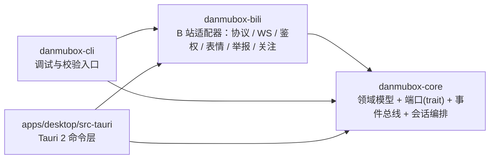

# danmubox（弹幕框）

> 定位：B 站直播间弹幕客户端（自用不发布），面向三端的聊天框式弹幕工具。
> 读者：项目作者本人，以及被指派参与本仓库编码的 AI agent。
> 更新时机：项目边界、技术栈、目录结构、文档清单或对外声明发生变化时。

## 1. 项目定位

| 项 | 值 |
|---|---|
| 中文名 | 弹幕框 |
| 英文名 / crate 前缀 | `danmubox` |
| bundle id | `dev.kksk.danmubox` |
| 形态 | 桌面 + 移动客户端（Tauri 2 外壳 + Rust 引擎 + React/TS 前端） |
| 定位 | B 站直播间弹幕客户端，自用不发布 |
| 分发 | 自用，不发布 |
| 技术栈 | Tauri 2 + Rust（`danmubox-core` + `danmubox-bili`）+ React/TS 前端 |

「弹幕框」复刻的是 B 站官方直播间的**聊天框**：一个按时间流动的文本消息列表。
项目不做视频播放，界面里没有播放器，只有侧边聊天框式的消息流与房间管理。

需求基线由用户手写、保存在 [`REQUIREMENTS.md`](REQUIREMENTS.md)；把它翻译成工程约定的**规范性契约**是
[`docs/contract.md`](docs/contract.md)。两者与本文冲突时，以契约文档为准。

## 2. 边界：做什么、不做什么

### 2.1 做

- 房间号 / 短号 / URL 解析为真实 `room_id`（一次拿到 `room_id` / `uid` / `live_status`）
- WebSocket 长连接收弹幕，心跳（WS 30s + HTTP 60s）、自动重连（5/10/20/40/60s 退避）、压缩解包（`protover` 0/1/2/3）
- 归一化为六种 `kind`：`danmaku` / `gift` / `superchat` / `interact` / `guard` / `system`
- 发弹幕（含被吞状态归一化）与举报弹幕
- 表情包库（按身份加载）、身份徽标（主播 / 房管 / 总督 / 提督 / 舰长）
- 礼物栏（独立礼物栏或与弹幕混合）、电池余额
- 关注列表（直播中置顶）、多房间标签页、虚拟列表、自动滚动、过滤与关键词告警
- 三种登录：游客、手填 Cookie（直接编辑 `config.toml`）、扫码（默认入口）
- 单次房内会话的内存弹幕缓冲（上限 5000 条）+ 房间内「刷新」手动重连

### 2.2 不做（本期明确排除）

| 排除项 | 说明 |
|---|---|
| 本地数据库 | 不建库、不落盘 |
| 弹幕回看与导出 | 不做回看、不做导出 |
| AI 原生接口 | 需求置空，本期不实现；只保留「后期接入 MCP」的架构兼容能力（`core` 的端口与事件总线不得假设消费方是 UI） |
| 词云 | 非核心功能，列入下期 |
| 视频流解码 | 不拉流、不解码、不播放视频，只消费弹幕协议 |
| iOS 端、Fold8 / 折叠屏适配 | 后期 enhancement，本期不纳入 |
| 后台保活 / 推送 | 前台运行即可，不做进程保活 |
| 应用商店发布 | 自用产物，不签名公证、不上架 |
| 系统级悬浮弹幕层 | 只做窗口内聊天框 UI，不做桌面悬浮层 |

## 3. 当前状态

| 阶段 | 状态 |
|---|---|
| 技术选型 | 已完成（结论见 `docs/decisions/`） |
| 文档基线 | 已按需求基线 [`REQUIREMENTS.md`](REQUIREMENTS.md) 重写，契约见 [`docs/contract.md`](docs/contract.md) |
| 代码 | **阶段 1 已完成**：`danmubox-core` / `danmubox-bili` / `danmubox-cli` 三个 crate 可编译、可运行，游客态已能连真实直播间收弹幕 |
| 构建 / 测试 / 运行 | 命令见 §8；`cargo test --workspace` 与 `cargo clippy -- -D warnings` 均通过 |
| 桌面端 | **尚未开始**（`apps/desktop` 未创建，属阶段 3） |

## 4. 目标平台

| 平台 | 本期 | 说明 |
|---|---|---|
| macOS | 是 | 主开发平台，桌面端一等目标 |
| Windows | 是 | 桌面端目标，依赖 WebView2 运行时 |
| Android | 是 | 移动端目标，Tauri 2 移动端构建 |
| iOS | 否 | 后期 enhancement |
| Linux | 否 | 未列入目标 |

## 5. 架构总览

`danmubox-core` 只含**领域模型、端口（trait）、事件总线与会话编排、本地文件读写**，
不含任何 B 站细节；所有 B 站协议、URL、字段下标、签名算法与 protobuf 定义集中在
`danmubox-bili`，由它实现 core 定义的端口。逆向或协议变更时只改 `danmubox-bili`。
上层消费面 `danmubox-cli` 与 `apps/desktop/src-tauri` 同时依赖 core 与 bili。



依赖方向是单向的（规范性）：`bili → core`，`cli` / `desktop → core + bili`。
**`core` 不得依赖 `bili`，也不得依赖 `tauri`。**

## 6. 目录结构

```text
danmubox/
  Cargo.toml                # Rust workspace
  rust-toolchain.toml
  crates/
    danmubox-core/          # 领域模型 + 端口(trait) + 事件总线 + 会话编排 + 本地文件（禁止依赖 tauri；禁止依赖任何具体上游实现）
    danmubox-bili/          # B 站适配器：实现 core 的端口（协议/WS/鉴权/WBI/扫码/表情/举报/关注）
    danmubox-cli/           # 调试与校验入口（阶段 1 用于脱离 UI 验证协议与适配器）
  apps/
    desktop/                # Tauri 2 应用：src-tauri/ + ui/（React + TS + Vite）
  docs/                     # 文档（索引见 §7）
  REQUIREMENTS.md           # 需求基线（用户手写）
  README.md
  AGENT.md
  CHANGELOG.md
```

## 7. 文档索引

| 文档 | 内容 | 主要读者 |
|---|---|---|
| [`docs/contract.md`](docs/contract.md) | **规范性契约（唯一事实源）**：命名、共享常量、领域模型、端口边界、IPC 与本地文件契约、偏好键、写作要求 | 全体；写代码前必读 |
| [`REQUIREMENTS.md`](REQUIREMENTS.md) | 需求基线（用户手写），契约由它翻译而来 | 全体 |
| [`docs/architecture.md`](docs/architecture.md) | 分层、crate 依赖图、core 模块划分、并发模型、会话编排 | 实现者 |
| [`docs/protocol.md`](docs/protocol.md) | B 站弹幕协议：包头、op、protover、认证与心跳包（WS + HTTP）、子包拆分、重连状态机 | 实现者 |
| [`docs/auth.md`](docs/auth.md) | 三种登录模式、buvid3、WBI 签名、扫码状态机、`config.toml` 凭据读写 | 实现者 |
| [`docs/ipc.md`](docs/ipc.md) | Tauri IPC 命令与事件、载荷类型、前端 store、订阅生命周期 | 前端实现者 |
| [`docs/ui.md`](docs/ui.md) | 信息架构、布局线框、虚拟列表、滚动与过滤规则、六种 kind 渲染、礼物栏与徽标 | 前端实现者 |
| [`docs/testing.md`](docs/testing.md) | 测试金字塔、协议 fixture、回放、端口契约、三端冒烟 | 实现者 |
| [`docs/distribution.md`](docs/distribution.md) | 三端构建步骤与产物、签名策略、工具链前置条件 | 作者 |
| [`docs/operations.md`](docs/operations.md) | 日常操作、故障排查决策树、脱敏规则、卸载与残留清理 | 作者 |
| [`docs/roadmap.md`](docs/roadmap.md) | 阶段里程碑、验收标准、风险与 enhancement 排期 | 作者、agent |
| [`docs/decisions/README.md`](docs/decisions/README.md) | ADR 索引与模板 | 作者、agent |
| [`docs/decisions/0001-tauri-over-flutter.md`](docs/decisions/0001-tauri-over-flutter.md) | 选型：范围收敛到三端后 Tauri 胜出 | 作者 |
| [`docs/decisions/0002-rust-core-shared-surfaces.md`](docs/decisions/0002-rust-core-shared-surfaces.md) | core 无 UI 依赖，端口化后由各消费面共享 | 实现者 |
| [`docs/decisions/0003-protover3.md`](docs/decisions/0003-protover3.md) | 连接协商 `protover=3`（brotli），解码兼容 0/1/2/3 | 实现者 |
| [`docs/decisions/0004-upstream-isolation.md`](docs/decisions/0004-upstream-isolation.md) | B 站实现全部隔离在 `danmubox-bili`，core 只留端口 | 实现者 |
| [`docs/decisions/0005-no-local-database.md`](docs/decisions/0005-no-local-database.md) | 不建库不落盘，弹幕仅保留单次房内会话的内存缓冲 | 实现者 |
| [`docs/decisions/0006-room-supervisor-tasks.md`](docs/decisions/0006-room-supervisor-tasks.md) | 每房间一个 supervisor task + broadcast | 实现者 |
| [`docs/decisions/0007-credential-file.md`](docs/decisions/0007-credential-file.md) | 凭据存明文 `config.toml`（0600），不进日志 / 前端 / 仓库 | 实现者 |
| [`docs/decisions/0008-frontend-stack.md`](docs/decisions/0008-frontend-stack.md) | React + TS + Vite + TanStack Virtual + Zustand + CSS Modules | 前端实现者 |

## 8. 开发命令

Rust 侧的三个 crate 已可编译运行，下表除桌面端外均为**当前可用**命令。

| 用途 | 命令 | 说明 |
|---|---|---|
| 工作区编译检查 | `cargo check --workspace` | 全 crate 检查 |
| 全量测试 | `cargo test --workspace` | 单元 + 集成 |
| core 单 crate 测试 | `cargo test -p danmubox-core` | 领域模型、端口、会话缓冲、偏好 |
| bili 单 crate 测试 | `cargo test -p danmubox-bili` | 协议解包、WBI、命令归一化、protobuf |
| 格式检查 | `cargo fmt --all -- --check` | rustfmt |
| Lint | `cargo clippy --workspace --all-targets -- -D warnings` | warning 视为错误 |
| 解析房间 | `cargo run -p danmubox-cli -- resolve <房间号/短号/URL>` | 打印房间元信息 |
| 游客态看弹幕 | `cargo run -p danmubox-cli -- watch <房间> --seconds 60` | 脱离 UI 验证协议；`--quiet` 只看汇总 |
| 抓原始载荷 | `DANMUBOX_LOG=debug cargo run -p danmubox-cli -- watch <房间>` | 字段实测校准的采集入口（`docs/protocol.md` 附录 B） |
| 桌面端开发 | `npm --prefix apps/desktop run dev` | **尚未可用**，`apps/desktop` 属阶段 3 |

## 9. 数据与隐私声明

| 项 | 说明 |
|---|---|
| 网络出口 | 仅连接 B 站直播相关域名（WS 长连与 REST 接口） |
| 凭据文件 | `config.toml`，**明文 TOML**，权限 **0600**，位于本机数据目录；可直接手工编辑，「手填 Cookie」即编辑该文件 |
| 偏好文件 | `prefs.json`，只存被显式改过的界面偏好，不含任何凭据 |
| 弹幕缓冲 | 仅内存环形缓冲，上限 5000 条（`history.buffer_rows`）；生命周期 = 一次房内会话，离开房间即销毁清空，重进是新会话 |
| 数据目录 | macOS `~/Library/Application Support/danmubox`；Windows `%APPDATA%\danmubox`；Android 应用私有目录 |
| 是否落盘 | 除 `config.toml` 与 `prefs.json` 外不落盘；无数据库、无历史文件、无导出 |
| 遥测 | 无。不上报崩溃、不埋点、不回传任何使用数据 |

安全红线：`SESSDATA`、`bili_jct`、`DedeUserID` **不得**出现在日志、前端明文、仓库、崩溃上报中；
凭据在本机以明文存储，使用者需自行保护数据目录。

## 10. 非官方声明与免责

- 本项目是**非官方**第三方客户端，与哔哩哔哩（B 站）及其关联公司**无任何隶属、合作或背书关系**。
- 「B 站」「哔哩哔哩」「bilibili」等名称与商标归其权利人所有，本项目仅作描述性使用。
- 本项目自用、不发布、不商用、不提供任何形式的服务；使用者需自行遵守 B 站用户协议与当地法律法规。
- 协议实现依据公开可见的客户端行为整理，B 站可能随时调整协议；因此产生的功能失效由使用者自行承担。
- 账号安全由使用者自负：凭据以明文存放在本机数据目录，请勿在不可信环境中放置或共享该文件。
- 本项目按「现状」提供，不附带任何明示或暗示的担保。
