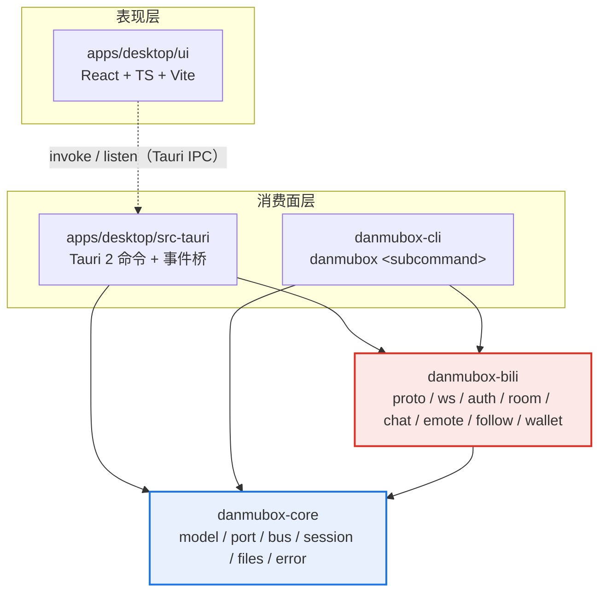
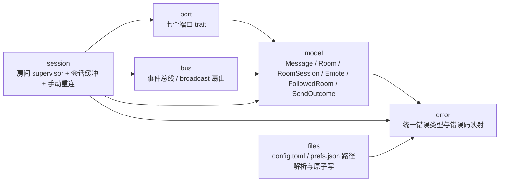
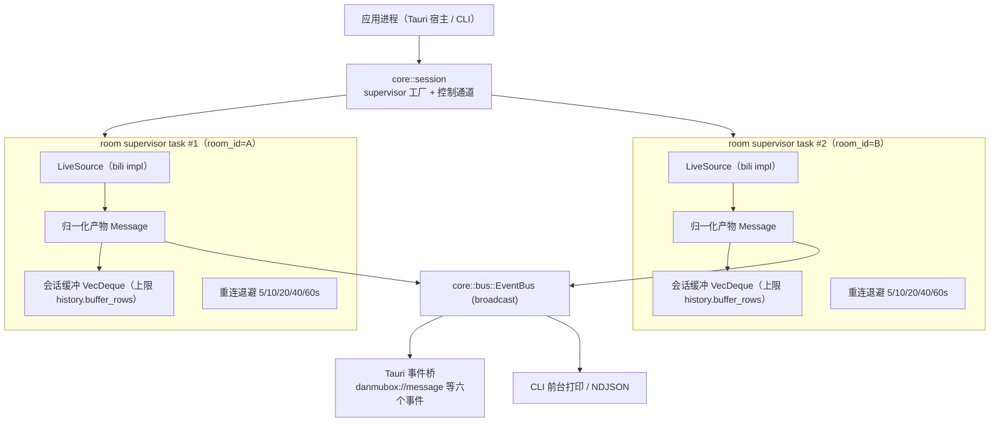
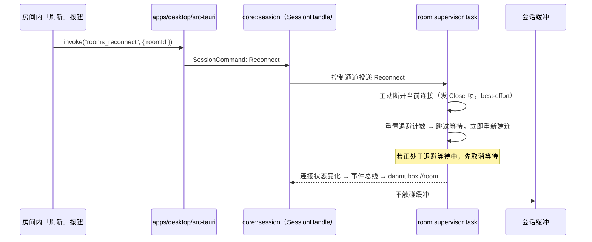
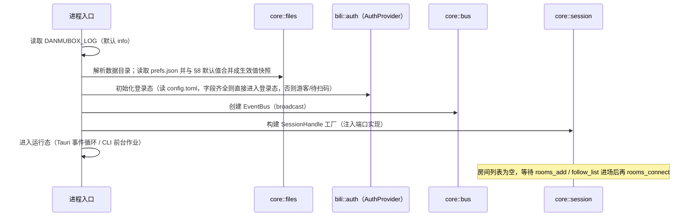

# danmubox 架构

> 定位：danmubox 的分层、crate 依赖方向、端口/适配器边界、并发模型、本地文件与可观测性总览，回答「代码放哪一层、数据怎么流动、进程怎么起停」。
> 读者：实现与评审 `danmubox-core` / `danmubox-bili` 的开发者、排查连接与性能问题的维护者、需要判断改动落点的 AI 编码 agent。
> 更新时机：新增或删除 crate、调整 core 的模块边界、改变并发与背压策略、增删端口、改动本地文件形态、改动启动/关闭序列或脱敏规则时，必须同步修改本文；契约 §3 / §4 / §6 变更时本文必须跟随。

---

## 1. 分层与依赖方向

系统分四层，依赖只能自上而下单向流动；`danmubox-bili` 是**唯一**允许接触 B 站协议知识的一层。

| 层次 | 组成 | 职责 | 禁止 |
|---|---|---|---|
| 表现层 | `apps/desktop/ui`（React + TS + Vite，运行在 Tauri WebView） | 虚拟列表渲染、过滤、交互、乐观更新 | 直接访问 B 站接口；持有 Cookie 明文 |
| 消费面层 | `apps/desktop/src-tauri`、`danmubox-cli` | 把 core 的事件与命令翻译成自己的协议：Tauri IPC、终端文本 | 实现协议解包；直接持有 WS 连接；自带第二套领域模型 |
| 引擎层 | `danmubox-core` | 领域模型、端口（trait）、事件总线、会话编排（supervisor + 会话缓冲）、本地文件读写 | 依赖 `danmubox-bili`；依赖 `tauri`；出现任何 B 站 URL、字段下标、签名算法、protobuf 定义 |
| 适配器层 | `danmubox-bili` | 实现 core 的全部端口：协议编解码、WS 生命周期、鉴权/WBI/扫码、房间解析、表情、举报、关注、钱包 | 定义领域模型；依赖 `tauri` 或任何 UI 框架 |

依赖方向（规范性，契约 §3）：`danmubox-bili` → `danmubox-core`；`danmubox-cli` → `core` + `bili`；`apps/desktop/src-tauri` → `core` + `bili`。**`core` 不得依赖 `bili`，也不得依赖 `tauri`。**

> **后期想法（本期不实现）**：接入 MCP。为此刻意保持架构兼容——core 的端口与事件总线**不得假设消费方是 UI**，新能力一律经端口暴露，不得直接写进 Tauri 命令层。本期不定义任何 MCP 工具、协议或端点。

消费面共享 core 的硬性规则：

1. **只有 `danmubox-bili` 能触达 B 站**。上层不得自行 `reqwest` 访问 B 站 REST，也不得自建 WS。
2. **上层不得再定义第二套 `kind` / 错误码 / 偏好键**。对外枚举取自契约 §5，偏好键取自契约 §8。
3. **凭据只在 `AuthProvider` 实现内解引用使用**；上层拿到的只有会话状态位（模式 / uid / uname / 是否登录 / 失效时间），永远不含 Cookie 值。

## 2. crate 依赖图

图中箭头 `A --> B` 表示「A 依赖 B」。

约束的落地方式：

| 约束 | 检查手段 |
|---|---|
| `core` 不依赖 `bili` | `crates/danmubox-core/Cargo.toml` 依赖表中不存在 `danmubox-bili`；`cargo tree -p danmubox-core` 的输出中不出现它 |
| `core` 不依赖 `tauri` | `crates/danmubox-core/Cargo.toml` 依赖表中不存在 `tauri`；评审时人工核对 |
| B 站知识只在 `bili` | 全仓检索 B 站域名、`protover`、`op` 码字面量、`DANMU_MSG` 等字样，命中只允许落在 `crates/danmubox-bili/` 与 `protocol.md` |
| 上层之间不互相依赖 | `danmubox-cli` 与 `apps/desktop/src-tauri` 互不引用；共享的只有 core 的模型与端口 |
| `core` 可独立编译与测试 | `danmubox-core` 单独编译不需要 WebView、不需要 Tauri 工具链、不发起网络 |

### 2.1 `danmubox-core` 模块划分

| 模块 | 职责 | 边界（不做的事） |
|---|---|---|
| `model` | 契约 §5 的 `Message`（`kind` 六值）、`Room`、`RoomSession`、`Emote`、`FollowedRoom`、`SendOutcome`，以及查询参数结构 | 不含 IO；不含业务判断 |
| `port` | 七个端口 trait 的定义（见 §3），只依赖 `model` | 不含任何实现；不含 B 站类型 |
| `bus` | 进程内事件扇出：消息流、房间状态、会话状态、进程状态、日志；每个订阅者独立游标 | 不缓存消息（缓冲在 `session`）；不做序列化 |
| `session` | 每房间一个 supervisor task；调用 `LiveSource` 收事件并写入该房间的会话缓冲；驱动重连状态机；持有 `rooms_reconnect` 的控制通道 | 不解析协议（拿到的已是 `Message`）；不落盘 |
| `files` | 数据目录解析、`config.toml`（0600）与 `prefs.json` 的读写与原子替换、损坏回落 | 不理解凭据语义；不做网络 |
| `error` | `DanmuboxError` 枚举与进程内错误归一化 | 不定义 IPC 错误码集合（见 `ipc.md` §2） |

### 2.2 `danmubox-bili` 模块划分

| 模块 | 职责 | 实现的端口 |
|---|---|---|
| `proto` | 16 字节大端头读写、载荷解码（`0` 裸 JSON / `1` 帧头版本 / `2` zlib / `3` brotli）、`op=5` 子包递归拆分、解压上限与丢弃计数 | —（被 `ws` 使用） |
| `ws` | 连接、认证包、WS 心跳（op=2）与 HTTP 心跳（60s）、`op=8` 认证回应处理、退避重连 | `LiveSource` |
| `auth` | 扫码流程、凭据读取与校验、`buvid3`、WBI 签名、房间连接令牌获取 | `AuthProvider` |
| `room` | 房间解析（`getRoomPlayInfo`）、房间元信息、关注列表与直播状态 | `RoomCatalog` |
| `chat` | 发弹幕（含被吞状态归一化）、举报弹幕 | `DanmakuSender`、`DanmakuReporter` |
| `emote` | 按 `RoomSession` 身份加载表情包库 | `EmoteProvider` |
| `wallet` | 电池余额 | `WalletProvider` |
| `normalize` | `cmd` → `kind` 归一化（取值表见 `protocol.md`） | —（被 `ws` 使用） |

## 3. 端口与适配器（重点）

端口是 core 与 bili 之间**唯一**的接缝：core 只看见 trait 与 `model` 里的领域结构，bili 只负责把上游的原貌翻译成这些结构。

| 端口（契约 §3） | 职责（契约原文） | 输入 → 输出领域模型 | 实现落点 |
|---|---|---|---|
| `AuthProvider` | 登录态、凭据读写、扫码流程、`buvid3` | 无输入 → `SessionStatus`；`QrStart` / `QrPoll`；`config.toml` 的六个凭据字段 | `bili::auth` |
| `LiveSource` | 房间解析、建立/断开连接、事件流 | `room_id` + 连接参数 → `Room`；连接期间持续产出 `Message` 与房间状态变化 | `bili::ws`（解析经 `bili::room`） |
| `DanmakuSender` | 发送弹幕（含被吞状态归一化） | `room_id` + 内容/颜色/模式 → `SendOutcome`（被吞时附上游回显内容与原始 code/message） | `bili::chat` |
| `DanmakuReporter` | 举报弹幕 | `room_id` + `upstream_id` + 举报类型 → 成功/失败与上游 code | `bili::chat` |
| `EmoteProvider` | 按身份加载表情包库 | `RoomSession`（我在该房间的粉丝牌与大航海等级、是否房管）→ `Emote[]` | `bili::emote` |
| `RoomCatalog` | 关注列表、直播状态、房间元信息 | 无输入 / 刷新指令 → `FollowedRoom[]`（`live_status == 1` 置顶排序由消费面按契约 §5 渲染） | `bili::room` |
| `WalletProvider` | 电池余额 | 无输入 → 余额数值 | `bili::wallet` |

逐条边界说明：

| 端口 | core 侧只允许知道 | 全部留在 `danmubox-bili` 的东西 |
|---|---|---|
| `AuthProvider` | 会话状态位、二维码的 `key` / `url` / 过期时间、扫码归一化状态（`pending` / `confirmed` / `expired`） | 扫码接口地址与轮询间隔、Cookie 字段名映射、`buvid3` 获取方式、WBI 签名算法、失效判定 |
| `LiveSource` | `Room` 元信息、`Message` 流、连接状态枚举与断开原因 | wss 地址获取、认证包 body 构造、心跳 body、`protover` 协商、子包拆分、`cmd → kind` 映射、退避实现 |
| `DanmakuSender` | `SendOutcome` 七种取值、被吞时上游回显的文本 | 请求参数拼装、`msg`/`message` 为 `"f"` / `"k"` 的判定、错误码到 `SendOutcome` 的映射表 |
| `DanmakuReporter` | `room_id` + `upstream_id` + 举报类型 | 举报接口路径、类型码取值、CSRF 参数 |
| `EmoteProvider` | `Emote` 五个字段与 `package_kind` 四值 | 表情包接口、房间专属表情的鉴权、`package_kind` 的上游判定 |
| `RoomCatalog` | `FollowedRoom` 四字段与分组名 | 关注列表分页、直播状态字段位置 |
| `WalletProvider` | 一个数值 | 余额接口与单位换算 |

**为什么逆向或协议变更只改 `danmubox-bili`**：core 与 UI 之间、core 与 bili 之间的数据类型是契约 §5 的领域模型，不含任何上游标识；所有「上游长什么样」的知识被压在一个 crate 内的 `proto` / `ws` / `auth` / `room` / `chat` / `emote` / `wallet` 表格里。上游改字段下标、改签名、改包结构或改接口路径时，改动收敛为「重写 `bili` 内对应模块 + 调整该端口的映射」，`core` 的 supervisor、会话缓冲、事件总线与全部 Tauri 命令签名均不变。这条隔离能力是 REQUIREMENTS.md 的直接需求（B 站 API 不可控、可能有后期逆向需求），也是 §2 约束表中「B 站知识只在 `bili`」的检查点。

端口之外的调用方向：**consumer → core → port ← bili**。consumer 从不直接调用 `bili` 的类型，只调用 core 暴露的句柄；core 在构造时接收端口实现（`AuthProvider`、`LiveSource` 等 trait object），`apps/desktop/src-tauri` 与 `danmubox-cli` 是唯一知道「用 `bili` 实现注入」的地方。

## 4. 并发模型

### 4.1 任务拓扑

每连接一个房间，`core::session` 生成一个**房间 supervisor task**；房间之间不共享连接。

事件路径是**一份产出、两处消费**：适配器产出的 `Message` 进入事件总线后，同时喂给 (a) UI 订阅（经 `apps/desktop/src-tauri` 的事件桥转成 `danmubox://message` 等事件）、(b) 该房间的会话缓冲。两条路径互不阻塞：缓冲写入是 supervisor task 内的常量时间操作，广播投递不阻塞发送端。

| 任务 | 数量 | 生命周期 | 失败影响 |
|---|---|---|---|
| 房间 supervisor task | 每连接房间 1 个 | `rooms_connect` 创建；`rooms_disconnect` / `rooms_remove` / 进程退出时取消 | 只影响该房间；其它房间继续工作 |
| 心跳定时器（WS 30s + HTTP 60s） | 每个 supervisor 各 1 组 | 随 supervisor | 心跳写失败立即判定连接不可用并进入重连 |
| 事件总线 | 进程内 1 个 | 随进程 | 单个订阅者落后不影响其它订阅者（见 §4.3） |

### 4.2 会话缓冲的所有权与生命周期

| 项 | 规则 |
|---|---|
| 所有者 | `core::session` 的 `SessionHandle`：每个活跃房间一个，随 supervisor 创建设立、随 supervisor 取消销毁 |
| 创建 | 进入某直播间（`rooms_connect` 成功建立会话）时创建，与 `RoomSession`（我在该房间的身份）同生命周期 |
| 销毁 | 离开该房间即**销毁并清空**：`rooms_disconnect` / `rooms_remove` / 关闭房间标签 / 进程退出。再次进入同一房间是全新会话，缓冲为空 |
| 容量 | 5000 条环形缓冲，容量由偏好键 `history.buffer_rows` 覆盖；超出丢最旧 |
| 写入 | 只有该房间的 supervisor 写入；`push_back` 后若 `len > capacity` 则 `pop_front`，常量时间 |
| 读取 | 只有 `history_query` 命令读（经 `RwLock` 读锁），供当前会话内向上回滚查看 |
| 偏好变更 | `history.buffer_rows` 改小后，下一次写入即按新容量裁剪（可能一次性丢弃最旧若干条）；改大不恢复已丢的消息 |
| 不变量 | 不落盘、不跨会话、不导出；除本会话缓冲外，core 不保留任何历史 |

契约 §4.3 的取舍原样适用：B 站不提供弹幕历史回放接口，因此「历史」只能是本地本次会话内的缓冲；若将来需要跨会话历史，方案是追加式 JSONL 文件（按天分片），届时另立 ADR。

### 4.3 通道与背压

| 通道 | 类型 | 容量（设计值） | 语义 |
|---|---|---|---|
| 端口产出 → bus | `broadcast::Sender<CoreEvent>` | 1024 | 多订阅者扇出，每个订阅者独立游标；写端永不阻塞 |
| 端口产出 → 会话缓冲 | supervisor task 内直接写 | 由 `history.buffer_rows` 决定 | 常量时间写入，不经过跨 task 队列 |
| 命令面 → supervisor | `mpsc` + `CancellationToken` | 控制指令（连接 / 断开 / **手动重连**） | 指令串行应用，不与收包竞争缓冲 |
| `history_query` → supervisor | 共享缓冲的 `RwLock` 读锁 | — | 只读；不阻塞收包（写锁仅覆盖一次 `push_back`） |

背压与丢弃策略：

| 场景 | 行为 |
|---|---|
| 订阅者落后（`Lagged`） | 订阅者不静默跳过：丢弃落后区间并对该房间重新执行一次 `history_query` 补齐，再继续接收实时流 |
| 会话缓冲溢出 | 丢最旧一条，前端在会话缓冲切片的 `droppedByRoom` 计数上提示「已折叠 N 条早期消息」 |
| 上游推送无法识别 | 不打断连接；按 `system` 归一化并计数，连续异常触发一次告警 |
| 前端渲染跟不上 | UI 按帧节流批量插入，不向 core 回压；峰值处理见 `ui.md` |

不采用的策略：无界队列（内存不可控）、写端阻塞（一个慢订阅者冻结整个房间）、静默丢包（前端与 core 会话缓冲不一致）。

### 4.4 手动重连

房间内「刷新」按钮的唯一动作是 IPC `rooms_reconnect`（REQUIREMENTS.md：长连接卡住或推流暂时中断时手动重连）。

| 规则 | 内容 |
|---|---|
| 语义 | 打断当前连接并**立即**重连，不等退避周期；重连前重新走 `getDanmuInfo`，不复用上一轮连接参数 |
| 缓冲 | 不变。仍属同一次会话，已收到的消息全部保留 |
| 会话 | 不结束、不重建 `RoomSession`；不触发缓冲清空 |
| 幂等 | 正在建连 / 正在退避 / 已连接三种状态下均可调用；已在连接中时不叠加第二条连接 |
| 错误 | 房间不存在 → `ROOM_NOT_FOUND`；本地上游解析失败 → `UPSTREAM_ERROR`；建连后的失败由 supervisor 在后台按退避处理 |
| 通知 | 连接状态与重连原因经 `danmubox://room` 下发（`reason` 区分 `reconnect` / `backoff` / `closed`） |
| 与自动重连的关系 | 自动重连继续按 5s / 10s / 20s / 40s / 60s 封顶退避；手动重连只是把「下一次尝试」提前到当下 |

## 5. 本地文件

core 只读写两个本地文件，位置都在契约 §4 的数据目录下：macOS `~/Library/Application Support/danmubox`；Windows `%APPDATA%\danmubox`；Android 应用私有目录。

| 文件 | 内容 | 权限 | 写入方式 | 读取容错 |
|---|---|---|---|---|
| `config.toml` | 凭据：`sessdata` / `bili_jct` / `dede_user_id` / `dede_user_id_ck_md5` / `buvid3` / `buvid4` / `sid`（契约 §4.1 的 `[bilibili]` 段） | **0600** | 原子替换：写临时文件（同目录）→ `fsync` → `rename` | 缺失或必填字段为空 → 按游客启动，走扫码 |
| `prefs.json` | 界面与过滤偏好，键即契约 §8 的偏好键 | 默认（不含凭据） | 原子替换，同一套临时文件 + rename 路径 | 文件损坏或 JSON 非法 → 按默认值启动，并把损坏副本保留为 `prefs.json.bak` |

规则：

1. **凭据不加密**：形态是明文 TOML，靠 0600 与「只在本机数据目录」约束（契约 §4.1）。「手填 Cookie」在本设计中就是直接编辑 `config.toml`，不另做导入界面、不做导入命令。
2. **偏好不写进 `config.toml`**：TOML 往返会丢注释与排版，程序每次改偏好都重写凭据文件是事故面；偏好只进 `prefs.json`（契约 §4.1 / §4.2）。
3. 两个文件都只由 `core::files` 落地；凭据字段的语义（哪些字段必填、何时判定失效）由 `bili::auth` 的 `AuthProvider` 实现决定。
4. 房间列表只存在于进程内存中，不落盘：契约 §4 只允许上述两个本地文件，因此进程重启后房间列表为空，由 `rooms_add` / `follow_list` 重新建立。
5. `prefs.json` 只写**被显式改过**的键；读时与默认值合并成生效值全集（契约 §8 读写语义）。
6. 安全红线见 §9.3：凭据类型不派生 `Debug` / `Display` / `Serialize`，从类型层面杜绝误打印。

## 6. 进程拓扑

| 宿主进程 | 内含 | 监听 | 说明 |
|---|---|---|---|
| `apps/desktop`（Tauri 2 应用） | `core` + `bili` + Tauri IPC 桥 | **不监听任何端口** | 默认分发形态；UI 在 WebView 中，通过 `invoke` / `listen` 与 Rust 通信 |
| `danmubox <子命令>` | `core` + `bili` | **不监听任何端口** | 阶段 1 用于脱离 UI 验证协议与适配器的一次性作业（解析房间、前台收包打印、发一条弹幕、查关注），退出即释放 |

跨进程访问一律不存在：UI 与引擎同进程，Rust ↔ JS 只经 Tauri IPC（契约 §7）。

## 7. 启动与关闭序列

### 7.1 启动

顺序是刻意的：

1. **偏好早于 UI**：UI 首帧就拿到生效值快照，不需要「先渲染再闪一下改样式」。
2. **凭据早于任何连接**：连接参数需要登录态参与签名，时序上不会出现「游客连接先建立、登录后重连」。
3. **认证回应 `code=0` 才算认证成功**；非 0 一律按认证失败处理并进入退避重连，**不得**在未知 code 上编造含义（契约 §6）。
4. **重连前必须重新解析房间连接参数**（契约 §6），不得复用上一轮的地址与令牌。

### 7.2 关闭

| 步骤 | 动作 | 目的 |
|---|---|---|
| 1 | 接收退出信号 / Tauri 窗口关闭 | 进入优雅关闭，拒绝新命令 |
| 2 | 取消所有房间 supervisor（取消令牌） | 停止收包；停止写会话缓冲 |
| 3 | 向各连接发送 Close 帧（best-effort，超时不阻塞退出） | 让服务端尽快回收连接 |
| 4 | 丢弃全部会话缓冲与房间列表 | 缓冲不落盘，进程退出即丢（契约 §4.3） |
| 5 | 进程退出 | — |

强制退出（进程被杀）时第 3 步可能未执行：丢失的只是未展示的实时消息，不涉及任何持久化状态，自用场景已接受。

## 8. 错误与重试策略

统一错误类型在 `core::error`；IPC 错误对象与错误码集合见 `ipc.md` §2（本文不重复定义）。与连接相关的重试不走错误码，走 supervisor 内部状态机。

| 场景 | 行为 |
|---|---|
| 建连失败 / 中途断开 | 按 **5s / 10s / 20s / 40s / 60s 封顶**退避重连（契约 §4） |
| WS 心跳写失败 | 立即判定连接不可用，进入退避重连，不等待下一个周期 |
| HTTP 心跳失败 | 视为连接不可用，进入退避重连（缺该心跳连接会被上游判死） |
| 认证回应非 0 | 视为认证失败，退避重连；连续失败升级为会话状态告警 |
| 重连 | 重连前重新走 `getRoomPlayInfo` / 连接参数获取，不复用过期参数 |
| 单包解压超限 | 丢弃该包并计数（上限 16 MiB，防解压炸弹），不打断连接 |
| 上游无法识别的推送 | 不打断连接；按 `system` 归一化并计数 |
| 发弹幕节流 | 同房间最小间隔 2s；相同内容 5s 内去重（契约 §4），命中则不发起请求 |
| 发弹幕被吞 | 不重试、不重发，把结果作为 `SendOutcome` 交给前端（见 `ipc.md` §7） |

## 9. 可观测性

### 9.1 日志

| 项 | 规则 |
|---|---|
| 开关 | 环境变量 `DANMUBOX_LOG`（契约 §4），默认 `info` |
| 目标 | stdout / stderr；同时进入 ring buffer，供 Tauri 事件 `danmubox://log` 推送给前端调试面板 |
| 结构 | 时间戳、级别、target、span 路径、消息、结构化字段 |
| 级别约定 | `error` 需人工介入；`warn` 可自恢复（重连、丢包）；`info` 生命周期事件；`debug` 包级明细（解包长度、op、protover）；`trace` 逐条消息 |

### 9.2 tracing span 设计

| span | 字段 | 何时创建 | 关键子 span |
|---|---|---|---|
| `app` | `version`、`platform` | 进程启动 | `room`、`files` |
| `room` | `room_id`、`room_title`、`live_status` | 房间 supervisor 创建 | `live.session`、`session.buffer` |
| `live.session` | `attempt`（第几次连接）、`protover`、`host` | 每次建连 | `live.heartbeat`、`live.recv`、`live.reconnect` |
| `live.recv` | `op`、`protover`、`bytes` | 每收到一个顶层包 | `proto.unpack` |
| `proto.unpack` | `subpackets`、`decompressed_bytes`、`dropped` | 解压与子包拆分 | `model.normalize` |
| `model.normalize` | `cmd`、`kind`、`dropped_fields` | 归一化每条业务消息 | — |
| `session.buffer` | `room_id`、`len`、`capacity`、`evicted` | 缓冲裁剪 | — |
| `live.reconnect` | `attempt`、`reason`（`backoff` / `manual`） | 自动或手动重连 | — |
| `auth.login` | `mode`、`uid`（脱敏后）、`result` | 登录动作 | `auth.qrcode` |
| `chat.send` | `room_id`、`content_len`、`outcome` | 发弹幕 | — |
| `files.write` | `file`（`config` / `prefs`）、`atomic` | 本地文件写入 | — |

规则：

1. span 必须能回答「哪个房间、第几次连接、哪个 op、是不是被丢弃」；缺这三项的日志在排障时不可用。
2. 每个 supervisor 的长生命周期工作放在 `live.session` 子 span 下，避免消息级日志丢失房间上下文。
3. 不在热路径做字符串拼接：字段用结构化 key-value 记录，`debug` / `trace` 关闭时不产生格式化开销。

### 9.3 脱敏（安全红线，规范性）

`SESSDATA`、`bili_jct`、`DedeUserID` **不得**进日志、不得进前端明文、不得进仓库、不得进崩溃上报（契约 §4.1 原文）。文档与脚本中的示例一律使用非真实示例值。

| 数据 | 允许的记录形式 | 禁止 |
|---|---|---|
| `SESSDATA` | 仅布尔「已配置 / 未配置」 | 原始值、前后缀、长度 |
| `bili_jct` | 仅布尔「已配置 / 未配置」 | 原始值 |
| `DedeUserID` | 仅布尔「已配置 / 未配置」 | 原始值 |
| `buvid3` / `buvid4` | 可记录（非登录凭据，仅设备标识） | — |
| UID | 可记录 | — |
| 弹幕内容 | 允许出现在正文日志 | 不作为凭据类用途 |
| 认证包 body | 只记录 `uid`、`roomid`、`protover`、`type`；`key` 恒记为空 | 记录 `key` 或请求头 |
| panic / 崩溃上报 | 关闭未捕获异常上报；panic hook 只输出经过脱敏的 backtrace | 把环境变量、请求头、凭据结构整体序列化 |

实现要求：凭据类型不派生 `Debug` / `Display` / `Serialize`（或用手写实现输出固定的脱敏标记），从类型层面杜绝误打印。

## 10. 待实测校准

以下事实依赖 B 站线上行为，实现期未实测，不得凭空给出数值。核对方法统一为：`DANMUBOX_LOG=debug` 启动 → 复现对应场景 → 从 Tauri 事件 `danmubox://log`（或 `danmubox-cli` 前台输出）取原始记录 → 回填本表。

| 待确认项 | 现状 | 核对方法 | 责任人动作 |
|---|---|---|---|
| 认证回应非 0 code 的含义分布（哪些表示令牌过期、哪些表示风控） | 统一按「认证失败 → 退避重连」处理 | 触发一次失效登录，记录 `op=8` 的 `code` 与前后日志 | 协议层维护者：若出现可区分的稳定分组，补一张 `code` 分组表并区分「重新签名」与「重新解析连接参数」 |
| 服务端静默断开阈值（多久收不到任何包即被判超时） | 不设额外读超时，仅靠 30s WS 心跳写失败与 socket 错误触发重连 | 长连观察：记录最后收包时间与断开时刻 | 协议层维护者：若普遍早于心跳周期被动断开，评估增加读超时 |
| 单 IP / 单房间的订阅与限流阈值 | 不做本地额外限流（仅发弹幕节流：同房间 2s、同内容 5s） | 逐步增加房间数与消息量，记录首次收到拒绝/断开的规模 | 架构维护者：超限时在 `bus` 与端口之间增加本地令牌桶 |
| 电池余额的单位与刷新时机 | 只透传上游原始数值，不做换算 | 登录后读取一次，消费一份礼物后再读一次，比对差值 | 钱包端口维护者：确定单位与是否需要主动刷新后回填本节 |
| 举报弹幕的类型码取值 | 只透传调用方给出的类型，不校验语义 | 用官方界面举报一次同一条弹幕并抓取请求参数 | 协议层维护者：回填类型码表并同步 `protocol.md` |
| `host_list` 节点存活与切换收益 | 每次重连重新解析连接参数，取列表首位 | 记录各 host 的建连成功率 | 协议层维护者：确认是否需要在同一次退避内轮换 host |

---

相关文档：`protocol.md`（协议细节与 `cmd → kind` 归一化表）、`auth.md`（登录、凭据与扫码状态机）、`ipc.md`（Tauri IPC 命令与事件契约）、`ui.md`（渲染、过滤与性能预算）、`decisions/0002-rust-core-shared-surfaces.md`、`decisions/0004-upstream-isolation.md`、`decisions/0005-no-local-database.md`、`decisions/0006-room-supervisor-tasks.md`。
