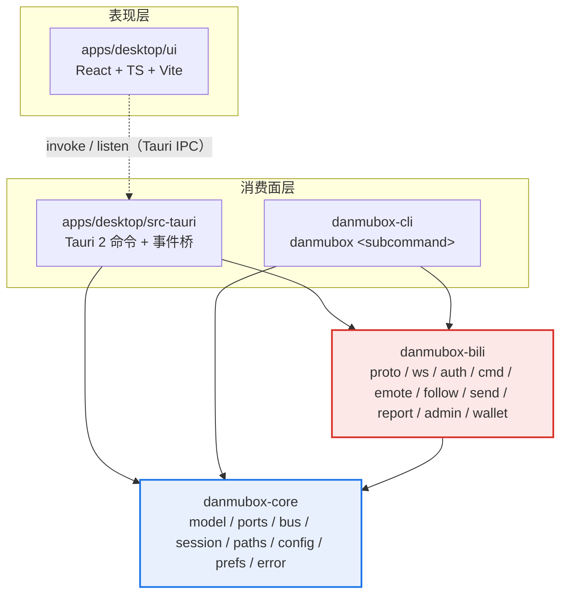
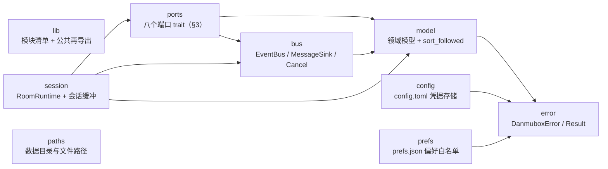
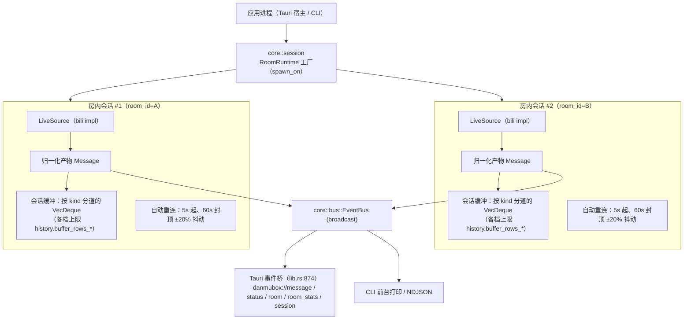
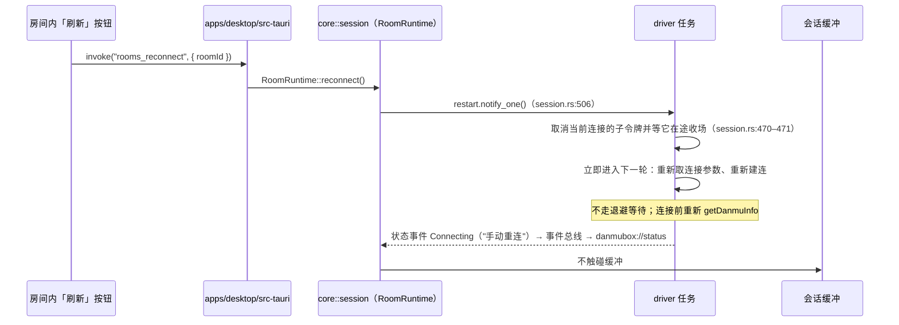
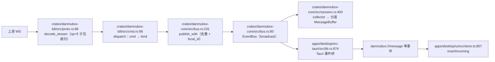
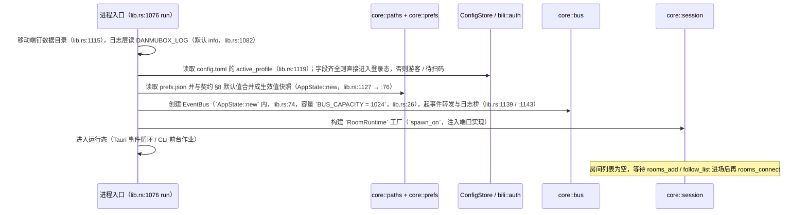

# danmubox 架构

## 1. 分层与依赖方向

系统分四层，依赖只能自上而下单向流动；`danmubox-bili` 是**唯一**允许接触 ac站协议知识的一层。

| 层次 | 组成 | 职责 | 禁止 |
|---|---|---|---|
| 表现层 | `apps/desktop/ui`（React + TS + Vite，运行在 Tauri WebView） | 虚拟列表渲染、过滤、交互、乐观更新 | 直接访问 ac站接口；持有 Cookie 明文 |
| 消费面层 | `apps/desktop/src-tauri`、`danmubox-cli` | 把 core 的事件与命令翻译成自己的协议：Tauri IPC、终端文本 | 实现协议解包；直接持有 WS 连接；自带第二套领域模型 |
| 引擎层 | `danmubox-core` | 领域模型、端口（trait）、事件总线、会话编排（每房间一个 `RoomRuntime` + 会话缓冲）、本地文件读写 | 依赖 `danmubox-bili`；依赖 `tauri`；出现任何 ac站 URL、字段下标、签名算法、protobuf 定义 |
| 适配器层 | `danmubox-bili` | 实现 core 的全部八个端口（`crates/danmubox-core/src/ports.rs:87`–`296`）：协议编解码、WS 生命周期、鉴权/WBI/扫码、房间解析、表情、举报、关注、钱包、房管（禁言 / 黑名单 / 屏蔽词） | 定义领域模型；依赖 `tauri` 或任何 UI 框架 |

依赖方向（规范性，契约 §3）：`danmubox-bili` → `danmubox-core`；`danmubox-cli` → `core` + `bili`；`apps/desktop/src-tauri` → `core` + `bili`。**`core` 不得依赖 `bili`，也不得依赖 `tauri`。**

消费面共享 core 的三条硬性规则：**只有 `danmubox-bili` 能触达 ac站**（上层不得自行访问 ac站 REST，也不得自建 WS）；**上层不得再定义第二套 `kind` / 错误码 / 偏好键**（分别取自契约 §5 / §7 / §8）；**凭据只在 `AuthProvider` 实现内解引用使用**，上层拿到的只有会话状态位与脱敏后的账号身份（`Account` 的 `name` / `nickname` / `uid` / `face` / `logged_in` / `active`，`ports.rs:63`），永远不含 Cookie 值。

端口与事件总线**不得假设消费方是 UI**：新能力一律经端口暴露，不得直接写进 Tauri 命令层；本期不定义任何 MCP 工具、协议或端点（契约 §3；未排期的想法见 `roadmap.md` §2.3）。

溯源：REQUIREMENTS.md §3（ac站 API 这部分代码完全分离，后续修改不影响核心业务逻辑）。

约束的落地方式：

| 约束 | 检查手段 |
|---|---|
| `core` 不依赖 `bili` | `crates/danmubox-core/Cargo.toml` 依赖表中不存在 `danmubox-bili`；`cargo tree -p danmubox-core` 的输出中不出现它 |
| `core` 不依赖 `tauri` | `crates/danmubox-core/Cargo.toml` 依赖表中不存在 `tauri`；评审时人工核对 |
| ac站知识只在 `bili` | 全仓检索 ac站域名、`protover`、`op` 码字面量、`DANMU_MSG` 等字样，命中只允许落在 `crates/danmubox-bili/` 与 `protocol.md` |
| 上层之间不互相依赖 | `danmubox-cli` 与 `apps/desktop/src-tauri` 互不引用；共享的只有 core 的模型与端口 |
| `core` 可独立编译与测试 | `danmubox-core` 单独编译不需要 WebView、不需要 Tauri 工具链、不发起网络 |

## 2. crate 依赖图

图中箭头 `A --> B` 表示「A 依赖 B」。

### 2.1 `danmubox-core` 模块划分

全部九个文件（`crates/danmubox-core/src/`；`lib` 只做模块声明与公共再导出，其到各模块的边从略，`paths` 只被调用方按值传入路径、无编译期依赖）：

| 模块 | 职责 | 边界（不做的事） |
|---|---|---|
| `lib` | crate 根：模块清单与公共再导出（`EventBus` / `Cancel` / `RoomRuntime` / `BufferCaps` / `Prefs` / 端口载荷类型等，`lib.rs:16`–`27`），以及 `now_ms()` 时钟（`lib.rs:30`） | 不放实现逻辑；不放上游知识 |
| `model` | 契约 §5 的领域模型：`Message`（`kind` 六值）、`Room`、`RoomSession`、`Emote` / `EmotePackage` / `EmoteRef`、`FollowedRoom`、`SendOutcome`、`SilentUser` / `BlacklistedUser`、`ReportReason`，以及 `sort_followed` 排序规则 | 不含 IO；不含业务判断；不出现上游字段名 |
| `ports` | 八个端口 trait 的定义（见 §3）与端口载荷：`SessionState`（`:22`）、`Account`（`:63`）、`QrChallenge` / `QrState` / `QrPoll`（`:41` / `:49` / `:80`）、`SendReport`（`:161`）、`EmoteToken`（`:187`）、`ReplyTarget`（`:204`） | 不含任何实现；不含 ac站类型 |
| `bus` | 进程内事件扇出：`EventBus`（`broadcast`，容量 `DEFAULT_CAPACITY = 1024`，`bus.rs:80` / `:85`）、`Event`（消息 / 房间 / 关闭 / 状态 / 会话 / 观众数 / 开播状态，`bus.rs:65`）、`MessageSink`（去重、`local_id` 分配、计数，`bus.rs:165`）、`Cancel` 取消令牌（`bus.rs:301`）、`ConnState` / `StatusEvent` / `Counters` / `RoomStats`（`bus.rs:13` / `:19` / `:114` / `:34`） | 不缓存消息（缓冲在 `session`）；不做序列化 |
| `session` | `RoomRuntime` 会话编排（`session.rs:320`）：身份 / collector / driver 三个受监督任务、`MessageBuffer` 环形缓冲、`HistoryQuery` 只读查询、手动重连信号；`close()` 广播关闭、取消、abort 三个任务并清空缓冲（`session.rs:527`） | 不解析协议（拿到的已是 `Message`）；不落盘 |
| `paths` | 跨平台数据目录与文件路径：macOS / Windows / 其他三套 `data_dir()`（`paths.rs:8`）、`config_path()` / `prefs_path()`（`:16` / `:21`），`DANMUBOX_HOME` 覆盖 | 不做 IO；不解析文件内容 |
| `config` | `config.toml` 凭据存储：`Profile` 七字段、`active_profile`、`ConfigStore` 的加载与原子替换写（`config.rs:382`）、手写 `Debug` 遮蔽（`config.rs:423`） | 不发网络请求；不判定凭据是否有效（→ `bili::auth`） |
| `prefs` | `prefs.json` 偏好白名单：契约 §8 的全部键（24 项 `SPECS`，`prefs.rs:103`–`294`，逐键由 `spec_table_matches_contract_keys` 直接读契约比对，`prefs.rs:610`）、读时与默认值合并、写时未知键 / 非法值报 `BAD_REQUEST`（`prefs.rs:387`） | 不存凭据；不含展示与过滤逻辑 |
| `error` | `DanmuboxError` 枚举与 `Result`，进程内错误归一化 | 不定义 IPC 错误码集合（见 `ipc.md` §2） |

### 2.2 `danmubox-bili` 模块划分

全部十七个文件（`crates/danmubox-bili/src/`，含 crate 根 `lib.rs`）：

| 模块 | 职责 | 实现的端口 |
|---|---|---|
| `lib` | crate 根：模块声明与公共再导出（`BiliLive`、`BiliAuth`、`BiliSender`、退避函数等，`lib.rs:24`–`32`），是唯一允许 `bili` 之外代码引用的装配面 | —（装配面） |
| `proto` | 16 字节大端头读写、载荷解码（`0` 裸 JSON / `1` 帧头版本 / `2` zlib / `3` brotli）、`op=5` 子包递归拆分（`proto.rs:88`）、解压上限（`MAX_DECOMPRESSED`，`proto.rs:14`）与丢弃计数 | —（被 `ws` 使用） |
| `pb` | `INTERACT_WORD_V2` 的 protobuf 字段声明（只声明已用真实流量核对过的 tag） | —（被 `cmd` 使用） |
| `cmd` | 上游 `cmd` → 领域 `kind` 的归一化：`dispatch`（`cmd.rs:98`）、`SYSTEM_CMDS`（`cmd.rs:24`）、未识别命令计入 `unknown_cmd`（`cmd.rs:185`）（取值表见 `protocol.md` §10） | —（被 `ws` 使用） |
| `http` | 共用 HTTP 客户端：房间号 / 短号 / URL 解析、`buvid3`、WBI 密钥缓存、`getDanmuInfo`（`http.rs:441`）、上游 HTTP 心跳 | —（被 `ws` 与其余发请求的模块使用） |
| `wbi` | WBI 置换表与 `w_rid` / `wts` 签名，全仓唯一一处 | —（被 `http` 使用） |
| `asset` | 上游静态资源地址规范化：表情图 `http://` 统一升级为 `https://` | —（被 `emote` 使用） |
| `ws` | 连接与重连状态机：认证包、WS 心跳（认证成功即发首包、之后每 30s，`ws.rs:400` / `:698`）、认证超时（10s 无 `op=8`，`ws.rs:80`）、`op=8` 认证回应、僵死判定（90s 无任何入站帧，`ws.rs:81`）、连续认证失败上限（3 次停在 `Error`、停止自动重连等人工，`ws.rs:798`）、节点轮换（同节点连续失败 2 次换 `host_list` 下一项，`ws.rs:827`）、退避与抖动（`ws.rs:929` / `:957`） | `LiveSource` |
| `history` | 进场回填：取最近 10 条弹幕（`LiveSource::recent`） | —（被 `ws` 使用） |
| `auth` | 账号列表与 `nav` 求证、扫码、切换 / 登出 / 删除，凭据落盘 | `AuthProvider` |
| `send` | 发弹幕：本地节流（`send.rs:20` / `:22`）、请求拼装、被吞判定与 `SendOutcome` 归一化 | `DanmakuSender` |
| `report` | 举报：固定理由清单与举报请求，结果码只透传 | `DanmakuReporter` |
| `emote` | 按身份加载直播间表情包库，外加主站「我的表情」 | `EmoteProvider` |
| `admin` | 房管：禁言名单与禁言 / 解禁、黑名单、屏蔽词 | `RoomAdmin` |
| `follow` | 关注列表与直播状态补齐；返回前调用 `core::model::sort_followed` 排序 | `RoomCatalog` |
| `wallet` | 电池余额（金瓜子 / 100） | `WalletProvider` |
| `redact` | 日志与错误文案的**唯一**脱敏出口：`redact()`，占位符 `***`（`redact.rs:20`） | —（被 `http` 等使用） |

## 3. 端口与适配器（重点）

端口是 core 与 bili 之间**唯一**的接缝：core 只看见 trait 与 `model` 里的领域结构，bili 只负责把上游的原貌翻译成这些结构。端口恰好八个（`ports.rs:87`–`296`）。

| 端口（契约 §3） | trait 与方法（`crates/danmubox-core/src/ports.rs`） | 输入 → 输出领域模型 | 实现落点 |
|---|---|---|---|
| `AuthProvider` | trait `:87`；`session` `:89`、`accounts` `:96`、`begin_qr` `:103`、`poll_qr` `:108`、`switch_account` `:111`、`logout` `:117`、`remove_account` `:120` | 无输入 → `SessionState`；`accounts` → `Account[]`；`begin_qr` / `poll_qr` → `QrChallenge` / `QrPoll`；`switch_account` / `logout` / `remove_account` → `SessionState` | `bili::auth` |
| `LiveSource` | trait `:124`；`recent` `:129`、`resolve_room` `:132`、`live_status` `:141`、`room_identity` `:148`、`stream` `:152` | 房间号 / 短号 / URL → `Room`；`room_id` → `Message[]`（回填）或 `RoomSession`，或只读一次的开播状态（`live_status`，列表页定期刷新用）；`room_id` + `MessageSink` + `Cancel` → 连接期间持续产出 `Message` 与状态变化 | `bili::ws`（房间解析与状态经 `bili::http`，回填经 `bili::history`） |
| `DanmakuSender` | trait `:213`；`send` `:217` | `room_id` + 内容 / 颜色 / 模式 + 可选 `EmoteToken` / `ReplyTarget` → `SendReport`（`SendOutcome` + 上游原始 code / message） | `bili::send` |
| `DanmakuReporter` | trait `:229`；`reasons` `:231`、`report` `:234` | 无输入 → `ReportReason[]`；`Message` + 理由 → 成功 / 失败 | `bili::report` |
| `EmoteProvider` | trait `:238`；`emotes` `:240`、`owned` `:248` | `room_id` + `RoomSession`（我在该房间的粉丝牌与大航海等级、是否房管）→ `Emote[]`；`owned` → 主站表情 `Emote[]` | `bili::emote` |
| `RoomAdmin` | trait `:257`；`silent_list` `:259`、`mute` `:263`、`unmute` `:266`、`blacklist` `:269`、`blacklist_add` `:272`、`blacklist_del` `:275`、`keywords` `:278`、`keyword_add` `:281`、`keyword_del` `:284` | `room_id`（写操作另带 uid / 词）→ 名单数组或写操作结果 | `bili::admin` |
| `RoomCatalog` | trait `:288`；`followed` `:290` | 无输入 → `FollowedRoom[]`（`live_status == 1` 置顶由实现内的 `core::model::sort_followed` 完成） | `bili::follow` |
| `WalletProvider` | trait `:294`；`balance` `:296` | 无输入 → 余额数值 | `bili::wallet` |

账号增删只有两条路（**没有** `create_profile` / `remove_profile`）：新增 = `begin_qr(None)` + `poll_qr` 确认时落盘（`ports.rs:103` / `:108`；账号名在确认后按昵称自动生成），删除 = `remove_account`（`ports.rs:120`，不许删最后一个）。

逐条边界说明：

| 端口 | core 侧只允许知道 | 全部留在 `danmubox-bili` 的东西 |
|---|---|---|
| `AuthProvider` | 会话状态位、账号的 `name` / `nickname` / `uid` / `face` / `logged_in` / `active`、二维码的 `key` / `url` / SVG、扫码归一化状态（`pending` / `scanned` / `confirmed` / `expired`，`ports.rs:49`） | 扫码接口地址与轮询间隔、Cookie 字段名映射、`nav` 求证、账号命名规则、`buvid3` 获取方式、WBI 签名算法、失效判定 |
| `LiveSource` | `Room` 元信息、`Message` 流、连接状态枚举与断开原因 | wss 地址获取、认证包 body 构造、心跳 body、`protover` 协商、子包拆分、`cmd → kind` 映射、退避实现 |
| `DanmakuSender` | `SendOutcome` 七种取值、被吞时上游回显的文本 | 请求参数拼装、`msg`/`message` 为 `"f"` / `"k"` 的判定、错误码到 `SendOutcome` 的映射表 |
| `DanmakuReporter` | `room_id` + `upstream_id` + 举报类型 | 举报接口路径、类型码取值、CSRF 参数 |
| `EmoteProvider` | `Emote` 的字段与 `EmotePackage` 五值（通用 / 房间 / 粉丝牌 / 大航海 / 主站「我的表情」） | 表情包接口、房间专属表情的鉴权、`package_kind` 与可用性位的上游判定 |
| `RoomAdmin` | 名单条目（uid、昵称等）与写操作的成败、上游 `code` 原文 | 房管接口路径与参数名、禁言时长取值、黑名单按主播 uid 而非房间号、CSRF 参数 |
| `RoomCatalog` | `FollowedRoom` 的字段（房间号、昵称、头像、标题、`live_status`、分组名、开播时间） | 关注列表分页、未开播条目的补齐、直播状态字段位置 |
| `WalletProvider` | 一个数值 | 余额接口与单位换算 |

上游改字段下标 / 签名 / 包结构 / 接口路径时，改动收敛为「重写 `bili` 内对应模块 + 调整该端口的映射」；跨层类型是契约 §5 的领域模型，不含上游标识（溯源：REQUIREMENTS.md §3）。

端口之外的调用方向：**consumer → core → port ← bili**。consumer 从不直接调用 `bili` 的类型，只调用 core 暴露的句柄；core 在构造时接收端口实现（`AuthProvider`、`LiveSource` 等 trait object），`apps/desktop/src-tauri` 与 `danmubox-cli` 是唯一知道「用 `bili` 实现注入」的地方。

## 4. 并发模型

### 4.1 任务拓扑

每连接一个房间，`core::session` 启动一个**房内会话**（`RoomRuntime`）：driver / collector / 身份三个任务（见 §4.6）；房间之间不共享连接。

事件路径是**一份产出、两处消费**：完整数据流见 §4.5，去重为什么必须做在两处见 §4.7。`RoomClosed` 折成一条 `danmubox://status`（`lib.rs:919`）；`danmubox://send` 由发送命令直接 emit（`lib.rs:480`）、`danmubox://log` 由日志桥 emit（`lib.rs:1144`），两者都不经总线。

| 任务 | 数量 | 生命周期 | 失败影响 |
|---|---|---|---|
| 房内会话（身份 `session.rs:384` / collector `:400` / driver `:424` 三个任务） | 每连接房间 1 组 | `rooms_connect` 创建（`apps/desktop/src-tauri/src/lib.rs:324` → `spawn_runtime:355`）；`rooms_disconnect`（`lib.rs:380`）/ `rooms_remove`（`lib.rs:310`）调 `close()`；进程退出由 `Drop` 兜底（`session.rs:542`） | 只影响该房间；其它房间继续工作 |
| 心跳定时器（WS 30s + HTTP 60s） | **每次连接尝试**各 1 组（`ws.rs:400` / `:407`） | 随该次连接的作用域收场（`ws.rs:432`–`:434`） | 见 §8 |
| 事件总线 | 进程内 1 个 | 随进程 | 单个订阅者落后不影响其它订阅者（见 §4.3） |

### 4.2 会话缓冲的所有权与生命周期

| 项 | 规则 |
|---|---|
| 所有者 | `core::session` 的 `RoomRuntime`（`session.rs:320`，缓冲字段 `:322`）：每个活跃房间一个，随一次房内会话建立、随 `close()` 销毁 |
| 创建 | 进入某直播间（`rooms_connect` 成功建立会话）时创建，与 `RoomSession`（我在该房间的身份）同生命周期 |
| 销毁 | 离开该房间即**销毁并清空**：`rooms_disconnect` / `rooms_remove` / 关闭房间标签 / 进程退出。再次进入同一房间是全新会话，缓冲为空 |
| 容量 | **按 `kind` 分道**（契约 §4.3）：六档上限各由一枚 `history.buffer_rows_*` 覆盖（`BufferCaps`，`session.rs:75`），礼物档内部再按金额切三档（`gift_tier`，`session.rs:142`），共八道（`Lane::COUNT = 8`，`session.rs:176`）；每道超出丢自己的最旧一条 |
| 写入 | 只有该房间的 collector 任务写入；`MessageBuffer::push`（`session.rs:252`）先按 `kind`（礼物再按金额）选道（`:259`），再在 `push_back` 后若超该道上限则 `pop_front`（`:264`），常量时间 |
| 读取 | 只有 `history_query` 命令读，经 `Arc<Mutex<MessageBuffer>>` 的 `query`（`session.rs:287`）：先把各道归并回**到达顺序**（`local_id` 升序）再过滤，供当前会话内向上回滚查看 |
| 偏好变更 | 六枚 `history.buffer_rows_*` 只在**建立会话时**读取一次（`lib.rs:328` 建会话 / `lib.rs:396` 刷新重建）：改动对下一次 `rooms_connect` 生效，当前会话各档容量不变 |
| 不变量 | 不落盘、不跨会话、不导出；除本会话缓冲外，core 不保留任何历史 |

### 4.3 通道与背压

| 通道 | 类型 | 容量（设计值） | 语义 |
|---|---|---|---|
| 端口产出 → bus | `broadcast::Sender<Event>`（`bus.rs:81`） | `EventBus::DEFAULT_CAPACITY = 1024`（`bus.rs:85`） | 多订阅者扇出，每个订阅者独立游标；写端永不阻塞 |
| 端口产出 → 会话缓冲 | collector 任务直接写（`session.rs:400`–`406`） | 由 `history.buffer_rows_*` 的六档决定 | 常量时间写入（选道 + FIFO 追加），不经过跨 task 队列 |
| 命令面 → driver | `Arc<Notify>`（`session.rs:329`）+ `Cancel` 令牌（`:327`） | 手动重连 / 取消各一路 | 唤醒 driver 的 `select`（`session.rs:470`），不与收包竞争缓冲 |
| `history_query` → 缓冲 | `Arc<Mutex<MessageBuffer>>`（`session.rs:322`） | — | 只读查询，持锁时间 = 一次快照拷贝（`session.rs:287`） |

背压与丢弃策略：

| 场景 | 行为 |
|---|---|
| 订阅者落后（`Lagged`） | collector 记 `warn` 后继续接收（`session.rs:413`）；事件转发器同样只记 `warn`（`lib.rs:927`）——丢弃的是该订阅者落后区间内的消息，界面另有 `history_query` 全量覆盖兜底（§4.5） |
| 会话缓冲溢出 | 只丢**该道**最旧一条（`MessageBuffer::push` 的 `pop_front`，`session.rs:264`）：别的档不受影响，互动洪水不会顶掉弹幕 |
| 上游推送无法识别 | 不打断连接：命中 `SYSTEM_CMDS` 的按 `system` 归一化，其余丢弃并计入 `unknown_cmd`（`cmd.rs:185`） |
| 前端渲染跟不上 | 前端不向 core 回压：广播投递不等待订阅者，缓冲由后端按 `history.buffer_rows_*` 各档独立裁剪 |

不采用的策略：无界队列（内存不可控）、写端阻塞（一个慢订阅者冻结整个房间）、静默丢包（前端与 core 会话缓冲不一致）。

### 4.4 手动重连

房间内「刷新」按钮的唯一动作是 IPC `rooms_reconnect`（`lib.rs:395` → `refresh_room`，`lib.rs:421`）。

| 规则 | 内容 |
|---|---|
| 语义 | 打断当前连接并**立即**重连，不等退避周期；重连前重新走 `getDanmuInfo`，不复用上一轮连接参数 |
| 缓冲 | 不变。仍属同一次会话，已收到的消息全部保留（`session.rs:505` 的 `reconnect` 只发信号） |
| 会话 | 不结束、不重建 `RoomSession`；不触发缓冲清空 |
| 幂等 | 正在建连 / 正在退避 / 已连接三种状态下均可调用；已在连接中时不叠加第二条连接（`lib.rs:422`） |
| 错误 | 房间未登记 → `ROOM_NOT_FOUND`（`lib.rs:367`）；会话已不在（用户点过「断开连接」，或房间被移除后又加回来）→ **当场重建一次会话**，缓冲从空开始（`lib.rs:422`–`424`）；建连后的失败由 driver 在后台按退避处理（`ws.rs:742`） |
| 通知 | 连接状态与重连原因经 `danmubox://status` 下发；`StatusEvent.detail` 是**人类可读原因文本**（`bus.rs:19`–`24`），认证失败时只放原始 code，不赋语义 |
| 退避与抖动 | 与 §8「建连失败 / 中途断开」「健康掉线回落」两行同一条规则：序列 5s / 10s / 20s / 40s / 60s 封顶，健康掉线回到 5s 起点，每次等待另加 ±20% 抖动 |
| 与自动重连的关系 | 手动重连只是把「下一次尝试」提前到当下：取消当前连接后立即进入下一轮，不等退避、也不改变退避计数的判据 |

### 4.5 端到端数据流

- **一份产出、两处消费**：同一条 `Message` 既进总线（→ 事件桥 → 界面），也进该房间的会话缓冲。两条路径互不阻塞：缓冲写入是 collector 任务内的常量时间操作，广播投递不阻塞发送端。
- **回填与实时同一条路**：进场回填走 `publish_history`（`bus.rs:216`），实时走 `publish_message`（`bus.rs:206`），两者都落到 `publish_with`（`bus.rs:231`）；差别只在「是否计入 `messages` 计数、是否参与去重」。回填在建立连接**之前**铺进总线（driver 任务，`session.rs:437` 起），因此顺序天然是「历史在前、实时在后」，不需要额外排序。
- **前端消费两条路**：事件流与 `history_query` 快照（命令见 `ipc.md`）。因此去重必须做在两处（§4.7）——只挡缓冲挡不住事件。

### 4.6 取消树与孤儿连接不变量

一次房内会话 = 一个 `RoomRuntime`；`spawn_on`（`session.rs:363`）起三个受监督任务：身份（`:384`）、collector（`:400`）、driver（`:424`）。

**不变量：连接必须挂在会话的取消树上。** 每次连接用 `Cancel::child(&session)`（`session.rs:453`）从会话令牌派生**子令牌**，连接本身跑在 driver 另起的任务里；会话取消时 `select` 的取消分支会 `connection.cancel()` 并等它在途收场（`session.rs:465`–`469`）。

`close()`（`session.rs:527`）做四件事：广播 `RoomClosed` → 取消会话令牌 → abort 三个受监督任务 → 清空缓冲；`Drop`（`:542`）兜底。

回归测试：`closing_a_session_stops_its_connection_for_good`（`session.rs:1268`）与 `a_backfilled_danmaku_is_not_repeated_by_the_live_path`（`session.rs:1315`）。沿革见 `CHANGELOG.md` 归档区。

### 4.7 三道去重闸

同一条弹幕不得进列表两次：

| # | 闸 | 判据与锚点 |
|---|---|---|
| 1 | 后端 | `MessageSink::publish_with`（`bus.rs:231`）按 `uid + ts + 正文 + 表情唯一键` 的 64 位指纹（`danmaku_fingerprint`，`bus.rs:179`）认同一性，`SEEN_DANMAKU_WINDOW = 256`（`bus.rs:175`）条环形窗口，**只对 `danmaku` 生效**（`bus.rs:232`）——礼物 / 互动允许上游反复推同一条，按内容去重会误伤真实重复。第二份在**进总线之前**就被丢弃，因此事件流与会话缓冲看到同一份事实 |
| 2 | 取消树 | 见 §4.6：孤儿连接不得产生第二份 |
| 3 | 前端 | `alreadyListed`（`apps/desktop/ui/src/session-messages.ts:37`，判据 `kind` + `uid` + `ts` + 正文，且只认 `danmaku`；后端指纹另含表情唯一键）在 `onMessage` 里再挡一道（`apps/desktop/ui/src/store.ts:807` → `insertIncoming`，`session-messages.ts:61`），覆盖「同一条弹幕从回填与实时两条路都到了界面」这一类；规则细节见 `ui.md` §4.7 |

**另有一条不是去重、但同属「哪些消息在列表里」的规则**：`local_id` 只在**一次房内会话内**唯一（契约 §5）。重连若发生会话换代（`refresh_room`，`lib.rs:421`）会重建一次会话、号从 1 重新编号，界面因此**先摘掉上一个会话的行、再整批落地新会话的快照**（`store.ts:1034` 的 `refreshMode` 判据 → `store.ts:1046` → `session-messages.ts:114`）——否则新消息会被「只收更新的号」那条判成陈旧丢掉。判据是 `rooms[].connected`（`session-messages.ts:114`）。

前端另有显示上限（不是去重）：`CLIENT_MESSAGE_CAP = 2000`（`session-messages.ts:14`，`:17` 起裁剪）—— 真正的会话缓冲在后端。

## 5. 本地文件

core 自身只读写两个文件，路径解析在 `core::paths`（`paths.rs:8` / `:16` / `:21`）：macOS `~/Library/Application Support/danmubox`；Windows `%APPDATA%\danmubox`；其余平台 `~/.local/share/danmubox`；可用环境变量 `DANMUBOX_HOME` 覆盖整个数据目录。移动端由外壳在**启动最早期**把 `DANMUBOX_HOME` 钉到应用私有目录（`apps/desktop/src-tauri/src/lib.rs:1115` → `:1059`），core 侧保持平台无关（契约 §4）。

| 文件 | 内容 | 权限 | 写入方式 | 读取容错 |
|---|---|---|---|---|
| `config.toml` | 凭据：顶层 `active_profile` + `[profiles.<name>]` 段，每段七个字段 `sessdata` / `bili_jct` / `dede_user_id` / `dede_user_id_ck_md5` / `buvid3` / `buvid4` / `sid`（契约 §4.1） | **0600** | 原子替换：写同目录临时文件并设权限 → `rename` 覆盖（`config.rs:382`–`394`、`write_private` `:398`–`420`；Windows 依赖用户目录 ACL） | 缺失或 `active_profile` 指向的 profile 必填字段为空 → 按游客启动，走扫码 |
| `prefs.json` | 界面与过滤偏好，键即契约 §8 的偏好键 | 默认（不含凭据） | 原子替换，同一套临时文件 + rename 路径（`prefs.rs:479`–`495`） | 文件损坏或 JSON 非法 → 按默认值启动，并把损坏副本保留为 `prefs.json.bak`（`prefs.rs:439`） |

规则：

1. 两个持久文件分别只由 `core::config`（`config.rs`）与 `core::prefs`（`prefs.rs`）落地，路径来自 `core::paths`；凭据字段的语义（哪些字段必填、何时判定失效）由 `bili::auth` 的 `AuthProvider` 实现决定。
2. 多账号 = 单文件多 profiles：切换账号只改 `active_profile` 并以新凭据重建连接（契约 §4.1），不复制凭据文件，也不新增第二个文件。
3. 房间列表只存在于进程内存中，不落盘：契约 §4 只允许上述持久文件，因此进程重启后房间列表为空，由 `rooms_add` / `follow_list` 重新建立。
4. 安全红线见 §9.3：凭据类型不派生 `Debug` / `Display` / `Serialize`。

## 6. 进程拓扑

| 宿主进程 | 内含 | 监听 | 说明 |
|---|---|---|---|
| `apps/desktop`（Tauri 2 应用） | `core` + `bili` + Tauri IPC 桥 | **不监听任何端口** | 默认分发形态（macOS / Windows / Android）；UI 在 WebView 中，通过 `invoke` / `listen` 与 Rust 通信 |
| `danmubox <子命令>` | `core` + `bili` | **不监听任何端口** | 脱离 UI 的一次性作业；子命令清单见契约 §7 与 `crates/danmubox-cli/src/main.rs:34`，退出即释放 |
| Android 版同一 Tauri 应用 | 同上 + `KeepAliveService`（前台服务） | **不监听任何端口** | 退到后台且页面答「还有活跃连接」时由 `MainActivity` 起服务、回前台停（`apps/desktop/src-tauri/gen/android/app/src/main/java/dev/kksk/danmubox/MainActivity.kt:131` / `:103`）；`START_NOT_STICKY`（`KeepAliveService.kt:49`），`foregroundServiceType="dataSync"`（`gen/android/app/src/main/AndroidManifest.xml:57`）。服务不做事（不轮询、不上报、不持唤醒锁、不碰网络），只把进程顶到前台档；排障见 `operations.md` §2.8 |

跨进程访问一律不存在：UI 与引擎同进程，Rust ↔ JS 只经 Tauri IPC（契约 §7）。

## 7. 启动与关闭序列

### 7.1 启动

CLI 的顺序是 `init_tracing()`（`crates/danmubox-cli/src/main.rs:617`）→ `ConfigStore::load`（`main.rs:117`）→ 单个子命令。

顺序是刻意的：

1. **偏好早于 UI**：UI 首帧就拿到生效值快照（`prefs_get`，`lib.rs:545`），不需要「先渲染再闪一下改样式」。
2. **凭据早于任何连接**：连接参数需要登录态参与签名，时序上不会出现「游客连接先建立、登录后重连」。

### 7.2 关闭

| 步骤 | 动作 | 锚点 |
|---|---|---|
| 1 | 收到退出信号（Tauri 窗口关闭 / CLI 作业结束 / Ctrl-C）即进程退出；**没有**「拒绝新命令」的优雅期 | `lib.rs:1076` 的 `.run()`；CLI `main.rs:381` 的 `ctrl_c` 分支 |
| 2 | 退出路径不逐一 `close()` 已登记会话：`close()` 只在 `rooms_disconnect` / `rooms_remove` 被显式调用 | `lib.rs:380` / `lib.rs:310` |
| 3 | 进程退出时 `RoomRuntime::Drop` 取消会话令牌并 abort 三个任务 | `session.rs:542` |
| 4 | 在途连接随取消子令牌收场，**不发**显式 Close 帧（`WsMessage::Close` 只在入站处理） | `session.rs:465`–`469`；`ws.rs:524`–`525`；入站 Close 见 `ws.rs:676` |
| 5 | 会话缓冲与房间列表随进程消失（不落盘，契约 §4.3） | — |

强制退出（进程被杀）时第 4 步可能未执行：丢失的只是未展示的实时消息，不涉及任何持久化状态，自用场景已接受。

## 8. 错误与重试策略

统一错误类型在 `core::error`；IPC 错误对象与错误码集合见 `ipc.md` §2（此处不重复定义）。与连接相关的重试不走错误码，走 `bili::ws` 的 driver 重连状态机（§4.4）。

| 场景 | 行为 |
|---|---|
| 建连失败 / 中途断开 | 按 **5s / 10s / 20s / 40s / 60s 封顶**退避重连（契约 §4；`next_backoff`，`bili/ws.rs:929`）；每次等待另加 ±20% 抖动（`jitter`，`ws.rs:957`，`:846` 调用） |
| 健康掉线回落 | 一次连接**同时**满足两条才算健康：① **认证成功过**（`op=8` 且 `code=0`）；② 活过 `HEALTHY_SESSION`（30s，`ws.rs:45`）。健康掉线退回 5s 起点；任一条不满足的（连不上、认证失败、刚握手就被断、**一直没认证成功、只是把候选表逐个拨到超时**）继续翻倍递增、60s 封顶（`wait_after_break`，`ws.rs:948`；判据在 `reconnect_loop` 的 `healthy` 那一行，`ws.rs:779`） |
| WS 心跳写失败 | 心跳任务停止（不重试），连接由读循环收场——写端一断，整条连接按故障处理（`heartbeat_loop`，`ws.rs:722`–`725`） |
| HTTP 心跳失败 | 只计数（`Counters::heartbeat_failures`）并记 `warn`，**不**主动断开；连接存活由入站帧与 WS 心跳判定（`ws.rs:420`–`423`） |
| WS 僵死 | 90s 无任何入站帧即判死、主动断开、进入退避重连（`inbound_stale`，`ws.rs:81`；`protocol.md` §8.1） |
| 认证回应非 0 / 认证超时 | 视为认证失败，退避重连；连续 3 次停在 `Error`、停止自动重连等人工（`ws.rs:798`–`815`）；`code` 只记录原始值，不赋语义（`protocol.md` 附录 A） |
| 同节点连续失败 2 次 | 轮换到 `host_list` 下一项（`node_failure_limit`，`ws.rs:84`；`ws.rs:827`–`840`） |
| 重连 | 每次连接尝试都重新走 `getDanmuInfo` 取票据与 host 列表（`run_once`，`ws.rs:275` → `http.danmu_info`，`ws.rs:289`），不复用上一轮参数 |
| 单包解压超限 | 丢弃该包并计数（上限 16 MiB，`MAX_DECOMPRESSED`，`proto.rs:14` / `:196`），不打断连接 |
| 上游无法识别的推送 | 不打断连接；`SYSTEM_CMDS`（`cmd.rs:24`）之外的丢弃并计入 `unknown_cmd`（`cmd.rs:185`） |
| 发弹幕节流 | 同房间最小间隔 2s（`send.rs:20`）；相同内容 5s 内去重（`send.rs:22`），命中则不发起请求 |
| 发弹幕被吞 | 不重试、不重发，把结果作为 `SendOutcome` 交给前端（见 `ipc.md` §7） |

## 9. 可观测性

### 9.1 日志

| 项 | 规则 |
|---|---|
| 开关 | 环境变量 `DANMUBOX_LOG`（契约 §4），`EnvFilter` 解析失败时默认 `info`（`apps/desktop/src-tauri/src/lib.rs:1082`；CLI `main.rs:617`） |
| 目标 | stderr，固定关闭 ANSI 色（`lib.rs:1086`–`1088`）；同一条日志经 256 容量的广播通道（`lib.rs:1077`）桥接成 Tauri 事件 `danmubox://log`（`lib.rs:1141`–`1145`），前端只保留最近 200 行（`store.ts:40` 的 `LOG_CAP`） |
| 结构 | 时间戳、级别、target、span 路径、消息、结构化字段 |
| 级别约定 | `error` 需人工介入；`warn` 可自恢复（重连、丢包）；`info` 生命周期事件；`debug` 包级明细（解包长度、op、protover）；`trace` 逐条消息 |

### 9.2 tracing span 设计

下列 span 名与字段是**命名口径**，避免出现第二套名字；当前代码只发 `tracing` 事件（`debug!` / `warn!` 等），尚未引入 span 宏。

| span | 字段 | 何时创建 | 关键子 span |
|---|---|---|---|
| `app` | `version`、`platform` | 进程启动 | `room`、`config`、`prefs` |
| `room` | `room_id`、`room_title`、`live_status` | 房内会话创建 | `live.session`、`session.buffer` |
| `live.session` | `attempt`（第几次连接）、`protover`、`host` | 每次建连 | `live.heartbeat`、`live.recv`、`live.reconnect` |
| `live.recv` | `op`、`protover`、`bytes` | 每收到一个顶层包 | `proto.unpack` |
| `proto.unpack` | `subpackets`、`decompressed_bytes`、`dropped` | 解压与子包拆分 | `model.normalize` |
| `model.normalize` | `cmd`、`kind`、`dropped_fields` | 归一化每条业务消息 | — |
| `session.buffer` | `room_id`、`len`、`capacity`、`evicted` | 缓冲裁剪 | — |
| `live.reconnect` | `attempt`、`reason`（`backoff` / `manual`） | 自动或手动重连 | — |
| `auth.login` | `mode`、`uid`（脱敏后）、`result` | 登录动作 | `auth.qrcode` |
| `chat.send` | `room_id`、`content_len`、`outcome` | 发弹幕 | — |
| `config.write` / `prefs.write` | `file`（`config` / `prefs`）、`atomic` | 本地文件写入 | — |

规则：

1. span 必须能回答「哪个房间、第几次连接、哪个 op、是不是被丢弃」；缺这三项的日志在排障时不可用。
2. 每个房内会话的长生命周期工作放在 `live.session` 子 span 下，避免消息级日志丢失房间上下文。
3. 不在热路径做字符串拼接：字段用结构化 key-value 记录，`debug` / `trace` 关闭时不产生格式化开销。

### 9.3 脱敏（安全红线，规范性）

`SESSDATA`、`bili_jct`、`DedeUserID` **不得**进日志、不得进前端明文、不得进仓库、不得进崩溃上报（契约 §4.1）。文档与脚本中的示例一律使用非真实示例值。

| 数据 | 允许的记录形式 | 禁止 |
|---|---|---|
| `SESSDATA` | 仅布尔「已配置 / 未配置」 | 原始值、前后缀、长度 |
| `bili_jct` | 仅布尔「已配置 / 未配置」 | 原始值 |
| `DedeUserID` | 仅布尔「已配置 / 未配置」 | 原始值 |
| `buvid3` / `buvid4` | 可记录（非登录凭据，仅设备标识） | — |
| UID | 可记录 | — |
| 弹幕内容 | 允许出现在正文日志 | 不作为凭据类用途 |
| 认证包 body | 只记录 `uid`、`roomid`、`protover`、`type`；`key` 恒记为空 | 记录 `key` 或请求头 |
| panic / 崩溃上报 | 关闭未捕获异常上报；panic hook 只输出经过脱敏的 backtrace | 把环境变量、请求头、凭据结构整体序列化 |

实现要求：

1. 凭据类型不派生 `Debug` / `Display` / `Serialize`（或用手写实现输出固定的脱敏标记），从类型层面杜绝误打印。
2. 脱敏只有**一个**出口：`bili::redact::redact`（`crates/danmubox-bili/src/redact.rs`），占位符 `***`（`redact.rs:20`）；URL 日志经 `http::log_request`、错误文案经 `http::upstream` 都只调它。理由：上游把「谁」写在查询串里（`vmid` / `uids[]` / `anchor_id`），而 `reqwest::Error` 的 `Display` 会把完整 URL 拼进错误文案——脱敏必须发生在文案成形的那一刻（`redact.rs:1`–`16`）。
3. 逐条上游原始载荷（`danmubox::raw`）的 `debug` 日志仍按 `DANMUBOX_LOG` 决定去向（§9.1）；`log_bridge` 已不再为它保留单独的写入路径。
