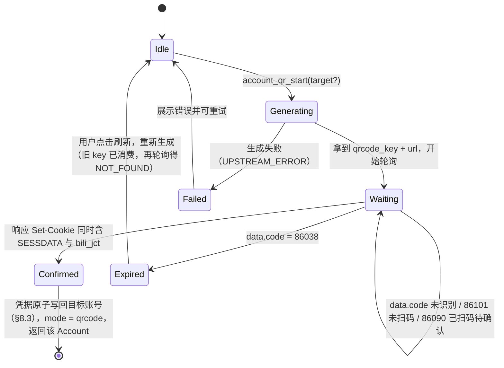

# 登录与鉴权

## 1. 范围与模块边界

鉴权面 = 与 ac站之间的身份、凭据、签名、登录状态机、失效处理，以及所有写操作的凭据前提与安全红线。

范围外（各自落点）：WS 帧结构与双心跳 → `protocol.md` §8；房间解析与消息归一化 → `protocol.md` §10；IPC 命令签名、载荷形状与事件 → `ipc.md` §2–§4；全局常量、端口清单、偏好键、本地文件契约 → `contract.md` §3–§8；界面渲染与交互 → `ui.md`。

### 1.1 职责划分（规范性）

| 层 | 职责 | 禁止 | 代码位置 |
|---|---|---|---|
| `danmubox-core` 端口 `AuthProvider` | 定义登录态、账号列表、扫码流程、账号切换 / 登出 / 删除与 `buvid3` 的 trait 与领域模型（§8.6 的脱敏对象） | 出现任何 ac站 URL、字段下标、签名算法；依赖 `tauri` 或 UI | `crates/danmubox-core/src/ports.rs:22-121` |
| `danmubox-bili`（`AuthProvider` 实现） | 实现扫码、WBI 签名、`getDanmuInfo`、`buvid3`、凭据字段语义；**所有 ac站 URL、字段名、签名只在此出现** | 依赖 `tauri`；把凭据写入日志 | `crates/danmubox-bili/src/auth.rs`、`http.rs`、`wbi.rs`、`send.rs`、`report.rs` |
| `danmubox-core` 本地文件层 | `config.toml` / `prefs.json` 的读写、原子替换、权限（`contract.md` §4.1、§4.2） | 解释 ac站字段的协议语义 | `crates/danmubox-core/src/config.rs` |
| `danmubox-cli` / `apps/desktop/src-tauri` | 经 `AuthProvider` 驱动登录，向前暴露**脱敏后**的状态 | 自行读 `config.toml` 拼 Cookie；自行实现签名 | `apps/desktop/src-tauri/src/lib.rs:220-227`、`apps/desktop/src-tauri/src/lib.rs:795-859` |
| 前端（React/TS） | 渲染二维码、展示登录态、触发命令 | 接触任何 Cookie 值、参与签名计算 | `apps/desktop/ui/src/components/AccountManager.tsx` |

### 1.2 一次登录请求的调用链

```text
前端 / CLI
      │  invoke account_qr_start(target?)
      ▼
core::AuthProvider（端口）──► danmubox-bili 的实现
      │                          └─ passport 扫码接口（generate）
      │                            返回 { qrcode_key, url }；外壳离线编成 SVG
      │  invoke account_qr_poll(key)
      ▼
danmubox-bili::auth ──► passport 扫码接口（poll）
      │                    └─ 成功时响应 Set-Cookie 带回凭据集
      │  凭据 ──► 原子写回目标账号：带 target = 覆盖它；不带 = 按昵称起名后新建（§8.3）
      ▼
danmubox-bili::auth ──► nav（取 img_key / sub_key）──► WBI 签名（§4）
      │
      ▼
getDanmuInfo（Cookie + wts + w_rid）──► { token, host_list }（§5）
      │
      ▼
WS wss://{host}/sub ──► op=7 认证包（key=token, buvid=buvid3, protover=3）
```

各步锚点：生成 `crates/danmubox-bili/src/auth.rs:298-331`；轮询与落盘 `auth.rs:333-374`；签名 `http.rs:633-654` + `wbi.rs:15-46`；`getDanmuInfo` `http.rs:446-520`；取 `buvid3` `ws.rs:288-300`；认证包 `ws.rs:405-420`。认证包的二进制帧格式见 `protocol.md` §8。

---

## 2. 三种登录模式

三种模式互斥，任一时刻只有一套生效凭据，落盘位置是 `config.toml` 中 `active_profile` 指向的那一份（`contract.md` §4.1）——对外把这一份具名凭据叫**账号**（存储表键仍叫 `[profiles.<name>]`）；切换模式等于覆盖写回该账号。**扫码是默认入口**（`REQUIREMENTS.md` §2.5、`contract.md` §4.1）。

| 维度 | 游客 `anonymous` | 文件凭据 `cookie` | 扫码 `qrcode` |
|---|---|---|---|
| 默认性 | 未登录时的回退态 | 由程序写回 `config.toml` 后的状态（该模式没有界面入口） | **默认入口** |
| 用户动作 | 无 | 无（该模式由启动时读到齐全凭据产生，没有面向用户的进入路径，§8.4） | 手机 ac站 App 扫一次码并确认 |
| 本地凭据 | 仅 `buvid3` / `buvid4`（非账号凭据） | 该账号的全套字段 | 该账号的全套字段 |
| 收弹幕 | 可收大部分 `danmaku` / `gift` / `superchat` / `interact` / `guard` / `system` | 完整 | 完整 |
| 昵称与 UID | **与登录态一样完整**（实测：`uid` 非 0、昵称不掩码） | 完整 | 完整 |
| 粉丝牌字段 | **齐全**（实测：`medal_level` / `medal_name` 有值） | 完整 | 完整 |
| 发弹幕 | 不可（上游返回未登录错误） | 可（`bili_jct` 提供 `csrf`） | 可 |
| 被限流概率 | 较高 | 低 | 低 |
| 凭据有效期 | 不适用（`buvid3` 长期有效） | 取决于所填 `SESSDATA` 的剩余寿命 | 由服务端下发，本地无权威过期时间 |
| 泄露风险 | 无账号风险 | 取决于用户怎样保存/传递该文件 | 最低（凭据不经人手） |
| 适用场景 | 只看弹幕、不发言、快速试用 | 跳过扫码；扫码不可用时的兜底 | 日常使用 |
| `mode` 取值 | `anonymous` | `cookie` | `qrcode` |

### 2.1 模式选择的实现规则（规范性）

1. 启动时 `config.toml` 缺失、或 `active_profile` 指向的账号凭据不全 → `mode = "anonymous"`、`logged_in = false`，用已有的 `buvid3` 走游客链路（§8.2）。判定 `crates/danmubox-core/src/config.rs:62-64`。
2. 用户点击登录 → 默认进入扫码流程；扫码有两个用法：**不带目标 = 新增账号**（账号名在确认后按昵称生成，用户不必先起名），**带目标 = 给该账号重新登录**。界面与 CLI 都不提供粘贴 Cookie 的入口（§8.4）。`crates/danmubox-bili/src/auth.rs:298-331`。
3. 扫码成功后 `mode = "qrcode"`；启动时读到齐全凭据则 `mode = "cookie"`。
4. 登出（`account_logout`，缺省 = 当前账号）只清空该账号的**账号级**凭据并回到 `anonymous`，**保留账号条目**（它在 `accounts_list` 里继续以 `logged_in = false` 出现，可再登录回来），其它账号不受影响；`buvid3` / `buvid4` 一并保留，见 §3.3。`crates/danmubox-core/src/config.rs:96-103`、`config.rs:360-373`。
5. 切换账号（`account_switch`）= 改 `active_profile` + 以新凭据重建连接，**不复制多份文件**（`contract.md` §4.1）；切换后按新账号的凭据重新判定 `mode` 与 `logged_in`。删除账号（`account_remove`）保留两条护栏：不许删掉最后一个、删当前项自动切到剩下的第一个。`config.rs:305-317`、`config.rs:319-341`。
6. `mode` 是**来源标记**，不是能力开关：能力判定只看当前账号的凭据是否齐全（`SESSDATA` + `bili_jct` + `DedeUserID` 同时存在才允许发弹幕，§7、§11）。
7. **账号名与登录状态是两件事**：`accounts_list` 里每个账号都带 `logged_in`（以 `nav` 求证为准）与身份（`nickname` / `uid` / `face`）。界面不需要（也不该）自己去探登录态。`crates/danmubox-bili/src/auth.rs:275-296`、`ports.rs:63-77`。

---

## 3. `buvid3`：设备标识的获取与位置

### 3.1 获取流程

| 项 | 值 |
|---|---|
| 接口 | `GET https://api.bilibili.com/x/frontend/finger/spi`（`crates/danmubox-bili/src/http.rs:20`） |
| 请求头 | 常规 `User-Agent`；无需登录、无需签名 |
| 响应字段 | `data.b_3` → `buvid3`；`data.b_4` → `buvid4`（`http.rs:335-352`） |
| 实测结果 | `code = 0`，`message = "ok"`，`data.b_3` / `data.b_4` 均为字符串 |
| 调用时机 | 惰性获取：有凭据文件时优先用文件里的 `buvid3`，取不到才问上游；结果缓存在进程内，失败则整轮连接失败并按重连退避重试（`crates/danmubox-bili/src/ws.rs:287-300`） |

### 3.2 在请求链中的位置

`buvid3` 是**设备级**标识，与账号无关，因此它是唯一在游客模式下也携带的 Cookie。它出现在三处：

| 位置 | 形式 | 说明 | 代码位置 |
|---|---|---|---|
| 上游 REST 请求头 | `Cookie: <账号 Cookie>; buvid3=<值>` | 账号 Cookie 在前、`buvid3` 追加在**末尾**，**合成一条** `Cookie` 头（`RequestBuilder::header` 是 append 语义，调两次会发出两条头）；入参的 `buvid3` 覆盖账号 Cookie 里的同名键；游客态只剩 `buvid3=…` 一条 | `http.rs:43-75`、`http.rs:270-285` |
| WS 认证包 body | `"buvid": "<buvid3 值>"` | `contract.md` §6 认证包的 `buvid` 字段，游客与登录态都必须填 | `crates/danmubox-bili/src/ws.rs:411-417` |
| 本地持久化 | `config.toml` 当前账号的 `buvid3` / `buvid4` 字段 | 见 §3.3；不使用偏好文件 | `config.rs:21-36` |

`buvid4` **不上行**：它只作为 `config.toml` 字段保存与继承，不进任何请求头（`http.rs:60-75` 只并入 `buvid3`；`config.rs:71-88` 的 Cookie 头不含 `buvid4`；`ws.rs:297` 取回后即丢弃）。

注意：`buvid3` **不是** WBI 签名的输入，也不进入 `w_rid` 计算（签名输入见 §4.1）。它只在请求头与认证包里出现。

### 3.3 持久化与生命周期

- 文件里的 `buvid3` 由扫码成功时的 `Set-Cookie` 写入（`crates/danmubox-bili/src/auth.rs:67-70`）；`finger/spi` 取回的 `buvid3` 只在进程内缓存，**不写回文件**（`ws.rs:287-300`）。
- `buvid4` 只在一个写入点产生：新增账号时若新凭据未自带，则从当前账号继承一份（`auth.rs:219-233`）。它不绑定账号，因此登出与换号都不清除。
- 登出**不清除** `buvid3` / `buvid4`：清除反而使设备指纹抖动（`config.rs:96-103`）。
- 敏感级别：低（无账号绑定），但与 `SESSDATA` 同时出现时二者可被关联到同一设备，因此仍不得进入日志（`crates/danmubox-bili/src/redact.rs:48-50`）。

---

## 4. WBI 签名

`getDanmuInfo` 等 `live.bilibili.com` 接口受 WBI 风控保护，未携带合法签名时上游返回 `code = -352`。签名计算全部在 `danmubox-bili` 内完成，前端不感知算法。

### 4.1 输入

| 输入 | 来源 | 说明 |
|---|---|---|
| `img_key` | `nav` 响应 `data.wbi_img.img_url` 的 basename（去目录、去扩展名） | 实测当日值形如 32 位十六进制字符串 |
| `sub_key` | `nav` 响应 `data.wbi_img.sub_url` 的 basename | 同上 |
| `wts` | 本地生成的**秒级** Unix 时间戳 | 必须参与排序与签名 |
| 参与签名的 query | 本次请求除 `w_rid` 外的全部业务参数 | 例如 `getDanmuInfo` 的 `id` / `type` / `web_location` |
| 混入密钥 `mixin_key` | 由 `img_key` + `sub_key` 经置换表导出，见 §4.5 | 不随请求变化，随 key 轮换 |

`nav` 接口无需登录也无需签名；即使未登录（响应 `code = -101`、「账号未登录」），`data.wbi_img` 依然返回（`http.rs:656-684` 的注释即此口径）。

### 4.2 取 key

| 项 | 值 |
|---|---|
| 接口 | `GET https://api.bilibili.com/x/web-interface/nav`（`http.rs:21`） |
| 路径 | `data.wbi_img.img_url`、`data.wbi_img.sub_url`（`http.rs:668-675`） |
| basename 规则 | 取最后一个 `/` 之后、去掉最后一个 `.` 及其后缀的片段（`http.rs:686-693`） |
| 实测样例 | `img_url` → `https://i0.hdslb.com/bfs/wbi/7cd084941338484aae1ad9425b84077c.png`，`img_key = 7cd084941338484aae1ad9425b84077c`（key 随自然日轮换，此值仅作形态样例：32 位十六进制） |
| 长度 | `img_key` 与 `sub_key` 各 32 字符，拼接后 64 字符（`wbi.rs:15-22`） |

### 4.3 密钥缓存（按日轮换 + 30 分钟 TTL）

`img_key` / `sub_key` 由服务端**按自然日轮换**。若进程跨日运行仍复用旧 key，签名会整体失效，所有受 WBI 保护的接口开始返回 `-352`——表现为「弹幕看着正常但每隔一阵拉不到 `getDanmuInfo`」。因此：

1. 缓存结构为 `{ img_key, sub_key, fetched_at, fetched_day }`——即旧文档写的 `{ img_key, sub_key, fetched_at, fetched_at_day }`：`fetched_day` 是代码字段名，语义为 UTC+8 的自然日（`http.rs:136-165`；`http.rs:143`、`http.rs:696` 的注释按旧称 `fetched_at_day` 引用）。
2. 命中条件：`fetched_day == 今天`（等价判据 `fetched_at_day == 今天`）**且** `now - fetched_at < 30 分钟`（`WBI_KEY_TTL` = 30 分钟，`http.rs:137`、`http.rs:150-157`）；否则重新调 `nav`。TTL 取 30 分钟：密钥按自然日轮换，半小时远短于轮换周期，命中因此不可能跨越轮换点，而「连发几条弹幕」这种场景之间必然命中。两道判据都要——`Instant` 在系统休眠期间不前进，只靠 TTL 会把「睡一觉跨天」的旧 key 当成新鲜。
3. **单飞**：并发调用共用一把锁（锁跨一次网络请求），多个发送同时到达时只打一次 `nav`（`http.rs:633-647`）。
4. **失败降级**：`nav` 取不到时错误原样上抛、缓存槽位保持不动，下一次调用照旧重新请求（`http.rs:648-654`）。缓存只用来省一次访问，绝不让发送因为缓存而失败。
5. 缓存**仅存于内存**、进程级共享，不落盘（key 无长期价值，落盘只是多一处可泄漏面）。放进程级而不是 `BiliHttp` 实例字段：桌面端每次发送都新建 `BiliHttp`（`apps/desktop/src-tauri/src/lib.rs:470`），实例字段等于没缓存。密钥与账号无关（游客态 `nav` 也下发同一份，§4.2），所以一个槽位即可。
6. 取 key 的调用点全部经 `BiliHttp::wbi_keys()`：`send.rs`（发弹幕，`crates/danmubox-bili/src/send.rs:166`）、`report.rs`（举报，`report.rs:146`）、`http.rs` 的 `danmu_info`（`http.rs:452`）。身份求证（`nav_identity`，§8.6）**不**走这份缓存——它每次都要问上游，不许拿上一次的结论冒充这一次。
7. 兜底：受保护请求返回 `-352` 时按上游错误上抛，**不**强制刷新 key、**不**自动重试（`http.rs:484-489`；发送与举报同样只透传 code，`send.rs:51-70`、`report.rs:88-108`）。缓存照旧按 §4.3 的命中条件过期，下一次调用才可能刷新。`-352` 的排查见 §4.6。

`mixin_key` 不单独缓存：由 key 现算（§4.5），成本是 64 个字符的置换，不值得再存一份。

### 4.4 签名步骤

1. 取 `img_key` 与 `sub_key`（§4.2，经 §4.3 缓存）。
2. 拼接 `raw = img_key + sub_key`（64 字符）。
3. 按**置换表常量**重排（表定义与代码符号见 `crates/danmubox-bili/src/wbi.rs:8-12`，实现符号 `MIXIN_KEY_ENC_TAB`）：先按表索引 `raw` 的字符，再**取前 32 位**，得到 `mixin_key`。
4. 组装参与签名的参数集合 `P`：本次请求的全部 query 参数，外加 `wts`（秒级）。**`w_rid` 本身不参与**。
5. 值清洗：把 `P` 中每个值里的 `!` `'` `(` `)` `*` 五个字符删掉（`wbi.rs:25-27`）。
6. 排序并编码：按参数名字典序升序排列，做 `application/x-www-form-urlencoded` 编码，得到 `query`。
7. 计算 `w_rid = md5(query + mixin_key)`，十六进制小写。
8. 用 `query + "&w_rid=" + w_rid` 作为最终 query 发起请求。

实现：`crates/danmubox-bili/src/wbi.rs:32-46`。`MD5` 在此处是协议要求的摘要，不用于任何安全用途，注释中应写明以免被误当加密算法替换。

### 4.5 混入密钥置换表

置换表：64 个下标（0-based），指向 `raw` 的位置。**该表已通过真实请求实测确认**（核验方法见 §4.7），非推测值：

| 行 | 下标（每行 8 个） |
|---|---|
| 0 | 46, 47, 18, 2, 53, 8, 23, 32 |
| 1 | 15, 50, 10, 31, 58, 3, 45, 35 |
| 2 | 27, 43, 5, 49, 33, 9, 42, 19 |
| 3 | 29, 28, 14, 39, 12, 38, 41, 13 |
| 4 | 37, 48, 7, 16, 24, 55, 40, 61 |
| 5 | 26, 17, 0, 1, 60, 51, 30, 4 |
| 6 | 22, 25, 54, 21, 56, 59, 6, 63 |
| 7 | 57, 62, 11, 36, 20, 34, 44, 52 |

实现约束：该表 MUST NOT 被散落在多处，MUST 只在 `danmubox-bili` 的 WBI 模块中定义一次（`wbi.rs:7-12`）；表内容变更属于协议变更，必须同步改 `docs/auth.md` 与 `../CHANGELOG.md`。

### 4.6 失败症状与排查

| 症状 | 含义 | 处理 |
|---|---|---|
| `code = -352`、`message = "-352"` | 风控校验失败：key 过期、置换表不符、值清洗遗漏、参数漏签 | 按 `UPSTREAM_ERROR` 上抛（§4.3 第 7 条）；按 §4.7 复核算法 |
| `code = -352` 且**所有**受保护接口同时失败 | 几乎一定是 key 轮换或算法变更 | 复核置换表与 key 轮换时刻 |
| 游客正常、登录后失败 | 与签名无关，方向应转向凭据/Cookie，见 §10 | 检查 `SESSDATA` 是否失效 |

诊断导出会记下 `getDanmuInfo` 这一步的上游 `code`（`http.rs:484-493` 的 `diag.ticket_failed` / `ticket_ok`）。

### 4.7 算法自检（可复现的核对方法）

判断「置换表是否仍然有效」只需两步，无需分析流量：

1. 取当日 `nav` 的 `img_key` / `sub_key`，用 §4.4 的公式算出 `mixin_key`。
2. 对 `GET https://api.live.bilibili.com/xlive/web-room/v1/index/getDanmuInfo?id=1&type=0` 加上 `wts` 与 `w_rid` 发起请求，携带 `buvid3`。

判据：正确算法返回 `code = 0` 且 `data.host_list` 非空；把 `mixin_key` 换成 `raw[:32]` 或空串则返回 `code = -352`。若某天「正确表」也开始返回 `-352`，即算法或表已变更，按同一方法重新校准，并登记 `protocol.md` 附录 A。

---

## 5. `getDanmuInfo`

在 WBI 签名与 `buvid3` 就绪后调用，换取弹幕服务端的 WS 地址与认证 token。`contract.md` §6 规定：需要 `buvid3` Cookie 与 WBI 签名。

### 5.1 请求

| 项 | 值 |
|---|---|
| 方法/URL | `GET https://api.live.bilibili.com/xlive/web-room/v1/index/getDanmuInfo`（`http.rs:31`） |
| `id` | 真实房间号（非短号）。短号/URL 经 `getRoomPlayInfo` 一次解析出 `room_id` / `uid` / `live_status`（`contract.md` §6） |
| `type` | `0` |
| `web_location` | `444.8`（固定值） |
| `wts` | 秒级时间戳，见 §4.4 |
| `w_rid` | WBI 签名 |
| 请求头 | `Cookie: <账号 Cookie>; buvid3=<值>`（同 §3.2 的单条合成形式）；`Referer: https://live.bilibili.com/` |
| 实现 | `http.rs:446-470` |

### 5.2 响应字段

实测样例（`id=1` 与两个其他房间）：

| 字段 | 类型 | 实测/说明 |
|---|---|---|
| `code` | int | `0` 为成功 |
| `data.token` | string | WS 认证包的 `key`；实测长度 244–252 字符，**长度随服务端策略变化，代码中不得断言长度** |
| `data.host_list` | array | 实测 6 项；不得假定固定条数 |
| `data.host_list[].host` | string | 形如 `bd-bj-live-comet-07.chat.bilibili.com` |
| `data.host_list[].port` | int | 实测 `2243` |
| `data.host_list[].ws_port` | int | 实测 `2244` |
| `data.host_list[].wss_port` | int | 实测 `2245` |
| `data.group` | string | 实测 `live` |
| `data.business_id` | int | 实测 `0` |
| `data.refresh_rate` | int | 实测 `100` |
| `data.refresh_row_factor` | float | 实测 `0.125` |
| `data.max_delay` | int | 实测 `5000` |
| `message` | string | 成功为 `OK` |

端口数值、`max_delay` 等均为**当日实测值**，属服务端可调项，实现 MUST 从 `host_list` 读取而不得硬编码；`token` 或 `host_list` 缺失即报 `UPSTREAM_ERROR`（`http.rs:516-521`）。

### 5.3 与服务端下发 wss 地址的关系

- 连接地址由 `host_list[].host` 拼出：`wss://{host}/sub`（`crates/danmubox-bili/src/ws.rs:350-351`）。**端口字段（`port` / `ws_port` / `wss_port`）不参与拼接**，实现只收集 `host` 字符串（`http.rs:496-509`）；本项目固定走 `wss`（TLS），不使用 `ws_port`。
- 本期请求 `protover=3`（brotli）；解码需同时支持 `0` / `1` / `2` / `3`（`contract.md` §4、`protocol.md` §8）。
- 按 `host_list` 顺序尝试；某 host 连接失败（TCP/TLS 握手失败或认证失败）则换下一个（`ws.rs:340-394`）。
- 重连**必须重新调用 `getDanmuInfo`**，不得复用旧 `token` 与旧 `host_list`；退避序列 `5s / 10s / 20s / 40s / 60s` 封顶（`contract.md` §4、`ws.rs:37-38`）。
- `host_list` 为空或请求失败 → 按 `UPSTREAM_ERROR` 上抛，不进入连接循环。

### 5.4 与认证包的对应

| 认证包字段（`contract.md` §6） | 取值来源 |
|---|---|
| `uid` | 登录态为 `DedeUserID`（`profile.uid()`），游客为 `0` |
| `roomid` | 真实房间号 |
| `protover` | body 内固定 `3`（帧头 `protover=1`，见 `contract.md` §6） |
| `buvid` | §3 获取的 `buvid3` |
| `platform` | 固定 `"web"` |
| `type` | 固定 `2` |
| `key` | `data.token`；游客为 `""` |

构造见 `ws.rs:400-420`。认证回应 `code = 0` 为成功；非 0 一律视为认证失败并按重连退避处理，**不得**在未知 code 上编造含义（`contract.md` §6）。

---

## 6. 扫码登录状态机

扫码是默认入口（§2）：本地生成二维码 → 前端渲染 → 按固定间隔轮询 → 成功时由响应 `Set-Cookie` 下发凭据并回写目标账号。

### 6.1 状态机



`target` 决定写回哪儿：**不带** = 新增账号，确认后按昵称派生账号名（中文昵称会被清成 `uid<uid>`，重名加 `-2` 后缀，见 §8.4）；**带** = 给该账号重新登录，覆盖它的凭据。两种情形落盘后都会把它设为当前账号，`account_qr_poll` 一并返回该 `Account`（`logged_in = true`、`active = true`）。实现 `crates/danmubox-bili/src/auth.rs:214-266`；账号名规则 `crates/danmubox-core/src/config.rs:175-197`、`config.rs:287-303`。

### 6.2 步骤与端点

| 步骤 | IPC | 上游 | 说明 |
|---|---|---|---|
| 生成 | `account_qr_start(target?)` | `GET https://passport.bilibili.com/x/passport-login/web/qrcode/generate`（`http.rs:35-36`） | 返回 `code = 0`、`data.qrcode_key`、`data.url`；`data.url` 实测为 **`account.bilibili.com` 域名**下的链接，二维码里编码的就是它。`target` 指向不存在的账号 → `NOT_FOUND`；新一轮扫码作废上一轮未消费的 `key`（`auth.rs:298-331`） |
| 渲染 | 无 | 无 | 二维码 `url` 由**外壳离线**编码成 SVG（`apps/desktop/src-tauri/src/lib.rs:811-832`），形状见 `ipc.md` §2；**不得**上传到任何第三方二维码服务（§12 第 8 条） |
| 轮询 | `account_qr_poll(key)` | `GET https://passport.bilibili.com/x/passport-login/web/qrcode/poll`（`http.rs:38`） | 上游响应有两层 code：外层 `code = 0` 表示请求本身成功，`data.code` 才是扫码状态；`key` 未开始或已消费 → `NOT_FOUND`（`auth.rs:333-345`） |
| 完成 | 同上 | 同上 | 成功响应通过 `Set-Cookie` 下发凭据集；**先向 `nav` 求证**再落盘（求证同时得到昵称 / uid / 头像），然后原子写回目标账号并返回该 `Account`（`auth.rs:214-266`） |

轮询间隔 2 秒（前端实现 `apps/desktop/ui/src/components/AccountManager.tsx:222`，不得低于 1 秒）；界面持续展示「等待扫码 / 已扫码，请在手机上确认」类提示。

### 6.3 `data.code` 语义表

| `data.code` | 归一化状态 | 处置 | 依据 |
|---|---|---|---|
| `86101` | `pending` | 继续轮询 | 实测确认 |
| `86038` | `expired` | 终止轮询、消费掉 `key`，提示刷新 | 实测确认 |
| `86090` | `scanned` | 继续轮询，可提示「已扫码」 | `protocol.md` 附录 A |
| `0` | `confirmed` | 推进落盘，但**还要** `Set-Cookie` 带回 `SESSDATA` + `bili_jct`（见下） | `protocol.md` 附录 A |
| 其他任意值 | `pending` | **视为未确认，继续轮询**，记 `debug` 日志（只记数值与 `message`，不记 Cookie），不改语义 | 实现口径 |

映射实现 `crates/danmubox-bili/src/auth.rs:26-33`（未知码一律 `Pending`，不臆造语义）。

**成功判定的判据**：`data.code == 0` 是推进到 `confirmed` 的触发条件，但真正算成功还要 `Set-Cookie` 里带回 `SESSDATA` + `bili_jct` + `DedeUserID`——三者缺一即报 `UPSTREAM_ERROR`，**不写半套凭据、也不把未确认说成成功**（`auth.rs:39-72`、`auth.rs:222-225`）。

**看门狗**：`qrcode_key` 有服务端生命周期。`86038` 是上游给出的显式失效信号；**本地不另做看门狗**——`account_qr_poll` 只反映上游状态，轮询多久、什么时候放弃由调用方决定（前端按自己的超时停轮询，CLI 用 `--timeout`）。这样「什么时候算过期」只有一个权威来源，不会出现本地判死而上游仍可扫的分裂。

### 6.4 与本地接口的状态映射

| 状态机状态 | `account_qr_poll` 归一化 `state` | 返回的 `account` |
|---|---|---|
| Waiting（含 86101 / 86090 / 未知码） | `pending` / `scanned` | `null` |
| Confirmed | `confirmed` | 落盘后的 `Account`（`logged_in = true`、`active = true`） |
| Expired（86038） | `expired` | `null` |
| Generating 失败 | 由 IPC 错误模型返回 `UPSTREAM_ERROR` | — |

`state` 的 `confirmed` 只由 §6.3 的判定产生；`expired` 只由 `86038` 产生。确认与失效都会**消费掉 `key`**（终态），再轮询同一个 `key` 得 `NOT_FOUND`（`auth.rs:346-374`）。载荷形状与错误码见 `ipc.md` §2。

登录态由 `session_status` 命令**现取**（返回 §8.6 的脱敏对象，绝不含 Cookie 值），**不经事件总线**——`danmubox://session` 只推房内身份（`ipc.md` §4）；`Account` 列表则由 `accounts_list` 现取。锚点：`apps/desktop/src-tauri/src/lib.rs:220-227`、`ports.rs:22-27`、`apps/desktop/src-tauri/src/lib.rs:959`。

---

## 7. Cookie 字段与用途

danmubox 关心的 Cookie 字段集合：所有值只在 `danmubox-bili` 与 `core` 的本地文件层内可见；对外（IPC / 日志）一律不可见。下列字段名是 ac站 Cookie 名，`config.toml` 中的对应键见 §8.1。

| 字段 | 用途 | 是否必需 | 敏感级别 | 缺失后果 |
|---|---|---|---|---|
| `SESSDATA` | 登录态的唯一主凭据，等价账号控制权；决定服务端认不认这个「我」 | 必需（登录态） | **最高** | 退化为游客：字段掩码、不可发言 |
| `bili_jct` | CSRF token，所有写操作（发弹幕、举报、房管操作等）都要用它填充 `csrf` 字段 | 必需（要写操作） | **高** | 可读不可写；请求返回未登录/校验失败 |
| `DedeUserID` | 当前登录用户的 UID | 必需（登录态） | 中 | 无法判定「哪条弹幕是我发的」，WS 认证包 `uid` 只能填 0，关注列表无法确定 vmid |
| `DedeUserID__ckMd5` | `DedeUserID` 的配套校验值，服务端在部分接口要求与 `DedeUserID` 成对出现 | 建议保留 | 中 | 部分接口校验不通过；单独看无独立语义 |
| `buvid3` | 设备指纹，风控标识；与账号无关 | 必需（含游客） | 低 | 风控评估不稳；WS 认证包 `buvid` 无法填 |
| `buvid4` | 与 `buvid3` 配对的设备标识；**只保存，不上行**（§3.2） | 建议保留 | 低 | 风控评估降级 |
| `sid` | 会话标识，由登录响应下发 | 建议保留 | **高** | 部分会话级校验失败 |

实现锚点：Cookie 头的组装 `crates/danmubox-core/src/config.rs:71-88`；从扫码 `Set-Cookie` 取回字段 `crates/danmubox-bili/src/auth.rs:39-72`；日志脱敏的键名集合 `crates/danmubox-bili/src/redact.rs:27-51`。

补充说明：

- 敏感级别为「最高 / 高」的字段一旦泄露即等同账号被他人控制或可被代为操作，受 §12 红线约束；`SESSDATA` 与 `bili_jct` 的**同时存在**是「可写操作」的充要条件（§2.1 第 6 条）。
- 完整 `Set-Cookie` 字段集合可能随上游调整（校准登记见 `protocol.md` 附录 A）。取回逻辑只认 §7 表的 7 个名（大小写不敏感），**未识别字段一律忽略、也不因此拒绝登录**；未识别字段不落盘（`auth.rs:39-72`）。

---

## 8. 凭据文件 `config.toml`

规范性定义见 `contract.md` §4.1；字段清单 `crates/danmubox-core/src/config.rs:21-36`。

### 8.1 字段表（`contract.md` §4.1）

文件为**明文 TOML**，位于应用数据目录（`contract.md` §4：macOS `~/Library/Application Support/danmubox`、Windows `%APPDATA%\danmubox`、Android 应用私有目录），权限 **0600**（`config.rs:399-419`）。自用场景不加密，靠文件权限与「只在本机数据目录」约束。

**多账号（规范性）**：同一文件用 `[profiles.<name>]` 承载多份凭据，`active_profile` 指定当前生效者；切换账号只改 `active_profile`，**不复制多份文件**（§2.1 第 5 条）。

```toml
active_profile = "default"

[profiles.default]
sessdata = ""
bili_jct = ""
dede_user_id = ""
dede_user_id_ck_md5 = ""
buvid3 = ""
buvid4 = ""
sid = ""
```

| TOML 键 | 对应 Cookie | 类型 | 必需条件 | 说明 |
|---|---|---|---|---|
| `sessdata` | `SESSDATA` | string | 登录必需 | 登录主凭据 |
| `bili_jct` | `bili_jct` | string | 写操作必需 | `csrf` 来源，见 §11.1 |
| `dede_user_id` | `DedeUserID` | string | 登录必需 | 当前 UID；WS 认证包 `uid` 与关注列表 vmid 来源 |
| `dede_user_id_ck_md5` | `DedeUserID__ckMd5` | string | 建议 | 与 `dede_user_id` 成对使用 |
| `buvid3` | `buvid3` | string | 含游客必需 | 设备标识，见 §3 |
| `buvid4` | `buvid4` | string | 建议 | 设备标识配对项；不参与请求头 |
| `sid` | `sid` | string | 建议 | 会话标识 |

- 三要素 `sessdata` / `bili_jct` / `dede_user_id` 齐全且非空 = 可直接进入登录态（`config.rs:62-64`）。
- 实现 MUST NOT 在该文件中存放任何非凭据内容；界面偏好一律走 `prefs.json`（`contract.md` §4.2、§8.5）。
- 写入权限：文件 MUST 为 **0600**（POSIX `write_private` 显式设模式，`config.rs:399-419`）；数据目录由 `std::fs::create_dir_all` 创建、权限随进程 umask（**未**显式设 0700）；Windows 位于用户私有数据目录，依赖该目录 ACL，实现 MUST NOT 放宽 ACL。

### 8.2 启动顺序（规范性）

1. 读取 `config.toml`，取 `active_profile` 指向的账号。文件缺失 → 以空值继续、按游客链路启动；文件存在但**解析失败** → `ConfigStore::load` 报 `INTERNAL`（`config.rs:199-216`），桌面外壳打印后 `exit(1)`（`lib.rs:1308-1313`），CLI 同样报错退出（`crates/danmubox-cli/src/main.rs:117`）——**不写损坏副本、也不静默降级为游客态**（`prefs.json` 才有 `.bak` 机制，`crates/danmubox-core/src/prefs.rs:424-430`）。
2. 校验该账号的 `sessdata` / `bili_jct` / `dede_user_id` 三者是否**齐全且非空**（`config.rs:62-64` 只判 `is_empty`，不做空白收敛）。
3. 齐全 → 进入登录态，`mode = "cookie"`，不触发扫码；随后向 `nav` 求证（`code = -101` 则按 §10 失效处理；网络错误**不改**登录态）。`crates/danmubox-bili/src/auth.rs:165-205`。
4. 不齐全 → `mode = "anonymous"`，登录入口为扫码（默认）。
5. 扫码成功后原子写回，进入 `mode = "qrcode"`（§8.3）。
6. 只在进程启动时读取该文件一次，运行中不监听文件变化；文件有任何改动都要重启应用才生效。

### 8.3 原子写回

- 写入 MUST 原子：在同目录写临时文件（`*.toml.tmp`）→ 设 0600 → `rename` 覆盖目标，避免半套凭据或损坏文件（`config.rs:382-397`、`config.rs:399-419`）。
- 写入 MUST 同时设置/校正权限（§8.1）。
- 写回的目标是本次登录的**目标账号**：重新登录（`account_qr_start` 带 target）写它；新增账号先按昵称派生账号名（§8.4 的命名规则）再写出新条目。字段集为本次登录获得的完整凭据集，`buvid3` 若该账号已有则保留（§3.3）；新增账号时设备级 `buvid` 在凭据未自带的条件下从当前账号继承一份（`auth.rs:219-233`）。
- 登出清空该账号的**账号级**凭据字段（`sessdata` / `bili_jct` / `dede_user_id` / `dede_user_id_ck_md5` / `sid`），保留 `buvid3` / `buvid4`，其它账号不动；清空同样走原子写回。**账号条目本身保留**——退游客态不等于把账号删掉（`config.rs:96-103`、`config.rs:360-373`）。

### 8.4 凭据文件的写入面与账号命名（程序管理，无界面入口）

界面与 CLI **不提供**导入 Cookie 的入口：登录方式只保留扫码与游客（`REQUIREMENTS.md` §2.5、§2.13）。凭据文件由程序写回，**没有面向用户的手工编辑路径**；文件损坏时的处置见契约 §4.1（删掉重建 + 游客态启动）。

代价是**没有落盘前的护栏**——凭据是否有效只能在启动复核（或下一次 `nav` 调用）时才发现。凭据本身仍然只在 Rust 侧与磁盘之间移动：**不进日志**、不进 `prefs.json`、不回传前端（返回值只有 §8.6 的脱敏 `Account`）。

**账号命名规则（规范性，新增账号时用）**：账号名只允许 `[A-Za-z0-9_-]{1,32}`（它同时是 TOML 表键与界面标识，`config.rs:139-165`）。昵称常常是中文，而这里**不做转写**：只保留 ASCII 字母数字与 `-` / `_`，其余字符（含全部中文）直接丢掉；清空后用 `uid<uid>` 兜底，重名再加 `-2` / `-3` 后缀（`config.rs:175-197`、`config.rs:287-303`）。判据是「自动命名一定有结果，且两个不同账号不会因为昵称被清空而撞名」。

### 8.5 与 `prefs.json` 分家的口径

`contract.md` §4.1 规定 `config.toml` 只放凭据、界面偏好一律走 `prefs.json`（§4.2）。因此：账号凭据 → `config.toml`（低频写、**由程序写回**，偏好写入不会碰到它）；界面偏好 → `prefs.json`（高频写、程序管理，单层 JSON、原子替换、损坏留 `prefs.json.bak`）；两者互不包含对方内容，实现 MUST NOT 互相写入。

### 8.6 前端可见的脱敏对象（规范性）

**会话对象**（`session_status` 命令的返回；房内身份 `RoomSession` 是另一个载荷，见 `ipc.md` §4）——**没有任何 Cookie 字段**，也不含长度、前缀、哈希等可用于侧信道推断的衍生信息：

| 字段 | 类型 | 说明 |
|---|---|---|
| `logged_in` | bool | 当前账号是否持**有效**凭据（以 `nav` 求证为准；网络错误沿用文件里的结论） |
| `uid` | i64 | 当前账号的 uid；未登录为 0 |
| `nickname` | string | 当前账号的昵称；未登录或求证失败为空串 |
| `active_profile` | string | 当前生效的账号名（存储上就是 `active_profile` 指向的 profile） |

定义 `crates/danmubox-core/src/ports.rs:22-37`；产出 `crates/danmubox-bili/src/auth.rs:165-205`。

**账号对象**（`accounts_list` 的 `Account[]`；扫码确认那一次是 `account_qr_poll.account`，同一形状）：

| 字段 | 类型 | 说明 |
|---|---|---|
| `name` | string | 账号名（`[A-Za-z0-9_-]{1,32}`） |
| `nickname` | string | 该账号的昵称；未登录或求证失败为空串 |
| `uid` | i64 | 该账号的 uid；未登录时退回凭据里记着的 `DedeUserID`（可能为 0） |
| `face` | string | 头像地址；未登录或求证失败为空串 |
| `logged_in` | bool | 该账号的凭据是否有效（逐个向 `nav` 求证，**并发发起**；网络错误不改登录态） |
| `active` | bool | 是否是当前账号 |

定义 `ports.rs:63-77`；产出 `crates/danmubox-bili/src/auth.rs:275-296`（并发求证用 `join_all`，单个账号求证失败只影响它自己那一行）。

身份三格取自 `nav` 的 `data.mid` / `data.uname` / `data.face`（`http.rs:562-597`）；`uname` 为空即按未登录处理，不臆造身份。网络不通时身份留空、登录态沿用文件里的结论——**不拿上一次的结果冒充这一次**。

`mode`（`anonymous` / `cookie` / `qrcode`）是文档层的**来源标记**，由凭据来源推导，不在载荷里；界面不要依赖它判断能力。

该对象由 `AuthProvider` 端口产出（`ports.rs:87-121`），所有上层（IPC / CLI / 未来的 Agent 通道）只能拿到这一形状。

---

## 9. 新能力面的鉴权前提

§9.1–§9.3 只规范各能力的**凭据与身份前提**；上游端点、字段名、返回结构与分页由 `protocol.md` 承载（校准登记见附录 A）。

### 9.1 表情包库（按身份加载）

- 端口 `EmoteProvider`（`contract.md` §3）；IPC `emotes_list` / `emotes_owned`（`ipc.md` §2）。
- 凭据前提：必须登录（`SESSDATA` + `bili_jct` + `DedeUserID` 齐全），否则 `NOT_LOGGED_IN`（`crates/danmubox-bili/src/emote.rs:365-372`）。主站「我的表情」不报 `NOT_LOGGED_IN`：未登录时上游退化为免费表情包（`emote.rs:398-401`）。
- 身份判定（本地，源自 `RoomSession`，`contract.md` §5）：**不发额外鉴权请求**；房间专属包必须携带真实 `room_id`。

| 包类型 `package_kind` | 身份条件（本地判定） | 说明 |
|---|---|---|
| `common` | 无房间身份要求（登录态即可） | 通用包 |
| `room` | 无身份门槛，需真实 `room_id` | UP 主大表情与房间专属表情 |
| `medal` | `RoomSession.my_medal_level > 0` | 我在**该房间**有粉丝牌 |
| `guard` | `RoomSession.my_guard_level ∈ {1, 2, 3}` | 我在该房间是大航海（1 总督 / 2 提督 / 3 舰长） |
| `owned` | 登录态；未登录时上游退化为免费表情包 | 主站「我的表情」（`emotes_owned`） |

- **没有房管包（`admin`）**：房管没有表情分类，`contract.md` §5 的 `package_kind` 只有上列 5 个；`RoomSession.is_admin` 不参与表情包判定。
- 身份变化（进房解析、收到身份变更）后 MUST 重新加载，不得缓存跨身份的表情库（`ipc.md` §8）。
- 分类判定落在 `emote.rs:282-342`；未实测项与上游取值见 `protocol.md` 附录 A26。

### 9.2 举报弹幕

- 端口 `DanmakuReporter`（`contract.md` §3）；IPC `chat_report`（`ipc.md` §2）。
- 凭据前提：**必须登录**（`crates/danmubox-bili/src/report.rs:131-140`）；举报是写操作，表单体必须携带 `csrf = bili_jct` 与同值的 `csrf_token`（§11.1；`report.rs:62-86`）。
- 目标定位：以 `Message.upstream_id` 标识被举报弹幕（`contract.md` §5）。`upstream_id` 为空 → `BAD_REQUEST`（`report.rs:140-144`），不得用 `content` 或 `local_id` 替代。
- 上下文：必须携带该弹幕所属真实 `room_id`（`report.rs:146-150`）；举报理由为上游枚举、按不透明字符串透传，本地不自定义语义、不写死枚举（`report.rs:39-59`、`report.rs:75-79`）。
- 结果处理：只回报成功/失败与上游 `code` / `message`（`report.rs:88-108`）；不把举报人身份或理由回显到弹幕区；**不自动重试**——写请求可能已经生效，重试会重复提交（`crates/danmubox-bili/src/http.rs:595-598`）。
- 端点、字段与理由清单：`protocol.md` §11.5 与附录 A27。

### 9.3 关注列表与电池余额（只读）

- 端口 `RoomCatalog`（关注列表，`contract.md` §3）与 `WalletProvider`（电池余额）；IPC `follow_list` / `wallet_balance`（`ipc.md` §2）。
- 关注列表凭据前提：**必须登录**，否则 `NOT_LOGGED_IN`（`crates/danmubox-bili/src/follow.rs:352-354`）；主站关注关系接口必须显式传 `vmid`（值取自 `DedeUserID`），直播侧端点不需要。只读，**不需要** `csrf`。
- 电池余额凭据前提：**必须登录**（`crates/danmubox-bili/src/wallet.rs:68-71`）；**GET** 请求、Cookie 即够、不需要 `csrf`；返回值以整数表示**电池**，换算 `电池 = 金瓜子 / 100`（`wallet.rs:21-22`、`wallet.rs:33-56`）。
- 缓存与刷新：关注列表/直播状态只在 `follow_list` 触发时拉取，不得以轮询压上游；余额在进入礼物相关界面时按需拉取，不做后台轮询（`ipc.md` §8）。
- 端点、字段与分页：`protocol.md` 附录 A28 / A29（分组字段见 A34）。

---

## 10. 登录态过期检测与失效处理

### 10.1 触发信号与判定

| 信号 | 来源 | 上游表现 | 处置 |
|---|---|---|---|
| 账号未登录 | `nav` | `code = -101`、`message = "账号未登录"` | 判定凭据失效（`logged_in → false`），uid 与昵称归零；**不清凭据文件**（清空只在用户登出时发生，§8.3） |
| 发弹幕被拒 | 发送接口 | `code = -101`（实测，未带凭据时） | 归一化为 `failed` 并把原始 `code` / `message` 带回（§11.3）；**本地登录态不变**，是否失效由下一次 `session_status` / `accounts_list` 的 `nav` 求证决定 |
| WBI 风控失败 | 任意受保护接口 | `code = -352` | **不是**登录失效：按 `UPSTREAM_ERROR` 上抛（§4.3 第 7 条），不得清除凭据 |
| WS 认证回应非 0 | 认证回应包 | `contract.md` §6：非 0 一律视为认证失败 | 按重连退避处理；重连前重取 `getDanmuInfo`。**不复核 `nav`**——区分「token 问题」与「账号失效」只发生在 `nav` 求证本身 |
| 本地凭据缺失（文件被外部清空或改写） | 启动或 `nav` 求证时 | 当前账号取不到完整凭据 | 判为未登录（`accounts_list` 里该账号 `logged_in = false`），触发一次会话善后（重拉 `session_status` / `accounts_list`，`ipc.md` §8） |
| 发弹幕被限流 | 本地节流 / 发送接口 | 频次类错误 | 按 `rate_limited` / `Error::RateLimited` 处理，**不**触发重新登录，见 §11 |
| 启动时文件解析失败 | 本地文件层 | `config.toml` 损坏 | **删掉重建为空文件并以游客态继续**（不备份、不终止启动）；读取 / 权限 / IO 失败照旧报 `INTERNAL`（`config.rs` 的 `reset_corrupt_file`，契约 §4.1） |

判定原则：**区分「凭据失效」与「上游/风控故障」**。只有 `nav` 明确返回未登录才判定凭据失效；`-352`、网络错误、5xx 一律不得清除凭据，否则一次服务端抖动就会把用户登出。锚点 `crates/danmubox-bili/src/auth.rs:165-205`、`auth.rs:275-296`。

### 10.2 失效后的行为

1. 本地状态置 `logged_in = false`；保留弹幕连接可继续以游客身份接收（能收且字段降级），**不**强制断开 WS。
2. 触发一次会话善后（重拉 `session_status` / `accounts_list`），前端展示「登录已失效，请重新登录」并提供一键回到扫码入口（扫码时带 `target` = 给这个账号重新登录，账号名和槽位都还在）。`ipc.md` §8。
3. 正在发送的弹幕：失败并向用户显示原因；不做自动重发（避免用户不可见的重复发言）。
4. 用户主动登出时才清空当前账号的**账号级**凭据字段（保留 `buvid3` / `buvid4` 与账号条目），走原子写回（§8.3）。
5. 失效事件记入结构化日志时只记「哪个信号触发的」（如 `session_invalidated reason=nav_-101`），不记任何凭据内容。

### 10.3 凭据有效期的处理

上游不下发权威的凭据有效期，因此本地不做「到期即登出」——判定有效性的唯一来源是 `nav` 求证（§10.1）。若实现选择在上次成功校验时刻加一个保守窗口作为提示值，该值只能用于 UI 提示，MUST NOT 用于主动清除凭据或阻断请求。

---

## 11. 发弹幕：`csrf`、节流与被吞判定

### 11.1 `csrf` 来源

`csrf` 取自当前账号的 `bili_jct`（§7、§8.1），无 `bili_jct` 即 `NOT_LOGGED_IN`（`crates/danmubox-bili/src/send.rs:143-152`）。发送请求在表单体中同时填 `csrf` 与 `csrf_token` 为同一值（上游两种字段名并存，同时填以兼容，`send.rs:169-180`；举报同口径 `report.rs:62-86`）。**严禁**把 `bili_jct` 写到请求 URL 的 query 中——query 会进日志、进浏览器历史、进代理记录。写请求一律 POST，且**从不重试**（`http.rs:595-598`）。

### 11.2 节流参数（`contract.md` §4，规范性）

| 参数 | 值 | 代码位置 |
|---|---|---|
| 同房间最小发送间隔 | 2 秒 | `crates/danmubox-bili/src/send.rs:20` |
| 相同内容去重窗口 | 5 秒 | `send.rs:22` |

实现规则：

1. 节流在本地按房间维度独立计时（不同房间互不影响）：`send.rs:91-117`、`send.rs:152-160`。
2. 命中节流时不发请求，直接返回 `rate_limited`，并在 UI 给出可操作的提示。
3. 去重窗口以「内容字符串归一化后比较」为准；命中去重同样返回 `rate_limited`，不得静默丢弃——静默丢弃会让用户以为发出去了。
4. 节流是本地保护，减少触发上游风控的概率；即便本地放行，上游仍可能限流，此时按 §10.1 的「限流不触发重新登录」处理。
5. 未登录（凭据不全）时直接返回 `NOT_LOGGED_IN`，不发起上游请求。

### 11.3 被吞判定与 `SendOutcome`

发弹幕的成功不能只看外层 `code`：上游可能在业务响应里以 `msg` / `message` 回一个「吞掉」标记，弹幕并未进入公开流。归一化实现 `send.rs:37-70`，判定顺序是**先看业务标记、再看 `code`**（被吞时外层 `code` 仍可能是 `0`）。

| 上游响应特征 | `SendOutcome`（`contract.md` §5） | 代码是否产生 | 用户可见文案（`ui.md` §6.5） |
|---|---|---|---|
| 正常成功（`code == 0`） | `ok` | 是（`send.rs:56`） | 无（正常入列） |
| 业务响应 `msg`/`message` == `"f"` | `blocked_platform` | 是（`send.rs:50`） | 「发送失败 · 全局屏蔽词」 |
| 业务响应 `msg`/`message` == `"k"` | `blocked_room` | 是（`send.rs:51`） | 「发送失败 · 房间屏蔽词」 |
| 其余任何 `code` | `failed` | 是（`send.rs:58`） | 「发送失败」+ 原始 `code` / `message`（不含凭据） |
| 本地节流命中 | — | 以 `Error::RateLimited` 返回，不构造 `SendOutcome`（`send.rs:96-117`） | 「发送过于频繁」 |
| 上游频次类 / 粉丝牌等级不足 / 已禁言错误码 | `rate_limited` / `medal_required` / `muted` | **否**：错误码到这三个取值的映射尚未确定，一律归 `failed` 并保留原始 `code` | 待校准，见 `protocol.md` 附录 A17 |

补充规则：

- 被吞弹幕的正文回显在 `data.mode_info.extra`（JSON 字符串）的 `content` 字段（`send.rs:61-71`）；本地可用它确认被吞的正是本次内容，但**不得**据此自动重发。
- `"f"` / `"k"` 的映射沿用社区实现并**存疑**：`"f"` 的唯一真实样本出现在「发送者已把该主播拉黑」的房间，不得据此把它当成稳定的平台风控判据（`protocol.md` A16）。
- 已确定的一条是 `code=10023`（发送者已拉黑该主播）→ `failed`，上游原话经 `SendReport.upstream_message` 带到界面（`protocol.md` A17）。实现 MUST 保留原始 `code` / `message` 供排障（`send.rs:37-49`）。

---

## 12. 安全红线

以下条目为规范性约束，与 `contract.md` §4.1 的表述一致，任何文档、注释、实现都不得放宽：

1. `SESSDATA`、`bili_jct`、`DedeUserID` **不得**出现在日志、前端明文、仓库、崩溃上报中。
2. 任何日志（含 `DANMUBOX_LOG=debug` 全量调试模式）在输出请求/响应时，必须对 `Cookie`、`Set-Cookie`、`Authorization` 三个头整体做替换，而不是只替换其中的值——只替换值会漏掉字段名组合带来的推断空间。脱敏键名集合见 `crates/danmubox-bili/src/redact.rs:27-51`。
3. 崩溃上报与错误信息中不得内嵌请求头或响应头原文；`UPSTREAM_ERROR` 的 `detail` 只允许放上游 `code` / `message` / 请求路径，不得放 Cookie。请求 URL 在成形的那一刻就过脱敏（`redact.rs` 的 `log_request`、`crates/danmubox-bili/src/http.rs:270-285`）。
4. 凭据不得进入前端：`session_status` 返回 §8.6 的脱敏对象，`danmubox://session` 推的房内身份（`RoomSession`）同样不含任何凭据。绝不返回任何 Cookie 值或其长度、前缀、哈希。
5. 凭据不得进入仓库：不得写入任何 fixture、测试样例或文档示例；测试中的凭据一律使用明显的伪造值（`crates/danmubox-bili/src/diagnose.rs:546-573` 的脱敏断言即该口径）。测试用房间号与账号标识同样适用。
6. `config.toml` 只存在于本机应用数据目录，权限 MUST 为 0600（POSIX `write_private`，`crates/danmubox-core/src/config.rs:399-419`；Windows 为等价的用户私有 ACL）；不得把该文件路径或内容交给任何远程服务。
7. 凭据只经 HTTPS / WSS 传输；本项目不提供任何供外部读取凭据的本地服务（无本地监听端口、无 token 文件），凭据只在本进程内使用。
8. 二维码内容（`data.url`）只做本地渲染（`apps/desktop/src-tauri/src/lib.rs:811-832`），不得提交给任何第三方二维码生成服务，否则等同于把登录凭证转发给第三方。
9. 界面与 CLI 都没有「粘贴 Cookie」的入口（§8.4）：程序只在扫码流程里接收凭据，凭据**只在进程内与磁盘之间移动**——不写日志、不进 `prefs.json`、不回传前端、不落任何中间文件。因此也不存在把凭据写进命令行参数（进程表与 shell 历史）的路径。
10. 提供「登出」时，必须真正清空当前账号的**账号级**凭据字段（§8.3），而不是仅把内存状态置为未登录；账号条目与 `buvid3` / `buvid4` 保留。
11. 凭据相关代码的任何改动都必须在变更说明中显式声明是否影响上述任一条；不影响也需说明。

---

## 13. 待实测校准

上游未实测事实的唯一登记处是 `protocol.md` 附录 A；`docs/auth.md` 不自建校准表。原 §13 登记的条目已整理成清单移交汇总，涉及项：

- 扫码：成功时 `data.code` 的数值、「已扫码待确认」码 `86090`、`qrcode_key` 的服务端有效期。
- 凭据：完整 `Set-Cookie` 字段集合。
- WBI：`img_key` / `sub_key` 的轮换时刻、值清洗字符集 `! ' ( ) *` 是否被服务端强校验。
- `getDanmuInfo`：是否强校验 `buvid3`、`host_list` 条数与端口、`data.token` 长度。
- WS：认证回应中除 `code = 0` 之外的取值语义。
- 发送：被吞标记 `"f"` / `"k"`（A16）与 `rate_limited` / `medal_required` / `muted` 对应的上游错误码（A17）。
- §9 三块能力的端点、字段与分页：表情包库（A26）、举报（A27）、关注列表（A28 / A34）、电池余额（A29）。
