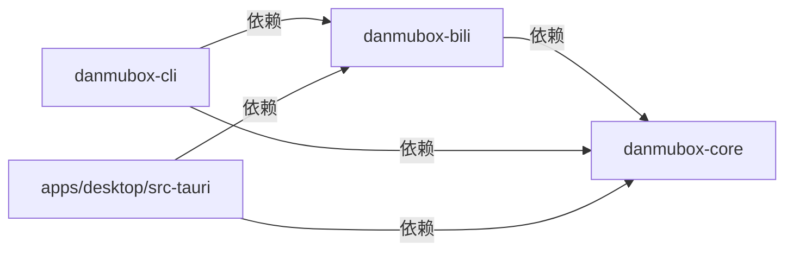

# ADR 0002：`danmubox-core` 不依赖 UI，能力一律经端口暴露

> 定位：确立 `danmubox-core` 的职责边界、单向依赖方向，以及各消费面如何共享同一引擎。
> 读者：所有会新增 crate、新增端口、新增 IPC 命令的开发者与 AI agent。
> 更新时机：新增消费面、调整 crate 划分、或有人试图让 `core` 依赖 UI 框架、把业务逻辑写进 Tauri 命令层时。

| 项 | 值 |
|---|---|
| 状态 | Accepted |
| 日期 | 2026-09-11 |
| 决策者 | 项目作者 |
| 影响面 | `crates/danmubox-core/`、`crates/danmubox-bili/`、`crates/danmubox-cli/`、`apps/desktop/src-tauri/` |
| 相关文档 | [`../contract.md`](../contract.md) §3、[`0001-tauri-over-flutter.md`](0001-tauri-over-flutter.md)、[`0004-upstream-isolation.md`](0004-upstream-isolation.md)、[`../architecture.md`](../architecture.md)、[`../AGENT.md`](../../AGENT.md) |

## Context

需求里存在多个「对外表面」，它们要暴露的是**同一批能力**：房间解析与连接、弹幕接收与归一化、本次会话内的缓冲查询、登录状态、发送弹幕、表情包、举报、关注列表、电池余额。

| 消费面 | 形态 | 状态 |
|---|---|---|
| UI（`apps/desktop`） | `invoke` / `listen`（IPC） | 本期 |
| CLI（`danmubox-cli`） | 命令行子命令 | 本期 |
| MCP | 待定 | **后期想法，本期不实现** |

如果每个表面各自实现一遍协议与鉴权，会立刻出现多份会漂移的实现：一个修好的解包 bug 要在多处同步，安全红线（Cookie 不得进日志）也要在多处各自维护。同时，若把逻辑写进 `apps/desktop/src-tauri`，CLI 将无法复用，且核心逻辑被绑定在 GUI 进程生命周期上，无法在无窗口环境下测试。

另一条需求（REQUIREMENTS.md）是「ac站 API 不可控，逆向改动不能影响核心业务」。这要求 `core` 与具体上游实现之间也有明确边界：`core` 只定义端口与领域模型，实现全部在 `danmubox-bili`（见 [`0004-upstream-isolation.md`](0004-upstream-isolation.md)）。

## Decision

**引擎集中在 `crates/danmubox-core`，其余表面单向依赖它；新能力一律经端口（trait）暴露，不得直接写进 Tauri 命令层。**

依赖方向（规范性，不得违反）：

| 约束 | 内容 |
|---|---|
| 禁止依赖 | `core` 不得依赖 `tauri`，不得依赖任何 UI / 前端相关 crate，不得反向依赖 `bili` 或任何上层 crate |
| 允许依赖 | 通用基础设施：异步运行时、序列化、日志与错误处理、本地文件读写；**不含**任何 ac站专用库或字段 |
| 对外能力 | 一律以 `core` 的**端口**（trait）声明；上层只做协议适配（IPC 参数解析、CLI 参数解析），不重复业务逻辑 |
| 新增能力 | 必须先加端口 + 领域模型，再在 `danmubox-bili` 实现；**禁止**把新能力直接挂在 Tauri 命令上 |
| 上层可见 | 命令层 / CLI 层只做「参数校验 → 调端口 → 序列化结果」，不含业务分支 |
| 状态归属 | 进程内只存在一个引擎实例语义，各表面共享同一个实例 |

`core` 定义（规范列表见 [`../contract.md`](../contract.md) §3）：

| 端口 | 职责 |
|---|---|
| `AuthProvider` | 登录态、凭据读写、扫码流程、`buvid3` |
| `LiveSource` | 房间解析、建立 / 断开连接、事件流 |
| `DanmakuSender` | 发送弹幕（含被吞状态归一化） |
| `DanmakuReporter` | 举报弹幕 |
| `EmoteProvider` | 按身份加载表情包库 |
| `RoomCatalog` | 关注列表、直播状态、房间元信息 |
| `WalletProvider` | 电池余额 |

`core` 内部模块划分与并发细节见 [`../architecture.md`](../architecture.md)；端口的事件形状与 IPC 载荷见 [`../ipc.md`](../ipc.md)。

> **后期想法（本期不实现）**：接入 MCP，让 Agent 直接消费弹幕数据。为此刻意保持架构兼容——`core` 的端口与事件总线**不得假设消费方是 UI**。本期不定义任何 MCP 工具、协议或端点。

## Consequences

### 正面

- 协议编解码、心跳、重连、鉴权、归一化只实现一次，修复一次即全消费面生效。
- 无 GUI 依赖意味着核心可以在 headless 环境与测试中被直接驱动，不需要拉起窗口。
- CLI 天然共享：多一个 bin 即可，无需重写业务；这也是脱离 UI 验证协议与适配器的前提。
- 上游隔离有明确的落点：`core` 里不放 ac站事实，逆向时改动被限制在 `danmubox-bili`。
- 安全红线集中在一处：凭据读取与脱敏在 `core` 内统一处理（见 [`0007-credential-file.md`](0007-credential-file.md)）。

### 负面

- `core` 不能使用 Tauri 提供的便利设施（官方插件、状态管理、事件系统），窗口与前端相关状态必须留在 `apps/desktop/src-tauri`。
- 端口数量增加样板代码：每个能力都要有 trait、领域模型与 DTO 映射。
- 错误类型必须自立：`core` 不能借用任何上层的错误类型，需要定义自己的错误枚举并在各表面映射（IPC 映射为字符串，CLI 映射为退出码）。
- 事件需要设计成与传输无关的形状，UI 的 camelCase 转换在上层完成。

### 风险

| 风险 | 说明 | 缓解 |
|---|---|---|
| 上层泄漏业务逻辑 | 图省事把逻辑写进 `src-tauri` 或 CLI，导致多处实现漂移 | 评审与 DoD 中把「逻辑是否在 core、是否经端口」列为检查项（[`../AGENT.md`](../../AGENT.md)） |
| `core` 被反向污染 | 为图方便在 `core` 里 `use tauri::...` 或直接引入 ac站库 | 依赖方向纳入 CI 检查；`core` 的 `Cargo.toml` 不出现 `tauri`，也不出现上游专用依赖 |
| 端口粒度不当 | 端口过粗（一个 trait 包打天下）或过细（每个函数一个 trait），都让上层难以复用 | 端口按「领域能力」而非「上游接口」划分，列表以契约 §3 为准；新增前先评审 |
| 生命周期耦合 | 桌面端进程退出应可靠停止所有房间任务 | 由 `core` 暴露统一的关闭序列（见 [`0006-room-supervisor-tasks.md`](0006-room-supervisor-tasks.md)） |
| 命令层长胖 | 后续需求以「再加一个 Tauri 命令」的方式落地，端口形同虚设 | 新增能力必须先改契约端口清单；命令层只做转发 |

## Alternatives considered

### 1. 业务逻辑直接写在 `apps/desktop/src-tauri`

否决理由：CLI 无法复用，必须复制一遍协议与鉴权；逻辑绑定 GUI 进程，无法在无窗口环境测试；桌面端一崩溃，全部能力不可用。这是最容易滑向、也最需要主动拒绝的方案。

重新启用的条件：项目缩水为「只有桌面 GUI 一个消费面」，且明确放弃 CLI 与上游隔离。

### 2. 独立常驻 daemon 进程 + 各表面通过 IPC 连接

否决理由：本期明确不需要后台保活，用户也不希望有一个看不见的常驻进程；多一层进程生命周期管理（拉起、守护、崩溃重启、socket 位置与权限），收益却是零——各消费面完全可以共存于一个进程内。

重新启用的条件：出现「多个独立客户端同时消费同一份弹幕流」的真实需求，且愿意承担守护进程复杂度。

### 3. 每个消费面各自实现一份 core

否决理由：多份实现必然漂移，协议修复、脱敏规则、归一化规则都要同步多遍；测试成本成倍上升。任何一个 bug 都可能在某个消费面长期潜伏。

重新启用的条件：不存在。若某表面需要独立演进，应通过 `core` 提供的适配层解决，而非分叉实现。

### 4. 把 `core` 拆成更细的多个 crate（transport / auth / model 各自独立）

否决理由：当前规模（自用单机项目）下，细粒度拆分只会带来跨 crate 版本对齐与循环依赖管理成本，而不产生编译期收益。`core` / `bili` 这一层切分已经提供了本项目真正需要的那条边界（领域 vs 上游）。模块级划分（同一 crate 内多个 `mod`）已经够用。

重新启用的条件：`core` 体量增长到编译时间成为瓶颈，或出现多个下游需要各自裁剪依赖的场景。
