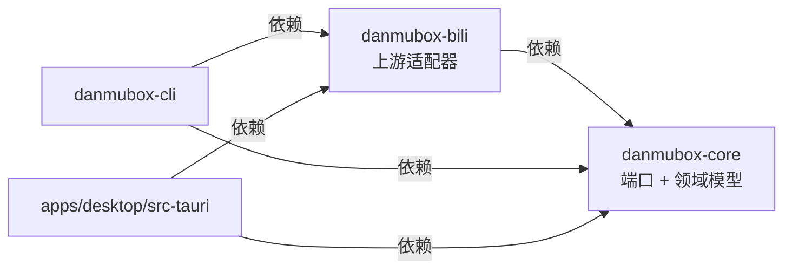

# ADR 0004：ac站相关实现全部收敛在 `danmubox-bili`，`core` 只定义端口与领域模型

> 定位：确立「上游实现」与「领域逻辑」的切分方式与依赖方向，界定逆向 / 协议变更时的改动范围。
> 读者：任何要新增上游接口、修改协议解析、或打算在 `core` 里写一行 ac站相关代码的人。
> 更新时机：拆出新 crate、上游适配需要跨进程（sidecar / 插件）、或 REQUIREMENTS.md 的隔离要求被放宽时。

| 项 | 值 |
|---|---|
| 状态 | Accepted |
| 日期 | 2026-09-11 |
| 决策者 | 项目作者 |
| 影响面 | `crates/danmubox-core/`、`crates/danmubox-bili/`、`crates/danmubox-cli/`、`apps/desktop/src-tauri/`、`../.gitignore` 覆盖范围 |
| 相关文档 | [`../contract.md`](../contract.md) §3、[`REQUIREMENTS.md`](../../REQUIREMENTS.md)、[`0002-rust-core-shared-surfaces.md`](0002-rust-core-shared-surfaces.md)、[`0003-protover3.md`](0003-protover3.md)、[`../auth.md`](../auth.md)、[`../protocol.md`](../protocol.md)、[`../architecture.md`](../architecture.md) |

## Context

REQUIREMENTS.md 直接写明：「由于 ac站的 API 不可控，可能有后期的逆向需求，需要将这部分的代码完全分离，如果后续修改不会影响到核心业务逻辑。」

这不是一句口号，而是一条可以被验证的工程约束。项目里确实存在大量「随时可能变」的上游事实：

| 类别 | 具体内容 |
|---|---|
| URL 与主机 | 直播间 / 关注 / 礼物 / 钱包 / 表情 / 举报等接口的地址与路径 |
| 字段下标与形状 | 例如 `DANMU_MSG` 内容在 `info[1]`、明文用户对象在 `info[0][15].user` |
| 签名与鉴权 | WBI 签名、`getRoomPlayInfo` 的房间解析、扫码流程、`buvid` 体系 |
| 二进制协议 | WebSocket 包头、`op` 语义、`protover` 压缩协商、protobuf 载荷（`INTERACT_WORD_V2`） |
| 上游字符串 | 发弹幕被吞的业务判定值（上游响应 `msg` / `message` 为 `"f"` / `"k"`） |
| 命令名 | `cmd` 枚举（`DANMU_MSG` / `SEND_GIFT` / …）及其与六种 `kind` 的映射 |

如果这些内容散落在 `core` 或 Tauri 命令层，任何一次上游改动都会向业务逻辑与 UI 扩散，测试面、回归范围、凭据脱敏规则都跟着一起动。

同时，本期不做本地持久化（见 [`0005-no-local-database.md`](0005-no-local-database.md)），上游适配层不需要承担持久化或对外暴露的职责，切分成本很低。

## Decision

**`danmubox-bili` 是唯一允许出现 ac站专有事实的 crate；`danmubox-core` 只定义端口（trait）与领域模型。**

依赖方向（规范性，不得违反）：

| 项 | 规则 |
|---|---|
| `core` 允许出现 | 端口 trait、领域模型与枚举、事件 / 错误类型、本地文件与常量 |
| `core` 禁止出现 | 任何 ac站 URL、字段下标、签名算法、二维码流程、protobuf 定义、`cmd` 字面量、上游专有名词 |
| `bili` 允许出现 | 上述全部上游事实，以及实现 `core` 端口所需的一切 |
| `bili` 禁止出现 | UI / 前端依赖、把上游类型泄漏进 `core` 的公共 API |
| 组装根 | `danmubox-cli` 与 `apps/desktop/src-tauri` 同时依赖 `core` 与 `bili`，在启动时把 `bili` 的实现注入 `core`；`core` 自身不感知实现来源 |
| 泄漏检查 | `core` 的公共 API 不得出现 `WBI`、`getRoomPlayInfo`、`DANMU_MSG`、`SEND_GIFT` 等上游词；`cmd` → `kind` 映射写在 `bili` 内 |

端口清单以 [`../contract.md`](../contract.md) §3 为准（`AuthProvider` / `LiveSource` / `DanmakuSender` / `DanmakuReporter` / `EmoteProvider` / `RoomCatalog` / `WalletProvider`），本文不重复列举。

**改动范围规则（本决策的核心收益）**：上游协议或接口变化时，只允许修改 `danmubox-bili`——`core`、UI、CLI 均不动。若某次改动必须触及 `core`，则说明领域模型或端口定义需要演进，应在 `core` 中新增 / 调整端口，而不是把上游细节塞进 `core`。

上游返回值的归一化也属于 `bili`：例如发弹幕被吞时上游返回的 `msg` / `message` 为 `"f"` / `"k"`，由 `bili` 翻译为 `core` 的 `SendOutcome`（`blocked_platform` / `blocked_room`）后再交还上层。

## Consequences

### 正面

- REQUIREMENTS.md 的「逆向改动不影响核心业务」有可验证的落点：改动范围由 crate 边界与 `core` 公共 API 的词表检查共同约束。
- `core` 的测试可以用假实现（fake adapter）驱动，不依赖网络与真实上游，也不需要凭据。
- 凭据与脱敏规则集中在 `core` 的鉴权模块与 `bili` 的实现里，评审时「谁能看到 Cookie」可枚举。
- 上游解析的 fixture 与回归测试集中在 `bili`，`core` 的测试不受上游字段变化影响。
- 端口即契约：UI、CLI 与将来的其它消费面都面向同一组 trait，替换上游实现不影响它们。

### 负面

- 需要为每组能力维护 trait、DTO 与映射代码，比「直接写在一个 crate 里」多一些样板。
- 上游错误必须被翻译成 `core` 的错误类型，映射层可能丢失部分原始上下文；需要在 `bili` 侧保留原始 code / message 供日志与排查。
- 组装根的启动代码需要显式注入实现，不能靠隐式全局单例。

### 风险

| 风险 | 说明 | 缓解 |
|---|---|---|
| 边界被逐步侵蚀 | 图省事在 `core` 里内联一个 URL 或字段下标，隔离名存实亡 | 依赖方向与词表检查纳入 CI 与评审清单（[`../AGENT.md`](../../AGENT.md)）；新增能力先加端口 |
| 端口设计过早上线 | 端口与实际上游形状不匹配，导致实现时被迫回改 `core` | 阶段 1 用 `danmubox-cli` 在真实连接上验证端口形状后再固化（见 [`../testing.md`](../testing.md)） |
| 上游错误信息丢失 | 映射为 `core` 错误时只保留分类，排查时看不到原始 code | `bili` 的错误类型保留原始 `code` / `message`；日志脱敏规则见 [`../operations.md`](../operations.md) |
| 未实测的字段下标 | 部分取值来自参考实现，尚未在本项目实测 | 未实测项进 [`../protocol.md`](../protocol.md) 附录「待实测校准」表，写明核对方法，不编造数值 |

## Alternatives considered

### 1. 单 crate 内按模块划分（`core::bili` / `core::ws` / …）

否决理由：模块划分只有约定，没有编译期强制力——任何模块都可以 `use` 另一模块，也无法阻止 UI 依赖上游类型。REQUIREMENTS.md 明确要求「完全分离」，需要的是**编译器会拦下越界**的边界，而 crate 依赖方向正是 Rust 里最便宜、最可靠的这种边界。

重新启用的条件：项目缩水为单 crate 且作者明确接受「隔离靠纪律」，或 Rust workspace 的构建开销在目标设备上被证明不可接受（当前不成立）。

### 2. 运行时插件 / 动态库（把上游实现做成可热替换的 `.dylib` / `.so`）

否决理由：为了「不重新编译就能换上游实现」引入 ABI 稳定性、版本对齐、跨平台加载路径与签名校验等一整套运行时复杂度；而本项目的真实需求是「改上游代码时不影响核心业务」，重新编译 `danmubox-bili` 完全可接受（自用、非热更新场景）。热替换能力买不到任何实际收益。

重新启用的条件：出现「必须在不重启、不重编译的前提下替换上游实现」的需求（例如需要在运行中的多套上游策略间切换），且愿意承担 ABI 管理成本。

### 3. sidecar（Python / Node 进程提供上游能力，Rust 只做胶水）

否决理由：上游代码离开 Rust workspace 后就只剩跨进程协议这一层「软约定」，`core` 与适配器之间不再有编译期边界，与 REQUIREMENTS.md 的隔离目标相悖；同时带来包体膨胀、跨进程生命周期管理、打包与分发复杂度。

重新启用的条件：Rust 侧出现无法绕过的上游实现阻塞（例如某个必需的签名算法只有 Python 实现且无法移植），且该阻塞无法通过单点 FFI 解决。

### 4. 把上游事实集中到一个 `const` / 配置表放在 `core` 内

否决理由：把 URL、字段下标、`cmd` 字面量收进 `core` 的常量表，看起来「集中管理」，但等于把上游事实固化成 `core` 的公共 API：每次上游改动都要动 `core` 并在所有消费面重新编译与回归，恰好破坏了「逆向改动不影响核心业务」。集中管理 ≠ 边界隔离。

重新启用的条件：不存在。需要集中管理时，落点应是 `danmubox-bili` 内部的常量模块。
