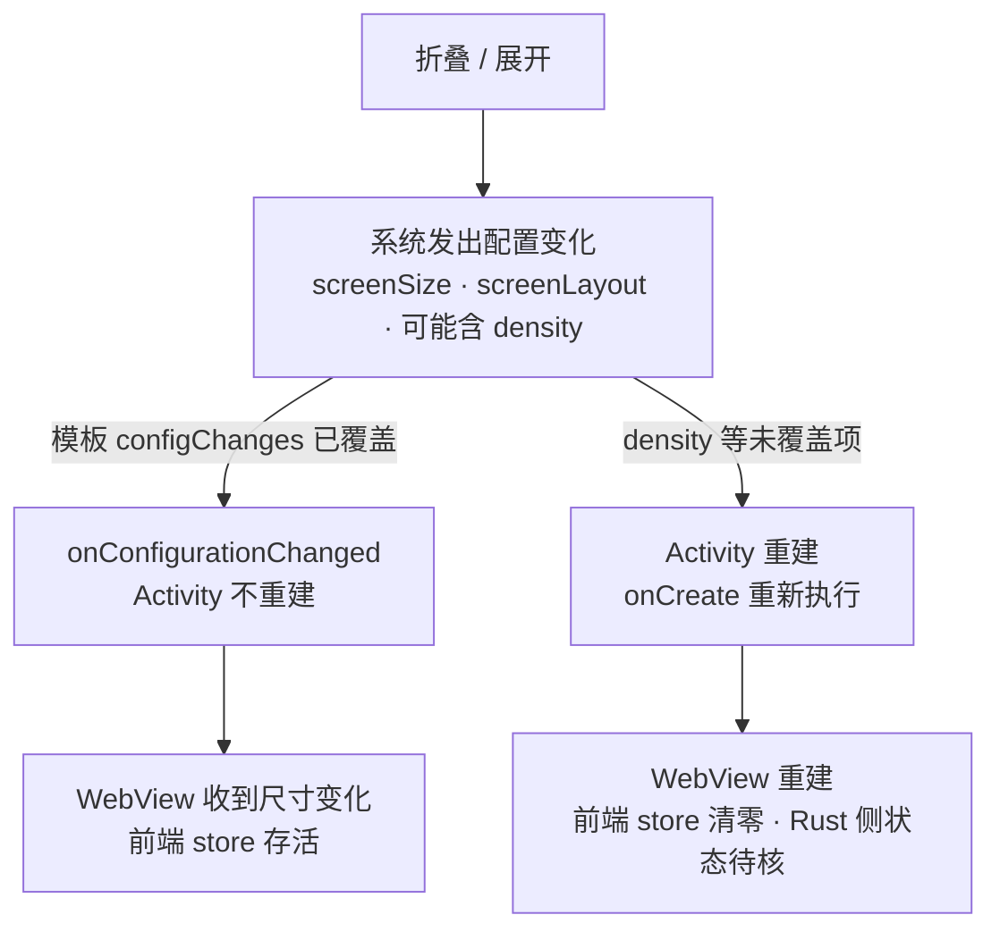

# 折叠屏（Fold8）适配可行性研究

> 定位：只回答「能不能做、要动多少、怎么验」——**本文是研究结论，不是验收标准，也不是排期承诺**；本次不产生任何实现改动。
> 读者：项目作者、被指派参与实现的 AI agent、来核对「折叠屏到底评估过没有」的人。
> 更新时机：真机到位并跑完 §6 的核对清单、折叠屏需求被正式排期（届时另立票与验收标准）、Web 侧折叠屏 API 的支持面变化、或 `docs/Galaxy_Z_Fold8/` 的官方皮肤包被替换/移出仓库时。

## 1. 结论小结

| 项 | 结论 |
|---|---|
| **可行性等级** | **需改造**（可做，但不是「加几行 CSS」；引擎侧不用动） |
| 一句话结论 | 会话语义与核心逻辑全在 Rust、与屏幕无关，因此**掉不掉会话只取决于 Android 的 Activity/WebView 是否被重建**，而模板 manifest 的 `configChanges` 大概率已经避免了重建（§4 R1）；前端则必须在现有 520px 断点**之上再加一档**并做铰链避让，这才是主要工作量 |
| 前提条件 | ① 目标机型**已确认**：Galaxy Z Fold8（非 Ultra；用户 2026-09-15 确认，见 §2.1）；② Android 主流程已跑通并有真机或可折叠 AVD；③ 接受为此新增一档响应式断点与新布局状态机 |
| 主要代价 | 前端一档新断点 + 双栏布局 + 列表/房间两页同时挂载的状态机（§4 R5）；若走原生路线再加一个 Tauri 插件 crate 与 Android library 模块（§5 路线②） |
| 主要风险 | 折叠/展开是否重建 Activity → 是否掉会话与内存缓冲，**这一条只能真机拍板**（§6 缺口清单第 1、2 项） |

## 2. 目标形态假设

### 2.1 目标机型：Galaxy Z Fold8（官方皮肤包佐证）

> **用户 2026-09-15 确认：本文的目标机型 = Galaxy Z Fold8（书页式内折，7.6" 内屏 / 5.5" 外屏），不是 Fold8 Ultra。**

| 项 | 值 | 来源 |
|---|---|---|
| 内屏（展开态） | 7.6" · **2448 × 1848 px** · 4:3 | 官方皮肤包 `parts.device.display`（§8 编号 31）+ GSMArena 规格页同值（§8 编号 26） |
| 外屏（折叠态） | 5.5" · **1248 × 1972 px** | 官方皮肤包同值（§8 编号 31）+ GSMArena 规格页同值（§8 编号 26） |
| 系统 | Android 17 + One UI 9 | GSMArena 规格页（§8 编号 26） |
| 发布 | 2026-07-22；型号 SM-F971B/DS/U/U1；支持 Samsung DeX | GSMArena 规格页（§8 编号 26） |
| ppi | 内屏 ~404 ppi（规格页）/ ~403 ppi（评测页）；外屏 428 ppi | GSMArena（§8 编号 26、28） |
| **`densityDpi`**（决定 dp 宽度与断点落位） | **皮肤包不含密度 → 待真机** | 见 §3.3 |

- **像素几何现在有官方产物佐证**：仓库内 `docs/Galaxy_Z_Fold8/` 是三星官方皮肤包，两套 —— `Galaxy_Z_Fold8_Main_Screen/`（展开）与 `Galaxy_Z_Fold8_Cover_Screen/`（折叠）。两套包的 `layout` 里 `parts.device.display` 分别写着 `width 2448 / height 1848` 与 `width 1248 / height 1972`，与各自 `fore_port.png` 的实际像素尺寸逐位一致（本次工程复核：读 PNG 头得 2448×1848 与 1248×1972；两套的 `device_Port-*.png` 分别是 2885×2261 与 1701×2388，即皮肤窗口的整体尺寸）。⇒ §3.3 换算所依赖的两个像素宽度**从「二手聚合站」升级为「官方产物 + 二手站交叉一致」**。
- **仍待真机的是密度，不是像素**：皮肤包里没有任何 `densityDpi` 信息，dp 宽度仍只能按 §3.3 的档位区间估计，最终以真机 `wm density` / `wm size` 为准。
- **不采用 Fold8 Ultra**：它是另一台机器（内屏 8.0" 2256×2504、外屏 6.5" 1080×2520，§8 编号 27）。将来若换机型，§3 的 dp 换算与 §4 R2 的断点落位**必须重取**，其余章节结论不变。
- **口径补充（二手站内部不一致）**：GSMArena 的评测第 3 页把内屏写作 `1828 × 2448`（≈403 ppi），与规格页和官方皮肤包的 `2448 × 1848` 不一致 —— 以官方产物与规格页为准，评测页那个读数按二手站内部不一致记录（§8 编号 28）。
- 三星官网规格页为前端动态渲染，2026-09-15 未取到可解析文本（§8 编号 29）；它已被官方皮肤包取代为主要佐证，官网页面仍建议在开工前人工复核一次。

### 2.2 按设备类别仍然成立 / 必须按机型重取的结论

| 结论 | 对「书页式内折 + 可展开成大屏」这一类 | 对具体机型 |
|---|---|---|
| 折叠/展开会触发配置变化（大小、屏幕布局，可能还有密度） | **成立**（Android 文档的通用行为，§8 编号 12、15） | — |
| 是否重建 Activity 取决于 manifest 的 `configChanges` | **成立** | 具体取值来自本项目将要生成的 manifest（§4 R1，模板证据） |
| 半开姿态存在「书页（竖铰链）」与「桌面（横铰链）」两种，铰链处需要避让 | **成立**（安卓 `FoldingFeature` 的通用模型，§8 编号 14） | 铰链在本机上报不上报、bounds 多少 → **待核** |
| 展开态是单列还是能放双栏、双栏断点取多少 | 方向成立（展开后 ≥ 600dp 才谈得上双栏） | 本次已按 Fold8 取（§3.3，含密度待实测）；换机型须重取（像素宽度、`densityDpi`、比例都不同） |
| 竖折（flip）类折叠屏 | **不适用**：没有「展开成平板」的形态，双栏需求不存在；本文其余结论不要外推 | — |

## 3. 本仓库现状（改动面的事实基础）

### 3.1 现有布局与窗口假设

| 事实 | 出处 |
|---|---|
| 单窗口聊天框式布局；断点 **520px**：`> 520` 宽屏（单列居中），`≤ 520` 窄屏（单列铺满）；**竖屏是默认形态** | [`ui.md`](ui.md) §9.1 |
| 宽屏只是「同一套排布在更宽容器里的自然结果」，**没有常驻左栏、抽屉或三列** | [`ui.md`](ui.md) §2.1 |
| 窗口默认 390 × 844、最小 360 × 480 | `apps/desktop/src-tauri/tauri.conf.json` 的 `app.windows[0]`（对应 [`ui.md`](ui.md) §9.1、[`README.md`](../README.md) §3） |
| 页面切换是二选一：`activeRoomId` 非空即房间页、空即列表页（`App.tsx` 里 `activeRoom && prefs ? <RoomView/> : <RoomList/>`） | `apps/desktop/ui/src/App.tsx`；[`ui.md`](ui.md) §2.1 |
| 已有多房间标签：`rooms: RoomView[]` + `activeRoomId`，每个房间各自有 `status` / `roomStats` / `roomIdentities`，IPC 侧已有 `rooms_connect` / `rooms_list` | `apps/desktop/ui/src/store.ts`、`apps/desktop/ui/src/ipc.ts`；[`ui.md`](ui.md) §2.3、[`ipc.md`](ipc.md) |
| 样式只有一处令牌定义（`app.module.css` 顶部 `:root`），组件规则一律引用令牌 | [`ui.md`](ui.md) §9.2 |

### 3.2 会话语义（折叠适配的第一风险点）

- 弹幕缓冲是**内存态，生命周期 = 一次房内会话**：进入房间开始、离开房间结束，离开即销毁；上限按 `kind` 分档（`history.buffer_rows_*`，默认六档之和 8200 条），进程退出即丢（[`contract.md`](contract.md) §4.3、[`README.md`](../README.md) §9）。
- 长连接同样挂在房内会话上（`rooms_connect` 起、`rooms_disconnect` / 关房结束，[`contract.md`](contract.md) §7）。
- 因此：**折叠/展开本身不该掉会话**（它不是「离开房间」）；但如果系统重建了 Activity + WebView，前端 store（含未确认行、草稿、面板状态）与会话的界面侧镜像会一起没掉。**Rust 侧的进程内状态是否随之丢失，本次未实测 → 待核**（§4 R1、§6 缺口 1）。
- 职责划分没有变化：核心逻辑全在 `danmubox-core` / `danmubox-bili`，前端是渐进增强（[`roadmap.md`](roadmap.md) §3「Tauri Android WebView 渲染差异」一条）。

### 3.3 折叠态 / 展开态分别落在现有断点的哪一侧（dp 换算）

**换算依据**：Android 的 `dp` 是「160 dpi 屏上的一个像素」这个虚拟单位（Android 官方密度文档，§8 编号 18），因此 `dp = px × 160 / densityDpi`。WebView 里 CSS 像素等于 dp 的前提是视口按设备宽度布局：本仓库 `apps/desktop/ui/index.html` 的 viewport 是 `width=device-width, initial-scale=1.0`，满足该前提（**「CSS px 是否严格等于 dp」仍以真机 `innerWidth` 对照 `wm size` / `wm density` 为准 → 待核**）。

上表两个像素宽度（内屏 1848 px、外屏 1248 px）取自官方皮肤包 `layout` 的 `display.width`，并与 GSMArena 交叉一致（§2.1、§8 编号 31）。`densityDpi` 由厂商按屏幕设置，**皮肤包不含这个值，本次也没有取到任何一台真机的实际值 → 全部标待核**。下面是按常见密度档位（420 / 440 / 480，以及 400）代入的区间估计，用来判断「落在断点哪一侧」这种量级问题：

| 形态 | 像素宽（Fold8） | 候选 `densityDpi` → 换算宽度 | 落在 520px 断点 |
|---|---|---|---|
| **折叠态（外屏，竖屏）** | 1248 px | 420 → **475 dp**；440 → 454 dp；480 → **416 dp** | **窄屏侧**（≤ 520） |
| **展开态（内屏，竖屏）** | 1848 px | 400 → 739 dp；420 → **704 dp**；440 → 672 dp；480 → **616 dp** | **宽屏侧**（> 520） |

两条由换算直接得出的判断（代数量级，不是实测）：

1. **折叠态要落进宽屏侧，`densityDpi` 必须小于 384**（`1248 / 520 × 160`）——明显低于 428 ppi 面板对应的常见档位，因此「折叠后变成宽屏单列」的风险很低；反之**展开态要落回窄屏侧，`densityDpi` 必须大于 569**（`1848 / 520 × 160`），同样不大可能。**即：现有 520px 断点在两台屏上大概率是「折叠 = 窄屏、展开 = 宽屏」，两侧都不会因为落到错误分支而碎掉。**
2. **展开态即使落进宽屏侧，也只是「单列居中」，不会自动变成双栏**（[`ui.md`](ui.md) §9.1 宽屏口径就是单列）。要双栏，必须**新增一档更高的断点**。
   - 安卓官方推荐的窗口宽度档位下界是 **600 / 840 / 1200 / 1600 dp**（`WindowSizeClass`，§8 编号 16）。按上面的估计，Fold8 展开态约 **616–739 dp**：**够得到 600 dp（medium），很可能够不到 840 dp（expanded）**。所以双栏阈值不能照搬 840 dp，否则在 Fold8 上永远触发不了；**建议以 600 dp 档起步并留出实测校正**（真机实测后按 `densityDpi` 回填）。
   - 作为对照：双栏本身对每栏宽度的要求并不苛刻——展开态 616–739 dp 下按 40% : 60% 分栏，列表侧约 246–296 dp，仍大于窗口最小宽度 360px 所对应的窄屏排版口径（§9.1 的宽屏留白 24px、窄屏 12px 都是按 ≤ 520 整栏设计的，因此分栏后每一栏都必须按**窄屏口径**排版，而不是各自当成一个 520+ 的宽屏）。

## 4. 技术风险清单

> 每条给出：现象 / 触发条件 / 证据或出处 / 影响 / 处置方向 / 是否必须真机才能确认。

### R1 折叠/展开是否重建 Activity → 会不会掉会话（**第一风险**）

| 项 | 内容 |
|---|---|
| 现象 | 折叠或展开后，聊天流清空、未确认行消失、草稿丢失、连接重连；严重时界面从列表页重新开始 |
| 触发条件 | 一次折叠/展开（内屏 ↔ 外屏）触发的配置变化未被 `configChanges` 覆盖 |
| 证据或出处 | ① **模板实际取值**（本次从上游模板取得，仓库内 Android 工程截至 2026-09-15 尚未生成，见下）`android:configChanges="orientation\|keyboardHidden\|keyboard\|screenSize\|locale\|smallestScreenSize\|screenLayout\|uiMode"`（§8 编号 1）；② Android 文档：*"The system recreates an Activity when a configuration change occurs"*，而 `android:configChanges` 声明后 *"the activity remains running and its `onConfigurationChanged()` method is called"*（§8 编号 12、13）；③ 折叠屏专页：*"An app stops and restarts as it transitions from one screen to another when a device folds or unfolds"*（默认行为，§8 编号 15）；④ **`density` 不在模板的 `configChanges` 里**，而官方把「在不同屏幕密度的显示器之间移动（例如折叠屏的两个屏）」列进了会触发配置变化的场景（§8 编号 12）；⑤ Tauri 侧确有 `onConfigurationChanged` 钩子：`TauriActivity.onConfigurationChanged` → `PluginManager.onConfigurationChanged`（§8 编号 5、6） |
| 影响 | 若真发生重建：前端 store（消息镜像、乐观行、草稿、面板/滚动状态）全丢；Rust 侧进程内会话是否保留**未知**（同进程未退出，但 WebView 会被重建） |
| 处置方向 | 先**只观测**：真机上抓 `logcat` 里 Activity 的 `onCreate` / `onConfigurationChanged` 与 `Config changes` 记录，折叠/展开各来一次；若确认会重建，再决定（改生成工程的 manifest 补 `density`、或把会话状态做到可从 Rust 侧重建）——**本次不做任何改动** |
| 需真机？ | **是**。AVD 的 `adb emu fold/unfold` 能复现配置变化路径，但厂商的密度设置与三星的多窗口/DeX 行为只有真机能拍板 |

> **仓库内 Android 工程的当前状态**：截至 2026-09-15，`apps/desktop/src-tauri/gen/` 下只有 `schemas/`（`capabilities.json` / `acl-manifests.json` / `macOS-schema.json` / `desktop-schema.json`），**尚无 `gen/android/`**，因此本文的 manifest 取值取自上游模板，不是本仓库产物。模板 URL、取到日期与文件校验和见 §8。工程生成后应把「模板值 vs 实际生成值」核对一遍（预期只差包名 / 应用名 / `usesCleartextTraffic` 占位符）。

### R2 520px 断点是否够用

| 项 | 内容 |
|---|---|
| 现象 | 展开态仍是单列居中、大片留白；或双栏按错误阈值切分导致每栏过窄 |
| 触发条件 | 展开态宽度落在 520 与新双栏阈值之间；或双栏阈值直接照搬安卓 840 dp |
| 证据或出处 | 现有断点与形态对照：`ui.md` §9.1；安卓档位 600 / 840 dp：`WindowSizeClass` 常量（§8 编号 16）；Fold8 展开态估算 616–739 dp（本文 §3.3，含「待真机校正」） |
| 影响 | 功能上不致命（不会碎），但「折叠屏适配」的价值（双栏）落空 |
| 处置方向 | 新增一档「双栏」断点，起始值取 **600 dp 量级**并在真机实测后校正；两栏各自按**窄屏口径**排版；断言沿用 §9.1 的既有口径（任何宽度不许横向滚动、面板只挤列表、不遮最新一条） |
| 需真机？ | 阈值取值**需实测**（`densityDpi`）；布局本身可在无头/桌面验 |

### R3 Web 侧折叠屏 API 在 Android WebView 上到底有没有

| 项 | 内容 |
|---|---|
| 现象 | 页面里 `navigator.devicePosture` 为 `undefined`、`env(viewport-segment-*)` 解析为空 → 纯 CSS 方案拿不到铰链几何 |
| 触发条件 | 运行在系统 WebView 上，而特性面以 Chrome 为准 |
| 证据或出处 | ① **Device Posture API**：Chrome Platform Status 记为 *Enabled by default*，Chrome/Android 里程碑 **132**（记录更新时间 2025-08-22，§8 编号 21）；② **Viewport Segments Enumeration API**：状态为 **Origin trial**，里程碑 **138**（记录更新时间 2025-05-05，§8 编号 22）；③ 两条记录的 **WebView 一栏都没有标注**→ **Android System WebView 上的可得性 = 待核**；④ Tauri 的 Android 应用用的是**系统 WebView**：生成的 app 模块依赖 `androidx.webkit:webkit:1.14.0`（模板 `build.gradle.kts`，§8 编号 3） |
| 影响 | 路线①的上限被压到「只能靠宽度做响应式」，铰链相关信息拿不到 |
| 处置方向 | 不把这两条 API 当必要条件：先用「宽度 + 安全留白」实现；真要铰链几何再走路线③。核对方法：真机 `chrome://inspect` 连上去，在 console 里直接读 `typeof navigator.devicePosture`、`getComputedStyle(document.body).getPropertyValue('--sg')`，并对照 WebView APK 版本号（`adb shell dumpsys package com.google.android.webview \| grep versionName`，把版本号换算回 Chrome 里程碑） |
| 需真机？ | **是**（模拟器只能告诉你模拟器 WebView 的情况） |

### R4 铰链区域避让：纯 CSS 与原生两条路线的能力差

| 项 | 内容 |
|---|---|
| 现象 | 半开（书页姿态）时内容正压在铰链折痕上；桌面姿态下，落在平放那一半的内容（例如输入区）视角与触控都变差 |
| 触发条件 | 设备处于半开姿态，且布局没有按铰链位置留白 / 分段 |
| 证据或出处 | ① 折叠屏模型：`FoldingFeature` 的 `state`（`FLAT` / `HALF_OPENED`）、`orientation`（`HORIZONTAL` / `VERTICAL`）、`occlusionType`（`NONE` / `FULL`）、`isSeparating`、`bounds`；半开时 `isSeparating` 恒为 true（§8 编号 14、15）；② 纯 CSS 侧的对应物只有 viewport segments / `env()`（状态见 R3） |
| 影响 | **纯 CSS（路线①）拿不到铰链矩形与姿态**，只能在「不确定铰链在哪」的前提下做保守留白（例如中间一条 32–48 px 的安全带）；原生路线（②③）才能把铰链当成分隔条 |
| 处置方向 | 若接受「保守留白 + 不跨中的单列」，路线①够用；若要把铰链当分隔条（左右两块各自排版），必须走原生 |
| 需真机？ | 铰链是否上报、`bounds` 具体值、折痕视觉宽度：**是** |

### R5 双栏（房间列表 + 聊天）的改动面

| 项 | 内容 |
|---|---|
| 现象 | 展开态希望左边房间列表、右边聊天，但现在是二选一页面 |
| 触发条件 | 展开态宽度达到双栏阈值 |
| 证据或出处 | `App.tsx`：`activeRoom && prefs ? <>{roomTabs}<RoomView/></> : <RoomList/>`；`ui.md` §2.1 明写「当前实现是单列……互斥的两个页面，由 store 的 `activeRoomId` 切换，没有常驻左栏」 |
| 影响 | 这是**前端本次唯一的结构性改动**（比断点本身大） |
| 处置方向（逐项） | · **组件**：`App.tsx` 改为按形态渲染单列或双栏容器；`RoomList` 需要「当前选中项 + 窄栏排布」两个新输入；`RoomView` 需要支持「在栏内渲染」而不是占满整屏（其内部的面板/输入区口径不变）。· **store 字段**：**不需要新增持久化字段**——`rooms` / `activeRoomId` / `status` / `roomStats` / `roomIdentities` 已足够；可能新增的只是纯界面态的「双栏在展开态是否默认启用」。· **IPC**：**不需要改**——`rooms_list` + `rooms_connect` 已支持多房间共存（现有标签条就是多条连接并存），双栏只是把「同时展示两个区域」变成常驻；不得为此新增命令（[`AGENT.md`](../AGENT.md) §7.2）。· **样式**：新增一档媒体查询与分栏容器，全部走既有令牌（[`ui.md`](ui.md) §9.2 禁止硬写值）。· **冒烟**：`apps/desktop/ui/smoke/run-headless.mjs` 现只跑 `wide 1440×900` 与 `narrow 360×844` 两个视口，需要加一档展开态视口（约 700×900）并补双栏断言 |
| 需真机？ | 改动本身不需要；**阈值取值**需要（R2） |

### R6 输入法 / 横竖屏 / 多窗口叠加

| 项 | 内容 |
|---|---|
| 现象 | 键盘弹起时输入区被遮住或页面被顶飞；分屏/悬浮窗下窗口宽度小于 360；横屏与展开叠加后出现没人设计过的宽度 |
| 触发条件 | 软键盘 + edge-to-edge；多窗口；旋转 |
| 证据或出处 | ① 模板 manifest **未声明** `android:windowSoftInputMode`（取值候选见 `<activity>` 文档，§8 编号 13）→ 走系统默认；② 模板 `MainActivity.kt` 调用了 `enableEdgeToEdge()`（§8 编号 2）；③ Android 17（API 37）：官方博客明确 *"Android 17 (API level 37) … removing that developer opt-out for orientation and resizability restrictions on large screen devices (sw > 600 dp)"*，而 `resizeableActivity` 的文档也说 *"the system ignores this attribute for apps that target Android 16 (API level 36)"*（§8 编号 25、13）；④ 模板生成的应用 `targetSdk = 37`（§8 编号 3）；⑤ 大屏多窗口是常态：*"Android 12 (API level 31) and later versions default to multi-window mode … on large screens, all apps run in multi-window mode regardless of app configuration"*（§8 编号 15） |
| 影响 | 「窗口最小宽度 360」这条**桌面概念**在安卓上不成立：分屏/悬浮窗可以把可用宽度压到 360 以下；`tauri.conf.json` 的 `minWidth` 在移动端是否生效**未核实 → 待核** |
| 处置方向 | ① 视口窄于 360 时仍不许横向滚动、不许面板吃掉整屏（属于既有口径的自然延伸，需要新增断言）；② 键盘态要用 `visualViewport` 而非 `100vh` 做输入区定位；③ 不依赖 `screenOrientation` 锁方向（targetSdk 37 + 大屏 sw > 600dp 上已不生效，见官方博客） |
| 需真机？ | 键盘与分屏行为**是**；纯窄视口可在无头验 |
| 顺带记录 | GSMArena 的规格页把 **Samsung DeX（桌面体验）** 列入 Fold8 特性；Connected Displays 自 Android 16 QPR3 起进入 stable（§8 编号 26、25）。外接显示器意味着「尺寸 + 密度同时变化」的第三种场景，本次**不展开**，标「待核」 |

## 5. 方案对比

三条路线都只覆盖「展开/折叠布局 + 铰链避让」，**都不改动 Rust 引擎**（会话语义由 `contract.md` §4.3 固定，与屏幕无关）。

| 维度 | ① 纯 CSS / 视口驱动（零原生代码） | ② Tauri 自定义 Kotlin 插件（原生全量上报） | ③ 混合（CSS 打底 + 原生只补姿态） |
|---|---|---|---|
| 做法 | 新增一档断点 + 双栏容器 + 中间安全带；铰链用保守留白处理 | 新增 `tauri::plugin` + Android library 模块，用 `androidx.window` 的 `FoldingFeature` 读姿态/铰链 `bounds`/`isSeparating`，经 command 推给前端与 Rust | CSS 负责「任何宽度都不碎 + 双栏」；原生只推 `posture(flat/half-opened)` 与「铰链是否分隔、在垂直还是水平方向」，前端据此切布局 |
| 改动面 | 前端：`app.module.css` 一档媒体查询 + `App.tsx` 双栏容器 + `RoomList`/`RoomView` 的少量 props + 冒烟视口 | 上述全部，外加：新插件 crate（`src-tauri` 注册 + capability 权限登记）、Android library 模块（模板 `build.gradle.kts`：`com.android.library`、`compileSdk 36`、依赖 `project(":tauri-android")`，§8 编号 8）、生成工程里的插件注册 | 同 ②，但原生侧只剩一个姿态事件（API 面小得多，代码量约 ② 的 1/3） |
| 依赖 | **零新增依赖**（用现有 `app.module.css`、React） | `androidx.window:window`（stable **1.5.1**，§8 编号 17）、Android library 模块、Kotlin 编译链；插件模板自带 `androidx.core/appcompat/material` 依赖（§8 编号 8） | 同 ②（依赖不减，但只用 `WindowInfoTracker` 一条流） |
| 能力上限 | 只有宽度；**拿不到铰链**（R3/R4）；半开时只能做保守留白 | 完整：姿态、铰链 `bounds`、`isSeparating`、`occlusionType`，可做「铰链当分隔条」 | 介于两者：拿得到姿态与「是否有分隔铰链」，但拿不到精确矩形（除非也传 `bounds`，那就等于 ②） |
| 验证方式 | 桌面 Tauri 拖窗口 / 无头冒烟加视口 / 可折叠 AVD 的 `fold`·`unfold`·`resize-display` | **只能模拟器或真机**（无头浏览器没有 `FoldingFeature`）；插件侧可在 Android Studio 单测 `FoldingFeature` 解析 | 半自动：姿态分支可在 AVD 用 `adb emu posture 2` 触发；精确几何仍需真机 |
| 工作量量级 | **1–2 票**（约 2–5 人日量级） | **3–6 票**（约 8–15 人日量级；一半以上花在构建链路与依赖，而不是折叠逻辑） | **2–4 票**（约 4–8 人日量级） |
| 适合什么前提 | 「双栏 + 不碎」就算达标 | 想把铰链做成结构（左右两块各自滚动） | 想要姿态感知但不想背一个完整的原生插件面 |
| 主要代价 | 半开姿态的体验是「保守」的 | 构建复杂度与依赖面明显上升（新 crate + Android 模块 + capability） | 仍是原生插件，构建复杂度与 ② 同级 |

**取舍一句话**：先按 ① 把「不碎 + 双栏」拿到手（它就是 ②③ 的必要底座，不会白做）；只有当「半开姿态要按铰链分段」被确认为需求时，再按 ③ 补一个**只推姿态**的最小插件；② 的完整上报（含 `bounds`）只在真的要做「铰链当分隔条」时才值得。

**为什么把 ① 排在前面**：`docs/roadmap.md` §3 已经承认「Tauri Android WebView 渲染差异」是既有风险，而 Android 侧最贵的不确定性（这是本次研究里唯一「只有真机能拍板」的会话语义问题）与插件无关 —— 先解决布局与真机核对，再谈原生。

## 6. 验证路径（不买真机能不能验）

### 6.1 能验：可折叠 AVD 与模拟器命令

| 目的 | 命令 | 出处 |
|---|---|---|
| 折叠 / 展开机身 | `adb emu fold` / `adb emu unfold` | Android Developers Blog，2026-08-31（§8 编号 19） |
| 旋转 | `adb emu rotate` | 同上 |
| 列出可用姿态 / 切到半开（桌面姿态） | `adb emu posture` → `adb emu posture 2`（`1: closed / 2: half-opened / 3: opened`） | 同上 |
| 可调整尺寸模拟器切形态 | `adb emu resize-display` → `adb emu resize-display 1`（`0: phone / 1: unfolded / 2: tablet`） | 同上 |
| 多台模拟器时选定目标 | `adb -s <serial> emu <command> <parameter>` | 同上 |
| 读窗口尺寸 / 密度（算真实 dp） | `adb shell wm size`、`adb shell wm density` | 本次**未引用官方页面**（命令属平台工具，形态随版本变化）：以本机 `adb shell wm` / `adb shell wm help` 的实际输出为准 → 标「待核」 |
| 系统 device state（**不是**模拟器姿态开关） | `adb shell cmd device_state print-states` 看可用状态，`cmd device_state state <整数>` 覆盖，`state reset` 复位，`print-state` / `print-states-simple` 查看 | AOSP `DeviceStateManagerShellCommand`（§8 编号 20）：用法串为 `state [reset\|OVERRIDE_DEVICE_STATE]`、`base-state …`、`print-state`、`print-states`、`print-states-simple`；**取值必须是 `print-states` 列出的整数**，非整数会报 `Error: requested state should be an integer` |
| 直接派发「被折叠」这一类硬件开关事件 | `adb emu event send EV_SW:0:1 EV_SYN:0:0` | 模拟器控制台文档（§8 编号 32）：`event send type[:code]:[value]`，发送后须补 `EV_SYN:0:0` 同步标记；EV_SW 管的正是「翻盖机 / 平板是否被折叠」这类物理开关，`SW_LID` 的取值 0/1 = Open/Closed。code 号与别名：`SW_LID = 0x00`、`EV_SW = 0x05`（§8 编号 34） |
| 把两套官方皮肤包当自定义 AVD 皮肤（Cover / Main） | AVD 的 `config.ini` 指向皮肤目录（`skin.name` / `skin.path`），启动后看会发生什么 | `layout` 格式与 `event` 语义的出处：AOSP `android/skin/file.c` + `window.c`（§8 编号 33）。**本次未实测**：装进去会不会改变 guest 屏幕尺寸/密度、能不能当两块屏切换用 → 待核（核对方法见下） |

**模拟器的已知边界（官方博客自己写明）**：*"Not all postures are supported by every virtual device. Standard AVD templates like the Pixel Fold or the Resizable AVD only support postures 1, 2, and 3. Attempting to set 4 or 5 on these templates will return a `KO: Failed to set posture` error."*（§8 编号 19）。可折叠 AVD 的**铰链**能模拟到什么程度（是否上报 `FoldingFeature` 的 `bounds`、是否给出 `occlusionType`）**本次未实测 → 待核**，核对方法：AVD 里跑一个最小的 `WindowInfoTracker` 探针或直接 `adb shell dumpsys` 看窗口特征。

**官方皮肤包能不能当「折叠开关」用（待核）**：`docs/Galaxy_Z_Fold8/` 的两套包正是模拟器自定义皮肤（skin）的格式 —— `layout` 里是 `parts` / `layouts` / `background` / `foreground` / `buttons` / `display` 这些节点，解析器在 AOSP `android/skin/file.c`（§8 编号 33）。关于两套包都写着的那行 `event EV_SW:0:1`，**按源码读**：

- 它的语义是「**窗口创建、或重置到该 layout 时**，经 `generic_event(type, code, value)` 派发一次这个假硬件事件」（`window.c` 的 `skin_window_create` → `skin_window_reset_internal`，以及公开的 `skin_window_reset`），**不是「点击该 part 时」派发**；不写 `event` 时内置默认就是 `0x05(EV_SW):0:1`（源码注释 close keyboard by default）。
- 按 Linux evdev 编号，`EV_SW = 0x05`、`SW_LID = 0x00`（§8 编号 34），而控制台文档把 `SW_LID` 的 0/1 写作 Open / Closed，并说明 EV_SW 管的就是「是否被折叠」这类物理开关（§8 编号 32）。⇒ 这行等价于「派发一次 lid closed」。

三条待核（都**没有实测**，务必按这个顺序核）：

1. **装的皮肤会不会改变 guest 的屏幕尺寸/密度**：装前装后各跑一次 `adb shell wm size` / `wm density`。皮肤包本身**不含任何密度信息**，是否能改分辨率也没有文档承诺。
2. **系统是否消费这个 SW_LID**：`adb shell getevent -l` 看事件有没有真的下发；再看 `adb logcat` / `dumpsys display` / `dumpsys device_state` 有没有切屏或姿态变化。
3. **派发时机**：只在启动那一次，还是旋转 / 全屏 / 切 layout 时也会再来一次（这决定它能不能当「反复折叠」的开关）。

**即使三条全部成立，它也只是「换一张皮肤 + 派发一个假开关事件」**：没有内屏断电、没有厂商的密度切换与多窗口行为 —— 所以它给的是「AVD 侧的复现手段」，**不能**替代 §6.3 里的真机清单。

### 6.2 在 WebView 里断言折叠态

- **连接方式**：Tauri 官方文档说明 Android 上模拟器默认开启 Web Inspector，真机需要开 USB 调试（并在 Chrome 里 `chrome://inspect` 打开对应条目）（§8 编号 9）。
- **可断言的东西**（逐条给判据，不依赖任何折叠屏专用 API）：
  - 形态：`innerWidth` / `visualViewport.width` 是否越过 520 与新的双栏阈值；`matchMedia('(max-width: 520px)').matches`。
  - 折痕存在性：`typeof navigator.devicePosture`、`navigator.devicePosture?.type`（若存在）；CSS 侧 `getComputedStyle(document.body).getPropertyValue('--seg')` 之类的探针变量是否解析出非空值 —— **是否可用见 R3，真机待核**。
  - 布局不碎：任何宽度下 `document.documentElement.scrollWidth <= innerWidth`（对应 [`ui.md`](ui.md) §9.1「任何宽度下不许横向滚动」）。
  - 会话存活：折叠/展开前后各读一次当前房间的消息条数与连接状态（例如 store 里 `status[roomId].state` 与列表长度），**这是 R1 的直接判据**。
- **无头能验什么**：仓库既有冒烟 `apps/desktop/ui/smoke/run-headless.mjs` 支持任意视口（当前预设 `wide 1440×900`、`narrow 360×844`），可以加一档展开态视口（约 700×900）把断点两侧与既有断言跑一遍。它**不模拟铰链**，也**不是 Android WebView**（跑的是 Chromium / WebKit 两个引擎），所以它证明的是「布局数学」，不是「折叠屏行为」。
- **有头（桌面 Tauri 窗口）能验什么**：真实宿主引擎（macOS 上是 WKWebView，正是 [`AGENT.md`](../AGENT.md) §9 要求进验证链的那个引擎）+ 真实 IPC；拖窗口即可覆盖任意宽度，用来验双栏与「不遮最新一条 / 只挤列表」等口径 —— 但**验不了折叠事件**（桌面没有折叠）。

### 6.3 验证缺口清单（只能真机拍板）

1. 折叠/展开是否重建 Activity、是否掉会话与内存缓冲（R1）——**最高优先级**。
2. 真机 `densityDpi` 与 `wm size` → 折/展两态的真实 dp 宽度 → 双栏阈值该取多少（R2）。
3. 系统 WebView 是否暴露 `navigator.devicePosture` 与 `viewport-segment-*`（R3）；WebView 版本与 Chrome 里程碑的对应关系。
4. Fold8 上 `FoldingFeature` 是否上报、半开时 `state` / `orientation` / `isSeparating` / `bounds` 的实际取值（R4）。
5. 铰链折痕的**视觉宽度**与「安全带要多宽才不压字」（R4）。
6. 软键盘在 edge-to-edge + WebView 下的实际行为：输入区是否被遮、`visualViewport.height` 是否变化（R6）。
7. 分屏 / 悬浮窗下可达的最小宽度；`tauri.conf.json` 的 `minWidth` 在 Android 上是否生效（R6）。
8. 内外屏切换对长连接的影响（真机热切换；AVD 的 `fold`/`unfold` 不等于同一块屏的物理切换）。
9. DeX / 外接显示器（尺寸 + 密度同时变化）——本次不展开，标记待核（R6）。
10. 官方皮肤包那条 AVD 路线能否成立（§6.1 的三项核对）；以及「皮肤切换」与真实物理折叠的差异（内屏断电、厂商密度切换、多窗口行为在 AVD 上都不存在）。

## 7. 收口建议

### 7.1 什么条件下开工

按 [`roadmap.md`](roadmap.md) §2.3 的既有前提（**拿到折叠屏真机 + Android 主流程已跑通**）之外，再加两条：

1. **机型**：已确认为 Galaxy Z Fold8（§2.1），开工时无需再拍板。
2. **§6.3 的第 1、2 项先有结论**：会话会不会掉、真实 dp 宽度是多少。这两条是「改动设计」的输入，不是「验证结果」，缺了就只能盲写。

### 7.2 开工前必须先拍板的事

| # | 要拍板的事 | 为什么必须先定 |
|---|---|---|
| 1 | ~~目标机型~~ **已拍板**：Galaxy Z Fold8（非 Ultra，用户 2026-09-15） | 断点与阈值按它取（§3.3）；将来换机型须重取（§2.1） |
| 2 | 展开态双栏是**默认**还是用户可选 | 决定是否需要新偏好键——一旦新增键，按 [`AGENT.md`](../AGENT.md) §6 必须同步 [`contract.md`](contract.md) §8 / [`ipc.md`](ipc.md) / [`ui.md`](ui.md) |
| 3 | 双栏阈值取 600 dp 档还是实测值 | 决定 [`ui.md`](ui.md) §9.1 要不要新增一档形态（现在是「宽/窄」两档） |
| 4 | 半开姿态要不要「按铰链分段」 | 决定走 §5 的路线①还是③；走③要接受一个原生插件 |
| 5 | 是否允许新增原生插件（会引入新 crate + Android library 模块 + capability） | 这是本次研究里唯一会改变仓库依赖面的决定 |
| 6 | 是否把「窗口最小宽度」在移动端重新定义 | `minWidth` 是桌面概念，安卓上分屏可以更窄（§4 R6） |

### 7.3 与现有 backlog 的关系

- [`roadmap.md`](roadmap.md) §2.3 的条目「Fold8 / 折叠屏（展开/折叠态布局、双栏、铰链避让；前提：拿到真机且 Android 主流程已跑通）」**继续成立**，本文是它的可行性附件，不改变它的前提与措辞（状态词与落点由主流程在 `roadmap.md` §2.3 与 [`requests.md`](requests.md) 登记）。
- [`README.md`](../README.md) §2.2 把「iOS 端、Fold8 / 折叠屏适配」列为**本期明确排除**：本文**不改变**这个边界——研究不等于纳入本期。
- [`roadmap.md`](roadmap.md) §3 风险表里的「Tauri Android WebView 渲染差异」是本文 R3/R4 的上位风险，已在 §5 的取舍里被当作既有约束使用。

### 7.4 本文与实现的关系（一行）

**本文只是研究结论：它给出可行性等级、改动面、风险与验证路径，不构成验收标准；真正开工时要按 [`roadmap.md`](roadmap.md) 尾段的规矩另立票、另定交付物与验收标准后再实施。**

### 7.5 自检

- 全文未出现任何房间号、账号名、凭据值或可定位到具体用户的标识（对齐 [`AGENT.md`](../AGENT.md) §8 第 14 条）。
- 全文的数值型断言都带出处（§8）或明确标「待核」；没有凭印象写的版本号或规格（对齐 [`AGENT.md`](../AGENT.md) §8 第 7 条）。
- 本次改动只新增本文一个文件，未触碰代码、配置或构建产物；`docs/Galaxy_Z_Fold8/` 的官方皮肤包是既有**未跟踪**资产，本文只引用它（像素几何与 `layout` 格式），没有把它纳入本次改动，也没有改 `.gitignore`。

## 8. 参考来源

**核对日期：2026-09-15**（下表所有 URL 均为当日实际访问）。

| # | 来源 | URL | 取到的东西 |
|---|---|---|---|
| 1 | Tauri 上游 Android 模板 manifest | https://raw.githubusercontent.com/tauri-apps/tauri/dev/crates/tauri-cli/templates/mobile/android/app/src/main/AndroidManifest.xml | `android:configChanges` 实际取值；无 `resizeableActivity` / `screenOrientation` / `supports-screens` / `windowSoftInputMode`。2026-09-15 取得，sha256 `dbf09eddc4349d10b2052c55dddd271c2e5b34634c9d9cb9edf49eb258601049` |
| 2 | 同上模板 `MainActivity.kt` | https://raw.githubusercontent.com/tauri-apps/tauri/dev/crates/tauri-cli/templates/mobile/android/app/src/main/MainActivity.kt | `class MainActivity : TauriActivity()` + `enableEdgeToEdge()` |
| 3 | 同上模板 `app/build.gradle.kts` | https://raw.githubusercontent.com/tauri-apps/tauri/dev/crates/tauri-cli/templates/mobile/android/app/build.gradle.kts | `compileSdk = 37`、`targetSdk = 37`、`minSdk = {{android.min-sdk-version}}`；依赖含 `androidx.webkit:webkit:1.14.0`、`androidx.appcompat:appcompat:1.7.1`、`androidx.activity:activity-ktx:1.10.1` |
| 4 | 同上模板根 `build.gradle.kts` | https://raw.githubusercontent.com/tauri-apps/tauri/dev/crates/tauri-cli/templates/mobile/android/build.gradle.kts | AGP 9.3.1、Kotlin Gradle 插件 2.2.10 |
| 5 | Tauri `TauriActivity.kt`（android-codegen） | https://raw.githubusercontent.com/tauri-apps/tauri/dev/crates/tauri/mobile/android-codegen/TauriActivity.kt | `onConfigurationChanged` → `PluginManager.onConfigurationChanged`；`launchMode` 之外还转发 `onNewIntent` / `onResume` / `onDestroy` 等 |
| 6 | Tauri `Plugin.kt` / `PluginManager.kt` | https://raw.githubusercontent.com/tauri-apps/tauri/dev/crates/tauri/mobile/android/src/main/java/app/tauri/plugin/Plugin.kt（及同目录 `PluginManager.kt`） | 插件生命周期钩子清单：`load` / `onNewIntent` / `onPause` / `onResume` / `onRestart` / `onStop` / `onDestroy` / **`onConfigurationChanged(newConfig: Configuration)`** |
| 7 | Tauri `tauri-utils` 配置源码 | https://raw.githubusercontent.com/tauri-apps/tauri/dev/crates/tauri-utils/src/config.rs | `bundle.android.minSdkVersion` 默认值 `24` |
| 8 | Tauri 插件模板 `android/build.gradle.kts` | https://raw.githubusercontent.com/tauri-apps/tauri/dev/crates/tauri-cli/templates/plugin/android/build.gradle.kts | 插件侧 Android 模块形态：`com.android.library`、`compileSdk = 36`、`minSdk = 21`、依赖 `project(":tauri-android")` |
| 9 | Tauri 官方文档：开发（含移动端 Web Inspector 与设备选择） | https://v2.tauri.app/develop/ | Android 模拟器默认开启 Web Inspector、真机需 USB 调试；`tauri android dev` |
| 10 | Tauri 官方文档：配置文件（平台专属配置） | https://v2.tauri.app/develop/configuration-files/ | 支持 `tauri.android.conf.json` / `Tauri.android.toml`，按 JSON Merge Patch (RFC 7396) 与主配置合并 |
| 11 | Tauri 官方文档：移动插件开发 | https://v2.tauri.app/develop/plugins/develop-mobile/ | Android 插件 = 继承 `app.tauri.plugin.Plugin` 且带 `@TauriPlugin`；`@Command` 方法可被 Rust / JS 调用；`plugin android init` 引导 |
| 12 | Android：Handle configuration changes | https://developer.android.com/guide/topics/resources/runtime-changes | 「配置变化默认重建 Activity」；声明 `configChanges` 后改为 `onConfigurationChanged`；官方列出的触发场景含**折叠设备**与**在不同密度的显示器之间移动（例如折叠屏的两个屏）**；Android 17（API 37）对 `keyboard` / `keyboardHidden` / `navigation` / `touchscreen` / `colorMode` / 部分 `uiMode` 不再默认重启，可用 `android:recreateOnConfigChanges` 选择旧行为 |
| 13 | Android：`<activity>` 元素 | https://developer.android.com/guide/topics/manifest/activity-element | `configChanges` 全部合法取值（含 `density` *added in API 24*）；`resizeableActivity` 语义与大屏特例（target API 36 起在 sw ≥ 600dp 上被系统忽略）；`windowSoftInputMode` 取值清单 |
| 14 | Android：Make your app fold aware | https://developer.android.com/develop/ui/compose/layouts/adaptive/foldables/make-your-app-fold-aware | `FoldingFeature` 的 `state` / `orientation` / `occlusionType` / `isSeparating` / `bounds`；布/桌两种姿态的判据（最后更新 2026-09-09） |
| 15 | Android：Learn about foldables | https://developer.android.com/develop/ui/compose/layouts/adaptive/foldables/learn-about-foldables | 「折叠/展开时 app 停止并重启」（默认语义）；Android 12+ 大屏默认多窗口；大屏双栏布局建议（最后更新 2026-09-09） |
| 16 | Android：`WindowSizeClass` API 参考 | https://developer.android.com/reference/kotlin/androidx/window/core/layout/WindowSizeClass | 宽度档位下界 `600 / 840 / 1200 / 1600 dp`，高度 `480 / 900 dp` |
| 17 | Android：Jetpack WindowManager 版本页 | https://developer.android.com/jetpack/androidx/releases/window | stable **1.5.1**（最新更新 2026-06-17；1.5.1 条目日期 2025-11-19），alpha 1.6.0-alpha05 |
| 18 | Android：Support different pixel densities | https://developer.android.com/training/multiscreen/screendensities | `dp` 定义（160 dpi 基准的虚拟像素）——本文 dp 换算的依据 |
| 19 | Android Developers Blog：Emulator control for adaptive app development（2026-08-31） | https://developer.android.com/blog/posts/emulator-control-for-adaptive-app-development | `adb emu fold` / `unfold` / `rotate` / `posture` / `posture 2` / `resize-display 1`；Pixel Fold 与 Resizable AVD 只支持姿态 1/2/3，其它返回 `KO: Failed to set posture` |
| 20 | AOSP `DeviceStateManagerShellCommand` | https://raw.githubusercontent.com/aosp-mirror/platform_frameworks_base/main/services/core/java/com/android/server/devicestate/DeviceStateManagerShellCommand.java | `cmd device_state` 子命令与用法串（`state [reset\|整数]`、`base-state`、`print-state`、`print-states`、`print-states-simple`） |
| 21 | Chrome Platform Status：Device Posture API | https://chromestatus.com/feature/5185813744975872 | 状态 *Enabled by default*，Chrome/Android 里程碑 **132**；WebView 栏未标注；记录更新时间 2025-08-22 |
| 22 | Chrome Platform Status：Viewport Segments Enumeration API | https://chromestatus.com/feature/5170498990243840 | 状态 **Origin trial**，里程碑 **138**；WebView 栏未标注；记录更新时间 2025-05-05 |
| 23 | Chrome Platform Status：Foldable APIs（组合条目） | https://chromestatus.com/feature/5121612962856960 | 两条 API 合并的 origin trial 记录（供交叉核对） |
| 24 | blink-dev：Intent to Experiment: Foldable APIs（2024-04-02） | https://groups.google.com/a/chromium.org/g/blink-dev/c/y7BPRu8C2o4 | 两条 API 的规范链接（W3C device-posture、css-env-1 \#viewport-segments）与「所有 Blink 平台（含 Android WebView）都要支持」的意向表述 |
| 25 | Android Developers Blog：Adaptive development for the expanding Android ecosystem（2026-05-19） | https://developer.android.com/blog/posts/adaptive-development-for-the-expanding-android-ecosystem | Android 17（API 37）移除大屏（sw > 600 dp）方向/可调整大小的开发者 opt-out；targetSdk 37 必须能适配各种显示尺寸；Connected Displays 自 Android 16 QPR3 stable |
| 26 | GSMArena：Galaxy Z Fold8 规格页 | https://www.gsmarena.com/samsung_galaxy_z_fold_wide_5g-14673.php | 内屏 7.6" 2448×1848 ~404 ppi、外屏 5.5" 1248×1972 428 ppi、Android 17 + One UI 9、2026-07-22 发布、型号 SM-F971B/DS/U/U1、支持 DeX（二手聚合源） |
| 27 | GSMArena：Galaxy Z Fold8 Ultra 规格页 | https://www.gsmarena.com/samsung_galaxy_z_fold8_ultra_5g-14802.php | 内屏 8.0" 2256×2504、外屏 6.5" 1080×2520（二手聚合源） |
| 28 | GSMArena：Galaxy Z Fold8 评测第 3 页（实验室测试） | https://www.gsmarena.com/samsung_galaxy_z_fold8-review-2984p3.php | 外屏 1248×1972（WUXGA+）、内屏 1828×2448 ≈403 ppi（**与规格页的 1848 px 不一致，已在 §2.1 标注**）、Ultra 外屏 FullHD+ 1080×2520 3:7 |
| 29 | 三星官网规格页（**未取得可解析文本**） | https://www.samsung.com/in/smartphones/galaxy-z-fold8/specs/ ；https://www.samsung.com/in/smartphones/galaxy-z-fold8-ultra/specs/ | 2026-09-15 实测：HTTP 200，但规格表为前端动态渲染，静态文本里没有规格内容 → 本文未用官网交叉核对，**开工前应人工核对** |
| 30 | 仓库内文件（相对路径可直接点开） | [`ui.md`](ui.md) §2.1 / §9.1 / §9.2 / §2.3；[`contract.md`](contract.md) §4.3 / §7；[`roadmap.md`](roadmap.md) §2.3 / §3；[`README.md`](../README.md) §2.2 / §3 / §7 / §9；[`ipc.md`](ipc.md)；[`AGENT.md`](../AGENT.md) §6 / §7.2 / §8 / §9；`apps/desktop/src-tauri/tauri.conf.json`；`apps/desktop/ui/index.html`；`apps/desktop/ui/src/App.tsx`；`apps/desktop/ui/src/store.ts`；`apps/desktop/ui/src/ipc.ts`；`apps/desktop/ui/src/app.module.css`；`apps/desktop/ui/smoke/run-headless.mjs`；`apps/desktop/ui/node_modules/@tauri-apps/cli/package.json`（Tauri CLI **2.11.4**，本地实测） | 本文引用到的仓库事实 |
| 31 | 官方皮肤包（仓库内，未跟踪资产） | [`docs/Galaxy_Z_Fold8/`](Galaxy_Z_Fold8/) 下的 `Galaxy_Z_Fold8_Main_Screen/` 与 `Galaxy_Z_Fold8_Cover_Screen/`（各含 `layout`、`fore_port.png`、`device_Port-{Cream,Graphite,Lavender}.png`、`rocker_{up,down,power}.png`） | 两套包 `parts.device.display` 的像素尺寸（2448×1848 / 1248×1972，与各自 `fore_port.png` 的 PNG 头逐位一致）、皮肤窗口尺寸（2885×2261 / 1701×2388）、按键坐标，以及 `layouts.portrait.event EV_SW:0:1`。本文只用它的**像素几何**与格式；**该目录未纳入本次改动**（未跟踪资产、约 5.4 MB 的 PNG、不改 `.gitignore`） |
| 32 | 模拟器控制台命令文档 | https://developer.android.com/studio/run/emulator-console | `event` / `event types` / `event codes` / `event send type[:code]:[value]`；`EV_SW`（4 个 code 别名，含 `SW_LID` 0/1 = Open/Closed、`SW_TABLET_MODE`、`SW_HEADPHONE_INSERT`、`SW_MICROPHONE_INSERT`）；文档明说 EV_SW「管理物理开关，例如翻盖机 / 平板是否被折叠」；发送后要求补 `EV_SYN:0:0` 同步标记 |
| 33 | AOSP 模拟器皮肤解析源码 | https://raw.githubusercontent.com/aosp-mirror/platform_external_qemu/main/android/skin/file.c （同目录 `window.c`） | `layout` 的节点与解析（`parts` / `layouts` / `background` / `foreground` / `buttons` / `display` / `event`）；`skin_layout_event_decode` 解析 `"<TYPE>:<CODE>:<VALUE>"` 且认得 `EV_SW = 0x05`；缺省 `event` 就是 `0x05:0:1`（源码注释 close keyboard by default）；`window.c` 在窗口创建 / 重置到该 layout 时经 `generic_event(type, code, value)` 派发 |
| 34 | Linux 内核 uapi 事件码 | https://raw.githubusercontent.com/torvalds/linux/master/include/uapi/linux/input-event-codes.h | `EV_SW = 0x05`、`SW_LID = 0x00`（set = lid shut）、`SW_TABLET_MODE = 0x01` —— 用来解释 `EV_SW:0:1` 的 code 0 即 `SW_LID` |
