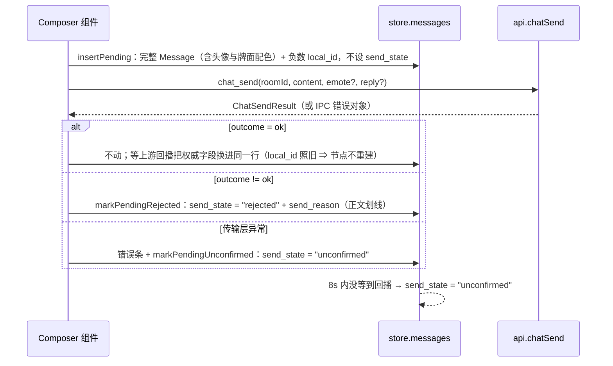

# danmubox Tauri IPC 契约

## 1. 运行模式

- 唯一运行模式：页面运行在 Tauri WebView 中，命令走 `invoke("命令名", 参数)`，事件走 `listen("danmubox://事件名", handler)`（`apps/desktop/ui/src/ipc.ts:61`、`apps/desktop/ui/src/ipc.ts:213`）。
- `vite dev` 下 WebView 内 `@tauri-apps/api` 同样可用；前端的数据路径只有 `invoke` / `listen` 这一条（唯一例外见 §4.1 的控制台桥）。
- 命令名与事件名的集合是**封闭**的，与 `contract.md` §7 逐条一致（命令清单 §3、事件清单 §4）。新增面必须同时改 `contract.md` §7、`docs/ipc.md` 与实现；不允许前端私自定义字符串。
- 凭据文件由程序写回（`contract.md` §4.1、`auth.md` §8.4）；没有「手填 Cookie」命令。
- IPC 是 core 的一个消费面：core 的端口与事件总线**不得**假设消费方是 UI；新增能力先落 core 端口，再决定是否暴露成命令。
- 需求溯源：REQUIREMENTS.md §2.1–§2.10、§2.12 与 §2.14 的 IPC 面落在 `docs/ipc.md` 与 `contract.md` §7；逐条映射见 `contract.md` §9。

## 2. 调用约定

| 项 | 约定 | 锚点 |
|---|---|---|
| 命令注册 | 全部集中在 `tauri::generate_handler![…]`；命令函数也在同一文件（没有 `commands.rs`） | `apps/desktop/src-tauri/src/lib.rs:1338-1341` |
| 命令名 | `snake_case`，与 `contract.md` §7 字面一致 | 同上 |
| 参数名 | Rust 侧 `snake_case`；Tauri 2 把参数名转成 **camelCase** 暴露给 JS，因此前端 `invoke` 传 `roomId` / `query` / `patch` / `upstreamId` 等 camelCase 键 | `apps/desktop/ui/src/ipc.ts:61-175` |
| 同步 / 异步 | 42 条命令：32 条 `async fn`，10 条同步 `fn`——`app_info` / `rooms_list` / `rooms_reconnect` / `history_query` / `room_session` / `open_url` / `prefs_get` / `prefs_set` / `diagnose_start` / `frontend_log`（定义行见 §3 的「实现锚点」表）。同步命令跑在**主线程**上，任何需要 Tokio runtime 的动作都必须显式取句柄（`tauri::async_runtime::handle()`），不得用 `Handle::current()` | `lib.rs:207-1058` |
| 成功返回 | §3 签名表「返回」列的 JSON 值；`void` = 无返回体 | — |
| 失败返回 | `invoke` reject，值为 `ApiError { code: string, message: string }`。前端按 `code` 分支；`message` 是给人看的文案（Rust `Display` 或上游原文），**不得**解析它做逻辑，也没有 `detail` 这类嵌套字段 | `lib.rs:32-44` |
| 错误码 | 八个，见下表；错误对象的集合以此为准，`code` 取自 `core::Error::code()` | `crates/danmubox-core/src/error.rs:8-39` |
| 时间 | 统一 UTC 毫秒、`i64`；JS 侧为 `number` | — |
| 载荷字段 | `snake_case`（`apps/desktop/ui/src/types.ts` 与后端同形）；store 里存的就是同一份 `Message`，**不做** camelCase 转换（见 §3.1、§5） | `apps/desktop/ui/src/types.ts:11` |
| 偏好键 | `contract.md` §8 的字面键名（如 `ui.font_scale`）；两边都不改名，store 内也用字面键 | `apps/desktop/ui/src/types.ts:448` |
| 凭据 | 任何命令的返回都不含 `sessdata` / `bili_jct` / `dede_user_id`；`session_status` 只返回状态位 | `crates/danmubox-core/src/ports.rs:22` |

错误码（分类见 `contract.md` §7；前端按 `code` 分支）：

| code | 触发场景 | 前端处理 |
|---|---|---|
| `BAD_REQUEST` | 参数缺失/非法（`input` 解析不出房间号、`query.kinds` 有未知 kind、`prefs_set` 未知键或非法值、`open_url` 非 http(s)、举报理由或 `upstream_id` 为空） | 不重试，就地提示 |
| `UNAUTHORIZED` | 凭据无效/过期（由 core 归一化） | 不重试，引导重新登录 |
| `NOT_FOUND` | 资源不存在（非房间类，如已消费的扫码 `key`、账号名不存在） | 不重试 |
| `ROOM_NOT_FOUND` | 房间号无法解析，或不在已添加列表 | 不重试 |
| `NOT_LOGGED_IN` | 游客模式调用需登录的动作 | 不重试，引导扫码登录 |
| `RATE_LIMITED` | 本地发弹幕节流命中（同房间 2s、相同内容 5s，`contract.md` §4）；原因在 `message` 里 | 不自动重发 |
| `UPSTREAM_ERROR` | 上游接口非预期响应或结构不符；`message` 携带上游原文 | 幂等读请求不自动重试；写请求不自动重试 |
| `INTERNAL` | 本地未预期错误（本地文件 IO、序列化、任务 panic） | 不重试，记录日志 |

## 3. 命令签名表

42 条，与 `generate_handler!` 逐条对应；除「说明」列注明同步的命令外均为 `async fn`。命令函数除 `open_url`（只接 `app: tauri::AppHandle`）与 `frontend_log`（无注入参数）外都接收 `State<'_, AppState>`，`chat_send` / `diagnose_export` 另接 `app: tauri::AppHandle`（下表省略这些注入参数）。「错误」列是实现里可能出现的错误码（由 `core::Error` 归一化映射）；前端只按 `code` 分支。

| 命令 | 参数 | 返回 | 错误 | 说明 |
|---|---|---|---|---|
| `app_info` | 无 | `AppInfo` | — | 版本、数据目录、`config.toml` 路径、是否登录；不含任何凭据。同步命令 |
| `session_status` | 无 | `SessionState` | `INTERNAL` | 未登录时 `logged_in=false`、`uid=0`、`nickname=""`；`active_profile` 是当前生效的 profile 名 |
| `accounts_list` | 无 | `Account[]` | `INTERNAL` | 列出全部账号（`contract.md` §5 `Account`）；游客态不是账号，没有凭据就没有条目 |
| `account_qr_start` | `target: Option<String>` | `QrStart` | `BAD_REQUEST` `INTERNAL` | 不带 `target` = **新增账号**（确认后按昵称自动命名，**不覆盖任何已有凭据**）；带 = 给该账号**重新登录**（**覆盖**其凭据，界面必须二次确认并写明覆盖哪个账号）。后端校验 `target` 并把它与 `key` 一起记住，确认时据此决定覆盖对象（`crates/danmubox-bili/src/auth.rs:298-331`）；`target` 不出现在 `QrStart` 返回里，界面另行补记用于展示。二维码由后端离线渲染成 SVG（`lib.rs:825-827`） |
| `account_qr_poll` | `key: String` | `QrPoll` | `NOT_FOUND` `INTERNAL` | `state` ∈ `pending` / `scanned` / `confirmed` / `expired`（`QrState`）；确认那一次凭据已落盘、账号已存在，`account` 非空；未确认时 `account` 为 `null`。确认（或当前账号已变）时各房间以新凭据重连（`lib.rs:841-848`） |
| `anchor_room` | 无 | `OwnRoom \| null` | `NOT_LOGGED_IN` `UPSTREAM_ERROR` `INTERNAL` | **当前账号自己的直播间**（`contract.md` §5 `OwnRoom`）：标题、开播状态、当前分区。**没有开通直播间 → `null`**（不是错误）——界面据此**整块不渲染**「我的直播间」。判据**只有一条**：`code == 0` 且 `data.room_id` 缺失 / ≤ 0 → `null`；**非 0 `code` 一律是上游错误**（原样带回、不赋语义），不拿它推「没开通」。游客 → `NOT_LOGGED_IN`（`crates/danmubox-bili/src/anchor.rs:132`） |
| `anchor_title_set` | `title: String` | `void` | `BAD_REQUEST` `NOT_LOGGED_IN` `UPSTREAM_ERROR` `INTERNAL` | 改**自己直播间**的标题（上游 `room/v1/Room/update`，`platform=pc_link`）。空标题不发请求、直接 `BAD_REQUEST`（`anchor.rs:321`）。写操作纪律：**只作用在当前账号自己的直播间**，**失败即停不重试**（`AGENT.md` §8.14–16） |
| `anchor_live_set` | `live: bool` | `StreamEndpoints \| null` | `NOT_LOGGED_IN` `UPSTREAM_ERROR` `INTERNAL` | `live=true` 开播（三段式，见 `protocol.md` §18），成功返回上游下发的推流端点（含**推流码**）；`live=false` 下播，返回 `null`。分区**沿用该直播间当前值**，上游没给分区就不发开播请求（`UPSTREAM_ERROR`）。上游非 0 code **原样带回、不赋语义**（人脸认证那类码也不例外）（`anchor.rs:342` / `anchor.rs:399`） |
| `account_switch` | `name: String` | `SessionState` | `BAD_REQUEST` `NOT_FOUND` `INTERNAL` | 切换当前账号并以新凭据重建各房间连接 |
| `account_logout` | `name: Option<String>` | `SessionState` | `NOT_FOUND` `INTERNAL` | 清掉该账号（缺省 = 当前）的凭据；条目保留、`logged_in=false`（退回游客态） |
| `account_remove` | `name: String` | `SessionState` | `BAD_REQUEST` `NOT_FOUND` `INTERNAL` | 删除账号；不许删最后一个；删当前项自动切走 |
| `rooms_list` | 无 | `RoomView[]` | — | 已登记房间 + 当前连接状态 + 当前会话缓冲条数。同步命令 |
| `rooms_refresh_status` | 无 | `RoomView[]` | `UPSTREAM_ERROR` `INTERNAL` | **定期刷新已登记房间的开播状态**（列表页那 30 秒一拍，`contract.md` §4）：逐个房间只读上游一次 `getRoomPlayInfo`（游客同样成立），把最新的 `live_status` 落进登记表，返回同一份 `RoomView[]` 形状（前端按与 `rooms_list` 相同的口径落地）。**只动 `live_status`**，不碰标题 / 昵称 / 连接态。逐个房间**并发**取，单个失败只记日志并跳过它；**一个都没成功**（且有房间要问）→ `UPSTREAM_ERROR`（前端据此退避，断网时不会每 30 秒打一次）。没有已登记房间时不发任何请求，直接返回空数组（`lib.rs:247-293`） |
| `rooms_add` | `input: String` | `RoomView` | `BAD_REQUEST` `UPSTREAM_ERROR` `INTERNAL` | `input` 为短号/URL/房间号；解析不出即 `BAD_REQUEST`。只登记，不建连 |
| `rooms_remove` | `room_id: i64` | `void` | `INTERNAL` | 移除并断连、取消 supervisor，同时**结束会话并销毁缓冲** |
| `rooms_connect` | `room_id: i64` | `void` | `ROOM_NOT_FOUND` `UPSTREAM_ERROR` `INTERNAL` | 建立会话：创建 supervisor、创建会话缓冲、开始收包。幂等：已连接时直接 `Ok`。**连接态不在返回值里**——看 `danmubox://status` 或重拉 `rooms_list` |
| `rooms_disconnect` | `room_id: i64` | `void` | — | 断开并**结束会话、清空缓冲**。幂等：未连接时也 `Ok` |
| `rooms_reconnect` | `room_id: i64` | `void` | `ROOM_NOT_FOUND` `UPSTREAM_ERROR` `INTERNAL` | 房间内「刷新」：会话还在（连接中/退避中/已连接）→ 只终止当前连接并立即重连，**不清空缓冲、不结束会话**；会话已结束（断连过、或房间被移除后又加回来）→ **重建一次会话**（全新会话、缓冲从空开始，等价重新进房），因此断连之后这颗键不是死键。同步命令 |
| `history_query` | `room_id: i64, query: HistoryQueryDto` | `Message[]`（snake_case） | `BAD_REQUEST` | 只查**当前房内会话缓冲**（`contract.md` §4.3）；无活跃会话（缓冲已销毁）时返回空数组，不报错。过滤后按 **`local_id` 升序**返回、取最后 `limit` 条（`crates/danmubox-core/src/session.rs:287-299`）。不跨会话、不回放、不导出。同步命令 |
| `chat_send` | `room_id: i64, content: String, color: Option<i64>, emote: Option<EmoteToken>, reply: Option<ReplyTarget>` | `ChatSendResult` | `BAD_REQUEST` `NOT_LOGGED_IN` `RATE_LIMITED` `UPSTREAM_ERROR` `INTERNAL` | 发弹幕。`emote` 非空 = **表情弹幕**（`emoticon_unique` + 尺寸等整份信息，此时 `content` 只用于日志与节流判重）；`reply` = @ 或回复某条（`mid` + `uname`，回复某条时带 `dmid` = 被回复弹幕的 `upstream_id`）。`color` 缺省 16777215（`crates/danmubox-bili/src/send.rs:226`），**原样透传不做范围校验**；上游 `mode=1`（普通弹幕）由实现内部固定，**不作为参数暴露**。**唯一要避免的是 `color=0`**（上游参数层直接拒绝）。本地节流命中 → `RATE_LIMITED`（不发起请求）；已发出的请求结果一律经 `SendOutcome` 返回，被吞不重发。返回的同一份对象再作为 `danmubox://send` 发一次（`lib.rs:461-489`） |
| `chat_report` | `message: Message, reason: ReportReason` | `void` | `BAD_REQUEST` `NOT_LOGGED_IN` `UPSTREAM_ERROR` `INTERNAL` | 举报一条弹幕。`message` 取列表里那一条（实现读它的 `upstream_id` / `uid` / `content`；**`upstream_id` 必需**，为空 → `BAD_REQUEST`）；`reason` 来自 `report_reasons`（同时上报文案与 `id`）。前端签名见 `apps/desktop/ui/src/ipc.ts` 的 `chatReport(message, reason)` |
| `report_reasons` | 无 | `ReportReason[]` | `UPSTREAM_ERROR` `INTERNAL` | 举报理由清单：请求上游 `dMReport/ForReason` 并解析 `data.data[]`，每项 `ReportReason { id, reason }`（`contract.md` §5）。**条数由上游决定**，不是本地硬编码清单；不要求登录 |
| `emotes_list` | `room_id: i64` | `Emote[]` | `NOT_LOGGED_IN` `UPSTREAM_ERROR` `INTERNAL` | 按**真实会话身份**（取自会话缓存）加载表情包库：无牌/有牌/房管/大航海看到的面板不同；无活跃会话时退回零身份。未登录即 `NOT_LOGGED_IN`（`crates/danmubox-bili/src/emote.rs:365-370`）。`Emote.locked` 由上游 `perm` 派生，`true` = 当前身份用不了（界面置灰，不隐藏） |
| `room_session` | `room_id: i64` | `RoomSession` | — | 该房间**当前会话**里的本人身份（`contract.md` §5 `RoomSession`）。无活跃会话 → 全零身份而**不报错**（`lib.rs:574-585`）；界面据此决定房管入口**是否出现**（`is_admin` 不为 `true` 时该入口不渲染；拿不到身份即按无权限处理，不靠试错，`ui.md` §4.9）与**输入区的字数上限**（`danmaku_length` 实测 = 40，缺省回落 20；`0` = 还没取到）。同步命令 |
| `emotes_owned` | 无 | `Emote[]` | `UPSTREAM_ERROR` `INTERNAL` | 主站「我的表情」：用户**拥有**的表情包（`upower_` 家族）。`package_kind="owned"`、`room_id=0`、唯一键 = `"upower_" + 表情 text`（`crates/danmubox-bili/src/emote.rs:67-69`）；未登录时上游退化为免费表情包，因此**不报** `NOT_LOGGED_IN`（`emote.rs:398-401`） |
| `admin_mute` | `room_id: i64, uid: i64, hour: i64, msg: Option<String>` | `void` | `NOT_LOGGED_IN` `UPSTREAM_ERROR` `INTERNAL` | 禁言：`hour` 为 `-1` 永久 / `0` 本场直播 / 其余为小时数（`lib.rs:620-635`）。仅房管可用；**非 0 code 原样带回**（不赋语义），非房管时通常得到上游的权限错误码 |
| `admin_unmute` | `room_id: i64, uid: i64` | `void` | `NOT_LOGGED_IN` `UPSTREAM_ERROR` `INTERNAL` | 解除禁言 |
| `admin_silent_list` | `room_id: i64` | `SilentUser[]` | `NOT_LOGGED_IN` `UPSTREAM_ERROR` `INTERNAL` | 当前禁言名单（只读），条目形状见 `contract.md` §5 |
| `admin_blacklist_list` | `room_id: i64` | `BlacklistedUser[]` | `NOT_LOGGED_IN` `ROOM_NOT_FOUND` `UPSTREAM_ERROR` `INTERNAL` | 黑名单（只读）。内部把 `roomId` 解析成主播 uid 后按 `anchor_id` 寻址——上游这个接口不吃房间号 |
| `admin_blacklist_add` | `room_id: i64, uid: i64` | `void` | `NOT_LOGGED_IN` `ROOM_NOT_FOUND` `UPSTREAM_ERROR` `INTERNAL` | 加入黑名单（拉黑会解除关系并禁止互动，比禁言重） |
| `admin_blacklist_del` | `room_id: i64, uid: i64` | `void` | `NOT_LOGGED_IN` `ROOM_NOT_FOUND` `UPSTREAM_ERROR` `INTERNAL` | 移出黑名单 |
| `admin_keywords_list` | `room_id: i64` | `string[]` | `NOT_LOGGED_IN` `UPSTREAM_ERROR` `INTERNAL` | 直播间屏蔽词（只读） |
| `admin_keywords_add` | `room_id: i64, words: String` | `void` | `NOT_LOGGED_IN` `UPSTREAM_ERROR` `INTERNAL` | 添加屏蔽词；上游一次只收一个 `keyword`，多词由实现逐个调用 |
| `admin_keywords_del` | `room_id: i64, word: String` | `void` | `NOT_LOGGED_IN` `UPSTREAM_ERROR` `INTERNAL` | 删除屏蔽词 |
| `follow_list` | 无 | `FollowedRoom[]` | `NOT_LOGGED_IN` `UPSTREAM_ERROR` `INTERNAL` | 关注列表（`contract.md` §5）。后端返回前已排序：`live_status == 1` 置顶、其余按 `room_id` 升序（`crates/danmubox-bili/src/follow.rs:377-379`、`crates/danmubox-core/src/model.rs:433-389`）；界面按 `ui.md` §2.2 的展示排序链再次排列 |
| `wallet_balance` | 无 | `number`（Rust `i64`） | `NOT_LOGGED_IN` `UPSTREAM_ERROR` `INTERNAL` | 电池余额（整数）：上游 `data.gold`（金瓜子）按 `gold / 100` 换算成电池（`crates/danmubox-bili/src/wallet.rs:40-49`）；`gold` 缺失或不可解析 → `UPSTREAM_ERROR`。没有包裹类型（口径与端点见 `protocol.md` 附录 A29） |
| `open_url` | `url: String` | `void` | `BAD_REQUEST` `UPSTREAM_ERROR` | 用系统默认浏览器打开链接（点昵称跳用户主页）。**只放行 `http://` / `https://`**，否则 `BAD_REQUEST`；未能启动浏览器（含当前平台没有实现）→ `UPSTREAM_ERROR`。同步命令。平台实现：macOS `open` / Windows `cmd /C start` / Linux `xdg-open` 各一条系统命令；**Android 走官方 `tauri-plugin-opener`（平台 Intent）**——插件只在 Android 目标声明（`[target.'cfg(target_os = "android")'.dependencies]`，桌面构建依赖图与产物一字不变），由 **Rust 侧**调用、**不进 capability**（`capabilities/default.json` 不需要 `opener:*` 权限）；iOS 等其余平台仍是显式 `Unsupported`（不静默失败）（`lib.rs:497-547`） |
| `prefs_get` | 无 | `PrefsSnapshot` | `INTERNAL` | `contract.md` §8 全部 23 键的**生效值**（默认值已合并）；未写入过的键返回 `contract.md` §8 默认值。同步命令（`lib.rs:553-555`） |
| `prefs_set` | `patch: Partial<PrefsSnapshot>`（Rust 侧收 `serde_json::Value`，由 core 校验） | `PrefsSnapshot`（合并后的生效值**全集**） | `BAD_REQUEST` `INTERNAL` | 未知键或非法值 → `BAD_REQUEST`，整批拒绝；成功返回与 `prefs_get` 同形。同步命令（`lib.rs:558-563`） |
| `diagnose_start` | `engine: String` | `DiagnoseStart` | — | 一键诊断：开始采集连接诊断（`contract.md` §4.4）。`engine` 是渲染引擎标识（前端传 `navigator.userAgent`：内核版本只有页面知道，报告头要用它）。窗口固定 180 秒（`crates/danmubox-core/src/diagnose.rs:29`），界面按 `ends_ms` 倒计时、到点自动收工。采集中**不发送任何数据**（本仓无遥测）。同步命令：只写窗口起止时刻，不碰 IO（`lib.rs:1028-1004`） |
| `diagnose_export` | 无 | `DiagnoseExport` | `INTERNAL` | 一键诊断：渲染并写出**恰好一个**报告文件（`contract.md` §4.4 的位置与命名）、结束采集并清空采集内容。`INTERNAL` 只在写文件失败时出现（目录不可写 / MediaStore 拒绝），`message` 带本地路径与原话。前端由 `diagnose_start` 的界面在窗口到点或用户点「提前结束」时调用 |
| `frontend_log` | `level: String, message: String` | `void` | — | **前端 → 后端的内部命令**，不是给业务代码用的：控制台桥把 `console.error` / `console.warn` 与未捕获错误转发过来，写进 `tracing` 日志（`target = "danmubox::ui"`，`level` ∈ `error` / `warn`，其它值降级为 debug）。同步命令，永不失败（`lib.rs:1087-1058`）。详见 §4.1 |

`prefs_set` 接受部分补丁（只提交要改的键），返回合并后的全量生效值。

**实现锚点**（`#[tauri::command]` 函数定义行；「同步」= 同步 `fn`，其余为 `async fn`）：

| 命令 | 定义 | 命令 | 定义 |
|---|---|---|---|
| `app_info` | `lib.rs:208` 同步 | `emotes_list` | `lib.rs:589` |
| `session_status` | `lib.rs:220` | `room_session` | `lib.rs:574` 同步 |
| `accounts_list` | `lib.rs:735` | `emotes_owned` | `lib.rs:615` |
| `account_qr_start` | `lib.rs:811` | `admin_mute` | `lib.rs:624` |
| `account_qr_poll` | `lib.rs:841` | `admin_unmute` | `lib.rs:640` |
| `anchor_room` | `lib.rs:881` | `anchor_title_set` | `lib.rs:888` |
| `anchor_live_set` | `lib.rs:898` | — | — |
| `account_switch` | `lib.rs:745` | `admin_silent_list` | `lib.rs:647` |
| `account_logout` | `lib.rs:776` | `admin_blacklist_list` | `lib.rs:654` |
| `account_remove` | `lib.rs:758` | `admin_blacklist_add` | `lib.rs:664` |
| `rooms_list` | `lib.rs:225` 同步 | `admin_blacklist_del` | `lib.rs:674` |
| `rooms_refresh_status` | `lib.rs:247` | `admin_keywords_list` | `lib.rs:684` |
| `rooms_add` | `lib.rs:302` | `admin_keywords_add` | `lib.rs:691` |
| `rooms_remove` | `lib.rs:319` | `admin_keywords_del` | `lib.rs:705` |
| `rooms_connect` | `lib.rs:333` | `follow_list` | `lib.rs:866` |
| `rooms_disconnect` | `lib.rs:389` | `wallet_balance` | `lib.rs:872` |
| `rooms_reconnect` | `lib.rs:404` 同步 | `open_url` | `lib.rs:502` 同步 |
| `history_query` | `lib.rs:447` 同步 | `prefs_get` | `lib.rs:554` 同步 |
| `chat_send` | `lib.rs:461` | `prefs_set` | `lib.rs:559` 同步 |
| `chat_report` | `lib.rs:718` | `diagnose_start` | `lib.rs:1028` 同步 |
| `report_reasons` | `lib.rs:860` | `diagnose_export` | `lib.rs:1049` |
| — | — | `frontend_log` | `lib.rs:1088` 同步 |

注册顺序另见 `generate_handler!`（`lib.rs:1338-1341`）。

### 3.1 载荷类型

命令与事件携带的就是 `contract.md` §5 的领域模型（serde 字段名 snake_case，不做 camelCase 转写），字段、取值域与判据**不在此重复**。下面只列 IPC 特有的 serde 形状与 DTO。

| 名称 | 定义处 | 出现于 |
|---|---|---|
| `MessageKind` / `Message` / `EmoteRef` | `contract.md` §5（`crates/danmubox-core/src/model.rs:5-38` / `model.rs:67` / `model.rs:221`） | `history_query` 返回、`danmubox://message` 载荷、`chat_report` 参数 |
| `SendOutcome` | `contract.md` §5（`model.rs:209`） | `ChatSendResult.outcome` |
| `RoomStats` | `contract.md` §5（`crates/danmubox-core/src/bus.rs:34`） | `danmubox://room_stats` 载荷 |
| `RoomSession` | `contract.md` §5（`model.rs:322`） | `room_session` 返回、`danmubox://session` 载荷、`emotes_list` 的身份入参 |
| `Room` | `contract.md` §5（`model.rs:242`） | `danmubox://room` 载荷 |
| `OwnRoom` | `contract.md` §5（`crates/danmubox-core/src/model.rs:275`） | `anchor_room` 返回；`null` = 该账号**没有开通直播间**（不是错误，界面整块不渲染） |
| `StreamEndpoints` / `StreamEndpoint` | `contract.md` §5（`model.rs:307` / `model.rs:300`） | `anchor_live_set` 开播时的返回（下播为 `null`）。**含推流码**：只随这一次返回值进界面内存，**不进日志、不落盘、不进 `prefs.json` / `config.toml`** |
| `Account` | `contract.md` §5（`ports.rs:63`） | `accounts_list` 返回、`QrPoll.account` |
| `Emote` / `EmotePackage` | `contract.md` §5（`model.rs:363` / `model.rs:349`） | `emotes_list` / `emotes_owned` 返回 |
| `FollowedRoom` | `contract.md` §5（`model.rs:395`） | `follow_list` 返回 |
| `SilentUser` / `BlacklistedUser` | `contract.md` §5（`model.rs:418` / `model.rs:426`） | `admin_silent_list` / `admin_blacklist_list` 返回 |
| `ReportReason` | `contract.md` §5（`model.rs:235`） | `report_reasons` 返回、`chat_report` 参数 |
| `PrefsSnapshot` | `contract.md` §8（`crates/danmubox-core/src/prefs.rs:103-282`） | `prefs_get` / `prefs_set`；23 键、键名即契约字面（TS 侧类型名 `Prefs`，`apps/desktop/ui/src/types.ts:448`） |

```ts
// history_query 的 query 参数（`lib.rs:137-179`）
type HistoryQueryDto = {
  limit?: number;        // 缺省 500（`lib.rs:161-162`）；0 = 不截断；过滤后取最后 limit 条
  after?: number;
  before?: number;
  kinds?: MessageKind[];  // 未知取值 → BAD_REQUEST
  uid?: number;
  q?: string;
};

// chat_send 的 emote 参数（`ports.rs:185-196`；语义见 `protocol.md` §11.4）
type EmoteToken = {
  emoticon_unique: string;
  emoji: string;
  url: string;
  width: number;
  height: number;
  is_dynamic: boolean;
  in_player_area: boolean;
  bulge_display: boolean;
};

// chat_send 的 reply 参数（`ports.rs:202-211`；语义见 `protocol.md` §11.6）
type ReplyTarget = {
  mid: number;       // 被 @ 者 uid
  uname: string;
  dmid: string;      // 被回复弹幕的 Message.upstream_id；仅 @ 时为空串
};

// chat_send 的返回（`apps/desktop/src-tauri/src/lib.rs:119-127`），同时是 danmubox://send 的载荷
type ChatSendResult = {
  room_id: number;
  content: string;
  outcome: SendOutcome;     // contract.md §5
  detail?: string | null;   // 上游 msg 原话 + code 拼成的一行（`apps/desktop/src-tauri/src/lib.rs:133-136`）；outcome="ok" 时不出现
};

// rooms_list / rooms_refresh_status 的返回（`lib.rs:102-116`）
// = contract.md §5 的 Room 加上连接态与缓冲条数
type RoomView = Room & {
  connected: boolean;
  buffered: number;         // 当前会话缓冲条数，无会话为 0
};

// app_info 的返回（`lib.rs:94-99`）
type AppInfo = {
  version: string;      // CARGO_PKG_VERSION
  data_dir: string;
  config_path: string;  // config.toml 的完整路径
  logged_in: boolean;
};

// account_qr_start 的返回（`lib.rs:797-803`）；二维码离线渲染，最小边长 240（`lib.rs:825-827`）
type QrStart = { key: string; url: string; svg: string };

// session_status / account_switch / account_logout / account_remove 的返回（`ports.rs:22-30`）
type SessionState = {
  logged_in: boolean;
  uid: number;                // 未登录为 0
  nickname: string;           // 未登录为空串
  active_profile: string;     // config.toml 中当前生效的 profile 名（缺省 "default"）
};

// 扫码状态机（`ports.rs:48-55`；serde 小写，上游未知状态码一律归入 pending）
type QrState = "pending" | "scanned" | "confirmed" | "expired";

// account_qr_poll 的返回（`ports.rs:80`）
type QrPoll = {
  state: QrState;                // 状态码语义表由 `auth.md` 拥有
  account: Account | null;       // state="confirmed" 时非空
};

// 一键诊断（`contract.md` §4.4）。时间都是 UTC 毫秒。
type DiagnoseStart = {
  started_ms: number;   // 采集窗口起点
  ends_ms: number;      // 窗口截止时刻（界面按它倒计时）
};

type DiagnoseExport = {
  path: string;         // 给用户看的位置：桌面端绝对路径；Android 为 /sdcard/Download/…
  name: string;         // 文件名（danmubox-diagnose-YYYYMMDD-HHMMSS.txt）
  bytes: number;        // 报告字节数
  attempts: number;     // 报告里带了几条连接尝试
  logs: number;         // 报告里带了几行窗口内日志
  started_ms: number | null;  // 本次采集窗口的起止（没先 start 就直接导出时为 null，`lib.rs:1080-1045`）
  ends_ms: number | null;
};
```

### 3.2 待实测校准

上游未实测事实的校准结论统一登记在 `protocol.md` 附录 A（`contract.md` §5 / §8 引用其条目号）。

## 4. 事件表

后端 → 前端共 **7 个**事件名。其中 5 个由事件转发器统一转发（`spawn_event_forwarder`，`lib.rs:920-928`，总线事件的**唯一 emit 点**）；`danmubox://send` 由 `chat_send` 自己 emit（`lib.rs:489`），`danmubox://log` 由日志桥 emit（`lib.rs:1333`）。前端由 `subscribeEvents` 统一 `listen`（`apps/desktop/ui/src/ipc.ts:213-251`），只订阅传入的 handler 对应的事件；返回的取消订阅函数必须保存（见 §8）。

| 事件名 | 载荷（snake_case） | 触发时机 | 频率控制 | 发射点 |
|---|---|---|---|---|
| `danmubox://message` | `Message` | 每归一化一条消息；同时写入该房间会话缓冲 | 不节流；前端按帧合批渲染 | `lib.rs:924` |
| `danmubox://room` | `Room` | 长连接里 `LIVE` / `PREPARING` 到达（`protocol.md` §10.7）：先把登记表里该房间的 `live_status` 改掉，再把改后的**整条** `Room` 推给界面（`LIVE` → `1`、`PREPARING` → `0`，见 `contract.md` §6）。界面据此合并 `rooms` 与 `followed` 里同号的那一条——房间头状态点 / 标签页圆点 / 列表卡片 / 关注行同时变，不需要重连或手动刷新。载荷不含连接态——连接态走 `danmubox://status`。总线侧推的是 `Event::LiveStatus` 这条小载荷，**桌面外壳**补齐整条 `Room` 后再推给界面；`EventBus::publish_room`（`bus.rs:281`）无调用方，`Event::Room` 目前无生产者 | 事件驱动（一条连接生命周期内至多几次） | `lib.rs:933`、`lib.rs:949` |
| `danmubox://session` | `RoomSession` | 会话建立后本人房内身份取到时推一次；取不到则只记日志、不推 | 事件驱动 | `lib.rs:959` |
| `danmubox://status` | `StatusEvent` | 连接状态变化；会话关闭（`Event::RoomClosed`）也以 `disconnected` 形态从这里推出，`detail = "会话已关闭"` | 事件驱动 | `lib.rs:927`、`lib.rs:962-933` |
| `danmubox://send` | `ChatSendResult` | 每次 `chat_send` 得到结果（**与命令返回值同构**，同一份对象再发一次） | 事件驱动 | `lib.rs:489` |
| `danmubox://room_stats` | `RoomStats`（`contract.md` §5） | 房间观众数变化（在线人数 / 累计看过，两侧可缺省） | 事件驱动，不进会话缓冲 | `lib.rs:930` |
| `danmubox://log` | `string` | `tracing` 日志行经桥接层推出，格式为 `"<LEVEL> <message>"` | 事件驱动；前端日志切片上限 200 行（§8） | `lib.rs:1333` |

```ts
// `crates/danmubox-core/src/bus.rs:10-26`
type ConnState = "connecting" | "connected" | "disconnected" | "error";

type StatusEvent = {
  room_id: number;
  state: ConnState;
  detail: string;   // 人类可读补充；认证失败时只放原始 code，不赋语义
};
```

**`ConnState` 仍是这四个取值**：`protocol.md` §13.1 的终态 `Failed` **不新增取值**——§13.3 步骤 6 明写「房间状态置为 error」。连续 3 次认证失败后自动重连**停止**，这个终态同样报 `"error"`，`detail` 里带「已停止自动重连；手动刷新可重置」。前端要区分「退避重连中」与「已停止自动重连」时读 `detail`；若要单独呈现一档，得先在 `protocol.md` §13、§4 的事件表与 `ui.md` §3.3 一起加取值。

**`danmubox://session` 的判别规则**：这个事件名上**只推一种载荷**——房内身份 `RoomSession`（`Event::Session`，载荷类型即 `RoomSession`：`bus.rs:71`；会话建立时向总线发一次）。登录态不经这个事件，由 `session_status` 现取（`contract.md` §7）。前端仍按**判别字段**分派而不是假定载荷种类：有 `logged_in`（boolean）→ 登录态 `SessionState`；有 `is_admin`（boolean）→ 房内身份 `RoomSession`（`ipc.ts:237-232`）——这是防御式写法，引擎将来真补推登录态也不用改。分派写错（例如把身份当登录态）会把 `session.logged_in` 覆盖成 `undefined`，界面随即误判成游客态。

### 4.1 控制台桥（前端 → 后端的内部命令）

`frontend_log` 不是事件，是**前端 → 后端**的命令；它不由业务组件调用，而由 Rust 注入的脚本调用。

| 项 | 内容 |
|---|---|
| 注入 | `CONSOLE_BRIDGE` 常量（`lib.rs:1097-1106`）在页面加载完成（`PageLoadEvent::Finished`）后由 Rust `eval` 注入 WebView（`lib.rs:1293-1262`）；每次加载都注入一次，脚本自带去重标记（`window.__danmuboxLogBridge`）防重复挂钩 |
| 调用方式 | 脚本直接调原生 `window.__TAURI_INTERNALS__.invoke('frontend_log', { level, message })`（`lib.rs:1104-1071`）——这是 §6「前端不出现 `invoke` 字面量」的唯一例外，它不承载业务数据 |
| 捕获范围 | `console.error` / `console.warn`（转调原函数，不吞日志）、`window` 的 `error` 事件、`unhandledrejection` |
| `level` | 只取 `error` / `warn`；Rust 侧分别映射为 `tracing::error!` / `tracing::warn!`，其它值降级为 debug |
| `target` | `"danmubox::ui"`——Rust 侧一份日志即可覆盖前后端 |
| 截断 | `message` 截到 **2000 字符**；去重键另取 `level + "\0" + message` 的前 **200 字符** |
| 去重 | 同一条告警 **1000ms** 内只上报一次；去重表超过 200 条即清空 |

去重是硬要求：日志会回推成 `danmubox://log` 并触发界面重渲染，去掉去重会形成「渲染 → 告警 → 日志 → 重渲染」的反馈环。

## 5. Zustand store 形状

单一 store（`create<AppStore>`，无切片拆分）。**store 里存的就是 §3.1 的载荷对象**（snake_case），不做 camelCase 转写；本地实现细节只有三个 UI 专用字段（`send_state` / `send_reason` / `interactTick`）。

```ts
type AppStore = {
  // 会话与账号
  info?: AppInfo;
  session?: SessionState;
  accounts: Account[];
  qr: QrStart | null;              // 界面另外补记 target（QrStart 不含它）
  qrState: QrState | null;
  qrError: string | null;

  // 房间（列表只在内存中，进程重启为空）
  rooms: RoomView[];
  activeRoomId?: number;
  status: Record<number, { state: ConnState; detail: string }>;

  // 弹幕：只有「当前房间」一份，随一次房内会话生死（离开 / 切房即清空）
  messages: Message[];             // 显示上限 2000 条，见 §8
  interactTick: number;            // UI 专用：「互动消息自动消失」的到点重算信号（判据在 filtering.interactAutoHidden）
  seeding: boolean;                // 首屏历史回填进行中
  lastSend?: ChatSendResult;       // **只属于当前房间**：切房即清、非当前房间的结果不落（§8）
  roomStats: Record<number, { online?: number; watched?: number }>;

  // 表情、关注、钱包、身份
  emotes: Emote[];
  ownedEmotes: Emote[];            // 主站「我的表情」
  ownedLoaded: boolean;
  ownedError?: string;
  followed: FollowedRoom[];
  balance?: number;                // 电池余额（整数；`wallet_balance` 的返回）；换人即作废（§8）
  roomIdentities: Record<number, RoomSession>;   // 按房间缓存，**会话结束**即删（切房保留，§8）

  // 房管（会话级）
  adminSilent: SilentUser[];
  adminBlacklist: BlacklistedUser[];
  adminKeywords: string[];
  adminErrors: { silent?: string; blacklist?: string; keywords?: string };
  adminBusy: boolean;

  // 偏好、日志、提示
  prefs?: PrefsSnapshot;           // 字面键，见 §3.1
  logs: string[];                  // 上限 200 行
  error?: string; notice?: string;
};
```

本地乐观行（§7）的形态：

```ts
type SendState = "unconfirmed" | "rejected";   // Message.send_state（另有 Message.send_reason）

// 本地行 = 完整 Message + 负数 local_id（-1、-2、…，见 store.ts:364 的 insertPending）。
// 真实 local_id 由后端按会话单调分配、恒为正，两者永不碰撞；回播命中时**也不换号**
// （换号 = 换 React key = 重建节点）。
// send_state **缺省 = 普通行**：既包括回播把字段换进来的那条，也包括刚插入、还在等回执的本地行
// ——后者必须与「别的客户端看到的我」渲染逐项相同，不许表达「发送中」。
// 两档：unconfirmed（8s 没等到回播 / IPC 出错，行尾「未确认」）、
// rejected（上游明确拒绝：正文划线，行尾写 send_reason —— 与浮片同一句）。
```

| store 动作 | 调用 | 说明 |
|---|---|---|
| `bootstrap()` | `app_info` + `session_status` + `rooms_list` + `prefs_get` + `accounts_list`（并行） | 启动入口：先铺数据，再 `subscribeEvents` 订阅事件（§8） |
| `refreshIdentity()` / `loadAccounts()` / `applySession(session)` | `session_status` / `accounts_list` | 登录态或账号变化后的统一善后；**不吃** `account_*` 的返回值，以重拉结果为准。并发换人时以**最后点击的那一代**为准（身份世代，见 §8） |
| `switchAccount(name)` / `removeAccount(name)` / `logoutAccount(name?)` / `startAccountQr(target?)` / `pollAccountQr()` / `cancelAccountQr()` | `account_switch` / `account_remove` / `account_logout` / `account_qr_start` / `account_qr_poll` | 账号族；成功后按新会话重拉房间与关注。**换人时先清掉上一个身份的界面切片**（房间与房内缓冲、身份快照、房管三块、表情库、余额等，见 §8）。取号在命令之前：晚到的旧续作直接放弃（§8） |
| `addRoom(input)` | `rooms_add` | 成功后重拉 `rooms_list` 并 `openRoom` |
| `openRoom(roomId)` | `history_query`（`limit: 0`，`store.ts:730-696`）+ `rooms_connect` | 开一次新房内会话：清空 `messages`、房管三块与 `lastSend`，回填历史，再建连；同时记 `ui.recent_watched`。历史落地前复核 `activeRoomId` 仍是它（§8）；**该房间的身份快照保留**（切房不结束会话） |
| `closeRoom()` | — | 关标签：清空 `messages` / 房管数据，删该房间 `roomIdentities` |
| `removeRoom(roomId)` | `rooms_remove` | 移除并断连；若是当前房间则与 `closeRoom` 同款清理 |
| `connect(roomId)` / `disconnect(roomId)` / `refresh(roomId)` | `rooms_connect` / `rooms_disconnect` / `rooms_reconnect` | 三个都只 `invoke` 再重拉 `rooms_list`——连接态以重拉结果为准，快照按序号复核（§8）。`disconnect` 另按「离开房间」口径删该房间 `roomIdentities` 与房管三块 |
| `send(roomId, content, emote?, reply?)` | `chat_send` | 乐观渲染 + 回执校验，见 §7；结果只登记在当前房间（§8） |
| `report(message, reason)` | `chat_report` | 与命令同参：整条 `Message` + `ReportReason` |
| `loadReportReasons()` | `report_reasons` | 首次拉取后缓存；失败不覆盖已有清单 |
| `loadEmotes(roomId)` / `loadOwnedEmotes(retryFailedOnly?)` | `emotes_list` / `emotes_owned` | 由 `RoomView` 的 effect 在登录态就绪时触发；主站表情成功一次后不再重复拉。房间表情落地前复核 `activeRoomId`（§8） |
| `loadFollowed()` | `follow_list` | 会话就绪后与登录/换号后各自动调用一次；返回后按 `ui.md` §2.2 的排序链渲染。**返回是否成功**（`boolean`）供列表页轮询判退避；失败仍进全局错误条，不静默 |
| `startListStatusPolling()` | `rooms_refresh_status`（+ 登录时的 `follow_list`） | 列表页的开播状态轮询（`contract.md` §4）：返回**停止函数**，进房间页或卸载即停。进入列表页立即一拍，之后每 30 秒一拍（`store.ts:559-531`）；`document.visibilityState` 不是 `visible` 就整拍跳过（不发请求）；下一拍只在上一拍落地后才排（**不重叠**）；失败按 30 → 60 → 120 → 240 秒封顶退避、成功复位。落 `rooms` 走与 `rooms_list` 同一个**快照序号护栏**（§8） |
| `loadBalance()` | `wallet_balance` | 状态栏展示；进入房间时刷新；换人即作废（§8） |
| `loadRoomIdentity(roomId)` | `room_session` | 进房取一次快照；之后靠 `danmubox://session` 更新。落地前复核身份世代（§8） |
| `loadAdmin(roomId)` | `admin_silent_list` / `admin_blacklist_list` / `admin_keywords_list` | 三块各自失败各自留痕，一块挂了不清空另外两块；落地前复核 `activeRoomId` 仍是它（§8） |
| `runAdmin(roomId, action)` | `admin_mute` / `admin_unmute` / `admin_blacklist_add` / `admin_blacklist_del` / `admin_keywords_add` / `admin_keywords_del` | 一次一个写操作；成功后就地重读三块，`adminBusy` 期间禁用按钮 |
| `updatePrefs(patch)` | `prefs_set` | 用返回的全量生效值覆盖 `prefs` |
| `openProfile(uid)` | `open_url` | 点昵称跳用户主页 |
| `dismissError()` / `setNotice(notice?)` | — | 错误条 / 浮动提示的本地开关 |

## 6. 客户端封装

唯一 IO 边界是 `apps/desktop/ui/src/ipc.ts`：业务组件只 import 一个与 §3 同名、同参、同返回的客户端接口（`api`，`ipc.ts:70-174`），不出现 `invoke` / `listen` 字面量；事件订阅统一为 `subscribeEvents(handlers): Promise<UnlistenFn>`（`ipc.ts:213`），返回取消订阅函数。命令失败时由 `call()`（`ipc.ts:61-66`）把命令名与错误码打到控制台（经 §4.1 的桥进入 Rust 日志）；其余命令（写操作与 `history_query`）走裸 `invoke`，失败不进日志。`describeError`（`ipc.ts:45`）把 `ApiError` 转成展示文案。

```ts
type EventHandlers = {
  onMessage?(m: Message): void;
  onStatus?(e: StatusEvent): void;
  onRoomStats?(e: RoomStats): void;
  onRoom?(r: Room): void;
  onSession?(s: SessionState): void;      // 按判别字段分派后才会命中
  onRoomSession?(s: RoomSession): void;   // 同上
  onSend?(e: ChatSendResult): void;
  onLog?(line: string): void;
};
```

**唯一例外**：控制台桥注入脚本（`CONSOLE_BRIDGE`，§4.1）直接调原生 `invoke`，它不承载业务数据，也不经过 `api`。

## 7. 发弹幕的乐观更新与失败回滚

`chat_send` 是本项目唯一「本地状态先于服务端确认」的命令：点下发送**立刻**在列表末尾渲染一条本地行，再发请求；上游返回只做校验，不作为展示前置。判据是三条（`ui.md` §4.4）：**发出去的 = 我用别的客户端看到的样子**、**看不出中间有回播**、**被 ban 的那条留着划线并写原因**。



| 规则 | 内容 |
|---|---|
| 挂载位置 | `messages` 尾部插入一条**完整 `Message`**：`local_id` 取负数（`-1`、`-2`、…，`pendingSeq` 自增，`store.ts:239`、`store.ts:364-341`）；身份字段取自 `session`（昵称 / uid）、当前生效账号（`face`）与 `roomIdentities[roomId]`（大航海 / 房管），**粉丝牌只在 `my_medal_worn` 为真时才算数**（持有 ≠ 佩戴，`protocol.md` A43）、**牌面真彩色取自本人上一条上游行**（`room_session` 不带它），`upstream_id=""`。**刻意不设 `send_state`** |
| 对账 | 上游回播到达时按 `matchPending`（`store.ts:296-276`）判定：回播那条必须是 `kind = "danmaku"` 且本地行同 `kind`；`uid` 相同 + 正文逐字相同（两侧都带 `emote` 时再比 `emoticon_unique`）+ `ts` 之差 ≤ `SEND_MATCH_WINDOW_MS`（**60000ms**，`types.ts:674`）。参与范围 = 本地行（负数）且未判 `rejected`、且没被对上过（`echoedLocals` 侧表，`store.ts:253`，行上一个字段都不写）；命中多条取列表里最靠前的一条。命中后**原位把字段换成上游那条、`local_id` 照抄本地那个负数**（`store.ts:830-796`）——净条数不变，React key 不变 ⇒ DOM 节点不重建 |
| 幂等 | 本地行与真实行的 `local_id` 永不碰撞（负数 vs 恒正），`onMessage` 的单调判定也不受影响；回播命中**不换号**，所以那条永远留在负数一侧（这也是 `echoedLocals` 必须存在的原因） |
| 超时兜底 | 插入时排一个 `SEND_CONFIRM_TIMEOUT_MS`（**8000ms**，`types.ts:665`）的定时器：到点仍无 `send_state` → 置 `"unconfirmed"`（不删行，也不再假装它「发送中」，定时器 `store.ts:426-398`、置位 `store.ts:442-421`）。只改仍无状态的那条 |
| `ok` | 命令返回 `outcome="ok"` 不动本地行；换字段完全交给上游回播（`danmubox://message`）。若回播先到，命中对账即已换好 |
| 被拒（`blocked_platform` / `blocked_room` / `rate_limited` / `medal_required` / `muted` / `failed`） | 一律 `outcome != "ok"` → 本地行置 `"rejected"`，`send_reason` = `sendOutcomeText(outcome, detail)`（**与浮片同一句**）：正文划线，行尾显示该句。行**不删**，草稿**保留**（`store.ts:1114`） |
| 传输层异常 / IPC 错误（含本地节流 `RATE_LIMITED`） | `chat_send` reject → 错误条展示 `describeError`，本地行置 `"unconfirmed"`（**结果未知**：这条可能已经上屏，因此不划线、不判被拒，`store.ts:1121`）。重试由用户再次发送完成（新的一次乐观行） |
| 失败行渲染 | `"rejected"` → 正文划线（`.rejectedText`）+ 行尾写 `send_reason`；`"unconfirmed"` → 行尾「未确认」。**两档都不弱化整行**（要读得清）；其余行（含刚插入的本地行、回播换过字段的那条）**与「别的客户端看到的我」渲染逐项相同**——没有「发送中」这一档 |
| 草稿 | 只有 `ok` 清空草稿（并收起回复 / @ / 面板）；其余一律保留，便于重试或照着行上划掉的那条改写（`ui.md` §6.5.1） |
| 本地节流 | 发送前由 core 检查同房间 2s 最小间隔与相同内容 5s 去重（`contract.md` §4），命中则不发请求、直接 reject `RATE_LIMITED` |
| 生命周期 | 草稿**不在 store 里**：它是 `Composer` 模块级的 `Map`，键为 `${identityKey}:${roomId}`（游客 `guest`、登录为 uid），即**每个「身份 × 房间」各留一份**（正文 + 回复目标 + @ 目标）；退出组件不丢，进程重载即散，不落盘（状态形状见上，`AppStore` 里没有草稿字段）。切房间 / 切号时**先存旧键、再取新键**，面板类状态（面板 / 分组 tab / 右键菜单 / 改短语 / 浮片）一律重置。本地行随 `messages` 在一次房内会话内生死（离开 / 切房即清空），`echoedLocals` 侧表同时清空（`store.ts:276`） |
| 安全 | 草稿内容不写入 `prefs.json`、不上报；日志只记 `content_len` 与 `outcome`（见 `architecture.md` §9.2） |

两档标记都必须与普通行可区分，且整行保持可读（不弱化）；样式 token 与文案表由 `ui.md` §4.4 / §6.5 定义。

## 8. 订阅生命周期与内存回收

| 阶段 | 动作 |
|---|---|
| 应用启动 | `bootstrap`：并行 `app_info` + `session_status` + `rooms_list` + `prefs_get` + `accounts_list`，再 `subscribeEvents` 订阅 §4 的 7 个事件名（每类 handler 可选） |
| 进入房间 | `openRoom`：清空 `messages` / 房管三块 / `lastSend`（**不删**该房间的身份快照）→ `history_query`（`limit: 0`）回填（落地前复核 `activeRoomId` 仍是它）→ `rooms_connect`；`seeding` 由**当下一代**收尾；`RoomView` 渲染时按登录态触发 `loadEmotes` / `loadOwnedEmotes` / `loadRoomIdentity` / `loadBalance` |
| 切换房间 | 只切 `activeRoomId` 并清掉上一间的 `messages` 与发送浮片；事件继续到达，非激活房间的弹幕直接丢弃（`onMessage` 判 `room_id`）。该房间的**身份快照保留**（切房不结束会话）、晚到的旧回包按目标复核后丢弃（见 §8.1）。**界面本地状态同时重置**：`RoomView` 收起弹出面板 / 房管面板 / 菜单 / 举报条 / 房管确认条并清掉 @·回复目标，`MessageList` 随 `key` 重建、滚动与跟随回到初始；只有输入草稿按房间各留一份（`ui.md` §2.3、§6.5.1） |
| 切号（`account_switch` / 登出当前账号 / 删掉当前账号 / 扫码确认新账号） | 先清掉上一个身份的界面切片（`rooms` / `activeRoomId` / `messages` / `roomIdentities` / 房管三块 / `emotes` / `ownedEmotes` / `ownedLoaded` / `ownedError` / `balance` / `seeding` / `lastSend`）与所有房间定时器，再按新会话重拉 `rooms_list` 与 `follow_list`；core 侧各房间以新凭据重建连接（`contract.md` §7 `account_switch`）。并发切号以**最后点击的那一代**为准（身份世代，见 §8.1）。草稿按「身份 + 房间」分键，切号后不恢复（`ui.md` §2.2.1） |
| 离开房间（关标签 / 移除房间 / 断开连接） | 关标签 / 移除房间：清空 `messages`、清掉互动与发送定时器、删该房间 `roomIdentities`、清空房管三块。**断开连接**：同样删该房间 `roomIdentities` 与当前房间的房管三块（断开即这次会话结束，身份不再成立），但 `messages` 与本地待确认行的侧表不动——重连时按 `(kind, uid, 正文, ts)` 去重（`alreadyListed`）。core 侧缓冲随会话结束销毁 |
| 手动重连 | 不触碰 store 切片；`rooms_reconnect` 后重拉 `rooms_list` 取连接态（快照按序号复核）。会话已被「断开连接」结束时 core 当场**重建**一次会话，身份随之重取并经 `danmubox://session` 覆盖（`crates/danmubox-core/src/session.rs`） |
| 应用卸载 / HMR | `bootstrap` 每次订阅前先 `unsubscribe?.()`；订阅函数由模块级变量持有，**不允许匿名 `listen` 后丢弃句柄**（热重载后会重复监听） |

### 8.1 乱序落地的复核（异步回包 vs 界面现状）

界面上的 `messages` / 房间列表 / 身份 / 表情库 / 房管三块都是**全局单份**，而读命令的回包可能晚于用户的下一次操作（切房、换人）。因此每个异步落地都要在写之前复核「这次结果属于的那一代 / 那个目标」是否还是当下的：

| 落地的东西 | 复核什么 | 不复核会怎样 |
|---|---|---|
| `openRoom` 的 `history_query` 结果与 `seeding` 收尾 | `activeRoomId === roomId` | 连点 A→B 时 A 的历史整批写进 `messages`，B 的列表被换成 A 的；`seeding` 也被提前撤掉 |
| 每次 `rooms_list` 重拉（`connect` / `disconnect` / `refresh` / `addRoom` / `removeRoom` / `applySession`） | **快照序号**（`store.ts:513-499`）：发起时取号，落地时丢掉已被更新快照越过的那些（失败的请求不占号） | 晚到的旧快照把「已连接 / 会话条数」指回旧值，要等下一次事件才纠正 |
| 换人链路（`switchAccount` / `removeAccount` / `logoutAccount` / `pollAccountQr`）与 `refreshIdentity` / `applySession` | **身份世代**（`store.ts:497-472`）：换人时递增；取号在**命令之前**（按点击顺序，不按回包顺序） | 并发切号以后到的响应为准，账号列表的「当前」不是最后点击的那个 |
| `loadRoomIdentity` 的 `room_session` 结果 | 身份世代 | 晚到的旧凭据身份写进 `roomIdentities`，房管入口按上一个账号放行 |
| `loadEmotes` / `loadAdmin` 的结果 | `activeRoomId === roomId` | `emotes` 与房管三块是全局单份，写进去就是拿 A 的身份与名单渲染 B |
| `send` 的返回值与 `danmubox://send` 事件 | `ChatSendResult.room_id === activeRoomId` | B 的输入区弹 A 那条的失败浮片；`lastSend` 因此只在发出它的房间还在前台时才登记，切房即清 |

世代号与快照序号都是 `store.ts` 的**模块级计数器**（`identityEpoch` / `roomsSeq`）：不进 store 形状、不影响渲染，只在落地那一刻做一次比较。身份快照（`roomIdentities`）的生命周期因此是「一次房内会话」：**切房保留**（房间没断，切回来还是同一次会话），关标签 / 移除房间 / 断开连接 / 换人各自删它，换人另由世代号挡住旧凭据的回包。

内存边界：

| 项 | 上限 | 超出行为 |
|---|---|---|
| core 会话缓冲（权威，按 `kind` 分道） | 各档见 `contract.md` §4.3 / §8 的六枚 `history.buffer_rows_*` | 只丢**该道**最旧；前端显示上限只影响渲染侧 |
| 前端 `messages` | `CLIENT_MESSAGE_CAP` = 2000 条（`apps/desktop/ui/src/session-messages.ts:14`） | 丢最旧 |
| 前端 `logs` | `LOG_CAP` = 200 行（`apps/desktop/ui/src/store.ts:42`） | 丢最旧 |
| `emotes` / `ownedEmotes` | 无独立上限 | 随房间 / 会话变化整体替换；换人即清空（同 `ownedLoaded` / `ownedError` / `balance`） |
| 非激活房间 | 只丢弃弹幕事件 | 切回时按 `history_query` 重取（一次房内会话一份 `messages`） |

## 9. 新增一个 IPC 命令需要同步改哪些文件

| # | 文件 | 改什么 | 是否必须 |
|---|---|---|---|
| 1 | `docs/contract.md` §7 | 在命令清单里加入新命令名 | 必须（否则命令集合不闭合） |
| 2 | `crates/danmubox-core/src/ports.rs` | 若需要新引擎能力，先加端口方法（core 内部其余模块见 `architecture.md`） | 视命令而定 |
| 3 | `crates/danmubox-bili/src/**` | 实现对应端口（ac站侧请求与归一化只落在这里） | 视命令而定 |
| 4 | `apps/desktop/src-tauri/src/lib.rs` | 新增 `#[tauri::command]` 函数（参数与返回值按 §3 的类型，`ApiError` 从 `core::Error` 映射） | 必须 |
| 5 | `apps/desktop/src-tauri/src/lib.rs` | 把新命令加进 `tauri::generate_handler![…]` 注册表 | 必须 |
| 6 | `apps/desktop/ui/src/ipc.ts` | 在 `api` 上加方法；需要错误进日志的用 `call()`，写操作用裸 `invoke` | 必须 |
| 7 | `apps/desktop/ui/src/types.ts` | 请求/响应的 TypeScript 类型（保持 snake_case） | 必须 |
| 8 | `apps/desktop/ui/src/store.ts` | 对应的 store 动作与字段 | 视命令而定 |
| 9 | `docs/ipc.md` | 命令签名表（§3）、载荷类型（§3.1）、store 动作表（§5） | 必须 |
| 10 | `AGENT.md` | 「新增 IPC 命令」操作清单若与本表不一致则同步 | 必须 |

自检清单（提交前逐条确认）：

1. 命令名与 `contract.md` §7 字面一致，事件名未越出 §4 的七个；参数名前端 camelCase、Rust snake_case。
2. 错误只用 §2 的八个码，reject 值是 `{ code, message }`，`message` 不参与前端逻辑。
3. 新命令进了 `generate_handler!`；同步命令里不得用 `Handle::current()`。
4. 返回载荷不含凭据；载荷中的 `Message` 字段与 `contract.md` §5 完全一致，`kind` 不越出六种。
5. 若命令涉及历史，只读当前会话缓冲，不得引入跨会话查询或导出。
