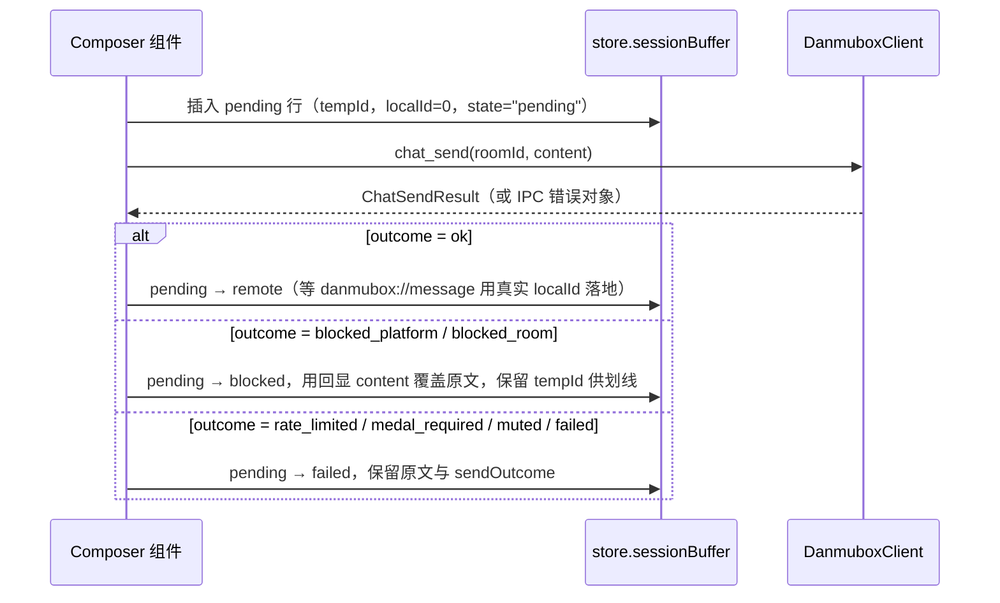

# danmubox Tauri IPC 契约

> 定位：前端与 Rust 引擎之间唯一的命令/事件契约，定义命令签名、载荷类型、事件集合、Zustand store 形状与乐观更新规则。
> 读者：写 React/TS 前端的开发者、在 `apps/desktop/src-tauri` 增加命令的 Rust 开发者、需要判断「一处改动要同步几个文件」的 AI 编码 agent。
> 更新时机：新增/删除/改名的命令或事件、改动任何载荷字段、改动 store 形状或乐观更新规则时，必须同步修改本文；契约 §5 / §7 / §8 变更时本文必须跟随。

---

## 1. 运行模式

只有一种运行模式：页面运行在 Tauri WebView 中，命令走 `invoke("命令名", 参数)`，事件走 `listen("danmubox://事件名", handler)`。

`vite dev` 下 WebView 内 `@tauri-apps/api` 同样可用，前端的数据路径只有 `invoke` / `listen` 这一条。

约束（规范性）：命令名与事件名的集合是**封闭**的，与契约 §7 逐条一致（命令清单见 §3、事件清单见 §4）；新增面必须同时改契约 §7、本文与实现，不允许前端私自定义字符串。

> 「手填 Cookie」不设命令：按契约 §4.1，它等于**直接编辑 `config.toml`**，界面只提供数据目录路径与文件说明。

> 后期想法（本期不实现）：接入 MCP，让 Agent 直接消费弹幕数据。因此 IPC 只是 core 的一个消费面，core 的端口与事件总线不得假设消费方是 UI；新增能力先落 core 端口，再决定是否暴露成命令。

## 2. 调用约定

| 项 | 约定 |
|---|---|
| 命令名 | `snake_case`，与契约 §7 字面一致 |
| 参数名 | Rust 侧 `snake_case`；Tauri 2 默认把参数名转成 **camelCase** 暴露给 JS，因此前端 `invoke` 传 `roomId`、`content`、`upstreamId`、`input` 等 camelCase 键 |
| 成功返回 | 直接返回 §3 签名表「返回」列的 JSON 值 |
| 失败返回 | `invoke` 被 reject，值为错误对象 `{ "error": { "code", "message", "detail" } }`；前端按 `code` 分支，`detail` 的键名按命令固定（如 `detail.reason`、`detail.retry_after_ms`、`detail.upstream_code`），**不得**解析 `message` 文本 |
| 错误码 | 只用下表七个；本文是错误码集合的权威来源 |
| 时间 | 统一 UTC 毫秒、`i64`；JS 侧为 `number` |
| 消息载荷 | 契约 §5 的 `Message`，JSON 侧 **snake_case**；进入 store 时转 camelCase（契约只约束载荷，不约束 store 内部表示） |
| 偏好键 | 契约 §8 的字面键名（如 `ui.font_scale`），两边都不改名，store 内也用字面键 |
| 凭据 | 任何命令的返回都不含 `sessdata` / `bili_jct` / `dede_user_id`；`session_status` 只返回状态位 |

错误码（本文档负责，`core::error` 归一化后映射到这里）：

| code | 触发场景 | 前端处理 |
|---|---|---|
| `BAD_REQUEST` | 参数缺失/非法（如 `input` 解析不出房间号、`prefs_set` 未知键或非法值） | 不重试，就地提示 |
| `NOT_FOUND` | 资源不存在（非房间类，如已消费的扫码 `key`） | 不重试 |
| `ROOM_NOT_FOUND` | 房间号无法解析，或不在已添加列表 | 不重试 |
| `NOT_LOGGED_IN` | 游客模式调用需登录的动作 | 不重试，引导扫码登录 |
| `RATE_LIMITED` | 本地发弹幕节流命中（同房间 2s、相同内容 5s，契约 §4）；`detail.reason` = `min_interval` / `duplicate`，`detail.retry_after_ms` 供倒计时 | 不自动重发 |
| `UPSTREAM_ERROR` | 上游接口非预期响应或结构不符；`detail.upstream_code` / `detail.upstream_message` 携带原始值 | 幂等读请求不自动重试；写请求不自动重试 |
| `INTERNAL` | 本地未预期错误（本地文件 IO、序列化、任务 panic） | 不重试，记录日志 |

## 3. 命令签名表

所有命令均为 `#[tauri::command] async fn`，接收 `State<CoreHandle>`；「错误」列是可能被 reject 的错误码（未列出的码不会出现）。

| 命令 | 参数 | 返回 | 错误 | 说明 |
|---|---|---|---|---|
| `session_status` | 无 | `SessionStatus` | — | 永不失败；未登录时 `mode="anonymous"`、`uid=0`；含当前 `active_profile` |
| `accounts_list` | 无 | `Account[]` | `INTERNAL` | 列出全部账号：`Account { name, nickname, uid, face, logged_in, active }`；游客态不是账号，没有凭据就没有条目 |
| `account_qr_start` | `target?: string` | `{ key, url, svg }` | `INTERNAL` | 不带 `target` = **新增账号**（扫完按昵称自动命名，**不覆盖任何已有凭据**）；带 = 给该账号**重新登录**（**覆盖**其凭据，界面必须二次确认并在文案里写明覆盖哪个账号） |
| `account_qr_poll` | `key: string` | `{ state, account }` | `INTERNAL` | `state` ∈ `pending` / `scanned` / `confirmed` / `expired`；确认后后端落盘并设为当前，未确认时 `account` 为 `null` |
| `account_login_cookie` | `cookie: string`、`name?: string` | `Account` | `BAD_REQUEST` `INTERNAL` | 手填 Cookie（需求 §2.5 三种方式之一）；缺必填字段 → `BAD_REQUEST` |
| `account_switch` | `name: string` | `SessionStatus` | `BAD_REQUEST` `NOT_FOUND` `INTERNAL` | 切换当前账号并以新凭据重建各房间连接 |
| `account_logout` | `name?: string` | `SessionStatus` | `NOT_FOUND` `INTERNAL` | 清掉该账号（缺省=当前）的凭据；条目保留、`logged_in=false`（退回游客态） |
| `account_remove` | `name: string` | `SessionStatus` | `BAD_REQUEST` `NOT_FOUND` `INTERNAL` | 删除账号；不许删最后一个；删当前项自动切走 |
| `rooms_list` | 无 | `RoomView[]` | `INTERNAL` | 已添加房间 + 当前连接状态 + 当前会话缓冲条数 |
| `rooms_add` | `input: string` | `RoomView` | `BAD_REQUEST` `UPSTREAM_ERROR` `INTERNAL` | `input` 为短号/URL/房间号，解析走 `getRoomPlayInfo`；解析不出即 `BAD_REQUEST` |
| `rooms_remove` | `roomId: number` | `void` | `ROOM_NOT_FOUND` `INTERNAL` | 移除并断连、取消 supervisor，同时**结束会话并销毁缓冲** |
| `rooms_connect` | `roomId: number` | `RoomView` | `ROOM_NOT_FOUND` `UPSTREAM_ERROR` `INTERNAL` | 建立会话：创建 supervisor、创建会话缓冲、开始收包。幂等：已连接时直接返回当前状态 |
| `rooms_disconnect` | `roomId: number` | `RoomView` | `ROOM_NOT_FOUND` | 断开并**结束会话、清空缓冲**。幂等：已断开时直接返回 |
| `rooms_reconnect` | `roomId: number` | `RoomView` | `ROOM_NOT_FOUND` `UPSTREAM_ERROR` | 房间内「刷新」按钮：主动断开并立即重连（跳过退避）。**不清空缓冲、不结束会话**；连接中/退避中/已连接三种状态均可调用 |
| `history_query` | `roomId: number`、`limit?: number`、`after?: number`、`before?: number`、`kinds?: MessageKind[]`、`uid?: number`、`q?: string` | `Message[]`（snake_case，按 `ts` 升序） | `ROOM_NOT_FOUND` `BAD_REQUEST` `INTERNAL` | 只查**当前房内会话缓冲**（契约 §4.3）；无活跃会话（缓冲已销毁）时返回空数组，不报错。不跨会话、不回放、不导出 |
| `chat_send` | `roomId: number`、`content: string`、`color?: number`、`mode?: number` | `ChatSendResult` | `BAD_REQUEST` `ROOM_NOT_FOUND` `NOT_LOGGED_IN` `RATE_LIMITED` `UPSTREAM_ERROR` `INTERNAL` | `color` 缺省 16777215、`mode` 缺省 1，**两者都原样透传不做范围校验**——A18 实测：上游对 `mode` 与越界 `color` 都不做范围检查，且会把过暗颜色改写成白（可读性规范化）；**唯一要避免的是 `color=0`**（上游参数层直接拒绝 `-400`）。本地节流命中 → `RATE_LIMITED`（不发起请求）；已发出的请求结果一律经 `SendOutcome` 返回，被吞不重发 |
| `chat_report` | `roomId: number`、`upstreamId: string`、`reason: number` | `ReportResult` | `BAD_REQUEST` `ROOM_NOT_FOUND` `NOT_LOGGED_IN` `UPSTREAM_ERROR` `INTERNAL` | 举报一条弹幕；`upstreamId` 取 `Message.upstream_id`（契约 §5，举报必需）；`reason` 为上游举报类型码，取值见 §3.2 |
| `emotes_list` | `roomId: number` | `Emote[]` | `ROOM_NOT_FOUND` `NOT_LOGGED_IN` `UPSTREAM_ERROR` `INTERNAL` | 按**真实会话身份**（取自会话缓存，见 `room_session`；此前传零身份会缺粉丝牌与大航海那几包）（`RoomSession`）加载表情包库：无牌/有牌/房管/大航海看到的面板不同 |
| `room_session` | `roomId: number` | `RoomSession` | `INTERNAL` | 该房间**当前会话**里的本人身份（`is_admin` / `my_guard_level` / `my_medal_level` / `my_medal_name`）。无活跃会话 → 全零身份而**不报错**；界面据此决定房管入口是否亮起（拿不到身份即按无权限渲染，不靠试错） |
| `emotes_owned` | 无 | `Emote[]` | `UPSTREAM_ERROR` `INTERNAL` | 主站「我的表情」：用户**拥有**的表情包（充电/UP 主专属那一族）。`package_kind="owned"`、`room_id=0`、唯一键 = `"upower_" + 表情 text`；未登录时上游退化为免费表情包，因此**不报** `NOT_LOGGED_IN` |
| `admin_mute` | `roomId: number`、`uid: number`、`hour: number`、`msg?: string` | `void` | `NOT_LOGGED_IN` `UPSTREAM_ERROR` `INTERNAL` | 禁言：`hour` 为 `-1` 永久 / `0` 本场直播 / 其余为小时数。仅房管可用；**非 0 code 原样带回**（不赋语义），非房管时通常得到上游的权限错误码 |
| `admin_unmute` | `roomId: number`、`uid: number` | `void` | `NOT_LOGGED_IN` `UPSTREAM_ERROR` `INTERNAL` | 解除禁言 |
| `admin_silent_list` | `roomId: number` | `SilentUser[]` | `NOT_LOGGED_IN` `UPSTREAM_ERROR` `INTERNAL` | 当前禁言名单（只读） |
| `admin_blacklist_list` | `roomId: number` | `BlacklistedUser[]` | `NOT_LOGGED_IN` `UPSTREAM_ERROR` `INTERNAL` | 黑名单（只读）。内部把 `roomId` 解析成主播 uid 后按 `anchor_id` 寻址——上游这个接口不吃房间号 |
| `admin_blacklist_add` | `roomId: number`、`uid: number` | `void` | `NOT_LOGGED_IN` `UPSTREAM_ERROR` `INTERNAL` | 加入黑名单（拉黑会解除关系并禁止互动，比禁言重） |
| `admin_blacklist_del` | `roomId: number`、`uid: number` | `void` | `NOT_LOGGED_IN` `UPSTREAM_ERROR` `INTERNAL` | 移出黑名单 |
| `admin_keywords_list` | `roomId: number` | `string[]` | `NOT_LOGGED_IN` `UPSTREAM_ERROR` `INTERNAL` | 直播间屏蔽词（只读） |
| `admin_keywords_add` | `roomId: number`、`words: string` | `void` | `NOT_LOGGED_IN` `UPSTREAM_ERROR` `INTERNAL` | 添加屏蔽词；上游一次只收一个 `keyword`，多词由实现逐个调用 |
| `admin_keywords_del` | `roomId: number`、`word: string` | `void` | `NOT_LOGGED_IN` `UPSTREAM_ERROR` `INTERNAL` | 删除屏蔽词 |
| `follow_list` | 无 | `FollowedRoom[]` | `NOT_LOGGED_IN` `UPSTREAM_ERROR` `INTERNAL` | 关注列表；排序规则 `live_status == 1` 置顶（契约 §5） |
| `wallet_balance` | 无 | `WalletBalance` | `NOT_LOGGED_IN` `UPSTREAM_ERROR` `INTERNAL` | 电池余额；单位与刷新时机见 §3.2 |
| `prefs_get` | 无 | `PrefsSnapshot`（契约 §8 全部 17 键的**生效值**） | `INTERNAL` | 未写入过的键返回契约 §8 默认值 |
| `prefs_set` | `patch: Partial<PrefsSnapshot>` | `PrefsSnapshot`（合并后的生效值**全集**） | `BAD_REQUEST` `INTERNAL` | 未知键或非法值 → `BAD_REQUEST`，整批拒绝；成功返回与 `prefs_get` 同形 |
| `app_info` | 无 | `AppInfo` | — | 版本、数据目录、构建信息、日志级别、平台；不含任何凭据 |

`prefs_set` 接受部分补丁（只提交要改的键），返回合并后的全量生效值。

### 3.1 载荷类型

```ts
type MessageKind = "danmaku" | "gift" | "superchat" | "interact" | "guard" | "system";

// 命令与事件携带的原始形态：契约 §5 的 Message，snake_case
type Message = {
  local_id: number;      // 会话内自增序号，仅用于 UI key 与本地引用；进程重启后重置
  room_id: number;       // 真实房间号
  kind: MessageKind;
  ts: number;            // UTC 毫秒
  uid: number;           // 游客/未知为 0
  uname: string;
  face: string;          // 发言者头像 URL；取不到为空串（前端自行降级）
  content: string;
  color: number;         // 十进制 RGB
  medal_level: number;   // 发送者粉丝牌等级，0 无
  medal_name: string;
  guard_level: number;   // 0 无 / 1 总督 / 2 提督 / 3 舰长
  is_admin: boolean;     // 发送者是否房管
  amount: number;        // 礼物金瓜子或 SC 金额，非交易类为 0
  is_history: boolean;  // 是否来自进场回填；实时推送恒为 false
  emote: EmoteRef | null;  // 表情弹幕的整份表情信息（契约 §5）；非表情为 null
  medal_guard_level: number;  // 粉丝牌自身所属房间的舰长标记；只用于牌面样式，不画舰长标
  medal_color_start: string;  // 粉丝牌起始色（带 alpha 的 CSS 十六进制串）；空串不是颜色
  medal_color_end: string;
  medal_color_border: string;
  medal_color_text: string;
  reply_to_uid: number;   // 被回复者 uid；0 = 不是回复
  reply_to_uname: string;  // 被回复者昵称；非回复为空串
  combo_id: string;       // 连击标识（礼物聚合用）
  upstream_id: string;   // 上游弹幕标识，举报必需
};

// 契约 §5 的封闭集合
type SendOutcome =
  | "ok"                // 已发出且进入公开弹幕流
  | "blocked_platform"  // 被平台风控吞掉（上游响应 msg/message == "f"）
  | "blocked_room"      // 被直播间吞掉（上游响应 msg/message == "k"）
  | "rate_limited"      // 上游频率限制
  | "medal_required"    // 粉丝牌等级不足
  | "muted"             // 已被禁言
  | "failed";           // 兜底，带原始 code 与 message

type ChatSendResult = {
  outcome: SendOutcome;
  room_id: number;
  content: string;                  // 实际发出的内容；被吞时为上游回显的内容（可能被改写/截断）
  upstream_code: number | null;     // outcome="failed" 时必有
  upstream_message: string | null;
};

type SessionStatus = {
  mode: "anonymous" | "qrcode" | "cookie";
  logged_in: boolean;
  uid: number;                // 未登录为 0
  uname: string;              // 未登录为空串
  expires_at: number | null;  // UTC 毫秒，未知为 null
  active_profile: string;     // `config.toml` 中当前生效的 profile 名
};

// accounts_list 的返回：每个账号一份具名凭据（config.toml 的 [profiles.<name>]）
type Account = { name: string; nickname: string; uid: number; face: string; logged_in: boolean; active: boolean };

// account_qr_start 的返回：二维码由后端离线渲染成 SVG，前端包成 data URI 显示
type AccountQr = { key: string; url: string; svg: string };

type QrPoll = {
  // 归一化状态：pending（未扫码/已扫码待确认/一切未知上游码）/ confirmed / expired
  status: "pending" | "confirmed" | "expired";
  code: number;                  // 上游原始状态码，只透传不解释（语义权威表见 auth.md）
  message: string;               // 上游文案或本地描述，仅展示，不参与逻辑
  session: SessionStatus | null; // status="confirmed" 时非空
};

type RoomView = {
  room_id: number;
  short_id: number | null;
  anchor_uid: number | null;     // 主播徽标的派生依据：uid == anchor_uid
  title: string | null;
  live_status: number;           // 0 未开播 / 1 直播中 / 2 轮播
  connected: boolean;
  buffered_count: number;        // 当前会话缓冲条数，无会话为 0
};

// 我在该房间的身份（表情包可用范围与徽标判定依据），会话级、不落盘
type RoomSession = {
  room_id: number;
  my_medal_level: number;
  my_medal_name: string;
  my_guard_level: number;
  is_admin: boolean;
};

type Emote = {
  key: string;
  package_kind: "common" | "owned" | "room" | "medal" | "guard";  // owned = 主站「我的表情」（契约 §5）
  text: string;
  url: string;
  room_id: number;               // 房间专属时非 0
};

type FollowedRoom = {
  room_id: number;
  uname: string;
  face: string;
  title: string;                  // 直播间标题（上游 GetWebList 的 title；空串 = 上游未给）
  live_status: number;           // 0 未开播 / 1 直播中 / 2 轮播
  group_name: string;
};

type RoomStats = {
  room_id: number;
  online: number | null;   // 在线人数（ONLINE_RANK_COUNT.online_count），未给过为 null
  watched: number | null;  // 累计看过（WATCHED_CHANGE.num），未给过为 null
};

type WalletBalance = { battery: number };

type ReportResult = { ok: boolean; upstream_code: number | null; upstream_message: string | null };

type PrefsSnapshot = {            // 契约 §8 的 17 键全量，键名即契约字面
  "ui.font_scale": number; "ui.theme": "system" | "dark" | "light";
  "ui.auto_scroll": boolean; "ui.pause_on_hover": boolean;
  "ui.merge_similar": boolean; "ui.merge_window_ms": number;
  "ui.gift_panel_mode": "merged" | "separate";
  "ui.interact_auto_hide": boolean;   // 互动/进场消息显示一会儿后自动消失（默认 true）
  "ui.system_notice": boolean;        // 系统通知显示（默认 false）
  "composer.phrases": string[];
  "filter.keywords": string[]; "filter.keywords_mode": "hide" | "only";
  "filter.keywords_alert": boolean; "filter.uids": number[]; "filter.kinds": MessageKind[];
  "filter.medal_level_min": number;
  "history.buffer_rows": number;
};
// 原先的 "ui.opacity" 已删除（用户 2026-09-12：实现方式非预期），不再接受该键。

type AppInfo = {
  name: string; version: string; bundle_id: string;
  platform: "macos" | "windows" | "android" | "dev";
  data_dir: string | null;       // 数据目录；解析失败为 null
  log_level: string | null;      // DANMUBOX_LOG 的生效值
};
```

### 3.2 待实测校准（B 站侧取值）

以下取值不在契约内、依赖 B 站线上行为，不得凭空写死；核对方法：`DANMUBOX_LOG=debug` 启动 → 复现对应场景 → 从 Tauri 事件 `danmubox://log` 取请求/响应原文 → 回填下表并同步 `protocol.md`。

| 待确认项 | 现状 | 核对方法 | 责任人动作 |
|---|---|---|---|
| ~~`chat_send` 的 `color` / `mode` 合法取值~~ | **已实测结案**（`protocol.md` A18，2026-09-12）：`color=0` 被参数层拒；`mode` 与越界 `color` 上游不校验；过暗颜色会被改写成白。客户端原样透传即可 | — | — |
| 扫码上游状态码 → 归一化状态的映射 | 本文件只透传 `code`；状态机与状态码语义表由 `auth.md` 拥有 | 完整跑一次扫码（未扫码 / 已扫码待确认 / 确认成功 / 失效）并在每个节点记录 `code` 与凭据下发情况 | `auth.md` 维护者回填状态码表；本文件无需改动 |
| `chat_report` 的 `reason` 类型码取值 | 只透传调用方给出的数值，不校验语义 | 用官方界面举报一次同一条弹幕并抓取请求参数 | 协议层维护者回填类型码表并同步 `protocol.md` |
| 被吞弹幕回显内容的稳定字段路径 | 按契约 §5 取 `data.mode_info.extra`（JSON 字符串）的 `content` | 各触发一次平台风控与直播间吞没，记录原始响应 | 协议层维护者确认是否需要兜底路径 |
| `wallet_balance` 的单位与刷新时机 | 只透传上游原始数值，不做换算 | 登录后读一次，消费一份礼物后再读一次，比对差值 | 钱包端口维护者确定单位与刷新策略后回填 |

## 4. 事件表

| 事件名 | 载荷（snake_case） | 触发时机 | 频率控制 |
|---|---|---|---|
| `danmubox://message` | `Message` | 每归一化一条消息；同时写入该房间会话缓冲 | 不节流；前端按帧合批渲染 |
| `danmubox://room` | `RoomEvent` | 房间元信息变化、连接建立/断开、重连退避开始、手动重连 | 同房间 200ms 合并 |
| `danmubox://session` | `SessionStatus` **或** `RoomSession` | 扫码确认、登出、认证失败导致会话失效；**同一条事件也用于推送房内身份**（`RoomSession`，会话建立时取一次）——前端须按判别字段分派（有 `logged_in` 走登录态、有 `is_admin` 走房内身份），否则身份载荷会把登录态覆盖成 `undefined` | 事件驱动 |
| `danmubox://status` | `StatusEvent` | 进程状态变化 | 最多 1s 一次（节流） |
| `danmubox://send` | `ChatSendResult` | 每次发弹幕请求得到结果（**与 `chat_send` 的返回值同构**） | 事件驱动 |
| `danmubox://room_stats` | `RoomStats` | 房间观众数变化（在线人数 / 累计看过，两侧可缺省；契约 §5） | 事件驱动，不进会话缓冲 |
| `danmubox://log` | `LogEntry` | 日志级别允许时逐条推送 | ring buffer 上限内推送 |

```ts
type RoomEvent = {
  room_id: number; short_id: number | null; anchor_uid: number | null;
  title: string | null; live_status: number; connected: boolean;
  reason: "connect" | "disconnect" | "reconnect" | "backoff" | "closed" | "meta";
};
type StatusEvent = {
  uptime_ms: number; rooms_connected: number; rooms_total: number; messages_total: number;
};
type LogEntry = { ts: number; level: string; target: string; message: string; span: string | null };
```

## 5. Zustand store 形状

单一 store，按切片组织；切片之间不互相 import，只通过 store 的 actions 协作。

```ts
type StoredMessage = {              // store 内部形态：camelCase（`MessageKind` 同 §3.1）
  localId: number;                  // 0 表示尚未获得服务端确认的本地行
  tempId?: string;                  // 仅 pending / blocked / failed 行有
  roomId: number; kind: MessageKind; ts: number;
  uid: number; uname: string; content: string; color: number;
  medalLevel: number; medalName: string; guardLevel: number; isAdmin: boolean;
  amount: number; upstreamId: string;
  state: "remote" | "pending" | "blocked" | "failed";
  sendOutcome?: SendOutcome;        // 仅 blocked 行：区分 blocked_platform / blocked_room
};

type AppState = {
  // session 切片
  session: { status: SessionStatus | null; qr: QrPoll | null; loading: boolean };
  // rooms 切片（房间列表只在内存中，进程重启为空）
  rooms: { byId: Record<number, RoomView>; order: number[]; activeId: number | null };
  // 会话缓冲切片：core 持有权威缓冲，这里是当前会话的**前端镜像**，随会话结束清空
  sessionBuffer: {
    byRoom: Record<number, StoredMessage[]>;   // key 存在即该房间会话存活
    droppedByRoom: Record<number, number>;     // 缓冲溢出被丢弃的最旧条数（UI 折叠提示）
    session: Record<number, RoomSession>;      // 我在该房间的身份，表情/徽标用
  };
  // 表情切片：按房间缓存，随会话结束清空
  emotes: { byRoom: Record<number, Emote[]>; scope: Record<number, RoomSession>; loading: boolean };
  // 关注列表切片
  follow: { rooms: FollowedRoom[]; groups: string[]; loading: boolean; lastError: string | null };
  // 钱包切片
  wallet: { balance: WalletBalance | null; loading: boolean };
  // 观众数切片：按房间存在线人数 / 累计看过（契约 §5 RoomStats），随事件更新、不落盘
  roomStats: Record<number, { online?: number; watched?: number }>;
  // prefs 切片（键名为契约 §8 字面键）
  prefs: { effective: PrefsSnapshot | null; dirty: boolean; lastError: string | null };
  // status 切片
  status: { uptimeMs: number; roomsConnected: number; roomsTotal: number; messagesTotal: number };
  // log 切片（调试面板，最多保留 500 条，不落盘）
  logs: { entries: LogEntry[]; level: string; open: boolean };
};
```

| store 动作 | 调用 | 说明 |
|---|---|---|
| `refreshSession()` | `session_status` | 登录态变化入口 |
| `logoutAccount(name?)` | `account_logout` | 清空 `session`，清空 `sessionBuffer` / `emotes` / `follow` / `wallet`，再 `refreshRooms()` |
| `loadAccounts()` / `switchAccount(name)` / `removeAccount(name)` / `logoutAccount(name?)` / `loginCookie(cookie, name?)` / `startAccountQr(target?)` / `pollAccountQr()` | `accounts_list` / `account_switch` / `account_remove` / `account_login_cookie` | 用返回值覆盖 `session`；切换「当前账号」后按「离开房间」规则清空会话缓冲、表情与钱包切片（那些是**上一个账号**的）；账号本身的变化交给 `loadAccounts()` |
| `refreshRooms()` | `rooms_list` | 启动时与 `danmubox://room` 事件后调用 |
| `addRoom(input)` | `rooms_add` | 成功后插入 `rooms.byId` |
| `removeRoom(roomId)` | `rooms_remove` | 同时删除该房间的 `sessionBuffer.byRoom[roomId]` / `droppedByRoom[roomId]` / `emotes.byRoom[roomId]` |
| `connectRoom(roomId)` | `rooms_connect` | 返回 `RoomView` 覆盖本地；成功后开一个空的会话缓冲切片 |
| `disconnectRoom(roomId)` | `rooms_disconnect` | 覆盖本地状态，并**删除该房间的会话缓冲与表情缓存** |
| `reconnectRoom(roomId)` | `rooms_reconnect` | 房间内「刷新」；**不清空会话缓冲**，只等 `danmubox://room` 回连状态 |
| `loadHistory(roomId, opts)` | `history_query` | 首屏、向上回滚、订阅者落后后的补齐；结果按 `localId` 去重合并，`ts` 升序 |
| `sendChat(roomId, content, color?, mode?)` | `chat_send` | 见 §7 乐观更新 |
| `reportDanmaku(roomId, upstreamId, reason)` | `chat_report` | 成功后就地提示；失败按错误码提示 |
| `loadEmotes(roomId)` | `emotes_list` | 进入房间后调用一次；面板按 `package_kind` 分组 |
| `refreshFollow()` | `follow_list`（每次实时拉取） | 返回后按 `live_status == 1` 置顶排序渲染；**启动时（会话就绪后）与登录/换号后各自动调用一次**，失败仍走错误提示并保留「刷新」按钮 |
| `refreshWallet()` | `wallet_balance` | 状态栏展示；打开礼物面板时刷新 |
| `loadPrefs()` / `savePrefs(patch)` | `prefs_get` / `prefs_set` | 写入后用返回值整体覆盖 `prefs.effective` |
| `loadAppInfo()` | `app_info` | 状态栏与调试面板 |

`toMessage()` 转换表（唯一的 snake_case → camelCase 落点）：

| 载荷字段 | store 字段 |
|---|---|
| `local_id` `room_id` `kind` `ts` `uid` `uname` `content` `color` | `localId` `roomId` `kind` `ts` `uid` `uname` `content` `color` |
| `medal_level` `medal_name` `guard_level` `is_admin` `amount` `upstream_id` | `medalLevel` `medalName` `guardLevel` `isAdmin` `amount` `upstreamId` |

## 6. 客户端封装

唯一 IO 边界是适配层：业务组件只 import 一个与 §3 同名、同参、同返回的客户端接口（`DanmuboxClient`），不出现 `invoke` / `listen` 字面量；事件订阅统一为 `subscribe(handlers: EventHandlers): () => void`。

```ts
type EventHandlers = {
  onMessage(m: Message): void;
  onRoom(e: RoomEvent): void;
  onSession(e: SessionStatus): void;
  onStatus(e: StatusEvent): void;
  onSend(e: ChatSendResult): void;
  onLog?(e: LogEntry): void;
};
```

## 7. 发弹幕的乐观更新与失败回滚

`chat_send` 是本项目唯一「本地状态先于服务端确认」的命令。



| 规则 | 内容 |
|---|---|
| 挂载位置 | `sessionBuffer.byRoom[roomId]` 尾部插入 `state="pending"` 的行，`localId=0`，`tempId` 唯一 |
| 幂等归并 | `chat_send` 返回值与 `danmubox://send` 同构，按「同房间 + 同 `content` + 5s 窗口」归并到同一 pending 行；真实消息（`localId > 0`）到达时，若同房间存在 `content` 相同、时间差在 5s 内、`uid` 为本人（或 `uid=0` 的 pending 容错）的本地行，则用真实行替换本地行，不新增 |
| `ok` | 用返回结果把行置为 `remote`；若 `danmubox://message` 先到，以真实行为准，避免同一弹幕出现两行 |
| `blocked_platform` | pending → `blocked`：内容用 `ChatSendResult.content`（上游回显，可能与输入不同）覆盖，保留 `tempId` 供划线 |
| `blocked_room` | pending → `blocked`：同样用上游回显覆盖内容；用于区分「平台风控」与「主播/房管吞没」两种来源 |
| `rate_limited` | 若由本地节流命中（IPC 错误码 `RATE_LIMITED`），**不插入 pending 行**，直接按 `detail.retry_after_ms` 禁用发送按钮倒计时；若由上游判定（`SendOutcome.rate_limited`），行置 `failed` 并提示上游限频 |
| `medal_required` / `muted` | 行置 `failed`，分别提示「粉丝牌等级不足」「已被禁言」，保留输入内容，**不**自动重发 |
| `failed` | 行置 `failed`，提供「重试」按钮（重新走 `chat_send`，生成新的 `tempId`）；`upstream_code` / `upstream_message` 只进调试日志，不直接展示 |
| `NOT_LOGGED_IN` | 回滚 pending 行并清空，弹出扫码登录入口，输入内容保留在草稿 |
| 永久失败 | 会话结束（离开房间）或超过 5 分钟，`failed` / `blocked` 行随会话缓冲一起清空 |
| 本地节流 | 发送前检查同房间 2s 最小间隔与相同内容 5s 去重（契约 §4），命中则不发请求，直接提示 |
| 安全 | 草稿内容不写入 `prefs.json`、不上报；日志只记 `content_len` 与 `outcome`（见 `architecture.md` §9.2） |

`blocked` 行必须与 `pending` / `failed` 在视觉上可区分，且必须能区分平台风控与直播间吞没两种来源；样式 token 由 `ui.md` 定义。

## 8. 订阅生命周期与内存回收

| 阶段 | 动作 |
|---|---|
| 应用启动 | `listen` 六个事件（收齐后进入就绪态）；`prefs_get` + `rooms_list` + `session_status` 并行 |
| 进入房间 | `rooms_connect` 成功后创建 `sessionBuffer.byRoom[roomId]`（空），随后 `loadHistory` 取首屏 + `loadEmotes` |
| 切换房间标签 | 只切 `rooms.activeId`；事件继续到达，非激活房间只入 store 不渲染 |
| 离开房间（返回列表 / 关闭标签 / `disconnect` / `remove`） | 删除该房间的会话缓冲切片、表情切片与 `droppedByRoom` 计数；core 侧缓冲同步销毁 |
| 手动重连 | 不触碰任何 store 切片，只等 `danmubox://room` 的 `connected` 变化 |
| 应用卸载 / HMR | 组件全部卸载或 `import.meta.hot.dispose` 时调用 `unsubscribe()`；连接由 Rust 持有，不做断开 |

内存边界（唯一的权威裁剪点在 core）：

| 项 | 上限 | 超出行为 |
|---|---|---|
| 会话缓冲（core 权威，`history.buffer_rows`） | 5000 条 | 丢最旧；前端 `droppedByRoom` 计数 +1，UI 提示「已折叠 N 条早期消息」 |
| 前端渲染窗口 | 不设第二套裁剪 | 由虚拟列表按视口取 `sessionBuffer.byRoom[roomId]` 的切片渲染，不做二次丢弃 |
| `logs` 切片 | 500 条 | 丢弃最旧 |
| 房间数量 | 不设硬上限 | 每房间一个 supervisor task 的代价记录在 `architecture.md` §4 |
| 非激活房间 | 保留订阅与缓冲、限制渲染 | 切回时按虚拟列表窗口渲染，不重建 store |

回收规则：事件订阅的退订函数必须存进 store 或模块级 registry，**不允许匿名 `listen` 后丢弃句柄**（会导致热重载后重复监听）。

## 9. 新增一个 IPC 命令需要同步改哪些文件

以下路径为规划路径（代码未开始），以契约 §3 的目录结构为准。

| # | 文件 | 改什么 | 是否必须 |
|---|---|---|---|
| 1 | 契约 §7（`contract.md`） | 在命令清单里加入新命令名 | 必须（否则命令集合不闭合） |
| 2 | `crates/danmubox-core/src/port/**` | 若需要新引擎能力，先加端口或 core 公开接口 | 视命令而定 |
| 3 | `crates/danmubox-bili/src/**` | 实现对应端口（B 站侧请求与归一化只落在这里） | 视命令而定 |
| 4 | `apps/desktop/src-tauri/src/commands.rs` | 新增 `#[tauri::command]` 函数，参数与返回值按本文 §3 的类型 | 必须 |
| 5 | `apps/desktop/src-tauri/src/lib.rs` | 把新命令加进 `tauri::generate_handler![...]` 注册表 | 必须 |
| 6 | `apps/desktop/src-tauri/src/ipc_error.rs` | 若引入新错误分支，映射到 §2 的七个错误码之一 | 视命令而定 |
| 7 | `apps/desktop/ui/src/api/types.ts` | 请求/响应的 TypeScript 类型 | 必须 |
| 8 | `apps/desktop/ui/src/api/client.ts` | 在 `DanmuboxClient` 接口上加方法 | 必须 |
| 9 | `apps/desktop/ui/src/api/tauri.ts` | `invoke` 实现 | 必须 |
| 10 | `apps/desktop/ui/src/store/**` | 对应的 store 动作与切片字段 | 视命令而定 |
| 11 | `ipc.md`（本文） | 命令签名表、载荷类型、store 动作表 | 必须 |
| 12 | `../AGENT.md` | 「新增 IPC 命令」操作清单若与本表不一致则同步 | 必须 |

自检清单（提交前逐条确认）：

1. 命令名与契约 §7 字面一致，事件名未越出 §4 的六个；参数名前端 camelCase、Rust snake_case。
2. 错误只用 §2 的七个码，且 `message` 不参与前端逻辑。
3. 返回载荷不含凭据；载荷中的 `Message` 字段与契约 §5 完全一致，`kind` 不越出六种。
4. 若命令涉及历史，只读当前会话缓冲，不得引入跨会话查询或导出。

---

相关文档：`architecture.md`（分层、端口/适配器与并发模型）、`ui.md`（渲染与交互、虚拟列表、样式 token）、`auth.md`（扫码状态机与凭据）、`protocol.md`（协议与 `cmd → kind`）、`contract.md`（文档基线契约）、`decisions/0008-frontend-stack.md`（前端栈与状态管理）、`../AGENT.md`（作业规范与操作清单）、`../README.md`。
