# danmubox 总览：需求 → 代码 → 界面

> 定位：把三件事串成一篇可以一次性读完的综述 —— **这个产品要什么**（业务需求）、**代码怎么跑**（引擎执行逻辑）、**界面长什么样、怎么动**（前端逻辑）。
> 读者：第一次接触本仓库的人、需要判断「某件事落在哪一层」的实现者、需要回答「这条需求现在什么状态」的 AI 编码 agent。
> 与其他文档的分工：本文**不复制**任何一篇的正文，只做归类、串联与索引。
> - 需求逐条状态与证据 → [`requests.md`](requests.md)（台账，`P1`–`P48` / `E1`–`E11` / `issue` 20 条）；
> - 需求基线（做什么、不做什么） → [`../REQUIREMENTS.md`](../REQUIREMENTS.md)；
> - 规范性契约（唯一事实源） → [`contract.md`](contract.md)；
> - 分层与并发模型 → [`architecture.md`](architecture.md)；协议 → [`protocol.md`](protocol.md)；登录与 WBI → [`auth.md`](auth.md)；
> - IPC 命令与事件 → [`ipc.md`](ipc.md)；界面规范 → [`ui.md`](ui.md)；测试 → [`testing.md`](testing.md)。
>
> **本文的事实口径**：代码事实给 `文件:行号`（行号对 `main` 的 `aadaaa0` 有效）；文档事实给章节号。凡本文与 `contract.md` 冲突，以 `contract.md` 为准。
> 更新时机：crate 划分、数据流、会话/重连机制、IPC 面、页面结构或组件职责发生变化时。

---

## 0. 一句话

「弹幕框」是 B 站官方直播间**聊天框**的复刻：一个按时间流动的文本消息列表，**没有播放器、不解码视频**，只消费弹幕协议。技术形态是 Tauri 2 外壳 + Rust 引擎（`danmubox-core` + `danmubox-bili`）+ React/TS 前端，自用不发布，**竖屏是默认形态**。

---

## 1. 业务需求总览

按主题归类。每条给「产品上要什么 / 为什么（用户原话要点）/ 现状」。**逐条状态、证据与提交 sha 一律回查 [`requests.md`](requests.md) §1**（本节的编号 P 即该表编号），需求基线原文见 [`../REQUIREMENTS.md`](../REQUIREMENTS.md)。

### 1.1 账号与身份

| 要什么 | 为什么 | 现状 |
|---|---|---|
| 多账号：**单个 `config.toml` 内多 profiles**，可切换、可新增、可删除、可分别重登 | P1：原话「已登录用户没法切换，只能重登；凭证在后台，应能直接切换身份」 | 已做。账号管理对话框 `AccountManager.tsx:66`，一行身份 + 列表（切换 `:201` / 重扫 `:209` / 登出 `:217` / 删除 `:230`）；破坏性操作走确认条 `:241` |
| 三种登录：游客 / 手填 Cookie / **扫码（默认入口）** | REQUIREMENTS §2.5 | 已做。扫码面板 `AccountManager.tsx:273`（二维码 `:292`、重试 `:308`、取消 `:314`），Cookie 手填 `:331`；`QrState` 四值 `types.ts:105` |
| 身份可见：徽标（主播 / 房管 / 舰长 / 提督 / 总督）、**本房间**粉丝牌等级、头像 | P6 / P12：P12 原话「舰长标与本房间舰长不一致；其他房间的舰长也有舰长标」 | 已做。徽标派生 `filtering.ts:16`、舰长标题表 `filtering.ts:26`、粉丝牌配色 `filtering.ts:53`；渲染在 `MessageRow.tsx:127` 的身份行 |
| 点昵称跳用户主页（跳浏览器） | REQUIREMENTS §2.3 | 已做。`store.ts:668`（`openProfile`）→ IPC `open_url`（`lib.rs:418`，只放行 http(s)） |
| 账号身份只以脱敏形态到达前端（`name` / `nickname` / `uid` / `face` / `logged_in` / `active`），**永不含 Cookie 值** | `contract.md` §4.1 / `architecture.md` §1 | 已做，见 §2.8 |

### 1.2 房间与关注

| 要什么 | 为什么 | 现状 |
|---|---|---|
| 房间号 / 短号 / URL → 真实 `room_id`，一次拿到 `room_id` / `uid` / `live_status` | REQUIREMENTS §2.6 | 已做。`rooms_add`（`lib.rs:224`）→ `LiveSource` 解析 |
| 关注列表在会话就绪后**自动加载**，失败才留「刷新」 | P2：原话「加载后关注的直播要手动刷新，应自动出来」 | 已做。`store.ts:395` 的 `bootstrap` 在 `session.logged_in` 时直接 `loadFollowed()`（`store.ts:827`），拉起顺序是「先拿登录态、再拉关注」 |
| **所有**关注都要展示（含未开播）、直播中置顶、按最近观看降序、分页 | P11 / P16 | **部分**。上游 `GetWebList` 只返回在播房间，未开播条目靠「主站关注关系 + 直播批量状态接口」两步补齐（`follow.rs:349`，回落段 `follow.rs:360`，批量状态 `follow.rs:320`）；排序链 `filtering.ts:128`，每页 30 条 `filtering.ts:114`；**仍未闭环**：未开播条目拿不到「最后开播时间」，该档排序回落 |
| 主页不展示房间号，只展示「主播 · 直播间名」 | P17 / P18 | 已做。`roomDisplayName`（`filtering.ts:163`）、标签名 `roomTabName`（`filtering.ts:178`）；卡片 `RoomList.tsx:146`、关注条目 `:195` |
| 竖屏默认：窗口 390×844，最小 360×480 | P25 | 已做：`tauri.conf.json:17-20` |
| 主页窄屏两排 / 宽屏一排 | P14 / P15 | 已做（断点 520px，见 §3.5） |
| 主页不渲染房间页的标签条 | P29：与「已连接房间」功能重复 | 已做：标签条只在房间页 `App.tsx:104`（`db-room-tabs`） |
| 多房间标签页 | REQUIREMENTS §2.8 | 已做，见 §3.1 |

### 1.3 弹幕展示与渲染

| 要什么 | 为什么 | 现状 |
|---|---|---|
| 六种 `kind`：`danmaku` / `gift` / `superchat` / `interact` / `guard` / `system` | REQUIREMENTS §2.1 | 已做。`types.ts:3`；归一化表 `cmd.rs:81`（匹配区间 81–147） |
| 进场历史回填与实时**不割裂**、不出现「以上为历史记录」 | P4 / P5 | 已做。回填在会话驱动里先铺总线再连接（`session.rs:263`、`:267`），空结果/失败都只记日志；界面不加弱化与分界 |
| 观众数展示**两个值**：在线人数 + 累计看过（人气值不再显示） | P7：人气值官方也没实现、没用 | 已做。事件 `danmubox://room_stats`（`lib.rs:827`），前端 `store.ts:41` |
| 互动 / 进场消息**默认显示一会儿就消失**，可切常驻。这一档的删除走定时器 | P10 | 已做。偏好 `ui.interact_auto_hide`；`store.ts:355`（`scheduleInteractHide`），时长 `types.ts:415` |
| 系统通知（开播 / 下播 / 标题变更 / 公告）**默认不显示**，开关打开才显示 | P10 | 已做。偏好 `ui.system_notice`；过滤判据 `filtering.ts:77` |
| 时间戳可开关；头像；身份牌用上游真彩色 | P6 | 已做。开关渲染位 `MessageRow.tsx:103`（`ui.show_timestamp`），头像列 `:112`，粉丝牌颜色 `filtering.ts:53` |
| 舰长标**只看本房间** | P12 | 已做。`Message.guard_level` 与粉丝牌自身的 `medal_guard_level` 分开（`contract.md` §5） |
| 弹幕行**不吃上游自定义颜色**（人名与正文都用主题令牌） | P22：浅色主题下白字人名等于隐形、正文偏黄；用户明确「不需要再改动」 | 已做。界面一处都不读 `Message.color` |
| 弹幕行改「身份在上、正文在下」，正文拿到整行宽度 | P24 / P32：原话「长文本弹幕自动换行还是没有实现好」 | 已做。`MessageRow.tsx:127`（身份簇）→ `:177`（正文），行高估计 58（`MessageList.tsx:55`） |
| 行内表情图不按原图尺寸渲染 | P24 / P37⑦ | 已做（见 §1.5） |
| `@昵称` 在正文里**就地高亮**（只用字色） | P37① / P42 / P45 | 已做。`MENTION_RE` `MessageRow.tsx:19`，渲染 `MessageRow.tsx:29/195`，颜色 `app.module.css:864` ← `--mention`（深 `:66` / 浅 `:186`） |
| 同一条弹幕**不得进列表两次**（界面上出现「×2」） | P48 | 已做（三道闸：后端 `MessageSink` 去重、会话取消树、前端 `alreadyListed`），见 §2.3 / §2.4 |

### 1.4 发送

| 要什么 | 为什么 | 现状 |
|---|---|---|
| 发送**即刻响应**：本地乐观渲染 + 上游回执只做**校验** | P46 / P47：原话「为啥要等上游，上游只校验发送成功与否，无论成功与否我都是发了，发送应该即刻响应」；「我不需要发送中这个状态啊，发出去就是和已发送一样的状态」 | 已做。点下发送立刻插本地行（`store.ts:621` → `insertPending` `store.ts:262`，`local_id` 取**负数** `:270`）；插入时**不设** `send_state`（`store.ts:258` 注释），因此与已确认行渲染逐项相同；上游回推按 `uid + 正文 + 时间窗` 对账并**换成**上游那条（`matchPending` `store.ts:214`，命中处理 `:419`–`:424`，一次 `set` 里摘旧接新） |
| 只有**明确拒绝或超时未回**才修正成失败族 | P47 | 已做。超时兜底 `SEND_CONFIRM_TIMEOUT_MS`（`types.ts:453`，8s → `unconfirmed` `store.ts:319`）；非 `ok` 立即标失败 `store.ts:627`；传输层出错 `:632`（`markPendingFailed` `store.ts:332`）。失败族只有两档：`types.ts:437`、文案 `types.ts:440` |
| 发送失败用**浮动提示 + 渐隐**，不遮挡弹幕区滚动 | P31 | 已做。`db-toast` `Composer.tsx:677`、时长 `types.ts:422` |
| @ 目标与文本框**不脱钩**；@ 目标从草稿派生 | P13 | 已做。`Composer.tsx:176`（从草稿派生）、`:646`（提示条） |
| 自定义短语：增删改、点一下插入、**删掉颜文字** | P8 / P19 | 已做。面板 `Composer.tsx:534`、新增 `:542`、右键增删改 `:598`；`composer.phrases` 是短语面板唯一来源（`contract.md` §8） |
| 表情弹幕：点一格**立刻发**（不插草稿、不二次确认） | P23 | 已做。`Composer.tsx:379` |
| 草稿与「最近发送」只保留在**会话内** | REQUIREMENTS §2.2 | 已做。草稿是组件本地状态 `Composer.tsx:84`（不进 store、不落盘）；最近一次结果 `store.ts:44` |

### 1.5 表情

| 要什么 | 为什么 | 现状 |
|---|---|---|
| 表情包库按**身份**加载（通用 / 粉丝牌 / 大航海） | REQUIREMENTS §2.2（**房管没有表情分类**，2026-09-12 更正） | 已做。`emote.rs:367`（按身份加载）、分类 `emote.rs:301`（舰 `:302` / 粉丝牌 `:305`），四值 `types.ts:330` |
| 面板用 **tab** 而不是按钮；表情完整落在格子里不溢出 | P20 | 已做。竖向 tab 轨道 `Composer.tsx:462`（`role=tab` `:474`，切组 `:483`）、格子 `:492`（`role=tabpanel` `:495`）、每格 `:504` |
| 面板：**去掉顶部标题与关闭按钮**；轨道自身可滚；高度按当前那一组的格子算（口径两次改：两行 → 三行大表情格） | P28 / P37② | 已做 |
| 展开面板后**切 tab 不把面板关掉** | P36 | 已做（`pointerdown` 判据收窄到「面板与输入区之外」） |
| 网格区与轨道同高、各自滚，不挤窄网格 | P28 | 已做 |
| 行内通用表情走**宽盒**而不是见方盒 | P37⑦ | 已做 |
| 弹幕里的**文字表情**（`[dog]` 这类）要能画出来 | P38 | **部分**：整条恰好是一个 token 的已修；token 夹在句中的未做 |
| **删掉**「从收到的弹幕里学表情、补进面板」整条机制 | P39：学来的表情本来就发不出去 | 已做（纯删除，渲染未动） |

### 1.6 房管

| 要什么 | 为什么 | 现状 |
|---|---|---|
| 行右键菜单 + 房管面板：禁言 / 解除、黑名单增删查、屏蔽词增删查 | P3：原话「房管功能没有界面？加黑名单、拦截词（屏蔽词）」 | 已做（**写操作未实测**）。面板 `AdminPanel.tsx:40`，三块列表 `:94`（禁言）/ `:150`（黑名单）/ `:209`（屏蔽词），禁言派发 `:121`；端口 `RoomAdmin`（`ports.rs:255`，`admin.rs:212`；写操作 `admin.rs:245/263/309/326/356/374`）；IPC `admin_*`（`lib.rs:522`–`:617`） |
| 权限前置：拿不到身份就**按无权限处理**（不先放行再等服务端报错） | `session.rs:327` 注释；`ui.md` §4.9 | 已做 |
| 写操作只允许在公开测试房间 `1`（5440）或当次明确指定的房间，失败即停不重试 | `AGENT.md` §8 第 15/16 条 | 工程规矩，见 §1.12 |

### 1.7 筛选与偏好

| 要什么 | 为什么 | 现状 |
|---|---|---|
| 关键词过滤（hide / only）+ 命中高亮 / 提示音 | REQUIREMENTS §2.8 | 已做。`passesFilter` `filtering.ts:72`（关键词 `:81`、hide `:84`、only `:85`）、告警 `filtering.ts:91` |
| 按 kind / uid / 粉丝牌等级过滤 | `contract.md` §8 | 已做。`filtering.ts:73/79/78` |
| 筛选收进展开菜单，不占常驻位置 | P8 | 已做。`FilterBar.tsx:25`，面板 `Composer.tsx:616` |
| 偏好共 19 项，**白名单制**：未知键或非法值报 `BAD_REQUEST` | `contract.md` §8；`prefs.rs:64`（`SPECS`）、`:113` 注释、`:335`–`:380`（逐键比对契约的测试） | 已做 |
| 相似消息合并（`ui.merge_similar` / `ui.merge_window_ms`） | REQUIREMENTS §2.8；`contract.md` §8 | 已做（合并开关 `filtering.ts:212`、窗口 `:213`、判据 `:227`、计数 `:237`）。**注意**：本轮的「删掉合并相似消息」票尚未合入 `main` |
| 透明度：**先删掉**（含偏好键），重新设计后再说 | P9 | 已做（`contract.md` §8 已无该键；重做待办见 `roadmap.md` §8.3） |

### 1.8 主题与排版

| 要什么 | 为什么 | 现状 |
|---|---|---|
| 整体设计风格取 WhatsApp 的**设计语言**（色板 / 圆角 / 间距 / 字体层级 / 顶栏与输入栏形态），**不照搬气泡结构**；深浅两套并**跟随系统**；全应用一次换完 | P26 | 已做。令牌 `app.module.css:18`（深色基座）与 `:175`（浅色覆盖）；系统解析与实时跟随 `App.tsx:69`–`:81` |
| 房间页头部：去掉「已连接 / verified」；状态点**三态**（红 = 已连接未开播 / 绿 = 已连接开播 / **灰 = 断连**）；点缩小一档但热区不缩 | P27 / P35 / P40 | 已做。判据 `RoomView.tsx:58`（唯一判据）、类名表 `:73`、文案表 `:80`（只进 `title` / `aria-label`）、渲染 `:443`；令牌 `--live-on/off/idle`（`app.module.css:51-53`），直径 `--live-dot` 8px（`:148`） |
| 房间头与房间标签页的圆点**同源**（颜色与状态必然一致） | P41：原话「标题旁只有红/绿」，断连时它不变化 | 已做（同一个 `liveKindOf`，两处共用） |
| 返回键与 `⋯` **统一矢量规范**（同 viewBox / 同描边 / 同墨迹居中 / 同主轴尺寸） | P43：用户判断「可能他们本就不一致，只调 size 没用」——判断成立 | 已做 |
| 电池移到输入区、发送按钮左侧，且**不做圆形** | P27 | 已做。`db-send-cluster` `Composer.tsx:733`、电池 `:737` |
| 房间头一排：标题在状态点右侧，放不下**循环滚动** | P27 | 已做。`db-room-title` `RoomView.tsx:451`、`db-title-track` `:457` |
| 字号缩放联动 | REQUIREMENTS §2.8；P37④ | 已做。`ui.font_scale`，滑杆 `FilterBar.tsx:134`，行内比例令牌见 §3.5 |
| 恢复 macOS 原生覆盖式滚动条（不要占宽），左右边距对称 | P30：原话「元素右侧回缩」 | 已做。删掉 `::-webkit-scrollbar` 一族，改 `scrollbar-gutter`（`ui.md` §9.2） |

### 1.9 连接与可靠性

| 要什么 | 为什么 | 现状 |
|---|---|---|
| WS 长连接 + 心跳（WS 30s / HTTP 60s）+ 自动重连 5/10/20/40/60s 退避 + 压缩解包（`protover` 0/1/2/3） | REQUIREMENTS §3；`protocol.md` §8 / §13 | 已做。常量 `ws.rs:26/27/29/30/32`、解包 `proto.rs:88-128` |
| 房间内「刷新」= 手动重连，**缓冲不变**、仍属同一次会话 | REQUIREMENTS §2.6；`architecture.md` §4.4 | 已做。`RoomRuntime::reconnect` `session.rs:335`、IPC `rooms_reconnect` `lib.rs:326` |
| **断连之后点「刷新连接」能把连接连回来**（真 bug，两个独立根因） | P44 | 已做。① 会话已被摘掉时当场重建（与 `rooms_connect` 共用 `spawn_runtime`，`lib.rs:277`–`:306`，「存在性检查与插入必须在同一把锁内」）；② 退避**只增不减** → `wait_after_break` 只看会话活了多久（阈值 30s `ws.rs:34`，`ws.rs:468`） |
| 「刷新连接」不得因主线程没有 Tokio runtime 而 **panic 退出** | 97af765（P44 同批） | 已做。`RoomRuntime::spawn_on` 接受显式 runtime 句柄（`session.rs:193`），desktop 侧传 `tauri::async_runtime::handle().inner()`（`lib.rs:299`） |
| 同一房间**不再同时跑两份连接** | P48：用户报「界面上出现 ×2」 | 已做。连接取消信号改 `Cancel::child(&session)`（`session.rs:283`），见 §2.3 |
| 上游给不出的东西不猜：全部以「待实测校准」表承载 | `AGENT.md` §8 第 7 条；`protocol.md` 附录 A | 已做 |

### 1.10 数据与隐私

- 只保留**单次房内会话**的弹幕：进房间算一次，退出再进即刷新（REQUIREMENTS §2.9）。
- 除 `config.toml`（0600，明文凭据）与 `prefs.json`（只存被显式改过的界面偏好）外**不落盘**：无数据库、无历史文件、无导出（`README.md` §9；`contract.md` §4）。
- **无遥测**。`SESSDATA` / `bili_jct` / `DedeUserID` 不得出现在日志、前端明文、仓库、崩溃上报中（`contract.md` §4.1；`AGENT.md` §8 第 1 条）。
- 房间列表只存在于进程内存，重启即空（`architecture.md` §5）。
- 唯一允许写入的测试房间：公开测试房间 `1`（5440）（`AGENT.md` §8 第 14/15 条）。

### 1.11 本期不做

本地数据库、弹幕回看与导出、词云、视频流解码、iOS 与折叠屏适配、后台保活 / 推送、应用商店发布、系统级悬浮弹幕层、AI 原生接口（只保留「后期接 MCP」的架构兼容能力：core 的端口与事件总线**不得假设消费方是 UI**）。全文见 `README.md` §2.2 与 `REQUIREMENTS.md` §4。

### 1.12 工程与过程规矩

面向 agent 的硬约束已固化在 [`AGENT.md`](../AGENT.md)：依赖方向（§2）、构建与 lint（§3）、提交格式（§5）、**文档与代码同步规则**（§6，「文档与代码不一致视同构建失败」）、禁止事项 16 条（§8）、DoD 清单（§9）。其中三条最能解释本仓库的形态：

1. **可达面判据**（`AGENT.md` §9）：视口边界（窗口最小 360）与**渲染引擎**都算产品的可达面 —— 前端改动的冒烟必须**两种引擎**都跑（§3.6）。
2. **先抓真实载荷当夹具**，禁止手写 JSON 当夹具（P11 就是被手造夹具骗过的实例）。
3. **未实测的事实不得写成已实测**，只能以「待实测校准」承载（`AGENT.md` §8 第 7 条）。

工程规矩本身的状态（`E1`–`E11`）见 [`requests.md`](requests.md) §2。

---

## 2. 代码执行逻辑

### 2.1 crate 划分与依赖方向

| 层 / crate | 放什么 | 不许放什么 |
|---|---|---|
| `danmubox-core` | 领域模型、端口（trait）、事件总线、会话编排、本地文件读写（`lib.rs` 模块清单：`error` / `model` / `bus` / `session` / `ports` / `prefs` / `config` / `paths`） | 不许依赖 `bili`、不许依赖 `tauri`、不许出现 B 站 URL / 字段下标 / 签名算法 / protobuf |
| `danmubox-bili` | 唯一接触 B 站的一层：协议编解码、WS 生命周期、鉴权 / WBI / 扫码、房间解析、表情、举报、关注、钱包、房管 | 不定义领域模型 |
| `danmubox-cli` | 脱离 UI 的调试与校准入口 | — |
| `apps/desktop/src-tauri` | Tauri IPC 命令层 + 事件桥 | 不实现协议解包、不自建 WS、不自带第二套领域模型 |
| `apps/desktop/ui` | React + TS 表现层 | 不直连 B 站、不持有 Cookie 明文 |

依赖方向是单向的：`bili → core`；`cli` / `desktop → core + bili`（`README.md` §5、`AGENT.md` §2、`architecture.md` §1）。

**端口是 core 与 bili 之间唯一的接缝**，共 8 个 trait（`ports.rs`）：

| 端口 | 声明行 | 实现落点 |
|---|---|---|
| `AuthProvider` | `ports.rs:87` | `bili::auth` |
| `LiveSource` | `ports.rs:131` | `bili::ws`（历史回填经 `bili::history`） |
| `DanmakuSender` | `ports.rs:211` | `bili::send` |
| `DanmakuReporter` | `ports.rs:227` | `bili::report` |
| `EmoteProvider` | `ports.rs:236` | `bili::emote` |
| `RoomAdmin` | `ports.rs:255` | `bili::admin`（`admin.rs:212`） |
| `RoomCatalog` | `ports.rs:286` | `bili::follow` |
| `WalletProvider` | `ports.rs:292` | `bili::wallet` |

### 2.2 端到端数据流

```mermaid
graph LR
  UP["上游 WS"] --> DEC["proto.rs:88<br/>decode_stream<br/>（op=5 子包递归）"]
  DEC --> CMD["cmd.rs:72 dispatch<br/>cmd → kind 归一化<br/>（匹配区间 81–147）"]
  CMD --> SINK["bus.rs:189 publish_message<br/>MessageSink（含去重 :214）"]
  SINK --> BUS["bus.rs:63 EventBus<br/>broadcast 容量 1024（:68）"]
  BUS --> BUF["session.rs:233 collector<br/>→ MessageBuffer :104"]
  BUS --> BRIDGE["lib.rs:821-837<br/>Tauri 事件桥"]
  BRIDGE --> EVT["danmubox://message / status /<br/>room_stats / room / session"]
  EVT --> IPC["ipc.ts:183 起<br/>subscribeEvents"]
  IPC --> STORE["store.ts:414 onMessage"]
  STORE --> ROWS["filtering.ts:210 toDisplayRows<br/>（过滤 + 合并）"]
  ROWS --> LIST["MessageList.tsx:49<br/>useVirtualizer"]
  LIST --> ROW["MessageRow.tsx:48"]
```



要点：

- **一份产出、两处消费**：同一条 `Message` 既进总线（→ UI 事件），也进该房间的会话缓冲（`session.rs:233` 的 collector 订阅总线后 `push`）。两条路径互不阻塞。
- **回填与实时同一条路**：进场回填走 `publish_history`（`bus.rs:199`），实时走 `publish_message`（`bus.rs:189`）—— 差别只在「是否计入计数 / 是否参与去重」（`bus.rs:214`）。
- 前端消费的是**两条路**：事件流（`danmubox://message`）与 `history_query` 快照，因此去重必须做在两处（后端 + 前端），只挡缓冲挡不住事件。

### 2.3 会话、取消树与「孤儿连接」

一次房内会话 = 一个 `RoomRuntime`：

| 字段 | 行 | 作用 |
|---|---|---|
| `buffer: Arc<Mutex<MessageBuffer>>` | `session.rs:152` | 该房间的环形缓冲，随会话生死 |
| `cancel: Cancel` | `session.rs:157` | 会话级取消令牌 |
| `restart: Arc<Notify>` | `session.rs:159` | 手动重连信号 |
| `tasks: Vec<JoinHandle<()>>` | `session.rs:160` | 受监督的任务句柄，`close()` 时统一 abort |

`spawn_on`（`session.rs:193`）起三个任务：

1. **身份任务**（`:218`）：并发取本人在该房间的身份，失败只记日志、留全零身份（`session.rs:325`–`:328` 注释：界面据此按无权限处理）。
2. **collector 任务**（`:233`）：订阅总线，把属于本房间的 `Message` 写进缓冲；`Lagged` 只告警不静默跳过（`:243`）。
3. **driver 任务**（`:258`）：先做进场回填（`:263` → `:267`），再进入 `loop` 建连接。

**关键不变量：连接必须挂在会话的取消树上。** 每次连接用 `Cancel::child(&session)` 拿一个**子令牌**（`session.rs:283`），连接本身跑在驱动另起的任务里（`:289`）；会话取消时 `select` 的取消分支会 `connection.cancel()` 并等它在途收场（`:295`）。`close()`（`:356`）做四件事：广播 `RoomClosed` → `cancel()` → abort 三个任务 → 清空缓冲；`Drop`（`:371`）兜底。

> 这一条是 P48 的修复点。此前子令牌不是从会话派生的，`close()` 只能 abort 驱动，abort 之后没人再取消在途连接 —— 于是留下一条**孤儿连接**继续往总线投弹幕，重进同一房间就有两条 WS 同时投递，界面按 `(uid, 正文, ts)` 把同一条合成一行「×2」。回归测试见 `session.rs:855`（`closing_a_session_stops_its_connection_for_good`）与 `session.rs:902`（回填不被实时重复）。

### 2.4 缓冲、历史回填与去重

**缓冲**（`MessageBuffer`，`session.rs:68`）：

| 规则 | 实现 |
|---|---|
| 容量 = `history.buffer_rows`（默认 5000） | `session.rs:69`，覆盖键见 `contract.md` §8 |
| 追加在尾、超容丢最旧 | `push_back` `session.rs:111`，`pop_front` `:113` |
| `local_id` 若已由 `MessageSink` 分配则**原样保留**，未分配才补号 | `session.rs:104`–`:109`（两条路必须给出同一个号，否则 React key 与界面单调判定都会错） |
| 只读查询 | `query` `session.rs:123`（`history_query` → `lib.rs:373`/`:381`），带 `limit` 则只取尾部 |
| 不落盘 / 不跨会话 / 不导出 | `close()` 清空 `session.rs:356` |

**历史回填**：`LiveSource::recent`（`bili::history::fetch_history`，`history.rs:238`）在连接**之前**铺进总线，因此顺序天然是「历史在前、实时在后」，不需要额外排序（`session.rs:260` 注释）；上游该接口不可靠且会成批返回空，空结果与失败都只记日志、绝不阻塞会话（`session.rs:263`–`:271`）。前端在 `openRoom` 里用 `history_query` 整批覆盖一次（`store.ts:560`）。

**去重（三道闸）**：

1. **后端**：`MessageSink::publish_with`（`bus.rs:214`）按 `uid + ts + 正文 + 表情` 认同一性，**256 条环形窗口**，只对 `danmaku` 生效（`bus.rs:152` 注释），第二份在**进总线之前**就被丢掉。
2. **取消树**：见 §2.3（不让孤儿连接产生第二份）。
3. **前端**：`alreadyListed`（`store.ts:240`，同键同判据）在 `onMessage` 里挡一道（`store.ts:435`），覆盖「断开 → 刷新连接」重建会话时新回填与界面残留旧行重合这一类。

**前端显示上限**另有一道：`CLIENT_MESSAGE_CAP = 2000`（`store.ts:30`，`appended` `store.ts:190`）—— 真正的会话缓冲在后端。

### 2.5 重连与退避

`bili::ws::stream`（`ws.rs:413`）是重连状态机的驱动：

| 环节 | 位置 |
|---|---|
| 建连中 / 断开的状态上报 | `ws.rs:419`（`Connecting`）、`ws.rs:434`（`Disconnected`） |
| 退避起点 / 上限 | `INITIAL_BACKOFF = 5s`（`ws.rs:26`）、`MAX_BACKOFF = 60s`（`ws.rs:27`） |
| 递增 | `next_backoff`（`ws.rs:455`）：翻倍、60s 封顶 |
| **回落判据** | `wait_after_break(current, healthy)`（`ws.rs:468`）：会话活了 ≥ `HEALTHY_SESSION = 30s`（`ws.rs:34`）才算健康，健康掉线**回到 5s 起点**；没活过阈值的（连不上、认证失败、刚握手就被断）继续递增 |
| 抖动 | `jitter(base)`（`ws.rs:477`），±20% |
| 心跳 | WS 首包 60s 内、之后每 30s（`ws.rs:29`/`:30`，帧 `:252`）；上游 HTTP 心跳 60s（`:32`，任务 `:264`） |

**手动重连**（房间内「刷新」）：`Notify::notify_one`（`session.rs:335`）让 driver 的 `select` 走 `restart.notified()` 分支（`session.rs:300`）：取消当前连接 → 等它在途收场 → 上报 `Connecting`（原因「手动重连」）→ **立即**进入下一轮，不等退避。缓冲不动、`RoomSession` 不重建（`architecture.md` §4.4）。会话已被 `rooms_disconnect` 摘掉时，`rooms_reconnect` 当场重建一次（`lib.rs:326`，与 `rooms_connect` 共用 `spawn_runtime`）。

### 2.6 WBI 签名与缓存

- 置换表 `MIXIN_KEY_ENC_TAB`（`wbi.rs:8`，64 个下标）是全仓**唯一**一处（`wbi.rs:1` 注释）。
- 派生与签名：`mixin_key` `wbi.rs:15` → 值过滤（剔 `!'()*`）`wbi.rs:25` → 按 key 升序 + 百分号编码 + `md5(query + mixin)` `wbi.rs:45` → 追加 `&w_rid=` `wbi.rs:46`。
- **进程内缓存**（2026-09-13 引入）：
  - TTL `WBI_KEY_TTL = 30 * 60` 秒（`http.rs:83`）；
  - 结构 `CachedWbiKeys`（`http.rs:86`），其中 `fetched_day`（`:94`）是 UTC+8 自然日戳，`is_fresh`（`:98`）要**同时**满足「同一天」（`:99`）与「未过 TTL」（`:102`）；
  - 槽位 `static WBI_KEY_CACHE`（`http.rs:111`，`LazyLock<tokio::sync::Mutex<..>>`）：锁**跨一次网络请求**，天然单飞；取不到不写缓存、下次重试（`http.rs:458`–`:462`）。
  - 入口 `BiliHttp::wbi_keys`（`http.rs:447`），`utc8_day()` 在 `http.rs:513`。
- 消费点：`getDanmuInfo` 签名（`http.rs:288`/`:297`）、发弹幕（`send.rs:163`/`:176`）、举报。
- 收益：一条弹幕的「点击 → 已发出」里，`nav` 那一腿从每次都打变成命中缓存（提交 `128d19c` 的实测记录）。

### 2.7 偏好白名单与契约一致性

- **唯一权威清单** = `contract.md` §8（19 项），代码侧 = `prefs.rs:64` 的 `SPECS`（顺序即输出顺序）。
- 读返回全部键的**生效值**（默认值已合并）；写接受部分键补丁，**未知键或非法值报 `BAD_REQUEST`**（`contract.md` §8「读写语义」；`prefs.rs:162` 查找、`:218` 键名收集、`:224` 校验）。
- `prefs.rs:335`–`:380` 有一条**真的去读契约 §8 的表**、逐键双向比对的测试（不只是数个数）—— 起因是 `ui.show_timestamp` 曾漏在白名单外、开关存不下去（`prefs.rs:335-341` 注释）。
- 前端对应面：`types.ts:295`（`Prefs`）、`FilterBar.tsx` 各处绑定、store 的 `updatePrefs`（`store.ts:637`）。

### 2.8 错误、状态与可观测性

| 面 | 位置 |
|---|---|
| 库层错误类型 | `core::error::DanmuboxError`（`thiserror`），`AGENT.md` §4 |
| IPC 归一化 | `lib.rs` 的 `ApiError` / `ApiResult`；前端 `ipc.ts:41` `describeError` 把错误统一成「code + message」文本 |
| 连接状态 | `ConnState`（`types.ts:92`）四值；后端在 `ws.rs:342`（认证通过 → `Connected`）、`:419`、`:434` 发布 |
| 前端落点 | `store.ts:39`（按房间存连接态）；三态点由 `RoomView.tsx:58` 从「连接态 × `live_status`」派生 |
| 日志 | `DANMUBOX_LOG`（默认 `info`）；`tracing` 行桥接成 `danmubox://log`（`lib.rs:1014`–`:1017`），前端日志尾 `store.ts:43`（上限 `LOG_CAP = 200`，`store.ts:31`） |
| 脱敏 | 凭据类型不派生 `Debug` / `Display` / `Serialize`（`architecture.md` §5 规则 4；`AGENT.md` §8 第 1 条） |

### 2.9 IPC 面（命令与事件）

- **37 个 `#[tauri::command]`**（9 个同步 / 28 个异步），集中注册在 `lib.rs:1022` 的 `generate_handler!`。同步命令跑在**主线程**上，因此任何需要 runtime 的动作都必须显式取句柄 —— 这正是 `spawn_runtime`（`lib.rs:277`–`:306`）用 `tauri::async_runtime::handle().inner()`（`lib.rs:299`）而不是 `Handle::current()` 的原因（提交 `97af765` 修的即此类崩溃）。
- 同步命令代表：`app_info` `lib.rs:196`、`rooms_list` `:213`、`rooms_reconnect` `:326`、`history_query` `:373`、`prefs_get` `:455`、`prefs_set` `:460`、`room_session` `:475`、`open_url` `:418`。
- 异步命令代表：`rooms_add` `:224`、`rooms_connect` `:255`、`rooms_disconnect` `:311`、`chat_send` `:387`、`emotes_list` `:490`、`follow_list` `:801`、`wallet_balance` `:807`、账号族 `:647`–`:776`、房管族 `:522`–`:617`。
- **事件（后端 → 前端）**：`danmubox://message` / `status` / `room_stats` / `room` / `session`（`lib.rs:821`–`:837`）、`danmubox://send`（`:408`）、`danmubox://log`（`:1017`）。前端一一对应地 `listen`（`ipc.ts:183`–`:232`），由 `subscribeEvents`（`ipc.ts:177`）统一返回取消订阅函数（`:235`）。
- 命令签名与事件的权威清单在 `contract.md` §7 与 `ipc.md` §3 / §4；前端 store 形状见 `ipc.md` §5。

---

## 3. 界面逻辑

### 3.1 页面结构与导航

只有两个页面，靠 `activeRoomId` 切换（`App.tsx:129`）：

```
[主页 RoomList.tsx:89  db-list-page]
  账号行（db-account :97 → 打开 AccountManager :117）
  加房间输入（:65 / Enter 提交 :130）
  已连接房间卡片（db-room-card :146，标题 = roomDisplayName :152）
  关注列表（db-follow-item :195；分页 :66 / :79；排序 :76；状态 :222；最后开播 :229）
       ↓ 点卡片
[房间页 RoomView.tsx:99]
  [头部 db-room-header :404]
     ◀ 返回（db-header-back :408） · ● 状态点（db-live-dot :444，盒 :434） ·
     标题（db-room-title :451，放不下则 db-title-track :457 循环滚动） ·
     在线 / 看过 · ⋯ 菜单（db-header-more :485）
  [消息列表 MessageList.tsx:35（db-chat-scroll :94 / db-msg-list :124 / 贴底锚 :162）]
  [面板：表情 / 短语 / 筛选（Composer.tsx:429 db-panel，向上展开，挤压列表而不是盖住）]
  [输入区 Composer.tsx（工具行 :702 / 输入框 :688 / 发送簇 :733）]
  [礼物 / SC 栏（RoomView.tsx:653 db-gift-dock，可折叠）]
```

房间标签条**只在房间页**渲染（`App.tsx:104`，`db-room-tabs`），主页不留空容器（P29）。房间页只有**一条纵向生长轴**（`RoomView.tsx:87` 的注释即这条口径）：面板与礼物栏都在正常文档流里，展开时只挤压弹幕列表，不盖住最新弹幕。

### 3.2 状态管理入口：`store.ts`

Zustand 单 store（`store.ts:372`），**只保存当前打开房间的消息**（`store.ts:38`，没有按房间分的 `messages` map），而不是每房间一份。

| 状态 | 行 |
|---|---|
| `info` / `session` / `rooms` / `activeRoomId` | `:34` / `:35` / `:36` / `:37` |
| `messages`（当前房） / `status`（按房间） / `roomStats`（按房间） | `:38` / `:39` / `:41` |
| `prefs`（过滤键就住在这里） | `:42` |
| `logs` / `lastSend` / `seeding` | `:43` / `:44` / `:47` |
| `emotes` / `ownedEmotes` / `followed` / `balance` | `:49` / `:51` / `:56` / `:57` |
| `roomIdentities`（按房间的本人身份） | `:60` |
| `adminSilent` / `adminBlacklist` / `adminKeywords` / `adminBusy` | `:62` / `:63` / `:64` / `:68` |

关键动作（节选）：

| 动作 | 行 | 说明 |
|---|---|---|
| `bootstrap` | `:395` | 五路并发首屏（info / session / rooms / prefs / accounts）→ 登录态就绪则自动拉关注 → `subscribeEvents` 订阅 |
| `addRoom` / `removeRoom` / `openRoom` / `closeRoom` | `:503` / `:514` / `:535` / `:572` | `openRoom` 里写 `ui.recent_watched` 并用 `history_query` 覆盖一次消息（`:560`） |
| `connect` / `disconnect` / `refresh` | `:587` / `:596` / `:605` | `refresh` 走 `rooms_reconnect`，并顺带重拉房间列表 |
| `send` | `:617` | 乐观渲染全流程，见 §3.4 |
| `updatePrefs` | `:637` | 补丁式写回，服务端返回生效值全集 |
| 账号族 | `:690`–`:762` | `loadAccounts` / `switchAccount` / `removeAccount` / `logoutAccount` / `loginCookie` / `startAccountQr` / `pollAccountQr` |
| 数据族 | `:803`–`:880` | `loadEmotes` / `loadOwnedEmotes` / `loadFollowed` / `loadBalance` / `loadRoomIdentity` / `loadAdmin` / `runAdmin` |

组件的本地状态（**刻意不进 store**）：输入草稿 `Composer.tsx:84`、回复对象 `:86`、@ 目标 `:87`、展开的面板 `:89`、选中的表情 tab `:91`；主页的加房间输入 `RoomList.tsx:65` 与关注页码 `:66`。

### 3.3 组件职责

| 组件 | 行 | 职责 |
|---|---|---|
| `MessageList` | `MessageList.tsx:35` | 虚拟列表 + 自动跟随 + 悬停暂停。`useVirtualizer` `:49`，`estimateSize` 58 `:55`，key = `local_id` `:57`，跟随效果 `:64`，`pinToBottom` `:27`，`ResizeObserver` 重贴底 `:78` |
| `MessageRow` | `MessageRow.tsx:48` | 单行渲染：时间列 `:104`（受 `ui.show_timestamp` 门控 `:103`）、头像列 `:112`、身份行 `:127`（昵称 `:131`、徽标 `:136`）、正文 `:177`（`@` 高亮 `:195`）、失败/未确认标记 `:202`/`:213`、行右键 `:97` |
| `Composer` | `Composer.tsx:66` | 输入区 + 三个面板（表情 `:429`、短语 `:534`、筛选 `:616`）+ 回复条 `:635` + @ 提示 `:646` + 发送预览 `:654` + 浮动提示 `:677` + 工具行 `:702` + 发送簇 `:733`。表情 tab 键盘导航 `:239` |
| `FilterBar` | `FilterBar.tsx:25` | 筛选与显示偏好面板：kind 全集 `:6`、主题 `:117`、字号 `:134`、时间戳 `:143`、互动自动消失 `:153`、相似合并 `:173`、礼物栏模式 `:183` |
| `RoomList` | `RoomList.tsx:51` | 主页：账号行、加房间、已连接房间卡片、关注列表（排序 `:76`、分页 `:79`、状态文案 `:38`） |
| `RoomView` | `RoomView.tsx:99` | 房间页装配：头部、三态点、消息列表 `:510`、输入区 `:628`、礼物栏 `:653`、房管确认 `:601` |
| `AdminPanel` | `AdminPanel.tsx:40` | 房管三块列表（禁言 `:94` / 黑名单 `:150` / 屏蔽词 `:209`），禁言派发 `:121` |
| `AccountManager` | `AccountManager.tsx:66` | 账号对话框：列表 `:178`、状态 `:192`、切换/重扫/登出/删除 `:201`–`:230`、确认条 `:241`、扫码 `:273`、Cookie `:331`；Esc 关闭 `:102` |
| `ContextMenu` | `ContextMenu.tsx:33` | 通用右键菜单：视口内夹取 `:37`–`:42`、Esc 关闭 `:54`、点外部关闭 `:56`、`role=menu` `:71` |
| `Avatar` | `Avatar.tsx:18` | 头像：空 URL 不渲染 `:25`、首字回退 `:29`、加载失败回退 `:43` |
| `filtering.ts` | — | 纯函数层：徽标 `:16`、粉丝牌色 `:39`/`:53`、过滤 `:72`、告警 `:91`、计数格式 `:102`、排序 `:128`、命名 `:163`/`:178`、分页 `:190`、**显示行管线 `:210`**、时间格式 `:248`/`:258` |

### 3.4 关键交互与它的判据

| 交互 | 判据（处） |
|---|---|
| **自动跟随最新** | 用户往上滚即停止跟随（`el.scrollTop < previous`，`MessageList.tsx:117`），不回弹；贴底阈值 8px（`:103`）；行数变化与容器高度变化（`ResizeObserver` `:78`）都重新贴底；`ui.pause_on_hover` 时鼠标悬停暂停（`MessageList.tsx:39`/`:66`）。**不用** `scrollTop = scrollHeight`（内容高未测准时会被夹回去，`:20` 注释） |
| **筛选** | `passesFilter`（`filtering.ts:72`）：kind 白名单 `:73` → 系统通知开关 `:77` → 粉丝牌门槛 `:78` → uid 名单 `:79` → 关键词 hide/only `:84`/`:85` |
| **合并相似消息** | `toDisplayRows`（`filtering.ts:210`）：开关 `:212`、窗口 `:213`、**待确认行不参与合并**（`local_id < 0`，`:219`）、判据 `:227`、计数 `:237` |
| **右键菜单** | 行 `MessageRow.tsx:97` → `ContextMenu`（`filtering.ts` 之外的菜单项由房间页装配）；菜单自身在视口内夹取 `ContextMenu.tsx:42` |
| **乐观发送与失败修正** | `send`（`store.ts:617`）：① `insertPending` 先插本地行（`:621`，插前 `:308`）；② 请求；③ `outcome !== "ok"` 立即失败 `:627`，传输层出错 `:632`；④ 8s 未回推由定时器标 `unconfirmed`（`:310`–`:322`，常量 `types.ts:453`）；⑤ 回推命中 `matchPending`（`:214`）则**换掉**本地那条（`:419`–`:424`）。失败修正只走 `unconfirmed` / `failed` 两档（`types.ts:437`），插入时**不设** `send_state` |
| **发送失败提示** | 浮动 `db-toast`（`Composer.tsx:677`），`pointer-events: none`，2600ms 后移除（`types.ts:422`） |
| **@ 高亮** | 正文正则切分（`MessageRow.tsx:19`/`:22`/`:195`），样式 `.mention`（`app.module.css:864`/`:865`），**只有字色**、无底色/内边距/圆角 |
| **时间戳开关** | `ui.show_timestamp` 门控时间列（`MessageRow.tsx:103`） |
| **表情面板 tab 与尺寸** | tab 轨道 `Composer.tsx:462`，方向键导航 `:239`，选组 `:221`/`:483`；点一格立刻发（`:379`）；面板不因点内部而关闭（P36） |
| **主题切换** | 偏好 `ui.theme`（`system` / `dark` / `light`）→ 解析后写 `document.documentElement.dataset.theme`（`App.tsx:73`）；**只有 `system` 才订阅系统外观变化**（`App.tsx:78`–`:81`）；首帧前的默认值由 `index.html` 内联脚本给（避免浅色系统闪一帧深色） |
| **互动消息自动消失** | `ui.interact_auto_hide` 打开时给每条互动消息排定时器（`store.ts:355`），时长 `types.ts:415`；离开房间必须清定时器（`clearRoomTimers` `store.ts:183`，否则会误删别的房间里同号的行） |
| **多房间标签** | 房间本来就能同时连接，标签只是切换入口（`App.tsx:104` 起） |

### 3.5 令牌与深浅两套

- **单一令牌源**：`app.module.css:18` 的 `:root` 是**深色基座**（同时也是 `ui.theme = dark` 的取值），`:175` 的 `:root[data-theme="light"]` 是浅色覆盖。**没有** `[data-theme="dark"]` 块、也**没有** `@media (prefers-color-scheme: dark)` —— 系统解析只发生在 `App.tsx:73`。
- 代表令牌：画布 `--bg`（深 `:29` / 浅 `:176`）、前景 `--fg`（`:33`）、强调 `--accent`（`:35`）、危险 `--danger`（深 `:39` / 浅 `:194`）、警告 `--warn`（`:40`）、连接三点 `--live-on` / `--live-off` / `--live-idle`（`:51`–`:53`，灰取次级文字色 `--fg-dim`，浅色侧 `:190` 起）、`@` 字色 `--mention`（深 `:66` / 浅 `:186`）、根字号 `--fs-root` `:116`、状态点直径 `--live-dot` `:148`。
- 断点与形态：`@media (max-width: 520px)` 在 `app.module.css:1899`；竖屏是默认形态，窄屏边界值取 **360**（窗口最小宽度，`ui.md` §9.1）。
- 原生控件跟随主题：`index.css:59` 的 `accent-color: var(--accent)`（含 `color-scheme`）。
- macOS 覆盖式滚动条：不写 `::-webkit-scrollbar` 一族，改用 `scrollbar-gutter: stable`（`ui.md` §9.2）。

### 3.6 验证口径：两种引擎 × 四档

界面改动**必须目视验证**（`AGENT.md` §9），且验证面是**可达面**：

1. **两个引擎**：Chromium（默认）与 **WebKit / WKWebView（宿主引擎）**，同一份场景、同一套断言，两遍都要过 —— `cd apps/desktop/ui && npm run build && node smoke/run-headless.mjs [--engine webkit]`。只跑一个，报告必须写明「宿主引擎未验证」（`ui.md` §15）。
2. **两个视口 × 两套主题 = 四档**：1440×900（宽屏）与 360×844（窄屏边界值），深色与浅色各一遍；窄屏不是另写一套脚本，而是同一份场景改设备指标（`ui.md` §15）。
3. **夹具要能失败**：夹具从**真实载荷**派生（`smoke/fixtures/*.json`），**禁止手写 JSON**（`AGENT.md` §8 第 7 条；P11 是被手造夹具骗过的实例）。
4. **改冒烟场景文件后有两道闸门**：`node --check` **不够**（模板字符串内的反引号不是语法错），还必须跑 `node smoke/run-headless.mjs --precheck` 真的求值一遍（`AGENT.md` §9；起因见提交 `d6580da`）。
5. **同一台机上冒烟必须串行**：并发会把 WebKit 渲染进程挤死，并伪装成「某段必崩」；崩溃重试上限 1 次且要重跑整个场景（`ui.md` §15）。
6. **Rust 改动另有一条**：必须真启动一次应用、确认存活 ≥ 10 秒无 panic（`cargo test` 与前端冒烟都挡不住「启动即崩」，`AGENT.md` §9）。

---

## 4. 相关文档

| 想知道什么 | 去哪 |
|---|---|
| 这条需求做没做、凭什么 | [`requests.md`](requests.md) |
| 产品要什么 / 不要什么 | [`../REQUIREMENTS.md`](../REQUIREMENTS.md) |
| 指令与常量、领域模型、端口、IPC、偏好键的**规范定义** | [`contract.md`](contract.md) |
| 分层、并发模型、会话缓冲所有权、启动关闭序列 | [`architecture.md`](architecture.md) |
| 包头 / op / protover / 心跳 / cmd → kind 表 / 重连状态机 | [`protocol.md`](protocol.md) |
| 登录三模式、buvid3、WBI、扫码状态机、凭据文件 | [`auth.md`](auth.md) |
| IPC 命令签名、事件表、store 形状、订阅生命周期 | [`ipc.md`](ipc.md) |
| 信息架构、排版、每一条界面规则与冒烟判据 | [`ui.md`](ui.md) |
| 测试金字塔、夹具与回放、三端冒烟 | [`testing.md`](testing.md) |
| 构建产物、签名、卸载与排障 | [`distribution.md`](distribution.md) / [`operations.md`](operations.md) |
| 排期、下游 backlog、风险 | [`roadmap.md`](roadmap.md) |
| 为什么这样选 | [`decisions/`](decisions/README.md)（8 篇 ADR） |
| agent 的作业规范与交付门槛 | [`../AGENT.md`](../AGENT.md) |
