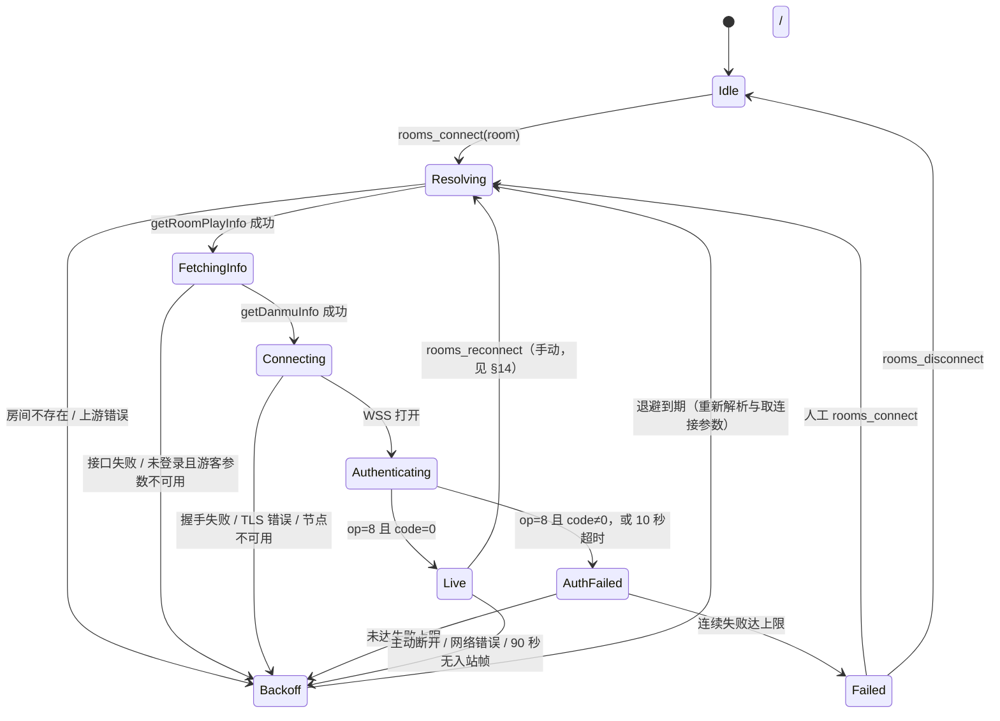

# B 站直播弹幕协议规格（danmubox）

> 定位：`danmubox-bili` 协议层（proto / ws）的实现依据，规定与 B 站直播弹幕长连接交互的二进制帧格式、认证与双心跳、业务命令归一化、发送侧被吞判定、重连状态机与风控边界。
> 读者：协议层与适配器实现者；排查「连不上 / 收不到弹幕 / 字段为空 / 频繁重连 / 发弹幕被吞」的维护者；需要理解消息来源与语义的 AI agent 使用者。
> 更新时机：头部布局、`op` / `protover` 语义、认证包或心跳包体、HTTP 心跳地址、`cmd` 与 `kind` 映射、发送判定规则、重连与节流参数发生任何变化时；附录 A 任一「待实测校准」项完成核对并回填结论后。

相关文档：[`contract.md`](contract.md)（唯一事实源：共享常量、领域模型、端口、IPC、偏好键）、[`auth.md`](auth.md)（登录、`buvid3`、WBI 签名、`getDanmuInfo`、扫码）、[`architecture.md`](architecture.md)（每房间 supervisor 与事件总线）、[`ipc.md`](ipc.md)（Tauri 命令与事件）、[`ui.md`](ui.md)（渲染、过滤、合并与虚拟列表）、[`testing.md`](testing.md)（帧 fixture 与回放测试）、[`REQUIREMENTS.md`](../REQUIREMENTS.md)（需求基线）。

---

## 1. 范围与术语

### 1.1 范围

| 纳入 | 不纳入 |
|---|---|
| 房间解析、WS 长连、认证、WS 心跳、HTTP 心跳、压缩解包、命令归一化、发送侧被吞归一化、会话内内存缓冲、重连与节流 | 直播视频流解码 |
| `protover=3`（brotli）主动请求；解码侧同时兼容 0 / 1 / 2 / 3 | 弹幕回看、导出、跨会话历史与任何本地持久化（`contract.md` §4.3 明确排除） |
| macOS / Windows / Android 三端共用的协议层 | iOS 端、折叠屏布局（后期 enhancement） |

### 1.2 术语

| 术语 | 含义 |
|---|---|
| `short_id` | 用户可见的短号（可为 0，表示该房间无短号） |
| 真实 `room_id` | 协议与领域模型统一使用的房间号（`i64`，见 `contract.md` §5） |
| `getRoomPlayInfo` | 短号 / URL → 真实 `room_id` 的 REST 接口；一次返回 `room_id` / `uid`（主播 UID）/ `live_status` |
| `getDanmuInfo` | 取得弹幕 WS 连接参数（`token`、`host_list`）的 REST 接口，需 `buvid3` 与 WBI 签名 |
| `token` | 认证包 `key` 字段的值；由服务端签发 |
| `host_list` | 弹幕 WS 候选节点列表，含主机名与端口 |
| `buvid3` | 匿名设备标识 Cookie，`getDanmuInfo` 的前置条件 |
| WBI 签名 | `getDanmuInfo` 请求所需的查询串签名，实现见 [`auth.md`](auth.md) |
| `cmd` | `op=5` 业务载荷中的命令名 |
| `kind` | 归一化后的六种消息类型之一（见 §10.0） |
| supervisor | 每房间一个的连接管理 task（见 [`architecture.md`](architecture.md)） |

---

## 2. 端到端连接时序

完整顺序：房间解析 → `getDanmuInfo` → WSS 握手 → `op=7` 认证 → `op=8` 且 `code=0` 后启动 WS / HTTP 心跳 → `op=5` 分发；任一步失败按 §13 退避重连。

### 2.1 连接前置步骤

| 步 | 输入 | 调用 | 产出 | 失败处理 |
|---|---|---|---|---|
| 1 | 用户输入的短号 / URL / 房间号 | 本地解析（提取数字路径段） | 候选 `short_id` 或 `room_id` | 无法解析 → `BAD_REQUEST` |
| 2 | 候选号 | `GET getRoomPlayInfo` | 真实 `room_id`、主播 `uid`、`live_status` | 房间不存在 → `ROOM_NOT_FOUND` |
| 3 | 真实 `room_id` | `GET getDanmuInfo`（需 `buvid3` + WBI） | `token`、`host_list` | 未登录可走游客参数；接口失败 → `UPSTREAM_ERROR` |
| 4 | `host_list` | 按顺序选取节点 | `wss://{host}/sub` | 全部节点失败 → `UPSTREAM_ERROR` |

> 主播 UID 由步骤 2 得到，用于派生主播徽标（`uid == Room.anchor_uid`），协议层不再单独请求。

---

## 3. 帧格式：16 字节大端头

### 3.1 包结构

所有 WS 帧（双向）均为「固定 16 字节头 + body」，整数一律**大端（network order）**。

| 偏移 | 长度 | 字段 | 类型 | 含义 |
|---|---|---|---|---|
| 0 | 4 | `packetLen` | u32 BE | 本包总字节数（含头），即 `headerLen + body.len()` |
| 4 | 2 | `headerLen` | u16 BE | 头长度，固定 `16` |
| 6 | 2 | `protover` | u16 BE | 载荷编码版本，见 §6 |
| 8 | 4 | `op` | u32 BE | 操作码，见 §5 |
| 12 | 4 | `seq` | u32 BE | 序列号；本地发送使用 `1`，接收值仅记日志、不参与解析 |
| 16 | — | `body` | bytes | 长度为 `packetLen - headerLen` |

### 3.2 解析护栏（本地实现约束）

以下均为本地护栏，不是上游承诺；数值变更只影响本地实现。

| 约束 | 取值 | 违反时的处理 |
|---|---|---|
| `headerLen` | 必须等于 `16` | 丢弃本包并计数 + `warn`；不拆分剩余字节 |
| `packetLen` 下限 | `>= headerLen` | 同上 |
| `packetLen` 上限 | `<= 剩余缓冲区长度` | 视为截断包，丢弃剩余全部字节 + `warn` |
| 单帧 `packetLen` 硬上限 | 16 MiB | 断开并进入重连流程，计入「异常帧」计数 |
| 解压后单包上限 | 16 MiB（`contract.md` §4 规范性） | 丢弃该子包 + `warn`（解压炸弹护栏） |
| 递归深度上限 | 4 层 | 丢弃该子包 + `warn` |
| 尾部残留 | `< 16` 字节 | `warn` 并忽略，不影响本次连接 |

---

## 4. 包头字段逐项说明

| 字段 | 说明 |
|---|---|
| `packetLen` | 唯一权威的长度来源；先读头再按长度切片，禁止依赖 WS 帧边界推断包边界 |
| body | 可能为空（如认证回应之外的保活帧），空 body 直接跳过，不视为错误 |

> `op`（§5）决定 body 的**用途与分发路径**，`protover`（§6）决定 body 的**编码与解码器**，两者互不混用；认证包与心跳包的**帧头** `protover` 固定为 `1`，认证包 **body 内**的 `protover` 字段固定为 `3`（同名不同物）。

---

## 5. `op` 语义表

| `op` | 名称 | 方向 | body 形态 | 处理 |
|---|---|---|---|---|
| `2` | 心跳 | 客户端 → 服务端 | 字面量字符串 `[object Object]` | 首包 60 秒内发出，收到 `op=3` 后重置为每 30 秒一次，见 §8.1 |
| `3` | 心跳回应 / 人气值 | 服务端 → 客户端 | 4 字节大端无符号整数（人气值） | 解析为整数，计数 + `debug` 日志，并作为「连接存活」信号重置 WS 心跳周期 |
| `5` | 业务消息 | 服务端 → 客户端 | 压缩子包拼接或 JSON（见 §6、§9） | 解包 → `cmd` 分发 → 归一化 → 广播 / 入会话缓冲 |
| `7` | 认证 | 客户端 → 服务端 | JSON 对象（见 §7） | 连接建立后立即发送一次 |
| `8` | 认证回应 | 服务端 → 客户端 | JSON 对象，含 `code` 字段 | `code=0` 视为成功；非 0 一律按认证失败处理（见 §13.3） |

> 未知 `op` 不得猜测语义：记 `warn`（含 `op` 原值、`packetLen`、`protover`）后丢弃该包。

---

## 6. `protover` 表与压缩协商

| `protover` | 编码 | 本期行为 |
|---|---|---|
| `0` | 明文 JSON（无压缩） | 直接按 UTF-8 JSON 解析 |
| `1` | 认证与心跳包的帧头版本 | 用于 `op=7` / `op=2` 的**帧头**；若出现在业务子包中，按整数 body 兼容处理，仅计数与日志 |
| `2` | zlib（deflate 容器） | 解码兼容路径；解压后可能仍是子包拼接（见 §9） |
| `3` | brotli | **本期认证包请求的编码**，默认路径；解压失败按 §9.3 处理 |

| 协商项 | 值 | 依据 |
|---|---|---|
| 认证包请求的 `protover` | `3` | `contract.md` §4 规范性常量 |
| 解码需兼容的取值 | `0` / `1` / `2` / `3` | `contract.md` §4 规范性常量 |
| 解压失败 | 丢弃该子包 + 计数，**不**断开连接 | 单包损坏不应升级为连接故障 |

> 解码实现必须同时具备 brotli 与 zlib 两条路径：认证协商为 3，但**子包**的 `protover` 可能为 0 / 1 / 2 / 3 中任意值（上游节点与滚动升级会造成混用），一律按子包自身取值分派。

---

## 7. 认证包（`op=7`）

### 7.1 body 精确格式

帧头 `protover=1`；body 为 JSON 对象（明文）：

| 字段 | 类型 | 说明 |
|---|---|---|
| `uid` | number | 登录态为当前用户 UID；游客为 `0` |
| `roomid` | number | **真实** `room_id`（不是短号） |
| `protover` | number | 固定 `3` |
| `buvid` | string | `buvid3` 的值；游客模式亦需携带 |
| `platform` | string | 固定 `"web"` |
| `type` | number | 固定 `2` |
| `key` | string | `getDanmuInfo` 返回的 `token`；游客为 `""` |

示例（游客态，字段顺序不敏感）：

```json
{ "uid": 0, "roomid": 123456, "protover": 3, "buvid": "设备标识值", "platform": "web", "type": 2, "key": "" }
```

### 7.2 游客与登录形态

| 形态 | `uid` | `key` | 能力差异 |
|---|---|---|---|
| 游客 | `0` | `""` | 可收大部分弹幕 / 礼物 / SC；昵称可能掩码、UID 归一化为 `0` |
| 登录 | 真实 UID | `getDanmuInfo` 返回的 `token` | 完整字段、发送弹幕、粉丝牌信息完整 |

### 7.3 发送规则

| 发送规则 | 约定 |
|---|---|
| 发送时机 | WSS 打开后立即发送，不得等到收到首帧再发 |
| 发送次数 | 每条连接一次；重连后重新发送 |
| 认证超时 | 发送后 10 秒内未收到 `op=8` → 视为失败，走退避重连 |
| 重连后 | 必须重新调用 `getDanmuInfo` 取新 `token`，不复用旧 `token` |
| 日志 | `key` 一律以固定掩码输出，禁止写入原值 |

---

## 8. 心跳

danmubox 必须同时维持**两个**心跳：WS 心跳（`op=2`，保活 WS）与 HTTP 心跳（`webHeartBeat`，保活上游会话）。**只做其中一个会在一段时间后被上游断开**，这是实践中最常见的「连上了但几分钟后掉线」原因。

### 8.1 WS 心跳（`op=2`）

| 项 | 值 |
|---|---|
| body 形态 | 字面量字符串 `[object Object]`（15 字节 ASCII，不是 JSON 对象，也不是空 JSON） |
| 帧头 `protover` | `1`（body 不压缩） |
| `op` | `2` |
| `seq` | `1` |
| 首包时机 | 认证成功（`op=8` 且 `code=0`）后 **60 秒内必须发出** |
| 周期 | 常规 30 秒；**收到 `op=3` 回应后重置为 30 秒**计时 |
| 兼容 | 空 body 亦被上游接受，但**以 `[object Object]` 为规范实现** |
| 重连后 | 旧定时器必须取消，重新以认证成功为起点计时 |

```text
[object Object]
```

| 规则 | 说明 |
|---|---|
| 心跳不携带房间信息 | 房间由认证包确定，心跳仅保活 |
| 不在重连窗口补发 | 断线期间错过的节拍作废，不与新连接的首次心跳合并 |
| 僵死判定 | 连续 3 个心跳周期（90 秒）内未收到任何入站帧（`op=3` / `op=5` / `op=8`）→ 判定连接僵死，主动断开并重连 |
| 心跳失败不重试 | 发送失败等价于连接故障，直接进入退避流程，不重复 `op=2` |

### 8.2 HTTP 心跳（`webHeartBeat`）

| 项 | 值 |
|---|---|
| 方法 / 地址 | `GET https://live-trace.bilibili.com/xlive/rdata-interface/v1/heartbeat/webHeartBeat` |
| 参数 | `pf=web`，`hb=<base64("60|<真实room_id>|1|0")>` |
| 周期 | 每 60 秒一次 |
| 起点 | 认证成功后启动，与 WS 心跳各自独立计时 |
| 失败 | **传输层**失败立即重试一次；仍失败则计入「HTTP 心跳失败」计数并告警，下一节拍继续尝试；**不因此主动断开 WS**，但连续失败意味着连接可能被上游判死，应在计数达阈值时提示 |

`hb` 的构造（规范性）：

```text
hb = base64("60|" + 真实room_id + "|1|0")
```

| 参数段 | 含义 |
|---|---|
| `60` | 报活间隔秒数（与 60 秒周期一致） |
| 真实 `room_id` | 真实房间号（不是短号） |
| `1` | 固定值 |
| `0` | 固定值 |

#### 实测注意事项（2026-09-11）

20 分钟真实长连中观测到该端点出现**传输层**失败（`error sending request`），而同机 `curl` 连续 5 次均 200 且响应体为
`{"code":0,…,"data":{"next_interval":60}}`。差异在于连接复用：心跳间隔 60 秒大于上游空闲连接的存活时间，
被回收的连接留在池子里复用即失败。已验证的结论与对应实现约束：

| 约束 | 原因 |
|---|---|
| HTTP 客户端的**池内空闲上限必须小于心跳间隔**（当前 30s < 60s） | 让每次心跳都新建连接，避开已死连接 |
| 传输层失败**重试一次** | 覆盖 DNS / 网络抖动等一次性故障 |
| 失败必须**计数并告警** | 这是「连接是否可能被判死」的唯一可观察信号（`CounterSnapshot.heartbeat_failures`） |

失败计数纳入 `CounterSnapshot`，在 CLI 汇总与 `app_info` 中可见。

---

## 9. `op=5` 处理流程与子包递归拆分

### 9.1 处理流程

1. 取 `op=5` 帧 body。
2. 按帧 `protover` 处理：`3` → brotli 解压；`2` → zlib 解压；`0` → 直接进入 JSON 解析；`1` → 按整数 body 兼容处理。解压结果为下一轮输入（可能仍是子包拼接）。
3. 按 16 字节头循环消费缓冲区，逐个切出子包。
4. 对每个子包按**其自身** `protover` 处理，规则同步骤 2（子包编码可能与父帧不同）。
5. 解析出的 JSON 若是单体对象，直接作为一条命令；若是数组，逐元素展开为多条命令。
6. 按 `cmd` 查 §10.0 映射表得到 `kind`；未知 `cmd` → `debug` 日志 + 丢弃并计数（不广播、不入缓冲）。
7. 命中映射 → 归一化为 `Message`（见 §10）→ 广播到 `core::bus` 并写入当前会话缓冲。

### 9.2 拆分伪代码

```text
fn handle_business(payload: &[u8], depth: usize) -> Vec<RawCmd>:
    if depth > 4: warn("nesting depth exceeded"); return []      // 递归深度护栏
    let (out, buf) = ([], payload)
    while buf.len() >= 16:
        (packet_len, header_len, protover) = be_u32(buf[0..4]), be_u16(buf[4..6]), be_u16(buf[6..8])
        if header_len != 16 or packet_len < header_len or packet_len > buf.len():
            warn("bad or truncated packet"); break               // 丢弃剩余字节，不断连
        body, buf = buf[header_len..packet_len], buf[packet_len..]
        match protover:
            3 => out.extend(inflate_and_recurse(brotli, body, depth))   // 失败 / 超 16 MiB → warn + 计数 + 跳过该子包
            2 => out.extend(inflate_and_recurse(zlib, body, depth))     // 同上
            0 => out.extend(parse_json_cmds(body))                      // 对象或数组 → 展开
            1 => count_int_body()                                       // 兼容路径：仅计数与日志
            _ => { warn("unsupported protover"); drop_and_count() }
    if buf.len() != 0: warn("trailing bytes ignored", buf.len())
    return out
```

### 9.3 解析健壮性清单

| 场景 | 处理 |
|---|---|
| brotli / zlib 解压抛错 | 丢弃该子包，按编码计入 `bad_brotli` / `bad_zlib`，连接继续 |
| 解压后为空 | 跳过，不计错 |
| JSON 解析失败 | 丢弃该命令，计入 `malformed` + `debug` 日志（含原始字节长度，不含敏感字段） |
| 同一帧内混合 `protover` 子包 | 按子包自身 `protover` 分别处理，不做统一假设 |
| `op=5` 帧 body 为明文单命令 | 等价于单子包路径，走同一函数 |

---

## 10. 命令目录

### 10.0 `cmd` → `kind` 映射（规范性）

**产生 `Message` 的命令**：

| `cmd` | `kind` |
|---|---|
| `DANMU_MSG` | `danmaku` |
| `SEND_GIFT` | `gift` |
| `SEND_GIFT_V2` | `gift`（载荷是 protobuf，见 §10.2） |
| `SUPER_CHAT_MESSAGE` / `SUPER_CHAT_MESSAGE_JP` | `superchat` |
| `INTERACT_WORD` / `INTERACT_WORD_V2` / `ENTRY_EFFECT` | `interact` |
| `GUARD_BUY` / `USER_TOAST_MSG` | `guard` |
| `LIVE` / `PREPARING` / `ROOM_CHANGE` / `CUT_OFF` / `NOTICE_MSG` | `system` |

**计数类命令：不产生 `Message`**，只更新房间内存计数并计入 `counter_updates`（逐条策略见 §10.7）：

`POPULARITY_CHANGE`、`ROOM_REAL_TIME_MESSAGE_UPDATE`、`WATCHED_CHANGE`、`LIKE_INFO_V3_CLICK`、`LIKE_INFO_V3_UPDATE`、`ONLINE_RANK_V2`

**已知但直接丢弃的命令**：`STOP_LIVE_ROOM_LIST`（全站停播列表，与当前房间无关）、`HOT_ROOM_NOTIFY`（客户端刷新提示）、`DANMU_MSG_MIRROR`（非本房间镜像弹幕，计入 `mirrored_dropped`）。

其余所有 `cmd` 一律不产生 `Message`：记录 `debug` 日志（命令名 + `room_id`）并计入 `unknown_cmd`。`kind` 取值集合恒为六种，新增 `cmd` 不得新增 `kind`。

> **实测记录（2026-09-11）**：以游客态连接一个在线约 20 万的在播房间（房间号不写入仓库，见 `AGENT.md` §8）抓取 35 秒，实际出现 29 条业务载荷，全部落在上表：`DANMU_MSG`、`INTERACT_WORD_V2`、`ENTRY_EFFECT`、`WATCHED_CHANGE`、`LIKE_INFO_V3_UPDATE`、`LIKE_INFO_V3_CLICK`、`ROOM_REAL_TIME_MESSAGE_UPDATE`、`POPULARITY_CHANGE`、`ONLINE_RANK_COUNT`、`ONLINE_RANK_V3`、`RANK_CHANGED_V2`、`PK_INFO`、`WIDGET_BANNER`、`UNIVERSAL_EVENT_GIFT`、`UNIVERSAL_EVENT_GIFT_V2`、`SEND_GIFT_V2`、`HOT_ROOM_NOTIFY`、`STOP_LIVE_ROOM_LIST`。
> 其中 `RANK_CHANGED_V2` / `PK_INFO` / `WIDGET_BANNER` / `UNIVERSAL_EVENT_GIFT(_V2)` **尚无载荷样本**，不得凭命名猜测语义（见附录 A22）。
>
> **2026-09-12 更正**：上一条把 `ONLINE_RANK_COUNT` / `ONLINE_RANK_V3` / `SEND_GIFT_V2` 也列成了未归类，但三者早已归位——`SEND_GIFT_V2` 走 V2 礼物管线（§10.2）；`ONLINE_RANK_COUNT` 在计数类里（`data` 的 `count` / `online_count`，与 `POPULARITY_CHANGE` 同口径，见 A23）；`ONLINE_RANK_V3` 载荷只有 `data.pb`（protobuf 高能榜），归入「已知且无关」。它们若仍计入 `unknown_cmd`，那个计数器就失去意义了。

### 10.1 `DANMU_MSG`（`kind=danmaku`）

语义：普通聊天弹幕，含文本、发送者、颜色、粉丝牌与勋章信息。

| 归一化字段 | 来源（已实测） | 说明 | 校准状态 |
|---|---|---|---|
| `content` | `info[1]` | 弹幕文本原文 | 已实测 |
| `uid` | `info[0][15].user.uid` | 明文用户对象 | 已实测 |
| `uname` | `info[0][15].user.base.name` | 明文用户对象昵称 | 已实测 |
| `color` | `info[0][3]` | 十进制 RGB 整数；缺失 → `0` | 已实测（样本 `16777215`） |
| `medal_level` | `info[0][15].user.medal.level` | 无粉丝牌 → `0` | 已实测（样本 `24`） |
| `medal_name` | `info[0][15].user.medal.name` | 无粉丝牌 → `""` | 已实测 |
| `guard_level` | `info[0][15].user.guard.level`，缺失时回落 `…user.medal.guard_level` | `0` 无 / `1` 总督 / `2` 提督 / `3` 舰长 | **仅观测到 0**（缺舰长样本，A12） |
| `is_admin` | `info[2][2] == 1` | 经典槽位 | **未确认**：仅观测到 `0`，缺房管正向样本（A5） |
| `upstream_id` | `info[0][15].extra` 是 JSON 字符串，取其中的 `id_str` | 举报弹幕所需 | 已实测（样本为 36 位十六进制串） |
| `ts` | `info[0][4]`（毫秒） | 秒级备选在 `info[0][5]` | 已实测 |
| `room_id` | 连接上下文 | 取真实 `room_id`，不信任载荷内房间字段 | 已确定（契约） |
| `amount` | — | 弹幕恒为 `0` | 已确定（契约） |
| `emote_url` | `info[0][13].url`（**是对象时才有**） | 表情弹幕的图片地址；非表情弹幕该槽位是字符串 `"{}"`。上游混用 `http://` 与 `https://`，统一升为 https（`asset.rs`）；**图片 CDN 还有防盗链**：来源不是 bilibili 时一律 403（本地页面的 `Referer` 同样被拒），浏览器随即以 ORB 拦掉这个「不像图片的响应」，最终只显示一个问号——因此页面必须声明 `<meta name="referrer" content="no-referrer">`（实测不带 Referer 放行） | 已实测（某个在播房间（房间号不写入仓库），样例 `official_345`） |

```json
{ "cmd": "DANMU_MSG",
  "info": [
    [0, 1, 25, "<color>", "<ts_ms>", "<ts_sec>", …],
    "<content>",
    ["<uid>", "<uname>", …],
    ["<medal_level>", "<medal_name>", …],
    …,
    { "extra": "{\"id_str\":\"…\"}", "user": { "uid": …, "base": { "name": …, "face": … }, "medal": { "level": …, "name": …, "guard_level": … }, "guard": { "level": … } } }
  ] }
```

> 上表的取值路径均于 **2026-09-11** 在一个真实在播房间（游客态；房间号不写入仓库）用 `DANMUBOX_LOG=debug` 抓取的载荷逐项比对确认，不再是推测。
> `is_admin` 与 `guard_level` 的非零分支仍缺正向样本，实现必须按零值容错，不得据推测判真。

噪声过滤建议：

- 空文本或纯空白弹幕不进入会话缓冲，但计入「已收弹幕」计数。
- 屏蔽词 / 关键词过滤属于 UI 层规则（见 [`ui.md`](ui.md)），协议层不丢弃原文。

#### 10.1.x 表情：两条按官方前端产物核对的事实（2026-09-12）

> 这两条**不是实测流量**得出的，而是从官方直播间前端产物（`blfe-live-room` 的 chunk）里读出来的，
> 标注为「按官方实现核对，未用真实样本复现」。

1. **表情信息的槽位与字段名与官方一致**。官方在解析弹幕时用的正是同一个槽位，并把它归一化成
   `emoticonOptions: { bulgeDisplay, emoticonUnique, inPlayerArea, isDynamic, height, width, url }`——
   与本实现 `EmoteRef` 的字段一一对应（`info[0][13]`）。官方另有一路兜底：载荷里若带 `emoticons` 映射，
   则按弹幕正文 `emoticons[content]` 取表情。本实现只走 `info[0][13]`，实测未见过后者。
2. **`emoticon_id` 的算法**：官方对 `emoticon_unique` 按 `_` 切分取**最后一段**作为 `emoticon_id`
   （`(""+unique).split("_").pop()`）。本实现不需要它（发送时 `msg` 传的是 `emoticon_unique` 本身），
   记录在此以免将来重复推导。

### 10.2 `SEND_GIFT`（`kind=gift`）

语义：礼物投放（含批量 / 连击）。

| 归一化字段 | 来源（语义槽位） | 说明 | 校准状态 |
|---|---|---|---|
| `content` | 礼物名称 + 数量的组合描述 | 面向展示的说明文本 | 待实测校准（A8） |
| `uid` / `uname` | 送礼用户槽位 | 与 `DANMU_MSG` 用户信息结构不一定同形 | 待实测校准（A8） |
| `amount` | 价格槽位（单价 × 数量，单位为金瓜子） | 无价字段时 `0`，不得猜测 | 待实测校准（A8） |
| 连击标识 | 礼物标识 + 连击数的字段组合 | 供会话内连击聚合（见 §12.3） | 待实测校准（A8） |
| `medal_level` / `medal_name` / `guard_level` | 送礼用户粉丝牌槽位 | 无则 `0` / `""` / `0` | 待实测校准（A4） |
| `ts` | 载荷时间戳槽位 | 归一化为 UTC 毫秒 | 待实测校准（A7） |

噪声过滤建议：

- 单次数量为 0 或礼物标识缺失的载荷视为无效，丢弃并计数。
- 「免费礼物 / 活动礼物」不做特殊丢弃，价格缺失时 `amount=0` 并保留。

#### `SEND_GIFT_V2`（V2 礼物管线）

有些直播间**只发这个命令**（实测一次 55 秒采样里出现 24 次，同期没有 `SEND_GIFT`），
不接它等于完全看不到礼物。载荷是 base64 的 **protobuf**（`data.pb`），
JSON 里只有 `{dmscore, pb}`。

字段名与 tag **抄自官方前端产物里生成好的 proto 代码**（包名 `bilibili.live.gift.v1`，
`t.GiftItem=function(){…}` 的声明顺序即 tag 顺序）：

| tag | 字段 | 用途 |
|---|---|---|
| 1 | `gift_id` | 礼物 id（如 `31164` = 粉丝团灯牌） |
| 2 | `gift_name` | 礼物名 |
| 3 | `num` | 数量 |
| 5 / 6 | `price` / `discount_price` | 原价 / 折后价（金瓜子） |
| 7 | `total_coin` | 本次总瓜子数，**金额优先用它** |
| 8 | `coin_type` | `gold`（电池体系）/ 银瓜子等 |
| 9 | `tid` | 订单号，作为 `Message.upstream_id` |
| 10 | `timestamp` | 秒级时间戳 |
| 12 | `batch_combo_id` | 连击标识（`batch:gift:combo_id:…`），供会话内聚合 |
| 18 | `action` | 动作词，样本为「投喂」 |

顶层的 `uid` / `uname` / `face` / 粉丝牌 / 接收者按真实样本取值核对（顶层另有一个
`sender_uinfo` 嵌套用户信息，tag 未知，本实现不用）。

> **教训（2026-09-12）**：这份 schema 起初是"按取值反推"的，把 `num` 猜成了 tag 11、
> 连击标识命名成 `combo_id`。对照官方生成代码后发现两处都错——**能拿到官方产物就别猜**。

### 10.3 `SUPER_CHAT_MESSAGE` / `SUPER_CHAT_MESSAGE_JP`（`kind=superchat`）

语义：醒目留言（SC）及其日文版命令变体。

| 归一化字段 | 来源（**已实测**） | 说明 |
|---|---|---|
| `content` | `data.message` | 留言正文 |
| `amount` | `data.price` | **单位是元**（样本 `30`，正是 B 站 SC 的最低档）|
| `uid` / `uname` | `data.uid`；`data.uinfo.base.name`，回落 `data.user_info.uname` | 昵称两处同名，实测一致 |
| `upstream_id` | `data.id` | SC 标识（样本为数字 `18968196`），举报与去重都用得上 |
| `ts` | `data.ts`，回落 `data.start_time` | **秒级**，×1000 归一化为毫秒 |
| `medal_level` / `medal_name` | `data.medal_info.medal_level` / `.medal_name` | 样本 `10` / `粉丝团` |
| `guard_level` | `data.user_info.guard_level`，回落 `medal_info.guard_level` | 样本两者都在 |
| `is_admin` | `data.user_info.manager` | 房管标记（样本 `0`）|

**换算**：同一载荷还带 `data.rate = 1000`，即 1 元 = 1000 金瓜子——礼物金额（金瓜子）
与 SC 金额（元）因此**不同口径**，`contract.md` §5 对此的措辞是「礼物金瓜子或 SC 金额」。

**其他可用字段**（本实现暂不用）：`time`（SC 持续秒数，样本 `60`）、`start_time` / `end_time`、
`message_font_color` / `background_*`（官方客户端用于 SC 配色）、`token`。

噪声过滤建议：

- 变体命令 `_JP` 与主命令语义等价，归一化到同一 `kind`，不做双份展示。

### 10.4 `INTERACT_WORD` / `INTERACT_WORD_V2` / `ENTRY_EFFECT`（`kind=interact`）

语义：进入直播间、关注、分享等互动提示，以及高价值用户进场特效。

| 归一化字段 | 来源（语义槽位） | 说明 | 校准状态 |
|---|---|---|---|
| `content` | 互动类型的描述文本 | 由 `msg_type`（或等价枚举）映射为中文描述 | 待实测校准（A10） |
| `uid` / `uname` | 触发用户槽位 | `INTERACT_WORD_V2` 需经 protobuf 解码后再取 | 待实测校准（A10、A11） |
| `medal_level` / `medal_name` / `guard_level` | 触发用户粉丝牌槽位 | 无则零值 | 待实测校准（A4） |
| `ts` | 载荷时间戳槽位 | 归一化为 UTC 毫秒 | 待实测校准（A7） |

#### `INTERACT_WORD_V2` 的 protobuf 载荷

`INTERACT_WORD_V2` 与 V1 不同：其载荷**不是 JSON，而是 protobuf**，且位于业务包 JSON 的 **`data.pb`** 字段（base64 字符串），不是 `data` 本身。解码顺序：取 `data.pb` → base64 解码 → protobuf 解析。

> **易错点（已实测踩过）**：若误把 `data`（对象）当成 base64 字符串，会得到空字节，而空字节在 protobuf 里是合法的「全默认值消息」，于是静默产出一条 `uid=0` 的假消息。实现必须先断言载荷非空，再解码。

字段表（tag 号于 **2026-09-11** 由实测样本逐字段比对确认，房间号不写入仓库）：

| tag | 字段 | 类型 | 含义 | 归一化去向 |
|---|---|---|---|---|
| 1 | `uid` | varint | 触发用户 UID | `Message.uid` |
| 2 | `uname` | string | 触发用户昵称 | `Message.uname` |
| 5 | `msg_type` | varint | 互动类型（进入 / 关注 / 分享等） | 映射为 `Message.content` 文案（映射表待实测，A10） |
| 6 | `roomid` | varint | 房间号；仍以连接上下文为准 | 仅日志/校验 |
| 7 | `timestamp` | varint（64 位） | 秒级时间戳 | `Message.ts` 备选 |
| 8 | `timestamp_millisecond` | varint（64 位） | 毫秒级时间戳 | `Message.ts` 首选 |
| 22 | `user_info` | message | `{1: uid, 2: {1: uname, 2: face}, 3: medal_info{1: name, 2: level}}` | `uname` / 粉丝牌回落来源 |

**不要声明的字段**：样本中还存在 tag `4` / `12` / `15` / `19` / `23` / `24`，其语义未确认（tag 24 携带 `{varint, "通过热门榜", "#F6F7F8"}` 形态的附加信息）。protobuf 解码器会跳过未声明的 tag，因此**少声明比声明错更安全**：字段号或类型写错会导致整条消息解码失败。社区流传的 schema 已发现三处错误，切勿照抄：

| 被纠正项 | 社区写法 | 实测结论 |
|---|---|---|
| `timestamp_millisecond` | `uint32` | 毫秒值必然溢出 32 位 → 声明为 64 位 varint |
| tag 15 | `int32` | 实际是 64 位 varint（样本 `1789134578184130843`） |
| `activity_message` | tag 23 | 样本中 tag 23 为空、tag 24 才是带文本的附加消息；本期两者都不声明 |

处理约束：

- 载荷缺失、base64 非法、或解码出空字节 → 丢弃该命令，计入 `malformed`，连接继续。
- 未知 `msg_type` 一律使用「互动」+ 原始枚举数值，禁止臆造语义（见 §15.2）。
- V1（`INTERACT_WORD`，JSON）与 V2（protobuf）归一化到同一 `kind`，共用 `Message` 结构。

#### `ENTRY_EFFECT`（JSON）

`ENTRY_EFFECT` 是普通 JSON，不是 protobuf。实测（2026-09-11）：

| 归一化字段 | 来源 | 说明 |
|---|---|---|
| `uid` | `data.uid` | 触发用户 |
| `uname` | `data.uinfo.base.name` | **没有 `data.uname`**，必须走 `uinfo` |
| `content` | 留空 | 展示文案由 UI 生成（如 `data.copy_writing` 中的 `<%昵称%> 来了`） |

噪声过滤建议：

- 大批量进入会形成洪峰：UI 侧按类型合并与限流（见 [`ui.md`](ui.md)），协议层不丢弃（会话缓冲仍有价值）。
- `ENTRY_EFFECT` 仅对高价值用户触发，属于低频事件；与 `INTERACT_WORD` 不重复计数。

### 10.5 `DANMU_MSG_MIRROR`（非本房间镜像弹幕，默认丢弃）

语义：`DANMU_MSG_MIRROR` 是**非本房间的镜像弹幕**（上游为跨房间热度/联动推送的内容），不属于当前所观看的直播间。

| 项 | 约定 |
|---|---|
| 默认行为 | **丢弃**，不广播、不入会话缓冲 |
| 计数 | 计入 `mirror_dropped` 计数，供观测（见 §17.2） |
| 日志 | `debug` 级别记录 `room_id` 与来源房间标识（若有），不记录敏感字段 |
| 可配置性 | 本期不提供开关；将来若需要展示镜像弹幕，须先改 `contract.md` 再实现 |

### 10.6 `GUARD_BUY` / `USER_TOAST_MSG`（`kind=guard`）

语义：舰长 / 提督 / 总督的购买与开通播报。

| 归一化字段 | 来源（语义槽位） | 说明 | 校准状态 |
|---|---|---|---|
| `content` | 开通播报文本槽位 | 面向展示的描述 | 待实测校准（A13） |
| `guard_level` | 守护等级槽位 | `1` 总督 / `2` 提督 / `3` 舰长 | 待实测校准（A12） |
| `uid` / `uname` | 购买用户槽位 | `USER_TOAST_MSG` 可能只带昵称 | 待实测校准（A13） |
| `amount` | 价格 / 数量槽位（金瓜子） | 无法确证时 `0`，不得推算 | 待实测校准（A12） |
| `ts` | 载荷时间戳槽位 | 归一化为 UTC 毫秒 | 待实测校准（A7） |

噪声过滤建议：

- 同一笔购买可能同时触发 `GUARD_BUY` 与 `USER_TOAST_MSG`：在会话缓冲写入前按时间窗合并，避免双条播报（见 §12.3）。
- 续费 / 自动续费与首购不做区分，统一落 `guard`。

### 10.7 系统类命令（`kind=system`）

全部系统类命令共用归一化策略：`uid=0`、`uname=""`、`color=0`、`medal_level=0`、`medal_name=""`、`guard_level=0`、`amount=0`；`content` 为对事件的简短中文描述；`ts` 取收到时刻（载荷无时间戳时）或载荷时间戳（有且可解析时）。

| `cmd` | 语义 | `content` 来源 | 缓冲策略 |
|---|---|---|---|
| `LIVE` | 开播 | 固定文案 + 房间标题（若载荷携带） | 与 `PREPARING` 状态互斥，按最新状态覆盖，不逐条展示 |
| `PREPARING` | 下播 / 准备中 | 固定文案 | 同上；连续重复仅计一次状态变更 |
| `ROOM_CHANGE` | 房间信息变更（标题 / 分区 / 封面） | 变更后的标题或分区名 | 仅当房间内存态字段确实变化时写入并广播 |
| `CUT_OFF` | 直播间被切断 | 固定文案 | 写入缓冲；触发 UI 断流提示 |
| `POPULARITY_CHANGE` | 人气值变化 | 人气数值 | **高频**：只更新房间内存计数，**不写入会话缓冲**。这是人气值的主要来源；`op=3` 心跳回应携带同一口径的值 |
| `LIKE_INFO_V3_UPDATE` | 点赞计数更新 | 点赞计数描述 | 同 `LIKE_INFO_V3_CLICK`：只更新计数 |
| `ROOM_REAL_TIME_MESSAGE_UPDATE` | 关注数 / 粉丝数等实时计数更新 | 计数描述 | **高频**：仅更新房间内存计数，**不写入会话缓冲** |
| `WATCHED_CHANGE` | 看过人数变化 | 计数描述 | 同上：只更新计数，不入缓冲 |
| `LIKE_INFO_V3_CLICK` | 点赞信息更新 | 点赞计数描述 | 同上；高频时按时间窗节流广播 |
| `ONLINE_RANK_V2` | 高能榜 / 在线榜更新 | 榜单摘要 | 只更新内存态并驱动 UI 侧栏，不入缓冲 |
| `NOTICE_MSG` | 平台公告 / 房间公告 | 公告文本 | 去重后写入缓冲；与 `LIVE` / `PREPARING` 同房间同秒时合并展示 |
| `STOP_LIVE_ROOM_LIST` | 停播房间列表（全站广播） | 固定文案 + 房间数 | 与当前订阅房间无关的条目直接丢弃 |
| `HOT_ROOM_NOTIFY` | 客户端刷新提示（阈值 / 延迟策略） | — | 无用户可见内容，直接丢弃；不计入 `unknown_cmd` |

### 10.8 未知 `cmd` 与载荷形态异常

| 情况 | 处理 |
|---|---|
| `cmd` 不在 §10.0 表内 | `debug` 日志（命令名、`room_id`）+ 丢弃；计入 `unknown_cmd` 计数 |
| 载荷缺少 `cmd` 字段 | 同上，计入 `malformed` 计数 |
| 载荷为数组 | 逐元素展开后按各元素自身 `cmd` 处理 |
| `data` 字段形态与预期不符（可为对象或数组） | 统一按「对象包装为单元素数组」处理 |
| 归一化必填字段缺失 | 使用零值填充并 `debug` 记录缺失字段名；不丢弃整条消息（计数类除外） |

---

## 11. 发送弹幕：`msg/send` 与 `SendOutcome` 归一化

### 11.1 请求

| 项 | 值 |
|---|---|
| 方法 / 地址 | `POST https://api.live.bilibili.com/msg/send` |
| 鉴权 | 登录态 Cookie（`SESSDATA` + `bili_jct`）与 WBI 签名，见 [`auth.md`](auth.md) |
| 关键参数 | `roomid`（真实房间号）、`msg`（文本）、`color`、`mode`、`csrf`（取 `bili_jct`） |
| 前置校验 | 未登录直接拒绝；同房间最小间隔 2s；相同内容 5s 内去重（见 §15.1） |

请求形态（实现约定，**待实测复核**，见 A25）：

| 项 | 实现取值 | 说明 |
|---|---|---|
| 载体 | `application/x-www-form-urlencoded` 的 **body** | 参数放 body 而非 query |
| 附加参数 | `fontsize=25`、`rnd`、`csrf_token`（同 `csrf`）、`wts` | `csrf` 与 `csrf_token` 都取 `bili_jct` |
| 签名 | 全部参数（含 `wts`）经 WBI 签名，附 `w_rid` | 复用 `auth.md` §4 的签名实现 |
| 默认值 | `color` 缺省 `16777215`（白）、`mode` 缺省 `1` | 越界取值的行为见 A18 |

本地节流命中时**不发请求**，直接以 `RATE_LIMITED` 返回，并且**不刷新**节流窗口（避免被拦下的尝试延后下一次合法发送）。

### 11.2 被吞判定（`msg` / `message` 字段）

上游 HTTP 返回 `code=0` 不等价于「弹幕已进入公开弹幕流」。存在被静默吞掉的情况，以响应里的 `msg` / `message` 字段判别：

| 响应字段值 | 含义 | 归一化结果 |
|---|---|---|
| `"f"` | 被**平台**风控吞掉 | `blocked_platform` |
| `"k"` | 被**直播间**（主播 / 房管）吞掉 | `blocked_room` |
| 其它正常值 | 已发出 | `ok`（除非命中下方错误码） |
| 非 0 `code` | 对应错误 | 见 §11.3 |

被吞时，**原内容会回显**在响应的 `data.mode_info.extra` 字段里，该字段是 **JSON 字符串**，解析后取其中的 `content`。据此可在 UI 上把「我发的这条被吞了」与被吞原因一起提示给用户。

```text
resp.code != 0                     → 按 §11.3 错误码归一化
resp.msg / resp.message == "f"     → blocked_platform
resp.msg / resp.message == "k"     → blocked_room
其余（code == 0 且无被吞标记）      → ok
被吞时：JSON.parse(resp.data.mode_info.extra).content 为被吞原文
```

### 11.3 归一化到 `SendOutcome`（规范性）

`SendOutcome` 取值与判定来源（`contract.md` §5）：

| 取值 | 含义 | 判定 |
|---|---|---|
| `ok` | 已发出且进入公开弹幕流 | 上游返回成功，且未命中 `"f"` / `"k"` |
| `blocked_platform` | 被平台风控吞掉 | 上游响应 `msg`/`message` == `"f"` |
| `blocked_room` | 被直播间（主播 / 房管）吞掉 | 上游响应 `msg`/`message` == `"k"` |
| `rate_limited` | 频率限制 | 上游对应错误码（具体 code 待实测，A17） |
| `medal_required` | 粉丝牌等级不足 | 上游对应错误码（具体 code 待实测，A17） |
| `muted` | 已被禁言 | 上游对应错误码（具体 code 待实测，A17） |
| `failed` | 其他失败 | 兜底，需带原始 code 与 message |

> `blocked_platform` / `blocked_room` 的判定规则来自一个可复现的社区实现；**阶段 1 必须用真实发送复核后写死**（见 A16 / A17）。在复核前，仅按上表字符判定，不得对具体 `code` 数值编造语义。

### 11.4 表情弹幕的发送载荷（照抄官方实现）

普通文本弹幕与表情弹幕走**同一个** `POST /msg/send`，区别只在字段。官方 web 客户端
（其前端产物里的表情面板发送路径）构造的载荷是：

```js
{ msg: emoticon_unique,          // ★ 传的是表情**唯一键**，不是表情名
  color, mode,
  dm_type: 1,                    // ★ 标记为表情弹幕
  emoticonOptions: {             // ★ 表情的几何与展示信息
    width, height, inPlayerArea, url, emoji, isDynamic,
    bulgeDisplay, emoticonUnique },
  bubble, reportParams }
```

| 字段 | 取值来源 |
|---|---|
| `msg` | `Emote.emoticon_unique`（如 `official_345`、`room_<房间号>_<id>`） |
| `dm_type` | 固定 `1` |
| `emoticonOptions` | 同一条表情在表情包接口里的 `width` / `height` / `in_player_area` / `url` / `emoji` / `is_dynamic` / `bulge_display` / `emoticon_unique` |

> **实测教训（2026-09-12，用户实测）**：只把表情名当普通文本发出去，上游不会渲染成表情——
> 曾据此假设「上游按内容识别表情」，被实测否定。识别依据是 `msg` 传唯一键 + `dm_type = 1`。

**已实测（2026-09-12，用户实操）**：本实现按 **JSON 字符串**把 `emoticonOptions` 放进表单，
上游接受——同一段文字走表情载荷时回声带 `info[0][13]`（表情弹幕），按普通文本发则不带，
一组对照见附录 A31。

**可发送性**：官方客户端发之前会查 `emoticonDanmakuPermCheck`——`perm === 1` 直接放行；
否则按 `identity` 给出解锁条件（`identity === 4` 时是「加入主播的粉丝团」，其余按大航海档位）。
即 `perm = 0` 的表情不是不能点，而是**未解锁**。

### 11.5 举报载荷（官方实现）

官方 web 客户端的举报请求（`dMReport/Report`）：

```js
{ reason, reason_id, roomid, msg, tuid, ts, sign, dm_type, file_id, img_url, id_str }
```

- `reason` 是**文案**，`reason_id` 由该文案在 `dMReport/ForReason` 返回的清单里反查得到；
  因此界面不该让用户手输理由，只能从清单里选（本实现已如此）。
- `ts` 与 `sign` 来自被举报弹幕的 `check_info`（`{ts, ct}`）。**该字段不在 `Message` 模型里**，
  本实现暂不上报这两项——是否必需、缺失时上游如何拒绝，均未实测（见 A27）。
- `dm_type` 取被举报弹幕的类型。

### 11.6 @ 某人与回复的载荷（官方实现）

官方 web 客户端在 `msg/send` 里额外带这组字段（字段名照抄，**含它自己的拼写 `replay_dmid`**）：

| 字段 | 含义 |
|---|---|
| `reply_mid` | 被 @ 或被回复者的 uid |
| `reply_uname` | 同上，昵称 |
| `replay_dmid` | **被回复弹幕的上游 id**（本实现取 `Message.upstream_id`）；仅 @ 时为空 |
| `reply_type` | `0` 无 / `1` 普通回复 / `2` 匹配回复（官方枚举 `NO_REPLY` / `NORMAL_REPLY` / `MATCH_REPLY`）；普通 @ 与回复实测取 `0` |
| `reply_attr` | 被回复者是否为「神秘人」 |
| `jumpfrom` / `room_type` / `statistics` | 来源与统计，本实现不发送（未实测其必要性） |

收包侧的对应信息在 `DANMU_MSG` 的 `reply` 对象（`{show_reply, reply_mid, reply_uname, reply_uname_color, reply_is_mystery}`）；
本实现的 `Message` 模型**不含**这些字段，因此「回复了谁」目前不展示。

---

## 12. 分发与内存缓冲边界

### 12.1 分发链路

`op=5` 帧 → 递归拆子包 / 解压（§9）→ JSON 解析（`INTERACT_WORD_V2` 先 protobuf 解码）→ 按 `cmd` 查 §10.0 映射表 → 归一化为 `Message` → `core::bus` 广播 + 当前会话环形缓冲 → Tauri IPC 事件 `danmubox://message`。

### 12.2 会话内环形缓冲

| 项 | 约定 |
|---|---|
| 存储形态 | **纯内存**环形缓冲，随房内会话销毁（`contract.md` §4.3） |
| 生命周期 | = **一次房内会话**：进入某个直播间开始，离开该房间（返回房间列表、关闭房间或切走）即**销毁并清空**；再次进入同一房间是全新会话 |
| 容量 | 上限 5000 条（键 `history.buffer_rows`），超出丢最旧 |
| 进程退出 | 全部丢失，不做恢复 |
| 查询 | `history_query` 只查**当前会话**缓冲（`limit` / `after` / `before` / `kinds` / `uid` / `q`） |
| 计数类命令 | 永不写入缓冲（见 §10.7），仅更新房间内存态 |
| 序号 | 每条 `Message.local_id` 为会话内自增，仅供 UI key 与本地引用，进程重启重置 |

### 12.3 会话内聚合

| 场景 | 处理 |
|---|---|
| 上游重复推送同一条弹幕 | 不做跨会话去重；相同内容由 UI 相似合并处理 |
| 礼物连击 | `Message.combo_id`（上游 `batch_combo_id`）相同的礼物折叠成一行；由界面完成（`ui.md` §8.4），协议层逐条入缓冲 |
| `GUARD_BUY` 与 `USER_TOAST_MSG` 同笔 | 按时间窗合并为一条播报 |
| 重连 | 不清空已收缓冲（同一次会话），重连后继续追加 |

---

## 13. 重连状态机

### 13.1 状态机



### 13.2 参数（规范性）

| 参数 | 值 | 说明 |
|---|---|---|
| 心跳参数 | 见 §8.1 / §8.2 | WS `op=2` 30 s（首包 60 s 内）、HTTP 心跳 60 s；僵死判定 90 s 无入站帧 |
| 退避序列 | 5s / 10s / 20s / 40s / 60s（封顶） | 指数退避，超出后保持 60s |
| 抖动 | ±20% | 实际等待 = 基准 ×(1 ± 0.2)，随机取值 |
| 重连前动作 | **必须**重新调用 `getDanmuInfo` | 不重用旧 `token` / 旧节点；房间信息若可能变化则一并重取 |
| 连接成功后退避复位 | 是 | 进入 `Live` 即把退避计数清零 |
| 认证失败上限 | 连续 3 次 | 达上限进入 `Failed`，停止自动重连 |
| 重连期间的心跳 | 取消定时器 | 断开即停，不在退避期发送；HTTP 心跳同样暂停 |

### 13.3 认证失败分支

| 步骤 | 动作 |
|---|---|
| 1 | 收到 `op=8`：解析 body，取 `code` 原值 |
| 2 | `code=0` → 进入 `Live`，启动 WS / HTTP 心跳定时器，复位退避计数 |
| 3 | `code≠0` → 记 `warn`：`code` 数值原值 + `op=8` 原始 body（脱敏）写入 `debug` 日志；**不得**为未知 code 编造含义 |
| 4 | 若为登录态且上游语义指向凭据失效 → 标记会话可能失效，通过 `danmubox://session` 事件通知前端 |
| 5 | 连续失败计数 +1；未达上限 → 进入 `Backoff`（按 §13.2 等待，重跑房间解析与 `getDanmuInfo`） |
| 6 | 连续失败达 3 次 → 进入 `Failed`：房间状态置为 error，发 `danmubox://room` 事件，等待人工 `rooms_connect` |

> **实测补充（2026-09-12）**：凭据失效时上游的表现是**握手后立刻 reset**（`Connection reset without closing handshake`），**不是** `op=8` 带非 0 code——因此单靠认证回应判不出失效，必须在**会话层**先向 `nav` 求证（见下）。
>
> 由此修掉一个真缺陷：`is_complete()` 只检查字段非空、不检查有效性，失效凭据因此被当成「已登录」，表现为**界面显示已登录却永远连不上**（正是本节想避免的状态）。现在 `current_session()` 会先向 `nav` 求证：`nav` 说未登录 → 会话置为未登录；网络错误不改变登录态（一次抖动不该把用户踢成游客）。
>
> 认证失败**不**降级为游客重连：静默降级会让用户以为已登录（发弹幕、完整字段）而实际不是。降级必须是显式用户选择。

### 13.4 重连期间的数据一致性

| 场景 | 处理 |
|---|---|
| 断线期间的弹幕 | 无法补收（协议不提供断点续传）；重连后重新开始接收 |
| 会话缓冲 | 自动重连**不清空**缓冲；重连后继续在**同一次会话**内追加（见 §12.2） |
| `LIVE` / `PREPARING` 状态 | 重连成功后以首帧或重取的房间信息重新校准 `live_status` |
| 观测 | 通过 `danmubox://status` 暴露重连次数与最近错误，供排障（见 [`ipc.md`](ipc.md)） |

---

## 14. 手动重连（`rooms_reconnect`）

对应 REQUIREMENTS.md「房间内『刷新』按钮：长连接卡住或推流暂时中断时手动重连」。

| 项 | 约定 |
|---|---|
| 触发 | 房间内「刷新」按钮 → IPC `rooms_reconnect`（见 [`ipc.md`](ipc.md) / [`ui.md`](ui.md)） |
| 语义 | **断开当前 WS 后立即重建连接**：跳过退避等待，直接重跑 `getDanmuInfo`（必要时重取房间信息）并重新认证 |
| 缓冲 | **不清空**已收缓冲；仍属同一次房内会话 |
| 定时器 | 旧 WS / HTTP 心跳定时器全部取消，按新连接重建 |
| 与自动重连的区别 | 自动重连遵守 5/10/20/40/60s 退避且连续认证失败 3 次后停止；手动重连跳过退避、且会重置自动重连的失败计数后重试 |
| 当前状态为 `Live` 时 | 幂等：先断开旧连接再按上表重建，不并发建立第二条 WS |
| 前置 | 需要有效凭据（游客亦可）；凭据失效时仍以 `Failed` 状态提示重登 |

---

## 15. 风控与限流

### 15.1 发送侧（弹幕）

| 规则 | 值 | 执行点 |
|---|---|---|
| 同房间最小发送间隔 | 2 s | `chat_send` 前置校验，违反 → `SendOutcome::rate_limited`（本地判定） |
| 相同内容去重窗口 | 5 s | 同上；窗口内重复内容直接拒绝，不发起上游请求 |
| 未登录发送 | 直接拒绝 | 返回未登录错误，不发起上游请求 |
| 上游明确限流 / 风控响应 | 不自动重试 | 按 §11.3 归一化后上报，提示用户等待 |
| 颜色 / 模式参数 | 仅透传合法值 | 非法值 → `BAD_REQUEST` |

> 上游返回的错误码在实测确认前，一律只做「认证类 / 限流类 / 其他」三类粗分（分类规则见 A15），不得对具体数值赋予编造含义。

### 15.2 异常 code 处理原则

| 原则 | 说明 |
|---|---|
| 不臆造语义 | 未在真实流量中确认的 `code`，只记录数值与原始 body，禁止在代码或文档中写「= 未登录」「= 被禁言」之类的解释 |
| 只做粗分类 | 分类依据必须是实测得到的证据；分类未知时归入「其他」，按「不可重试的一次性错误」处理 |
| 不绕过限流 | 不得通过多连接、多账号、缩短退避、并发重试等方式规避上游限流 |
| 记录证据 | 每个未确认 `code` 首次出现时，写出 `warn` 日志并保留脱敏后 body 片段，作为附录 A 校准输入 |

### 15.3 连接侧

| 规则 | 说明 |
|---|---|
| 单房间单连接 | 同一 `room_id` 同时只允许一条 WS；重复 `rooms_connect` 幂等 |
| 遵守退避 | 禁止在退避窗口内主动重试或「心跳探测」，手动重连（§14）除外 |
| 节点切换 | 同一节点连续失败 2 次后切换 `host_list` 下一项；全部失败回到首项并继续退避 |
| 并发上限 | 订阅房间数上限由偏好在 UI 侧约束；协议层不做硬限，但每房间独立 supervisor，避免相互阻塞 |
| 禁止行为 | 自动化刷弹幕、批量小号、抓取非公开接口数据 |

---

## 16. 安全红线（所有文档一致复述）

需求来源：REQUIREMENTS.md「cookie 弄个配置文件存进去」。凭据存**明文 `config.toml`**（权限 0600，手工可编辑），界面偏好存 `prefs.json`。

| 禁止 | 说明 |
|---|---|
| `SESSDATA` / `bili_jct` / `DedeUserID` 进入日志 | 包括 `debug` 级别、协议帧日志、崩溃上报 |
| 上述凭据进入前端明文 | IPC 载荷与事件不得携带凭据值 |
| 上述凭据进入仓库 | 任何文件、fixture、示例中不得出现真实值 |
| 认证包 `key` 原文入库 / 入日志 | 日志中一律固定掩码输出 |

| 允许 | 说明 |
|---|---|
| `debug` 日志记录 `buvid3` | 匿名设备标识，可轮换；仍不得与 Cookie 一并成组导出 |

---

## 17. 观测与流量采集

### 17.1 日志

| 项 | 约定 |
|---|---|
| 开关 | 环境变量 `DANMUBOX_LOG`，默认 `info`；协议帧级细节需 `debug` |
| `info` 级别内容 | 连接状态迁移、认证结果（仅 `code` 数值）、重连次数、异常计数汇总 |
| `debug` 级别内容 | 每帧方向、`op`、`protover`、`packetLen`、`seq`、解析出的 `cmd` 列表；解析失败原因 |
| 帧日志脱敏 | `key` 掩码；Cookie 永不出现；样本片段先剥离敏感键 |
| 输出 | 经 `danmubox://log` 事件与标准输出呈现（见 [`ipc.md`](ipc.md)）。协议帧日志与上游 `GET` / `POST` 请求互不复用该通道 |

### 17.2 计数

| 计数 | 含义 |
|---|---|
| `frames_rx` / `frames_tx` | 收 / 发帧总数 |
| `subpackets` | 拆分出的子包数 |
| `bad_brotli` / `bad_zlib` | brotli / zlib 解压失败次数 |
| `oversize_dropped` | 解压后超过 16 MiB 被丢弃的子包数 |
| `trailing_bytes` | 尾部残留字节帧数 |
| `mirror_dropped` | `DANMU_MSG_MIRROR` 丢弃数 |
| `unknown_cmd` | 未映射命令数 |
| `malformed` | JSON / protobuf 解析失败或缺少 `cmd` 数 |
| `reconnects` | 自动重连次数（手动重连另计） |
| `auth_failures` | 认证失败次数（含 `code` 分布计数） |
| `http_hb_failures` | HTTP 心跳失败次数 |

### 17.3 回放与 fixture

| 项 | 约定 |
|---|---|
| 录制 | `debug` 日志中的脱敏帧字节可导出为 fixture（单一 JSON 或二进制序列），用于离线回放 |
| 用途 | 协议层单元测试与回归（构造单包 / 嵌套包 / 截断包 / 坏 brotli / 坏 zlib），见 [`testing.md`](testing.md) |

---

## 附录 A：字段索引待实测校准表

本表是**唯一**允许承载「未实测事实」的位置。表中条目在核对完成前，实现中不得硬编码依赖具体下标 / 枚举值的解析路径。采集一律以 `DANMUBOX_LOG=debug` 运行并抓取 debug 日志（方法见附录 B）。

> **端点发现方法（2026-09-11 起）**：上游端点若猜测无果，逐个试路径是下策——直接读直播页自己的前端产物：
> 在已登录的浏览器里打开 `https://live.bilibili.com/<room>`，取 `performance.getEntriesByType("resource")`
> 中全部 `.js`，正则检索 `xlive/…` 路径。A26 / A28 / A29 的真实端点都是这样得到的（A29 的四个候选猜测全是 404）。
> 产物里还能直接读到调用参数，例如 `GetEmoticons` 的真实 `platform` 值是 `pc` 而非 `web`。

### A.0 本轮实测结论（2026-09-11）

采集条件：游客态，两个在播房间（含一个在线约 20 万的大房间；房间号不写入仓库），累计约 80 秒真实流量。结论已回填 §10.0 / §10.1 / §10.4 / §10.7。

| 编号 | 结论 |
|---|---|
| A1 / A2 / A7 | **已解决**：`DANMU_MSG` 的颜色在 `info[0][3]`、毫秒时间戳在 `info[0][4]`、秒时间戳在 `info[0][5]`；用户对象在 `info[0][15].user` |
| A4 | **部分解决**：粉丝牌在 `info[0][15].user.medal`，等级字段 `level`、名称字段 `name`（样本取值已脱敏）。`guard_level` 的非零分支仍缺样本（见 A12） |
| A6 | **已解决**：举报标识在 `info[0][15].extra`（JSON 字符串）的 `id_str`，样本形如 36 位十六进制串 |
| A7 | **已解决**：`info[0][4]` 是毫秒、`info[0][5]` 是秒，两者同帧出现且相差三个数量级 |
| A11 | **已解决**：V2 载荷在 `data.pb`（非 `data`）；tag 1/2/5/6/7/8/22 与社区 schema 一致，但 tag 15 类型与 `activity_message` 位置被纠正，且 `timestamp_millisecond` 必须按 64 位声明 |
| A14 | **已解决**：`ENTRY_EFFECT` 是 JSON；`data.uid` 为 UID，昵称在 `data.uinfo.base.name`（**没有** `data.uname`），展示文案在 `data.copy_writing` |
| A15 | **部分解决**：认证回应与认证包同帧头（`protover=1`）；线上稳定观测到 `code=0` 表示成功。非 0 取值集合仍缺样本 |
| A5 | `Message.is_admin`（房管标记） | 发送者是否房管的判定字段名与取值形态 | 需一条**已知房管**的发言样本 | **已解决（2026-09-12）**：**`info[2][2]` 就是房管标记**（1 = 房管，0 = 否）。判据是一次天然的跨房间对照——同一个用户在**他担任房管**的那个房间里发布的弹幕 `info[2][2]` 全为 `1`，在另两个**他不是房管**的房间发布的弹幕全为 `0`。另有两条独立来源：SC 载荷自带 `user_info.manager`；历史条目自带顶层 `isadmin`（后者亦经同一次对照证实）。三条来源现在都已落到实现里（`cmd.rs` / `history.rs`） | `cmd.rs`、`history.rs`、§10.1 |
| A8 / A9 / A12 / A13 | **未解决**：本轮未出现礼物、SC、大航海样本，字段名仍待采集 |
| A10 | **未解决**：`msg_type` 的枚举与文案映射仍缺对照样本 |
| A19 | **部分解决**：`host_list[].host` 可直接拼 `wss://<host>/sub`，首节点连接成功 |
| A20 | **部分解决**：实测到上游会主动断开 TLS（`peer closed connection without sending TLS close_notify`），客户端按 5000ms 退避重连成功；缺失 HTTP 心跳的判死时间仍缺样本 |
| A25 | **已解决**：`msg/send` 的表单 body 形态（含 `w_rid` 与 `csrf` / `csrf_token`）被上游接受 |
| A16 | **部分解决**：`ok` 分支已复核（真实发送后弹幕出现在公开弹幕流，回声 uid 与本人一致）；收到一次 `msg="f"` 样本但成因未知（当时账号在黑名单状态，见 §11 与 A16 主表） |

仍需采集的条目不受本轮影响，实现继续按零值 / 丢弃容错处理。

| 编号 | 待核对对象 | 需要确认的内容 | 采集方法 | 核对动作 | 影响面 |
|---|---|---|---|---|---|
| A1 | `DANMU_MSG` 的 `info` 数组 | `info[1]` 为文本、`info[0][15].user` 为明文用户对象之外，其余槽位（颜色、粉丝牌、等级/守护）的确切下标与类型 | `DANMUBOX_LOG=debug` 抓帧，取原始 `op=5` body | 对同一房间连续 3 条弹幕比对原文与字段值，确认槽位后写入 §10.1 表 | 弹幕内容、UID、昵称提取 |
| A2 | `DANMU_MSG` 文本槽位内部 | 颜色字段的位置、是否为十进制 RGB、缺省值形态 | 同上 | 取彩色弹幕（含自定义色）与普通弹幕各 2 条对照 | `color` |
| A3 | `DANMU_MSG` 用户信息 | `info[0][15].user` 在游客态是否被掩码、`uid` 是否随之为 0、昵称是否脱敏 | 同一房间先后跑游客态与登录态各一次，逐字段对比 | **已实测（2026-09-12）**：**不掩码**——游客态 85 条里 `uid == 0` 与昵称含 `*` 的都是 0 条，字段完整度与登录态一致（见 A21） | `uid` / `uname` |
| A4 | 粉丝牌 / 勋章结构（`medal_level` / `medal_name` / `guard_level`） | 粉丝牌对象的位置、等级与名称字段名；`guard_level` 与勋章守护等级是否为同一值 | 同上，需覆盖有牌 / 无牌 / 舰长 / 提督 / 总督样本 | 收集至少 5 类样本建立映射表 | `medal_level`、`medal_name`、`guard_level`（影响全部命令） |
| A5 | `Message.is_admin`（房管标记） | 发送者是否房管的判定字段名与取值形态（布尔 / 等级 / 位标志） | 同上，需一名房管账号发言样本 | 以已知房管与非房管各 3 条对照，确定判定式 | 房管徽标、`is_admin` |
| A6 | `Message.upstream_id`（举报所需标识） | 举报弹幕所需的上游标识位于哪个槽位（弹幕 id / 消息 id / 组合串） | 同上，抓取一条可被举报的弹幕原文 | 用该标识对目标弹幕发起一次举报并核对是否命中，确认取哪个槽位 | `chat_report`、`upstream_id` |
| A7 | 时间戳字段 | 各命令载荷中时间戳的字段名与单位（秒 / 毫秒）；缺失时是否可安全回退到本地时间 | 同上 | 与本地收帧时间比对，误差应在秒级以内；写入归一化规则 | `ts` 全命令 |
| A8 | `SEND_GIFT`（含金额与连击字段） | 礼物名称、数量、单价（金瓜子）字段名；礼物标识与连击数（去重聚合用）字段名；用户 UID / 昵称字段名 | 同上，需真实礼物样本 | **按权威文档核对（2026-09-12），仍未实测**：`data.name`（礼物名）、`data.price`（金瓜子，文档记「该值/1000 的单位为元」）、`data.coin_type`（一般为 `gold`，即电池体系）。实现已按此填 `content` 与 `amount`。**但实测流量里没有 `SEND_GIFT`，只有 `SEND_GIFT_V2`**（后者字段抄自官方 proto，见 §10.2）| `cmd.rs` |
| A9 | `SUPER_CHAT_MESSAGE` / `_JP`（含金额与去重字段） | SC 标识、金额、正文、时长字段名；`_JP` 与主命令的载荷差异 | 同上，需真实 SC 样本 | **已实测（2026-09-12）**：字段见 §10.3——`message` / `price`（**元**）/ `id` / `ts`（秒）/ `uinfo.base.name` / `user_info.{uname,guard_level,manager}` / `medal_info.{medal_level,medal_name,guard_level}`，另有 `rate = 1000`（1 元 = 1000 金瓜子）。10 分钟采集到 1 条 SC。**`_JP` 仍未见样本** | `cmd.rs`、§10.3 |
| A10 | `INTERACT_WORD`（V1） | 互动类型枚举的字面值与取值集合（进入 / 关注 / 分享等） | 同上 | 按可触发的类型逐项采集，建立完整映射后再写描述文案 | `content` 文案 |
| A11 | `INTERACT_WORD_V2` 的 proto 字段名 | 上表 §10.4 所列 8 个字段的真实 tag 号、类型与嵌套结构；`msg_type` 枚举值与文案映射 | 同上，需一条 V2 进场样本与一条 V1 同场景样本 | base64 解码 `data` 后用 `prost` 试解，与 V1 对照确认字段名与语义 | `interact` 解析、`prost` schema |
| A12 | `GUARD_BUY` | 守护等级字段、数量与价格字段及单位（金瓜子 / 月） | 同上，需一次真实开通样本 | **按权威文档核对（2026-09-12），仍未实测**：`uid` / `username` / `guard_level`（1 总督·2 提督·3 舰长）/ `num` / `price`（原金瓜子标价，CNY×1000）/ `gift_id` / `gift_name` / `start_time`。实现已按此填全（含按等级补名称）。样本仍未出现——10 分钟巨型房间采集里零条（A33）| `cmd.rs`、§10.6 |
| A13 | `USER_TOAST_MSG` | 播报文本、角色、数量字段；与 `GUARD_BUY` 的时间关系 | 同上 | **按权威文档核对（2026-09-12），仍未实测**：`guard_level` / `num` / `price` / `role_name` / `payflow_id` 等（该命令**没有昵称字段**，实现因此在 `role_name` 缺失时按等级补名字）。与 `GUARD_BUY` 的时间关系仍未知 | `cmd.rs` |
| A14 | `ENTRY_EFFECT` | 触发用户的 UID / 昵称 / 舰长等级字段位置 | 同上 | 以高价值账号进场触发，记录字段 | `interact` 归一化 |
| A15 | `op=8` 认证回应 | body 字段名、`code` 的实际取值集合与各分类归属 | 同上，另加「未登录 / 登录失效」两种状态各一次 | 记录全部出现过的 `code` 与对应状态，建立粗分类表 | §13.3、§15.2 |
| A16 | `msg/send` 被吞判定 | `msg` / `message` == `"f"` / `"k"` 的可复现性；`data.mode_info.extra` 的 `content` 回显形态 | 用会触发风控的内容与在关闭公开弹幕的房间各发一条，比对响应与弹幕流 | **部分解决**：`ok` 分支已复核——登录态真实发送后弹幕确实出现在公开弹幕流（含回声 uid 与本人一致）。**一次 `code=0, msg="f"` 的样本已收到，但成因未知**：该样本出现在「发送者已把该主播加进黑名单」的房间，而同一账号在未拉黑主播的房间返回 `Ok`（对照见 §11 与 A17）——因此 `f` 与「发送者黑名单」**存在相关性**，不能据此断定它就等同「平台风控吞掉」；`"k"` 仍零样本。现映射（`f`→`blocked_platform`、`k`→`blocked_room`）来自社区用户脚本，保持不动但存疑 | `send.rs` |
| A17 | `SendOutcome` 各错误码 | `rate_limited` / `medal_required` / `muted` 等取值分别对应哪些上游 `code`；`code` 与 `msg` 的稳定组合 | 逐码触发一次并记录 `code` + `msg` 原文 | **`code=10023` 已定（2026-09-12，用户实证）**：语义为**发送者自己把该主播加进了黑名单**——上游原话「发送失败，请先移除该用户黑名单」是字面意思，用户解除该黑名单后同一房间立即恢复发送。因此它**不**映射到 `rate_limited` / `muted` 等取值，仍走 `failed`，由 `SendReport.upstream_message` 把原话带到界面（契约 §5）。其余码仍未知 | `send.rs`、`SendOutcome`、`chat_send` |
| A18 | `msg/send` 请求参数 | `color` / `mode` 的合法取值域与默认值（IPC 侧初值 0–16777215 / {1,4,5}） | 同上，用边界值与疑似模式值各发一次 | 确认合法域后回填本节与 [`ipc.md`](ipc.md) | 发送侧校验 |
| **实测（2026-09-12，结案）** | `color` / `mode` 边界 | 上游接受哪些值、越界怎么处理 | 房间 1 发边界值，用「`-400` = 参数层就拒了」当分界；再从采集端读回**收到时**的 `info[0]`（`[1]`=mode、`[3]`=颜色十进制） |
| 结果 | `color=0` | **`-400 请求错误`**（四次独立复现）→ 参数层直接拒绝，**唯一被拒的取值** | 客户端**不得送出 `color=0`** |
| 结果 | `color=1` | `Ok`（投递成功） | 收到时是 **`color=16777215`（白）** → 上游对颜色做**可读性规范化**（近黑在播放器上看不见），不是简单钳制 |
| 结果 | `color=16777216` | `Ok` → **越界值被接受并投递** | 上游**不做范围校验** |
| 结果 | `mode=0` / `4` / `6` | 均通过参数层 | 同样不做范围校验 |
| 注意 | `code=0` + `msg="f"` | 被平台吞掉（`SendOutcome::BlockedPlatform`） | 与颜色无关：**白字**也会被吞，属反垃圾噪声，不是 A18 信号 |
| 实现约束 | — | — | 客户端**不必**自行钳制 `color`/`mode`（上游既查得松、又会自己改写），但**不得送出 `color=0`**；其余原样透传 + 把上游回应带回界面即可 |
| 频控 | — | — | 同房间连发会被 `10030 频率过快` 拦，间隔需 ≥15s |
| A19 | **部分解决**：`host_list[].host` 可直接拼 `wss://<host>/sub`，首节点连接成功 |
| A20 | **部分解决**：实测到上游会主动断开 TLS（`peer closed connection without sending TLS close_notify`），客户端按 5000ms 退避重连成功；缺失 HTTP 心跳的判死时间仍缺样本 |
| A25 | **已解决**：`msg/send` 的表单 body 形态（含 `w_rid` 与 `csrf` / `csrf_token`）被上游接受 |
| A16 | **部分解决**：`ok` 分支已复核（真实发送后弹幕出现在公开弹幕流，回声 uid 与本人一致）；收到一次 `msg="f"` 样本但成因未知（当时账号在黑名单状态，见 §11 与 A16 主表） |

仍需采集的条目不受本轮影响，实现继续按零值 / 丢弃容错处理。

| 编号 | 待核对对象 | 需要确认的内容 | 采集方法 | 核对动作 | 影响面 |
|---|---|---|---|---|---|
| A1 | `DANMU_MSG` 的 `info` 数组 | `info[1]` 为文本、`info[0][15].user` 为明文用户对象之外，其余槽位（颜色、粉丝牌、等级/守护）的确切下标与类型 | `DANMUBOX_LOG=debug` 抓帧，取原始 `op=5` body | 对同一房间连续 3 条弹幕比对原文与字段值，确认槽位后写入 §10.1 表 | 弹幕内容、UID、昵称提取 |
| A2 | `DANMU_MSG` 文本槽位内部 | 颜色字段的位置、是否为十进制 RGB、缺省值形态 | 同上 | 取彩色弹幕（含自定义色）与普通弹幕各 2 条对照 | `color` |
| A3 | `DANMU_MSG` 用户信息 | `info[0][15].user` 在游客态是否被掩码、`uid` 是否随之为 0、昵称是否脱敏 | 同一房间先后跑游客态与登录态各一次，逐字段对比 | **已实测（2026-09-12）**：**不掩码**——游客态 85 条里 `uid == 0` 与昵称含 `*` 的都是 0 条，字段完整度与登录态一致（见 A21） | `uid` / `uname` |
| A4 | 粉丝牌 / 勋章结构（`medal_level` / `medal_name` / `guard_level`） | 粉丝牌对象的位置、等级与名称字段名；`guard_level` 与勋章守护等级是否为同一值 | 同上，需覆盖有牌 / 无牌 / 舰长 / 提督 / 总督样本 | 收集至少 5 类样本建立映射表 | `medal_level`、`medal_name`、`guard_level`（影响全部命令） |
| A5 | `Message.is_admin`（房管标记） | 发送者是否房管的判定字段名与取值形态（布尔 / 等级 / 位标志） | 同上，需一名房管账号发言样本 | 以已知房管与非房管各 3 条对照，确定判定式 | 房管徽标、`is_admin` |
| A6 | `Message.upstream_id`（举报所需标识） | 举报弹幕所需的上游标识位于哪个槽位（弹幕 id / 消息 id / 组合串） | 同上，抓取一条可被举报的弹幕原文 | 用该标识对目标弹幕发起一次举报并核对是否命中，确认取哪个槽位 | `chat_report`、`upstream_id` |
| A7 | 时间戳字段 | 各命令载荷中时间戳的字段名与单位（秒 / 毫秒）；缺失时是否可安全回退到本地时间 | 同上 | 与本地收帧时间比对，误差应在秒级以内；写入归一化规则 | `ts` 全命令 |
| A8 | `SEND_GIFT`（含金额与连击字段） | 礼物名称、数量、单价（金瓜子）字段名；礼物标识与连击数（去重聚合用）字段名；用户 UID / 昵称字段名 | 同上，需真实礼物样本 | **按权威文档核对（2026-09-12），仍未实测**：`data.name`（礼物名）、`data.price`（金瓜子，文档记「该值/1000 的单位为元」）、`data.coin_type`（一般为 `gold`，即电池体系）。实现已按此填 `content` 与 `amount`。**但实测流量里没有 `SEND_GIFT`，只有 `SEND_GIFT_V2`**（后者字段抄自官方 proto，见 §10.2）| `cmd.rs` |
| A9 | `SUPER_CHAT_MESSAGE` / `_JP`（含金额与去重字段） | SC 标识、金额、正文、时长字段名；`_JP` 与主命令的载荷差异 | 同上，需真实 SC 样本 | **已实测（2026-09-12）**：字段见 §10.3——`message` / `price`（**元**）/ `id` / `ts`（秒）/ `uinfo.base.name` / `user_info.{uname,guard_level,manager}` / `medal_info.{medal_level,medal_name,guard_level}`，另有 `rate = 1000`（1 元 = 1000 金瓜子）。10 分钟采集到 1 条 SC。**`_JP` 仍未见样本** | `cmd.rs`、§10.3 |
| A10 | `INTERACT_WORD`（V1） | 互动类型枚举的字面值与取值集合（进入 / 关注 / 分享等） | 同上 | 按可触发的类型逐项采集，建立完整映射后再写描述文案 | `content` 文案 |
| A11 | `INTERACT_WORD_V2` 的 proto 字段名 | 上表 §10.4 所列 8 个字段的真实 tag 号、类型与嵌套结构；`msg_type` 枚举值与文案映射 | 同上，需一条 V2 进场样本与一条 V1 同场景样本 | base64 解码 `data` 后用 `prost` 试解，与 V1 对照确认字段名与语义 | `interact` 解析、`prost` schema |
| A12 | `GUARD_BUY` | 守护等级字段、数量与价格字段及单位（金瓜子 / 月） | 同上，需一次真实开通样本 | **按权威文档核对（2026-09-12），仍未实测**：`uid` / `username` / `guard_level`（1 总督·2 提督·3 舰长）/ `num` / `price`（原金瓜子标价，CNY×1000）/ `gift_id` / `gift_name` / `start_time`。实现已按此填全（含按等级补名称）。样本仍未出现——10 分钟巨型房间采集里零条（A33）| `cmd.rs`、§10.6 |
| A13 | `USER_TOAST_MSG` | 播报文本、角色、数量字段；与 `GUARD_BUY` 的时间关系 | 同上 | **按权威文档核对（2026-09-12），仍未实测**：`guard_level` / `num` / `price` / `role_name` / `payflow_id` 等（该命令**没有昵称字段**，实现因此在 `role_name` 缺失时按等级补名字）。与 `GUARD_BUY` 的时间关系仍未知 | `cmd.rs` |
| A14 | `ENTRY_EFFECT` | 触发用户的 UID / 昵称 / 舰长等级字段位置 | 同上 | 以高价值账号进场触发，记录字段 | `interact` 归一化 |
| A15 | `op=8` 认证回应 | body 字段名、`code` 的实际取值集合与各分类归属 | 同上，另加「未登录 / 登录失效」两种状态各一次 | 记录全部出现过的 `code` 与对应状态，建立粗分类表 | §13.3、§15.2 |
| A16 | `msg/send` 被吞判定 | `msg` / `message` == `"f"` / `"k"` 的可复现性；`data.mode_info.extra` 的 `content` 回显形态 | 用会触发风控的内容与在关闭公开弹幕的房间各发一条，比对响应与弹幕流 | **部分解决**：`ok` 分支已复核——登录态真实发送后弹幕确实出现在公开弹幕流（含回声 uid 与本人一致）。**一次 `code=0, msg="f"` 的样本已收到，但成因未知**：该样本出现在「发送者已把该主播加进黑名单」的房间，而同一账号在未拉黑主播的房间返回 `Ok`（对照见 §11 与 A17）——因此 `f` 与「发送者黑名单」**存在相关性**，不能据此断定它就等同「平台风控吞掉」；`"k"` 仍零样本。现映射（`f`→`blocked_platform`、`k`→`blocked_room`）来自社区用户脚本，保持不动但存疑 | `send.rs` |
| A17 | `SendOutcome` 各错误码 | `rate_limited` / `medal_required` / `muted` 等取值分别对应哪些上游 `code`；`code` 与 `msg` 的稳定组合 | 逐码触发一次并记录 `code` + `msg` 原文 | **`code=10023` 已定（2026-09-12，用户实证）**：语义为**发送者自己把该主播加进了黑名单**——上游原话「发送失败，请先移除该用户黑名单」是字面意思，用户解除该黑名单后同一房间立即恢复发送。因此它**不**映射到 `rate_limited` / `muted` 等取值，仍走 `failed`，由 `SendReport.upstream_message` 把原话带到界面（契约 §5）。其余码仍未知 | `send.rs`、`SendOutcome`、`chat_send` |
| A18 | `msg/send` 请求参数 | `color` / `mode` 的合法取值域与默认值（IPC 侧初值 0–16777215 / {1,4,5}） | 同上，用边界值与疑似模式值各发一次 | 确认合法域后回填本节与 [`ipc.md`](ipc.md) | 发送侧校验 |
| **部分实测（2026-09-12）** | `color` / `mode` 的边界 | 发边界值看上游是拒绝、钳制还是照收 | 探针：`code=-400 请求错误` = **参数层就拒了**；后置 code（如 `10023`）或 `code=0` = **过了参数层** |
| 结果 | — | — | **`color=0` 被参数层拒绝**（`-400`，两次独立复现）；`color=1` → `code=0` 但 `msg="f"` 被吞；`color=16777215` / `16777216` → 均过参数层；`mode=0` / `4` / `6` → **也全部过参数层**。结论：**低边界 `color=0` 非法**（唯一被参数层挡下的取值），而 `mode` 与高位 `color` **上游不做范围检查**——钳制与否需一次成功发送才能判定，见「阻塞」。推论（写进实现约束）：客户端**不必**自行钳制 `mode`/`color`（上游不查），但**不得送出 `color=0`**。|
| 阻塞 | — | — | **公开测试房间 5440 把本账号拉黑了**（`10023 发送失败，请先移除该用户黑名单`）→ 无法在约定允许的房间里做「成功/钳制」对照。另：同房间连续发送会被 `10030 频率过快` 拦，间隔需 ≥15s。`--color -1` 这条探针无效：clap 把 `-1` 当参数名吞了（要测得写 `--color=-1`）|
| A19 | `host_list` 元素 | 节点字段名（主机、`wss_port` / `ws_port`）与地址拼接规则、节点顺序是否即优先级 | 同上，打印 `getDanmuInfo` 响应（脱敏） | 对每个节点实际建立一次连接验证可达性 | §2.1、§15.3 |
| A20 | 僵死判定与 HTTP 心跳必要性 | 上游在心跳停发 / 网络中断时是否主动关闭；90 秒阈值是否合适；缺失 HTTP 心跳时的判死时间 | 同上，做一次「只发 WS 心跳、不发 HTTP 心跳」与一次断网实验 | 观察断开行为，必要时调整阈值并更新 §8.2 / §13.2 | §8、§13.2 |
| A21 | 游客模式字段覆盖 | 游客态下具体哪些命令 / 字段缺失或被掩码 | 游客连接 + 同一房间登录连接对照 | **已实测（2026-09-12，同一房间先后采集）**：**没有掩码**——游客态 85 条 `DANMU_MSG` 中 `uid == 0` 的 0 条、昵称含 `*` 的 0 条，`info[0][15].user`、粉丝牌、举报标识 `extra` 与登录态同样齐全；礼物也照常下发（同期 `SEND_GIFT_V2` 12 条）。要点：游客态的**连接能力**与登录态不同（认证包 `uid=0`、`key` 为空），但**载荷字段无差别**。仍未知：是否存在仅登录态可见的命令 | `ws.rs` |
| A22 | 未归类命令 | `ONLINE_RANK_COUNT` / `ONLINE_RANK_V3` / `RANK_CHANGED_V2` / `PK_INFO` / `WIDGET_BANNER` / `UNIVERSAL_EVENT_GIFT(_V2)` / `COMBO_SEND` 的语义与是否携带用户可见内容 | 在活动期（PK / 连麦 / 抽奖）抓包，逐个比对载荷 | **部分解决（2026-09-12）**：`SEND_GIFT_V2` 已归类为 V2 礼物管线并实现映射（§10.2）；**`COMBO_SEND` 已识别为「礼物连击汇总」**（纯 JSON，含 `batch_combo_id` / `combo_num` / `combo_total_coin` / `is_show`）——**刻意不映射成独立礼物**：它与 `SEND_GIFT_V2` 共享 `batch_combo_id`，映射后界面按 id 折叠时会重复计算金额；逐条礼物 + 按 id 折叠已给出同样的总额。`UNIVERSAL_EVENT_GIFT(_V2)` 由社区文档确认是**连线礼物**，映射待样本（见礼物管线的阻塞项）。**仍未观测到**：`PK_INFO` / `WIDGET_BANNER` / `RANK_CHANGED_V2`（10 分钟巨型房间采集里零条） | `cmd.rs` |
| A36（新，2026-09-12） | 直播间管理（房管）接口 | 用户反馈要「加黑名单、拦截词」等房管功能，而社区文档只覆盖禁言 | **端点从官方前端产物抠出**（非流量实测，标注为「按官方实现核对」）。均在 `api.live.bilibili.com` 下，需 Cookie 与 `csrf` = `bili_jct`：`/xlive/web-ucenter/v1/banned/AddSilentUser`（禁言，参数以 `docs/live/silent_user_manage.md` 为准：`room_id` / `tuid` / `msg` / `hour` / `mobile_app=web`）、`/xlive/web-ucenter/v1/banned/DelSilentUser`（解除）、`/xlive/web-ucenter/v1/banned/GetSilentUserList`（列表）、`/room/v1/banned/RoomSilent` 与 `/room/v1/banned/GetRoomSilent`（直播间整体禁言档位）、`/xlive/web-ucenter/v2/xbanned/banned/AddBlack` / `DelBlack` / `GetBlackList`（拉黑三件套）、`/xlive/web-ucenter/v1/banned/GetShieldKeywordList`（屏蔽词列表；增删端点只见到 `BlockWords` 标识）。**除禁言外的参数细节尚未实测**，实施时逐个用真实请求核对后再写映射 |
| A22 结案（2026-09-12） | 剩余四个命令的处置 | 准绳是需求的展示面（`REQUIREMENTS.md` §2.1：弹幕 / 礼物 / SC / 进场与互动提示 / 开播下播标题分区 / 人气值），**不在展示面内的有意忽略，且忽略项不需要字段表** | `PK_INFO`（连麦对决状态）、`RANK_CHANGED_V2`（榜单名次变动）、`WIDGET_BANNER`（活动横幅）三者均不在 §2.1 内 → **有意忽略**。注意它们**仍留在 `unknown_cmd` 计数里**，不与 `ONLINE_RANK_V3` / `PLAYURL_RELOAD` 同列：那几个是**已观测且确认无关**（高频，会把计数器淹掉），这几个**从未观测到**——一旦真的收到，计数器正是用来报警的，放进忽略表反而失去这个能力。**唯一仍在展示面内的是礼物**：`UNIVERSAL_EVENT_GIFT(_V2)` 属 §2.1 的「礼物」，必须映射，登记在 `roadmap.md` §8.1，等一条真实载荷。`is_show` 的展示语义已由 `COMBO_SEND` 的实测结论回答（见上一段）|
| A22 补充（2026-09-12） | 无载荷样本的那些**之外**的命令 | 逐个看真实载荷，凭载荷（不看命令名）决定处置 | 一次 40 秒观察里出现的命令与载荷字段：`ONLINE_RANK_COUNT`（`count`/`count_text`/`online_count`/`online_count_text`）→ 计数类，已用于人气值；`ONLINE_RANK_V3`（只有 `pb`）→ 已知且无关（protobuf 高能榜，不展示；出现频率最高，40 秒 43 条）；`WATCHED_CHANGE`（`num`/`text_small`/`text_large`）→ 计数类（「看过人数」与需求要的人气值不是同一口径）；`LIKE_INFO_V3_UPDATE`（`click_count`）/ `LIKE_INFO_V3_CLICK`（`uid`/`uname`/`like_text`/`fans_medal`…）→ 计数类，不逐条展示；`ENTRY_EFFECT`（`uid` + **`uinfo.base.name`**；另有 `copy_writing` 模板 `"<%昵称%> 来了"`）→ **复用互动解析**：昵称从 `uinfo` 取（实测确认有），文案由界面统一成「XX 进入直播间」，两条进场路径保持一致；模板留给网页端，不采用（否则同一事件两种措辞）；`PLAYURL_RELOAD` / `PLAYURL_RELOAD_MASTER`（`room_id`/`playurl`/`reload_option`）→ 已知且无关（播放器自己的事）；`NOTICE_MSG`（`business_id` + `full{background,color,head_icon,highlight,tail_icon…}`）→ 系统公告；`STOP_LIVE_ROOM_LIST`（`room_id_list`）/ `HOT_ROOM_NOTIFY`（`threshold`/`ttl`）→ 已知且无关。**仍缺样本**：`RANK_CHANGED_V2` / `PK_INFO` / `WIDGET_BANNER` / `UNIVERSAL_EVENT_GIFT(_V2)`（本次观察里一条都没出现，需 PK / 连麦 / 抽奖活动期的房间）；`is_show` 的展示语义见上一段的 `COMBO_SEND` 结论 |
| A22-1 | 未归类命令的**规模** | 这些命令在真实流量里占多大比例 | 任一 ≥2 小时长连的 `CounterSnapshot` | **已实测**：2 小时 4 分收 6956 个业务包，其中 `unknown_cmd` **1887**（约 27%）；已直接观测到的命令名见 §10.0 的实测记录。这批命令偏**活动驱动**（PK / 抽奖 / 礼物 V2 管线），不随时可复现，需要在活动期抓样本 | §10.0 |
| A23 | 人气值口径 | `POPULARITY_CHANGE.data.popularity` 与 `op=3` 心跳回应的数值是否为同一口径、更新频率差异 | 同一房间同时记录两类来源各 ≥10 个值 | **已实测（2026-09-12）**：两者**同一口径**，同房间先后给出同一个值（样本 `10643676`）；差异在频率——`POPULARITY_CHANGE` 是随事件推送（85 秒内 2 次），`op=3` 只随心跳回应（首个 60 秒后每 30 秒一次）。因此界面**以 `POPULARITY_CHANGE` 为主**、`op=3` 为兜底（两路都接，见 `dispatch` 的 `Dispatch::Popularity`） | `cmd.rs`、`ws.rs` |
| A24 | 上游主动断连的周期与诱因 | 是否为常态轮换、是否与心跳节奏或房间热度相关 | 连续多次 ≥2 小时长连，记录每次断连的时刻与间隔 | **已实测（2 小时 4 分）**：共 4 次断连，**全部由上游发起**（TLS `close_notify` / `Connection reset by peer`），间隔约 1 分钟 / 40 分钟 / 18 分钟，**无固定周期**；退避按 `5s→10s→20s→40s` 升级；期间 **HTTP 心跳失败 0 次**；每次断连后均自动恢复。结论：属上游常态轮换，不应视为故障 | §13.2、S1-AC2 |
| A25 | `msg/send` 的请求形态 | 参数放 body 还是 query；`rnd` 的取值语义；`csrf` 与 `csrf_token` 是否必须是同一值；`w_rid` 是否必需 | 登录态下各发一条，用抓包或对照官方 web 客户端请求 | **已验证**：`application/x-www-form-urlencoded` body（含 `w_rid`、`csrf` / `csrf_token`）的上报被上游接受且弹幕成功出现；`rnd` 语义仍未知但不影响发送 | §11.1、`send.rs` |
| A26 | 表情包库接口 | 端点路径、查询参数、是否需 WBI 签名、响应信封与字段名、包分类的判定依据 | 登录态下请求一次并比对原始响应 | **已实测（端点 2026-09-11 / 分类 2026-09-12）**：`GET /xlive/web-ucenter/v2/emoticon/GetEmoticons?platform=pc&room_id=<id>`（`platform=web` 被拒为 `code=500`）；信封 `data.data[]`；表情字段 `emoji`（显示文本）/`url`/`emoticon_unique`（房间专属形如 `room_<房间号>_<id>`）/`emoticon_id`——**不存在 `text` 字段**。**分类判据**：包级 `pkg_perm`/`unlock_identity`/`unlock_need_gift` 在实测的三个包里取值完全相同、不能用于分类；判据在**表情级**——`identity` 的语义取自**官方客户端的解锁文案映射**（`emoticonDanmakuPermCheck`）：`identity === 4` → 「加入主播的粉丝团」，`identity` 1/2/3 → 「开通主播的总督/提督/舰长」。由此：含 identity 4 或 `unlock_need_level > 0` → 粉丝牌包；只有 identity 1..=3 → **大航海包**；都没有（identity 99）→ 按 `pkg_type` 分通用（1）/ 房间（2）。**注意**：实测的一个包（「UP主大表情」）**同时含粉丝团与大航海门槛的表情**，因此包级分类只是近似， REQUIREMENTS §2.2 的「按身份分组」严格来说应按**表情级** `identity` 分组——这条留待后续决定 | `emote.rs` |
| A26 补充（2026-09-12，查官方前端产物） | 房管表情包到底靠什么区分 | 反编译官方直播间前端（79 个 chunk）搜 `房管` 与表情判定 | 官方唯一的表情权限判定是 `emoticonDanmakuPermCheck(emote, {pkgtype, fansBrand})`，其身份分支**只有两种**：`identity === 4` → 粉丝团（再按 `pkgtype` 分「加入任一主播的」/「加入主播的」，并按 `unlock_need_level` 提等级要求）；否则按 `{1:"总督",2:"提督",3:"舰长"}[identity]` → 大航海。**其中没有任何房管分支**。全部 `房管` 命中都在管理语境（禁言/拉黑/任命房管、`admin_level === 2` 为高级房管），与表情包无关。结论：房管表情包**不是靠表情级 `identity` 区分的**，只能靠**包级字段**；那个字段没有真实样本就看不到 → A26 仍需一个真有该包的房间 |
| A26 补充之二（同日，主动扫描） | 房管包到底常不常见 | 用表情接口扫公开房间，看有无非通用/非房间专属的包 | 扫了 5 个热门公开房间：4 个只有「通用表情」（38 个），1 个另有「房间专属表情」（10 个，`pkg_type=2`）；**没有房管包**。结论仍待真实样本，但方向明确：房管包要么极罕见、要么需要特定 UP 配置。（另：分区分页接口裸请求返回 `code=-352` 风控，扩样本必须走带 WBI 的客户端，别用裸请求硬扫）|
| A26 结案（2026-09-12） | 房管表情包是否存在 | 项目所有者确认 + 官方前端证据 + 公开房间扫描 | **不存在。房管没有表情分类。**（所有者原话）与另两条证据一致：官方 `emoticonDanmakuPermCheck` 无房管分支；扫 5 个公开房间只见通用与房间专属。房管身份**只体现为弹幕徽标**（`info[2][2]` → `Message.is_admin`，见 A5），与表情无关。处置：本实现曾据此凭空造出 `EmotePackage::Admin` 分类与「房管」分组标签，**已删除**；`REQUIREMENTS.md` §2.2 原句也据此更正。万一上游真发来名字含「房管」的包，按房间专属归类，不为其单开一类 |
| A27 | 举报接口 | 端点路径与表单字段集、理由的合法取值与映射、结果码集合、是否需要 WBI 签名 | 在公开测试房间对**自己刚发的那条**弹幕举报 | **已实测（2026-09-12，用户实操）**：界面走完整流程——先取 `dMReport/ForReason` 的理由清单，再 `POST dMReport/Report`，**全程无失败日志**（非 0 code 会经 IPC 层报错），即 `code=0` 成功。§11.5 的载荷形状（`reason` 文案 + 按文案反查的 `reason_id`，再带 `id_str`/`tuid`/`msg`/`dm_type`）因此有效；未上报的 `ts` / `sign`（取自弹幕 `check_info`）**看来不是必需**——缺失时上游仍接受 | `report.rs`、`chat_report` |
| A28 | 关注列表接口 | 端点路径、分页参数名与页大小上限、响应信封、`room_id`/`uname`/`face`/`live_status`/分组名的真实字段名、`live_status` 口径 | 登录态下拉取并比对原始响应 | **已解决（2026-09-12，权威文档 + 实测吻合）**：端点 `GET /xlive/web-ucenter/v1/xfetter/GetWebList`；信封 `data.{rooms, list, count, not_living_num}`（`rooms` 与 `list` 内容相同，实测确认）。条目字段：`room_id`/`roomid`、`uid`、`uname`、`face`、`live_status`、`title`、`short_id`、`area*`、`tag_name` 等——实现里用的 `roomid`/`uname`/`face`/`live_status` 全部命中。**参数 `hit_ab`（默认 true）会影响字段值**：true 时拿到全部在播房间但 `online`/`short_id`/封面/链接等被置零，false 时只有前 10 个但字段齐全；本实现只用 `room_id`/`uname`/`face`/`live_status`，这几项**不受 `hit_ab` 影响**，因此保持默认即可。**注意：本端点不返回关注分组**（见 A34） | `follow.rs`、`follow_list` |
| A29 | 电池余额口径 | 端点路径、数值字段名（电池 / 金瓜子 / 银瓜子）、三者之间的关系与单位 | 登录态下请求一次，并与官方「电池」页显示值对照 | **已实测（2026-09-11）**：端点 `GET /xlive/revenue/v1/wallet/myWallet`——**此前四个候选（`revenue/v1|v2`、`app-ucenter`、`pay` 下的 `getUserWallet`）实测全部 404**；返回 `data.gold`（金瓜子）/`silver`/`bp`，**没有独立的「电池」字段**。口径：**电池 = gold / 100**，依据社区文档「金瓜子数量 / 100 = 电池数量」，并用同账号交叉验证（`gold=15000` ↔ 15 元 ↔ 150 电池）。`wallet_balance` 实测返回 **150** | `wallet.rs`、`wallet_balance` |
| A30 | 进场回填的历史弹幕 | 能否在进房间时取到最近若干条；上限；字段；**调用前提** | 官方页面前端产物里检索 `dM/` 路径，并在在播房间上实测计数 | **已实测并已实现（2026-09-12）**：`GET /xlive/web-room/v1/dM/gethistory?roomid=<真实房间号>&room_type=<0|1>`（官方页面两个取值都观测到过）。`data.room` **恰好 10 条**（普通用户）+ `data.admin` **至多 10 条**（房管）= 最多 20；`limit` / `page_size` / `size` / `ps` / `page` / `offset` / `last_id` 实测均不加量——**不可翻页**。`timeline` 是**北京时间**秒级 `yyyy-MM-dd HH:mm:ss`（实测：UTC 00:49 时返回 08:49）。**调用前提（关键）**：需要完整的会话 Cookie——带完整 cookie 实测 **3/3 稳定**返回 10+10；只带 `buvid3` 时 **3/3 全空**；完全不带头时 2/3 空。**坑**：取不到时是 `code=0` + 空数组，**与「真的没有弹幕」无法区分**，调用方不得当成错误。字段含 `text` / `uid` / `nickname` / `timeline` / `isadmin` / `guard_level` / `id_str` / `user.medal.{name,level}`；**无文字颜色字段**（`color` 取 0）。实现见 `contract.md` §4.3、`ui.md` §4.7 |
| A31 | 表情弹幕发送载荷的**编码** | 官方实现把 `emoticonOptions` 整体交给其请求器，本实现按 JSON 字符串放入表单——该编码是否被接受 | 用 `--emote <唯一键>` 或界面发送，核对回声 | **已实测（2026-09-12，用户实操）**：编码正确。同一账号同一房间的一组对照——`摸摸K头` / `来了来了` / `贴贴` 各自发送两次，走表情载荷的回声 `info[0][13]` 是表情对象，按普通文本发的则是空槽位 `"{}"`。§11.4 的载荷形状（`msg` = 唯一键、`dm_type=1`、`emoticonOptions`）因此全部成立 | `send.rs` |
| A32 | 历史条目的表情字段 | 回填的历史弹幕里，表情信息在顶层 `emoticon` 对象的哪些字段上 | 在弹幕活跃的在播房间上抓一次 `gethistory`，找带表情的条目比对 | **已实测（2026-09-12）**：表情在顶层 `emoticon` 对象里，字段为 `{id, emoticon_unique, text, url, perm, in_player_area, bulge_display, is_dynamic, width, height}`，且 `dm_type = 1`。样本：`emoticon_unique = "upower_[小电视_赞]"`、`text = "[小电视_赞]"`、`width/height = 20/20`、`url` 是 **http**（同样需要升 https）。正文就是那个 token。**顺带**：实时弹幕的表情对象里**没有**文本字段，因此「正文是否等于表情」这条核对只能在历史这一侧做（`history.rs` 已加：正文与 `text` 不一致时不画图，避免吞掉混排正文） | `history.rs` |
| A33 | SC 与大航海的**命令名** | `SUPER_CHAT_MESSAGE` / `_JP` / `GUARD_BUY` / `USER_TOAST_MSG` 是否仍是当前线上命令名 | 在弹幕活跃的大房间做 ≥10 分钟采集，统计这几个命令是否出现 | **部分解决（2026-09-12，10 分钟 / 1730 余条业务载荷）**：`SUPER_CHAT_MESSAGE` **出现 2 条**——命令名仍然有效（先前一次中途读日志得出的「零条」是**我的分析错误**：日志仍在写入）。`GUARD_BUY` / `USER_TOAST_MSG` / `SEND_GIFT`（V1）**仍为零条**：可能是大航海事件更稀疏，也可能是命令名已变。`_JP` 未见 | `cmd.rs`、§10.3、§10.6 |
| A34 | 关注分组的来源 | 「关注分组」（REQUIREMENTS §2.6）的数据从哪来——直播关注接口未提供 | 在官方网页端打开关注面板并抓请求，或核对主站关注接口的字段 | **已核实（2026-09-12）**：直播侧两个关注端点的字段表里都没有分组；官方直播页面产物里也搜不到。分组数据在**主站关注接口**（`docs/user/relation.md`：关注关系里带 `tag` = 分组 id 数组，默认分组时为 `null`）——属于**另一套上游**。要不要为它新增端口由产品决定；当前界面把关注一律归入「未分组」，与上游给的数据一致 | `follow.rs` |
| A35 | `upower_` 表情家族（UP 主专属 / 充电表情） | 弹幕里出现的 `upower_[UP名_表情名]` 属于哪套体系；能否从直播表情接口取到 | 比对图片资源域；查主站表情接口 | **部分实测（2026-09-12）**：该家族**不在直播表情接口里**——对同一房间调用 `GetEmoticons` 只返回通用包，而实际收到的表情弹幕是 `upower_[Kirikosama_吃瓜]`，其图片地址在 `i0.hdslb.com/bfs/emote/`，**与直播表情的 `bfs/live/` 不是同一资源域**，因此属**主站表情体系**（UP 主专属 / 充电表情，对应信封里那个 `purchase_url`）。结论：**渲染不受影响**（弹幕自带 `url`，本实现照画）；但表情面板**取不到这一族**，要补需另找主站接口（同 A34 的性质）。接口文档只记 `platform` + `room_id` 两个参数，无开关可取 | `emote.rs`、§10 |
| A35 结案（2026-09-12） | `upower_` 家族从哪取 | 社区文档 `docs/emoji/list.md`（主站表情）+ 实测一次请求 | **`GET https://api.bilibili.com/x/emote/user/panel/web?business=reply`**（Cookie 认证）——主站「我的表情」面板，返回**用户拥有**的表情包。实测：包「Kirikosama」`type=3`、20 个表情；表情 `text` 就是完整名字 `[Kirikosama_吃瓜]`，图片 url 尾段与实测收到的那条 `upower_[Kirikosama_吃瓜]` **完全一致**。由此确认唯一键构造：**`upower_` + 表情的 `text`**。`business=live` 返回 `-400`（只有 `reply` / `dynamic`）。注意主站表情对象**没有** `emoticon_unique` 字段，编号语义与直播那套不同，需按上式自行拼装 |

---

## 附录 B：待实测校准的采集与核对流程

### B.1 采集步骤

**房间选择（先读 `docs/contract.md` §4 的红线与例外）**

| 用途 | 房间 | 说明 |
|---|---|---|
| 连接 / 解析 / 发送的冒烟测试 | `1`（哔哩哔哩直播官方直播间） | 允许写入文档；直播状态随官方轮播变化，可能无弹幕 |
| 弹幕与命令采集 | 一个正在开播且弹幕活跃的房间 | **房间号写入文档时必须脱敏**；用大房间可一次性覆盖多数 `cmd` |

**步骤**（阶段 1–2 期间用 CLI；UI 落地后改用 §4 的 `rooms_connect` 与 `danmubox://log`）：

1. 以 `DANMUBOX_LOG=debug` 运行采集入口：
   `DANMUBOX_LOG=debug cargo run -p danmubox-cli -- watch <房间> --seconds 300 2> capture.log`
   日志级别默认 `info`，只有 `debug` 才会输出每条业务载荷的原文（`target: danmubox::raw`）。
2. 等待认证成功：标准输出应出现 `# 状态 Connected verified`。
3. 采样窗口 ≥10 分钟，且尽量覆盖以下事件：普通弹幕、彩色弹幕、礼物（含连击）、SC、舰长开通、用户进入（含 V2）、直播开始或结束、系统公告、一次发送（含一次被吞）。
4. 统计命令覆盖：
   `grep 'danmubox::raw' capture.log | grep -o 'cmd="[A-Z_0-9]*"' | sort | uniq -c | sort -rn`
5. 逐条对照附录 A 的编号，记录实测结论。
6. 若需二进制级标定（例如确认嵌套子包层级或 protobuf tag），写一次性校验脚本在本机临时使用，脚本与原始日志都不进入仓库。
7. 采集期间**不得发送礼物、醒目留言或大航海**；发送类核对只用纯文本弹幕。

### B.2 核对动作与回填

| 动作 | 要求 |
|---|---|
| 结论回填 | 把附录 A 对应行从「待实测校准」改为实测结论，并在该行注明核对日期与样本数量 |
| 实现同步 | 回填后同步更新 §10 各命令的「来源」列与解析实现；两者不得长期不一致 |
| 证据留存 | 脱敏后的样本片段按 §17.3 转为 fixture，纳入 [`testing.md`](testing.md) 的回放测试 |
| 未覆盖项 | 若某条目在采样窗口内未出现（如从未触发舰长开通），保持「待实测校准」状态并在行内注明所需触发条件，不得以推测值填充 |

### B.3 禁止事项

| 禁止 | 说明 |
|---|---|
| 为未核对的下标 / 枚举值 / `code` 编造确定语义 | 包括代码常量、文档表格与注释 |
| 用「参考第三方实现」代替实测 | 第三方实现可作为解析容错设计的参考，但结论必须由本项目真实流量确认 |
| 保留未脱敏样本 | 任何采集产物入库或进 fixture 前必须移除凭据类字段（§16） |
