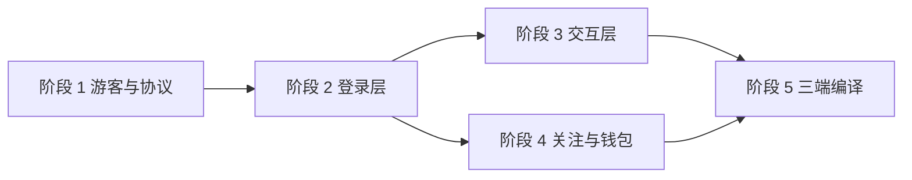

# 开发路线图（Roadmap）

> 定位：把需求基线（`REQUIREMENTS.md`）与基线契约（`docs/contract.md`）落成五个可验收阶段，明确每阶段的交付物、可观察验收标准、前置依赖、退出条件，并登记下期 backlog 与风险。
> 读者：项目所有者、参与实现的 AI 编码 agent、以及负责验收的任何人。
> 更新时机：阶段范围变化、验收标准被调整、某阶段实际退出、下期 backlog 或风险表变化时，必须同步修改本文。

## 1. 范围与前提

基线事实（与 `docs/contract.md` §2、`../README.md` 一致，不随阶段漂移）：

| 项 | 值 |
|---|---|
| 技术栈 | Tauri 2 + Rust 引擎：`danmubox-core`（领域模型 / 端口 / 事件总线 / 会话与本地文件）+ `danmubox-bili`（B 站适配器）+ `danmubox-cli`（调试入口）+ React/TS 前端 |
| 目标平台 | macOS / Windows / Android |
| 登录模式 | 游客（默认可用）/ 明文 `config.toml` 手填 Cookie / 扫码（登录默认入口） |
| 上游隔离 | B 站 URL、字段下标、签名、二维码流程、protobuf schema 只在 `danmubox-bili`；`core` 只依赖端口 |
| 弹幕保留 | 单次房内会话的内存环形缓冲（默认 5000 条，`history.buffer_rows` 覆盖），离开房间即销毁，进程退出即丢 |
| 本期明确不做 | iOS 端、Fold8 / 折叠屏、视频流解码、后台保活、应用商店发布、本地数据库、弹幕回看与导出、词云、AI 原生接口 |
| 发布策略 | 自用不发布，无对外兼容性承诺 |
| 阶段编号 | 阶段 1 游客与协议解码 → 阶段 2 登录层 → 阶段 3 交互层 → 阶段 4 关注与钱包 → 阶段 5 三端编译 |

排期只表达**顺序与依赖**，不承诺日历日期：每个阶段的进展由其「退出条件」是否达成来度量。所有取值以 `docs/contract.md` 为准；本文不另立常量。

> **当前进度（2026-09-12）**：阶段 1–4 的验收项已逐条实测通过并退出；阶段 5 仅 **macOS** 完成，
> Windows / Android 缺工具链，登记在 §8。仍缺上游样本的实测校准项（§3.4 / §5.4 与附录 A）同样登记在 §8，
> 不作为已退出阶段的欠账——凡未实测的一律保持「未验证」标注，不按命名或文档推定为已知。

## 2. 阶段总览

| 阶段 | 主题 | 核心交付物 | 验收门（一句话） | 前置依赖 | 退出条件 |
|---|---|---|---|---|---|
| 1 | 游客模式 + 协议解码跑通 | `bili` 协议/WS 适配器 + `core` 会话缓冲与端口 + `danmubox-cli`；brotli、上游 HTTP 心跳、`INTERACT_WORD_V2` protobuf、字段实测校准 | 游客模式用 CLI 连真实房间稳定收弹幕，字段与校准表一致 | 无（起点） | §3 全部验收项通过 + §3.4 每条有结论 |
| 2 | 登录层 | 明文 `config.toml` 读写（0600 / 原子替换）+ 扫码 + `buvid3`/WBI/`getDanmuInfo` + `prefs.json` | 有凭据直读进入登录态；无凭据扫码可登录；重启后登录态保持 | 阶段 1 | §4 全部验收项通过 |
| 3 | 交互层 | `chat_send` 与 `SendOutcome` 七态、表情包库、举报、身份徽标、礼物栏双模式、过滤与样式、房间内刷新 | 登录态发弹幕在真实房间可见且失败原因可区分；表情 / 举报 / 刷新可用 | 阶段 2 | §5 全部验收项通过 |
| 4 | 关注列表 + 电池余额 | `follow_list`、`wallet_balance`、直播中置顶、从关注列表进场 | 关注列表按直播中置顶展示且可一键进场；余额数值可见 | 阶段 2 | §6 全部验收项通过 |
| 5 | 三端编译 | macOS / Windows / Android 可运行产物 + 三端冒烟记录 | 三端各自跑通同一份手工冒烟清单 | 阶段 3、阶段 4 | §7 全部验收项通过 |

### 2.1 依赖关系

阶段 3 与阶段 4 在阶段 2 退出后可并行推进；阶段 5 需要两者同时就绪。

## 3. 阶段 1：游客模式 + 协议解码跑通

### 3.1 交付物

| 交付物 | 说明 | 对应文档 |
|---|---|---|
| `danmubox-bili` 协议编解码 | 16 字节大端头编解码；载荷版本 0 / 1 / 2 / 3（含 brotli）；子包递归拆分；`cmd` → `kind` 归一化；单包解压上限 16 MiB | `docs/protocol.md` |
| `danmubox-bili` 连接层 | 认证包（游客 `uid=0`、`key` 空）、WS 心跳（字面量 `[object Object]`）、上游 HTTP 心跳（每 60s）、重连退避 5 / 10 / 20 / 40 / 60s | `docs/protocol.md` |
| `danmubox-bili` 房间解析 | 用 `getRoomPlayInfo` 一次拿到 `room_id` / `uid` / `live_status` | `docs/protocol.md` |
| `danmubox-core` 端口与事件总线 | `AuthProvider` / `LiveSource` / `DanmakuSender` / `DanmakuReporter` / `EmoteProvider` / `RoomCatalog` / `WalletProvider` trait 与事件总线；不含 B 站字段 | `docs/contract.md` §3 |
| `danmubox-core` 会话与缓冲 | 单次房内会话的内存环形缓冲（默认 5000 条，`history.buffer_rows` 覆盖）、离开销毁、`history_query` | `docs/contract.md` §4.3、§7 |
| `danmubox-cli` | 脱离 UI 的连接、收发与回放校验入口 | `docs/architecture.md` |
| 协议字段实测校准表 | 见 §3.4；结论回填 `docs/protocol.md` 附录 | `docs/protocol.md` |

### 3.2 验收标准（可观察、可验证）

| 编号 | 验收动作 | 预期可观察结果 | 证据形式 |
|---|---|---|---|
| S1-AC1 | 用 `danmubox-cli` 以游客模式连接一个正在开播的真实房间，持续 10 分钟 | 至少收到 1 条 `danmaku`；`kind` 只出现在六种之内；游客态字段按 `docs/protocol.md` 的游客约定取值（未知 UID 为 0） | CLI 事件输出片段 |
| S1-AC2 | 同一房间长连 ≥2 小时，期间上游 HTTP 心跳每 60s 发出 | 不出现因缺 HTTP 心跳被上游判死；断连次数与断连前最后一次心跳时间被记录 | CLI 日志 |
| S1-AC3 | 断网或强制关闭长连接后观察重连 | 退避序列 5 / 10 / 20 / 40 / 60s 封顶；恢复网络后 60s 内重新收到事件 | CLI 日志 |
| S1-AC4 | 回放一个 brotli（载荷版本 3）包、一个 zlib（载荷版本 2）包，以及嵌套子包样本 | 三种编码与嵌套均解出预期消息，条数与子包数一致 | 测试输出 |
| S1-AC5 | 回放一个解压后体积超过 16 MiB 的构造包 | 丢弃该包并计数；不 panic、不 OOM、连接不中断 | 测试输出 + 计数 |
| S1-AC6 | 回放 `INTERACT_WORD_V2` 样本 | protobuf 载荷经 `prost` 从 `data` 字段 base64 解码后解出可映射字段，`kind=interact`；不因 protobuf 载荷报错 | 测试输出 |
| S1-AC7 | 回放 `DANMU_MSG_MIRROR` 样本 | 默认丢弃并计数，不产生 `danmaku` | 测试输出 + 计数 |
| S1-AC8 | 检查 `DANMU_MSG` 解析结果 | 内容取自 `info[1]`，用户对象取自 `info[0][15].user`（`uid` / `base.name` / `base.face`）；与 `docs/protocol.md` 字段表逐项一致 | 字段对照表 |
| S1-AC9 | 构造认证回应非 0 `code` 的连接场景 | 一律按认证失败走退避；日志只记录原始 `code`，不赋予未知 `code` 具体含义 | CLI 日志 |
| S1-AC10 | 在会话内注入并查询缓冲，然后离开房间、再重进同一房间 | `history_query` 返回当前会话缓冲；离开后缓冲销毁（查询为空）；重进是新会话（旧条数不计入） | CLI 输出 |
| S1-AC11 | 检查依赖方向 | `cargo tree -p danmubox-core` 不含 `tauri`；`core` 内无 B 站 URL / 字段下标 / 签名 / protobuf；`bili` 依赖 `core` 而反向不成立 | 命令输出 |

#### 阶段 1 验收结果（2026-09-11）

| 验收项 | 结果 |
|---|---|
| S1-AC1 游客态收弹幕 | 通过：真实房间收到弹幕与互动 |
| S1-AC2 长连 ≥2 小时 | **通过**：2 小时 4 分，4 次**上游发起**的断连全部自动恢复；HTTP 心跳失败 **0** 次；退避按 5s→10s→20s→40s 正确升级；收 1390 条消息（danmaku 261），解压/解析丢弃均为 0 |
| S1-AC3 退避与恢复 | **通过**（2026-09-12 用户实操）：人为断网后三个房间各走完一整轮退避，实测序列 `5000 → 10000 → 20000 → 40000 → 60000`（正确封顶），共 15 次重连后全部恢复 |
| S1-AC4~AC10 | 通过：由离线单测覆盖（brotli/zlib/嵌套/截断/坏包/解压上限、protobuf、镜像弹幕、字段取值、会话语义） |
| S1-AC11 依赖方向 | 通过：`core` 不含上游知识，依赖单向 |

未完成项：S1-AC3 的断网触发、以及附录 A 中仍缺样本的条目（礼物 / SC / 大航海字段、房管与舰长正向样本、未归类命令的归类）。

### 3.3 前置依赖与退出条件

| 项 | 内容 |
|---|---|
| 前置依赖 | 无；本阶段允许固定房间号与游客模式，不阻塞于登录 |
| 退出条件 | S1-AC1 ~ S1-AC11 全部通过；§3.4 校准表每条都有结论（给出实测值，或记录「本轮未复现 + 下一次采集动作」）；`docs/protocol.md` 的命令目录与实测结论一致 |

### 3.4 待实测校准（阶段 1 必须执行）

原则：B 站侧未实测的行为**不得**写成具体数值；一律进本表，用采集动作换取结论，结论回填 `docs/protocol.md` 附录。

| 待校准项 | 当前依据 | 核对方法 | 责任人动作 |
|---|---|---|---|
| `DANMU_MSG` 内容 / 颜色 / 粉丝牌 / 等级 / 用户名的下标位置 | `docs/contract.md` §6：内容 `info[1]`、用户对象 `info[0][15].user` | 以 `DANMUBOX_LOG=debug` 收原始 `op=5` body，逐条人工比对 | 记录样本与解析对照，更新 `docs/protocol.md` 附录；不一致则改解析并补回放 fixture |
| 游客模式下被掩码字段的范围 | 游客模式部分字段为空 | 同房间分别以游客与登录态连接，比较同一活跃发送者的 `uid` / `uname` | 写 `docs/protocol.md` 游客/登录对比表，只记观察到的字段 |
| `INTERACT_WORD` / `INTERACT_WORD_V2` / `ENTRY_EFFECT` 的字段差异 | `docs/contract.md` §6：V2 载荷是 protobuf | 各抓 ≥1 条原始样本，用 protobuf 解码器解出字段 | 登记三者共有与各自特有字段，补回放 fixture |
| `USER_TOAST_MSG` 的 `guard_level` 取值口径（1 总督 / 2 提督 / 3 舰长） | `docs/contract.md` §5 | 抓开通舰长、提督、总督各一条样本 | 集齐前记录已观察取值与剩余待观察项 |
| `SUPER_CHAT_MESSAGE` 与 `SUPER_CHAT_MESSAGE_JP` 的金额与 id 字段名 | `docs/contract.md` §5 `amount` / `upstream_id` | 抓两类样本各一条 | 登记字段名；据此确定举报标识来源 |
| `SEND_GIFT` 的 `gift_id` / `num` 与金额字段 | `docs/contract.md` §5 `amount` | 抓免费礼物与付费礼物各一条 | 登记实际字段名与金额字段 |
| `op=3` 人气值 body 的结构 | `docs/contract.md` §6 | 抓若干 `op=3` 包记录解析结果 | 登记是否只有单值；确认不产生消息 |
| 认证回应非 0 `code` 的取值集合 | `docs/contract.md` §6 只认 `code=0` 为成功 | 在凭据失效、`roomid` 非法等情形下观察返回的 `code` | 只登记**实际观察到**的 code 与触发条件；未观察到的按失败处理 |
| `op=5` 解压后子包的嵌套层级与子包载荷版本分布 | `docs/contract.md` §6：子包可能再次为压缩 | 在 debug 日志中统计每层子包的载荷版本 | 登记是否出现二级嵌套；补一条对应回放 fixture |
| WS 心跳与发送间隔的实测保活效果 | `docs/contract.md` §4：首包 60s 内发出、收到 `op=3` 后重置 30s | 长连 ≥2 小时，统计断连次数与断连前最后一次心跳时间 | 若频繁断连，登记现象并调整退避参数（常量变更须同步契约） |

## 4. 阶段 2：登录层

### 4.1 交付物

| 交付物 | 说明 | 对应文档 |
|---|---|---|
| 凭据文件读写 | 明文 `config.toml`、权限 0600、临时文件 + rename 原子替换；多账号用 `[profiles.<name>]` 承载、`active_profile` 指定生效者；「手填 Cookie」即直接编辑该文件 | `docs/contract.md` §4.1、`docs/auth.md` |
| 启动顺序 | 读文件 → `active_profile` 所指 profile 的 `sessdata` / `bili_jct` / `dede_user_id` 齐全且非空则直接进入登录态；否则走扫码（默认入口） | `docs/contract.md` §4.1 |
| 扫码登录 | 二维码生成 + 状态轮询 + 成功后原子写回凭据；IPC `session_qr_start` / `session_qr_poll` | `docs/auth.md`、`docs/ipc.md` |
| 游客与登出 | `session_status`（不含 Cookie 值）、`session_logout` 清空凭据；多账号用 `profiles_list` / `profiles_switch`（改 `active_profile` 并以新凭据重建连接） | `docs/contract.md` §7、`docs/ipc.md` |
| `buvid3` 与 WBI 签名 | 供 `getDanmuInfo` 使用 | `docs/auth.md` |
| `getDanmuInfo` | 换取弹幕长连接地址与认证 token | `docs/auth.md` |
| 偏好文件读写 | `prefs.json`：显式改过的键、默认值合并、原子替换、损坏回落并保留 `prefs.json.bak` | `docs/contract.md` §4.2、§8 |

### 4.2 验收标准（可观察、可验证）

| 编号 | 验收动作 | 预期可观察结果 | 证据形式 |
|---|---|---|---|
| S2-AC1 | 无凭据首次启动，读取 `session_status` | 进入游客态；不阻塞阶段 1 的接收链路 | 响应 JSON |
| S2-AC2 | 走扫码流程完成登录 | 状态机按序演进至成功；`session_status` 显示已登录；响应中**不含**任何 Cookie 值 | 轮询响应序列 |
| S2-AC3 | 手工编辑 `config.toml` 中 `active_profile` 所指 profile 填入有效凭据后重启 | 直接进入登录态、不弹扫码；完全退出进程后重启仍保持登录态 | 重启后的 `session_status` |
| S2-AC4 | 检查凭据文件属性与写入方式 | 权限为 0600；写入为临时文件 + rename，替换过程中并发读不出现半写文件 | `stat` 输出 + 并发读结果 |
| S2-AC5 | 使凭据失效后调用需要登录的操作 | 回到游客态并给出可操作的重登提示；进程不崩溃；不发起需要凭据的上游请求 | 响应 + 日志 |
| S2-AC6 | 调用 `session_logout`，然后调用 `profiles_switch` 切到另一 profile | 登出后 `active_profile` 所指 profile 的凭据被清空、回到游客态；切换后 `active_profile` 改写、以新 profile 凭据重建连接，`session_status` 反映新 profile | 文件内容 + 响应 |
| S2-AC7 | 修改界面偏好 | 偏好只写入 `prefs.json`；`config.toml` 的键集合始终只有 `active_profile` 与 `profiles.*` 下的七项凭据；未知键或非法值报 `BAD_REQUEST` | 两文件内容 + 响应 |
| S2-AC8 | 对仓库、日志、前端载荷、fixture 检索凭据值 | 不出现真实 `SESSDATA` / `bili_jct` / `DedeUserID`，只命中字段名说明与脱敏规则文本 | 检索输出 |

### 4.3 前置依赖与退出条件

| 项 | 内容 |
|---|---|
| 前置依赖 | 阶段 1 退出；`docs/auth.md` 的扫码状态机与 WBI 步骤已定稿 |
| 退出条件 | S2-AC1 ~ S2-AC8 全部通过；启动顺序与 `docs/contract.md` §4.1 一致；安全红线（`SESSDATA`、`bili_jct`、`DedeUserID` 不进日志 / 前端明文 / 仓库 / 崩溃上报）在代码与文档中同时成立 |

## 5. 阶段 3：交互层

### 5.1 交付物

| 交付物 | 说明 | 对应文档 |
|---|---|---|
| 发弹幕与结果归一化 | IPC `chat_send` 返回 `SendOutcome`：`ok` / `blocked_platform` / `blocked_room` / `rate_limited` / `medal_required` / `muted` / `failed`；被吞时内容回显取自 `data.mode_info.extra`（JSON 字符串）的 `content` | `docs/contract.md` §5 |
| 发送节流 | 同房间最小间隔 2s；相同内容 5s 内去重 | `docs/contract.md` §4 |
| 表情包库 | IPC `emotes_list`，按身份加载 `common` / `medal` / `guard` / `admin`；范围取决于 `RoomSession` 与 `Message` 的牌 / 舰长 / 房管身份 | `docs/contract.md` §5、§7 |
| 举报 | IPC `chat_report`，以 `Message.upstream_id` 定位被举报弹幕 | `docs/contract.md` §5、§7 |
| 身份徽标 | 主播由 `uid == Room.anchor_uid` 派生；房管用 `is_admin`；大航海用 `guard_level`（1 总督 / 2 提督 / 3 舰长） | `docs/contract.md` §5 |
| 礼物栏双模式 | 偏好 `ui.gift_panel_mode`：`merged` 礼物混在弹幕栏 / `separate` 独立礼物栏 | `docs/contract.md` §8 |
| 过滤与样式 | `filter.*` 与 `ui.font_scale` / `ui.theme` / `ui.interact_auto_hide` / `ui.system_notice` 等，经 `prefs_get` / `prefs_set` 读写 | `docs/contract.md` §8、`docs/ui.md` |
| 房间内刷新 | IPC `rooms_reconnect`：长连接卡住或推流中断时手动重连；重连不清空已收缓冲 | `docs/contract.md` §4.3、§7、`docs/ui.md` |

### 5.2 验收标准（可观察、可验证）

| 编号 | 验收动作 | 预期可观察结果 | 证据形式 |
|---|---|---|---|
| S3-AC1 | 登录态下经 `chat_send` 发送一条弹幕 | 真实直播间出现该弹幕；返回 `ok` | 直播间截图 + 响应 |
| S3-AC2 | 2 秒内二次发送；随后 5 秒内发送相同内容 | 前者被本地节流拒绝；后者被去重；均不产生重复上游请求 | 响应 + 日志 |
| S3-AC3 | 触发被平台吞（上游响应 `msg` / `message` 为 `"f"`）与被直播间吞（为 `"k"`） | 分别返回 `blocked_platform` / `blocked_room`；回显内容取自 `data.mode_info.extra` 的 `content` | 响应原文 |
| S3-AC4 | 触发频率限制、粉丝牌不足、已被禁言，以及一个其他失败 | 分别返回 `rate_limited` / `medal_required` / `muted`；其他失败返回 `failed` 并携带原始 `code` 与 `message` | 响应原文 |
| S3-AC5 | 在不同身份（有 / 无粉丝牌、舰长 / 房管）下调用 `emotes_list` | 返回的可用表情随 `RoomSession` 身份变化；房间专属表情 `room_id` 非 0 | 响应 JSON |
| S3-AC6 | 对一条带 `upstream_id` 的弹幕调用 `chat_report`；再对一条缺 `upstream_id` 的调用 | 前者提交成功；后者返回明确失败，不发送空标识的上游请求 | 响应原文 |
| S3-AC7 | 界面上渲染六种 `kind`（`danmaku` / `gift` / `superchat` / `interact` / `guard` / `system`） | 六种各自按 `docs/ui.md` 渲染；主播 / 房管 / 大航海徽标按派生规则正确出现 | 截图 |
| S3-AC8 | 切换 `ui.gift_panel_mode` | `merged` 时礼物混在弹幕栏、`separate` 时为独立礼物栏；重启后保持 | 截图 |
| S3-AC9 | 设置 `filter.keywords`（`hide` / `only`）、`filter.uids`、`filter.kinds`、`filter.medal_level_min`，并调整字号、主题与互动/系统通知开关 | 过滤即时生效；样式改动即时生效并在重启后保持 | 截图 |
| S3-AC10 | 在房间内点「刷新」触发 `rooms_reconnect` | 建立新连接；刷新前后本会话缓冲条数不减，已收消息保留 | 条数对比 |
| S3-AC11 | 逐项复核 §5.4 的发弹幕被吞判定与错误码 | 复核结论写死到 `danmubox-bili` 与 `docs/protocol.md`；不成立则改判定与代码 | 校准表结论 |

### 5.3 前置依赖与退出条件

| 项 | 内容 |
|---|---|
| 前置依赖 | 阶段 2 退出（发送与举报需要登录态） |
| 退出条件 | S3-AC1 ~ S3-AC11 全部通过；§5.4 校准表每条有结论 |

### 5.4 待实测校准（阶段 3）

| 待校准项 | 当前依据 | 核对方法 | 责任人动作 |
|---|---|---|---|
| 发弹幕被吞判定 `"f"` → `blocked_platform`、`"k"` → `blocked_room` | `docs/contract.md` §5；社区可复现实现（见 `docs/protocol.md` 发送章节） | 登录态在真实房间故意触发被平台吞与被房间吞 | 复核后写死；不成立则改判定并更新契约 |
| 被吞回显 `data.mode_info.extra` 的 JSON 结构 | `docs/contract.md` §5 | 抓被吞响应原文 | 登记 `content` 的取值路径 |
| 频率限制 / 粉丝牌不足 / 禁言的错误码 | `docs/contract.md` §5 七态 | 故意触发三类失败 | 登记实际 `code` 与 `message`；不编造未观察取值 |
| 表情包库接口（按身份的包清单） | `docs/contract.md` §5 `Emote` / `RoomSession` | 以不同身份调用并核对返回的 `package_kind` | 登记上游端点与字段 |
| 举报接口的必需参数与响应 | `docs/contract.md` §5 `upstream_id` | 对真实弹幕举报一次 | 登记参数与响应；失败路径同样记录 |

## 6. 阶段 4：关注列表 + 电池余额

### 6.1 交付物

| 交付物 | 说明 | 对应文档 |
|---|---|---|
| 关注列表 | IPC `follow_list`；`FollowedRoom` 含 `room_id` / `uname` / `face` / `live_status`（0 未开播 / 1 直播中 / 2 轮播）/ `group_name`；展示时 `live_status == 1` 置顶 | `docs/contract.md` §5、§7 |
| 从关注列表进场 | 在列表中直接连接所选房间 | `docs/ui.md`、`docs/ipc.md` |
| 电池余额 | IPC `wallet_balance`，由 `WalletProvider` 提供 | `docs/contract.md` §3、§7 |
| 校准表 | 见 §6.4 | `docs/protocol.md` 附录 |

### 6.2 验收标准（可观察、可验证）

| 编号 | 验收动作 | 预期可观察结果 | 证据形式 |
|---|---|---|---|
| S4-AC1 | 登录态调用 `follow_list` | 返回关注房间列表；每条含 `live_status` 与 `group_name` | 响应 JSON |
| S4-AC2 | 观察列表排序 | `live_status == 1` 的房间置顶；其余保持稳定顺序 | 截图 |
| S4-AC3 | 从列表选择一个直播中的房间进场 | 进入该房间会话并开始收弹幕 | 截图 |
| S4-AC4 | 调用 `follow_list` | 列表刷新；当前房间的会话缓冲不丢失、不重建 | 刷新前后条数对比 |
| S4-AC5 | 调用 `wallet_balance` | 返回电池余额数值；未登录时返回明确失败而非用 0 冒充余额 | 响应 JSON |
| S4-AC6 | 逐项完成 §6.4 校准表 | 每条有结论 | 校准表结论 |

### 6.3 前置依赖与退出条件

| 项 | 内容 |
|---|---|
| 前置依赖 | 阶段 2 退出（关注列表与余额需要登录态）；可与阶段 3 并行推进 |
| 退出条件 | S4-AC1 ~ S4-AC6 全部通过；关注列表排序规则与 `docs/contract.md` §5 一致 |

### 6.4 待实测校准（阶段 4）

| 待校准项 | 当前依据 | 核对方法 | 责任人动作 |
|---|---|---|---|
| 关注列表端点的路径与字段名 | `docs/contract.md` §5 `FollowedRoom` | 登录态拉取一次关注列表 | 登记端点、字段名与分页行为 |
| 关注分组 `group_name` 的来源 | `docs/contract.md` §5 | 在有分组的账号上拉取 | 登记取值；未观察到的分组不臆造 |
| `live_status` 取值口径（0 / 1 / 2） | `docs/contract.md` §5 | 分别对未开播、直播中、轮播房间取数 | 登记实际观察值 |
| 电池余额的取值字段 | `docs/contract.md` §3 `WalletProvider` | 登录态调用一次 | 登记上游端点与数值字段 |

## 7. 阶段 5：三端编译

### 7.1 交付物

| 交付物 | 平台 | 说明 |
|---|---|---|
| 桌面安装产物 | macOS | 本机可运行的应用包（签名策略见 `docs/distribution.md`） |
| 桌面安装产物 | Windows | 可运行产物；目标机需 WebView2 运行时 |
| 移动安装产物 | Android | 签名 APK，经 `adb install` 安装到真机 |
| 三端冒烟记录 | 全部 | 按 `docs/testing.md` 的三端手工冒烟清单逐步执行并留证 |

### 7.2 验收标准（可观察、可验证）

| 编号 | 验收动作 | 预期可观察结果 | 证据形式 |
|---|---|---|---|
| S5-AC1 | 在 macOS 本机运行构建产物 | 应用启动、聊天框可见；添加并连接房间后 60 秒内出现弹幕 | 截图 / 录屏 |
| S5-AC2 | 在 Windows 目标机（或与目标一致的虚拟机）运行产物 | 应用启动不白屏；WebView2 已存在时无需额外安装；连接后出现弹幕 | 截图 |
| S5-AC3 | `adb install` 安装 APK 到 Android 真机并启动 | 应用启动、布局无溢出；连接后出现弹幕 | 截图 |
| S5-AC4 | 在 Android 真机前台运行 30 分钟 | 期间持续收弹幕；切后台再回前台后连接按重连策略恢复（本期不做后台保活） | 时间戳 + 截图 |
| S5-AC5 | 三端各自完整执行 `docs/testing.md` 的三端手工冒烟清单（含刷新、表情、举报、关注列表步骤） | 每一步的实际结果与该清单的预期结果一致；不一致处记录差异 | 已勾选的清单 + 差异记录 |
| S5-AC6 | 退出应用后检查残留进程 | 无遗留进程；再次启动正常 | 进程列表 |
| S5-AC7 | 检查三端产物体积与常驻内存 | 落在 `docs/distribution.md` 登记的目标内；超出则记录实际值与原因 | 测量结果 |

### 7.3 前置依赖与退出条件

| 项 | 内容 |
|---|---|
| 前置依赖 | 阶段 3、阶段 4 均退出；三端工具链就绪（见 `docs/distribution.md`） |
| 退出条件 | S5-AC1 ~ S5-AC7 全部通过；三端均可完成「启动 → 登录（至少游客）→ 连接 → 看弹幕 → 发弹幕（登录态）→ 刷新 → 退出」的完整闭环；产物路径与构建步骤已登记到 `docs/distribution.md` |

## 8. 下期 backlog（本期不纳入验收）

### 8.1 等上游样本（做完即回填 `docs/protocol.md` 附录 A）

| 项 | 说明 | 触发 / 前置 |
|---|---|---|
| 连线礼物映射 | `UNIVERSAL_EVENT_GIFT(_V2)` → 礼物条目。**A22 与 A26 结案后，等样本的只剩这一项与 A8**：`PK_INFO` / `RANK_CHANGED_V2` / `WIDGET_BANNER` 已按需求展示面判定为有意忽略（`protocol.md` A22）；房管表情包被确认为**不存在**（`protocol.md` A26） | 需 PK / 连麦活动期房间的载荷样本。**怎么找到这样的房间**：直播首页的推荐房间列表里带 `pk_id` 字段，`0` 表示没在 PK，非 0 就是 PK 中——在浏览器首页找一个 `pk_id` 非 0 的房间，用 app（或 `DANMUBOX_LOG=debug danmubox-cli watch <房间>`）采一段即可。**取证要用带 WBI 签名的客户端**：直接裸请求分区分页接口会吃 `code=-352` 风控 |
| A8 `SEND_GIFT`（V1） | V1 礼物的真实字段 | 需一条 V1 样本（老客户端或特殊场景才发）。实现已按权威文档核对，并在 `protocol.md` §10.2 标注「尚未观测到真实样本」 |

做法：在能看到 PK / 大航海 / 抽奖的房间开着桌面端（或 `DANMUBOX_LOG=debug` 的 CLI `watch`）采一段即可，
`danmubox-bili` 的原始载荷日志会把每个命令原样落盘，归类时**只看载荷、不看命令名**。

### 8.2 待拍板

| 项 | 说明 | 触发 / 前置 |
|---|---|---|
| Android 端 | Tauri 2 移动端产物 | 需 Gradle、Android SDK/NDK、`ANDROID_HOME` 与 Rust Android target（见 `distribution.md`） |
| Windows 端 | Tauri 2 Windows 产物 | macOS 无法交叉编译（缺 WebView2 与 MSVC 运行时），需 Windows 机器或 CI |

### 8.3 更远期

| 项 | 说明 | 触发 / 前置 |
|---|---|---|
| 词云 | 基于当前会话缓冲的关键词云；需求基线列为下期非核心 | 阶段 3 之后，按需另立条目 |
| 透明度功能（需要重新设计实现方式） | 原 `ui.opacity`（整表不透明度滑杆）实现方式非预期，2026-09-12 用户反馈后**已删除**（连带偏好键与控件）。重做前先想清楚它要作用在什么上（列表容器？单条？背景？），再定键与取值范围 | 用户提出重做意向；届时先改契约 §8 再加回键 |
| AI 接入 MCP（想法记录） | 后期想法：接入 MCP，让 Agent 直接消费弹幕数据；**本期不实现**。架构上保持兼容——`core` 的端口与事件总线不得假设消费方是 UI，新能力一律经端口暴露，不写进 Tauri 命令层 | 本期不排期；不定义任何工具、协议或端点 |
| iOS 端 | 复用同一 `core` 与 IPC 契约，只新增外壳与构建目标 | 阶段 5 退出且桌面 / 安卓主流程无阻塞性缺陷 |
| Fold8 / 折叠屏 | 展开 / 折叠态布局、双栏（房间列表 + 聊天）、铰链区域避让 | 拿到折叠屏真机且 Android 主流程已跑通 |

backlog 各项均**不阻塞**阶段 1–5 的退出条件；一旦启动，各自作为独立阶段登记交付物与验收标准后再实施。

## 9. 风险与缓解

| 风险 | 触发信号 | 影响 | 缓解动作 |
|---|---|---|---|
| 协议字段未实测（`DANMU_MSG` 下标、protobuf 字段、被吞判定） | 校准表出现「与文档不一致」条目 | 归一化字段错位、发送结果误判 | 以实测样本修正 `docs/protocol.md` 与解析代码，并补回放 fixture 固化结论 |
| B 站协议或接口变更（新增 `cmd`、字段改名、地址变化） | 事件流出现未识别 `cmd`；解码失败计数上升 | 弹幕丢失或解析中断 | 未知 `cmd` 一律计入 unknown 计数并继续；B 站相关全部隔离在 `danmubox-bili`，变更只改一处 |
| 风控 / 限流（游客被限流、连接被快速断开） | 连接建立后立刻断开，或连接频繁被拒 | 收不到弹幕 | 按退避重连并降低重连频率；保留登录态通道；记录现象而非臆测原因 |
| 认证失败（认证回应非 0 `code`） | 认证回应非 0 | 无法建立有效会话 | 一律按重连退避处理；不编造未知 `code` 的含义；凭据失效时引导重新登录 |
| 凭据泄露（明文 `config.toml`） | 日志、前端明文、仓库或崩溃上报中出现真实值 | 账号控制权泄露 | 权限 0600、只在本机数据目录；凭据不进日志 / 前端明文 / 仓库 / 崩溃上报；提交前检索红线关键词 |
| 解压炸弹 | 单包解压后体积异常 | 内存暴涨 | 单包解压上限 16 MiB，超限丢弃并计数 |
| Tauri Android WebView 渲染差异 | 安卓上布局溢出、滚动异常、虚拟列表失效 | 安卓体验降级 | 核心逻辑全部放 Rust，UI 做渐进增强；三端手工冒烟清单覆盖布局与滚动 |
| WBI 签名或 `buvid3` 获取失效 | `getDanmuInfo` 报签名错误 | 登录态无法换取连接地址与 token | 签名逻辑集中在单一模块，变更只改一处；失败按未登录处理而非静默降级 |
| 举报 / 表情 / 关注 / 钱包上游端点未实测 | 校准表对应条目无结论 | 功能不可用或参数错误 | 阶段 3 / 阶段 4 用真实调用核对后再写死；未实测不得硬编码 |
| 文档与实现漂移 | 契约常量被修改而文档未更新 | 消费面行为不一致，验收不可信 | 改常量必须同步契约与派生文档；依 `AGENT.md` 的 DoD 清单执行 |

## 10. 与其他文档的关系

| 文档 | 关系 |
|---|---|
| `../README.md` | 项目定位、边界与文档索引的入口 |
| `REQUIREMENTS.md` | 需求基线（用户手写） |
| `docs/contract.md` | 本文的唯一事实源：阶段划分必须落在其 §2 范围内，常量与模型不得另立 |
| `docs/protocol.md` | 阶段 1 协议实现依据与「待实测校准」结论的登记处 |
| `docs/auth.md` | 阶段 2 三种登录模式的详细设计 |
| `docs/ipc.md` / `docs/ui.md` | 阶段 3–4 的 IPC 命令与交互依据 |
| `docs/testing.md` | 各阶段验收动作的测试方案与三端冒烟清单 |
| `docs/distribution.md` | 阶段 5 的构建步骤、产物路径与工具链前置条件 |
| `docs/operations.md` | 日常运行与故障排查 |
| `docs/decisions/` | 相关 ADR；与契约冲突时以契约为准 |
| `AGENT.md` | 实现期的作业规范与 DoD 清单 |
