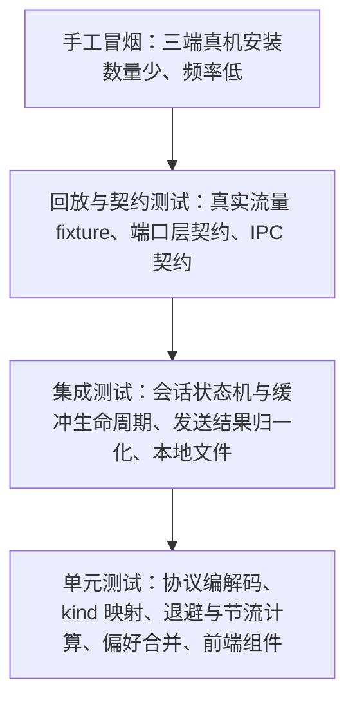

# 测试方案（Testing）

> 定位：定义 danmubox 的测试策略——测试金字塔各层范围、协议 fixture、会话缓冲语义、发送结果判定、本地文件、端口层契约、回放、前端与三端手工冒烟，以及明确不测的边界。
> 读者：编写与修改代码的 AI 编码 agent、执行验收的项目所有者、以及排查回归的人。
> 更新时机：新增协议 `cmd`、会话缓冲或发送结果语义变化、偏好键或 IPC 命令变化、冒烟清单步骤变化时必须同步修改本文。

## 1. 总体原则

| 原则 | 说明 |
|---|---|
| 可观察行为优先 | 断言对外可观察的结果（归一化后的 `Message`、`SendOutcome`、文件内容与权限、界面行为），不断言私有函数调用次数或源码文本 |
| 边界优先 | 二进制包最容易出错的不是正常包，而是截断、嵌套、压缩损坏、超大解压、未知 `cmd`；这些必须有专测 |
| 不上真实网络 | 常规测试不连接 B 站；真实流量只通过「录制为 fixture 后重放」进入测试 |
| 凭证零泄漏 | 任何 fixture、快照、日志断言中都不得出现真实 `SESSDATA`、`bili_jct`、`DedeUserID`、`buvid3` |
| 确定性 | 时间、随机抖动、随机数与文件系统路径一律可注入或伪造，测试不做时序赌博 |

所有取值以 `docs/contract.md` 为准；本文只描述测试方式，不重复也不改写契约常量。

## 2. 测试金字塔

| 层 | 范围 | 工具（规划） | 运行时机 |
|---|---|---|---|
| 单元测试 | 协议编解码、`cmd` → `kind` 映射、退避与节流计算、偏好合并、Zustand store、UI 组件 | `cargo test`；前端 `vitest` + React Testing Library | 每次改动后必跑 |
| 集成测试 | 会话状态机与缓冲生命周期、`SendOutcome` 归一化（经假适配器）、`config.toml` / `prefs.json` 读写 | `cargo test`（Rust 集成测试目录） | 每次改动后必跑 |
| 回放 / 契约测试 | 真实流量 fixture 重放、端口层契约、IPC 契约 | `cargo test` + fixture 目录 | 每次改动后必跑（不使用真实凭证） |
| 手工冒烟 | 三端真机安装运行、登录、扫码、发弹幕、刷新、表情、举报、关注列表 | 人工按清单执行 | 每个阶段退出前，以及分发产物变更后 |

目录约定（规划路径，本期为文档阶段不创建）：协议与适配器测试放 `crates/danmubox-bili/tests/`，二进制 fixture 放同级 `tests/fixtures/`；会话、本地文件与端口契约测试放 `crates/danmubox-core/tests/`；前端测试与被测文件同目录，命名 `*.test.ts` / `*.test.tsx`。

现状（与上段规划的差距）：上述三个测试目录与前端的 `*.test.ts` 均尚未创建，已有 Rust 测试全部是各 `src/*.rs` 内的 `#[cfg(test)] mod tests`（`crates/danmubox-core/src/` 六个文件、`crates/danmubox-bili/src/` 十五个文件、`apps/desktop/src-tauri/src/lib.rs`）；已落地的端到端验证在 `apps/desktop/ui/smoke/`（`run-headless.mjs` + `room-page.mjs` + `fixtures/`，引擎门槛见 `AGENT.md` §9）。新增测试先按规划落位，在规划目录建立前按现有同文件内联写法。

## 3. 协议层测试（`danmubox-bili`）

### 3.1 包结构断言基础

所有协议用例都基于同一套字节构造器：给「头字段 + body 字节」产出完整包，再交给解包器。断言对象是解包产出的事件序列与错误计数，而不是内部缓冲区状态。

包头字段布局、`protover`（载荷编码版本）与 `op`（包类型）的取值口径以 `docs/protocol.md` 为准，本文不重复；用例只按该口径构造字节并断言产出。

### 3.2 必须构造的 fixture 清单

| 编号 | 用例 | 构造方式 | 期望行为 |
|---|---|---|---|
| P-01 | 单包裸 JSON | `headerLen=16`，载荷版本 0，`op=5`，body 为一条 `{"cmd":"DANMU_MSG",...}` | 解出 1 条 `danmaku`，字段按契约 §5 填装 |
| P-02 | 单包内多个 JSON | 载荷版本 0，body 为两条 JSON 拼接（非标准但需容错） | 行为按解包器定义；若判定为非法则明确报错并计数，不得 panic |
| P-03 | zlib 单包 | 载荷版本 2，body 为 zlib(一条 JSON) | 解压后解出 1 条消息 |
| P-04 | brotli 单包 | 载荷版本 3，body 为 brotli(一条 JSON) | 解压后解出 1 条消息；与请求协商的载荷版本一致 |
| P-05 | 嵌套子包（一层） | 载荷版本 2，body 为 zlib(多个完整子包拼接)，子包载荷版本 0 | 循环按 16 字节头拆分直到消费完，逐个子包解出消息，条数与子包数一致 |
| P-06 | 嵌套子包（二层，混合编码） | 子包自身载荷版本为 2 或 3 | 递归解压子包，结果与把最内层 JSON 扁平拼接等效 |
| P-07 | 截断包（头部不足） | 只喂入若干字节（不足 16 字节） | 不报错、不 panic；等待更多字节；喂满后可正常解析 |
| P-08 | 截断包（body 不足） | `packetLen` 声明大于实际喂入字节 | 同上：保留缓冲等待续传；补齐后解析结果与一次性喂入一致 |
| P-09 | 头部非法 | `headerLen != 16`，或 `packetLen < 16`，或 `packetLen` 远大于合理上限 | 丢弃该包并计入协议错误计数；连接不中断 |
| P-10 | 坏压缩流 | 声明载荷版本 2 或 3，但 body 不是合法压缩流 | 报解码错误并计数；连接继续，后续合法包仍能解析 |
| P-11 | 超限解压保护 | 构造解压后体积超过 16 MiB 的包 | 丢弃该包并计数；不 panic、不 OOM；后续合法包仍能解析 |
| P-12 | WS 心跳包 | `op=2`，body 为字面量字符串 `[object Object]` | 编码结果字节与期望逐字节相等；解析侧对收到的 `op=2` 不产生消息 |
| P-13 | 认证包（登录态） | `op=7`，body JSON 含 `uid`、`roomid`、`protover`、`buvid`、`platform="web"`、`type=2`、`key` | 序列化后的字段名与取值与契约 §6 的认证包定义逐项相符 |
| P-14 | 认证包（游客态） | 同 P-13，但 `uid=0`、`key` 为空字符串 | 字段存在且取值为空，不省略 `key` |
| P-15 | 认证回应成功 | `op=8`，body `{"code":0}` | 会话状态机进入已认证，开始计时心跳 |
| P-16 | 认证回应失败 | `op=8`，`code` 为非 0 值（取值来自实测样本） | 判定为认证失败，走重连退避；只记录原值，不为未知 code 赋予具体含义 |
| P-17 | 人气值包 | `op=3` | 更新房间热度类状态；不产生消息 |
| P-18 | 未知 `cmd` | `op=5`，JSON 中 `cmd` 不在契约 §5 映射表内 | 计入 unknown 计数并继续；不 panic、不产生错误级日志风暴 |
| P-19 | 空 body 包 | `packetLen=16`，无 body | 按无操作处理；不 panic |
| P-20 | 分片喂入 | 把 P-05 的字节按随机切分点分多次喂入（含每次 1 字节的极端切分） | 结果与一次性喂入逐条一致 |
| P-21 | `INTERACT_WORD_V2` protobuf 样本 | `op=5`，body 中 `data` 字段为 protobuf 的 base64 | 经 `prost` 解码后解出 `uid` / `uname` 等可映射字段，`kind=interact`；不因 protobuf 载荷报错 |
| P-22 | `DANMU_MSG_MIRROR` | `op=5`，JSON 中 `cmd` 为 `DANMU_MSG_MIRROR` | 默认丢弃并计数，不产生 `danmaku` |
| P-23 | 子包长度越界 | 子包声明的 `packetLen` 超出父包剩余字节 | 丢弃越界子包并计数；不 panic、不越界读 |

### 3.3 `cmd` → `kind` 映射全覆盖

契约 §5 映射表中的每条命令都至少有一个用例，断言：

| 断言点 | 内容 |
|---|---|
| `kind` 正确 | `DANMU_MSG` → `danmaku`；`SEND_GIFT` → `gift`；`SUPER_CHAT_MESSAGE` / `SUPER_CHAT_MESSAGE_JP` → `superchat`；`INTERACT_WORD` / `INTERACT_WORD_V2` / `ENTRY_EFFECT` → `interact`；`GUARD_BUY` / `USER_TOAST_MSG` → `guard`；系统类命令 → `system` |
| 非交易类 `amount` 为 0 | `danmaku` / `interact` / `system` 的 `amount` 必须为 0 |
| 缺字段容错 | 样本缺 `medal_name`、`guard_level` 等可选字段时取契约 §5 的默认值（0 或空串），不报错 |
| `local_id` 语义 | 同一次房内会话内单调递增且唯一；进程重启后从新起点重新分配 |
| `upstream_id` 保留原文 | 举报所需的标识原样保留，不由本地生成 |
| 徽标派生 | 主播由 `uid == Room.anchor_uid` 派生、房管取 `is_admin`、大航海取 `guard_level`；不依赖独立字段 |

字段取值口径未实测的部分不得在测试里硬编码臆测值：测试用 fixture 承载实测样本，fixture 更新即结论更新；未实测的取值一律进 [`protocol.md`](protocol.md) 附录 A 的「待实测校准」表，并写清核对方法与责任人动作。

## 4. 会话缓冲语义测试（`danmubox-core`）

会话缓冲的生命周期与上限见契约 §4.3。所有用例在测试内以可控时钟与自增序号驱动，不依赖真实连接。

| 编号 | 用例 | 做法 | 期望 |
|---|---|---|---|
| B-01 | 进入房间创建缓冲 | 连接某房间后查询 | 缓冲为空且与 `room_id` 绑定 |
| B-02 | 会话内追加与查询 | 注入 N 条后按 `limit` / `after` / `before` / `kinds` / `uid` / `q` 组合查询 | 返回当前会话消息；过滤语义与契约 §7 的 `history_query` 一致；空结果返回空集合而非错误 |
| B-03 | 5000 条上限丢最旧 | 注入 5001 条 | 条数为 5000；最旧的 1 条被丢弃，最新 5000 条保留 |
| B-04 | `history.buffer_rows` 覆盖 | 设为 100 后注入 150 条 | 条数为 100；契约默认值不生效 |
| B-05 | 离开房间销毁 | 有消息时断开连接或返回房间列表 | 缓冲清空；再查询返回空 |
| B-06 | 重进是新会话 | 离开后再次进入同一房间 | 旧消息不计入；`local_id` 从新会话起点重新分配 |
| B-07 | 手动重连不清空 | 有消息时触发 `rooms_reconnect` | 仍属同一次会话，条数不减；新收消息继续追加 |
| B-08 | 多房间隔离 | 两个房间各自注入消息 | 缓冲互不串流；查询只返回本房间 |
| B-09 | 进程退出即丢 | 重启进程后查询 | 缓冲为空（无落盘） |
| B-10 | 缓冲不落盘 | 运行期扫描数据目录 | 只存在 `config.toml` / `prefs.json` 及其副本，不产生任何消息数据文件 |

## 5. `SendOutcome` 判定测试（`danmubox-bili` + `danmubox-core` 归一化）

用假上游响应驱动发送链路（不连真实网络），逐态断言归一化结果。契约 §5 的判定规则如下；其中 `rate_limited` / `medal_required` / `muted` 对应的上游 `code` 来自实测样本，测试以 fixture 承载，不得硬编码臆测值。

| 编号 | 用例 | 做法 | 期望 |
|---|---|---|---|
| O-01 | 成功 | 上游返回成功 | `ok` |
| O-02 | 被平台吞 | 上游响应 `msg` 或 `message` 为 `"f"` | `blocked_platform` |
| O-03 | 被直播间吞 | 上游响应 `msg` 或 `message` 为 `"k"` | `blocked_room` |
| O-04 | 频率限制 | 上游返回对应错误码（实测样本） | `rate_limited` |
| O-05 | 粉丝牌等级不足 | 上游返回对应错误码（实测样本） | `medal_required` |
| O-06 | 已被禁言 | 上游返回对应错误码（实测样本） | `muted` |
| O-07 | 其他失败 | 上游返回未归类的错误 | `failed`，且必须携带原始 `code` 与 `message` |
| O-08 | 被吞回显提取 | 被吞响应的 `data.mode_info.extra` 为 JSON 字符串 | 从其中的 `content` 取出回显文本；`extra` 缺失或非 JSON 时不 panic |
| O-09 | 判定优先级 | 响应同时含 `"f"` / `"k"` 与一个一般错误码 | `blocked_platform` / `blocked_room` 优先于一般错误归类 |
| O-10 | 同房间节流 | 2 秒内第二次发送 | 本地拒绝，不产生第二次上游请求 |
| O-11 | 相同内容去重 | 5 秒内发送相同内容 | 本地去重，不产生重复上游请求 |
| O-12 | 未登录发送 | 无 `bili_jct` 时调用 `chat_send` | 返回明确失败，不发起上游请求 |

## 6. 本地文件测试（`danmubox-core`）

### 6.1 凭据文件 `config.toml`

| 编号 | 用例 | 做法 | 期望 |
|---|---|---|---|
| F-01 | 读写往返 | 按契约 §4.1 写入两个 profile（`[profiles.<name>]`）的七项凭据、改写 `active_profile` 后读回 | 各 profile 的值逐一相等，键名不变；`active_profile` 原样保留 |
| F-02 | 权限 | 新建与原子替换后检查属性 | 权限为 0600 |
| F-03 | 原子替换 | 写入过程中并发读 | 读到的要么是旧完整内容，要么是新完整内容，不出现半写文件 |
| F-04 | 启动顺序 | `active_profile` 指向的 profile 缺少 `sessdata` / `bili_jct` / `dede_user_id` 之一，或值为空 | 判为未登录，走扫码默认入口；另一 profile 有值也不改变结论 |
| F-05 | 登出清空 | 调用 `account_logout`（缺省 = 当前账号） | 当前账号的**账号级**凭据五项（`sessdata` / `bili_jct` / `dede_user_id` / `dede_user_id_ck_md5` / `sid`）变为空串，`buvid3` / `buvid4` 保留；账号条目保留（`accounts_list` 里该账号 `logged_in=false`）；其他账号不受影响；文件仍存在且仍为 0600 |
| F-06 | 不写非凭据内容 | 修改界面偏好 | 偏好转入 `prefs.json`；`config.toml` 的键集合仍只有 `active_profile` 与 `profiles.*` 下的七项凭据 |
| F-07 | 凭据不进日志 | 以 debug 级别运行并记录 | 日志中不出现任何凭据值；断言用关键词检索而非打印凭据本身 |

### 6.2 偏好文件 `prefs.json`

| 编号 | 用例 | 做法 | 期望 |
|---|---|---|---|
| F-08 | 默认值合并 | 文件缺失、或只含部分键 | 读返回全部键的生效值（默认值已合并） |
| F-09 | 部分键补丁 | 写入单个键 | 只改该键；未知键或非法值报 `BAD_REQUEST`；成功返回合并后的生效值全集 |
| F-10 | 原子替换 | 写入过程中并发读 | 不出现半写文件 |
| F-11 | 损坏回落 | 写入非法 JSON 后启动 | 按默认值启动，并保留损坏副本 `prefs.json.bak` |

## 7. 端口层与适配器契约测试（`danmubox-core`）

目标是证明 `core` 只依赖端口（trait），换掉 B 站适配器不影响核心；全部用例使用假适配器，不触及任何上游实现。

| 编号 | 用例 | 做法 | 期望 |
|---|---|---|---|
| C-01 | 假适配器跑通 core | 用只实现端口 trait 的假 `LiveSource` 投递事件 | 会话编排、缓冲、事件总线可完整运行，不引用任何 B 站字段 |
| C-02 | core 不依赖具体上游 | 依赖检查 | `core` 不依赖 `bili`、不依赖 `tauri`，且不含 B 站 URL / 字段下标 / 签名 / protobuf 定义 |
| C-03 | 事件总线不假设消费方是 UI | 以一个非 UI 的测试订阅者消费事件 | 事件契约与 UI 无关；测试订阅者可独立接收同一事件流 |
| C-04 | 端口方法覆盖 | 逐个端口 | `AuthProvider` / `LiveSource` / `DanmakuSender` / `DanmakuReporter` / `EmoteProvider` / `RoomCatalog` / `WalletProvider` 均有最小契约用例与失败路径 |
| C-05 | 换适配器不改 core | 用另一个假适配器实现替换 | `core` 的编排与测试无需改动即通过 |

## 8. 回放测试（录制真实流量）

### 8.1 录制方法

| 步骤 | 操作 | 说明 |
|---|---|---|
| 1 | 以 `DANMUBOX_LOG=debug` 启动 `danmubox-cli` 并连接真实房间 | 日志级别为契约 §4 规定的环境变量 |
| 2 | 由 CLI 把收到的原始包与相对时间偏移写出到文件 | 写出的是**原始包字节**（base64）与相对时间偏移，而不是解析后的 JSON |
| 3 | 用 fixture 转换工具（测试辅助，属规划产物）把内容写成 fixture 文件 | 见 §8.2 格式 |
| 4 | 人工审阅并提交 fixture | 首条记录附带该房间的连接模式（游客 / 登录）与抓取日期 |

录制期间的心跳、重连、`getDanmuInfo` 交换都不进 fixture：fixture 只保留业务包与认证回应的收包字节，避免把一次性 token 带进仓库。

### 8.2 fixture 格式

| 字段 | 说明 |
|---|---|
| 文件头 | `mode` 取值为 `guest` 或 `logged-in`（录制时的登录模式）、`recorded_at=YYYY-MM-DD`、`encoding=brotli`（请求协商的载荷版本为 3） |
| 每行 | `offset_ms` + 制表符 + `base64(原始包字节)`，`offset_ms` 为相对录制起点的毫秒偏移 |
| 命名 | 形如 `fixtures/replay/room-20260911-01.txt`，不出现真实房间号以外的个人信息 |

### 8.3 脱敏要求（硬性）

| 对象 | 处理 |
|---|---|
| `SESSDATA` / `bili_jct` / `DedeUserID` / `buvid3` | 一律不进入 fixture；录制流程天然不采集，提交前再做一次关键词检索复核 |
| 用户 `uid` / `uname` | `uid` 统一置 0，`uname` 替换为固定假名（如 `user_a`、`user_b`），同一原始用户保持同一映射以保证断言稳定 |
| 房间号 / 主播信息 | 允许保留房间号以保持样本可复现；`anchor_uid` 与标题若涉及个人信息则替换 |
| 复核方式 | 提交前对 fixture 目录检索敏感关键词；命中即修复，不得带着命中提交 |

### 8.4 重放方式

| 项 | 做法 |
|---|---|
| 重放驱动 | 测试按 fixture 的 `offset_ms` 构造虚拟时钟，把原始包序列喂给解包与会话状态机；不使用真实等待 |
| 断言 | 产出的事件序列与一份 golden 快照（归一化后的 snake_case `Message` 列表）逐条相等；`kind` 与关键字段必须一致 |
| golden 更新 | 快照变更必须在人工审阅 diff 后显式接受；解包行为变化导致 golden 变化时，先确认哪一侧是对的 |
| 用途 | 协议升级、重构解包器、`cmd` 目录扩充后的回归防线 |

## 9. 前端测试

前端测试用 `vitest` 加 jsdom 环境，mock `@tauri-apps/api` 的 `invoke` 与 `listen`；事件名断言覆盖契约 §7 的 `danmubox://message` / `danmubox://room` / `danmubox://session` / `danmubox://status` / `danmubox://send` / `danmubox://log`。

| 编号 | 用例 | 做法 | 期望 |
|---|---|---|---|
| F-01 | store 行为 | 直接驱动 Zustand store 的 action | 消息按 `local_id` 插入、过滤条件生效、多房间标签页切换后各自的列表与过滤状态独立 |
| F-02 | 六种 `kind` 渲染 | 分别渲染 `danmaku` / `gift` / `superchat` / `interact` / `guard` / `system` 样本 | 各自的结构化断言：普通弹幕含昵称/勋章/颜色；`superchat` 为醒目卡片；`guard` 体现舰长等级；`interact` / `system` 为弱提示样式 |
| F-03 | 虚拟列表窗口 | 注入大量历史行 | 常驻 DOM 行数不随注入总数线性增长；窗口滚动后离开视口的节点被回收 |
| F-04 | 自动滚动与暂停 | 位于底部、上滑暂停、点击「回到最新」 | 底部时新消息自动跟随；暂停后不跳回底部；按钮恢复跟随 |
| F-05 | 偏好往返 | 修改字号 / 透明度 / 过滤条件 | 经 `prefs_get` / `prefs_set` 读写并在重启后读回（用 mock IPC 断言往返） |
| F-06 | 发弹幕乐观更新与结果提示 | 模拟 `chat_send` 返回七种 `SendOutcome` | 成功时上游回播把权威字段换进**同一行**（节点不重建、看不出回播）；`blocked_platform` / `blocked_room` / `rate_limited` / `medal_required` / `muted` / `failed` 给出**可区分**的失败提示并可重试，被拒的那行**留在列表里**：正文划线 + 行尾写上游给的原因，草稿保留（乐观行本身与「别的客户端看到的我」渲染逐项相同，不留「发送中」那类中间态） |
| F-07 | 徽标渲染 | 渲染主播 / 房管 / 大航海样本 | 主播由 `uid == Room.anchor_uid` 派生、房管取 `is_admin`、大航海按 `guard_level` 展示 |
| F-08 | 礼物栏双模式 | 切换 `ui.gift_panel_mode` | `merged` 时礼物与弹幕混排、`separate` 时礼物进入独立栏 |
| F-09 | 刷新按钮 | 在房间内点击「刷新」 | 发出 `rooms_reconnect`；已渲染的当前会话消息不被清空 |
| F-10 | 空态 / 错误态 / 未登录态 | 渲染三种状态 | 各自展示对应提示；未登录时发弹幕入口被禁用并提示登录 |
| F-11 | IPC 订阅生命周期 | 挂载、卸载组件并反复切房间 | 解绑后不再收到事件，监听器数量回到基线（无泄漏） |

## 10. 三端手工冒烟清单

每步都可执行，且都给出预期结果；执行时逐步勾选并留证（截图或终端输出）。三端共用的前置条件：已构建产物、能访问网络、准备一个正在开播的真实直播间，以及一个可用于登录的账号。构建产物、签名 / 安装与工具链前置条件见 [`operations.md`](operations.md)（命令出处见 `README.md` §8，交付门槛见 `AGENT.md` §9）；本节只列验收步骤，不重复它们。

### 10.1 共用步骤

| 步骤 | 操作 | 预期结果 |
|---|---|---|
| C-1 | 启动应用 | 主界面可见，无白屏 |
| C-2 | 添加房间（短号或完整 URL） | 房间出现在列表，展示真实 `room_id` 与标题 |
| C-3 | 连接该房间 | 60 秒内界面出现弹幕 |
| C-4 | 点击房间内「刷新」按钮 | 长连接重建（`rooms_reconnect`）；刷新前后已收弹幕条数不减 |
| C-5 | 打开表情面板 | 表情按当前身份分组展示；选择后能填入输入框或发出 |
| C-6 | 登录后发送一条弹幕 | 真实直播间出现该弹幕；被吞 / 限流 / 等级不足 / 禁言分别给出可区分的提示 |
| C-7 | 举报一条弹幕 | 提交成功；失败时给出明确原因 |
| C-8 | 打开关注列表 | 直播中的房间置顶展示；从列表直接进场成功并开始收弹幕 |
| C-9 | 切换过滤器（关键词 / 用户 / 类型 / 粉丝牌等级） | 列表即时收敛为匹配项；清空过滤后恢复 |
| C-10 | 切换礼物栏模式 | `merged` 礼物混在弹幕栏；`separate` 为独立礼物栏 |
| C-11 | 上滑暂停、点击「回到最新」 | 暂停期间不自动滚动；点击后回到最新并恢复跟随 |
| C-12 | 断开房间连接 | 停止接收新弹幕；当前会话缓冲仍可查询 |
| C-13 | 退出应用后重新进入同一房间 | 进程退出无残留；重进为全新会话，不显示上一会话的弹幕 |

### 10.2 macOS 专属

| 步骤 | 操作 | 预期结果 |
|---|---|---|
| M-1 | 双击应用包启动 | Gatekeeper 不阻止（本地签名或 ad-hoc 策略见 [`operations.md`](operations.md)）；应用正常打开 |
| M-2 | 检查 `config.toml` 位置与权限 | 位于 `~/Library/Application Support/danmubox/`，权限为 0600 |
| M-3 | 完成 C-1 ~ C-13 | 全部通过 |

### 10.3 Windows 专属

| 步骤 | 操作 | 预期结果 |
|---|---|---|
| W-1 | 安装 / 运行产物 | 不白屏；若目标机无 WebView2，按 [`operations.md`](operations.md) 的说明先安装运行时 |
| W-2 | 检查 `config.toml` 位置与权限 | 位于 `%APPDATA%\danmubox\`，权限等价于仅当前用户可读写 |
| W-3 | 首次运行观察 SmartScreen | 出现警告时可按 [`operations.md`](operations.md) 的处理方式继续；不出现功能性阻断 |
| W-4 | 完成 C-1 ~ C-13 | 全部通过 |

### 10.4 Android 专属

| 步骤 | 操作 | 预期结果 |
|---|---|---|
| A-1 | `adb install` 安装 APK 并启动 | 安装成功，应用图标可启动 |
| A-2 | 观察布局 | 无横向溢出、无控件被裁切；竖屏与横屏各看一遍 |
| A-3 | 完成 C-1 ~ C-13 | 全部通过 |
| A-4 | 前台连续运行 30 分钟 | 期间持续收弹幕；无崩溃、无明显内存增长 |
| A-5 | 切到后台再回前台 | 连接按重连策略恢复并继续收弹幕（本期不做后台保活） |
| A-6 | 扫码登录 | 相机权限被正确申请；扫码后登录成功；失败时给出可操作提示 |

## 13. 明确不测的边界

| 不测对象 | 原因 | 替代手段 |
|---|---|---|
| 真实 B 站服务器的实时行为 | 不可控、有风控、需真实凭证 | 录制 fixture 重放 + 手工冒烟 |
| 举报 / 表情 / 关注列表 / 电池余额的上游端点行为 | 未实测、依赖登录态 | fixture 契约测试 + 阶段 3 / 阶段 4 手工冒烟 |
| 直播视频流解码 | 非目标功能 | 不实现，故不测 |
| iOS 端与 Fold8 / 折叠屏 | 后期 enhancement，本期不纳入范围 | 触发后单独设计验收 |
| 系统级悬浮弹幕层、后台保活、通知推送 | 非目标功能 | 不实现，故不测 |
| Tauri 框架本体与系统 WebView 渲染引擎 | 第三方实现 | 以最小冒烟覆盖「能启动、能渲染」 |
| UI 像素级视觉回归、跨平台字体渲染差异 | 自用项目，收益低 | 保留结构化渲染断言与人工目视 |
| 真实网络抖动与风控限流触发 | 不可复现 | 用可注入时钟测退避序列；现象记录进校准表 |
| 崩溃上报路径 | 本期不接入外部上报 | 不适用 |

## 14. 测试数据与安全

| 规则 | 内容与落点 |
|---|---|
| 凭证 / 日志断言 | 与 §1「凭证零泄漏」同一条：测试与 fixture 中不得出现真实 `SESSDATA`、`bili_jct`、`DedeUserID`、`buvid3`；自动化测试不注入真实凭证；断言日志不含凭证时用关键词检索而非打印凭证本身 |
| fixture 脱敏与提交前检查 | 与 §8.3 同一条：回放 fixture 按 §8.3 处理（同一用户在多条样本中保持同一映射）；提交前对新增 fixture 与快照做一次敏感关键词检索，命中即修复 |
| 写操作边界 | 只允许公开测试房间 `1`（5440）或当次明确指定的房间，一经指定不得更换，失败即停不重试；见 [`../AGENT.md`](../AGENT.md) §8 第 14–16 条 |
| 文档同步 | 同步时机见文首「更新时机」；阶段的验收标准与历史记录见 [`../CHANGELOG.md`](../CHANGELOG.md) |

## 15. 与其他文档的关系

文档索引见 [`../README.md`](../README.md) §7；本文只负责验证方案。
