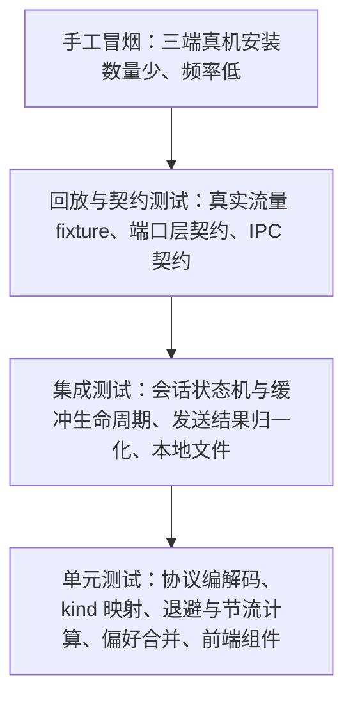

# 测试方案（Testing）

## 1. 总体原则

| 原则 | 说明 |
|---|---|
| 可观察行为优先 | 断言对外可观察的结果（归一化后的 `Message`、`SendOutcome`、文件内容与权限、界面行为），不断言私有函数调用次数或源码文本 |
| 边界优先 | 二进制包最容易出错的不是正常包，而是截断、嵌套、压缩损坏、超大解压、未知 `cmd`；这些必须有专测 |
| 不上真实网络 | 常规测试不连接 ac站；真实流量只通过「录制为 fixture 后重放」进入测试 |
| 凭证零泄漏 | 任何 fixture、快照、日志断言中都不得出现真实 `SESSDATA`、`bili_jct`、`DedeUserID`、`buvid3` |
| 确定性 | 时间、随机抖动、随机数与文件系统路径一律可注入或伪造，测试不做时序赌博 |

所有取值以 `docs/contract.md` 为准：测试不重复也不改写契约常量。

## 2. 测试金字塔



| 层 | 范围 | 工具 | 运行时机 |
|---|---|---|---|
| 单元测试 | 协议编解码、`cmd` → `kind` 映射、退避与节流计算、偏好合并、Zustand store、UI 组件 | `cargo test`；前端显示层纯逻辑 `node --test`（`vitest` / RTL 未引入，见 §9） | 每次改动后必跑 |
| 集成测试 | 会话状态机与缓冲生命周期、`SendOutcome` 归一化（经假适配器）、`config.toml` / `prefs.json` 读写 | `cargo test`（当前落位是各 `src/*.rs` 内联的 `#[cfg(test)] mod tests`） | 每次改动后必跑 |
| 回放 / 契约测试 | 真实流量 fixture 重放、端口层契约、IPC 契约 | `cargo test` + fixture 目录 | 每次改动后必跑（不使用真实凭证） |
| 手工冒烟 | 三端真机安装运行、登录、扫码、发弹幕、刷新、表情、举报、关注列表 | 人工按 §10 清单执行 | 每个阶段退出前，以及分发产物变更后 |

目录约定：协议与适配器测试放 `crates/danmubox-bili/tests/`，二进制 fixture 放同级 `tests/fixtures/`；会话、本地文件与端口契约测试放 `crates/danmubox-core/tests/`；前端测试与被测文件同目录，命名 `*.test.ts` / `*.test.tsx`。**三个 `tests/` 目录尚未创建**（仓库里没有 `crates/*/tests/`，也没有 `apps/desktop/src-tauri/tests/`）；在建立之前，新增测试按现有同文件内联写法落位（`#[cfg(test)] mod tests`）。

现有测试文件（实际落位）：

| 位置 | 文件 |
|---|---|
| `crates/danmubox-core/src/`（9 个 `.rs` 中的 6 个） | `bus.rs`、`config.rs`、`model.rs`、`paths.rs`、`prefs.rs`、`session.rs` |
| `crates/danmubox-bili/src/`（17 个 `.rs` 中的 16 个） | `admin.rs`、`asset.rs`、`auth.rs`、`cmd.rs`、`emote.rs`、`follow.rs`、`history.rs`、`http.rs`、`pb.rs`、`proto.rs`、`redact.rs`、`report.rs`、`send.rs`、`wallet.rs`、`wbi.rs`、`ws.rs` |
| `apps/desktop/src-tauri/src/`（2 个 `.rs` 中的 1 个） | `lib.rs` |
| `apps/desktop/ui/src/` | `aggregate.test.ts`、`filtering.test.ts`、`session-messages.test.ts` |
| `apps/desktop/ui/smoke/` | `run-headless.mjs`、`room-page.mjs`、`wkwebview-host.swift`、`scenario/fixtures.mjs`、`scenario/parts/*.mjs`（20 份：`00-mock` / `10-harness` / `20…36` / `90-epilogue`）、`fixtures/*.json`（10 份） |

无测试的文件：`crates/danmubox-core/src/{lib,ports,error}.rs`、`crates/danmubox-bili/src/lib.rs`、`crates/danmubox-cli/src/main.rs`、`apps/desktop/src-tauri/src/main.rs`。端到端验证落在 `apps/desktop/ui/smoke/`（目录结构与夹具出处见 §9.1，引擎门槛见 `AGENT.md` §9）。

## 3. 协议层测试（`danmubox-bili`）

现有落位：`crates/danmubox-bili/src/proto.rs`（12 条）、`cmd.rs`（38 条）、`ws.rs`（21 条）等文件的 `mod tests`。§3.2 的编号是清单契约，与现有用例不是一一对应；§3.3 的映射断言主要在 `cmd.rs`。

现有夹具位置：Rust 用例直接用 `include_str!` 读**无头冒烟那份** `apps/desktop/ui/smoke/fixtures/`，没有 crate 内的 `tests/fixtures/` —— `crates/danmubox-bili/src/http.rs:872-875`（`room-play-info.json` / `room-h5-info.json`）、`follow.rs:547-557`（`follow-getweblist-raw.json` / `follow-followings-raw.json` / `follow-status-raw.json`）。`cmd.rs:1096-1100` 只在注释里提到 `danmaku-rows.json` 的同款载荷，该用例的样本是代码内构造的。夹具是两侧共用的唯一来源，改夹具会同时影响 `cargo test` 与冒烟。

### 3.1 包结构断言基础

所有协议用例都基于同一套字节构造器：给「头字段 + body 字节」产出完整包，再交给解包器。断言对象是解包产出的事件序列与错误计数，而不是内部缓冲区状态。

包头字段布局、`protover`（载荷编码版本）与 `op`（包类型）的取值口径以 `docs/protocol.md` 为准，测试不重复；用例只按该口径构造字节并断言产出。

### 3.2 必须构造的 fixture 清单

| 编号 | 用例 | 构造方式 | 期望行为 |
|---|---|---|---|
| P-01 | 单包裸 JSON | `headerLen=16`，载荷版本 0，`op=5`，body 为一条 `{"cmd":"DANMU_MSG",...}` | 解出 1 条 `danmaku`，字段按契约 §5 填装 |
| P-02 | 单包内多个 JSON | 载荷版本 0，body 为两条 JSON 拼接（非标准但需容错） | 行为按解包器定义；若判定为非法则明确报错并计数，不得 panic |
| P-03 | zlib 单包 | 载荷版本 2，body 为 zlib(一条 JSON) | 解压后解出 1 条消息 |
| P-04 | brotli 单包 | 载荷版本 3，body 为 brotli(一条 JSON) | 解压后解出 1 条消息；与请求协商的载荷版本一致 |
| P-05 | 嵌套子包（一层） | 载荷版本 2，body 为 zlib(多个完整子包拼接)，子包载荷版本 0 | 循环按 16 字节头拆分直到消费完，逐个子包解出消息，条数与子包数一致 |
| P-06 | 嵌套子包（二层，混合编码） | 子包自身载荷版本为 2 或 3 | 递归解压子包，结果与把最内层 JSON 扁平拼接等效 |
| P-07 | 截断包（头部不足） | 只喂入若干字节（不足 16 字节） | 不报错、不 panic；等待更多字节；喂满后可正常解析 |
| P-08 | 截断包（body 不足） | `packetLen` 声明大于实际喂入字节 | 同上：保留缓冲等待续传；补齐后解析结果与一次性喂入一致 |
| P-09 | 头部非法 | `headerLen != 16`，或 `packetLen < 16`，或 `packetLen` 远大于合理上限 | 丢弃该包并计入协议错误计数；连接不中断 |
| P-10 | 坏压缩流 | 声明载荷版本 2 或 3，但 body 不是合法压缩流 | 报解码错误并计数；连接继续，后续合法包仍能解析 |
| P-11 | 超限解压保护 | 构造解压后体积超过 16 MiB 的包 | 丢弃该包并计数；不 panic、不 OOM；后续合法包仍能解析 |
| P-12 | WS 心跳包 | `op=2`，body 为字面量字符串 `[object Object]` | 编码结果字节与期望逐字节相等；解析侧对收到的 `op=2` 不产生消息 |
| P-13 | 认证包（登录态） | `op=7`，body JSON 含 `uid`、`roomid`、`protover`、`buvid`、`platform="web"`、`type=2`、`key` | 序列化后的字段名与取值与契约 §6 的认证包定义逐项相符 |
| P-14 | 认证包（游客态） | 同 P-13，但 `uid=0`、`key` 为空字符串 | 字段存在且取值为空，不省略 `key` |
| P-15 | 认证回应成功 | `op=8`，body `{"code":0}` | 会话状态机进入已认证，开始计时心跳 |
| P-16 | 认证回应失败 | `op=8`，`code` 为非 0 值（非 0 取值集合待实测，见 `protocol.md` 附录 A15） | 判定为认证失败，走重连退避；只记录原值，不为未知 code 赋予具体含义 |
| P-17 | 人气值包 | `op=3` | 更新房间热度类状态；不产生消息 |
| P-18 | 未知 `cmd` | `op=5`，JSON 中 `cmd` 不在契约 §5 映射表内 | 计入 unknown 计数并继续；不 panic、不产生错误级日志风暴 |
| P-19 | 空 body 包 | `packetLen=16`，无 body | 按无操作处理；不 panic |
| P-20 | 分片喂入 | 把 P-05 的字节按随机切分点分多次喂入（含每次 1 字节的极端切分） | 结果与一次性喂入逐条一致 |
| P-21 | `INTERACT_WORD_V2` protobuf 样本 | `op=5`，body 中 `data` 字段为 protobuf 的 base64 | 经 `prost` 解码后解出 `uid` / `uname` 等可映射字段，`kind=interact`；不因 protobuf 载荷报错 |
| P-22 | `DANMU_MSG_MIRROR` | `op=5`，JSON 中 `cmd` 为 `DANMU_MSG_MIRROR` | 默认丢弃并计数，不产生 `danmaku` |
| P-23 | 子包长度越界 | 子包声明的 `packetLen` 超出父包剩余字节 | 丢弃越界子包并计数；不 panic、不越界读 |

### 3.3 `cmd` → `kind` 映射全覆盖

契约 §5 映射表中的每条命令都至少有一个用例，断言：

| 断言点 | 内容 |
|---|---|
| `kind` 正确 | `DANMU_MSG` → `danmaku`；`SEND_GIFT` → `gift`；`SUPER_CHAT_MESSAGE` / `SUPER_CHAT_MESSAGE_JP` → `superchat`；`INTERACT_WORD` / `INTERACT_WORD_V2` / `ENTRY_EFFECT` → `interact`；`GUARD_BUY` / `USER_TOAST_MSG` → `guard`；系统类命令 → `system` |
| 非交易类 `amount` 为 0 | `danmaku` / `interact` / `system` 的 `amount` 必须为 0 |
| 缺字段容错 | 样本缺 `medal_name`、`guard_level` 等可选字段时取契约 §5 的默认值（0 或空串），不报错 |
| `local_id` 语义 | 同一次房内会话内单调递增且唯一；进程重启后从新起点重新分配 |
| `upstream_id` 保留原文 | 举报所需的标识原样保留，不由本地生成 |
| 徽标派生 | 主播由 `uid == Room.anchor_uid` 派生、房管取 `is_admin`、大航海取 `guard_level`；不依赖独立字段 |

字段取值口径未实测的部分不得在测试里硬编码臆测值：测试用 fixture 承载实测样本，fixture 更新即结论更新；未实测的取值一律进 [`protocol.md`](protocol.md) 附录 A 的「待实测校准」表，并写清核对方法与责任人动作。

## 4. 会话缓冲语义测试（`danmubox-core`）

会话缓冲的生命周期与上限见契约 §4.3。所有用例在测试内以可控时钟与自增序号驱动，不依赖真实连接。

| 编号 | 用例 | 做法 | 期望 |
|---|---|---|---|
| B-01 | 进入房间创建缓冲 | 连接某房间后查询 | 缓冲为空且与 `room_id` 绑定 |
| B-02 | 会话内追加与查询 | 注入 N 条后按 `limit` / `after` / `before` / `kinds` / `uid` / `q` 组合查询 | 返回当前会话消息；过滤语义与契约 §7 的 `history_query` 一致；空结果返回空集合而非错误 |
| B-03 | 弹幕档 5000 条上限丢最旧 | 注入 5001 条 `danmaku` | 条数为 5000；最旧的 1 条被丢弃，最新 5000 条保留 |
| B-04 | `history.buffer_rows_*` 覆盖 | 把某一档设为 100 后往该档注入 150 条 | 该档条数为 100；契约默认值不生效 |
| B-04.1 | 分档互不挤占 | 弹幕档 200 / 互动档 5：灌 200 条弹幕后灌 500 条互动 | 弹幕 200 条一条不少，互动只留最新 5 条（`interact_flood_does_not_evict_danmaku`） |
| B-04.2 | 礼物按金额分级（契约 §4.3） | 礼物档 1000（低 100 / 中 400 / 高 500）分别灌 5000 条 ≤0.1 元、600 条 1 元、20 条 138 元 | 三档各自留满自己那部分；高档一条不丢；`amount <= 0` 进中档（`expensive_gifts_are_kept_longer_than_cheap_ones` / `gift_tiers_split_by_amount_and_missing_price_rides_the_middle`） |
| B-04.3 | 归并回到达顺序 | 三种 `kind` 交替注入 30 条 | `snapshot()` 按 `local_id` 升序给出到达顺序（`snapshot_merges_lanes_back_into_arrival_order`） |
| B-05 | 离开房间销毁 | 有消息时断开连接或返回房间列表 | 缓冲清空；再查询返回空 |
| B-06 | 重进是新会话 | 离开后再次进入同一房间 | 旧消息不计入；`local_id` 从新会话起点重新分配 |
| B-07 | 手动重连不清空 | 有消息时触发 `rooms_reconnect` | 仍属同一次会话，条数不减；新收消息继续追加 |
| B-08 | 多房间隔离 | 两个房间各自注入消息 | 缓冲互不串流；查询只返回本房间 |
| B-09 | 进程退出即丢 | 重启进程后查询 | 缓冲为空（无落盘） |
| B-10 | 缓冲不落盘 | 运行期扫描数据目录 | 只存在 `config.toml` / `prefs.json` 及其副本，不产生任何消息数据文件 |

## 5. `SendOutcome` 判定测试（`danmubox-bili` + `danmubox-core` 归一化）

现有落位：`crates/danmubox-bili/src/send.rs` 的 `mod tests`（15 条）—— O-01（`success_is_ok` / `zero_code_without_marker_is_ok`）、O-02（`platform_swallow_maps_to_blocked_platform`）、O-03（`room_swallow_maps_to_blocked_room`）、O-07（`unknown_error_codes_are_failed_without_invented_meaning`）、O-08（`swallowed_content_is_read_from_the_extra_json_string` / `swallowed_content_is_none_when_absent_or_broken`）、O-09（`swallow_marker_wins_over_nonzero_code`）、O-10（`throttle_enforces_min_interval`）、O-11（`throttle_deduplicates_identical_content_within_window`），另有 `blocked_attempt_does_not_refresh_the_window`。O-04…O-06、O-12 尚无对应用例。

用假上游响应驱动发送链路（不连真实网络），逐态断言归一化结果。判定规则的实现是 `crates/danmubox-bili/src/send.rs::outcome_from_response`（`send.rs:36-53`）：**被吞标记优先于 `code`**，`msg` / `message` 为 `"f"` / `"k"` 分别落 `blocked_platform` / `blocked_room`，`code == 0` 落 `ok`，其余一律 `failed` 并原样带回 `code` 与 `msg`。当前实现只产出这四个取值；`rate_limited` / `medal_required` / `muted` 在枚举里保留（`crates/danmubox-core/src/model.rs:209-217`）但**上游对应 `code` 未实测**（`protocol.md` 附录 A17），O-04…O-06 的样本到位前不得硬编码臆测值。本地节流常量：`MIN_INTERVAL` 2 秒、`DEDUP_WINDOW` 5 秒（`send.rs:20-22`）。

| 编号 | 用例 | 做法 | 期望 |
|---|---|---|---|
| O-01 | 成功 | 上游返回 `code=0` | `ok` |
| O-02 | 被平台吞 | 上游响应 `msg` 或 `message` 为 `"f"` | `blocked_platform` |
| O-03 | 被直播间吞 | 上游响应 `msg` 或 `message` 为 `"k"` | `blocked_room` |
| O-04 | 频率限制 | 上游返回对应错误码（取值待实测，见 `protocol.md` 附录 A17） | `rate_limited` |
| O-05 | 粉丝牌等级不足 | 上游返回对应错误码（取值待实测，见 `protocol.md` 附录 A17） | `medal_required` |
| O-06 | 已被禁言 | 上游返回对应错误码（取值待实测，见 `protocol.md` 附录 A17） | `muted` |
| O-07 | 其他失败 | 上游返回未归类的错误 | `failed`，且必须携带原始 `code` 与 `message` |
| O-08 | 被吞回显提取 | 被吞响应的 `data.mode_info.extra` 为 JSON 字符串 | 从其中的 `content` 取出回显文本；`extra` 缺失或非 JSON 时不 panic |
| O-09 | 判定优先级 | 响应同时含 `"f"` / `"k"` 与一个一般错误码 | `blocked_platform` / `blocked_room` 优先于一般错误归类 |
| O-10 | 同房间节流 | 2 秒内第二次发送 | 本地拒绝，不产生第二次上游请求 |
| O-11 | 相同内容去重 | 5 秒内发送相同内容 | 本地去重，不产生重复上游请求 |
| O-12 | 未登录发送 | 无 `bili_jct` 时调用 `chat_send` | 返回明确失败，不发起上游请求 |

## 6. 本地文件测试（`danmubox-core`）

现有落位：`crates/danmubox-core/src/config.rs` 的 `mod tests`（14 条）与 `prefs.rs` 的 `mod tests`（16 条）；表中条目与现有用例不是一一对应（如 F-03 原子替换目前没有对应用例），逐条按表内「期望」列落位。

### 6.1 凭据文件 `config.toml`

| 编号 | 用例 | 做法 | 期望 |
|---|---|---|---|
| F-01 | 读写往返 | 按契约 §4.1 写入两个 profile（`[profiles.<name>]`）的七项凭据、改写 `active_profile` 后读回 | 各 profile 的值逐一相等，键名不变；`active_profile` 原样保留 |
| F-02 | 权限 | 新建与原子替换后检查属性 | 权限为 0600 |
| F-03 | 原子替换 | 写入过程中并发读 | 读到的要么是旧完整内容，要么是新完整内容，不出现半写文件 |
| F-04 | 启动顺序 | `active_profile` 指向的 profile 缺少 `sessdata` / `bili_jct` / `dede_user_id` 之一，或值为空 | 判为未登录，走扫码默认入口；另一 profile 有值也不改变结论 |
| F-05 | 登出清空 | 调用 `account_logout`（缺省 = 当前账号） | 当前账号的**账号级**凭据五项（`sessdata` / `bili_jct` / `dede_user_id` / `dede_user_id_ck_md5` / `sid`）变为空串，`buvid3` / `buvid4` 保留；账号条目保留（`accounts_list` 里该账号 `logged_in=false`）；其他账号不受影响；文件仍存在且仍为 0600 |
| F-06 | 不写非凭据内容 | 修改界面偏好 | 偏好转入 `prefs.json`；`config.toml` 的键集合仍只有 `active_profile` 与 `profiles.*` 下的七项凭据 |
| F-07 | 凭据不进日志 | 以 debug 级别运行并记录 | 日志中不出现任何凭据值；断言用关键词检索而非打印凭据本身 |

### 6.2 偏好文件 `prefs.json`

| 编号 | 用例 | 做法 | 期望 |
|---|---|---|---|
| F-08 | 默认值合并 | 文件缺失、或只含部分键 | 读返回全部键的生效值（默认值已合并） |
| F-09 | 部分键补丁 | 写入单个键 | 只改该键；未知键或非法值报 `BAD_REQUEST`；成功返回合并后的生效值全集 |
| F-10 | 原子替换 | 写入过程中并发读 | 不出现半写文件 |
| F-11 | 损坏回落 | 写入非法 JSON 后启动 | 按默认值启动，并保留损坏副本 `prefs.json.bak` |

## 7. 端口层与适配器契约测试（`danmubox-core`）

现有落位：`crates/danmubox-core/src/session.rs` 的 `mod tests` 里有三个只实现 `LiveSource` 的替身（`FakeSource` / `DroppingSource` / `CountingSource`，`session.rs:866`、`:1137`、`:1233`），C-01 / C-03 的口径已落在它们上；C-02 的依赖边界目前靠 `AGENT.md` §9 的 DoD 条目把关（依赖检查），没有自动化用例。

目标是证明 `core` 只依赖端口（trait），换掉 ac站适配器不影响核心；全部用例使用假适配器，不触及任何上游实现。

| 编号 | 用例 | 做法 | 期望 |
|---|---|---|---|
| C-01 | 假适配器跑通 core | 用只实现端口 trait 的假 `LiveSource` 投递事件 | 会话编排、缓冲、事件总线可完整运行，不引用任何 ac站字段 |
| C-02 | core 不依赖具体上游 | 依赖检查 | `core` 不依赖 `bili`、不依赖 `tauri`，且不含 ac站 URL / 字段下标 / 签名 / protobuf 定义 |
| C-03 | 事件总线不假设消费方是 UI | 以一个非 UI 的测试订阅者消费事件 | 事件契约与 UI 无关；测试订阅者可独立接收同一事件流 |
| C-04 | 端口方法覆盖 | 逐个端口 | `AuthProvider` / `LiveSource` / `DanmakuSender` / `DanmakuReporter` / `EmoteProvider` / `RoomAdmin` / `RoomCatalog` / `WalletProvider` 均有最小契约用例与失败路径（八个 trait 的定义见 `crates/danmubox-core/src/ports.rs:87`、`:124`、`:213`、`:229`、`:238`、`:257`、`:288`、`:294`） |
| C-05 | 换适配器不改 core | 用另一个假适配器实现替换 | `core` 的编排与测试无需改动即通过 |

## 8. 回放测试（录制真实流量）

现状：录制与重放链路**尚未实现** —— `crates/danmubox-cli` 没有录制开关，仓库里也没有 `fixtures/replay/` 目录。实现前不得按下面声明的产物写断言。

### 8.1 录制方法

| 步骤 | 操作 | 说明 |
|---|---|---|
| 1 | 以 `DANMUBOX_LOG=debug` 启动 `danmubox-cli` 并连接真实房间 | 日志级别为契约 §4 规定的环境变量 |
| 2 | 由 CLI 把收到的原始包与相对时间偏移写出到文件 | 写出的是**原始包字节**（base64）与相对时间偏移，而不是解析后的 JSON |
| 3 | 用 fixture 转换工具（测试辅助，属规划产物）把内容写成 fixture 文件 | 见 §8.2 格式 |
| 4 | 人工审阅并提交 fixture | 首条记录附带该房间的连接模式（游客 / 登录）与抓取日期 |

录制期间的心跳、重连、`getDanmuInfo` 交换都不进 fixture：fixture 只保留业务包与认证回应的收包字节，避免把一次性 token 带进仓库。

### 8.2 fixture 格式

| 字段 | 说明 |
|---|---|
| 文件头 | `mode` 取值为 `guest` 或 `logged-in`（录制时的登录模式）、`recorded_at=YYYY-MM-DD`、`encoding=brotli`（请求协商的载荷版本为 3；认证包在 body 里声明 `protover=3`，见 `crates/danmubox-bili/src/ws.rs:365-369`） |
| 每行 | `offset_ms` + 制表符 + `base64(原始包字节)`，`offset_ms` 为相对录制起点的毫秒偏移 |
| 命名 | 形如 `fixtures/replay/room-20260911-01.txt`，不出现真实房间号以外的个人信息 |

### 8.3 脱敏要求（硬性）

| 对象 | 处理 |
|---|---|
| `SESSDATA` / `bili_jct` / `DedeUserID` / `buvid3` | 一律不进入 fixture；录制流程天然不采集，提交前再做一次关键词检索复核 |
| 用户 `uid` / `uname` | `uid` 统一置 0，`uname` 替换为固定假名（如 `user_a`、`user_b`），同一原始用户保持同一映射以保证断言稳定 |
| 房间号 / 主播信息 | 允许保留房间号以保持样本可复现；`anchor_uid` 与标题若涉及个人信息则替换 |
| 复核方式 | 提交前对 fixture 目录检索敏感关键词；命中即修复，不得带着命中提交 |

### 8.4 重放方式

| 项 | 做法 |
|---|---|
| 重放驱动 | 测试按 fixture 的 `offset_ms` 构造虚拟时钟，把原始包序列喂给解包与会话状态机；不使用真实等待 |
| 断言 | 产出的事件序列与一份 golden 快照（归一化后的 snake_case `Message` 列表）逐条相等；`kind` 与关键字段必须一致 |
| golden 更新 | 快照变更必须在人工审阅 diff 后显式接受；解包行为变化导致 golden 变化时，先确认哪一侧是对的 |
| 用途 | 协议升级、重构解包器、`cmd` 目录扩充后的回归防线 |

## 9. 前端测试

前端测试用 `vitest` 加 jsdom 环境，mock `@tauri-apps/api` 的 `invoke` 与 `listen`；事件名断言覆盖契约 §7 的 `danmubox://message` / `danmubox://room` / `danmubox://session` / `danmubox://status` / `danmubox://send` / `danmubox://room_stats` / `danmubox://log`。

**现状**：仓库里**还没有** vitest（`apps/desktop/ui/package.json` 的 devDependencies 里没有它），F-01…F-11 里依赖 jsdom / RTL 的那几档仍是规划。已落地的前端单测是显示层纯逻辑的三份，用 **Node 自带的 `node --test` + 类型擦除**直接跑，不需要任何新依赖：

| 文件 | 被测模块 | 覆盖 |
|---|---|---|
| `apps/desktop/ui/src/aggregate.test.ts` | `aggregate.ts` | 弹幕聚合的纯逻辑（9 条）：折叠门槛（同键 + 窗口内至少 3 条、去重后至少 2 位不同观众）、窗口 5000 ms 且**非滑动**（锚点是这一行第一条）、条数上限 999 到顶封口、归一化正文与表情弹幕按 `emoticon_unique` 同键、空正文与本地乐观行不参与、关掉 `ui.danmaku_aggregate` 即原样返回入参 |
| `apps/desktop/ui/src/filtering.test.ts` | `filtering.ts` | 过滤 / 折叠 / 自动消失那一族（低价礼物两枚开关对两个区域都生效、四种机制都可逆且不丢内容） |
| `apps/desktop/ui/src/session-messages.test.ts` | `session-messages.ts` | 会话换代后的消息列表规则（同一条只入列一次、`history_query` 快照落地、会话重建后新消息不再被 `local_id` 判丢） |

```bash
cd apps/desktop/ui
node --test src/aggregate.test.ts
node --test src/filtering.test.ts
node --test src/session-messages.test.ts
node --test --test-name-pattern "两个区域" src/filtering.test.ts   # 只跑某几条
```

两条写法要求（Node 的类型擦除限制）：① 相对导入要**带 `.ts` 后缀**（`./filtering.ts`）——Node 不解析无后缀的 ESM 说明符；`tsconfig.app.json` 已开 `allowImportingTsExtensions`，tsc 与 vite 都照这个后缀解析。② 测试文件要在文件头写 `/// <reference types="node" />`：`tsconfig.app.json` 的 `types` 只有 `vite/client`（应用代码不该看见 Node 全局），三斜线引用只影响这一个编译单元。**新增的显示层纯逻辑测试按这个形态落**（名字仍是 `*.test.ts`，与被测文件同目录），等将来真引入 vitest 时再迁移。

| 编号 | 用例 | 做法 | 期望 |
|---|---|---|---|
| F-01 | store 行为 | 直接驱动 Zustand store 的 action（`api` 用桩替换，逐个放行回包以制造乱序） | 消息按 `local_id` 插入、过滤条件生效、多房间标签页切换后各自的列表与过滤状态独立；切房后**页面本地状态重置**（弹出面板 / 房管面板 / 右键菜单 / 举报条 / 房管确认条关闭，弹幕列表滚动与跟随回到初始），而输入草稿按「房间 + 身份」各留一份（`ui.md` §2.3、§6.5.1）。**乱序回包按目标复核**（`ipc.md` §8.1）：切房后晚到的 `history_query` 结果不覆盖当前列表、`seeding` 不被上一代提前撤掉、`rooms_list` 旧快照不回退连接态、`emotes_list` / 房管三块不落进别的房间、`chat_send` 结果与 `danmubox://send` 事件只在所属房间仍在前台时登记；并发切号以**最后点击的那一代**为准（账号列表「当前」与 `session.active_profile` 都落在它上面，晚到的一代不再重拉）；**换人**清掉表情库 / 「我的表情」/ 余额并把晚到的旧凭据身份挡掉；**断开连接**清掉该房间的身份快照与房管三块；**切房保留**该房间的身份快照 |
| F-02 | 六种 `kind` 渲染 | 分别渲染 `danmaku` / `gift` / `superchat` / `interact` / `guard` / `system` 样本 | 各自的结构化断言：普通弹幕含昵称/勋章/颜色；`superchat` 为醒目卡片；`guard` 体现舰长等级；`interact` / `system` 为弱提示样式 |
| F-03 | 虚拟列表窗口 | 注入大量历史行 | 常驻 DOM 行数不随注入总数线性增长；窗口滚动后离开视口的节点被回收 |
| F-04 | 自动滚动与暂停 | 位于底部、上滑暂停、点击「回到最新」 | 底部时新消息自动跟随；暂停后不跳回底部；按钮恢复跟随 |
| F-05 | 偏好往返 | 修改字号 / 透明度 / 过滤条件 | 经 `prefs_get` / `prefs_set` 读写并在重启后读回（用 mock IPC 断言往返） |
| F-06 | 发弹幕乐观更新与结果提示 | 模拟 `chat_send` 返回七种 `SendOutcome` | 成功时上游回播把权威字段换进**同一行**（节点不重建、看不出回播）；`blocked_platform` / `blocked_room` / `rate_limited` / `medal_required` / `muted` / `failed` 给出**可区分**的失败提示并可重试，被拒的那行**留在列表里**：正文划线 + 行尾写上游给的原因，草稿保留（乐观行本身与「别的客户端看到的我」渲染逐项相同，不留「发送中」那类中间态） |
| F-07 | 徽标渲染 | 渲染主播 / 房管 / 大航海样本 | 主播由 `uid == Room.anchor_uid` 派生、房管取 `is_admin`、大航海按 `guard_level` 展示 |
| F-08 | 礼物类消息的去向 | 切换 `ui.gift_in_danmaku` / `ui.gift_panel` 两枚开关的四种组合 | `ui.gift_in_danmaku` 开时礼物 / SC / 大航海混在弹幕流里；`ui.gift_panel` 开时这三类另进**与弹幕区上下分区**的独立礼物栏（一条一行、金额各组带单位，`ui.md` §5.4）；两枚都开是默认形态（同一批消息两处都渲染，`ui.md` §5） |
| F-08.1 | 上下分区的比例与顺序 | 拖动分割条、长按换位、改 `ui.gift_pane_ratio` / `ui.gift_pane_on_top` | 拖动实时改两栏高度（拖动中不写 store，松手写一次）、长按 0.5s 换位、两枚键持久化并在重启后读回；最小高度双向生效（弹幕区 ≥ 3 行、礼物栏 ≥ 折叠头）；`ui.gift_panel` 关掉时退化为弹幕区全高、分割条消失（`ui.md` §5.4；无头冒烟同款断言见 `smoke/scenario/parts/34-split-panes.mjs` 的 `splitter*` / `swap*`） |
| F-08.2 | 低价礼物（≤ 0.1 元）的折叠与统计剔除 | 勾上「辅助功能」里的「折叠低价礼物」/「剔除低价礼物统计」，**弹幕区与礼物栏两处**都放 0.09 / 0.10 / 0.11 元与没给价（`amount = 0`）四条礼物 | **两个区域**（弹幕区 + 礼物栏）各量一次：折叠让**两处**的低价礼物合成一条（`×N` 与金额是整桶合计，弹幕区那一处不画金额格），折叠头的统计逐字不变；剔除只改**折叠头**的「礼物 / SC（N）」与三组明细（统计面只有这一处），**两处的行都不动**；边界：0.09 / 0.10 算低价、0.11 与 0 不算；SC 与大航海不受两枚开关影响；两枚默认都关且持久化（`ui.md` §5.3、`contract.md` §8；无头冒烟同款断言见 `smoke/scenario/parts/35-cheap-gift.mjs` 的 `cheapGift*` 与 `switchScope*`，单测见 `src/filtering.test.ts`） |
| F-08.3 | **剔除 / 折叠 / 隐藏 / 自动消失都不丢内容、开关关掉即复原**（issue 2609171849 第 5 条） | ① 折叠开着时关掉它：**两个区域**各自逐条回来；② 剔除开着时关掉它：统计串逐字回来；③ 关掉 `ui.interact_auto_hide`：早先「消失」的互动行原样回来，再打开又不见；④ 关掉 `ui.gift_panel` / `ui.gift_in_danmaku`：被藏起来的那一批整批回来 | 这四种机制**都只是显示层的派生**——原始消息始终留在会话缓冲里（只受契约 §4.3 的上限约束），不得因它们提前消失。关掉后顺序、数量、金额与统计串逐项与开之前相同（`ui.md` §5.3「不丢内容 / 可逆」与 §4.8；单测 `src/filtering.test.ts` 第 2/3/5 条，冒烟 `switchScope*`） |
| F-08.4 | **刷屏弹幕聚合**（不同观众在同一窗口里发同一条弹幕折成一行） | 五档：同文本 + 3 位不同观众、不同文本、同文本但第一条落在窗口外、三位观众里有一位没头像、关掉 `ui.danmaku_aggregate` 再点回来 | ① 同文本 + 3 位观众：折成**一行**，身份位印「刷屏 ×3」（`db-msg-spam`）、头像列（`db-msg-avatar-col`）里画 `db-msg-avatar-stack` 的 3 张堆叠头像（沿 X 每张错开 30% 头像宽、后一张压在前一张上、**最左那张 z-index 最高**），身份位**不画**用户名（`db-msg-name`）与徽标（`db-msg-badges`）、行内**不画** `×N`（`db-msg-count` 只属于礼物连击与低价礼物桶）；② 不同文本：两行（只认同一个聚合键）；③ 第一条落在窗口外：三行（锚点是本行第一条，**非滑动**）；④ 一位观众没头像：头像列只画两张、只错开一次（空 `face` 的那位不画，错位按实画张数算，头像列本身照留宽）；⑤ 关掉开关：同样三条**逐条**显示（无「刷屏 ×N」、无堆叠层），点回来当场又折成一行。单测见 `src/aggregate.test.ts`（9 条）；无头冒烟同款断言见 `smoke/scenario/parts/25-aggregate-jump.mjs` 的 `aggregateBlockRan` / `aggregate*` 一组（`ui.md` §8.4 第二条、`contract.md` §8） |
| F-09 | 刷新按钮 | 在房间内点击「刷新」 | 发出 `rooms_reconnect`；已渲染的当前会话消息不被清空 |
| F-10 | 空态 / 错误态 / 未登录态 | 渲染三种状态 | 各自展示对应提示；未登录时发弹幕入口被禁用并提示登录 |
| F-11 | IPC 订阅生命周期 | 挂载、卸载组件并反复切房间 | 解绑后不再收到事件，监听器数量回到基线（无泄漏） |

### 9.1 房间页无头冒烟的目录结构与夹具出处（`apps/desktop/ui/smoke/`）

跑法（在 `apps/desktop/ui` 下）：

```bash
npm run build
node smoke/run-headless.mjs                    # Chromium（默认）：Chrome for Testing 走 CDP
node smoke/run-headless.mjs --engine webkit    # WebKit（宿主引擎）：Playwright，同一份场景 / 同一套断言
node smoke/run-headless.mjs --precheck         # 不启浏览器的预检闸（先 npm run build）
```

冒烟页 = 真实的 `dist` 产物 + 注入的 `__TAURI_INTERNALS__` 替身（假 IPC、假样本），跑完整房间页并断言几何与副作用。

**验证矩阵 = 2 引擎 × 2 视口 × 2 主题**（同一份场景代码、同一套断言）：

| 维 | 取值 | 口径 |
|---|---|---|
| 引擎 | Chromium（默认）/ WebKit（`--engine webkit`） | 应用跑在 macOS 的 WKWebView 里，**Chromium 的绿只证明「在 Chromium 里成立」**，宿主引擎不得缺席（`@property` 注册自定义属性、网格 `minmax()`、`em` 求值时机两边确有差异）；跑 WebKit 需一次性 `npm i -D playwright && npx playwright install webkit` |
| 视口 | 1440×900（宽屏）/ 360×844（窄屏） | 360 是窗口能达到的最小宽度，即可达面边界值；用 `Emulation.setDeviceMetricsOverride` 改设备指标，窄屏**不是**另写一套脚本 |
| 主题 | `SMOKE_THEMES`（默认 `dark,light`） | 写进 mock 的 `ui.theme` 并传进 `buildSmokeHtml(theme)`，深浅各跑一遍；`SMOKE_THEMES=dark` 只供单档调试，验收矩阵要求两档都跑 |

夹具分两类，**每一份都必须在文件头的 `_note` / `sources` 里写明自己是哪一类**——夹具是「能失败」的前提，出处不明的夹具等于把真实故障藏起来（`AGENT.md` §8 第 7 条）。

场景 = 一个薄组装器 + 按主题切的多个片段：

| 文件 | 作用 |
|---|---|
| `smoke/room-page.mjs` | **薄组装器 / 运行器**：拼出页内脚本；里面的 `BLOCKS` 有序清单就是运行顺序（顺序即语义） |
| `smoke/scenario/fixtures.mjs` | Node 侧：夹具 → 页内数据（**唯一**读 `smoke/fixtures/*.json` 的地方），序列化成页内的 `__SMOKE_DATA` |
| `smoke/scenario/parts/00-mock.mjs` | 页内 IPC 替身（`__TAURI_INTERNALS__`）与测试钩子（`__emit` / `__mk` / `__addRoom*` …） |
| `smoke/scenario/parts/10-harness.mjs` | 页内共享工具（`out` / `snap` / `byTestId` / `sleep` / `pressKey` …） |
| `smoke/scenario/parts/2x-3x-*.mjs` | 按主题切的场景块（`20…36`，共 17 份），**按文件名升序**依次执行 |
| `smoke/scenario/parts/90-epilogue.mjs` | 页内收尾（把 `run` 命令接上 `window.__smoke_run`） |

各 part 是**页内脚本的原文**（不是模板字符串里的字符串）：组装器 `readFileSync` 读出后原样拼接，所以片段里写反引号 / 反斜杠 / `${` 都与浏览器里一致 —— **不要**把它们塞回模板字符串。

场景块 → 覆盖主题（右列的块名即快照字段前缀；`out.*` 前缀与快照字段名一字未动）：

| part 文件 | 覆盖主题（块名 / 快照前缀） |
|---|---|
| `20-room-list.mjs` | `step1` / `follow` / `theme` / 主页边距 / 未开播取样 / 关注项排布与分页 |
| `21-room-header.mjs` | `step2` / `step3` / 房间头 / 状态点三态 / 图标规范 / 标题循环滚动 / 电池 / `layout` 的贴底与头像列 |
| `22-danmaku-rows.mjs` | `layout` 的弹幕行部分：排版取证 / 长 ASCII 串 / 表情渲染盒 / ＠ 高亮 / 身份行 / 悬挂缩进 / 头像 / 尺度 / 颜色 |
| `23-panels-layout.mjs` | 工具行 / 文档不滚动 / 面板只挤列表 / 表情面板（tab 轨道、行数、溢出、权限、切 tab 不关面板）/ 面板收起后跟随仍活 |
| `24-composer-send.mjs` | 发送失败浮片 / 乐观渲染与回执校验 / 粉丝牌只在亮着时画 |
| `25-aggregate-jump.mjs` | `aggregate` 弹幕聚合（`aggregateBlockRan` 与 `aggregate*` 一组：同文本三位观众 → 一行「刷屏 ×3」+ 3 张堆叠头像 / 不同文本 → 两行 / 窗口外 → 三行 / 缺头像 → 只画两张 / 关掉 `ui.danmaku_aggregate` → 逐条且点回来又折）/ 面板展开不弹走阅读位置 / 「回到最新」图标 / 我的表情 |
| `26-shortcuts-limits.mjs` | 点一下发 / 右键菜单 / `mention` / `limit` / `ime` / 超时兜底 / `time` 时间戳默认关 |
| `27-filter-panel.mjs` | `filter` 两块两列清单 / 七枚辅助开关（两列四行、每列 4 / 3 项，DOM 序 `0101010`；末一行只有「刷屏弹幕聚合」一格、落在左列）/ 标题层级 / 字号滑杆 / 对比度 / 时间戳位置 / `step4` `step5` `step6` |
| `28-gift-dock.mjs` | `gift` 礼物类去向 / 礼物栏一条一行与金额 / SC 卡片 / 礼物区与弹幕区同款 / 选中态全宽 / 分界线 / 两枚开关四组合 |
| `29-phrases-tabs.mjs` | 短语面板 / 断开与刷新连接 / `tabs` 多标签隔离 |
| `30-immersive.mjs` | 沉浸模式 |
| `31-admin.mjs` | `admin` / `panels` 五面板互斥 |
| `32-top-scroll-account.mjs` | 滚到顶部不被头部压住 / `account` 账号区与账号对话框 |
| `33-room-tabs.mjs` | 标签条：主播名与圆点 / 拖动排序 / 横向滚动 / 不画滚动条 |
| `34-split-panes.mjs` | `splitter` 分割条与长按换位 |
| `35-cheap-gift.mjs` | `cheapgift` / `switchscope` 两枚低价礼物开关 |
| `36-status-poll.mjs` | 开播 / 下播状态自动更新（实时事件 + 列表页周期） |

| 夹具 | 出处 | 覆盖什么 |
|---|---|---|
| `danmaku-rows.json` | **由真实载荷派生**：2026-09-12 应用真实运行的 debug 日志（`DANMU_MSG` 全槽位原样保留，昵称 / 牌名 / uid / 哈希段脱敏） | 弹幕行的排版、表情弹幕的固有尺寸、无空格长串的折行 |
| `emotes.json` / `follow-*-raw.json` / `follow-list.json` / `room-play-info.json` / `room-h5-info.json` | **由真实响应派生**：只读抓取的上游响应固化（脱敏口径见各文件 `_note`） | 表情分组与尺寸、关注列表（在播 / 未开播）、房间名与标题 |
| `gift-sc-guard-rows.json` | **按协议文档字段表构造**（`docs/protocol.md` §10.2 / §10.3 / §10.6），**不是**真实抓包派生——`AGENT.md` §8 第 16 条禁止为测试发送礼物 / 醒目留言 / 大航海，这类事件在本项目里拿不到授权样本 | 礼物 / SC / 大航海的**头像渲染**、独立礼物栏的**一条一行 + 金额（各组带单位）**、两枚显示开关的**四种组合**、SC **卡片**（档位令牌、金额行加粗）、礼物栏与弹幕区**同一套呈现**（行几何 / 底色逐项相等、SC 长留言不截断、跟随与「回到最新」同源）。其中 `superchat-low` 的正文**刻意写长**（40 个汉字）：360 宽下它必然折成两行，因此在旧礼物栏的单行布局里会被截断 —— 这条样本是「SC 显示不全」的复现件 |

夹具细则（写死在夹具与解析器里，改之前先读）：

1. `smoke/fixtures/danmaku-rows.json` 是**完整原始 `DANMU_MSG` 载荷**（正文弹幕 / 表情包弹幕 / 无空格长 ASCII 串），脱敏只做三件事：昵称 / 牌名 / 主播名 → **等长掩码**（CJK 与全角 → `＊`、ASCII → `x`）、`uid` / 哈希 → `<redacted>`、CDN 只脱敏哈希段；`emoticon_unique` 的房间号段 → `room_<redacted>_<id>`（**房间号不入库**）。
2. 冒烟侧 `messageFromDanmakuPayload()`（`smoke/scenario/fixtures.mjs:236`）照搬 `crates/danmubox-bili/src/cmd.rs::danmaku` 的取值路径派生成 `Message`（**不得另写一套解析**），只把图换成本地内联替身（固有尺寸与真图一致）；`local_id` 借 `__mk` 分配（`smoke/scenario/parts/00-mock.mjs:191`；store 只接受比末尾更大的 `local_id`，契约 §5）。
3. 关注列表夹具由真实响应派生：`follow-getweblist-raw.json`（直播侧只给在播）/ `follow-followings-raw.json`（主站关注关系）/ `follow-status-raw.json`（批量房间接口，含未开播）→ `follow-list.json`（70 条，`fixtures.mjs:203-205`），mock 里另加 **3 条自造条目**（在播 / 有标题 / 无标题各一，`parts/00-mock.mjs:126-130`）；脱敏口径与断言见 `protocol.md` A28。

构造类夹具的约束（写死在文件里，改夹具前先读）：

1. **只借字段名与语义，数值是布局用的假值**：昵称是自造假名、uid 是自造固定值、头像只写脱敏后的
   CDN 地址形状（冒烟侧换成本地内联替身，离线跑不到 CDN）。**不对上游取值作任何断言**，
   也不因为「看起来合理」就把它当成实测结论写进 `protocol.md`。
2. **没有头像源的字段就留空**：V1 礼物（`SEND_GIFT`）与大航海（`GUARD_BUY` / `USER_TOAST_MSG`）
   的字段表里都没有头像字段，夹具就写空串，界面据此不画假图——不允许「补一个看起来像的」。
3. **解析不在冒烟这一层**：`SEND_GIFT_V2` 的载荷是 protobuf，冒烟不解 `data.pb`（那是 Rust 侧的
   `cargo test`）；冒烟注入的是归一化后的 `Message`，验的是「字段到手之后画得对不对」。

**宿主引擎的旁证链路（系统 WKWebView 本尊）**：Playwright 的 WebKit 只是 WebKit 的一个构建，因此另有一条零构建差异的链路，跑同一个冒烟页、同一份快照：

```bash
cd apps/desktop/ui
npm run build && node smoke/room-page.mjs            # 生成冒烟页（默认 /tmp/danmubox-ui-smoke.html）
swift smoke/wkwebview-host.swift /tmp/danmubox-ui-smoke.html "$TMPDIR/wk-host" 1440 900 wide
swift smoke/wkwebview-host.swift /tmp/danmubox-ui-smoke.html "$TMPDIR/wk-host" 360 844 narrow
node smoke/run-headless.mjs --from-snapshot "$TMPDIR/wk-host/snapshot.json"
```

它是**旁证、不是主闸门**：没有显示会话时 rAF 不持续产帧（实测 2.2s 只触发 1 次），所以「跟随最新 / 虚拟列表窗口」这类按帧推进的断言会假失败——工具会把这条局限打在 stderr 上，别读成产品问题；**几何 / 尺寸 / 溢出 / 颜色**那一类成立，这正是它的价值（`--avatar` 那起事故就是靠它钉死的）。每次只跑一个视口；完整断言一律以 `run-headless.mjs --engine webkit` 为准。

### 9.2 冒烟与证据的常驻规矩

| 规矩 | 内容 | 落点 |
|---|---|---|
| ① **子 agent 不跑冒烟** | 全量无头冒烟由**主流程**在集成收尾时统一跑一次；子 agent 只跑**不启浏览器**的秒级闸（`npx tsc -b` / `npm run build` / `node smoke/run-headless.mjs --precheck` —— 预检里面已逐份做过 `node --check`，见 §9.1）与自己改动相关的机制级验证，并在交付里**明写「冒烟未跑」** | `AGENT.md` §9 DoD |
| ② **冒烟并行跑** | 每个 agent 各起**独立**无头浏览器、并行跑，不抢锁（旧的「同一台机上必须串行」**作废**）；并发压内存导致 WebKit `Target crashed` 可重试但上限 **1 次**，且必须**重跑整个场景**，两次都崩才报失败 | `AGENT.md` §9 |
| ③ **产物来源标记** | 被当作证据的产物必须能自证「属于本次运行」 | `AGENT.md` §9 |
| ④ **每 worktree 本地 `target`** | `CARGO_TARGET_DIR=$PWD/target`，**不得共享**（共享会让不同 worktree 的构建产物互相覆盖 → 假绿 / 假红） | `AGENT.md` §3 / §9 |
| ⑤ **运行器自保** | 每一步（CDP 调用 / 连调试端口 / 导航 / 起浏览器）都有超时；退出（正常、断言失败、`SIGINT` / `SIGTERM` / `SIGHUP`）必收自己起的进程组，启动前清掉上次的孤儿（只杀自己标记的 `ppid==1` 遗留物）。浏览器候选依次自检：`CHROME_BIN` → omp 自带的 Chrome for Testing → 系统 Chrome，起一台先拍一张 `about:blank` 验它真会产帧。截图是证据不是断言，产不出帧时告警并跳过 | `apps/desktop/ui/smoke/run-headless.mjs` |
| ⑥ **夹具要能失败** | 夹具从**真实载荷**派生（`smoke/fixtures/*.json`），**禁止手写 JSON**（`AGENT.md` §8 第 7 条）；样本尺寸必须与真图一致：头像用原图 **512×512**，表情用真实固有尺寸。构造类夹具的例外与约束见 §9.1 | `AGENT.md` §8 第 7 条 |
| ⑦ **改 Rust 的票必须真启动一次** | 真启动应用、确认存活 **≥ 10 秒**无 panic —— `cargo test` 与前端冒烟都挡不住「启动即崩」（`target` 口径见 ④；前端产物必须用 `tauri build` 产出，别用裸 `cargo build --release`） | `AGENT.md` §9 |
| ⑧ **改过冒烟场景就跑一次预检** | 在 `apps/desktop/ui` 下 `npm run build && node smoke/run-headless.mjs --precheck`（**不起浏览器**）：① 组装器 `room-page.mjs` 与**每一份**场景片段各 `node --check` 一次（片段是页内函数体的原文，查语法时包一层 async 函数）；② 每个主题各构造一次 HTML；③ 把拼出来的**内联脚本**（mock + 全部场景块）再编译一次，抓「拼起来才不合法」的错（片段被从中间切开、字符串没闭合），失败时带**源文件行号**（`组装结果第 N 行 = 某片段第 M 行`）直接退出。**只跑 `node --check smoke/room-page.mjs` 不算过** —— 组装器本身很短，场景在 `scenario/parts/**` 里 | `apps/desktop/ui/smoke/run-headless.mjs` |

③ 的执行口径（本仓库的产物命名与落点）：

| 类型 | 命名 / 路径 | 说明 |
|---|---|---|
| 前端冒烟截图 | `SMOKE_SHOT_DIR=/tmp/<票名>-shots`，文件 `danmubox-ui[-narrow]-<theme>-<场景>.png` | **主题后缀必须有**：同目录被两次运行共用时深浅两遍会互相覆盖。默认写 `$TMPDIR`；场景名：`-follow` / `-rooms` / `-short-content` / `-room` / `-admin` / `-admin-confirm` / `-account-area` / `-account` / `-account-qr` / `-toast` / `-optimistic` / `-final` |
| 前端冒烟日志 | `.android-env/verify/<票名>-<engine>.log` | 已用实例：`splitter-chromium.log` / `splitter-webkit.log`、`tabstrip-webkit-light.log`、`filtergrid-chromium.log` |
| Android 探针 | `.android-env/verify/<票名>-*.png` / `*.txt` / `*.log` | 已用实例：保活 `ka-*`、返回手势 `back-*`、脱敏对照 `redact-*.log`（出处 `operations.md` §5.3） |
| Rust 新增用例自证 | `cargo test -- --list \| grep <新用例名>` | 证明用例真的会被跑到（而不是被 `cfg` 掉或写错名字） |
| 桌面端运行日志 | `.android-env/verify/desktop-run*.log` | 启动存活 / panic 那一条的留证（`AGENT.md` §9） |

> `.android-env/` 整体**未跟踪**，且 `scripts/android-env.sh clean` 会连它一起删 —— 需要长期留存的证据先拷出去（`operations.md` §5.12）。

**判据：视口与渲染引擎都是产品的可达面**，不是测试的自由参数。新增「只在某些视口 / 引擎成立」的行为，必须先确认用户能到达它（窗口最小尺寸、断点、入口）；够不到就在报告里明说「该形态仅在某些视口成立、当前入口够不到」，不许当成已验证。两个反例（2026-09-12）：① 窄屏形态在无头视口里全绿，而窗口 `minWidth: 720` 让用户永远够不到它（现钉 360px，`ui.md` §9.1）；② 弹幕行把 `--avatar` 挪进 `.row` 后，行外共用的 `Avatar` 组件按原图 512 渲染，而样本把头像写成空串 / 32×32 小图，于是两个引擎都是绿的（**先怀疑引擎，但要用证据落地** —— 第二个反例的根因与引擎无关）。

### 9.3 新增断言块的写法（工程约定）

改冒烟场景时（`smoke/scenario/parts/**` 里任一主题块），新增或改动的断言块必须满足三条 —— 它们是**准入条件**，不是风格偏好：

| 条 | 要求 | 为什么 |
|---|---|---|
| ① **自包 `try/catch` + `xxxBlockRan`** | 块内任何一步（取元素、点击、读快照）抛异常都**只作废本块**，不许终止整场场景；`catch` 也必须走到 `snap()`。报告里某块 `...BlockRan=false` 时，该块的读数一律按**未验证**记账、不许当通过 | 一个块的前提不成立（如 `byTestId("db-account")` 只在列表页渲染、房间页必抛）不该带走整场场景与其它块的读数 |
| ② **准入前提自己保证** | 不许假定上一块留下的页面 / 主题 / 房间状态：需要列表页就先进列表页、需要某房间就先进那个房间、需要某主题就在块内确认 | 断言**前提**过期（找不到元素）会让整块恒假，读起来像实现坏了 |
| ③ **读数能自证归属本次运行** | 块名 / 断言名与产物落点按 §9.2 ③ 的命名口径，带批次或票号可追溯 | 见 §9.2 ③ |

> 两种会让**完全正确**的实现显示成红的写法：把「点了没反应」写成块级 `throw`（整场带走）；把「前提是 A 页」写成隐式假定（块恒假）。

**页内断言契约**（写进场景块时按这张表）：

| 项 | 规则 |
|---|---|
| 断言口径 | 只依赖**对外可观察**的行为：DOM 文本、`getBoundingClientRect` 几何、`Range.getClientRects()` 行盒、`getComputedStyle` 定位 / 滚动、IPC 调用记录。定位一律走 `data-testid`（`ui.md` §2.3 的稳定钩子），**不依赖 CSS 类名** |
| 快照即契约 | 快照字段名（`step*` 与 `layout*` / `row*` / `panel*` / `fixture*` / `follow*` / `send*` / `live*` / `emote*` / `admin*` / `narrow*` / `wide*` 等前缀）是断言契约，改名等于改断言。视口专属断言按 `narrow_*` / `wide_*` 命名：同一份场景两个视口都跑，**断言集合相同、没有例外名单**（面板在窄屏同样是文档流里的一块，所以 `layoutOnlyChatShrank` 与 `layoutNewestNotCovered` 在两边都必须为真） |
| 几何记账 | 行盒 / 身份行 / 正文行 / 折行行盒 / 表情图渲染盒与原图尺寸 / 横向溢出量逐项入快照（`fixtureTextRow` / `fixtureEmoteRow` / `fixtureAsciiRow` / `rowScale` / `layoutPanelScrollStablePx` 等）。判据是「量出来的」，不靠人眼：贴底间隙、三行昵称左边缘一致、徽标在昵称右侧且间距 = `--sp-1`、正文在身份行下方且左边缘与昵称一致、折行后每个行盒左边缘相等、头像顶边 = 身份行顶边、头像 1.25 / 身份牌 0.9 / 表情 1.1 × 行盒（`rowScaleCoherent`）、正文可用宽度 ≥ 视口一半（`fixtureTextBodyKeepsHalfViewport`）、表情图见方 + `contain` 且不随原图尺寸变。每条的具体断言名见 `ui.md` 对应节的「冒烟按 … 断言」 |
| 覆盖 | 逐条断言名写在 `ui.md` 对应节里，本表不再另列清单。横切面已覆盖：关注列表（自动加载 / 排序分页 / 两档排布 / 标签名）、账号区与对话框、面板只挤列表且不遮最新一条、右键菜单、时间戳、礼物类消息的两枚开关（四种组合）与独立礼物栏（一条一行 / 金额带单位 / 按 kind 分组的汇总 / 有源头像 / **与弹幕区同一套呈现**：`giftParity*` 一组逐项比行盒 / 头像列 / 身份行 / 正文块与两栏底色、SC 长留言不截断、`giftFollow*` / `giftPaused*` / `giftJumpButton*` 一组验跟随与「回到最新」同源，`smoke/scenario/parts/28-gift-dock.mjs:235-288`）、**弹幕区与礼物栏的上下分区**（拖分割条改比例并落盘、拖到极限时两栏最小高度成立、比例在重挂后保持、长按 0.5s 换位与三种取消路、关掉礼物栏后分区退化，`splitter*` / `swap*`，`parts/34-split-panes.mjs`）、醒目留言卡片（档位令牌 + 金额行加粗 + **卡片只盖内容部**：`scCard*` 一组，含 `scCardBelowIdentity` / `scCardOutsideAvatarCol` / `scCardHoldsBodyAndAmount` / `scCardRowUntouched`，`parts/28-gift-dock.mjs:177-193`）、**选中态整行底色全宽**（`rowSelect*` 一组：行盒左右边界对齐滚动容器、底色从最左到最右且盖住头像列、选中语义不变、松开即收回，`parts/28-gift-dock.mjs:350-453`）、**上下分区的分界线**（`foldLine*` 一组：虚线 + 令牌色 + 对画布 ≥ 3:1）、互动自动消失与系统类消息白名单、筛选面板的两块两列勾选清单（消息类型 / 辅助功能同形态、四枚辅助开关逐枚可切、干净环境下复选框画的即契约默认值）、历史与实时同款、贴底与头像列占位、粉丝牌真彩色与兜底色、本房间舰长标、主站「我的表情」、@ 目标与文本同源、房管权限前置与二次确认、行排版整体感、昵称不吃弹幕颜色（深浅两套各量一遍）、表情面板 tab / 尺寸 / 置灰、短语固定行、乐观发送与失败标记、窄屏无横向滚动与热区 ≥ 40px |
| 官方口径 | 「官方是怎么做的」这类判据（画不画一个徽标、走哪条渲染分支、哪种视觉细节）**去读官方前端产物**，或从浏览器直接对照官方页面 —— **不许凭印象模仿**。先例：A26 补充（表情权限判定）、A37（粉丝牌配色）、A39（舰长标取哪个字段）、A43（没点亮的粉丝牌不画）。判据落进规格时要写明它出自哪份产物 / 哪条分支，便于复核 |
| 维护约定 | 场景 = `smoke/scenario/parts/**` 里的**页内脚本原文**，由 `smoke/room-page.mjs` 按文件名升序拼接（见 §9.1）。**加一条断言**就改对应主题块；新起一块才要在组装器的 `BLOCKS` 里登记一行 —— 多登记少登记都会在构造页面时当场抛错 |
| 产物 | 命名与场景名见 §9.2 ③ |
| 失败判读 | 退出码非 0 时打印不成立的布尔字段名（带 `wide:` / `narrow:` 前缀）；`EXPECTED_FALSE` 里列的是「本来就该是 false」的字段（如系统类消息默认不在 `filter.kinds` 白名单里、因此 `system` 行默认不渲染）。实现见 `apps/desktop/ui/smoke/run-headless.mjs:53`（集合）与 `:889`（打印）、`:597`（宿主引擎快照） |

## 10. 三端手工冒烟清单

每步都可执行，且都给出预期结果；执行时逐步勾选并留证（截图或终端输出）。留证按 §9.2 ③ 的口径命名（截图走独立 `SMOKE_SHOT_DIR`、日志落 `.android-env/verify/<票名>-<engine>.log`），**一份证据要能自证是哪次运行产出的**。三端共用的前置条件：已构建产物、能访问网络、准备一个正在开播的真实直播间，以及一个可用于登录的账号。构建产物、签名 / 安装与工具链前置条件见 [`operations.md`](operations.md)（命令出处见 `README.md` §8，交付门槛见 `AGENT.md` §9）。

### 10.1 共用步骤

| 步骤 | 操作 | 预期结果 |
|---|---|---|
| C-1 | 启动应用 | 主界面可见，无白屏 |
| C-2 | 添加房间（短号或完整 URL） | 房间出现在列表，展示真实 `room_id` 与标题 |
| C-3 | 连接该房间 | 60 秒内界面出现弹幕 |
| C-4 | 点击房间内「刷新」按钮 | 长连接重建（`rooms_reconnect`）；刷新前后已收弹幕条数不减 |
| C-5 | 打开表情面板 | 表情按当前身份分组展示；选择后能填入输入框或发出 |
| C-6 | 登录后发送一条弹幕 | 真实直播间出现该弹幕；被吞 / 限流 / 等级不足 / 禁言分别给出可区分的提示 |
| C-7 | 举报一条弹幕 | 提交成功；失败时给出明确原因 |
| C-8 | 打开关注列表 | 直播中的房间置顶展示；从列表直接进场成功并开始收弹幕 |
| C-9 | 切换过滤器（用户 / 类型 / 粉丝牌等级） | 列表即时收敛为匹配项；清空过滤后恢复 |
| C-10 | 切换筛选面板「辅助功能」块的两枚礼物开关 | 两枚都开（默认）：礼物 / SC / 大航海既在弹幕流里、也在独立礼物栏里；只开弹幕那枚则礼物栏消失；只开礼物栏那枚则弹幕流里不再出现这三类；两枚都关则两处都不出现 |
| C-11 | 上滑暂停、点击「回到最新」 | 暂停期间不自动滚动；点击后回到最新并恢复跟随 |
| C-12 | 断开房间连接（房间头 `⋯` →「断开连接」） | 停止接收新弹幕；**本次会话结束、缓冲随之销毁** —— `history_query` 返回空；随后点「刷新连接」= 重建一次会话（缓冲从空开始，界面换成新会话的快照，`ui.md` §2.4）。契约 §4.3、`apps/desktop/src-tauri/src/lib.rs:380-392` |
| C-13 | 退出应用后重新进入同一房间 | 进程退出无残留；重进为全新会话，不显示上一会话的弹幕 |
| C-14 | 共享分区：拖分割条、长按换位、关掉礼物栏 | 拖动两栏之间的分割条：高度**实时**跟着走，松手后比例留在 `prefs.json`（`ui.gift_pane_ratio`），重开应用仍是这个比例；拖到极限时弹幕区不短于 3 行、礼物栏不短于它的折叠头（不压到 0、不溢出）；长按任一栏 0.5s 后拖到另一栏松手：两栏上下互换且 `ui.gift_pane_on_top` 落盘（拖回本栏或按 ESC 取消）；在筛选面板关掉「独立礼物栏」：礼物栏与分割条一起消失、弹幕区占满整块（`ui.md` §5.4）。鼠标与触摸各做一遍 |
| C-15 | 低价礼物两枚开关与互动自动消失：两个区域都生效、关掉即复原 | 在一个礼物不多的房间里先看基线：弹幕区与礼物栏各自把每条礼物画成一行。① 勾上「折叠低价礼物」：**两个区域**里低价礼物（≤ 0.1 元）各合并成一条（`×N` 与金额是整桶合计，弹幕区的合并行不画金额），0.11 元那条与 SC / 大航海两处都照旧一行；② 取消勾选：两处**逐条回来**，顺序、条数、每行金额与折叠头的统计都与基线一字不差；③ 勾上「剔除低价礼物统计」：统计（「礼物 / SC（N）」与分组明细）里不再有低价礼物，而**两个区域的行一条都不少**；取消后统计逐字回到基线；④ 互动消息满 8 秒从弹幕区消失后，取消勾选「互动消息自动消失」：**先前消失的那些行原样回来**（再勾上又不见）—— 消失只是不画，不是丢内容（`ui.md` §5.3、§4.8） |
| C-16 | 「我的直播间」区域（账号对话框底部）：**未开通不显示**、**双击前推流信息不入 DOM** | ① 用**没开通直播间**的账号（或游客态）打开账号对话框：`db-anchor-panel` **不在 DOM 里**（不是渲染成空块、也不报错；口径 `ui.md` §2.2.2）；② 用**已开通直播间**的账号打开：出现标题输入框（`db-anchor-title`）、状态文本（`db-anchor-status`）与开播 / 下播按钮（`db-anchor-live`），标题初值 = 该直播间当前标题，状态文案是 `直播中` / `轮播` / `未开播` 三选一；③ **不双击**状态文本时，`db-anchor-config`、推流地址与推流码**一个字都不在 DOM 里**（用元素检查或 `document.querySelector('[data-testid="db-anchor-config"]')` 确认，不是「看不见」）；④ 双击状态文本才展开 `db-anchor-config`，其中**当前分区**要与 web 端开播页看到的分区一致（**界面不提供分区选择**）；再双击收起，收起后推流信息又从 DOM 消失。**开播 / 下播是写操作**：只允许在**当次指定的、你自己当前账号的直播间**上点（`AGENT.md` §8 第 14–16 条 —— 失败即停、不重试）；开播成功后配置项里出现推流地址 / 推流码，下播后这两行连同推流码一起从 DOM 消失。上游非 0 code **原样显示在错误行**、不赋语义；**人脸认证那两个码（`60043` / `60024`）是唯一例外**：错误行下面出现引导块 `db-anchor-gate`（`FaceAuth` 给一枚「去完成人脸认证」入口、`QrConfirm` 就地画二维码），并提示「完成认证后再点一次开播」——**不弹窗、不轮询、不自动重试**（`ui.md` §2.2.2、`protocol.md` §18.5） |
| C-17 | 刷屏弹幕聚合开关（筛选面板「辅助功能」块的「刷屏弹幕聚合」，`ui.danmaku_aggregate`，默认勾上）：先取消勾选、再勾回来 | 勾上时：同文本的几条在窗口内折成**一行** —— 身份位印「刷屏 ×N」、头像列画出最多 3 张堆叠头像（每张沿 X 错开、左压右），行内**不**画 `×N`，不同文本仍是两行；取消勾选：同一批弹幕**逐条**显示（无「刷屏 ×N」、无堆叠层）；再勾回来：当场又折成一行。折叠只是显示层的派生，会话缓冲里仍是逐条（`ui.md` §8.4 第二条；无头冒烟同款断言见 `smoke/scenario/parts/25-aggregate-jump.mjs` 的 `aggregateBlockRan` / `aggregate*`） |

### 10.2 macOS 专属

| 步骤 | 操作 | 预期结果 |
|---|---|---|
| M-1 | 双击应用包启动 | Gatekeeper 不阻止（本地签名或 ad-hoc 策略见 [`operations.md`](operations.md)）；应用正常打开 |
| M-2 | 检查 `config.toml` 位置与权限 | 位于 `~/Library/Application Support/danmubox/`，权限为 0600 |
| M-3 | 完成 C-1 ~ C-16 | 全部通过 |

### 10.3 Windows 专属

| 步骤 | 操作 | 预期结果 |
|---|---|---|
| W-1 | 安装 / 运行产物 | 不白屏；若目标机无 WebView2，按 [`operations.md`](operations.md) 的说明先安装运行时 |
| W-2 | 检查 `config.toml` 位置与权限 | 位于 `%APPDATA%\danmubox\`，权限等价于仅当前用户可读写 |
| W-3 | 首次运行观察 SmartScreen | 出现警告时可按 [`operations.md`](operations.md) 的处理方式继续；不出现功能性阻断 |
| W-4 | 完成 C-1 ~ C-16 | 全部通过 |

### 10.4 Android 专属

| 步骤 | 操作 | 预期结果 |
|---|---|---|
| A-1 | `adb install` 安装 APK 并启动：`adb shell am start -W -n dev.kksk.danmubox/.MainActivity` | 安装成功；启动命令返回 `Status: ok`，并打印 `TotalTime` 与 `Displayed` 两行 |
| A-2 | 观察布局 | 无横向溢出、无控件被裁切；竖屏与横屏各看一遍。**系统栏避让**：顶栏（标题 / 主题按钮 / 房间页返回键）不与状态栏或刘海重叠，底部输入区与那排工具键不被手势栏遮挡（edge-to-edge 的 inset 由原生下发 `--safe-top` / `--safe-bottom`，实测数字见 [`operations.md`](operations.md) §5.3） |
| A-3 | 完成 C-1 ~ C-16 | 全部通过 |
| A-4 | 前台连续运行 30 分钟 | 期间持续收弹幕；无崩溃、无明显内存增长 |
| A-5 | 切到后台再回前台 | 连接按重连策略恢复并继续收弹幕；保活那一步单列在 A-9 / A-10（见 [`operations.md`](operations.md) §2.8） |
| A-6 | **登录验证（本项目不用相机）**：从账号入口发起扫码，界面在**本机显示二维码**，用**另一台设备**（另一台手机 / 平板 / 相机 App）扫它，确认后回到应用 | 二维码正常显示、轮询期间状态可见；确认后登录态变为已登录（重拉 `session_status` 得 `logged_in=true`）；失败给出可操作提示。**全程不出现相机权限申请**——扫码是「显示二维码给别人扫」，前端不调用 `getUserMedia`，也不声明相机权限 |
| A-7 | 反向确认没有多余权限 | 系统「设置 → 应用 → danmubox → 权限」里**看不到相机、位置、通讯录、存储**这类项；`aapt2 dump badging` 的 `uses-permission` 只应有四枚：`INTERNET`、`FOREGROUND_SERVICE`、`FOREGROUND_SERVICE_DATA_SYNC`（后台保活的三枚，见 A-9；**声明即得，没有弹窗**）与 `POST_NOTIFICATIONS`（Android 13+ 唯一的运行时权限，冷启动问一次） |
| A-8 | **系统返回手势**：房间页里从屏幕左边缘侧滑（`adb shell input swipe 0 <y> 600 <y>`，`y` 取屏中），再换右边缘（`1080 <y>` → `480 <y>`）；然后先开一个面板（如「筛选」）再侧滑；最后回到**根页面**（房间列表页、无面板）按返回 | 侧滑 → 回房间列表（**不**退出应用）；面板开着时侧滑 → 面板关掉、**不**跳页；根页面按返回 → 应用退出（`pidof dev.kksk.danmubox` 为空）。**左右边缘都要试**：返回手势归系统管，两侧是否都能返回由系统设置决定，界面只负责消费它。三级顺序见 [`ui.md`](ui.md) §2.6 |
| A-9 | **后台保活（有连接那一档）**：装好包后先给通知权限（`adb shell pm grant dev.kksk.danmubox android.permission.POST_NOTIFICATIONS`，等价于首启点「允许」）；进房间（如公开测试房间 `1`）等连接成功；按 HOME 退到后台，**等 ≥3 分钟**；期间查四项 —— ① 进程还在：`adb shell pidof dev.kksk.danmubox`；② 到 443 的长连还在：`/proc/<pid>/fd` 的 socket inode → `/proc/net/tcp{,6}` 里状态 `01`（ESTABLISHED）、远端端口 `01BB`；③ 通知在：`adb shell dumpsys notification --noredact` 里能看到渠道 `danmubox-keepalive` 与那条通知；④ `adb logcat` 无 `FATAL`、无反复重连刷屏。最后点通知回前台 | 四项都在；点通知回到应用后（= 走到 `onStart`）再查一遍：`dumpsys activity services` 里 `KeepAliveService` 消失、`dumpsys notification` 里那条通知消失、进程与连接**不受影响**（服务本身不碰网络）。行为与平台限制见 [`operations.md`](operations.md) §2.8 |
| A-10 | **后台保活（不该起的那两档）**：① 不打开任何房间（停在房间列表页）→ 按 HOME；② 开着房间，但在**根页面按返回**退出应用（A-8 的最后一档） | 两档都**不该**出现 `KeepAliveService`，通知抽屉里也不该有那条常驻通知（① 没连接；② `isFinishing`，用户是主动退出）。检查方式同 A-9 的 ③ |

### 10.5 Android：无真机时的验证边界

区分「模拟器已验到哪一步」与「哪些必须真机」；实测环境是本地 AVD `danmubox_verify`（pixel_6、1080×2400 @420dpi、`android-35` + `google_apis` + `arm64-v8a`，由 `scripts/android-env.sh` 创建）。**不得把模拟器上的绿当成整条链路的绿。**

**模拟器上已验**（命令、原始输出与产物路径见 [`operations.md`](operations.md) §5.3，落点 `.android-env/verify/`）：

| 项 | 结论 |
|---|---|
| 构建出带签名的通用 APK | `apksigner verify` 为 `Verifies`（v2 签名）；未签名的包 `adb install` 会失败（`INSTALL_PARSE_FAILED_NO_CERTIFICATES`） |
| 安装与启动 | `adb install` 成功；`adb shell am start -W -n dev.kksk.danmubox/.MainActivity` 冷启动读到 COLD `TotalTime` **1013ms**、`Displayed +1s13ms` |
| 崩溃 | 启动 / 进房 / 前台运行窗口内无 crash、无 panic；**例外**：用户点返回退出应用的那次优雅退出会在 teardown 阶段命中 `--------- beginning of crash` + `F libc: FORTIFY: pthread_mutex_lock called on a destroyed mutex`（见遗留登记表），其后紧跟 `Zygote: Process … exited cleanly (0)` 与 `ActivityManager: … has died`；`force-stop` 那一档不命中 |
| 数据目录落点 | 设备上出现 `/data/user/0/dev.kksk.danmubox/prefs.json`（`-rw-------`）——外壳注入的 `DANMUBOX_HOME` 生效（未注入时 core 会落到 `$HOME/.local/share/danmubox`） |
| 出网与进房 | 进公开测试房间 `1` 成功，HTTPS 出网正常（能拿到真实直播标题） |
| 系统栏避让（A-2 的前半） | 顶栏文本 / 主题按钮 / 房间页标题 / 输入区白底均不与状态栏（`[0,0][1080,128]`）或手势栏（`[0,2337][1080,2400]`）相交；**动的是页面排版，不是窗口**（应用窗口前后都是 `[0,0][1080,2400]`） |
| 软键盘（列表页输入框） | 键盘弹起时页面内容止于键盘上沿、无「pan + inset 双位移」——**只在小列表页的输入框上验过**；房间页那一档列在「必须真机」表 |
| 系统返回手势（A-8） | 左右边缘侧滑都回房间列表且进程不退；面板开着时侧滑只关面板、仍停在房间页；根页面按返回退出应用（`pidof` 为空）。**边缘那一条是系统手势区**（原生下发 `--gesture-left` / `--gesture-right`，两侧各 29.7 CSS px）：从边缘起手的返回会先把 DOWN 发给页面再 `cancel`，「点面板外关面板」因此要放过这一条，否则一次侧滑会变成「关面板 + 又退一级」两件事（见 [`ui.md`](ui.md) §2.6） |
| 界面目视 | 启动页 / 账号面板 / 房间页截图落在 `.android-env/verify/`（**该目录随 `clean` 一起删**，需要留存先拷出去） |
| **后台保活（A-9 / A-10）** | 退到后台 200 秒后进程在、`KeepAliveService` 为前台服务、常驻通知在、到 443 的 ESTABLISHED 仍在；拉长到 7.2 分钟仍成立；点通知回前台后服务与通知消失、pid 不变；**A-10 两档都为空**；通知权限的冷启动弹窗与 Android 15 `onTimeout`（6 小时额度缩成 60 秒）各实测一次（口径与结论见 [`operations.md`](operations.md) §2.8） |

**必须真机（或目前根本验不了）**：

| 项 | 为什么 |
|---|---|
| 收弹幕 | 本轮进房后 3.5 分钟内未观测到弹幕（公开测试房间可能未开播或是轮播）→ **弹幕链路在 Android 上属未验**，不得据此宣称已通 |
| 扫码登录（A-6） | 需要**另一台设备**扫屏上的二维码；本机不能自扫 |
| 发弹幕 / 举报 / 房管等写操作 | 依赖登录态，且受 [`../AGENT.md`](../AGENT.md) §8 的写操作边界约束 |
| 四个分 ABI 包的安装 | 本轮只装过通用包；`arm64` / `arm` / `x86` / `x86_64` 四份**均未安装验证** |
| 登录态下的房间输入区 + 软键盘 | inset 连 ime 一起算，但房间页输入框在未登录时禁用，**这个组合本轮没实测**（列表页那档已验），不得拿它推定 |
| 真机差异 | 厂商 ROM / 系统 WebView 版本、折叠与展开、真实触摸与输入法、I/O 与内存表现——模拟器都不等价（按 [`../AGENT.md`](../AGENT.md) §9，「可达面」包含真机形态） |
| 系统栏避让的真机形态 | 只在一台 AVD 上验过（手势导航、无挖孔）；**三键导航栏更高**、挖孔 / 刘海位置各机型不同，只有真机能覆盖这些形态 |
| A-4 / A-5 的完整口径 | 需要「有弹幕的直播间 + 真实前后台切换」，模拟器上只能验「不崩」，验不了「切后台回来还能持续收」 |
| **后台保活的收益（A-9 的 A/B）** | 模拟器上能证到「前台服务真的起着 + 进程没被冻结到不动」，但**证不到真机上的收益**：省电策略、内存压力下的回收、Cached Apps Freezer 的时机、以及**厂商 ROM 的后台管理**（MIUI / EMUI / ColorOS 等可能忽略前台服务、锁屏清理、要求单独开自启动白名单）都只有真机能覆盖 |

工具链本身可无痕清除后再重建（`scripts/android-env.sh clean` / `bootstrap`，见 [`operations.md`](operations.md) §5.12），因此「换一台开发机重来一遍」不需要真机即可走完到 A-1。

遗留登记（未决项由 [`roadmap.md`](roadmap.md) §2.1 / §2.2 承载）：

| 遗留 | 状态 |
|---|---|
| 退出应用时的 `FORTIFY: pthread_mutex_lock called on a destroyed mutex` | **未修**：成因未查（疑似 Rust 侧 teardown 阶段仍被触碰的已销毁锁）。证据：3 份退出日志各命中一次（`back-logcat.txt:899-905`、`logcat-v2.txt:1500-1506`、`v2-repro-backexit.log:341-347`），进程随后 `exited cleanly (0)`。**不得写成「零 crash」** |
| Android 侧业务日志入口 | **已定**：应用内的业务日志导出入口（房间头 `⋯` 里那一项）已随该功能整体删除（见 [`../CHANGELOG.md`](../CHANGELOG.md)），安卓侧只剩 `adb logcat` —— 现场日志按 §10.4 A-9 的 ④ 那一档的口径抓（`adb logcat -d` 落盘、`-s <TAG>` 收窄），不再有应用内的倒计时采集与导出 |

### 10.6 无头冒烟的已知偏差（**保留断言、不放松**）

本表登记「**断言是对的、实现确实还差一点**」的项。规矩：**不许**为了让套件变绿而放松或删掉这些断言；退出码非 0 时先对照本表，把已登记的条目与「新出的红」分开读。

| 断言 | 状态与去向 |
|---|---|
| `immersiveExitKeepsReadingPosition`（沉浸态里滚到中段再退出沉浸，当前阅读位置不许被弹回；容差 `< 8px`） | **已修**：`MessageList` 冻结视口时另记**滚动容器自己的顶边**，`ResizeObserver` 回调里按它的位移补 `scrollTop`；口径落进 [`ui.md`](ui.md) §7.3 第 5 行 |

**当前状态**：本表无未修项 —— `node smoke/run-headless.mjs` 在 Chromium 与 WebKit 两引擎、各四个视口组合上都是 `EXIT=0`、失败清单为空（各 3668 项快照 / 48 张截图，验证口径见 [`../CHANGELOG.md`](../CHANGELOG.md) 归档区）。

**不属本表的两类**（按定义排除，不进「已知的 N 条」）：① **冒烟自身的量法失效**（如标签的 `data-room-id` 是字符串而入参是数字 ⇒ 标签根本没点下去；取元素取到了已被改造成行内格的节点 ⇒ 两态都取不到）；② **期望值本身的字面量算术错**。逐条证据见 [`../CHANGELOG.md`](../CHANGELOG.md) 归档区；写法教训见 §9.3。

## 13. 明确不测的边界

| 不测对象 | 原因 | 替代手段 |
|---|---|---|
| 真实 ac站服务器的实时行为 | 不可控、有风控、需真实凭证 | 录制 fixture 重放 + 手工冒烟 |
| 举报 / 表情 / 关注列表 / 电池余额的上游端点行为 | **未做自动化覆盖**（举报只有手工跑通记录；与官方逐字一致与码集合枚举未实测，见 `protocol.md` 附录 A27） | fixture 契约测试 + 阶段 3 / 阶段 4 手工冒烟 |
| 直播视频流解码 | 非目标功能 | 不实现，故不测 |
| iOS 端与 Fold8 / 折叠屏 | 后期 enhancement，本期不纳入范围（折叠屏只做了可行性研究，**未实现**） | 触发后单独设计验收；现状、验证路径与「只能真机拍板」的缺口见 [`roadmap.md`](roadmap.md) §2.3 |
| 系统级悬浮弹幕层、通知推送 | 非目标功能 | 不实现，故不测。**后台保活已不在这一行**：`issue` 2609160959 #10 已实现（前台服务 + 常驻通知，见 [`operations.md`](operations.md) §2.8），验证边界见 §10.5 —— **模拟器已验、真机未验**；推送仍未做 |
| Tauri 框架本体与系统 WebView 渲染引擎 | 第三方实现 | 以最小冒烟覆盖「能启动、能渲染」 |
| UI 像素级视觉回归、跨平台字体渲染差异 | 自用项目，收益低 | 保留结构化渲染断言与人工目视 |
| 真实网络抖动与风控限流触发 | 不可复现 | 用可注入时钟测退避序列；现象记录进 [`protocol.md`](protocol.md) 附录 A 的待实测校准表 |
| 崩溃上报路径 | 本期不接入外部上报 | 不适用 |

## 14. 测试数据与安全

| 规则 | 内容与落点 |
|---|---|
| 凭证 / 日志断言 | 与 §1「凭证零泄漏」同一条：测试与 fixture 中不得出现真实 `SESSDATA`、`bili_jct`、`DedeUserID`、`buvid3`；自动化测试不注入真实凭证；断言日志不含凭证时用关键词检索而非打印凭证本身 |
| fixture 脱敏与提交前检查 | 与 §8.3 同一条：回放 fixture 按 §8.3 处理（同一用户在多条样本中保持同一映射）；提交前对新增 fixture 与快照做一次敏感关键词检索，命中即修复 |
| 写操作边界 | 只允许公开测试房间 `1`（5440）或当次明确指定的房间，一经指定不得更换，失败即停不重试；见 [`../AGENT.md`](../AGENT.md) §8 第 14–16 条。<br>**「我的直播间」（改标题 / 开播 / 下播，需求 §2.14）另有更窄的一条**：这类写操作**只对当前登录账号自己的直播间**生效 —— 目标房间由 `AnchorRoom::own()` 现取（`contract.md` §3），**上层不传房间号**，因此不存在「写到别人房间」的路径；失败即停，**不换房间 / 不换账号 / 不换参数重试**；上游非 0 code **原样带回、不赋语义**（`protocol.md` §18、附录 A66）；**唯一例外**是身份校验那两个码转成引导产出 `AnchorGate`（`protocol.md` §18.5）——引导**不触发任何自动重试**，认证完成后由用户自己再点一次开播 |
| 文档同步 | `docs/testing.md` 的作用 / 读者 / 更新时机登记在 [`../AGENT.md`](../AGENT.md) §6.5.1；阶段的验收标准与历史记录见 [`../CHANGELOG.md`](../CHANGELOG.md) |
